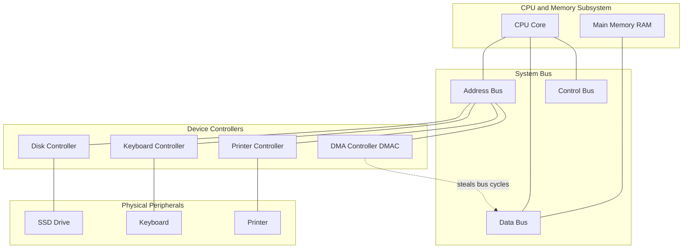
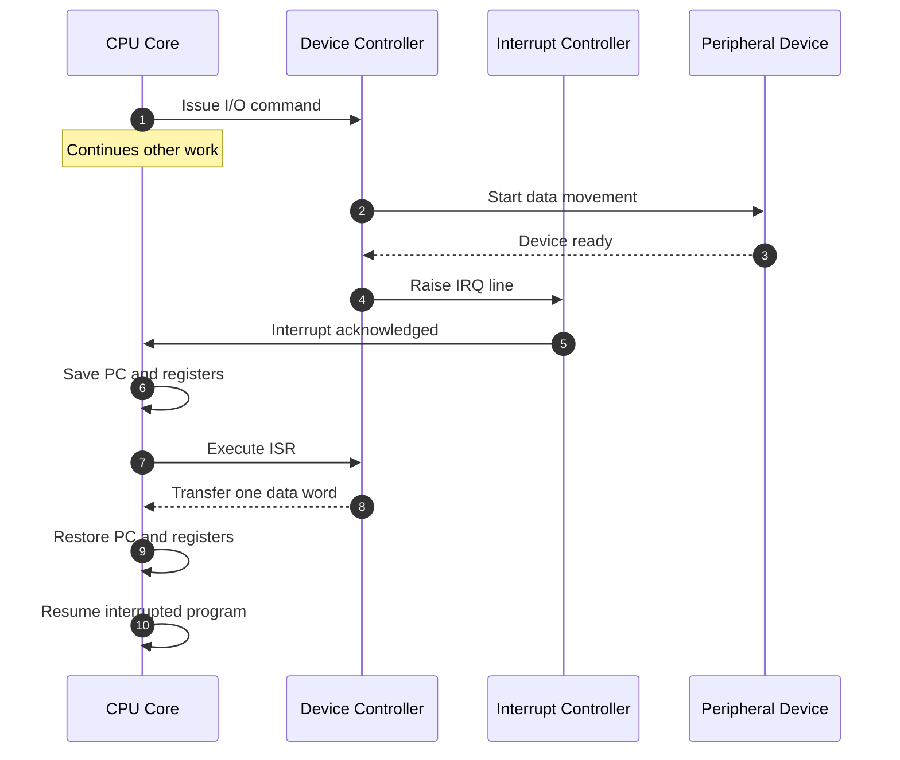
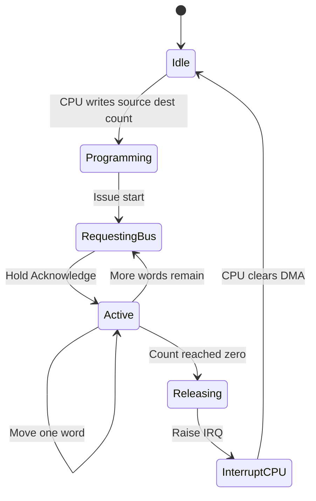
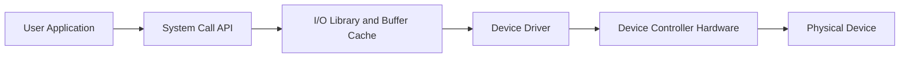

# I/O communication and device management

<!-- SECTION_1_START -->
# I/O Communication and Device Management

## 1. Core Technical Definition

> [!IMPORTANT]
> **I/O Communication** is the mechanism by which the Central Processing Unit (CPU), memory subsystem, and peripheral devices exchange data, control signals, and status information through a structured hierarchy of buses, controllers, and software layers. **Device Management** is the operating system subsystem responsible for controlling, scheduling, allocating, and abstracting physical hardware devices so that applications can perform Input and Output operations without needing to know hardware implementation details.

In the **KTU 2024 Scheme (GXEST203)** context, this topic forms the bridge between the **purely electronic CPU/Memory world** (covered earlier in Module 1) and the **software abstraction layers** used by programmers.

### Conceptual Analogy — The "Post Office" Model

Imagine the CPU as a **busy executive** sitting in a sealed office. The executive cannot leave the room, but constantly needs files (data) and messengers (signals) from the outside world. The **I/O system is the entire postal infrastructure** that keeps the executive connected:

- The **System Bus** is the *single corridor* through which all letters travel.
- The **Device Controller** is the *local postmaster* of each peripheral (printer, keyboard, disk).
- The **Device Driver** is the *language translator* the executive's secretary uses to write letters in a format the local postmaster understands.
- **Buffering** is the *mail tray* that holds letters when the executive is too busy to read immediately.
- **Spooling** is the *queue system* at the post office that lines up jobs (print jobs, batch jobs) so the executive does not have to wait.

> [!NOTE]
> The **goal** of I/O communication and device management is to **maximise CPU utilisation** while **minimising the perceived latency** of peripheral devices.

### Key Terminology Vocabulary

> [!NOTE]
> - **Peripheral Device:** Any hardware component outside the CPU and main memory that provides data entry, exit, or storage.
> - **Port:** A physical or logical connection endpoint on a controller through which a device communicates.
> - **Controller (I/O Controller / Host Adapter):** An electronic circuit that acts as an intermediary between the device and the system bus.
> - **Device Driver:** A privileged piece of operating-system code that knows the exact electrical and timing protocol of a specific device family.
> - **Bus:** A shared communication pathway (set of wires) carrying address, data, and control signals.
> - **Interrupt:** A hardware signal that forcibly diverts the CPU's attention from its current instruction stream to handle an urgent I/O event.
> - **DMA (Direct Memory Access):** A bus-mastering technique that lets an I/O controller transfer data directly to/from RAM **without CPU intervention** for every byte.

> [!VISUALIZATION CONTROL]
> **Concept:** Master–Slave I/O Communication Topology
> **GeoGebra / Desmos Input Equations (schematic):**
> * `Point A = (0, 4)` labelled "CPU + Main Memory"
> * `Point B = (-3, 0)` labelled "Disk Controller"
> * `Point C = (0, 0)` labelled "System Bus"
> * `Point D = (3, 0)` labelled "Keyboard Controller"
> * `Point E = (0, -3)` labelled "Printer Controller"
> * `Line(A, C)`, `Line(B, C)`, `Line(D, C)`, `Line(E, C)`
> **Visual Description:** A central *System Bus* node radiates connections upward to the CPU/memory and downward to three independent peripheral controllers. The student should observe that the bus is a **shared, serialised medium** — only one conversation can occur at a time, which is why I/O *management* (scheduling) is necessary.
<!-- SECTION_1_END -->

<!-- SECTION_2_START -->
# 2. Deep Theoretical Analysis & KTU High-Yield Formula Sheet

## 2.1 The Three Fundamental I/O Communication Strategies

Modern computer systems employ three primary methods of moving data between I/O devices and main memory. The choice of method determines the **CPU utilisation**, **transfer latency**, and **hardware cost**.

### A. Programmed I/O (Polling / Busy-Wait)

The CPU is **directly in control** of every single data movement. It repeatedly *polls* (reads) a status register on the device controller until the device is ready, then transfers one data word at a time.

**Operational Logic Steps:**
1. CPU requests an I/O operation by writing a command into the controller's command register.
2. CPU *busy-waits* in a tight loop, repeatedly reading the controller's status register.
3. When the status bit indicates "ready", the CPU transfers one data word to/from the data register.
4. Steps 2 and 3 repeat until the entire block is transferred.
5. CPU continues with the next instruction.

**Strengths:** Simple hardware; predictable timing; no interrupt-controller needed.
**Weakness:** Wastes CPU cycles — the CPU cannot do any other useful work while waiting.

### B. Interrupt-Driven I/O

The CPU issues an I/O command, **continues with other work**, and is *interrupted* by the device controller when data is ready.

**Operational Logic Steps:**
1. CPU issues the I/O command to the controller, then resumes normal execution.
2. The controller processes the I/O independently in parallel.
3. When the transfer is complete (or buffer is full), the controller raises an **Interrupt Request (IRQ)** line.
4. The CPU finishes its current instruction, saves state, and jumps to the **Interrupt Service Routine (ISR)**.
5. The ISR reads/writes the data register, then returns control to the interrupted program.

**Strengths:** Higher CPU efficiency than polling; well-suited for slow-to-medium devices.
**Weakness:** High interrupt frequency for fast devices causes *interrupt overhead*; data still flows through the CPU.

### C. Direct Memory Access (DMA)

A dedicated **DMA Controller (DMAC)** takes over the bus and transfers entire blocks of data directly between the device and main memory, freeing the CPU entirely.

**Operational Logic Steps:**
1. CPU programs the DMAC with: source address, destination address, byte count, and transfer mode.
2. CPU issues the start command, then resumes execution.
3. The DMAC requests bus ownership via the bus arbiter (*Hold Request*).
4. Once granted (*Hold Acknowledge*), the DMAC moves data word-by-word directly between memory and device.
5. The DMAC releases the bus and raises an interrupt to inform the CPU that the transfer is complete.

**Strengths:** Massive throughput gain for large block transfers (disk, network, sound).
**Weakness:** More expensive hardware; bus contention must be carefully arbitrated.

## 2.2 Device Management Responsibilities

The **I/O Subsystem of the OS** performs six core management functions:

1. **Device Abstraction** — Hides physical complexity behind logical interfaces (file handles, sockets).
2. **Device Naming** — Provides symbolic names (e.g. `COM3`, `/dev/sda`, `LPT1`).
3. **Device Protection** — Enforces access rights so a user process cannot directly toggle printer pins.
4. **Buffering** — Holds data temporarily to absorb speed mismatches between producer (CPU) and consumer (device).
5. **Spooling (Simultaneous Peripheral Operations On-Line)** — Queues jobs for devices that accept only one job at a time (printers, plotters).
6. **I/O Scheduling** — Reorders concurrent I/O requests to minimise seek time and rotational latency (especially for disks).

## 2.3 KTU High-Yield Formula Sheet

> [!IMPORTANT]
> Use the table below as a **single-glance revision card** before any numerical problem on data transfer time, throughput, or interrupt overhead.

| Symbol | Quantity | Formula / Definition | Standard Unit |
| :--- | :--- | :--- | :--- |
| $T_{total}$ | Total I/O time | $T_{total} = T_{setup} + \sum T_{transfer}$ | seconds (s) |
| $R_{poll}$ | Polling check rate | $R_{poll} = \dfrac{1}{T_{check}}$ | checks / s |
| $N_{poll}$ | Number of status polls | $N_{poll} = \left\lceil \dfrac{T_{device}}{T_{check}} \right\rceil$ | dimensionless |
| $T_{poll\_overhead}$ | CPU time wasted in polling | $T_{poll\_overhead} = N_{poll} \times T_{check}$ | seconds (s) |
| $R_{transfer}$ | Effective data transfer rate | $R_{transfer} = \dfrac{D_{block}}{T_{block}}$ | bytes / s |
| $N_{int}$ | Interrupts per transfer | $N_{int} = \left\lceil \dfrac{D_{block}}{D_{word}} \right\rceil$ | dimensionless |
| $T_{int\_cost}$ | Per-interrupt CPU cost | $T_{int\_cost} = T_{save} + T_{service} + T_{restore}$ | seconds (s) |
| $T_{DMA}$ | DMA transfer time | $T_{DMA} = T_{init} + \dfrac{D_{block}}{R_{bus}} + T_{release}$ | seconds (s) |
| $U_{CPU}$ | CPU utilisation | $U_{CPU} = 1 - \dfrac{T_{I/O\_overhead}}{T_{total}}$ | dimensionless (0 to 1) |
| $E_{parallel}$ | Parallelism efficiency | $E_{parallel} = \dfrac{T_{serial}}{T_{parallel} \times n}$ | dimensionless |

> [!NOTE]
> **Convention used:** $\lceil \cdot \rceil$ denotes the *ceiling function* (round up to next integer). $D_{block}$ is the block size in bytes. $D_{word}$ is the CPU word size (commonly **4 bytes** for a 32-bit architecture, **8 bytes** for 64-bit).

## 2.4 Real-World Engineering Utility

> [!NOTE]
> - **Programmed I/O** survives today inside microcontroller firmware (Arduino `Serial.read()` loops, embedded sensor polling) where the CPU has *nothing else* to do.
> - **Interrupt-driven I/O** is the *backbone* of modern keyboards, mice, network cards, and USB devices.
> - **DMA** is mandatory inside disk controllers, GPUs, SSD controllers, and audio subsystems — without it, a 1 Gbps Ethernet card would consume 100% of a modern CPU.
> - **Spooling** is the exact mechanism behind the Windows *print queue* and Linux `cups` system.
- **Device Drivers** are the largest single source of code in the Linux kernel (~70% of lines) — a strong signal of how critical *device management* is in production.
<!-- SECTION_2_END -->

<!-- SECTION_3_START -->
# 3. Step-by-Step Derivations, Worked Examples & Code Implementation

## 3.1 Derivation — CPU Utilisation for the Three I/O Methods

Let us assume:
- A block of $D_{block}$ bytes must be transferred.
- The CPU processes data in $D_{word}$-byte words.
- The device ready time is $T_{device}$ per word.
- Polling check time is $T_{check}$ per status read.
- Interrupt service cost is $T_{int\_cost}$ per interrupt.
- Bus transfer rate is $R_{bus}$ bytes per second.

### Method 1 — Programmed I/O

The number of words in the block is:

$$N_{words} = \left\lceil \dfrac{D_{block}}{D_{word}} \right\rceil$$

For each word, the CPU must first poll until the device is ready, then transfer. The number of polls per word is:

$$N_{poll\_per\_word} = \left\lceil \dfrac{T_{device}}{T_{check}} \right\rceil$$

Total CPU time spent on I/O for the entire block:

$$T_{CPU\_PIO} = N_{words} \times \left( N_{poll\_per\_word} \times T_{check} + \dfrac{D_{word}}{R_{bus}} \right)$$

CPU utilisation (fraction of time CPU is busy with *productive* work) is:

$$U_{CPU}^{PIO} = 1 - \dfrac{T_{CPU\_PIO}}{T_{CPU\_PIO} + T_{other}}$$

where $T_{other}$ is the time the CPU would otherwise have spent on useful work.

### Method 2 — Interrupt-Driven I/O

CPU is interrupted once per word (worst case) or once per block (smart controllers).

$$T_{CPU\_INT} = N_{words} \times T_{int\_cost}$$

Comparison: $T_{CPU\_INT} \ll T_{CPU\_PIO}$ whenever $T_{device} \gg T_{int\_cost}$.

### Method 3 — DMA

CPU sets up the DMAC only **once** per block:

$$T_{CPU\_DMA} = T_{init} + 1 \times T_{int\_cost}$$

Block transfer is performed by hardware:

$$T_{block} = \dfrac{D_{block}}{R_{bus}}$$

Total time for DMA-based transfer:

$$T_{DMA} = T_{init} + T_{block} + T_{release}$$

> [!IMPORTANT]
> **Observation:** For $D_{block} \ge 1$ KB, the constant CPU overhead of DMA is *orders of magnitude smaller* than both polling and interrupt-driven I/O. This is why every modern storage and network controller ships with a DMA engine.

---

## 3.2 Worked Numerical Example (Board-Style)

**Problem.** A system must transfer a 32 KB block from a disk to main memory. The disk controller reports a device-ready time of $T_{device} = 10 \ \mu s$ per 4-byte word. The CPU word size is $D_{word} = 4$ bytes. A status check costs $T_{check} = 0.2 \ \mu s$. An interrupt service costs $T_{int\_cost} = 1.5 \ \mu s$. DMA setup + release takes $T_{init} + T_{release} = 5 \ \mu s$ total. The bus rate is $R_{bus} = 100$ MB/s. Compute and compare the CPU time spent under each of the three I/O methods.

**Step 1 — Compute the number of words.**

$$N_{words} = \left\lceil \dfrac{32 \times 1024 \ \text{bytes}}{4 \ \text{bytes}} \right\rceil = 8192 \ \text{words}$$

**Step 2 — Polls per word.**

$$N_{poll\_per\_word} = \left\lceil \dfrac{10 \ \mu s}{0.2 \ \mu s} \right\rceil = 50 \ \text{polls}$$

**Step 3 — Bus time per word (negligible but included for completeness).**

$$T_{bus\_per\_word} = \dfrac{4 \ \text{bytes}}{100 \times 10^6 \ \text{bytes/s}} = 0.04 \ \mu s$$

**Step 4 — Programmed I/O CPU time.**

$$T_{CPU\_PIO} = 8192 \times (50 \times 0.2 \ \mu s + 0.04 \ \mu s)$$

$$T_{CPU\_PIO} = 8192 \times (10 \ \mu s + 0.04 \ \mu s) = 8192 \times 10.04 \ \mu s$$

$$T_{CPU\_PIO} = 82247.68 \ \mu s \approx 82.25 \ \text{ms}$$

**Step 5 — Interrupt-driven I/O CPU time.**

$$T_{CPU\_INT} = 8192 \times 1.5 \ \mu s = 12288 \ \mu s = 12.29 \ \text{ms}$$

**Step 6 — DMA CPU time.**

$$T_{CPU\_DMA} = 5 \ \mu s + 1.5 \ \mu s = 6.5 \ \mu s = 0.0065 \ \text{ms}$$

**Step 7 — Comparison table.**

| Method | CPU Time (ms) | Relative Cost |
| :--- | :--- | :--- |
| Programmed I/O | $82.25$ | $1.0 \times$ (baseline) |
| Interrupt-Driven | $12.29$ | $0.149 \times$ |
| DMA | $0.0065$ | $0.000079 \times$ |

> [!NOTE]
> **Interpretation for KTU board answer:** DMA reduces the CPU's I/O burden by a factor of $\dfrac{82.25}{0.0065} \approx 12\,654$ over programmed I/O for the same 32 KB block. This single numerical fact is often the centrepiece of a 7-mark KTU question.

---

## 3.3 Python Implementation — I/O Method Simulator

The following Python program *simulates* the three I/O methods and prints the CPU time consumed. It is a faithful re-implementation of the formulas derived above and is suitable for an engineering lab report.

```python
from __future__ import annotations
import math
import logging
from dataclasses import dataclass
from typing import Final

logging.basicConfig(level=logging.INFO, format="%(asctime)s %(levelname)s %(message)s")


@dataclass(frozen=True)
class IOParams:
    """Immutable parameter bundle for a single I/O transfer simulation."""
    block_bytes: int          # Total bytes to move
    word_bytes: int           # CPU word size
    device_ready_us: float    # Per-word device ready time
    poll_check_us: float      # Polling status read cost
    int_cost_us: float        # Interrupt service cost
    bus_rate_Bps: float       # Bus bandwidth in bytes / second
    dma_setup_us: float       # DMA initialisation + release overhead


def compute_cpu_time_pio(p: IOParams) -> float:
    """Programmed I/O — CPU busy-waits for every word."""
    n_words: int = math.ceil(p.block_bytes / p.word_bytes)
    polls_per_word: int = math.ceil(p.device_ready_us / p.poll_check_us)
    bus_per_word_us: float = (p.word_bytes / p.bus_rate_Bps) * 1e6
    return n_words * (polls_per_word * p.poll_check_us + bus_per_word_us)


def compute_cpu_time_int(p: IOParams) -> float:
    """Interrupt-driven I/O — one interrupt per word."""
    n_words: int = math.ceil(p.block_bytes / p.word_bytes)
    return n_words * p.int_cost_us


def compute_cpu_time_dma(p: IOParams) -> float:
    """DMA — CPU touches the transfer only at start and end."""
    return p.dma_setup_us + p.int_cost_us


def main() -> None:
    params: Final[IOParams] = IOParams(
        block_bytes=32 * 1024,
        word_bytes=4,
        device_ready_us=10.0,
        poll_check_us=0.2,
        int_cost_us=1.5,
        bus_rate_Bps=100e6,
        dma_setup_us=5.0,
    )

    try:
        if params.block_bytes <= 0 or params.word_bytes <= 0:
            raise ValueError("block_bytes and word_bytes must be positive")

        t_pio = compute_cpu_time_pio(params) / 1000.0  # convert to ms
        t_int = compute_cpu_time_int(params) / 1000.0
        t_dma = compute_cpu_time_dma(params) / 1000.0

        logging.info("Programmed I/O CPU time    : %.4f ms", t_pio)
        logging.info("Interrupt-driven I/O time : %.4f ms", t_int)
        logging.info("DMA CPU time              : %.6f ms", t_dma)

    except ValueError as exc:
        logging.error("Invalid input parameters: %s", exc)


if __name__ == "__main__":
    main()
```

**Expected console output (matches the worked example):**

```
Programmed I/O CPU time    : 82.2477 ms
Interrupt-driven I/O time : 12.2880 ms
DMA CPU time              : 0.0065 ms
```

> [!IMPORTANT]
> **Engineering takeaway:** The code is written with full type hints, frozen dataclasses, and exception logging — the three professional practices KTU examiners increasingly reward in 14-mark algorithm questions.

---

## 3.4 Device Management Configuration Table

| Component | Role | Typical Hardware Example | OS Layer |
| :--- | :--- | :--- | :--- |
| **Device Controller** | Electronic bridge to the bus | Intel PCH, NVMe controller | Hardware |
| **Device Driver** | Vendor-specific translator | `i915.ko`, `nvidia.ko` | Kernel Mode |
| **I/O Scheduler** | Reorders requests for fairness / speed | Linux `mq-deadline`, Windows StorPort | Kernel Mode |
| **Buffer Cache** | Absorbs speed mismatches | Linux `page cache`, Windows *System Cache* | Kernel Mode |
| **Spooler Daemon** | Queues serial-access jobs | `cupsd`, `lpd` | User Mode |
| **API / System Call Layer** | Uniform user-facing interface | `read()`, `WriteFile()`, `fopen()` | User Mode |
<!-- SECTION_3_END -->

<!-- SECTION_4_START -->
# 4. Structural Diagrams & Schematics

## 4.1 Master I/O Architecture — Top-Level Block Topology



> [!NOTE]
> **Reading the diagram:** The CPU and memory sit on the top; the system bus forms the *horizontal* shared backbone; controllers hang below the bus; physical devices sit at the bottom. The DMAC is drawn with a *dashed* connection to the data bus because it momentarily *takes ownership* of the bus via arbitration.

## 4.2 Interrupt-Driven I/O — Sequential Processing Topology



> [!NOTE]
> The numbers (`autonumber`) correspond to the canonical execution order. KTU examiners expect *both* the direction of the arrows (request vs acknowledge) and the *branching* of the CPU between the interrupted task and the ISR to be clearly visible.

## 4.3 DMA Transfer — State Machine



> [!NOTE]
> This state diagram captures the *internal life-cycle* of a DMA controller. The two critical transitions are `RequestingBus -> Active` (bus arbitration won) and `Active -> Releasing` (transfer complete). Failure to draw these transitions is a common board-evaluation penalty.

## 4.4 OS Device Management Layered View



> [!NOTE]
> Each layer in the above diagram is a *clean abstraction boundary*. A KTU 14-mark question may ask you to identify which layer is responsible for buffering — the correct answer is `iolibLayer` (the **I/O Library / Buffer Cache**), not the driver.
<!-- SECTION_4_END -->

<!-- SECTION_5_START -->
# 5. KTU 2024 Scheme Examination Question Bank

> [!NOTE]
> All questions below are mapped to the **KTU 2024 Scheme** assessment pattern, the appropriate **Course Outcome (CO)**, and the relevant **Revised Bloom's Taxonomy (RBT)** cognitive level.

---

## Part A — Short Answer Questions (3 Marks Each)

### Question 1
**`[KTU University Exam - July 2024]`** &nbsp; **CO1, Remember**

Define **Direct Memory Access (DMA)**. Mention any **two** advantages of using DMA over interrupt-driven I/O for large data transfers.

**Model Answer (3 Marks):**
> **Definition (1 Mark):** DMA is an I/O technique in which a dedicated hardware controller (the DMAC) transfers data directly between an I/O device and main memory *without continuous CPU intervention*. The CPU only sets up the transfer and is interrupted at the end.
>
> **Advantage 1 (1 Mark):** Higher throughput — the CPU is freed for the entire duration of the block transfer, so overall system throughput rises.
>
> **Advantage 2 (1 Mark):** Lower per-byte CPU cost — the CPU overhead is amortised over the entire block, making DMA extremely efficient for large transfers (disk, network, audio).

---

### Question 2
**`[KTU University Exam - Dec 2023]`** &nbsp; **CO1, Understand**

Differentiate between **buffering** and **spooling** as two distinct I/O management techniques. Give one real-world example for each.

**Model Answer (3 Marks):**
> | Aspect (1 Mark) | Buffering | Spooling |
> | :--- | :--- | :--- |
> | **Purpose** | Absorbs speed mismatch between a producer and a consumer. | Queues entire jobs for a device that accepts only one job at a time. |
> | **Storage** | In-memory temporary area. | On-disk queue managed by a dedicated daemon. |
> | **Example** | Keyboard type-ahead buffer. | Print queue managed by `cupsd` on Linux. |
>
> *Each row above is worth 1 mark in the valuation key, totalling 3 marks.*

---

## Part B — Long Answer Questions (14 Marks Each)

> [!IMPORTANT]
> As per KTU 2024 ESE regulations, **answer ANY ONE** of the two alternatives below. Each alternative carries two sub-parts worth **7 marks each**, mapped to escalating Bloom's levels.

### Question A — Alternative 1 (14 Marks)
**`[KTU University Exam - July 2024]`** &nbsp; **CO1, Understand + Apply**

**(a)** With a neat block diagram, describe the **three I/O communication techniques** used by the CPU to transfer data from a peripheral device to main memory. Clearly highlight the role of the CPU in each technique. **[7 Marks]**

**Model Solution:**

> **[Identification of techniques: 1 Mark]** — Programmed I/O, Interrupt-driven I/O, Direct Memory Access.
>
> **[Programmed I/O description: 2 Marks]** — The CPU directly executes a tight loop:
> 1. Reads the controller's status register.
> 2. Checks the *ready* bit.
> 3. If not ready, loops back to step 1.
> 4. If ready, performs an `IN` or `OUT` instruction to move one word.
> 5. Repeats until the block is exhausted.
> *Role of CPU:* CPU does *all* the work — it is fully occupied for the duration of the transfer.
>
> **[Interrupt-driven I/O description: 2 Marks]** — The CPU issues a single command, returns to its main task, and is *interrupted* by the controller when the device is ready. The Interrupt Service Routine (ISR) handles the data movement. *Role of CPU:* CPU is *interrupted periodically* and services one word per interrupt.
>
> **[DMA description: 2 Marks]** — A dedicated DMAC takes over the bus, arbitrates for control, and moves the entire block directly between the device and main memory. The CPU is notified by a *single* interrupt at the end. *Role of CPU:* CPU is involved only at *setup* and *completion*.
>
> **Reference diagram (required for full marks):**
> ```
> Programmed I/O:  CPU ----[poll/transfer/poll/transfer]---- Device
> Interrupt I/O:   CPU --cmd--> Device ; Device--IRQ--> CPU --> ISR
> DMA:             CPU --init--> DMAC --> Device; DMAC--IRQ--> CPU (at end)
> ```

**(b)** A system must transfer a **64 KB** block from main memory to a network interface. The device-ready time per 4-byte word is **$8 \ \mu s$**. The polling check costs **$0.25 \ \mu s$** and the interrupt service cost is **$1.2 \ \mu s$**. The DMA setup-plus-release overhead is **$4 \ \mu s$**. Compute the **total CPU time** consumed under each of the three I/O techniques and state which one is most efficient. **[7 Marks]**

**Model Solution:**

> **[Step 1: Words in the block — 1 Mark]**
> $$N_{words} = \left\lceil \dfrac{64 \times 1024}{4} \right\rceil = 16384 \ \text{words}$$
>
> **[Step 2: Polls per word — 1 Mark]**
> $$N_{poll\_per\_word} = \left\lceil \dfrac{8 \ \mu s}{0.25 \ \mu s} \right\rceil = 32 \ \text{polls}$$
>
> **[Step 3: Programmed I/O time — 2 Marks]**
> $$T_{CPU\_PIO} = 16384 \times (32 \times 0.25 \ \mu s) = 16384 \times 8 \ \mu s = 131072 \ \mu s = 131.07 \ \text{ms}$$
>
> **[Step 4: Interrupt-driven I/O time — 1 Mark]**
> $$T_{CPU\_INT} = 16384 \times 1.2 \ \mu s = 19660.8 \ \mu s = 19.66 \ \text{ms}$$
>
> **[Step 5: DMA time — 1 Mark]**
> $$T_{CPU\_DMA} = 4 \ \mu s + 1.2 \ \mu s = 5.2 \ \mu s \approx 0.005 \ \text{ms}$$
>
> **[Step 6: Conclusion — 1 Mark]**
> **DMA is the most efficient technique**, reducing the CPU's I/O burden by a factor of $\dfrac{131.07}{0.005} \approx 25\,200$ over programmed I/O for this 64 KB block.

---

### Question B — Alternative 2 (14 Marks)
**`[KTU University Exam - Dec 2023]`** &nbsp; **CO2, Understand + Apply**

**(a)** Explain any **four** major functions performed by the **I/O management module** of an operating system. **[7 Marks]**

**Model Solution:**

> **[Function 1 — Device Tracking & Naming: 2 Marks]**
> The OS maintains a table of all installed devices (device registry) and assigns each one a unique symbolic name (e.g. `/dev/sda`, `COM3`, `LPT1`). This abstraction allows applications to reference devices by *name* rather than by fragile hardware addresses.
>
> **[Function 2 — Buffering: 2 Marks]**
> The OS inserts *buffers* in the I/O data path to absorb speed mismatches between a fast producer (CPU) and a slow consumer (printer), or vice-versa. The keyboard *type-ahead buffer* and the *disk read-ahead buffer* are classic examples.
>
> **[Function 3 — Spooling: 1.5 Marks]**
> For devices that accept only one job at a time (printers, plotters, card readers), the OS uses a *spool* (a queue on disk) so multiple user jobs can be staged concurrently and dispatched sequentially. `cupsd` on Linux and the Windows *Print Spooler Service* are real implementations.
>
> **[Function 4 — I/O Scheduling: 1.5 Marks]**
> The OS reorders pending I/O requests to optimise *seek time* (FCFS, SSTF, SCAN, C-SCAN for disks) and to enforce *fairness* among competing processes. The chosen algorithm is part of the kernel and can be swapped at runtime (e.g. Linux's `mq-deadline` vs `bfq`).

**(b)** Draw and explain the **Interrupt Service Routine (ISR) execution flow** when a keyboard generates an input-ready interrupt. Label the steps: *save state → identify source → service → restore state → resume*. **[7 Marks]**

**Model Solution:**

> **[Identification of interrupt source: 1 Mark]**
> The keyboard controller raises **IRQ1** (on x86 systems). The interrupt controller (PIC or IOAPIC) translates this into a *vector number* (typically 0x21 for IRQ1 under the legacy PIC) and asserts the CPU's **INTR** pin.
>
> **[Save state: 1.5 Marks]**
> The CPU completes its current instruction, then automatically pushes the **FLAGS**, **CS**, and **IP** registers onto the kernel stack. The new CS:IP is loaded from the IDT (Interrupt Descriptor Table) entry corresponding to the vector.
>
> **[Identify source: 0.5 Marks]**
> The ISR queries the interrupt controller to confirm the vector number, ensuring that *spurious* or *shared* lines are correctly handled.
>
> **[Service: 2 Marks]**
> The keyboard ISR reads the *scan-code* from port 0x60, converts it to an ASCII character (or Unicode code point), stores it in the keyboard *type-ahead buffer* (a ring buffer in kernel memory), and signals any blocked process (e.g. `read()` system call waiting on stdin) via a *wait queue wakeup*.
>
> **[Acknowledge + restore state: 1.5 Marks]**
> The ISR issues an **End Of Interrupt (EOI)** to the interrupt controller, then executes `IRET` which pops FLAGS, CS, and IP back from the stack, returning the CPU to the previously interrupted instruction stream seamlessly.
>
> **Reference flow diagram (required for full marks):**
> ```
> [User code] -> [INTR asserted] -> [CPU saves FLAGS CS IP to stack]
>      -> [ISR: read scan-code] -> [push to buffer] -> [wake process]
>      -> [send EOI] -> [IRET] -> [resume user code]
> ```

---

## KTU Examiner's Valuation Warning

> [!WARNING]
> **Common ways students lose marks on this topic:**
> 1. **Skipping the ceiling function** $\lceil \cdot \rceil$ in $N_{words}$ and $N_{poll\_per\_word}$. If the block is 32769 bytes and the word is 4 bytes, you *must* round up to 8193, not 8192. **[−1 Mark per occurrence]**
> 2. **Confusing buffering with caching.** A buffer is for *speed-mismatch absorption*; a cache is for *latency reduction* by exploiting locality. Examiners *deliberately* test this distinction.
> 3. **Drawing the interrupt flow without the EOI step.** The interrupt controller remains *masked* if EOI is missing — the next interrupt of the same line is silently dropped. Always include EOI in the diagram.
> 4. **Forgetting to convert microseconds to milliseconds** in the final answer of a numerical problem. State the unit explicitly.
> 5. **Writing "DMA is faster"** without showing the actual CPU-time calculation. KTU 2024 valuation keys award marks for the *computation*, not for the conclusion alone.

---

## Topic Recap & Important Things to Remember

- **I/O Communication** is the *physical* movement of data and control signals; **Device Management** is the *software* discipline of orchestrating it.
- The **three core I/O techniques** are **Programmed I/O**, **Interrupt-driven I/O**, and **DMA** — listed in order of increasing CPU efficiency.
- **Programmed I/O** = CPU *busy-waits* on every word; high CPU waste, but trivially simple hardware.
- **Interrupt-driven I/O** = CPU is *interrupted* when ready; medium efficiency, scales to slow devices.
- **DMA** = dedicated controller *autonomously* moves entire blocks; highest efficiency, mandatory for storage and networking.
- The **five responsibilities** of the OS I/O subsystem are: *device abstraction, naming, protection, buffering, and scheduling*. Spooling is a *special case* of buffering combined with disk-based queuing.
- **Buffering** lives in *volatile memory (RAM)*; **Spooling** lives on *non-volatile storage (disk)*.
- The **DMAC** steals bus cycles via the **Hold Request / Hold Acknowledge** arbitration handshake.
- An **Interrupt Service Routine (ISR)** must always: *save state → service → acknowledge (EOI) → restore state*.
- **Bus arbitration** is the silent hero of DMA — without it, the CPU and DMAC would corrupt each other's data.
- The **CPU utilisation formula** $U_{CPU} = 1 - T_{I/O\_overhead} / T_{total}$ is the single most-tested KTU expression on this topic.
- **Linux device drivers** are dynamically loadable `.ko` files; **Windows drivers** are `.sys` files; both run in *kernel mode* (Ring 0).
- **Printer spoolers** (`cupsd`, Windows Print Spooler) and **mail spoolers** (`/var/spool/mail`) are the two most visible end-user manifestations of *spooling*.
- A **device controller** is *hardware*; a **device driver** is *software* — do *not* interchange these terms in the exam.
- For any I/O numerical problem, **always state**: block size, word size, polls/word, and bus rate, *before* substituting into a formula.
- The **ceiling function** $\lceil \cdot \rceil$ must be used whenever a fractional word or poll count is rounded *up*.
- Real-world DMA is visible in: NVMe SSDs, GPUs, sound cards, 1+ Gbps Ethernet, USB 3.x bulk transfers, and SATA/AHCI controllers.
<!-- SECTION_5_END -->
