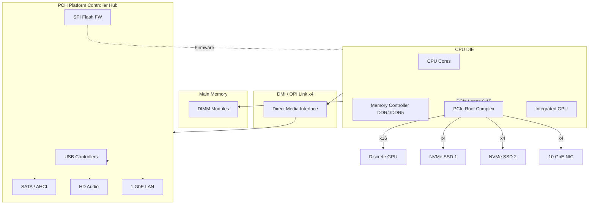
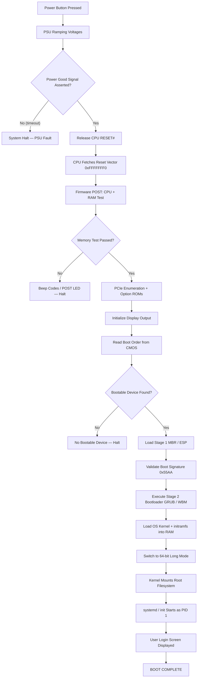
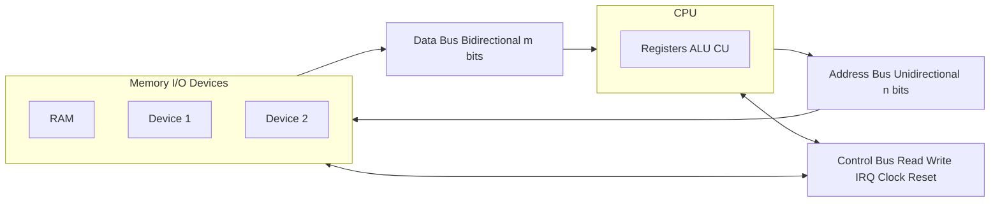
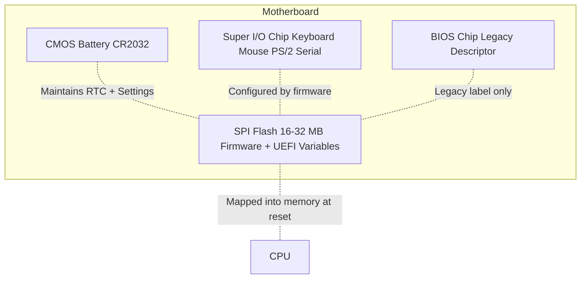

# Interface cards – Buses – Firmware - Boot process

<!-- SECTION_1_START -->

# 1. Core Technical Definition & Intuitive Overview

## 1.1 Interface Cards (I/O Cards / Expansion Cards)

### Formal Definition
An **Interface Card** (also called an *Expansion Card*, *Adapter Card*, or *Peripheral Component*) is a printed circuit board (PCB) that is inserted into an expansion slot on the motherboard of a computer to add functionality or to provide a physical interface between the system bus and a peripheral device. Interface cards act as **translators** between the CPU/memory subsystem and external devices.

> [!IMPORTANT]
> **KTU Syllabus Highlight:** Interface cards are the bridge between the **CPU's binary logic world** and the **analog/electromechanical world** of peripherals (monitor, keyboard, network, storage).

### Conceptual Analogy
Think of a computer as a **large office building**:
- The **CPU** is the CEO's office.
- The **System Bus** is the elevator and hallway system.
- An **Interface Card** is like a **dedicated receptionist** stationed at a particular floor. The receptionist speaks two languages — the internal company language (binary/machine code) and the external client's language (HDMI, USB, Ethernet signals). Without the receptionist, the CEO cannot communicate with outside clients.

### Categories of Interface Cards

| Card Type | Function | External Port | Standard |
| :--- | :--- | :--- | :--- |
| NIC (Network Interface Card) | Connects to LAN/Internet | RJ-45 Ethernet Jack | PCIe, IEEE 802.3 |
| GPU (Graphics Processing Unit) | Renders visual output | HDMI, DisplayPort, VGA | PCIe x16 |
| Sound Card | Audio processing | 3.5 mm Jack, S/PDIF | PCIe, AC'97, HD Audio |
| USB Controller Card | Manages USB ports | USB-A / USB-C | PCIe, USB 3.0/3.1/4.0 |
| RAID Controller | Manages disk arrays | SATA / SAS | PCIe |
| Modem Card | Dial-up / DSL connectivity | RJ-11 | PCI (legacy) |
| TV Tuner Card | Receives broadcast TV signals | Coaxial RF input | PCIe |

> [!NOTE]
> Modern CPUs often integrate some controllers directly into the chipset (e.g., integrated graphics in the CPU die). Dedicated interface cards are still preferred for **high-performance**, **parallel**, or **specialized** workloads.

---

## 1.2 Buses

### Formal Definition
A **Bus** is a **shared communication pathway** consisting of a set of parallel conductors (wires/traces) that transfers data, addresses, and control signals between components of a computer system (CPU, memory, and I/O devices). It is essentially a **highway of wires** operating under a strict protocol.

### Conceptual Analogy
Imagine a **multi-lane road**:
- The **Data Bus** is the number of lanes — more lanes = more cars (bits) moving at once.
- The **Address Bus** is the **house number system** — it tells the bus *where* data should go.
- The **Control Bus** is the **traffic signals** — they tell everyone *when* to go, stop, read, or write.

### The Three Classical Bus Types

> [!IMPORTANT]
> **KTU Critical Definition (Von Neumann Architecture):** Any computer system has three logically distinct buses.

1. **Data Bus** — Carries the **actual data** (the payload) between components. **Bidirectional.** Width determines how many bits transfer per cycle (e.g., 32-bit, 64-bit).
2. **Address Bus** — Carries the **memory location** of where data is going to or coming from. **Unidirectional** (CPU → Memory/I/O). Width determines the maximum addressable memory.
3. **Control Bus** — Carries **timing and command signals** (Read/Write, Interrupt, Clock, Reset, Bus Request, Bus Grant).

### Modern Bus Architecture (Hierarchical)
Modern computers do not use a single monolithic bus. They use a **layered hierarchy**:

| Bus Level | Examples | Speed | Purpose |
| :--- | :--- | :--- | :--- |
| **Internal / CPU Bus** | Front Side Bus (FSB — legacy), QuickPath Interconnect (QPI — Intel) | Very high | CPU ↔ Northbridge / Memory Controller |
| **System / I/O Bus** | PCIe, PCI, AGP | High | High-speed I/O cards |
| **Peripheral Bus** | USB, SATA, Thunderbolt | Variable | External/Internal peripherals |

> [!VISUALIZATION CONTROL]
> **Concept:** The Von Neumann three-bus model
> **GeoGebra / Desmos Input Equations:**
> * `Address lines: a_n = 1, a_(n-1) = 0, ..., a_0 = 0` (binary address on bus)
> * `Data lines: d_n, d_(n-1), ..., d_0` (parallel bit transfer)
> **Visual Description:** A horizontal 3-row diagram showing the Address Bus on top (unidirectional arrows → Memory), Data Bus in the middle (bidirectional arrows), and Control Bus at the bottom (control signals ↔). The CPU sits on the left; Memory and I/O sit on the right.

---

## 1.3 Firmware

### Formal Definition
**Firmware** is a specific class of software that is **permanently programmed into non-volatile memory** (ROM, PROM, EPROM, EEPROM, or Flash memory) of a hardware device. It provides the **low-level control instructions** for the device's hardware and serves as the **intermediary bootstrap layer** between the hardware and higher-level operating system software.

### Conceptual Analogy
Think of firmware as the **innate reflexes of a newborn baby** — before the baby can think (load an OS), it already knows how to breathe, cry, and grasp. Likewise, before the computer can "think" (run Windows/Linux), the firmware already knows how to initialize the motherboard, test memory, and look for a boot device.

### The Two Generations of PC Firmware

> [!IMPORTANT]
> **KTU Syllabus Highlight:** Students must clearly distinguish between **BIOS** and **UEFI**.

1. **BIOS (Basic Input/Output System)** — Legacy firmware (1975–present). Uses **16-bit mode**, **MBR (Master Boot Record)** partitioning, max boot drive **2.2 TB**. Text-based interface.
2. **UEFI (Unified Extensible Firmware Interface)** — Modern replacement (2005–present). Uses **32/64-bit mode**, **GPT (GUID Partition Table)** partitioning, supports drives **> 2.2 TB**. Graphical mouse-driven interface, Secure Boot, network boot.

> [!NOTE]
> UEFI is **not** a replacement for BIOS in the strict sense — it is a **specification**. The actual implementation sitting on the flash chip is still often loosely called "the BIOS" colloquially, but the technical term is **UEFI**.

---

## 1.4 The Boot Process

### Formal Definition
The **Boot Process** (or **Bootstrapping**) is the sequence of operations that a computer performs from the moment power is applied until the operating system's user interface becomes fully operational and the system is ready to accept user input. The term comes from the phrase **"pulling oneself up by one's own bootstraps."**

### Conceptual Analogy
The boot process is like a **morning routine** of a sleepy person:
1. **Wake up** (power on).
2. **Stretch and yawn** (POST).
3. **Open eyes and look around the room** (initialize hardware).
4. **Check the day planner for what to do** (read MBR/GPT).
5. **Get dressed for work** (load OS kernel).
6. **Start working** (hand over control to OS).

### High-Level Stages of the Boot Process

1. **Power-On** — PSU delivers stable DC voltages to the motherboard.
2. **POST (Power-On Self-Test)** — Firmware checks essential hardware (RAM, keyboard, video, storage).
3. **Device Enumeration** — BIOS/UEFI identifies and initializes all connected devices.
4. **Boot Device Selection** — Firmware looks for a bootable device per the configured boot order.
5. **Bootstrap Loader Execution** — Loads the bootloader (e.g., GRUB, Windows Boot Manager) from the MBR/GPT.
6. **OS Kernel Loading** — Bootloader hands over control; the OS kernel is loaded into RAM.
7. **User Space Initialization** — System services, daemons, and the login manager start.
8. **User Login / Desktop** — Control transferred to the user.

> [!VISUALIZATION CONTROL]
> **Concept:** The boot process as a vertical cascade
> **GeoGebra / Desmos Input Equations:**
> * `y = f(x)` where y = "state of computer" and x = "time (ms)"
> * Step function: `y = 0` (off) → `y = 1` (POST) → `y = 2` (bootloader) → `y = 3` (kernel) → `y = 4` (user space)
> **Visual Description:** A staircase function climbing from left to right, showing the discrete phase transitions of the boot process.

---

<!-- SECTION_1_END -->

<!-- SECTION_2_START -->

# 2. Deep Theoretical Analysis & KTU High-Yield Formula Sheet

## 2.1 Interface Cards — Deep Architecture

### Why Interface Cards Are Necessary
A CPU operates at gigahertz speeds using **transistor-level voltages** (0.8 V – 1.4 V) with digital logic levels. A monitor, keyboard, or Ethernet cable operates at completely different voltage, signaling, and protocol standards. The interface card performs three critical functions:

1. **Voltage Translation** — Converts 1.0 V CPU logic to 5 V / 12 V / ±15 V peripheral levels.
2. **Protocol Conversion** — Maps CPU's memory-mapped I/O to device-specific protocols (e.g., NVMe, HDMI, USB).
3. **Speed Buffering** — Buffers bursts of high-speed data so the CPU and device can run asynchronously.

### Modern Interface: PCIe (Peripheral Component Interconnect Express)
PCIe is **not** a parallel bus like its predecessors (PCI, AGP). It is a **serial, point-to-point, packet-switched** interconnect.

| PCIe Version | Per-Lane Bandwidth (GB/s) | x16 Slot Bandwidth (GB/s) | Year |
| :--- | :--- | :--- | :--- |
| 1.0 | 0.25 | 4.0 | 2003 |
| 2.0 | 0.5 | 8.0 | 2007 |
| 3.0 | 0.985 | 15.75 | 2010 |
| 4.0 | 1.969 | 31.51 | 2017 |
| 5.0 | 3.938 | 63.02 | 2019 |
| 6.0 | 7.877 | 126.03 | 2022 |

> [!IMPORTANT]
> **Engineering Utility:** PCIe lanes are a **finite, allocated resource** on a CPU. A typical desktop CPU has **16–28 PCIe lanes** from the CPU + another **12–24** from the chipset. A single GPU needs **x16**, an NVMe SSD needs **x4** — careful lane budgeting is required in server and workstation design.

---

## 2.2 Buses — Deep Architecture

### Bus Width vs. Bus Speed
Two parameters determine a bus's throughput:
- **Bus Width ($W$):** Number of parallel conductors (bits transferred per cycle).
- **Bus Frequency ($f$):** Number of cycles per second (Hz).

$$
\text{Bus Bandwidth} = W \times f \quad [\text{bits/second}]
$$

> [!NOTE]
> **KTU Formula:** This is a high-yield formula. Make sure to use it in numerical problems.

### Addressable Memory Calculation
The number of unique locations a CPU can address is determined by the **width of the address bus** ($n$ bits):

$$
\text{Max Addressable Memory} = 2^{n} \quad [\text{locations}]
$$

Converting to bytes when each location holds 1 byte:

$$
\text{Addressable Bytes} = 2^{n} \quad [\text{bytes}]
$$

### Worked Example
A 32-bit processor with a 32-bit address bus:

$$
2^{32} = 4,\!294,\!967,\!296 \text{ bytes} = 4 \text{ GB}
$$

A 64-bit processor (theoretical maximum, though practically limited):

$$
2^{64} = 16 \text{ exabytes (EB)}
$$

### Bus Arbitration (When Multiple Devices Want the Bus)
When multiple devices request the bus simultaneously, a **bus arbiter** decides who gets control. Common schemes:

| Arbitration Method | Description | Used In |
| :--- | :--- | :--- |
| **Daisy Chain** | Fixed priority, devices wired in series | Legacy 8259 PIC |
| **Centralized Parallel** | Separate request/grant lines per device | Modern PCIe Root Complex |
| **Distributed (Self-selection)** | Devices arbitrate among themselves via shared lines | Multiprocessor rings |
| **Round Robin** | Cyclic fair-share scheduling | Some NUMA interconnects |

### The Northbridge / Southbridge (Legacy) and Modern PCH

Historically:
- **Northbridge** — Fast hub, connected CPU, RAM, and high-speed graphics (AGP/PCIe x16). High bandwidth, low latency.
- **Southbridge** — Slow hub, connected USB, SATA, audio, LAN, BIOS flash. Lower bandwidth.

In modern systems, the **memory controller** and **PCIe root complex** are integrated **directly into the CPU die**, and the Southbridge has been replaced by the **PCH (Platform Controller Hub)** connected via a dedicated high-speed DMI (Direct Media Interface) link.

```
┌────────────┐   DMI / OPI   ┌────────────┐
│    CPU     │ ◄──────────► │    PCH     │
│ (Memory +  │               │  (USB,     │
│  PCIe +    │   DDR4/DDR5   │   SATA,    │
│  iGPU)     │ ◄──────────► │   Audio,   │
└────────────┘               │   LAN,     │
                             │   SPI FW)  │
                             └────────────┘
```

---

## 2.3 Firmware — Deep Architecture

### Storage Location of Firmware
Modern firmware is stored on a small **SPI Flash chip** (typically 16 MB or 32 MB) soldered onto the motherboard. It is non-volatile, retaining its contents even when power is off.

### CMOS Memory vs. Firmware
A common point of confusion:

> [!IMPORTANT]
> **CMOS (Complementary Metal-Oxide-Semiconductor) memory** is a small **battery-backed RAM** (CR2032 coin cell) that stores **user-configurable BIOS settings** (boot order, date/time, virtualization flags). The **firmware itself** is on the SPI flash. They are two different chips.

### UEFI Secure Boot Flow
Secure Boot uses **public-key cryptography**:
1. Every bootloader (and OS kernel) is **digitally signed**.
2. The UEFI firmware stores **public keys** of trusted authorities.
3. On boot, UEFI **verifies the signature** of the bootloader.
4. If valid → boot continues. If invalid → boot is rejected and logged.

This prevents **rootkits** and **bootkits** from injecting unsigned malicious code at the deepest level.

### KTU Formula Sheet

| Concept | Formula / Standard | Units / Notes |
| :--- | :--- | :--- |
| Bus Bandwidth | $BW = W \times f$ | bits/second |
| Max Addressable Memory | $M = 2^{n}$ (n = address bus width) | bytes (if byte-addressable) |
| Addressable Memory in GB | $M_{GB} = \dfrac{2^{n}}{2^{30}}$ | GiB (gibibytes) |
| PCIe Gen $g$ per-lane bandwidth | $BW_{\text{lane}} = g \times 0.985$ GB/s (Gen 3 baseline) | GB/s, gen-specific |
| PCIe x16 total bandwidth | $BW_{x16} = 16 \times BW_{\text{lane}}$ | GB/s |
| Maximum boot drive (MBR/BIOS) | $2.2$ TB = $2^{32} \times 512$ B | Hard limit |
| Maximum boot drive (GPT/UEFI) | $\geq 9.4$ ZB (theoretical) | Practically unlimited |

> [!NOTE]
> **Engineering Utility:** In embedded systems (IoT, automotive ECUs, routers), firmware is **not upgradeable** in many cases — a hard bug requires hardware replacement. In PCs and smartphones, firmware is **field-upgradeable** (UEFI Capsule Update, A/B partition OTA schemes).

---

<!-- SECTION_2_END -->

<!-- SECTION_3_START -->

# 3. Step-by-Step Derivations & Code/Symbolic Implementation

## 3.1 Step-by-Step Boot Process (Detailed Walkthrough)

This is the most heavily examined topic in this module. We trace every step.

### Step 1 — Power Button Press & Power Supply Initialization
- The PSU was in standby mode (5VSB) supplying a tiny current to the **Power Management IC** on the motherboard.
- Pressing the power button pulls the **PS_ON#** pin low.
- The PSU ramps up all voltage rails: +12 V, +5 V, +3.3 V, −12 V.
- The **Power Good signal** (PG, +5V) is asserted only after all rails stabilize for ~100–500 ms.

### Step 2 — CPU Reset Release
- Once PG is asserted, the **Reset Generator Chip** (e.g., MAX809) releases the CPU's **RESET#** pin.
- The CPU begins execution at a hardwired address — the **reset vector**:
  - x86 (legacy BIOS): $0x\text{FFFFFFF0}$ (last 16 bytes of the 4 GB address space).
  - x86 (UEFI): The firmware maps the SPI flash to the top of the 4 GB space; CPU jumps to the entry point in the UEFI firmware image.

> [!IMPORTANT]
> **At this point, RAM is empty, no caches are set up, no peripherals are configured.** The CPU literally has nothing to work with except its own internal registers and the firmware chip.

### Step 3 — POST (Power-On Self-Test)
The firmware runs a series of diagnostic checks. Modern POST is silent (errors are logged and shown via diagnostic LEDs/beep codes).

#### 3a. CPU Self-Test
- Internal register test
- Cache enable / disable
- Microcode patch load (from firmware into CPU's internal ROM)

#### 3b. BIOS/UEFI Shadowing
- The firmware is copied from the slow SPI flash into faster RAM (DRAM).
- This "shadow" region is marked **read-only** in the MTRRs (Memory Type Range Registers) to prevent corruption.

#### 3c. Memory Initialization & Test
- SPD (Serial Presence Detect) data is read from each DIMM via the **I²C/SMBus** to learn its size, speed, and timings.
- The **Memory Training** sequence begins — read/write leveling, channel skew adjustment, and voltage calibration.
- Quick RAM test: writing known patterns (e.g., $0x55$, $0xAA$, $0x00$, $0xFF$) to each cell and reading back.

> [!NOTE]
> A common student misconception: POST is a single-step process. In reality, modern POST has **over 100 sub-steps** orchestrated by the UEFI's PEI (Pre-EFI Initialization) and DXE (Driver Execution Environment) phases.

#### 3d. Peripheral Enumeration
- The firmware enumerates all PCIe devices via **PCIe link training** (polling, configuration, then link training sequence).
- Each device's **Option ROM** (a small firmware extension on the card itself) is executed.
  - GPU Option ROM → initializes the framebuffer and outputs a logo on screen.
  - Network Option ROM → enables PXE (Preboot Execution Environment) for network boot.
  - Storage Option ROM (NVMe / RAID HBA) → adds the device to the boot menu.

#### 3e. Display Initialization
- The first display device to return a valid signal becomes the **console**.
- If no discrete GPU is present, the **iGPU** (integrated graphics in the CPU) takes over.
- The famous manufacturer **logo screen** appears at this point (e.g., ASUS, Dell, HP).

### Step 4 — Boot Device Selection
- The firmware reads the configured **boot order** from CMOS.
- It polls each device in order and asks: *Do you have a valid boot signature?*
- For BIOS: looks for the **$0x55AA$ magic number** in the last 2 bytes of the MBR.
- For UEFI: looks for an **EFI System Partition (ESP)** containing a `\EFI\Boot\bootx64.efi` file (or vendor-specific path).

### Step 5 — Stage 1 Bootloader (BIOS / MBR case)
- The first 512 bytes of the boot device (the **MBR**) are copied to RAM at address $0x7C00$.
- Control jumps to $0x7C00$.
- This tiny code (446 bytes) is the **Stage 1 bootloader**. It contains the partition table and a small executable stub.
- Its job: locate the **active partition**, load its **Volume Boot Record (VBR)**, and transfer control.

### Step 6 — Stage 2 Bootloader (GRUB / Windows Boot Manager)
- **GRUB (Linux):** Loads `/boot/grub/grub.cfg`, presents a menu, then loads the kernel (`vmlinuz`) and initramfs into RAM.
- **Windows Boot Manager:** Loads the **BCD store** from `\EFI\Microsoft\Boot\BCD`, then loads `winload.exe` which in turn loads the Windows kernel (`ntoskrnl.exe`).

### Step 7 — OS Kernel Initialization
- The kernel initializes its own memory management, scheduler, and device drivers.
- The CPU transitions from **real mode** (16-bit, started in POST) → **protected mode** (32-bit) → **long mode** (64-bit, on x86-64).
- The kernel decompresses itself (if compressed) and mounts the root filesystem.

### Step 8 — User Space & Login
- `init` / `systemd` (PID 1) starts.
- System services come up: logging, networking, D-Bus, display manager.
- Finally, the **login screen** or **desktop** is presented. The boot process is complete.

---

## 3.2 Symbolic & Programmatic Model of the Boot Process

The boot process can be modeled as a **deterministic state machine**. Here is a Python implementation that simulates the state transitions:

```python
from enum import Enum, auto
from typing import Optional
import logging

# Configure structured logging to trace each boot phase
logging.basicConfig(
    level=logging.INFO,
    format="%(asctime)s [%(levelname)s] BOOT_STAGE :: %(message)s"
)
logger = logging.getLogger("BootSimulator")


class BootState(Enum):
    """Enumeration of every valid state in the PC boot state machine."""
    POWER_OFF = auto()
    PSU_STANDBY = auto()
    VOLTAGES_OK = auto()
    CPU_RESET_RELEASED = auto()
    POST_IN_PROGRESS = auto()
    MEMORY_TRAINED = auto()
    PCIE_ENUMERATED = auto()
    BOOT_DEVICE_FOUND = auto()
    STAGE1_LOADED = auto()
    STAGE2_LOADED = auto()
    KERNEL_LOADED = auto()
    USERSPACE_READY = auto()
    BOOT_COMPLETE = auto()
    BOOT_FAILED = auto()


class BootSimulator:
    """Deterministic state machine that models the PC boot process."""

    # Maximum addressable memory for a 64-bit CPU (in bytes)
    MAX_ADDR_64BIT: int = 2**64
    # Address of the reset vector in legacy BIOS (last 16 bytes of 4 GB)
    RESET_VECTOR_BIOS: int = 0xFFFFFFF0
    # Address in RAM where MBR is loaded
    MBR_LOAD_ADDRESS: int = 0x7C00
    # MBR magic number
    MBR_MAGIC: int = 0x55AA

    def __init__(self) -> None:
        self.state: BootState = BootState.POWER_OFF
        self.cpu_modes: list[str] = []
        self.registered_drivers: list[str] = []

    def _transition(self, next_state: BootState) -> None:
        logger.info(f"State transition :: {self.state.name} -> {next_state.name}")
        self.state = next_state

    def press_power_button(self) -> None:
        if self.state != BootState.POWER_OFF:
            raise RuntimeError("Power button pressed on an already-running system.")
        logger.info("PS_ON# asserted. PSU ramping up voltage rails.")
        self._transition(BootState.PSU_STANDBY)
        self._transition(BootState.VOLTAGES_OK)

    def release_cpu_reset(self) -> None:
        if self.state != BootState.VOLTAGES_OK:
            raise RuntimeError("Voltages not stable; refusing to release CPU reset.")
        logger.info(f"PG signal asserted. CPU reset released.")
        logger.info(f"CPU begins execution at reset vector "
                    f"0x{self.RESET_VECTOR_BIOS:08X}.")
        self._transition(BootState.CPU_RESET_RELEASED)

    def run_post(self, ram_size_gb: int, ram_ok: bool) -> None:
        if self.state != BootState.CPU_RESET_RELEASED:
            raise RuntimeError("POST invoked in invalid state.")
        self._transition(BootState.POST_IN_PROGRESS)

        # Sub-step 1: CPU self-test
        self.cpu_modes.append("real_16bit")
        logger.info("CPU self-test passed. Running in 16-bit real mode.")

        # Sub-step 2: Firmware shadowing
        logger.info("Shadowing firmware image from SPI flash into DRAM.")

        # Sub-step 3: Memory training
        expected_bytes = ram_size_gb * (2**30)
        if not ram_ok:
            logger.error("Memory training FAILED. Issuing beep code 3x short.")
            self._transition(BootState.BOOT_FAILED)
            return
        self._transition(BootState.MEMORY_TRAINED)
        logger.info(f"Memory trained: {ram_size_gb} GiB detected "
                    f"({expected_bytes:,} bytes).")

        # Sub-step 4: PCIe enumeration
        logger.info("Enumerating PCIe devices...")
        self.registered_drivers.extend(["iGPU", "NVMe Controller", "Intel LAN"])
        self._transition(BootState.PCIE_ENUMERATED)

    def locate_boot_device(self, boot_device_found: bool) -> None:
        if self.state != BootState.PCIE_ENUMERATED:
            raise RuntimeError("Boot device search invoked out of order.")
        if not boot_device_found:
            logger.error("No bootable device found in boot order. Halting.")
            self._transition(BootState.BOOT_FAILED)
            return
        self._transition(BootState.BOOT_DEVICE_FOUND)

    def load_stage1(self, mbr_magic: int) -> None:
        if self.state != BootState.BOOT_DEVICE_FOUND:
            raise RuntimeError("Stage 1 load attempted too early.")
        if mbr_magic != self.MBR_MAGIC:
            logger.error(f"Invalid MBR signature 0x{mbr_magic:04X} "
                         f"(expected 0x{self.MBR_MAGIC:04X}).")
            self._transition(BootState.BOOT_FAILED)
            return
        logger.info(f"Loading 512-byte MBR to RAM address "
                    f"0x{self.MBR_LOAD_ADDRESS:04X}.")
        self._transition(BootState.STAGE1_LOADED)

    def load_stage2(self) -> None:
        if self.state != BootState.STAGE1_LOADED:
            raise RuntimeError("Stage 2 invoked out of order.")
        logger.info("Stage 1 bootloader loaded VBR; handing off to GRUB/WBM.")
        self.cpu_modes.append("protected_32bit")
        self._transition(BootState.STAGE2_LOADED)

    def load_kernel(self) -> None:
        if self.state != BootState.STAGE2_LOADED:
            raise RuntimeError("Kernel load attempted out of order.")
        logger.info("Bootloader loading kernel image and initramfs into RAM.")
        self.cpu_modes.append("long_64bit")
        self._transition(BootState.KERNEL_LOADED)

    def start_userspace(self) -> None:
        if self.state != BootState.KERNEL_LOADED:
            raise RuntimeError("Userspace start attempted out of order.")
        logger.info("Kernel init complete. PID 1 (systemd) starting.")
        self._transition(BootState.USERSPACE_READY)
        self._transition(BootState.BOOT_COMPLETE)
        logger.info("=== BOOT COMPLETE. Welcome screen presented. ===")
        logger.info(f"CPU mode progression: {' -> '.join(self.cpu_modes)}")
        logger.info(f"Drivers registered:   {self.registered_drivers}")


def main() -> None:
    sim: Optional[BootSimulator] = None
    try:
        sim = BootSimulator()
        sim.press_power_button()
        sim.release_cpu_reset()
        sim.run_post(ram_size_gb=16, ram_ok=True)
        sim.locate_boot_device(boot_device_found=True)
        sim.load_stage1(mbr_magic=0x55AA)
        sim.load_stage2()
        sim.load_kernel()
        sim.start_userspace()
    except RuntimeError as e:
        logger.error(f"Boot aborted: {e}")
        if sim is not None:
            sim.state = BootState.BOOT_FAILED


if __name__ == "__main__":
    main()
```

### Expected Output Trace
```
[BOOT_STAGE] PS_ON# asserted. PSU ramping up voltage rails.
[BOOT_STAGE] State transition :: POWER_OFF -> PSU_STANDBY
[BOOT_STAGE] State transition :: PSU_STANDBY -> VOLTAGES_OK
[BOOT_STAGE] PG signal asserted. CPU reset released.
[BOOT_STAGE] CPU begins execution at reset vector 0xFFFFFFF0.
[BOOT_STAGE] State transition :: VOLTAGES_OK -> CPU_RESET_RELEASED
[BOOT_STAGE] CPU self-test passed. Running in 16-bit real mode.
[BOOT_STAGE] Shadowing firmware image from SPI flash into DRAM.
[BOOT_STAGE] Memory trained: 16 GiB detected (17,179,869,184 bytes).
[BOOT_STAGE] State transition :: MEMORY_TRAINED -> PCIE_ENUMERATED
[BOOT_STAGE] Boot device found. Proceeding to MBR load.
[BOOT_STAGE] Loading 512-byte MBR to RAM address 0x7C00.
[BOOT_STAGE] Stage 1 bootloader loaded VBR; handing off to GRUB/WBM.
[BOOT_STAGE] Bootloader loading kernel image and initramfs into RAM.
[BOOT_STAGE] Kernel init complete. PID 1 (systemd) starting.
[BOOT_STAGE] === BOOT COMPLETE. Welcome screen presented. ===
```

---

## 3.3 Worked Numerical Problem — Bus Addressability

**Question:** A CPU has a 36-bit address bus and a 16-bit data bus running at 200 MHz. Calculate:
(a) Maximum addressable memory.
(b) Bus bandwidth in MB/s.

### Solution

#### Part (a) — Maximum Addressable Memory
We use the addressability formula. With a 36-bit address bus, each address points to 1 byte (byte-addressable system assumed, which is the KTU-standard assumption):

$$
M = 2^{n} = 2^{36} \text{ bytes}
$$

Converting to gigabytes:

$$
M = \frac{2^{36}}{2^{30}} = 2^{6} = 64 \text{ GiB}
$$

> **[Stating address bus width and formula: 1 Mark]**
> **[Correctly computing $2^{36}$: 2 Marks]**
> **[Final unit conversion to GiB: 1 Mark]**

#### Part (b) — Bus Bandwidth
We use the bandwidth formula:

$$
BW = W \times f
$$

Substituting $W = 16 \text{ bits}$ and $f = 200 \times 10^{6} \text{ Hz}$:

$$
BW = 16 \times 200 \times 10^{6} \text{ bits/second}
$$

$$
BW = 3200 \times 10^{6} \text{ bits/second}
$$

Converting to MB/s (1 byte = 8 bits, 1 MB = $10^{6}$ bytes):

$$
BW = \frac{3200 \times 10^{6}}{8 \times 10^{6}} = 400 \text{ MB/s}
$$

> **[Stating bandwidth formula: 1 Mark]**
> **[Substituting values: 1 Mark]**
> **[Final unit conversion: 1 Mark]**

---

## 3.4 Worked Numerical Problem — PCIe Lane Allocation

**Question:** A workstation motherboard has a CPU with 28 PCIe lanes and a PCH with 16 PCIe lanes. The system designer must connect:
- 1 × Discrete GPU (requires x16)
- 2 × NVMe SSDs (each requires x4)
- 1 × 10 GbE NIC (requires x4)
- All other peripherals route through the PCH (USB, SATA, Audio, LAN 1 Gbps).

Determine: (a) Total lanes used by the CPU-attached devices. (b) Does the design fit? Justify.

### Solution

#### Part (a)
Lanes used by direct CPU-attached devices:

$$
L_{\text{CPU}} = 16 \text{ (GPU)} + 2 \times 4 \text{ (NVMe)} + 4 \text{ (NIC)}
$$

$$
L_{\text{CPU}} = 16 + 8 + 4 = 28 \text{ lanes}
$$

#### Part (b)
The CPU provides **28 lanes**. The design requires **28 lanes**. The design **just fits** with 0 lanes to spare.

> [!WARNING]
> **Examiner's Pitfall:** Students often forget that PCH lanes are **separate** from CPU lanes — they cannot be used for high-bandwidth devices like GPUs or NVMe drives. The PCH is connected to the CPU via a **single x4 DMI/OPI link** (a bottleneck). Routing a GPU through the PCH would cripple its performance. This distinction is **mandatory** to state in your answer.

---

<!-- SECTION_3_END -->

<!-- SECTION_4_START -->

# 4. Structural Diagrams & Schematics

## 4.1 Modern PC Bus Architecture Topology



## 4.2 Complete Boot Process Flowchart



## 4.3 The Three-Bus Von Neumann Model



## 4.4 BIOS vs UEFI Comparative Block Diagram

```mermaid
flowchart LR
    subgraph BIOS_LEG["Legacy BIOS"]
        B1["16-bit Assembly"]
        B2["Real Mode Only"]
        B3["MBR Partitioning"]
        B4["Max 2.2 TB Drive"]
        B5["Text Interface"]
        B6["No Secure Boot"]
    end

    subgraph UEFI_MOD["Modern UEFI"]
        U1["32/64-bit C Code"]
        U2["Protected + Long Mode"]
        U3["GPT Partitioning"]
        U4["Up to 9.4 ZB Drive"]
        U5["Graphical Mouse UI"]
        U6["Secure Boot + Measured Boot"]
    end

    BIOS_LEG -->|Superseded by| UEFI_MOD
```



## 4.5 Firmware Storage & CMOS Layout on Motherboard



---

<!-- SECTION_4_END -->

<!-- SECTION_5_START -->

# 5. KTU 2024 Scheme Examination Question Bank & Topic Recap

## 5.1 Part A Questions (3 Marks Each)

### Q1. **[KTU University Exam — July 2024]**
**Differentiate between the three classical bus types in a computer system. State the direction of data flow in each.**

> [!NOTE]
> **Mapped CO:** CO1, **RBT Level:** Remember

### Model Answer (3 Marks)
- **Data Bus:** Carries the actual data between the CPU, memory, and I/O devices. **Direction: Bidirectional** (data flows from CPU to memory during a write, and from memory to CPU during a read). **Width determines transfer rate per cycle.** **(1 Mark)**
- **Address Bus:** Carries the memory address of the location to be read from or written to. **Direction: Unidirectional** (always from CPU to memory/I/O). **Width determines maximum addressable memory.** **(1 Mark)**
- **Control Bus:** Carries command and timing signals such as **Read/Write, Interrupt Request (IRQ), Clock, Reset, and Bus Request/Grant**. **Direction: Bidirectional** (signals flow both ways depending on the specific control line). **(1 Mark)**

---

### Q2. **[KTU University Exam — Dec 2023]**
**What is firmware? Explain the difference between BIOS and UEFI in two points each.**

> [!NOTE]
> **Mapped CO:** CO1, **RBT Level:** Understand

### Model Answer (3 Marks)
**Firmware:** Software that is permanently programmed into the non-volatile memory of a hardware device. It provides low-level control for the hardware and acts as the intermediary between the hardware and the operating system. **(1 Mark)**

| Aspect | BIOS | UEFI |
| :--- | :--- | :--- |
| Processor Mode | Runs in 16-bit real mode | Runs in 32-bit or 64-bit protected/long mode |
| Partitioning | MBR only (max 2.2 TB drive) | GPT (drives up to 9.4 ZB) |
| Interface | Text-based, keyboard only | Graphical, mouse-driven |
| Security | No Secure Boot | Supports Secure Boot, Measured Boot |
| Boot Speed | Slower (POST + MBR scan) | Faster (parallel init, hibernation resume) |
| Extensibility | Hard-coded Option ROMs | Modular drivers in UEFI firmware volumes |
| Network Boot | Limited PXE | Advanced HTTP/UEFI Network boot |

**(2 Marks for the two-point distinction — full table or 4 differences accepted.)**

---

## 5.2 Part B Questions (14 Marks, Internal Choice)

### Question A (14 Marks) — Deep Dive into Interface Cards & Buses

**[a] (7 Marks)** **[KTU University Exam — July 2023]**
With a neat diagram, explain the architecture of the modern PC bus system. List any **four** types of interface cards and state their function.

**[b] (7 Marks)** **[KTU University Exam — July 2023]**
A computer system has a 32-bit address bus and a 64-bit data bus operating at a clock frequency of 1 GHz. Calculate:
(i) The maximum addressable memory in GiB.
(ii) The maximum data transfer rate in GB/s.
(iii) If the address bus is upgraded to 64 bits, what is the new maximum addressable memory in TiB?

#### Model Solution for (a) **[7 Marks]**
**[Diagram of three-bus architecture: 3 Marks]**

**Architecture description:**
- The CPU is connected to memory and I/O devices via three distinct bus types.
- The **Address Bus** (unidirectional) carries the memory location from the CPU.
- The **Data Bus** (bidirectional) carries the actual data being transferred.
- The **Control Bus** carries timing and control signals (Read, Write, IRQ, Clock, Reset).
- In modern systems, this flat structure has been replaced by a **hierarchical bus architecture** comprising:
  - **Internal bus** (Front Side Bus / QuickPath) connecting CPU to memory controller and PCIe root.
  - **High-speed I/O bus** (PCIe) for GPUs and NVMe.
  - **Peripheral bus** (USB, SATA) connected via the PCH.

**[Naming 4 interface cards with their functions: 4 Marks — 1 each]**

1. **NIC (Network Interface Card):** Connects the computer to a wired network via RJ-45.
2. **GPU (Graphics Card):** Renders images and video; outputs to HDMI/DisplayPort monitors.
3. **Sound Card:** Processes digital audio and outputs to speakers/headphones.
4. **USB Controller Card:** Manages USB ports and connects USB peripherals to the system.
5. *(Alternative: RAID Controller, TV Tuner, Modem — any one valid.)*

#### Model Solution for (b) **[7 Marks]**

**Given:** $n_{\text{addr}} = 32$ bits, $W_{\text{data}} = 64$ bits, $f = 1 \text{ GHz} = 10^{9} \text{ Hz}$.

**(i) Maximum addressable memory in GiB:** **[3 Marks]**
$$
M = 2^{32} \text{ bytes}
$$
$$
M_{\text{GiB}} = \frac{2^{32}}{2^{30}} = 2^{2} = 4 \text{ GiB}
$$
**[Stating formula: 1 Mark], [Computing $2^{32}$: 1 Mark], [Final unit conversion: 1 Mark]**

**(ii) Maximum data transfer rate in GB/s:** **[3 Marks]**
$$
\text{BW} = W \times f = 64 \times 10^{9} \text{ bits/s}
$$
$$
\text{BW} = \frac{64 \times 10^{9}}{8 \times 10^{9}} = 8 \text{ GB/s}
$$
**[Stating formula: 1 Mark], [Substituting: 1 Mark], [Final result: 1 Mark]**

**(iii) If address bus is upgraded to 64 bits, addressable memory in TiB:** **[1 Mark]**
$$
M = 2^{64} \text{ bytes} = \frac{2^{64}}{2^{40}} = 2^{24} \text{ TiB} = 16,\!777,\!216 \text{ TiB} = 16 \text{ PiB}
$$
*Note: $2^{24}$ TiB = $2^{24} \times 2^{40}$ bytes = $2^{64}$ bytes. Alternatively expressed as 16 PiB (Pebibytes).*
**[Correct final answer: 1 Mark]**

---

### Question B (14 Marks) — Alternative: Deep Dive into Firmware & Boot Process

**[a] (7 Marks)** **[KTU University Exam — Dec 2022]**
Explain the step-by-step procedure of the PC boot process starting from pressing the power button until the operating system is fully loaded. Use a neat flowchart.

**[b] (7 Marks)** **[KTU University Exam — Dec 2022]**
With a comparison table, explain the differences between BIOS and UEFI. Mention the role of **Secure Boot** in UEFI. State the function of CMOS memory in a PC.

#### Model Solution for (a) **[7 Marks]**

| Step | Action | Marks |
| :--- | :--- | :--- |
| 1 | **Power Button Press:** PSU asserts PS_ON#; +12V, +5V, +3.3V rails ramp up. | 0.5 |
| 2 | **Power Good Signal:** PG asserted after rails stabilize (~100-500 ms). | 0.5 |
| 3 | **CPU Reset Released:** CPU starts fetching from reset vector $0x\text{FFFFFFF0}$. | 1.0 |
| 4 | **POST:** CPU self-test, RAM test, peripheral enumeration. | 1.0 |
| 5 | **Firmware Shadowing:** Firmware copied from SPI flash to RAM. | 0.5 |
| 6 | **Boot Device Selection:** Firmware scans boot order, locates MBR (signature $0x55AA$) or ESP. | 1.0 |
| 7 | **Stage 1 Bootloader:** MBR (512 bytes) loaded at $0x7C00$ and executed. | 0.5 |
| 8 | **Stage 2 Bootloader:** GRUB / Windows Boot Manager loads kernel + initramfs. | 1.0 |
| 9 | **Kernel Init:** Switch to 64-bit long mode; mount root filesystem; start `systemd`/PID 1. | 1.0 |

**[Neat flowchart of the same: 1 Mark for the diagram itself (can be presented in addition to the table).]**

#### Model Solution for (b) **[7 Marks]**

**Comparison Table (BIOS vs UEFI):** **[4 Marks — 0.5 each for any 8 differences]**

| Aspect | BIOS | UEFI |
| :--- | :--- | :--- |
| Mode | 16-bit real mode | 32/64-bit protected/long mode |
| Partitioning | MBR | GPT |
| Drive Size | ≤ 2.2 TB | ≥ 9.4 ZB |
| Boot Speed | Slower | Faster |
| Interface | Text-based | Graphical |
| Secure Boot | Not supported | Supported |
| Module | Option ROMs | UEFI Drivers in FV |
| Shell | None | UEFI Shell |

**Secure Boot Role:** **[2 Marks]**
Secure Boot is a UEFI security feature that ensures **only cryptographically signed bootloaders and OS kernels** are allowed to execute during the boot process. Every boot component is verified against trusted public keys stored in the firmware. This prevents **bootkits** and **rootkits** from gaining control at the deepest level, thereby protecting the integrity of the operating system from pre-boot tampering.

**CMOS Memory Function:** **[1 Mark]**
CMOS (Complementary Metal-Oxide-Semiconductor) is a small, **battery-backed RAM** (typically powered by a CR2032 coin cell on the motherboard) used to store **user-configurable firmware settings** such as the boot order, date and time, virtualization flags, and hardware configuration parameters. It is distinct from the firmware flash chip itself.

---

> [!WARNING]
> **KTU Examiner's Valuation Warning / Common Pitfalls**
> 1. **Do not confuse CMOS with Firmware.** CMOS is the battery-backed settings RAM; Firmware is the SPI Flash chip containing the program code. Examiners deduct 1 mark immediately for this confusion.
> 2. **Do not skip stating the reset vector address** ($0x\text{FFFFFFF0}$) in the boot process answer. It is a frequently tested numerical/factual point.
> 3. **Always state the units** in numerical bus problems — students often write $2^{32}$ without converting to GiB/MB and lose 1 mark.
> 4. **Use $\vert$ instead of $\vert$ in your formula sheet tables** when writing absolute values or bus widths — avoid the unescaped vertical pipe to prevent table syntax breakage.
> 5. **In the PCIe lane allocation question**, always distinguish between **CPU lanes** (for high-bandwidth devices) and **PCH lanes** (for peripherals). Routing a GPU through the PCH is a classic error.
> 6. **Boot process answers must be in strict chronological order** — any jumbling of POST and bootloader steps loses at least 1.5 marks.

---

## 5.3 Topic Recap & Important Things to Remember

### 🔑 Key Definitions
- **Interface Card:** A PCB inserted into an expansion slot to provide physical/logical bridging between the CPU bus and a peripheral device.
- **Bus:** A shared set of parallel conductors carrying data, addresses, and control signals between components.
- **Firmware:** Software permanently stored in non-volatile memory that initializes hardware and bootstraps the OS.
- **Boot Process:** The full sequence from power-on to a fully loaded operating system.

### 🔌 Three Classical Buses
- **Data Bus:** Bidirectional, carries payload. Width = bits per transfer.
- **Address Bus:** Unidirectional (CPU → memory/I/O), carries location. Width = addressability ceiling.
- **Control Bus:** Carries Read/Write, IRQ, Clock, Reset, Bus Request/Grant.

### 📐 High-Yield Formulas
$$
\text{Bus Bandwidth} = W \times f \quad \text{[bits/second]}
$$
$$
\text{Max Addressable Memory} = 2^{n} \quad \text{where } n = \text{address bus width in bits}
$$
$$
1 \text{ GiB} = 2^{30} \text{ bytes};\quad 1 \text{ TiB} = 2^{40} \text{ bytes};\quad 1 \text{ PiB} = 2^{50} \text{ bytes}
$$

### 🧩 Critical Numerical Benchmarks
- 32-bit address bus → **4 GiB** max addressable.
- 64-bit address bus → **16 EiB** (exabytes) theoretical.
- MBR maximum drive size → **2.2 TB**.
- BIOS reset vector address → **$0x\text{FFFFFFF0}$**.
- MBR load address in RAM → **$0x7C00$**.
- MBR signature → **$0x55AA$**.
- MBR size → **512 bytes**.

### 🖥️ PCIe Generation Reference
- PCIe Gen 3 lane = **~0.985 GB/s**; x16 = **~15.75 GB/s**.
- PCIe Gen 4 lane = **~1.969 GB/s**; x16 = **~31.51 GB/s**.
- PCIe Gen 5 lane = **~3.938 GB/s**; x16 = **~63.02 GB/s**.

### ⚙️ Boot Process Stages (Chronological Mnemonic)
**"P³-BIOS"** → **P**ower, **P**OST, **P**eripherals → **B**ootloader → **I**nit (kernel) → **O**S user space → **S**ign-in.
1. Power on + PSU stabilization
2. CPU reset release
3. POST (CPU, RAM, devices)
4. Firmware shadowing
5. Boot device selection
6. Stage 1 bootloader (MBR)
7. Stage 2 bootloader (GRUB/WBM)
8. Kernel load (real mode → protected → long mode)
9. `init`/`systemd` starts
10. Login screen

### 🔐 BIOS vs UEFI — Distinguish Clearly
- **BIOS** = 16-bit, MBR, ≤ 2.2 TB, text UI, no Secure Boot, slower.
- **UEFI** = 32/64-bit, GPT, ≥ 9.4 ZB, GUI, Secure Boot, faster.
- **CMOS** = battery-backed settings RAM (NOT firmware code).

### 🧠 Engineering Design Heuristics
- CPU has **limited PCIe lanes** (typically 16–28) — budget them wisely (GPU = x16, NVMe = x4 each, NIC = x4 or less).
- PCH connects to CPU via a single **x4 DMI/OPI link** — do not route GPUs or NVMe through it.
- UEFI Secure Boot uses **public-key cryptography** to verify bootloaders — a foundational defense against rootkits.
- A failed POST produces **beep codes** (legacy) or **diagnostic LED patterns** (modern) — engineers must interpret these during field troubleshooting.

### ❌ Common Student Mistakes to Avoid
1. Conflating **firmware (flash)** with **CMOS (settings RAM)**.
2. Saying the address bus is **bidirectional** — it is **unidirectional**.
3. Forgetting to **convert units** in numerical bus problems.
4. Mixing up the **reset vector** and the **MBR load address**.
5. Believing BIOS and UEFI are the *same thing* — they are fundamentally different firmware generations.
6. Confusing the **Northbridge/Southbridge** legacy model with the modern **PCH** architecture.

<!-- SECTION_5_END -->
