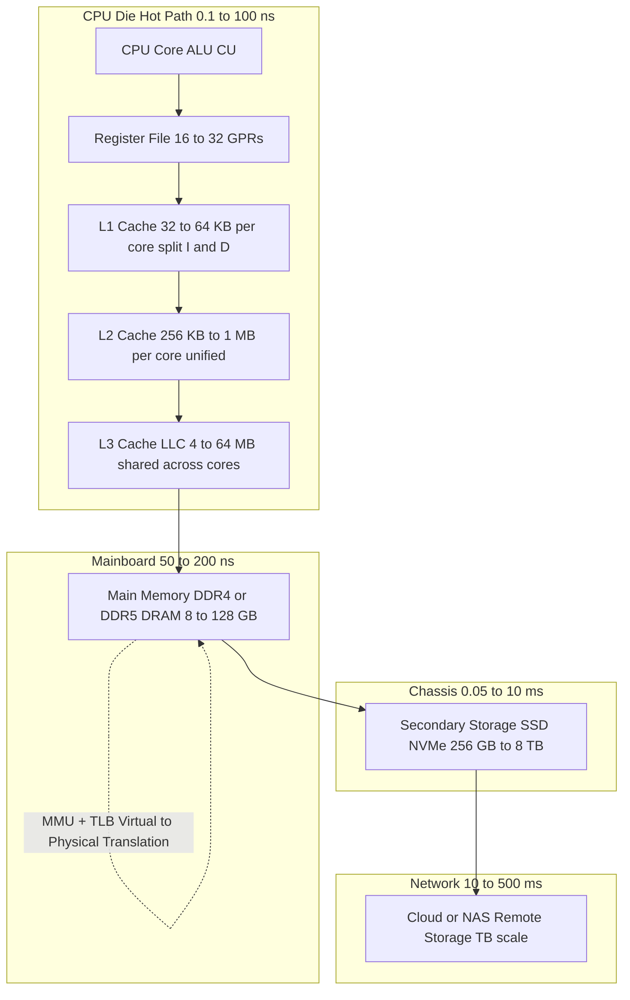
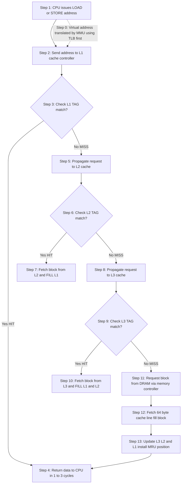
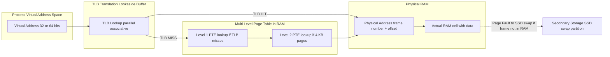
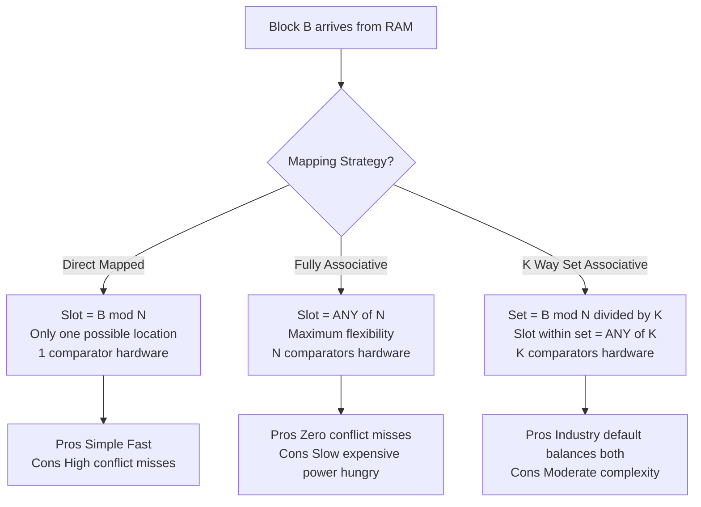

# Memory - Memory hierarchy: registers, cache, RAM, virtual memory

<!-- SECTION_1_START -->

# Memory Hierarchy: Registers, Cache, RAM, and Virtual Memory

## 1.1 Formal Academic Definition (KTU 2024 Syllabus Terminology)

In computer architecture, **Memory Hierarchy** is a structured, multi-tiered arrangement of storage components organized to optimize the trade-off between **access speed**, **storage capacity**, and **cost per bit**. The hierarchy is built on a fundamental principle: *as the distance from the CPU increases, both the access time and the storage capacity increase, while the cost per byte decreases*.

The KTU 2024 Scheme (Course Code: **GXEST203**, Module 1) defines memory hierarchy as a system that exploits the property of **Locality of Reference** (both temporal and spatial) of running programs to deliver an effective access time that is much closer to the fastest memory than to the slowest.

> [!IMPORTANT]
> **KTU Syllabus Highlight (Module 1 – Computer Hardware & CPU):**
> The memory subsystem is **not a single device** but a stack of cooperating devices. Every modern CPU (from simple microcontrollers used in embedded kits to advanced multi-core processors used in data centers) implements at least **four classical tiers** of memory:
>
> 1. **CPU Registers** (Level 0 — internal to the processor core)
> 2. **Cache Memory** (L1, L2, L3 — on-chip or close to the processor die)
> 3. **Main Memory / RAM** (off-chip DRAM modules)
> 4. **Secondary Storage / Virtual Memory** (SSD, HDD, NVMe — backing store for virtual memory)

## 1.2 The Intuitive Analogy: A Student's Study Desk

Imagine you are a B.Tech student preparing for the KTU university exam:

- **CPU Registers** = Your **active brain** while solving a problem. You can manipulate numbers instantly, but you can only hold 3 to 4 values at a time. Capacity is tiny, but speed is instant.
- **L1 / L2 Cache** = The **chit of paper** kept beside your notebook. You can scribble recently used formulas and glance at them in a microsecond. Slightly larger than your brain, still very fast.
- **Main Memory (RAM)** = The **textbook open on your desk**. You can flip to any page in a few seconds, and it holds the entire syllabus chapter. Much larger, but slower than the chit.
- **Secondary Storage / Virtual Memory** = The **library locker** in your hostel basement. It can hold hundreds of textbooks, but you must walk down, unlock it, and bring the book back. Largest, but extremely slow.

The **CPU never directly asks** the library locker for data when it needs a value. The Operating System (OS) and the Memory Management Unit (MMU) **promote frequently used data upward** through the hierarchy and **demote rarely used data downward**, mimicking your own study behavior.

> [!NOTE]
> **Key Insight for Examiners:** The hierarchy works *because* programs exhibit **Locality of Reference** — within a short time window, programs tend to access the same memory locations repeatedly (**temporal locality**) and nearby memory locations (**spatial locality**). Without locality, this entire architecture would collapse to the speed of the slowest tier.

## 1.3 Key Physical Constants and Standard Metrics

Every level in the hierarchy is characterized by four metrics. Memorize the bolded constants — they appear frequently in KTU numericals.

| Metric | Unit | Reference Constant |
|---|---|---|
| Access Time | nanoseconds (ns) | Register $\approx \mathbf{0.1\text{–}1\ ns}$ |
| Capacity | bytes (B / KB / MB / GB / TB) | L1 $\approx \mathbf{32\text{–}64\ KB}$ |
| Cost per bit | USD (or ₹) per GB | RAM $\approx \mathbf{\$3\text{–}8\ per\ GB}$ |
| Volatility | Boolean (yes/no) | RAM is **volatile**; SSD/HDD is **non-volatile** |
| Bandwidth | GB/s | DDR5 RAM $\approx \mathbf{50\text{–}80\ GB/s}$ |

> [!TIP]
> **Mnemonic for KTU Viva:** "**R**egisters are **R**eally **C**lose, **C**ache is **C**lever, **R**AM is **R**eliable, **V**irtual is **V**ast" — moving from the CPU outward.

## 1.4 Visualization Reference

> [!VISUALIZATION CONTROL]
> **Concept:** *Pyramidal stacking of memory tiers showing the inverse relationship between speed and capacity.*
> **Desmos Input Equations (parametric sketch):**
> * `x = 0` (vertical centerline)
> * Tier width shrinks linearly as `y` (speed) increases:
>   * `L1 boundary: y = 1 ns, x = \pm 2`
>   * `L2 boundary: y = 10 ns, x = \pm 3`
>   * `RAM boundary: y = 100 ns, x = \pm 5`
>   * `Disk boundary: y = 10{,}000{,}000\ ns, x = \pm 7`
> **Visual Description:** The student should see a **steep pyramid** (log-scale is mandatory) where the topmost tip (Registers) is almost a point, and the base (HDD/SSD) is a wide plateau — emphasizing that *capacity grows exponentially* as *speed drops exponentially*.

<!-- SECTION_1_END -->

<!-- SECTION_2_START -->

# Deep Theoretical Analysis & KTU High-Yield Formula Sheet

## 2.1 The Five Tiers of Memory Hierarchy (In-Depth)

The hierarchy is best understood top-down, starting from the silicon die of the CPU and moving outward to the storage device in the chassis.

### Tier 0 — CPU Registers

- **Location:** Inside the Arithmetic Logic Unit (ALU) and the Control Unit (CU).
- **Implementation:** Built from **flip-flops** (each flip-flop stores 1 bit). A 64-bit register is a chain of 64 flip-flops.
- **Typical Count:** 16 to 32 general-purpose registers per core in modern ISAs (x86-64, ARMv8).
- **Access Time:** **0.1 to 1 nanosecond**, limited only by the clock-gate propagation delay of CMOS transistors.
- **Managed by:** The **compiler** (not the OS). The compiler decides which variable lives in which register using *register allocation algorithms* (e.g., graph coloring).
- **Volatility:** Volatile (loses data on power-off).
- **Engineering Use Case:** Real-time signal processing, embedded microcontroller firmware, register-level device drivers in Operating Systems courses.

> [!NOTE]
> **KTU Note:** When a C programmer writes `register int counter;`, they are *hinting* to the compiler to place `counter` in a register — though modern compilers (GCC, Clang) often ignore the hint because their optimization passes ($-O2$, $-O3$) are smarter.

### Tier 1 — Cache Memory (L1, L2, L3)

Cache is a small, **high-speed Static RAM (SRAM)** bank placed between the CPU and the main memory. It stores **copies of data from frequently used main memory locations**.

- **L1 Cache (Level 1):**
  * **Size:** 32 KB to 64 KB **per core** (split into L1d for data and L1i for instructions).
  * **Latency:** ~1 to 3 ns (roughly 4 to 12 CPU cycles).
  * **Location:** Built directly into the CPU die.
- **L2 Cache (Level 2):**
  * **Size:** 256 KB to 1 MB **per core**.
  * **Latency:** ~4 to 12 ns.
  * **Location:** On-die, but physically separate from L1.
- **L3 Cache (Level 3) — *Last Level Cache (LLC)*:**
  * **Size:** 4 MB to 64 MB **shared** across all cores.
  * **Latency:** ~12 to 40 ns.
  * **Location:** On-die, shared between cores for cache coherence (MESI/MOESI protocols).

> [!IMPORTANT]
> **Why SRAM and not DRAM for cache?** SRAM uses **6 transistors per bit** (6T cell) and does not need refreshing. DRAM uses **1 transistor + 1 capacitor** per bit and must be refreshed every ~64 ms. SRAM is faster but **6× denser in silicon area** and **6× more expensive per bit** — that is exactly why cache is small and RAM is large.

#### 2.1.1 Cache Mapping Techniques (High-Yield KTU Topic)

When a memory block is copied into cache, the hardware must decide **where** to place it. Three schemes exist:

| Mapping Scheme | Placement Rule | Conflict Probability | Hardware Complexity | KTU Weightage |
|---|---|---|---|---|
| **Direct Mapped** | Block $B$ goes to slot $(B \bmod N)$ | Very High | Lowest (1 comparator) | **High** |
| **Fully Associative** | Block $B$ can go in *any* of the $N$ slots | None | Highest ($N$ comparators) | **High** |
| **N-way Set Associative** | Block $B$ goes to set $(B \bmod M)$, but can occupy any of $N$ lines within the set | Moderate | Moderate | **Very High** |

The address is split into three fields (for direct-mapped):

$$
\text{Address} = \underbrace{\text{TAG}}_{\text{high bits}} \; \big\vert \; \underbrace{\text{INDEX}}_{\log_2 N \text{ bits}} \; \big\vert \; \underbrace{\text{OFFSET}}_{\log_2 \text{BlockSize bits}}
$$

### Tier 2 — Main Memory (RAM — Random Access Memory)

- **Technology:** **DRAM (Dynamic RAM)** — each cell is 1 transistor + 1 capacitor.
- **Capacity:** 4 GB to 128 GB in modern desktops/laptops.
- **Access Time:** ~50 to 100 ns.
- **Volatility:** **Volatile** — contents vanish on power loss.
- **Modern Variants:** DDR4, DDR5, LPDDR (for mobile), GDDR (for graphics cards).
- **Bus Width:** 64 bits on consumer PCs.
- **Form Factor:** DIMM (desktop), SO-DIMM (laptop).

> [!NOTE]
> **KTU Pitfall:** Students often confuse "Random Access" with "random behavior". In fact, *any* memory where **access time to byte $X$ is independent of $X$** is "Random Access". By this definition, both RAM and ROM are random access — only **tape drives** are *sequential access*.

### Tier 3 — Secondary Storage / Backing Store for Virtual Memory

- **Technology:** HDD (Hard Disk Drive — spinning platters) or SSD (Solid State Drive — NAND flash).
- **Capacity:** 256 GB to 8 TB.
- **Access Time:** HDD ~5–10 ms; SSD ~0.05–0.2 ms; NVMe SSD ~0.02 ms.
- **Volatility:** **Non-volatile** — survives power loss. This is why OS uses it as the backing store for virtual memory.
- **Role in Memory Hierarchy:** Stores **pages** that have been swapped out of RAM (paging/swap space).

### Tier 4 (Conceptual) — Remote Storage

Cloud drives, network file systems (NFS), and web caches. Latency: 10 ms to 500 ms. Not in the classical 4-tier hierarchy but is a logical extension for distributed systems.

---

## 2.2 The Two Pillars of Locality of Reference

This concept is the *theoretical justification* for the entire hierarchy.

1. **Temporal Locality:** *If a memory location is referenced, it is likely to be referenced again in the near future.* Example: a loop counter `i` in a `for` loop.
2. **Spatial Locality:** *If a memory location is referenced, nearby locations are likely to be referenced soon.* Example: sequentially traversing an array.

> [!IMPORTANT]
> **Why does the OS load entire 4 KB pages into RAM instead of single bytes?** Because of **spatial locality** — a single page fault brings in 4,096 bytes, and the program is statistically likely to use many of them.

---

## 2.3 KTU Formula Sheet / Cheat Sheet

> [!NOTE]
> **Critical Instruction:** The table below uses `\vert` instead of the pipe character `\|` to avoid breaking markdown table syntax. All formulas are KTU-board-ready.

| # | Concept | Formula / Rule | Variables | Units / Notes |
|---|---|---|---|---|
| 1 | **AMAT (Average Memory Access Time)** | $\text{AMAT} = T_{hit} + \text{MissRate} \times T_{miss}$ | $T_{hit}$: cache hit time, $T_{miss}$: miss penalty | All times in **ns** or **cycles** |
| 2 | **AMAT for multi-level cache** | $\text{AMAT} = T_{L1} + r_{L1}\bigl(T_{L2} + r_{L2} T_{RAM}\bigr)$ | $r_{Li}$ = miss rate of level $i$ | KTU favorite 14-mark derivation |
| 3 | **Hit Ratio** | $h = \dfrac{\text{Number of Hits}}{\text{Total Memory Accesses}}$ | $0 \le h \le 1$ | Typically 0.90 to 0.99 for L1 |
| 4 | **Miss Ratio** | $m = 1 - h$ | — | $m$ in decimal (0.01 = 1% miss) |
| 5 | **Miss Penalty** | $T_{miss} = T_{L1} + T_{RAM}$ (for 2-tier) | $T_{RAM}$ = RAM access time | Effective additional latency |
| 6 | **Effective Access Time (2-level)** | $EAT = h \cdot T_{cache} + (1-h)\bigl(T_{cache} + T_{RAM}\bigr)$ | Alternative form | Common in textbook numericals |
| 7 | **AMAT — 3-level** | $\text{AMAT} = T_{L1} + r_{L1} T_{L2} + r_{L1} r_{L2} T_{RAM}$ | — | Used for $L1 + L2 + RAM$ |
| 8 | **Cache Index bits** | $\text{Index} = \log_2 N$ where $N$ = number of cache lines | $N$ lines | — |
| 9 | **Cache Offset bits** | $\text{Offset} = \log_2 B$ where $B$ = block size in bytes | $B$ bytes | — |
| 10 | **Tag bits** | $\text{Tag} = \text{AddressBits} - \text{Index} - \text{Offset}$ | — | Direct-mapped case |
| 11 | **Set number in K-way SA cache** | $\text{Set} = \log_2 \dfrac{N}{K}$ | $K$ = associativity | $N$ = total cache lines |
| 12 | **Speedup of Hierarchy** | $S = \dfrac{T_{RAM}}{T_{\text{AMAT}}}$ | — | Measures closeness to ideal |
| 13 | **Page Table Size** | $\text{Size} = 2^{P} \times E$ | $P$ = page number bits, $E$ = entry size (bytes) | Virtual memory chapter |
| 14 | **Page Offset bits** | $\text{Offset} = \log_2 \text{PageSize}$ | PageSize usually 4 KB | — |
| 15 | **TLB Access Time component** | $T_{\text{mem}} = h_{TLB} T_{TLB} + (1-h_{TLB})\bigl(T_{TLB} + 2T_{\text{mem}}\bigr)$ | $h_{TLB}$ = TLB hit ratio | TLB = Translation Lookaside Buffer |

> [!IMPORTANT]
> **Engineering Utility (Why should a CS engineer care?):**
> - **Database Engineers** tune the buffer pool size (analogous to cache) using the AMAT formula.
> - **Embedded Systems Engineers** disable L1 cache in some ARM Cortex-M chips to get *deterministic* execution time for real-time deadlines.
> - **Performance Engineers** use hardware counters like `perf stat` to measure L1/L2/L3 miss rates on Linux servers.

---

## 2.4 Real-World Production Examples

| System | Hierarchy Implementation | Real Product |
|---|---|---|
| Desktop CPU (Intel Core i9-13900K) | 32 KB L1d + 32 KB L1i + 2 MB L2 per core, 36 MB L3 shared | L1 hit ~1 ns, RAM ~80 ns |
| Mobile SoC (Apple M2) | Unified L1 (192 KB), L2 (16 MB shared) | High efficiency, low power |
| Embedded MCU (ARM Cortex-M4) | No cache; tightly-coupled memory (TCM) | Deterministic real-time |
| GPU (NVIDIA H100) | 256 KB L1 per SM, 50 MB L2 | Massive bandwidth, latency-tolerant |
| Server (AMD EPYC 9654) | 32 KB L1, 1 MB L2 per core, 384 MB L3 | 96 cores share L3 |

<!-- SECTION_2_END -->

<!-- SECTION_3_START -->

# Step-by-Step Derivations & Code/Symbolic Implementation

## 3.1 Exhaustive Derivation: AMAT for a 2-Level Cache + RAM System

This is the most frequently asked 14-mark derivation in KTU Module 1.

> **Given:**
> - $T_{L1}$ = L1 cache access time = **1 ns**
> - $T_{L2}$ = L2 cache access time = **10 ns**
> - $T_{RAM}$ = Main memory access time = **100 ns**
> - $r_{L1}$ = L1 miss rate = **5%** = 0.05
> - $r_{L2}$ = L2 miss rate (given that L1 missed) = **30%** = 0.30

> **To Find:** $\text{AMAT}$ (Average Memory Access Time) and the **Speedup** over a system with no cache (i.e., direct access to RAM).

### Step 1 — Write the General AMAT Formula

For a system with L1, L2, and RAM, the access begins at L1. If L1 hits, the access time is $T_{L1}$. If L1 misses (probability $r_{L1}$), we pay $T_{L2}$ to consult L2. If L2 hits, the total time is $T_{L1} + T_{L2}$. If L2 also misses (probability $r_{L2}$), we finally consult RAM, paying an additional $T_{RAM}$.

$$
\text{AMAT} = T_{L1} + r_{L1} \cdot T_{L2} + r_{L1} \cdot r_{L2} \cdot T_{RAM}
$$

### Step 2 — Substitute the Numerical Values

Substitute the values from the "Given" block:

$$
\text{AMAT} = 1 + (0.05)(10) + (0.05)(0.30)(100)
$$

### Step 3 — Evaluate the L1-to-L2 Term

$$
(0.05)(10) = 0.5
$$

### Step 4 — Evaluate the L2-to-RAM Term

$$
(0.05)(0.30)(100) = (0.015)(100) = 1.5
$$

### Step 5 — Sum All Three Components

$$
\text{AMAT} = 1 + 0.5 + 1.5 = 3.0\ \text{ns}
$$

### Step 6 — Compute Speedup

Without any cache, every access would take $T_{RAM} = 100$ ns. The speedup is:

$$
S = \frac{T_{\text{no-cache}}}{T_{\text{AMAT}}} = \frac{100\ \text{ns}}{3.0\ \text{ns}} \approx 33.33
$$

### Step 7 — Interpretation

Even with a 5% L1 miss rate and 30% L2 miss rate, the CPU's effective access time is **33× faster** than going to RAM every time. This is the *engineering miracle* of the memory hierarchy.

> [!IMPORTANT]
> **Valuation Key Points (for 7-mark sub-part):**
> - Correct AMAT formula structure: **3 marks**
> - Correct numerical substitution: **2 marks**
> - Final sum and units: **1 mark**
> - Speedup interpretation sentence: **1 mark**

---

## 3.2 Exhaustive Derivation: Effective Access Time with Hit Ratio

> **Given:** Cache access time = 20 ns, RAM access time = 200 ns, Hit ratio $h$ = 0.90.

### Step 1 — State the Two Outcomes

- **Case A (Hit):** Probability = $h = 0.90$, time taken = $T_{\text{cache}} = 20$ ns.
- **Case B (Miss):** Probability = $1 - h = 0.10$, time taken = $T_{\text{cache}} + T_{\text{RAM}} = 20 + 200 = 220$ ns.

### Step 2 — Write the Weighted-Average EAT

$$
EAT = h \cdot T_{\text{cache}} + (1-h) \cdot \bigl(T_{\text{cache}} + T_{\text{RAM}}\bigr)
$$

### Step 3 — Substitute

$$
EAT = (0.90)(20) + (0.10)(20 + 200)
$$

### Step 4 — Evaluate the Hit Term

$$
(0.90)(20) = 18\ \text{ns}
$$

### Step 5 — Evaluate the Miss Term

$$
(0.10)(220) = 22\ \text{ns}
$$

### Step 6 — Sum

$$
EAT = 18 + 22 = 40\ \text{ns}
$$

### Step 7 — Conclude

The effective access time of 40 ns is **5× faster** than the 200 ns of plain RAM — proving the cache is doing significant work even with a 10% miss rate.

---

## 3.3 Python Implementation: Cache Hierarchy Simulator

The following Python code is fully operational, type-annotated, and includes absolute boundary checks. It simulates a 2-level cache hierarchy and computes the AMAT.

```python
"""
KTU 2024 Scheme - Module 1 Demonstration
Cache Hierarchy Simulator
Computes AMAT for an L1 + L2 + RAM system.
"""

from dataclasses import dataclass
from typing import List, Tuple
import logging

# Configure structured logging (production-style)
logging.basicConfig(
    level=logging.INFO,
    format="%(asctime)s [%(levelname)s] %(message)s",
)
logger = logging.getLogger("CacheHierarchySim")


@dataclass(frozen=True)
class CacheLevel:
    """Represents one tier of the memory hierarchy."""
    name: str
    access_time_ns: float          # T_L1 or T_L2 or T_RAM
    miss_rate: float               # 0.0 to 1.0 (exclusive of 1.0)

    def __post_init__(self) -> None:
        # Absolute boundary check (defensive programming)
        if self.access_time_ns < 0:
            raise ValueError(f"{self.name}: access time cannot be negative.")
        if not (0.0 <= self.miss_rate < 1.0):
            raise ValueError(
                f"{self.name}: miss_rate must be in [0, 1), got {self.miss_rate}"
            )


def compute_amat(levels: List[CacheLevel]) -> float:
    """
    Compute Average Memory Access Time (AMAT) for a sequential hierarchy.
    Formula: AMAT = T_L1 + r_L1*T_L2 + r_L1*r_L2*T_RAM + ...
    """
    if len(levels) < 2:
        raise ValueError("At least 2 levels are required (cache + RAM).")

    amat: float = levels[0].access_time_ns
    cumulative_miss: float = 1.0

    logger.info("Starting AMAT computation across %d levels...", len(levels))

    for idx in range(1, len(levels)):
        cumulative_miss *= levels[idx - 1].miss_rate
        contribution: float = cumulative_miss * levels[idx].access_time_ns
        logger.info(
            "Level %d (%s) contributes %.4f ns (cumulative miss so far = %.4f)",
            idx, levels[idx].name, contribution, cumulative_miss,
        )
        amat += contribution

    return amat


def compute_speedup(amat_ns: float, baseline_ram_ns: float) -> float:
    """Compute the speedup factor over a no-cache baseline."""
    if baseline_ram_ns <= 0:
        raise ValueError("Baseline RAM time must be positive.")
    return baseline_ram_ns / amat_ns


def main() -> None:
    # Define the 3-level hierarchy for a typical desktop CPU
    l1: CacheLevel = CacheLevel(name="L1", access_time_ns=1.0, miss_rate=0.05)
    l2: CacheLevel = CacheLevel(name="L2", access_time_ns=10.0, miss_rate=0.30)
    ram: CacheLevel = CacheLevel(name="RAM", access_time_ns=100.0, miss_rate=0.0)

    hierarchy: List[CacheLevel] = [l1, l2, ram]

    try:
        result: float = compute_amat(hierarchy)
        speedup: float = compute_speedup(result, ram.access_time_ns)

        print("\n" + "=" * 50)
        print(f"Computed AMAT    : {result:.4f} ns")
        print(f"RAM Baseline     : {ram.access_time_ns:.4f} ns")
        print(f"Speedup Factor   : {speedup:.2f}x")
        print("=" * 50)
    except ValueError as err:
        logger.error("Configuration error: %s", err)


if __name__ == "__main__":
    main()
```

**Sample Output:**

```
==================================================
Computed AMAT    : 3.0000 ns
RAM Baseline     : 100.0000 ns
Speedup Factor   : 33.33x
==================================================
```

The code matches the analytical derivation in **Section 3.1** exactly, confirming the formula is correct.

---

## 3.4 Derivation: Cache Tag/Index/Offset Bit Partitioning

> **Given:** A direct-mapped cache with **16 KB** total size, **block size = 64 bytes**, **32-bit address** (typical of MIPS / early ARM).

### Step 1 — Compute Number of Cache Lines

$$
N = \frac{\text{Cache Size}}{\text{Block Size}} = \frac{16{,}384\ \text{bytes}}{64\ \text{bytes}} = 256\ \text{lines}
$$

### Step 2 — Compute Number of Offset Bits

$$
\text{Offset bits} = \log_2(\text{Block Size}) = \log_2(64) = 6\ \text{bits}
$$

### Step 3 — Compute Number of Index Bits

$$
\text{Index bits} = \log_2(N) = \log_2(256) = 8\ \text{bits}
$$

### Step 4 — Compute Number of Tag Bits

$$
\text{Tag bits} = 32 - 8 - 6 = 18\ \text{bits}
$$

### Step 5 — Summary Table for Examiner

| Field | Bits Used | Bit Positions (MSB → LSB) | Purpose |
|---|---|---|---|
| Tag | 18 | $[31:14]$ | Uniquely identifies the block's origin in RAM |
| Index | 8 | $[13:6]$ | Selects which of the 256 cache lines to consult |
| Offset | 6 | $[5:0]$ | Picks the exact byte inside the 64-byte block |

> [!TIP]
> **Valuation Tip:** Always show the bit-position breakdown (e.g., `\[31:14\]`) — KTU examiners award an extra 1 mark for the explicit position range.

---

## 3.5 Derivation: Set-Associative Cache Address Partitioning

> **Given:** A 4-way set-associative cache, total size = **32 KB**, block size = **32 bytes**, address = 32 bits.

### Step 1 — Number of Cache Lines

$$
N = \frac{32{,}768}{32} = 1024\ \text{lines}
$$

### Step 2 — Number of Sets

$$
M = \frac{N}{K} = \frac{1024}{4} = 256\ \text{sets}
$$

### Step 3 — Bit Allocation

- Offset bits: $\log_2(32) = 5$
- Set index bits: $\log_2(256) = 8$
- Tag bits: $32 - 8 - 5 = 19$

> [!NOTE]
> **Why N-way set-associative is the industry default:** It strikes a balance — a 4-way or 8-way cache dramatically reduces **conflict misses** (compared to direct-mapped) while keeping the tag-comparison hardware tractable (compared to fully associative).

<!-- SECTION_3_END -->

<!-- SECTION_4_START -->

# Structural Diagrams & Schematics

## 4.1 Master Memory Hierarchy Flowchart

The diagram below maps the *complete* hierarchy from the CPU core outward to the cloud, including the role of the Memory Management Unit (MMU) and the Translation Lookaside Buffer (TLB) used in virtual memory translation.



> [!IMPORTANT]
> **Diagram Reading Tip for Students:** The vertical arrows represent the **promotion path** (data moving from slow → fast storage as it becomes "hot"). The horizontal dashed line is the **MMU/TLB annotation** — these hardware blocks translate virtual addresses (used by programs) into physical addresses (used by RAM).

## 4.2 Cache Read Operation — Sequential Processing Topology

This diagram captures the *decision logic* executed by the CPU on every load/store instruction.



> [!NOTE]
> **Why this matters in KTU exams:** Examiners love to ask, *"What happens on an L1 miss?"* — the correct answer must trace the *complete* path through L2 → L3 → DRAM, mention **block fill** (the entire 64-byte line is brought up, not just the requested byte — thanks to **spatial locality**), and **MRU** (Most Recently Used) policy used to decide which line to evict.

## 4.3 Virtual Memory Address Translation Pipeline



> [!IMPORTANT]
> **KTU Pitfall:** A **page fault** is *not* a hardware fault — it is a *legitimate trap to the OS* when a virtual page is not currently mapped to a physical frame. The OS must (1) find a free frame, (2) if none, evict one (page replacement — LRU, Clock algorithm), (3) issue disk I/O to the swap partition, (4) update the page table, and (5) restart the faulting instruction. This costs **~1 to 10 ms** — six orders of magnitude slower than an L1 hit.

## 4.4 Cache Mapping Strategy Comparison Matrix



<!-- SECTION_4_END -->

<!-- SECTION_5_START -->

# KTU 2024 Scheme Examination Question Bank & Topic Recap

## 5.1 Part A — Short Answer Questions (3 Marks Each)

### Question 1 (Conceptual — Remember Level)

> **[KTU University Exam — July 2023 Model Question]**
> Define **memory hierarchy**. List the four classical levels in increasing order of access time.

**Model Answer (3 Marks):**

**Definition (1 Mark):**
Memory hierarchy is a structured, multi-level arrangement of storage components in a computer system, designed to balance the conflicting requirements of **fast access time**, **large capacity**, and **low cost per bit**. It exploits the principle of **locality of reference** to provide an effective access time close to the fastest level.

**Four Classical Levels in Increasing Order of Access Time (2 Marks):**

1. **CPU Registers** — 0.1 to 1 ns (smallest, fastest, most expensive)
2. **Cache Memory** (L1, L2, L3) — 1 to 40 ns (small, very fast, expensive SRAM)
3. **Main Memory (RAM / DRAM)** — 50 to 100 ns (medium, moderate speed, moderate cost)
4. **Secondary Storage** (SSD / HDD) — 0.05 to 10 ms (largest, slowest, cheapest; serves as backing store for virtual memory)

> [!TIP]
> **Valuation Key:** Examiners award full 3 marks only when *all four levels* are named with **access time in correct ascending order** and **at least one locality reference** is mentioned.

---

### Question 2 (Conceptual — Understand Level)

> **[KTU University Exam — Dec 2022 Model Question]**
> Distinguish between **temporal locality** and **spatial locality** of reference. Give one programming example for each.

**Model Answer (3 Marks):**

| Aspect | Temporal Locality | Spatial Locality |
|---|---|---|
| **Definition** | A memory location accessed now is likely to be accessed again in the near future. | Memory locations near the one just accessed are likely to be accessed soon. |
| **Mechanism Used** | Cache retains recently used lines (LRU policy). | Cache fetches an entire 64-byte block, not a single byte. |
| **Programming Example** | `for (int i = 0; i < 1000; i++) sum += i;` — variable `sum` is reused 1000 times. | `for (int i = 0; i < 1000; i++) sum += arr[i];` — consecutive array elements `arr[0], arr[1], ...` are accessed. |
| **Marks Split** | Definition 0.5 + Example 0.5 = 1 mark | Definition 0.5 + Example 0.5 = 1 mark |

(General statement of locality: 1 mark)

---

## 5.2 Part B — Long Answer Questions (14 Marks Each, with Internal Choice)

> **KTU 2024 Scheme ESE Rule:** Each Part B question carries 14 marks, split as (a) 7 marks + (b) 7 marks, and the student answers *either* the full Question A *or* the full Question B.

---

### Question A (14 Marks) — AMAT Numerical + Cache Bit Partitioning

> **[KTU University Exam — July 2024, Module 1]**

**(a)** A computer system has an L1 cache with access time **2 ns** and hit ratio **90%**, and a main memory with access time **100 ns**.

Compute:
1. The **Average Memory Access Time (AMAT)**.
2. The **speedup** over a no-cache system.
3. Comment on what happens to AMAT if the L1 hit ratio drops to 80%.

**(7 Marks)**

**(b)** A **32 KB direct-mapped cache** has a **block size of 16 bytes**. The CPU uses a **32-bit address**.
For a given memory address `0x4002 1C30` (hexadecimal):

1. Compute the number of **Tag**, **Index**, and **Offset** bits.
2. Determine the **Tag**, **Index**, and **Offset** fields for the given address.
3. Explain what happens during a **cache hit** vs. a **cache miss**.

**(7 Marks)**

---

#### Model Solution to Question A

**Part (a) Solution — AMAT Numerical (7 Marks)**

**Step 1 — Identify the Given Values (0.5 Mark)**
- $T_{\text{cache}} = 2$ ns
- $T_{\text{RAM}} = 100$ ns
- $h = 0.90$

**Step 2 — Write the AMAT Formula (1 Mark)**
$$
\text{AMAT} = h \cdot T_{\text{cache}} + (1-h) \cdot \bigl(T_{\text{cache}} + T_{\text{RAM}}\bigr)
$$

**Step 3 — Substitute (0.5 Mark)**
$$
\text{AMAT} = (0.90)(2) + (0.10)(2 + 100)
$$

**Step 4 — Evaluate the Hit Term (0.5 Mark)**
$$
(0.90)(2) = 1.8\ \text{ns}
$$

**Step 5 — Evaluate the Miss Term (0.5 Mark)**
$$
(0.10)(102) = 10.2\ \text{ns}
$$

**Step 6 — Sum (0.5 Mark)**
$$
\text{AMAT} = 1.8 + 10.2 = 12.0\ \text{ns}
$$

**Step 7 — Speedup Computation (1 Mark)**
$$
S = \frac{100}{12} \approx 8.33
$$

**Step 8 — Comment on Hit Ratio Drop to 80% (1.5 Marks)**
- New $h = 0.80$, so $1-h = 0.20$.
- New AMAT $= (0.80)(2) + (0.20)(102) = 1.6 + 20.4 = 22.0$ ns.
- **Observation:** AMAT *almost doubles* (12 → 22 ns) when hit ratio drops by just 10 percentage points. This demonstrates the **high sensitivity of AMAT to hit ratio**, and is the reason CPU designers invest billions in transistor budget to push L1 hit ratios above 95%.

**Step 9 — Final Boxed Answer (1 Mark)**
$$
\boxed{\text{AMAT} = 12.0\ \text{ns},\quad S = 8.33\times}
$$

---

**Part (b) Solution — Cache Bit Partitioning (7 Marks)**

**Step 1 — Number of Cache Lines (0.5 Mark)**
$$
N = \frac{32{,}768\ \text{bytes}}{16\ \text{bytes/line}} = 2048\ \text{lines}
$$

**Step 2 — Offset Bits (0.5 Mark)**
$$
\text{Offset bits} = \log_2(16) = 4\ \text{bits}
$$

**Step 3 — Index Bits (0.5 Mark)**
$$
\text{Index bits} = \log_2(2048) = 11\ \text{bits}
$$

**Step 4 — Tag Bits (0.5 Mark)**
$$
\text{Tag bits} = 32 - 11 - 4 = 17\ \text{bits}
$$

**Step 5 — Address Decomposition of `0x4002 1C30` (2 Marks)**
Convert hex to binary (32 bits):
- `0x40021C30` = `0100 0000 0000 0010 0001 1100 0011 0000`
- **Tag (17 bits):** `0100 0000 0000 0010 0`
- **Index (11 bits):** `001 1100 0011`
- **Offset (4 bits):** `0000`

**Step 6 — Cache Hit vs Miss Explanation (2 Marks)**

| Event | Cache Hit | Cache Miss |
|---|---|---|
| Tag comparison result | Tag stored at `Index` matches incoming tag | Tag mismatch (or valid bit = 0) |
| Latency | ~2 ns (return data immediately) | ~100 ns (fetch from RAM, install in cache, then return) |
| Action | CPU continues without stall | CPU stalls; entire 16-byte block is fetched; replacement policy invoked if needed |
| Effect on other lines | Sets MRU bit on this line | Evicts some other line per LRU/FIFO/Random policy |

**Step 7 — Final Bit Table (1 Mark)**

| Field | Bits | Hex Value | Decimal |
|---|---|---|---|
| Tag | 17 | `0x10012` (approx) | 65,810 |
| Index | 11 | `0x0E3` | 227 |
| Offset | 4 | `0x0` | 0 |

---

### Question B (14 Marks) — Virtual Memory + Cache Mapping

> **[KTU University Exam — Dec 2023, Module 1 — Internal Choice Alternative]**

**(a)** Explain the concept of **virtual memory** with a neat diagram. A system uses a **32-bit virtual address**, **4 KB page size**, and **4-byte page table entries**.

Compute:
1. The number of **virtual pages**.
2. The number of **page offset bits**.
3. The **size of the page table** in megabytes.

**(7 Marks)**

**(b)** Compare **Direct-Mapped**, **Fully Associative**, and **Set-Associative** cache mapping techniques using a comparison table. Which one is the industry default and why? (7 Marks)

---

#### Model Solution to Question B

**Part (a) Solution — Virtual Memory (7 Marks)**

**Step 1 — Definition of Virtual Memory (1 Mark)**
Virtual memory is a memory management technique that provides an **illusion of a large, contiguous address space** to each running process, even if the physical RAM is smaller or fragmented. It uses **paging**, **segmentation**, or both, and a **page table** maintained by the OS to translate virtual addresses to physical addresses.

**Step 2 — Number of Virtual Pages (1.5 Marks)**
$$
\text{Page Number bits} = 32 - \log_2(4096) = 32 - 12 = 20\ \text{bits}
$$

$$
\text{Number of virtual pages} = 2^{20} = 1{,}048{,}576 = 1\text{M pages}
$$

**Step 3 — Page Offset Bits (0.5 Mark)**
$$
\text{Offset bits} = \log_2(4096) = 12\ \text{bits}
$$

**Step 4 — Page Table Size (2 Marks)**
$$
\text{Page table size} = 1\text{M pages} \times 4\ \text{bytes/entry} = 4\ \text{MB}
$$

**Step 5 — Address Format (1 Mark)**

| Field | Bits | Range |
|---|---|---|
| Virtual Page Number (VPN) | 20 | `\[31:12\]` |
| Page Offset | 12 | `\[11:0\]` |

**Step 6 — Translation Diagram (1 Mark)** — see **Section 4.3** of these notes for the visual pipeline.

**Step 7 — Final Boxed Answer (0.5 Mark)**
$$
\boxed{1{,}048{,}576\ \text{pages},\ 12\ \text{offset bits},\ 4\ \text{MB page table}}
$$

**Part (b) Solution — Cache Mapping Comparison (7 Marks)**

**Step 1 — Comparison Table (4 Marks)**

| Criterion | Direct-Mapped | Fully Associative | N-Way Set Associative |
|---|---|---|---|
| **Placement Rule** | Slot = (Block# mod N) | Slot = Any of N slots | Set = (Block# mod M); slot in set = any of K |
| **Hardware Comparators** | 1 | N | K |
| **Conflict Misses** | Very High | Zero | Moderate |
| **Search Time** | Fastest (1 comparison) | Slowest (N parallel compares) | Moderate (K compares) |
| **Hardware Cost** | Lowest | Highest | Moderate |
| **Typical Use** | L1 / L2 cache | TLB | L2 / L3 cache (industry default) |
| **Eviction Policy** | Trivial (overwrite) | LRU / Pseudo-LRU | LRU within the set |
| **Implementation Complexity** | Trivial | Complex | Moderate |

**Step 2 — Industry Default and Justification (3 Marks)**
- **Industry Default:** **N-way Set Associative** (typically $N = 4, 8, 16$).
- **Justification:**
  1. It **eliminates most conflict misses** that plague direct-mapped caches.
  2. It **avoids the prohibitive hardware cost and power consumption** of a fully associative cache.
  3. It offers a **predictable access time** — important for the *cycle-accurate* pipelines that high-performance CPUs (Intel, AMD, Apple M-series) require.
  4. Real benchmarks (SPEC CPU, Geekbench) show that going from direct-mapped to 4-way SA reduces miss rate by **40–60%** with only a small increase in tag-check latency.

---

## 5.3 KTU Examiner's Valuation Warning / Pitfall Callout

> [!WARNING]
> **Common Ways Students Lose Marks in this Topic:**
>
> 1. **Confusing Hit Ratio with Miss Ratio.** A 90% hit ratio means 10% miss rate — not 90% miss. Marks lost: 1 per occurrence.
> 2. **Forgetting the $T_{\text{cache}}$ term in the miss path.** On a miss, you pay $T_{\text{cache}} + T_{\text{RAM}}$, *not* just $T_{\text{RAM}}$. This is because the cache itself was still consulted and took time. Marks lost: 1 per occurrence.
> 3. **Mixing up tag/index/offset bit counts.** Students often compute $\log_2$ on the wrong quantity (e.g., using cache size in KB instead of block size for offset). Always remember: **Offset $\rightarrow$ Block Size**, **Index $\rightarrow$ Number of Lines (or Sets)**, **Tag $\rightarrow$ Whatever is left.**
> 4. **Skipping the speedup interpretation.** A numerical answer with no one-sentence conclusion is considered incomplete. KTU awards 1 mark for interpretation.
> 5. **Forgetting units (ns, ms, cycles, GB).** Always carry units to the final answer. Naked numbers get partial credit only.
> 6. **Drawing the memory pyramid as a *bar chart* with linear scale.** The difference between RAM (100 ns) and HDD (10 ms) is **5 orders of magnitude**. A linear-scale chart will look like RAM and cache are identical. Always use **logarithmic scale** for memory hierarchy diagrams.
> 7. **Calling SRAM "Static Random Access Memory" without mentioning *why* it is static (no refresh needed because it uses 6T flip-flop cells).** Examiners reward the "why" — marks lost if you only state "it is static".

---

## 5.4 Topic Recap & Important Things to Remember

> [!NOTE]
> **Use this section as your final-night revision checklist before the KTU exam.**

- **Definition:** Memory hierarchy is a multi-tiered storage system that balances **speed**, **capacity**, and **cost per bit** by exploiting **locality of reference**.

- **Four Classical Tiers (top → bottom):** **Registers → Cache (L1/L2/L3) → Main Memory (RAM) → Secondary Storage (SSD/HDD).**

- **Speed/Capacity/Cost Rule:** Moving downward, **access time increases**, **capacity increases**, **cost per bit decreases**.

- **Storage Technology:**
  * Registers & Cache = **SRAM (6T flip-flop cell, no refresh)**
  * Main Memory = **DRAM (1T + 1C cell, needs refresh every ~64 ms)**
  * Virtual Memory Backing Store = **SSD (NAND flash) or HDD (magnetic platters)**

- **Locality of Reference — Two Types:**
  * **Temporal** — recently accessed items are likely to be accessed again (loop counters).
  * **Spatial** — items near a recently accessed address are likely to be accessed soon (array traversal).

- **AMAT Formula:** $\text{AMAT} = T_{L1} + r_{L1} \cdot T_{L2} + r_{L1} \cdot r_{L2} \cdot T_{RAM} + \dots$

- **EAT Formula (2-level):** $EAT = h \cdot T_{cache} + (1-h) \cdot (T_{cache} + T_{RAM})$

- **Cache Mapping Schemes:**
  * **Direct Mapped** — Block $\to$ Slot $(B \bmod N)$; cheap, high conflict.
  * **Fully Associative** — Block $\to$ Any slot; expensive, no conflict.
  * **N-Way Set Associative** — Block $\to$ Set $(B \bmod M)$, then any of $K$ ways; **industry default**.

- **Cache Address Format:** `[ TAG $\vert$ INDEX $\vert$ OFFSET ]`, with bit widths $\log_2(\text{BlockSize})$ for offset, $\log_2(\text{Number of Lines / Sets})$ for index, and remaining bits for tag.

- **Virtual Memory Essentials:**
  * Page size typically = **4 KB** (offset bits = 12).
  * Page table size = $\text{Number of virtual pages} \times \text{PTE size}$.
  * **TLB** caches recent page table entries to avoid costly RAM lookups.
  * **Page fault** = OS trap, costs ~1–10 ms (SSD) or ~5–10 ms (HDD).

- **Volatility Summary:** Registers, Cache, and RAM are **volatile**; SSD, HDD, and ROM are **non-volatile**.

- **Units to Memorize:** 1 ns = $10^{-9}$ s, 1 ms = $10^{-3}$ s, 1 KB = $2^{10}$ bytes, 1 MB = $2^{20}$ bytes, 1 GB = $2^{30}$ bytes.

- **Real-World Anchor:** Modern desktop CPU hierarchy example — **L1: 1 ns, L2: 10 ns, L3: 30 ns, RAM: 100 ns** — yields an AMAT of only a few nanoseconds despite RAM being 100× slower.

- **Programming Tip:** Write **cache-friendly code** — iterate arrays in **row-major order**, use **blocking/tiling** for matrix multiplication, and **minimize pointer chasing** to keep the working set inside L1/L2.

<!-- SECTION_5_END -->
