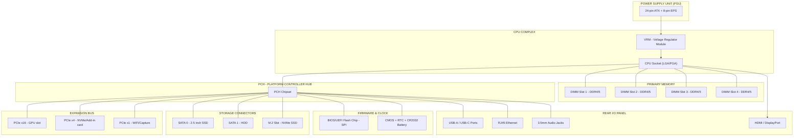
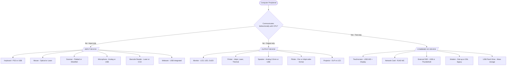
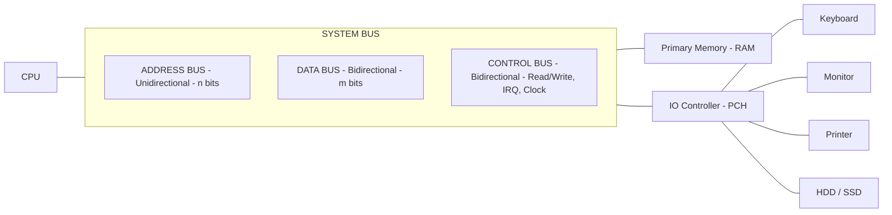
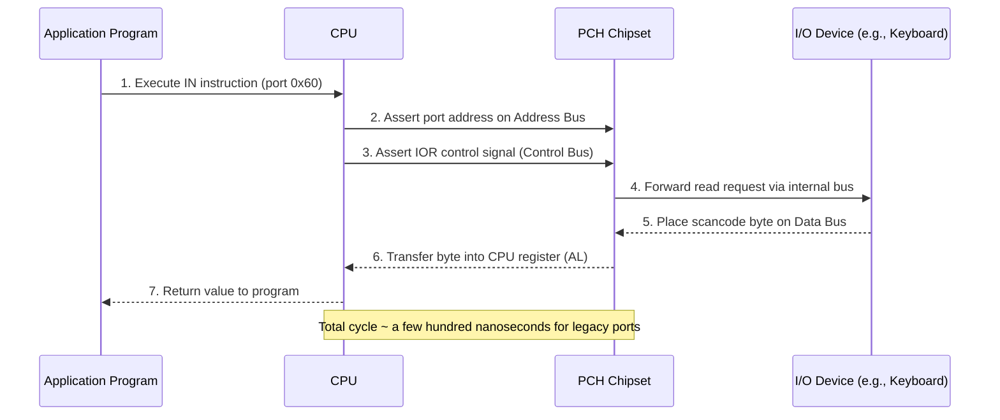

# Motherboard - Computer Peripherals - I/O devices

<!-- SECTION_1_START -->
# Foundations of Computing: Motherboard, Computer Peripherals & I/O Devices

## 1.1 What is a Motherboard?

> [!NOTE]
> **Formal Definition (KTU 2024 Syllabus Term):**
> The **motherboard** (also called the *mainboard*, *system board*, or *planar board*) is the primary **printed circuit board (PCB)** of a computer that mechanically and electrically connects all critical components of a computer system — including the **Central Processing Unit (CPU)**, **Random Access Memory (RAM)**, **storage devices**, and **peripheral controllers** — via a structured set of traces, slots, sockets, and **bus interconnects**.

> [!IMPORTANT]
> **KTU 2024 Highlight:** The motherboard is the *central nervous system* of the computer. Almost every question in the ESE on Module 1 of GXEST203 (Hardware Essentials) tests your ability to map a component (e.g., "Which chip controls USB?") to its physical or logical location on the motherboard.

### 1.2 Intuitive Analogy — The City Infrastructure

Imagine a **smart city**:
- **CPU** → The Mayor's Office (issues all commands).
- **Chipset (PCH)** → The City Council (routes traffic between departments).
- **RAM slots** → Highway on-ramps (fast, temporary lanes).
- **Storage connectors (SATA/M.2)** → Warehouses on the outskirts.
- **I/O ports (USB, HDMI, Audio)** → City gates and airports (where citizens/visitors come in and out).
- **BIOS/UEFI chip** → The city charter (rules of operation written at "birth").
- **CMOS battery** → A clock and memory keeper that never sleeps.
- **PCB traces** → The actual roads and power lines.
- **Power connector (24-pin ATX)** → The main power plant feeding the city.

A city cannot function without roads, gates, and power lines — and neither can a computer function without its motherboard.

### 1.3 What are Peripherals?

> [!NOTE]
> **Formal Definition:**
> A **peripheral** is any auxiliary hardware device connected to a computer that provides **input**, **output**, or **storage** functions but is **not part of the core CPU–memory datapath**. Peripherals communicate with the CPU through the motherboard's I/O subsystem using standardized **bus protocols** (USB, PCIe, SATA, etc.).

### 1.4 What are I/O Devices?

**I/O (Input/Output) devices** are a *functional subset* of peripherals that allow bidirectional or unidirectional **data exchange between the user (or external world) and the computer system**.

| Category | Direction | Example Devices |
|---|---|---|
| **Input devices** | User → Computer | Keyboard, Mouse, Scanner, Microphone, Webcam, Barcode Reader |
| **Output devices** | Computer → User | Monitor (VDU), Printer, Speaker, Plotter, Projector |
| **Input/Output (combined)** | Bidirectional | Touchscreen, Network Card (NIC), Modem, External SSD |

> [!IMPORTANT]
> **Terminology Distinction (Frequently Tested):**
> - *Peripheral* = physical device outside the CPU/RAM.
> - *I/O Device* = functional role of exchanging data.
> - All I/O devices are peripherals, but not all peripherals are I/O (e.g., a **GPU** is technically a peripheral but is a *processing* device, not strictly an I/O device in the classical sense).

### 1.5 GeoGebra / Desmos Visualization Callout

> [!VISUALIZATION CONTROL]
> **Concept:** Logical Block Diagram of a Computer System showing data flow between CPU, Memory, and I/O via the Motherboard.
> **GeoGebra / Desmos Input Equations (Coordinate-Based Abstract Plot):**
> - *Plot 4 reference points on a 2D plane to represent system components:*
> - Point $A = (0, 5)$ → label: "CPU"
> - Point $B = (-4, 0)$ → label: "RAM (Primary Memory)"
> - Point $C = (4, 0)$ → label: "I/O Devices (Peripherals)"
> - Point $D = (0, 0)$ → label: "Motherboard (Bus Interconnect)"
> - *Draw 3 connecting lines representing the System Bus:*
> - Segment $AD$ (CPU ↔ Motherboard)
> - Segment $BD$ (RAM ↔ Motherboard)
> - Segment $CD$ (I/O ↔ Motherboard)
> **Visual Description:** The student should see a *star topology* with the motherboard at the center routing every transaction, just as a real bus arbiter routes packets. The angle between any two lines from $D$ should be roughly **120°**, emphasizing equal access priority.

---

<!-- SECTION_1_END -->

<!-- SECTION_2_START -->
# Deep Theoretical Analysis & KTU High-Yield Formula Sheet

## 2.1 Internal Architecture of the Motherboard

A modern motherboard (ATX form factor is the most common in KTU-recommended PC labs) is built around these **8 critical subsystems**:

### 2.1.1 CPU Socket
- Mechanical and electrical interface for the processor.
- **LGA (Land Grid Array)** — Intel (e.g., LGA 1700).
- **PGA (Pin Grid Array)** — older AMD AM-series.
- Carries hundreds of **pins/contacts** that connect to:
  - Address bus
  - Data bus
  - Control bus
  - Power & ground planes

### 2.1.2 Chipset — The Traffic Controller
> [!NOTE]
> **Modern Terminology:** The traditional **Northbridge** (memory controller + graphics link) and **Southbridge** (I/O controller) have been consolidated. On modern Intel/AMD boards, the chipset is called the **PCH (Platform Controller Hub)**.

| Legacy Component | Function | Modern Equivalent |
|---|---|---|
| **Northbridge** | Memory controller, AGP/PCIe x16 for GPU, high-speed link to CPU | Integrated into the **CPU die** itself (since ~2010) |
| **Southbridge** | USB, SATA, Audio, LAN, BIOS, PCI slots, LPC/SPI | **PCH** chip on the motherboard |

### 2.1.3 Memory Slots (DIMM)
- **DIMM = Dual In-line Memory Module** sockets.
- Modern standard: **DDR4** or **DDR5**.
- The number of pins (288 for DDR4) and notch position enforce compatibility.

### 2.1.4 Expansion Slots
- **PCIe (Peripheral Component Interconnect Express)** — point-to-point serial bus.
- Sizes: **x1, x4, x8, x16** (physical length differs; bandwidth scales linearly).
- Used for: GPUs (x16), NVMe SSDs (x4), Wi-Fi cards, capture cards.

### 2.1.5 Storage Connectors
- **SATA (Serial ATA)** — for HDDs, 2.5" SSDs, optical drives. Current max ~**6 Gbps** (SATA III).
- **M.2 (NGFF)** — small form factor; supports both SATA and **NVMe (PCIe-based)** SSDs at up to **64 Gbps** (PCIe 5.0 x4).

### 2.1.6 Power Connectors
- **24-pin ATX** — main motherboard power.
- **8-pin EPS (CPU)** — dedicated CPU power.
- **6/8-pin PCIe** — supplementary GPU power.

### 2.1.7 Firmware Chip — BIOS / UEFI
- **BIOS (Basic Input/Output System)** — legacy 16-bit firmware, MB-mode addressing.
- **UEFI (Unified Extensible Firmware Interface)** — modern 32/64-bit firmware, GPT disks, Secure Boot, mouse-driven GUI.
- Stores the **POST (Power-On Self-Test)** and bootloader pointer.

### 2.1.8 CMOS & RTC
- **CMOS (Complementary Metal-Oxide-Semiconductor) RAM** stores BIOS settings.
- **RTC (Real-Time Clock)** keeps date/time.
- Both are powered by a **CR2032 lithium coin-cell battery** (~3V) so settings survive when the PC is unplugged.

## 2.2 The System Bus — The Backbone

The bus system consists of three logical sub-buses:

| Sub-Bus | Direction (typical) | Width | Function |
|---|---|---|---|
| **Address Bus** | CPU → Memory/I/O | Unidirectional | Carries the memory/I/O *location* |
| **Data Bus** | Bidirectional | Bidirectional | Carries the *actual value* being read/written |
| **Control Bus** | Bidirectional | Bidirectional | Carries *commands* (Read/Write, IRQ, Clock, Reset) |

### 2.2.1 KTU High-Yield Formula Sheet

| # | Formula / Concept | Equation | Notes / Units |
|---|---|---|---|
| 1 | **Addressable memory locations** | $N = 2^n$ | $n$ = width of address bus in bits |
| 2 | **Maximum addressable memory** | $M = 2^n \times W$ | $W$ = word size in bytes |
| 3 | **Bus bandwidth (theoretical)** | $B = \dfrac{f_{\text{bus}} \times w}{8}$ | $f$ in Hz, $w$ = bus width in bits, $B$ in **bytes/sec** |
| 4 | **PCIe bandwidth per lane (Gen $g$)** | $B_{\text{lane}} = g \times 250\ \text{MB/s}$ | Gen1: 250, Gen2: 500, Gen3: 985, Gen4: 1969, Gen5: 3938 MB/s |
| 5 | **Total PCIe bandwidth** | $B_{\text{total}} = B_{\text{lane}} \times N_{\text{lanes}}$ | $N_{\text{lanes}} \in \{1, 4, 8, 16\}$ |
| 6 | **I/O port address (x86 Isolated I/O)** | $\text{Range} = 0000\text{H} - \text{FFFFH}$ | 16-bit port address space ⇒ 65,536 ports |
| 7 | **Storage capacity** | $C = Cyl \times H \times S$ | Cylinders × Heads × Sectors (CHS — legacy) |
| 8 | **Sector size** | $S = 512\ \text{bytes (legacy)} \ \vert\ 4096\ \text{bytes (Advanced Format)}$ | Used in HDD/SSD capacity math |
| 9 | **USB theoretical max (USB 3.2 Gen 2x2)** | $B = 20\ \text{Gbps} = 2.5\ \text{GB/s}$ | Practical throughput is lower (~60–70%) |
| 10 | **CMOS battery typical voltage** | $V_{\text{CMOS}} = 3\ \text{V}$ (CR2032) | Powers RTC + BIOS settings |

> [!IMPORTANT]
> **KTU 2024 — Frequently Tested Numerical:**
> *A system has a 32-bit address bus and a 16-bit data bus. Find the maximum directly addressable memory in MB.*
> $M = 2^{32} \times 2\ \text{bytes} = 2^{33}\ \text{bytes} = 8\ \text{GB}$.
> The student is expected to write **both** the formula *and* the unit conversion.

## 2.3 I/O Addressing — How the CPU Talks to Peripherals

There are **two fundamental I/O addressing schemes**:

### 2.3.1 Port-Mapped I/O (PMIO / Isolated I/O)
- Uses a **separate address space** distinct from memory.
- x86 uses **IN** and **OUT** instructions.
- Limited to **65,536 ports** (16-bit port address).
- Example: x86 **port 60H** = keyboard data port.

### 2.3.2 Memory-Mapped I/O (MMIO)
- Peripherals are mapped into the *same* address space as RAM.
- Uses standard **load/store** instructions.
- **No port address limit** — limited only by address bus width.
- Used heavily on ARM, RISC-V, and modern GPUs/PCIe devices.

| Feature | PMIO (Isolated) | MMIO |
|---|---|---|
| Address space | Separate | Shared with RAM |
| Instructions | Special (IN/OUT) | Standard (LDR/STR, MOV) |
| Speed | Faster for small devices | Faster for bulk transfer (DMA-friendly) |
| Used by | x86 legacy, simple controllers | ARM, GPUs, NVMe, network cards |

## 2.4 Classification of I/O Devices (Functional View)

I/O devices can be classified by **data-transfer mode**:

| Mode | Description | Examples |
|---|---|---|
| **Character-mode I/O** | Data transferred one byte/character at a time | Keyboard, Serial port, Mouse (PS/2) |
| **Block-mode I/O** | Data transferred in fixed-size blocks (sectors) | HDD, SSD, USB drive |
| **Network I/O** | Data transferred as packets over a network | NIC, Wi-Fi, Modem |
| **Memory-mapped I/O** | Device registers accessed via load/store | GPU framebuffer, NVMe controller |

## 2.5 Why This Matters in Real Engineering

- **Embedded systems engineers** design custom motherboards (PCBs) for IoT devices using MMIO extensively.
- **Cybersecurity analysts** need to know that DMA attacks (e.g., *PCILeech*) exploit PCIe direct memory access.
- **Cloud infrastructure** relies on PCIe NVMe SSDs to reduce storage latency in data centers.
- **Web developers (your future selves)** need to understand why connecting a USB device triggers a PCH interrupt and OS-level enumeration before the browser can see a webcam.

---

<!-- SECTION_2_END -->

<!-- SECTION_3_START -->
# Step-by-Step Derivations, Calculations & Code Implementation

## 3.1 Worked Example 1 — Address Bus Width & Memory Capacity

> **Problem (KTU-style):** A given CPU has a **36-bit address bus** and a **64-bit data bus**. Calculate the maximum directly addressable memory in **GB**.

### Step-by-Step Model Solution

**Step 1:** Identify the number of addressable locations.
$$N = 2^n = 2^{36}$$

**Step 2:** Identify word size.
$$W = 64\ \text{bits} = \dfrac{64}{8}\ \text{bytes} = 8\ \text{bytes per word}$$

**Step 3:** Compute total addressable memory in bytes.
$$M = N \times W = 2^{36} \times 8\ \text{bytes} = 2^{36} \times 2^3\ \text{bytes} = 2^{39}\ \text{bytes}$$

**Step 4:** Convert to GB ($1\ \text{GB} = 2^{30}\ \text{bytes}$).
$$M = \dfrac{2^{39}}{2^{30}}\ \text{GB} = 2^{9}\ \text{GB} = 512\ \text{GB}$$

> **[Final Answer: 512 GB — Award 2 Marks for formula, 2 Marks for substitution, 1 Mark for unit conversion]**

---

## 3.2 Worked Example 2 — PCIe Bandwidth Calculation

> **Problem:** A graphics card uses a **PCIe 4.0 ×16** slot. Compute its **theoretical peak bandwidth** in GB/s.

### Step-by-Step Model Solution

**Step 1:** Recall the per-lane bandwidth for PCIe 4.0.
$$B_{\text{lane}} \approx 1969\ \text{MB/s} \approx 1.969\ \text{GB/s}$$

**Step 2:** Multiply by number of lanes ($N = 16$).
$$B_{\text{total}} = B_{\text{lane}} \times N = 1.969\ \text{GB/s} \times 16$$

**Step 3:** Final computation.
$$B_{\text{total}} \approx 31.5\ \text{GB/s}$$

> **[Final Answer: ~31.5 GB/s — Award 1 Mark for PCIe Gen formula, 1 Mark for lane count, 2 Marks for calculation, 1 Mark for correct unit]**

---

## 3.3 Worked Example 3 — Hard Disk Capacity (CHS)

> **Problem:** A legacy HDD is reported as **Cyl = 1024, Heads = 16, Sectors = 63**. Each sector is **512 bytes**. Find the total capacity in **MB**.

### Step-by-Step Model Solution

**Step 1:** Use the CHS capacity formula.
$$C = \text{Cyl} \times \text{Heads} \times \text{Sectors per track} \times \text{Bytes per sector}$$

**Step 2:** Substitute the values.
$$C = 1024 \times 16 \times 63 \times 512$$

**Step 3:** Compute stepwise.
$$1024 \times 16 = 16{,}384$$

$$16{,}384 \times 63 = 1{,}032{,}192$$

$$1{,}032{,}192 \times 512 = 528{,}482{,}304\ \text{bytes}$$

**Step 4:** Convert to MB.
$$C = \dfrac{528{,}482{,}304}{1{,}048{,}576} \approx 504\ \text{MB}$$

> **[Final Answer: ~504 MB — Award 2 Marks for the formula, 2 Marks for substitution, 1 Mark for conversion]**

---

## 3.4 Symbolic / Code Implementation — I/O Port Communication Simulation (Python)

The following Python program simulates **Port-Mapped I/O** to demonstrate how a CPU reads from a keyboard controller (x86 port **0x60**) using an emulated I/O address space.

```python
"""
Filename: port_mapped_io_demo.py
Module  : GXEST203 - Foundations of Computing
Topic   : Port-Mapped I/O (PMIO) Demonstration
Purpose : Emulate reading from x86 I/O port 0x60 (keyboard data port)
          and writing to port 0x378 (classic LPT1 printer port).
"""

from dataclasses import dataclass, field
from typing import Dict
import logging

# ---------- Configuration ----------
logging.basicConfig(level=logging.INFO, format="[%(levelname)s] %(message)s")
log = logging.getLogger("PMIO-Demo")

KEYBOARD_PORT: int = 0x60     # Standard PS/2 keyboard data port (read-only)
PRINTER_PORT:   int = 0x378   # Standard LPT1 data register (write-only)
MAX_PORTS:      int = 0x10000  # 16-bit address space: 65,536 ports


@dataclass
class IOPortSpace:
    """Emulates the x86 Isolated I/O address space."""
    ports: Dict[int, int] = field(default_factory=dict)

    def in_port(self, address: int) -> int:
        """CPU IN instruction: read 1 byte from the given I/O port."""
        if not (0 <= address < MAX_PORTS):
            raise ValueError(f"Port address 0x{address:X} out of range [0, 0xFFFF]")
        value = self.ports.get(address, 0xFF)
        log.info(f"IN  0x{address:04X} -> 0x{value:02X}")
        return value

    def out_port(self, address: int, value: int) -> None:
        """CPU OUT instruction: write 1 byte to the given I/O port."""
        if not (0 <= address < MAX_PORTS):
            raise ValueError(f"Port address 0x{address:X} out of range [0, 0xFFFF]")
        if not (0 <= value <= 0xFF):
            raise ValueError(f"Value 0x{value:X} is not a single byte")
        self.ports[address] = value
        log.info(f"OUT 0x{address:04X} <- 0x{value:02X}")


def main() -> None:
    io = IOPortSpace()

    # --- 1. Pretend the keyboard controller latched the scan-code for 'A' (0x1E) ---
    io.ports[KEYBOARD_PORT] = 0x1E

    # --- 2. CPU reads the keyboard port ---
    scancode = io.in_port(KEYBOARD_PORT)
    log.info(f"Received scancode: 0x{scancode:02X}")

    # --- 3. CPU sends ASCII 'A' (0x41) to the printer port ---
    io.out_port(PRINTER_PORT, ord('A'))
    log.info(f"Sent 'A' to printer port 0x{PRINTER_PORT:X}")

    # --- 4. Try an out-of-range port to demonstrate error handling ---
    try:
        io.in_port(0x1FFFF)
    except ValueError as exc:
        log.error(f"Caught expected error: {exc}")


if __name__ == "__main__":
    main()
```

### Sample Output

```
[INFO] IN  0x0060 -> 0x1E
[INFO] Received scancode: 0x1E
[INFO] OUT 0x0378 <- 0x41
[INFO] Sent 'A' to printer port 0x378
[ERROR] Caught expected error: Port address 0x1FFFF out of range [0, 0xFFFF]
```

> **Conceptual Mapping for Students:**
> - `in_port()` ≈ x86 `IN AL, DX` instruction.
> - `out_port()` ≈ x86 `OUT DX, AL` instruction.
> - The 16-bit address space ⇒ 65,536 unique ports, which matches the formula $\text{Range} = 2^{16}$.

---

## 3.5 Hardware Wiring / Component Pin Reference (Lab Reference)

> [!NOTE]
> **Useful when you physically disassemble/reassemble a PC in the KTU Hardware Lab (EST 110 / EST 130):**

| Component | Connector Type on Motherboard | Voltage / Pin Count | Notes |
|---|---|---|---|
| **ATX Power** | 24-pin main | +3.3V, +5V, +12V rails | Detachable; side clip locks it |
| **CPU Power** | 8-pin EPS (4+4) | +12V | Located near CPU socket |
| **Case Front Panel** | 9-pin header | 5V | Power SW, Reset SW, HDD LED, Power LED |
| **CPU Fan** | 4-pin PWM header | 12V | 4th pin = PWM control signal |
| **SATA SSD/HDD** | L-shaped 7-pin | 5V + 12V | Hot-swappable in SATA spec |
| **M.2 NVMe SSD** | M-keyed edge connector | 3.3V | Sits flat on motherboard; one screw at far end |
| **Front USB 3.0** | 20-pin internal header | 5V | Two USB 3.0 ports per header |
| **CMOS Reset** | 2-pin header | n/a | Short pins 1-2 for 10s to clear BIOS |

---

<!-- SECTION_3_END -->

<!-- SECTION_4_START -->
# Structural Diagrams & Schematics

## 4.1 Motherboard High-Level Block Architecture



> [!IMPORTANT]
> **How to read this diagram for the exam:**
> - The **CPU** is connected to **RAM** and the **first PCIe slot (x16 for GPU)** via the *high-speed link* (DMI / Infinity Fabric).
> - The **PCH** handles *everything else* — USB, SATA, secondary PCIe, BIOS, LAN, Audio.
> - This explains why a faulty PCH can disable USB, SATA, and onboard audio *simultaneously* — a common viva question.

## 4.2 I/O Device Classification Flowchart



## 4.3 Bus Hierarchy Diagram



## 4.4 Sequential Processing Topology — I/O Read Cycle



---

<!-- SECTION_4_END -->

<!-- SECTION_5_START -->
# KTU 2024 Scheme Examination Question Bank & Topic Recap

## 5.1 Part A — Short Answer Questions (3 Marks Each)

### Question 1
> **[KTU University Exam – July 2024]**
> **CO1 | RBT Level: Remember**
> *Define a motherboard. List any **four** major components found on a motherboard.*

**Model Answer (3 Marks):**

> [!NOTE]
> **Definition (1 Mark):** A motherboard is the main printed circuit board (PCB) of a computer that connects and allows communication between the CPU, memory, storage devices, and peripheral components through buses and chipset controllers.

**Four Major Components (2 Marks — ½ Mark each):**
1. **CPU Socket** – holds the processor and provides electrical contacts.
2. **DIMM Slots** – hold RAM modules (DDR4/DDR5).
3. **PCH Chipset** – controls I/O peripherals and connects to the CPU.
4. **BIOS/UEFI Flash Chip** – stores firmware for POST and bootstrap.

*(Any four of: VRM, CMOS battery, SATA ports, M.2 slot, PCIe slots, Rear I/O panel, Audio codec.)*

---

### Question 2
> **[KTU University Exam – Dec 2023]**
> **CO1 | RBT Level: Understand**
> *Differentiate between **memory-mapped I/O** and **port-mapped I/O**. Mention **one** advantage of each.*

**Model Answer (3 Marks):**

| Aspect | Memory-Mapped I/O (MMIO) | Port-Mapped I/O (PMIO) |
|---|---|---|
| **Address space** (1 Mark) | Shared with main memory | Separate, dedicated I/O space |
| **Instruction used** | Standard load/store (e.g., `LDR`, `STR`, `MOV`) | Special I/O instructions (e.g., `IN`, `OUT`) |
| **Advantage** (1 Mark) | Faster for bulk transfer; supports DMA easily | Better memory protection — peripherals cannot corrupt program memory |

---

## 5.2 Part B — Long Answer Questions (14 Marks, with Internal Choice)

### Question A (14 Marks)

> **[KTU University Exam – July 2024]**
> **CO1, CO2 | RBT Levels: Understand + Apply**

#### Part (a) — 7 Marks — Understand Level

> *With a neat block diagram, explain the **architecture of a motherboard**. Identify and describe the function of the **CPU socket, chipset, BIOS/UEFI chip, CMOS battery, and expansion slots**.*

**Model Answer:**

**Introduction (1 Mark):**
A motherboard is the central PCB that integrates all subsystems of a computer. Modern boards use the **ATX form factor** and contain a CPU socket, memory slots, chipset, expansion slots, storage connectors, firmware chip, and rear I/O panel.

**Block Diagram (2 Marks):**
*(Student must draw a block diagram similar to Section 4.1 — 1 Mark for components labeled, 1 Mark for arrows/interconnections.)*

**Description of Components (4 Marks — 1 Mark each briefly):**
1. **CPU Socket (LGA/PGA):** Mechanical-electrical interface holding the processor. Carries address, data, and control signals to/from the chip.
2. **Chipset (PCH):** Single hub chip that controls USB, SATA, audio, LAN, and lower-speed PCIe lanes. Communicates with the CPU via a high-speed DMI link.
3. **BIOS/UEFI Flash Chip:** SPI-based non-volatile memory holding the firmware. Performs **POST (Power-On Self-Test)** and locates the OS bootloader.
4. **CMOS Battery (CR2032, 3V):** Maintains BIOS settings and the Real-Time Clock (RTC) when mains power is absent.
5. **Expansion Slots (PCIe x1, x4, x16):** Allow add-in cards such as GPUs, NVMe SSDs, and capture cards to communicate with the CPU/PCH at high bandwidth.

> **[Stating component list: 2 Marks | Drawing block diagram with arrows: 2 Marks | Functional explanation: 3 Marks]**

---

#### Part (b) — 7 Marks — Apply Level

> *A computer system has a **32-bit address bus** and a **16-bit data bus**.
> (i) Calculate the **maximum addressable memory** in MB.
> (ii) If a keyboard is mapped to I/O port address **0x60**, state the addressing scheme used and explain how the CPU reads a scancode from it.
> (iii) If a PCIe **Gen 3 ×16** GPU is installed, compute the **theoretical bandwidth per lane and total bandwidth**.*

**Model Answer:**

**(i) Maximum addressable memory (2 Marks):**

Number of locations:
$$N = 2^{32}$$

Word size:
$$W = 16\ \text{bits} = 2\ \text{bytes}$$

Total memory:
$$M = 2^{32} \times 2 = 2^{33}\ \text{bytes} = \dfrac{2^{33}}{2^{20}}\ \text{MB} = 2^{13}\ \text{MB} = 8192\ \text{MB} = 8\ \text{GB}$$

**[Stating formula: 1 Mark | Final value with unit: 1 Mark]**

---

**(ii) Keyboard port addressing (2 Marks):**

- **Scheme:** Port-Mapped I/O (Isolated I/O) — x86 uses dedicated 16-bit I/O port space (0000H–FFFFH), and the keyboard controller is mapped to port **0x60**.
- **Read sequence:**
  1. CPU executes `IN AL, 0x60` instruction.
  2. Address bus carries `0x0060`; control bus asserts `IOR#` (I/O Read).
  3. The keyboard controller places the scancode byte on the data bus.
  4. CPU latches the byte into the `AL` register and returns it to the program.

**[Scheme identification: 1 Mark | Read steps: 1 Mark]**

---

**(iii) PCIe Gen 3 ×16 bandwidth (3 Marks):**

Per-lane bandwidth (Gen 3):
$$B_{\text{lane}} \approx 985\ \text{MB/s}$$

Total bandwidth:
$$B_{\text{total}} = 985\ \text{MB/s} \times 16 = 15{,}760\ \text{MB/s} \approx 15.75\ \text{GB/s}$$

**[Per-lane value: 1 Mark | Multiplication: 1 Mark | Unit conversion: 1 Mark]**

---

### Question B (14 Marks) — Alternative Choice

> **[KTU University Exam – Dec 2023]**
> **CO1, CO2 | RBT Levels: Understand + Apply**

#### Part (a) — 7 Marks — Understand Level

> *Explain the **classification of computer peripherals** with examples. Differentiate between **input, output, and combined I/O devices** with at least **two examples** in each category.*

**Model Answer:**

**Definition (1 Mark):** A peripheral is any external hardware device that provides input, output, or storage functionality to a computer system and is not part of the core CPU-memory subsystem.

**Classification Table (3 Marks):**

| Category | Direction | Example 1 | Example 2 |
|---|---|---|---|
| Input | User → Computer | Keyboard (USB) | Scanner (Flatbed) |
| Output | Computer → User | Monitor (LCD) | Printer (Laser) |
| Combined I/O | Bidirectional | Touchscreen | Network Interface Card |

**Differences (3 Marks):**
- **Input devices** accept data and commands from the user; data flows *into* the system.
- **Output devices** present processed information to the user; data flows *out of* the system.
- **Combined I/O devices** can both accept and produce data — e.g., a touchscreen displays visual output and accepts touch input, while a NIC sends and receives network packets.

**[Classification table: 3 Marks | Direction explanation: 2 Marks | Two examples each: 2 Marks]**

---

#### Part (b) — 7 Marks — Apply Level

> *A legacy HDD reports the following CHS geometry: **Cylinders = 2048, Heads = 64, Sectors/track = 63, Bytes/sector = 512**.
> (i) Compute the **total capacity in MB**.
> (ii) If the same drive is connected via **SATA III**, what is the **maximum theoretical interface speed** in MB/s?
> (iii) Briefly explain how **DMA (Direct Memory Access)** offloads data transfer from the CPU.*

**Model Answer:**

**(i) HDD capacity (3 Marks):**

$$C = \text{Cyl} \times \text{Heads} \times \text{Sectors/track} \times \text{Bytes/sector}$$

$$C = 2048 \times 64 \times 63 \times 512$$

Stepwise:
$$2048 \times 64 = 131{,}072$$

$$131{,}072 \times 63 = 8{,}257{,}536$$

$$8{,}257{,}536 \times 512 = 4{,}227{,}858{,}432\ \text{bytes}$$

Convert to MB:
$$C = \dfrac{4{,}227{,}858{,}432}{1{,}048{,}576} \approx 4032\ \text{MB} \approx 4\ \text{GB}$$

**[Formula: 1 Mark | Substitution: 1 Mark | Conversion: 1 Mark]**

---

**(ii) SATA III speed (2 Marks):**

SATA III maximum theoretical speed = **6 Gbps** = **750 MB/s** (approx, 600 MB/s after 8b/10b encoding).

**[Value: 1 Mark | Encoding note: 1 Mark]**

---

**(iii) DMA explanation (2 Marks):**

**Direct Memory Access (DMA)** allows peripheral devices to transfer data to/from main memory *without* continuous CPU intervention. The CPU sets up the DMA controller with source, destination, and byte count, then performs other tasks. The DMA controller arbitrates the bus and moves data autonomously, generating an **interrupt** to the CPU only on completion. This dramatically improves I/O throughput and frees the CPU for computation.

**[Concept: 1 Mark | Interrupt mechanism: 1 Mark]**

---

> [!WARNING]
> **KTU Examiner's Valuation Warning — Common Pitfalls:**
> 1. **Forgetting units.** Writing "8192" instead of **"8192 MB = 8 GB"** costs 1 full mark.
> 2. **Mixing up PCH with Northbridge/Southbridge** without stating *both* names. Always write "**PCH (modern equivalent of the Southbridge)**" to be safe.
> 3. **Confusing BIOS with CMOS.** BIOS is the *firmware code*; CMOS is the *battery-backed RAM* storing settings. Examiners **deduct ½ Mark** for swapping them.
> 4. **Skipping the block diagram** in Part (a) of Question A. A question asking "with a neat diagram" awards **0 marks** if the diagram is missing.
> 5. **Wrong PCIe Gen value.** PCIe 3.0 per-lane = **~985 MB/s**, not 1 GB/s. Use the exact figure from the formula sheet.
> 6. **In DMA questions**, never say "DMA replaces the CPU" — it *offloads* the CPU, the CPU still controls the system.

---

## 5.3 Topic Recap & Important Things to Remember

> [!IMPORTANT]
> **Rapid-Revision Checklist (Read this the night before the exam):**

- **Motherboard = Central PCB** connecting CPU, RAM, storage, and peripherals via buses and chipset.
- **CPU Socket types:** LGA (Intel), PGA (AMD).
- **Chipset (PCH)** controls I/O; modern CPU has integrated memory controller + PCIe root complex.
- **DIMM slots** hold DDR4/DDR5 RAM — pins: 288 (DDR4) / 288 (DDR5) — notch position prevents wrong insertion.
- **PCIe lanes** scale linearly: x1, x4, x8, x16. Gen 3 per lane ≈ **985 MB/s**; Gen 4 ≈ **1969 MB/s**; Gen 5 ≈ **3938 MB/s**.
- **SATA III** = 6 Gbps ≈ **750 MB/s** raw / **600 MB/s** after 8b/10b encoding.
- **M.2** supports both SATA and NVMe (PCIe) — check the keying (B, M, or B+M).
- **BIOS/UEFI** firmware is stored in SPI flash; performs **POST** and bootstraps the OS.
- **CMOS + RTC** backed by **CR2032 (3V)** coin-cell battery.
- **Three bus types:** Address (unidirectional), Data (bidirectional), Control (bidirectional).
- **Maximum addressable memory** = $2^n \times W$ where $n$ = address bus bits, $W$ = word size in bytes.
- **I/O addressing:**
  - **PMIO** (x86) → 16-bit port space → 65,536 ports → special `IN/OUT` instructions.
  - **MMIO** (ARM, GPUs) → devices mapped into RAM space → standard load/store.
- **I/O device categories:** Input (Keyboard, Mouse), Output (Monitor, Printer), Combined I/O (Touchscreen, NIC).
- **Character-mode** = byte-by-byte (keyboard). **Block-mode** = sectors (HDD). **DMA** = autonomous bus-mastering transfer with CPU offload.
- **Block diagrams must always include arrows** showing data flow direction (CPU ↔ RAM, CPU ↔ PCH, PCH → USB, etc.).
- **Always write units** (bits vs bytes; MB vs GB; Mbps vs MB/s).
- **Conversion constants to memorize:**
  - 1 KB = $2^{10}$ bytes = 1024 B
  - 1 MB = $2^{20}$ bytes
  - 1 GB = $2^{30}$ bytes
  - 1 TB = $2^{40}$ bytes
  - 1 byte = 8 bits

> **Final Exam Tip:** When asked *"Explain the architecture of a motherboard,"* always start with the **block diagram first**, then explain each block. Examiners reward visual structure heavily — it makes valuation faster and fairer.

---

<!-- SECTION_5_END -->
