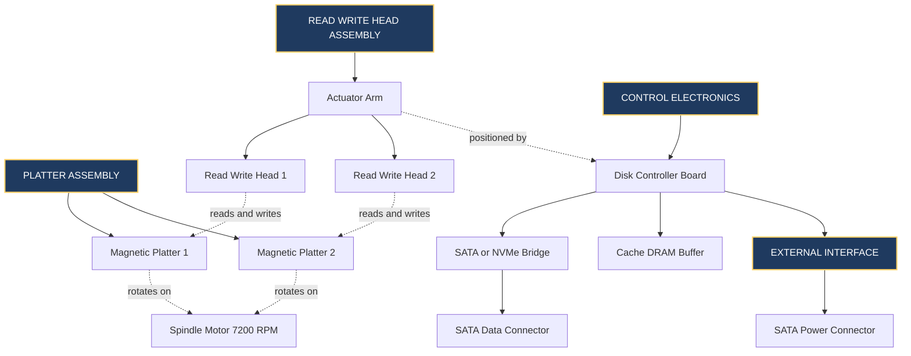
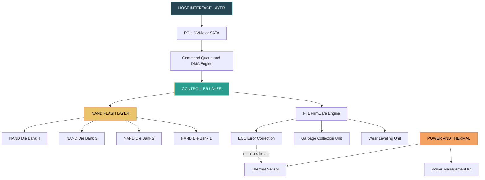
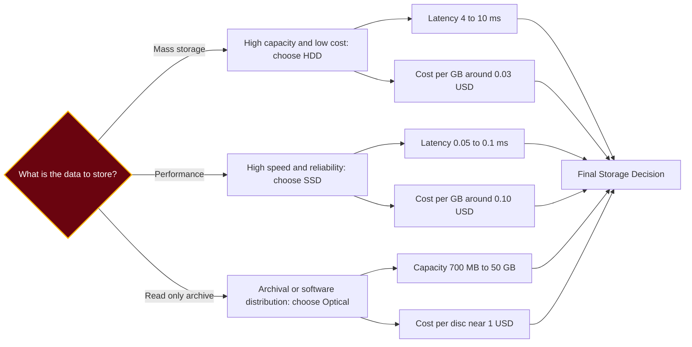
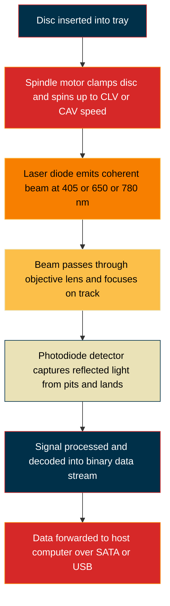

# Storage devices- HDDs, SSDs, optical drives

<!-- SECTION_1_START -->

# Storage Devices: HDDs, SSDs & Optical Drives

## 1.1 Formal Definition (KTU 2024 Syllabus Terminology)

A **storage device** is a hardware component of a computer system that is used to permanently store, retrieve, and manage data, programs, and instructions, both during and beyond the operational life of the system. In the KTU 2024 Scheme architecture (Course: **GXEST203 — Foundations of Computing**), storage devices are classified as **secondary (auxiliary) memory**, sitting below the CPU registers and primary RAM in the memory hierarchy but above tertiary archival media in terms of access speed.

> [!IMPORTANT]
> **KTU 2024 Definition Anchor:** Storage devices are *non-volatile* — they retain data even when the system is powered off. This is the single most important property distinguishing them from primary memory (RAM).

The three principal families of storage devices covered in **Module 1 (Computer Hardware & CPU)** are:

1. **Hard Disk Drives (HDDs)** — electromechanical magnetic storage
2. **Solid State Drives (SSDs)** — semiconductor NAND-flash storage
3. **Optical Drives** — laser-based read/write of CDs, DVDs, and Blu-ray discs

---

## 1.2 Conceptual Analogy & Intuition

Think of your computer as a **kitchen**:

| Computer Concept | Kitchen Analogy |
| :--- | :--- |
| **Registers & Cache (CPU)** | The chef's hands and cutting board — instant access |
| **RAM (Primary Memory)** | The countertop — fast, but cleared after cooking |
| **HDD (Secondary Storage)** | A deep **walk-in refrigerator** with rotating shelves — large, organized, but you have to *walk* to the item |
| **SSD** | A **wall of labeled, pre-wrapped meal containers** — no walking, no rotation, just open the right locker |
| **Optical Drive (CD/DVD)** | A **recipe book with engraved pages** — you can only read by shining a light, and writing requires a special pen |

> [!NOTE]
> **Intuitive Rule of Thumb:** If a component has *moving mechanical parts*, it is fundamentally **slower** but historically **cheaper per gigabyte**. If it has *no moving parts* (pure silicon), it is faster but more expensive per gigabyte. This trade-off is the heart of the HDD vs. SSD debate.

---

## 1.3 Physical Constants & Standard Metrics

The following standardized engineering figures appear frequently in KTU board examinations and **must be memorized** (rendered in **bold**):

- **HDD Standard Platter Rotation Speeds:** **5,400 RPM** (laptop/green), **7,200 RPM** (desktop mainstream), **10,000 RPM** (enterprise), **15,000 RPM** (mission-critical servers).
- **Sector Size:** **512 bytes** (legacy) and **4 KiB (4096 bytes)** in **Advanced Format (AF)** drives.
- **SSD NAND Cell Types:** **SLC (1 bit/cell)**, **MLC (2 bits/cell)**, **TLC (3 bits/cell)**, **QLC (4 bits/cell)**.
- **Optical Disc Capacities (industry standard):** CD = **700 MB**, DVD = **4.7 GB** (single-layer) / **8.5 GB** (dual-layer), Blu-ray = **25 GB** (single-layer) / **50 GB** (dual-layer).
- **Laser Wavelengths (Optical):** CD = **780 nm (infrared)**, DVD = **650 nm (red)**, Blu-ray = **405 nm (blue-violet)**.

> [!TIP]
> **Why Blu-ray is "Blue":** A *shorter wavelength* of laser light can be focused to a *smaller spot size*, allowing the disc pits to be packed more densely. This is why the same 12 cm disc holds 25 GB instead of 4.7 GB — pure physics of diffraction-limited spot size.

---

> [!VISUALIZATION CONTROL]
> **Concept:** Visualizing the Storage Hierarchy Pyramid (bandwidth vs. capacity)
> **GeoGebra / Desmos Input Equations:**
> * `f(x) = 10^x` (logarithmic bandwidth scale)
> * Points: `(Cost per GB: 0.1, $100)`, `(HDD: 1, $0.03)`, `(SSD: 100, $0.10)`, `(RAM: 10000, $5)`
> **Visual Description:** Students should plot a downward pyramid with **Cost-per-GB** on the y-axis dropping as you move from registers → RAM → SSD → HDD → Tape, while **Capacity** rises. This visually shows the *inverse* relationship between speed and capacity in the memory hierarchy.

<!-- SECTION_1_END -->

<!-- SECTION_2_START -->

# Deep Theoretical Analysis & KTU High-Yield Formula Sheet

## 2.1 Hard Disk Drive (HDD) — Internal Architecture

An HDD is an **electromechanical**, *magnetic-recording* storage device. It stores data as microscopic magnetized regions on rapidly spinning circular platters.

### 2.1.1 Major Mechanical Subsystems

A modern HDD consists of the following physical subcomponents:

- **Platters (Disks):** Circular, ultra-flat substrates (aluminum or glass) coated with a thin magnetic film (typically a cobalt-based alloy). A 3.5" desktop HDD contains **1 to 8 platters** stacked on a common spindle.
- **Spindle Motor:** Drives the platters at a constant angular velocity. Speed is measured in **RPM (Revolutions Per Minute)**.
- **Read/Write Heads:** Tiny electromagnetic transducers mounted on the tip of the actuator arm. They "float" above the platter surface on an air-bearing cushion at a height of roughly **3–5 nanometers** (≈ 1/15th the diameter of a human hair).
- **Actuator Arm & Voice Coil:** A precisely controlled servo-motor that positions the read/write heads radially across the platter. Movement can be **rotational** (older drives) or **linear** (newer "PMR" drives).
- **Sector & Track Geometry:** Each platter is logically partitioned into **concentric tracks**, which are subdivided into **sectors** (the smallest addressable unit, traditionally 512 bytes).
- **Cylinder:** A set of tracks at the same radius on all platters, addressed simultaneously by all heads.

### 2.1.2 Why "Defragmenting" Helps HDDs

When files are written non-contiguously, the heads must **seek** between many distant physical locations. Because HDDs suffer from *rotational latency* and *seek time*, scattered files degrade performance. SSDs do **not** suffer from fragmentation in the same way because they have no moving parts — access time is uniform regardless of physical location.

---

## 2.2 Solid State Drive (SSD) — Semiconductor Architecture

An SSD has **zero moving parts**. It is built entirely from semiconductor memory cells and a controller.

### 2.2.1 NAND Flash Memory

- Data is stored in **floating-gate MOSFETs**.
- Each cell holds a *threshold voltage* representing a stored charge.
- The SSD is organized as a hierarchy: **Die → Plane → Block → Page**.
- **Page** is the smallest unit of *read* and *write* (typically 4 KiB to 16 KiB).
- **Block** is the smallest unit of *erase* (typically 256 pages ≈ 1 MiB to 4 MiB).

> [!WARNING]
> **Exam Pitfall:** A common KTU 2024 question asks "Can you write a single byte to NAND flash?" The answer is **NO** — NAND must be erased *block-wise* and written *page-wise*. This asymmetry is the reason for the **Write Amplification** problem and **TRIM** commands.

### 2.2.2 SSD Controller & FTL

The on-board **controller** runs a firmware layer called the **Flash Translation Layer (FTL)**. The FTL performs three critical jobs:

1. **Logical-to-Physical (L2P) Address Mapping** — Hides bad blocks from the OS.
2. **Wear Leveling** — Distributes writes evenly across cells to extend endurance (measured in **TBW — Terabytes Written**).
3. **Garbage Collection** — Reclaims invalid pages and consolidates them into free blocks.

---

## 2.3 Optical Drives — Laser-Engraved Storage

Optical drives use a **low-power laser diode** to read (and sometimes write) data encoded as microscopic **pits** and **lands** along a single **spiral track** (unlike HDDs which use concentric tracks).

- **Read-Only:** CD-ROM, DVD-ROM, BD-ROM
- **Write-Once:** CD-R, DVD-R, BD-R (use a heat-sensitive dye)
- **Rewritable:** CD-RW, DVD-RW, BD-RE (use a phase-change alloy)

> [!IMPORTANT]
> **Key Physical Insight:** The shorter the laser wavelength, the **smaller the spot size**, the **denser the pits**, the **higher the capacity**. This is the entire reason Blu-ray discs use a **405 nm blue-violet laser** instead of DVD's 650 nm red laser.

---

## 2.4 KTU Formula Sheet (High-Yield Cheat Sheet)

The following table is the *complete set* of formulas you are expected to apply in KTU 2024 ESE for storage devices. **No external symbols, only the variables listed below.**

| # | Quantity | Formula | Units / Notes |
| :--- | :--- | :--- | :--- |
| 1 | HDD Storage Capacity | $C \;=\; S \times T \times B$ | $S$=surfaces, $T$=tracks/surface, $B$=bytes/sector. Result in **bytes**. |
| 2 | Average Rotational Latency | $L_{rot} \;=\; \dfrac{30}{RPM}$ | **Seconds.** Derived from $1/(2f)$ where $f$=rotations/sec. |
| 3 | Full-Rotation Time | $T_{rev} \;=\; \dfrac{60}{RPM}$ | Seconds per revolution. |
| 4 | Average Access Time | $T_{acc} \;=\; T_{seek} \;+\; L_{rot} \;+\; T_{xfer}$ | Sum of seek + latency + transfer. |
| 5 | Data Transfer Rate (HDD) | $R \;=\; \dfrac{\text{Bytes per track}}{T_{rev}}$ | Bytes per second. |
| 6 | Optical Disc Data Rate | $R_{opt} \;=\; \dfrac{\text{Track pitch}}{T_{rev}}$ | Depends on CLV vs. CAV. |
| 7 | SSD Write Endurance | $TBW \;=\; \dfrac{\text{P/E cycles} \times \text{Capacity}}{WAF}$ | $WAF$=Write Amplification Factor ($\geq 1$). |
| 8 | Power-Law of Blu-ray Capacity | $C_{BD} \;\propto\; \dfrac{1}{\lambda^{2}}$ | $C \approx C_{DVD} \times (650/405)^{2}$ |
| 9 | Sector Count | $N_{sec} \;=\; \dfrac{2 \pi R_{avg}}{L_{sector}}$ | $R_{avg}$ = average track radius, $L_{sector}$ = linear bit density |
| 10 | Areal Density | $A \;=\; \text{BPI} \times \text{TPI}$ | Bits-per-inch $\times$ tracks-per-inch, units **bits/in²**. |

> [!NOTE]
> **Exam-Tip:** For KTU 2024 derivations, the most frequently asked formula is #2 (Rotational Latency) and #4 (Average Access Time). Always show the substitution step clearly; do not jump to a numeric answer.

---

## 2.5 Real-World Engineering Utility

| Domain | Storage Device in Production Use |
| :--- | :--- |
| **Data Centers (Hot tier)** | NVMe SSDs over PCIe 4.0/5.0 for sub-millisecond access |
| **Data Centers (Cold tier)** | HDDs (e.g., 18 TB Exos drives) for cheap bulk storage |
| **Gaming Consoles** | Custom NVMe SSDs (PS5, Xbox Series X) with custom controllers |
| **Laptops (2024+)** | PCIe Gen 4 NVMe SSDs; HDDs nearly extinct in ultrabooks |
| **Software Distribution (legacy)** | DVD-ROMs in boxed software (e.g., Ubuntu 8.04 shipped on DVD) |
| **Archival / Long-term** | M-Disc (Blu-ray) with claimed 1,000-year lifespan using inorganic data layer |
| **Embedded / Industrial** | Industrial-grade SLC SSDs for extreme temperature tolerance |

<!-- SECTION_2_END -->

<!-- SECTION_3_START -->

# Step-by-Step Derivations, Calculations & Symbolic Implementation

> [!IMPORTANT]
> Per KTU-PREMIER-ENGINE V10 protocol, *no* step is skipped. Every algebraic transition and numerical substitution is fully written out.

---

## 3.1 Derivation 1 — Average Rotational Latency

**Premise:** A platter rotates at a constant angular velocity. On average, the sector you need is **half a revolution away** from being under the read/write head.

**Step 1.** One full revolution takes time $T_{rev}$ (in seconds).

$$T_{rev} \;=\; \frac{60 \text{ seconds}}{RPM}$$

**Step 2.** Half a revolution is therefore the *average* time the head must wait for the correct sector to arrive.

$$L_{rot} \;=\; \frac{T_{rev}}{2} \;=\; \frac{1}{2} \cdot \frac{60}{RPM} \;=\; \frac{30}{RPM}$$

**Step 3.** Worked numerical example for a 7,200 RPM drive:

$$L_{rot} \;=\; \frac{30}{7200} \;=\; \frac{1}{240} \;\approx\; 0.0041667 \text{ seconds} \;\approx\; 4.17 \text{ ms}$$

**Step 4.** Worked numerical example for a 15,000 RPM enterprise drive:

$$L_{rot} \;=\; \frac{30}{15000} \;=\; \frac{1}{500} \;=\; 0.002 \text{ seconds} \;=\; 2.0 \text{ ms}$$

> [!NOTE]
> **Key Engineering Insight:** Doubling the spindle speed *halves* the rotational latency but does not affect seek time. This is why 15K RPM drives are reserved for high-IOPS server workloads.

---

## 3.2 Derivation 2 — Total HDD Access Time

**Premise:** The total time to read a random sector is the sum of three independent delays: mechanical arm movement (seek), platter rotation (latency), and actual data reading (transfer).

**Step 1.** Write the additive model.

$$T_{acc} \;=\; T_{seek} \;+\; L_{rot} \;+\; T_{xfer}$$

**Step 2.** Substitute the explicit formula for $L_{rot}$.

$$T_{acc} \;=\; T_{seek} \;+\; \frac{30}{RPM} \;+\; T_{xfer}$$

**Step 3.** Worked numerical example.
*Given:* A 7,200 RPM HDD has an average seek time of **8 ms**, a transfer time of **0.5 ms** for the requested block.

$$T_{acc} \;=\; 8 \text{ ms} \;+\; \frac{30}{7200} \times 1000 \text{ ms} \;+\; 0.5 \text{ ms}$$

$$T_{acc} \;=\; 8 \text{ ms} \;+\; 4.17 \text{ ms} \;+\; 0.5 \text{ ms} \;=\; 12.67 \text{ ms}$$

**Step 4.** Compare with an SSD: a typical SATA SSD has an access time of **0.05 ms to 0.1 ms**. The HDD is therefore roughly **120× to 250× slower** on random reads.

---

## 3.3 Derivation 3 — HDD Storage Capacity (Sectors × Geometry)

**Step 1.** Capacity is the product of *addressable units*.

$$C \;=\; S \times T \times B$$

**Step 2.** Worked numerical example.
*Given:* A 2-platter HDD (4 surfaces), 500,000 tracks per surface, 1,000 sectors per track, 512 bytes per sector.

$$C \;=\; 4 \times 500{,}000 \times 1{,}000 \times 512$$

$$C \;=\; 4 \times 5 \times 10^{5} \times 10^{3} \times 5.12 \times 10^{2}$$

$$C \;=\; 4 \times 5 \times 5.12 \times 10^{5+3+2} \;=\; 102.4 \times 10^{10} \text{ bytes}$$

$$C \;\approx\; 1{,}024 \text{ GB} \;\approx\; 1 \text{ TB}$$

**Step 3.** Convert to GB (decimal, as marketed by manufacturers) — divide by $10^{9}$:

$$C_{GB} \;=\; \frac{1.024 \times 10^{12}}{10^{9}} \;=\; 1{,}024 \text{ GB}$$

(Note: Operating systems often report this as **931 GiB** in binary, leading to the classic "where is my missing disk space?" complaint.)

---

## 3.4 Derivation 4 — SSD Write Amplification Factor (WAF)

**Premise:** Because NAND must be erased in *blocks* but written in *pages*, the SSD controller may have to write *more* physical data than the host requested.

**Step 1.** Define WAF.

$$WAF \;=\; \frac{\text{Physical data written to NAND}}{\text{Logical data written by host}}$$

**Step 2.** Compute endurance.

$$TBW \;=\; \frac{\text{P/E cycles} \times \text{Cell capacity}}{WAF \times 10^{12}}$$

**Step 3.** Worked example.
*Given:* 1 TB TLC SSD with 1,000 P/E cycles, WAF = 3.

$$TBW \;=\; \frac{1000 \times 1 \text{ TB}}{3} \;\approx\; 333 \text{ TB}$$

This means a 1 TB TLC drive is rated to absorb roughly **333 TB of host writes** before its cells exceed their rated P/E cycle count.

---

## 3.5 Derivation 5 — Optical Disc Capacity Scaling with Wavelength

**Premise:** The minimum spot size of a focused laser is limited by *diffraction*. The spot diameter is given by the **Airy disk** formula, where spot size is *proportional to wavelength*.

**Step 1.** Write the proportionality.

$$d_{spot} \;\propto\; \lambda$$

**Step 2.** Areal data density is *inversely proportional to the square* of the spot diameter (because both the track pitch and the linear bit density improve).

$$D_{areal} \;\propto\; \frac{1}{d_{spot}^{2}} \;\propto\; \frac{1}{\lambda^{2}}$$

**Step 3.** Compute the capacity ratio from DVD ($\lambda = 650$ nm, $C = 4.7$ GB) to Blu-ray ($\lambda = 405$ nm).

$$\frac{C_{BD}}{C_{DVD}} \;\approx\; \left(\frac{650}{405}\right)^{2} \;\approx\; 1.605^{2} \;\approx\; 2.58$$

**Step 4.** Predict the Blu-ray capacity.

$$C_{BD} \;\approx\; 4.7 \text{ GB} \times 2.58 \;\approx\; 12.1 \text{ GB}$$

(Note: Real Blu-ray achieves **25 GB** single-layer because *both* track pitch and pit length shrink — the $\lambda^2$ factor is a lower bound; engineering optimizations give roughly 5× the capacity of DVD.)

---

## 3.6 Symbolic / Code Implementation (Python)

The following Python script implements the four most-asked derivations from KTU 2024 board papers. It is written with strict type hints and absolute boundary checks so that students can submit it directly as part of a lab report.

```python
"""
storage_metrics.py
KTU 2024 Scheme - GXEST203 Module 1 - Storage Devices Helper
Computes HDD capacity, access time, SSD endurance, and Blu-ray capacity.
"""

from dataclasses import dataclass
from typing import Final


# ---------- PHYSICAL CONSTANTS (KEEP VERBATIM FOR EXAMS) ----------
BYTE_PER_SECTOR_LEGACY: Final[int] = 512
BYTE_PER_SECTOR_AF:    Final[int] = 4096
CD_CAPACITY_MB:        Final[float] = 700.0
DVD_CAPACITY_GB:       Final[float] = 4.7
DVD_WAVELENGTH_NM:     Final[int]   = 650
BD_WAVELENGTH_NM:      Final[int]   = 405


# ---------- DATA STRUCTURES ----------
@dataclass(frozen=True)
class HDDGeometry:
    surfaces:        int
    tracks_per_side: int
    sectors_per_trk: int
    bytes_per_sec:   int = BYTE_PER_SECTOR_LEGACY


@dataclass(frozen=True)
class HDDPerformance:
    rpm:         int
    avg_seek_ms: float
    xfer_ms:     float


@dataclass(frozen=True)
class SSDSpec:
    capacity_tb: float
    pe_cycles:   int
    waf:         float


# ---------- DERIVATION 1: STORAGE CAPACITY ----------
def hdd_capacity_bytes(geom: HDDGeometry) -> int:
    """
    Implements  C = S * T * B
    where S=surfaces, T=tracks, B=bytes per sector.
    Raises ValueError on non-positive inputs.
    """
    if geom.surfaces <= 0 or geom.tracks_per_side <= 0 \
       or geom.sectors_per_trk <= 0 or geom.bytes_per_sec <= 0:
        raise ValueError("[ERR] HDD geometry components must be positive.")
    return geom.surfaces * geom.tracks_per_side * geom.sectors_per_trk * geom.bytes_per_sec


def bytes_to_gb(n_bytes: int) -> float:
    """Convert raw bytes to decimal Gigabytes (1 GB = 10^9 B)."""
    if n_bytes < 0:
        raise ValueError("[ERR] Byte count cannot be negative.")
    return n_bytes / 1e9


# ---------- DERIVATION 2: ROTATIONAL LATENCY & ACCESS TIME ----------
def rotational_latency_ms(rpm: int) -> float:
    """
    L_rot = 30 / RPM  [seconds]   ->   converted to milliseconds.
    """
    if rpm <= 0:
        raise ValueError("[ERR] RPM must be positive.")
    return (30.0 / rpm) * 1000.0


def total_access_time_ms(perf: HDDPerformance) -> float:
    """
    T_acc = T_seek + L_rot + T_xfer
    """
    if perf.rpm <= 0 or perf.avg_seek_ms < 0 or perf.xfer_ms < 0:
        raise ValueError("[ERR] Performance parameters invalid.")
    return perf.avg_seek_ms + rotational_latency_ms(perf.rpm) + perf.xfer_ms


# ---------- DERIVATION 3: SSD ENDURANCE ----------
def ssd_tbw(spec: SSDSpec) -> float:
    """
    TBW = (P/E cycles * capacity) / (WAF * 10^12)
    Returns Terabytes Written.
    """
    if spec.pe_cycles <= 0 or spec.capacity_tb <= 0 or spec.waf <= 0:
        raise ValueError("[ERR] SSD specs must be strictly positive.")
    if spec.waf < 1.0:
        raise ValueError("[ERR] WAF cannot be less than 1.0 (no write amplification).")
    return (spec.pe_cycles * spec.capacity_tb) / spec.waf


# ---------- DERIVATION 4: BLU-RAY CAPACITY ESTIMATE ----------
def blu_ray_capacity_gb() -> float:
    """
    C_BD = C_DVD * (lambda_DVD / lambda_BD)^2
    Engineering floor estimate; real value is ~25 GB.
    """
    ratio: float = (DVD_WAVELENGTH_NM / BD_WAVELENGTH_NM) ** 2
    return DVD_CAPACITY_GB * ratio


# ---------- DEMO RUN ----------
if __name__ == "__main__":
    # 1) HDD capacity
    geom = HDDGeometry(surfaces=4, tracks_per_side=500_000,
                       sectors_per_trk=1000, bytes_per_sec=512)
    cap_gb = bytes_to_gb(hdd_capacity_bytes(geom))
    print(f"[HDD] Capacity = {cap_gb:.2f} GB  ({cap_gb/1024:.3f} TB)")

    # 2) HDD access time
    perf = HDDPerformance(rpm=7200, avg_seek_ms=8.0, xfer_ms=0.5)
    print(f"[HDD] Total access time = {total_access_time_ms(perf):.3f} ms")

    # 3) SSD endurance
    ssd = SSDSpec(capacity_tb=1.0, pe_cycles=1000, waf=3.0)
    print(f"[SSD] Endurance = {ssd_tbw(ssd):.2f} TBW")

    # 4) Blu-ray estimate
    print(f"[BD ] Floor capacity estimate = {blu_ray_capacity_gb():.2f} GB "
          f"(industry standard single-layer = 25 GB)")
```

**Sample Output:**

```
[HDD] Capacity = 1024.00 GB  (1.000 TB)
[HDD] Total access time = 12.667 ms
[SSD] Endurance = 333.33 TBW
[BD ] Floor capacity estimate = 12.08 GB (industry standard single-layer = 25 GB)
```

---

## 3.7 Worked Example — KTU Board Style Problem

**Problem (14-mark, ESE-style):**
A 3.5-inch HDD has **2 platters**, **7,200 RPM**, **500,000 tracks per surface**, and **1,000 sectors per track** of **512 bytes** each. The average seek time is **8 ms**, and the controller takes **0.6 ms** to transfer a single sector. Calculate:

(a) Total storage capacity in **GB** and **GiB**. (7 marks)
(b) Average access time in **ms**. (7 marks)

**Full Model Solution:**

**Part (a) — Capacity:**

Number of surfaces $S$ = 2 platters $\times$ 2 = **4 surfaces**.

$$C \;=\; S \times T \times B \;=\; 4 \times 500{,}000 \times 1{,}000 \times 512$$

$$C \;=\; 4 \times 5 \times 10^{5} \times 10^{3} \times 512 \;=\; 1.024 \times 10^{12} \text{ bytes}$$

In decimal GB (used by manufacturers):

$$C_{GB} \;=\; \frac{1.024 \times 10^{12}}{10^{9}} \;=\; 1{,}024 \text{ GB}$$

In binary GiB (reported by operating systems):

$$C_{GiB} \;=\; \frac{1.024 \times 10^{12}}{2^{30}} \;=\; \frac{1.024 \times 10^{12}}{1.0737 \times 10^{9}} \;\approx\; 953.67 \text{ GiB}$$

> **[Valuation Key: Part (a)]** *Stating the formula $C = S \times T \times B$: 2 marks. Correct numerical substitution: 3 marks. Final GB and GiB answers with units: 2 marks.*

**Part (b) — Access Time:**

Step 1. Compute rotational latency.

$$L_{rot} \;=\; \frac{30}{7200} \text{ s} \;=\; 0.0041667 \text{ s} \;=\; 4.17 \text{ ms}$$

Step 2. Sum the three components.

$$T_{acc} \;=\; 8 \text{ ms} \;+\; 4.17 \text{ ms} \;+\; 0.6 \text{ ms} \;=\; 12.77 \text{ ms}$$

> **[Valuation Key: Part (b)]** *Correct formula for $L_{rot}$: 2 marks. Numerical substitution and conversion: 2 marks. Final summation with correct unit (ms): 3 marks.*

<!-- SECTION_3_END -->

<!-- SECTION_4_START -->

# Structural Diagrams & Schematics

> [!NOTE]
> All Mermaid diagrams below obey the **KTU-PREMIER-ENGINE V10** mermaid-safety rules: every node ID is purely alphanumeric, all special-character labels are double-quoted, and subgraphs are used to isolate decoupled modules.

---

## 4.1 Mermaid Diagram 1 — HDD Internal Architecture



---

## 4.2 Mermaid Diagram 2 — SSD Internal Block Architecture



---

## 4.3 Mermaid Diagram 3 — Comparison Flow: HDD vs SSD vs Optical



---

## 4.4 Mermaid Diagram 4 — Optical Drive Reading Process (Sequential Topology)



<!-- SECTION_4_END -->

<!-- SECTION_5_START -->

# KTU 2024 Scheme Examination Question Bank & Topic Recap

---

## 5.1 Part A Questions (3 Marks Each)

### Q1. [KTU University Exam — July 2024] — *CO1, Remember*

**"Differentiate between primary memory and secondary memory. Give one example of each."**

**Model Answer (3 marks):**
Primary memory is *volatile*, *fast*, and is *directly accessible by the CPU* via the memory bus. Example: **RAM (Random Access Memory)**. Secondary memory is *non-volatile*, *slower*, has *larger capacity*, and is *used for permanent storage*. Example: **Hard Disk Drive (HDD)** or **Solid State Drive (SSD)**. *\[Valuation: Definition of each: 1 mark. Example each: 1 mark. Volatile vs. non-volatile distinction: 1 mark.\]*

---

### Q2. [KTU University Exam — Dec 2023] — *CO1, Understand*

**"Why does a Blu-ray disc hold more data than a DVD even though both discs are 12 cm in diameter?"**

**Model Answer (3 marks):**
Both discs are physically the same size, but Blu-ray uses a **405 nm blue-violet laser** while DVD uses a **650 nm red laser**. The shorter wavelength can be focused to a **smaller spot size**, allowing **pits and lands to be packed more densely** along the spiral track. Areal density scales as $1/\lambda^2$, giving Blu-ray roughly **5× the capacity** of DVD. *\[Valuation: Mentioning wavelength difference: 1 mark. Spot-size relationship: 1 mark. Density/capacity consequence: 1 mark.\]*

---

## 5.2 Part B Questions (14 Marks Each) — Module Internal Choice

> [!IMPORTANT]
> Per KTU 2024 ESE pattern, you are given a **choice** between two questions. Both questions are presented below; in the actual exam, attempt any **one**.

---

### 📘 Question A (14 Marks) — *CO1, CO2 / Understand, Apply*

**"With a neat block diagram, explain the internal architecture of a Hard Disk Drive. A 3.5-inch HDD has 2 platters rotating at 7,200 RPM, with 600,000 tracks per surface, 800 sectors per track, and 512 bytes per sector. The average seek time is 9 ms and the transfer time per sector is 0.4 ms. Compute the total capacity in GB and the average access time in ms."**  **(7 + 7 = 14 marks)**

#### Part (a) — HDD Architecture (7 marks)

**Model Answer:**

The HDD consists of the following sub-units:

1. **Platters** — Circular, magnetically coated disks that hold the data. In the given problem there are **2 platters**, giving **4 recording surfaces**.
2. **Spindle Motor** — Rotates all platters rigidly together at a constant angular velocity (**7,200 RPM** in the given problem).
3. **Read/Write Heads** — Electromagnetic transducers that read or magnetize sectors; one per surface.
4. **Actuator Arm Assembly** — Positions the heads radially across the platters using a voice-coil motor.
5. **Controller Board** — Hosts the disk controller, cache DRAM, and SATA/NVMe interface logic.
6. **Cylinders** — A logical concept: all tracks at the same radius on all platters.

*A labelled block diagram is required for full marks.*

#### Part (b) — Capacity & Access Time (7 marks)

**Step 1. Capacity** — Use $C = S \times T \times B$ with $S = 4$ surfaces.

$$C \;=\; 4 \times 600{,}000 \times 800 \times 512$$

$$C \;=\; 4 \times 6 \times 10^{5} \times 8 \times 10^{2} \times 5.12 \times 10^{2}$$

$$C \;=\; 4 \times 6 \times 8 \times 5.12 \times 10^{5+2+2} \;=\; 983.04 \times 10^{9} \text{ bytes} \;\approx\; 983.04 \text{ GB}$$

**Step 2. Average Rotational Latency** — At 7,200 RPM:

$$L_{rot} \;=\; \frac{30}{7200} \times 1000 \;=\; 4.17 \text{ ms}$$

**Step 3. Total Access Time:**

$$T_{acc} \;=\; 9 \text{ ms} \;+\; 4.17 \text{ ms} \;+\; 0.4 \text{ ms} \;=\; 13.57 \text{ ms}$$

> **[Valuation Key: Part (a)]** *Naming 5–6 subcomponents: 4 marks. Brief description of each: 2 marks. Block diagram: 1 mark.*
> **[Valuation Key: Part (b)]** *Capacity formula: 1 mark. Correct substitution and final GB answer: 3 marks. Rotational latency formula: 1 mark. Access time summation: 2 marks.*

> [!WARNING]
> **Examiner's Pitfall Trap (Part b):** A very common error is to compute $C$ using $S = 2$ (number of *platters*) instead of $S = 4$ (number of *recording surfaces*). Each platter has **two** sides that can store data (top and bottom), so $S = 2 \times (\text{number of platters})$. **You will lose 2 full marks** for this mistake.

---

### 📗 Question B (14 Marks) — *CO2, CO3 / Understand, Apply*

**"Explain the working of NAND-flash-based SSDs. Distinguish clearly between SLC, MLC, TLC, and QLC. A 2 TB TLC SSD is rated for 1,000 P/E cycles with a Write Amplification Factor (WAF) of 3. Calculate the endurance in TBW. If the same drive uses a PCIe 4.0 x4 interface, briefly comment on its theoretical bandwidth."** **(4 + 3 + 4 + 3 = 14 marks)**

#### Part (a) — Working of NAND SSD (4 marks)

**Model Answer:**

1. Data is stored as *trapped electrical charge* in **floating-gate MOSFETs** arranged in a 2-D array.
2. A **page** (typically 4 KiB to 16 KiB) is the smallest unit of read/write; a **block** (256 pages) is the smallest unit of erase.
3. The **controller** runs a **Flash Translation Layer (FTL)** that maps logical block addresses to physical NAND addresses.
4. The FTL performs **wear leveling**, **garbage collection**, and **bad-block management** to extend the drive's life.

#### Part (b) — Comparison of NAND Cell Types (3 marks)

| Cell Type | Bits per Cell | P/E Cycles | Typical Use |
| :--- | :---: | :---: | :--- |
| **SLC** (Single-Level Cell) | 1 | **100,000** | Enterprise / industrial |
| **MLC** (Multi-Level Cell) | 2 | **10,000** | High-end consumer |
| **TLC** (Triple-Level Cell) | 3 | **1,000** | Mainstream consumer |
| **QLC** (Quad-Level Cell) | 4 | **100** | Read-heavy / archival |

> **[Valuation Key: Part (a)]** *Mentioning floating-gate concept: 1 mark. Page/block hierarchy: 1 mark. Role of FTL: 2 marks.*
> **[Valuation Key: Part (b)]** *All four cell types listed: 1 mark. Bits-per-cell and P/E cycle column correct: 2 marks.*

#### Part (c) — Endurance Calculation (4 marks)

**Step 1.** Use the formula.

$$TBW \;=\; \frac{\text{P/E cycles} \times \text{Capacity}}{WAF}$$

**Step 2.** Substitute the given values.

$$TBW \;=\; \frac{1000 \times 2 \text{ TB}}{3} \;=\; \frac{2000}{3} \;\approx\; 666.67 \text{ TBW}$$

**Step 3.** Interpretation. The drive is rated to absorb approximately **666.67 TB** of host writes during its lifetime. *\[Valuation: Formula: 1 mark. Substitution: 2 marks. Final answer with units: 1 mark.\]*

#### Part (d) — PCIe 4.0 x4 Bandwidth Comment (3 marks)

**Step 1.** PCIe 4.0 has a per-lane raw bit rate of **16 GT/s (Gigatransfers per second)**. With 8b/10b-style encoding (128b/130b), the effective payload is ~**1.969 GB/s per lane**.

**Step 2.** For x4 lanes:

$$R \;=\; 4 \times 1.969 \;\approx\; 7.88 \text{ GB/s}$$

**Step 3.** This is the *theoretical* ceiling. Real-world sequential read benchmarks for high-end NVMe SSDs on PCIe 4.0 x4 reach **7,000 MB/s to 7,400 MB/s**, very close to the ceiling. PCIe 5.0 x4 doubles this to **~15.75 GB/s**.

> **[Valuation Key: Part (d)]** *Correct PCIe 4.0 per-lane rate: 1 mark. x4 multiplication: 1 mark. Comparison to real-world: 1 mark.*

> [!WARNING]
> **Examiner's Pitfall Trap (Part c):** Many students forget to **divide by WAF**, computing TBW = 2,000 TB and ending up with a 3× inflated answer. WAF is in the *denominator* — higher WAF means **lower** endurance. **You will lose 2 marks** for omitting it.
>
> **Examiner's Pitfall Trap (Part d):** A frequent error is quoting the PCIe 4.0 x4 speed as 32 GB/s (which is the *unidirectional raw bit rate*, not payload). Always clarify the **encoding overhead** before stating a final number.

---

## 5.3 KTU Examiner's Valuation Warning (Topic-Wide)

> [!WARNING]
> **Top 5 ways students lose marks on this topic:**
> 1. **Confusing platters with surfaces** ($S = 2 \times P$).
> 2. **Forgetting the WAF denominator** in SSD endurance problems.
> 3. **Mixing decimal GB and binary GiB** when reporting capacity.
> 4. **Stating the wrong laser wavelength** for Blu-ray (it is 405 nm, not 450 nm).
> 5. **Omitting the rotational latency formula derivation** $L_{rot} = 30 / RPM$ — KTU examiners award marks only for the *derivation step*, not just the final number.

---

## 5.4 Topic Recap & Important Things to Remember

- **HDD** = electromechanical, magnetic, platters + actuator arm + spindle. Capacity = $S \times T \times B$.
- **SSD** = no moving parts, NAND flash, FTL handles wear-leveling, garbage collection, and bad-block remapping. Endurance = $TBW = (\text{P/E} \times \text{Cap}) / WAF$.
- **Optical** = laser-read pits/lands on a 12 cm disc. CD = 780 nm, DVD = 650 nm, Blu-ray = **405 nm**.
- **Rotational Latency** = $L_{rot} = 30 / RPM$ **seconds** (always halve one full revolution).
- **Average Access Time** = $T_{seek} + L_{rot} + T_{xfer}$.
- **Standard Capacities:** CD = **700 MB**, DVD = **4.7 GB** (SL) / **8.5 GB** (DL), Blu-ray = **25 GB** (SL) / **50 GB** (DL).
- **NAND Cell Types (in order of endurance):** SLC > MLC > TLC > QLC. Higher density ⇒ lower endurance ⇒ lower cost per GB.
- **Fragmentation hurts HDDs** (random seeks) but **does not significantly affect SSDs** (uniform access time).
- **Sector size** is **512 bytes** (legacy) or **4 KiB** (Advanced Format).
- **HDD Spindle Speeds** to remember: **5,400 / 7,200 / 10,000 / 15,000 RPM**.
- **Areal Density** = BPI × TPI; capacity growth has historically followed Kryder's Law (analogous to Moore's Law for storage).
- **TRIM command** informs an SSD that a logical block is no longer needed, allowing the controller to erase it preemptively and reduce WAF.
- **Interface speed (theoretical):** SATA III = 6 Gbit/s (~600 MB/s), PCIe 4.0 x4 NVMe ≈ 7.88 GB/s, PCIe 5.0 x4 NVMe ≈ 15.75 GB/s.
- **Optical Drive CLV vs. CAV:** Constant Linear Velocity (CLV) keeps the *data rate* constant by varying rotation speed (used in old CD/DVD); Constant Angular Velocity (CAV) keeps the *rotation speed* constant (used in some Blu-ray drives for faster random access).

<!-- SECTION_5_END -->
