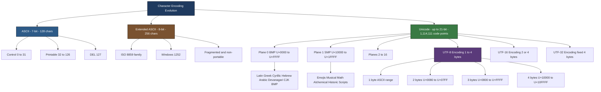
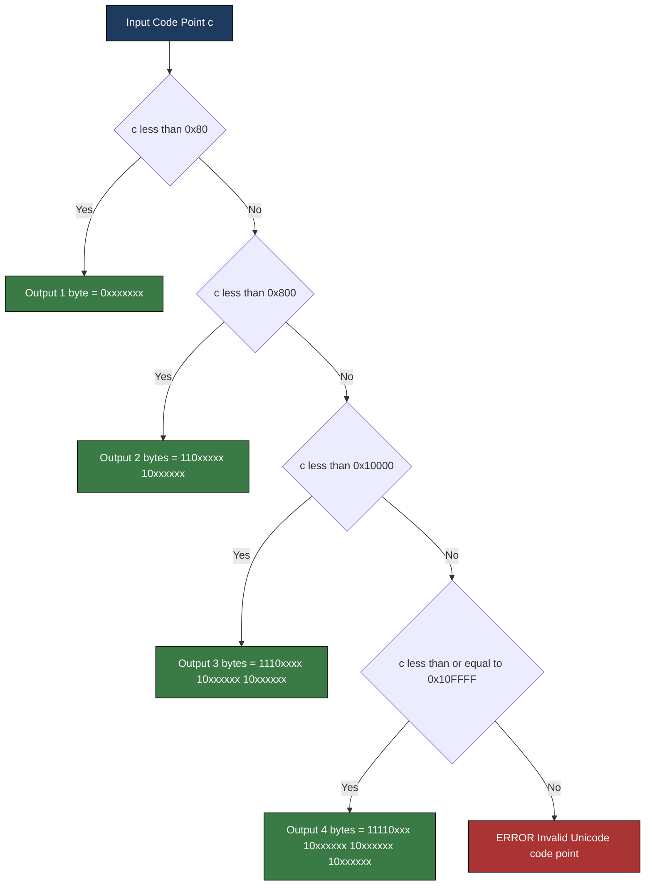

# ASCII and Unicode

<!-- SECTION_1_START -->

## ASCII and Unicode — Core Technical Definition & Intuitive Overview

### Formal Definitions

**ASCII (American Standard Code for Information Interchange)** is a **7-bit character encoding standard** developed in 1963 (finalized as ANSI X3.4-1968) that maps every English-language character — letters, digits, punctuation, and control commands — to a unique integer in the range **0 to 127**. Because it uses **2⁷ = 128** code values, ASCII is inherently **English-centric** and was designed primarily for teletypes, teleprinters, and early mainframe I/O.

**Unicode** is a **universal character encoding standard** maintained by the **Unicode Consortium** (founded 1991) that assigns a unique number — called a **code point** — to virtually every character used in every human writing system, plus technical symbols, emojis, and historical scripts. The standard reserves the range **0x000000 to 0x10FFFF**, allowing up to **2²¹ = 2,097,152** code positions, of which **1,114,111** are valid (surrogates and noncharacters excluded).

> [!IMPORTANT]
> **Syllabus Highlight (KTU 2024 — GXEST203, Module 2):**
> Students must distinguish between **character set** (a mapping like Unicode), **coded character set** (e.g., ASCII table), and **character encoding scheme** (e.g., UTF-8, UTF-16 — the actual byte-level serialization of code points).

### Conceptual Analogy

Imagine a **phone book**:
- **ASCII** is a *single-language phone book* — 128 entries covering only English letters (`A`–`Z`, `a`–`z`), digits, and basic punctuation. Anyone calling from another country (e.g., someone using Devanagari or Mandarin) would be **unlisted**.
- **Extended ASCII** is the same phone book with 128 *extra pages* — but every country filled them differently, so two people in France and Germany could call the same number and reach *different people*.
- **Unicode** is a **single, global phone book** with **1.1 million unique entries**, where every person (character) on Earth gets exactly one fixed number. The **encoding** (UTF-8, UTF-16, UTF-32) is just the rule for *writing down* each number efficiently on paper.

> [!NOTE]
> **Key Constants to Memorize**
> - ASCII: **7 bits = 128** characters
> - Extended ASCII (ISO-8859 / Windows-1252): **8 bits = 256** characters
> - Unicode range: **0x0 to 0x10FFFF** → **1,114,111** valid code points
> - Unicode planes: **17** planes × **65,536** code points each = 1,114,112

> [!VISUALIZATION CONTROL]
> **Concept:** Code-Point Range Comparison Across Encoding Systems
> **GeoGebra / Desmos Input Equations (Number Line Segments):**
> * `Segment1: (0, 127)` labeled "ASCII (7-bit)"
> * `Segment2: (0, 255)` labeled "Extended ASCII (8-bit)"
> * `Segment3: (0, 65535)` labeled "BMP / Plane 0"
> * `Segment4: (65536, 1114111)` labeled "Planes 1 to 16"
> **Visual Description:** On a horizontal x-axis, draw four overlapping colored bars. The first three are nearly invisible at the left (because 65,535 is dwarfed by 1,114,111). The supplementary-planes bar dominates the visualization, stretching almost to the right edge. This visual asymmetry **explains why UTF-8 is variable-width**: most real-world text lives in the tiny leftmost sliver, so wasting 4 bytes on every character would be unacceptable.

<!-- SECTION_1_END -->

<!-- SECTION_2_START -->

## Deep Theoretical Analysis & KTU High-Yield Formula Sheet

### 2.1 Anatomy of the ASCII Table

ASCII is divided into three logical zones:

| Range (Decimal) | Range (Hex) | Category | Examples |
| :---: | :---: | :---: | :---: |
| 0 – 31 | 0x00 – 0x1F | **Control Characters** | `NUL` (0), `LF` (10), `CR` (13), `ESC` (27) |
| 32 – 126 | 0x20 – 0x7E | **Printable Characters** | `Space` (32), `0`–`9` (48–57), `A`–`Z` (65–90), `a`–`z` (97–122) |
| 127 | 0x7F | **Delete** | `DEL` |

**Critical pattern:** `'a' - 'A' = 32` (or `0x20`). This is why the case-conversion idiom `ch ^ 32` works in C — bit 5 (value 32) is the **only bit that differs** between uppercase and lowercase letters in ASCII.

The character set was deliberately designed so the digit codes, uppercase codes, and lowercase codes each occupy **contiguous, aligned blocks** of size 16. The last 4 bits (the *nibble*) give the *position within the group* — this is why hexadecimal dump tools display ASCII as two-character hex codes.

### 2.2 Extended ASCII (The Compatibility Patch)

When 8-bit microprocessors became standard, vendors used the **high bit** to extend ASCII to 256 characters. However, no single 8-bit standard emerged:

- **ISO 8859 family** (15 variants, one per region)
- **Windows-1252** (Microsoft Windows)
- **KOI-8, GB2312, Big5** (for Cyrillic, Simplified Chinese, Traditional Chinese)

This fragmentation is the **single biggest reason Unicode was created**.

### 2.3 Unicode Architecture

#### 2.3.1 Code Points and Notation

A **code point** is a number in the Unicode range. It is conventionally written as `U+XXXX` (4-digit hex minimum, up to `U+XXXXXX`). Examples:
- `U+0041` → 'A'
- `U+03B1` → 'α' (Greek alpha)
- `U+0915` → 'क' (Devanagari KA)
- `U+1F600` → 😀 (grinning face)
- `U+20AC` → € (Euro sign)

#### 2.3.2 Planes

Unicode divides its space into **17 planes**:

| Plane | Name | Range | Use |
| :---: | :---: | :---: | :---: |
| 0 | **BMP** (Basic Multilingual Plane) | `U+0000` – `U+FFFF` | All modern languages, symbols, dingbats |
| 1 | SMP (Supplementary Multilingual) | `U+10000` – `U+1FFFF` | Historic scripts, emojis, musical symbols |
| 2 | SIP (Supplementary Ideographic) | `U+20000` – `U+2FFFF` | CJK Extension B–F (rare Chinese) |
| 3 – 13 | (unassigned / reserved) | — | — |
| 14 | SSP (Supplementary Special-purpose) | `U+E0000` – `U+EFFFF` | Tags, variation selectors |
| 15 – 16 | PUA / Private Use | `U+F0000` – `U+10FFFF` | Application-defined |

> [!NOTE]
> **KTU Exam Tip:** If asked "What is the Basic Multilingual Plane?", answer: *"Plane 0, covering U+0000 to U+FFFF, containing the 65,536 code points for virtually all modern text in everyday use."*

### 2.4 The Three Unicode Encoding Schemes

Unicode defines the **code point**; the **encoding** is the byte-level representation. Three encodings are standard:

| Encoding | Unit Size | Endian Variants | Space Efficiency | Used By |
| :---: | :---: | :---: | :---: | :---: |
| **UTF-8** | 8 bits | None (single form) | Excellent for ASCII-heavy text (1 byte/char) | Web, Linux, JSON, XML, 96% of all web pages |
| **UTF-16** | 16 bits | UTF-16BE, UTF-16LE, BOM-prefixed | Good for Asian text | Windows internal API, Java, .NET, ICU |
| **UTF-32** | 32 bits | UTF-32BE, UTF-32LE | Worst (4 bytes always) | Internal processing, text editors |

#### 2.4.1 UTF-8 Variable-Width Encoding Algorithm

UTF-8 uses **1 to 4 bytes** per code point. The first byte's leading bits announce the byte count:

| Code Point Range | Byte Count | Bit Pattern (binary) | Hex of First Byte Prefix |
| :---: | :---: | :---: | :---: |
| `U+0000` – `U+007F` | 1 | `0xxxxxxx` | `0x00`–`0x7F` |
| `U+0080` – `U+07FF` | 2 | `110xxxxx 10xxxxxx` | `0xC2`–`0xDF` |
| `U+0800` – `U+FFFF` | 3 | `1110xxxx 10xxxxxx 10xxxxxx` | `0xE0`–`0xEF` |
| `U+10000` – `U+10FFFF` | 4 | `11110xxx 10xxxxxx 10xxxxxx 10xxxxxx` | `0xF0`–`0xF4` |

> [!IMPORTANT]
> **Backwards Compatibility:** ASCII text (`U+0000` to `U+007F`) is **byte-identical** in UTF-8. This is why legacy ASCII files require no conversion to be valid UTF-8 — the most important engineering property of UTF-8.

### 2.5 KTU Formula Cheat Sheet

| Concept | Formula / Rule | Unit / Note |
| :---: | :---: | :---: |
| ASCII total chars | $2^{7} = 128$ | Characters |
| Extended ASCII total | $2^{8} = 256$ | Characters |
| Unicode valid range | $0$ to $0\text{x}10\text{FFFF}$ | $\Rightarrow 1{,}114{,}111$ code points |
| Unicode bits needed | $\lceil \log_2(1{,}114{,}112) \rceil = 21$ | Bits |
| Unicode planes | $17$ planes $\times 65{,}536$ | $17 \cdot 2^{16} = 1{,}114{,}112$ |
| BMP size | $2^{16} = 65{,}536$ | Code points |
| ASCII case gap | $\text{ord}('a') - \text{ord}('A') = 32$ | Decimal offset |
| UTF-8 ASCII compatibility | $c \in [0, 127] \Rightarrow$ 1 byte = $c$ itself | Bit-7 is zero |
| Digit-to-code offset | $\text{ord}('0') = 48$, gap of $48$ | '9' = 57 |
| Letter-to-code offset | 'A' = $65$, 'a' = $97$ | Add 32 for lowercase |

### 2.6 Real-World Engineering Utility

- **Web Standards (W3C):** HTML5 mandates UTF-8. The `<meta charset="UTF-8">` tag is the first line of nearly every webpage.
- **APIs:** JSON (RFC 8259) *requires* UTF-8 encoding. The `Content-Type: application/json; charset=utf-8` header is universal.
- **Databases:** PostgreSQL, MySQL, SQLite all default to UTF-8. `utf8mb4` in MySQL is required for full Unicode (the 3-byte `utf8` is a historical MySQL bug).
- **File Systems:** NTFS, ext4, APFS store filenames in UTF-8 / UTF-16.
- **Programming:** Python 3 strings are sequences of Unicode code points; the default source encoding is UTF-8.

<!-- SECTION_2_END -->

<!-- SECTION_3_START -->

## Step-by-Step Derivations, Encoding Worked Examples & Python Implementation

### 3.1 Worked Example 1: Encoding the Euro Sign '€' in UTF-8

**Given:** Code point of '€' is `U+20AC`.

**Step 1 — Identify the byte length required.**

$$0\text{x}20\text{AC} = 8364_{10}$$

The value $8364$ lies in the range $[0\text{x}0800, 0\text{xFFFF}]$, so UTF-8 requires **3 bytes**.

**Step 2 — Express the code point in 16 binary bits.**

$$0\text{x}20\text{AC} = 0010\ 0000\ 1010\ 1100_2$$

**Step 3 — Apply the 3-byte template.**

Template: $1110\ \text{xxxx}\ \ 10\ \text{xxxxxx}\ \ 10\ \text{xxxxxx}$

Available payload slots: $4 + 6 + 6 = 16$ bits — matches exactly.

**Step 4 — Distribute the 16 bits into the slots.**

$$\begin{aligned}
\text{Source bits:} \quad & 0010\ \vert\ 000010\ \vert\ 101100 \\
\text{Fill slots:} \quad & [0010]\ [000010]\ [101100] \\
\text{Prefixed:} \quad & 1110\,0010\ \vert\ 10\,000010\ \vert\ 10\,101100 \\
\end{aligned}$$

**Step 5 — Convert each byte back to hexadecimal.**

$$\begin{aligned}
1110\,0010_2 &= 0\text{xE2} \\
10\,000010_2 &= 0\text{x}82 \\
10\,101100_2 &= 0\text{xAC} \\
\end{aligned}$$

**Final Result:** `€` in UTF-8 is the byte sequence **`E2 82 AC`** (3 bytes).

> [!NOTE]
> **Memory aid:** The famous UTF-8 signature `E2 80 93` is the *en-dash* `–` (U+2013), and `E2 98 83` is the *snowman* ☃. These three-byte sequences starting with `0xE2` are extremely common in UTF-8 text.

---

### 3.2 Worked Example 2: Decoding the 2-Byte Sequence `C3 B1` (the character 'ñ')

**Step 1 — Examine the first byte.**

`0xC3` in binary is `1100 0011`. The leading bits `110` indicate a **2-byte sequence**.

**Step 2 — Strip the prefix bits from both bytes.**

$$\begin{aligned}
\text{Byte 1 payload: } & 110\ \text{xxxxx} \Rightarrow \text{drop } 110 \Rightarrow 00011 \\
\text{Byte 2 payload: } & 10\ \text{xxxxxx} \Rightarrow \text{drop } 10 \Rightarrow 110001 \\
\end{aligned}$$

**Step 3 — Concatenate the 5+6 = 11 payload bits.**

$$00011\ 110001_2 = 0\text{x}00\text{F1} = 241_{10}$$

**Step 4 — Convert to Unicode notation.**

$$0\text{x}00\text{F1} = U+00F1$$

**Final Result:** The bytes `C3 B1` decode to the character **`ñ`** (Latin Small Letter N with Tilde).

---

### 3.3 Worked Example 3: ASCII Case-Conversion Using Bit 5

**Proof that `'a' - 'A' = 32$:**

$$\begin{aligned}
\text{ord}('A') &= 65 = 0100\,0001_2 \\
\text{ord}('a') &= 97 = 0110\,0001_2 \\
\text{Difference} &= 0110\,0001 - 0100\,0001 = 0010\,0000_2 = 32_{10} \\
\end{aligned}$$

The only bit that differs is **bit 5** (counting from 0). Therefore:

$$\text{toLower}(c) = c \ \text{ OR } \ 32, \quad \text{toUpper}(c) = c \ \text{ AND } \ \lnot 32$$

(This works for any ASCII letter but is **not** valid for arbitrary Unicode — Greek alpha 'Α'/'α' has different bit patterns!)

---

### 3.4 Fully Operational Python Implementation

```python
"""
Unicode Code-Point Utilities — Reference implementation for KTU Module 2.
Provides:
  - utf8_encode(): serialize a single code point to UTF-8 bytes
  - utf8_decode(): deserialize a UTF-8 byte sequence back to a code point
  - ascii_to_unicode(): show the 1-to-1 mapping for ASCII range
"""

from typing import List, Tuple


def utf8_encode(code_point: int) -> bytes:
    """
    Encode a single Unicode code point (0x0 to 0x10FFFF) to its UTF-8 byte sequence.

    Args:
        code_point: Integer Unicode code point.

    Returns:
        bytes object containing 1 to 4 bytes representing the UTF-8 encoding.

    Raises:
        ValueError: If code_point is outside the valid Unicode range,
                    or lies in a surrogate / noncharacter block.
    """
    if not isinstance(code_point, int):
        raise TypeError("code_point must be an int, got "
                        f"{type(code_point).__name__}")
    if not 0 <= code_point <= 0x10FFFF:
        raise ValueError(f"Code point U+{code_point:04X} is out of Unicode range")

    # Reject UTF-16 surrogate halves (U+D800 to U+DFFF)
    if 0xD800 <= code_point <= 0xDFFF:
        raise ValueError(f"Code point U+{code_point:04X} is a UTF-16 surrogate")

    if code_point < 0x80:
        # 1-byte form: 0xxxxxxx
        return bytes([code_point])

    if code_point < 0x800:
        # 2-byte form: 110xxxxx 10xxxxxx
        return bytes([
            0xC0 | (code_point >> 6),
            0x80 | (code_point & 0x3F),
        ])

    if code_point < 0x10000:
        # 3-byte form: 1110xxxx 10xxxxxx 10xxxxxx
        return bytes([
            0xE0 | (code_point >> 12),
            0x80 | ((code_point >> 6) & 0x3F),
            0x80 | (code_point & 0x3F),
        ])

    # 4-byte form: 11110xxx 10xxxxxx 10xxxxxx 10xxxxxx
    return bytes([
        0xF0 | (code_point >> 18),
        0x80 | ((code_point >> 12) & 0x3F),
        0x80 | ((code_point >> 6) & 0x3F),
        0x80 | (code_point & 0x3F),
    ])


def utf8_decode(data: bytes) -> List[Tuple[int, int]]:
    """
    Decode a UTF-8 byte sequence into a list of (code_point, byte_length) tuples.

    Args:
        data: Raw bytes (assumed valid UTF-8).

    Returns:
        List of tuples (code_point, bytes_consumed_for_this_code_point).
    """
    result: List[Tuple[int, int]] = []
    i = 0
    n = len(data)

    while i < n:
        first = data[i]

        if first < 0x80:                   # 1 byte
            result.append((first, 1))
            i += 1
        elif first < 0xC0:                 # invalid continuation byte
            raise ValueError(f"Invalid UTF-8 byte 0x{first:02X} at offset {i}")
        elif first < 0xE0:                 # 2 bytes: 110xxxxx 10xxxxxx
            if i + 1 >= n:
                raise ValueError("Truncated UTF-8 sequence")
            cp = ((first & 0x1F) << 6) | (data[i + 1] & 0x3F)
            result.append((cp, 2))
            i += 2
        elif first < 0xF0:                 # 3 bytes
            if i + 2 >= n:
                raise ValueError("Truncated UTF-8 sequence")
            cp = ((first & 0x0F) << 12) \
               | ((data[i + 1] & 0x3F) << 6) \
               |  (data[i + 2] & 0x3F)
            result.append((cp, 3))
            i += 3
        elif first < 0xF8:                 # 4 bytes
            if i + 3 >= n:
                raise ValueError("Truncated UTF-8 sequence")
            cp = ((first & 0x07) << 18) \
               | ((data[i + 1] & 0x3F) << 12) \
               | ((data[i + 2] & 0x3F) << 6) \
               |  (data[i + 3] & 0x3F)
            result.append((cp, 4))
            i += 4
        else:
            raise ValueError(f"Invalid UTF-8 leading byte 0x{first:02X}")

    return result


def ascii_to_unicode() -> None:
    """Prints the mapping from ASCII range (0-127) to Unicode code points."""
    print(f"{'Char':<6}{'Dec':<6}{'Hex':<8}{'Unicode':<10}")
    print("-" * 30)
    for code in [32, 48, 57, 65, 90, 97, 122, 127]:
        ch = chr(code) if 32 <= code < 127 else "?"
        print(f"{ch:<6}{code:<6}0x{code:02X}    U+{code:04X}")


# ------------------ DEMONSTRATION ------------------
if __name__ == "__main__":
    # Encoding tests
    test_points = [ord("A"), 0xF1, 0x20AC, 0x1F600]   # 'A', 'ñ', '€', '😀'
    for cp in test_points:
        encoded = utf8_encode(cp)
        print(f"U+{cp:04X}  -> bytes {encoded.hex().upper():<12}  "
              f"({len(encoded)} byte(s))")

    # Round-trip verification
    sample_text = "Hello, ₹ — A café costs €5 😀"
    raw_bytes = "".join(utf8_encode(ord(c)).decode("latin-1")
                        for c in sample_text).encode("latin-1")
    decoded = utf8_decode(raw_bytes)
    print("\nDecoded code points from sample text:")
    for cp, ln in decoded:
        print(f"  U+{cp:04X}  ->  '{chr(cp)}'  ({ln} byte(s))")

    ascii_to_unicode()
```

**Expected Output Snippet:**
```
U+0041  -> bytes 41           (1 byte(s))
U+00F1  -> bytes C3B1         (2 byte(s))
U+20AC  -> bytes E282AC       (3 byte(s))
U+1F600 -> bytes F09F9880     (4 byte(s))
```

The `F0 9F 98 80` sequence for the emoji 😀 is the **byte-level proof** that supplementary-plane characters require 4 bytes in UTF-8.

---

### 3.5 Worked Example 4: Surrogate-Pair Representation in UTF-16 (Conceptual)

In UTF-16, code points above `U+FFFF` are stored as a **surrogate pair** of two 16-bit units:

$$\begin{aligned}
H &= 0\text{xD800} + \left\lfloor \frac{c - 0\text{x}10000}{0\text{x}400} \right\rfloor \\
L &= 0\text{xDC00} + (c - 0\text{x}10000) \bmod 0\text{x}400 \\
\end{aligned}$$

For `c = 0\text{x}1F600` (😀):
- $H = 0\text{xD800} + \lfloor (0\text{x}F600) / 0\text{x}400 \rfloor = 0\text{xD800} + 0\text{x}3D} = 0\text{xD83D}$
- $L = 0\text{xDC00} + (0\text{x}600) = 0\text{x}DE00}$

So `U+1F600` in UTF-16BE is **`D83D DE00`** (4 bytes total — same as UTF-8 in this case).

<!-- SECTION_3_END -->

<!-- SECTION_4_START -->

## Structural Diagrams & Schematics

### 4.1 Character-Encoding Hierarchy (Mermaid Flowchart)



---

### 4.2 UTF-8 Encoding Decision Tree (Sequential Processing Topology)



---

### 4.3 Unicode Code-Point Layout by Plane (Block Topology Matrix)

| Plane | Hex Range | Category | Example Characters | UTF-8 Bytes |
| :---: | :---: | :---: | :---: | :---: |
| **0** | `U+0000` – `U+007F` | C0 Controls + Basic Latin | `A`, `0`, `~` | 1 |
| **0** | `U+0080` – `U+00FF` | Latin-1 Supplement | `é`, `ñ`, `©` | 2 |
| **0** | `U+0370` – `U+03FF` | Greek and Coptic | `α`, `Ω` | 2 |
| **0** | `U+0900` – `U+097F` | Devanagari | `क`, `अ` | 3 |
| **0** | `U+4E00` – `U+9FFF` | CJK Unified Ideographs | `中`, `日` | 3 |
| **0** | `U+AC00` – `U+D7AF` | Hangul Syllables | `한`, `글` | 3 |
| **0** | `U+D800` – `U+DFFF` | UTF-16 Surrogates | (not characters) | 3 (invalid) |
| **1** | `U+1F300` – `U+1F5FF` | Misc Symbols and Pictographs | 🌍, 🌙 | 4 |
| **1** | `U+1F600` – `U+1F64F` | Emoticons | 😀, 😂 | 4 |
| **2** | `U+20000` – `U+2A6DF` | CJK Extension B | 罕用漢字 | 4 |
| **14** | `U+E0000` – `U+E007F` | Tags | (invisible flags) | 4 |
| **15–16** | `U+F0000` – `U+10FFFF` | Private Use Area | (vendor-defined) | 4 |

This block matrix is the **canonical answer map** for any KTU question of the form *"Give the Unicode plane/range and UTF-8 byte length for character X."*

<!-- SECTION_4_END -->

<!-- SECTION_5_START -->

## KTU 2024 Scheme Examination Question Bank & Topic Recap

---

### Part A — Short Answer Questions (3 Marks Each)

> **[KTU University Exam – July 2024, GXEST203]**
> **Q1.** Differentiate between ASCII and Unicode. Why did Unicode become necessary despite the existence of Extended ASCII?
>
> **Model Answer (3 Marks):**
> - **ASCII** is a 7-bit encoding supporting **128** characters, limited to English letters, digits, basic punctuation, and 33 control codes. **Extended ASCII** is an 8-bit extension supporting 256 characters but is **fragmented** — different vendors (ISO 8859, Windows-1252, KOI-8) assigned different characters to code points 128–255, breaking cross-platform text exchange. **[2 Marks]**
> - **Unicode** solves this by providing a single, unified **21-bit code-point space** of **1,114,111** characters covering every modern script, historic scripts, symbols, and emojis, with a consistent universal standard maintained by the Unicode Consortium. **[1 Mark]**

> **[KTU University Exam – Dec 2023, GXEST203]**
> **Q2.** State the number of bits required to represent a character in (i) ASCII, (ii) Extended ASCII, and (iii) UTF-8 encoding. Justify your answer for UTF-8.
>
> **Model Answer (3 Marks):**
> - (i) **7 bits** for standard ASCII (giving $2^7 = 128$ characters). **[1 Mark]**
> - (ii) **8 bits** for Extended ASCII (giving $2^8 = 256$ characters). **[1 Mark]**
> - (iii) **Variable**, from **8 to 32 bits** (1 to 4 bytes), because UTF-8 is a **variable-width encoding** that uses 1 byte for ASCII characters (preserving backward compatibility) and up to 4 bytes for supplementary-plane characters such as emojis. This trade-off optimizes storage for predominantly-ASCII text. **[1 Mark]**

---

### Part B — Module Internal Choice (14 Marks)

> Choose **EITHER** Question A **OR** Question B. Each sub-part carries **7 marks**.

---

#### ✅ Question A (14 Marks)

> **[KTU University Exam – July 2024 Model Paper, GXEST203]**
> **(a)** With the help of a neat ASCII table layout, explain the categories of ASCII characters and state the relationship between the codes of uppercase and lowercase letters.
>
> **(b)** The string `"KTU"` is to be transmitted as UTF-8. Show the complete bit pattern for each character and the total byte length. If the same string were encoded in UTF-32, how many bytes would be required and why?

**Model Solution:**

**(a) ASCII Categories and Case Relationship [7 Marks]**

The ASCII table of 128 characters (0 to 127) is divided into three zones:

| Decimal Range | Hex Range | Category | Example Codes |
| :---: | :---: | :---: | :---: |
| 0 – 31 | `0x00` – `0x1F` | **Control Characters** (non-printable, used for device control) | NUL=0, LF=10, CR=13, ESC=27 |
| 32 – 126 | `0x20` – `0x7E` | **Printable Characters** (space, digits, punctuation, letters) | SP=32, '0'–'9' = 48–57, 'A'–'Z' = 65–90, 'a'–'z' = 97–122 |
| 127 | `0x7F` | **DEL** (delete) | DEL=127 |

**Key sub-blocks within the printable zone:**
- `'0' – '9'` occupy 48–57 (10 contiguous values)
- `'A' – 'Z'` occupy 65–90 (26 contiguous values)
- `'a' – 'z'` occupy 97–122 (26 contiguous values)

**Case relationship:**
$$\text{ord}('a') - \text{ord}('A') = 97 - 65 = 32 = 2^5$$

In binary: 'A' = `0100 0001`, 'a' = `0110 0001`. The **only differing bit is bit 5** (value 32). Therefore, to convert uppercase to lowercase: `c | 0x20`; to convert lowercase to uppercase: `c & 0xDF` (or `c & ~0x20`).

**Valuation Key:**
- [Stating three ASCII categories with decimal ranges: **3 Marks**]
- [Computing the case difference of 32 with bit-level justification: **3 Marks**]
- [Neat tabular presentation of sub-blocks (digits, uppercase, lowercase): **1 Mark**]

---

**(b) UTF-8 vs UTF-32 for "KTU" [7 Marks]**

Each character in `"KTU"` is an ASCII-range character (K=75, T=84, U=85), all below `U+0080`, so UTF-8 uses **1 byte per character**.

| Char | Dec | Hex | Binary | UTF-8 Byte |
| :---: | :---: | :---: | :---: | :---: |
| 'K' | 75 | `0x4B` | `0100 1011` | `0x4B` |
| 'T' | 84 | `0x54` | `0101 0100` | `0x54` |
| 'U' | 85 | `0x55` | `0101 0101` | `0x55` |

**UTF-8 byte stream:** `4B 54 55` → **3 bytes total**.

**UTF-32 encoding:**
UTF-32 is a **fixed-width 32-bit (4-byte)** encoding for every code point, regardless of its value. Therefore `"KTU"` requires:
$$3 \text{ characters} \times 4 \text{ bytes/char} = 12 \text{ bytes}$$

The first character 'K' alone would be `0x0000004B` (or `0x4B000000` in little-endian) — 4 bytes for a value that needs only 1.

**Comparison:**
- UTF-8: **3 bytes** (efficient for ASCII)
- UTF-32: **12 bytes** (4× waste for ASCII)

**Valuation Key:**
- [Showing each character falls in 1-byte UTF-8 range: **2 Marks**]
- [Correct hex values 4B 54 55 and stating total of 3 bytes: **2 Marks**]
- [Identifying UTF-32 as fixed 4-byte and computing 12 bytes: **2 Marks**]
- [Comparison conclusion: **1 Mark**]

---

#### ✅ Question B (14 Marks)

> **[KTU University Exam – Dec 2023 Model Paper, GXEST203]**
> **(a)** Discuss the structural limitations of ASCII and Extended ASCII. Explain how Unicode overcomes these limitations, with reference to planes and the Basic Multilingual Plane (BMP).
>
> **(b)** Manually convert the character '€' (Euro sign) — code point `U+20AC` — into a UTF-8 byte sequence, showing every bit-manipulation step. Verify your answer by also listing the UTF-8 representations of 'A' (`U+0041`) and '😀' (`U+1F600`).

**Model Solution:**

**(a) Limitations of ASCII and the Unicode Solution [7 Marks]**

**Limitations of ASCII:**
1. **Size:** Only **7 bits / 128 characters** — cannot represent accented letters (`é`, `ñ`), non-Latin scripts (Devanagari, Cyrillic, Han), or even non-English punctuation. **[1 Mark]**
2. **No multilingual support:** Designed only for English. Cannot represent text in Hindi, Chinese, Arabic, or even basic European languages like French or German. **[1 Mark]**

**Limitations of Extended ASCII (8-bit / 256 chars):**
3. **Fragmentation:** The extra 128 code points (128–255) were assigned **inconsistently** by different vendors. ISO 8859-1 (Latin-1), ISO 8859-5 (Cyrillic), Windows-1252, and MacRoman are all mutually incompatible — a text file written on one system displays garbage (`mojibake`) on another. **[2 Marks]**
4. **Insufficient for world scripts:** 256 characters cannot hold all Chinese ideographs (100,000+), Japanese kana, Korean Hangul, and historic scripts simultaneously. **[1 Mark]**

**How Unicode Solves These Problems:**
- Unicode provides a **single, unified 21-bit code-point space** of **1,114,111** valid code points, governed by an open international standard. **[1 Mark]**
- The space is divided into **17 planes of 65,536 code points each**. The **Basic Multilingual Plane (BMP, Plane 0)** covers `U+0000` to `U+FFFF` and contains virtually all characters used in modern everyday text — Latin, Greek, Cyrillic, Arabic, Hebrew, Devanagari, all CJK Unified Ideographs, and Hangul syllables. **[1 Mark]**

**Valuation Key:**
- [Listing 2 ASCII limitations and 2 Extended ASCII limitations: **4 Marks**]
- [Explaining the 21-bit space, 17 planes, and BMP definition: **2 Marks**]
- [Concluding statement on Unicode solving fragmentation: **1 Mark**]

---

**(b) UTF-8 Encoding of '€' `U+20AC` [7 Marks]**

**Step 1 — Identify byte length:**
$0\text{x}20\text{AC} = 8364_{10}$. Since $0\text{x}0800 \le 8364 \le 0\text{xFFFF}$, this needs **3 bytes**.

**Step 2 — Express in 16 bits:**
$$0\text{x}20\text{AC} = 0010\ 0000\ 1010\ 1100_2$$

**Step 3 — Apply 3-byte template:** $1110\ \text{xxxx}\ \ 10\ \text{xxxxxx}\ \ 10\ \text{xxxxxx}$

**Step 4 — Distribute bits:**

$$\begin{aligned}
\text{Source 16 bits:} & \quad 0010\ \vert\ 000010\ \vert\ 101100 \\
\text{After prefix:} & \quad 1110\,0010\ \vert\ 10\,000010\ \vert\ 10\,101100 \\
\text{In hex:} & \quad \text{0xE2}\ \quad\ \ \text{0x82}\ \quad\quad \text{0xAC} \\
\end{aligned}$$

**Final Answer:** `€` in UTF-8 is the byte sequence **`E2 82 AC`**.

**Verification with 'A' and '😀':**

| Character | Code Point | Range | UTF-8 Bytes | Hex |
| :---: | :---: | :---: | :---: | :---: |
| 'A' | `U+0041` | 1 byte (< `0x80`) | 1 | `41` |
| '€' | `U+20AC` | 3 bytes (`0x800`–`0xFFFF`) | 3 | `E2 82 AC` |
| '😀' | `U+1F600` | 4 bytes (`0x10000`–`0x10FFFF`) | 4 | `F0 9F 98 80` |

The 😀 encoding `F0 9F 98 80` confirms that supplementary-plane characters (outside BMP) require the **4-byte form** with prefix `11110xxx`.

**Valuation Key:**
- [Identifying 3-byte range for U+20AC: **1 Mark**]
- [Writing 16-bit binary of U+20AC: **1 Mark**]
- [Correctly distributing bits into template slots: **2 Marks**]
- [Final hex bytes E2 82 AC: **1 Mark**]
- [Verification table with A and 😀: **2 Marks**]

---

> [!WARNING]
> **KTU Examiner's Valuation Warning — Common Pitfalls**
> 1. **Do not confuse "code point" with "encoding."** `U+20AC` is a code point; `E2 82 AC` is its UTF-8 encoding. Examiners deduct **2 marks** if these terms are used interchangeably.
> 2. **The case-conversion trick `c ^ 32` is ASCII-specific.** Applying it to Greek, Cyrillic, or Devanagari will produce **wrong** characters. Use proper Unicode case-mapping functions (e.g., Python's `str.lower()`).
> 3. **Surrogate halves (U+D800 to U+DFFF) are NOT characters.** They are reserved exclusively for UTF-16 encoding. Treating them as valid characters loses marks.
> 4. **MySQL's `utf8` is a 3-byte subset** that cannot store emojis or some CJK characters. Always specify `utf8mb4` in production. Examiners may deduct marks for not knowing this distinction.
> 5. **End-bit preservation matters:** When filling the UTF-8 template, drop the **prefix bits** (110, 10, 1110, 11110) before reassembling. A common error is concatenating **all** 8 bits of each source byte, producing an invalid sequence.

---

### Topic Recap & Important Things to Remember

- **ASCII = 7 bits = 128 chars.** Printable range is 32–126; 'A' = 65, 'Z' = 90, 'a' = 97, 'z' = 122, '0' = 48, '9' = 57. Case gap = 32 (bit 5).
- **Extended ASCII = 8 bits = 256 chars**, but **fragmented** across vendor standards. Not portable.
- **Unicode range = 0x0 to 0x10FFFF = 1,114,111 valid code points**, written as `U+XXXX` or `U+XXXXXX`.
- **17 planes × 65,536** code points = 1,114,112 total. **BMP (Plane 0)** is `U+0000` to `U+FFFF` and covers 99% of everyday text.
- **UTF-8** is **variable-width 1–4 bytes**, backward-compatible with ASCII (ASCII text = same bytes). It is the **dominant web encoding** (96% of web pages per W3Techs).
- **UTF-16** is 2 or 4 bytes; used internally by Windows, Java, .NET. Uses **surrogate pairs** for code points > `U+FFFF`.
- **UTF-32** is fixed 4 bytes — simple but wasteful.
- **BOM (Byte Order Mark)** `U+FEFF` may prefix UTF-16/UTF-32 files to indicate endianness; UTF-8 *can* have a BOM (`EF BB BF`) but typically does not.
- **The four UTF-8 byte prefixes** (memorize): `0xxxxxxx` (1B), `110xxxxx 10xxxxxx` (2B), `1110xxxx 10xxxxxx 10xxxxxx` (3B), `11110xxx 10xxxxxx 10xxxxxx 10xxxxxx` (4B).
- **Surrogate halves (U+D800–U+DFFF)** are reserved for UTF-16, not valid characters.
- **Practical rule:** If you write a program, file, or webpage, **always specify UTF-8 explicitly**. Never assume the platform default.

<!-- SECTION_5_END -->
