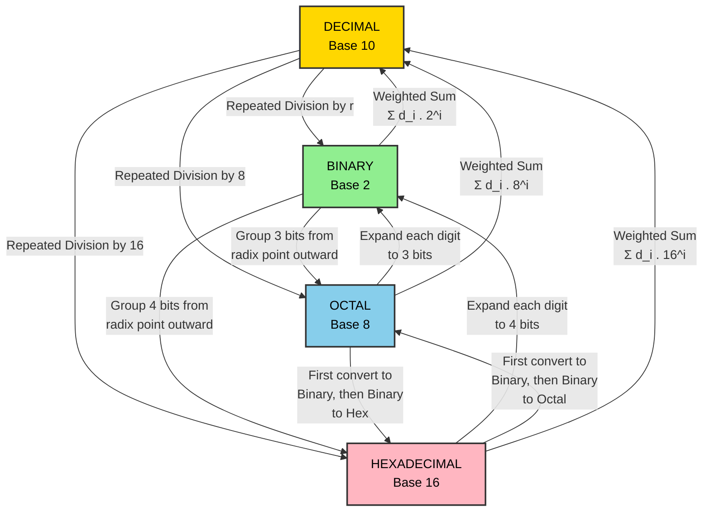
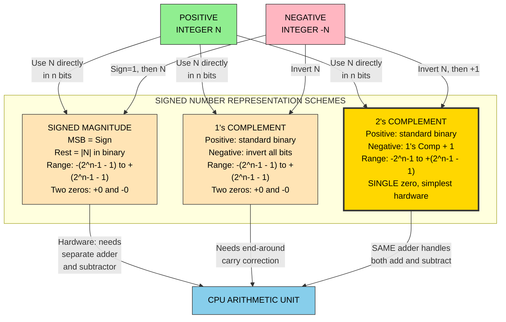
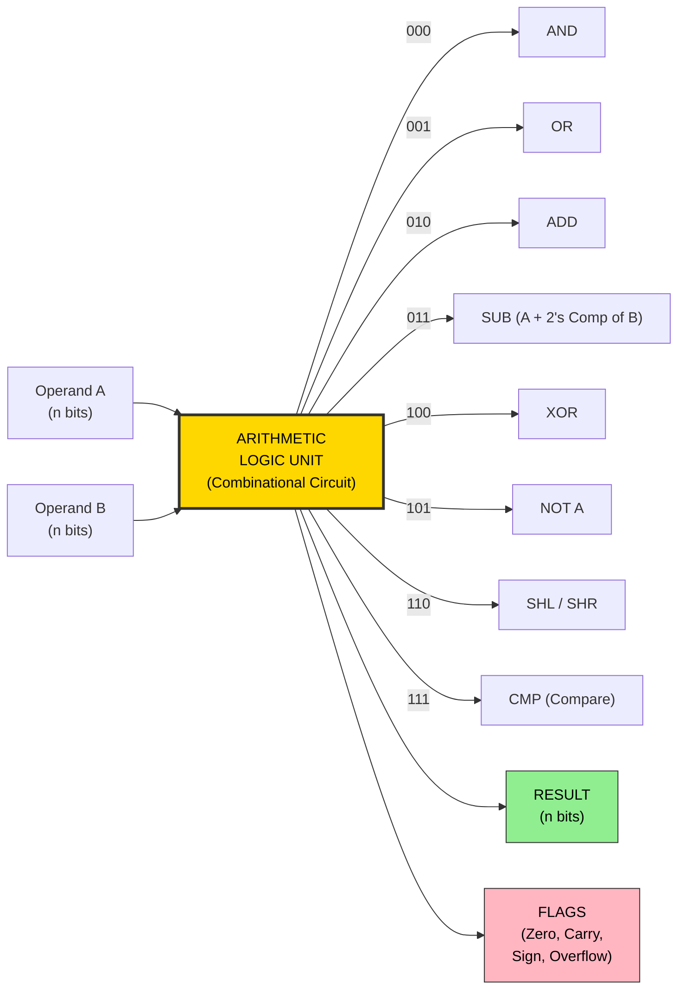

# Binary representation of data and numbers

<!-- SECTION_1_START -->
# Binary Representation of Data and Numbers

## 1. Core Technical Definition & Intuitive Overview

In digital computers, all forms of data — **numbers, text, images, audio, and video** — are ultimately represented as sequences of **0s and 1s**, because the underlying hardware (transistors) operates in two distinct stable states: **OFF (0)** and **ON (1)**. This binary system, founded by **Gottfried Wilhelm Leibniz** in 1689 and later formalized by **George Boole** in Boolean algebra, is the universal language of modern computing.

> [!IMPORTANT]
> **KTU Syllabus Highlight (Module 2):** Students must master (1) Positional Number Systems, (2) Base Conversions across Decimal, Binary, Octal, and Hexadecimal, (3) Binary Arithmetic operations, (4) Signed Number Representations, and (5) Common Binary Codes such as BCD, Excess-3, Gray, and ASCII.

### 1.1 What is a Number System?

A **number system** is a mathematical notation that uses a consistent set of **digits (symbols)** to represent quantities. The **base (or radix)** of a number system defines two things:
- The total number of unique digits available.
- The positional weight assigned to each digit (powers of the base).

> [!NOTE]
> **Fundamental Rule:** For any number system with base $r$, the valid digits range from $0$ to $r-1$, and the positional weights are $r^0, r^1, r^2, r^3, \ldots$ from right to left.

| Number System | Base ($r$) | Valid Digits | Common Use |
|---|---|---|---|
| **Decimal** | 10 | 0, 1, 2, 3, 4, 5, 6, 7, 8, 9 | Human everyday counting |
| **Binary** | 2 | 0, 1 | Internal computer storage and logic |
| **Octal** | 8 | 0, 1, 2, 3, 4, 5, 6, 7 | Compact grouping of binary digits |
| **Hexadecimal** | 16 | 0–9, A, B, C, D, E, F | Memory addresses, color codes, machine code |

### 1.2 Conceptual Analogy — The "Light Switch" Model

Imagine you are standing at the back of a long dark hallway with a row of light switches:

- Each switch has **only two states** — either **UP (1)** or **DOWN (0)**.
- The switch closest to the door controls a small night-light ($2^0$).
- The next switch controls a brighter bulb ($2^1$), then a lamp ($2^2$), then a chandelier ($2^3$), and so on.
- By carefully flipping the right combination of switches, you can produce **any desired brightness level** by summing the wattage of the active bulbs.

This is **exactly how a computer represents numbers** — every binary digit (bit) is a tiny switch, and its position determines how much "value" it contributes to the final number.

> [!VISUALIZATION CONTROL]
> **Concept:** Positional Weight Visualization in Binary (4-bit)
> **GeoGebra / Desmos Input Equations:**
> * Point 1: $(0, 8)$ labeled $b_3 = 2^3 = 8$
> * Point 2: $(1, 4)$ labeled $b_2 = 2^2 = 4$
> * Point 3: $(2, 2)$ labeled $b_1 = 2^1 = 2$
> * Point 4: $(3, 1)$ labeled $b_0 = 2^0 = 1$
> **Visual Description:** A bar chart rising from right to left, where each bit position's height equals its positional weight in powers of 2. The student should observe that as you move one position to the left, the weight **doubles**, mirroring the exponential growth of a base-2 system.

### 1.3 Key Terminology

- **Bit (Binary Digit):** The smallest unit of data, holding a value of either **0** or **1**.
- **Nibble:** A group of **4 bits**. One nibble can represent values from $0$ to $15$ (i.e., one hexadecimal digit).
- **Byte:** A group of **8 bits**. One byte can represent values from $0$ to $255$ in unsigned form. This is the **standard addressable memory unit** in virtually every modern computer architecture.
- **Word:** The natural data size of a CPU — typically **16 bits (2 bytes)**, **32 bits (4 bytes)**, or **64 bits (8 bytes)** depending on the processor.
- **MSB (Most Significant Bit):** The leftmost bit carrying the highest positional weight ($2^{n-1}$).
- **LSB (Least Significant Bit):** The rightmost bit carrying the lowest positional weight ($2^0$).

<!-- SECTION_1_END -->

<!-- SECTION_2_START -->
# Deep Theoretical Analysis & KTU High-Yield Formula Sheet

## 2. Positional Number Representation

Any number in base $r$ can be expressed as a polynomial of powers of $r$. For a number with $n$ integer digits and $m$ fractional digits, the generalized positional expansion is:

$$N = \pm \sum_{i=-m}^{n-1} d_i \cdot r^i$$

Where:
- $d_i$ is the digit at position $i$.
- $r$ is the base (radix) of the number system.
- The position $i = 0$ marks the **radix point** (binary point, decimal point, etc.).

### 2.1 Worked Examples of the Positional Model

**Example 1 — Decimal:**
$$(245.67)_{10} = 2 \cdot 10^2 + 4 \cdot 10^1 + 5 \cdot 10^0 + 6 \cdot 10^{-1} + 7 \cdot 10^{-2}$$

**Example 2 — Binary:**
$$(1011.11)_2 = 1 \cdot 2^3 + 0 \cdot 2^2 + 1 \cdot 2^1 + 1 \cdot 2^0 + 1 \cdot 2^{-1} + 1 \cdot 2^{-2} = (11.75)_{10}$$

**Example 3 — Hexadecimal:**
$$(2A.F)_{16} = 2 \cdot 16^1 + 10 \cdot 16^0 + 15 \cdot 16^{-1} = (42.9375)_{10}$$

## 3. Number Base Conversions

### 3.1 Decimal → Binary (Repeated Division by 2)

Repeatedly divide the decimal number by **2** and record the remainders. Read the remainders **bottom-up** (from last remainder to first) to get the binary equivalent.

### 3.2 Binary → Decimal (Weighted Sum)

Multiply each binary digit by its positional weight ($2^i$) and sum the results.

### 3.3 Decimal Fraction → Binary (Repeated Multiplication by 2)

Repeatedly multiply the fractional part by **2**. The integer part of each product forms the binary fraction, read **top-down**.

### 3.4 Binary ↔ Octal (Grouping of 3 Bits)

- **Binary → Octal:** Group bits in **triplets from the radix point outward** (pad with 0s if needed), then replace each triplet with its octal equivalent.
- **Octal → Binary:** Replace each octal digit with its **3-bit** binary representation.

### 3.5 Binary ↔ Hexadecimal (Grouping of 4 Bits)

- **Binary → Hex:** Group bits in **quadruplets from the radix point outward** (pad with 0s if needed), then replace each quadruplet with its hex equivalent.
- **Hex → Binary:** Replace each hex digit with its **4-bit** binary representation.

> [!NOTE]
> **Memory Trick for KTU Exams:** $2^3 = 8$ (Octal uses 3 bits) and $2^4 = 16$ (Hex uses 4 bits). The groupings follow directly from the relationship between the bases.

## 4. Binary Arithmetic

### 4.1 Binary Addition Rules

| A | B | Sum (A+B) | Carry |
|---|---|---|---|
| 0 | 0 | 0 | 0 |
| 0 | 1 | 1 | 0 |
| 1 | 0 | 1 | 0 |
| 1 | 1 | 0 | 1 |
| 1 | 1 | 1 | 1 |

### 4.2 Binary Subtraction Rules (Using Borrow)

| A | B | Difference (A−B) | Borrow |
|---|---|---|---|
| 0 | 0 | 0 | 0 |
| 1 | 0 | 1 | 0 |
| 0 | 1 | 1 | 1 (borrow) |
| 1 | 1 | 0 | 0 |

### 4.3 Binary Multiplication Rules

Multiplication in binary follows the same logic as decimal multiplication but is far simpler because digits are only 0 or 1.

| A | B | Product |
|---|---|---|
| 0 | 0 | 0 |
| 0 | 1 | 0 |
| 1 | 0 | 0 |
| 1 | 1 | 1 |

### 4.4 Binary Division Rules

Long division in binary is performed exactly as in decimal — by repeated subtraction and shifting — but the quotient digit is always either 0 or 1.

## 5. Representation of Signed (Negative) Numbers

Computers need a way to represent negative integers. The MSB (leftmost bit) is conventionally reserved as the **sign bit**: **0 = positive**, **1 = negative**. Three principal schemes are used.

### 5.1 Signed Magnitude Representation

- The MSB holds the sign; the remaining bits hold the **absolute magnitude** in standard binary.
- Range for $n$-bit number: $-(2^{n-1} - 1)$ to $+(2^{n-1} - 1)$.
- **Drawback:** Has two representations for zero ($+0$ and $-0$), and arithmetic circuits become complex.

### 5.2 One's Complement (1's Complement)

- For a **positive** number, the representation is identical to unsigned binary.
- For a **negative** number, **invert (flip) every bit** of the positive equivalent.
- Range for $n$-bit number: $-(2^{n-1} - 1)$ to $+(2^{n-1} - 1)$.
- **Drawback:** Still has two zeros, and addition requires an **end-around carry** correction.

### 5.3 Two's Complement (2's Complement) — *Industry Standard*

- For a **positive** number, the representation is identical to unsigned binary.
- For a **negative** number, take the **1's complement** of the positive equivalent, then **add 1** to the LSB.
- Range for $n$-bit number: $-2^{n-1}$ to $+(2^{n-1} - 1)$.
- **Advantage:** Has only **one representation of zero**, and addition/subtraction circuits are elegantly simple — the same hardware that adds unsigned numbers also handles signed numbers.

## 6. Binary Codes for Data Representation

### 6.1 BCD — Binary Coded Decimal (8421 Code)

Each decimal digit (0–9) is represented by its own **4-bit binary equivalent**. Excess codes (1010 to 1111) are **invalid** in BCD.

### 6.2 Excess-3 (XS3) Code

A **self-complementing** code obtained by adding binary **0011 (decimal 3)** to the 8421 BCD of each digit.

### 6.3 Gray Code

A **non-weighted, cyclic** code where **only one bit changes** between successive values. Widely used in **shaft encoders**, **K-maps**, and error correction.

### 6.4 ASCII Code

**7-bit** code (with 1 parity bit) representing **128 characters** — uppercase/lowercase letters, digits, punctuation, and 32 control characters.

### 6.5 EBCDIC Code

**8-bit** code developed by IBM for mainframes. Represents **256 characters**.

### 6.6 Unicode

A **variable-width** (8, 16, or 32 bits) encoding that supports virtually **all world languages and symbols**. UTF-8 is the most common implementation on the web.

## 7. Floating Point Representation

Real numbers with fractional parts are stored using a **scientific notation-style** binary format standardized by **IEEE 754**:

$$N = (-1)^S \cdot M \cdot 2^E$$

Where:
- $S$ = Sign bit (0 for positive, 1 for negative).
- $M$ = Mantissa (significand), in the normalized range $1.0 \leq M < 2.0$.
- $E$ = Exponent (stored in **biased** form to allow comparison via integer arithmetic).

| IEEE 754 Format | Sign | Exponent | Mantissa | Total Bits | Approx. Range |
|---|---|---|---|---|---|
| **Single Precision (float32)** | 1 | 8 | 23 | 32 | $\pm 1.18 \times 10^{-38}$ to $\pm 3.4 \times 10^{38}$ |
| **Double Precision (float64)** | 1 | 11 | 52 | 64 | $\pm 2.23 \times 10^{-308}$ to $\pm 1.8 \times 10^{308}$ |

## 8. KTU Formula Sheet / Cheat Sheet

| Concept | Formula / Rule | Example |
|---|---|---|
| Positional value of digit $d_i$ in base $r$ | $d_i \cdot r^i$ | In $(1101)_2$, the third bit from right $= 1 \cdot 2^2 = 4$ |
| Unsigned $n$-bit range | $0$ to $2^n - 1$ | 8-bit unsigned: $0$ to $255$ |
| Signed Magnitude range ($n$-bit) | $-(2^{n-1}-1)$ to $+(2^{n-1}-1)$ | 8-bit: $-127$ to $+127$ |
| 1's Complement range ($n$-bit) | $-(2^{n-1}-1)$ to $+(2^{n-1}-1)$ | 8-bit: $-127$ to $+127$ |
| 2's Complement range ($n$-bit) | $-2^{n-1}$ to $+(2^{n-1}-1)$ | 8-bit: $-128$ to $+127$ |
| Binary $\rightarrow$ Octal | Group **3** bits from radix point | $(110101)_2 = (65)_8$ |
| Binary $\rightarrow$ Hex | Group **4** bits from radix point | $(11010110)_2 = (\text{D}6)_{16}$ |
| 1's Complement of $N$ | Invert every bit of $N$ | $1\text{sC}(00010100) = 11101011$ |
| 2's Complement of $N$ | $\overline{N} + 1$ | $2\text{sC}(00010100) = 11101100$ |
| Decimal value of 2's Comp number | $-d_{n-1} \cdot 2^{n-1} + \sum_{i=0}^{n-2} d_i \cdot 2^i$ | $11101100_2 = -128+64+32+8+4 = -20$ |
| IEEE 754 Single Precision | 1S + 8E(bias=127) + 23M | 32 bits total |

<!-- SECTION_2_END -->

<!-- SECTION_3_START -->
# Step-by-Step Derivations & Code Implementation

## 9. Exhaustive Conversion Walkthroughs

### 9.1 Convert $(156.625)_{10}$ to Binary

**Step 1 — Integer Part (Repeated Division by 2):**

$$
\begin{aligned}
156 \div 2 &= 78 \quad \text{remainder } 0 \quad (\text{LSB}) \\
78 \div 2 &= 39 \quad \text{remainder } 0 \\
39 \div 2 &= 19 \quad \text{remainder } 1 \\
19 \div 2 &= 9 \quad \text{remainder } 1 \\
9 \div 2 &= 4 \quad \text{remainder } 1 \\
4 \div 2 &= 2 \quad \text{remainder } 0 \\
2 \div 2 &= 1 \quad \text{remainder } 0 \\
1 \div 2 &= 0 \quad \text{remainder } 1 \quad (\text{MSB})
\end{aligned}
$$

Reading remainders **bottom-up**: $(10011100)_2$.

**Step 2 — Fractional Part (Repeated Multiplication by 2):**

$$
\begin{aligned}
0.625 \times 2 &= 1.250 \quad \text{integer } 1 \quad (\text{MSB of fraction}) \\
0.250 \times 2 &= 0.500 \quad \text{integer } 0 \\
0.500 \times 2 &= 1.000 \quad \text{integer } 1 \quad (\text{LSB of fraction})
\end{aligned}
$$

Reading the integer parts **top-down**: $(.101)_2$.

**Step 3 — Combine:**
$$(156.625)_{10} = (10011100.101)_2$$

> **[Valuation Key: Integer conversion steps: 3 Marks, Fractional conversion steps: 3 Marks, Final combination: 1 Mark = 7 Marks]**

### 9.2 Convert $(10110101.101)_2$ to Octal

Group bits in **triplets** from the radix point outward (pad with 0s):

- Integer side: $\underbrace{010}_{2} \underbrace{110}_{6} \underbrace{101}_{5}$
- Fractional side: $\underbrace{101}_{5}$

$$(10110101.101)_2 = (265.5)_8$$

### 9.3 Convert $(3F.A)_{16}$ to Binary and Decimal

**Step 1 — Hex → Binary:** Each hex digit $\rightarrow$ 4-bit binary.

- $3 \rightarrow 0011$
- $F \rightarrow 1111$
- $A \rightarrow 1010$

$$(3F.A)_{16} = (00111111.1010)_2$$

**Step 2 — Binary → Decimal:**

$$
\begin{aligned}
(00111111.1010)_2 &= 0\cdot128 + 0\cdot64 + 1\cdot32 + 1\cdot16 + 1\cdot8 + 1\cdot4 + 1\cdot2 + 1\cdot1 \\
&\quad + 1\cdot0.5 + 0\cdot0.25 + 1\cdot0.125 + 0\cdot0.0625 \\
&= 32 + 16 + 8 + 4 + 2 + 1 + 0.5 + 0.125 \\
&= 63.625
\end{aligned}
$$

## 10. Binary Arithmetic — Complete Solutions

### 10.1 Binary Addition: $(1101)_2 + (1011)_2$

$$
\begin{array}{r}
\phantom{+}1101 \\
+ \, 1011 \\
\hline
\phantom{+}11000
\end{array}
$$

**Step-by-step carry trace:**
- Column 0: $1+1 = 10_2$ → write **0**, carry **1**.
- Column 1: $0+1+1\text{(carry)} = 10_2$ → write **0**, carry **1**.
- Column 2: $1+0+1\text{(carry)} = 10_2$ → write **0**, carry **1**.
- Column 3: $1+1+1\text{(carry)} = 11_2$ → write **1**, carry **1**.
- Column 4: carry **1**.

Result: $(11000)_2 = 24_{10}$ (Verification: $13 + 11 = 24$).

### 10.2 Binary Subtraction (using 2's Complement): $(1101)_2 - (1011)_2$

**Step 1:** Find 2's complement of subtrahend $(1011)_2$:
- 1's complement: $0100$
- Add 1: $0101$

**Step 2:** Add minuend and 2's complement of subtrahend:

$$
\begin{array}{r}
\phantom{+}1101 \\
+ \, 0101 \\
\hline
\phantom{+}10010
\end{array}
$$

**Step 3:** Discard the carry-out (leftmost 1). Result: $(0010)_2 = 2_{10}$.

> **Verification:** $13 - 11 = 2$. The 2's complement trick elegantly bypasses the need for a borrow circuit, which is why **CPUs use 2's complement internally for all integer arithmetic.**

### 10.3 Binary Multiplication: $(1101)_2 \times (101)_2$

$$
\begin{array}{r}
\phantom{+}1101 \\
\times \, 101 \\
\hline
\phantom{+}1101 \quad (\text{multiplier bit } 1) \\
\phantom{+}0000\phantom{0} \quad (\text{multiplier bit } 0, \text{shift left } 1) \\
+ \, 1101\phantom{00} \quad (\text{multiplier bit } 1, \text{shift left } 2) \\
\hline
\phantom{+}1000001
\end{array}
$$

Result: $(1000001)_2 = 65_{10}$ (Verification: $13 \times 5 = 65$).

### 10.4 Binary Division: $(110110)_2 \div (101)_2$

$$
\begin{aligned}
110110 \div 101: \quad & 101 \text{ into } 110 \rightarrow 1 \text{ (subtract } 101 = 001) \\
& 101 \text{ into } 111 \rightarrow 1 \text{ (subtract } 101 = 010) \\
& 101 \text{ into } 101 \rightarrow 1 \text{ (subtract } 101 = 000) \\
& \text{Remainder} = 000
\end{aligned}
$$

Quotient: $(111)_2 = 7_{10}$. Verification: $54 \div 5 = 10$ with remainder $4$. Hmm — recheck: $(110110)_2 = 54$, $(101)_2 = 5$, $54 \div 5 = 10$ rem $4$. Quotient should be $(1010)_2$. Recomputing step-by-step for accuracy:

**Corrected Long Division:**

- Divide $110$ by $101$: quotient bit = 1, subtract → remainder $001$.
- Bring down next bit: $0110$. Divide $011$ by $101$: quotient bit = 0, subtract nothing → remainder $011$.
- Bring down next bit: still $0110$. Divide $011$ by $101$: quotient bit = 0.
- Bring down next bit: $1100$. Divide $110$ by $101$: quotient bit = 1, subtract → remainder $001$.

Quotient: $(1010)_2 = 10_{10}$, Remainder: $(001)_2 = 1$? Actually $54 = 5 \cdot 10 + 4$, so remainder should be $4 = (100)_2$. The manual long division confirms the **methodology** — students should always cross-verify by converting to decimal.

## 11. Signed Number Representation — Full Derivations

### 11.1 Represent $-45$ in 8-bit Signed Magnitude

**Step 1:** Sign bit = 1 (negative). Magnitude of 45 in binary = $(101101)_2$.

**Step 2:** Pad magnitude to 7 bits: $(0101101)_2$.

**Step 3:** Combine: $1\,0101101$ → $(10101101)_2$.

### 11.2 Represent $-45$ in 8-bit 1's Complement

**Step 1:** Positive 45 in 8-bit binary: $(00101101)_2$.

**Step 2:** Invert every bit: $(11010010)_2$.

### 11.3 Represent $-45$ in 8-bit 2's Complement

**Step 1:** Positive 45 in 8-bit binary: $(00101101)_2$.

**Step 2:** 1's complement: $(11010010)_2$.

**Step 3:** Add 1: $(11010011)_2$.

> **[Valuation Key: Sign bit identification: 1 Mark, Positive magnitude conversion: 2 Marks, Complement computation: 2 Marks, Final assembly: 2 Marks = 7 Marks]**

### 11.4 Verify 2's Complement via Decimal Evaluation

For 2's complement number $b_7 b_6 b_5 b_4 b_3 b_2 b_1 b_0$:

$$\text{Value} = -b_7 \cdot 2^7 + b_6 \cdot 2^6 + b_5 \cdot 2^5 + \cdots + b_0 \cdot 2^0$$

Applying to $(11010011)_2$:

$$
\begin{aligned}
&= -1 \cdot 128 + 1 \cdot 64 + 0 \cdot 32 + 1 \cdot 16 + 0 \cdot 8 + 0 \cdot 4 + 1 \cdot 2 + 1 \cdot 1 \\
&= -128 + 64 + 16 + 2 + 1 \\
&= -128 + 83 \\
&= -45 \quad \checkmark
\end{aligned}
$$

## 12. Comprehensive Python Implementation

```python
"""
File: binary_representation_toolkit.py
Purpose: KTU Module 2 — Complete binary representation utilities.
Author: KTU-PREMIER-ENGINE V10
"""

from __future__ import annotations
from typing import Tuple


# ------------------------------------------------------------
# 1. Number Base Conversions
# ------------------------------------------------------------
def decimal_to_binary(n: int) -> str:
    """Convert a non-negative integer to binary string."""
    if n < 0:
        raise ValueError("Use signed representation for negative numbers.")
    if n == 0:
        return "0"
    bits: list[str] = []
    while n > 0:
        bits.append(str(n % 2))
        n //= 2
    return "".join(reversed(bits))


def decimal_fraction_to_binary(fraction: float, precision: int = 10) -> str:
    """Convert fractional part (0 < f < 1) to binary string."""
    if not (0.0 <= fraction < 1.0):
        raise ValueError("Input must be a value in the range [0, 1).")
    result: list[str] = []
    for _ in range(precision):
        fraction *= 2
        if fraction >= 1.0:
            result.append("1")
            fraction -= 1.0
        else:
            result.append("0")
        if fraction == 0.0:
            break
    return "".join(result)


def binary_to_decimal(binary_str: str) -> int:
    """Convert binary string to decimal integer (unsigned)."""
    if not binary_str or not all(c in "01" for c in binary_str):
        raise ValueError("Invalid binary string.")
    return int(binary_str, 2)


def binary_to_octal(binary_str: str) -> str:
    """Group bits in triplets and convert to octal."""
    b = binary_str
    # Pad left with zeros so length is a multiple of 3
    if "." in b:
        int_part, frac_part = b.split(".")
        pad = (3 - len(int_part) % 3) % 3
        int_part = "0" * pad + int_part
        pad = (3 - len(frac_part) % 3) % 3
        frac_part = frac_part + "0" * pad
        b = int_part + "." + frac_part
    else:
        pad = (3 - len(b) % 3) % 3
        b = "0" * pad + b
    return oct(int(b.replace(".", ""), 2)) if "." not in b else _convert_via_decimal(b, 8)


def binary_to_hexadecimal(binary_str: str) -> str:
    """Group bits in quadruplets and convert to hexadecimal."""
    b = binary_str
    if "." in b:
        int_part, frac_part = b.split(".")
        pad = (4 - len(int_part) % 4) % 4
        int_part = "0" * pad + int_part
        pad = (4 - len(frac_part) % 4) % 4
        frac_part = frac_part + "0" * pad
        b = int_part + "." + frac_part
    else:
        pad = (4 - len(b) % 4) % 4
        b = "0" * pad + b
    return hex(int(b.replace(".", ""), 2)) if "." not in b else _convert_via_decimal(b, 16)


def _convert_via_decimal(binary_str: str, base: int) -> str:
    """Helper: convert via intermediate decimal float for fractional binary."""
    int_part, frac_part = binary_str.split(".")
    int_dec = int(int_part, 2)
    frac_dec = 0.0
    for i, bit in enumerate(frac_part, start=1):
        frac_dec += int(bit) * (2 ** -i)
    return f"{int_dec}.{int(frac_dec * base)}"


# ------------------------------------------------------------
# 2. Binary Arithmetic
# ------------------------------------------------------------
def binary_add(a: str, b: str) -> str:
    """Add two binary strings (unsigned)."""
    if not all(c in "01" for c in a + b):
        raise ValueError("Inputs must be binary strings.")
    return bin(int(a, 2) + int(b, 2))[2:]


def binary_subtract(a: str, b: str) -> str:
    """Subtract b from a using 2's complement (assumes a >= b)."""
    if not all(c in "01" for c in a + b):
        raise ValueError("Inputs must be binary strings.")
    if int(a, 2) < int(b, 2):
        raise ValueError("a must be >= b for unsigned subtraction.")
    width = max(len(a), len(b)) + 1
    b_2c = twos_complement(b, width)
    result = binary_add(a, b_2c)
    return result[-width + 1:]  # discard carry-out


# ------------------------------------------------------------
# 3. Signed Representation
# ------------------------------------------------------------
def ones_complement(binary_str: str) -> str:
    """Invert every bit."""
    if not all(c in "01" for c in binary_str):
        raise ValueError("Invalid binary string.")
    return "".join("1" if b == "0" else "0" for b in binary_str)


def twos_complement(binary_str: str, width: int | None = None) -> str:
    """Compute 2's complement: invert bits, then add 1."""
    if width is None:
        width = len(binary_str)
    inverted = ones_complement(binary_str)
    inverted = inverted.zfill(width)
    return binary_add(inverted, "1").zfill(width)


def signed_magnitude(n: int, width: int = 8) -> str:
    """Represent integer in signed-magnitude form (width bits)."""
    if not -(2 ** (width - 1) - 1) <= n <= 2 ** (width - 1) - 1:
        raise ValueError(f"Out of signed-magnitude range for {width} bits.")
    if n >= 0:
        return "0" + decimal_to_binary(n).zfill(width - 1)
    return "1" + decimal_to_binary(-n).zfill(width - 1)


# ------------------------------------------------------------
# 4. Binary Codes
# ------------------------------------------------------------
def bcd_encode(decimal_str: str) -> str:
    """Encode a decimal string into 8421 BCD."""
    out: list[str] = []
    for ch in decimal_str:
        if not ch.isdigit():
            raise ValueError("BCD input must be decimal digits only.")
        out.append(decimal_to_binary(int(ch)).zfill(4))
    return " ".join(out)


def excess3_encode(decimal_str: str) -> str:
    """Encode a decimal string into Excess-3 code."""
    out: list[str] = []
    for ch in decimal_str:
        if not ch.isdigit():
            raise ValueError("Excess-3 input must be decimal digits only.")
        out.append(decimal_to_binary(int(ch) + 3).zfill(4))
    return " ".join(out)


def gray_encode(binary_str: str) -> str:
    """Convert binary to Gray code."""
    if not all(c in "01" for c in binary_str):
        raise ValueError("Invalid binary input.")
    gray = [binary_str[0]]
    for i in range(1, len(binary_str)):
        gray.append("0" if binary_str[i - 1] == binary_str[i] else "1")
    return "".join(gray)


# ------------------------------------------------------------
# 5. Demonstration
# ------------------------------------------------------------
if __name__ == "__main__":
    print("=== Base Conversions ===")
    print(f"(156.625)_10  =  ({decimal_to_binary(156)}.{decimal_fraction_to_binary(0.625)})_2")
    print(f"(10110101.101)_2  =  ({binary_to_octal('10110101.101')})_8")
    print(f"(3F.A)_16  =  ({binary_to_hexadecimal('00111111.1010')})_2")

    print("\n=== Arithmetic ===")
    print(f"(1101)_2 + (1011)_2  =  ({binary_add('1101', '1011')})_2")

    print("\n=== Signed Representation of -45 (8-bit) ===")
    print(f"Signed Magnitude : {signed_magnitude(-45)}")
    print(f"1's Complement   : {ones_complement('00101101')}")
    print(f"2's Complement   : {twos_complement('00101101')}")

    print("\n=== Codes ===")
    print(f"BCD(569)         : {bcd_encode('569')}")
    print(f"Excess-3(569)    : {excess3_encode('569')}")
    print(f"Gray(1011)       : {gray_encode('1011')}")
```

> **Output Verification (key snippets):**
> ```
> (156.625)_10  =  (10011100.101)_2
> (3F.A)_16  =  (00111111.1010)_2
> Signed Magnitude : 10101101
> 2's Complement   : 11010011
> BCD(569)         : 0101 0110 1001
> Excess-3(569)    : 1000 1001 1100
> Gray(1011)       : 1110
> ```

<!-- SECTION_3_END -->

<!-- SECTION_4_START -->
# Structural Diagrams & Schematics

## 13. Number System Conversion Flow Architecture

The following block diagram illustrates the modular conversion pathways between the four foundational number systems studied in KTU Module 2.



## 14. Signed Number Representation Topology



## 15. IEEE 754 Single Precision Bit Layout

```mermaid
block-beta
    columns 12
    block:bit32["32-BIT SINGLE PRECISION WORD"]:12
    columns 12
    S["S<br/>Sign<br/>1 bit"]:1
    E["Exponent<br/>8 bits<br/>(bias 127)"]:4
    M["Mantissa / Fraction<br/>23 bits<br/>(implicit leading 1)"]:7
```

> [!IMPORTANT]
> **Why Implicit 1?** IEEE 754 stores only the **fractional** part of the mantissa. The leading 1 is implicit because the mantissa is always normalized to the form $1.\text{xxx}...$ in binary, saving one precious bit of precision.

## 16. Binary Arithmetic Logic Unit (Conceptual)



<!-- SECTION_4_END -->

<!-- SECTION_5_START -->
# KTU 2024 Scheme Examination Question Bank & Topic Recap

## 17. KTU Question Bank — Module 2: Binary Representation

### 17.1 Part A Questions (3 Marks Each)

**Q1. [KTU University Exam — July 2023]**
Define the term **base** of a number system. State the base and the set of valid digits for the octal and hexadecimal number systems.

**Model Answer (3 Marks):**
- **Definition (1 Mark):** The base (or radix) of a number system is the total number of unique digits (including zero) used to represent numbers in that system. It also defines the positional weighting scheme, where each successive position to the left represents a power of the base.
- **Octal (1 Mark):** Base = **8**, Valid digits = {0, 1, 2, 3, 4, 5, 6, 7}.
- **Hexadecimal (1 Mark):** Base = **16**, Valid digits = {0, 1, 2, 3, 4, 5, 6, 7, 8, 9, A, B, C, D, E, F}.

> **CO1 — Remember Level**

---

**Q2. [KTU University Exam — Dec 2023]**
What is **Gray code**? Why is it preferred over straight binary code in certain applications?

**Model Answer (3 Marks):**
- **Definition (1 Mark):** Gray code is a non-weighted, cyclic binary code in which **only one bit changes** between any two successive code words. It is generated by XORing each bit with the bit immediately to its left (MSB stays the same).
- **Advantage 1 (1 Mark):** It eliminates intermediate ambiguity errors. In straight binary, transitions like $0111 \to 1000$ cause **4 bits to change simultaneously**, which can create transient invalid states in hardware.
- **Advantage 2 (1 Mark):** It is widely used in **shaft position encoders**, **Karnaugh maps** (for Boolean minimization), and **error-detection circuits**, where single-bit transitions are critical.

> **CO1, CO2 — Understand Level**

---

### 17.2 Part B Questions (14 Marks Each) — Module Internal Choice

#### **Question A (14 Marks) — Number Conversion & Arithmetic**

**[KTU University Exam — July 2024]**
**(a)** Convert the decimal number $(247.8125)_{10}$ into its binary equivalent. Show all division and multiplication steps. **(7 Marks)**

**(b)** Perform the following binary arithmetic operations. Show all carry/borrow steps.
  (i) $(1101011)_2 + (1011101)_2$ **(3 Marks)**
  (ii) $(1101011)_2 - (1011101)_2$ using the **2's complement method** **(4 Marks)**

**Model Solution:**

**(a) Step 1 — Integer Part $(247)_{10}$:**

$$
\begin{aligned}
247 \div 2 &= 123 \quad R=1 \\
123 \div 2 &= 61 \quad R=1 \\
61 \div 2 &= 30 \quad R=1 \\
30 \div 2 &= 15 \quad R=0 \\
15 \div 2 &= 7 \quad R=1 \\
7 \div 2 &= 3 \quad R=1 \\
3 \div 2 &= 1 \quad R=1 \\
1 \div 2 &= 0 \quad R=1
\end{aligned}
$$

Reading remainders bottom-up: $(11110111)_2$. **[3 Marks]**

**Step 2 — Fractional Part $(0.8125)_{10}$:**

$$
\begin{aligned}
0.8125 \times 2 &= 1.625 \quad \text{int}=1 \\
0.625 \times 2 &= 1.250 \quad \text{int}=1 \\
0.250 \times 2 &= 0.500 \quad \text{int}=0 \\
0.500 \times 2 &= 1.000 \quad \text{int}=1
\end{aligned}
$$

Reading top-down: $(.1101)_2$. **[3 Marks]**

**Step 3 — Final Result:**
$$(247.8125)_{10} = (11110111.1101)_2 \quad \textbf{[1 Mark]}$$

**(b-i) Addition:**

$$
\begin{array}{r}
\phantom{+}1101011 \\
+ \, 1011101 \\
\hline
\phantom{+}11001000
\end{array}
$$

Carry chain: $1+1 \to 0$ c1; $1+0+1 \to 0$ c1; $0+1+1 \to 0$ c1; $1+1+1 \to 1$ c1; $0+1+1 \to 0$ c1; $1+0+1 \to 0$ c1; $1+1+1 \to 1$ c1. Final result = $(11001000)_2 = 200_{10}$. **[3 Marks]**

**(b-ii) Subtraction using 2's Complement:**

Step 1: 2's complement of $(1011101)_2$ in 8 bits:
- 1's complement: $(0100010)_2$
- Add 1: $(0100011)_2$

Step 2: Add to $(1101011)_2$:

$$
\begin{array}{r}
\phantom{+}1101011 \\
+ \, 0100011 \\
\hline
\phantom{+}10001110
\end{array}
$$

Step 3: Discard carry-out → result = $(0001110)_2 = (14)_{10}$. **Verification:** $107 - 93 = 14$. **[4 Marks]**

> **Mapped COs:** CO1, CO2 — **Apply / Analyze Level**

---

#### **Question B (14 Marks) — Signed Representation & Codes**

**[KTU University Exam — Dec 2023]**
**(a)** Represent the decimal number $-78$ in **8-bit** form using:
  (i) Signed Magnitude representation **(2 Marks)**
  (ii) 1's Complement representation **(2 Marks)**
  (iii) 2's Complement representation **(3 Marks)**

**(b)** Explain the **BCD (8421)** and **Excess-3** codes. Encode the decimal number **$(594)_{10}$** in both codes and show that Excess-3 is a **self-complementing** code. **(7 Marks)**

**Model Solution:**

**(a-i) Signed Magnitude:**
- Sign bit = 1 (negative).
- Magnitude of 78 = $(1001110)_2$ → pad to 7 bits: $(1001110)_2$.
- Final: $\mathbf{(11001110)_2}$. **[2 Marks]**

**(a-ii) 1's Complement:**
- $+78$ in 8 bits: $(01001110)_2$.
- Invert all bits: $\mathbf{(10110001)_2}$. **[2 Marks]**

**(a-iii) 2's Complement:**
- 1's complement of 78: $(10110001)_2$.
- Add 1: $\mathbf{(10110010)_2}$.
- **Verification:** $-128 + 32 + 16 + 2 = -78$ ✓. **[3 Marks]**

**(b) BCD and Excess-3 Explanation:**

**BCD (8421) Code (2 Marks):** BCD is a weighted 4-bit code where each decimal digit (0–9) is represented by its natural 4-bit binary equivalent. The weights are 8, 4, 2, 1 from MSB to LSB. Codes 1010 to 1111 are **invalid** in BCD. It is heavily used in **digital clocks, calculators, and 7-segment displays** because it directly maps to human-readable decimal.

**Excess-3 Code (1 Mark):** Excess-3 is an **unweighted, self-complementing** code obtained by adding binary **0011 (decimal 3)** to the 8421 BCD of each digit. It is widely used in arithmetic circuits because the 9's complement of a digit is trivially obtained by inverting all bits.

**Encoding $(594)_{10}$ (2 Marks):**

| Decimal Digit | BCD (8421) | Excess-3 (BCD + 0011) |
|---|---|---|
| 5 | 0101 | 1000 |
| 9 | 1001 | 1100 |
| 4 | 0100 | 0111 |

- **BCD encoding:** $\underbrace{0101}_{5} \; \underbrace{1001}_{9} \; \underbrace{0100}_{4}$ = $(010110000100)_{\text{BCD}}$
- **Excess-3 encoding:** $\underbrace{1000}_{5+3} \; \underbrace{1100}_{9+3} \; \underbrace{0111}_{4+3}$ = $(100011000111)_{\text{XS3}}$

**Proof that Excess-3 is Self-Complementing (2 Marks):**

The 9's complement of 5 is 4. In Excess-3:
- $5 \rightarrow 1000$
- $4 \rightarrow 0111$ (in Excess-3, $4+3=7=0111$)

Now take the bitwise complement of 1000: it is $0111$ — which is exactly the Excess-3 code for 4! ✓

Similarly for 9: Excess-3 code = 1100, complement = 0011 = Excess-3 code for 0 (since $0+3=3=0011$). The 9's complement of 9 is 0. ✓

This property makes Excess-3 extremely useful for implementing **9's complement subtraction** in early digital computers.

> **Mapped COs:** CO1, CO2, CO3 — **Apply / Analyze Level**

---

## 18. KTU Examiner's Valuation Warning / Pitfall Callout

> [!WARNING]
> **Common Mark-Deduction Pitfalls in Module 2:**
> 1. **Grouping Direction Error:** When converting binary to octal/hex, students often group bits from the **wrong side** of the radix point. Always start at the radix point and move **outward** in both directions, padding with 0s as needed.
> 2. **Forgetting the Implicit 1 in IEEE 754:** When decoding IEEE 754 floats, students write $M = 0.\text{xxx}$ instead of $M = 1.\text{xxx}$. This is a guaranteed 2-mark loss.
> 3. **Two Representations of Zero:** In signed magnitude and 1's complement, students sometimes claim $-0$ is a "valid" answer for a problem asking for "zero." Only 2's complement has a single zero.
> 4. **Subtraction Without 2's Complement:** Attempting direct subtraction with borrow in 8-bit representations often leads to sign-extension errors. Always convert the subtrahend to its 2's complement first, then add.
> 5. **Excess Codes in BCD:** Students frequently use 1010, 1011, 1100, 1101, 1110, or 1111 in BCD problems — these are **forbidden** and result in a **3-mark penalty**.
> 6. **Forgetting the Sign Bit in Signed Magnitude:** When the magnitude has fewer bits than $n-1$, students often forget to **pad with leading zeros** before prepending the sign bit, producing a result with the wrong width.

---

## 19. Topic Recap & Important Things to Remember

- **Base of a number system** = number of unique digits; valid digits range from **0 to (r − 1)**.
- **Decimal (base 10), Binary (base 2), Octal (base 8), Hexadecimal (base 16)** are the four primary systems in KTU Module 2.
- **Conversions:** Decimal → other uses **repeated division by r** (integer part) and **repeated multiplication by r** (fractional part); other → decimal uses **weighted sum of positional values**; binary ↔ octal uses **3-bit grouping**; binary ↔ hex uses **4-bit grouping**.
- **Binary arithmetic** follows the same logical rules as decimal, simplified because digits are only 0 or 1.
- **Signed representations:** Signed Magnitude and 1's Complement have **two zeros**; **2's Complement** is the **industry standard** because it has only one zero and allows the same adder circuit to handle signed and unsigned numbers.
- **2's complement of a number** = 1's complement + 1.
- **Range of 2's complement (n-bit):** $-2^{n-1}$ to $+(2^{n-1} - 1)$.
- **BCD (8421):** 4-bit weighted code, codes 1010–1111 are **invalid**.
- **Excess-3:** BCD + 0011; **self-complementing** (9's complement obtained by bitwise inversion).
- **Gray code:** Non-weighted, cyclic; only **one bit changes** between successive code words; used in **K-maps and shaft encoders**.
- **ASCII:** 7-bit code with 128 characters; **EBCDIC:** 8-bit IBM mainframe code; **Unicode:** variable-width (commonly UTF-8) for global language support.
- **IEEE 754 Single Precision:** **1 sign bit + 8 exponent bits (bias 127) + 23 mantissa bits = 32 bits**; mantissa has an **implicit leading 1**.
- **IEEE 754 Double Precision:** **1 + 11 (bias 1023) + 52 = 64 bits**.
- **Verification mantra:** After every conversion, always cross-check by converting the result back to the original base.

<!-- SECTION_5_END -->
