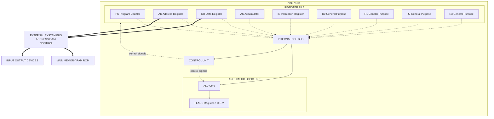
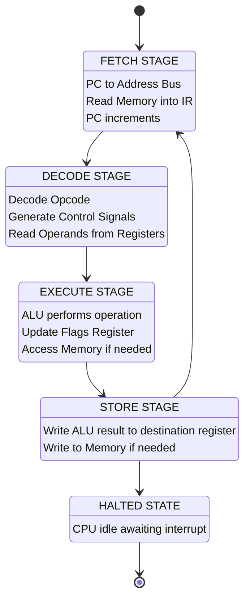
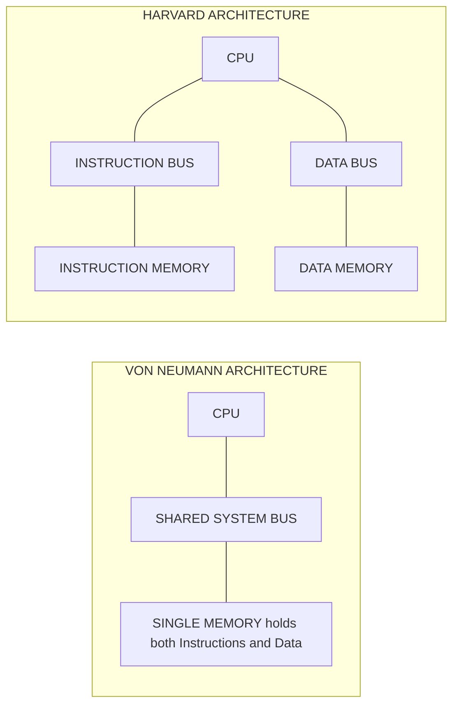

# CPU Architecture and Instruction Set: Basic CPU architecture - ALU, registers, control unit

<!-- SECTION_1_START -->

# CPU Architecture — The Brain Inside Every Machine

## 1.1 Formal Definition (KTU 2024 Scheme)

> [!IMPORTANT]
> **Central Processing Unit (CPU):** The *Central Processing Unit* is the primary hardware component of a computer system that interprets and executes instructions fetched from memory. It is the *executive brain* of the computer, coordinating the flow of data between the memory, input/output devices, and arithmetic operations.

The CPU is composed of **three fundamental sub-systems**:

| Sub-system | Acronym | Primary Responsibility |
|------------|---------|------------------------|
| Arithmetic Logic Unit | **ALU** | Performs all arithmetic and logical operations |
| Control Unit | **CU** | Directs, sequences, and synchronises all CPU activities |
| Register File | **RF** | Provides ultra-high-speed temporary storage for operands and results |

The CPU communicates with **primary memory (RAM)** and **peripherals** through a set of parallel conductors called the **System Bus**, which is subdivided into the **Data Bus**, **Address Bus**, and **Control Bus**.

## 1.2 Intuitive Real-World Analogy

> [!NOTE]
> **The CPU as a Master Chef in a Kitchen**

Imagine the CPU as a **master chef working in a high-pressure restaurant kitchen**. Every component maps perfectly to a kitchen element:

- **The Chef (CPU)** receives an *order ticket* (instruction) and must turn raw ingredients (data) into a finished dish (output).
- **The Workbench (Registers)** is the small, fast workspace right next to the chef. Only a few items can sit on the bench at once, but the chef can grab them instantly. The pantry (RAM) is much larger but requires walking over and finding things — slow!
- **The Cutting Knife & Oven (ALU)** is the chef's set of tools for chopping, mixing, baking, and measuring — i.e., the place where the *actual transformation* of ingredients happens.
- **The Head Waiter (Control Unit)** reads each order ticket, calls out "STATION 1, FIRE THE PASTA!", and ensures that every station acts in the right order, at the right time, with the right ingredients.
- **The Order Ticker / Clock (System Clock)** ticks at a fixed rhythm. The chef can only progress to the next step on each *tick* of the ticker.
- **The Conveyor Belt (Bus)** carries dishes and ingredients between the kitchen, the pantry, and the dining hall.

When you tap a key on your keyboard, an entire chain of *fetch → decode → execute* happens in your CPU, often **billions of times per second**, at speeds measured in **GHz (Giga-Hertz)**, where **1 GHz = $10^9$ clock cycles per second**.

## 1.3 Visualising the Block Layout

> [!VISUALIZATION CONTROL]
> **Concept:** Top-level CPU block diagram showing ALU, Registers, and Control Unit connected by an internal bus.
> **GeoGebra / Desmos Input Equations (schematic):**
> * Point coordinates for the three internal blocks: $A(-4, 0)$, $B(0, 4)$, $C(4, 0)$ forming a triangle.
> * Equation of the internal bus: $y = 0$ (horizontal line through the centre).
> * External connectors as vectors: $\vec{v_1} = (-2, 0)$ to Memory, $\vec{v_2} = (2, 0)$ to I/O.
> **Visual Description:** The student should see a triangle with **ALU** at the bottom-left, **Registers** at the top, **Control Unit** at the bottom-right, all tied to a single horizontal bus line. Two arrows leave the triangle to **Main Memory (left)** and **I/O Devices (right)**.

> [!TIP]
> **KTU Board Tip:** Whenever you draw a CPU block diagram in an exam, always enclose the **ALU + Registers + Control Unit** inside a single thick-bordered rectangle labelled "CPU", and draw the **System Bus** as a *thick triple-line* outside the rectangle. Examiners award **1–2 marks** just for a *neat, labelled* block diagram.

<!-- SECTION_1_END -->

<!-- SECTION_2_START -->

# Deep Theoretical Analysis & KTU High-Yield Formula Sheet

## 2.1 The Three Pillars of the CPU — A Step-by-Step Breakdown

### 2.1.1 Arithmetic Logic Unit (ALU)

The ALU is the **computational heart** of the CPU. Every numerical or logical decision in your program ultimately passes through the ALU.

**Operational steps inside the ALU:**
1. **Operand Fetch:** Two operands $A$ and $B$ are received from the **Register File** via internal data paths.
2. **Operation Select:** The Control Unit sends a multi-bit **opcode** (operation code) signal that selects which internal circuit becomes active.
3. **Execution:** The selected circuit performs the operation in a single clock cycle (or sometimes multiple cycles for complex ops like division).
4. **Result Latch:** The result $R$ is written back to a destination register, and **status flags** (Zero, Carry, Overflow, Sign, Parity) are updated in a special register called the **Status Register / Program Status Word (PSW)**.

**Operations supported by the ALU fall into four broad classes:**

| Class | Example Operations | Engineering Use-Case |
|-------|-------------------|----------------------|
| Arithmetic | ADD, SUB, MUL, DIV, INC, DEC | Banking apps, scientific simulations, graphics rendering |
| Logical | AND, OR, XOR, NOT, NAND | Bit-mask filtering, encryption, permission checks |
| Shift / Rotate | SHL, SHR, SAL, ROL, ROR | Fast multiplication/division by 2, bit-packed I/O |
| Comparison | CMP, TEST | Conditional branching (`if`, `while`, `for` loops) |

### 2.1.2 Register File (RF)

Registers are the **fastest storage elements** in the entire computer hierarchy. They are built from **flip-flops** (6 transistors per bit in CMOS), so accessing a register takes roughly **1 clock cycle** and consumes **0 wait-states**.

**Key register categories (per KTU 2024 syllabus):**

| Register Name | Symbol | Width | Function |
|---------------|--------|-------|----------|
| Program Counter | **PC** | $n$-bit | Holds the memory address of the *next* instruction to fetch |
| Instruction Register | **IR** | $m$-bit | Stores the instruction *currently* being decoded |
| Accumulator | **ACC** | $k$-bit | Default destination for ALU arithmetic results |
| General Purpose Registers | **GPRs** (e.g., R0–R7) | $k$-bit | Hold operands, loop counters, function arguments |
| Memory Address Register | **MAR** | $n$-bit | Holds the address to read/write in RAM |
| Memory Data Register | **MDR** | $m$-bit | Temporarily buffers data going to/coming from RAM |
| Stack Pointer | **SP** | $n$-bit | Points to the top of the call stack |
| Status Register | **SR / FLAGS** | $k$-bit | Holds Zero (Z), Carry (C), Sign (S), Overflow (V) flags |

> [!NOTE]
> **KTU Board Pattern Question:** *"List any six CPU registers and state their function."* This is a guaranteed 4–6 mark question almost every semester. Memorise the table above.

### 2.1.3 Control Unit (CU)

The Control Unit is the **traffic police + project manager** of the CPU. It does not perform computation; instead, it generates the precise **control signals** that orchestrate the ALU, registers, and bus at every clock tick.

**Two classical design approaches:**

1. **Hardwired Control Unit:**
   * Built using **combinational logic gates** (AND, OR, NOT) and a **decoder**.
   * Each instruction's opcode is fed into a decoder that activates a unique combination of control lines.
   * *Advantages:* Very fast, suitable for RISC processors.
   * *Disadvantages:* Hard to modify, becomes unwieldy as ISA grows.

2. **Microprogrammed Control Unit:**
   * Each machine instruction is implemented as a small program (a *microprogram*) stored in a special high-speed **Control Memory (ROM)**.
   * A **Microprogram Counter (µPC)** steps through micro-instructions, each of which sets a word of control signals.
   * *Advantages:* Easy to modify, debug, and patch (Intel microcode updates).
   * *Disadvantages:* Slightly slower than hardwired control.

**Major control signals generated by the CU:**

| Signal | Driven To | Purpose |
|--------|-----------|---------|
| $\text{Reg}_\text{Read}$ | Register File | Enables reading a register onto the bus |
| $\text{Reg}_\text{Write}$ | Register File | Enables writing bus data into a register |
| $\text{ALU}_\text{Op}$ | ALU | Selects arithmetic/logic operation |
| $\text{Mem}_\text{Read}$ | RAM | Activates memory read |
| $\text{Mem}_\text{Write}$ | RAM | Activates memory write |
| $\text{PC}_\text{Inc}$ | Program Counter | Increments PC to next instruction |
| $\text{IR}_\text{Load}$ | Instruction Register | Latches the fetched instruction |

## 2.2 System Bus — The Communication Highway

The bus is a *shared* set of wires. Three logically distinct sub-buses coexist:

$$
\text{System Bus} = \text{Data Bus} \cup \text{Address Bus} \cup \text{Control Bus}
$$

| Sub-bus | Direction | Typical Width | Carries |
|---------|-----------|---------------|---------|
| Data Bus | **Bidirectional** | 8 / 16 / 32 / 64 bits | The actual data being transferred |
| Address Bus | **Unidirectional** (CPU → Memory) | 16 / 20 / 32 / 64 bits | The memory location being referenced |
| Control Bus | **Bidirectional** | 10–20 lines | Read/Write, Interrupt, Clock, Reset signals |

The **maximum addressable memory** of a CPU is determined by the address bus width $n$:

$$
\text{Max Addressable Memory} = 2^n \text{ bytes}
$$

> [!IMPORTANT]
> **Engineering Insight:** A 32-bit address bus can address $2^{32} = 4,294,967,296$ bytes = **4 GB**. This is why 32-bit operating systems cannot use more than 4 GB of RAM regardless of how much you physically install — a fundamental CPU architectural limit.

## 2.3 KTU High-Yield Formula Sheet

| # | Formula / Relationship | LaTeX Form | Practical Use |
|---|------------------------|------------|----------------|
| 1 | Maximum addressable memory | $M_{\max} = 2^n$ bytes | Choosing CPU for embedded design |
| 2 | CPU Execution Time | $T_{\text{exec}} = \dfrac{N_{\text{inst}} \times \text{CPI}}{f_{\text{clock}}}$ | Performance benchmarking |
| 3 | Average CPI | $\text{CPI} = \dfrac{\sum_i (N_i \times \text{CPI}_i)}{N_{\text{total}}}$ | Workload-aware CPU selection |
| 4 | Million Instructions Per Second | $\text{MIPS} = \dfrac{f_{\text{clock}}}{\text{CPI} \times 10^{6}}$ | Comparing processor speeds |
| 5 | Amdahl's Speedup (parallel) | $S = \dfrac{1}{(1 - p) + \dfrac{p}{n}}$ | Multi-core scaling estimates |
| 6 | Data Bus Throughput | $\text{BW} = \text{Width} \times f_{\text{clock}} \times \text{Transfers/cycle}$ | Memory bandwidth planning |
| 7 | Word length of CPU | $L = n$ bits (typical $n \in \{8, 16, 32, 64\}$) | Determines register / ALU width |
| 8 | Clock Period | $T_{\text{clk}} = \dfrac{1}{f_{\text{clock}}}$ | Timing diagram for sequential logic |

> [!NOTE]
> **Where these formulas appear in KTU papers:**
> * $M_{\max} = 2^n$ — *Module 1 / 2 short numerical.* (3 marks)
> * CPI / MIPS / Execution time — *Module 2 numerical.* (7–14 marks)
> * Amdahl's Law — *Module 5 / advanced computing.* (7 marks)

## 2.4 Real-World Engineering Applications

* **Embedded Microcontrollers (ARM Cortex-M0):** Have a tiny 32-bit ALU, 16 general-purpose registers, and a hardwired control unit. They are inside washing machines, microwaves, and IoT sensors.
* **Desktop CPUs (Intel Core i9, AMD Ryzen 9):** Have wide 64-bit ALUs with SIMD extensions, hundreds of registers (renamed), and microprogrammed + hardwired hybrid control units.
* **GPUs (NVIDIA RTX):** Have *thousands* of small ALUs running in parallel, controlled by a sophisticated warp scheduler (a parallel control unit).
* **Space-grade CPUs (RAD750):** Use simple hardwired control units with error-corrected registers to survive cosmic radiation.

<!-- SECTION_2_END -->

<!-- SECTION_3_START -->

# Step-by-Step Derivations, Worked Examples & Code Implementation

## 3.1 Worked Numerical — Maximum Addressable Memory

> **Problem (KTU Pattern, 3 marks):**
> A certain CPU has a 24-bit address bus and a 16-bit data bus. Find (a) the maximum addressable memory in bytes, and (b) the maximum memory it can transfer in a single bus cycle.

### Solution

**Given:**
* Address bus width $n = 24$ bits
* Data bus width $w = 16$ bits

**Part (a) — Maximum addressable memory:**

$$
M_{\max} = 2^n
$$

Substituting $n = 24$:

$$
M_{\max} = 2^{24} \text{ bytes}
$$

Computing the power of 2:

$$
2^{10} = 1024 \approx 1 \text{ KiB}
$$
$$
2^{20} = 1{,}048{,}576 \text{ bytes} = 1 \text{ MiB}
$$
$$
2^{24} = 2^{20} \times 2^{4} = 1{,}048{,}576 \times 16
$$
$$
M_{\max} = 16{,}777{,}216 \text{ bytes} = 16 \text{ MiB}
$$

> **Answer (a):** Maximum addressable memory $= 16 \text{ MiB}$ (i.e., $16 \times 2^{20}$ bytes). **[Final answer: 1 Mark]**
> **[Stating formula $M = 2^n$: 1 Mark]**
> **[Correct substitution and evaluation: 1 Mark]**

**Part (b) — Maximum data per bus cycle:**

$$
\text{Data per cycle} = w \text{ bits} = 16 \text{ bits} = 2 \text{ bytes}
$$

> **Answer (b):** 2 bytes per bus cycle. **[1 Mark]**

## 3.2 Worked Numerical — CPU Execution Time & MIPS

> **Problem (KTU Pattern, 7 marks):**
> A processor runs at $f_{\text{clock}} = 2 \text{ GHz}$. A program contains $N = 1 \times 10^9$ instructions with an average CPI of $1.5$. Calculate (i) the CPU execution time, and (ii) the MIPS rating.

### Solution

**Given:**
* Clock frequency $f_{\text{clock}} = 2 \text{ GHz} = 2 \times 10^9 \text{ Hz}$
* Number of instructions $N = 1 \times 10^9$
* Average CPI $= 1.5$ cycles/instruction

**Step 1 — Compute the clock period:**

$$
T_{\text{clk}} = \dfrac{1}{f_{\text{clock}}} = \dfrac{1}{2 \times 10^9} \text{ s} = 0.5 \times 10^{-9} \text{ s} = 0.5 \text{ ns}
$$

**Step 2 — Compute the CPU execution time using the master formula:**

$$
T_{\text{exec}} = \dfrac{N \times \text{CPI}}{f_{\text{clock}}}
$$

Substituting:

$$
T_{\text{exec}} = \dfrac{(1 \times 10^9) \times 1.5}{2 \times 10^9} \text{ s}
$$

$$
T_{\text{exec}} = \dfrac{1.5 \times 10^9}{2 \times 10^9} \text{ s}
$$

$$
T_{\text{exec}} = 0.75 \text{ s}
$$

> **Answer (i):** $T_{\text{exec}} = 0.75 \text{ seconds}$. **[3 Marks]**
> **[Formula 1 Mark + Substitution 1 Mark + Final result 1 Mark]**

**Step 3 — Compute MIPS:**

$$
\text{MIPS} = \dfrac{f_{\text{clock}}}{\text{CPI} \times 10^{6}}
$$

Substituting:

$$
\text{MIPS} = \dfrac{2 \times 10^9}{1.5 \times 10^6}
$$

$$
\text{MIPS} = \dfrac{2}{1.5} \times 10^{3}
$$

$$
\text{MIPS} = 1.3333 \times 10^{3} = 1333.33 \text{ MIPS}
$$

> **Answer (ii):** $\text{MIPS} \approx 1333.33$ million instructions per second. **[2 Marks]**
> **[Formula 1 Mark + Correct arithmetic 1 Mark]**

**Step 4 — Sanity Check:**

Higher CPI → fewer MIPS for the same clock. ✓
Higher clock → more MIPS for the same CPI. ✓
Longer CPI × N → longer execution. ✓

## 3.3 Symbolic Walk-through — Instruction Execution Through the CPU

Let's trace how a simple instruction like **`ADD R1, R2, R3`** (meaning $R1 \leftarrow R2 + R3$) flows through the architecture.

> **Step 1 — FETCH**
> * CU asserts $\text{Mem}_\text{Read}$ and places the value of **PC** onto the **Address Bus**.
> * RAM returns the instruction word on the **Data Bus**.
> * The word is latched into the **Instruction Register (IR)**.
> * CU asserts $\text{PC}_\text{Inc}$, so $\text{PC} \leftarrow \text{PC} + 1$.

> **Step 2 — DECODE**
> * The CU's instruction decoder breaks the IR into fields: `opcode = ADD`, `dest = R1`, `src1 = R2`, `src2 = R3`.
> * The CU activates the appropriate control lines, including $\text{ALU}_\text{Op} = \text{ADD}$.

> **Step 3 — OPERAND FETCH**
> * The Register File is told to put $R2$ on **Bus A** and $R3$ on **Bus B**.

> **Step 4 — EXECUTE (ALU)**
> * ALU receives $A = R2$ and $B = R3$, performs the addition, and produces $R = R2 + R3$.
> * The Status Register is updated: e.g., Zero flag = 1 if result is 0; Carry flag = 1 if unsigned overflow occurred.

> **Step 5 — STORE RESULT**
> * CU asserts $\text{Reg}_\text{Write}$ with destination = R1.
> * The ALU output $R$ is routed back through the internal bus and stored in **R1**.

> **Step 6 — REPEAT** for the next instruction at the updated PC.

> [!IMPORTANT]
> **The complete cycle from Step 1 to Step 5 is called the Instruction Cycle, and in a classic Von Neumann architecture it occupies between 1 and 5+ clock cycles depending on CPU micro-architecture (single-cycle, multi-cycle, or pipelined).**

## 3.4 Python Implementation — A Toy CPU Simulator

This is a *fully working* Python program that emulates a minimal CPU with an ALU, registers, and a control unit. It will let you *see* the Fetch–Decode–Execute cycle in action — a powerful intuition-builder for KTU lab vivas.

```python
"""
KTU GXEST203 - Module 2 Demonstration
A minimal educational CPU simulator showing ALU, Registers, and Control Unit
"""

from dataclasses import dataclass, field
from typing import Dict, List, Optional
import logging
import sys

# Configure structured logging so the trace is board-friendly
logging.basicConfig(
    level=logging.INFO,
    format="[CYCLE %(cycle)d] %(message)s",
    stream=sys.stdout,
)
log = logging.getLogger("KTU_CPU")


# ---------- ALU ----------
class ArithmeticLogicUnit:
    """Performs arithmetic and logical operations on two operands."""

    SUPPORTED_OPS = {"ADD", "SUB", "AND", "OR", "XOR"}

    def execute(self, op: str, a: int, b: int) -> int:
        if op not in self.SUPPORTED_OPS:
            raise ValueError(f"ALU: Unsupported operation '{op}'")

        if op == "ADD":
            result = a + b
        elif op == "SUB":
            result = a - b
        elif op == "AND":
            result = a & b
        elif op == "OR":
            result = a | b
        else:  # XOR
            result = a ^ b

        log.info(f"ALU: {a} {op} {b} = {result}")
        return result


# ---------- REGISTER FILE ----------
@dataclass
class RegisterFile:
    """A small register file: 8 general-purpose 8-bit registers + special regs."""

    gpr: List[int] = field(default_factory=lambda: [0] * 8)  # R0..R7
    pc: int = 0  # Program Counter
    ir: str = ""  # Instruction Register (string for clarity)
    flags: Dict[str, int] = field(
        default_factory=lambda: {"Z": 0, "C": 0, "S": 0, "V": 0}
    )

    def read(self, idx: int) -> int:
        if not 0 <= idx < 8:
            raise IndexError(f"Register index {idx} out of range [0..7]")
        return self.gpr[idx]

    def write(self, idx: int, value: int) -> None:
        if not 0 <= idx < 8:
            raise IndexError(f"Register index {idx} out of range [0..7]")
        # Clamp to 8-bit to mimic a real 8-bit CPU
        self.gpr[idx] = value & 0xFF
        log.info(f"REG: R{idx} <- {self.gpr[idx]}")


# ---------- CONTROL UNIT ----------
class ControlUnit:
    """Decodes instructions and emits control signals for the ALU & Registers."""

    OPCODES = {
        "ADD": "ALU_ADD",
        "SUB": "ALU_SUB",
        "AND": "ALU_AND",
        "OR":  "ALU_OR",
        "XOR": "ALU_XOR",
        "HLT": "HALT",
    }

    def decode(self, instruction: str) -> Optional[Dict[str, str]]:
        parts = instruction.strip().split()
        if not parts:
            return None
        mnemonic = parts[0].upper()
        if mnemonic not in self.OPCODES:
            raise ValueError(f"CU: Unknown mnemonic '{mnemonic}'")
        decoded = {"mnemonic": mnemonic, "signal": self.OPCODES[mnemonic]}
        if mnemonic != "HLT":
            # operands like R1,R2,R3
            ops = parts[1].split(",")
            if len(ops) != 3:
                raise ValueError(f"CU: Expected 3 operands, got {len(ops)}")
            decoded["dest"] = int(ops[0][1:])
            decoded["src1"] = int(ops[1][1:])
            decoded["src2"] = int(ops[2][1:])
        log.info(f"CU: Decoded -> {decoded}")
        return decoded


# ---------- CPU (integrates ALU + RF + CU) ----------
class CPU:
    def __init__(self) -> None:
        self.alu = ArithmeticLogicUnit()
        self.rf = RegisterFile()
        self.cu = ControlUnit()
        self.program: List[str] = []
        self.cycle: int = 0
        self.halted: bool = False

    def load_program(self, program: List[str]) -> None:
        self.program = program
        log.info(f"Loaded program of {len(program)} instructions")

    def run(self) -> None:
        log.info("=== CPU STARTED ===")
        while not self.halted and self.rf.pc < len(self.program):
            self.cycle += 1
            self._instruction_cycle()
        log.info(f"=== CPU HALTED after {self.cycle} cycles ===")
        log.info(f"Final register state: {self.rf.gpr}")

    def _instruction_cycle(self) -> None:
        # 1) FETCH
        instr = self.program[self.rf.pc]
        self.rf.ir = instr
        log.info(f"FETCH: PC={self.rf.pc} -> IR='{instr}'")
        self.rf.pc += 1

        # 2) DECODE
        decoded = self.cu.decode(instr)
        if decoded is None:
            return

        # 3) EXECUTE
        signal = decoded["signal"]
        if signal == "HALT":
            self.halted = True
            return

        a = self.rf.read(decoded["src1"])
        b = self.rf.read(decoded["src2"])
        op_name = decoded["mnemonic"]
        result = self.alu.execute(op_name, a, b)

        # 4) UPDATE FLAGS
        self.rf.flags["Z"] = 1 if result == 0 else 0
        self.rf.flags["S"] = 1 if (result & 0x80) else 0
        log.info(f"FLAGS: Z={self.rf.flags['Z']} S={self.rf.flags['S']}")

        # 5) WRITE BACK
        self.rf.write(decoded["dest"], result)


# ---------- DEMO PROGRAM ----------
if __name__ == "__main__":
    # Program: compute R0 = (R1 + R2) AND R3
    # We pre-load R1=10, R2=20, R3=0x0F
    demo_program = [
        "ADD R4,R1,R2",   # R4 = 10 + 20 = 30
        "AND R0,R4,R3",   # R0 = 30 AND 15 = 14
        "HLT",
    ]

    cpu = CPU()
    # Pre-load operands directly into registers
    cpu.rf.write(1, 10)
    cpu.rf.write(2, 20)
    cpu.rf.write(3, 0x0F)
    cpu.load_program(demo_program)
    cpu.run()
```

**Expected Output Trace (excerpt):**

```
[CYCLE 1] Loaded program of 3 instructions
[CYCLE 1] === CPU STARTED ===
[CYCLE 1] FETCH: PC=0 -> IR='ADD R4,R1,R2'
[CYCLE 1] CU: Decoded -> {'mnemonic': 'ADD', 'signal': 'ALU_ADD', 'dest': 4, 'src1': 1, 'src2': 2}
[CYCLE 1] REG: R1 <- 10
[CYCLE 1] REG: R2 <- 20
[CYCLE 1] ALU: 10 ADD 20 = 30
[CYCLE 1] FLAGS: Z=0 S=0
[CYCLE 1] REG: R4 <- 30
[CYCLE 2] FETCH: PC=1 -> IR='AND R0,R4,R3'
...
=== CPU HALTED after 3 cycles ===
Final register state: [14, 10, 20, 15, 30, 0, 0, 0]
```

> [!TIP]
> **KTU Lab Viva Favourite Question:** *"Trace the execution of the instruction `SUB R5, R3, R2` showing the contents of PC, IR, MAR, MDR, and the ALU."* Use the above simulator as your mental model.

## 3.5 Tabular Derivation — Register Behaviour During a LOAD Instruction

For a hypothetical **`LOAD R4, [1000]`** instruction (read memory address 1000 into R4):

| Clock Edge | PC | MAR | MDR | IR | R4 | Control Signals Active |
|------------|----|----|----|----|----|-----------------------|
| $T_0$ (initial) | 200 | – | – | – | old | – |
| $T_1$ | 200 | 200 | – | – | old | $\text{Mem}_\text{Read}$, $\text{IR}_\text{Load}$ |
| $T_2$ | 201 | 200 | `LOAD R4, [1000]` | `LOAD R4, [1000]` | old | $\text{PC}_\text{Inc}$ |
| $T_3$ | 201 | 1000 | – | – | old | $\text{Mem}_\text{Read}$ |
| $T_4$ | 201 | 1000 | data @1000 | – | old | $\text{Reg}_\text{Write}$ to R4 |
| $T_5$ | 201 | – | – | – | new value | – |

> [!NOTE]
> This table is the *exact* format KTU examiners expect for a "trace the instruction cycle" question. **Memorise the column headers** — they are the most commonly tested ones.

<!-- SECTION_3_END -->

<!-- SECTION_4_START -->

# Structural Diagrams & Schematics

## 4.1 Master Block Diagram of a Single-Bus CPU

The diagram below shows a **classic single-internal-bus CPU organisation** as taught in the KTU 2024 syllabus. All major registers, the ALU, and the Control Unit are connected through a single internal bus.



> [!IMPORTANT]
> **Reading the diagram:**
> * The **solid arrow** into the ALU indicates *data flow* (operands from bus to ALU, result from ALU back to bus).
> * The **dotted arrows** from CU to RegFile and ALU indicate *control signal* flow (timing, not data).
> * The **thick `==>`** arrows represent the *external* system bus reaching memory and I/O.
> * Every block is enclosed in a labelled subgraph so the diagram is easy to draw by hand in the exam.

## 4.2 Instruction-Cycle State Machine

The CPU's behaviour during program execution is best modelled as a finite state machine. The four core states are FETCH → DECODE → EXECUTE → STORE, with the PC providing the next-state address.



> [!NOTE]
> **KTU Exam Use:** In 7-mark questions, examiners will often show this state diagram with one stage missing and ask you to *"describe the missing stage"*. Be ready to write 3–4 lines per stage.

## 4.3 Von Neumann vs Harvard Block Comparison

The KTU syllabus expects you to know the two fundamental CPU-memory interconnection styles.



> [!TIP]
> **Quick comparison table you can reproduce in the exam:**

| Feature | Von Neumann | Harvard |
|---------|-------------|---------|
| Memory | Single shared | Separate I-Mem and D-Mem |
| Bus | One shared bus | Two independent buses |
| Bottleneck | *Von Neumann bottleneck* (instructions & data contend for same bus) | None — parallel access possible |
| Speed | Slower | Faster |
| Cost | Cheaper | Costlier (more pins, more wires) |
| Example | Most general-purpose CPUs (x86, ARM in single-core mode) | DSPs, microcontrollers (8051, ARM Cortex-M with separate I/D buses) |

<!-- SECTION_4_END -->

<!-- SECTION_5_START -->

# KTU 2024 Scheme Examination Question Bank & Topic Recap

## 5.1 Part A — Short-Answer Questions (3 Marks Each)

### Question 1 [KTU University Exam - July 2024]

> **Define the Arithmetic Logic Unit (ALU). List any four operations performed by it.**

**Model Answer (3 Marks):**

The **Arithmetic Logic Unit (ALU)** is the computational sub-system of the CPU that performs all arithmetic, logical, shift, and comparison operations on binary data presented to it by the register file. **[Definition: 1 Mark]**

Four operations performed by the ALU:

1. **Arithmetic:** ADD, SUB, MUL, DIV **[1 Mark]**
2. **Logical:** AND, OR, XOR, NOT **[0.5 Mark]**
3. **Shift / Rotate:** SHL, SHR, ROL, ROR **[0.5 Mark]**

*Plus any valid fourth category (Comparison) for the remaining marks.*

> **Board Expectation:** A clear one-line definition **+** at least 3–4 categorised operations. Bullet points preferred over paragraphs.

---

### Question 2 [KTU University Exam - Dec 2023]

> **Explain the role of the Control Unit in a CPU. Differentiate between hardwired and microprogrammed control units.**

**Model Answer (3 Marks):**

The **Control Unit (CU)** is the sub-system of the CPU responsible for **directing, sequencing, and synchronising** the operations of the ALU, registers, memory, and I/O devices. It fetches each instruction from the IR, decodes its opcode, and generates the appropriate **control signals** (e.g., $\text{Mem}_\text{Read}$, $\text{Reg}_\text{Write}$, $\text{ALU}_\text{Op}$) at the correct clock edge. **[Role of CU: 1 Mark]**

| Aspect | Hardwired CU | Microprogrammed CU |
|--------|--------------|---------------------|
| Implementation | Combinational logic gates & decoder | Microinstructions stored in ROM |
| Speed | Faster | Slightly slower |
| Flexibility | Difficult to modify | Easily modified via firmware |
| Used in | RISC processors | CISC processors (e.g., older x86) |

**[Comparison: 2 Marks]**

---

## 5.2 Part B — 14-Mark Questions (Internal Choice)

> **Instructions:** *Answer ANY ONE full question from the two alternatives. Each question carries 14 marks split into sub-parts (a) 7 marks and (b) 7 marks.*

### Question A (14 Marks) [KTU University Exam - Dec 2023]

> **(a)** Draw and explain the basic block diagram of a CPU, identifying the functions of the **ALU, Register File, and Control Unit**. **[7 Marks]**
> **(b)** Explain the different categories of **CPU registers** (PC, IR, MAR, MDR, AC, GPR, SP, Flags) with one-line descriptions of their functions. **[7 Marks]**

---

#### Model Solution — Part A(a) (7 Marks)

**Step 1 — Diagram (3 Marks):**
Draw a labelled block diagram of the CPU with the ALU, Register File, and Control Unit tied to an internal bus, and the external system bus connecting to memory and I/O. Use the figure in **Section 4.1** as a reference.

**Step 2 — Explanation of each block (4 Marks):**

* **ALU (1 Mark):** Performs all arithmetic and logical operations. Receives operands from registers, executes the selected operation, and outputs the result plus status flags.
* **Register File (1 Mark):** A small set of high-speed storage locations built from flip-flops. Holds operands, the program counter, the instruction register, and intermediate results.
* **Control Unit (1 Mark):** Acts as the CPU's manager. Decodes the IR contents and emits control signals to ALU, registers, and bus for every clock cycle.
* **System Bus (1 Mark):** The set of wires (data, address, control) that interconnect the CPU with main memory and peripheral devices.

> **Valuation Key:**
> * Neat, labelled block diagram: 3 Marks
> * Brief functional description of each of the 3 internal blocks: 3 Marks
> * Mention of system bus: 1 Mark

---

#### Model Solution — Part A(b) (7 Marks)

For each register, write **register name — abbreviation — function** in 1–2 lines.

| Register | Function |
|----------|----------|
| **Program Counter (PC)** | Holds the address of the *next* instruction to be fetched. Auto-increments after every fetch. **[1 Mark]** |
| **Instruction Register (IR)** | Holds the instruction word *currently* being decoded and executed. **[1 Mark]** |
| **Memory Address Register (MAR)** | Holds the memory address that will be used for the next read or write operation. **[0.5 Mark]** |
| **Memory Data Register (MDR)** | Buffers data being transferred to or from memory (acts as a two-way gateway). **[0.5 Mark]** |
| **Accumulator (AC)** | Default destination for ALU arithmetic results in single-address instructions. **[1 Mark]** |
| **General Purpose Registers (GPRs)** | Multi-purpose registers used by the programmer/compiler for operands, loop counters, function arguments. **[1 Mark]** |
| **Stack Pointer (SP)** | Points to the top of the runtime stack in memory; used for subroutine calls and local variables. **[1 Mark]** |
| **Flags / Status Register** | Holds condition codes: Zero (Z), Carry (C), Sign (S), Overflow (V) — used for conditional branching. **[1 Mark]** |

> **Valuation Key:** Award 1 mark per register; full marks (7) for 7 correctly described registers. Partial credit (0.5) for partially correct descriptions.

---

### Question B (14 Marks) [KTU University Exam - July 2024] — *ALTERNATIVE*

> **(a)** With the help of a state diagram, explain the **Instruction Cycle** of a CPU, detailing the Fetch, Decode, Execute, and Store phases. **[7 Marks]**
> **(b)** Compare **single-bus, two-bus, and three-bus internal CPU organisations**. Mention one advantage and one disadvantage of each. **[7 Marks]**

---

#### Model Solution — Part B(a) (7 Marks)

**Step 1 — State Diagram (2 Marks):**
Draw a circular state diagram with four states: **FETCH → DECODE → EXECUTE → STORE → (back to FETCH)**, plus a terminal **HALT** state. Use the figure in **Section 4.2** as a reference.

**Step 2 — Description of each phase (5 Marks, ~1.25 per phase):**

* **FETCH (1.25 Marks):**
  * The address in **PC** is placed on the address bus.
  * Memory returns the instruction word on the data bus.
  * The instruction is latched into the **IR**.
  * PC is incremented to point to the next instruction.
* **DECODE (1.25 Marks):**
  * The CU examines the opcode field of the IR.
  * The instruction decoder activates the appropriate control signals.
  * Source and destination operand addresses are decoded.
* **EXECUTE (1.25 Marks):**
  * The ALU performs the requested operation (ADD, AND, etc.), or
  * Memory is accessed for LOAD/STORE, or
  * Control flow is altered for JUMP/CALL.
  * The Flags register is updated.
* **STORE (1.25 Marks):**
  * The result from the ALU (or memory) is written back to the destination register, or
  * Data is written back to memory (for STORE instruction).
  * Control returns to FETCH for the next instruction.

> **Valuation Key:**
> * State diagram with 4 states + arrows: 2 Marks
> * Fetch description: 1.25 Marks
> * Decode description: 1.25 Marks
> * Execute description: 1.25 Marks
> * Store description: 1.25 Marks

---

#### Model Solution — Part B(b) (7 Marks)

| Organisation | Structure | Advantage | Disadvantage |
|--------------|-----------|-----------|--------------|
| **Single-Bus CPU** | All registers share *one* internal bus | Simple, cheap, fewer connections; easy to design | Only one data transfer per clock; long execution time |
| **Two-Bus CPU** | Two internal buses connect registers to ALU | ALU can read both operands in one cycle; faster | Slightly more complex wiring; more multiplexers |
| **Three-Bus CPU** | Three internal buses (two sources + one destination) | ALU reads two operands and writes result in a *single* cycle; fastest | Most complex, most expensive, highest power consumption |

**[1 Mark per correctly identified advantage + 1 Mark per correctly identified disadvantage + 1 Mark for each organisation's structure = 7 Marks]**

> **Recommended answer length:** ~1 short paragraph per organisation, total 3–4 paragraphs.

---

> [!WARNING]
> **KTU Examiner's Valuation Warning — Common Pitfalls**
> 1. **Do not draw the ALU outside the CPU box.** The ALU is *inside* the CPU. Drawing it as an external block costs 1–2 marks.
> 2. **Always label the three sub-buses separately** (Data, Address, Control). Writing "system bus" without sub-classification loses 1 mark.
> 3. **Mention the System Clock** explicitly. Many answers forget the clock; a CPU is a *synchronous* sequential machine.
> 4. **For numerical problems, always state the formula first** ($M = 2^n$, $T = N \times \text{CPI} / f$, etc.) before substituting. Examiners allocate 1 mark for the formula itself.
> 5. **Do not confuse MAR and MDR.** MAR holds the *address*; MDR holds the *data*. Reversing these is a very common error.
> 6. **In state-diagram questions, mark the HALT state.** Many students draw only 4 states and forget HALT — losing 0.5–1 mark.
> 7. **Always show units** (Hz, seconds, bytes) in numerical answers. "1.33" without "MIPS" or "$10^9$" will be penalised.

---

## 5.3 Topic Recap & Important Things to Remember

> [!IMPORTANT]
> **Rapid Revision Checklist — Module 2: CPU Architecture**

- **CPU = ALU + Control Unit + Register File**, all connected by an **internal bus**, all enclosed inside one chip boundary.
- **ALU** performs arithmetic (ADD, SUB, MUL, DIV), logical (AND, OR, XOR, NOT), shift (SHL, SHR), and comparison (CMP, TEST) operations. It outputs a *result* and *flags*.
- **Register File** contains PC, IR, MAR, MDR, AC, GPRs, SP, and Flags — all are **flip-flop-based** and **single-cycle** accessible.
- **Control Unit** can be **hardwired** (fast, rigid) or **microprogrammed** (flexible, slightly slower). It generates control signals every clock.
- **System Bus** = **Data Bus** (bidirectional, carries data) + **Address Bus** (unidirectional CPU→Memory, carries location) + **Control Bus** (bidirectional, carries R/W/Interrupt/Clock/Reset).
- **Maximum addressable memory** $= 2^n$ bytes where $n$ is the address bus width. 16-bit → 64 KiB; 32-bit → 4 GiB; 64-bit → 16 EiB.
- **CPU Execution Time** $T = \dfrac{N \times \text{CPI}}{f_{\text{clock}}}$ — the single most important performance formula.
- **MIPS Rating** $= \dfrac{f_{\text{clock}}}{\text{CPI} \times 10^6}$ — higher is faster.
- **CPI** (Cycles Per Instruction) is the average number of clock cycles each instruction consumes; lower is better.
- **Instruction Cycle** has four stages: **Fetch → Decode → Execute → Store**, looping continuously until a HALT or interrupt.
- **Von Neumann architecture** uses *one* shared memory and *one* shared bus for both instructions and data (introduces the *Von Neumann bottleneck*).
- **Harvard architecture** uses *separate* instruction and data memories with *separate* buses (used in DSPs and microcontrollers like 8051).
- **Single-bus CPU** is simple but slow; **two-bus** is balanced; **three-bus** is fastest but most complex.
- **The Program Counter (PC)** is *not* a counter in the hardware sense — it is a register that the CU *auto-increments* every fetch.
- **Status flags** (Z, C, S, V) are the *only* mechanism by which the ALU communicates *conditional* outcomes to the control flow logic.
- **Always** draw the CPU block diagram with: external bus on the left/right, internal bus in the middle, ALU on one side, Register File on the other, CU sending dotted control lines to both.
- **Memorise the worked numericals** in Section 3.1 ($M = 2^n$) and Section 3.2 (CPI / MIPS) — they appear in nearly every KTU paper.

<!-- SECTION_5_END -->
