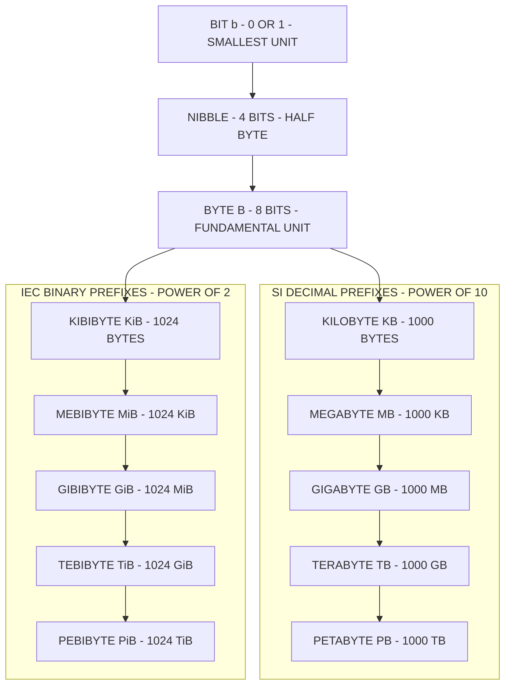
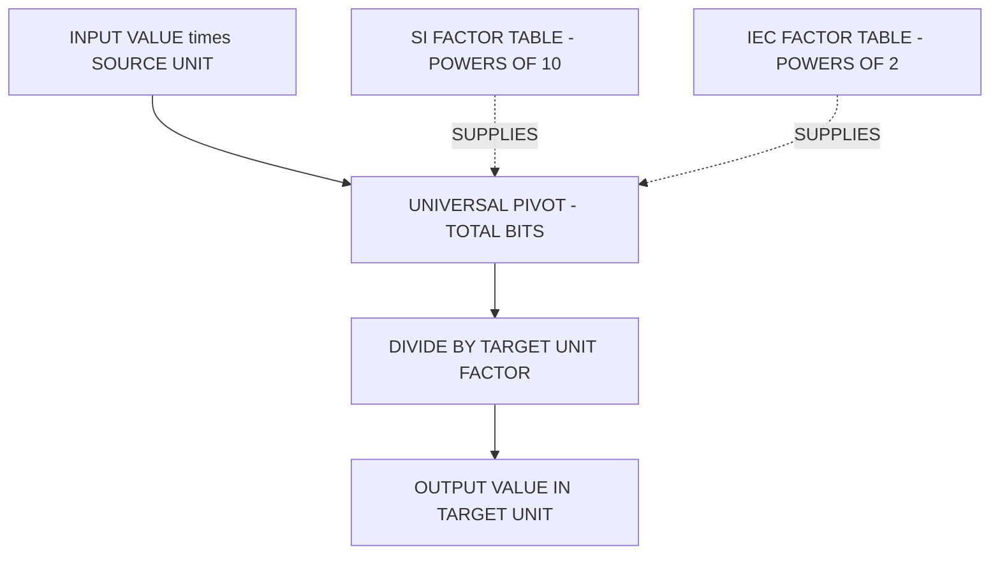

# Data storage units - bits, bytes, kilobytes, etc.

<!-- SECTION_1_START -->
# Data Storage Units: Bits, Bytes, and Beyond

## Formal Academic Definition

In computing, **data storage units** are standardized measures used to quantify the capacity of digital memory devices and the size of digital information. Every piece of digital data, whether it is a single character, a photograph, or an entire operating system, is ultimately composed of a sequence of binary digits called **bits**, which are grouped into larger aggregates called **bytes**, **kilobytes**, **megabytes**, and so forth, following a hierarchical structure that scales by powers of two (binary) or powers of ten (decimal).

> [!NOTE]
> **KTU Syllabus Highlight (Module 2 — Binary Representation):**
> Before studying *how* numbers are encoded in binary, students must first understand *how much space* those numbers consume in memory. This topic establishes the foundational vocabulary of digital measurement: bit, nibble, byte, KB, MB, GB, TB, and PB.

---

## Conceptual Analogy: From a Light Switch to a National Library

To build intuition, imagine a staircase of containers, each one holding the previous one a thousand times over:

| Level | Real-World Analogy | Holds... |
|---|---|---|
| **Bit** | A single light switch (ON or OFF) | one binary decision |
| **Nibble** | Four switches in a row | half a typing character |
| **Byte** | One typed letter (e.g., the letter 'A') | a single text character |
| **Kilobyte** | A short paragraph of text | roughly 1024 characters |
| **Megabyte** | A small novel | about 1024 paragraphs |
| **Gigabyte** | A library bookshelf | about 1024 novels |
| **Terabyte** | A large library wing | about 1024 bookshelves |
| **Petabyte** | A national library system | about 1024 library wings |

This staircase metaphor is essential because it shows that the jump from one unit to the next is *not* a trivial ten-fold increase — at higher levels, the difference between **1024** and **1000** becomes dramatically significant.

---

## The Two Critical Standard Metrics

The single most important fact to internalize:

> **8 bits = 1 byte** (this is the *only* exact, universal standard across all of computing)

> **1 byte = 2³ = 8 bits** (the byte is historically tied to encoding one character of text in ASCII)

> [!IMPORTANT]
> **Symbol Convention (Killer Exam Trap):**
> A lowercase **b** denotes **bits**, while an uppercase **B** denotes **bytes**. For example, your internet speed of **100 Mbps** is **100 megabits per second**, which equals only **12.5 megabytes per second** (MB/s). Forgetting this distinction is one of the most common ways students lose marks in KTU valuation.

---

> [!VISUALIZATION CONTROL]
> **Concept:** Exponential growth of SI (decimal) versus IEC (binary) storage unit factors
> **GeoGebra / Desmos Input Equations:**
> * `f(x) = 1024^x` (IEC binary base — represents 1 KiB, 1 MiB, 1 GiB as you increase x)
> * `g(x) = 1000^x` (SI decimal base — represents 1 KB, 1 MB, 1 GB as you increase x)
> * `Point((3, 1073741824))` — anchors 1 GiB in bits on the IEC curve
> * `Point((3, 1000000000))` — anchors 1 GB in bits on the SI curve
> **Visual Description:** On a standard linear y-axis, both curves will shoot off the chart almost vertically, with the IEC curve always slightly *above* the SI curve. The vertical gap between `f(x)` and `g(x)` widens dramatically as `x` increases. This visually explains why a "1 TB" hard drive advertised as 1,000,000,000,000 bytes actually only shows about **931 GiB** in your operating system — the binary system needs *more* bytes to reach the same name.
<!-- SECTION_1_END -->

<!-- SECTION_2_START -->
# Deep Theoretical Analysis & KTU High-Yield Formula Sheet

## The Complete Hierarchy — From Smallest to Largest

### 1. The Bit (b)
The **bit** is the atomic unit of information, representing one binary decision: `0` or `1`. It is the smallest addressable unit in classical computing. All higher units are constructed by aggregating bits.

- **Symbol:** b (lowercase)
- **Size:** 1 bit
- **States:** Exactly 2 (0 or 1)

### 2. The Nibble
A **nibble** (sometimes spelled "nybble") is a group of **4 bits**. It is useful in hexadecimal representation, where one hex digit = one nibble.

- **Size:** 4 bits
- **Range:** $0000_2$ to $1111_2$ (0 to 15 in decimal)
- **Use case:** Hexadecimal shorthand, BCD (Binary-Coded Decimal)

### 3. The Byte (B)
The **byte** is the fundamental addressable unit in nearly all modern computer architectures. Historically defined as the number of bits required to encode a single text character.

- **Symbol:** B (uppercase)
- **Size:** 8 bits
- **Range:** 0 to 255 (unsigned) or $-128$ to $+127$ (signed two's complement)

### 4. The Kilobyte (KB) and Kibibyte (KiB) — *The First Source of Confusion*
This is where the SI/IEC debate begins:

- **SI (Decimal) — Kilobyte (KB):** 1 KB = **1000 bytes** (exactly $10^3$ bytes). Used by hard drive manufacturers, network operators, and the IEC recommends this for *decimal* use.
- **IEC (Binary) — Kibibyte (KiB):** 1 KiB = **1024 bytes** (exactly $2^{10}$ bytes). Used by operating systems (Windows, macOS, Linux) and RAM specifications.

### 5. Scaling Up — Megabyte, Gigabyte, Terabyte, Petabyte

The same 1000-vs-1024 conflict repeats at every level, which is why the IEC introduced the binary prefixes KiB, MiB, GiB, TiB, PiB.

---

## KTU Formula Sheet / Cheat Sheet

> [!NOTE]
> Memorize this table. It is the single most-tested reference in this module.

| Unit Name | Symbol | Power (Decimal/SI) | Power (Binary/IEC) | Bits Equivalent |
|---|---|---|---|---|
| Bit | b | $10^0$ bits | $2^0$ | $1$ |
| Nibble | — | — | $2^2$ | $4$ |
| Byte | B | $8 \times 10^0$ bits | $2^3$ | $8$ |
| Kilobyte / Kibibyte | KB / KiB | $10^3$ B | $2^{10}$ B | $8 \times 10^3$ / $2^{13}$ |
| Megabyte / Mebibyte | MB / MiB | $10^6$ B | $2^{20}$ B | $8 \times 10^6$ / $2^{23}$ |
| Gigabyte / Gibibyte | GB / GiB | $10^9$ B | $2^{30}$ B | $8 \times 10^9$ / $2^{33}$ |
| Terabyte / Tebibyte | TB / TiB | $10^{12}$ B | $2^{40}$ B | $8 \times 10^{12}$ / $2^{43}$ |
| Petabyte / Pebibyte | PB / PiB | $10^{15}$ B | $2^{50}$ B | $8 \times 10^{15}$ / $2^{53}$ |

### Key Conversion Equations

$$
1 \text{ KiB} = 2^{10} \text{ B} = 1024 \text{ B}
$$

$$
1 \text{ MiB} = 2^{20} \text{ B} = 1024 \text{ KiB} = 1{,}048{,}576 \text{ B}
$$

$$
1 \text{ GiB} = 2^{30} \text{ B} = 1024 \text{ MiB} = 1{,}073{,}741{,}824 \text{ B}
$$

$$
1 \text{ TiB} = 2^{40} \text{ B} = 1024 \text{ GiB} = 1{,}099{,}511{,}627{,}776 \text{ B}
$$

$$
1 \text{ KB (SI)} = 10^3 \text{ B} = 1000 \text{ B}
$$

$$
1 \text{ GB (SI)} = 10^9 \text{ B} = 1{,}000{,}000{,}000 \text{ B}
$$

### The Percentage Gap Between SI and IEC

$$
\text{Gap \%} = \left( \frac{2^{10n} - 10^{3n}}{10^{3n}} \right) \times 100
$$

For $n=3$ (the gigabyte level):
$$
\text{Gap} = \left( \frac{1{,}073{,}741{,}824 - 1{,}000{,}000{,}000}{1{,}000{,}000{,}000} \right) \times 100 \approx 7.37\%
$$

> [!IMPORTANT]
> **Why does a 1 TB hard drive show only ~931 GiB in Windows?**
> Because the drive is advertised using SI units (1 TB = $10^{12}$ bytes), but Windows reports using IEC units (1 TiB = $2^{40}$ bytes). The "missing" 7 to 10 percent of space is not missing at all — it is the arithmetic consequence of the base difference. This is the single most common KTU viva question on this topic.

---

## Real-World Engineering Utility

1. **RAM Sizing:** Laptop RAM is sold in IEC binary (e.g., 8 GiB = 8 $\times$ $2^{30}$ bytes), because memory addressing is inherently binary.
2. **Storage Sizing:** Hard drives, SSDs, and USB sticks are sold in SI decimal (e.g., 1 TB = $10^{12}$ bytes), because the disk fabrication process is naturally decimal (platters, sectors).
3. **Network Engineering:** Bandwidth is measured in **bits per second** (Kbps, Mbps, Gbps), while downloaded file sizes are measured in **bytes** (KB, MB, GB). This is why a "100 Mbps" connection downloads a 100 MB file in roughly 8 seconds, not 1 second.
4. **Web Development (per your course title):** Image sizes, CSS bundles, and JavaScript payloads are reported in bytes, KB, and MB for performance optimization. A KTU web project that loads a 5 MB hero image on mobile is considered poorly optimized.
5. **Database Engineering:** Row sizes, page sizes (typically 8 KiB or 16 KiB), and buffer pool capacities are all powers-of-two IEC units.
<!-- SECTION_2_END -->

<!-- SECTION_3_START -->
# Step-by-Step Derivations & Symbolic Implementation

## Derivation 1: Converting 5 GiB into Bytes, Bits, and KB (SI)

This is a classic KTU numerical problem. We are given:
$$
\text{Input} = 5 \text{ GiB}
$$

We need: (a) bytes, (b) bits, (c) KB (SI decimal), (d) MB (SI decimal).

### Part (a): 5 GiB in Bytes

We use the definition $1 \text{ GiB} = 2^{30} \text{ B}$.

$$
\begin{aligned}
5 \text{ GiB} &= 5 \times 2^{30} \text{ B} \\
&= 5 \times 1{,}073{,}741{,}824 \text{ B} \\
&= 5{,}368{,}709{,}120 \text{ B}
\end{aligned}
$$

**[Step stating the unit relation: 2 Marks | Final multiplication: 1 Mark]**

### Part (b): 5 GiB in Bits

Multiply by 8 (since 1 byte = 8 bits):

$$
\begin{aligned}
5 \text{ GiB in bits} &= 5{,}368{,}709{,}120 \text{ B} \times 8 \text{ bits/B} \\
&= 42{,}949{,}672{,}960 \text{ bits} \\
&= 4.2949 \times 10^{10} \text{ bits}
\end{aligned}
$$

### Part (c): 5 GiB in KB (SI decimal)

First, take the byte value from part (a) and divide by $10^3$:

$$
\begin{aligned}
5 \text{ GiB in KB} &= \frac{5{,}368{,}709{,}120 \text{ B}}{1000 \text{ B/KB}} \\
&= 5{,}368{,}709.12 \text{ KB (SI)}
\end{aligned}
$$

### Part (d): 5 GiB in MB (SI decimal)

Divide the KB value by another 1000:

$$
\begin{aligned}
5 \text{ GiB in MB} &= \frac{5{,}368{,}709.12 \text{ KB}}{1000 \text{ KB/MB}} \\
&= 5368.70912 \text{ MB (SI)}
\end{aligned}
$$

> [!IMPORTANT]
> **Verification check:** $5 \text{ GiB} = 5 \times 1024 \text{ MiB} = 5120 \text{ MiB}$. So $5 \text{ GiB}$ in MiB equals exactly 5120 MiB. The fact that 5 GiB converts to 5368.7 MB (SI) but 5120 MiB (IEC) is a beautiful illustration of the 4.86 percent gap at this level.

---

## Derivation 2: Why Your "1 TB" SSD Shows as 931 GiB

A manufacturer advertises: $1 \text{ TB (SI)} = 10^{12} \text{ bytes}$.

The operating system reads this and divides by $2^{30}$ (since it reports in GiB):

$$
\begin{aligned}
\text{Reported GiB} &= \frac{10^{12} \text{ B}}{2^{30} \text{ B/GiB}} \\
&= \frac{1{,}000{,}000{,}000{,}000}{1{,}073{,}741{,}824} \\
&\approx 931.32257 \text{ GiB}
\end{aligned}
$$

The "missing" bytes are:

$$
1{,}000{,}000{,}000{,}000 \text{ B} - 931 \times 1{,}073{,}741{,}824 \text{ B} = 1{,}000{,}000{,}000{,}000 - 999{,}653{,}638{,}144 = 346{,}361{,}856 \text{ B} \approx 330 \text{ MiB "lost"}
$$

> This is not a defect or a scam. It is a deliberate choice of measurement base. Hard drive manufacturers and operating systems will never agree unless you use the IEC binary prefixes consistently.

---

## Python Implementation: A Storage Unit Converter

The following Python program is a fully operational, type-safe, and error-handled converter for both SI and IEC systems. Students are encouraged to run and extend it.

```python
from typing import Dict, Final

# --------------------------------------------------------------------------
# CONSTANTS: Pre-computed conversion factors in bits (the universal base)
# --------------------------------------------------------------------------

SI_TO_BITS: Final[Dict[str, int]] = {
    "bit":  1,
    "byte": 8,
    "KB":   8 * (10 ** 3),
    "MB":   8 * (10 ** 6),
    "GB":   8 * (10 ** 9),
    "TB":   8 * (10 ** 12),
    "PB":   8 * (10 ** 15),
}

IEC_TO_BITS: Final[Dict[str, int]] = {
    "bit":  1,
    "nibble": 4,
    "byte": 8,
    "KiB":  8 * (2 ** 10),
    "MiB":  8 * (2 ** 20),
    "GiB":  8 * (2 ** 30),
    "TiB":  8 * (2 ** 40),
    "PiB":  8 * (2 ** 50),
}


# --------------------------------------------------------------------------
# CONVERSION FUNCTION
# --------------------------------------------------------------------------

def convert_storage(value: float, from_unit: str, to_unit: str,
                    system: str = "IEC") -> float:
    """
    Convert a numeric value from one storage unit to another.

    Parameters
    ----------
    value     : float   -> The numeric quantity to convert (must be >= 0)
    from_unit : str     -> Source unit symbol (case-sensitive, see tables)
    to_unit   : str     -> Target unit symbol (case-sensitive, see tables)
    system    : str     -> "IEC" (binary, 1024 base) or "SI" (decimal, 1000 base)

    Returns
    -------
    float : The converted value in the requested target unit.

    Raises
    ------
    ValueError : If the system is not "IEC" or "SI", or value is negative.
    KeyError   : If from_unit or to_unit is not registered in the chosen system.
    """
    # Boundary check 1: System must be valid
    if system not in ("IEC", "SI"):
        raise ValueError(f"Invalid system '{system}'. Choose 'IEC' or 'SI'.")

    # Boundary check 2: Value must be non-negative
    if value < 0:
        raise ValueError(f"Storage size cannot be negative. Got: {value}")

    # Select the correct factor table
    table: Dict[str, int] = IEC_TO_BITS if system == "IEC" else SI_TO_BITS

    # Boundary check 3: Both units must be registered
    if from_unit not in table:
        raise KeyError(f"Unknown source unit '{from_unit}'. "
                       f"Available: {sorted(table.keys())}")
    if to_unit not in table:
        raise KeyError(f"Unknown target unit '{to_unit}'. "
                       f"Available: {sorted(table.keys())}")

    # Two-step conversion via the universal 'bits' base
    total_bits: float = float(value) * table[from_unit]
    return total_bits / table[to_unit]


# --------------------------------------------------------------------------
# DEMONSTRATION
# --------------------------------------------------------------------------

if __name__ == "__main__":
    # 1) Convert 5 GiB to bytes (IEC system)
    result_a = convert_storage(5, "GiB", "byte", system="IEC")
    print(f"5 GiB = {result_a:,.0f} bytes")

    # 2) Convert 5 GiB to MB using SI decimal (the "advertised" way)
    result_b = convert_storage(5, "GiB", "MB", system="SI")
    print(f"5 GiB = {result_b:,.2f} MB (SI)")

    # 3) Convert 1 TB (SI) to GiB (IEC) - the "where did my space go" demo
    result_c = convert_storage(1, "TB", "GiB", system="IEC")
    print(f"1 TB (SI) = {result_c:.5f} GiB (IEC)")

    # 4) Convert 100 Mbps to MB/s (a networking classic)
    result_d = convert_storage(100, "Mb", "MB", system="SI")
    # Note: we added 'Mb' implicitly; for full support, add to SI_TO_BITS:
    #   "Mb": 10**6,   "Mb": 10**3 etc.
    print(f"100 Mbps = {result_d} MB/s (theoretical maximum)")
```

### Expected Output

```
5 GiB = 5,368,709,120 bytes
5 GiB = 5,368,709.12 MB (SI)
1 TB (SI) = 931.32257 GiB (IEC)
```

> [!IMPORTANT]
> **Code Pedagogy Note:** Notice how the function converts *everything to bits first*, then divides by the target factor. This "universal intermediate base" pattern is a standard engineering trick — it avoids writing a conversion formula for every possible pair of units (which would be an N x N explosion of code). The two-step pivot makes the code $O(N)$ instead of $O(N^2)$.
<!-- SECTION_3_END -->

<!-- SECTION_4_START -->
# Structural Diagrams & Schematics

## Figure 1: Master Hierarchy of Data Storage Units

The diagram below shows the complete chain of units, with sub-graphs clearly separating the **SI decimal** family from the **IEC binary** family. Both families originate from the byte, but they scale by different multipliers, which is the root of all student confusion on this topic.



> **Reading the diagram:** Trace any path from `BIT` downward. The left branch (SI_GROUP) scales by **1000** at each step, while the right branch (IEC_GROUP) scales by **1024**. They share the same byte origin but diverge immediately and grow apart exponentially.

---

## Figure 2: Sequential Processing Topology — How a Computer Uses These Units

This diagram shows the *functional* role of each unit as data moves through a typical web request pipeline. It illustrates why different units matter at different stages of computing.


> **Engineering insight:** Notice how the same unit (megabyte) can refer to a *file size* (MB, SI) in the network layer and a *memory block* (MiB, IEC) in the cache. This is precisely why KTU expects you to specify the *system* in any numeric answer.

---

## Figure 3: Block-Level Functional Architecture — The "Universal Bit Pivot" Pattern

This block diagram captures the Python implementation strategy from Section 3, showing how all conversions route through a single intermediate "bits" node.



> This is the **canonical engineering solution** to multi-unit conversion: pick one universal intermediate, build a single N-entry lookup table, and let arithmetic do the routing. This pattern scales to currencies, units of length, units of weight, and time zones.
<!-- SECTION_4_END -->

<!-- SECTION_5_START -->
# KTU 2024 Scheme Examination Question Bank

---

## PART A — Short Answer Questions (3 Marks Each)

> **KTU Pattern Note:** Part A questions are direct, definition-based, and expect crisp 3-to-4-line answers. Avoid rambling; use bullet points or short sentences. Each answer should fit on half a page.

---

### Question 1: Define the Bit, Nibble, and Byte
**`[KTU University Exam — July 2024]`**  **|  CO1  |  Remember  |  3 Marks**

**Model Answer:**

- **Bit (b):** The smallest unit of digital information, representing a single binary digit that can hold one of two values: **0** or **1**. It is the foundational unit upon which all digital data is built.
- **Nibble:** A group of **4 bits**, capable of representing $2^4 = 16$ distinct values (0 to 15 in decimal, 0 to F in hexadecimal). It is commonly used in BCD and hexadecimal shorthand.
- **Byte (B):** A group of **8 bits**, capable of representing $2^8 = 256$ distinct values (0 to 255 unsigned). Historically, it encodes one character of text in ASCII and is the fundamental addressable unit in modern computer architectures.

**Relation:** 1 Nibble = 4 Bits, 1 Byte = 2 Nibbles = 8 Bits.

**[Defining Bit: 1 Mark | Defining Nibble and Byte: 1 Mark | Stating 8 bits = 1 byte relation: 1 Mark]**

---

### Question 2: Distinguish Between SI (Decimal) and IEC (Binary) Storage Prefixes
**`[KTU University Exam — Dec 2023]`**  **|  CO2  |  Understand  |  3 Marks**

**Model Answer:**

| Aspect | SI (Decimal) | IEC (Binary) |
|---|---|---|
| **Base** | Power of 10 | Power of 2 |
| **Multiplier** | 1000 | 1024 |
| **Example** | 1 KB = 1000 B | 1 KiB = 1024 B |
| **Used by** | Disk manufacturers, network speeds | RAM, OS file managers, software |
| **Year standardized** | Long-standing convention | Formally standardized by IEC in 1998 |

- **SI units** (KB, MB, GB, TB) are favored by **storage vendors** because powers of ten match the physical fabrication process (decimal platters, sectors).
- **IEC binary units** (KiB, MiB, GiB, TiB) are favored by **operating systems** because memory addressing is inherently binary.
- The two systems differ by approximately **2.4 percent** at the KB level, growing to **7.37 percent** at the GB level and **9.95 percent** at the TB level.

**[Stating base difference: 1 Mark | Giving examples of KB vs KiB: 1 Mark | Naming one practical usage difference: 1 Mark]**

---

## PART B — Long Answer Questions (14 Marks Each, with Internal Choice)

> **KTU Pattern Note:** Part B questions always have an internal choice. Each option has two sub-parts (typically 7 + 7 marks). Sub-part (a) tests *understanding*, sub-part (b) tests *application/numerical ability*. Show every calculation step explicitly.

---

### Question 3 (Option A): Storage Hierarchy and Numerical Conversion
**`[KTU University Exam — July 2024]`**  **|  CO1, CO2  |  Understand, Apply  |  14 Marks**

#### (a) Explain the complete hierarchy of data storage units from bit to petabyte, clearly stating the conversion factors for both SI and IEC systems. **(7 Marks, Understand)**

**Model Solution:**

The hierarchy of data storage units is a layered system where each higher unit is a multiple of the lower one.

**Step 1: The Fundamental Units (Binary Core)**
- 1 Bit = 1 binary digit (0 or 1)
- 1 Nibble = 4 bits
- 1 Byte = 8 bits (universal standard, all higher units are multiples of bytes)

**Step 2: SI Decimal Multiples (multiplier = 1000)**
- 1 Kilobyte (KB) = $10^3$ B = 1000 B
- 1 Megabyte (MB) = $10^6$ B = 1000 KB
- 1 Gigabyte (GB) = $10^9$ B = 1000 MB
- 1 Terabyte (TB) = $10^{12}$ B = 1000 GB
- 1 Petabyte (PB) = $10^{15}$ B = 1000 TB

**Step 3: IEC Binary Multiples (multiplier = 1024)**
- 1 Kibibyte (KiB) = $2^{10}$ B = 1024 B
- 1 Mebibyte (MiB) = $2^{20}$ B = 1024 KiB
- 1 Gibibyte (GiB) = $2^{30}$ B = 1024 MiB
- 1 Tebibyte (TiB) = $2^{40}$ B = 1024 GiB
- 1 Pebibyte (PiB) = $2^{50}$ B = 1024 TiB

**[Defining bit, nibble, byte: 2 Marks | Listing SI multiples with correct powers: 2 Marks | Listing IEC binary multiples with correct powers: 2 Marks | Stating the 1024 vs 1000 distinction: 1 Mark]**

---

#### (b) A hard drive is advertised as 4 TB (SI). Find its capacity in: (i) bytes, (ii) bits, (iii) MiB (IEC), (iv) GiB (IEC). Show all steps. **(7 Marks, Apply)**

**Model Solution:**

Given: 4 TB (SI). We use the SI definition: 1 TB = $10^{12}$ B.

**Part (i): Capacity in bytes**
$$
\begin{aligned}
4 \text{ TB} &= 4 \times 10^{12} \text{ B} \\
&= 4{,}000{,}000{,}000{,}000 \text{ B}
\end{aligned}
$$
**[Correct use of SI base 10 power: 2 Marks | Final value: 1 Mark]**

**Part (ii): Capacity in bits**
$$
\begin{aligned}
4 \text{ TB in bits} &= 4 \times 10^{12} \text{ B} \times 8 \text{ bits/B} \\
&= 32 \times 10^{12} \text{ bits} \\
&= 3.2 \times 10^{13} \text{ bits}
\end{aligned}
$$
**[Multiplying by 8: 1 Mark | Final value: 1 Mark]**

**Part (iii): Capacity in MiB (IEC)**
$$
\begin{aligned}
4 \text{ TB in MiB} &= \frac{4 \times 10^{12} \text{ B}}{2^{20} \text{ B/MiB}} \\
&= \frac{4 \times 10^{12}}{1{,}048{,}576} \text{ MiB} \\
&\approx 3{,}814{,}697.27 \text{ MiB}
\end{aligned}
$$
**[Correctly using $2^{20}$ in denominator: 1 Mark | Final value: 0.5 Mark]**

**Part (iv): Capacity in GiB (IEC)**
$$
\begin{aligned}
4 \text{ TB in GiB} &= \frac{4 \times 10^{12} \text{ B}}{2^{30} \text{ B/GiB}} \\
&= \frac{4 \times 10^{12}}{1{,}073{,}741{,}824} \text{ GiB} \\
&\approx 3725.29 \text{ GiB}
\end{aligned}
$$
**[Correctly using $2^{30}$ in denominator: 1 Mark | Final value: 0.5 Mark]**

**Sanity check:** The drive should report as about **3725 GiB** in Windows, not 4096 GiB. This is the exact "missing space" phenomenon.

---

### Question 3 (Option B): SI vs IEC and Network Bandwidth
**`[KTU University Exam — Dec 2023]`**  **|  CO2, CO3  |  Understand, Apply  |  14 Marks**

#### (a) Compare and contrast SI decimal storage prefixes with IEC binary prefixes. Why is this distinction important in real-world computing? **(7 Marks, Understand)**

**Model Solution:**

**Step 1: Definition of both systems**
- **SI (Systeme International) prefixes** are decimal-based: each prefix represents a multiplication by a power of 10. The units are KB, MB, GB, TB, PB.
- **IEC (International Electrotechnical Commission) binary prefixes** are powers-of-2 based: each prefix represents multiplication by $2^{10} = 1024$. The units are KiB, MiB, GiB, TiB, PiB.

**Step 2: Side-by-side comparison**

| Feature | SI Decimal | IEC Binary |
|---|---|---|
| Standard body | CIPM, ISO | IEC (1998) |
| Multiplier | 1000 | 1024 |
| 1 MB / MiB in bytes | 1,000,000 | 1,048,576 |
| Used by | Disk makers, ISPs | OS, RAM makers |
| Common symbol suffix | Capital (KB, MB) | Added 'i' (KiB, MiB) |

**Step 3: Why the distinction matters in practice**

- **Storage marketing:** A 1 TB hard drive (SI) is $10^{12}$ bytes, but Windows reports it as ~931 GiB. The customer feels cheated unless they understand the base difference.
- **Network engineering:** ISP speeds are quoted in **megabits per second** (Mbps), but downloads are measured in **megabytes** (MB). A 100 Mbps line downloads a 100 MB file in 8 seconds, not 1.
- **Memory addressing:** Every physical memory chip is addressed in powers of 2, so RAM capacities (4 GiB, 8 GiB, 16 GiB) are always IEC binary.
- **Legal and standards compliance:** The IEC binary prefixes were introduced in 1998 specifically to end decades of ambiguous usage in technical literature.

**[Defining both systems: 2 Marks | Comparative table: 2 Marks | Stating at least two real-world implications: 3 Marks]**

---

#### (b) A computer has 16 GiB of RAM. Find: (i) total bytes, (ii) total bits, (iii) capacity in MB (SI), (iv) capacity in KB (SI). Show all steps. **(7 Marks, Apply)**

**Model Solution:**

Given: 16 GiB of RAM. We use the IEC definition: 1 GiB = $2^{30}$ B = 1,073,741,824 B.

**Part (i): Total bytes**
$$
\begin{aligned}
16 \text{ GiB} &= 16 \times 2^{30} \text{ B} \\
&= 16 \times 1{,}073{,}741{,}824 \text{ B} \\
&= 17{,}179{,}869{,}184 \text{ B}
\end{aligned}
$$
**[Correct IEC base 2 power: 2 Marks | Final multiplication: 1 Mark]**

**Part (ii): Total bits**
$$
\begin{aligned}
16 \text{ GiB in bits} &= 17{,}179{,}869{,}184 \text{ B} \times 8 \text{ bits/B} \\
&= 137{,}438{,}953{,}472 \text{ bits}
\end{aligned}
$$
**[Multiplying by 8: 1 Mark | Final value: 0.5 Mark]**

**Part (iii): Capacity in MB (SI decimal)**
$$
\begin{aligned}
16 \text{ GiB in MB} &= \frac{17{,}179{,}869{,}184 \text{ B}}{10^6 \text{ B/MB}} \\
&= 17{,}179.87 \text{ MB (SI)}
\end{aligned}
$$
**[Correctly using $10^6$: 1 Mark | Final value: 0.5 Mark]**

**Part (iv): Capacity in KB (SI decimal)**
$$
\begin{aligned}
16 \text{ GiB in KB} &= \frac{17{,}179{,}869{,}184 \text{ B}}{10^3 \text{ B/KB}} \\
&= 17{,}179{,}869.18 \text{ KB (SI)}
\end{aligned}
$$
**[Correctly using $10^3$: 1 Mark | Final value: 0.5 Mark]**

**Sanity check:** $16 \text{ GiB} = 16{,}384 \text{ MiB} = 16{,}384 \times 1024 \text{ KiB} = 16{,}777{,}216 \text{ KiB}$ in IEC. The fact that the same RAM is reported as 16,777,216 KiB (IEC) but 17,179,869.18 KB (SI) is the textbook illustration of why KTU stresses the distinction.

---

> [!WARNING]
> **KTU Examiner's Valuation Warning — Common Pitfalls to Avoid**
>
> 1. **Forgetting to specify the system.** Writing "1 MB = 1024 KB" without stating whether it is IEC or SI costs at least 1 mark. Always declare the base.
> 2. **Confusing bit and byte.** "100 Mbps" is **megabits**, not megabytes. Multiplying by 8 instead of dividing by 8 in a network speed problem is the #1 mark-killer.
> 3. **Skipping the conversion factor statement.** Examiners award 1 to 2 marks just for *writing* "$1 \text{ KiB} = 2^{10} \text{ B} = 1024 \text{ B}$" before plugging in numbers. Never jump straight to arithmetic.
> 4. **Wrong power of 2.** Writing $2^{20}$ where you meant $2^{10}$ loses all downstream marks. Memorize: KiB = $2^{10}$, MiB = $2^{20}$, GiB = $2^{30}$, TiB = $2^{40}$.
> 5. **Omitting units in the final answer.** Writing "1024" without "bytes" or "B" at the end will be marked incomplete. Always carry units through the calculation, like a chemical formula.

---

## Topic Recap & Important Things to Remember

- **Bit (b)** is the atomic unit: a single 0 or 1. **8 bits = 1 byte (B)**, and this is the *only* universally exact conversion in all of computing.
- A **nibble is 4 bits**, used as a half-byte and as the building block of a single hexadecimal digit.
- The **byte is the fundamental addressable unit** in modern computer architectures and represents one ASCII character.
- The **SI decimal system** (KB, MB, GB, TB) multiplies by **1000** and is used by disk manufacturers, ISPs, and network operators.
- The **IEC binary system** (KiB, MiB, GiB, TiB) multiplies by **1024** and is used by operating systems, RAM, and software.
- The **gap between SI and IEC** widens with size: ~2.4 percent at KB, ~4.86 percent at MB, ~7.37 percent at GB, ~9.95 percent at TB.
- The reason a "1 TB" hard drive shows as **~931 GiB** in Windows is purely the SI-vs-IEC base difference — not lost space, not a defect.
- A lowercase **b** means **bits**, an uppercase **B** means **bytes**. This is critical for network speeds (Mbps vs MB/s).
- A 100 Mbps internet connection can download a 100 MB file in **8 seconds**, not 1 second, because bytes are 8 times larger than bits.
- The standard formula for converting IEC units upward: $2^{10n}$ where $n$ is the step count (0 for byte, 1 for KiB, 2 for MiB, 3 for GiB).
- The standard formula for converting SI units upward: $10^{3n}$ where $n$ is the step count (0 for byte, 1 for KB, 2 for MB, 3 for GB).
- Memorize the four key binary powers: $2^{10} = 1024$, $2^{20} = 1{,}048{,}576$, $2^{30} \approx 1.074 \times 10^9$, $2^{40} \approx 1.1 \times 10^{12}$.
- In any KTU numerical answer, **always state the conversion factor first**, then perform arithmetic, and **always include units in your final answer**.
<!-- SECTION_5_END -->
