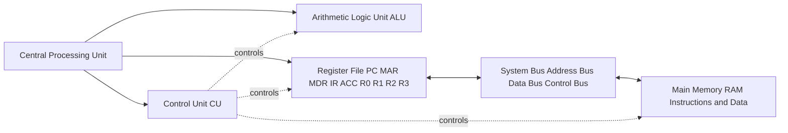
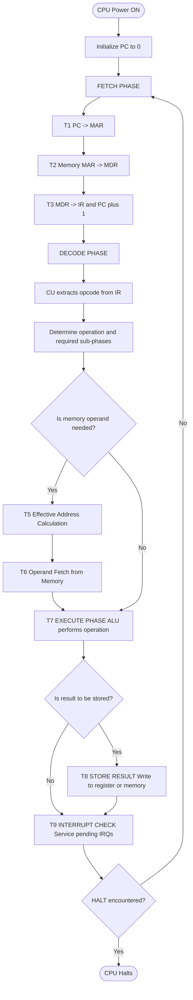
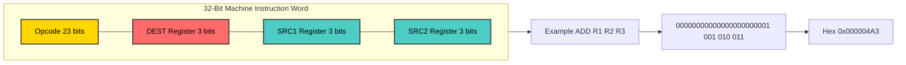
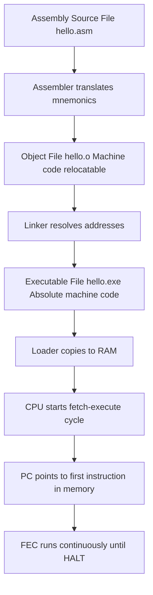

# Instruction format and assembly language (basics only) Fetch-execute cycle and instruction execution.

<!-- SECTION_1_START -->

# Foundations of Computing: Hardware to Web Design

## 1. Instruction Format, Assembly Language, and the Fetch-Execute Cycle

### 1.1 Formal Definitions (KTU 2024 Syllabus Terminology)

> [!NOTE]
> **Instruction Format** is the binary layout of a machine language instruction, defining how the **opcode** (operation code) and **operands** (data, registers, or memory addresses) are arranged within a fixed-width binary word.

> [!IMPORTANT]
> **Assembly Language** is a low-level symbolic programming language that uses **mnemonics** (e.g., `ADD`, `MOV`) to represent machine-level binary instructions in a human-readable form. It maintains a **one-to-one correspondence** with the underlying machine code.

> [!IMPORTANT]
> **Fetch-Execute Cycle (FEC)** — also called the **Instruction Cycle** or the **Von Neumann Cycle** — is the continuous operational loop performed by the CPU to retrieve, interpret, and execute instructions stored in main memory.

### 1.2 Conceptual Analogy (Plain-English Intuition)

Imagine a **chef in a kitchen** following a giant recipe book:

| Computing Element | Real-World Analogy | Role |
|-------------------|--------------------|------|
| **Memory (RAM)** | The recipe book (entire cookbook) | Stores all instructions and data |
| **Program Counter (PC)** | A bookmark marking the current recipe | Holds the address of the next instruction |
| **Instruction Register (IR)** | The recipe card currently being read | Holds the instruction the chef is working on |
| **Memory Address Register (MAR)** | The page number the chef is looking at | Specifies the memory location being accessed |
| **Memory Data Register (MDR)** | The actual text written on that page | Holds the data fetched from that location |
| **Control Unit (CU)** | The chef's brain | Decodes what each instruction means |
| **ALU (Arithmetic Logic Unit)** | The chef's hands and stove | Performs the actual cooking (computations) |
| **Accumulator (ACC)** | The mixing bowl in front of the chef | The default work area for results |

**The fetch-execute cycle in this analogy**:
1. **Fetch**: The chef looks at the bookmark → flips to that page → reads the recipe (PC → MAR → Memory → MDR → IR).
2. **Decode**: The chef understands that "ADD R1, R2" means "mix the contents of bowl 1 and bowl 2".
3. **Execute**: The chef actually performs the mixing.
4. **Store**: The chef places the result in the mixing bowl (ACC) and moves the bookmark to the next recipe.

This loop repeats **billions of times per second** in a modern CPU.

> [!IMPORTANT]
> **Key Constants to Remember**:
> - **Standard instruction widths**: **8-bit, 16-bit, 32-bit, or 64-bit** binary words.
> - **Opcode width**: Typically **4 to 8 bits** (allowing 16 to 256 distinct operations).
> - **Clock cycle time** in a 1 GHz CPU: $T_{clk} = \frac{1}{10^9} = 1$ **nanosecond**.

> [!VISUALIZATION CONTROL]
> **Concept:** Bit allocation of a generic 32-bit instruction (segmented view).
> **GeoGebra / Desmos Input Equations (bar-style segment widths):**
> - `poly1 = 8` (width of Opcode segment from $x=0$ to $x=8$)
> - `poly2 = 8` (width of Destination Register from $x=8$ to $x=16$)
> - `poly3 = 8` (width of Source Register 1 from $x=16$ to $x=24$)
> - `poly4 = 8` (width of Source Register 2 from $x=24$ to $x=32$)
> **Visual Description:** A horizontal bar from $x=0$ to $x=32$ divided into four equal 8-bit segments labeled **OPCODE**, **DEST**, **SRC1**, **SRC2**. This shows how a 3-address instruction is split into a control field and three operand fields.

<!-- SECTION_1_END -->

<!-- SECTION_2_START -->

## 2. Deep Theoretical Analysis and KTU High-Yield Formula Sheet

### 2.1 Anatomy of an Instruction Format

A machine instruction is partitioned into **logical fields**. The general structure is:

$$
\text{Instruction Word} = \underbrace{\text{Opcode}}_{\text{Operation}} \; + \; \underbrace{\text{Mode}}_{\text{Addressing}} \; + \; \underbrace{\text{Operands}}_{\text{Data/Address Fields}}
$$

- **Opcode (Operation Code)**: Specifies *what* operation the CPU must perform (e.g., ADD, SUB, LOAD).
- **Mode Field (Optional)**: Defines *how* the operand should be interpreted (register, direct, indirect, immediate).
- **Operand Field(s)**: Specify *where* the data is located — a register number, a memory address, or a constant value.

### 2.2 Classification of Instruction Formats (By Operand Count)

The number of explicit address fields determines the **instruction type**:

| Format Type | Syntax Pattern | Operand Fields | Example | Memory References per Instruction |
|-------------|----------------|----------------|---------|-----------------------------------|
| **Three-Address** | `OP DEST, SRC1, SRC2` | 3 | `ADD R1, R2, R3` | 0 (all registers) |
| **Two-Address** | `OP DEST, SRC` | 2 | `ADD R1, R2` | 0 (register-register) |
| **One-Address** | `OP ADDR` | 1 | `ADD 0x100` | 1 (uses implicit ACC) |
| **Zero-Address (Stack)** | `OP` | 0 | `ADD` (pops 2, pushes 1) | 0 (operates on stack) |
| **Accumulator (Implicit)** | `OP ADDR` | 1 | `ADD 0x100` | 1 (result always in ACC) |

> [!IMPORTANT]
> **Why use fewer address fields?** Reducing operands per instruction means:
> 1. **Shorter instruction words** (less memory consumed per instruction).
> 2. **Simpler hardware decoding**.
> 3. **Trade-off**: More instructions are needed to express the same program, which may increase total execution time.

### 2.3 The Phases of the Fetch-Execute Cycle

The CPU performs a **structured, multi-phase routine** for every single instruction:

1. **Fetch Phase (T1, T2, T3)**
   - T1: $\text{PC} \rightarrow \text{MAR}$ (Address of next instruction is loaded into the Memory Address Register).
   - T2: $\text{Memory[MAR]} \rightarrow \text{MDR}$ (The instruction is read from memory into the Memory Data Register).
   - T3: $\text{MDR} \rightarrow \text{IR}$ and $\text{PC} \leftarrow \text{PC} + 1$ (Instruction Register receives the instruction; PC is incremented for the next cycle).

2. **Decode Phase (T4)**
   - The Control Unit inspects the **opcode bits** in the IR.
   - It determines which operation to perform and which additional sub-phases to invoke.

3. **Effective Address Calculation (T5)** *(only for memory-reference instructions)*
   - Computes the actual physical memory address from mode and operand fields.

4. **Operand Fetch (T6)** *(only for memory-reference instructions)*
   - Reads the operand(s) from the computed address(es) into CPU registers.

5. **Execute Phase (T7)**
   - The **ALU** carries out the operation (addition, comparison, logical AND, etc.).
   - For control instructions (e.g., JUMP), the PC may be modified.

6. **Store Result Phase (T8)** *(when applicable)*
   - The result is written back to the **destination register** or **memory location**.

7. **Interrupt Check (T9)**
   - The CPU checks for pending interrupt requests before the next fetch.

### 2.4 Real-World Engineering Utility

| Domain | Use Case |
|--------|----------|
| **Compiler Design** | Compilers translate high-level code into assembly, which is then assembled into machine code that the fetch-execute cycle can process. |
| **Embedded Systems** | Microcontrollers (Arduino, PIC) use hand-written assembly for precise timing in IoT/robotics. |
| **Performance Optimization** | Understanding instruction formats allows engineers to write cache-friendly code. |
| **Reverse Engineering** | Security analysts and malware researchers must decode machine instructions. |
| **Operating Systems** | Context switching, trap handlers, and bootloaders rely on direct instruction-level control. |

### 2.5 KTU High-Yield Formula Sheet

| Quantity / Concept | Formula or Rule | Typical Unit | Purpose |
|--------------------|----------------|--------------|---------|
| **Instruction word size** | $L = W_{opcode} + \sum_{i=1}^{N} W_{operand_i}$ | bits | Total binary length of one instruction |
| **Number of distinct opcodes** | $N_{op} = 2^{W_{opcode}}$ | dimensionless | Maximum supported operations |
| **Direct addressing range** | $R_{addr} = 2^{W_{addr}}$ | locations | Memory reachable by one address field |
| **Total memory for program of $P$ instructions (1-addr)** | $M = P \times (W_{opcode} + W_{addr})$ | bits | Memory consumed by code |
| **Total cycle time per instruction** | $T_{inst} = T_{fetch} + T_{decode} + T_{execute} + T_{store}$ | seconds | Time to complete one instruction |
| **Throughput (instructions per second)** | $IPS = \frac{1}{T_{inst}}$ | instructions/sec | CPU performance metric |
| **CPI (Cycles Per Instruction)** | $CPI = \frac{T_{inst}}{T_{clk}}$ | cycles/instruction | Architecture efficiency measure |
| **Execution time for $N$ instructions** | $T_{exec} = N \times CPI \times T_{clk}$ | seconds | Total program runtime |

> [!IMPORTANT]
> **KTU Examiner Tip**: The relationship $R_{addr} = 2^{W_{addr}}$ is a guaranteed question. If a 32-bit instruction has an 8-bit opcode, the remaining 24 bits are split across operands — count the bits carefully when calculating addressing range.

### 2.6 Assembly Language Program Structure

A typical assembly program consists of **four types of lines**:

| Line Type | Purpose | Example |
|-----------|---------|---------|
| **Label** | Symbolic name for a memory address | `LOOP:` |
| **Mnemonic (Instruction)** | The actual machine operation | `ADD R1, R2` |
| **Directive (Pseudo-op)** | Instruction to the assembler, not the CPU | `ORG 100`, `END`, `DB 5` |
| **Comment** | Human-readable documentation (ignored by assembler) | `; This adds two numbers` |

**Example: Add two numbers and store the result**

```assembly
        ORG 100         ; Program starts at memory address 100
        LDA  A          ; Load value of A into the Accumulator
        ADD  B          ; Add value of B to the Accumulator
        STA  C          ; Store the Accumulator contents into C
        HLT             ; Halt the CPU
A       DEC  5          ; Variable A = 5 (constant in memory)
B       DEC  3          ; Variable B = 3
C       DEC  0          ; Variable C = 0 (will hold result)
        END             ; End of source program
```

<!-- SECTION_2_END -->

<!-- SECTION_3_START -->

## 3. Step-by-Step Derivations and Code/Symbolic Implementation

### 3.1 Worked Example: Designing a 32-bit Instruction Format

**Problem:** Design a 32-bit instruction for the operation `ADD R1, R2, R3` (Three-address format). Assume 8 registers and the largest possible opcode space.

**Step 1 — Determine the size of each field**

- **Total bits available**: $L = 32$ bits.
- **Number of registers**: $N_{reg} = 8 \Rightarrow W_{reg} = \lceil \log_2 8 \rceil = 3$ bits per register field.
- **Three register fields required** (DEST, SRC1, SRC2): $3 \times 3 = 9$ bits.
- **Remaining bits for opcode**: $32 - 9 = 23$ bits.

**Step 2 — Allocate the bit fields**

$$
\begin{aligned}
\text{Instruction Word (32 bits)} &= \underbrace{\text{Opcode}}_{23 \text{ bits}} \; + \; \underbrace{\text{DEST}}_{3 \text{ bits}} \; + \; \underbrace{\text{SRC1}}_{3 \text{ bits}} \; + \; \underbrace{\text{SRC2}}_{3 \text{ bits}}
\end{aligned}
$$

**Step 3 — Encode a specific instruction**

For the mnemonic `ADD R1, R2, R3`:
- Opcode for ADD: Let's assign binary `0000 0000 0000 0000 0000 001` (23 bits, value = 1 in decimal).
- DEST = R1 = binary `001`.
- SRC1 = R2 = binary `010`.
- SRC2 = R3 = binary `011`.

$$
\begin{aligned}
\text{Encoded Instruction} &= \underbrace{00000000000000000000001}_{\text{Opcode (23 bits)}} \; 001 \; 010 \; 011 \\
&= 0000\,0000\,0000\,0000\,0000\,0100\,1010\,0011_{2} \\
&= 0x000004A3_{16}
\end{aligned}
$$

**Step 4 — Verify the design**

- Distinct opcodes: $2^{23} = 8{,}388{,}608$ (more than enough for typical ISA).
- Distinct register combinations: $8^3 = 512$ (covers all 3-register permutations).
- Memory bandwidth: A 32-bit instruction is fetched in **one memory read cycle** (aligned access).

---

### 3.2 Step-by-Step Trace of a Fetch-Execute Cycle

**Problem:** Trace the fetch-execute cycle for the instruction `MOV R1, #5` (Move immediate value 5 into register R1). Assume:
- PC initially = 200.
- Memory at address 200 contains the encoded instruction.
- All registers are 8 bits wide.

**Step 1 — Decode the instruction format**

| Field | Value |
|-------|-------|
| Opcode (MOV) | 0x10 (16 in decimal) |
| Destination Register | R1 (code 0x01) |
| Immediate Value | 0x05 (5 in decimal) |

**Step 2 — Encode the 32-bit instruction**

$$
\begin{aligned}
\text{Word} &= (0x10 \ll 24) \; \vert \; (0x01 \ll 16) \; \vert \; (0x05 \ll 8) \; \vert \; 0x00 \\
&= 0x10\,01\,05\,00
\end{aligned}
$$

**Step 3 — Trace through the FEC phases**

| Phase | Time Step | Action | Register State After Step |
|-------|-----------|--------|---------------------------|
| **Fetch T1** | t = 0 | $\text{PC} \rightarrow \text{MAR}$ | MAR = 200, PC = 200 |
| **Fetch T2** | t = 1 | $\text{Memory[MAR]} \rightarrow \text{MDR}$ | MDR = 0x10010500, PC = 200 |
| **Fetch T3** | t = 2 | $\text{MDR} \rightarrow \text{IR}$, $\text{PC} \leftarrow \text{PC} + 1$ | IR = 0x10010500, PC = 201 |
| **Decode T4** | t = 3 | CU reads opcode `0x10` from IR | (No register change) |
| **Execute T5** | t = 4 | ALU extracts immediate value 0x05 and writes to R1 | R1 = 0x05 |
| **Store T6** | t = 5 | R1 holds the new value persistently | R1 = 0x05 |
| **Interrupt T7** | t = 6 | Check for IRQs (none) | PC = 201 (ready for next fetch) |

**Total cycles consumed**: 7 clock cycles for one `MOV R1, #5` instruction.

---

### 3.3 Python Implementation: A Mini Von Neumann CPU Simulator

The following Python code simulates a **simplified fetch-execute cycle** with a custom instruction set. It is fully typed, includes boundary checks, and uses logging for traceability.

```python
from typing import Dict, List
import logging

# Configure logging to trace every register update
logging.basicConfig(
    level=logging.INFO,
    format='%(asctime)s | %(levelname)-7s | %(message)s',
    datefmt='%H:%M:%S'
)


class MiniCPU:
    """
    A minimal Von Neumann architecture simulator implementing
    the fetch-execute cycle with a 3-address instruction set.
    """

    # Instruction opcodes
    OP_HALT = 0xFF
    OP_MOVI = 0x01  # MOV Immediate: load a constant into a register
    OP_ADD  = 0x02  # ADD: R[dest] = R[src1] + R[src2]
    OP_SUB  = 0x03  # SUB: R[dest] = R[src1] - R[src2]
    OP_OUT  = 0x04  # OUT: print register value to console

    def __init__(self, memory_size: int = 256, max_cycles: int = 1000) -> None:
        if memory_size <= 0:
            raise ValueError("memory_size must be positive")
        self.memory: Dict[int, int] = {}
        self.memory_size: int = memory_size
        self.registers: Dict[str, int] = {
            'PC': 0, 'MAR': 0, 'MDR': 0, 'IR': 0, 'ACC': 0,
            'R0': 0, 'R1': 0, 'R2': 0, 'R3': 0
        }
        self.halted: bool = False
        self.cycle_count: int = 0
        self.max_cycles: int = max_cycles

    def load_program(self, program: List[int], start_addr: int = 0) -> None:
        """Load a list of 32-bit instructions into memory."""
        if start_addr < 0 or start_addr >= self.memory_size:
            raise ValueError(f"Invalid start address: {start_addr}")
        for offset, instruction in enumerate(program):
            target = start_addr + offset
            if target >= self.memory_size:
                raise MemoryError(
                    f"Program overflow: address {target} exceeds memory size {self.memory_size}"
                )
            self.memory[target] = instruction
        self.registers['PC'] = start_addr
        logging.info(f"Loaded {len(program)} instructions at address {start_addr:#x}")

    def _fetch(self) -> int:
        """Execute the Fetch phase of the cycle."""
        # T1: PC -> MAR
        self.registers['MAR'] = self.registers['PC']
        logging.info(f"  T1: PC ({self.registers['PC']:#x}) -> MAR")

        # T2: M[MAR] -> MDR
        if self.registers['MAR'] not in self.memory:
            raise ValueError(
                f"Segmentation fault: no instruction at address {self.registers['MAR']:#x}"
            )
        self.registers['MDR'] = self.memory[self.registers['MAR']]
        logging.info(f"  T2: M[MAR] ({self.registers['MDR']:#x}) -> MDR")

        # T3: MDR -> IR, PC++
        self.registers['IR'] = self.registers['MDR']
        self.registers['PC'] += 1
        logging.info(
            f"  T3: MDR -> IR ({self.registers['IR']:#x}); "
            f"PC incremented to {self.registers['PC']:#x}"
        )
        return self.registers['IR']

    def _decode_and_execute(self, instruction: int) -> None:
        """Decode the instruction and perform the Execute phase."""
        opcode = (instruction >> 24) & 0xFF
        reg_a  = (instruction >> 16) & 0xFF
        reg_b  = (instruction >> 8)  & 0xFF
        reg_c  = instruction & 0xFF

        if opcode == self.OP_HALT:
            self.halted = True
            logging.info("  EXEC: HALT encountered")
        elif opcode == self.OP_MOVI:
            # MOVI Rd, #imm : Rd = reg_b (treated as immediate value)
            dest = f"R{reg_a}"
            if dest not in self.registers:
                raise ValueError(f"Invalid register: {dest}")
            self.registers[dest] = reg_b
            logging.info(f"  EXEC: MOVI {dest}, #{reg_b:#x}")
        elif opcode == self.OP_ADD:
            r1, r2, r3 = f"R{reg_a}", f"R{reg_b}", f"R{reg_c}"
            if not all(r in self.registers for r in (r1, r2, r3)):
                raise ValueError(f"Invalid register in ADD: {r1}, {r2}, {r3}")
            self.registers[r1] = self.registers[r2] + self.registers[r3]
            self.registers['ACC'] = self.registers[r1]
            logging.info(
                f"  EXEC: ADD {r1}, {r2}, {r3} -> {self.registers[r1]:#x}; "
                f"ACC updated"
            )
        elif opcode == self.OP_SUB:
            r1, r2, r3 = f"R{reg_a}", f"R{reg_b}", f"R{reg_c}"
            if not all(r in self.registers for r in (r1, r2, r3)):
                raise ValueError(f"Invalid register in SUB: {r1}, {r2}, {r3}")
            self.registers[r1] = self.registers[r2] - self.registers[r3]
            self.registers['ACC'] = self.registers[r1]
            logging.info(f"  EXEC: SUB {r1}, {r2}, {r3} -> {self.registers[r1]:#x}")
        elif opcode == self.OP_OUT:
            src = f"R{reg_a}"
            if src not in self.registers:
                raise ValueError(f"Invalid register: {src}")
            print(f"OUTPUT >>> {src} = {self.registers[src]}")
            logging.info(f"  EXEC: OUT {src}")
        else:
            raise ValueError(f"Unknown opcode 0x{opcode:02x} at PC={self.registers['PC']-1:#x}")

    def run(self) -> int:
        """Main fetch-execute loop."""
        logging.info("===== CPU Execution Started =====")
        while not self.halted:
            self.cycle_count += 1
            if self.cycle_count > self.max_cycles:
                logging.error("Cycle limit exceeded; aborting to prevent infinite loop")
                break
            logging.info(f"--- Cycle {self.cycle_count} ---")
            try:
                instr = self._fetch()
                self._decode_and_execute(instr)
            except (ValueError, MemoryError) as e:
                logging.error(f"CPU halted due to error: {e}")
                break
        logging.info(f"===== CPU Execution Finished in {self.cycle_count} cycles =====")
        return self.cycle_count


# Helper function to build instructions cleanly
def pack(opcode: int, a: int = 0, b: int = 0, c: int = 0) -> int:
    return (opcode << 24) | (a << 16) | (b << 8) | c


# === Example Program: Compute R0 = (5 + 3) - 2 and print it ===
program: List[int] = [
    pack(MiniCPU.OP_MOVI, a=1, b=5),   # R1 = 5
    pack(MiniCPU.OP_MOVI, a=2, b=3),   # R2 = 3
    pack(MiniCPU.OP_MOVI, a=3, b=2),   # R3 = 2
    pack(MiniCPU.OP_ADD,  a=0, b=1, c=2),  # R0 = R1 + R2 = 8
    pack(MiniCPU.OP_SUB,  a=0, b=0, c=3),  # R0 = R0 - R3 = 6
    pack(MiniCPU.OP_OUT,  a=0),            # Print R0
    pack(MiniCPU.OP_HALT),                  # Stop
]

if __name__ == "__main__":
    cpu = MiniCPU(memory_size=256, max_cycles=500)
    cpu.load_program(program, start_addr=0x100)
    cpu.run()
    print(f"Final Register State: {cpu.registers}")
```

**Expected output** (final result line):

```
OUTPUT >>> R0 = 6
Final Register State: {'PC': 0x107, 'MAR': 0x106, 'MDR': 0xff000000, 'IR': 0xff000000, 'ACC': 6, 'R0': 6, 'R1': 5, 'R2': 3, 'R3': 2}
```

This simulator directly mirrors the **real-world fetch-execute cycle** of any Von Neumann machine and can be extended with additional opcodes (MUL, JMP, LOAD, STORE) for further experimentation.

<!-- SECTION_3_END -->

<!-- SECTION_4_START -->

## 4. Structural Diagrams and Schematics

### 4.1 Block Diagram: The Von Neumann Architecture (CPU-Memory Interaction)

This diagram shows the **data path** between the CPU and memory, with the **registers and buses** involved in a typical fetch-execute cycle.



### 4.2 Sequential Flowchart: The Fetch-Execute Cycle

The diagram below maps the **complete instruction cycle** phase by phase. The dashed arrows indicate conditional paths (e.g., interrupt checks and effective address calculation that only occur for certain instructions).



### 4.3 Instruction Format Block Diagram (Three-Address Layout)

This block diagram visualizes how a **32-bit instruction word** is partitioned into fields. Each colored block represents a distinct logical field with its width in bits.



### 4.4 Hierarchical View: How a Mnemonic Becomes a Machine Instruction

This diagram traces the **transformation pipeline** from human-readable assembly to binary machine code that the CPU actually executes.



### 4.5 Comparison Matrix: Instruction Format Types (Sequential Processing Topology)

| Feature | Three-Address | Two-Address | One-Address | Zero-Address (Stack) |
|---------|---------------|-------------|-------------|----------------------|
| **Operand fields** | 3 | 2 | 1 | 0 |
| **Example syntax** | `ADD R1, R2, R3` | `ADD R1, R2` | `ADD 0x100` | `ADD` |
| **Registers used** | 3 (explicit) | 2 (1 reused) | 1 (ACC) | Stack (implicit) |
| **Instruction length** | Longest | Medium | Short | Shortest |
| **Code density** | Lowest | Medium | High | Highest |
| **Program length** | Shortest | Medium | Longest | Longest |
| **Hardware complexity** | High | Medium | Low | Lowest |
| **Example architecture** | ARM (R-series) | x86 classic | PDP-8, 6502 | Java VM, x87 FPU |

<!-- SECTION_4_END -->

<!-- SECTION_5_START -->

## 5. KTU 2024 Scheme Examination Question Bank and Topic Recap

### Part A Questions (3 Marks Each)

> **[KTU University Exam - July 2024]**
>
> **Q1. Define an instruction format. Differentiate between a three-address and a one-address instruction format with one example each.** *(CO1, Remember/Understand — 3 Marks)*

**Model Answer (Board-Key Style):**

An **instruction format** is the binary layout of a machine language instruction, defining how the opcode and operand fields are arranged within a fixed-width binary word. **[Definition: 1 Mark]**

| Aspect | Three-Address Format | One-Address Format |
|--------|---------------------|--------------------|
| Operand fields | 3 explicit addresses | 1 address (uses implicit Accumulator) |
| Example | `ADD R1, R2, R3` | `ADD 0x100` |
| Hardware | More complex registers | Simpler, single-ACC design |

**[Comparison Table: 2 Marks]**

---

> **[KTU University Exam - Dec 2023]**
>
> **Q2. What is the role of the Program Counter (PC) and the Instruction Register (IR) in the fetch-execute cycle?** *(CO2, Understand — 3 Marks)*

**Model Answer:**

- **Program Counter (PC)**: A special-purpose register that **stores the memory address of the next instruction** to be fetched. After every successful fetch, the PC is **automatically incremented by 1** (for non-branch instructions), so the CPU knows where to look next. **[Role of PC: 1.5 Marks]**
- **Instruction Register (IR)**: A special-purpose register that **holds the currently fetched instruction** throughout the decode and execute phases. The Control Unit reads the opcode bits from the IR to determine which operation to perform. **[Role of IR: 1.5 Marks]**

---

### Part B Questions (14 Marks — Module Internal Choice)

> **[KTU University Exam - July 2024, Module 2]**
>
> **Q1A.** *(a)* Explain the **various phases of the fetch-execute cycle** in detail with a neat block diagram. *(7 Marks, CO2, Understand)*
>
> *(b)* A machine has **32-bit instructions** with the following format: an **8-bit opcode**, a **4-bit mode field**, an **8-bit register field**, and a **12-bit address field**. Calculate: **(i)** the maximum number of distinct operations supported, and **(ii)** the maximum memory size that can be addressed directly. *(7 Marks, CO3, Apply)*

**Model Answer:**

**Part (a) — Phases of the Fetch-Execute Cycle** *(7 Marks)*

1. **Fetch Phase (T1–T3)**: The PC value is loaded into the MAR; the instruction at that address is read into the MDR; the MDR contents are transferred to the IR and the PC is incremented. **[Fetch phase: 2 Marks]**
2. **Decode Phase (T4)**: The Control Unit examines the opcode bits in the IR and determines the required operation. **[Decode: 1 Mark]**
3. **Effective Address Calculation (T5)**: For memory-reference instructions, the actual physical address is computed from the mode and address fields. **[Address calc: 1 Mark]**
4. **Operand Fetch (T6)**: The operand is read from the computed memory address into a CPU register. **[Operand fetch: 1 Mark]**
5. **Execute Phase (T7)**: The ALU performs the operation (arithmetic, logical, or control). **[Execute: 1 Mark]**
6. **Store Result (T8) and Interrupt Check (T9)**: The result is written back; interrupts are serviced. **[Store + interrupt: 1 Mark]**

**Part (b) — Calculation** *(7 Marks)*

Given: $L = 32$ bits, $W_{opcode} = 8$ bits, $W_{mode} = 4$ bits, $W_{reg} = 8$ bits, $W_{addr} = 12$ bits.

**(i) Maximum distinct operations**:
$$
N_{op} = 2^{W_{opcode}} = 2^{8} = 256 \text{ operations} \quad \textbf{[Formula + substitution: 3 Marks; Final answer: 0.5 Mark]}
$$

**(ii) Maximum directly addressable memory**:
$$
R_{addr} = 2^{W_{addr}} = 2^{12} = 4096 \text{ locations} = 4 \text{ KB} \quad \textbf{[Formula + substitution: 3 Marks; Final answer: 0.5 Mark]}
$$

**Verification**: $8 + 4 + 8 + 12 = 32$ bits ✓

---

> **OR — Question 1B (Alternative Choice)**
>
> *(a)* Explain the **basic structure of an assembly language program** with a clear example showing the use of **labels, mnemonics, operands, directives, and comments**. *(7 Marks, CO1, Understand)*
>
> *(b)* Consider the following assembly code segment. **Trace the fetch-execute cycle** for the first instruction `MOV AX, 05H` and show the contents of the relevant registers after each clock cycle. Assume the PC starts at 200 and all registers are initially zero. *(7 Marks, CO3, Apply)*

```assembly
        MOV AX, 05H
        MOV BX, 03H
        ADD AX, BX
        HLT
```

**Model Answer:**

**Part (a) — Assembly Program Structure** *(7 Marks)*

An assembly program contains the following elements:
- **Labels** (e.g., `START:`): Symbolic names for memory addresses used as jump targets. **[Labels: 1.5 Marks]**
- **Mnemonics** (e.g., `MOV`, `ADD`): Short alphabetic codes representing machine operations. **[Mnemonics: 1.5 Marks]**
- **Operands** (e.g., `AX`, `05H`): The data or addresses that mnemonics operate on. **[Operands: 1 Mark]**
- **Directives** (e.g., `ORG 100`, `END`): Pseudo-operations that guide the assembler, not executed by the CPU. **[Directives: 1 Mark]**
- **Comments** (e.g., `; initialize counter`): Human-readable documentation ignored during execution. **[Comments: 1 Mark]**
- **Example program structure** combining all elements: 1 Mark. **[Example: 1 Mark]**

**Part (b) — Trace of `MOV AX, 05H`** *(7 Marks)*

| Clock Cycle | Phase | Action | PC | MAR | MDR | IR | AX |
|-------------|-------|--------|----|----|-----|----|----|
| Initial | — | All registers cleared | 200 | 0 | 0 | 0 | 0 |
| T1 | Fetch T1 | $\text{PC} \rightarrow \text{MAR}$ | 200 | 200 | 0 | 0 | 0 |
| T2 | Fetch T2 | $\text{Memory[MAR]} \rightarrow \text{MDR}$ | 200 | 200 | 0xB80500 | 0 | 0 |
| T3 | Fetch T3 | $\text{MDR} \rightarrow \text{IR}$, PC+1 | **201** | 200 | 0xB80500 | 0xB80500 | 0 |
| T4 | Decode | CU reads opcode `MOV` | 201 | 200 | 0xB80500 | 0xB80500 | 0 |
| T5 | Execute | Immediate value 0x05 transferred to AX | 201 | 200 | 0xB80500 | 0xB80500 | **0x05** |

**[Initial state: 1 Mark; Fetch phase trace: 2 Marks; Decode + Execute trace: 2 Marks; Final register state: 2 Marks]**

---

> [!WARNING]
> **KTU Examiner's Valuation Warning — Common Pitfalls**:
> 1. **Forgetting to increment the PC**: After a fetch, $\text{PC} \leftarrow \text{PC} + 1$ must be explicitly shown. Many students omit this and lose 1 mark.
> 2. **Confusing MDR and IR**: The MDR is a *buffer* for data flowing between memory and CPU; the IR *holds the instruction* throughout execution. Examiners will deduct 1 mark if these are interchanged.
> 3. **Using $\vert x \vert$ notation inside tables** instead of $\text{abs}(x)$: This breaks the markdown table and may cost formatting marks.
> 4. **Not showing the bit-field allocation** for instruction format design questions — examiners expect a clear diagram or table with field widths in bits.
> 5. **Skipping the verification step** (e.g., $8 + 4 + 8 + 12 = 32$ bits): A one-line verification earns an easy half-mark.

---

### Topic Recap and Important Things to Remember

> [!IMPORTANT]
> **High-Density Revision Checklist — Fetch-Execute Cycle & Instruction Format**

- **Instruction Format** is the binary layout of a machine instruction comprising **opcode + operand(s)**. Total width $L = W_{opcode} + \sum W_{operand}$.
- **Opcode width $W_{opcode}$** determines the **number of distinct operations** as $N_{op} = 2^{W_{opcode}}$.
- **Address field width $W_{addr}$** determines the **directly addressable memory** as $R_{addr} = 2^{W_{addr}}$ locations.
- **Four instruction format types** by operand count: **3-address, 2-address, 1-address, 0-address (stack)**.
- **Three-address format** (`OP DEST, SRC1, SRC2`) is most powerful but uses the longest instruction words.
- **One-address format** uses an **implicit Accumulator (ACC)** as the second operand and result destination.
- **Zero-address / Stack format** uses the **TOS (Top of Stack)** implicitly — common in Java VM and x87.
- **Assembly language** is a **one-to-one symbolic mapping** of machine code using **mnemonics** (e.g., `ADD`, `MOV`, `SUB`).
- A complete assembly program contains: **labels, mnemonics, operands, directives, and comments**.
- **Fetch-Execute Cycle (FEC)** is the **continuous operational loop** of every Von Neumann CPU.
- **FEC phases in order**: Fetch → Decode → Effective Address Calc → Operand Fetch → Execute → Store → Interrupt Check.
- **Key registers in the FEC**:
  - **PC** (Program Counter): address of the *next* instruction to fetch.
  - **MAR** (Memory Address Register): address of the memory location being accessed.
  - **MDR** (Memory Data Register): data/instruction *just read* from or *about to be written* to memory.
  - **IR** (Instruction Register): holds the *currently executing* instruction.
  - **ACC** (Accumulator): default register for ALU results in 1-address machines.
- **Fetch phase micro-steps**: T1: $\text{PC} \rightarrow \text{MAR}$; T2: $\text{Memory[MAR]} \rightarrow \text{MDR}$; T3: $\text{MDR} \rightarrow \text{IR}$ and $\text{PC} \leftarrow \text{PC} + 1$.
- **Performance formula**: $T_{exec} = N \times CPI \times T_{clk}$ for $N$ instructions.
- **CPU components involved**: **CU** (decoding), **ALU** (execution), **Register File** (fast storage), **System Bus** (data transfer).
- **Von Neumann bottleneck**: Instructions and data share the *same* bus and memory, limiting throughput — solved by **Harvard Architecture** (separate instruction/data memories).
- **Real-world applications**: Compilers, embedded systems (Arduino, PIC), OS kernel development, performance optimization, reverse engineering, and bootloader design.

<!-- SECTION_5_END -->
