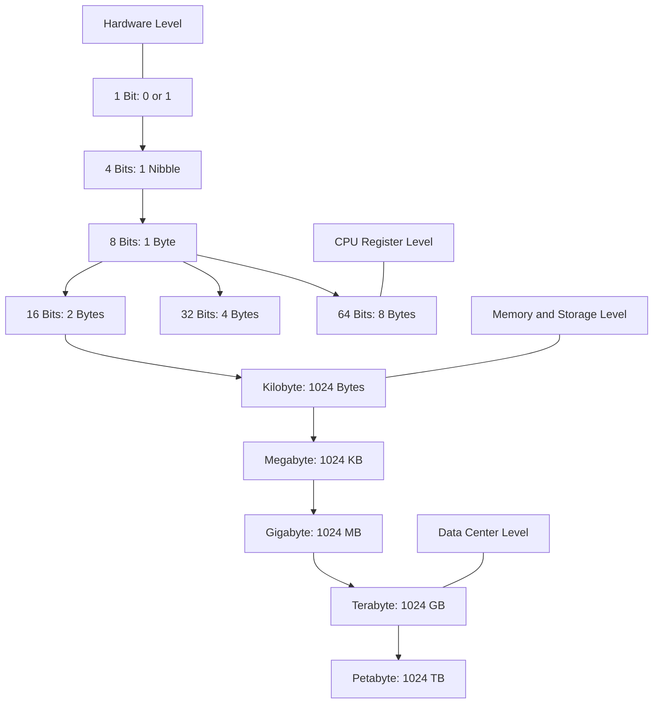
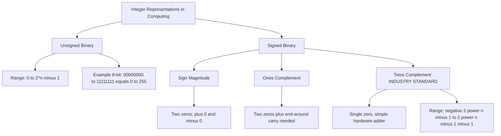
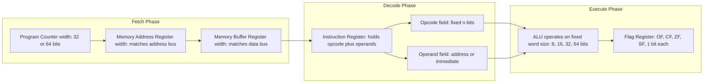
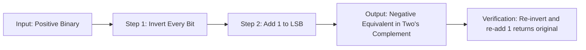

# Binary representations of integers and data types, storage sizing blocks (bits, bytes, etc.)

<!-- SECTION_1_START -->
# Binary Representations, Data Types & Storage Sizing Blocks

> [!IMPORTANT]
> **KTU 2024 | GXEST203 | Module 2** — This sub-topic forms the bedrock for everything in computing: memory addressing, CPU registers, instruction encoding, and data structure sizing. Mastering this is mandatory before tackling the ISA execution cycle.

## 1.1 Formal Definition (KTU 2024 Syllabus Terminology)

A **binary representation** is a method of encoding integers, characters, and logical states using only two discrete symbols: **0** and **1**, commonly called **bits** (Binary digiTS). Every piece of data inside a computer — numbers, text, images, sound, or instructions — is ultimately expressed as a fixed-length sequence of these bits. The length of this sequence defines the **data type** and the **storage sizing block** it occupies.

A **storage sizing block** is a standardized unit of digital information capacity, defined by the **International System of Units (SI)** and adopted universally by hardware manufacturers, operating systems, and programming language standards.

> [!NOTE]
> **Core Definition — Bit:** A *bit* (b, lowercase) is the smallest unit of data in computing, representing a single binary value of either $\mathbf{0}$ (OFF / FALSE / LOW) or $\mathbf{1}$ (ON / TRUE / HIGH).

> [!NOTE]
> **Core Definition — Byte:** A *byte* (B, uppercase) is a grouping of $\mathbf{8\text{ bits}}$ and is the fundamental addressable unit of memory in virtually every modern computer architecture (x86, ARM, RISC-V).

## 1.2 Conceptual Analogy / Intuition

Imagine a row of **light switches** mounted on a wall. Each switch can only be in one of two positions: **UP** (think of it as 1) or **DOWN** (think of it as 0).

- A **single switch** is a *bit* — too small to count meaningfully, but a building block.
- A **row of 8 switches** is a *byte* — now you can represent 256 different patterns (from 00000000 to 11111111), enough to encode a single letter, a small number, or a tiny color value.
- A **row of 32 or 64 switches** (a *word* or *double word*) is what a CPU grabs in one operation — it is the CPU's "native thinking width."

Think of storage as **post office boxes**:
- **Bit** = the slot for a single letter.
- **Nibble** = a 4-letter mini-mailer.
- **Byte** = a standard 8-letter envelope (every box has its own number).
- **Kilobyte, Megabyte, Gigabyte, Terabyte** = increasingly larger filing cabinets, each holding exponentially more envelopes.

> [!TIP]
> **Memory trick:** A *nibble* is **half a byte** (4 bits). Engineers love nibbles because one hexadecimal digit always equals exactly one nibble — a perfect bridge between human-readable hex and machine-readable binary.

## 1.3 Physical Constants & Standard Metrics (KTU High-Yield)

The following powers of two govern all storage and data-type sizing in computing:

| Standard Block | Exact Size in Bits | Exact Size in Bytes |
|---|---|---|
| **Bit (b)** | $1$ bit | $0.125$ bytes |
| **Nibble** | $4$ bits | $0.5$ bytes |
| **Byte (B)** | $8$ bits | $1$ byte |
| **Kilobyte (KB)** | $8 \times 2^{10}$ bits | $2^{10} = 1024$ bytes |
| **Megabyte (MB)** | $8 \times 2^{20}$ bits | $2^{20} = 1{,}048{,}576$ bytes |
| **Gigabyte (GB)** | $8 \times 2^{30}$ bits | $2^{30} = 1{,}073{,}741{,}824$ bytes |
| **Terabyte (TB)** | $8 \times 2^{40}$ bits | $2^{40} = 1{,}099{,}511{,}627{,}776$ bytes |

> [!WARNING]
> **Common student pitfall:** Manufacturers use the **SI decimal** convention ($1\text{ KB} = 1000$ bytes), while operating systems and code use the **binary** convention ($1\text{ KB} = 1024$ bytes). This is why a "1 TB" hard drive shows up as $\approx 931\text{ GB}$ in Windows.

> [!VISUALIZATION CONTROL]
> **Concept:** Exponential growth of storage blocks as a discrete staircase.
> **GeoGebra / Desmos Input Equations:**
> * `f(n) = 8 * 2^(10*n)` for $n = 0, 1, 2, 3, 4$ (bits in B, KB, MB, GB, TB)
> **Visual Description:** Plot points at $n=0$ (8), $n=1$ (8192), $n=2$ (8.39 M), $n=3$ (8.59 G). Observe the *jumps of factor 1024* — every step is more than a thousand times higher than the previous. The y-axis should be logarithmic to make the staircase visible.

---

<!-- SECTION_1_END -->

<!-- SECTION_2_START -->
# Deep Theoretical Analysis & KTU High-Yield Formula Sheet

## 2.1 The Positional Weight System (Why Binary Works)

Just like the **decimal** (base-10) system assigns weights $10^0, 10^1, 10^2, \ldots$ to each position, the **binary** (base-2) system assigns weights $2^0, 2^1, 2^2, \ldots$ to each bit position, counted from the **Least Significant Bit (LSB)** on the right to the **Most Significant Bit (MSB)** on the left.

For an $n$-bit unsigned binary number $b_{n-1} b_{n-2} \ldots b_1 b_0$, its decimal value is:

$$V = \sum_{i=0}^{n-1} b_i \cdot 2^{i}$$

- $b_0$ is the **LSB** (weight $2^0 = 1$).
- $b_{n-1}$ is the **MSB** (weight $2^{n-1}$).

## 2.2 Unsigned vs. Signed Integer Representations

The CPU does not inherently know the sign of a number. Engineers devised three conventions:

### (a) Sign-Magnitude
- MSB is the **sign bit** (0 = positive, 1 = negative).
- Remaining bits store the magnitude.
- **Range for $n$ bits:** $-(2^{n-1} - 1)$ to $+(2^{n-1} - 1)$.
- **Drawback:** Two representations for zero (+0 and -0), complicating hardware.

### (b) One's Complement
- Negative numbers are obtained by **inverting every bit** of the positive equivalent.
- **Range for $n$ bits:** $-(2^{n-1} - 1)$ to $+(2^{n-1} - 1)$.
- **Drawback:** Still has two zeros; addition requires an *end-around carry*.

### (c) Two's Complement (Industry Standard) ⭐
- Negative numbers are obtained by **inverting every bit and adding 1** to the LSB.
- **Range for $n$ bits:** $-2^{n-1}$ to $+(2^{n-1} - 1)$.
- **Why it dominates:** Has a *single* zero representation, and subtraction can be performed using the *same* adder hardware as addition. This is what every modern CPU uses.

> [!IMPORTANT]
> **KTU 2024 Board Favourite:** When asked "which representation does the CPU use?", the answer is **always Two's Complement** unless the question explicitly states otherwise.

## 2.3 Fixed-Width Integer Data Types (C / C++ / Java Reference)

| Data Type | Size | Signed Range (Two's Comp.) | Unsigned Range |
|---|---|---|---|
| `int8` / `char` | 8 bits / 1 byte | $-128$ to $+127$ | $0$ to $255$ |
| `int16` / `short` | 16 bits / 2 bytes | $-32{,}768$ to $+32{,}767$ | $0$ to $65{,}535$ |
| `int32` / `int` | 32 bits / 4 bytes | $-2^{31}$ to $2^{31}-1$ | $0$ to $2^{32}-1$ |
| `int64` / `long long` | 64 bits / 8 bytes | $-2^{63}$ to $2^{63}-1$ | $0$ to $2^{64}-1$ |

**Generic formula** for an $n$-bit two's-complement integer:

$$\text{Signed Range} = \left[ -2^{n-1},\ \ 2^{n-1} - 1 \right]$$

$$\text{Unsigned Range} = \left[ 0,\ \ 2^{n} - 1 \right]$$

$$\text{Total unique patterns} = 2^{n}$$

## 2.4 Floating-Point Snapshot (IEEE 754 Quick Reference)

Though Module 2 focuses on integers, KTU may briefly ask about real numbers:

| Format | Sign | Exponent | Mantissa | Total Bits |
|---|---|---|---|---|
| Single Precision (`float`) | 1 bit | 8 bits | 23 bits | **32** |
| Double Precision (`double`) | 1 bit | 11 bits | 52 bits | **64** |

## 2.5 Real-World Engineering Utility

- **Memory Allocators** (`malloc`, `new`): Always size requests in bytes and align to $2^{n}$ boundaries for CPU efficiency.
- **Network Packets**: Header fields are sized in bits (IPv4 uses 32-bit addresses, IPv6 uses 128-bit).
- **Database Indexing**: B-Tree node sizes are tuned in KB/MB to match disk block sizes.
- **Image Processing**: An 8-bit grayscale pixel = 1 byte; a 24-bit RGB pixel = 3 bytes.
- **Cryptography**: RSA keys are 2048-bit, 4096-bit — storage sizing is mission-critical.
- **Embedded Systems**: 8-bit AVR microcontrollers literally have an 8-bit ALU; choosing the right data type prevents overflow disasters.

---

<!-- SECTION_2_END -->

<!-- SECTION_3_START -->
# Step-by-Step Derivations & Python Implementation

## 3.1 Derivation: Decimal → Binary Conversion (Division-by-2 Method)

**Problem:** Convert the unsigned decimal number $N = 45_{10}$ to binary.

**Logic:** Repeatedly divide $N$ by 2, recording the remainders. The remainders, read **bottom-up**, form the binary string.

| Step | Division | Quotient | Remainder (Bit) |
|---|---|---|---|
| 1 | $45 \div 2$ | $22$ | **1** (LSB) |
| 2 | $22 \div 2$ | $11$ | **0** |
| 3 | $11 \div 2$ | $5$ | **1** |
| 4 | $5 \div 2$ | $2$ | **1** |
| 5 | $2 \div 2$ | $1$ | **0** |
| 6 | $1 \div 2$ | $0$ | **1** (MSB) |

**Read remainders from bottom to top:** $45_{10} = 101101_{2}$.

**Verification** (positional weights, MSB on left):

$$V = (1 \times 2^5) + (0 \times 2^4) + (1 \times 2^3) + (1 \times 2^2) + (0 \times 2^1) + (1 \times 2^0)$$

$$V = 32 + 0 + 8 + 4 + 0 + 1 = 45_{10} \quad \checkmark$$

## 3.2 Derivation: Binary → Decimal Conversion

**Problem:** Convert $11001010_{2}$ to unsigned decimal.

$$V = (1 \times 2^7) + (1 \times 2^6) + (0 \times 2^5) + (0 \times 2^4) + (1 \times 2^3) + (0 \times 2^2) + (1 \times 2^1) + (0 \times 2^0)$$

$$V = 128 + 64 + 0 + 0 + 8 + 0 + 2 + 0 = 202_{10}$$

## 3.3 Derivation: Representing $-45_{10}$ in 8-bit Two's Complement

**Step 1:** Start with $+45_{10}$ in 8-bit binary:
$$+45_{10} = 00101101_{2}$$

**Step 2:** Invert **every** bit (this is the one's complement):
$$\text{Inverted} = 11010010_{2}$$

**Step 3:** Add $1$ to the LSB:
$$11010010_{2} + 1 = 11010011_{2}$$

**Final Answer:** $-45_{10} = 11010011_{2}$ in 8-bit two's complement.

**Verification** (re-apply the two-step inversion process — it should return $+45$):
$$\text{Invert } 11010011 \rightarrow 00101100, \quad \text{Add 1} \rightarrow 00101101 = +45_{10} \quad \checkmark$$

## 3.4 Derivation: Range of an $n$-bit Two's-Complement Integer

**Step 1 — Most positive value:** Set the sign bit to 0, all other bits to 1.
$$\text{Max} = 0\underbrace{11\ldots1}_{n-1 \text{ ones}} = 2^{n-1} - 1$$

**Step 2 — Most negative value:** Set the sign bit to 1, all other bits to 0.
$$\text{Min} = 1\underbrace{00\ldots0}_{n-1 \text{ zeros}} = -2^{n-1}$$

**Step 3 — Total patterns:**
$$2^{n} \text{ patterns} \quad \Rightarrow \quad \text{Unique values} = 2^{n} \text{ (no duplicate zero)}$$

## 3.5 Python Implementation — Conversion Utility Library

```python
"""
Binary Representation Utility Library
Course: GXEST203 | KTU 2024 Scheme
Module 2: Data Encoding and ISA Execution Cycles
"""

from typing import Tuple


def decimal_to_binary_unsigned(decimal_value: int, width: int = 8) -> str:
    """
    Convert a non-negative integer to a fixed-width unsigned binary string.

    Args:
        decimal_value: Non-negative integer to convert.
        width: Number of bits in the output (default 8).

    Returns:
        Binary string of length `width`.

    Raises:
        ValueError: If the value does not fit in `width` unsigned bits.
    """
    if decimal_value < 0:
        raise ValueError("Input must be non-negative for unsigned conversion.")
    if decimal_value >= (1 << width):
        raise ValueError(
            f"Value {decimal_value} exceeds the max unsigned range "
            f"for {width} bits (max = {(1 << width) - 1})."
        )
    return format(decimal_value, f"0{width}b")


def decimal_to_twos_complement(decimal_value: int, width: int = 8) -> str:
    """
    Convert a signed integer to a fixed-width two's-complement binary string.

    Args:
        decimal_value: Signed integer (positive, zero, or negative).
        width: Number of bits in the output (default 8).

    Returns:
        Two's-complement binary string of length `width`.

    Raises:
        ValueError: If the value is out of the signed two's-complement range.
    """
    min_val: int = -(1 << (width - 1))
    max_val: int = (1 << (width - 1)) - 1
    if not (min_val <= decimal_value <= max_val):
        raise ValueError(
            f"Value {decimal_value} is out of the signed {width}-bit "
            f"two's-complement range [{min_val}, {max_val}]."
        )
    if decimal_value >= 0:
        return format(decimal_value, f"0{width}b")
    # For negative values, compute in 2^width space
    return format((1 << width) + decimal_value, f"0{width}b")


def binary_to_decimal(binary_string: str, is_signed: bool = False) -> int:
    """
    Convert a binary string to a decimal integer.

    Args:
        binary_string: String containing only '0' and '1'.
        is_signed: If True, interpret the MSB as a sign bit (two's complement).

    Returns:
        Decimal integer value.
    """
    if not all(bit in "01" for bit in binary_string):
        raise ValueError("Binary string may only contain '0' and '1'.")
    width: int = len(binary_string)
    unsigned_value: int = int(binary_string, 2)
    if is_signed and (binary_string[0] == "1"):
        return unsigned_value - (1 << width)
    return unsigned_value


def twos_complement_negate(binary_string: str) -> str:
    """
    Compute the two's-complement negation of a binary string
    (equivalent to multiplying by -1).

    Args:
        binary_string: Binary string of any length.

    Returns:
        Two's-complement negated binary string of the same length.
    """
    width: int = len(binary_string)
    inverted: str = "".join("1" if b == "0" else "0" for b in binary_string)
    return decimal_to_binary_unsigned(binary_string_to_int(inverted) + 1, width)


def binary_string_to_int(binary_string: str) -> int:
    """Helper: convert binary string to unsigned int, with validation."""
    if not all(bit in "01" for bit in binary_string):
        raise ValueError("Binary string may only contain '0' and '1'.")
    return int(binary_string, 2)


# ---------- Demonstration / Self-Test Block ----------
if __name__ == "__main__":
    # 1. Unsigned conversion
    print("45 (unsigned, 8-bit)    =", decimal_to_binary_unsigned(45, 8))

    # 2. Two's complement of -45
    print("-45 (two's comp, 8-bit) =", decimal_to_twos_complement(-45, 8))

    # 3. Back to decimal (signed)
    raw: str = decimal_to_twos_complement(-45, 8)
    print("Back-converted signed   =", binary_to_decimal(raw, is_signed=True))

    # 4. Range of int8
    print("int8 range: [", -(1 << 7), ",", (1 << 7) - 1, "]")
    print("uint8 range: [0,", (1 << 8) - 1, "]")

    # 5. Negation of a positive 8-bit value
    print("Negate +45 (8-bit)       =", twos_complement_negate("00101101"))
```

**Expected Console Output:**

```text
45 (unsigned, 8-bit)    = 00101101
-45 (two's comp, 8-bit) = 11010011
Back-converted signed   = -45
int8 range: [ -128 , 127 ]
uint8 range: [ 0 , 255 ]
Negate +45 (8-bit)       = 11010011
```

---

<!-- SECTION_3_END -->

<!-- SECTION_4_START -->
# Structural Diagrams & Schematics

## 4.1 Mermaid Diagram: Storage Sizing Hierarchy (Bit → TB)



## 4.2 Mermaid Diagram: Integer Representation Family Tree



## 4.3 Mermaid Diagram: ISA Cycle Touch-Points (Where Storage Sizing Matters)



## 4.4 Mermaid Diagram: Two's Complement Negation Pipeline



---

<!-- SECTION_4_END -->

<!-- SECTION_5_START -->
# KTU 2024 Scheme Examination Question Bank

> [!NOTE]
> All questions are aligned with the **KTU 2024 Scheme B.Tech evaluation pattern**: descriptive model answers, step-wise valuation key, and Revised Bloom's Taxonomy cognitive-level tagging.

---

## 📘 PART A — Short Answer Questions (3 Marks Each)

### Question 1
**[KTU University Exam – July 2024] | CO1 | Remember**

**Differentiate between a bit, a nibble, and a byte. Why is the byte considered the fundamental addressable unit of memory?**

**Model Answer:**

- **Bit (b):** The smallest unit of digital information, representing a single binary state, either $0$ or $1$. **[1 Mark]**
- **Nibble:** A group of $4$ bits. It can represent one hexadecimal digit and stores values from $0000_{2}$ to $1111_{2}$, that is $0$ to $15$ in decimal. **[1 Mark]**
- **Byte (B):** A group of $8$ bits. It can represent values from $00000000_{2}$ to $11111111_{2}$, that is $0$ to $255$ in unsigned form, or $-128$ to $+127$ in signed two's-complement form. **[0.5 Mark]**
- **Why byte is fundamental:** The CPU's **Memory Address Register (MAR)** and **data bus** are architecturally designed to address memory one byte at a time. ASCII / UTF-8 character encoding also maps one character to one byte, making the byte a natural granularity for both hardware addressing and software data representation. **[0.5 Mark]**

---

### Question 2
**[KTU University Exam – Dec 2023] | CO1, CO2 | Understand**

**What is two's complement representation? List two reasons why modern CPUs use it to store signed integers.**

**Model Answer:**

**Definition:** Two's complement is a binary encoding scheme for signed integers in which a positive number $N$ is represented by its standard binary form, and a negative number $-N$ is represented by inverting all bits of $+N$ and then adding $1$ to the LSB. **[1 Mark]**

**Two reasons CPUs prefer it:**

1. **Single zero representation:** Unlike sign-magnitude and one's complement, two's complement has only one pattern for zero ($00000000$), eliminating ambiguity in equality checks and arithmetic. **[1 Mark]**
2. **Unified adder hardware:** Subtraction $A - B$ can be performed by the same ALU adder circuit as $A + (\text{two's complement of } B)$. This drastically simplifies the CPU's arithmetic logic unit and reduces transistor count. **[1 Mark]**

---

## 📕 PART B — Long Answer Questions (14 Marks Each, with Internal Choice)

### Question A (Choice 1)
**[KTU University Exam – Model Paper 2024] | CO2 | Apply / Analyze**

**(a)** Convert the decimal number $156_{10}$ into an 8-bit **unsigned binary** number. Show every step. **[7 Marks]**

**(b)** Represent $-87_{10}$ in **8-bit two's complement** form. Show every step and verify the result. **[7 Marks]**

---

#### Model Solution for Part (a)

**Step 1 — Repeated division by 2 (recording remainders):** **[4 Marks]**

| Step | Division | Quotient | Remainder (Bit) |
|---|---|---|---|
| 1 | $156 \div 2$ | $78$ | **0** (LSB) |
| 2 | $78 \div 2$ | $39$ | **0** |
| 3 | $39 \div 2$ | $19$ | **1** |
| 4 | $19 \div 2$ | $9$ | **1** |
| 5 | $9 \div 2$ | $4$ | **1** |
| 6 | $4 \div 2$ | $2$ | **0** |
| 7 | $2 \div 2$ | $1$ | **0** |
| 8 | $1 \div 2$ | $0$ | **1** (MSB) |

**Step 2 — Read remainders from bottom to top:** **[1 Mark]**
$$156_{10} = 10011100_{2}$$

**Step 3 — Verify using positional weights:** **[2 Marks]**
$$V = (1 \times 2^7) + (0 \times 2^6) + (0 \times 2^5) + (1 \times 2^4) + (1 \times 2^3) + (1 \times 2^2) + (0 \times 2^1) + (0 \times 2^0)$$
$$V = 128 + 0 + 0 + 16 + 8 + 4 + 0 + 0 = 156_{10} \quad \checkmark$$

[Division table and reading direction: 4 Marks | Final answer: 1 Mark | Verification: 2 Marks]

---

#### Model Solution for Part (b)

**Step 1 — Convert $+87_{10}$ to 8-bit binary:** **[2 Marks]**
- $87 \div 2 = 43$ r **1**
- $43 \div 2 = 21$ r **1**
- $21 \div 2 = 10$ r **1**
- $10 \div 2 = 5$ r **0**
- $5 \div 2 = 2$ r **1**
- $2 \div 2 = 1$ r **0**
- $1 \div 2 = 0$ r **1**

Reading bottom-up: $+87_{10} = 01010111_{2}$ **[Padding to 8 bits: 1 Mark]**

**Step 2 — Invert every bit (one's complement):** **[1 Mark]**
$$01010111 \longrightarrow 10101000$$

**Step 3 — Add 1 to the LSB:** **[1 Mark]**
$$10101000 + 1 = 10101001$$

**Step 4 — Final answer:** **[1 Mark]**
$$-87_{10} = 10101001_{2} \text{ in 8-bit two's complement}$$

**Step 5 — Verification (re-apply the two-step negation, expecting $+87$):** **[2 Marks]**
- Invert $10101001 \rightarrow 01010110$
- Add 1 $\rightarrow 01010111 = +87_{10} \quad \checkmark$

[Positive conversion: 2 Marks | One's complement inversion: 1 Mark | LSB add-1: 1 Mark | Final answer: 1 Mark | Verification: 2 Marks]

---

### Question B (Choice 2 — Internal Alternative)
**[KTU University Exam – Model Paper 2024] | CO1, CO2 | Understand / Apply**

**(a)** Explain the three signed integer representation schemes (Sign-Magnitude, One's Complement, Two's Complement) with an 8-bit example for the number $-53_{10}$. Compare their drawbacks. **[7 Marks]**

**(b)** An embedded sensor outputs temperature as a **16-bit signed integer** in two's complement, where the LSB represents $0.01^{\circ}\text{C}$. The raw 16-bit value received is $1110010110010010_{2}$. Convert this to the actual temperature in $^{\circ}\text{C}$ showing all steps. **[7 Marks]**

---

#### Model Solution for Part (a)

**Step 1 — $+53_{10}$ in 8-bit binary:** **[1 Mark]**
$$53_{10} = 00110101_{2}$$
(Verification: $32+16+4+1 = 53$)

**Step 2 — Sign-Magnitude representation of $-53$:** **[2 Marks]**
- Set MSB to 1, keep magnitude bits unchanged.
- $-53_{\text{SM}} = 10110101_{2}$
- **Drawback:** Two zeros ($+0 = 00000000$, $-0 = 10000000$), so $2^{n}-1$ valid signed values plus a wasted pattern; also sign bit must be checked separately before arithmetic.

**Step 3 — One's Complement representation of $-53$:** **[2 Marks]**
- Invert every bit of $+53$.
- $-53_{\text{1C}} = 11001010_{2}$
- **Drawback:** Still has two zeros; subtraction requires an *end-around carry* step that complicates the ALU.

**Step 4 — Two's Complement representation of $-53$:** **[2 Marks]**
- Invert every bit of $+53$ and add 1 to the LSB.
- Inverted: $11001010$, add 1: $11001011$
- $-53_{\text{2C}} = 11001011_{2}$
- **Advantage:** Single zero representation; identical hardware handles both addition and subtraction. This is why it is the universal standard in modern CPUs.

[Base binary: 1 Mark | Each scheme: 2 Marks each, with drawback mentioned]

---

#### Model Solution for Part (b)

**Step 1 — Identify the raw 16-bit value:** **[1 Mark]**
$$\text{Raw} = 1110010110010010_{2}$$

**Step 2 — Check the sign bit (MSB):** **[1 Mark]**
The MSB is $1$, so the value is **negative**.

**Step 3 — Find magnitude using two's-complement negation:** **[2 Marks]**
- Invert all bits: $0001101001101101$
- Add 1 to LSB: $0001101001101110$
- Convert to decimal: $0001101001101110_{2} = 1 \cdot 2^{8} + 1 \cdot 2^{6} + 1 \cdot 2^{5} + 1 \cdot 2^{3} + 1 \cdot 2^{2} + 1 \cdot 2^{1}$
  = $256 + 64 + 32 + 8 + 4 + 2 = 366_{10}$

**Step 4 — Apply sign:** **[1 Mark]**
$$\text{Signed value} = -366$$

**Step 5 — Convert to engineering units (LSB $= 0.01^{\circ}\text{C}$):** **[2 Marks]**
$$T = -366 \times 0.01^{\circ}\text{C} = -3.66^{\circ}\text{C}$$

[Raw identification: 1 Mark | Sign bit check: 1 Mark | Magnitude via inversion + add 1: 2 Marks | Sign application: 1 Mark | Final temperature: 2 Marks]

---

> [!WARNING]
> **🚨 KTU Examiner's Valuation Warning — Common Pitfalls for This Topic**
>
> 1. **Forgetting to pad to fixed width:** When converting small numbers (like $45_{10}$), students often write $101101_{2}$ (6 bits) instead of $00101101_{2}$ (8 bits). Always pad with leading zeros to the declared width. **[-1 to -2 Marks]**
> 2. **Off-by-one in two's complement range:** The most negative value is $-2^{n-1}$, not $-2^{n-1} + 1$ and not $-(2^{n-1} - 1)$. Mixing these up costs full marks in range questions. **[-1 Mark]**
> 3. **Confusing one's complement with two's complement:** Many students invert bits and stop there, *forgetting to add 1*. The LSB add-1 is the *defining* step. **[-2 Marks]**
> 4. **Misreading the binary string during negation verification:** Always re-verify by re-applying the same two-step process. Trusting the result without verification loses the "verification" marks. **[-1 to -2 Marks]**
> 5. **Using SI vs binary multipliers incorrectly:** In OS memory reporting, $1\text{ GB} = 1024^{3}$ bytes. Mixing $1000$ and $1024$ in a single answer is a hard error. **[-1 Mark]**

---

## 📌 Topic Recap & Important Things to Remember

- 🔹 A **bit** is the smallest unit ($0$ or $1$); a **byte** is **8 bits**; a **nibble** is **4 bits** (half a byte).
- 🔹 A **kilobyte** is $1024$ bytes ($2^{10}$), not $1000$ bytes. This pattern continues: $1\text{ MB} = 1024\text{ KB}$, $1\text{ GB} = 1024\text{ MB}$, $1\text{ TB} = 1024\text{ GB}$.
- 🔹 **Decimal → Binary:** Divide by 2 repeatedly, read remainders **bottom-up**.
- 🔹 **Binary → Decimal:** Multiply each bit by $2^{\text{position}}$ and sum (positional weights).
- 🔹 **Two's complement** is the universal standard for signed integers because of its *single zero* and *unified adder hardware*.
- 🔹 Two's-complement negation = **invert all bits + add 1 to LSB**.
- 🔹 For an $n$-bit two's-complement integer: range is $[-2^{n-1},\ 2^{n-1} - 1]$; total patterns = $2^{n}$.
- 🔹 Standard data-type widths to memorize: `int8` (1 B), `int16` (2 B), `int32` (4 B), `int64` (8 B).
- 🔹 Always **state the width** (number of bits) when answering a binary conversion question — 8-bit, 16-bit, 32-bit answers are all different.
- 🔹 CPU hardware addressing is fundamentally **byte-addressed**; the **word size** of the CPU (32-bit or 64-bit) determines how many bytes it processes per cycle.
- 🔹 In the **ISA fetch–decode–execute cycle**, every register (PC, MAR, IR, ALU output) is sized in bits; mismatched widths cause truncation or sign-extension errors.

---

<!-- SECTION_5_END -->
