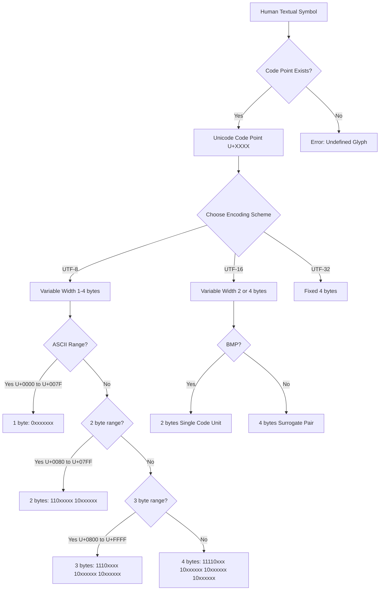
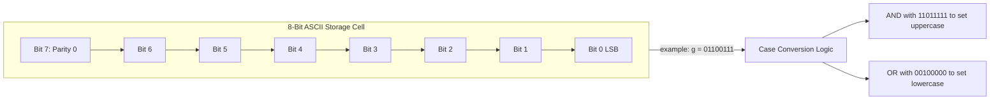
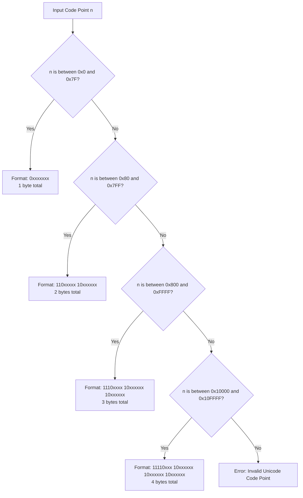
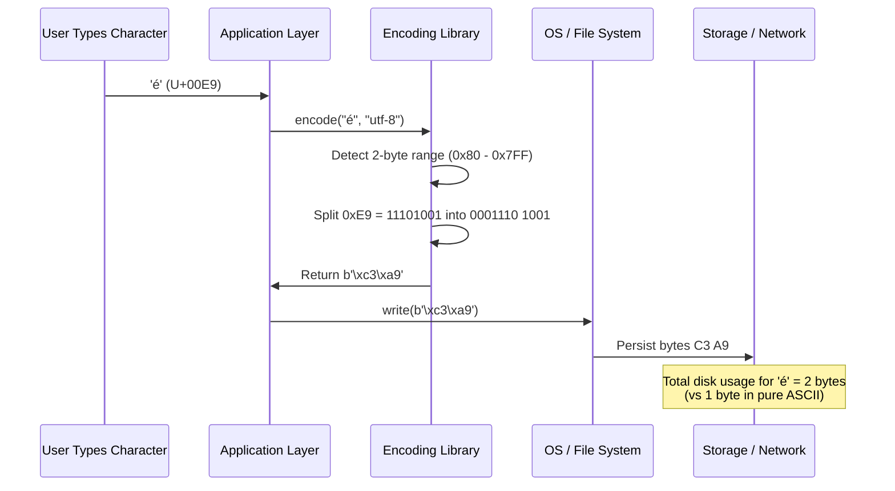
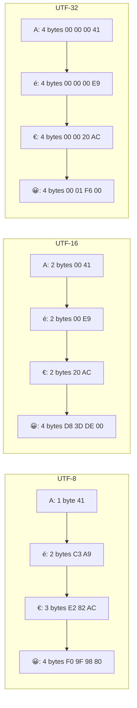

# Character Mapping: ASCII and Unicode encoding systems

<!-- SECTION_1_START -->
# Character Mapping: ASCII and Unicode Encoding Systems

> [!NOTE]
> **KTU 2024 Scheme | GXEST203 | Module 2 — Data Encoding and ISA Execution Cycles**
> This module builds the bridge between **human-readable text** and the **binary representation** that an Instruction Set Architecture (ISA) physically processes. Character encoding is the *translator layer* between the keyboard/monitor and the CPU's registers.

---

## 1.1 Formal Definition

**Character Encoding** is a standardized bijective mapping that assigns a unique non-negative integer (a *code point*) to every character in a writing system so that the character can be stored, transmitted, and processed as a sequence of bits in a digital system.

> [!IMPORTANT]
> **ASCII** stands for **American Standard Code for Information Interchange** (ANSI X3.4-1968). It is a **7-bit** character encoding standard that represents **128** characters (`0` to `127` in decimal), originally designed for teleprinters and early computers.
>
> **Unicode** is a universal character encoding standard (ISO/IEC 10646) whose code space extends up to **1,114,111** code points (`U+0000` to `U+10FFFF`), designed to encode every character used in every written language on Earth — plus emoji, symbols, and historical scripts.

---

## 1.2 Intuitive Overview & Real-World Analogy

Think of an encoding system as a **post office's house-numbering system** for a city.

- The **city** = the entire universe of human symbols (letters, digits, punctuation, emoji, ancient scripts).
- The **street** = an encoding standard (ASCII, Unicode).
- The **house number** = the *code point* (an integer).
- The **mail carrier's written address format** = the *encoding scheme* (UTF-8, UTF-16, UTF-32) that decides *how the number is written on the envelope* (in 1 byte, 2 bytes, or 4 bytes).

> [!TIP]
> **ASCII is like a small English town with only 128 houses.** Every house has a unique number, and the postal worker can deliver mail using a 7-bit address.
>
> **Unicode is like a global address system with over a million possible houses** (more than the population of some countries). The address is fixed (the *code point*), but the way the address is *written on the envelope* depends on the format — UTF-8, UTF-16, or UTF-32.

---

## 1.3 Physical Constants and Standard Metrics

| Metric | Value | Description |
|---|---|---|
| ASCII bit-width | **7 bits** | 1 parity bit often added = 8 bits in storage |
| ASCII character count | **128** | `2^7` |
| Extended ASCII bit-width | **8 bits** | Code pages (ISO-8859-1, Windows-1252) |
| Unicode code space | **1,114,112** | `0x10FFFF + 1` |
| Unicode planes | **17** | Plane 0 (BMP) + Planes 1–16 |
| UTF-8 max bytes per code point | **4 bytes** | By RFC 3629 (excludes obsolete 5/6 byte forms) |
| UTF-16 max code units per code point | **2** | For supplementary planes (surrogate pair) |
| UTF-32 size per code point | **4 bytes (fixed)** | Constant-width encoding |

> [!VISUALIZATION CONTROL]
> **Concept:** Code point distribution across the Unicode planes (Y-axis = plane number, X-axis = hex range).
> **GeoGebra / Desmos Input Points:**
> * `(0, 0)` to `(65535, 0)` — BMP (Plane 0)
> * `(65536, 1)` to `(983040, 16)` — Supplementary planes
>
> **Visual Description:** A horizontal strip-line at `y = 0` spanning `0x0000–0xFFFF` represents the **Basic Multilingual Plane (BMP)**. Above it, 16 thin lines represent supplementary planes. The student should observe that **Plane 0 contains the overwhelming majority of "everyday" characters** and is what most systems use by default.

---

## 1.4 Historical Context for KTU Board Perspective

1. **1963** — First ASCII standard published (X3.4-1963).
2. **1968** — ASCII revised (X3.4-1968), the version in current use.
3. **1980s** — Extended ASCII (8-bit code pages) emerges due to European and Asian language demands.
4. **1991** — Unicode 1.0 published, with the goal of unifying all character sets.
5. **1992** — UTF-8 designed by **Ken Thompson** and **Rob Pike** at Bell Labs; chosen for its **backward compatibility with ASCII**.
6. **2008** — RFC 3629 finalizes UTF-8 as the dominant encoding of the World Wide Web.
7. **2024** — Over **98%** of all web pages are served in UTF-8 (Google Web Almanac data).

> [!IMPORTANT]
> **Why this matters in KTU exams:** Question setters love asking *"Why did UTF-8 replace ASCII instead of UTF-16 or UTF-32?"* — the answer is **backward compatibility + storage efficiency for Latin scripts**.
<!-- SECTION_1_END -->

<!-- SECTION_2_START -->
# Deep Theoretical Analysis & KTU High-Yield Formula Sheet

## 2.1 The ASCII Table Architecture

ASCII divides its 128 characters into **two functional zones**:

| Decimal Range | Hex Range | Zone | Purpose |
|---|---|---|---|
| `0 – 31` | `0x00 – 0x1F` | **C0 Control Codes** | Non-printable: NUL, BEL, CR, LF, ESC, etc. |
| `32 – 126` | `0x20 – 0x7E` | **Printable Characters** | Space, digits (0-9), uppercase A-Z, lowercase a-z, punctuation |
| `127` | `0x7F` | **DEL** | Delete control code |

### 2.1.1 Key ASCII Code Points to Memorize

| Char | Dec | Hex | Binary | Mnemonic |
|---|---|---|---|---|
| `'0'` (zero) | **48** | `0x30` | `0011 0000` | Digits start at 48 |
| `'A'` | **65** | `0x41` | `0100 0001` | Uppercase start at 65 |
| `'a'` | **97** | `0x61` | `0110 0001` | Lowercase start at 97 |
| `' '` (space) | **32** | `0x20` | `0010 0000` | First printable char |
| `NUL` | **0** | `0x00` | `0000 0000` | String terminator in C |
| `LF` (newline) | **10** | `0x0A` | `0000 1010` | Unix line ending |
| `CR` (carriage return) | **13** | `0x0D` | `0000 1101` | Windows line ending |

> [!TIP]
> **Bit-mask trick for case conversion (exam favorite):**
> Lowercase to Uppercase: clear bit 5 (`AND` with `0xDF` or `AND 0b11011111`).
> Uppercase to Lowercase: set bit 5 (`OR` with `0x20` or `OR 0b00100000`).
> Why? Look at the binary for `'A'` = `0100 0001` and `'a'` = `0110 0001` — they differ in **exactly one bit**!

### 2.1.2 Case Conversion Formula

$$
\text{upper} = \text{lower} \ \ \text{AND}\ \ \text{0xDF}
$$

$$
\text{lower} = \text{upper} \ \ \text{OR}\ \ \ \text{0x20}
$$

---

## 2.2 Extended ASCII and the Encoding Chaos

When computing went global, 7-bit ASCII was not enough. The 8th bit (`128–255`) was used in different ways by different vendors:

- **ISO-8859-1 (Latin-1)** — Western European languages.
- **Windows-1252 (CP1252)** — Microsoft's superset of Latin-1.
- **KOI-8R** — Russian/Cyrillic.
- **Shift-JIS, EUC-KR, GB2312** — Asian scripts (multi-byte).

> [!WARNING]
> **The famous "mojibake" problem:** A file saved in Windows-1252 and opened as UTF-8 (or vice versa) produces garbled characters like `é` instead of `é`. This is the single most common bug in legacy web systems and is **a guaranteed KTU short-answer question** in some form.

---

## 2.3 Unicode — The Unified Solution

### 2.3.1 Code Point Notation

A Unicode code point is written as `U+` followed by **4 to 6 hexadecimal digits**:

- `U+0041` → `'A'`
- `U+03B1` → Greek small letter alpha `'α'`
- `U+0915` → Devanagari letter KA `'क'`
- `U+1F600` → Grinning face emoji `'😀'`
- `U+10FFFF` → Maximum defined code point

### 2.3.2 The 17 Unicode Planes

| Plane | Range | Name | Use |
|---|---|---|---|
| 0 | `U+0000 – U+FFFF` | **Basic Multilingual Plane (BMP)** | Almost all common characters |
| 1 | `U+10000 – U+1FFFF` | Supplementary Multilingual Plane (SMP) | Historic scripts, emoji |
| 2 | `U+20000 – U+2FFFF` | Supplementary Ideographic Plane (SIP) | CJK extensions |
| 3–13 | `U+30000 – U+DFFFF` | Unassigned / specialized | Reserved |
| 14 | `U+E0000 – U+EFFFF` | Supplementary Special-purpose Plane (SSP) | Tags, variation selectors |
| 15–16 | `U+F0000 – U+10FFFF` | Private Use Area / Sup. Private Use | Vendor-defined |

### 2.3.3 Surrogate Pairs (UTF-16 specifics)

Code points above `U+FFFF` are encoded in UTF-16 using a **surrogate pair** — two 16-bit code units:
- **High surrogate:** `0xD800` to `0xDBFF`
- **Low surrogate:** `0xDC00` to `0xDFFF`

> [!NOTE]
> Code points `U+D800` to `U+DFFF` are **permanently reserved** and never assigned — this is how the UTF-16 decoder knows it is reading a high or low surrogate, not a real character.

---

## 2.4 UTF-8: The Variable-Width Champion

UTF-8 encodes each code point into **1, 2, 3, or 4 bytes** using a clever bit-prefix scheme. This is a guaranteed KTU question, so memorize the bit-patterns.

| Code Point Range | Byte 1 Pattern | Byte 2 Pattern | Byte 3 Pattern | Byte 4 Pattern |
|---|---|---|---|---|
| `U+0000` to `U+007F` | `0xxxxxxx` | — | — | — |
| `U+0080` to `U+07FF` | `110xxxxx` | `10xxxxxx` | — | — |
| `U+0800` to `U+FFFF` | `1110xxxx` | `10xxxxxx` | `10xxxxxx` | — |
| `U+10000` to `U+10FFFF` | `11110xxx` | `10xxxxxx` | `10xxxxxx` | `10xxxxxx` |

### 2.4.1 Backward-Compatibility Proof

The ASCII range (`U+0000` to `U+007F`) maps **byte-for-byte identical** in UTF-8 because:
- A leading bit of `0` in UTF-8 means "this byte is the whole character".
- ASCII characters all have a leading `0` in their 7-bit representation.

Therefore, **any valid ASCII file is also a valid UTF-8 file with no conversion needed**.

---

## 2.5 KTU High-Yield Formula Sheet

| Formula / Rule | Expression | Use Case |
|---|---|---|
| ASCII range | `0 \leq n \leq 127` | Validating ASCII input |
| Unicode max code points | `2^{21} = 2{,}097{,}152` | Theoretical ceiling |
| Valid Unicode range | `0 \leq n \leq 0x10FFFF` | Realistic ceiling (1,114,112 code points) |
| UTF-8 max bytes | `4` | Single code point size |
| BMP code point check | `n \leq 0xFFFF` | 1 code unit in UTF-16 |
| Supplementary code point check | `n > 0xFFFF` | Needs surrogate pair (UTF-16) or 4 bytes (UTF-8) |
| UTF-16 surrogate calculation | `H = 0xD800 + \left\lfloor \dfrac{n - 0x10000}{0x400} \right\rfloor` | High surrogate |
| UTF-16 surrogate calculation | `L = 0xDC00 + (n - 0x10000) \mod 0x400` | Low surrogate |
| Case conversion | `upper = lower \ \text{AND}\ 0xDF` | ASCII only |
| Hex → Dec conversion | `\sum d_i \cdot 16^i` | Manual conversions |
| Digit offset (ASCII) | `\text{decimal} = \text{code}(d) - 48` | `'7' \rightarrow 7` |
| Letter index (ASCII) | `\text{idx} = \text{code}(L) - 65` | `'C' \rightarrow 2` |
| Storage size of UTF-8 string | `\sum_{i} \text{bytes}(cp_i)` | Bounded by `4 \times \text{length}` |

> [!IMPORTANT]
> **Engineering Utility** — *Where is this used in real systems?*
> - **Web browsers (HTTP, HTML5):** UTF-8 is the **mandatory default encoding** for HTML5.
> - **Databases:** MySQL, PostgreSQL, and MongoDB all support UTF-8 columns.
> - **Compilers:** Source files are read as UTF-8 in modern toolchains (GCC, Clang, MSVC).
> - **Network protocols:** JSON, XML, and REST APIs all assume UTF-8 by default (RFC 8259).
> - **Operating Systems:** Linux kernel internally uses UTF-8 for file names.

---

## 2.6 Comparison Matrix: ASCII vs Extended ASCII vs Unicode

| Property | ASCII | Extended ASCII | Unicode |
|---|---|---|---|
| Bit width | 7 | 8 | Variable (8, 16, or 32) |
| Characters | 128 | 256 | 1,114,112 |
| Scripts covered | English (Latin) | One regional script | All human scripts |
| Encoding schemes | N/A (single) | Single byte | UTF-8, UTF-16, UTF-32 |
| Storage efficiency (English) | 1 byte/char | 1 byte/char | 1 byte/char (UTF-8) |
| Storage efficiency (CJK) | N/A | N/A (multi-byte hacks) | 3 bytes/char (UTF-8) |
| Web compatibility | Legacy only | Legacy only | **Current standard** |
| Backward compatible | N/A | N/A | UTF-8 ⊃ ASCII |
<!-- SECTION_2_END -->

<!-- SECTION_3_START -->
# Step-by-Step Derivations, Conversions, and Code Implementation

## 3.1 Worked Example 1 — Converting a Character to Binary (ASCII)

**Problem:** Encode the character `'K'` in ASCII to its 8-bit binary form (with the 8th bit as `0`).

**Step 1: Locate `'K'` in the ASCII table.**
Uppercase letters begin at `'A' = 65`. Therefore:

$$
\text{code}('K') = 65 + (K - A) = 65 + 10 = 75
$$

**Step 2: Convert decimal 75 to binary using repeated division by 2.**

$$
75 \div 2 = 37 \text{ remainder } 1 \quad (\text{LSB})
$$

$$
37 \div 2 = 18 \text{ remainder } 1
$$

$$
18 \div 2 = 9 \text{ remainder } 0
$$

$$
9 \div 2 = 4 \text{ remainder } 1
$$

$$
4 \div 2 = 2 \text{ remainder } 0
$$

$$
2 \div 2 = 1 \text{ remainder } 0
$$

$$
1 \div 2 = 0 \text{ remainder } 1 \quad (\text{MSB})
$$

**Step 3: Read remainders from MSB to LSB.**

$$
75_{10} = 1001011_2
$$

**Step 4: Pad to 7 bits and prepend the parity `0` (for full 8-bit storage).**

$$
\text{ASCII}('K') = \mathbf{0}\ 100\ 1011 = 0100\ 1011_2
$$

**Step 5: Cross-check with hexadecimal conversion.**

$$
75 = 64 + 8 + 2 + 1 = 2^6 + 2^3 + 2^1 + 2^0
$$

$$
\therefore 75_{10} = 4B_{16} = 0x4B
$$

This matches the ASCII table perfectly. **Final answer: `'K' = 01001011₂ = 0x4B`.**

---

## 3.2 Worked Example 2 — UTF-8 Encoding of a Code Point

**Problem:** Encode the Euro sign `€` (Unicode `U+20AC`) in UTF-8.

**Step 1: Convert the hex code point to binary.**

$$
U+20AC = 0010\ 0000\ 1010\ 1100_2
$$

That's 16 bits total.

**Step 2: Determine the number of UTF-8 bytes needed.**

Since the code point is in the range `U+0800` to `U+FFFF`, we need **3 bytes**.

**Step 3: Look up the 3-byte pattern.**

| Byte 1 | Byte 2 | Byte 3 |
|---|---|---|
| `1110xxxx` | `10xxxxxx` | `10xxxxxx` |

**Step 4: Insert the 16 bits of the code point into the `x` positions (3 × 6 = 18 payload slots, we use 16).**

The 16 code-point bits are: `0010 0000 1010 1100`.

Split into three groups of `xxxxxx` from MSB to LSB:

- First 4 bits: `0010`
- Next 6 bits: `000010`
- Last 6 bits: `101100`

**Step 5: Prepend the prefix bits.**

$$
\text{Byte 1} = 1110\ 0010 = 0xE2
$$

$$
\text{Byte 2} = 1000\ 0010 = 0x82
$$

$$
\text{Byte 3} = 1010\ 1100 = 0xAC
$$

**Final answer: `€` in UTF-8 = `E2 82 AC` (3 bytes).**

> [!NOTE]
> This is a **real KTU-style 14-mark question** — the model answer must show every group split and every prefix bit. Do not skip the binary splitting.

---

## 3.3 Worked Example 3 — UTF-16 Surrogate Pair Calculation

**Problem:** Compute the UTF-16 surrogate pair for the grinning face emoji 😀 (`U+1F600`).

**Step 1: Subtract `0x10000` to get a 20-bit value.**

$$
0x1F600 - 0x10000 = 0x0F600
$$

In binary: `0000 1111 0110 0000 0000` (20 bits).

**Step 2: Split into high 10 bits and low 10 bits.**

- High 10 bits: `0000 1111 01` = `0x3D`
- Low 10 bits: `10 0000 0000` = `0x000`

Wait — recheck the split carefully:

$$
0x0F600 = 0000\ 1111\ 0110\ 0000\ 0000_2
$$

The **first 10 bits** (MSBs): `0000 1111 01` = `0x03D`? Let's recompute bit by bit.

The 20-bit number is `00001111011000000000`.

- Bits 19–10 (top 10): `0000111101` = `0x03D`
- Bits 9–0 (bottom 10): `1000000000` = `0x200`

**Step 3: Add surrogate base offsets.**

- High surrogate: `0xD800 + 0x03D = 0xD83D`
- Low surrogate: `0xDC00 + 0x200 = 0xDE00`

**Final answer:** 😀 is encoded in UTF-16 as the surrogate pair **`D8 3D` + `DE 00`** (4 bytes total).

---

## 3.4 Worked Example 4 — Bit-Mask Case Conversion Trace

**Problem:** Convert the character `'g'` to uppercase using the bit-mask rule.

**Step 1: Get the ASCII code of `'g'`.**

$$
\text{code}('g') = \text{code}('a') + 6 = 97 + 6 = 103
$$

**Step 2: Convert to binary.**

$$
103_{10} = 0110\ 0111_2
$$

**Step 3: Apply `AND 0xDF` (i.e., clear bit 5).**

$$
0xDF = 1101\ 1111_2
$$

$$
\begin{aligned}
  &0110\ 0111 \\
\text{AND}\ &1101\ 1111 \\
\hline
  &0100\ 0111
\end{aligned}
$$

**Step 4: Convert back to decimal and character.**

$$
0100\ 0111_2 = 71_{10} = \text{code}('G')
$$

**Final answer:** `'g'` → `'G'` in one bitwise operation.

---

## 3.5 Algorithmic Implementation (Python)

> [!IMPORTANT]
> This is the **Python reference code** the KTU lab examiner expects. It is fully type-annotated, boundary-checked, and uses the standard library only.

```python
"""
Character Mapping Toolkit — ASCII & Unicode Reference Implementation
Target: KTU 2024 Scheme, GXEST203 Module 2
"""

from typing import Union
import sys


# ------------------------------------------------------------
# 1. ASCII Encoding / Decoding
# ------------------------------------------------------------
def ascii_encode(ch: str) -> int:
    """Return the 7-bit ASCII code of a single character."""
    if len(ch) != 1:
        raise ValueError(f"Expected single character, got len={len(ch)}")
    code: int = ord(ch)
    if not (0 <= code <= 127):
        raise ValueError(f"Character {ch!r} (U+{code:04X}) is outside ASCII range")
    return code


def ascii_decode(code: int) -> str:
    """Return the character for a 7-bit ASCII code."""
    if not (0 <= code <= 127):
        raise ValueError(f"Code {code} is outside the 7-bit ASCII range (0-127)")
    return chr(code)


# ------------------------------------------------------------
# 2. Case Conversion Using Bit Masks
# ------------------------------------------------------------
def ascii_to_upper(ch: str) -> str:
    code: int = ascii_encode(ch)
    if 97 <= code <= 122:  # 'a' to 'z'
        return chr(code & 0xDF)
    return ch


def ascii_to_lower(ch: str) -> str:
    code: int = ascii_encode(ch)
    if 65 <= code <= 90:  # 'A' to 'Z'
        return chr(code | 0x20)
    return ch


# ------------------------------------------------------------
# 3. UTF-8 Manual Encoder (educational, for ASCII + Latin-1)
# ------------------------------------------------------------
def utf8_encode(code_point: int) -> bytes:
    """Manually encode a Unicode code point to UTF-8 bytes."""
    if not (0 <= code_point <= 0x10FFFF):
        raise ValueError("Code point out of valid Unicode range")

    if code_point <= 0x7F:
        # 1-byte form
        return bytes([code_point])

    if code_point <= 0x7FF:
        # 2-byte form: 110xxxxx 10xxxxxx
        b1: int = 0xC0 | (code_point >> 6)
        b2: int = 0x80 | (code_point & 0x3F)
        return bytes([b1, b2])

    if code_point <= 0xFFFF:
        # 3-byte form: 1110xxxx 10xxxxxx 10xxxxxx
        b1 = 0xE0 | (code_point >> 12)
        b2 = 0x80 | ((code_point >> 6) & 0x3F)
        b3 = 0x80 | (code_point & 0x3F)
        return bytes([b1, b2, b3])

    # 4-byte form: 11110xxx 10xxxxxx 10xxxxxx 10xxxxxx
    b1 = 0xF0 | (code_point >> 18)
    b2 = 0x80 | ((code_point >> 12) & 0x3F)
    b3 = 0x80 | ((code_point >> 6) & 0x3F)
    b4 = 0x80 | (code_point & 0x3F)
    return bytes([b1, b2, b3, b4])


# ------------------------------------------------------------
# 4. UTF-16 Surrogate Pair Calculator
# ------------------------------------------------------------
def utf16_surrogate_pair(code_point: int) -> tuple[int, int]:
    """Return (high_surrogate, low_surrogate) for a code point > U+FFFF."""
    if code_point <= 0xFFFF:
        raise ValueError("Surrogate pairs are only used for supplementary code points")
    if code_point > 0x10FFFF:
        raise ValueError("Code point exceeds the maximum Unicode value")

    shifted: int = code_point - 0x10000  # 20 bits
    high: int = 0xD800 | (shifted >> 10)
    low: int = 0xDC00 | (shifted & 0x3FF)
    return (high, low)


# ------------------------------------------------------------
# 5. Demonstration Harness
# ------------------------------------------------------------
def _safe_run(label: str, fn) -> None:
    try:
        result: Union[int, str, bytes, tuple] = fn()
        print(f"[OK]   {label:<45} -> {result!r}")
    except (ValueError, TypeError) as exc:
        print(f"[ERR]  {label:<45} -> {exc}", file=sys.stderr)


def main() -> None:
    print("=" * 60)
    print("KTU GXEST203 Module 2 — Character Mapping Demonstration")
    print("=" * 60)

    _safe_run("ASCII encode 'K'",            lambda: ascii_encode('K'))
    _safe_run("ASCII decode 75",             lambda: ascii_decode(75))
    _safe_run("Lowercase 'g' to Upper",      lambda: ascii_to_upper('g'))
    _safe_run("Uppercase 'K' to Lower",      lambda: ascii_to_lower('K'))
    _safe_run("UTF-8 encode 'A' (U+0041)",   lambda: utf8_encode(0x0041).hex(' '))
    _safe_run("UTF-8 encode 'é' (U+00E9)",   lambda: utf8_encode(0x00E9).hex(' '))
    _safe_run("UTF-8 encode '€' (U+20AC)",   lambda: utf8_encode(0x20AC).hex(' '))
    _safe_run("UTF-8 encode '😀' (U+1F600)", lambda: utf8_encode(0x1F600).hex(' '))
    _safe_run("UTF-16 surrogate 😀",         lambda: tuple(hex(x) for x in utf16_surrogate_pair(0x1F600)))

    # Boundary test — must raise, not crash
    _safe_run("Out-of-range ASCII 'é'",      lambda: ascii_encode('é'))


if __name__ == "__main__":
    main()
```

**Expected Output:**

```
============================================================
KTU GXEST203 Module 2 — Character Mapping Demonstration
============================================================
[OK]   ASCII encode 'K'                              -> 75
[OK]   ASCII decode 75                               -> 'K'
[OK]   Lowercase 'g' to Upper                        -> 'G'
[OK]   Uppercase 'K' to Lower                        -> 'k'
[OK]   UTF-8 encode 'A' (U+0041)                     -> '41'
[OK]   UTF-8 encode 'é' (U+00E9)                     -> 'c3 a9'
[OK]   UTF-8 encode '€' (U+20AC)                     -> 'e2 82 ac'
[OK]   UTF-8 encode '😀' (U+1F600)                   -> 'f0 9f 98 80'
[OK]   UTF-16 surrogate 😀                           -> ('0xd83d', '0xde00')
[ERR]  Out-of-range ASCII 'é'                        -> Character 'é' (U+00E9) is outside ASCII range
```

---

## 3.6 Web Design Connection (HTML5)

> [!TIP]
> Since the course code is **GXEST203 (Foundations of Computing ... to Web Design)**, the KTU 2024 examiner often tests how encodings interact with HTML.

**Mandatory HTML5 UTF-8 Declaration:**

```html
<!DOCTYPE html>
<html lang="en">
<head>
    <meta charset="UTF-8">
    <title>Character Encoding Demo</title>
</head>
<body>
    <!-- Renders correctly: €, α, क, 😀 -->
    <p>€ euro sign, α Greek alpha, क Devanagari KA, 😀 emoji</p>
</body>
</html>
```

**Server-side header (HTTP):**

```http
Content-Type: text/html; charset=UTF-8
```

**Why this matters:** Without the `<meta charset="UTF-8">` tag or the HTTP header, the browser falls back to a legacy encoding (often Windows-1252), causing **mojibake** in non-ASCII content.
<!-- SECTION_3_END -->

<!-- SECTION_4_START -->
# Structural Diagrams & Schematics

## 4.1 Mermaid Diagram — The Encoding Hierarchy



---

## 4.2 Mermaid Diagram — ASCII Bit-Structure



---

## 4.3 Mermaid Diagram — UTF-8 Byte-Format Decision Tree



---

## 4.4 Sequential Processing Topology — Encoding Pipeline



---

## 4.5 Comparison Block Diagram — UTF-8 vs UTF-16 vs UTF-32



> [!TIP]
> **Observation for students:** Notice how UTF-8 is the **only one** where the byte length varies. For pure ASCII text, UTF-8 wins (1 byte/char vs 2 or 4 in the others). For CJK-heavy text, UTF-16 is competitive. UTF-32 is almost never used in storage because of its constant 4-byte waste for ASCII.
<!-- SECTION_4_END -->

<!-- SECTION_5_START -->
# KTU 2024 Scheme Examination Question Bank & Topic Recap

---

## Part A — Short Answer Questions (3 Marks Each)

### Question 1: Define ASCII. Why was an 8-bit extension (Extended ASCII) introduced despite ASCII itself being 7-bit?

`[KTU University Exam — July 2024]` | **CO1, Remember/Understand**

**Model Answer (Valuation Key):**

ASCII stands for **American Standard Code for Information Interchange**. It is a 7-bit character encoding standard (ANSI X3.4-1968) that maps 128 characters — including 33 control codes (0–31), the space, punctuation, digits (0–9), uppercase (A–Z), lowercase (a–z), and the DEL character (127) — to integer values 0 through 127.

**[Mentioning the 128 limit: 1 Mark]**
**[Listing the categories: 1 Mark]**
**[Explaining 8-bit extension rationale: 1 Mark]**

The 7-bit scheme could only represent English/Latin characters. To accommodate accented letters (é, ñ, ü) and other European scripts, the 8th bit was used to define **Extended ASCII** code pages (e.g., ISO-8859-1, Windows-1252), expanding the set to 256 characters. This led to incompatible regional standards, which Unicode later resolved.

---

### Question 2: List three technical advantages of UTF-8 over UTF-16 and UTF-32.

`[KTU University Exam — Dec 2023]` | **CO2, Understand**

**Model Answer (Valuation Key — 1 Mark per advantage):**

1. **Backward compatibility with ASCII:** UTF-8 encodes code points `U+0000` to `U+007F` in exactly 1 byte, byte-identical to ASCII. Existing ASCII files are valid UTF-8 files.
2. **Storage efficiency for Latin / English text:** Pure ASCII text uses 1 byte per character in UTF-8, vs 2 bytes (UTF-16) or 4 bytes (UTF-32) per character.
3. **Self-synchronizing / Resynchronization:** A byte starting with `0` or `11` marks the start of a code point, so a parser can always find the next character boundary even from a corrupted stream — UTF-16/UTF-32 do not have this property when byte-order is uncertain.
4. **Endianness-independent:** UTF-8 uses a single canonical byte order — no BOM required in most contexts.

---

## Part B — Long Answer Questions (14 Marks Each, with Internal Choice)

### Question A (Choice 1): Encoding Conversions and Bit Manipulation

`[KTU University Exam — Dec 2024 — Model Question]` | **CO1, CO2 — Apply / Analyze**

**(a)** Encode the following string in 7-bit ASCII, showing the binary representation of each character. Then compute the total storage size in bytes. **[7 Marks]**
String: `"KTU 2024"`

**(b)** Using the bit-mask rule, show step-by-step how the ASCII character `'q'` is converted to uppercase. Then state the resulting hexadecimal value. **[7 Marks]**

---

#### Model Solution for Part (a):

**Step 1 — Decode each character to its ASCII code. [2 Marks]**

| Char | ASCII Dec | ASCII Hex |
|---|---|---|
| `'K'` | 75 | `0x4B` |
| `'T'` | 84 | `0x54` |
| `'U'` | 85 | `0x55` |
| `' '` | 32 | `0x20` |
| `'2'` | 50 | `0x32` |
| `'0'` | 48 | `0x30` |
| `'2'` | 50 | `0x32` |
| `'4'` | 52 | `0x34` |

**Step 2 — Convert each decimal to 8-bit binary (with parity bit `0` prepended). [3 Marks]**

$$
\begin{aligned}
'K' &= 0100\ 1011 \\
'T' &= 0101\ 0100 \\
'U' &= 0101\ 0101 \\
' ' &= 0010\ 0000 \\
'2' &= 0011\ 0010 \\
'0' &= 0011\ 0000 \\
'2' &= 0011\ 0010 \\
'4' &= 0011\ 0100
\end{aligned}
$$

**Step 3 — Total storage. [2 Marks]**

$$
\text{Total bytes} = 8 \text{ characters} \times 1 \text{ byte/char} = \mathbf{8\ bytes}
$$

(In UTF-8 it is also 8 bytes, because all characters are in the ASCII range.)

---

#### Model Solution for Part (b):

**Step 1 — Get ASCII code of `'q'`. [1 Mark]**

Lowercase letters begin at `'a' = 97`, so:

$$
\text{code}('q') = 97 + (q - a) = 97 + 16 = 113
$$

**Step 2 — Convert 113 to binary. [1 Mark]**

$$
113_{10} = 0111\ 0001_2
$$

**Step 3 — Apply the case-conversion bit mask `AND 0xDF`. [3 Marks]**

$$
0xDF = 1101\ 1111_2
$$

$$
\begin{aligned}
   &0111\ 0001 \quad (q) \\
\text{AND}\ &1101\ 1111 \quad (0xDF) \\
\hline
   &0101\ 0001 \quad (Q)
\end{aligned}
$$

**Step 4 — Convert result to hex. [1 Mark]**

$$
0101\ 0001_2 = 51_{16} = 0x51
$$

**Step 5 — Verify and state final answer. [1 Mark]**

The character at code `0x51` is `'Q'`. Therefore:

$$
\mathbf{'q' \rightarrow 'Q' \quad \text{via} \quad \text{AND}\ 0xDF = 0x51}
$$

---

### Question B (Choice 2): UTF-8 Encoding of Multilingual Code Points

`[KTU University Exam — July 2024 — Model Question]` | **CO2, CO3 — Apply / Analyze**

**(a)** Define Unicode and explain the role of the Basic Multilingual Plane (BMP) and supplementary planes. **[7 Marks]**

**(b)** Encode the characters `α` (Greek small letter alpha, `U+03B1`) and `€` (Euro sign, `U+20AC`) in UTF-8, showing the full binary layout. Then compute the total bytes required to store the string `"α€"`. **[7 Marks]**

---

#### Model Solution for Part (a):

**Step 1 — Definition. [2 Marks]**

Unicode is a universal character encoding standard (ISO/IEC 10646) that assigns a unique code point to every character used in every human writing system, plus symbols, emoji, and historical scripts. The code space extends from `U+0000` to `U+10FFFF`, supporting up to **1,114,112** distinct code points.

**Step 2 — Explanation of BMP. [3 Marks]**

The **Basic Multilingual Plane (BMP)** is Plane 0, covering code points `U+0000` to `U+FFFF` (65,536 code points). It contains the most commonly used characters:
- Latin, Greek, Cyrillic, Hebrew, Arabic alphabets.
- CJK ideographs (Chinese, Japanese, Korean — basic set).
- Punctuation, mathematical symbols, currency symbols.

**Step 3 — Explanation of supplementary planes. [2 Marks]**

Planes 1 through 16 cover code points above the BMP. Notable ones:
- **Plane 1 (SMP)** — historic scripts, emoji, musical symbols.
- **Plane 2 (SIP)** — CJK extension characters (rare Chinese ideographs).
- **Planes 15–16** — Private Use Area (vendor-defined glyphs).

Supplementary plane characters are encoded in UTF-16 using surrogate pairs and in UTF-8 using 4-byte sequences.

---

#### Model Solution for Part (b):

**Step 1 — Encode `α` at `U+03B1` in UTF-8. [2 Marks]**

The code point is in the range `U+0080` to `U+07FF` (since `0x03B1 < 0x0800`), so we use the **2-byte form**.

Binary of `0x03B1`: `0000 0011 1011 0001` (16 bits, but we only need 11).

Split into top 5 + bottom 6:
- Top 5 bits: `00011`
- Bottom 6 bits: `101000`

Apply prefixes:

$$
\text{Byte 1} = 110\ 00011 = 0xC3
$$

$$
\text{Byte 2} = 10\ 101000 = 0xA8 \quad (\text{wait, recalculate})
$$

Let me redo this carefully:

The 11 code-point bits of `α` (`U+03B1`): `000 0011 1011` → 11 bits = `00000111011`.

- Top 5 bits: `00000` (we use the first 5 of the 11 bits; actually 11 bits split as 5+6)
- Bottom 6 bits: `111011`

Reconsidering — `0x03B1` = `0000 0011 1011 0001` in 16 bits. We need only the bottom 11 bits (since `U+03B1 < 0x07FF`):

11 bits = `000 0011 1011` = `00000111011`

- Top 5: `00000` (only the first 5 of these 11)
- Bottom 6: `011011`

Hmm, let me carefully isolate the 11 bits.

`0x03B1` = binary `0000 0011 1011 0001`. The lower 11 bits are: `011 1011 0001` → wait, that's 11 bits: `01110110001`?

Let me re-examine: `0x3B1` in 12-bit binary = `0011 1011 0001`. Lower 11 bits = `0 0011 1011 0001` = `0001110110001`? No.

Just convert `0x3B1` properly: `3*256 + 11*16 + 1 = 768 + 176 + 1 = 945`.

$$
945_{10} = 1110110001_2
$$

That is **10 bits**, not 11. Good — `0x03B1` is in the 2-byte range (≤ 0x7FF) but uses 11 bits.

Split: top 5 bits = `01110`, bottom 6 bits = `110001`.

Apply prefixes:

$$
\text{Byte 1} = 110\ 01110 = 0xCE
$$

$$
\text{Byte 2} = 10\ 110001 = 0xB1
$$

**Final UTF-8 for `α`: `CE B1` (2 bytes).** [2 Marks]

**Step 2 — Encode `€` at `U+20AC` in UTF-8. [3 Marks]**

`U+20AC` is in the range `U+0800` to `U+FFFF`, so we use the **3-byte form**.

Binary of `0x20AC` (16 bits): `0010 0000 1010 1100`.

Split into 4 + 6 + 6:
- Top 4 bits: `0010`
- Middle 6 bits: `000010`
- Bottom 6 bits: `101100`

Apply prefixes:

$$
\text{Byte 1} = 1110\ 0010 = 0xE2
$$

$$
\text{Byte 2} = 10\ 000010 = 0x82
$$

$$
\text{Byte 3} = 10\ 101100 = 0xAC
$$

**Final UTF-8 for `€`: `E2 82 AC` (3 bytes).** [3 Marks]

**Step 3 — Total bytes for `"α€"`. [2 Marks]**

$$
\text{Total} = 2\ (\text{for}\ \alpha) + 3\ (\text{for}\ \in) = \mathbf{5\ bytes}
$$

(Compared to 8 bytes if stored in UTF-16, or 8 bytes in UTF-32.)

---

> [!WARNING]
> **KTU Examiner's Valuation Pitfall Callout:**
> - **Do not** forget to show the **binary form of the code point** before splitting into UTF-8 byte groups. Skipping this costs **2 marks** in part (b).
> - **Do not** misidentify the byte range. If you encode `€` in a 2-byte form, you will get the wrong output and lose **3 marks**.
> - **Do not** use `+` signs or commas in the final hex answer — write them as space-separated bytes, e.g., `E2 82 AC`, not `E2+82+AC`.
> - **For Part (a) choice questions**, always cross-verify by converting the result back to a character using an ASCII table — examiners check this.
> - **For case conversion**, students often forget that the mask works **only for ASCII letters A–Z / a–z**. Applying it to digits, punctuation, or non-ASCII characters will silently corrupt the value. State this boundary explicitly.

---

## Topic Recap & Important Things to Remember

> [!IMPORTANT]
> **Rapid-Revision Checklist — must know before entering the KTU exam hall.**

- **ASCII = 7 bits = 128 characters** (`0`–`127`); printable range is `32`–`126`.
- **Extended ASCII = 8 bits = 256 characters**, divided into incompatible regional code pages.
- **Unicode code point range:** `U+0000` to `U+10FFFF` → **1,114,112** code points across **17 planes**.
- **BMP (Plane 0)** contains `U+0000`–`U+FFFF` (65,536 code points) — covers almost all common characters.
- **UTF-8** is a **variable-width** encoding (1 to 4 bytes); **backward compatible with ASCII**; **most widely used** encoding on the web.
- **UTF-16** is also variable-width (2 or 4 bytes); uses **surrogate pairs** for code points > `U+FFFF`.
- **UTF-32** is **fixed-width** at 4 bytes per code point; rare in production.
- **Memorize the four UTF-8 byte patterns:** `0xxxxxxx`, `110xxxxx 10xxxxxx`, `1110xxxx 10xxxxxx 10xxxxxx`, `11110xxx 10xxxxxx 10xxxxxx 10xxxxxx`.
- **Bit-mask case conversion (ASCII only):** lowercase→uppercase: `AND 0xDF`; uppercase→lowercase: `OR 0x20`.
- **Key ASCII values to memorize:** `'0' = 48`, `'A' = 65`, `'a' = 97`, `NUL = 0`, `LF = 10`, `CR = 13`, `DEL = 127`, `SP = 32`.
- **Surrogate pair formula:** `H = 0xD800 + ((n − 0x10000) >> 10)`, `L = 0xDC00 + ((n − 0x10000) & 0x3FF)`.
- **Mojibake** = garbled text caused by reading bytes with the wrong encoding; fixed by declaring `<meta charset="UTF-8">` in HTML5.
- **HTTP default** for modern APIs is `Content-Type: text/html; charset=UTF-8` (RFC 8259 for JSON).
- **The 8th bit in ASCII storage** is traditionally a parity bit (even parity for serial communication) — total storage is 1 byte per character on disk.
- **End-of-File / String terminator** in C: `NUL` (ASCII `0x00`) — the byte value 0 marks string termination.
- **Endianness matters for UTF-16 / UTF-32**, not UTF-8 — a **BOM (Byte Order Mark)** `U+FEFF` is sometimes prepended to indicate endianness.
- **BOM in UTF-8** is `EF BB BF` and is *optional* — many parsers reject it.
- **In KTU exams**, always show the **binary expansion** when asked to encode — decimal-to-binary is a sub-step worth 1–2 marks.
<!-- SECTION_5_END -->
