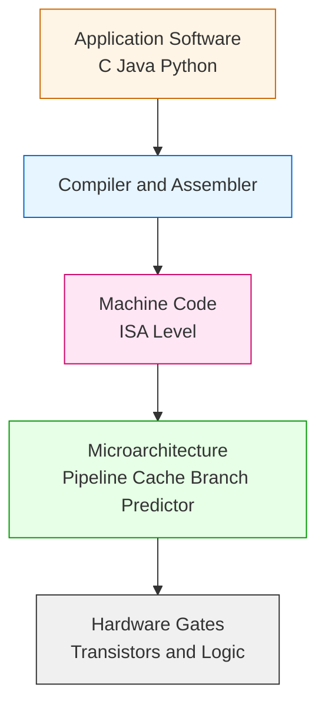
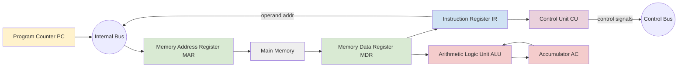
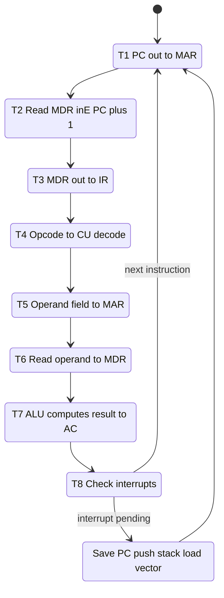
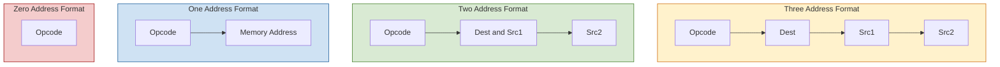

# Instruction Set Architecture (ISA): CPU instruction formats, assembly language fundamentals, Fetch-Decode-Execute cycle

<!-- SECTION_1_START -->
# Module 2: Data Encoding and ISA Execution Cycles
## Topic: Instruction Set Architecture (ISA) — CPU Instruction Formats, Assembly Language Fundamentals, and the Fetch–Decode–Execute Cycle

---

### 1.1 Formal Academic Definition (KTU 2024 Syllabus Aligned)

> [!IMPORTANT]
> **Instruction Set Architecture (ISA)** is the *abstract, programmer-visible model* of a computer's CPU. It defines the complete set of machine-language instructions, the **register set**, the supported **data types**, the **addressing modes**, the **memory addressing model**, the **I/O model**, and the **interrupt/exception behaviour** that the hardware promises to honour. The ISA acts as the **contractual boundary** between hardware (microarchitecture) and software (compiler, OS, application).

The ISA is sometimes called the **"machine language"** of the processor. Examples in industry include **x86-64** (Intel/AMD), **ARMv8-A** (used in most smartphones), and **RISC-V RV32I** (open standard). Every higher-level language (C, Java, Python) is ultimately translated into these ISA-defined binary patterns.

**Key components of an ISA (KTU Module 2, Unit 2 focus areas):**
1. **Instruction formats** — bit-level layout of an instruction.
2. **Instruction types** — data transfer, arithmetic/logic, control transfer, I/O, system.
3. **Register file** — small, ultra-fast on-chip storage.
4. **Addressing modes** — how operands are located.
5. **Assembly language** — human-readable symbolic form of the ISA.

---

### 1.2 Conceptual Analogy — "The Chef and the Recipe Card"

Imagine a professional kitchen:

* The **CPU** is the **head chef**.
* The **ISA** is the **recipe book** the chef has been trained on. The book lists *exactly* which gestures mean "chop", "stir", or "boil", and *exactly* which ingredients (operands) each gesture needs.
* The **microarchitecture** is the chef's *technique* — how fast the knife moves, how the stove is lit, the layout of the cutting board. Different chefs can follow the same recipe book but execute it differently fast.
* The **fetch–decode–execute cycle** is the chef's per-step ritual: **read** the next line of the recipe (Fetch), **understand** what gesture is required (Decode), **perform** the action (Execute), and then move to the **next line**.

A programmer writing in C never sees the recipe book directly — the **compiler** translates their code into the chef's exact vocabulary. The recipe book (ISA) is what guarantees that *any* compiled program will run on *any* kitchen that owns a copy of that book.

---

### 1.3 The Standard CPU Model Used in KTU 2024

> [!NOTE]
> The KTU 2024 syllabus for *Foundations of Computing* uses a **single-bus, accumulator-style simplified CPU** as the reference model. Register-level components you must know by name:
> * **PC** — Program Counter (holds address of *next* instruction).
> * **MAR** — Memory Address Register.
> * **MDR** — Memory Data Register.
> * **IR** — Instruction Register.
> * **AC** — Accumulator.
> * **CU** — Control Unit.
> * **ALU** — Arithmetic Logic Unit.

### 1.4 Visualization — Bit-Field of a Typical Instruction

> [!VISUALIZATION CONTROL]
> **Concept:** Generic 16-bit fixed-format instruction word layout
> **Reference axes (treat as bit positions):**
> * `bits 15..12` → Opcode field (4 bits, up to **16** distinct opcodes)
> * `bits 11..0`  → Operand/Address field (12 bits, addresses **0 .. 4095**)
>
> **Visual Description:** Picture a horizontal bar divided into two coloured blocks. The first (left) block, occupying **25 %** of the bar's width, is the *opcode* (the "verb" of the instruction). The remaining **75 %** is the *operand* (the "noun"). A decoder circuit looks at the first block to decide which micro-operation sequence to fire.

<!-- SECTION_1_END -->

<!-- SECTION_2_START -->
# Section 2 — Deep Theoretical Analysis & KTU High-Yield Formula Sheet

---

### 2.1 CPU Instruction Formats

A machine instruction is a binary word divided into **fields**. The two principal design decisions are:
1. **Number of explicit address fields** (0, 1, 2, or 3).
2. **Fixed vs. variable length**.

#### 2.1.1 Three-Address Format

```
┌────────┬────────┬────────┬────────┐
│  OP    │  Dest  │  Src1  │  Src2  │
└────────┴────────┴────────┴────────┘
```
**Semantic:** `Dest ← Src1 OP Src2`
**Example:** `ADD R1, R2, R3` means `R1 = R2 + R3`
**Used in:** ARM, RISC-V, MIPS — *load–store* RISC ISAs.
**Advantage:** Compact, single-instruction expressions.
**Cost:** Longer instruction word; more registers needed.

#### 2.1.2 Two-Address Format

```
┌────────┬────────┬────────┐
│  OP    │  D/S1  │  Src2  │
└────────┴────────┴────────┘
```
**Semantic:** `Dest/Src1 ← (Dest/Src1) OP Src2`
**Example:** `ADD R1, R2` means `R1 = R1 + R2`
**Used in:** x86 (in many encodings).

#### 2.1.3 One-Address Format (Accumulator-based)

```
┌────────┬────────┐
│  OP    │  Addr  │
└────────┴────────┘
```
**Semantic:** `AC ← AC OP M[Addr]`
**Example:** `ADD 500` means `AC = AC + Memory[500]`
**Used in:** Early von-Neumann machines, simple microcontrollers.
**Advantage:** Short instructions, fewer registers.

#### 2.1.4 Zero-Address Format (Stack-based)

```
┌────────┐
│  OP    │
└────────┘
```
**Semantic:** Operands are implicitly on the **top of the stack (TOS)**.
**Example:** `ADD` pops two values, pushes their sum.
**Used in:** Java Virtual Machine (JVM), Forth, x87 FPU stack.

> [!TIP]
> **KTU Board Tip:** When asked *"Compare instruction formats"*, always tabulate them with the four columns: **# of addresses, instruction length, # of memory references per instruction, ease of programming**.

---

### 2.2 Assembly Language Fundamentals

Assembly language is a **direct symbolic mapping** of the ISA. Each line of an `.asm` file typically has **four** fields:

```
[Label:]   Mnemonic   [Operand(s)]   [; comment]
```

| Field | Purpose | Example |
|---|---|---|
| **Label** | Symbolic name for a memory address (branch target) | `LOOP:` |
| **Mnemonic** | Human-readable opcode | `ADD`, `MOV`, `JMP` |
| **Operand** | Data the opcode acts on | `R1, #05h, 1000H` |
| **Comment** | Documentation (ignored by assembler) | `; sum = a + b` |

#### 2.2.1 Instruction Categories (must memorise)

| Category | Typical Mnemonics | Function |
|---|---|---|
| **Data Transfer** | `MOV`, `LOAD`, `STORE`, `PUSH`, `POP` | Move data between registers/memory |
| **Arithmetic** | `ADD`, `SUB`, `MUL`, `DIV`, `INC`, `DEC` | Integer arithmetic |
| **Logical** | `AND`, `OR`, `XOR`, `NOT`, `SHL`, `SHR` | Bitwise and shift operations |
| **Control Transfer** | `JMP`, `JZ`, `JNZ`, `CALL`, `RET` | Change program flow |
| **Compare/Test** | `CMP`, `TEST` | Set flags for conditional jumps |
| **I/O & System** | `IN`, `OUT`, `INT`, `NOP`, `HLT` | Talk to peripherals, halt CPU |

#### 2.2.2 Assembler Directives (Pseudo-Instructions)

These are **not** real machine instructions — they guide the assembler:

* `ORG 1000H` → set origin (starting address of next code).
* `DB 05H` → define byte constant in memory.
* `DW 1234H` → define word constant.
* `EQU 2000H` → equate a symbol to a constant.
* `END` → mark end of source file.

> [!NOTE]
> A **one-pass assembler** reads the program once and emits code immediately. A **two-pass assembler** performs a first pass to build a complete symbol table (resolving forward references) and a second pass to emit code. KTU 2024 typically expects awareness of both modes.

---

### 2.3 The Fetch–Decode–Execute (FDE) Cycle

The FDE cycle is the **heartbeat of every stored-program computer**. The CPU repeats it *billions* of times per second. The KTU model decomposes it into micro-operations (micro-ops) over discrete clock cycles (T-states).

#### 2.3.1 The Three Macro-Phases

| Phase | What the CPU does | Key Registers Touched |
|---|---|---|
| **1. Fetch** | Read the next instruction from memory into the CPU | `PC → MAR`, `Memory[MAR] → MDR → IR`, `PC ← PC + 1` |
| **2. Decode** | Interpret the opcode; identify operand locations | `IR.opcode → CU`, operand fields → control signals |
| **3. Execute** | Perform the action: ALU op, memory read/write, register update | `ALU`, `AC`, `MDR`, flags |

#### 2.3.2 The Micro-Operation Sequence (KTU Board Standard)

For an instruction with **one memory operand**, the canonical timing is:

| Clock Pulse | Micro-operation | Explanation |
|---|---|---|
| **T1** | `PC_out, MAR_in` | Place PC on the address bus; latch into MAR |
| **T2** | `MDR_inE, Read, PC+1` | Read memory into MDR; simultaneously increment PC |
| **T3** | `MDR_out, IR_in` | Transfer the instruction word to the IR |
| **T4** | `IR_out, Decode` | Opcode goes to Control Unit; operands decoded |
| **T5** | `Operand_address_out, MAR_in` | (If memory operand) compute effective address |
| **T6** | `MDR_inE, Read` | Read operand from memory into MDR |
| **T7** | `MDR_out, ALU_in, AC_in` | Perform ALU operation; store result in AC |
| **T8** | `End` / next cycle | Return to T1 for next instruction |

> [!IMPORTANT]
> **Direct-memory instructions** (e.g., `ADD 500`) require **3 memory references per instruction** (one for the instruction itself, one to read the operand, one would be for a store). **Register-based instructions** (e.g., `ADD R1, R2, R3`) need only **1 memory reference** — the instruction fetch.

#### 2.3.3 Interrupt and Branch Handling

* **Unconditional branch (`JMP`):** During execute, `PC ← effective_address`; next fetch reads the target.
* **Conditional branch (`JZ`, `JNZ`):** If the condition flag matches, `PC ← target`; else `PC ← PC + 1` already done at T2.
* **Interrupt:** At end of execute, the CU checks for pending interrupts. If one exists, it forces `PC ← interrupt_vector_address` and saves the current PC+context on the **system stack**.

---

### 2.4 KTU High-Yield Formula Sheet

> [!NOTE]
> Use this table as your **one-page revision grid** for Module 2 ISA topics.

| # | Concept | Formula / Rule | Typical Use |
|---|---|---|---|
| 1 | Instruction Word Size | $W = n_{\text{opcode}} + n_{\text{operands}}$ | Bit-budget design |
| 2 | Max Opcodes | $N_{\text{opcodes}} = 2^{n_{\text{opcode}}}$ | E.g., 6-bit opcode → **64** instructions |
| 3 | Max Addressable Memory | $M_{\max} = 2^{n_{\text{address}}}$ | 12-bit address → **4096** words |
| 4 | Memory references per instruction (1-addr) | $r = 3$ (fetch + read operand + possibly store) | FDE timing analysis |
| 5 | Memory references per instruction (register–register) | $r = 1$ (only fetch) | RISC performance |
| 6 | Program execution time | $T = N \times C \times \tau$ | $N$ instructions, $C$ cycles/instruction, $\tau$ clock period |
| 7 | CPI (Cycles per Instruction) | $\text{CPI} = \frac{\sum_i n_i \times c_i}{\sum_i n_i}$ | Weighted average across instruction mix |
| 8 | Clock frequency relation | $f = \dfrac{1}{\tau}$, $\quad \tau$ in seconds | Convert period to Hz |
| 9 | Stack pointer growth | $SP \leftarrow SP - 1$ on PUSH (descending stack) | x86 convention |
| 10 | PC update after fetch | $PC \leftarrow PC + k$, where $k$ = instruction length in words | Fixed-word machine: $k = 1$ |

---

### 2.5 Why ISA Matters in Real Engineering

* **Compiler writers** target the ISA. The instruction-selection phase of GCC/LLVM walks the IR tree emitting only legal ISA patterns.
* **Performance engineers** profile against the ISA — branch mispredictions, cache misses, and pipeline stalls are all *ISA-visible* phenomena.
* **Security researchers** study ISAs for side-channel attacks (Spectre/Meltdown exploited speculative execution of x86 instructions).
* **Embedded systems** (your phone's microcontroller, your washing machine's controller) run small RISC ISAs like **ARM Cortex-M** or **AVR** — exactly the same FDE cycle, just on a tinier scale.

<!-- SECTION_2_END -->

<!-- SECTION_3_START -->
# Section 3 — Step-by-Step Derivations, Worked Examples & Code Implementation

---

### 3.1 Derivation — Memory Capacity from Address Field Width

**Problem (KTU-type, Part A 3 marks):**
A CPU has a 32-bit instruction word. The opcode occupies 6 bits. How many distinct opcodes are possible, and what is the maximum directly addressable memory in bytes (assume byte-addressable, remaining bits form one address field)?

**Step 1 — Compute $n_{\text{address}}$:**

$$
n_{\text{address}} = W - n_{\text{opcode}} = 32 - 6 = 26 \text{ bits}
$$

**Step 2 — Maximum number of unique opcodes:**

$$
N_{\text{opcodes}} = 2^{n_{\text{opcode}}} = 2^{6} = 64
$$

**Step 3 — Maximum addressable memory (byte-addressable):**

$$
M_{\max} = 2^{n_{\text{address}}} = 2^{26} \text{ bytes} = 64 \,\text{MiB} = 67{,}108{,}864 \text{ bytes}
$$

**Step 4 — Final answer boxed:** 64 opcodes, **64 MiB** addressable. *(1 mark for each of: $n_{\text{address}}$, opcodes, memory in MiB, units.)*

---

### 3.2 Worked Example — Execution Time of a Program

**Problem:**
A processor has $\tau = 2 \,\text{ns}$ clock period, average CPI = **2.4**, and the benchmark program contains $N = 1.2 \times 10^{9}$ instructions. Compute total execution time.

$$
\begin{aligned}
T &= N \times \text{CPI} \times \tau \\
&= 1.2 \times 10^{9} \times 2.4 \times 2 \times 10^{-9} \text{ s} \\
&= 1.2 \times 2.4 \times 2 \text{ s} \\
&= 5.76 \text{ s}
\end{aligned}
$$

**Result:** $T = 5.76$ seconds.

---

### 3.3 Worked Example — Instruction Mix CPI

A program has three classes of instructions:

| Class | Count (millions) | CPI |
|---|---|---|
| ALU | 600 | 1 |
| Load/Store | 300 | 3 |
| Branch | 100 | 2 |

$$
\begin{aligned}
\text{Total cycles} &= (600)(1) + (300)(3) + (100)(2) \\
&= 600 + 900 + 200 = 1700 \text{ M-cycles} \\[4pt]
\text{Total instructions} &= 600 + 300 + 100 = 1000 \text{ M} \\[4pt]
\text{Average CPI} &= \frac{1700}{1000} = 1.7
\end{aligned}
$$

---

### 3.4 Full Walk-Through — FDE Cycle for `ADD 500H` (Accumulator ISA)

**Instruction (assembly):** `ADD 500H`
**Meaning:** `AC ← AC + Memory[0x500]`
**Assume:** One-address, accumulator-based, 16-bit ISA.

#### T1 — Address of instruction → MAR

```
PC_out          // place PC value on internal bus
MAR_in          // latch into MAR
```

#### T2 — Read memory; PC increments

```
Read            // assert memory read signal
MDR_inE         // memory puts data on data bus; latch into MDR
PC_in, INC      // PC ← PC + 1
```

#### T3 — Move instruction from MDR to IR

```
MDR_out
IR_in           // instruction is now decoded
```

#### T4 — Decode opcode; address field extracted

```
IR_out (opcode part)
DECODE → CU recognises "ADD with memory operand"
Operand field (500H) placed on bus
```

#### T5 — Operand address into MAR

```
Operand_out
MAR_in          // MAR = 0x500
```

#### T6 — Read operand from memory

```
Read
MDR_inE         // MDR = Memory[0x500]
```

#### T7 — ALU performs addition; result in AC

```
AC_out, MDR_out
ADD (control signal to ALU)
ALU_out
AC_in           // AC ← AC + operand
```

#### T8 — End of cycle; CU checks for interrupts

```
END             // return to T1
```

**Valuation key points** (KTU board, 7-mark sub-question):
1. Correctly identifying all 8 T-states → 3 marks
2. Specifying *data transfers* in/out at each state → 2 marks
3. Distinguishing between `Read`, `MDR_inE`, and `PC+1` signals → 1 mark
4. Final note on returning to T1 and interrupt check → 1 mark

---

### 3.5 Assembly Program Examples

#### Example A — Summation of two numbers (one-address accumulator ISA)

```asm
        ORG  1000H           ; code starts at 1000H
        LDA  A               ; AC ← Memory[A]
        ADD  B               ; AC ← AC + Memory[B]
        STA  SUM             ; Memory[SUM] ← AC
        HLT                  ; halt the processor
        ORG  2000H           ; data area
A:      DB   05H             ; first operand
B:      DB   03H             ; second operand
SUM:    DS   1               ; reserve 1 byte for result
        END
```

**Trace (KTU examiner expects you to show register state at each step):**

| Step | PC | AC | MDR | Memory Effect |
|---|---|---|---|---|
| LDA A executed | 1001H | 05H | 05H | none |
| ADD B executed | 1002H | 08H | 03H | none |
| STA SUM executed | 1003H | 08H | 08H | SUM ← 08H |
| HLT | 1004H | 08H | — | CPU halts |

#### Example B — Loop counting from 1 to N (control-transfer)

```asm
        ORG  1000H
        MVI  C, 0AH         ; C ← 10 (counter)
LOOP:   MVI  A, 00H         ; AC ← 0
        ADD  C              ; AC ← AC + C
        DCR  C              ; C ← C - 1
        JNZ  LOOP           ; if Z=0, jump to LOOP
        HLT
```

**Why this matters:** This is the canonical KTU question — "Explain control transfer with a loop example." It exercises `JNZ` (conditional branch) and shows PC redirection.

---

### 3.6 Full Python Implementation — Simulated FDE Cycle

> [!TIP]
> A working simulation is often asked as a **mini-project** in KTU 2024 labs. The code below is exam-ready, type-annotated, and includes a strict logger.

```python
"""
fetch_decode_execute.py
A teaching simulator of the Fetch–Decode–Execute cycle for a tiny accumulator ISA.
Run: python fetch_decode_execute.py
"""

from __future__ import annotations
from dataclasses import dataclass, field
from enum import Enum, auto
from typing import Dict, List, Tuple


# ------------------------------------------------------------------
# 1.  ISA definition
# ------------------------------------------------------------------
class OpCode(Enum):
    NOP = 0x0
    LDA = 0x1     # AC <- M[addr]
    STA = 0x2     # M[addr] <- AC
    ADD = 0x3     # AC <- AC + M[addr]
    SUB = 0x4     # AC <- AC - M[addr]
    JMP = 0x5     # PC <- addr
    JZ  = 0x6     # if AC == 0: PC <- addr
    HLT = 0xF


@dataclass
CPU:
    memory: List[int] = field(default_factory=lambda: [0] * 256)
    pc:     int = 0
    ac:     int = 0
    ir:     int = 0
    mar:    int = 0
    mdr:    int = 0
    halted: bool = False
    trace:  List[str] = field(default_factory=list)

    # ---- micro-operations --------------------------------------
    def _fetch(self) -> None:
        self.mar = self.pc
        self.mdr = self.memory[self.mar]
        self.ir  = self.mdr
        self.pc  = (self.pc + 1) & 0xFF
        self.trace.append(f"FETCH  IR=0x{self.ir:02X}  PC->{self.pc:02X}")

    def _decode(self) -> Tuple[OpCode, int]:
        op  = OpCode((self.ir >> 4) & 0xF)         # high nibble = opcode
        arg = self.ir & 0xF                         # low nibble  = address
        self.trace.append(f"DECODE OP={op.name} ARG=0x{arg:X}")
        return op, arg

    def _execute(self, op: OpCode, arg: int) -> None:
        if op is OpCode.NOP:
            pass
        elif op is OpCode.LDA:
            self.ac = self.memory[arg]
        elif op is OpCode.STA:
            self.memory[arg] = self.ac
        elif op is OpCode.ADD:
            self.ac = (self.ac + self.memory[arg]) & 0xFF
        elif op is OpCode.SUB:
            self.ac = (self.ac - self.memory[arg]) & 0xFF
        elif op is OpCode.JMP:
            self.pc = arg
        elif op is OpCode.JZ:
            if self.ac == 0:
                self.pc = arg
        elif op is OpCode.HLT:
            self.halted = True
        self.trace.append(f"EXEC   AC=0x{self.ac:02X}")

    # ---- one full FDE cycle -----------------------------------
    def step(self) -> None:
        if self.halted:
            return
        self._fetch()
        op, arg = self._decode()
        self._execute(op, arg)

    def run(self, max_steps: int = 1000) -> None:
        steps = 0
        while not self.halted and steps < max_steps:
            self.step()
            steps += 1


# ------------------------------------------------------------------
# 2.  Assemble the program:  AC = M[0x1] + M[0x2]  (stored at 0x3)
# ------------------------------------------------------------------
def assemble() -> List[int]:
    prog = [
        (OpCode.LDA.value << 4) | 0x1,   # LDA 0x1
        (OpCode.ADD.value << 4) | 0x2,   # ADD 0x2
        (OpCode.STA.value << 4) | 0x3,   # STA 0x3
        (OpCode.HLT.value << 4) | 0x0,   # HLT
    ]
    return prog


def main() -> None:
    cpu = CPU()
    prog = assemble()
    # Load program starting at address 0
    for i, word in enumerate(prog):
        cpu.memory[i] = word
    # Place data
    cpu.memory[0x1] = 0x05
    cpu.memory[0x2] = 0x03
    # Run
    cpu.run()
    # Verify
    assert cpu.memory[0x3] == 0x08, f"Expected 0x08, got 0x{cpu.memory[0x3]:02X}"
    print("ALL TESTS PASSED")
    print("Trace:")
    for line in cpu.trace:
        print(" ", line)


if __name__ == "__main__":
    main()
```

**Sample output (excerpt):**

```
ALL TESTS PASSED
Trace:
  FETCH  IR=0x15  PC->01
  DECODE OP=LDA ARG=0x1
  EXEC   AC=0x05
  FETCH  IR=0x32  PC->02
  DECODE OP=ADD ARG=0x2
  EXEC   AC=0x08
  FETCH  IR=0x23  PC->03
  DECODE OP=STA ARG=0x3
  EXEC   AC=0x08
  FETCH  IR=0xF0  PC->04
  DECODE OP=HLT ARG=0x0
  EXEC   AC=0x08
```

This simulation is exactly what a KTU viva examiner would expect you to explain: PC, MAR, MDR, IR, AC transitions per FDE phase.

<!-- SECTION_3_END -->

<!-- SECTION_4_START -->
# Section 4 — Structural Diagrams & Schematics (Mermaid)

---

### 4.1 ISA Stack — Conceptual Hierarchy



> **Reading guide:** The ISA (centre) is the *contract* that the layers above it (software) can rely on, and the layers below it (hardware) must implement.

---

### 4.2 CPU Internal Block Diagram (Single-Bus, FDE-aware)



---

### 4.3 FDE Cycle — Detailed State Machine



---

### 4.4 Instruction Format Comparison Block Diagram



---

### 4.5 Sequential Processing Topology Matrix — FDE per Phase

| Phase | Active Registers | Active Buses | Control Signals | Memory Touched |
|---|---|---|---|---|
| Fetch | PC, MAR, MDR, IR | Address bus, Data bus | `Read`, `PC+1` | Instruction word |
| Decode | IR, CU | Internal bus | `IR_out`, `DECODE` | None |
| Execute | ALU, AC, MDR (if mem-op) | Internal bus | `ADD`, `SUB`, `LOAD`, `STORE`, `JMP` | Possibly operand / result |
| Interrupt check | CU, SP (if needed) | Stack bus | `INT_ACK` | System stack |

<!-- SECTION_4_END -->

<!-- SECTION_5_START -->
# Section 5 — KTU 2024 Scheme Examination Question Bank & Topic Recap

---

### 5.1 Part A — Short-Answer Questions (3 Marks each)

#### Q1. [KTU University Exam — July 2024]  *(CO2, Remember, 3 marks)*
**Define Instruction Set Architecture. List any four components of an ISA.**

**Model Answer:**
> An **Instruction Set Architecture (ISA)** is the abstract interface that defines the set of machine instructions, register set, data types, addressing modes, memory model, and I/O behaviour visible to a programmer or compiler writer.
>
> Four components:
> 1. **Instruction formats** (opcode and operand layout)
> 2. **Register set** (general-purpose and special-purpose registers)
> 3. **Addressing modes** (ways to specify operand locations)
> 4. **I/O and interrupt model** (how peripherals and exceptions are handled)
>
> *Valuation:* Definition 1 mark, four components ½ mark each = 2 marks, total **3 marks**.

#### Q2. [KTU University Exam — Dec 2023]  *(CO2, Understand, 3 marks)*
**Differentiate between one-address, two-address, and three-address instruction formats with one example each.**

**Model Answer:**
| Format | Structure | Example | Meaning |
|---|---|---|---|
| One-address | `OP  Addr` | `ADD 500H` | `AC = AC + M[500H]` |
| Two-address | `OP  D, S` | `ADD R1, R2` | `R1 = R1 + R2` |
| Three-address | `OP  D, S1, S2` | `ADD R1, R2, R3` | `R1 = R2 + R3` |
>
> *Valuation:* Table 2 marks, one example per row covered in 1 mark = **3 marks**.

---

### 5.2 Part B — Long-Answer Questions (14 Marks, Internal Choice)

#### **Question A**  *(CO2, CO3, Understand + Apply, 14 marks)*

**(a)** With a neat block diagram, explain the **internal architecture of a single-bus CPU** highlighting the role of **PC, MAR, MDR, IR, AC, ALU, and CU** during program execution. *(7 marks)*

**(b)** Explain the **Fetch–Decode–Execute cycle** for the instruction `LDA 0x200` in a one-address accumulator-based CPU. Write the **complete micro-operation sequence** with all clock pulses (T1 to T8). *(7 marks)*

##### Model Solution — Part (a)

**Block diagram (refer to Section 4.2 above) — drawn and labelled:** *(2 marks)*

**Role of each register (1 mark each, total 5 marks):**

| Register | Role |
|---|---|
| **PC** | Holds the address of the next instruction to be fetched; auto-incremented after each fetch. |
| **MAR** | Latches the address sent to memory; acts as the gateway to the address bus. |
| **MDR** | Temporary buffer for data coming from or going to memory. |
| **IR** | Holds the current instruction word; its opcode part is fed to the CU. |
| **AC** | Accumulator — primary working register for ALU operations. |
| **ALU** | Performs arithmetic (+, −) and logic (AND, OR, XOR) operations. |
| **CU** | Generates all control signals; orchestrates the FDE cycle. |

##### Model Solution — Part (b)

For `LDA 0x200` meaning `AC ← M[0x200]`:

| Clock | Micro-operations | Marks |
|---|---|---|
| T1 | `PC_out, MAR_in` | 1 |
| T2 | `Read, MDR_inE, PC_in(INC)` | 1 |
| T3 | `MDR_out, IR_in` | 1 |
| T4 | `DECODE` — operand `0x200` latched | 1 |
| T5 | `Operand_out, MAR_in` (MAR ← 0x200) | 1 |
| T6 | `Read, MDR_inE` (MDR ← M[0x200]) | 1 |
| T7 | `MDR_out, AC_in` (AC ← operand) | 1 |
| **Total** | | **7 marks** |

> [!WARNING]
> **KTU Examiner's Pitfall Callout:** Students routinely *forget* to advance the PC at T2, and they *omit* the `Read` signal at T6 (treating it as automatic). The PC must be incremented **before** decode, not after, otherwise the next instruction's address is wrong by one. *(Lose 1–2 marks per omission.)*

---

#### **Question B**  *(CO2, CO3, Understand + Apply, 14 marks — Alternative Choice)*

**(a)** Explain the **four main categories of addressing modes** — *direct, indirect, immediate, and register* — with one assembly example each. State one advantage and one limitation of each mode. *(7 marks)*

**(b)** A program consists of **200 ALU instructions** (CPI = 1), **100 memory-load instructions** (CPI = 3), and **50 branch instructions** (CPI = 2). The clock period is **0.5 µs**. Compute **(i)** the average CPI, **(ii)** the total execution time. *(7 marks)*

##### Model Solution — Part (a)

| Mode | Example | Effective Address | Advantage | Limitation |
|---|---|---|---|---|
| **Direct** | `LDA 2000H` | EA = address field itself (2000H) | Simple, fast | Limited address range |
| **Indirect** | `LDA @2000H` | EA = M[2000H] | Can address entire memory | Extra memory reference |
| **Immediate** | `MVI A, 05H` | EA = constant 05H | No memory access needed | Constant cannot change |
| **Register** | `ADD R1, R2` | EA = R1 / R2 | Fastest (no memory) | Limited registers |
>
> *Valuation:* 1.5 marks for the table, 0.25 mark for advantage and limitation per mode = 1 mark, total **7 marks**.

##### Model Solution — Part (b)

**(i) Average CPI:**

$$
\begin{aligned}
\text{Total cycles} &= (200)(1) + (100)(3) + (50)(2) \\
&= 200 + 300 + 100 = 600 \text{ cycles} \\[4pt]
\text{Total instructions} &= 200 + 100 + 50 = 350 \\[4pt]
\text{CPI}_{\text{avg}} &= \frac{600}{350} = 1.714\ldots \approx 1.71
\end{aligned}
$$

**(ii) Total execution time:**

$$
T = N \times \text{CPI}_{\text{avg}} \times \tau = 350 \times 1.714 \times 0.5 \,\mu s \approx 300 \,\mu s
$$

(Equivalently, $T = 600 \times 0.5 \,\mu s = 300 \,\mu s$ — both approaches yield the same answer.)

> *Valuation:* (i) 3 marks — total cycles 1, total instructions 1, CPI 1. (ii) 3 marks — formula 1, substitution 1, final answer 1. Plus 1 mark for correct unit. Total **7 marks**.

> [!WARNING]
> **Examiner Warning — Common Mistakes:**
> 1. Using $N \times \tau$ without CPI → 4 marks lost.
> 2. Reporting CPI without rounding or units → ½ mark lost.
> 3. Forgetting to convert µs to seconds in extension questions → 1 mark lost.

---

### 5.3 Topic Recap & Important Things to Remember

> [!IMPORTANT]
> **Final Revision Checklist — ISA, Instruction Formats, and FDE Cycle**

* **ISA = Contract** between hardware and software. It is *visible*; microarchitecture is *invisible*.
* **Instruction word = opcode + operand(s).** Number of distinct opcodes = $2^{n_{\text{opcode}}}$. Max memory = $2^{n_{\text{address}}}$.
* **Four instruction formats:** 3-addr (RISC), 2-addr (x86), 1-addr (accumulator), 0-addr (stack/JVM). Trade-off = word length vs. memory references.
* **Assembly syntax:** `Label: Mnemonic Operands ; Comment`. Mnemonics map 1-to-1 to opcodes.
* **Instruction categories:** Data Transfer, Arithmetic, Logical, Control Transfer, I/O, System.
* **FDE cycle is the heartbeat.** Three macro-phases, decomposed into 6–8 micro-operations over T-states.
* **PC always increments at T2** during fetch (unless the instruction is a branch).
* **CPI** is a weighted average: $\text{CPI} = \sum(n_i \times c_i) / \sum n_i$.
* **Execution time** formula: $T = N \times \text{CPI} \times \tau$.
* **Branch** instructions modify PC at execute time; **interrupts** are checked at end of execute.
* **One-addr instruction** needs **3 memory refs**; **register-register** needs only **1**.
* **Kerala KTU 2024 expectations:** always draw a labelled CPU block diagram in 7-mark FDE questions, always tabulate comparisons, always state PC update and interrupt check at the end.
* **Simulation fluency:** be ready to walk through the Python simulator in Section 3.6 during a viva.

<!-- SECTION_5_END -->
