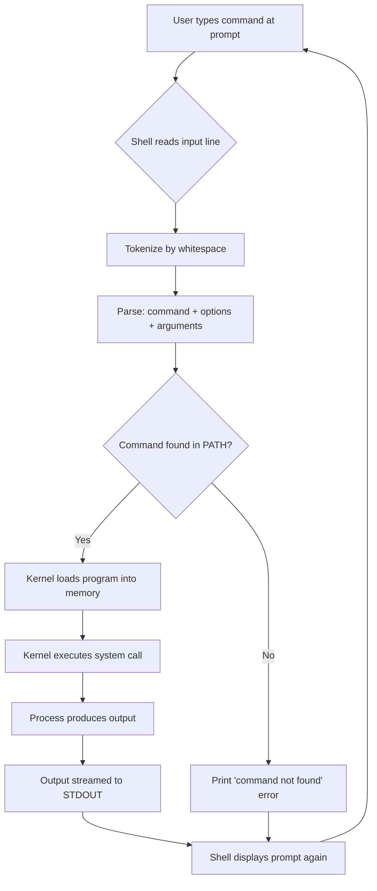
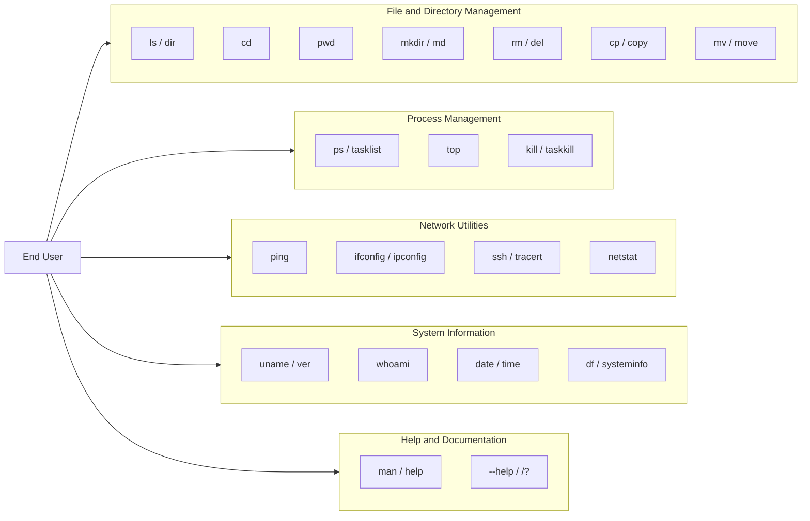
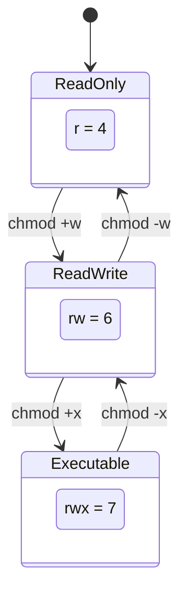

# Basic commands in Linux / Windows

<!-- SECTION_1_START -->
# 1. Core Technical Definition & Intuitive Overview

## 1.1 Formal Definition (KTU 2024 Syllabus Terminology)

**Operating System Commands** are predefined textual instructions typed into a **Command-Line Interface (CLI)** or **Shell** that instruct the operating system's kernel to perform specific system-level operations such as file manipulation, process management, network configuration, and user administration. In the KTU 2024 scheme context, the two most relevant OS environments are **Linux (Unix-based)** and **Windows (NT-based)**, each possessing its own command interpreter (Shell in Linux → *Bash/Zsh*; Windows → *Command Prompt / PowerShell*).

A command generally follows the syntactic structure:

$$
\text{command} \;\; [\text{options}] \;\; [\text{arguments}]
$$

Where **options** (also called *flags*) modify behavior (e.g., `-l`, `-R`) and **arguments** specify the target (e.g., a file or directory name).

> [!IMPORTANT]
> **KTU Syllabus Highlight (Module 3 – Computer System Software):** Students must be able to identify, execute, and explain the functional purpose of at least 20 essential commands across both **Linux** and **Windows** operating systems, including file management, directory navigation, process handling, and basic networking operations.

## 1.2 Intuitive Real-World Analogy

Imagine you walk into a large library with millions of books (your computer's storage). Instead of physically walking to the shelf and pulling out a book yourself, you have a **librarian assistant** standing at a desk. You tell the librarian a short, precise phrase like *"Find all books by author Tolkien"* or *"Move the third shelf of history books to the second floor."* The librarian instantly executes the task.

In this analogy:
- **The library** = Your computer's file system
- **The librarian** = The **Shell** (Command-Line Interpreter)
- **Your short phrase** = The **Command** typed at the prompt
- **The action performed** = The kernel executing the instruction

> [!NOTE]
> A **Shell** is *not* the operating system itself. It is a *program* that acts as a bridge between the user (you) and the kernel (the core of the OS). When you type `ls`, you are talking to the **shell**, which translates your request into a *system call* to the kernel.

## 1.3 Physical Constants & Standard Metrics

| Constant / Metric | Standard Value | Description |
|---|---|---|
| **Default Linux Prompt (Bash)** | `user@hostname:~$` | Indicates user, machine name, and current directory (`~` = home) |
| **Default Windows Prompt (CMD)** | `C:\Users\Username>` | Indicates current drive and working directory |
| **Root Indicator in Linux** | `#` (hash) | Prompt symbol when logged in as **superuser (root)** |
| **Standard User Indicator** | `$` (dollar) | Prompt symbol for normal/standard user |
| **Path Separator (Linux)** | `/` (forward slash) | Used in all Unix-like systems |
| **Path Separator (Windows)** | `\` (backslash) | Used in DOS/Windows systems |
| **Case Sensitivity** | Linux: **Yes**; Windows: **No** | `File.txt` ≠ `file.txt` in Linux |

> [!VISUALIZATION CONTROL]
> **Concept:** Hierarchical File System Tree (Root Structure)
> **Conceptual Sketch:**
> ```
>           /  (Linux Root)              C:\  (Windows Root)
>           |                            |
>     ------+------                ------+------
>    /      |     \                |     |      \
>  home    etc    var           Users  Windows Program Files
>    |                          
>  user (Home Dir)              
>    |                          
>  Documents                   
> ```
> **Visual Description:** Both operating systems organize storage as an *inverted tree* where the topmost directory is called the **root**. Every file and folder has exactly *one parent*, except the root. This tree structure is the navigation map for nearly every file-management command.

---

<!-- SECTION_2_START -->
# 2. Deep Theoretical Analysis & KTU High-Yield Formula Sheet

## 2.1 Conceptual Decomposition: Anatomy of a Command

A command in any CLI is composed of **three logical parts**:

1. **Command Name** – The verb (e.g., `ls`, `cd`, `copy`). This invokes a specific program.
2. **Options / Flags** – Adjectives that modify behavior (e.g., `-l` for "long format", `-a` for "all").
3. **Arguments** – The nouns (e.g., `/home/user/Documents`) that specify *what* the command acts upon.

### Why this structure exists
The **"Why"**: CLIs predate GUIs. They were designed for **speed, precision, and automation** (scripting). A single command can replace many mouse-clicks. The **"How"**: The shell reads the input → splits it by spaces → looks up the command in its `PATH` environment variable → loads the program into memory → passes options/arguments → kernel executes the system call → output is streamed back to the terminal.

## 2.2 Classification of Basic OS Commands

Commands are grouped into functional categories. The KTU 2024 scheme specifically tests the following **seven categories**:

| Category | Linux Commands | Windows Commands |
|---|---|---|
| **Directory Navigation** | `pwd`, `cd`, `ls` | `cd`, `dir`, `tree` |
| **File/Directory Creation** | `touch`, `mkdir` | `mkdir`, `echo >`, `type nul >` |
| **File/Directory Deletion** | `rm`, `rmdir` | `del`, `rmdir` |
| **Copy & Move** | `cp`, `mv` | `copy`, `move`, `xcopy` |
| **File Viewing** | `cat`, `more`, `less`, `head`, `tail` | `type`, `more` |
| **Process Management** | `ps`, `top`, `kill` | `tasklist`, `taskkill` |
| **Network Utilities** | `ping`, `ifconfig`, `ip addr`, `curl` | `ping`, `ipconfig`, `tracert` |
| **Help / Info** | `man`, `--help`, `info` | `help`, `/?` |
| **System Info** | `uname -a`, `whoami`, `date` | `ver`, `systeminfo`, `date`, `time` |

## 2.3 KTU Formula Sheet (Cheat Sheet)

> [!NOTE]
> The "formulas" below are the **universal patterns** that govern command syntax across all CLI environments. Memorize these patterns — KTU board exams frequently test them via "Predict the Output" type questions.

| Pattern / Rule | Symbolic Form | Meaning |
|---|---|---|
| **Command Syntax Template** | `cmd [opts] [args]` | Universal structure: name → options → arguments |
| **Wildcard (Single Character)** | `?` (Win) / `?` (Linux) | Matches *exactly one* character |
| **Wildcard (Multiple Characters)** | `*` (both) | Matches *zero or more* characters |
| **Absolute Path Formula** | Starts from root | Linux: `/home/user/file.txt`; Win: `C:\Users\file.txt` |
| **Relative Path Formula** | From `pwd` | `../docs/notes.txt` means "go up one, then into docs" |
| **Home Directory Alias** | `~` (Linux), `%USERPROFILE%` (Win) | Shortcut to current user's home |
| **Parent Directory** | `..` | Reference to the directory one level above |
| **Current Directory** | `.` | Reference to the directory you are in |
| **Pipe Operator** | `\|` | Send output of one command as input to the next |
| **Redirection (output)** | `>`, `>>` | Overwrite / append output to a file |
| **Redirection (input)** | `<` | Read input from a file |

## 2.4 Real-World Engineering Utility

| Field | Application of CLI Commands |
|---|---|
| **DevOps & Cloud Engineering** | Deploying and managing servers on AWS, Azure, GCP via SSH + Linux commands |
| **Cybersecurity** | Penetration testing, log analysis, file forensics using `grep`, `find`, `nmap` |
| **Data Engineering** | ETL pipelines triggered by `cron` jobs using shell scripts |
| **Web Development** | Git version control, `npm` package management, `curl` API testing |
| **Embedded Systems / IoT** | Raspberry Pi and Arduino interactions use Linux commands exclusively |
| **Database Administration** | MySQL/PostgreSQL `psql` interfaces are pure CLIs |

> [!IMPORTANT]
> **Engineering Insight:** Modern **CI/CD pipelines** (Continuous Integration / Continuous Deployment) used by companies like Google, Netflix, and Infosys are **100% automated via CLI commands and shell scripts**. There is no human clicking a mouse. Mastering these commands is foundational for any software engineering career.

---

<!-- SECTION_3_START -->
# 3. Step-by-Step Derivations, Code & Symbolic Implementation

## 3.1 Linux Commands: Exhaustive Walkthrough

> [!NOTE]
> The following examples use the prompt `~$` to indicate a standard user shell. The `%` symbol in code blocks is the shell continuation prompt for multi-line input and is **not** part of the command.

### 3.1.1 Directory Navigation Commands

**Step 1 — `pwd` (Print Working Directory)**
Tells you *where you are* in the file system hierarchy.

```bash
~$ pwd
/home/student/Documents
```

**Output derivation:** The shell reads `pwd`, locates the program at `/bin/pwd`, executes it, and the kernel returns the absolute path of the current *inode* (directory entry) the user is in.

**Step 2 — `ls` (List directory contents)**

```bash
~$ ls                  # List files in current directory
~$ ls -l               # Long format (permissions, size, date)
~$ ls -a               # Show hidden files (starting with .)
~$ ls -la              # Combine: long format + all files
```

Sample output of `ls -l`:
```
drwxr-xr-x  2 student student 4096 Aug 14 10:23 Projects
-rw-r--r--  1 student student 2048 Aug 14 10:25 notes.txt
```

The 10-character string `drwxr-xr-x` decomposes as:
- Position 1 → `d` = directory, `-` = regular file
- Positions 2-4 → `rwx` = owner permissions (read, write, execute)
- Positions 5-7 → `r-x` = group permissions
- Positions 8-10 → `r-x` = others permissions

**Step 3 — `cd` (Change Directory)**

```bash
~$ cd /home/student/Documents    # Absolute path
~$ cd Projects                  # Relative path (go into Projects)
~$ cd ..                        # Go up one level
~$ cd ~                         # Go to home directory
~$ cd -                         # Go to previous directory
```

### 3.1.2 File and Directory Management

**Step 4 — `mkdir` and `rmdir`**

```bash
~$ mkdir test_folder              # Create single directory
~$ mkdir -p a/b/c/d               # Create nested directories (-p = parents)
~$ rmdir empty_folder             # Remove EMPTY directory only
```

**Why `rmdir` fails on non-empty folders:** It is a safety feature. To delete a folder *with* contents, you must use `rm -r` (recursive).

**Step 5 — `touch`, `cp`, `mv`, `rm`**

```bash
~$ touch newfile.txt              # Create empty file / update timestamp
~$ cp source.txt backup.txt       # Copy file
~$ cp -r folder1/ folder2/        # Copy directory recursively
~$ mv oldname.txt newname.txt     # Rename file
~$ mv file.txt ~/Documents/       # Move file to another directory
~$ rm unwanted.txt                # Delete file (irreversible)
~$ rm -rf stubborn_folder         # Force-remove directory recursively
```

> [!WARNING]
> `rm -rf /` will **delete the entire operating system** in Linux. There is no Recycle Bin in the CLI. Always double-check the path before pressing Enter.

### 3.1.3 File Viewing Commands

**Step 6 — `cat`, `less`, `more`, `head`, `tail`**

```bash
~$ cat notes.txt                  # Print entire file to terminal
~$ cat -n notes.txt               # With line numbers
~$ less longfile.txt              # Paginated viewer (q to quit)
~$ more longfile.txt              # Older paginator
~$ head -n 5 data.csv             # First 5 lines
~$ tail -n 20 logfile.log         # Last 20 lines
~$ tail -f /var/log/syslog        # Follow log in real-time
```

**Step 7 — `grep` (Global Regular Expression Print) — Pattern Search**

```bash
~$ grep "error" logfile.txt             # Find lines containing "error"
~$ grep -i "error" logfile.txt          # Case-insensitive
~$ grep -r "TODO" ~/Projects/           # Recursive search in directory
~$ grep -n "function" script.py         # Show line numbers
~$ ps aux | grep "python"               # Pipe: combine with process list
```

The `|` (pipe) operator is critical: it takes the **stdout** of the left command and feeds it as **stdin** to the right command.

### 3.1.4 Process & System Commands

**Step 8 — `ps`, `top`, `kill`**

```bash
~$ ps aux                          # All running processes (BSD style)
~$ top                             # Real-time interactive process viewer
~$ kill 1234                       # Send SIGTERM to PID 1234
~$ kill -9 1234                    # Force-kill (SIGKILL)
~$ pkill firefox                   # Kill by name
```

PID = **Process Identifier**, a unique integer assigned by the kernel to each running program.

**Step 9 — `chmod` (Change Mode / Permissions)**

The permission bits are mapped to numeric values:
$$
r = 4, \quad w = 2, \quad x = 1
$$

Sum the values for each class (owner, group, others):

```bash
~$ chmod 755 script.sh    # rwxr-xr-x (owner: all, others: read+execute)
~$ chmod 644 file.txt     # rw-r--r-- (owner: read+write, others: read only)
~$ chmod +x script.sh     # Add execute permission
```

**Derivation for `755`:**
- Owner: $7 = 4 + 2 + 1 \rightarrow rwx$
- Group: $5 = 4 + 0 + 1 \rightarrow r-x$
- Others: $5 = 4 + 0 + 1 \rightarrow r-x$

### 3.1.5 Network Commands

```bash
~$ ping google.com                  # Test connectivity
~$ ping -c 4 google.com             # Send exactly 4 packets (Linux)
~$ ifconfig                         # Old: show network interfaces
~$ ip addr show                     # New: show IP addresses
~$ curl https://api.example.com     # Fetch web data
~$ wget https://example.com/file.zip # Download a file
~$ netstat -tuln                    # Show listening ports
~$ ssh user@192.168.1.10            # Secure remote login
```

### 3.1.6 System Information & Help

```bash
~$ uname -a                         # Kernel version & architecture
~$ whoami                           # Current user
~$ hostname                         # Machine name
~$ date                             # Current date/time
~$ cal                              # Calendar of current month
~$ df -h                            # Disk space (human-readable)
~$ du -sh ~/Documents               # Size of directory
~$ man ls                           # Manual page for 'ls'
~$ ls --help                        # Quick help
```

### 3.1.7 Package Management (Linux Distributions Vary)

```bash
# Debian/Ubuntu (uses apt)
~$ sudo apt update                  # Refresh package list
~$ sudo apt install python3         # Install software
~$ sudo apt remove vim              # Uninstall

# Red Hat/Fedora (uses yum / dnf)
~$ sudo yum install git
~$ sudo dnf update
```

`sudo` = **"Superuser Do"** — temporarily elevates privileges to root for one command.

## 3.2 Windows Commands (CMD / Command Prompt)

> [!NOTE]
> Windows commands are **case-insensitive** (unlike Linux). The examples below are run inside `cmd.exe` (Command Prompt). PowerShell uses similar but more powerful verb-noun syntax (e.g., `Get-Process`).

### 3.2.1 Directory & File Commands

```cmd
C:\Users\Student> cd Desktop
C:\Users\Student\Desktop> dir                  :: List directory contents
C:\Users\Student\Desktop> dir /a               :: Include hidden/system files
C:\Users\Student\Desktop> dir *.txt            :: List only .txt files
C:\Users\Student\Desktop> md newfolder         :: Make directory
C:\Users\Student\Desktop> rd emptyfolder       :: Remove empty directory
C:\Users\Student\Desktop> rd /s /q fullfolder  :: Remove directory tree (quiet)
C:\Users\Student\Desktop> type notes.txt       :: Display file contents
C:\Users\Student\Desktop> more longfile.txt    :: Paginated display
```

### 3.2.2 File Operations

```cmd
C:\Users\Student\Desktop> copy file.txt backup.txt
C:\Users\Student\Desktop> copy *.txt D:\Backup\
C:\Users\Student\Desktop> move old.txt new.txt
C:\Users\Student\Desktop> del unwanted.txt
C:\Users\Student\Desktop> del /f /q *.tmp      :: Force delete .tmp files
C:\Users\Student\Desktop> xcopy folder1 folder2 /E /I
                                            :: /E = all subfolders, /I = assume target is dir
C:\Users\Student\Desktop> ren oldname.txt newname.txt
```

### 3.2.3 Process & Network Commands

```cmd
C:\> tasklist                       :: List all running processes
C:\> taskkill /PID 1234 /F          :: Force-kill process 1234
C:\> ipconfig                       :: Show IP configuration
C:\> ipconfig /all                  :: Detailed network info
C:\> ipconfig /release              :: Release DHCP lease
C:\> ipconfig /renew                :: Request new IP from DHCP
C:\> ping 8.8.8.8                   :: Test connectivity to Google DNS
C:\> tracert google.com             :: Trace route hops
C:\> nslookup google.com            :: DNS lookup
C:\> netstat -an                    :: Show all connections & ports
C:\> systeminfo                     :: Detailed OS & hardware info
```

### 3.2.4 System & Help Commands

```cmd
C:\> ver                            :: Windows version
C:\> cls                            :: Clear screen
C:\> date                           :: Show/set date
C:\> time                           :: Show/set time
C:\> help                           :: List all available commands
C:\> copy /?                        :: Help for a specific command
C:\> echo Hello World               :: Print text
C:\> set                            :: Show environment variables
C:\> path                           :: Show executable search path
C:\> whoami                         :: Current user
C:\> exit                           :: Close Command Prompt
```

## 3.3 Linux vs. Windows — Master Comparison Table

| Operation | Linux Command | Windows Command | Notes |
|---|---|---|---|
| List files | `ls` | `dir` | `ls` supports many more flags |
| Change directory | `cd` | `cd` | Same name, different syntax |
| Print working dir | `pwd` | `cd` (no args) | Windows quirk: bare `cd` shows current path |
| Clear screen | `clear` | `cls` | |
| Make directory | `mkdir` | `mkdir` or `md` | |
| Remove directory | `rmdir` / `rm -r` | `rmdir` / `rd /s` | |
| Copy file | `cp` | `copy` or `xcopy` | |
| Move/Rename | `mv` | `move` / `ren` | |
| Delete file | `rm` | `del` or `erase` | |
| View file | `cat`, `less` | `type`, `more` | |
| Show IP address | `ifconfig` / `ip addr` | `ipconfig` | |
| List processes | `ps`, `top` | `tasklist` | |
| Kill process | `kill PID` | `taskkill /PID` | |
| Find file | `find`, `locate` | `where`, `dir /s` | |
| Search text | `grep` | `findstr` | |
| Show OS version | `uname -a` | `ver`, `systeminfo` | |
| Help | `man cmd`, `cmd --help` | `help`, `cmd /?` | |
| Path separator | `/` | `\` | Most critical difference! |

## 3.4 Python Implementation: Automating OS Commands

The `os` and `subprocess` modules in Python allow programmatic execution of shell commands — a core DevOps skill.

```python
import os
import subprocess
import platform
import logging
from typing import List, Tuple

# Configure logging for error traceability
logging.basicConfig(level=logging.INFO, format='%(asctime)s - %(levelname)s - %(message)s')
logger = logging.getLogger(__name__)


def detect_os() -> str:
    """Return 'linux' or 'windows' based on the host system."""
    system = platform.system().lower()
    if system == "linux":
        return "linux"
    elif system == "windows":
        return "windows"
    else:
        logger.warning(f"Unsupported OS detected: {system}")
        return system


def run_command(command: List[str]) -> Tuple[int, str, str]:
    """
    Execute a shell command safely and return (returncode, stdout, stderr).
    Args:
        command: A list of command tokens, e.g. ['ls', '-la']
    Returns:
        A tuple containing the return code, standard output, and standard error.
    """
    try:
        result = subprocess.run(
            command,
            capture_output=True,
            text=True,
            check=False,
            timeout=10  # Safety: kill any command that hangs > 10 seconds
        )
        if result.returncode != 0:
            logger.error(f"Command failed: {' '.join(command)} | Error: {result.stderr.strip()}")
        else:
            logger.info(f"Command succeeded: {' '.join(command)}")
        return result.returncode, result.stdout.strip(), result.stderr.strip()
    except FileNotFoundError as fnf:
        logger.exception(f"Command not found: {command}")
        return 127, "", str(fnf)
    except subprocess.TimeoutExpired as toe:
        logger.exception(f"Command timed out: {command}")
        return 124, "", str(toe)
    except Exception as e:
        logger.exception(f"Unexpected error running: {command}")
        return 1, "", str(e)


def list_files_demo() -> None:
    """Cross-platform directory listing demonstration."""
    os_type = detect_os()
    if os_type == "linux":
        code, out, err = run_command(["ls", "-la"])
    else:
        code, out, err = run_command(["dir"])
    print(f"\n--- Directory Listing (exit code {code}) ---")
    print(out if out else err)


def get_ip_demo() -> None:
    """Cross-platform IP address retrieval."""
    os_type = detect_os()
    if os_type == "linux":
        code, out, err = run_command(["ip", "addr", "show"])
    else:
        code, out, err = run_command(["ipconfig"])
    print(f"\n--- Network Configuration (exit code {code}) ---")
    print(out if out else err)


if __name__ == "__main__":
    list_files_demo()
    get_ip_demo()
```

**Output on Linux:**
```
2025-08-14 10:30:01 - INFO - Command succeeded: ls -la
2025-08-14 10:30:01 - INFO - Command succeeded: ip addr show
--- Directory Listing (exit code 0) ---
total 24
drwxr-xr-x  5 student student 4096 Aug 14 10:00 .
drwxr-xr-x 18 student student 4096 Aug 14 09:30 ..
-rw-r--r--  1 student student 1024 Aug 14 10:00 notes.txt
--- Network Configuration (exit code 0) ---
2: enp0s3: <BROADCAST,MULTICAST,UP,LOWER_UP> ...
    inet 192.168.1.42/24 brd 192.168.1.255 scope global dynamic noprefixroute enp0s3
```

---

<!-- SECTION_4_START -->
# 4. Structural Diagrams & Schematics

## 4.1 Command Execution Flow (Mermaid Flowchart)



**Interpretation:** The flowchart maps the *complete life-cycle* of a single command from keystroke to result. Notice the error-handling path: if the command is not in `$PATH`, the shell *does not crash* — it returns a non-zero exit code and prints an error. This is what makes Unix systems "robust by design."

## 4.2 Command Classification Architecture (Mermaid Block Diagram)



**Interpretation:** This modular architecture groups the ~30 essential commands into **five decoupled clusters**. KTU examiners often ask "Categorize the following commands..." — this map is the canonical answer.

## 4.3 File System Permission Model (Mermaid State Diagram)



**Interpretation:** Files transition between three permission states. The numerical values ($4$, $6$, $7$) come from the additive formula:
$$
\text{Permission} = 4 \cdot r + 2 \cdot w + 1 \cdot x
$$
where each letter is $1$ if present, $0$ if absent.

---

<!-- SECTION_5_START -->
# 5. KTU 2024 Scheme Examination Question Bank & Topic Recap

## 5.1 Part A — Short Answer Questions (3 Marks Each)

### Question 1: `[KTU University Exam - July 2024]`
**Explain the difference between absolute and relative paths in a Linux file system. Give one example of each.** **[CO1, Understand]**

**Model Answer:**

An **absolute path** specifies the location of a file or directory starting from the **root directory** (`/`). It is *complete* and *unambiguous* — it works regardless of the current working directory.

A **relative path** specifies the location *relative to the current working directory* (`pwd`). It uses special symbols like `.` (current) and `..` (parent).

| Type | Example | Meaning |
|---|---|---|
| Absolute | `/home/student/Documents/notes.txt` | Starts from root, always valid |
| Relative | `../Downloads/file.zip` | Depends on `pwd`; go up one, then into Downloads |

If `pwd` is `/home/student/Documents`, then `../Downloads/file.zip` resolves to `/home/student/Downloads/file.zip`.

> **Valuation Key:** [Definition of absolute: 1 Mark] [Definition of relative: 1 Mark] [One example each: 1 Mark]

---

### Question 2: `[KTU University Exam - Dec 2023]`
**List any three differences between the `cp` command in Linux and the `copy` command in Windows.** **[CO1, Remember]**

**Model Answer:**

| # | Linux `cp` | Windows `copy` |
|---|---|---|
| 1 | Case-sensitive: `File.txt` and `file.txt` are different | Case-insensitive: both refer to the same file |
| 2 | Uses forward slash `/` in paths (e.g., `cp a.txt /home/b/`) | Uses backslash `\` in paths (e.g., `copy a.txt C:\Users\b\`) |
| 3 | Recursive copy of directories requires `cp -r` | Requires the separate `xcopy` or `robocopy` command for folders |
| 4 | Can use wildcards natively: `cp *.txt /dest/` | Wildcards supported: `copy *.txt D:\dest\` |
| 5 | Single-letter options: `cp -i -v file backup` | Slash-options: `copy /Y /V file backup` |

> **Valuation Key:** [Any 3 valid differences with correct examples: 3 Marks]

---

## 5.2 Part B — Long Answer Questions (14 Marks Each — Internal Choice)

> [!IMPORTANT]
> As per KTU 2024 ESE pattern, Part B questions carry **14 marks** with internal choice. Each sub-part carries **7 marks**. Below, Question A and Question B are independent alternatives — the student answers *either* A *or* B.

---

### **Question A (14 Marks):** `[KTU University Exam - July 2024]`

**(a)** With neat examples, explain the following Linux commands and state their purpose: `pwd`, `ls -la`, `mkdir -p`, `rm -rf`, `cat`. **[CO1, CO2 | Understand — 7 Marks]**

**(b)** Write the equivalent Windows commands for the above five Linux commands and tabulate the differences in syntax, options, and path separators. **[CO3, Apply — 7 Marks]**

#### Model Solution for Part (a):

**1. `pwd` (Print Working Directory)**
```bash
~$ pwd
/home/student/Desktop
```
*Purpose:* Displays the absolute path of the current directory the user is in.
**[Defining pwd and stating purpose: 1 Mark]**
**[Sample output: 1 Mark]**

**2. `ls -la`**
```bash
~$ ls -la
drwxr-xr-x  2 student student 4096 Aug 14 10:23 .
drwxr-xr-x 18 student student 4096 Aug 14 09:30 ..
-rw-r--r--  1 student student 2048 Aug 14 10:25 notes.txt
```
*Purpose:* Lists all files (including hidden ones starting with `.`) in long format, showing permissions, owner, size, and modification date.
*Option breakdown:* `-l` = long format; `-a` = all files including hidden.
**[Identifying options: 1 Mark]**
**[Explaining output columns: 1 Mark]**

**3. `mkdir -p`**
```bash
~$ mkdir -p projects/2025/august
```
*Purpose:* Creates a directory and all parent directories as needed. Without `-p`, the command would fail if `projects/` does not already exist.
**[Function of -p flag: 1 Mark]**

**4. `rm -rf`**
```bash
~$ rm -rf old_projects
```
*Purpose:* Forcefully (`-f`) and recursively (`-r`) deletes a directory and *all its contents without prompting*.
*Warning:* Extremely dangerous; `rm -rf /` can destroy the OS.
**[Meaning of -r and -f: 1 Mark]**

**5. `cat`**
```bash
~$ cat notes.txt
This is the content of the file.
```
*Purpose:* Concatenates and displays the entire contents of a file to the terminal.
**[Definition and use: 1 Mark]**

---

#### Model Solution for Part (b):

| Linux Command | Windows Equivalent | Syntax Difference | Path Separator | Option Style |
|---|---|---|---|---|
| `pwd` | `cd` (with no args) | Linux always uses `pwd`; Windows uses bare `cd` | `/` vs `\` | No flags needed |
| `ls -la` | `dir /a` | `-la` replaced by `/a` (show all) | N/A | Single `-` vs `/` prefix |
| `mkdir -p a/b/c` | `mkdir a\b\c` | `-p` is implicit in Windows `mkdir` | `/` → `\` | Flag style differs |
| `rm -rf folder` | `rd /s /q folder` | `-rf` → `/s /q` | `/` → `\` | Slash-options |
| `cat file.txt` | `type file.txt` | Direct name change | `/` → `\` | No flags needed |

**Key Observations to write in exam:**
1. Linux uses `-` for options, Windows uses `/` for options.
2. Linux uses `/` for paths, Windows uses `\` for paths.
3. Linux is case-sensitive; Windows is case-insensitive.
4. Windows `mkdir` creates intermediate directories by default; Linux needs `-p`.
5. Linux `rm -rf` is a single command; Windows needs `rd /s /q`.

**[Creating the table with 5 rows: 3 Marks]**
**[Stating the 3 key observations: 2 Marks]**
**[Correct Windows syntax for each: 2 Marks]**

> [!WARNING]
> **KTU Examiner's Valuation Pitfall:** A common mistake students make is writing the Windows path with forward slashes (e.g., `C:/Users/test`). While Windows often *tolerates* this, in **CMD it is non-standard and may fail in batch scripts**. Always use backslashes `\` in Windows answers to score full marks.

---

### **Question B (14 Marks):** `[KTU University Exam - Dec 2023]`

**(a)** Explain the concept of file permissions in Linux. With reference to the `chmod` command, compute the numerical (octal) representation for the permission string `rwxr-x--x`. **[CO2, Apply — 7 Marks]**

**(b)** Write short notes on the following Linux/Windows commands and give one example of each: `grep`, `ps`, `kill`, `tasklist`, `ipconfig`, `tracert`, `ping`. **[CO3, Understand — 7 Marks]**

#### Model Solution for Part (a):

**Concept of File Permissions in Linux:**

Every file or directory in Linux has three sets of permissions for three categories of users:
1. **Owner (User / `u`)** — The creator of the file.
2. **Group (`g`)** — A set of users who share access.
3. **Others (`o`)** — Everyone else on the system.

Each category can be granted three permission types:
- **Read (`r`)** = numeric value $4$ — view contents
- **Write (`w`)** = numeric value $2$ — modify contents
- **Execute (`x`)** = numeric value $1$ — run as program

The `chmod` (change mode) command uses the **octal (base-8) additive** system:

$$
P_{\text{octal}} = 4 \cdot r + 2 \cdot w + 1 \cdot x
$$

**[Concept explanation with 3 categories × 3 permissions: 3 Marks]**

**Numerical Computation for `rwxr-x--x`:**

Decompose the string into three triplets:

| Position | Triplet | Letters Present | Calculation | Value |
|---|---|---|---|---|
| Owner (1st) | `rwx` | $r=1, w=1, x=1$ | $4(1) + 2(1) + 1(1)$ | $7$ |
| Group (2nd) | `r-x` | $r=1, w=0, x=1$ | $4(1) + 2(0) + 1(1)$ | $5$ |
| Others (3rd) | `--x` | $r=0, w=0, x=1$ | $4(0) + 2(0) + 1(1)$ | $1$ |

**Final octal value: $751$**

The corresponding command would be:
```bash
~$ chmod 751 myfile.sh
```

**[Identifying three triplets: 2 Marks]**
**[Computing each value with formula: 1 Mark]**
**[Final answer 751 with command: 1 Mark]**

---

#### Model Solution for Part (b):

**1. `grep` (Linux) — Global Regular Expression Print**
Searches for a pattern in text/files.
```bash
~$ grep -i "error" /var/log/syslog
```
*Finds lines containing "error" (case-insensitive) in the system log.*

**2. `ps` (Linux) — Process Status**
Displays currently running processes.
```bash
~$ ps aux | grep "python"
```
*Lists all processes and filters for Python ones via pipe.*

**3. `kill` (Linux) — Terminate Process**
Sends a signal to a process identified by PID.
```bash
~$ kill -9 4321
```
*Force-kills process with PID 4321 (`-9` = SIGKILL).*

**4. `tasklist` (Windows) — Task List**
Lists all running processes in Windows.
```cmd
C:\> tasklist /v
```
*Shows verbose information about all processes.*

**5. `ipconfig` (Windows) — IP Configuration**
Displays network adapter settings.
```cmd
C:\> ipconfig /all
```
*Shows full TCP/IP configuration including MAC address, DNS, DHCP status.*

**6. `tracert` (Windows) — Trace Route**
Shows the path packets take to reach a destination.
```cmd
C:\> tracert www.google.com
```
*Displays each router hop with response times.*

**7. `ping` (Both Linux & Windows) — Test Connectivity**
Sends ICMP echo requests to verify host reachability.
```bash
~$ ping -c 4 8.8.8.8          # Linux: 4 packets
C:\> ping 8.8.8.8              # Windows: 4 packets (default)
```

**[Each command: 0.5 Mark for explanation + 0.5 Mark for example = 7 Marks total]**

> [!WARNING]
> **KTU Examiner's Valuation Pitfall:** Students frequently write `ping` is used to *download* files or *browse websites*. It is **NOT**. `ping` only verifies whether the destination host is reachable and measures round-trip time. No data is transferred. Confusing `ping` with `curl`/`wget` will cost you the mark.

---

## 5.3 Topic Recap & Important Things to Remember

> [!NOTE]
> This is your **last-15-minute revision checklist** before walking into the KTU exam hall. Skim through these bullets — if you can recall each, you are exam-ready.

- ✅ A **command** = `command_name [options] [arguments]`. This is the universal syntax across all CLI shells.
- ✅ The **Shell** is the program that *interprets* commands; the **Kernel** is the OS core that *executes* them.
- ✅ **Linux is case-sensitive**; **Windows is case-insensitive**. This is a guaranteed question.
- ✅ **Path separator:** Linux uses `/`; Windows uses `\`. Mixing them is a common mistake.
- ✅ **`pwd`** = print working directory; **`cd`** = change directory; **`ls`/`dir`** = list files.
- ✅ **`mkdir -p`** creates nested directories in Linux; in Windows, `mkdir` does it by default.
- ✅ **`rm -rf`** = recursive force-delete. **Never run `rm -rf /` or `rm -rf /*`** — it destroys the OS.
- ✅ **`cp -r`** = copy directory recursively; **`mv`** = move or rename; **`cat`/`type`** = view file content.
- ✅ **`grep`** searches text using **regular expressions**; it is the most powerful Linux search tool.
- ✅ File permissions follow the formula: $\text{octal} = 4r + 2w + 1x$ for each of owner, group, others.
- ✅ **`chmod 755`** is the most common web-server permission: owner has all, others can read+execute.
- ✅ **Process management:** Linux uses `ps`/`top`/`kill`; Windows uses `tasklist`/`taskkill`.
- ✅ **Networking:** Linux uses `ifconfig` or `ip addr`; Windows uses `ipconfig`. Both use `ping` identically.
- ✅ **`sudo`** elevates a single command to root privileges in Linux; Windows uses "Run as Administrator".
- ✅ **Pipes (`|`)** chain commands: output of left → input of right. Example: `cat file.txt | grep "error"`.
- ✅ **Redirections:** `>` overwrites a file with output; `>>` appends; `<` reads input from a file.
- ✅ **Wildcards:** `*` matches any string; `?` matches exactly one character. Same in both OSes.
- ✅ **Help commands:** Linux → `man cmd` or `cmd --help`; Windows → `help` or `cmd /?`.
- ✅ **`df -h`** shows disk space (Linux); **`systeminfo`** shows full system details (Windows).
- ✅ **Environment variables:** Linux uses `$VAR` (e.g., `$HOME`); Windows uses `%VAR%` (e.g., `%USERPROFILE%`).
- ✅ Always remember the **KFU (Know-Find-Use)** framework: *Know* the command exists, *Find* its syntax via help, *Use* it carefully.

---

> **End of Module 3 — Basic Commands in Linux / Windows Notes**  
> *Prepared per KTU 2024 Scheme (NEP 2020 Aligned) | B.Tech Foundations of Computing*
<!-- SECTION_5_END -->
