# Basics of IP addresses, DHCP, NAT, Network Security (Desktop & Perimeter), DNS, VPN, Routers, Client-Server, Internet, WWW, Web servers.

<!-- SECTION_1_START -->

# Foundations of Computing: Computer System Software & Networking

## 1.1 Introduction to Computer Networks and the Internet

A **computer network** is a system of interconnected computing devices that share resources and data using common communication protocols over physical or wireless media. The **Internet** is the largest example of a network-of-networks, while the **World Wide Web (WWW)** is a service that runs on top of the Internet, allowing hypertext-based information retrieval.

> [!NOTE]
> **Internet $\neq$ WWW** — The Internet is the *infrastructure* (cables, routers, servers). The WWW is the *service* (web pages, browsers, HTTP). Email (SMTP) and File Transfer (FTP) are also Internet services but are *not* part of the WWW.

## 1.2 IP Addressing — The Digital Postal Address

**Definition:** An **IP (Internet Protocol) address** is a unique numerical label (logical address) assigned to every device participating in a computer network that uses the Internet Protocol for communication.

- **IPv4** uses **32 bits**, written as four decimal octets: $O_1.O_2.O_3.O_4$ where $O_i \in [0, 255]$.
- **IPv6** uses **128 bits**, written in eight groups of four hexadecimal digits.

> [!IMPORTANT]
> Total IPv4 addresses $= 2^{32} = 4{,}294{,}967{,}296$ (≈ 4.3 billion). Due to exhaustion, IPv6 was introduced with $2^{128}$ addresses.

> **Conceptual Analogy:** Think of an IP address as a *house number and street name* on a postal envelope. Without it, a letter (data packet) cannot be routed to the correct recipient. The **MAC address** is the person's *name*, while the **IP address** is the *physical mailing address* — both are needed, but at different layers.

> [!VISUALIZATION CONTROL]
> **Concept:** IPv4 Class Range Visualization (First Octet Number Line)
> **Desmos Input Equations:**
> * `ClassA: 0 \le x \le 127`
> * `ClassB: 128 \le x \le 191`
> * `ClassC: 192 \le x \le 223`
> * `ClassD: 224 \le x \le 239` (Multicast)
> * `ClassE: 240 \le x \le 255` (Experimental)
> **Visual Description:** Students should observe that the 8-bit first octet (0–255) is partitioned into 5 horizontal bands corresponding to the legacy classful addressing scheme. Note the reserved gap around **127.x.x.x** (loopback).

## 1.3 DHCP — The Automatic IP Butler

**Definition:** **Dynamic Host Configuration Protocol (DHCP)** is a client–server network management protocol (UDP ports 67/68) that dynamically assigns IP addresses, subnet masks, default gateways, and DNS servers to devices automatically.

> **Conceptual Analogy:** Imagine a hotel front desk. When you walk in (connect to the network), the receptionist (DHCP server) checks available rooms (IP pool), hands you a key card (lease) for room #203 (IP 192.168.1.50), valid for two nights (lease time). You don't need to know which room you'll get — it's assigned automatically.

> [!NOTE]
> DHCP eliminates the manual burden of static IP configuration, prevents IP conflicts, and simplifies large-scale network administration.

## 1.4 NAT — The Office Receptionist

**Definition:** **Network Address Translation (NAT)** is a method of remapping one or more private (non-routable) IP addresses into public (routable) IP addresses by modifying network address information in packet headers while in transit through a router or firewall.

> **Conceptual Analogy:** Consider a large company where employees have *internal extension numbers* (e.g., 101, 102, 103) and a single main reception number (e.g., 0484-2555010). When an employee calls a client, only the main number shows on the caller ID. The receptionist (NAT router) keeps a *logbook* mapping which extension made the call, so the client can call back. The client never knows the employee's internal number. NAT works the same way — many devices share one public IP.

> [!IMPORTANT]
> **RFC 1918 Private Address Ranges** (never routed on the public Internet):
> * $10.0.0.0/8$
> * $172.16.0.0/12$
> * $192.168.0.0/16$

## 1.5 Network Security — The Castle Defense

**Definition:** **Network Security** encompasses the policies, practices, and tools designed to protect the integrity, confidentiality, and availability of computer networks and data. It operates in two complementary domains: **Desktop (Host) Security** and **Perimeter Security**.

> **Conceptual Analogy:** A medieval castle's defense: The **perimeter** is the moat, drawbridge, and outer walls — it stops attackers before they enter. The **desktop (host) security** is the locked chest, the guards inside, and the king's sword — it protects the king (your data) even if the perimeter is breached. Together, they form a **defense-in-depth** strategy.

- **Perimeter Security:** Firewalls, IDS/IPS, DMZ, VPN gateways, ACLs.
- **Desktop Security:** Antivirus, host firewalls, OS patches, MFA, disk encryption.

## 1.6 DNS — The Internet's Phone Book

**Definition:** The **Domain Name System (DNS)** is a hierarchical, decentralized naming system that translates human-readable domain names (e.g., `www.ktu.ac.in`) into machine-readable IP addresses (e.g., `103.241.136.5`).

> **Conceptual Analogy:** You remember your friend *Rohit Sharma* by name, but the post office needs his *postal code* to deliver a letter. DNS is the directory that translates names into codes. Without DNS, you'd have to memorize the IP address of every website — an impossible task.

> [!NOTE]
> DNS uses **port 53** (UDP for queries, TCP for zone transfers). It operates as a distributed database across millions of name servers worldwide.

## 1.7 VPN — The Secret Underground Tunnel

**Definition:** A **Virtual Private Network (VPN)** extends a private network across a public network, enabling users to send and receive data as if their devices were directly connected to the private network — by creating an encrypted tunnel through the Internet.

> **Conceptual Analogy:** Imagine you need to walk from your house to a bank vault across a crowded public square. If you walk normally, anyone can see what you're carrying. A VPN is like an *invisible underground tunnel* that only you and the bank know about — you walk privately through public space. Anyone watching the surface sees nothing.

## 1.8 Routers — The Traffic Police of Networks

**Definition:** A **Router** is a Layer 3 (Network Layer) device that forwards data packets between computer networks, directing traffic based on IP addresses and a routing table.

> **Conceptual Analogy:** Think of routers as *highway toll booths with traffic controllers*. Each toll booth looks at the *destination address* on your car's GPS and directs you to the correct exit. Routers use **routing tables** (like a road map) to make these decisions.

## 1.9 Client–Server Architecture — The Restaurant Model

**Definition:** In **Client–Server architecture**, the workload is partitioned between *service providers* (servers) and *service requesters* (clients). The client initiates requests, and the server responds with the requested resource or service.

> **Conceptual Analogy:** A *restaurant*. The **customer (client)** places an order, and the **waiter (server)** brings the food from the kitchen. The customer never enters the kitchen; the waiter handles all communication.

## 1.10 Web Servers — Serving Web Pages

**Definition:** A **Web Server** is a software/hardware system that stores, processes, and delivers web pages to clients over HTTP/HTTPS. Examples: **Apache HTTP Server**, **Nginx**, **Microsoft IIS**.

> **Conceptual Analogy:** A web server is a *librarian* who, when asked for a specific book (web page), retrieves it from the back shelves (file system) and hands it to you (browser). It listens on **port 80 (HTTP)** or **port 443 (HTTPS)**.

<!-- SECTION_1_END -->

<!-- SECTION_2_START -->

# Deep Theoretical Analysis & KTU High-Yield Formula Sheet

## 2.1 IPv4 Address Classes (Classful Addressing)

The original IPv4 design partitioned the 32-bit address space into 5 classes based on the leading bits of the first octet.

| Class | Leading Bits | First Octet Range (Decimal) | Default Subnet Mask | Default CIDR | Network Bits | Host Bits | Max Hosts |
| :--- | :---: | :---: | :---: | :---: | :---: | :---: | :---: |
| **A** | 0 | 1 – 126 | 255.0.0.0 | /8 | 8 | 24 | $2^{24} - 2 = 16{,}777{,}214$ |
| **B** | 10 | 128 – 191 | 255.255.0.0 | /16 | 16 | 16 | $2^{16} - 2 = 65{,}534$ |
| **C** | 110 | 192 – 223 | 255.255.255.0 | /24 | 24 | 8 | $2^{8} - 2 = 254$ |
| **D** | 1110 | 224 – 239 | — | — | — | — | Multicast only |
| **E** | 1111 | 240 – 255 | — | — | — | — | Experimental |

> [!NOTE]
> The range **127.0.0.0 – 127.255.255.255** is reserved for the **loopback address** (your machine refers to itself as `127.0.0.1`, also called `localhost`).

## 2.2 Subnetting — The Core Math

**Subnetting** divides a large network into smaller, manageable sub-networks by borrowing host bits to use as network (subnet) bits.

### Key Formulas

$$\text{Number of Subnets} = 2^{m}$$

where $m$ is the number of *borrowed* bits from the host portion.

$$\text{Number of Usable Hosts per Subnet} = 2^{n} - 2$$

where $n$ is the number of *remaining host bits*. We subtract 2 because:
- The **all-zeros** host portion is the *network address* (identifies the subnet).
- The **all-ones** host portion is the *broadcast address* (used to message all hosts).

### Block Size (Magic Number)

$$\text{Block Size} = 2^{n}$$

The block size is the increment between successive subnet boundaries.

### Network & Broadcast Address Derivation

For a given IP address and subnet mask, the **Network ID** is found by bitwise AND:

$$\text{Network ID} = \text{IP Address} \;\land\; \text{Subnet Mask}$$

The **Broadcast Address** is found by setting all host bits to 1:

$$\text{Broadcast} = \text{Network ID} \;+\; (2^{n} - 1)$$

## 2.3 CIDR (Classless Inter-Domain Routing)

Modern networking uses **CIDR notation** `IP/Prefix`, where the prefix indicates the number of network bits.

> [!IMPORTANT]
> CIDR replaced classful addressing because it allows **flexible boundary placement** (e.g., a /22 network has 1022 hosts, which doesn't fit any class). It also reduced the IPv4 address exhaustion crisis and shrank routing tables via **route aggregation (supernetting)**.

## 2.4 DHCP — The DORA Process

DHCP uses a 4-step handshake:

| Step | Message | Direction | Purpose |
| :--- | :--- | :---: | :--- |
| **D** | DHCP**Discover** | Client $\to$ Server (Broadcast) | "Is there a DHCP server out there?" |
| **O** | DHCP**Offer** | Server $\to$ Client (Broadcast) | "I can offer you this IP configuration." |
| **R** | DHCP**Request** | Client $\to$ Server (Broadcast) | "I accept your offer, please formalize." |
| **A** | DHCP**ACK** | Server $\to$ Client (Broadcast) | "Lease confirmed, configuration is valid." |

> [!NOTE]
> The entire conversation uses **broadcast addresses** (255.255.255.255) because the client has no IP yet and the server might not know where the client is on the Layer 2 segment.

## 2.5 NAT — Three Flavors

| Type | Mapping | Use Case | Public IPs Required |
| :--- | :---: | :--- | :---: |
| **Static NAT** | 1 private $\to$ 1 public | Web servers needing fixed inbound access | Equal to private hosts |
| **Dynamic NAT** | 1 private $\to$ 1 public (from pool) | Medium-sized offices | Pool size = max simultaneous users |
| **PAT (Port Address Translation)** | Many private $\to$ 1 public (via port) | Home/SOHO routers (most common) | 1 (uses 65,535 ports) |

> [!NOTE]
> PAT is sometimes called "NAT overload". A typical home WiFi router uses PAT — all your phones, laptops, and smart TVs appear to the Internet as the *same* public IP, distinguished by unique port numbers.

## 2.6 DNS Resolution — Iterative vs Recursive

| Query Type | Behavior | Typical User |
| :--- | :--- | :--- |
| **Recursive** | "Resolve this name *for me* and give me the final answer." | Client to Local DNS Resolver |
| **Iterative** | "I don't know, but here are referrals to servers that might." | Resolver to Root, TLD, and Authoritative servers |

> [!IMPORTANT]
> The **13 Root Server Clusters** (A through M, operated by ICANN and partners like VeriSign, NASA, RIPE NCC) form the apex of the DNS hierarchy. They don't know the answer to `www.google.com`, but they know *who* does (the `.com` TLD servers).

## 2.7 VPN Protocols

| Protocol | Encryption | Layer | Notes |
| :--- | :--- | :---: | :--- |
| **PPTP** | Weak (MPPE) | 2 | Deprecated, fast but insecure |
| **L2TP/IPSec** | Strong (IPSec) | 2/3 | Widely supported, moderate speed |
| **OpenVPN** | Strong (SSL/TLS) | 3 | Open-source, very flexible |
| **WireGuard** | Modern (ChaCha20) | 3 | Newest, fastest, smallest codebase |

## 2.8 Router Operations & Routing Protocols

Routers build a **Routing Table** mapping destination networks to next-hop addresses and exit interfaces. They use:

- **Distance-Vector Protocols** (e.g., **RIP**): Routers share full tables with neighbors periodically. Simple but slow convergence.
- **Link-State Protocols** (e.g., **OSPF**): Routers share topology maps. Faster convergence, more CPU-intensive.
- **Path-Vector Protocols** (e.g., **BGP**): Used between autonomous systems on the Internet. Policy-based, no metric.

## 2.9 Engineering Utility in Real Systems

| Technology | Production Use Case |
| :--- | :--- |
| **IP Addressing + Subnetting** | Designing VLANs in corporate networks; AWS VPCs in cloud |
| **DHCP** | Coffee-shop WiFi, enterprise laptop provisioning, IoT device onboarding |
| **NAT** | Every consumer router; IPv4-to-IPv6 transition (NAT64) |
| **DNS** | Every web request begins with a DNS lookup; also used for service discovery (Kubernetes, Consul) |
| **VPN** | Corporate remote work, geo-restriction bypass, secure IoT communication |
| **Routers** | ISP backbone, enterprise edge routing, SD-WAN appliances |
| **Web Servers** | Powering 70%+ of all websites (Nginx + Apache) |

<!-- SECTION_2_END -->

<!-- SECTION_3_START -->

# Step-by-Step Derivations, Calculations & Code Implementation

## 3.1 Derivation: Identifying the IP Class

**Problem:** Identify the class of IP address `172.20.45.10`.

**Step 1 — Convert the first octet to binary.**

$$\text{Decimal } 172 = 128 + 32 + 8 + 4 = 10101100_2$$

This is explicit because:
* $128 \le 172$ → set bit 7: $172 - 128 = 44$
* $64 \gt 44$ → bit 6 is 0
* $32 \le 44$ → set bit 5: $44 - 32 = 12$
* $16 \gt 12$ → bit 4 is 0
* $8 \le 12$ → set bit 3: $12 - 8 = 4$
* $4 \le 4$ → set bit 2: $4 - 4 = 0$
* Bits 1 and 0 are 0

**Step 2 — Examine the leading bits.**

$$10101100 \rightarrow \text{Leading bits} = 10$$

**Step 3 — Match to the class table.**

Leading bits `10` correspond to **Class B**.

> [!IMPORTANT]
> **Shortcut:** Memorize the first-octet range boundaries — **128, 192, 224, 240**. Any first octet $\lt 128$ is A, between 128–191 is B, 192–223 is C, 224–239 is D, 240–255 is E.

## 3.2 Exhaustive Derivation: Subnetting `192.168.10.0/24` into 4 Subnets

**Given:**
* Network: $192.168.10.0/24$
* Required subnets: $4$

**Step 1 — Calculate the number of bits to borrow.**

We need at least $m$ such that:
$$2^{m} \ge 4 \implies m = 2$$

So we borrow **2 bits** from the host portion (originally 8 bits for a /24).

**Step 2 — Determine the new prefix length.**

$$\text{New prefix} = 24 + 2 = /26$$

**Step 3 — Calculate the new subnet mask.**

The /26 mask in binary has 26 leading 1-bits:
$$11111111.11111111.11111111.11000000$$

In decimal:
$$255.255.255.192$$

**Step 4 — Calculate the block size (magic number).**

Remaining host bits: $n = 32 - 26 = 6$

$$\text{Block Size} = 2^{n} = 2^{6} = 64$$

**Step 5 — Calculate the number of usable hosts per subnet.**

$$\text{Usable Hosts} = 2^{n} - 2 = 2^{6} - 2 = 64 - 2 = 62$$

**Step 6 — Generate the four subnets by adding the block size repeatedly.**

| Subnet # | Network Address | First Usable Host | Last Usable Host | Broadcast Address |
| :---: | :---: | :---: | :---: | :---: |
| 1 | $192.168.10.0$ | $192.168.10.1$ | $192.168.10.62$ | $192.168.10.63$ |
| 2 | $192.168.10.64$ | $192.168.10.65$ | $192.168.10.126$ | $192.168.10.127$ |
| 3 | $192.168.10.128$ | $192.168.10.129$ | $192.168.10.190$ | $192.168.10.191$ |
| 4 | $192.168.10.192$ | $192.168.10.193$ | $192.168.10.254$ | $192.168.10.255$ |

**Validation Step — Network ID by bitwise AND for Subnet 3:**

$$\text{IP} = 192.168.10.130 \quad \text{Mask} = 255.255.255.192$$

$$\text{Network ID} = 192.168.10.130 \;\land\; 255.255.255.192 = 192.168.10.128 \;\checkmark$$

This falls correctly in **Subnet 3** with usable range $192.168.10.129$ to $192.168.10.190$.

## 3.3 Worked Example: DHCP Lease Lifecycle (DORA Trace)

**Scenario:** A laptop connects to a home WiFi for the first time.

| Step | Source | Destination | Message | Key Fields |
| :---: | :--- | :--- | :--- | :--- |
| 1 | 0.0.0.0 (Client) | 255.255.255.255 (Broadcast) | **DHCP Discover** | Transaction ID = X, chaddr = MAC of laptop, Requested IP = 0.0.0.0 |
| 2 | 192.168.1.1 (Server) | 255.255.255.255 (Broadcast) | **DHCP Offer** | Your IP = 192.168.1.50, Subnet = 255.255.255.0, Lease = 86400s, Router = 192.168.1.1, DNS = 8.8.8.8 |
| 3 | 0.0.0.0 (Client) | 255.255.255.255 (Broadcast) | **DHCP Request** | Transaction ID = X, Requested IP = 192.168.1.50, Server ID = 192.168.1.1 |
| 4 | 192.168.1.1 (Server) | 255.255.255.255 (Broadcast) | **DHCP ACK** | All options confirmed, lease timer starts |

> [!NOTE]
> After 50% of the lease (T1 timer), the client unicasts a **DHCP Request** to the server to renew. At 87.5% (T2 timer), it broadcasts to any available server. If no response, the lease expires and the client must start over with DHCPDISCOVER.

## 3.4 DNS Resolution Walk-Through

**Goal:** Resolve `www.ktu.ac.in` to an IP address.

| Step | Query | From | To | Response |
| :---: | :--- | :--- | :--- | :--- |
| 1 | Recursive | Browser | Local Resolver (ISP) | "Resolve this fully." |
| 2 | Iterative | Resolver | Root Server (.) | "I don't know, ask the .in TLD server: 192.0.2.5" |
| 3 | Iterative | Resolver | .in TLD Server | "Ask the authoritative server for `ac.in`: 203.0.113.10" |
| 4 | Iterative | Resolver | ac.in Authoritative | "Ask the authoritative server for `ktu.ac.in`: 103.241.136.1" |
| 5 | Iterative | Resolver | ktu.ac.in Authoritative | "The IP of `www.ktu.ac.in` is **103.241.136.5**" |
| 6 | Recursive | Resolver | Browser | Cached and returned to your machine |

## 3.5 Python Code: Minimal HTTP Client–Server (Web Server Simulation)

The following Python code implements a **Web Server** that serves an HTML page over a TCP socket — the same principle behind Apache and Nginx. This uses `http.server` from the standard library.

```python
# web_server.py
# A minimal HTTP Web Server listening on port 8000
import socket
import threading
from typing import Tuple

HOST: str = "0.0.0.0"   # Listen on all available interfaces
PORT: int = 8000        # Non-privileged port for testing
BACKLOG: int = 5        # Maximum queued connections

def build_response(body: str) -> bytes:
    """Construct a valid HTTP/1.1 response message."""
    response_line: str = "HTTP/1.1 200 OK\r\n"
    headers: str = (
        f"Content-Type: text/html; charset=utf-8\r\n"
        f"Content-Length: {len(body.encode('utf-8'))}\r\n"
        "Connection: close\r\n"
        "\r\n"
    )
    return (response_line + headers + body).encode("utf-8")

def handle_client(client_sock: socket.socket, client_addr: Tuple[str, int]) -> None:
    """Process one HTTP request from a connected client."""
    try:
        request_data: bytes = client_sock.recv(4096)
        print(f"[LOG] Connection from {client_addr[0]}:{client_addr[1]}")
        print(f"[LOG] Request preview: {request_data.decode('utf-8', errors='replace').splitlines()[0]}")
        html_body: str = (
            "<html><head><title>KTU Web Server</title></head>"
            "<body><h1>Welcome to KTU Foundations of Computing</h1>"
            "<p>This page was served by a custom Python web server.</p></body></html>"
        )
        client_sock.sendall(build_response(html_body))
    except socket.error as err:
        print(f"[ERROR] Socket failure with {client_addr}: {err}")
    finally:
        client_sock.close()

def run_server() -> None:
    """Start the HTTP server and listen indefinitely."""
    server_sock: socket.socket = socket.socket(socket.AF_INET, socket.SOCK_STREAM)
    server_sock.setsockopt(socket.SOL_SOCKET, socket.SO_REUSEADDR, 1)
    try:
        server_sock.bind((HOST, PORT))
        server_sock.listen(BACKLOG)
        print(f"[LOG] Web server listening on http://{HOST}:{PORT}")
        while True:
            client_sock, client_addr = server_sock.accept()
            client_thread: threading.Thread = threading.Thread(
                target=handle_client,
                args=(client_sock, client_addr),
                daemon=True
            )
            client_thread.start()
    except KeyboardInterrupt:
        print("\n[LOG] Server shutting down gracefully.")
    except OSError as bind_err:
        print(f"[ERROR] Could not bind to port {PORT}: {bind_err}")
    finally:
        server_sock.close()

if __name__ == "__main__":
    run_server()
```

**Corresponding Client (using a browser or `curl`):**

```bash
curl http://127.0.0.1:8000/
```

> [!IMPORTANT]
> **Real-world web servers** (Apache, Nginx) are far more complex — they handle concurrent connections via `epoll`/`kqueue`, support HTTPS via TLS, virtual hosting, compression, caching, and load balancing. The code above demonstrates the *same fundamental client–server socket pattern*.

## 3.6 Python Code: Simulating a NAT Translation Table

```python
# nat_simulation.py
# Illustrates a simple PAT (Port Address Translation) table
from typing import Dict, Tuple

class PATRouter:
    def __init__(self, public_ip: str) -> None:
        self.public_ip: str = public_ip
        self.translation_table: Dict[Tuple[str, int], Tuple[str, int]] = {}
        self.next_port: int = 40000

    def translate_outbound(self, private_ip: str, private_port: int) -> Tuple[str, int]:
        """Map a private (IP, port) to a public (IP, port)."""
        public_port: int = self.next_port
        self.next_port += 1
        if self.next_port > 65535:
            self.next_port = 40000  # Wrap around
        self.translation_table[(private_ip, private_port)] = (self.public_ip, public_port)
        print(f"[NAT OUT] {private_ip}:{private_port} -> {self.public_ip}:{public_port}")
        return (self.public_ip, public_port)

    def translate_inbound(self, public_ip: str, public_port: int) -> Tuple[str, int]:
        """Reverse-map a public (IP, port) back to the private host."""
        for (priv_ip, priv_port), (pub_ip, pub_port) in self.translation_table.items():
            if (pub_ip, pub_port) == (public_ip, public_port):
                print(f"[NAT IN]  {public_ip}:{public_port} -> {priv_ip}:{priv_port}")
                return (priv_ip, priv_port)
        raise ValueError(f"No NAT mapping found for {public_ip}:{public_port}")


if __name__ == "__main__":
    router: PATRouter = PATRouter(public_ip="203.0.113.10")
    router.translate_outbound("192.168.1.5", 5000)
    router.translate_outbound("192.168.1.7", 5000)
    router.translate_inbound("203.0.113.10", 40000)
    router.translate_inbound("203.0.113.10", 40001)
```

<!-- SECTION_3_END -->

<!-- SECTION_4_START -->

# Structural Diagrams & Schematics

## 4.1 DHCP DORA Process — Sequential Flow

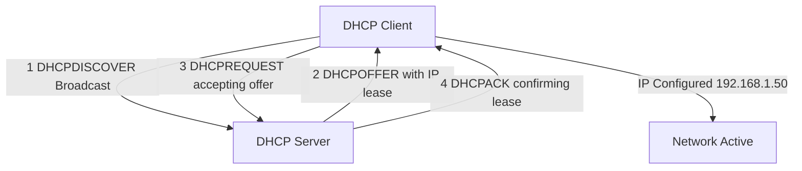

## 4.2 DNS Resolution — Hierarchical Query Flow

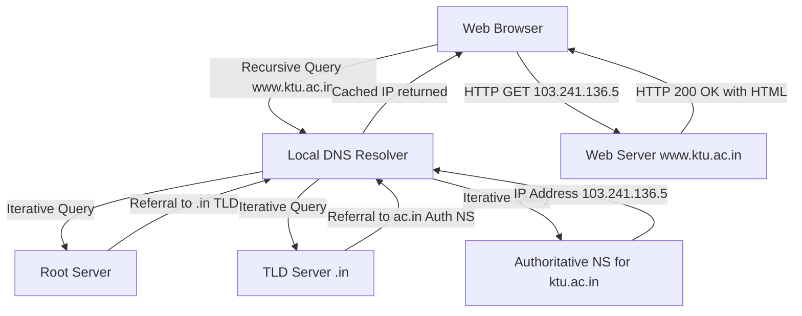

## 4.3 NAT Translation — PAT (Port Address Translation)

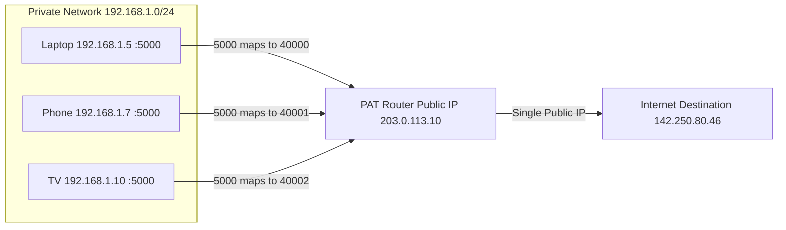

## 4.4 Network Security — Defense in Depth

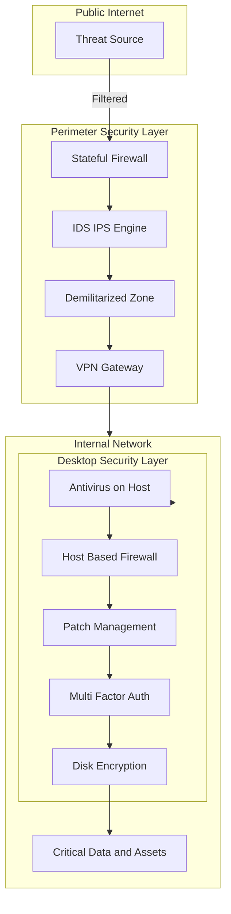

## 4.5 VPN Tunnel — Encrypted Communication

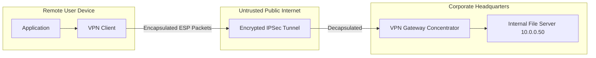

## 4.6 Client–Server vs Peer-to-Peer Architecture

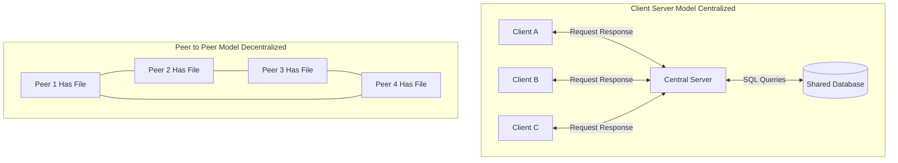

## 4.7 Router Operation — Routing Across Networks

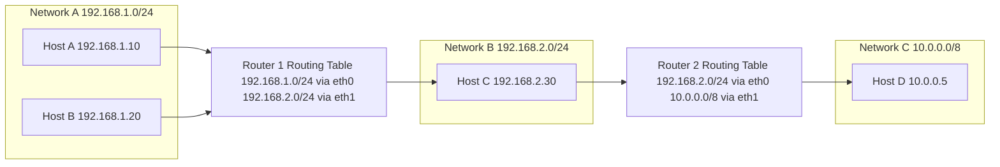

## 4.8 Internet, WWW, and Web Server Relationship

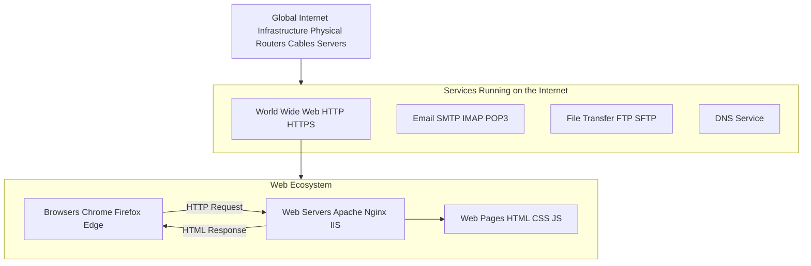

<!-- SECTION_4_END -->

<!-- SECTION_5_START -->

# KTU 2024 Scheme Examination Question Bank

## Part A — Short Answer Questions (3 Marks Each)

### Question 1 [KTU University Exam — July 2024]
**Differentiate between the Internet and the World Wide Web (WWW).** **[CO1, Remember]**

**Model Answer:**

| Aspect | Internet | World Wide Web (WWW) |
| :--- | :--- | :--- |
| **Definition** | Global network of interconnected computer networks using TCP/IP | A service that runs on the Internet for hypertext-based information access |
| **Type** | Infrastructure / Hardware | Service / Software |
| **Example** | Routers, fiber-optic cables, servers | Web pages, browsers, HTTP |
| **Year** | Concept originated in 1969 (ARPANET) | Invented by Tim Berners-Lee in 1989 |
| **Other Services** | Supports email, FTP, VoIP, WWW | Only one of many Internet services |

> **Key Distinction:** *The Internet is the road; the WWW is one of the cars on that road.* **[3 Marks: Definition 1 + Difference Table 1 + Example 1]**

---

### Question 2 [KTU University Exam — Dec 2023]
**Explain the role of DNS in computer networks. State the default port number of DNS.** **[CO1, Understand]**

**Model Answer:**

The **Domain Name System (DNS)** is a hierarchical and decentralized naming system that performs the translation between human-readable domain names (e.g., `www.google.com`) and machine-readable IP addresses (e.g., `142.250.183.14`). Without DNS, users would need to memorize numerical IP addresses for every website.

**Functions of DNS:**
1. **Name-to-Address Resolution** — Primary function
2. **Address-to-Name Resolution** — Reverse DNS (rDNS) for PTR records
3. **Mail Server Discovery** — MX records
4. **Service Location** — SRV records (e.g., for SIP, XMPP)
5. **Load Distribution** — Multiple A records for a single hostname

**Default Port:** **Port 53** (UDP for standard queries, TCP for zone transfers > 512 bytes and for privacy via DoT)

**[3 Marks: Definition 1 + Functions 1.5 + Port 0.5]**

---

## Part B — Long Answer Questions (14 Marks Each, Internal Choice)

> [!NOTE]
> KTU Part B questions follow a sub-part pattern: part (a) carries 7 marks and part (b) carries 7 marks. Cognitive levels typically escalate from *Understand* in (a) to *Apply/Analyze* in (b).

---

### Question A [KTU University Exam — July 2024]

**a) Explain the different classes of IPv4 addresses with suitable examples. State the default subnet mask and maximum number of hosts for each class.** **[7 Marks, CO1, Understand]**

**Model Answer:**

IPv4 addresses are 32-bit logical addresses traditionally divided into 5 classes based on the leading bits of the first octet.

**Class A:**
* Range: $1.0.0.0$ to $126.255.255.255$
* Leading bit: `0`
* Default Mask: $255.0.0.0$ (/8)
* Network:Host = 8:24
* Max Hosts: $2^{24} - 2 = 16,777,214$
* Example: `10.52.18.100` → Class A
* Used by: Very large organizations (e.g., early MIT, HP, IBM)

**Class B:**
* Range: $128.0.0.0$ to $191.255.255.255$
* Leading bits: `10`
* Default Mask: $255.255.0.0$ (/16)
* Network:Host = 16:16
* Max Hosts: $2^{16} - 2 = 65,534$
* Example: `172.20.45.10` → Class B
* Used by: Universities, large enterprises

**Class C:**
* Range: $192.0.0.0$ to $223.255.255.255$
* Leading bits: `110`
* Default Mask: $255.255.255.0$ (/24)
* Network:Host = 24:8
* Max Hosts: $2^{8} - 2 = 254$
* Example: `192.168.1.50` → Class C
* Used by: Small offices, home networks

**Class D:**
* Range: $224.0.0.0$ to $239.255.255.255$
* Purpose: **Multicasting** (one-to-many communication)

**Class E:**
* Range: $240.0.0.0$ to $255.255.255.255$
* Purpose: **Experimental / Reserved** (not used commercially)

**Special Addresses:**
* `127.0.0.0/8` — Loopback (refers to the local machine)
* `0.0.0.0` — "This network" (used during DHCP discovery)

> **Valuation Key:**
> **[Class A explanation: 2 Marks]**, **[Class B explanation: 1.5 Marks]**, **[Class C explanation: 1.5 Marks]**, **[Classes D and E: 1 Mark]**, **[Special addresses / examples: 1 Mark]**

---

**b) An organization is assigned the network `200.10.20.0/24`. The network administrator wants to divide it into 8 equal subnets. Calculate the new subnet mask, the network address, the broadcast address, and the range of usable host IPs for each subnet.** **[7 Marks, CO2, Apply]**

**Model Answer:**

**Step 1 — Bits to borrow.**

$$2^{m} \ge 8 \implies m = 3 \text{ bits borrowed}$$

**Step 2 — New prefix and subnet mask.**

$$\text{New prefix} = 24 + 3 = /26$$

In binary: `11111111.11111111.11111111.11000000`

$$\text{New Subnet Mask} = 255.255.255.192$$

**Step 3 — Block size and host capacity.**

$$n = 32 - 26 = 6 \text{ host bits remaining}$$

$$\text{Block Size} = 2^{6} = 64$$

$$\text{Usable Hosts per Subnet} = 2^{6} - 2 = 62$$

**Step 4 — Subnet table (8 subnets).**

| Subnet # | Network Address | First Host | Last Host | Broadcast Address |
| :---: | :---: | :---: | :---: | :---: |
| 1 | $200.10.20.0$ | $200.10.20.1$ | $200.10.20.62$ | $200.10.20.63$ |
| 2 | $200.10.20.64$ | $200.10.20.65$ | $200.10.20.126$ | $200.10.20.127$ |
| 3 | $200.10.20.128$ | $200.10.20.129$ | $200.10.20.190$ | $200.10.20.191$ |
| 4 | $200.10.20.192$ | $200.10.20.193$ | $200.10.20.254$ | $200.10.20.255$ |
| 5 | $200.10.21.0$ | $200.10.21.1$ | $200.10.21.62$ | $200.10.21.63$ |
| 6 | $200.10.21.64$ | $200.10.21.65$ | $200.10.21.126$ | $200.10.21.127$ |
| 7 | $200.10.21.128$ | $200.10.21.129$ | $200.10.21.190$ | $200.10.21.191$ |
| 8 | $200.10.21.192$ | $200.10.21.193$ | $200.10.21.254$ | $200.10.21.255$ |

**Validation — Subnet 4 Broadcast Check:**

$$200.10.20.192 \;\land\; 255.255.255.192 = 200.10.20.192 \;\checkmark$$

Last host of Subnet 4: $200.10.20.254$. Next address: $200.10.20.255$ (Broadcast) $\rightarrow$ Next network: $200.10.21.0$ (Subnet 5). All consistent.

> **Valuation Key:**
> **[Bit calculation: 1 Mark]**, **[New subnet mask: 1 Mark]**, **[Block size: 1 Mark]**, **[Correct subnet table: 3 Marks]**, **[Final validation: 1 Mark]**

---

### Question B [KTU University Exam — Dec 2023]

**a) Explain the DHCP DORA process with a neat diagram. State the UDP port numbers used by the DHCP client and server.** **[7 Marks, CO1, Understand]**

**Model Answer:**

The **Dynamic Host Configuration Protocol (DHCP)** automates the assignment of IP addresses and other network parameters. The process follows a 4-step handshake known as **DORA**.

**Diagram:**

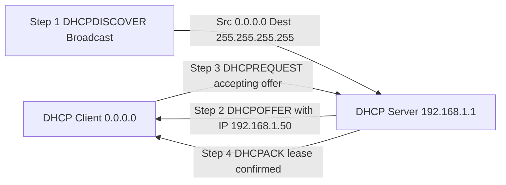

**Explanation of the 4 Steps:**

**1. DHCPDISCOVER (Client $\to$ Server, Broadcast)**
The newly connected client has no IP and broadcasts a `DHCPDISCOVER` message to `255.255.255.255` to locate any available DHCP server on the local network.

**2. DHCPOFFER (Server $\to$ Client, Broadcast)**
The DHCP server responds with a `DHCPOFFER` containing:
* Offered IP address (e.g., $192.168.1.50$)
* Subnet mask (e.g., $255.255.255.0$)
* Lease duration (e.g., $86400$ seconds)
* Default gateway
* DNS server addresses

**3. DHCPREQUEST (Client $\to$ Server, Broadcast)**
The client formally accepts the offer by broadcasting a `DHCPREQUEST`. It is broadcast (not unicast) because the client still has no confirmed IP, and other DHCP servers on the network need to know their offers were rejected.

**4. DHCPACK (Server $\to$ Client, Broadcast)**
The server finalizes the lease with a `DHCPACK`, and the client binds the IP to its network interface. The client is now operational on the network.

**UDP Port Numbers:**
* **DHCP Server** listens on **Port 67**
* **DHCP Client** listens on **Port 68**

> **Valuation Key:**
> **[Diagram: 2 Marks]**, **[Discover and Offer explanation: 2 Marks]**, **[Request and ACK explanation: 2 Marks]**, **[Port numbers: 1 Mark]**

---

**b) Explain Network Address Translation (NAT). Differentiate between Static NAT, Dynamic NAT, and PAT (Port Address Translation) with diagrams.** **[7 Marks, CO2, Understand]**

**Model Answer:**

**Definition:** **Network Address Translation (NAT)** is a technique used by routers to map private (non-routable) IP addresses to one or more public (routable) IP addresses, allowing multiple devices in a private LAN to share a single public IP when accessing the Internet.

**Why NAT is needed:**
1. **IPv4 Address Conservation** — A single public IP serves hundreds of devices.
2. **Security through Obscurity** — Internal IPs are hidden from the outside world.
3. **Network Flexibility** — Internal addressing can change without affecting external services.

**Three Types of NAT:**

**1. Static NAT (1-to-1 Mapping)**

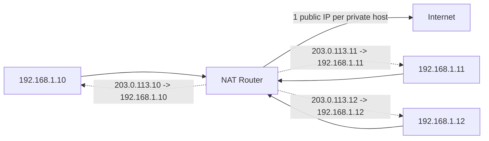
* Each private IP has a **fixed, one-to-one** mapping to a unique public IP.
* Used for: Hosting web/mail servers that need consistent inbound access.
* Requires: As many public IPs as private hosts.

**2. Dynamic NAT (Pool-based Mapping)**

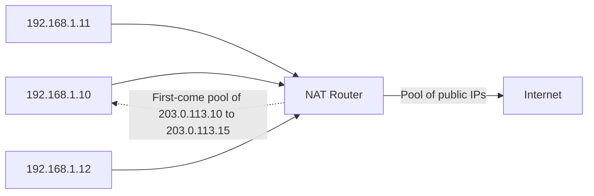
* Private hosts are assigned public IPs **from a defined pool** on a first-come basis.
* If the pool is exhausted, new requests are dropped.
* Used by: Medium-sized offices.

**3. PAT (Port Address Translation / NAT Overload)**

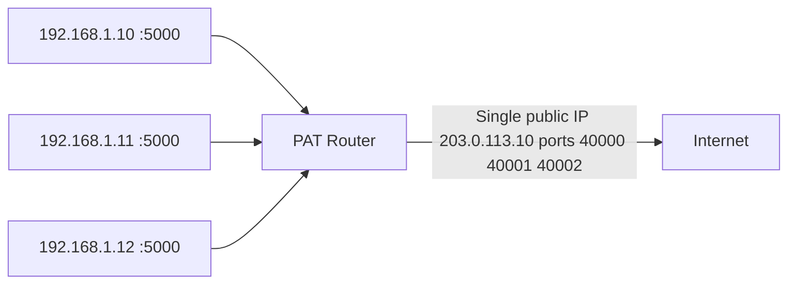
* **Many private IPs** share **one public IP**, distinguished by **unique source port numbers**.
* Most common form of NAT (used in every home router).
* Supports up to $2^{16} = 65{,}536$ simultaneous connections per public IP.

**Comparison Table:**

| Feature | Static NAT | Dynamic NAT | PAT |
| :--- | :---: | :---: | :---: |
| Mapping | 1-to-1 fixed | 1-to-1 from pool | Many-to-1 via ports |
| Public IPs needed | Equal to hosts | Equal to pool size | **Just 1** |
| Cost | High | Moderate | **Lowest** |
| Inbound reachability | Always | When mapped | Requires port forwarding |
| Common use | Servers | Mid-size offices | **Home / SOHO** |

> **Valuation Key:**
> **[NAT definition and need: 1.5 Marks]**, **[Static NAT with diagram: 1.5 Marks]**, **[Dynamic NAT with diagram: 1.5 Marks]**, **[PAT with diagram: 1.5 Marks]**, **[Comparison table: 1 Mark]**

---

> [!WARNING]
> **KTU Examiner's Valuation Warning — Common Pitfalls:**
> 1. **Subnetting mistakes:** Students often forget the **$-2$** rule for usable hosts. KTU strictly expects you to subtract 2 (network and broadcast addresses). Skipping this loses 1 mark.
> 2. **DORA order confusion:** Writing `ACK` before `Request` or omitting the broadcast nature of messages is a frequent error. Always write **D-O-R-A** in order and mention `255.255.255.255`.
> 3. **NAT port confusion:** Many students write "NAT uses port 80" — this is wrong. NAT *itself* does not have a fixed port; only the *internally translated services* have ports. PAT uses source ports dynamically.
> 4. **DNS port mistake:** DNS uses **port 53** (UDP primarily, TCP for large responses). Writing "port 80" loses marks.
> 5. **Internet vs WWW:** Students often describe them as the same. KTU explicitly tests the *infrastructure vs service* distinction.
> 6. **Loopback address:** Never assign `127.x.x.x` to a real network interface — it's reserved for the local machine.

---

## Topic Recap & Important Things to Remember

> [!IMPORTANT]
> **Rapid Revision Checklist for KTU Module 3 (Computer System Software — Networking):**

* **IP Address:** 32-bit (IPv4) / 128-bit (IPv6) logical address. IPv4 written as 4 octets of 0–255.
* **Classes:** A (1–126, /8), B (128–191, /16), C (192–223, /24), D (Multicast), E (Experimental).
* **Loopback:** $127.0.0.0/8$ (especially $127.0.0.1$ = localhost).
* **Subnetting Formulas:** Subnets $= 2^{m}$, Usable Hosts $= 2^{n} - 2$, Block Size $= 2^{n}$.
* **CIDR Notation:** `IP/Prefix` (e.g., `192.168.1.0/26` → mask $255.255.255.192$).
* **DHCP:** DORA process (Discover, Offer, Request, ACK). Uses **UDP 67 (server) / 68 (client)**.
* **NAT Types:** Static (1:1), Dynamic (pool), PAT (many:1, port-based — most common).
* **RFC 1918 Private Ranges:** $10.0.0.0/8$, $172.16.0.0/12$, $192.168.0.0/16$.
* **DNS:** Translates domain names to IPs. Uses **port 53**. Hierarchical: Root $\to$ TLD $\to$ Authoritative.
* **DNS Query Types:** Recursive (client to resolver) and Iterative (resolver to root/TLD/auth).
* **VPN:** Encrypted tunnel over public network. Common protocols: **PPTP, L2TP/IPSec, OpenVPN, WireGuard**.
* **Router:** Layer 3 device that forwards packets using routing tables. Protocols: **RIP, OSPF, BGP**.
* **Client–Server:** Centralized; clients send requests, servers respond. Opposite of P2P.
* **Internet vs WWW:** Internet = infrastructure; WWW = service (HTTP/HTTPS) running on the Internet.
* **Web Server:** Software serving web pages over **port 80 (HTTP) / 443 (HTTPS)**. Examples: Apache, Nginx, IIS.
* **Defense in Depth:** Combine **perimeter security** (firewalls, IDS/IPS, DMZ) with **desktop security** (antivirus, host firewall, patches, MFA).
* **Default Ports Quick-Reference:** HTTP=80, HTTPS=443, DNS=53, DHCP-Server=67, DHCP-Client=68, SSH=22, FTP=21, SMTP=25.
* **Network ID Calculation:** `IP Address $\land$ Subnet Mask`.
* **Broadcast Address:** Last address in a subnet (host bits all 1).
* **First Usable Host:** Network ID + 1. **Last Usable Host:** Broadcast - 1.

<!-- SECTION_5_END -->
