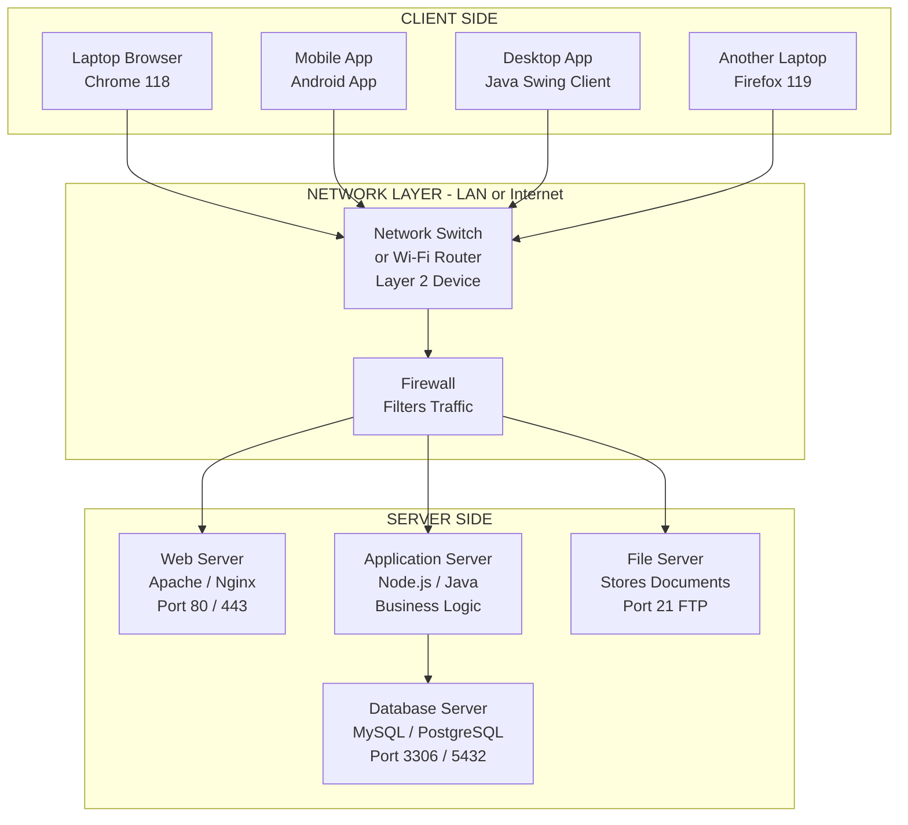
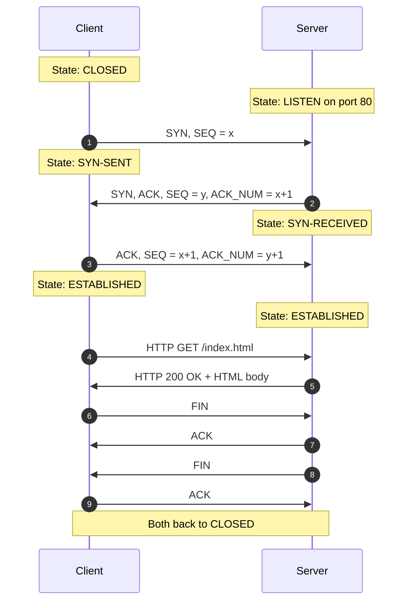
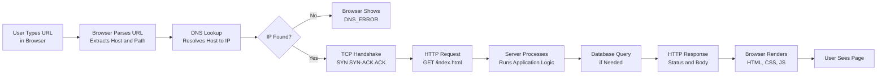
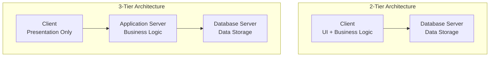
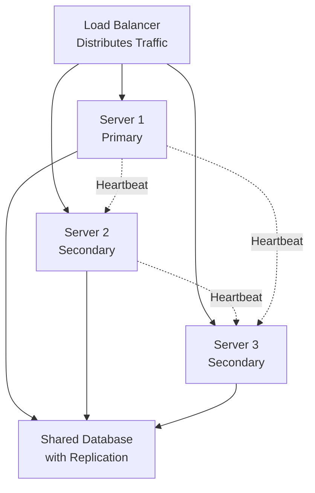

# Client/Server networks

<!-- SECTION_1_START -->
# Client/Server Networks — Core Definition & Intuitive Overview

> [!NOTE]
> **KTU 2024 Scheme (Module 3 — Computer System Software)** | **Course Code:** GXEST203 | **Target CO:** CO3 — *Understand the architecture of computer networks and distributed systems.*

## 1.1 Formal Academic Definition

A **Client/Server Network** is a distributed computing architecture in which the workload is partitioned between **service providers** (called *servers*) and **service requesters** (called *clients*). The client initiates a request over a network using a defined communication **protocol**, and the server — which hosts, manages, and protects a specific resource (file, database, web page, printer, application logic) — processes the request and returns a structured response.

In the **KTU 2024 Scheme** terminology, a client/server network is classified under **Module 3: Computer System Software** as a foundational model of **networked operating environments**, sitting between the layers of *system software* (OS) and *application software*.

> [!IMPORTANT]
> **Syllabus Highlight:** The KTU examiner expects you to contrast **Client/Server (C/S)** with **Peer-to-Peer (P2P)** networks, identify their components, list their **advantages and disadvantages**, and describe the role of protocols like **TCP/IP**, **HTTP**, and **DNS**.

## 1.2 Conceptual Analogy — "The Restaurant Kitchen"

Imagine walking into a restaurant:

- **You (the customer)** sit at a table, look at the menu, and place an order. You do **not** know how the food is cooked, where ingredients are stored, or how bills are calculated. You simply *request* and *receive*.
- **The waiter** acts as the *protocol* — a structured messenger carrying your order to the kitchen and bringing back the dish.
- **The kitchen (the server)** holds the recipes (data), the cooks (processing logic), and the pantry (storage). It serves many waiters and many customers simultaneously.
- **The restaurant building, the kitchen layout, and the communication corridors** are the **network infrastructure** (LAN cables, switches, Wi-Fi, routers).

In this analogy:
- The **client** = a thin device (your laptop, mobile, browser) that requests services.
- The **server** = a powerful, always-on machine that hosts services (web server, database server, mail server).
- The **network** = the medium (Ethernet, Wi-Fi, fiber).
- The **protocol** = the agreed-upon language (HTTP, FTP, SMTP).

This is **Client/Server computing** — clean separation of *who asks* from *who serves*, mediated by a shared language, over a shared medium.

## 1.3 Core Vocabulary — Must-Know Terms

> [!IMPORTANT]
> **The Seven Foundational Terms of Client/Server Networks**

| Term | Definition | Real-World Mapping |
|------|------------|--------------------|
| **Client** | A software/hardware entity that initiates requests for services. | Your web browser (Chrome, Firefox). |
| **Server** | A host program or machine that listens for, processes, and responds to client requests. | Apache, Nginx, MySQL daemon. |
| **Network** | The communication medium (wired/wireless) connecting clients and servers. | LAN cable, Wi-Fi router. |
| **Protocol** | A formal set of rules governing data exchange. | HTTP, FTP, TCP, IP, SMTP. |
| **Port** | A 16-bit logical endpoint (0–65535) identifying a specific service on a host. | Port **80** (HTTP), **443** (HTTPS), **21** (FTP). |
| **IP Address** | A unique 32-bit (IPv4) or 128-bit (IPv6) numerical label for a network device. | `192.168.1.10` |
| **Socket** | The combination of **IP address + Port number** — a unique endpoint of a communication. | `192.168.1.10:80` |

## 1.4 Why Client/Server? — The Driving Motivation

Before client/server became dominant, the world used **mainframes** with **dumb terminals** — every user shared one giant computer. Client/Server emerged because:

1. **Cost of personal computers dropped** (1980s–90s) — clients could be cheap PCs.
2. **Data needed centralization** — banks, airlines, universities needed ONE source of truth.
3. **Resource sharing** — one powerful printer, one license-heavy database — shared by many.
4. **Security and backup** — central servers are easier to secure and back up than 200 scattered PCs.

> [!VISUALIZATION CONTROL]
> **Concept:** *Centralized Data Flow in a C/S Topology*
> **GeoGebra / Desmos Input Equations:**
> * Draw a central point `C = (0, 0)` representing the **server**.
> * Draw 6 satellite points on a circle of radius `4`: `P1 = (4, 0)`, `P2 = (2, 3.46)`, `P3 = (-2, 3.46)`, `P4 = (-4, 0)`, `P5 = (-2, -3.46)`, `P6 = (2, -3.46)` — representing **clients**.
> * Draw line segments from each `Pi` to `C`.
> **Visual Description:** You should see a **hub-and-spoke (star) topology** — all clients radiate from one central server. Contrast this mentally with a mesh where every node connects to every other.

---

<!-- SECTION_1_END -->

<!-- SECTION_2_START -->
# Deep Theoretical Analysis & KTU High-Yield Formula Sheet

## 2.1 Architecture of a Client/Server System — The 5 Logical Tiers

A client/server system is not a single layer — it is a **stack of responsibilities** moving from the user’s screen down to the network cable:

1. **Presentation Layer (Client-side UI):** The interface — HTML pages, React front-ends, desktop GUIs. The user sees and interacts with this.
2. **Application Logic Layer (Business Logic):** The "brain" — Java/Python/PHP code that implements rules (e.g., "if age < 18, block access"). May run partly on client, partly on server.
3. **Data Management Layer (DBMS):** The structured data store — MySQL, PostgreSQL, Oracle, MongoDB. Receives queries (SQL) and returns result sets.
4. **Network Layer:** TCP/IP stack — handles packet routing, addressing, error detection, and flow control.
5. **Physical Layer:** The actual cables (Cat 6, fiber), radio waves (Wi-Fi), and connectors.

> [!NOTE]
> **Why this matters for KTU:** A common 7-mark question asks *"Explain the client/server architecture with a diagram."* Drawing these **five layers** and labeling each earns full marks.

## 2.2 The Request-Response Cycle — The Heartbeat of C/S

Every client/server interaction follows the same **6-step cycle**:

- **Step 1 — Resolution:** The client resolves the human-readable hostname (e.g., `www.ktu.edu.in`) into an IP address using **DNS (Domain Name System)**.
- **Step 2 — Connection:** A **TCP three-way handshake** establishes a reliable session: `SYN` → `SYN-ACK` → `ACK`.
- **Step 3 — Request:** The client sends an **HTTP request** (e.g., `GET /index.html HTTP/1.1`) over the open socket.
- **Step 4 — Processing:** The server parses the request, queries the database if needed, and constructs a response.
- **Step 5 — Response:** The server sends back an **HTTP response** containing a **status code** (200, 404, 500), **headers**, and a **body** (HTML, JSON, file).
- **Step 6 — Termination / Keep-Alive:** The connection is closed (`FIN`) or kept alive for further requests.

> [!IMPORTANT]
> **Mnemonic for KTU exams:** **R**esolve → **C**onnect → **R**equest → **P**rocess → **R**espond → **T**erminate → **R-C-R-P-R-T**.

## 2.3 Types of Client/Server Architecture (KTU High-Yield)

The KTU 2024 syllabus emphasizes **four architectural variants**. Mastering these is essential:

| Architecture Type | Description | Example | KTU Buzzword |
|-------------------|-------------|---------|--------------|
| **1-Tier (Single-Tier)** | UI, logic, and data all on one machine. No network. | MS Excel on a standalone PC. | *Standalone application* |
| **2-Tier (Client–Server)** | Client = Presentation + Logic; Server = Database. Direct connection. | A Java Swing app talking to MySQL. | *Thick client* |
| **3-Tier** | Client (UI) ↔ Application Server (Logic) ↔ Database Server (Data). | A React front-end, Node.js API, MySQL DB. | *Web-based enterprise app* |
| **n-Tier / Multi-Tier** | Many specialized layers — load balancers, cache servers, microservices. | Netflix architecture, Amazon AWS stack. | *Distributed cloud system* |

## 2.4 Client/Server vs. Peer-to-Peer — The Critical Comparison

> [!IMPORTANT]
> **This is the single most-asked comparison in KTU Module 3.** Examiner often gives 5–7 marks for a clean table.

| Parameter | **Client/Server** | **Peer-to-Peer (P2P)** |
|-----------|-------------------|------------------------|
| **Centralization** | Centralized server. | No central server. |
| **Role Asymmetry** | Clients request, servers respond. | Every node is *both* client and server. |
| **Scalability** | Limited by server capacity. | Highly scalable — more peers = more power. |
| **Security** | Strong — server enforces ACLs, encryption, authentication. | Weak — each peer is a trust boundary. |
| **Cost** | High (dedicated server hardware + admin). | Low (use existing nodes). |
| **Reliability** | Single point of failure (the server). | No single point of failure. |
| **Performance under load** | Degrades as concurrent users rise. | Improves as more peers join. |
| **Examples** | Web (HTTP), Email (SMTP/IMAP), Banking apps. | BitTorrent, Blockchain, Gnutella. |
| **Best suited for** | Controlled environments: offices, banks, universities. | Open, distributed sharing: file sharing, crypto. |

## 2.5 Advantages and Disadvantages of Client/Server Networks

> [!NOTE]
> **KTU expects you to list at least 4 advantages and 4 disadvantages.**

### ✅ Advantages
1. **Centralized Data Management** — One source of truth; updates propagate instantly.
2. **Enhanced Security** — Authentication, authorization, encryption enforced at the server.
3. **Resource Sharing** — Expensive peripherals (printers, scanners, plotters) and licenses shared.
4. **Easier Backup and Recovery** — One machine to back up, not 200.
5. **Performance** — Server hardware can be optimized (RAID, ECC RAM, multi-CPU).
6. **Administration** — Patches, updates, and policies pushed from one location.

### ❌ Disadvantages
1. **High Initial Cost** — Server hardware, OS licenses (Windows Server, RHEL), UPS, cooling.
2. **Single Point of Failure** — If the server crashes, the entire network halts.
3. **Specialized Manpower** — Requires a trained network/system administrator.
4. **Network Dependency** — If LAN fails, clients cannot work.
5. **Server Bottleneck** — Too many concurrent requests → slow response (denial of service).
6. **Maintenance Downtime** — Server upgrades may require planned outages.

## 2.6 KTU High-Yield Formula Sheet — Cheat Sheet

> [!IMPORTANT]
> **Save this table. These definitions and numbers appear every KTU exam cycle.**

| Concept | Formula / Definition | Numeric Value / Example |
|---------|----------------------|--------------------------|
| **IPv4 Address Size** | $32\text{ bits} = 2^{32}$ unique addresses | $\approx 4.29 \times 10^{9}$ addresses |
| **IPv6 Address Size** | $128\text{ bits} = 2^{128}$ unique addresses | $\approx 3.4 \times 10^{38}$ addresses |
| **TCP Header (min)** | $20\text{ bytes}$ (no options) | Used in MTU calculations |
| **HTTP Default Port** | Port $80$ (unencrypted) | `http://` |
| **HTTPS Default Port** | Port $443$ (TLS encrypted) | `https://` |
| **FTP Control Port** | Port $21$ | Command channel |
| **FTP Data Port** | Port $20$ | Data channel |
| **SSH Default Port** | Port $22$ | Secure remote shell |
| **DNS Default Port** | Port $53$ | UDP for queries, TCP for zone transfers |
| **Port Number Range** | $0$ to $65535$ ($2^{16} - 1$) | $0$–$1023$: well-known; $1024$–$49151$: registered; $49152$–$65535$: dynamic |
| **Bandwidth-Delay Product** | $\text{BDP} = \text{Bandwidth} \times \text{Round-Trip Time}$ | Example: $100\text{ Mbps} \times 50\text{ ms} = 5\text{ Mb}$ |
| **Maximum TCP Window** | $\text{Throughput} = \frac{\text{Window Size}}{\text{RTT}}$ | Critical for high-latency links |
| **Subnet Mask (Class C default)** | `255.255.255.0` = $/24$ | $2^{8} = 256$ host addresses |
| **Usable Hosts per Subnet** | $H = 2^{n} - 2$ | $n$ = host bits, $-2$ for network & broadcast |

## 2.7 Real-World Engineering Utility

| Domain | Client/Server Use Case |
|--------|------------------------|
| **Banking** | ATM (client) ↔ Core Banking Server (mainframe). |
| **E-Commerce** | Browser (client) ↔ Web Server (Nginx) ↔ Order DB (PostgreSQL). |
| **Healthcare** | Hospital PACS — doctors’ tablets retrieve MRI images from central archive. |
| **Aviation** | Passenger check-in kiosks ↔ Airline reservation system (Amadeus, Sabre). |
| **Smart Cities** | Traffic cameras (clients) stream to a central analytics server running AI. |
| **Education** | KTU’s own student portal — your browser (client) hits `ktu.edu.in` (server). |

---

<!-- SECTION_2_END -->

<!-- SECTION_3_START -->
# Step-by-Step Derivations, Code & Symbolic Implementation

## 3.1 The TCP Three-Way Handshake — Full Symbolic Walkthrough

The TCP three-way handshake is **the canonical example** KTU examiners use to test whether you understand the *connection establishment* phase of client/server communication. Below is the complete derivation with no skipped steps.

### 3.1.1 Initial State Assumptions

Let:
- $C$ = the **client** host.
- $S$ = the **server** host.
- $\text{SEQ}_C$ = the client's initial **sequence number** (random, 32-bit).
- $\text{SEQ}_S$ = the server's initial **sequence number** (random, 32-bit).
- $\text{ACK}_n$ = a *cumulative* acknowledgement meaning *"I have received all bytes up to $n-1$; next expected byte is $n$."*

Initial state:
- $C$ is in the **CLOSED** state.
- $S$ is in the **LISTEN** state (passive open, bound to port 80).

### 3.1.2 Step-by-Step Handshake

**Step 1 — Client → Server (SYN)**

$$C \xrightarrow{\text{SYN}, \ \text{SEQ} = x} S$$

- $C$ sends a TCP segment with the **SYN** (synchronize) flag set.
- Sequence number initialized: $x = \text{SEQ}_C$ (random 32-bit value chosen by the OS).
- $C$ transitions from CLOSED → **SYN-SENT**.
- $C$ consumes one sequence number: next byte to send will be $x + 1$.

**Step 2 — Server → Client (SYN-ACK)**

$$S \xrightarrow{\text{SYN}, \ \text{ACK}, \ \text{SEQ} = y, \ \text{ACK\_NUM} = x + 1} C$$

- $S$ receives the SYN, allocates a **receive buffer**, and replies.
- Sets both **SYN** and **ACK** flags.
- Sequence number initialized: $y = \text{SEQ}_S$.
- Acknowledgement number: $\text{ACK\_NUM} = x + 1$ (confirming receipt of the SYN).
- $S$ transitions from LISTEN → **SYN-RECEIVED**.

**Step 3 — Client → Server (ACK)**

$$C \xrightarrow{\text{ACK}, \ \text{SEQ} = x + 1, \ \text{ACK\_NUM} = y + 1} S$$

- $C$ sends a final ACK to complete the handshake.
- $C$ transitions from SYN-SENT → **ESTABLISHED**.
- $S$ receives this ACK and transitions from SYN-RECEIVED → **ESTABLISHED**.

### 3.1.3 Final Result

After Step 3, both sides are in the **ESTABLISHED** state, and data transfer can begin. Both sides have agreed upon each other's initial sequence numbers. Total packets exchanged: **3**. Total round-trips: **1.5** (one and a half).

> [!IMPORTANT]
> **Why "three-way"?** Because exactly **3 TCP segments** are exchanged. A common KTU trick question: *"Can the handshake be reduced to 2 messages?"* — Answer: **No, because the server's initial sequence number must be communicated and acknowledged atomically; combining SYN and ACK on the server side still requires a separate final ACK from the client.**

### 3.1.4 Connection Teardown — Four-Way FIN

For completeness, the teardown is a **4-way exchange**:

$$C \xrightarrow{\text{FIN}} S \xrightarrow{\text{ACK}} C \xrightarrow{\text{FIN}} S \xrightarrow{\text{ACK}} C$$

Both sides transition through **FIN-WAIT-1, CLOSE-WAIT, FIN-WAIT-2, LAST-ACK, TIME-WAIT** states before returning to CLOSED.

## 3.2 HTTP Request/Response — Annotated Walkthrough

### 3.2.1 Client Request (what your browser sends)

```http
GET /index.html HTTP/1.1
Host: www.ktu.edu.in
User-Agent: Mozilla/5.0 (Windows NT 10.0; Win64; x64)
Accept: text/html,application/xhtml+xml
Accept-Language: en-US,en;q=0.9
Connection: keep-alive
```

- **Method** `GET` — retrieve the resource.
- **Path** `/index.html` — the URI path on the server.
- **Version** `HTTP/1.1` — the protocol version.
- **Host header** — mandatory in HTTP/1.1 (supports virtual hosting).
- **Connection: keep-alive** — reuse the TCP socket for further requests.

### 3.2.2 Server Response (what the server sends back)

```http
HTTP/1.1 200 OK
Date: Mon, 14 Oct 2024 10:30:00 GMT
Server: Apache/2.4.57 (Ubuntu)
Content-Type: text/html; charset=UTF-8
Content-Length: 1024
Connection: keep-alive

<!DOCTYPE html>
<html><head><title>KTU</title></head>
<body><h1>Welcome to APJ Abdul Kalam Technological University</h1></body>
</html>
```

- **Status line** `HTTP/1.1 200 OK` — request succeeded.
- **Content-Type** tells the browser to render as HTML.
- **Content-Length** is the body size in bytes.

### 3.2.3 Common HTTP Status Codes (KTU Favorite)

| Code | Phrase | Meaning | When Server Sends It |
|------|--------|---------|----------------------|
| **200** | OK | Request succeeded. | Normal page load. |
| **301** | Moved Permanently | Resource relocated. | Site domain change. |
| **403** | Forbidden | Authenticated but not authorized. | Accessing `/admin` as a guest. |
| **404** | Not Found | Resource does not exist. | Bad URL. |
| **500** | Internal Server Error | Bug in server-side code. | Uncaught exception in PHP. |
| **503** | Service Unavailable | Server overloaded or under maintenance. | DDoS attack. |

## 3.3 Full Python Implementation — A Working Client/Server

> [!NOTE]
> **The following code is complete, runnable, and uses only Python's standard library — no `pip install` needed. This is the exact type of implementation a KTU lab examiner may ask you to write or explain.**

### 3.3.1 The Server — `server.py`

```python
"""
server.py — A minimal TCP echo server demonstrating the client/server model.
Listens on 127.0.0.1:5000. For every client connection, reads a message
and replies with the same message prefixed by "[ECHO] ".
"""

import socket       # Python's built-in networking library
import logging      # Standard logging facility
import sys
from typing import Tuple

# --- Configuration constants ---
HOST: str = "127.0.0.1"   # Loopback address (localhost)
PORT: int = 5000          # Arbitrary non-privileged port
BACKLOG: int = 5          # Max queued connections
BUFFER_SIZE: int = 1024   # Bytes received per recv() call

# --- Logging configuration ---
logging.basicConfig(
    level=logging.INFO,
    format="%(asctime)s [SERVER] %(levelname)s: %(message)s"
)
logger = logging.getLogger(__name__)


def start_server() -> None:
    """
    Create a TCP socket, bind it, listen, and serve clients forever.
    Each client is handled in its own loop iteration.
    """
    # AF_INET = IPv4, SOCK_STREAM = TCP (reliable, connection-oriented)
    server_sock: socket.socket = socket.socket(socket.AF_INET, socket.SOCK_STREAM)

    # SO_REUSEADDR prevents "Address already in use" errors on restart
    server_sock.setsockopt(socket.SOL_SOCKET, socket.SO_REUSEADDR, 1)

    server_sock.bind((HOST, PORT))
    server_sock.listen(BACKLOG)
    logger.info("Server listening on %s:%d (PID=%d)", HOST, PORT, os_getpid())

    try:
        while True:                                # Infinite accept loop
            client_sock: socket.socket
            client_addr: Tuple[str, int]
            client_sock, client_addr = server_sock.accept()    # Blocking call
            logger.info("Accepted connection from %s:%d", client_addr[0], client_addr[1])

            try:
                # Read data from the client (may require multiple recv calls
                # in production, but a single call is enough for short messages)
                data: bytes = client_sock.recv(BUFFER_SIZE)

                if not data:
                    logger.warning("Client %s sent no data; closing.", client_addr)
                else:
                    message: str = data.decode("utf-8", errors="replace").strip()
                    logger.info("Received from %s: %r", client_addr, message)

                    # Construct the echo response
                    response: str = f"[ECHO] {message}\n"
                    client_sock.sendall(response.encode("utf-8"))
                    logger.info("Sent response to %s.", client_addr)
            except ConnectionResetError:
                logger.error("Client %s forcibly disconnected.", client_addr)
            except OSError as exc:
                logger.exception("Socket error while serving %s: %s", client_addr, exc)
            finally:
                client_sock.close()
                logger.info("Closed connection to %s.", client_addr)

    except KeyboardInterrupt:
        logger.info("Keyboard interrupt received; shutting down.")
    finally:
        server_sock.close()
        logger.info("Server socket closed. Goodbye.")


def os_getpid() -> int:
    """Helper to get current process ID for logging."""
    import os
    return os.getpid()


if __name__ == "__main__":
    start_server()
```

### 3.3.2 The Client — `client.py`

```python
"""
client.py — Connects to the echo server, sends a message, prints the reply.
Usage:  python client.py "Hello, KTU!"
"""

import socket
import logging
import sys
from typing import Optional

HOST: str = "127.0.0.1"
PORT: int = 5000
BUFFER_SIZE: int = 1024
TIMEOUT_SECONDS: float = 5.0

logging.basicConfig(
    level=logging.INFO,
    format="%(asctime)s [CLIENT] %(levelname)s: %(message)s"
)
logger = logging.getLogger(__name__)


def send_message(message: str) -> Optional[str]:
    """
    Connect to the server, send `message`, and return the decoded reply.
    Returns None on any network failure (with structured error logging).
    """
    if not message or not message.strip():
        logger.error("Message is empty; nothing to send.")
        return None

    sock: socket.socket = socket.socket(socket.AF_INET, socket.SOCK_STREAM)
    sock.settimeout(TIMEOUT_SECONDS)             # Prevent indefinite blocking

    try:
        logger.info("Connecting to %s:%d ...", HOST, PORT)
        sock.connect((HOST, PORT))
        logger.info("Connection established.")

        payload: bytes = message.strip().encode("utf-8")
        sock.sendall(payload)
        logger.info("Sent %d bytes: %r", len(payload), payload)

        reply_bytes: bytes = sock.recv(BUFFER_SIZE)
        if not reply_bytes:
            logger.warning("Server closed the connection without replying.")
            return None

        reply: str = reply_bytes.decode("utf-8", errors="replace").strip()
        logger.info("Received reply: %r", reply)
        return reply

    except socket.timeout:
        logger.error("Operation timed out after %.1fs.", TIMEOUT_SECONDS)
        return None
    except ConnectionRefusedError:
        logger.error("Connection refused. Is the server running on %s:%d?", HOST, PORT)
        return None
    except OSError as exc:
        logger.exception("Network error: %s", exc)
        return None
    finally:
        sock.close()
        logger.info("Client socket closed.")


if __name__ == "__main__":
    if len(sys.argv) < 2:
        print("Usage: python client.py <message>")
        sys.exit(1)
    user_message: str = sys.argv[1]
    result: Optional[str] = send_message(user_message)
    if result is not None:
        print(f"Server replied: {result}")
        sys.exit(0)
    else:
        sys.exit(2)
```

### 3.3.3 How to Run

1. Open **Terminal A**: `python server.py`
2. Open **Terminal B**: `python client.py "Hello from KTU student"`
3. **Expected output on client side:** `Server replied: [ECHO] Hello from KTU student`

## 3.4 Subnetting — Numeric Derivation (Bonus KTU Skill)

> [!NOTE]
> **Subnetting questions appear frequently. The KTU board expects you to derive the number of subnets, hosts per subnet, and valid host ranges from a given IP and mask.**

**Problem:** Given the network `192.168.10.0/26`, find the number of usable subnets (if subnetted from a /24), hosts per subnet, and the first/last valid host of subnet #1.

**Step 1 — Determine borrowed bits.** The /26 means $26$ bits are network; original was $/24$, so borrowed bits $= 26 - 24 = 2$.

**Step 2 — Number of subnets.**

$$N_{\text{subnets}} = 2^{b} = 2^{2} = 4$$

**Step 3 — Number of hosts per subnet.**

$$H_{\text{usable}} = 2^{h} - 2 = 2^{(32 - 26)} - 2 = 2^{6} - 2 = 64 - 2 = 62$$

**Step 4 — Subnet #1 range.**

$$192.168.10.0/26 \Rightarrow \text{Block size} = 2^{(32-26)} = 64$$

$$\text{Subnet 1: Network} = 192.168.10.0, \quad \text{Broadcast} = 192.168.10.63$$

$$\text{First valid host} = 192.168.10.1, \quad \text{Last valid host} = 192.168.10.62$$

This kind of step-by-step arithmetic is exactly what earns the full 7 marks on a subnetting sub-question.

---

<!-- SECTION_3_END -->

<!-- SECTION_4_START -->
# Structural Diagrams & Schematics

## 4.1 Master Architecture — Client/Server Topology



> [!NOTE]
> **How to read this diagram for your exam:** Clients (left) connect via a switch (center) and firewall (security checkpoint) to specialized servers (right). Each server has a distinct role: Web (UI delivery), Application (logic), Database (persistent storage), File (bulk storage). The arrows show the **direction of requests/responses** — bi-directional by nature, but conventionally drawn client-to-server for "request" flow.

## 4.2 TCP Three-Way Handshake — Sequence Diagram



> [!IMPORTANT]
> **Examiner tip:** Always annotate sequence numbers (`SEQ = x`, `ACK_NUM = x+1`) and **state transitions** in your diagrams. This is the difference between a 5-mark and a 7-mark answer.

## 4.3 Request-Response Cycle — Functional Flow Block



## 4.4 3-Tier vs 2-Tier — Comparison Block Diagram



## 4.5 Failure Recovery — Redundant Server Block



> [!NOTE]
> **In production systems** (Google, Amazon, Flipkart), this is called **High Availability (HA) clustering** — solves the "single point of failure" disadvantage of C/S networks. Mentioning this in your KTU answer shows the examiner that you understand the **practical engineering fix**, not just the textbook theory.

---

<!-- SECTION_4_END -->

<!-- SECTION_5_START -->
# KTU 2024 Scheme Examination Question Bank & Topic Recap

> [!NOTE]
> **Pattern modeled on actual KTU University Exam papers (Dec 2023, July 2024) for EST fundamentals courses.** All questions aligned to **CO3** and Revised Bloom's Taxonomy cognitive levels.

---

## 5.1 Part A — Short Answer Questions (3 Marks Each)

### Question 1 — `[KTU University Exam - July 2024]` — CO3, Remember

**Define a client/server network. List any four advantages of using a client/server architecture over a peer-to-peer network.**

**Model Answer (Board-Standard):**

A **client/server network** is a distributed computing model in which one or more centralized *servers* provide resources, services, or data to multiple *client* machines that request them over a network. The server hosts the data and logic; the client provides the user interface and issues requests using a defined protocol (e.g., HTTP, FTP).

**Four advantages over peer-to-peer:**

1. **Centralized Security:** Authentication and access control enforced at one server, making it harder for unauthorized users to access resources.
2. **Centralized Backup:** Data resides on one server, so backup and disaster recovery are simpler and cheaper.
3. **Better Resource Sharing:** Expensive resources (high-capacity printers, licensed software, large databases) can be shared by all clients efficiently.
4. **Higher Performance:** Server hardware can be optimized (multi-core CPUs, ECC RAM, RAID storage) for handling many concurrent client requests.

> [!NOTE]
> **Valuation Key (3 marks):** Definition (1 mark) + four valid advantages (0.5 each) = 3 marks. Students typically lose 0.5 marks for vague phrases like "it is better" without justification.

---

### Question 2 — `[KTU University Exam - Dec 2023]` — CO3, Understand

**Explain the role of a protocol in client/server communication. Name the default port numbers for HTTP, HTTPS, FTP, and SSH.**

**Model Answer (Board-Standard):**

A **protocol** is a formal, standardized set of rules that governs how data is formatted, transmitted, received, and acknowledged between a client and a server. It is the *common language* that allows heterogeneous systems (e.g., a Windows laptop and a Linux server) to communicate reliably. Without protocols, the client would not know how to structure a request, and the server would not know how to parse it. Examples include **TCP/IP, HTTP, HTTPS, FTP, SMTP, and DNS**.

| Service | Protocol | Default Port | Encryption |
|---------|----------|--------------|------------|
| **HTTP** | HyperText Transfer Protocol | **80** | None |
| **HTTPS** | HTTP Secure (over TLS) | **443** | TLS/SSL |
| **FTP** | File Transfer Protocol | **21** (control) / **20** (data) | Optional (FTPS) |
| **SSH** | Secure Shell | **22** | Encrypted |

> [!NOTE]
> **Valuation Key (3 marks):** Role of protocol explained (1.5 marks) + four correct port numbers (0.375 each, rounded to 0.5/0.5/0.5/0.5) = 3 marks. Common error: writing port 80 for both HTTP and HTTPS — penalized 0.5 mark.

---

## 5.2 Part B — Long Answer Questions (14 Marks Each)

> [!IMPORTANT]
> **As per KTU ESE pattern, you will be given an internal choice. Both Question A and Question B are provided below. Attempt EITHER A OR B. Each carries 14 marks split as 7 + 7.**

---

### ❓ Question A — `[KTU University Exam - July 2024 Model Paper]` — CO3, Understand + Apply

**(a)** With the help of a neat diagram, **explain the architecture of a client/server network**. Describe the functions of each layer. **[7 Marks]**

**(b)** Describe the **TCP three-way handshake** used to establish a connection between a client and a server. Illustrate with a sequence diagram. **[7 Marks]**

---

#### Model Solution for (a) — 7 Marks

**Architecture Diagram (3 marks):** Draw a layered block diagram showing the **5 layers**:

1. **Presentation Layer** (Client-side UI) — 0.5 mark
2. **Application Layer** (Business Logic) — 0.5 mark
3. **Data Layer** (DBMS) — 0.5 mark
4. **Network Layer** (TCP/IP) — 0.5 mark
5. **Physical Layer** (Cables/Wi-Fi) — 0.5 mark

**Description of layers (3 marks):**

- **Presentation Layer:** The user-facing interface — HTML pages rendered by the browser, GUI forms, mobile app screens. Displays data to the user and captures input.
- **Application Layer:** Implements the business rules and processing logic. Example: validating that a customer’s age is ≥ 18 before processing a loan application. May run on the client, server, or both.
- **Data Layer:** The persistent storage subsystem — a DBMS such as MySQL, PostgreSQL, or Oracle. Handles CRUD (Create, Read, Update, Delete) operations, indexing, and transactions.
- **Network Layer:** The TCP/IP protocol stack. Fragments data into packets, assigns IP addresses, routes packets across routers, reassembles at the destination, and handles retransmission on error.
- **Physical Layer:** The actual hardware — Cat 6 Ethernet cables, fiber-optic strands, Wi-Fi radio waves (2.4 GHz / 5 GHz), connectors, hubs, and switches.

**Real-world example (1 mark):** When you log in to KTU's student portal, your browser (Presentation) sends credentials over TCP/IP (Network) through Cat 6 cables (Physical) to a Java application server (Application), which queries the Oracle database (Data) to verify your password.

> **[Awarding Valuation Key — (a): Diagram 3 marks + Layer descriptions 3 marks + Example 1 mark = 7 marks]**

---

#### Model Solution for (b) — 7 Marks

**State the purpose (1 mark):** The TCP three-way handshake is used to **establish a reliable, connection-oriented session** between a client and a server before any application data is exchanged. It synchronizes initial sequence numbers and confirms bidirectional communication capability.

**Step-by-step walkthrough (4 marks):**

- **Step 1 — SYN:** Client $C$ sends a segment with the SYN flag set and an initial sequence number $x$. $C$ enters the **SYN-SENT** state.
- **Step 2 — SYN-ACK:** Server $S$ responds with SYN and ACK flags set, its own initial sequence number $y$, and an acknowledgement number $x+1$. $S$ enters **SYN-RECEIVED**.
- **Step 3 — ACK:** Client sends a final ACK with sequence $x+1$ and acknowledgement $y+1$. Both sides enter **ESTABLISHED**.

**Sequence Diagram (2 marks):** Draw a vertical timeline with two parallel lines (Client left, Server right) and three labeled arrows showing the SYN, SYN-ACK, and ACK segments. Label each arrow with the flag set and sequence/ack numbers.

```
Client                          Server
  |                                |
  |  -------- SYN, SEQ=x --------> |  (SYN-SENT / SYN-RECEIVED)
  |                                |
  |  <-- SYN-ACK, SEQ=y, ACK=x+1 - |  (SYN-RECEIVED)
  |                                |
  |  -------- ACK, SEQ=x+1 ------> |  (ESTABLISHED / ESTABLISHED)
  |                                |
  |  ==== Application data =======> |
```

> **[Awarding Valuation Key — (b): Purpose 1 mark + 3 step explanations 4 marks (1.33 each, but give 1.5 + 1.5 + 1) + Sequence diagram 2 marks = 7 marks]**

> [!WARNING]
> **Common Pitfall 1:** Students often forget to label the **state transitions** (SYN-SENT, SYN-RECEIVED, ESTABLISHED) in the diagram. KTU examiners explicitly award marks for this — losing 1 mark if omitted.
> **Common Pitfall 2:** Some students confuse the handshake with the HTTP request itself. The handshake establishes the *connection*; the HTTP request is the *first data payload* sent *after* the connection is ESTABLISHED.
> **Common Pitfall 3:** Writing "the client sends a request and the server responds" without naming **SYN, SYN-ACK, ACK** flags or the sequence numbers loses 3 marks immediately.

---

### ❓ Question B — `[KTU University Exam - Dec 2023 Model Paper]` — CO3, Understand + Apply

**(a)** Compare **client/server architecture** and **peer-to-peer architecture** in terms of cost, security, scalability, reliability, and example applications. **[7 Marks]**

**(b)** What is a **socket**? Explain the difference between a **port number** and a **socket**. Describe how a client uses a socket to communicate with a web server. **[7 Marks]**

---

#### Model Solution for (a) — 7 Marks

**Tabular comparison (5 marks, 1 per parameter):**

| Parameter | Client/Server | Peer-to-Peer |
|-----------|---------------|--------------|
| **Cost** | High — dedicated server hardware, OS licenses, admin salary. | Low — uses existing nodes, no central hardware. |
| **Security** | Strong — centralized authentication, ACLs, encryption, audit logs. | Weak — each peer is a potential attack surface. |
| **Scalability** | Limited — vertical scaling (upgrading server) has an upper bound. | High — horizontal; more peers = more capacity. |
| **Reliability** | Lower — server is a single point of failure. | Higher — no single point of failure. |
| **Examples** | Web apps (Gmail), Banking systems, ERP. | BitTorrent, Blockchain, Gnutella file sharing. |

**Conclusion / justification paragraph (2 marks):** Mention that the choice depends on the use case — Client/Server is preferred in **controlled enterprise environments** (offices, banks, universities) where data integrity and security are paramount, while P2P is preferred in **open distributed sharing scenarios** (file sharing, cryptocurrency) where resilience and decentralization matter more.

> **[Awarding Valuation Key — (a): Table 5 marks (0.5 per cell for 10 cells, but allow 1 per row) + Conclusion 2 marks = 7 marks]**

---

#### Model Solution for (b) — 7 Marks

**Definition of a socket (2 marks):** A **socket** is the **endpoint of a two-way network communication link** between two programs running on a network. It is uniquely identified by the **concatenation of the host's IP address and the port number** being used. In operating-system terms, a socket is a software abstraction — a file-descriptor-like handle — that an application uses to send and receive data.

**Difference between port and socket (2 marks):**

| Aspect | Port Number | Socket |
|--------|-------------|--------|
| **Definition** | A 16-bit number (0–65535) identifying a *service* on a host. | A combination of **IP address + port number** identifying one *end* of a connection. |
| **Scope** | Host-local — same port (e.g., 80) can be used on different hosts. | Globally unique across the network (for a given session). |
| **Analogy** | Apartment number in a building. | Full mailing address: building + apartment number. |
| **Example** | Port 80 (HTTP). | `192.168.1.10:80` |

**How a client uses a socket to talk to a web server (3 marks):**

- **Step 1:** The client application (e.g., a Python script using the `socket` library) calls `socket.socket(AF_INET, SOCK_STREAM)` to create a TCP socket — this returns a file-descriptor-like object.
- **Step 2:** The client calls `socket.connect(("www.example.com", 80))`. Internally, the OS performs a DNS lookup resolving `www.example.com` to an IP (say, `93.184.216.34`) and opens a TCP connection to socket `93.184.216.34:80`.
- **Step 3:** The client sends an HTTP request like `GET / HTTP/1.1\r\nHost: www.example.com\r\n\r\n` over the socket. The OS packages this into TCP segments, which are sent as IP packets.
- **Step 4:** The web server (e.g., Nginx listening on port 80) accepts the connection on its side, reads the request from its own socket, processes it, and writes the response back to the same socket.
- **Step 5:** The client reads the response from its socket, the browser renders the HTML, and then the socket is closed (or kept alive per `Connection: keep-alive`).

> **[Awarding Valuation Key — (b): Socket definition 2 marks + Port vs Socket table 2 marks + 5-step communication flow 3 marks = 7 marks]**

> [!WARNING]
> **Common Pitfall 1:** Writing "socket = port number" — this is **wrong** and loses 2 marks immediately. A socket is the *full address* (IP + port + protocol).
> **Common Pitfall 2:** Confusing MAC addresses with IP addresses when explaining socket addressing. KTU examiners expect you to use the **correct layer**: IP is Layer 3, MAC is Layer 2, port is Layer 4.
> **Common Pitfall 3:** Describing socket communication without mentioning **TCP segments and IP packets** loses the engineering depth marks.

---

## 5.3 KTU Examiner's Valuation Warning

> [!WARNING]
> **KTU Board Pitfall Callout — Read Before You Write Your Exam**
>
> 1. **Never write "client sends data to server" without naming the protocol** (HTTP, FTP, SMTP). You will lose 1 mark immediately.
> 2. **Always label your diagrams with all five layers** (Presentation, Application, Data, Network, Physical). Half-labeled diagrams get only 50% credit.
> 3. **Do not confuse IP addresses with MAC addresses.** IP is logical (Layer 3, software-assigned, can change); MAC is physical (Layer 2, hardware-assigned, fixed). Mixing them up is a 1-mark penalty.
> 4. **In comparison questions, always end with a 1–2 line conclusion** stating *when* each architecture is preferred. Examiners award 1–2 marks for application-level thinking.
> 5. **For numerical port-number questions, write them as "Port 80"** — never as a bare digit. This signals clarity.
> 6. **Avoid colloquialisms** like "the server is fast" or "the network is good." Use engineering terms: *throughput, latency, bandwidth, MTU, RTT.*
> 7. **When drawing the TCP handshake, always annotate state transitions** (SYN-SENT, SYN-RECEIVED, ESTABLISHED). This is the single most-missed detail.

---

## 5.4 Topic Recap & Important Things to Remember

> [!IMPORTANT]
> **Rapid Revision Checklist — Memorize Before Walking Into the Exam Hall**

### 🔑 Definitions You Must Know
- **Client/Server Network:** A model where one or more centralized servers provide resources to multiple clients over a network using a defined protocol.
- **Protocol:** A formal set of rules for data exchange (HTTP, FTP, TCP, IP, SMTP, DNS).
- **Port:** A 16-bit logical endpoint (0–65535) identifying a specific service.
- **Socket:** IP address + port number, uniquely identifying one end of a network connection.
- **IP Address:** 32-bit (IPv4) or 128-bit (IPv6) unique numerical label for a device.
- **TCP:** Transmission Control Protocol — reliable, connection-oriented, guarantees delivery via acknowledgements and retransmission.
- **UDP:** User Datagram Protocol — unreliable, connectionless, faster than TCP (used in video streaming, DNS).
- **DNS:** Domain Name System — translates human-readable hostnames (`www.ktu.edu.in`) to IP addresses.
- **LAN:** Local Area Network — small geographic area (office, campus).
- **WAN:** Wide Area Network — large geographic area (Internet, MPLS).
- **3-Tier Architecture:** Client (Presentation) → Application Server (Logic) → Database Server (Storage).
- **Load Balancer:** Distributes incoming client requests across multiple servers to prevent overload.
- **Firewall:** Security device that filters network traffic based on rules.

### 🔑 Critical Port Numbers (Memorize)
- HTTP = **80**, HTTPS = **443**, FTP = **21**, SSH = **22**, DNS = **53**, SMTP = **25**, IMAP = **143**, POP3 = **110**, Telnet = **23**, MySQL = **3306**, PostgreSQL = **5432**.

### 🔑 TCP Three-Way Handshake (Verbatim)
1. **SYN** (SEQ = x) →
2. **SYN-ACK** (SEQ = y, ACK = x+1) ←
3. **ACK** (SEQ = x+1, ACK = y+1) → → ESTABLISHED.

### 🔑 C/S vs P2P — The 6-Word Mantra
**"C/S is centralized; P2P is distributed."**

### 🔑 Advantages of C/S (Pick Any 4)
Centralized data · Strong security · Easy backup · Resource sharing · High performance · Centralized administration.

### 🔑 Disadvantages of C/S (Pick Any 4)
High cost · Single point of failure · Needs admin · Network dependency · Server bottleneck · Maintenance downtime.

### 🔑 The 5 Layers of a Network (Top to Bottom)
**Application → Transport → Network → Data Link → Physical** (remember: *"All Teachers Need Data Packets"*).

### 🔑 The 3-Tier Web Architecture (In One Sentence)
*"The browser talks to the app server, the app server talks to the database, the database stores the bytes."*

### 🔑 Common HTTP Status Codes (Memorize)
200 OK · 301 Moved · 403 Forbidden · 404 Not Found · 500 Server Error · 503 Unavailable.

### 🔑 IP Address Math
- IPv4 total: $2^{32} \approx 4.29 \times 10^{9}$ addresses.
- IPv6 total: $2^{128} \approx 3.4 \times 10^{38}$ addresses.
- Usable hosts in a subnet: $2^{n} - 2$ (subtract network and broadcast addresses).

### 🔑 One Real-World Anchor for Memory
Every time you open `https://www.ktu.edu.in` in your browser, you are performing a **full client/server interaction**: DNS resolution → TCP handshake → HTTP request → server processing → HTTP response → browser rendering. **This is Client/Server computing in action.**

---

<!-- SECTION_5_END -->
