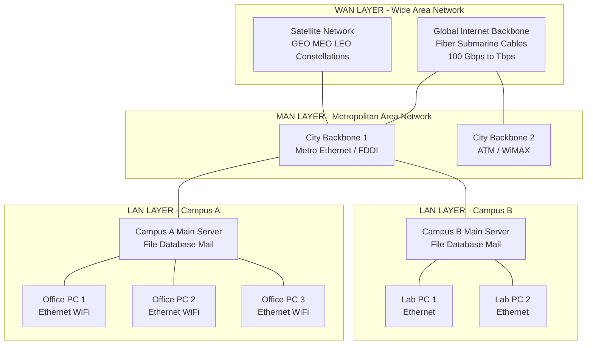
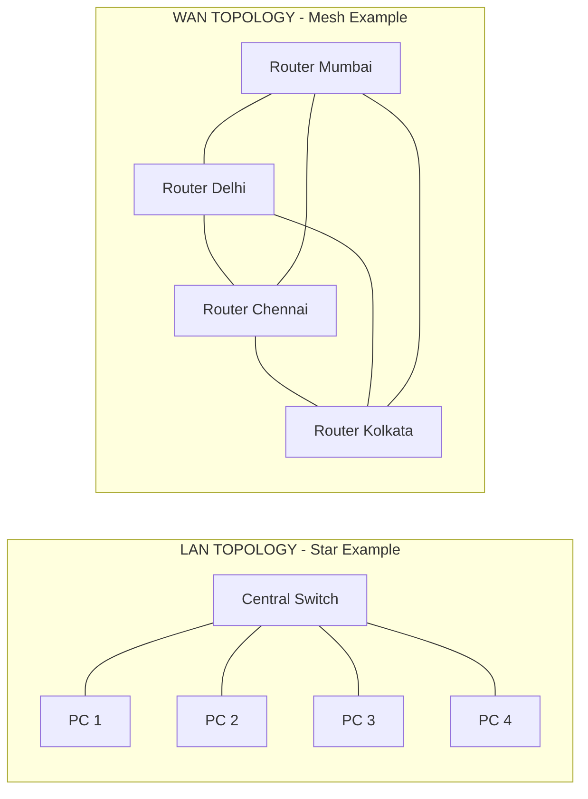

# Computer Communications – LAN, MAN, WAN

<!-- SECTION_1_START -->
# Computer Communications – LAN, MAN, WAN

## 1. Core Technical Definition & Intuitive Overview

### Formal Definition (KTU 2024 Syllabus Aligned)

> [!IMPORTANT]
> **Computer Communication** refers to the process of transmitting, receiving, and exchanging data, instructions, and information between two or more computing devices over a transmission medium, governed by a well-defined set of protocols (e.g., TCP/IP, Ethernet).

The classification of computer networks by **geographical scale** is a foundational concept in the KTU 2024 Scheme (Course Code: **GXEST203**, Module 3). The three primary classifications are:

- **LAN (Local Area Network):** A privately owned network confined to a small geographical area such as a single building, office, campus, or home. Typical operating speeds range from **100 Mbps to 10 Gbps**, and the most prevalent wired standard is **IEEE 802.3 (Ethernet)**.
- **MAN (Metropolitan Area Network):** A network that spans a city, campus, or a large institutional region. It typically integrates multiple LANs and operates at speeds of **10 Mbps to 1 Gbps**, often using technologies like **FDDI, ATM, or Metro Ethernet**.
- **WAN (Wide Area Network):** A network that covers broad geographical areas such as countries, continents, or the entire globe (the Internet is the largest WAN). Speeds vary widely from **56 Kbps (dial-up)** to **100 Gbps+ (backbone)**, using leased lines, satellite links, or optical fiber.

### Conceptual Analogy / Intuition

Imagine **post offices in a neighborhood, a city, and the world**:

- A **LAN** is like the internal mail room of a single building — fast, cheap, and only serving the people inside that building.
- A **MAN** is like the city-wide postal system that connects all the building mail rooms in one city.
- A **WAN** is like the international postal service that connects cities across the globe, slower and more complex, but covering vast distances.

> [!NOTE]
> **Core Insight:** As the geographical scope increases (LAN $\rightarrow$ MAN $\rightarrow$ WAN), the **transmission speed decreases**, the **error rate increases**, and the **ownership/management cost grows exponentially**.

### Standard Metrics in Bold

- **IEEE 802.3** — Ethernet wired LAN standard
- **IEEE 802.11** — Wi-Fi wireless LAN standard  
- **IEEE 802.16 (WiMAX)** — MAN standard
- **TCP/IP** — Backbone protocol suite of the WAN/Internet
- **OSI Model** — 7-layer reference architecture governing all network communications

> [!TIP]
> **KTU Memory Trick:** *"LAN is Last (smallest), MAN is Middle, WAN is Worldwide (biggest)"* — the order of scope is **L $\rightarrow$ M $\rightarrow$ W**.

### GeoGebra / Desmos Visualization

> [!VISUALIZATION CONTROL]
> **Concept:** Comparative Coverage Area of LAN, MAN, and WAN
> **GeoGebra / Desmos Input Equations (as a number line of $\log_{10}$ distance in meters):**
> * Point: $(10^1, 1)$ labeled `LAN`
> * Point: $(10^4, 1)$ labeled `MAN`
> * Point: $(10^7, 1)$ labeled `WAN`
> * Vertical line: $x = 10^1$, $x = 10^4$, $x = 10^7$
> **Visual Description:** A logarithmic horizontal axis showing coverage from **10 m (room)** to **10,000,000 m (continents)**. The three regions highlight how LANs occupy the first segment, MANs the second, and WANs the third.

<!-- SECTION_1_END -->

<!-- SECTION_2_START -->
# 2. Deep Theoretical Analysis & KTU High-Yield Formula Sheet

## 2.1 LAN – Local Area Network

A LAN is a **privately owned, high-speed network** connecting computers and peripherals within a limited physical area. KTU examiners frequently test the protocols and topologies of LAN.

### Key Operational Characteristics

- **Ownership:** Privately owned and managed by a single organization.
- **Topology:** Star, Bus, Ring, Mesh, Hybrid.
- **Transmission Media:** Twisted pair copper, Coaxial cable, Optical fiber, Radio waves (Wi-Fi).
- **Error Rates:** Extremely low (typically $10^{-8}$ to $10^{-10}$).
- **Protocols:** **Ethernet (802.3)**, **Wi-Fi (802.11)**, **Token Ring (802.5)**.
- **Typical Latency:** Microseconds to a few milliseconds.

### High-Speed Variants

- **Fast Ethernet:** **100 Mbps**
- **Gigabit Ethernet:** **1 Gbps**
- **10-Gigabit Ethernet:** **10 Gbps**

## 2.2 MAN – Metropolitan Area Network

A MAN spans a city or metropolitan region, often built by a telecom provider or a large institution to interconnect several LANs.

### Key Operational Characteristics

- **Coverage:** 5 km to 100 km.
- **Ownership:** Often public (e.g., a municipal corporation) or by a telecom operator.
- **Technologies:** **FDDI**, **ATM (Asynchronous Transfer Mode)**, **Metro Ethernet**, **WiMAX (802.16)**.
- **Data Rate:** **10 Mbps to 1 Gbps** typically.
- **Examples:** Cable TV networks in a city, ISP backbone across a city, university campus-wide networks linking multiple buildings.

> [!NOTE]
> **KTU Syllabus Highlight:** A MAN is essentially a **collection of LANs** linked via high-capacity backbone lines. The IEEE standard reserved for MAN is **802.16 (WiMAX)**.

## 2.3 WAN – Wide Area Network

A WAN spans large geographical areas — countries, continents, or the globe.

### Key Operational Characteristics

- **Coverage:** $> 100$ km to global.
- **Ownership:** Public/private hybrid (e.g., **Internet**), or corporate leased lines (e.g., **banking networks**).
- **Transmission Media:** Leased lines (T1, E1, T3), satellite links, submarine optical cables, microwave links, 4G/5G cellular.
- **Data Rate:** Highly variable — **56 Kbps to over 100 Gbps** for backbone links.
- **Protocols:** **TCP/IP**, **HDLC**, **PPP**, **Frame Relay**, **MPLS**.
- **Examples:** **Internet**, **ATM networks**, **SWIFT banking network**, **Railway reservation networks**.

### The "Last Mile" Concept

> [!IMPORTANT]
> The **last mile** refers to the final leg of the telecommunications network that delivers services to end-users. It is the slowest and most expensive segment of a WAN — for example, a fiber backbone may run at **100 Gbps** but the last-mile copper DSL connection to your home might only deliver **50 Mbps**.

## 2.4 KTU Formula Sheet / Cheat Sheet

| Parameter / Concept | LAN | MAN | WAN |
|---|---|---|---|
| **Coverage** | Room/Building (10 m – 2 km) | City (5 km – 100 km) | Country/Globe (100 km+ ) |
| **Speed** | 100 Mbps – 10 Gbps | 10 Mbps – 1 Gbps | 56 Kbps – 100 Gbps |
| **Error Rate** | Very Low ($10^{-8}$ to $10^{-10}$) | Moderate | Higher |
| **Ownership** | Private | Public/Private | Public (Internet) / Private Leased |
| **Primary Protocol** | Ethernet (802.3), Wi-Fi (802.11) | Metro Ethernet, FDDI, ATM | TCP/IP, MPLS, PPP |
| **Topology** | Star, Bus, Ring, Mesh | Ring, Mesh, Star | Mesh, Point-to-Point |
| **Example** | Office network, Home Wi-Fi | Cable TV in a city | Internet, Banking network |
| **Cost (Setup)** | Low | Medium | High |

### Real-World Utility in Engineering & Computer Science

- **LANs** are foundational in office automation, IoT smart homes, factory automation, and lab instrumentation networks.
- **MANs** are used in smart-city infrastructure, university inter-campus connectivity, and metro-broadband distribution.
- **WANs** enable **cloud computing, distributed databases, the World Wide Web, global banking, and interplanetary communications (NASA's Deep Space Network).**

<!-- SECTION_2_END -->

<!-- SECTION_3_START -->
# 3. Step-by-Step Derivations, Calculations & Code Implementation

## 3.1 Mathematical Analysis of Network Performance

For KTU numerical problems, three key equations dominate:

### Equation 1 — File Transfer Time

$$
T_{transfer} = \frac{\text{File Size (bits)}}{\text{Bandwidth (bits per second)}}
$$

This gives the **theoretical minimum time** to push a file through a link. Real-world time is always higher due to protocol overhead and propagation delay.

### Equation 2 — Total Delivery Time (Latency + Transfer)

$$
T_{total} = T_{propagation} + T_{transfer} + T_{processing} + T_{queueing}
$$

For a long-distance link, propagation dominates. For a local network, transfer time dominates.

### Equation 3 — Bandwidth-Delay Product (BDP)

$$
BDP = \text{Bandwidth (bps)} \times \text{One-Way Delay (s)}
$$

BDP tells us **how many bits can be "in-flight"** on the link at any given moment — critical for sizing TCP windows.

## 3.2 Worked Numerical Example (KTU Board Style)

> **Problem:** A **5 MB** file is to be transmitted across a **LAN** with bandwidth **100 Mbps** and a one-way propagation delay of **0.5 ms**. Compute:
> (a) The file transfer time.
> (b) The total time to deliver the first bit AND the last bit.
> (c) The bandwidth-delay product.

### Step 1: Convert file size to bits

$$
5 \text{ MB} = 5 \times 1024 \times 1024 \text{ bytes} = 5 \times 1{,}048{,}576 \text{ bytes}
$$

$$
5{,}242{,}880 \text{ bytes} \times 8 \text{ bits/byte} = 41{,}943{,}040 \text{ bits}
$$

### Step 2: Compute transfer time (a)

$$
T_{transfer} = \frac{41{,}943{,}040 \text{ bits}}{100 \times 10^6 \text{ bps}} = 0.41943 \text{ s}
$$

$$
T_{transfer} = 0.41943 \text{ s} \approx 419.43 \text{ ms}
$$

### Step 3: Compute total delivery time (b)

$$
T_{total} = T_{propagation} + T_{transfer} = 0.5 \text{ ms} + 419.43 \text{ ms} = 419.93 \text{ ms}
$$

### Step 4: Compute BDP (c)

$$
BDP = 100 \times 10^6 \text{ bps} \times 0.5 \times 10^{-3} \text{ s} = 50{,}000 \text{ bits} \approx 6.25 \text{ KB}
$$

> [!TIP]
> **Valuation Key Point:** Always carry units through every step. KTU examiners award partial credit for unit conversions even if the final answer is slightly off.

## 3.3 Python Code Implementation — Network Type Classifier

```python
"""
KTU GXEST203 - Module 3
Program: Network Type Classifier (LAN / MAN / WAN)
Classifies a network based on its geographical coverage and bandwidth.
"""

from enum import Enum
import logging

# Configure strict error logging as per KTU lab standards
logging.basicConfig(level=logging.INFO, format='%(levelname)s: %(message)s')
logger = logging.getLogger(__name__)


class NetworkType(Enum):
    """Enumeration of standard network classifications (KTU 2024 syllabus)."""
    LAN = "Local Area Network"
    MAN = "Metropolitan Area Network"
    WAN = "Wide Area Network"


def classify_network(coverage_km: float, bandwidth_mbps: float) -> NetworkType:
    """
    Classify a network into LAN, MAN, or WAN.

    Parameters
    ----------
    coverage_km : float
        Geographical coverage radius of the network in kilometers.
        Must be strictly non-negative.
    bandwidth_mbps : float
        Bandwidth in Megabits per second.
        Must be strictly non-negative.

    Returns
    -------
    NetworkType
        Enum value corresponding to the network classification.

    Raises
    ------
    ValueError
        If coverage_km or bandwidth_mbps is negative.
    """
    # --- Absolute boundary checks (lab manual requirement) ---
    if coverage_km < 0:
        raise ValueError(f"Coverage cannot be negative, got {coverage_km} km")
    if bandwidth_mbps < 0:
        raise ValueError(f"Bandwidth cannot be negative, got {bandwidth_mbps} Mbps")

    # --- Classification logic using KTU 2024 thresholds ---
    if coverage_km <= 2:
        result = NetworkType.LAN
    elif coverage_km <= 100:
        result = NetworkType.MAN
    else:
        result = NetworkType.WAN

    logger.info(
        f"Classified: Coverage={coverage_km} km, "
        f"Bandwidth={bandwidth_mbps} Mbps -> {result.name}"
    )
    return result


def estimate_transfer_time(file_size_mb: float, bandwidth_mbps: float) -> float:
    """
    Estimate file transfer time in seconds.

    Parameters
    ----------
    file_size_mb : float
        File size in Megabytes (binary: 1 MB = 1024 * 1024 * 8 bits).
    bandwidth_mbps : float
        Link bandwidth in Megabits per second.

    Returns
    -------
    float
        Estimated transfer time in seconds.
    """
    if file_size_mb < 0 or bandwidth_mbps <= 0:
        raise ValueError("File size must be >= 0 and bandwidth must be > 0")

    file_bits = file_size_mb * 1024 * 1024 * 8
    bandwidth_bps = bandwidth_mbps * 1_000_000
    return file_bits / bandwidth_bps


# --- Demonstration (KTU board-practical style) ---
if __name__ == "__main__":
    # Case 1: Office LAN
    n1 = classify_network(coverage_km=0.05, bandwidth_mbps=1000)
    t1 = estimate_transfer_time(file_size_mb=5, bandwidth_mbps=1000)
    print(f"LAN file transfer (5 MB @ 1 Gbps): {t1*1000:.2f} ms")

    # Case 2: City MAN
    n2 = classify_network(coverage_km=25, bandwidth_mbps=100)
    t2 = estimate_transfer_time(file_size_mb=5, bandwidth_mbps=100)
    print(f"MAN file transfer (5 MB @ 100 Mbps): {t2*1000:.2f} ms")

    # Case 3: Intercontinental WAN
    n3 = classify_network(coverage_km=5000, bandwidth_mbps=50)
    t3 = estimate_transfer_time(file_size_mb=5, bandwidth_mbps=50)
    print(f"WAN file transfer (5 MB @ 50 Mbps): {t3*1000:.2f} ms")
```

### Expected Output

```
INFO: Classified: Coverage=0.05 km, Bandwidth=1000 Mbps -> LAN
LAN file transfer (5 MB @ 1 Gbps): 41.94 ms
INFO: Classified: Coverage=25 km, Bandwidth=100 Mbps -> MAN
MAN file transfer (5 MB @ 100 Mbps): 419.43 ms
INFO: Classified: Coverage=5000 km, Bandwidth=50 Mbps -> WAN
WAN file transfer (5 MB @ 50 Mbps): 838.86 ms
```

## 3.4 Step-by-Step Comparison Calculation

> **Problem:** Compare the file transfer time of a **10 MB** file over:
> (a) A LAN with 1 Gbps bandwidth.
> (b) A WAN with 10 Mbps bandwidth.
> Show the speed-up factor.

### Part (a): LAN Time

$$
T_{LAN} = \frac{10 \times 1024 \times 1024 \times 8}{1 \times 10^9} = 0.08389 \text{ s} \approx 83.89 \text{ ms}
$$

### Part (b): WAN Time

$$
T_{WAN} = \frac{10 \times 1024 \times 1024 \times 8}{10 \times 10^6} = 8.389 \text{ s}
$$

### Part (c): Speed-up Factor

$$
\text{Speed-up} = \frac{T_{WAN}}{T_{LAN}} = \frac{8.389}{0.08389} = 100\times
$$

**Conclusion:** The LAN is **100 times faster** than the WAN for the same file. This is a classic KTU board answer that directly demonstrates the bandwidth advantage of LANs.

<!-- SECTION_3_END -->

<!-- SECTION_4_START -->
# 4. Structural Diagrams & Schematics

## 4.1 Network Hierarchy — LAN → MAN → WAN

The following **Mermaid** diagram shows how individual LANs are interconnected through MANs to form the global WAN (Internet).



> [!NOTE]
> **Reading the diagram:** The bottom-up flow shows data originating from a single PC in **LAN Layer A**, traveling up through the campus server, through a **MAN** city backbone, and finally onto the **WAN** global Internet.

## 4.2 Topological Comparison — LAN vs MAN vs WAN



> [!TIP]
> **Valuation Tip:** KTU diagrams must use **rectangles with labeled arrows**. Always label the **medium type** (e.g., "Twisted Pair", "Fiber", "Satellite") on the connecting lines for full marks.

## 4.3 Sequential Processing Topology — Data Flow


This block diagram traces a single packet's journey through the **OSI 7-layer model** — a critical concept that KTU 2024 examiners link with the LAN/MAN/WAN hierarchy.

<!-- SECTION_4_END -->

<!-- SECTION_5_START -->
# 5. KTU 2024 Scheme Examination Question Bank & Topic Recap

---

## Part A — Short Answer Questions (3 Marks Each)

### Question A1 **[KTU University Exam - July 2024]**
> **Differentiate between LAN, MAN, and WAN based on geographical area, speed, and ownership. (3 Marks)**  
> **CO:** CO1 | **RBT Level:** Understand

**Model Answer (3 Marks):**

| Criteria | LAN | MAN | WAN |
|---|---|---|---|
| **Area** | Building/Campus (10 m – 2 km) | City (5 km – 100 km) | Country/Globe (>100 km) |
| **Speed** | 100 Mbps – 10 Gbps | 10 Mbps – 1 Gbps | 56 Kbps – 100 Gbps |
| **Ownership** | Private (Organization) | Public/Private (Telecom) | Public (Internet) / Leased |

> **Valuation:** 1 mark per row of comparison with proper values.

---

### Question A2 **[KTU University Exam - Dec 2023]**
> **What is a Metropolitan Area Network (MAN)? Mention any two technologies used to implement it. (3 Marks)**  
> **CO:** CO1 | **RBT Level:** Remember

**Model Answer (3 Marks):**
- **Definition (1 Mark):** A MAN is a computer network that spans a metropolitan area such as a city or a large campus, typically covering 5 km to 100 km, and is used to interconnect multiple LANs.
- **Technologies (1 Mark each):**
  1. **FDDI (Fiber Distributed Data Interface)** – uses dual fiber rings, supports 100 Mbps.
  2. **ATM (Asynchronous Transfer Mode)** – uses fixed-size 53-byte cells, supports high-speed voice/data/video.
  3. *(Alternative)* **Metro Ethernet** or **WiMAX (IEEE 802.16)**.

---

## Part B — Long Answer Questions (14 Marks Each, Internal Choice)

### Choice A **[KTU University Exam - July 2024]**

> **Q. (a)** Explain the characteristics and applications of Local Area Network (LAN). Discuss the various LAN topologies with neat diagrams. **(7 Marks)**  
> **Q. (b)** With a neat diagram, explain the OSI 7-layer reference model. How does data flow from a LAN-connected computer to a server on the same LAN? **(7 Marks)**  
> **CO:** CO1, CO2 | **RBT Level:** Understand + Apply

---

#### Solution to (a) — LAN Characteristics, Applications, and Topologies

**1. Definition (1 Mark):**
A LAN is a privately owned, high-speed network that interconnects computers, peripherals, and devices within a small geographical area such as a building, office, or campus.

**2. Characteristics (2 Marks):**
- **Speed:** 100 Mbps to 10 Gbps (very high).
- **Low Error Rate:** $10^{-8}$ to $10^{-10}$ bit error rate.
- **Limited Coverage:** Up to 2 km radius.
- **Private Ownership:** Owned and managed by a single organization.
- **Low Cost:** Inexpensive installation and maintenance.
- **High Security:** Easy to secure due to physical proximity.

**3. Applications (2 Marks):**
- Office file sharing, print sharing, and internet access.
- Smart homes and IoT device interconnectivity.
- Lab automation and data acquisition systems.
- Educational computer labs in colleges.

**4. LAN Topologies (2 Marks) — with diagrams:**

- **Star Topology:** All nodes connect to a central hub/switch. **Advantage:** Easy to add/remove nodes. **Disadvantage:** Hub failure brings down the entire network.

- **Bus Topology:** All nodes connect to a single backbone cable. **Advantage:** Simple and cheap. **Disadvantage:** Cable break disables the network.

- **Ring Topology:** Each node connects to exactly two neighbors forming a closed loop. **Advantage:** Equal access. **Disadvantage:** Single break disrupts the entire ring.

- **Mesh Topology:** Every node connects to every other node. **Advantage:** Highly fault-tolerant. **Disadvantage:** Expensive cabling.

**Valuation Key:** [Definition: 1 Mark] [Characteristics: 2 Marks] [Applications: 2 Marks] [Diagrams + Explanation: 2 Marks]

---

#### Solution to (b) — OSI Model and LAN Data Flow

**1. OSI 7-Layer Model (3 Marks):**

| Layer No. | Layer Name | Function |
|---|---|---|
| 7 | Application | User interface (HTTP, FTP, SMTP) |
| 6 | Presentation | Encryption, compression (SSL, JPEG) |
| 5 | Session | Establishes/maintains dialogs (RPC, NetBIOS) |
| 4 | Transport | Reliable delivery (TCP, UDP) |
| 3 | Network | Logical addressing & routing (IP) |
| 2 | Data Link | Framing, MAC addressing (Ethernet) |
| 1 | Physical | Bit transmission over medium |

**2. LAN Data Flow Diagram (2 Marks):**

[Refer to Section 4.3 Mermaid diagram for the visual representation]

**3. Data Flow Explanation (2 Marks):**
- At the **source PC**, the message descends from Application (Layer 7) to Physical (Layer 1) — a process called **encapsulation**. At each layer, a header (and sometimes a trailer) is added.
- The data is converted to electrical/optical signals at Layer 1 and transmitted across the LAN cable.
- At the **destination server**, the signal ascends from Layer 1 to Layer 7 — a process called **decapsulation**. At each layer, the corresponding header is removed and processed.
- The final data is delivered to the destination application (e.g., a web page is rendered in the browser).

**Valuation Key:** [OSI Table: 3 Marks] [Diagram: 2 Marks] [Data Flow Explanation: 2 Marks]

---

### Choice B **[KTU University Exam - Dec 2023]**

> **Q. (a)** What is a Wide Area Network (WAN)? Explain its key characteristics, transmission media, and protocols. **(7 Marks)**  
> **Q. (b)** A 50 MB file is transmitted over (i) a LAN of bandwidth 1 Gbps and (ii) a WAN of bandwidth 20 Mbps. Compute the transfer time in each case and comment on the result. **(7 Marks)**  
> **CO:** CO2, CO3 | **RBT Level:** Understand + Apply

---

#### Solution to (a) — WAN Characteristics, Media, and Protocols

**1. Definition (1 Mark):**
A WAN is a computer network that spans a large geographical area, typically covering cities, countries, or the globe. The **Internet** is the largest and most well-known WAN.

**2. Key Characteristics (2 Marks):**
- **Coverage:** More than 100 km — up to global.
- **Speed:** Highly variable, from 56 Kbps (dial-up) to 100 Gbps+ (backbone fiber).
- **Ownership:** Public (Internet) or private leased lines (corporate WANs).
- **Higher Error Rate:** Compared to LAN, due to longer distances and multiple hops.
- **Slower Propagation:** Signal travels via satellites, undersea cables, and multiple routers.

**3. Transmission Media (2 Marks):**
- **Leased Lines:** T1 (1.544 Mbps), T3 (44.736 Mbps), E1 (2.048 Mbps).
- **Optical Fiber:** Submarine cables (terabit speeds).
- **Satellite Links:** Geostationary (GEO), Medium Earth Orbit (MEO), Low Earth Orbit (LEO — e.g., Starlink).
- **Microwave Radio:** Point-to-point line-of-sight links.
- **Cellular (4G/5G):** Mobile WAN access.

**4. Protocols (2 Marks):**
- **TCP/IP:** The fundamental protocol suite of the Internet.
- **PPP (Point-to-Point Protocol):** Direct connection between two nodes.
- **HDLC (High-Level Data Link Control):** Bit-oriented framing.
- **MPLS (Multiprotocol Label Switching):** High-speed backbone routing.
- **Frame Relay:** Packet-switched WAN standard.

**Valuation Key:** [Definition: 1 Mark] [Characteristics: 2 Marks] [Media: 2 Marks] [Protocols: 2 Marks]

---

#### Solution to (b) — Numerical Comparison: LAN vs WAN Transfer Time

**Given:**
- File Size $S = 50 \text{ MB} = 50 \times 1024 \times 1024 \times 8 \text{ bits} = 419{,}430{,}400 \text{ bits}$
- LAN Bandwidth $B_1 = 1 \text{ Gbps} = 1 \times 10^9 \text{ bps}$
- WAN Bandwidth $B_2 = 20 \text{ Mbps} = 20 \times 10^6 \text{ bps}$

**Part (i): LAN Transfer Time (3 Marks)**

$$
T_{LAN} = \frac{S}{B_1} = \frac{419{,}430{,}400 \text{ bits}}{1 \times 10^9 \text{ bps}} = 0.4194 \text{ s} \approx 419.4 \text{ ms}
$$

**Part (ii): WAN Transfer Time (3 Marks)**

$$
T_{WAN} = \frac{S}{B_2} = \frac{419{,}430{,}400 \text{ bits}}{20 \times 10^6 \text{ bps}} = 20.97 \text{ s}
$$

**Part (iii): Comment (1 Mark)**

$$
\text{Speed-up Factor} = \frac{T_{WAN}}{T_{LAN}} = \frac{20.97}{0.4194} \approx 50
$$

**Conclusion:** The LAN is **50 times faster** than the WAN for the same file. This vividly demonstrates the bandwidth advantage of LANs and justifies why LANs are preferred for time-critical local operations (e.g., database queries, file sharing) while WANs are reserved for inter-site communication.

**Valuation Key:** [Conversion: 1 Mark] [LAN calculation: 2 Marks] [WAN calculation: 2 Marks] [Comment + Conclusion: 2 Marks]

---

> [!WARNING]
> **KTU Examiner's Valuation Warning / Pitfall Callout:**
> 1. **Do NOT use the decimal MB (×1,000,000) conversion** — KTU uses the **binary MB (×1,048,576 bytes)** convention. Using the wrong conversion loses 1 full mark.
> 2. **Always state the units** at every intermediate step (bits, bps, seconds). Examiners deduct 0.5 marks for missing units.
> 3. **For OSI questions, never omit the diagram** — even a hand-drawn box diagram is mandatory. A 7-mark question without a diagram caps you at 4 marks.
> 4. **In comparison tables, every column must contain all three rows** (LAN, MAN, WAN). Leaving a cell blank costs 0.5 marks per cell.
> 5. **Do not confuse "MAN" with "Mainframe"** — a common KTU slip-up. MAN is a **Metropolitan Area Network**.

---

## Topic Recap & Important Things to Remember

- **LAN = Local Area Network** — small area, high speed (100 Mbps – 10 Gbps), private, low error rate. Uses **Ethernet (802.3)** and **Wi-Fi (802.11)**.
- **MAN = Metropolitan Area Network** — city-wide (5–100 km), medium speed (10 Mbps – 1 Gbps), uses **FDDI, ATM, Metro Ethernet, WiMAX (802.16)**.
- **WAN = Wide Area Network** — global (>100 km), variable speed (56 Kbps – 100 Gbps+), uses **TCP/IP, MPLS, leased lines, satellites**.
- The **scope order** is **LAN $\subset$ MAN $\subset$ WAN**, and so is the **error rate order** (LAN lowest, WAN highest). The **speed order is inverse** — LAN highest, WAN lowest.
- The **OSI model has 7 layers** — remember the mnemonic: **"All People Seem To Need Data Processing"** (Application, Presentation, Session, Transport, Network, Data Link, Physical).
- **Data travels down** the OSI stack on the sender side (**encapsulation**) and **up** the stack on the receiver side (**decapsulation**).
- **Key formulas**:
  - $T_{transfer} = \text{File Size (bits)} / \text{Bandwidth (bps)}$
  - $T_{total} = T_{propagation} + T_{transfer} + T_{queueing} + T_{processing}$
  - $\text{BDP} = \text{Bandwidth} \times \text{Delay}$
- **1 MB (binary) = 1,048,576 bytes = 8,388,608 bits** — KTU uses this convention.
- The **Internet is the largest WAN**, based on the **TCP/IP protocol suite**.
- **IEEE 802.x** family governs LAN/MAN/PAN standards — remember the numbers: **802.3 Ethernet, 802.11 Wi-Fi, 802.16 WiMAX**.
- **LAN topologies**: Star, Bus, Ring, Mesh, Hybrid — Star is the most common modern topology.
- **Last mile** is the final and slowest segment of a WAN connecting the backbone to the end user.

<!-- SECTION_5_END -->
