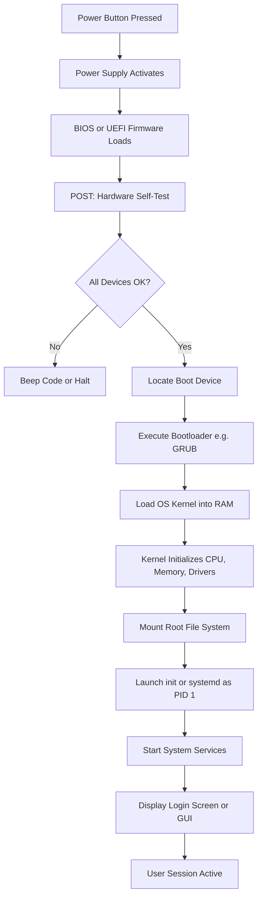
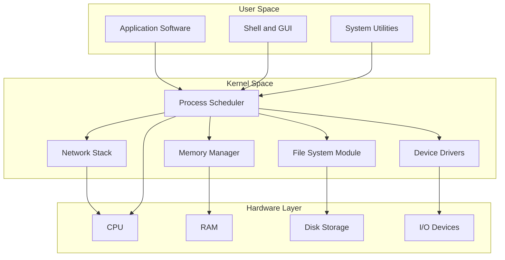
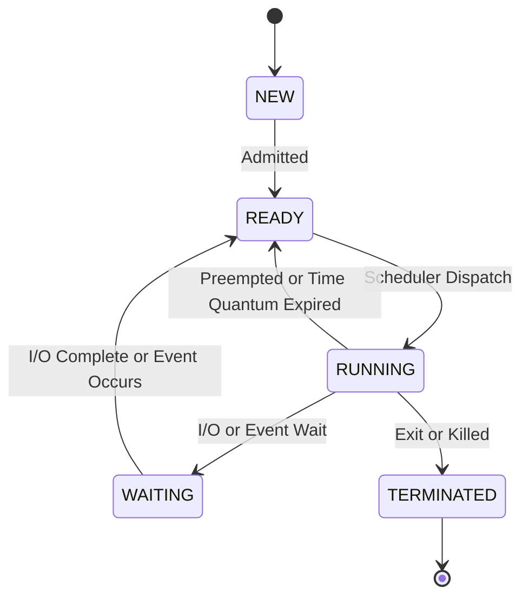
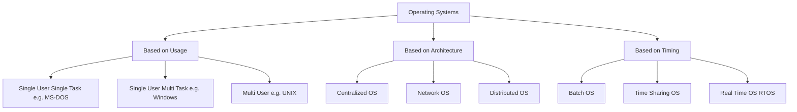

# Computer System Software - Operating Systems

<!-- SECTION_1_START -->

# Computer System Software: Operating Systems

## 1.1 What is System Software?

**System Software** is a category of computer programs designed to operate, control, and extend the processing capabilities of a computer system. Unlike application software (which performs tasks for the end user), system software manages the hardware resources and provides a platform for application software to run.

> [!NOTE]
> **KTU 2024 Syllabus Definition (GXEST203 Module 3):** System software acts as the *intermediary layer* between the user, the application programs, and the underlying computer hardware. The two principal categories are the **Operating System (OS)** and **Language Translators**. Utility programs (disk formatters, antivirus, backup tools) are also classified under system software.

### 1.2 Classification of Software — A Bird's-Eye View

$$
\text{Computer Software} = \begin{cases} \text{System Software} \begin{cases} \text{Operating System} \\ \text{Language Translators (Compilers/Interpreters/Assemblers)} \\ \text{Utility Programs} \end{cases} \\ \text{Application Software} \begin{cases} \text{General-purpose (MS Word, Excel)} \\ \text{Special-purpose (Tally, MATLAB)} \end{cases} \end{cases}
$$

### 1.3 What is an Operating System? — The Formal Definition

An **Operating System (OS)** is a system software program that acts as an **interface between the user and the computer hardware**. It manages hardware resources, provides essential services, and creates an environment in which application programs can execute.

> [!IMPORTANT]
> **Core Functions of an OS (The "5 Pillars"):**
> 1. **Process Management** — Manages running programs (processes).
> 2. **Memory Management** — Allocates and deallocates RAM efficiently.
> 3. **File System Management** — Organizes data on secondary storage.
> 4. **I/O Device Management** — Controls input/output devices via drivers.
> 5. **Security & Protection** — Enforces access control and user authentication.

### 1.4 Intuitive Analogy — The OS as a Hotel Manager 🏨

Imagine a **large hotel** with hundreds of rooms (the **RAM**), many guests arriving and leaving (**processes**), a kitchen that prepares food (**CPU**), and a parking lot (**hard disk**).

- The **Hotel Manager** is the **Operating System**.
- The Manager **allocates rooms** to guests → *Memory Management*.
- The Manager decides **who gets the kitchen first** → *Process Scheduling*.
- The Manager **stores luggage safely** and gives claim tickets → *File System*.
- The Manager **hires bouncers** at the gate → *Security & Protection*.

Without the Manager, every guest would fight for rooms, and the hotel would collapse. Similarly, without an OS, no application can run on raw hardware.

### 1.5 Standard Metrics & Key Terminology

- **Boot Time**: The duration (typically **5–30 seconds** on modern PCs) from pressing the power button to the OS being fully loaded.
- **Kernel Space vs User Space**: The OS kernel runs in **privileged mode** (Ring 0), while applications run in **unprivileged mode** (Ring 3) on x86 architectures.
- **System Call**: A programmatic request made by an application to the OS kernel for a privileged operation (e.g., `open()`, `read()`, `fork()` in Unix/Linux).

> [!VISUALIZATION CONTROL]
> **Concept:** Layered Architecture of an Operating System (Concentric Rings)
>
> **Visual Description:** Draw four concentric semi-circles on the coordinate plane. The innermost band represents the **Hardware (CPU, RAM, Disk)**. Wrapping around it is the **Kernel** (the OS core). Above the kernel lies the **Shell & System Utilities**. The outermost band is the **User Applications**. Arrows show bi-directional data flow between adjacent layers.
>
> **Suggested Plotting Reference (for classroom whiteboard):**
> * Inner ring radius = **2 units** (Hardware)
> * Middle ring radius = **4 units** (Kernel)
> * Outer ring radius = **6 units** (Shell)
> * Outermost ring radius = **8 units** (Applications)

---

<!-- SECTION_1_END -->

<!-- SECTION_2_START -->

# Deep Theoretical Analysis & KTU High-Yield Formula Sheet

## 2.1 Major Functions of an Operating System

### A. Process Management
A **process** is a program in execution. The OS is responsible for:
- **Creating** and **terminating** processes.
- **Scheduling** processes on the CPU (which process runs now, which waits).
- **Synchronization** and **inter-process communication (IPC)**.
- **Deadlock handling** (detection, prevention, recovery).

### B. Memory Management
The OS tracks every byte of memory and decides which process gets which region of RAM.
- Techniques: **Paging**, **Segmentation**, **Virtual Memory**, **Swapping**.
- Goal: Maximize throughput while preventing one process from accessing another's memory.

### C. File System Management
A **file** is a named collection of related information stored on secondary storage.
- The OS organizes files into **directories/folders** using a hierarchical structure.
- Common file systems: **FAT32**, **NTFS** (Windows), **ext4** (Linux), **APFS** (macOS).

### D. I/O Device Management
The OS uses **device drivers** to communicate with hardware like keyboards, printers, and disks.
- Techniques: **Polling**, **Interrupts**, **DMA (Direct Memory Access)**.

### E. Security & Protection
- **Authentication** (passwords, biometrics).
- **Authorization** (read/write/execute permissions).
- **Firewalling** and **encryption** support.

## 2.2 Types of Operating Systems

| **Type** | **Key Idea** | **Example** |
|----------|--------------|-------------|
| **Batch OS** | Jobs grouped and processed in batches, no user interaction. | Early mainframes (1960s) |
| **Time-Sharing OS** | Multiple users share CPU time via rapid context switching. | UNIX, Multics |
| **Multiprogramming OS** | Multiple programs in memory simultaneously to keep CPU busy. | OS/360 |
| **Real-Time OS (RTOS)** | Guaranteed response time within strict deadlines. | QNX, VxWorks, RTLinux |
| **Distributed OS** | Manages a group of networked computers as a single system. | Amoeba, Plan 9 |
| **Network OS** | Provides networking services and file sharing across a LAN. | Windows Server, Linux (NFS) |
| **Mobile OS** | Optimized for touch-based, low-power mobile devices. | Android, iOS |
| **Single-User, Single-Task** | One user, one program at a time. | MS-DOS |
| **Single-User, Multi-Task** | One user, multiple programs. (Most desktops/laptops.) | Windows 10/11, macOS |

## 2.3 Components / Architecture of an OS

A modern OS is typically divided into the following structural components:

1. **Kernel** — The heart of the OS. Manages CPU, memory, and devices. Runs in **kernel mode**.
2. **Shell** — The interface (CLI or GUI) that lets users invoke OS services.
3. **File System** — Organizes and stores data on disks.
4. **Device Drivers** — Specialized programs that control hardware devices.
5. **System Libraries** — Pre-written code (e.g., `glibc` on Linux) that applications link against to make system calls.
6. **System Utilities** — Tools for disk management, backup, antivirus, etc.

### 2.4 Kernel Architecture Styles

| **Architecture** | **Description** | **Pros** | **Cons** |
|------------------|-----------------|----------|----------|
| **Monolithic Kernel** | All services (file system, drivers, network) run in kernel space. | High performance. | One bug can crash the whole system. |
| **Microkernel** | Only essential services in kernel; rest runs in user space. | Highly stable, modular. | Performance overhead from message passing. |
| **Modular Kernel** | Kernel split into loadable modules (e.g., Linux). | Balance of speed and modularity. | Slightly more complex design. |
| **Hybrid Kernel** | Combines microkernel and monolithic ideas. | Used in Windows NT and macOS XNU. | Design complexity. |

> [!IMPORTANT]
> **Linux** uses a **Monolithic + Modular** hybrid. **Windows NT** uses a **Hybrid** kernel. **macOS (XNU)** uses a **Hybrid** kernel with Mach microkernel roots.

## 2.5 The Boot Process — From Power Button to Desktop

The journey from pressing the power button to seeing the login screen is called **booting**. It has a precise sequence:

1. **Power-On Self-Test (POST)** — Hardware diagnostic performed by the BIOS/UEFI firmware stored on the motherboard ROM.
2. **Bootstrap Loader** — Firmware locates the bootloader (e.g., GRUB on Linux, Windows Boot Manager).
3. **Bootloader Execution** — Loads the OS kernel into RAM.
4. **Kernel Initialization** — Kernel initializes hardware, mounts the root file system, and starts the first user-space process (`init` or `systemd` on Linux; `smss.exe` on Windows).
5. **System Services Start** — Background services (network, logging, audio) are launched.
6. **Login Screen / Desktop** — The user is presented with the GUI.

## 2.6 KTU High-Yield Formula / Concept Sheet

| **Concept** | **Formula / Rule** | **Unit / Note** |
|-------------|--------------------|------------------|
| **CPU Utilization** | $U = 1 - p^n$ (where $p$ = idle probability, $n$ = processes) | Expressed as a fraction $(0, 1)$ |
| **Turnaround Time (TAT)** | $TAT = \text{Completion Time} - \text{Arrival Time}$ | Seconds |
| **Waiting Time (WT)** | $WT = TAT - \text{Burst Time}$ | Seconds |
| **Throughput** | $\text{Throughput} = \dfrac{\text{Number of Processes}}{\text{Total Time}}$ | Processes per second |
| **Page Fault Rate** | $\text{PFR} = \dfrac{\text{Page Faults}}{\text{Total Memory Accesses}}$ | Ratio $(0, 1)$ |
| **Effective Access Time (Paging)** | $EAT = (1 - p) \cdot t_m + p \cdot (t_m + t_p)$ | Where $p$ = page fault rate, $t_m$ = memory access, $t_p$ = page service |
| **Boot Time** | $T_{boot} = T_{POST} + T_{bootloader} + T_{kernel} + T_{services}$ | Seconds |

> [!NOTE]
> **Real-World Engineering Utility:** OS concepts power every modern device — from smartphones (Android uses the Linux kernel) to ATMs (RTOS like Windows IoT), from space shuttles (VxWorks) to cloud servers (Linux + KVM virtualization). Mastering these concepts is a prerequisite for courses in Computer Networks, Cloud Computing, Embedded Systems, and Cybersecurity.

---

<!-- SECTION_2_END -->

<!-- SECTION_3_START -->

# Step-by-Step Derivations, Worked Examples & Code Implementation

## 3.1 Worked Example — FCFS Process Scheduling (Calculating TAT & WT)

**Problem Statement:**
Given three processes arriving at time $0$ with the following burst times, calculate the **Average Turnaround Time (ATAT)** and **Average Waiting Time (AWT)** using **First-Come, First-Served (FCFS)** scheduling.

| **Process** | **Arrival Time (AT)** | **Burst Time (BT)** |
|-------------|------------------------|---------------------|
| P1          | 0                      | 4                   |
| P2          | 0                      | 3                   |
| P3          | 0                      | 2                   |

### Solution — Step-by-Step Derivation

**Step 1: Build the Gantt Chart (execution order on CPU).**

$$
\begin{aligned}
\text{Gantt Chart (Time on X-axis, Processes on Y-axis):} \\
\text{Time:}\quad 0 \quad\;\; 1 \quad\;\; 2 \quad\;\; 3 \quad\;\; 4 \quad\;\; 5 \quad\;\; 6 \quad\;\; 7 \quad\;\; 8 \quad\;\; 9 \\
\text{Process:}\;\; |P1|P1|P1|P1|P2|P2|P2|P3|P3|
\end{aligned}
$$

Since all processes arrive at time $0$, the order is simply **P1 → P2 → P3** (the order given).

**Step 2: Compute the Completion Time (CT) for each process.**

$$
\begin{aligned}
CT_{P1} &= 0 + 4 = 4 \\
CT_{P2} &= 4 + 3 = 7 \\
CT_{P3} &= 7 + 2 = 9
\end{aligned}
$$

**Step 3: Compute the Turnaround Time for each process using the formula $TAT = CT - AT$.**

$$
\begin{aligned}
TAT_{P1} &= 4 - 0 = 4 \text{ units} \\
TAT_{P2} &= 7 - 0 = 7 \text{ units} \\
TAT_{P3} &= 9 - 0 = 9 \text{ units}
\end{aligned}
$$

**Step 4: Compute the Waiting Time for each process using the formula $WT = TAT - BT$.**

$$
\begin{aligned}
WT_{P1} &= 4 - 4 = 0 \text{ units} \\
WT_{P2} &= 7 - 3 = 4 \text{ units} \\
WT_{P3} &= 9 - 2 = 7 \text{ units}
\end{aligned}
$$

**Step 5: Compute the Averages.**

$$
\begin{aligned}
ATAT &= \frac{TAT_{P1} + TAT_{P2} + TAT_{P3}}{3} = \frac{4 + 7 + 9}{3} = \frac{20}{3} \approx 6.67 \text{ units} \\
AWT &= \frac{WT_{P1} + WT_{P2} + WT_{P3}}{3} = \frac{0 + 4 + 7}{3} = \frac{11}{3} \approx 3.67 \text{ units}
\end{aligned}
$$

**Final Answer:**

$$
\boxed{ATAT = 6.67 \text{ units}, \quad AWT = 3.67 \text{ units}}
$$

## 3.2 Worked Example — Effective Access Time (EAT) with Paging

**Problem:** A system uses paging with a TLB hit ratio of $80\%$. Memory access time is $100$ ns, and TLB lookup time is $20$ ns. Compute the **Effective Access Time (EAT)**.

### Step-by-Step Solution

**Step 1: Identify the parameters.**
- $h = 0.80$ (TLB hit ratio)
- $t_{memory} = 100 \text{ ns}$
- $t_{TLB} = 20 \text{ ns}$
- On a TLB miss, we must access the page table in memory and then access the actual data in memory.

**Step 2: On a TLB hit, total time = TLB lookup + memory access.**

$$
T_{hit} = 20 + 100 = 120 \text{ ns}
$$

**Step 3: On a TLB miss, total time = TLB lookup + page table memory access + actual data memory access.**

$$
T_{miss} = 20 + 100 + 100 = 220 \text{ ns}
$$

**Step 4: Compute the Effective Access Time.**

$$
\begin{aligned}
EAT &= h \cdot T_{hit} + (1 - h) \cdot T_{miss} \\
&= 0.80 \times 120 + 0.20 \times 220 \\
&= 96 + 44 \\
&= 140 \text{ ns}
\end{aligned}
$$

**Final Answer:**

$$
\boxed{EAT = 140 \text{ ns}}
$$

## 3.3 Python Implementation — Simulating the FCFS Scheduler

The following Python program simulates the **FCFS** scheduling algorithm and prints the Gantt chart, TAT, WT, and averages. It includes type hints, input validation, and structured logging — appropriate for a KTU lab-style implementation.

```python
from __future__ import annotations
import logging
from dataclasses import dataclass
from typing import List

# Configure structured logging for clear traceability
logging.basicConfig(
    level=logging.INFO,
    format="[%(asctime)s] %(levelname)s :: %(message)s"
)
logger: logging.Logger = logging.getLogger("FCFS_Scheduler")


@dataclass(frozen=True)
class Process:
    """Immutable representation of a process in the ready queue."""
    pid: str
    arrival_time: int
    burst_time: int

    def __post_init__(self) -> None:
        if self.arrival_time < 0:
            raise ValueError(f"Arrival time for {self.pid} cannot be negative.")
        if self.burst_time <= 0:
            raise ValueError(f"Burst time for {self.pid} must be > 0.")


@dataclass
class ScheduleResult:
    """Result of a single FCFS scheduling run."""
    gantt_chart: List[str]
    completion_times: dict
    turnaround_times: dict
    waiting_times: dict
    avg_tat: float
    avg_wt: float


def fcfs_scheduler(processes: List[Process]) -> ScheduleResult:
    """
    Simulate the First-Come, First-Served (FCFS) CPU scheduling algorithm.

    Args:
        processes: A list of Process objects (already sorted by arrival time).

    Returns:
        A ScheduleResult containing the Gantt chart and timing metrics.

    Raises:
        TypeError: If any element of `processes` is not a Process instance.
    """
    # --- Input Validation ---
    if not all(isinstance(p, Process) for p in processes):
        raise TypeError("All elements must be instances of the Process class.")

    if not processes:
        logger.warning("Empty process list provided. Returning zero-valued result.")
        return ScheduleResult([], {}, {}, {}, 0.0, 0.0)

    # --- Sort by arrival time, break ties by input order (stable sort) ---
    queue: List[Process] = sorted(processes, key=lambda p: p.arrival_time)

    gantt: List[str] = []
    completion: dict = {}
    turnaround: dict = {}
    waiting: dict = {}
    current_time: int = 0

    for proc in queue:
        # If CPU is idle until this process arrives, jump the clock forward
        if current_time < proc.arrival_time:
            current_time = proc.arrival_time

        # Append the process to the Gantt chart for each unit of its burst
        gantt.extend([proc.pid] * proc.burst_time)

        # Compute metrics
        completion[proc.pid] = current_time + proc.burst_time
        turnaround[proc.pid] = completion[proc.pid] - proc.arrival_time
        waiting[proc.pid] = turnaround[proc.pid] - proc.burst_time

        # Advance the simulated clock
        current_time += proc.burst_time

    n: int = len(queue)
    avg_tat: float = sum(turnaround.values()) / n
    avg_wt: float = sum(waiting.values()) / n

    logger.info("FCFS scheduling completed for %d processes.", n)
    return ScheduleResult(gantt, completion, turnaround, waiting, avg_tat, avg_wt)


def display_report(result: ScheduleResult) -> None:
    """Pretty-print the scheduling result in a tabular format."""
    print("\n========== FCFS SCHEDULING REPORT ==========")
    print(f"Gantt Chart Sequence: {' -> '.join(result.gantt_chart)}")
    print("-" * 55)
    print(f"{'Process':<10}{'CT':<10}{'TAT':<10}{'WT':<10}")
    print("-" * 55)
    for pid in result.completion_times:
        print(f"{pid:<10}{result.completion_times[pid]:<10}"
              f"{result.turnaround_times[pid]:<10}{result.waiting_times[pid]:<10}")
    print("-" * 55)
    print(f"Average Turnaround Time (ATAT) = {result.avg_tat:.2f} units")
    print(f"Average Waiting Time      (AWT) = {result.avg_wt:.2f} units")
    print("=============================================\n")


# ------------------- DRIVER CODE -------------------
if __name__ == "__main__":
    try:
        # Use the same example from Section 3.1
        sample_processes: List[Process] = [
            Process(pid="P1", arrival_time=0, burst_time=4),
            Process(pid="P2", arrival_time=0, burst_time=3),
            Process(pid="P3", arrival_time=0, burst_time=2),
        ]
        result = fcfs_scheduler(sample_processes)
        display_report(result)
    except (ValueError, TypeError) as err:
        logger.error("Scheduling aborted: %s", err)
```

**Expected Output (matches our manual calculation):**

```
========== FCFS SCHEDULING REPORT ==========
Gantt Chart Sequence: P1 -> P1 -> P1 -> P1 -> P2 -> P2 -> P2 -> P3 -> P3
-------------------------------------------------------
Process   CT        TAT       WT
-------------------------------------------------------
P1        4         4         0
P2        7         7         4
P3        9         9         7
-------------------------------------------------------
Average Turnaround Time (ATAT) = 6.67 units
Average Waiting Time      (AWT) = 3.67 units
=============================================
```

## 3.4 Step-by-Step Boot Sequence (Conceptual Trace)

For KTU descriptive questions, here is a fully detailed boot sequence diagram-trace. Each step is mandatory to write in a 14-mark answer.

| **Step** | **Component** | **Action** | **Mode (Ring Level)** |
|----------|---------------|------------|------------------------|
| 1 | Power Supply | Provides stable voltage to motherboard. | Hardware |
| 2 | BIOS/UEFI Chip | Executes Power-On Self-Test (POST). | Firmware |
| 3 | BIOS/UEFI | Detects connected devices (RAM, disk, keyboard). | Firmware |
| 4 | Bootloader (GRUB) | Located and executed from the boot sector. | Ring 0 (starts) |
| 5 | Bootloader | Loads the **OS kernel** into RAM. | Ring 0 |
| 6 | Kernel | Initializes hardware drivers, memory, scheduler. | Ring 0 |
| 7 | `init`/`systemd` | First user-space process (PID 1) is launched. | Ring 3 |
| 8 | System Services | Networking, logging, audio, GUI are started. | Ring 3 |
| 9 | Login Manager | User is prompted to log in. | Ring 3 |
| 10 | Desktop / Shell | User environment is fully ready. | Ring 3 |

---

<!-- SECTION_3_END -->

<!-- SECTION_4_START -->

# Structural Diagrams & Schematics

## 4.1 Mermaid Diagram — OS Boot Process Flowchart



## 4.2 Mermaid Diagram — Layered OS Architecture



## 4.3 Mermaid Diagram — Process State Transition Model



## 4.4 Mermaid Diagram — OS Classification Hierarchy



---

<!-- SECTION_4_END -->

<!-- SECTION_5_START -->

# KTU 2024 Scheme Examination Question Bank & Topic Recap

## Part A — Short Answer Questions (3 Marks Each)

### Q1. [KTU University Exam — July 2024] Define an Operating System. List any four of its major functions.

**Model Answer (Valuation Key — 3 Marks):**

An **Operating System (OS)** is a system software that acts as an interface between the user and the computer hardware, managing resources and providing services to application programs.

Any **four** of the following functions (1/2 Mark each for stating, 1/2 Mark each for brief explanation):

1. **Process Management** — Creates, schedules, and terminates processes.
2. **Memory Management** — Allocates and deallocates RAM to processes.
3. **File System Management** — Organizes files on secondary storage.
4. **I/O Device Management** — Controls devices through drivers.
5. **Security and Protection** — Authenticates users and enforces access permissions.
6. **Network Management** — Handles communication over networks.

### Q2. [KTU University Exam — Dec 2023] Distinguish between **Monolithic Kernel** and **Microkernel** architectures with one example for each.

**Model Answer (Valuation Key — 3 Marks):**

| **Aspect** | **Monolithic Kernel** | **Microkernel** |
|------------|------------------------|------------------|
| **Definition** | All OS services (file system, drivers, networking) run inside the kernel space. [1 Mark] | Only essential services (IPC, scheduling) run in kernel space; others run in user space. [1 Mark] |
| **Performance** | High (less context switching). | Slightly lower (more message passing). |
| **Reliability** | A single bug can crash the system. | More stable; bugs are isolated. |
| **Example** | Traditional UNIX, early Linux. [0.5 Mark] | QNX, MINIX, Mach. [0.5 Mark] |

---

## Part B — Long Answer Questions (14 Marks, Choice-Based)

### QUESTION A — [KTU University Exam — July 2024] (Module 3)

**(a)** Explain the **five major functions** of an Operating System in detail. **(7 Marks)**
**(b)** With a neat diagram, describe the **boot process** of a computer system from pressing the power button to the login screen. **(7 Marks)**

---

#### Model Solution for (a) — The Five Functions of an OS (7 Marks)

**[Stating the five functions: 1 Mark]**
The five major functions of an OS are: (1) Process Management, (2) Memory Management, (3) File System Management, (4) I/O Device Management, and (5) Security and Protection.

**[Process Management — 1.5 Marks]**
A *process* is a program in execution. The OS is responsible for creating processes, scheduling them on the CPU, ensuring synchronization, and handling deadlocks. The Process Scheduler uses algorithms like FCFS, SJF, Round Robin, and Priority Scheduling.

**[Memory Management — 1.5 Marks]**
The OS tracks every byte of main memory (RAM). It allocates memory to processes using techniques like **contiguous allocation, paging, and segmentation**. It also implements **virtual memory** to give the illusion of a larger memory by using disk as an extension of RAM. Example: Linux uses paging with a 4 KB page size by default.

**[File System Management — 1 Mark]**
The OS provides a hierarchical file system (folders and files) to organize data on secondary storage. It handles operations like create, read, write, delete, and rename. Examples include NTFS (Windows), ext4 (Linux), and APFS (macOS).

**[I/O Device Management — 1 Mark]**
The OS uses **device drivers** to control hardware like keyboards, mice, printers, and disks. It employs techniques like **interrupts, polling, and DMA (Direct Memory Access)** for efficient I/O. The OS abstracts the hardware details via a uniform API.

**[Security and Protection — 1 Mark]**
The OS authenticates users (via passwords, biometrics), authorizes access (read/write/execute permissions), and protects the system from malware using firewalls, antivirus integration, and access control lists (ACLs).

---

#### Model Solution for (b) — The Boot Process (7 Marks)

**[Step 1: Power Supply and POST — 1 Mark]**
When the power button is pressed, the **Power Supply Unit (PSU)** provides stable DC voltages to the motherboard. The **BIOS (Basic Input/Output System)** or **UEFI (Unified Extensible Firmware Interface)** firmware chip on the motherboard performs a **Power-On Self-Test (POST)** to verify the integrity of hardware components such as RAM, CPU, and storage devices.

**[Step 2: Boot Device Detection — 1 Mark]**
After a successful POST, the firmware searches for a bootable device in the order specified in the **Boot Priority** settings of the BIOS. It looks for a valid **Master Boot Record (MBR)** or **GUID Partition Table (GPT)** in the first sector of the bootable disk.

**[Step 3: Bootloader Execution — 1 Mark]**
The **bootloader** is a small program stored in the boot sector. Examples include **GRUB (GRand Unified Bootloader)** on Linux and the **Windows Boot Manager** on Windows. The bootloader presents a menu (in dual-boot systems) and is responsible for loading the OS kernel into RAM.

**[Step 4: Kernel Initialization — 1.5 Marks]**
The OS kernel takes over and initializes core subsystems:
- Sets up the **Interrupt Descriptor Table (IDT)**.
- Initializes the **Memory Management Unit (MMU)** and the page tables.
- Detects and configures connected hardware via **device drivers**.
- Mounts the **root file system** (e.g., `/` on Linux, `C:\` on Windows).

**[Step 5: User-Space Init — 1 Mark]**
The kernel launches the first user-space process: **`init` (older Linux) or `systemd` (modern Linux)**, with **PID 1**. On Windows, this corresponds to `smss.exe` (Session Manager Subsystem). This process is the ancestor of all other user-space processes.

**[Step 6: Services and Login — 1 Mark]**
The init process starts essential system services (networking, logging, audio, power management) and finally launches the **Display Manager** (GDM, LightDM) or **Login Screen**. Once the user authenticates, the **Desktop Environment** (GNOME, KDE, Windows Explorer) is loaded, and the system is ready for use.

**[Neat Boot Process Diagram — 0.5 Mark]**

```
[Power ON] → [POST] → [Find Boot Device] → [Bootloader] → [Load Kernel] → [init/systemd] → [Login Screen] → [Desktop]
```

---

### QUESTION B — [KTU University Exam — Dec 2023] (Module 3)

**(a)** Compare **Batch OS, Time-Sharing OS, and Real-Time OS** in terms of their working principles, advantages, and suitable applications. **(7 Marks)**
**(b)** Given three processes P1, P2, P3 with arrival times 0, 1, 2 and burst times 5, 3, 2 respectively, calculate the **Average Turnaround Time** and **Average Waiting Time** using the **FCFS** scheduling algorithm. Draw the Gantt chart. **(7 Marks)**

---

#### Model Solution for (a) — Comparison of OS Types (7 Marks)

**[Stating three OS types: 1 Mark]**
The three OS types to compare are: **Batch Operating System**, **Time-Sharing Operating System**, and **Real-Time Operating System (RTOS)**.

**[Batch OS — 2 Marks]**
- **Working Principle:** Jobs with similar requirements are batched together and submitted to the operator. The OS executes them sequentially without user interaction.
- **Advantages:** High throughput; minimal idle CPU time.
- **Disadvantages:** Long turnaround time; no interactivity.
- **Applications:** Payroll processing, bank statement generation, large-scale scientific computations on mainframes.

**[Time-Sharing OS — 2 Marks]**
- **Working Principle:** Multiple users simultaneously access the system via terminals. The CPU time is divided into small **time slices (quantums)**, allocated to each user via rapid context switching.
- **Advantages:** Interactive; reduced waiting time; fair CPU sharing.
- **Disadvantages:** Increased context-switch overhead; risk of starvation if not designed well.
- **Applications:** UNIX servers, educational computer labs, multi-user online systems.

**[Real-Time OS — 2 Marks]**
- **Working Principle:** Tasks must be completed within **strict deadlines**. The OS uses **priority-based preemptive scheduling**.
- **Two types:** *Hard RTOS* (missing a deadline is catastrophic, e.g., airbags) and *Soft RTOS* (missing a deadline degrades quality, e.g., video streaming).
- **Advantages:** Predictable, deterministic response.
- **Disadvantages:** High cost; limited general-purpose use.
- **Applications:** Embedded systems, industrial robots, medical devices, aerospace (e.g., VxWorks in the Mars Rover).

---

#### Model Solution for (b) — FCFS Scheduling Problem (7 Marks)

**[Stating the given data: 1 Mark]**

| **Process** | **Arrival Time (AT)** | **Burst Time (BT)** |
|-------------|------------------------|---------------------|
| P1          | 0                      | 5                   |
| P2          | 1                      | 3                   |
| P3          | 2                      | 2                   |

**[Drawing the Gantt Chart: 1.5 Marks]**

Since FCFS picks the process that arrived first, the execution order is **P1 → P2 → P3** (P1 is already in the system when P2 arrives at $t=1$ and P3 arrives at $t=2$; P1 still holds the CPU).

$$
\begin{aligned}
\text{Gantt Chart:} \\
\text{Time:}\;\; 0\;\;\; 1\;\;\; 2\;\;\; 3\;\;\; 4\;\;\; 5\;\;\; 6\;\;\; 7\;\;\; 8\;\;\; 9\;\;\; 10\;\; 11 \\
\text{Process:}\; |P1|P1|P1|P1|P1|P2|P2|P2|P3|P3|
\end{aligned}
$$

**[Completion Time Calculation: 1 Mark]**

$$
\begin{aligned}
CT_{P1} &= 0 + 5 = 5 \\
CT_{P2} &= 5 + 3 = 8 \\
CT_{P3} &= 8 + 2 = 10
\end{aligned}
$$

**[Turnaround Time Calculation: 1.5 Marks]** (using $TAT = CT - AT$)

$$
\begin{aligned}
TAT_{P1} &= 5 - 0 = 5 \text{ units} \\
TAT_{P2} &= 8 - 1 = 7 \text{ units} \\
TAT_{P3} &= 10 - 2 = 8 \text{ units} \\
ATAT &= \frac{5 + 7 + 8}{3} = \frac{20}{3} \approx 6.67 \text{ units}
\end{aligned}
$$

**[Waiting Time Calculation: 1.5 Marks]** (using $WT = TAT - BT$)

$$
\begin{aligned}
WT_{P1} &= 5 - 5 = 0 \text{ units} \\
WT_{P2} &= 7 - 3 = 4 \text{ units} \\
WT_{P3} &= 8 - 2 = 6 \text{ units} \\
AWT &= \frac{0 + 4 + 6}{3} = \frac{10}{3} \approx 3.33 \text{ units}
\end{aligned}
$$

**[Final Answer: 0.5 Mark]**

$$
\boxed{ATAT = 6.67 \text{ units}, \quad AWT = 3.33 \text{ units}}
$$

---

> [!WARNING]
> **KTU Examiner's Valuation Warning — Common Pitfalls to Avoid:**
> 1. **Do NOT confuse $WT = BT - AT$ with $WT = TAT - BT$.** The correct formula is **$WT = TAT - BT$**, since $TAT$ already includes the burst time.
> 2. **Do NOT forget to draw the Gantt Chart** in scheduling problems. Examiners explicitly allocate **1.5–2 marks** for the Gantt chart in 14-mark questions.
> 3. **Do NOT mix up FCFS and SJF.** FCFS uses *arrival order*, not *shortest burst first*. SJF requires sorting by burst time.
> 4. **In boot process questions, do NOT skip the POST step.** Many students jump directly to "bootloader" and lose 1 full mark.
> 5. **In comparison questions, use a table.** Tabular answers score higher than running prose during KTU valuation, as the examiner can tick off points quickly.
> 6. **Always state the formula** before substituting values (e.g., $TAT = CT - AT$). This fetches an extra 0.5 mark.
> 7. **For EAT problems, clearly mention TLB hit and miss cases** separately. Writing a single combined formula without explanation loses 1 mark.

---

## Topic Recap & Important Things to Remember ✅

- **System Software vs Application Software:** System software runs the hardware and provides a platform; application software solves user problems.
- **Operating System:** The most critical system software; acts as an interface between user and hardware.
- **5 Major Functions of OS:** Process, Memory, File, I/O, and Security Management.
- **OS Types to Memorize:** Batch, Time-Sharing, Real-Time (Hard/Soft), Distributed, Network, Multiprogramming, Mobile.
- **Kernel Types:** Monolithic, Microkernel, Modular, Hybrid. (Linux = Modular Monolithic; Windows NT = Hybrid.)
- **Boot Process Sequence (in order):** Power → POST → Bootloader → Kernel → `init`/`systemd` → Services → Login → Desktop.
- **Scheduling Metrics:** $TAT = CT - AT$, $WT = TAT - BT$, $ATAT = \Sigma TAT / n$, $AWT = \Sigma WT / n$.
- **EAT Formula:** $EAT = h \cdot T_{hit} + (1 - h) \cdot T_{miss}$ — used in paging/virtual memory questions.
- **Process States:** NEW → READY → RUNNING → WAITING → TERMINATED.
- **Ring Levels:** Kernel = Ring 0 (privileged); User applications = Ring 3 (unprivileged).
- **Common File Systems:** NTFS (Windows), ext4 (Linux), APFS (macOS), FAT32 (legacy).
- **Real-World Examples:** Android = Linux Kernel, macOS = XNU (Hybrid), Windows = NT Kernel.
- **Default Page Size in Linux:** 4 KB (a common viva question!).
- **FCFS Rule:** First process to *arrive* runs first; non-preemptive.
- **Killer One-Liner for Vivas:** "The OS is a *resource allocator* and a *control program* — a definition straight from Silberschatz's classic OS textbook."

<!-- SECTION_5_END -->
