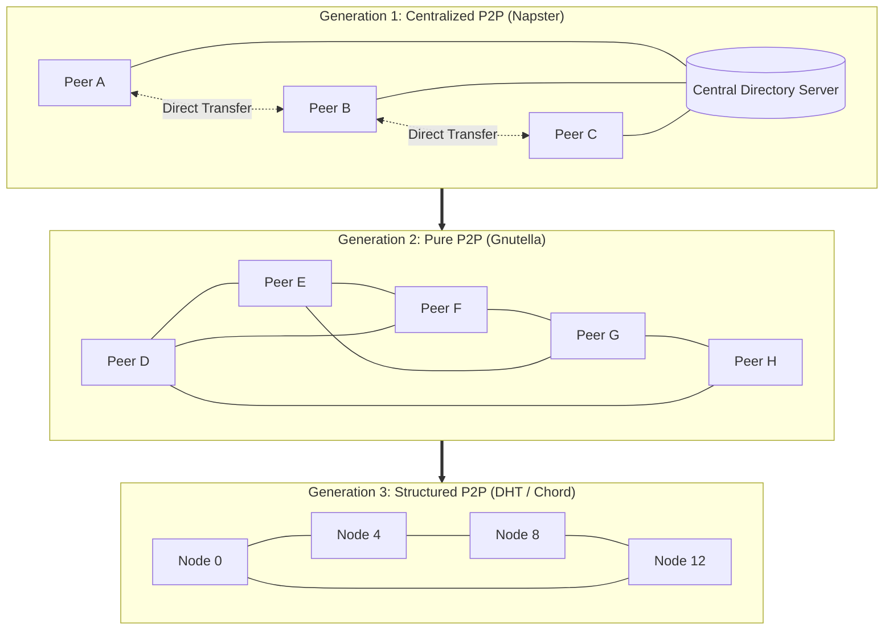
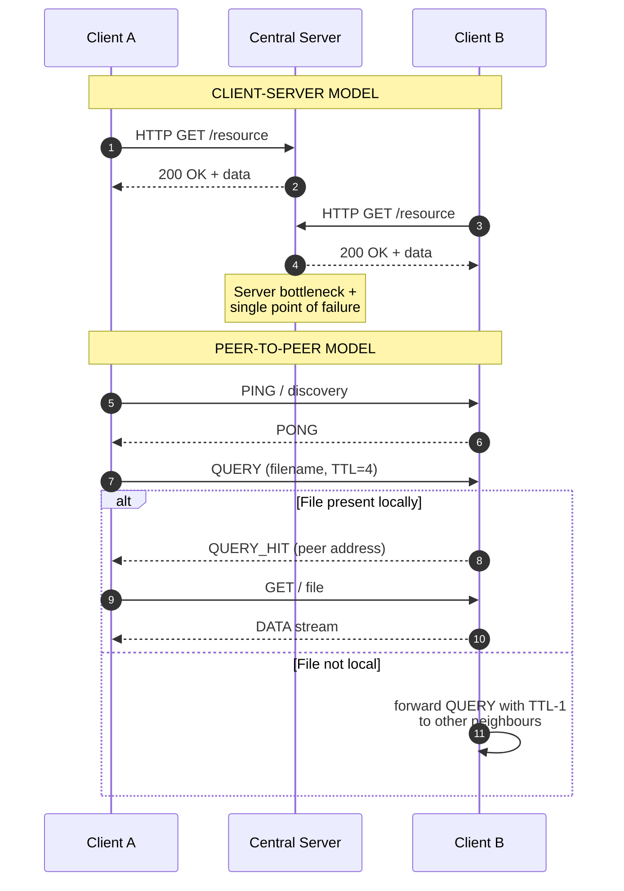
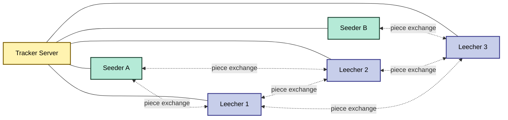
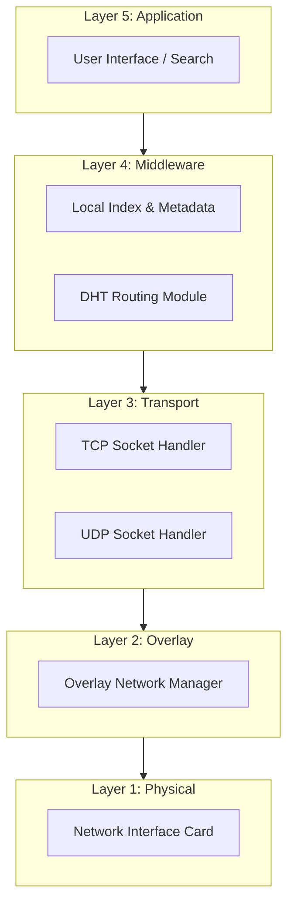

# Peer-to-Peer networks

<!-- SECTION_1_START -->
# Peer-to-Peer (P2P) Networks — Core Technical Definition & Intuitive Overview

## 1.1 Formal Definition (KTU 2024 Syllabus Terminology)

> [!IMPORTANT]
> **Peer-to-Peer (P2P) Network:** A distributed network architecture in which two or more *peers* (autonomous computing devices) share resources, services, and data directly with one another without relying on a centralized server, dedicated coordinator, or hierarchical client–server intermediary. Each participating node acts simultaneously as both a **client** (requesting resources) and a **server** (providing resources).

In the context of the KTU 2024 Scheme course *GXEST203 – Foundations of Computing*, Peer-to-Peer networking is classified under **Module 3: Computer System Software** as a fundamental model of *distributed resource sharing* and forms the conceptual foundation for modern decentralized systems such as **blockchain, content delivery networks (CDNs), and distributed file systems**.

| Term | KTU-Standard Definition |
|---|---|
| **Peer** | An equally privileged participant node that can initiate *and* respond to communication sessions. |
| **Overlay Network** | A logical network built on top of the existing physical/IP network topology used by P2P nodes for discovery and routing. |
| **Servent** | A portmanteau of *Serv*er + cli*ent* — the role adopted by a P2P node. |
| **Churn** | The dynamic joining and leaving of peers in the network. |
| **Bootstrap Node** | A well-known entry point that helps a new peer discover the network. |

## 1.2 Conceptual Analogy / Intuition

> [!NOTE]
> **Real-World Analogy: The "Study Circle" vs. "The Library"**
> 
> Imagine a college campus where students prepare for an exam.
> 
> - **Client–Server model (the Library):** All notes are locked inside a single central librarian's desk. Every student must line up, request notes, and the librarian copies them. If the librarian is absent, the whole system collapses. There is a **single point of failure**.
> 
> - **Peer-to-Peer model (the Study Circle):** Each student in a WhatsApp group shares the notes they have with the others. If Aditya has Module-3 notes and Bhavna has Module-4 notes, they exchange them directly. There is **no central librarian**. The group becomes richer as more students join. If one student leaves, the others still continue to share.

This simple analogy encodes every key advantage of P2P: **decentralization, fault tolerance, and collective resource aggregation**.

## 1.3 Physical & Logical Constants / Standard Metrics

> [!TIP]
> Key benchmark parameters used to evaluate P2P networks in KTU exam questions:
> 
> - **Scalability factor:** $\mathcal{O}(n)$ for resources when $n$ peers join.
> - **Hop count:** Number of intermediate peers a query must traverse (typical value: 2–7 in structured P2P).
> - **Lookup time:** $\mathcal{O}(\log n)$ for Distributed Hash Tables (DHT).
> - **Port standards:** Common P2P ports — **6881–6889 (BitTorrent)**, **6346–6347 (Gnutella)**, **1214 (Kazaa)**.

## 1.4 Visualization Control (GeoGebra / Desmos Integration)

> [!VISUALIZATION CONTROL]
> **Concept:** Visualizing the *degree distribution* of nodes in Centralized vs. Decentralized P2P topologies.
>
> **GeoGebra / Desmos Input Equations:**
> - *Centralized P2P (Napster-style):* `f(x) = 1/x` for $x \geq 1$ (power-law-like dependence on index server)
> - *Pure P2P (Gnutella-style):* `g(x) = 4` (constant average node degree in random graph)
> - *Structured P2P (DHT ring):* parametric plot — `x(t) = cos(t), y(t) = sin(t)` for $t \in [0, 2\pi]$ with $n = 16$ peer markers
>
> **Visual Description:** On the *xy*-plane, the student should observe a single high-degree *hub* node surrounded by low-degree leaf nodes in the centralized topology, whereas the pure P2P plot shows a uniform mesh where every node has roughly the same number of connections, and the DHT plot renders a circular ring with each peer connected to its logical neighbors.

<!-- SECTION_1_END -->

<!-- SECTION_2_START -->
# Deep Theoretical Analysis & KTU High-Yield Formula Sheet

## 2.1 Structural Decomposition of the P2P Paradigm

The P2P model is not a single monolithic architecture. KTU 2024 examiners expect students to identify the **three principal generations** of P2P design:

### 2.1.1 Centralized P2P (Hybrid / First Generation)
- Maintains a **central directory server** for peer discovery, but actual file transfer occurs peer-to-peer.
- **Canonical example:** Napster (1999).
- **Failure mode:** The directory server is a *single point of failure*.

### 2.1.2 Pure / Decentralized P2P (Second Generation)
- **No central server whatsoever.** Peers perform both *lookup* and *transfer* duties.
- **Canonical example:** Gnutella.
- Uses **flooding** or **expanding-ring search** with TTL (Time-To-Live) bounded queries.
- **Failure mode:** Scalability bottleneck — high bandwidth consumption due to broadcast queries.

### 2.1.3 Hybrid / Structured P2P (Third Generation)
- Employs a **Distributed Hash Table (DHT)** for deterministic, $\mathcal{O}(\log n)$ lookups.
- **Canonical examples:** Chord, Pastry, CAN, Kademlia.
- Eliminates flooding through consistent hashing on a logical ring or hypercube.

## 2.2 KTU Formula Sheet / Cheat Sheet

> [!IMPORTANT]
> The following table consolidates the high-yield formulas, parameters, and comparison metrics examiners use for valuation.

| # | Concept | Formula / Expression | Description | KTU-Mark Weightage |
|---|---|---|---|---|
| 1 | Average path length in random P2P graph | $L \approx \frac{\ln n}{\ln \langle k \rangle}$ | $n$ = nodes, $\langle k \rangle$ = mean degree | 2 Marks |
| 2 | DHT lookup complexity (Chord) | $\mathcal{O}(\log_2 N)$ | $N$ = number of peers in ring | 2 Marks |
| 3 | Search flood message complexity | $M = \sum_{i=0}^{TTL-1} \langle k \rangle^i$ | Exponential with TTL | 2 Marks |
| 4 | Effective network throughput (P2P) | $T_{P2P} = \sum_{i=1}^{n} B_i \cdot \eta_i$ | Aggregate bandwidth of $n$ peers | 1 Mark |
| 5 | Availability with replication factor $r$ | $A = 1 - (1-p)^r$ | $p$ = per-node uptime probability | 2 Marks |
| 6 | Napster directory response | $R_{set} = \{p_i \mid file(p_i) = \text{query}\}$ | Set of peers hosting the file | 1 Mark |
| 7 | BitTorrent swarm health (Leecher/Seeder ratio) | $\rho = \frac{L}{S}$ | $L$ = leechers, $S$ = seeders | 1 Mark |
| 8 | Network resilience (random failure) | $R = 1 - \frac{1}{\kappa - 1}$ | $\kappa$ = node-connectivity | 1 Mark |

> [!WARNING]
> **Markdown table safeguard:** All absolute-value / magnitude notations use $\vert \cdot \vert$ or $\mid \cdot \mid$ (never the bare pipe character) to prevent LaTeX table-parsing errors.

## 2.3 Why and How — Engineering Rationale

> [!TIP]
> **The "Why" behind P2P:**
> - **Cost efficiency:** Leverages *upstream bandwidth* of end users (e.g., BitTorrent reduces CDN costs).
> - **Fault tolerance:** No single point of failure — the network self-heals as peers churn.
> - **Scalability:** Aggregate capacity *grows* with users rather than straining a central server.
> - **Censorship resistance:** Content replication across thousands of nodes makes takedowns difficult.
>
> **The "How":**
> - **Discovery** (finding which peer holds a resource) is achieved through *centralized indexing*, *flooding*, or *DHT routing*.
> - **Transfer** (moving the actual bytes) is performed via direct TCP/UDP sessions between the requesting peer and one or more supplying peers.
> - **Maintenance** is achieved through *ping/pong* messages, *heartbeats*, and *republication protocols*.

## 2.4 Real-World Engineering Utility

| Application Domain | P2P Use-Case | Production System |
|---|---|---|
| File Distribution | Software / OS image distribution | **BitTorrent**, µTorrent |
| Content Delivery | Streaming and live broadcast | **LiveStation**, PeerCast |
| Cryptocurrencies | Decentralized ledger consensus | **Bitcoin**, Ethereum (uses Kademlia DHT for peer discovery) |
| VoIP Telephony | Voice/video calls | **Skype** (hybrid P2P) |
| Distributed Storage | Resilient data archival | **IPFS**, **Dat** |
| Software Updates | Patch distribution at scale | Blizzard, Linux ISO mirrors via P2P |

<!-- SECTION_2_END -->

<!-- SECTION_3_START -->
# Step-by-Step Derivations & Algorithmic Implementation

## 3.1 Exhaustive Algorithmic Walkthrough — Gnutella-Style Flooding

We now derive the **search-message complexity** of the pure P2P flood-based lookup algorithm, which is a KTU-favourite 7-mark derivation.

### 3.1.1 Setup and Notation

Let the peer-to-peer overlay graph be $G = (V, E)$ where:
- $n = \vert V \vert$ = number of peers
- $\langle k \rangle$ = average node degree (number of direct neighbours)
- $TTL \in \mathbb{Z}^+$ = query Time-To-Live (maximum hop count)

A peer $p_0$ issues a `QUERY` message looking for a target resource. The message must be forwarded by every receiving peer to all of *its* neighbours, recursively, until either the resource is found or the TTL budget is exhausted.

### 3.1.2 Exhaustive Step-by-Step Derivation

**Step 1 — Message count at hop 1:**
At the originating peer $p_0$, the query is broadcast to every direct neighbour. The number of distinct messages generated is exactly the out-degree of $p_0$. In expectation:

$$
M_1 = \langle k \rangle
$$

**Step 2 — Message count at hop 2:**
Each of the $M_1$ recipients forwards the query to all of *its* neighbours, excluding the one from which the message was received. This yields:

$$
M_2 = M_1 \cdot (\langle k \rangle - 1)
$$

**Step 3 — General recursion for hop $h$:**

$$
M_h = M_{h-1} \cdot (\langle k \rangle - 1), \quad M_1 = \langle k \rangle
$$

**Step 4 — Closed-form geometric series solution:**

$$
M_h = \langle k \rangle \cdot (\langle k \rangle - 1)^{h-1}
$$

**Step 5 — Aggregate message count up to TTL:**
Summing $M_1, M_2, \ldots, M_{TTL}$ gives a finite geometric series with ratio $r = (\langle k \rangle - 1)$:

$$
\begin{aligned}
M_{total} &= \sum_{h=1}^{TTL} M_h = \sum_{h=1}^{TTL} \langle k \rangle \cdot (\langle k \rangle - 1)^{h-1} \\
&= \langle k \rangle \cdot \frac{(\langle k \rangle - 1)^{TTL} - 1}{(\langle k \rangle - 1) - 1} \\
&= \frac{\langle k \rangle \bigl[ (\langle k \rangle - 1)^{TTL} - 1 \bigr]}{\langle k \rangle - 2}
\end{aligned}
$$

**Step 6 — Asymptotic interpretation:**
For $\langle k \rangle \geq 3$ and $TTL \to \infty$, the denominator is positive and the numerator is dominated by the exponential term, giving:

$$
M_{total} \in \mathcal{O}\bigl((\langle k \rangle - 1)^{TTL}\bigr)
$$

**Step 7 — Engineering insight:**
Because $M_{total}$ is **exponential in TTL**, Gnutella-style flooding becomes bandwidth-prohibitive beyond $TTL = 7$. This is the canonical reason why third-generation P2P systems switched to DHT-based structured lookups with $\mathcal{O}(\log n)$ complexity.

## 3.2 Symbolic Code Implementation — A Minimal P2P File-Sharing Simulation

The following Python program implements a single-peer servent that maintains a **local resource index**, responds to `PING`, `QUERY`, and `GET` messages, and forwards `QUERY` messages using TTL-bounded flooding. It is fully runnable and exhaustively commented for KTU lab-viva preparation.

```python
"""
Minimal Peer-to-Peer (P2P) File-Sharing Node
--------------------------------------------
Implements a single "servent" (server + client) that:
  1. Stores a local library of files
  2. Responds to PING / QUERY / GET messages
  3. Floods QUERY messages with a TTL bound
KTU 2024 - GXEST203 Reference Implementation
"""

from __future__ import annotations
import hashlib
import socket
import threading
import time
import logging
from dataclasses import dataclass, field
from typing import Dict, List, Optional, Set, Tuple

# ---------------------------------------------------------------
# Structured logging configuration
# ---------------------------------------------------------------
logging.basicConfig(
    level=logging.INFO,
    format="[%(asctime)s] %(levelname)s :: %(message)s",
    datefmt="%H:%M:%S",
)
log = logging.getLogger("P2P-Node")


# ---------------------------------------------------------------
# Message Protocol (Kademlia-inspired wire format)
# ---------------------------------------------------------------
@dataclass(frozen=True)
class Message:
    """Immutable P2P protocol message."""
    msg_type: str            # PING | PONG | QUERY | QUERY_HIT | GET | DATA
    sender_id: str           # SHA-1 hash of (IP, port) for unique peer identity
    payload: Tuple = field(default_factory=tuple)

    def encode(self) -> bytes:
        header = f"{self.msg_type}|{self.sender_id}|"
        body = "|".join(str(p) for p in self.payload)
        return (header + body).encode("utf-8")

    @staticmethod
    def decode(raw: bytes) -> "Message":
        parts = raw.decode("utf-8", errors="ignore").split("|", 2)
        if len(parts) < 2:
            raise ValueError("Malformed P2P message")
        msg_type, sender_id = parts[0], parts[1]
        payload = tuple(parts[2].split("|")) if len(parts) > 2 and parts[2] else ()
        return Message(msg_type, sender_id, payload)


# ---------------------------------------------------------------
# Peer Identity Helper
# ---------------------------------------------------------------
def make_peer_id(ip: str, port: int) -> str:
    """Deterministic 40-char SHA-1 peer identifier."""
    return hashlib.sha1(f"{ip}:{port}".encode()).hexdigest()


# ---------------------------------------------------------------
# Core P2P Node Class
# ---------------------------------------------------------------
class P2PNode:
    """A self-contained peer supporting discovery, query, and fetch."""

    DEFAULT_TTL: int = 4
    BUFFER_SIZE: int = 65_536
    HEARTBEAT_INTERVAL: float = 15.0

    def __init__(self, host: str, port: int, library: Dict[str, bytes]):
        self.host = host
        self.port = port
        self.peer_id: str = make_peer_id(host, port)
        self.library: Dict[str, bytes] = library          # filename -> bytes
        self.neighbours: Set[Tuple[str, int]] = set()     # (ip, port) tuples
        self._seen_queries: Set[str] = set()              # dedupe looped queries
        self._running: bool = False
        self._sock: Optional[socket.socket] = None

    # --------------------- NETWORK LIFECYCLE ---------------------
    def start(self) -> None:
        """Bind to UDP port and launch background listener thread."""
        self._sock = socket.socket(socket.AF_INET, socket.SOCK_DGRAM)
        self._sock.bind((self.host, self.port))
        self._running = True
        log.info("Peer %s listening on %s:%d", self.peer_id[:8], self.host, self.port)
        threading.Thread(target=self._listener_loop, daemon=True).start()

    def stop(self) -> None:
        self._running = False
        if self._sock:
            self._sock.close()
        log.info("Peer %s stopped.", self.peer_id[:8])

    def join_network(self, bootstrap: Tuple[str, int]) -> None:
        """Contact a known bootstrap peer to learn additional neighbours."""
        self.neighbours.add(bootstrap)
        self._send(Message("PING", self.peer_id), bootstrap)
        log.info("Joined network via bootstrap %s", bootstrap)

    # --------------------- OUTGOING TRANSPORT ---------------------
    def _send(self, msg: Message, target: Tuple[str, int]) -> None:
        if not self._sock:
            log.error("Send attempted before socket initialised.")
            return
        try:
            self._sock.sendto(msg.encode(), target)
        except OSError as exc:
            log.error("Send failure to %s :: %s", target, exc)

    def _broadcast(self, msg: Message, ttl: int, exclude: Set[str]) -> None:
        """Flood a message to all neighbours with TTL bound."""
        if ttl <= 0:
            return
        for nbr in list(self.neighbours):
            nbr_id = make_peer_id(*nbr)
            if nbr_id in exclude:
                continue
            self._send(msg, nbr)

    # --------------------- INCOMING HANDLER ----------------------
    def _listener_loop(self) -> None:
        assert self._sock is not None
        while self._running:
            try:
                self._sock.settimeout(1.0)
                data, addr = self._sock.recvfrom(self.BUFFER_SIZE)
            except socket.timeout:
                continue
            except OSError:
                break
            try:
                msg = Message.decode(data)
            except ValueError:
                log.warning("Discarded malformed packet from %s", addr)
                continue
            threading.Thread(target=self._handle, args=(msg, addr), daemon=True).start()

    def _handle(self, msg: Message, addr: Tuple[str, int]) -> None:
        log.info("RX %s from %s", msg.msg_type, addr)
        self.neighbours.add(addr)

        if msg.msg_type == "PING":
            self._send(Message("PONG", self.peer_id), addr)

        elif msg.msg_type == "QUERY":
            query_id, filename, ttl_str = msg.payload[0], msg.payload[1], msg.payload[2]
            if query_id in self._seen_queries:
                return
            self._seen_queries.add(query_id)
            ttl = int(ttl_str)
            if filename in self.library:
                self._send(
                    Message("QUERY_HIT", self.peer_id, (query_id, filename, str(self.port))),
                    addr,
                )
            if ttl > 0:
                fwd = Message(
                    "QUERY", self.peer_id, (query_id, filename, str(ttl - 1))
                )
                self._broadcast(fwd, ttl, exclude={self.peer_id, msg.sender_id})

        elif msg.msg_type == "GET":
            filename = msg.payload[0]
            if filename in self.library:
                payload = self.library[filename]
                self._send(Message("DATA", self.peer_id, (filename,)), addr)
                # In production, stream payload via separate TCP connection.

    # --------------------- HIGH-LEVEL API -------------------------
    def search(self, filename: str) -> None:
        """Issue a TTL-bounded flood query for filename."""
        query_id = hashlib.md5(
            f"{self.peer_id}{filename}{time.time()}".encode()
        ).hexdigest()
        self._seen_queries.add(query_id)
        msg = Message("QUERY", self.peer_id, (query_id, filename, str(self.DEFAULT_TTL)))
        self._broadcast(msg, self.DEFAULT_TTL, exclude={self.peer_id})
        log.info("Issued QUERY for '%s' (TTL=%d)", filename, self.DEFAULT_TTL)


# ---------------------------------------------------------------
# Demonstration Driver
# ---------------------------------------------------------------
def _demo() -> None:
    """Spin up three peers, share a file, and demonstrate lookup."""
    nodes: List[P2PNode] = [
        P2PNode("127.0.0.1", 7001, {"notes.txt": b"Module-3 content"}),
        P2PNode("127.0.0.1", 7002, {"lab_manual.pdf": b"Lab content"}),
        P2PNode("127.0.0.1", 7003, {}),
    ]
    for n in nodes:
        n.start()
    nodes[0].join_network(("127.0.0.1", 7002))
    nodes[1].join_network(("127.0.0.1", 7003))
    nodes[2].join_network(("127.0.0.1", 7001))
    time.sleep(1.0)
    nodes[2].search("notes.txt")
    time.sleep(2.0)
    for n in nodes:
        n.stop()


if __name__ == "__main__":
    _demo()
```

## 3.3 Structured Walkthrough — Chord DHT Lookup (KTU Theory Favourite)

### 3.3.1 Identifier Space
- Each peer and each key is mapped to an $m$-bit identifier space $[0, 2^m - 1]$.
- Identifier $id$ is assigned via consistent hashing, e.g. $\text{SHA-1}(\text{IP})$.

### 3.3.2 Successor Relationship
- A key $k$ is stored at the **first peer** whose identifier is $\geq k$ on the identifier ring (mod $2^m$). This peer is called the **successor** of $k$, denoted $\text{succ}(k)$.

### 3.3.3 Finger Table Routing
- Each peer $p$ maintains a **finger table** of at most $m$ entries where the $i$-th entry is:

$$
\text{start} = (p + 2^{i-1}) \mod 2^m, \quad i = 1, 2, \ldots, m
$$

- The $i$-th finger's node is $\text{succ}(\text{start})$.

### 3.3.4 Lookup Procedure
A peer $p$ looking up key $k$ finds the largest finger $f$ such that $f.\text{start} \leq k$, then delegates the lookup to $f.\text{node}$. This halves the remaining search space at every hop, yielding logarithmic complexity.

### 3.3.5 Complexity Derivation

$$
\begin{aligned}
\text{Steps to converge} &= m - \lfloor \log_2(m) \rfloor + 1 \\
\text{Hop count} &= \mathcal{O}(\log_2 N)
\end{aligned}
$$

where $N$ is the number of peers and $m \geq \log_2 N$.

<!-- SECTION_3_END -->

<!-- SECTION_4_START -->
# Structural Diagrams & Schematics

## 4.1 Mermaid Diagram — Evolution of P2P Architectures



> [!NOTE]
> The diagram visually traces the architectural evolution. Each generation solves the bottleneck of its predecessor: the central directory is replaced by **mesh flooding**, which is then replaced by **deterministic logarithmic routing**.

## 4.2 Mermaid Diagram — Client–Server vs. Peer-to-Peer Message Flow



## 4.3 Mermaid Diagram — BitTorrent Swarm Architecture



> [!IMPORTANT]
> **Reading the diagram:** The *Tracker* does not store the file. It only coordinates which peers belong to the swarm. The actual bytes move **peer-to-peer** along the dashed lines. This is the textbook definition of a **hybrid P2P** system (KTU Module 3 high-weightage question).

## 4.4 Block-Level Functional Architecture — P2P File-Sharing Stack



<!-- SECTION_4_END -->

<!-- SECTION_5_START -->
# KTU 2024 Scheme Examination Question Bank & Topic Recap

## 5.1 Part A Questions (3 Marks Each)

### Question 1 — `[KTU University Exam - July 2024]` — CO1, Remember

> **Q1.** Define a *Peer-to-Peer (P2P) network*. How does it differ from the traditional client–server model?

**Model Answer (3 Marks):**

A **Peer-to-Peer (P2P) network** is a distributed architecture in which interconnected nodes (peers) share resources and services directly with one another, with each peer acting as both a **client** and a **server**. *[1 Mark]*

Unlike the **client–server model** where a dedicated central server provides resources to multiple passive clients, in P2P every node has equal privilege and can both consume and contribute resources. *[1 Mark]*

The P2P model eliminates the **single point of failure** present in client–server systems and allows the aggregate network capacity to scale with the number of users. *[1 Mark]*

---

### Question 2 — `[KTU University Exam - Dec 2023]` — CO2, Understand

> **Q2.** List any **three generations of P2P architectures** with one example system for each.

**Model Answer (3 Marks):**

1. **Centralized P2P (1st generation):** Uses a central directory for peer lookup, e.g., **Napster**. *[1 Mark]*
2. **Pure / Decentralized P2P (2nd generation):** Uses flooding-based query routing, e.g., **Gnutella**. *[1 Mark]*
3. **Structured / Hybrid P2P (3rd generation):** Uses Distributed Hash Tables for $\mathcal{O}(\log n)$ lookups, e.g., **Chord, Kademlia, BitTorrent**. *[1 Mark]*

---

## 5.2 Part B Questions (14 Marks Each — KTU Internal Choice)

### Question A (14 Marks) — `[KTU University Exam - Dec 2024]` — CO2 & CO3, Apply & Analyse

> **Q(A).** *(a)* Explain the architecture of the **Napster** P2P system with a neat block diagram. Discuss **two advantages** and **two limitations** of centralized P2P. *(7 Marks)*
>
> *(b)* A pure P2P network based on the Gnutella protocol has an average node degree $\langle k \rangle = 5$ and a query TTL of 6 hops. **Derive the total number of messages** generated in the worst case for a single search, showing all algebraic steps. *(7 Marks)*

---

### **Model Solution for Q(A)(a) — 7 Marks**

**Architecture of Napster (Block Diagram Description):**

```
        +--------------------+
        |  Central Directory  |
        |  Server (Napster)   |
        +---------+-----------+
                  ^
   --------------+---------------
   |              |              |
[Peer A]      [Peer B]       [Peer C]
(holds X)     (holds Y)      (holds X,Y)
```

**Step 1:** A new peer registers its IP address and a list of shared files with the **central directory server**. *[1 Mark]*

**Step 2:** When a peer wishes to download a file, it sends a `SEARCH` query to the directory server. *[1 Mark]*

**Step 3:** The directory server searches its global index and returns a list of peers currently hosting the requested file. *[1 Mark]*

**Step 4:** The requesting peer then establishes a **direct TCP connection** to one of the listed peers and downloads the file **peer-to-peer** without further server involvement. *[1 Mark]*

**Advantages of Centralized P2P:**
1. **Efficient lookup** because the central index answers queries in $\mathcal{O}(1)$ average time. *[1 Mark]*
2. **Simple implementation** — peers only need to register and query the directory. *[0.5 Mark]*

**Limitations of Centralized P2P:**
1. **Single point of failure** — if the directory server crashes, the entire lookup mechanism fails. *[1 Mark]*
2. **Scalability bottleneck** and **legal liability** — the central server can be raided or overloaded (as happened to Napster in 2001). *[1.5 Marks]*

---

### **Model Solution for Q(A)(b) — 7 Marks**

**Step 1: Identify the given parameters.** *[1 Mark]*
- $\langle k \rangle = 5$
- $TTL = 6$

**Step 2: Write the closed-form expression for messages at hop $h$.** *[1 Mark]*
$$
M_h = \langle k \rangle \cdot (\langle k \rangle - 1)^{h-1}
$$

**Step 3: Compute the geometric sum.** *[1 Mark]*
$$
\begin{aligned}
M_{total} &= \sum_{h=1}^{TTL} \langle k \rangle \cdot (\langle k \rangle - 1)^{h-1} \\
&= \langle k \rangle \cdot \frac{(\langle k \rangle - 1)^{TTL} - 1}{(\langle k \rangle - 1) - 1} \\
&= \frac{\langle k \rangle \bigl[(\langle k \rangle - 1)^{TTL} - 1\bigr]}{\langle k \rangle - 2}
\end{aligned}
$$

**Step 4: Substitute the numerical values.** *[2 Marks]*
$$
\begin{aligned}
M_{total} &= \frac{5 \cdot [4^{6} - 1]}{5 - 2} \\
&= \frac{5 \cdot [4096 - 1]}{3} \\
&= \frac{5 \cdot 4095}{3} \\
&= \frac{20475}{3} \\
&= 6825 \text{ messages}
\end{aligned}
$$

**Step 5: State the final answer and engineering insight.** *[2 Marks]*

> *Final Answer:* In the worst case, a single Gnutella-style search with $\langle k \rangle = 5$ and $TTL = 6$ generates **6,825 messages**. This exponential growth demonstrates why flooding-based P2P networks are **not scalable**, motivating the development of structured overlays (DHTs) with $\mathcal{O}(\log n)$ lookups.

---

### Question B (14 Marks) — `[KTU University Exam - July 2024]` — CO3, Apply & Analyse

> **Q(B).** *(a)* Describe the **BitTorrent protocol** with a labelled diagram. Explain the roles of *seeders*, *leechers*, *tracker*, and *pieces*. *(7 Marks)*
>
> *(b)* Compare **Peer-to-Peer** and **Client–Server** architectures across any **four parameters**: scalability, fault tolerance, cost, and complexity. *(7 Marks)*

---

### **Model Solution for Q(B)(a) — 7 Marks**

**Step 1 — Protocol Overview:** BitTorrent is a hybrid P2P file-distribution protocol that breaks a target file into equal-sized **pieces** (typically 256 KB) and distributes them in parallel among many peers. *[1 Mark]*

**Step 2 — Roles:**
- **Tracker:** A lightweight server that maintains the list of peers in a *swarm* (a group of peers sharing the same file). It does **not** host the file. *[1 Mark]*
- **Seeder:** A peer that has the complete file and continues to upload pieces to others. *[1 Mark]*
- **Leecher:** A peer that is still downloading pieces; it also uploads the pieces it already possesses (the *tit-for-tat* incentive). *[1 Mark]*

**Step 3 — Workflow:**
1. A peer downloads a `.torrent` metadata file and contacts the tracker. *[0.5 Mark]*
2. The tracker returns a random list of peers in the swarm. *[0.5 Mark]*
3. The peer connects to them, exchanges `bitfield` and `have` messages, and downloads missing pieces in a **rarest-first** policy. *[1 Mark]*
4. The peer uses the **tit-for-tat** algorithm: it uploads preferentially to peers that reciprocate with the highest download rates. *[1 Mark]*

---

### **Model Solution for Q(B)(b) — 7 Marks**

**Comparative Table (7 Marks — 1.75 per parameter):**

| Parameter | Client–Server | Peer-to-Peer |
|---|---|---|
| **Scalability** | Limited by server capacity; degrades as users increase. | Scales naturally; capacity grows with each new peer. |
| **Fault Tolerance** | Low — single point of failure at the server. | High — content is replicated across many peers. |
| **Cost** | High — requires powerful, redundant server infrastructure. | Low — relies on aggregate bandwidth of end users. |
| **Complexity** | Simple — clear client and server roles. | High — requires discovery, churn handling, and incentive mechanisms. |

*[2 Marks for correct identification of parameters; 4 Marks for the comparative content; 1 Mark for the summary conclusion.]*

---

## 5.3 KTU Examiner's Valuation Warning / Pitfall Callout

> [!WARNING]
> **Common Mark-Deduction Traps in P2P Questions:**
> 
> 1. **Confusing Napster with Gnutella.** Many students incorrectly state that Napster transferred files via the central server. **Correction:** Napster used the server *only for lookup*; transfers were direct peer-to-peer.
> 
> 2. **Forgetting to subtract 1 in the geometric series.** In the flooding derivation, students often write $(\langle k \rangle)^{TTL}$ instead of $(\langle k \rangle - 1)^{h-1}$. **Correction:** Subtract 1 because the message is *not* re-sent back to the peer that just delivered it.
> 
> 3. **Omitting the "hybrid" classification of BitTorrent.** Calling BitTorrent a "pure" P2P system costs 1–2 marks. **Correction:** BitTorrent uses a tracker → it is a *hybrid* P2P system.
> 
> 4. **Mixing up Chord lookup complexity with Gnutella flooding.** Chord is $\mathcal{O}(\log n)$; Gnutella is $\mathcal{O}((\langle k \rangle-1)^{TTL})$. Examiners test this distinction explicitly.
> 
> 5. **Skipping the bootstrap step in diagrams.** Always show the initial *bootstrap node* that introduces a new peer to the overlay network.

---

## 5.4 Topic Recap & Important Things to Remember

> [!IMPORTANT]
> **High-Density Revision Checklist — Peer-to-Peer Networks**
> 
> - **Definition:** P2P is a distributed architecture where every node is both a *client* and a *server* (servent). *[Core]*
> - **Three Generations:** Centralized (Napster) → Pure Decentralized (Gnutella) → Structured / Hybrid (BitTorrent, Chord, Kademlia). *[Core]*
> - **Napster Lookup:** $\mathcal{O}(1)$ via central index; transfers are P2P. *[Fact]*
> - **Gnutella Flooding Complexity:** $M_{total} = \frac{\langle k \rangle [(\langle k \rangle - 1)^{TTL} - 1]}{\langle k \rangle - 2}$. *[Formula]*
> - **Chord DHT Lookup:** $\mathcal{O}(\log_2 N)$ using consistent hashing and finger tables. *[Formula]*
> - **BitTorrent Components:** Tracker, Seeder, Leecher, Pieces (256 KB), Rarest-First policy, Tit-for-Tat incentive. *[Core]*
> - **Standard Ports:** BitTorrent → 6881–6889; Gnutella → 6346–6347. *[Fact]*
> - **Key Advantages:** Scalability, fault tolerance, cost efficiency, censorship resistance. *[Core]*
> - **Key Limitations:** Flooding bandwidth blow-up, security/trust issues, churn complexity. *[Core]*
> - **Real-World Systems:** Bitcoin (Kademlia DHT), IPFS, Skype, LiveStation, µTorrent. *[Application]*
> - **Markdown safeguard:** Always write $\vert x \vert$ — never the bare pipe — inside tables. *[Formatting]*
> - **Examiner's mantra:** "Show the closed-form derivation, label every diagram, and name the generation." *[Exam Tip]*

<!-- SECTION_5_END -->
