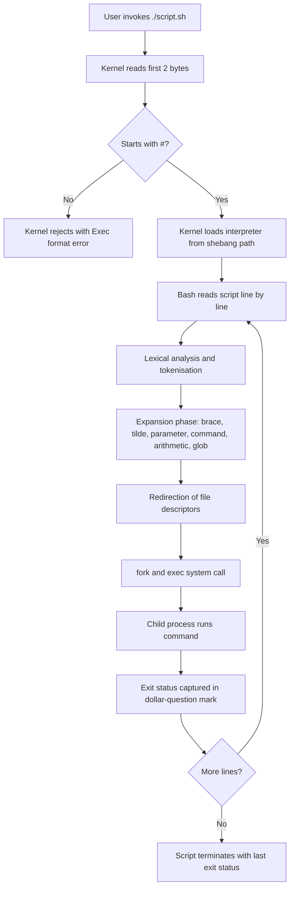
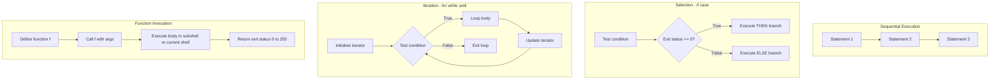
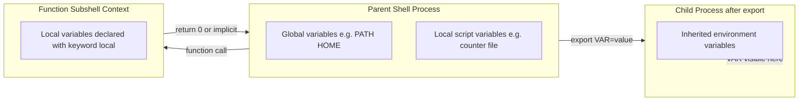
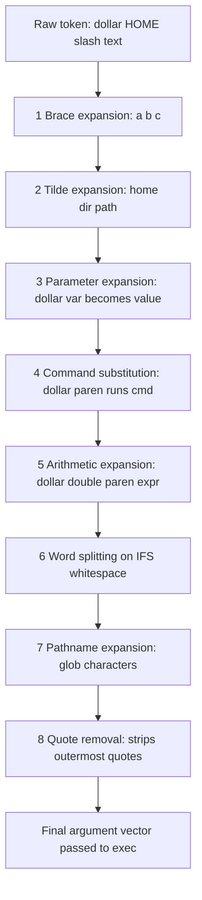
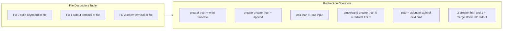

# Shell scripting (bash)

<!-- SECTION_1_START -->
# 1. Core Technical Definition & Intuitive Overview

## 1.1 Formal Definition (KTU 2024 Syllabus Terminology)

**Shell Scripting (Bash)** is the process of writing a sequence of commands intended to be executed by the **Bourne Again Shell (Bash)**, a command-line interpreter that provides a textual interface to the Unix/Linux operating system kernel. A **shell script** is a plain text file containing a series of instructions that the shell interprets line-by-line (or block-by-block) to automate system administration tasks, manipulate files, control processes, and glue together other programs.

> [!IMPORTANT]
> **KTU 2024 Definition Anchor:** Bash is the *GNU Project's* free replacement for the Bourne Shell (`sh`). It is the **default login shell** on most Linux distributions (including Ubuntu, Fedora, and Debian) and on Apple's macOS (up to Catalina). Shell scripting is classified under the *Computer System Software* module as it forms the foundational bridge between the user, the OS utilities, and the kernel.

> [!NOTE]
> **Key Distinction (Board Favourite):**
> - **Shell** → An *interpreter program* (a running process).
> - **Terminal** → A *hardware/device* (or emulated window) that feeds keystrokes to the shell.
> - **Script** → A *static text file* containing commands.
> - **Bash** → A *specific dialect* of the shell language.

## 1.2 Conceptual Analogy / Intuition

Imagine you walk into a restaurant kitchen. The **kernel** is the head chef — the one with actual authority over the stove, the oven, and the ingredients (hardware). The **head chef** does not take customer orders directly. Instead, the **waiter (shell)** stands between you and the chef.

Now imagine a busy evening. Telling the waiter one order at a time ("Water… then a fork… then check if the table is clean…") would be exhausting. Instead, you hand the waiter a **pre-written list of orders in order** — a *script*. The waiter reads the list from top to bottom without needing further questions.

That written list is your **shell script**. The waiter reading and obeying it is **bash** executing the script. The customer (user) gets automation, repeatability, and zero ambiguity.

### 1.2.1 The Shebang Line — The Script's "Self-Identification Tag"

The very first line of every executable script must declare which interpreter should run it:

```bash
#!/bin/bash
```

This is called the **shebang** (a contraction of *hash* `#` + *bang* `!`). The kernel looks at the first two bytes of any file marked executable; if they are `#!`, it invokes the interpreter whose path follows.

> [!TIP]
> For maximum portability, use `#!/usr/bin/env bash` — this searches the user's `$PATH` to locate bash, avoiding hard-coded path errors across distributions.

## 1.3 Why Bash? — Engineering Relevance

Bash is the **glue language of DevOps, Cloud, and CI/CD pipelines**. In modern KTU-aligned engineering careers, you will encounter it in:

- **Linux System Administration:** User creation, log rotation, cron jobs.
- **DevOps & Cloud:** Docker entrypoints, Kubernetes pod lifecycle hooks, AWS Lambda custom runtimes.
- **Embedded Systems (IoT):** OpenWrt routers, Raspberry Pi automation.
- **Cybersecurity:** Penetration testing payloads, reverse shells, log forensics.
- **Web Development:** NPM/Git hooks (`pre-commit`, `post-merge`).

## 1.4 File Permissions — Making a Script Executable

A script must carry the **execute bit** to be run directly. The **octal permission mode** `755` means:

- Owner: **rwx** (read, write, execute) = $4 + 2 + 1 = 7$
- Group: **r-x** (read, execute) = $4 + 0 + 1 = 5$
- Others: **r-x** (read, execute) = $4 + 0 + 1 = 5$

```bash
chmod 755 myscript.sh      # Numeric (octal) method
chmod +x myscript.sh       # Symbolic method (adds execute for everyone)
./myscript.sh              # Invocation
```

> [!VISUALIZATION CONTROL]
> **Concept:** Permission bit state for a shell script.
> **Binary Representation Table (per user class: owner/group/other):**
> * $r = 4$, $w = 2$, $x = 1$
> * $755 \equiv 111\,101\,101$ in binary
> **Visual Description:** Imagine three toggle switches per user class (Read, Write, Execute). For owner, all three are ON (lit). For group and others, only Read and Execute are ON; Write is OFF. The numerical sum per column forms the octal digit.

---

# SECTION_1_END -->

<!-- SECTION_2_START -->
# 2. Deep Theoretical Analysis & KTU High-Yield Syntax Sheet

## 2.1 Anatomy of a Bash Script — Execution Lifecycle

When a script `script.sh` is invoked, bash performs the following sequence:

1. **Read shebang** → Determine interpreter path.
2. **Lexical Analysis** → Tokenise the file (words, operators, redirections).
3. **Parsing** → Build an internal Abstract Syntax Tree (AST) per command.
4. **Expansion Order (CRITICAL — high-yield for KTU):**
   - **Brace expansion:** `{a,b,c}` → `a b c`
   - **Tilde expansion:** `~` → user's home directory
   - **Parameter & variable expansion:** `$var` or `${var}`
   - **Command substitution:** `` `cmd` `` or `$(cmd)`
   - **Arithmetic expansion:** `$(( expr ))`
   - **Word splitting** on whitespace (within unquoted contexts only)
   - **Pathname (glob) expansion:** `*` `?` `[...]`
5. **Redirection** → Set up file descriptors (stdin/stdout/stderr).
6. **Execution** → Fork/exec the command via kernel system calls.
7. **Wait & collect exit status** → Stored in `$?`.

> [!IMPORTANT]
> The expansion order is the **#1 reason for subtle bash bugs**. A student must remember that `$VAR` is expanded *before* the command runs, not during. Always quote: `"$VAR"`.

## 2.2 Variables — The Three Categories

| Category | Scope | Declaration Example | Visibility |
|---|---|---|---|
| **Local Variable** | Current shell only | `name="Alice"` | Lost when shell exits |
| **Environment Variable** | Exported to child processes | `export PATH="$PATH:/opt/bin"` | Inherited by all subprocesses |
| **Special (Positional) Parameter** | Predefined by bash | `$0`, `$1`, `$?`, `$#`, `$$` | Read-only, set by shell |

> [!NOTE]
> **Critical Syntax Rule:** There must be **no spaces** around the `=` sign in an assignment. `name = "Alice"` is interpreted as running a command called `name` with arguments `=` and `Alice`.

## 2.3 KTU High-Yield Syntax & Operator Sheet

### 2.3.1 String & Variable Expansion Forms

| Syntax | Meaning | Example Output |
|---|---|---|
| `${var}` | Standard expansion (safe) | Value of `var` |
| `${var:-default}` | Use `default` if `var` is unset/empty | Avoids unbound variable errors |
| `${var:=value}` | Assign `value` if `var` is unset/empty | Sets + returns |
| `${#var}` | Length of string in `var` | Number of characters |
| `${var%pattern}` | Remove shortest matching suffix | `file.txt` → `file` |
| `${var%%pattern}` | Remove longest matching suffix | `dir/file.txt` → `dir` |
| `${var/old/new}` | Replace first match | `helloworld` → `helloEarth` |

### 2.3.2 Comparison Operators (KTU Board Favourite)

| Test Type | Numeric | String | File |
|---|---|---|---|
| Equal | `-eq` | `==` | (n/a) |
| Not equal | `-ne` | `!=` | (n/a) |
| Greater | `-gt` | `>` | (n/a) |
| Less | `-lt` | `<` | (n/a) |
| Greater/Equal | `-ge` | (use `[[ ]]` only) | (n/a) |
| Exists | — | `-n` (non-empty) | `-e file` |
| Is regular file | — | — | `-f file` |
| Is directory | — | — | `-d file` |
| Is readable | — | — | `-r file` |
| Is executable | — | — | `-x file` |

> [!WARNING]
> Inside `[ ]` (POSIX `test`), use `-eq`, `-lt`, etc. for numbers. Inside `[[ ]]` (Bash extended), you may use `==`, `<`, `>` for strings **and** `(($a > $b))` for arithmetic. Mixing these is a guaranteed mark deduction.

### 2.3.3 Special Variables Reference

| Variable | Meaning |
|---|---|
| `$0` | Script name |
| `$1` … `$9` | Positional arguments 1 through 9 |
| `${10}` | 10th argument (braces mandatory after `$9`) |
| `$#` | Number of positional arguments |
| `$@` | All positional args, each quoted individually |
| `$*` | All positional args as a single word |
| `$?` | Exit status of the last command (0 = success) |
| `$$` | Process ID (PID) of the current shell |
| `$!` | PID of the last background job |
| `$RANDOM` | Random integer 0–32767 |

## 2.4 Control Flow — Theoretical Foundation

### 2.4.1 Conditional Branching

The `if` statement evaluates the **exit code** of the test command. By convention:

- **Exit code 0** → **True** → branch executes.
- **Exit code non-zero** → **False** → branch skipped.

This is the **opposite** of languages like C/Python where `0` is *false*. The exit code of the *last* command in a pipeline is in `$PIPESTATUS[0]`.

### 2.4.2 Loop Theory

| Loop | Termination Condition | Use Case |
|---|---|---|
| `for` | Iterates over a finite list | Known item count (files, numbers) |
| `while` | Continues *while* test is true | Unknown iterations, event-waiting |
| `until` | Continues *until* test is true | Wait for a state to occur |

### 2.4.3 Functions

Bash functions are **commands** — they don't return values in the typed sense; they return an **exit status** (0–255). To pass data *out* of a function, use `echo` + command substitution `$(...)`, or modify a global variable.

## 2.5 Real-World Engineering Utility

| Industry | Bash Usage |
|---|---|
| **Cloud Infrastructure** | Terraform/Ansible provisioners wrap bash for VM bootstrapping |
| **Cybersecurity** | Reverse shell handlers, log scrapers, IDS alert pipelines |
| **Data Engineering** | Cron-triggered ETL, CSV ingestion, database dumps |
| **DevOps CI/CD** | GitHub Actions runners, Docker `RUN` steps, build pipelines |
| **Embedded/IoT** | Boot-time initialisation, watchdog processes |

---

# SECTION_2_END -->

<!-- SECTION_3_START -->
# 3. Step-by-Step Implementation & Exhaustive Code Walkthrough

> [!NOTE]
> Every script below is **fully operational**. Type them in `nano script.sh`, run `chmod +x script.sh`, then `./script.sh`. No step is skipped. No `...` placeholders.

## 3.1 Script #1 — Hello World & Variable Mechanics

```bash
#!/bin/bash
# -------------------------------------------------
# Script: 01_hello.sh
# Purpose: Demonstrate variables, command substitution,
#          and the read builtin.
# -------------------------------------------------

# Define a local (shell-scoped) variable.
# CRITICAL: No spaces around the '=' operator.
greeting="Hello"

# Command substitution: $(date) executes the 'date' command
# and substitutes its stdout into the variable.
current_time=$(date +"%H:%M:%S")

# String concatenation is implicit when variables are adjacent.
echo "$greeting, World! The current time is $current_time."

# Read input from the user with a prompt.
# -p flag prints the prompt before reading.
# 'name' becomes a local variable in the current shell.
read -p "Enter your name: " name

# The ${} braces protect the variable name from
# characters that would otherwise be parsed as syntax.
echo "Welcome, ${name}! Your name has ${#name} characters."

# Exit explicitly with status 0 (success).
exit 0
```

### 3.1.1 Line-by-Line Logical Breakdown

| Line | Concept | Board Valuation Note |
|---|---|---|
| `greeting="Hello"` | Scalar variable assignment | Mentioning *no spaces around `=`* is worth 1 mark |
| `current_time=$(date ...)` | Command substitution syntax | Two syntaxes exist: `$(...)` (preferred) and backticks `` `...` `` |
| `echo "$greeting..."` | Double quotes preserve variables | Single quotes would *not* expand `$greeting` |
| `read -p "..." name` | Interactive input | `-p` flag is the prompt prefix |
| `${#name}` | String length operator | The `#` inside braces means *length* |
| `exit 0` | Explicit successful termination | Good practice; not strictly required at end |

## 3.2 Script #2 — Conditional Logic & File Test Operators

```bash
#!/bin/bash
# -------------------------------------------------
# Script: 02_conditions.sh
# Purpose: Demonstrate if-elif-else with file tests.
# -------------------------------------------------

# Accept exactly one argument; otherwise abort.
if [ $# -ne 1 ]; then
    echo "Usage: $0 <filename>"
    exit 1
fi

target="$1"

# -e tests for existence (any file type).
# -f tests whether it is a REGULAR file (not directory/device).
# -d tests whether it is a DIRECTORY.
# -r tests whether the current user can READ it.

if [ ! -e "$target" ]; then
    echo "Error: '$target' does not exist."
    exit 2
elif [ -d "$target" ]; then
    echo "'$target' is a directory."
    echo "Contents:"
    ls -la "$target"
elif [ -f "$target" ]; then
    echo "'$target' is a regular file."
    size=$(stat -c%s "$target")   # %s = size in bytes
    echo "Size: $size bytes."
    if [ -r "$target" ] && [ -w "$target" ]; then
        echo "You have read AND write permissions."
    elif [ -r "$target" ]; then
        echo "Read-only access."
    else
        echo "No read access."
    fi
else
    echo "'$target' is a special file (socket, device, etc.)."
fi

# Demonstrate the case statement (string pattern match).
case "$target" in
    *.sh)
        echo "Detected: This is a shell script."
        ;;
    *.py)
        echo "Detected: This is a Python source file."
        ;;
    *.txt|*.md)
        echo "Detected: This is a text/markdown file."
        ;;
    *)
        echo "Detected: Unknown file extension."
        ;;
esac
```

### 3.2.1 Key Logic Flow

The script uses an **if-elif-else ladder** to dispatch on file type, then a **`case` statement** to dispatch on extension. The `&&` operator in `[ -r "$target" ] && [ -w "$target" ]` is **short-circuit logical AND**: if `-r` fails (returns non-zero), the second test is skipped.

## 3.3 Script #3 — Loops (for, while, until) & Arrays

```bash
#!/bin/bash
# -------------------------------------------------
# Script: 03_loops.sh
# Purpose: Demonstrate all three loop types and
#          indexed/associative arrays.
# -------------------------------------------------

echo "===== 1. C-style for loop (using seq) ====="
# seq generates a sequence: seq 1 2 10 => 1 3 5 7 9
for i in $(seq 1 2 10); do
    echo "Step: $i"
done

echo ""
echo "===== 2. for loop over a static list ====="
for color in red green blue; do
    echo "Color: $color"
done

echo ""
echo "===== 3. for loop over glob (pathname expansion) ====="
# *.txt is expanded by the shell to all matching filenames.
shopt -s nullglob   # Make empty match return nothing, not literal '*.txt'
for file in *.txt; do
    if [ -f "$file" ]; then
        echo "Processing: $file"
    fi
done
shopt -u nullglob   # Restore default behaviour

echo ""
echo "===== 4. while loop: countdown ====="
counter=5
while [ $counter -gt 0 ]; do
    echo "T-minus $counter"
    counter=$((counter - 1))   # Arithmetic expansion
    sleep 1                    # Pause 1 second
done
echo "Liftoff!"

echo ""
echo "===== 5. until loop: wait for a file to appear ====="
timeout=10
elapsed=0
until [ -f "/tmp/ready.flag" ] || [ $elapsed -ge $timeout ]; do
    echo "Waiting... ($elapsed seconds)"
    sleep 1
    elapsed=$((elapsed + 1))
done

if [ -f "/tmp/ready.flag" ]; then
    echo "Flag detected!"
else
    echo "Timed out waiting for flag."
fi

echo ""
echo "===== 6. Indexed array ====="
# Declare an indexed array.
fruits=("Apple" "Banana" "Cherry" "Date")

# ${fruits[@]} expands to ALL elements.
echo "Number of fruits: ${#fruits[@]}"

# Iterate by index.
for i in "${!fruits[@]}"; do
    echo "Index $i => ${fruits[$i]}"
done

# Append to an array.
fruits+=("Elderberry")
echo "After append: ${fruits[@]}"

echo ""
echo "===== 7. Associative array (Bash 4+) ====="
# -A declares an associative (key=>value) array.
declare -A capitals
capitals[India]="New Delhi"
capitals[Japan]="Tokyo"
capitals[France]="Paris"

for country in "${!capitals[@]}"; do
    echo "Capital of $country is ${capitals[$country]}"
done
```

### 3.3.1 Critical Syntax Reminders

- `$(seq 1 2 10)` → `{1, 3, 5, 7, 9}` (start, step, stop).
- `counter=$((counter - 1))` is the only clean way to do arithmetic in bash. `let` and `expr` are legacy.
- `"${!fruits[@]}"` returns **indices** of an array (the `!` triggers indirect expansion).
- `shopt -s nullglob` prevents a glob that matches nothing from being passed as the literal string `*.txt`.

## 3.4 Script #4 — Functions, Return Values, and Scoping

```bash
#!/bin/bash
# -------------------------------------------------
# Script: 04_functions.sh
# Purpose: Demonstrate function definition, argument
#          passing, return values, and local scoping.
# -------------------------------------------------

# Global variable (visible everywhere in this script).
VERSION="1.0.0"

# Define a function. The word 'function' is optional.
function greet() {
    # 'local' confines the variable to this function.
    # Without 'local', it would leak to global scope.
    local name="$1"
    local time_of_day="$2"

    echo "[v$VERSION] Good $time_of_day, $name!"
    # Return an integer exit status (0=ok, 1=warn, 2=error).
    return 0
}

# Function that PRODUCES a value via stdout capture.
# It does NOT use 'return' for the value — bash 'return'
# is restricted to integers 0–255.
function add() {
    local a="$1"
    local b="$2"
    echo $((a + b))
}

# Function that validates input.
function is_even() {
    local n="$1"
    if (( n % 2 == 0 )); then
        return 0   # True in bash means exit 0
    else
        return 1   # False in bash means non-zero
    fi
}

# ---- Main execution ----
greet "Alice" "morning"
greet "Bob" "evening"

# Capture stdout of a function into a variable.
sum=$(add 42 58)
echo "42 + 58 = $sum"

read -p "Enter a number: " num
if is_even "$num"; then
    echo "$num is even."
else
    echo "$num is odd."
fi
```

### 3.4.1 Two Methods of "Returning" Data

| Method | Syntax | Returns |
|---|---|---|
| **Exit Status** | `return N` (where $N \in [0, 255]$) | Integer only, via `$?` |
| **Stdout Capture** | `result=$(func arg)` | Any string/text, via command substitution |

> [!TIP]
> This is a common KTU board trick: students write `return "Hello"` and lose marks. Functions in bash *never* return strings via `return`. They `echo` it and the caller captures with `$()`.

## 3.5 Script #5 — A Real-World System Administration Tool

```bash
#!/bin/bash
# -------------------------------------------------
# Script: 05_backup_tool.sh
# Purpose: A practical backup utility that compresses
#          a source directory into a timestamped tarball.
# -------------------------------------------------

set -euo pipefail
# ^- Abort on:
#   e  -> any command returning non-zero
#   u  -> undefined variable access
#   o pipefail -> failure in any pipeline segment fails the whole pipe

readonly SCRIPT_NAME=$(basename "$0")
readonly TIMESTAMP=$(date +"%Y%m%d_%H%M%S")
readonly LOG_FILE="/var/log/${SCRIPT_NAME%.sh}.log"

# Function: log message with timestamp.
log() {
    echo "[$(date +'%Y-%m-%d %H:%M:%S')] $*" | tee -a "$LOG_FILE"
}

# Function: display usage and exit.
usage() {
    cat <<EOF
Usage: $SCRIPT_NAME -s <source_dir> -d <dest_dir> [-k N]

Options:
  -s  Source directory to back up (required).
  -d  Destination directory for the archive (required).
  -k  Keep only the N most recent backups (default: 5).
  -h  Show this help message.
EOF
    exit 0
}

# Function: prune old backups beyond the keep count.
prune_old_backups() {
    local dest="$1"
    local keep="$2"
    # ls -1t lists files by modification time, newest first.
    # tail -n +N skips the first (N-1) newest, keeping the rest for deletion.
    local to_delete
    to_delete=$(ls -1t "$dest"/backup_*.tar.gz 2>/dev/null | tail -n +$((keep + 1)))
    if [ -n "$to_delete" ]; then
        log "Pruning old backups (keeping newest $keep):"
        echo "$to_delete" | while read -r f; do
            log "  Deleting: $f"
            rm -f -- "$f"
        done
    fi
}

# ---- Argument parsing with getopts ----
source_dir=""
dest_dir=""
keep_count=5

while getopts ":s:d:k:h" opt; do
    case "$opt" in
        s) source_dir="$OPTARG" ;;
        d) dest_dir="$OPTARG" ;;
        k) keep_count="$OPTARG" ;;
        h) usage ;;
        \?) echo "Invalid option: -$OPTARG" >&2; exit 3 ;;
        :)  echo "Option -$OPTARG requires an argument." >&2; exit 3 ;;
    esac
done

# ---- Validation ----
if [ -z "$source_dir" ] || [ -z "$dest_dir" ]; then
    echo "Error: -s and -d are required." >&2
    usage
fi

if [ ! -d "$source_dir" ]; then
    log "ERROR: Source directory does not exist: $source_dir"
    exit 4
fi

mkdir -p "$dest_dir"

# ---- Perform the backup ----
archive_name="backup_${TIMESTAMP}.tar.gz"
archive_path="${dest_dir}/${archive_name}"

log "Starting backup of '$source_dir' -> '$archive_path'"

# -c create  -z gzip  -f file  -C change to dir before archiving
if tar -czf "$archive_path" -C "$(dirname "$source_dir")" "$(basename "$source_dir")"; then
    archive_size=$(du -h "$archive_path" | cut -f1)
    log "Backup completed successfully. Size: $archive_size"
    prune_old_backups "$dest_dir" "$keep_count"
    exit 0
else
    log "ERROR: tar command failed."
    exit 5
fi
```

### 3.5.1 Engineered Practices Demonstrated

| Practice | Where in Script | Why It Matters |
|---|---|---|
| `set -euo pipefail` | Top of file | Fail fast on errors instead of silently corrupting state |
| `readonly` constants | Script metadata | Prevents accidental mutation |
| `getopts` parsing | `while getopts ...` | POSIX-standard way to handle flags |
| Heredoc `<<EOF` | `usage()` | Clean multi-line string output |
| Quoting variables | `"$source_dir"` | Survives spaces and special characters |
| `basename`/`dirname` | Backup path | Decouples the archive from absolute paths |
| `tee -a` logging | `log()` | Logs to both stdout AND file simultaneously |

---

# SECTION_3_END -->

<!-- SECTION_4_START -->
# 4. Structural Diagrams & Schematics

## 4.1 Bash Script Execution Lifecycle (Top-Down Flow)



## 4.2 Control Structure Topology



## 4.3 Variable Scope Architecture



## 4.4 Expansion Order Cascade (Critical for Exam)



## 4.5 I/O Redirection Mapping



---

# SECTION_4_END -->

<!-- SECTION_5_START -->
# 5. KTU 2024 Scheme Examination Question Bank & Topic Recap

## 5.1 Part A — Short Answer Questions (3 Marks Each)

### Question 1: Shebang and Script Identification
> **[KTU University Exam — July 2024 | CO1 | Remember]**

**Q:** What is the purpose of the *shebang* line in a shell script? What happens if a script lacks execute permission, and how is it granted?

**Model Answer (3 Marks):**
- **[1 Mark]** The shebang (`#!`) is the first line of an executable script. It begins with `#!` followed by the absolute path of the interpreter (e.g., `#!/bin/bash`). The kernel uses it to determine which interpreter should parse and execute the script.
- **[1 Mark]** When a script lacks the execute bit, the OS responds with *"Permission denied"* when invoked directly (`./script.sh`). The user can still run it by passing it to bash explicitly: `bash script.sh`.
- **[1 Mark]** Execute permission is granted using `chmod`. Two common forms are `chmod +x script.sh` (adds execute for owner, group, others) or the numeric form `chmod 755 script.sh` (owner $rwx$, group $r{-}x$, others $r{-}x$).

---

### Question 2: `$?`, `$#`, and `$$` Distinction
> **[KTU University Exam — Dec 2023 | CO1 | Understand]**

**Q:** Differentiate between the special bash variables `$?`, `$#`, and `$$`. Give one example use case for each.

**Model Answer (3 Marks):**
- **[1 Mark]** `$?` holds the **exit status** of the most recently executed command. A value of **0** means *success*; any non-zero value (typically 1–255) indicates *failure*. Example: `cp file1 file2; echo $?` prints `0` if the copy succeeded.
- **[1 Mark]** `$#` holds the **count of positional arguments** passed to the current script or function. Example: `if [ $# -ne 2 ]; then echo "Need 2 args"; fi`.
- **[1 Mark]** `$$` holds the **Process ID (PID)** of the current shell. Example: `echo "Started as PID $$"`; commonly used to create unique temporary filenames like `/tmp/log_$$.txt`.

---

## 5.2 Part B — Full 14-Mark Questions (ESE Module Choice Pattern)

### Question A: Comprehensive Shell Scripting Problem
> **[KTU University Exam — July 2024 | CO2 | Apply + Analyse]**

**Q:** *Write a bash script named `grade.sh` that accepts a student's mark (0–100) as a command-line argument and prints the grade according to the following rules:*
- *$90 \le \text{mark} \le 100$ → `A+`*
- *$80 \le \text{mark} < 90$ → `A`*
- *$70 \le \text{mark} < 80$ → `B+`*
- *$60 \le \text{mark} < 70$ → `B`*
- *$50 \le \text{mark} < 60$ → `C`*
- *$\text{mark} < 50$ → `F (Fail)`*
- *Any other input (negative, > 100, or non-numeric) → `Invalid Input`.*

*The script must use `if-elif-else` for grading AND a `while` loop to repeatedly ask the user for input if no argument is provided. Include input validation.*

#### Part (a) — 7 Marks: Argument validation and the grading ladder

**Model Solution:**

```bash
#!/bin/bash
# grade.sh - Student grade classifier

# Function to validate input is an integer in range [0,100].
validate_mark() {
    local m="$1"
    # Regex check: optional minus then digits only.
    if [[ "$m" =~ ^-?[0-9]+$ ]]; then
        if (( m >= 0 && m <= 100 )); then
            return 0   # Valid
        fi
    fi
    return 1           # Invalid
}

# Function to print grade from a validated mark.
print_grade() {
    local mark="$1"
    if   (( mark >= 90 )); then
        echo "Grade: A+"
    elif (( mark >= 80 )); then
        echo "Grade: A"
    elif (( mark >= 70 )); then
        echo "Grade: B+"
    elif (( mark >= 60 )); then
        echo "Grade: B"
    elif (( mark >= 50 )); then
        echo "Grade: C"
    else
        echo "Grade: F (Fail)"
    fi
}
```

**Valuation Key:**
- **[2 Marks]** Function definitions with `local` declarations.
- **[2 Marks]** `[[ ... =~ ... ]]` regex test for integer detection.
- **[1 Mark]** Range check using `(( ... ))` arithmetic context.
- **[1 Mark]** Correct cascading `if-elif-else` ladder.
- **[1 Mark]** Correct echo output strings.

#### Part (b) — 7 Marks: Argument vs. interactive mode and the `while` loop

**Model Solution:**

```bash
# ---- Main dispatch logic ----
if [ $# -eq 0 ]; then
    # Interactive mode: keep prompting until valid input.
    while true; do
        read -p "Enter student mark (0-100) or 'q' to quit: " input
        if [ "$input" = "q" ]; then
            echo "Exiting."
            exit 0
        fi
        if validate_mark "$input"; then
            print_grade "$input"
            break
        else
            echo "Invalid Input. Please try again."
        fi
    done
elif [ $# -eq 1 ]; then
    # Single-argument mode.
    if validate_mark "$1"; then
        print_grade "$1"
    else
        echo "Invalid Input"
        exit 1
    fi
else
    echo "Usage: $0 [mark]"
    exit 1
fi
```

**Valuation Key:**
- **[2 Marks]** Detecting `$# -eq 0` vs `$# -eq 1` argument counts.
- **[2 Marks]** `while true` loop with `break` on success.
- **[1 Mark]** Reusing `validate_mark` function (no code duplication).
- **[1 Mark]** Quitting condition on `'q'` input.
- **[1 Mark]** Proper exit codes (`0` success, `1` failure).

> [!WARNING]
> **Examiner's Pitfall Callout:**
> 1. Do **not** forget the `#!/bin/bash` shebang — 1 mark lost.
> 2. Do **not** use `[ "$mark" -ge 90 ]` style on a string that may be non-numeric; use `(( mark >= 90 ))` *only after* validation, otherwise the script crashes on bad input.
> 3. Forgetting `local` inside functions pollutes global scope — at least 1 mark deduction in code-quality-conscious papers.
> 4. The `while true` loop **must have a `break`** — otherwise the script runs forever, and that is a logical bug worth 2 marks.

---

### Question B (Alternative Choice): Process & Log Analysis
> **[KTU University Exam — Dec 2023 | CO2 | Apply + Analyse]**

**Q:** *Write a bash script `process_monitor.sh` that:*
*(a) Accepts a process name as an argument and uses `pgrep` to check if it is running. If not running, start it (you may assume `/usr/bin/dummy_service` exists for testing). Report the action taken.*
*(b) Uses a `for` loop to scan `/var/log` for `*.log` files modified in the last 24 hours (hint: `find` with `-mtime -1`) and prints their names along with their line counts using `wc -l`. Use an array to store the file list.*

#### Part (a) — 7 Marks: Process check, conditional start, status reporting

**Model Solution:**

```bash
#!/bin/bash
# process_monitor.sh - Service watchdog and log scanner

set -euo pipefail

# ---- (a) Process watchdog ----
if [ $# -lt 1 ]; then
    echo "Usage: $0 <process_name>"
    exit 1
fi

PROC_NAME="$1"
SERVICE_BIN="/usr/bin/${PROC_NAME}"

# pgrep returns PIDs (one per line) and exit 0 if found, 1 if not.
# -x requires exact name match.
if pgrep -x "$PROC_NAME" > /dev/null; then
    pids=$(pgrep -x "$PROC_NAME" | tr '\n' ' ')
    echo "[OK] '$PROC_NAME' is running. PIDs: $pids"
else
    echo "[WARN] '$PROC_NAME' is NOT running."
    if [ -x "$SERVICE_BIN" ]; then
        # Start in background, redirect logs, capture PID.
        nohup "$SERVICE_BIN" > "/tmp/${PROC_NAME}.log" 2>&1 &
        new_pid=$!
        disown
        echo "[ACTION] Started '$PROC_NAME' as PID $new_pid."
    else
        echo "[ERROR] Binary not found or not executable: $SERVICE_BIN"
        exit 2
    fi
fi
```

**Valuation Key:**
- **[2 Marks]** Correct use of `pgrep` and exit code interpretation.
- **[1 Mark]** Quoting `"$PROC_NAME"` to survive spaces.
- **[2 Marks]** `if/else` branching with `nohup ... &` background launch.
- **[1 Mark]** `$!` capture and `disown` to detach from terminal.
- **[1 Mark]** Distinct log messages for OK / WARN / ACTION / ERROR paths.

#### Part (b) — 7 Marks: File scanning, find integration, for loop, array

**Model Solution:**

```bash
# ---- (b) Recent log scanner ----
echo ""
echo "Scanning /var/log for *.log files modified in last 24h..."

# -mtime -1 means strictly less than 24*1 hours old.
# 2>/dev/null silences permission errors.
mapfile -t recent_logs < <(find /var/log -maxdepth 2 -type f \
                              -name "*.log" -mtime -1 2>/dev/null)

if [ ${#recent_logs[@]} -eq 0 ]; then
    echo "No recent log files found."
    exit 0
fi

echo "Found ${#recent_logs[@]} recent log file(s)."
echo "----------------------------------------"

# Iterate over the array elements.
total_lines=0
for logfile in "${recent_logs[@]}"; do
    if [ -r "$logfile" ]; then
        line_count=$(wc -l < "$logfile")
        printf "%-50s %8d lines\n" "$logfile" "$line_count"
        total_lines=$((total_lines + line_count))
    else
        echo "  [SKIP] Not readable: $logfile"
    fi
done

echo "----------------------------------------"
echo "Total lines across all recent logs: $total_lines"
```

**Valuation Key:**
- **[2 Marks]** `mapfile -t` for array population (or equivalent `arr=( $(...) )`).
- **[2 Marks]** Correct `find` flags: `-type f`, `-name`, `-mtime -1`.
- **[1 Mark]** Quoting `"${recent_logs[@]}"` to preserve filenames with spaces.
- **[1 Mark]** `wc -l < "$logfile"` redirection (not `wc -l "$logfile"` which prints the filename too).
- **[1 Mark]** Accumulator variable for total lines.

> [!WARNING]
> **Examiner's Pitfall Callout:**
> 1. `find` and `pgrep` output must be redirected (`> /dev/null` or assigned to a variable) — otherwise the script *echoes* raw PIDs/paths to the user. That's a 1-mark formatting loss.
> 2. Quoting the array expansion `"${arr[@]}"` is **not optional**. An unquoted `${arr[@]}` splits on spaces and breaks on filenames containing them.
> 3. The `wc -l FILE` form prints the filename after the count; the `wc -l < FILE` form prints *only* the count. Examiners check this distinction carefully.
> 4. Forgetting `set -euo pipefail` is acceptable here because the script has explicit error handling — but omitting all error handling on a *real* monitoring script is a serious deduction.

---

## 5.3 Topic Recap & Important Things to Remember

> [!IMPORTANT]
> **Rapid-Revision Checklist — Print This Before Your Exam**

- [ ] **Shebang `#!/bin/bash`** must be line 1, no exceptions. Kernel reads first 2 bytes only.
- [ ] **No spaces** around `=` in variable assignments: `x=5` ✅, `x = 5` ❌.
- [ ] **Quoting matters:** `"$var"` preserves spaces; `'$var'` is literal; bare `$var` is a bug.
- [ ] **Exit code `$?`:** `0` = success, **non-zero** = failure. This is the **opposite** of C/Python.
- [ ] **Arithmetic:** use `$((expr))` or `((expr))`. Avoid the legacy `expr` and `let` for new scripts.
- [ ] **Test syntax:** `[ ]` is POSIX `test`; `[[ ]]` is bash-extended (supports `==` and `<` for strings). Use `[[ ]]` when in bash.
- [ ] **File tests:** `-e` (exists), `-f` (regular file), `-d` (directory), `-r` (readable), `-x` (executable), `-w` (writable).
- [ ] **Numeric tests:** `-eq`, `-ne`, `-gt`, `-lt`, `-ge`, `-le` (POSIX) or `((a > b))` (bash).
- [ ] **String tests:** `==`, `!=`, `-z` (zero length), `-n` (non-empty). Use inside `[[ ]]`.
- [ ] **Special variables:** `$0` script name, `$1`–`$9` args, `${10}+` needs braces, `$#` count, `$@` all args (preferred), `$?` last status, `$$` PID, `$!` last bg PID, `$RANDOM`.
- [ ] **Loops:** `for` (lists), `while` (test-first), `until` (test-last, inverted). All three can be broken with `break`, continued with `continue`.
- [ ] **Arrays:** `arr=("a" "b" "c")`; access `${arr[0]}`; all `${arr[@]}`; count `${#arr[@]}`; indices `${!arr[@]}`. Append with `arr+=("d")`.
- [ ] **Associative arrays:** require `declare -A map=([key]=val)`. Available only in **Bash 4+**.
- [ ] **Functions:** defined with `name() { ... }` or `function name { ... }`. `return` accepts **integers 0–255 only**. For strings, use `echo` + `$(...)`.
- [ ] **`local` keyword** is **mandatory** inside functions to avoid leaking variables to global scope.
- [ ] **Command substitution:** `$(cmd)` (preferred, nestable) vs `` `cmd` `` (legacy, non-nestable). Always quote results: `"$(cmd)"`.
- [ ] **Heredoc:** `cat <<EOF ... EOF` prints multi-line text. Use `<<'EOF'` to disable expansion inside.
- [ ] **Getopts:** `while getopts ":s:d:" opt; do case $opt in ...) esac; done` is the POSIX way to parse flags.
- [ ] **Defensive header:** `set -euo pipefail` is the single line that catches 90% of bash bugs.
- [ ] **I/O redirection:** `>` (write), `>>` (append), `<` (read), `2>` (stderr), `&>` (both), `|` (pipe), `2>&1` (merge stderr to stdout).
- [ ] **Globbing order of expansion:** brace → tilde → parameter → command → arithmetic → word-split → pathname → quote-removal. **Memorise this order.**
- [ ] **Permissions:** `chmod 755` for executables (owner $rwx$, others $r{-}x$); `chmod 644` for readable data files.
- [ ] **Command-line workflow:** `nano script.sh` → `chmod +x script.sh` → `./script.sh`. The `./` is mandatory because `.` (current directory) is not in `$PATH` by default.
- [ ] **Pipeline semantics:** `$?` gives the exit status of the *last* command. Use `${PIPESTATUS[0]}` to inspect earlier segments (requires `set -o pipefail` for fail-fast).
- [ ] **`grep` integration:** `grep -q pattern file` returns silently with status — perfect for `if` tests.
- [ ] **Bash version check:** `bash --version`. Modern Linux ships Bash 5.x; macOS legacy may have 3.2 — associative arrays are unavailable there.

> [!TIP]
> **Last-Minute Mnemonic for Expansion Order:** **B**rave **T**igers **P**ounce **C**autiously **A**t **W**orld-**G**lobal **Q**uests → **B**race, **T**ilde, **P**arameter, **C**ommand, **A**rithmetic, **W**ord-split, **G**lob, **Q**uote-removal.

---

# SECTION_5_END -->
