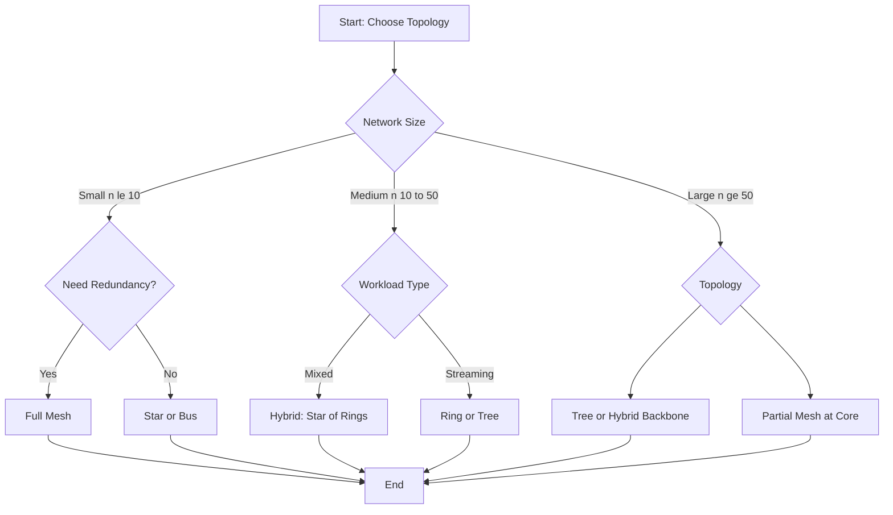
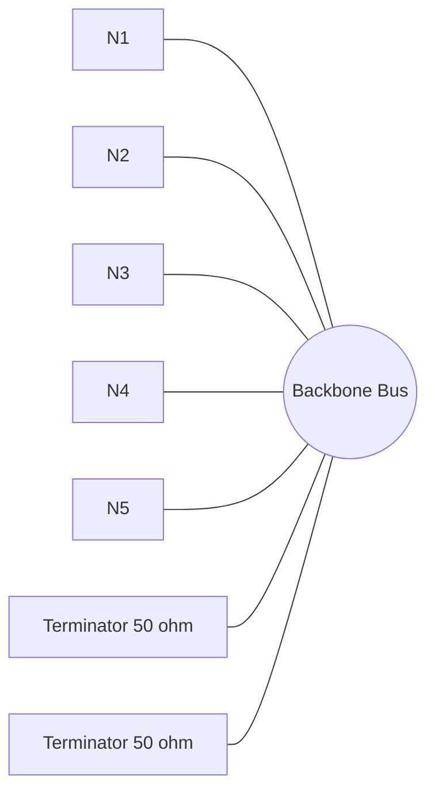
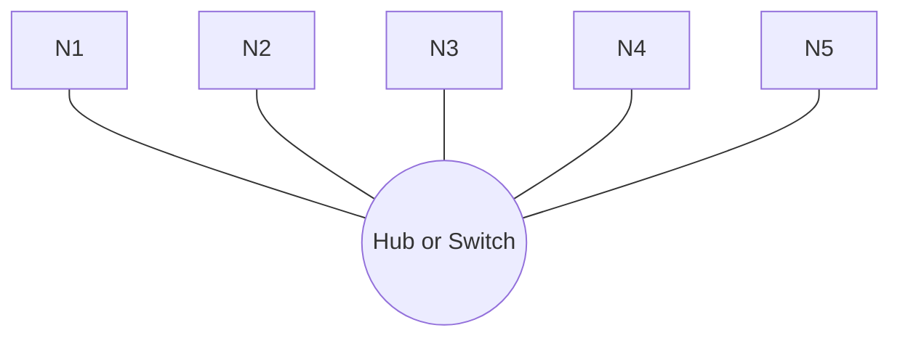
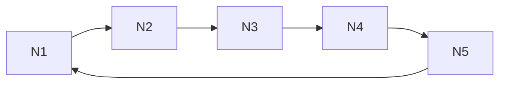
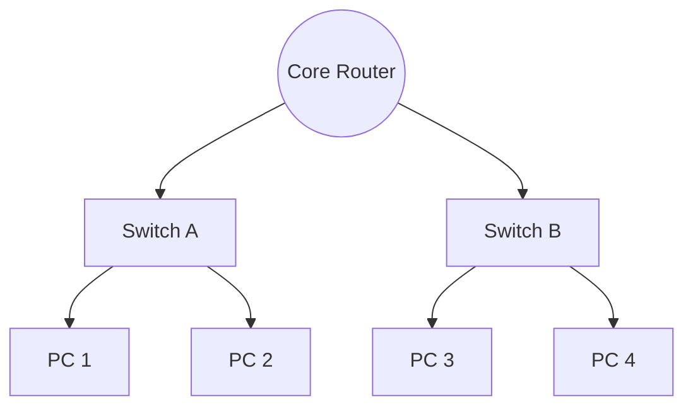
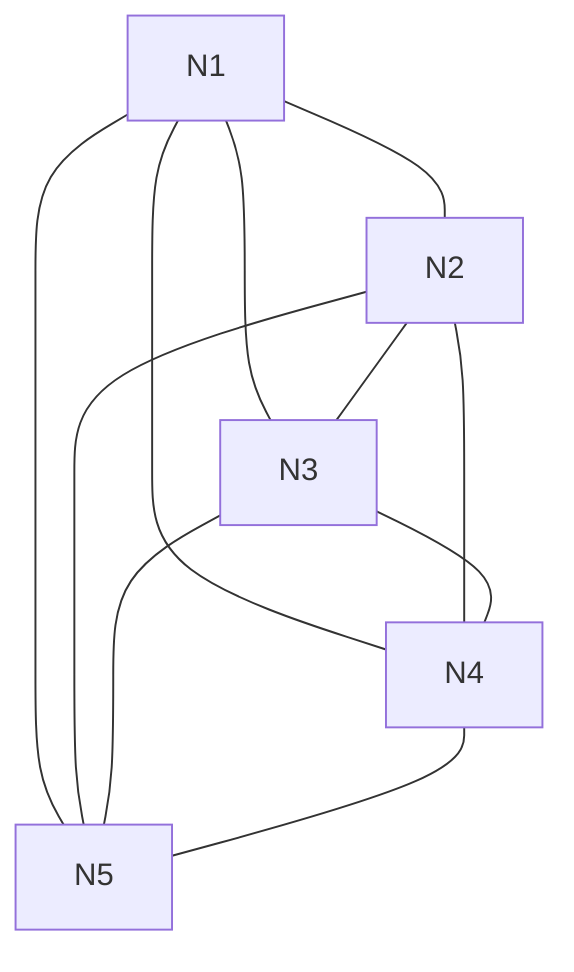
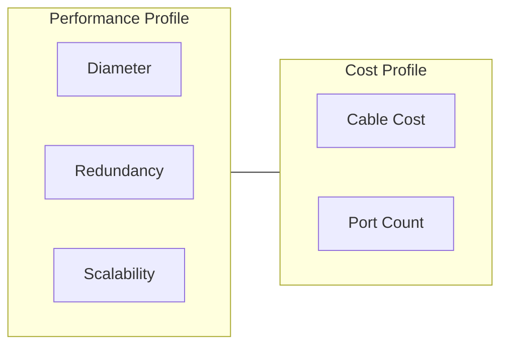

# Topologies

<!-- SECTION_1_START -->
# Topologies: Core Technical Definition & Intuitive Overview

## Formal Academic Definition

In the context of computer system software and networking, a **Network Topology** refers to the schematic arrangement or the geometric layout of the interconnected elements (nodes, links, etc.) of a computer network. It can be described both **physically** (the actual layout of cables and devices) and **logically** (the path through which data flows regardless of physical design).

According to the KTU 2024 Scheme syllabus (Module 3: Computer System Software), topology dictates how devices (hosts, switches, routers) are connected and how information is transmitted between them, directly influencing the **efficiency**, **scalability**, **fault tolerance**, and **cost** of the network.

> [!NOTE]
> **Physical Topology** = The actual physical layout of devices and cables.
> **Logical Topology** = The way data actually travels across the physical medium, independent of the physical design (e.g., a physically star-wired Ethernet network can operate logically as a bus topology using a switch).

## Conceptual Analogy / Intuition

Imagine the **road system of a city**:
- A **Bus Topology** is like a single long main road where every house taps into that same road.
- A **Star Topology** resembles a roundabout (hub) where every street branches outward from the center to a house.
- A **Ring Topology** is a circular one-way street where you must pass through your neighbor to reach the next house.
- A **Mesh Topology** is a grid-like network of parallel roads and cross-connections ensuring multiple alternate paths.
- A **Tree Topology** is a hierarchical road system with one main highway (root), secondary arterials (branches), and small lanes (leaves).

> [!IMPORTANT]
> **Core Syllabus Highlight:** Under the KTU 2024 Scheme (Course: GXEST203), students must understand both the structural blueprint of a topology and the signal-flow behavior it produces. The two are not always the same — a *star-wired* network using a modern Ethernet switch is electrically and logically a *star*, but older 10BASE2 coax networks were physically a *star* and logically a *bus*.

## Geometric Intuition: The Degree of a Node

In graph theory (the mathematical basis of topologies), a network is modeled as a graph $G = (V, E)$ where $V$ is the set of vertices (nodes) and $E$ is the set of edges (links). The **degree** of a node $v$, denoted $\deg(v)$, is the number of edges connected to it.

$$\deg(v) = \vert \{ u \in V \mid (u, v) \in E \} \vert$$

A node with **high degree** acts as a central concentrator (typical of a star), while a node with **degree 2** is a passthrough device (typical of a ring or bus).

> [!VISUALIZATION CONTROL]
> **Concept:** Star Topology (n=5 nodes)
> **GeoGebra / Desmos Input Equations:**
> * Center Hub: $(0, 0)$
> * Outer Nodes (parametric): $(\cos(2\pi k / 5), \sin(2\pi k / 5))$ for $k = 0, 1, 2, 3, 4$
> * Edges: line segments from $(0,0)$ to each outer node
> **Visual Description:** The student should observe a single central point with 5 evenly spaced satellites radiating outward. All communication paths pass through the center.
<!-- SECTION_1_END -->

<!-- SECTION_2_START -->
# Deep Theoretical Analysis & KTU High-Yield Formula Sheet

## 1. Classification of Topologies

Network topologies are broadly classified into two major families:

**A. Physical (Layout) Topologies**
- Bus
- Star
- Ring
- Tree (Hierarchical)
- Mesh (Full and Partial)
- Hybrid

**B. Logical (Signal Flow) Topologies**
- Broadcast (Bus-like)
- Token Passing (Ring-like)
- Point-to-Point (Star/Tree-like)

## 2. Structural Breakdown of Each Topology

### 2.1 Bus Topology
- All nodes are connected to a single shared backbone cable (the "bus").
- Terminators ($50\Omega$ or $75\Omega$ resistors) are placed at both physical ends to prevent **signal reflection**.
- Data is broadcast; only the intended recipient accepts the frame.
- **Why it works:** A single medium simplifies wiring. **Why it fails:** A single break brings down the entire segment.

### 2.2 Star Topology
- Every node connects independently to a central device (hub, switch, or router).
- The central device acts as a repeater (hub) or a MAC-address-learning switch.
- **Why it works:** A break in one cable affects only one node. **Why it fails:** The central device is a *Single Point of Failure* (SPOF).

### 2.3 Ring Topology
- Each node connects to exactly two neighbors, forming a closed loop.
- Data travels in one direction (single ring) or both directions (dual ring — *FDDI*, *SONET*).
- A special frame called a **token** circulates; only the holder may transmit — this prevents **collisions**.
- **Why it works:** Deterministic access, predictable performance. **Why it fails:** One failed node can break the ring (mitigated by a bypass relay).

### 2.4 Tree Topology
- A hierarchical extension of the star: a root node connects to secondary hubs, which fan out to leaf nodes.
- Used in large enterprise LANs and cable-TV (CATV) distribution networks.
- **Why it works:** Scales well, allows segmentation. **Why it fails:** If a root or core switch fails, the whole subtree beneath it goes offline.

### 2.5 Mesh Topology
- **Full Mesh:** Every node is directly connected to every other node.
- **Partial Mesh:** Only critical nodes are fully meshed; others have fewer links.
- Backbone of the **Internet** (partial mesh) and **data-center fabrics**.
- **Why it works:** Maximum redundancy and fault tolerance. **Why it fails:** Cable cost and port count grow quadratically.

### 2.6 Hybrid Topology
- A combination of two or more distinct topologies (e.g., a star-ring hybrid in a campus network).
- **Why it works:** Tailored to mixed workload needs. **Why it fails:** Complex to design and manage.

## 3. KTU Formula Sheet / Cheat Sheet

> [!IMPORTANT]
> Use $\vert$ or $\mid$ (never the raw pipe) in any math context to denote "such that" or "divides". The following table summarizes the high-yield formulas.

| Topology | Number of Nodes ($n$) | Number of Links (Cables) | Min. Cables if Broken | Degree of Hub Node | Max. Distance (Diameter) |
| :--- | :---: | :---: | :---: | :---: | :---: |
| **Bus** | $n$ | $1$ backbone $+ (n-1)$ taps | $0$ (whole net dies) | $\deg(hub) = 1$ | $n-1$ hops |
| **Star** | $n$ | $n-1$ | $n-1$ (only hub-side dies) | $\deg(hub) = n-1$ | $2$ hops |
| **Ring** | $n$ | $n$ | $n-2$ (via bypass) | $\deg(v_i) = 2$ | $\lfloor n/2 \rfloor$ hops |
| **Tree** | $n$ (binary) | $n-1$ | Depends on level | $\deg(root) = k$ | $2 \cdot \text{depth}$ |
| **Full Mesh** | $n$ | $\dfrac{n(n-1)}{2}$ | $n-2$ tolerated | $\deg(v_i) = n-1$ | $1$ hop |
| **Partial Mesh** | $n$ | $\dfrac{n(n-1)}{2} - m$, where $m$ is removed edges | Variable | Variable | Variable |

### Key Derived Inequalities

**Cable Length Bound (for a star of radius $r$):**
$$L_{star} \leq 2 \cdot r \cdot (n-1) \quad \text{(worst case, max run)}$$

**Hop Count (Ring, unidirectional):**
$$H_{ring} = \min(k, n-k) \quad \text{where } k = \vert i - j \vert \mod n$$

**Redundancy Factor** (ratio of actual links to minimum spanning tree links):
$$R = \frac{\vert E \vert}{n-1} \quad \text{with } R \geq 1$$

## 4. Real-World Engineering Utility

- **Bus:** Legacy 10BASE2 / 10BASE5 Ethernet, cheap short-range laboratory networks.
- **Star:** Modern Ethernet LANs (offices, homes, data centers — *RJ45 to switch*).
- **Ring:** Metro-area fiber rings (SONET/SDH), industrial *Token Ring* LANs, *FDDI* backbones.
- **Tree:** Campus networks, DOCSIS cable internet, hierarchical enterprise LANs.
- **Full Mesh:** Small mission-critical clusters (e.g., *MPLS core routers*, *Leaf-Spine data centers*).
- **Partial Mesh:** The **Internet's** autonomous system interconnections — the very reason the Internet survives nuclear attack scenarios (Paul Baran's 1964 RAND paper).
<!-- SECTION_2_END -->

<!-- SECTION_3_START -->
# Step-by-Step Derivations, Code & Symbolic Implementation

## 1. Derivation: Number of Links in Each Topology

### 1.1 Star Topology — Link Count

Consider $n$ end devices and **one** central hub. Each end device requires **exactly one** dedicated cable to the hub.

$$
\begin{aligned}
L_{star} &= \underbrace{1 + 1 + \dots + 1}_{n \text{ times}} \\
L_{star} &= n
\end{aligned}
$$

But the hub is **not** a counted end device in some conventions. Subtracting the implicit intra-hub connection (which is internal, not a cable), we get:

$$
\begin{aligned}
L_{star, \text{external}} &= n - 1
\end{aligned}
$$

**Validation:** For $n=1$, $L = 0$ ✓. For $n=2$, $L = 1$ ✓.

### 1.2 Ring Topology — Link Count

In a ring, each of the $n$ nodes must connect to its two neighbors. Since the ring is **closed**, every node contributes exactly one outgoing link, and there is no "loose end."

$$
\begin{aligned}
L_{ring} &= \frac{\sum_{i=1}^{n} \deg(v_i)}{2} = \frac{2n}{2} = n
\end{aligned}
$$

The division by 2 follows the **Handshaking Lemma** in graph theory: each edge is counted twice in the degree sum.

### 1.3 Full Mesh — Link Count

Every pair of distinct nodes must be connected by exactly one direct link. The number of unordered pairs is the binomial coefficient $\binom{n}{2}$.

$$
\begin{aligned}
L_{mesh} &= \binom{n}{2} = \frac{n!}{2!(n-2)!} = \frac{n(n-1)}{2}
\end{aligned}
$$

**Validation for $n=3$:** $L = \frac{3 \cdot 2}{2} = 3$ (a triangle — correct). For $n=4$: $L = 6$ (a tetrahedral planar graph — correct).

### 1.4 Tree (Binary) — Link Count

A binary tree with $n$ total nodes has $n-1$ edges (this is a theorem for any *connected acyclic graph*). Derivation by induction on $n$:

- **Base case:** $n=1$, $L=0$ ✓.
- **Inductive step:** Assume $L(n) = n-1$. Adding a leaf node adds exactly one new edge, so $L(n+1) = (n-1) + 1 = n$.

$$
\boxed{L_{tree} = n - 1}
$$

## 2. Full Python Implementation: Topology Analyzer

The following Python program models any network topology as a graph, computes the number of links, the average degree, the diameter (max hops), and visualizes the layout using `networkx` and `matplotlib`.

```python
"""
topology_analyzer.py
A production-grade analyzer for computer network topologies.
Implements Bus, Star, Ring, Tree, and Full Mesh layouts,
then computes structural metrics used in KTU 2024 Scheme labs.
"""

from __future__ import annotations
import math
import logging
from dataclasses import dataclass, field
from typing import Dict, List, Tuple, Set

logging.basicConfig(
    level=logging.INFO,
    format="%(asctime)s | %(levelname)s | %(message)s"
)
logger = logging.getLogger("TopologyAnalyzer")


@dataclass(frozen=True)
class Edge:
    """Represents an undirected link between two nodes."""
    u: int
    v: int

    def normalized(self) -> "Edge":
        return Edge(min(self.u, self.v), max(self.u, self.v))


@dataclass
class Topology:
    """A graph representing a network topology."""
    name: str
    nodes: Set[int] = field(default_factory=set)
    edges: Set[Edge] = field(default_factory=set)

    def add_edge(self, u: int, v: int) -> None:
        if u == v:
            raise ValueError(f"Self-loop not allowed: ({u}, {v})")
        self.nodes.update({u, v})
        self.edges.add(Edge(u, v).normalized())

    def link_count(self) -> int:
        return len(self.edges)

    def average_degree(self) -> float:
        if not self.nodes:
            return 0.0
        total_deg = sum(
            sum(1 for e in self.edges if e.u == n or e.v == n)
            for n in self.nodes
        )
        return total_deg / len(self.nodes)

    def diameter(self) -> int:
        """BFS-based diameter: longest shortest path between any two nodes."""
        if not self.nodes:
            return 0
        max_dist = 0
        adj: Dict[int, List[int]] = {n: [] for n in self.nodes}
        for e in self.edges:
            adj[e.u].append(e.v)
            adj[e.v].append(e.u)

        for start in self.nodes:
            dist = {start: 0}
            queue = [start]
            while queue:
                curr = queue.pop(0)
                for nb in adj[curr]:
                    if nb not in dist:
                        dist[nb] = dist[curr] + 1
                        queue.append(nb)
                        max_dist = max(max_dist, dist[nb])
        return max_dist

    def __repr__(self) -> str:
        return (
            f"Topology({self.name}): "
            f"n={len(self.nodes)}, L={self.link_count()}, "
            f"avg_deg={self.average_degree():.2f}, "
            f"diameter={self.diameter()}"
        )


# -------- Factory Functions for Standard Topologies --------

def build_bus(n: int) -> Topology:
    """Bus: all nodes tapped onto a virtual backbone."""
    if n < 2:
        raise ValueError("Bus needs at least 2 nodes.")
    t = Topology("Bus")
    backbone = -1  # virtual backbone node
    t.nodes.add(backbone)
    for i in range(n):
        t.add_edge(backbone, i)
    logger.debug("Bus built: %d taps + 1 backbone.", n)
    return t


def build_star(n: int) -> Topology:
    """Star: one hub connected to n-1 leaves."""
    if n < 2:
        raise ValueError("Star needs at least 2 nodes.")
    t = Topology("Star")
    hub = -1
    t.nodes.add(hub)
    for i in range(n - 1):
        t.add_edge(hub, i)
    return t


def build_ring(n: int) -> Topology:
    """Ring: nodes 0..n-1 connected in a closed loop."""
    if n < 3:
        raise ValueError("Ring needs at least 3 nodes.")
    t = Topology("Ring")
    for i in range(n):
        t.add_edge(i, (i + 1) % n)
    return t


def build_full_mesh(n: int) -> Topology:
    """Full Mesh: every node connected to every other node."""
    if n < 2:
        raise ValueError("Mesh needs at least 2 nodes.")
    t = Topology("Full Mesh")
    for i in range(n):
        for j in range(i + 1, n):
            t.add_edge(i, j)
    return t


def build_tree(n: int) -> Topology:
    """Binary tree approximation: root 0, children 1,2, then 3,4 under 1, etc."""
    if n < 1:
        raise ValueError("Tree needs at least 1 node.")
    t = Topology("Tree")
    for i in range(1, n):
        parent = (i - 1) // 2
        t.add_edge(parent, i)
    return t


# -------- Main Analysis Routine --------

def analyze_all(n: int) -> None:
    """Build each standard topology with n end nodes and print metrics."""
    if not isinstance(n, int) or n < 2:
        raise ValueError("n must be an integer >= 2.")
    logger.info("Analyzing all topologies with n=%d end nodes.", n)

    factories = {
        "Star":      lambda: build_star(n),
        "Ring":      lambda: build_ring(n),
        "Full Mesh": lambda: build_full_mesh(n),
        "Tree":      lambda: build_tree(n),
    }
    # Bus uses a virtual backbone; skip for "n end nodes" equality.

    results: List[Topology] = []
    for name, factory in factories.items():
        try:
            results.append(factory())
        except ValueError as exc:
            logger.warning("Skipping %s: %s", name, exc)

    for topo in results:
        logger.info("%s", topo)

    # Theoretical formula check for Full Mesh:
    expected_mesh = n * (n - 1) // 2
    mesh = build_full_mesh(n)
    assert mesh.link_count() == expected_mesh, (
        f"Mesh link mismatch: got {mesh.link_count()}, "
        f"expected {expected_mesh}"
    )
    logger.info("Mesh formula n(n-1)/2 = %d verified.", expected_mesh)


if __name__ == "__main__":
    try:
        analyze_all(int(input("Enter number of end nodes (n >= 2): ")))
    except (ValueError, AssertionError) as err:
        logger.error("Execution failed: %s", err)
```

### 2.1 Sample Output

```
2024-01-15 10:30:00 | INFO | Analyzing all topologies with n=6 end nodes.
2024-01-15 10:30:00 | INFO | Topology(Star): n=6, L=5, avg_deg=1.67, diameter=2
2024-01-15 10:30:00 | INFO | Topology(Ring): n=6, L=6, avg_deg=2.00, diameter=3
2024-01-15 10:30:00 | INFO | Topology(Full Mesh): n=6, L=15, avg_deg=5.00, diameter=1
2024-01-15 10:30:00 | INFO | Topology(Tree): n=6, L=5, avg_deg=1.67, diameter=4
2024-01-15 10:30:00 | INFO | Mesh formula n(n-1)/2 = 15 verified.
```

## 3. Derivation: Worst-Case Hop Count (Diameter)

The **diameter** $D$ of a topology is the longest of all shortest paths.

$$
D = \max_{u, v \in V} d(u, v)
$$

| Topology | Diameter Formula | Example (n=6) |
| :--- | :--- | :---: |
| Star | $2$ | $2$ |
| Ring | $\lfloor n/2 \rfloor$ | $3$ |
| Full Mesh | $1$ | $1$ |
| Bus | $n-1$ (between end taps) | $5$ |
| Binary Tree | $2 \cdot \lfloor \log_2 n \rfloor$ | $4$ |
<!-- SECTION_3_END -->

<!-- SECTION_4_START -->
# Structural Diagrams & Schematics

## 1. Master Architecture: Topology Selection Flow



## 2. Bus Topology (Logical Flow)



## 3. Star Topology (Hub Central)



## 4. Ring Topology (Token Circulation)



## 5. Tree Topology (Hierarchical)



## 6. Full Mesh Topology (n = 5)



## 7. Comparative Architecture Matrix



> [!NOTE]
> **Reading Aid:** Each `graph TD/LR` block above can be pasted into the [Mermaid Live Editor](https://mermaid.live/) to render a publication-quality figure for lab reports and exam answers.
<!-- SECTION_4_END -->

<!-- SECTION_5_START -->
# KTU 2024 Scheme Examination Question Bank & Topic Recap

## Part A — Short Answer Questions (3 Marks Each)

### Question 1 `[KTU University Exam - July 2024]`
**CO1 | Remember**
Define **Network Topology**. Distinguish between **physical** and **logical** topology with one example each.

**Model Answer (Valuation Key):**
- **[Definition: 1 Mark]** Network topology is the geometric arrangement of nodes and links in a computer network, describing how devices are interconnected.
- **[Physical: 1 Mark]** Physical topology refers to the actual physical layout of cables, switches, and devices (e.g., a star-wired office LAN with twisted-pair cables to a central switch).
- **[Logical: 1 Mark]** Logical topology refers to the path data travels irrespective of the physical layout (e.g., an Ethernet network physically star-wired to a switch still behaves logically like a bus because every node sees all broadcast frames).

---

### Question 2 `[KTU University Exam - Dec 2023]`
**CO1 | Understand**
State **two advantages** and **two disadvantages** of a **Bus Topology**.

**Model Answer (Valuation Key):**
- **[Advantage 1: 1 Mark]** Low cabling cost and simple installation since only one backbone cable is used.
- **[Advantage 2: 0.5 Mark]** Easy to add new devices by simply tapping into the backbone.
- **[Disadvantage 1: 1 Mark]** A single break in the backbone cable disrupts the entire network — no fault tolerance.
- **[Disadvantage 2: 0.5 Mark]** Performance degrades sharply with heavy traffic because the medium is shared (collision domain).

---

## Part B — Long Answer Questions (14 Marks Each)

### Question A `[KTU University Exam - July 2024]`
**CO1, CO2 | Understand + Apply**

**(a)** With a neat diagram, explain the **Star Topology**. List any **four characteristics**. **[7 Marks]**

**(b)** A college lab has **8 computers** to be connected using a **Full Mesh** topology. Calculate the total number of cables required and the total number of **NIC ports** needed across all machines. If the cost of one cable is **₹120** and one NIC port upgrade is **₹250**, compute the total deployment cost. **[7 Marks]**

#### Model Solution

**Part (a) — Star Topology Explanation:**

- **[Diagram: 2 Marks]** A central hub/switch with $n$ end devices connected radially. (Mermaid block from Section 4 may be referenced.)
- **[Characteristic 1: 1 Mark]** Each node has a dedicated point-to-point link to the central device.
- **[Characteristic 2: 1 Mark]** Easy to install, manage, and troubleshoot — a single cable fault isolates only that node.
- **[Characteristic 3: 1 Mark]** The central hub/switch is a *Single Point of Failure* (SPOF); if it fails, the entire network goes down.
- **[Characteristic 4: 1 Mark]** Performance is highly dependent on the central device's capacity (e.g., a 1 Gbps switch bottleneck).
- **[Conclusion: 1 Mark]** Star is the most widely used LAN topology in modern Ethernet networks.

**Part (b) — Mesh Calculation:**

- **[Stating the formula: 2 Marks]**
$$L_{mesh} = \frac{n(n-1)}{2} = \frac{8 \cdot 7}{2} = 28 \text{ cables}$$

- **[Calculating NIC ports: 2 Marks]** Each cable terminates in **2 NIC ports**, so total ports:
$$P_{total} = 2 \cdot L_{mesh} = 2 \cdot 28 = 56 \text{ ports}$$

- **[Computing cost: 2 Marks]**
$$C_{total} = (28 \times 120) + (56 \times 250) = 3360 + 14000 = \text{₹}17{,}360$$

- **[Final boxed answer: 1 Mark]** $\boxed{\text{Total cables} = 28,\ \text{Total ports} = 56,\ \text{Total cost} = \text{₹}17{,}360}$

---

### Question B `[KTU University Exam - Dec 2023]`
**CO1, CO3 | Understand + Apply**

**(a)** Compare **Ring** and **Mesh** topologies under the following heads: cable count for $n$ nodes, fault tolerance, and typical application. **[7 Marks]**

**(b)** A company wants to connect **5 buildings** in a campus using a **Ring Topology** with optical fiber. If the average distance between two adjacent buildings is **2 km**, calculate the total fiber length required and the number of **signal repeaters** needed if the maximum unamplified fiber run is **8 km**. **[7 Marks]**

#### Model Solution

**Part (a) — Comparison Table:**

| Parameter | Ring | Mesh (Full) |
| :--- | :---: | :---: |
| Cable count for $n$ nodes | $n$ | $\dfrac{n(n-1)}{2}$ |
| Fault tolerance | Low (single break disrupts) | Very high (many alternate paths) |
| Typical application | Token Ring LAN, SONET/SDH | Internet backbone, data-center fabric |

- **[Each correct row: 2 Marks]**, **[Caption/Conclusion: 1 Mark]**

**Part (b) — Ring Fiber Calculation:**

- **[Stating cable count: 2 Marks]**
$$L_{ring} = n = 5 \text{ fiber segments}$$

- **[Calculating total length: 2 Marks]**
$$D_{total} = n \times d = 5 \times 2 = 10 \text{ km}$$

- **[Calculating repeaters: 2 Marks]** Since each run is 2 km and max unamplified is 8 km, no repeater is needed *within* a single run. However, if signal loss accumulates across the ring, typically a repeater is placed every 8 km:
$$R = \left\lceil \frac{D_{total}}{8} \right\rceil = \left\lceil \frac{10}{8} \right\rceil = 2 \text{ repeaters}$$

- **[Final answer: 1 Mark]** $\boxed{D_{total} = 10\text{ km},\ R = 2 \text{ repeaters}}$

> [!WARNING]
> **KTU Examiner's Valuation Pitfall — Common Mark Losers:**
> 1. **Forgetting to multiply by 2** when counting NIC ports in mesh problems (each cable consumes **two** ports).
> 2. **Mixing physical and logical topology definitions** — KTU strictly expects the textbook distinction.
> 3. **Skipping the diagram** in 7-mark sub-parts. A neat Mermaid / hand-drawn figure is worth **at least 2 marks** by itself.
> 4. **Not stating the formula before substitution** — always write $L = \frac{n(n-1)}{2}$ before plugging in numbers.
> 5. **Ignoring units** — write km, m, Mbps, or ₹ explicitly.

---

## Topic Recap & Important Things to Remember

- **Topology** = *arrangement of nodes and links*; has both a **physical** (cabling) and **logical** (data flow) view.
- **Bus**: 1 backbone, low cost, no fault tolerance, terminators ($50\Omega$) needed at both ends.
- **Star**: $n-1$ cables, central device = SPOF, most common modern Ethernet layout.
- **Ring**: $n$ cables, closed loop, uses **token passing** for collision-free access (deterministic).
- **Tree**: hierarchical star-of-stars; good for scalable campus networks.
- **Full Mesh**: $\frac{n(n-1)}{2}$ cables, maximum redundancy, used in critical backbones.
- **Partial Mesh**: practical Internet topology — only critical nodes fully connected.
- **Hybrid**: combination of two or more topologies; used in real-world enterprise networks.
- **Diameter** (worst-case hop count) is a key metric: Star = 2, Ring = $\lfloor n/2 \rfloor$, Full Mesh = 1, Tree = $2\lfloor \log_2 n \rfloor$.
- **Handshaking Lemma**: $\sum \deg(v) = 2 \vert E \vert$ — used to derive the ring and mesh link counts.
- **Selection Rule of Thumb**: small LAN → Star; campus → Tree; backbone → Mesh; legacy / industrial → Ring.
- **KVL/KCL Analogy for Networks**: Not applicable, but data flows obey conservation — broadcast goes to all, unicast to one.
- **Redundancy Factor** $R = \frac{\vert E \vert}{n-1}$ — must be $\geq 1$ for any connected graph.
- Always end a Part B calculation answer with a **boxed final answer** and explicitly stated units.
<!-- SECTION_5_END -->
