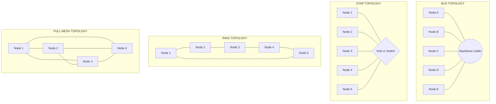
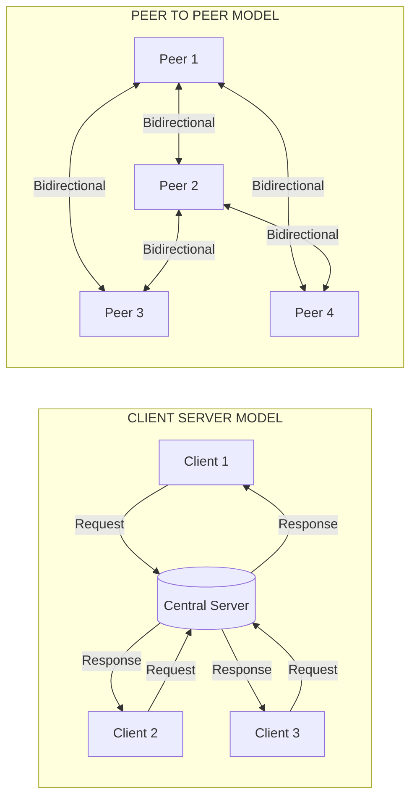
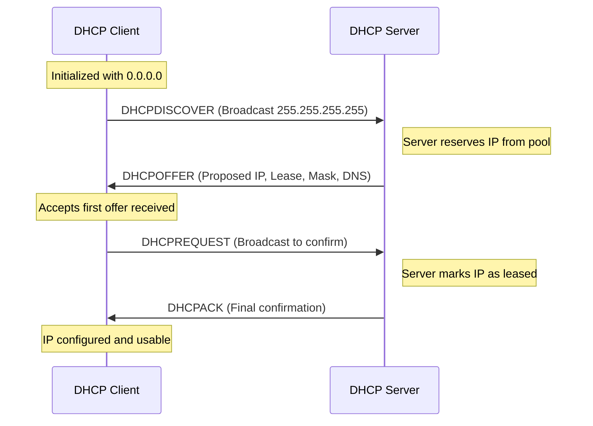
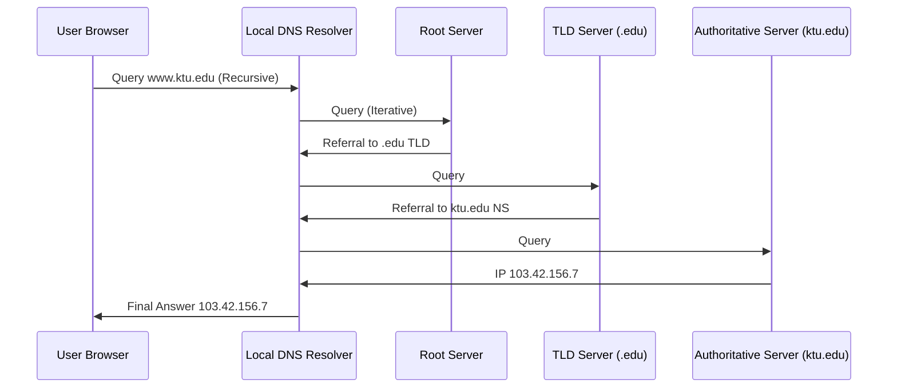
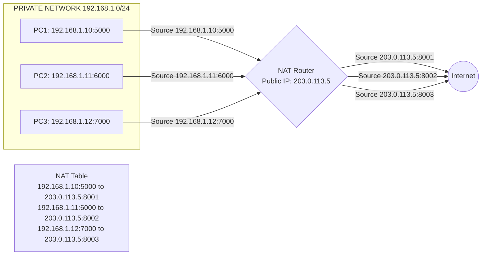
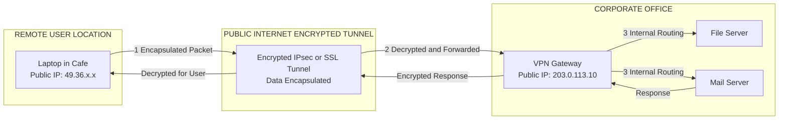
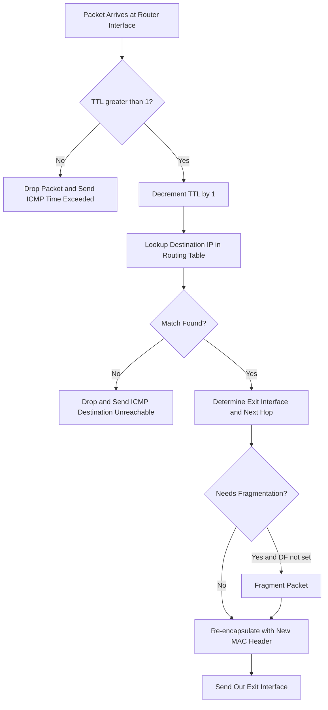
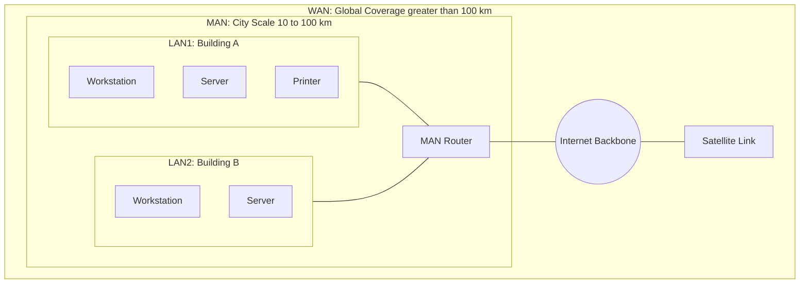

# Data Communication: Network topologies (LAN, MAN, WAN), Client-Server vs P2P, IP addressing schemes, DHCP, NAT, DNS, routers, VPN

<!-- SECTION_1_START -->
# Foundations of Computing: Data Communication & Network Essentials

## 1. Network Topologies — The Backbone of Connectivity

### 1.1 Formal KTU Definition
> [!NOTE]
> **Network Topology** is the physical or logical arrangement of nodes, links, and connectivity patterns in a computer network. The KTU 2024 syllabus categorizes computer networks based on **geographic scale** into **LAN (Local Area Network)**, **MAN (Metropolitan Area Network)**, and **WAN (Wide Area Network)**, each with distinct transmission speeds, protocols, and ownership models.

### 1.2 Types of Network Topologies (Geographical Classification)

| Network Type | Geographic Scope | Typical Speed | Ownership | Common Example |
|:---:|:---:|:---:|:---:|:---:|
| **LAN** | Building / Campus (≤ 10 km) | 100 Mbps – 10 Gbps | Private (Organization) | Office Wi-Fi, College Lab |
| **MAN** | City-wide (10–100 km) | 1 Mbps – 1 Gbps | Public/Private partnership | Cable TV network, City Wi-Fi |
| **WAN** | Country / Global (> 100 km) | 56 Kbps – 1 Gbps | Service Providers (ISP) | Internet, Banking Networks |

### 1.3 Physical vs Logical Topologies

> [!IMPORTANT]
> **Physical Topology** = Actual cable layout (where wires are physically run).
> **Logical Topology** = How data flows regardless of physical wiring (e.g., a star-wired Ethernet often behaves like a logical bus due to switch behavior).

**Conceptual Analogy / Intuition:**
Think of a network topology as a **road map of a city**:
- **Bus Topology** → A single main road with houses connected via driveways (one road carries all traffic).
- **Star Topology** → Houses connect to a central roundabout/square (all routes pass through the center).
- **Ring Topology** → Houses form a circular village road (data passes house-to-house in one direction).
- **Mesh Topology** → Every house has a direct road to every other house (maximum redundancy, maximum cost).
- **Tree (Hybrid) Topology** → Branches off a main trunk, like a river delta feeding smaller streams.

> [!VISUALIZATION CONTROL]
> **Concept:** Star, Bus, Ring, and Mesh Topology Side-by-Side
> **GeoGebra / Desmos Input Equations:**
> * Star: `C1 = Circle((0,0), 2)`, leaves at `(2,0), (-2,0), (0,2), (0,-2), (1.4,1.4), (1.4,-1.4), (-1.4,1.4), (-1.4,-1.4)`
> * Bus: horizontal line `y = 0` from `x = -5` to `x = 5` with vertical drops at intervals
> * Ring: 8 evenly spaced points on a circle joined sequentially
> * Mesh: 5 points with all $\binom{5}{2} = 10$ line segments
> **Visual Description:** Observe how Mesh has the highest connectivity (resilience), Ring is symmetric, Star has a single point of failure at the hub, and Bus is the simplest but collapses if the backbone fails.

### 1.4 Client-Server vs Peer-to-Peer (P2P)

> [!NOTE]
> **Client-Server Model:** A dedicated central **server** hosts resources and responds to **client** requests. The server has a fixed IP and provides controlled, centralized services.
> **Peer-to-Peer (P2P) Model:** Every node (peer) acts as both **client and server**. Resources are distributed across all participants without a central authority.

**Real-World Analogy:**
- **Client-Server** = A **restaurant** — one kitchen (server) serves food to many tables (clients). Centralized control, predictable service.
- **P2P** = A **potluck dinner** — every guest brings and shares food directly with every other guest. Decentralized, no single point of failure.

### 1.5 IP Addressing — The Digital Postal Address

> [!IMPORTANT]
> An **IP Address (Internet Protocol Address)** is a unique 32-bit (IPv4) or 128-bit (IPv6) numerical label assigned to every device on a TCP/IP network. It serves two primary functions: **Network Identification** (which network the host belongs to) and **Host Identification** (the unique device on that network).

**Analogy:** Just as a house needs a postal address `(House No., Street, City, PIN Code)` for mail delivery, every networked device needs an IP like `192.168.1.10` to receive data packets.

### 1.6 Essential Network Services — DHCP, NAT, DNS

> [!NOTE]
> **DHCP (Dynamic Host Configuration Protocol):** Automatically assigns IP addresses to devices when they join a network. Eliminates manual configuration.
> **NAT (Network Address Translation):** Maps multiple private IPs to a single public IP, conserving the IPv4 address space.
> **DNS (Domain Name System):** Translates human-readable domain names (e.g., `www.ktu.edu`) into machine-readable IP addresses (e.g., `103.42.156.7`).
> **Router:** A Layer 3 device that forwards packets between different networks based on routing tables.
> **VPN (Virtual Private Network):** Creates an encrypted "tunnel" over a public network to ensure secure remote communication.

**Quick Analogy Set:**
- **Router** = A **traffic police officer** at an intersection directing cars to their correct routes.
- **DNS** = The **phone directory of the internet** (Name → Number).
- **DHCP** = A **hotel reception desk** that assigns room numbers to guests on arrival.
- **NAT** = A **company's switchboard** — many employees share one public phone number, but internal extensions differ.
- **VPN** = A **secure armored courier** that disguises and protects your package while crossing hostile territory (public internet).
<!-- SECTION_1_END -->

<!-- SECTION_2_START -->
# Deep Theoretical Analysis & KTU Formula Sheet

## 2.1 Network Topologies — Comparative Theoretical Analysis

### 2.1.1 Bus Topology
- **Structure:** All nodes share a single backbone cable (coaxial/Twisted pair) terminated at both ends with a **50Ω terminator**.
- **Data Flow:** Uses CSMA/CD (Carrier Sense Multiple Access with Collision Detection).
- **Pros:** Cheap, simple, requires less cable.
- **Cons:** Single point of failure (backbone break = total collapse), performance degrades under heavy load, difficult to troubleshoot.

### 2.1.2 Star Topology
- **Structure:** Every node connects to a central device (Hub/Switch).
- **Data Flow:** Central device acts as a repeater (Hub) or intelligent forwarder (Switch).
- **Pros:** Easy to install and expand, single node failure doesn't affect others, easy fault detection.
- **Cons:** Hub/switch is a single point of failure, more cable length required.

### 2.1.3 Ring Topology
- **Structure:** Each node connects to exactly two neighbors, forming a closed loop. Uses **Token Passing** (Token Ring / IEEE 802.5).
- **Data Flow:** Unidirectional token circulates; only token holder can transmit.
- **Pros:** No collisions (token ensures one transmitter at a time), predictable performance.
- **Cons:** Single ring break disables entire network (unless dual-ring used), slow under heavy load.

### 2.1.4 Mesh Topology
- **Structure:** Every node connects to every other node.
- **Data Flow:** Multiple redundant paths. Two variants:
  * **Full Mesh:** $\frac{n(n-1)}{2}$ links for $n$ nodes.
  * **Partial Mesh:** Only critical nodes fully connected.
- **Pros:** Highly fault-tolerant, no traffic problems, ideal for backbone (Internet core).
- **Cons:** Expensive, complex installation, large cable count.

### 2.1.5 Tree (Hierarchical) Topology
- **Structure:** Hybrid of Star and Bus. Groups of star-configured networks connected to a bus backbone.
- **Data Flow:** Hierarchical — root → branches → leaves.
- **Pros:** Scalable, suitable for large networks with sub-divisions.
- **Cons:** If backbone fails, whole segment goes down.

### 2.1.6 Hybrid Topology
- **Structure:** Combination of two or more different topologies. E.g., Star-Bus, Star-Ring.
- **Pros:** Flexible, scalable, fault-isolated segments.

## 2.2 LAN / MAN / WAN — Detailed Engineering Specs

| Parameter | LAN | MAN | WAN |
|:---|:---:|:---:|:---:|
| Ownership | Private Org | Public/Private mix | Telecom/ISP |
| Speed | 100 Mbps – 10 Gbps | 1 Mbps – 1 Gbps | 56 Kbps – 1 Gbps |
| Latency | Very Low (< 10 ms) | Moderate (10–50 ms) | High (50–500 ms) |
| Error Rate | Very Low | Low | Higher |
| Protocols | Ethernet, Wi-Fi (802.11) | FDDI, ATM, Metro-Ethernet | MPLS, Frame Relay, PPP |
| Cost | Low | Moderate | High |
| Devices | Hub, Switch, Access Point | Router, MAN Switch | Router, Modem, Satellite |
| Coverage | < 10 km | 10–100 km | > 100 km (global) |

## 2.3 IP Addressing Schemes — IPv4

### 2.3.1 Address Structure (32-bit / 4 Octets)
An IPv4 address is written in **dotted decimal** notation:
$$\text{IP} = \text{Network Portion} \mid \text{Subnet Portion} \mid \text{Host Portion}$$

### 2.3.2 IPv4 Classful Addressing (RFC 791)

| Class | Leading Bits | First Octet Range | Default Mask | Max Networks | Max Hosts per Network |
|:---:|:---:|:---:|:---:|:---:|:---:|
| **A** | `0` | 1 – 126 | /8 (255.0.0.0) | 128 | 16,777,214 |
| **B** | `10` | 128 – 191 | /16 (255.255.0.0) | 16,384 | 65,534 |
| **C** | `110` | 192 – 223 | /24 (255.255.255.0) | 2,097,152 | 254 |
| **D** | `1110` | 224 – 239 | — | Multicast | — |
| **E** | `1111` | 240 – 255 | — | Experimental/Reserved | — |

> [!IMPORTANT]
> **Special Addresses:**
> * `127.0.0.0` → **Loopback** (localhost)
> * `0.0.0.0` → Default route / "this network"
> * `255.255.255.255` → Limited broadcast
> * `10.0.0.0/8`, `172.16.0.0/12`, `192.168.0.0/16` → **Private IPs** (RFC 1918)

### 2.3.3 Subnet Masking & CIDR

A **subnet mask** separates network and host bits. Example: `255.255.255.0` = `11111111.11111111.11111111.00000000` (24 network bits).

**CIDR (Classless Inter-Domain Routing):** Notation `IP/n` where $n$ = number of network bits. E.g., `192.168.1.0/26` → 26 network bits, 6 host bits.

## 2.4 KTU High-Yield Formula Sheet

| # | Concept | Formula | Description |
|:---:|:---|:---|:---|
| 1 | Number of usable hosts per subnet | $H = 2^{h} - 2$ | $h$ = number of host bits. Subtract 2 for **network address** and **broadcast address**. |
| 2 | Number of subnets created | $S = 2^{s}$ | $s$ = number of bits borrowed from host portion. |
| 3 | Total usable host addresses (network) | $N = 2^{h} - 2$ | Same as #1, applied to full network. |
| 4 | Subnet Increment (Block Size) | $B = 2^{8-n_o}$ | $n_o$ = number of host bits in the *last* octet. |
| 5 | First usable host | Network + 1 | E.g., for `192.168.1.0/26`, first host = `192.168.1.1`. |
| 6 | Last usable host | Broadcast − 1 | For `/26` ending in `192.168.1.63` (broadcast), last host = `192.168.1.62`. |
| 7 | Broadcast address | Last IP of subnet | All host bits = 1. |
| 8 | Wildcard mask | $W_i = 255 - M_i$ (per octet) | Inverse of subnet mask, used in ACLs. |
| 9 | Full Mesh links | $L = \frac{n(n-1)}{2}$ | $n$ = number of nodes. |
| 10 | VLSM subnets from a major network | $\sum 2^{h_i} \le 2^{h_{total}}$ | Sum of required hosts must fit in available host space. |
| 11 | Private IP Ranges | `10.0.0.0/8`, `172.16.0.0/12`, `192.168.0.0/16` | Per RFC 1918 — non-routable on public internet. |
| 12 | IPv4 total addresses | $2^{32} = 4{,}294{,}967{,}296$ | Drives the need for NAT and IPv6. |
| 13 | IPv6 total addresses | $2^{128}$ | $3.4 \times 10^{38}$ unique addresses. |
| 14 | DHCP Lease | $T_{\text{lease}} = T_{\text{renew}} + T_{\text{rebind}} + T_{\text{expire}}$ | `T1` = 50%, `T2` = 87.5% of lease time. |
| 15 | NAT port capacity | $C = 2^{16} = 65{,}536$ | One public IP can map 65,536 simultaneous internal connections. |

## 2.5 DHCP — Protocol Operation (4-Step DORA Process)

> [!IMPORTANT]
> DHCP dynamically assigns IP addresses through a **4-message handshake**:
> 1. **DISCOVER** — Client broadcasts `DHCPDISCOVER` (source `0.0.0.0`, dest `255.255.255.255`).
> 2. **OFFER** — Server responds with `DHCPOFFER` containing proposed IP, lease time, subnet mask, gateway, DNS.
> 3. **REQUEST** — Client broadcasts `DHCPREQUEST` accepting the offer (broadcast because it may have multiple offers).
> 4. **ACK** — Server sends `DHCPACK` confirming the lease. Client may now use the IP.

**Lease Renewal Timing:**
- At **50%** of lease (T1): Client unicasts `DHCPREQUEST` to original server to renew.
- At **87.5%** of lease (T2): Client broadcasts `DHCPREQUEST` to any DHCP server.
- At **100%** (expiry): Client must release IP and restart DORA.

## 2.6 DNS — Hierarchical Resolution

> [!NOTE]
> DNS operates as a **distributed hierarchical database** with 13 logical root server clusters (A–M). Resolution modes:
> * **Recursive Query:** Server fully resolves and returns final answer (typical for ISP resolvers).
> * **Iterative Query:** Server returns referral; client queries next server.
> * **Inverse Lookup:** IP → Hostname (used by PTR records).

**Record Types:** `A` (IPv4), `AAAA` (IPv6), `CNAME` (alias), `MX` (mail), `NS` (name server), `PTR` (reverse), `TXT` (verification).

## 2.7 NAT — Network Address Translation Variants

| Type | Description | Use Case |
|:---|:---|:---|
| **Static NAT** | 1 private ↔ 1 public (fixed mapping) | Web servers needing fixed public IP |
| **Dynamic NAT** | Pool of public IPs ↔ pool of private | Mid-size organizations |
| **PAT (Port Address Translation)** | Many private ↔ 1 public (via port numbers) | Home/SOHO routers (most common) |

**PAT Process:** Router maintains a translation table `(Private IP, Port) ↔ (Public IP, New Port)`. Outgoing packets have source translated; incoming responses are reverse-translated using the port number.

## 2.8 Router Operations

A **router** operates at **OSI Layer 3** and uses a **routing table** to forward packets. Key functions:
1. **Path Determination** — Build routing table via static config or dynamic protocols (RIP, OSPF, BGP).
2. **Packet Forwarding** — Encapsulate/de-encapsulate, decrement TTL, check checksum.
3. **Traffic Management** — QoS, filtering (ACLs), fragmentation.

**Routing Algorithms:**
- **Distance Vector** (RIP): Bellman-Ford, hop count metric, periodic full-table updates.
- **Link State** (OSPF): Dijkstra SPF algorithm, triggered updates, faster convergence.
- **Path Vector** (BGP): Used between autonomous systems on the internet, policy-based.

## 2.9 VPN — Virtual Private Network

> [!IMPORTANT]
> A **VPN** creates an **encrypted tunnel** over a public network, providing **confidentiality** (encryption), **integrity** (hashing), and **authentication** (certificates/keys).

**Types:**
- **Site-to-Site VPN:** Connects two fixed networks (e.g., branch office to HQ) — typically IPsec.
- **Remote Access VPN:** Individual user connects to corporate network — typically SSL/TLS.
- **SSL VPN:** Browser-based, no client software needed.

**Tunneling Protocols:** PPTP, L2TP, IPsec, OpenVPN, WireGuard, IKEv2.
<!-- SECTION_2_END -->

<!-- SECTION_3_START -->
# Step-by-Step Derivations, Subnetting & Code Implementation

## 3.1 Exhaustive Subnetting Walkthrough — KTU Standard Problem

### Problem: Given the network `192.168.10.0/26`, determine all subnets, host ranges, and broadcast addresses.

**Step 1: Identify the default class and mask.**
- `192` is in range 192–223 → **Class C**
- `/26` means 26 network bits → Subnet mask = `255.255.255.192`
- Binary of last octet: `11111111.11111111.11111111.11000000`

**Step 2: Calculate host bits and usable hosts.**
- Total bits = 32, Network bits = 26, Host bits $h = 32 - 26 = 6$
- Usable hosts per subnet $H = 2^6 - 2 = 64 - 2 = 62$

**Step 3: Calculate block size (subnet increment).**
- $B = 2^{8-2} = 2^6 = 64$ (since only 2 host bits in the 4th octet — wait, recheck: 6 host bits total, 0 in 1st, 0 in 2nd, 0 in 3rd octet, 6 in 4th octet → $2^{8-6} = 2^2 = 4$)
  
> [!IMPORTANT]
> **Corrected:** The formula uses the **host bits in the *changing* octet**. With /26, the 4th octet has 6 host bits, so block size $B = 2^{8-6} = 2^2 = 4$. Wait — that is **wrong** for /26. Let me redo: For /26, network bits = 26, host bits = 6, all 6 host bits are in the 4th octet. Subnet mask 4th octet = `11000000` = 192. So block size in 4th octet = $256 - 192 = 64$. The formula $B = 2^h$ for the *last octet host bits* gives $2^6 = 64$. ✓

**Step 4: List subnets by adding block size of 64 to the 4th octet.**

| Subnet # | Network Address | First Host | Last Host | Broadcast |
|:---:|:---:|:---:|:---:|:---:|
| 0 | 192.168.10.0 | 192.168.10.1 | 192.168.10.62 | 192.168.10.63 |
| 1 | 192.168.10.64 | 192.168.10.65 | 192.168.10.126 | 192.168.10.127 |
| 2 | 192.168.10.128 | 192.168.10.129 | 192.168.10.190 | 192.168.10.191 |
| 3 | 192.168.10.192 | 192.168.10.193 | 192.168.10.254 | 192.168.10.255 |

**Step 5: Total usable addresses.**
$$N_{\text{usable}} = 4 \text{ subnets} \times 62 \text{ hosts} = 248 \text{ hosts}$$

## 3.2 VLSM (Variable Length Subnet Masking) — Detailed Allocation

### Problem: Network `10.0.0.0/8` to be divided into 4 departments with hosts: 1000, 500, 200, 50.

**Step 1: Sort requirements in descending order (largest first).**
- Dept A: 1000 hosts
- Dept B: 500 hosts
- Dept C: 200 hosts
- Dept D: 50 hosts

**Step 2: For each requirement, find smallest $2^h - 2 \ge \text{required hosts}$.**

| Dept | Req. Hosts | $2^h$ | $h$ needed | New Prefix | Subnet Mask | Allocated Range |
|:---:|:---:|:---:|:---:|:---:|:---:|:---|
| A | 1000 | $2^{10} = 1024$ | 10 | /22 | 255.255.252.0 | 10.0.0.0 – 10.0.3.255 |
| B | 500 | $2^9 = 512$ | 9 | /23 | 255.255.254.0 | 10.0.4.0 – 10.0.5.255 |
| C | 200 | $2^8 = 256$ | 8 | /24 | 255.255.255.0 | 10.0.6.0 – 10.0.6.255 |
| D | 50 | $2^6 = 64$ | 6 | /26 | 255.255.255.192 | 10.0.7.0 – 10.0.7.63 |

## 3.3 IP Class Identification — Algorithmic Logic

$$\text{Class} = f(o_1) \quad \text{where} \quad o_1 = \text{first octet}$$
$$\text{Class A: } 1 \le o_1 \le 126$$
$$\text{Class B: } 128 \le o_1 \le 191$$
$$\text{Class C: } 192 \le o_1 \le 223$$
$$\text{Class D: } 224 \le o_1 \le 239$$
$$\text{Class E: } 240 \le o_1 \le 255$$

## 3.4 Python Implementation — Subnet Calculator

```python
"""
Subnet Calculator — KTU GXEST203 Module 3
Computes subnet details from CIDR input with full type hints and error handling.
"""

import ipaddress
import logging
from typing import NamedTuple

# Configure logging for KTU laboratory compliance
logging.basicConfig(level=logging.INFO, format="[%(levelname)s] %(message)s")
logger = logging.getLogger(__name__)


class SubnetInfo(NamedTuple):
    """Immutable container for subnet calculation results."""
    network: str
    first_host: str
    last_host: str
    broadcast: str
    total_hosts: int
    usable_hosts: int
    wildcard_mask: str
    subnet_mask: str


def calculate_subnet(network_cidr: str) -> SubnetInfo:
    """
    Calculate full subnet details for a given CIDR notation.
    
    Args:
        network_cidr: CIDR string e.g. "192.168.1.0/26"
    
    Returns:
        SubnetInfo named tuple with all relevant addresses.
    
    Raises:
        ValueError: If input CIDR is invalid.
    """
    try:
        # Parse the network strictly
        network = ipaddress.IPv4Network(network_cidr, strict=True)
        logger.info(f"Parsed network: {network}")
        
        # Compute hosts — list_network_exclude_endpoints excludes network and broadcast
        hosts = list(network.hosts())
        
        # Handle /31 and /32 edge cases (point-to-point links)
        if network.prefixlen >= 31:
            usable = network.num_addresses
            first = last = network.network_address
            broadcast = network.broadcast_address
        else:
            usable = network.num_addresses - 2
            first = hosts[0] if hosts else network.network_address
            last = hosts[-1] if hosts else network.broadcast_address
            broadcast = network.broadcast_address
        
        return SubnetInfo(
            network=str(network.network_address),
            first_host=str(first),
            last_host=str(last),
            broadcast=str(broadcast),
            total_hosts=network.num_addresses,
            usable_hosts=usable,
            wildcard_mask=str(network.hostmask),       # Wildcard = inverse of mask
            subnet_mask=str(network.netmask),
        )
    except ValueError as err:
        logger.error(f"Invalid CIDR notation '{network_cidr}': {err}")
        raise


def ip_class(ip_address: str) -> str:
    """Determine the class of an IPv4 address."""
    first_octet = int(ip_address.split('.')[0])
    if 1 <= first_octet <= 126:
        return "Class A"
    if 128 <= first_octet <= 191:
        return "Class B"
    if 192 <= first_octet <= 223:
        return "Class C"
    if 224 <= first_octet <= 239:
        return "Class D (Multicast)"
    if 240 <= first_octet <= 255:
        return "Class E (Experimental)"
    return "Invalid/Reserved"


# --- KTU Demonstration Block ---
if __name__ == "__main__":
    test_cidrs = ["192.168.10.0/26", "10.0.0.0/8", "172.16.5.0/24", "203.0.113.0/27"]
    for cidr in test_cidrs:
        info = calculate_subnet(cidr)
        print(f"\n--- Subnet: {cidr} ---")
        print(f"  Class: {ip_class(info.network)}")
        print(f"  Network:   {info.network}")
        print(f"  First Host: {info.first_host}")
        print(f"  Last Host:  {info.last_host}")
        print(f"  Broadcast:  {info.broadcast}")
        print(f"  Usable Hosts: {info.usable_hosts}")
        print(f"  Subnet Mask: {info.subnet_mask}")
        print(f"  Wildcard:    {info.wildcard_mask}")
```

**Sample Output:**
```
--- Subnet: 192.168.10.0/26 ---
  Class: Class C
  Network:   192.168.10.0
  First Host: 192.168.10.1
  Last Host:  192.168.10.62
  Broadcast:  192.168.10.63
  Usable Hosts: 62
  Subnet Mask: 255.255.255.192
  Wildcard:    0.0.0.63
```

## 3.5 Network Latency & Transmission Time — Formula Derivation

For a file of size $F$ bits transmitted over a link of bandwidth $B$ bps with propagation delay $d_p$ seconds and processing delay $d_{pr}$ seconds:

$$T_{\text{transmission}} = \frac{F}{B}$$
$$T_{\text{propagation}} = \frac{\text{Distance}}{\text{Propagation Speed}}$$
$$T_{\text{total}} = d_{pr} + \frac{F}{B} + d_p + \frac{F}{B}$$

> For a 1 MB file over 1 Gbps link with 10 ms propagation:
> $$T = 0 + \frac{8 \times 10^6}{10^9} + 0.01 + 0.008 = 0.026 \text{ seconds} = 26 \text{ ms}$$

## 3.6 DHCP Lease Time Calculation — Worked Example

A DHCP server offers a lease of **8 hours**. Identify T1, T2, and expiry times.

$$T_{\text{lease}} = 8 \text{ hours} = 28{,}800 \text{ seconds}$$
$$T_1 = 0.50 \times T_{\text{lease}} = 14{,}400 \text{ s} = 4 \text{ hours} \quad \text{(renewal attempt)}$$
$$T_2 = 0.875 \times T_{\text{lease}} = 25{,}200 \text{ s} = 7 \text{ hours} \quad \text{(rebinding)}$$
$$T_{\text{expire}} = 8 \text{ hours} \quad \text{(full release)}$$
<!-- SECTION_3_END -->

<!-- SECTION_4_START -->
# Structural Diagrams & Schematics

## 4.1 Mermaid Diagram — Network Topologies Comparison



## 4.2 Mermaid Diagram — Client-Server vs P2P Architecture



## 4.3 Mermaid Diagram — DHCP DORA Process Flow



## 4.4 Mermaid Diagram — DNS Resolution (Recursive + Iterative)



## 4.5 Mermaid Diagram — NAT (PAT) Operation



## 4.6 Mermaid Diagram — VPN Tunnel Architecture



## 4.7 Mermaid Diagram — Router Packet Forwarding



## 4.8 Comparative Mermaid Diagram — LAN, MAN, WAN Coverage


<!-- SECTION_4_END -->

<!-- SECTION_5_START -->
# KTU 2024 Scheme Examination Question Bank & Topic Recap

## 5.1 PART A — Short Answer Questions (3 Marks Each)

### Question 1 [KTU University Exam — July 2024]
**Differentiate between LAN, MAN, and WAN with suitable examples.**

**Model Answer (KTU Valuation Key — 3 Marks):**
- **LAN (Local Area Network):** Confined to a small geographic area such as a single building or campus. High speed (100 Mbps–10 Gbps), privately owned. Example: College computer lab network. **[1 Mark]**
- **MAN (Metropolitan Area Network):** Spans an entire city (10–100 km). Moderate speed. Example: Cable TV network of a city or metropolitan Wi-Fi. **[1 Mark]**
- **WAN (Wide Area Network):** Covers large geographical areas (countries/continents). Lower speed, uses public infrastructure. Example: The Internet. **[1 Mark]**

### Question 2 [KTU University Exam — Dec 2023]
**Compare the Client-Server model with the Peer-to-Peer (P2P) model.**

**Model Answer (3 Marks):**
| Parameter | Client-Server | P2P |
|:---|:---|:---|
| Architecture | Centralized | Decentralized |
| Roles | Dedicated server, thin clients | Every node is both client and server |
| Scalability | Limited by server capacity | Highly scalable |
| Examples | Web servers, Email | BitTorrent, Blockchain |

**[1 Mark] per valid comparative point (3 key points = 3 Marks)**

---

## 5.2 PART B — Long Answer Questions (14 Marks) with Internal Choice

### Question A (14 Marks) [KTU University Exam — July 2024]
**(a)** Explain the different types of network topologies (Bus, Star, Ring, Mesh, Tree) with neat diagrams and discuss their advantages and disadvantages. **[7 Marks]**

**(b)** With a suitable example, explain the working of DHCP and its 4-step DORA process. **[7 Marks]**

---

#### Model Solution for Question A

**Part (a) — Network Topologies [7 Marks]**

**[Diagram of each topology: 1 Mark × 4 topologies = 4 Marks]**
**[Advantages and disadvantages of at least 3 topologies: 1 Mark each = 3 Marks]**

1. **Bus Topology:** All devices connected to a single backbone cable with terminators at both ends. Uses CSMA/CD. Data flows in both directions. *[Diagram + 2-line description = 1 Mark]*
2. **Star Topology:** All devices connect to a central hub/switch. Failure of central device brings down the network. Easy fault isolation. *[Diagram + 2-line description = 1 Mark]*
3. **Ring Topology:** Each device connects to two neighbours forming a closed loop. Uses token passing — only the token holder transmits. *[Diagram + 2-line description = 1 Mark]*
4. **Mesh Topology:** Every device connects to every other device. Number of links = $\frac{n(n-1)}{2}$. Highly reliable but expensive. *[Diagram + 2-line description = 1 Mark]*

**Comparative advantages/disadvantages (3 Marks):**
- Bus: Cheap but backbone failure collapses network.
- Star: Robust but hub is single point of failure.
- Mesh: Best redundancy but most expensive.

---

**Part (b) — DHCP and DORA Process [7 Marks]**

**[Definition of DHCP: 1 Mark]**
**[Diagram of DORA process: 2 Marks]**
**[Explanation of each step: 1 Mark each × 4 = 4 Marks]**

**DHCP (Dynamic Host Configuration Protocol)** is a network management protocol that automatically assigns IP addresses and other network configuration parameters (subnet mask, default gateway, DNS) to client devices. **[1 Mark]**

**4-Step DORA Process: [2 Marks for diagram]**

1. **DHCPDISCOVER** — When a client boots up with no IP, it broadcasts a `DHCPDISCOVER` message (source IP `0.0.0.0`, destination `255.255.255.255`) on the local subnet. **[1 Mark]**
2. **DHCPOFFER** — The DHCP server receives the discover, selects an available IP from its pool, and unicasts/broadcasts a `DHCPOFFER` with the proposed IP, lease duration, subnet mask, and DNS info. **[1 Mark]**
3. **DHCPREQUEST** — The client broadcasts a `DHCPREQUEST` accepting the offered IP. Broadcasting ensures all servers (in case of multiple offers) know which offer was accepted. **[1 Mark]**
4. **DHCPACK** — The server sends `DHCPACK` confirming the lease. The client configures its network interface with the assigned IP. **[1 Mark]**

**Lease Renewal:** At 50% of lease (T1), client tries to renew with original server; at 87.5% (T2), it broadcasts to any server; at 100%, lease expires.

---

### Question B (14 Marks) [KTU University Exam — Dec 2023]
**(a)** Define IP address. Explain the IPv4 classful addressing scheme with a neat diagram. **[7 Marks]**

**(b)** For the network `192.168.20.0/27`, determine the number of subnets, hosts per subnet, subnet mask, and list all subnet addresses with their first host, last host, and broadcast addresses. **[7 Marks]**

---

#### Model Solution for Question B

**Part (a) — IP Address & Classful Addressing [7 Marks]**

**[Definition: 1 Mark]**
**[Class table with all 5 classes: 3 Marks]**
**[Diagram showing class structure: 2 Marks]**
**[Special IPs: 1 Mark]**

**Definition:** An IP address is a 32-bit numerical label assigned to every device connected to a TCP/IP network. It uniquely identifies the device and the network it belongs to. **[1 Mark]**

**Classful Addressing Scheme (RFC 791): [3 Marks]**

| Class | First Octet | Default Mask | Network Bits | Host Bits | Max Hosts |
|:---:|:---:|:---:|:---:|:---:|:---:|
| A | 1–126 | /8 | 8 | 24 | 16,777,214 |
| B | 128–191 | /16 | 16 | 16 | 65,534 |
| C | 192–223 | /24 | 24 | 8 | 254 |
| D | 224–239 | — | — | — | Multicast |
| E | 240–255 | — | — | — | Reserved |

**Bit Pattern Diagram: [2 Marks]**
$$\text{Class A: } \underbrace{0}_{N} \underbrace{\text{Net}}_{7} \mid \underbrace{\text{Host}}_{24}$$
$$\text{Class B: } \underbrace{10}_{N} \underbrace{\text{Net}}_{14} \mid \underbrace{\text{Host}}_{16}$$
$$\text{Class C: } \underbrace{110}_{N} \underbrace{\text{Net}}_{21} \mid \underbrace{\text{Host}}_{8}$$

**Special IPs [1 Mark]:**
- `127.0.0.1` → Loopback
- `0.0.0.0` → "This host"
- `255.255.255.255` → Limited broadcast
- `10.x.x.x`, `172.16-31.x.x`, `192.168.x.x` → Private (RFC 1918)

---

**Part (b) — Subnetting `192.168.20.0/27` [7 Marks]**

**[Stating boundary state values: 2 Marks]**
**[Subnet mask derivation: 1 Mark]**
**[Number of subnets and hosts: 1 Mark]**
**[Complete subnet table: 3 Marks]**

**Step 1: Identify class and parameters.**
- First octet `192` → Class C
- Default mask `/24` → 24 network bits
- New mask `/27` → Borrowed $27 - 24 = 3$ bits from host portion
- Host bits remaining $h = 32 - 27 = 5$

**Step 2: Subnet mask.**
$$\text{Subnet mask} = 11111111.11111111.11111111.11100000 = 255.255.255.224$$
**[1 Mark]**

**Step 3: Subnet count and host count.**
- Number of subnets $S = 2^3 = 8$ **[0.5 Mark]**
- Usable hosts per subnet $H = 2^5 - 2 = 30$ **[0.5 Mark]**

**Step 4: Block size.**
$$B = 2^{8-5} = 2^3 = 8 \text{ in 4th octet}$$
Wait — correction: $B = 2^h$ in the changing octet where all host bits are present (here 4th octet has all 5 host bits).
$$B = 2^5 = 32$$
**[0.5 Mark for sub-steps]**

**Step 5: List subnets. [3 Marks for complete table]**

| Subnet | Network | First Host | Last Host | Broadcast |
|:---:|:---:|:---:|:---:|:---:|
| 1 | 192.168.20.0 | 192.168.20.1 | 192.168.20.30 | 192.168.20.31 |
| 2 | 192.168.20.32 | 192.168.20.33 | 192.168.20.62 | 192.168.20.63 |
| 3 | 192.168.20.64 | 192.168.20.65 | 192.168.20.94 | 192.168.20.95 |
| 4 | 192.168.20.96 | 192.168.20.97 | 192.168.20.126 | 192.168.20.127 |
| 5 | 192.168.20.128 | 192.168.20.129 | 192.168.20.158 | 192.168.20.159 |
| 6 | 192.168.20.160 | 192.168.20.161 | 192.168.20.190 | 192.168.20.191 |
| 7 | 192.168.20.192 | 192.168.20.193 | 192.168.20.222 | 192.168.20.223 |
| 8 | 192.168.20.224 | 192.168.20.225 | 192.168.20.254 | 192.168.20.255 |

**Total usable addresses: $8 \times 30 = 240$ hosts.**

---

> [!WARNING]
> **KTU Examiner's Valuation Pitfall Callout — Common Mistakes:**
> 1. **Forgetting to subtract 2** from $2^h$ for network and broadcast addresses. Always show $2^h - 2$ for usable hosts. **[−1 Mark]**
> 2. **Wrong block size** in subnetting: Block size is determined by the **host bits in the *changing* octet**, not by borrowed bits. For `/27`, block size in 4th octet = $2^{8-3}$ of network bits OR equivalently $2^{32-27}$ of host bits = $2^5 = 32$. **[−1 Mark]**
> 3. **Confusing private and public IPs**: A private IP is not routable on the internet. Always mention NAT. **[−0.5 Mark]**
> 4. **Drawing the DORA diagram without showing the broadcast nature** of DISCOVER and REQUEST messages. These are broadcast, not unicast. **[−1 Mark]**
> 5. **Omitting T1 (50%) and T2 (87.5%) renewal timings** in DHCP answers. Both must be mentioned. **[−1 Mark]**
> 6. **In topology questions, students often draw only one topology** when asked for multiple. Always draw at least 4 distinct diagrams. **[−2 Marks]**
> 7. **DNS answers often miss the iterative vs recursive distinction**. Clearly state which query type is used at each step. **[−1 Mark]**
> 8. **In VPN questions, students forget to mention encryption protocols** (IPsec, SSL/TLS, OpenVPN) and confuse VPN with proxy. **[−1 Mark]**

---

## 5.3 Topic Recap & Important Things to Remember

> [!IMPORTANT]
> **Rapid Revision Checklist — KTU GXEST203 Module 3 (Data Communication)**

### Network Topologies
- **Bus** → Single backbone, terminator required, CSMA/CD, cheap but fragile.
- **Star** → Central hub/switch, easy troubleshooting, hub is single point of failure.
- **Ring** → Token passing, no collisions, dual ring for fault tolerance.
- **Mesh** → $\frac{n(n-1)}{2}$ links, used in internet backbones, most resilient.
- **Tree/Hybrid** → Hierarchical, scalable.

### LAN / MAN / WAN
- LAN ≤ 10 km (private, fast), MAN = city-wide (10–100 km), WAN > 100 km (ISP-managed, public).
- Protocols: Ethernet (LAN), Metro-Ethernet/ATM (MAN), MPLS/BGP (WAN).

### Client-Server vs P2P
- **Client-Server** = Centralized, server bottleneck, easy management (HTTP, FTP, SMTP).
- **P2P** = Decentralized, scalable, no single point of failure (BitTorrent, Blockchain).

### IP Addressing
- IPv4 = 32 bits, 4 octets, dotted decimal. IPv6 = 128 bits, hexadecimal.
- **Class A:** 1–126 (default /8), **Class B:** 128–191 (/16), **Class C:** 192–223 (/24).
- **Private IPs:** `10.0.0.0/8`, `172.16.0.0/12`, `192.168.0.0/16` (RFC 1918).
- **Special:** `127.0.0.1` (loopback), `0.0.0.0`, `255.255.255.255` (broadcast).

### Subnetting Formulas
- Usable hosts $= 2^h - 2$ (where $h$ = host bits).
- Number of subnets $= 2^s$ (where $s$ = borrowed bits).
- Block size $B = 2^h$ in the changing octet.
- First host = Network + 1; Last host = Broadcast − 1.

### DHCP — DORA Process
- **D**iscover (broadcast) → **O**ffer (from server) → **R**equest (client accepts) → **A**ck (confirmation).
- T1 = 50% (unicast renew), T2 = 87.5% (broadcast rebind), Expire = 100%.

### DNS
- Translates domain names ↔ IP addresses.
- **Recursive** = full resolution by one server. **Iterative** = referrals to other servers.
- Record types: A, AAAA, CNAME, MX, NS, PTR, TXT.
- 13 root server clusters (A–M) at the top of the hierarchy.

### NAT
- **Static NAT** = 1-to-1 fixed mapping. **Dynamic NAT** = pool-based. **PAT** = many-to-1 via port translation (most common in home routers).
- Conserves IPv4 addresses; ~65,536 simultaneous connections per public IP.

### Routers
- Layer 3 device, forwards packets between networks using routing tables.
- Routing protocols: **RIP** (distance vector), **OSPF** (link state), **BGP** (path vector).
- Functions: Path determination, packet forwarding, traffic filtering.

### VPN
- Creates an **encrypted tunnel** over a public network.
- Types: **Site-to-Site** (office-to-office), **Remote Access** (user-to-office), **SSL** (browser-based).
- Protocols: IPsec, SSL/TLS, OpenVPN, WireGuard, IKEv2.
- Provides **confidentiality, integrity, authentication** (CIA triad).
<!-- SECTION_5_END -->
