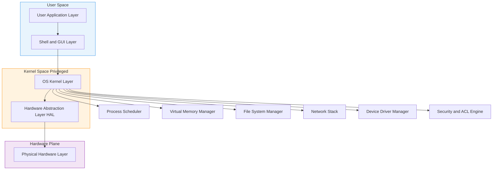
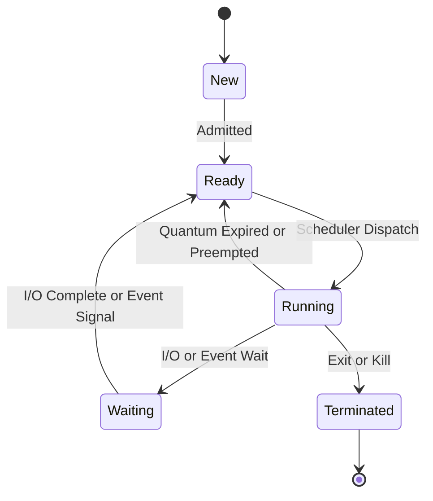
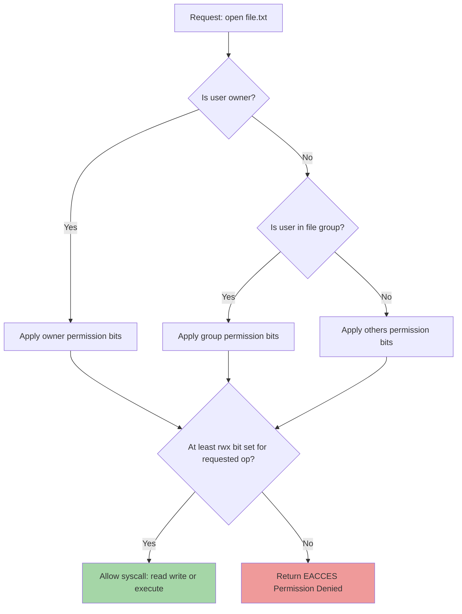
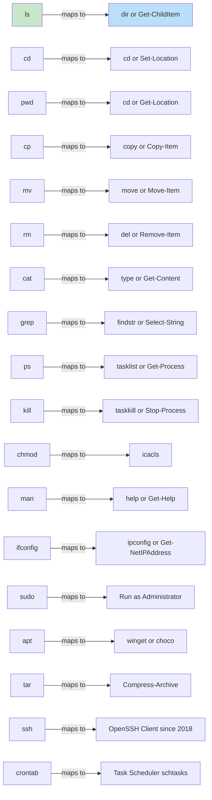

# Platform Control: System Software and Operating Systems, terminal commands in Linux and Windows

<!-- SECTION_1_START -->
# Platform Control: System Software and Operating Systems

## 1.1 Formal Academic Definition

> [!IMPORTANT]
> **System Software** is a category of computer programs designed to operate, control, and extend the processing capabilities of the computer itself. It manages hardware resources, provides runtime services, and acts as an intermediary between the user/application software and the underlying hardware. The two principal sub-categories are **Operating Systems (OS)** and **System Utilities (Firmware, Device Drivers, Language Translators)**.

An **Operating System (OS)** is a collection of system software that manages computer hardware, software resources, and provides common services for computer programs. It is the single most critical piece of system software — without it, every application would have to manage its own hardware interaction.

The KTU 2024 Scheme (Course Code **GXEST203**) frames this topic under **CO1: Understand the fundamental architecture of modern computing systems and the role of system software in platform abstraction**.

### 1.2 Conceptual Analogy: The OS as a Building Manager

Imagine a massive office complex (the **computer hardware**):

| Hardware Component | Building Analogy | OS Sub-system |
|---|---|---|
| CPU (Processor) | Workers / Machines | Process Scheduler |
| RAM (Memory) | Desks and lockers | Memory Manager |
| Hard Disk / SSD | Storage rooms / Archives | File System |
| Network Card | Telephone exchange | Network Stack |
| Keyboard / Mouse | Reception desk | I/O Subsystem |
| Printer | Mailroom | Spooling System |

The **Building Manager** (the **Operating System Kernel**) decides:
- Who gets a desk (memory allocation)
- Which worker does what job (process scheduling)
- Where files are stored (file system management)
- Who can enter the building (user authentication)

> [!NOTE]
> The standard metric used in OS literature: A typical general-purpose OS executes a **system call** in approximately **1–10 microseconds** ($1 \mu s = 10^{-6} s$), while a user-application function call takes **~0.1–1 microseconds**.

### 1.3 Categories of System Software

System software forms the foundational software stack. Below is the layered hierarchy:

> [!TIP]
> **Layering Principle:** Higher layers request services from lower layers. The OS sits between the hardware (Layer 0) and applications (Layer 3).

1. **Firmware / BIOS / UEFI** – Low-level software embedded in hardware (e.g., motherboard BIOS chip, router firmware).
2. **Boot Loaders** – Programs like GRUB (Linux) or Windows Boot Manager that load the OS kernel into RAM.
3. **Operating System Kernel** – The core (e.g., Linux kernel `v6.x`, Windows NT kernel, macOS XNU).
4. **System Utilities** – Disk formatters, antivirus, backup tools, file managers.
5. **Device Drivers** – Translate OS-generic commands into device-specific instructions.
6. **Language Translators** – Compilers (`gcc`), Interpreters (`python3`), Assemblers (`nasm`).
7. **Windowing Systems / Shells** – GUI (GNOME, Explorer) and CLI (bash, PowerShell, cmd).

### 1.4 The Two Families of Operating Systems

| Family | Kernel Type | Representative OSes | Default Shell |
|---|---|---|---|
| **Unix-like (POSIX compliant)** | Monolithic / Hybrid | Linux (Ubuntu, Fedora, Debian), macOS, FreeBSD | `bash`, `zsh` |
| **Windows NT family** | Hybrid (Microkernel design) | Windows 10, 11, Server 2022 | `cmd.exe`, `PowerShell` |

> [!VISUALIZATION CONTROL]
> **Concept:** Layered software stack from silicon to user.
> **GeoGebra / Desmos Input Equations:** A vertical bar-chart where height $h_i$ represents privilege level. Hardware = $h_0$, Kernel = $h_1$, Shell = $h_2$, User Apps = $h_3$.
> **Visual Description:** Plot four points $(0, 0)$, $(0, 1)$, $(0, 2)$, $(0, 3)$ with labels `Hardware`, `Kernel`, `Shell`, `User Apps` respectively. The user is at the top of the pyramid.

<!-- SECTION_1_END -->

<!-- SECTION_2_START -->
# 2. Deep Theoretical Analysis & KTU High-Yield Reference Sheet

## 2.1 Core Functions of an Operating System

The OS is responsible for **5 core management tasks** plus one service function. Each is mapped to a real engineering utility.

| # | OS Function | Engineering Purpose | Real-World Example |
|---|---|---|---|
| 1 | **Process Management** | Multitasking / Context switching | Running browser + IDE simultaneously |
| 2 | **Memory Management** | Virtual memory, paging, swapping | Running apps larger than physical RAM |
| 3 | **File System Management** | Hierarchical storage, permissions | `NTFS`, `ext4`, `APFS` partitions |
| 4 | **Device Management** | Driver abstraction, I/O scheduling | Plug-and-play USB device recognition |
| 5 | **Security & Access Control** | User accounts, ACLs, encryption | Login password, file permissions |
| 6 | **Shell / User Interface** | CLI or GUI command interpreter | `bash`, PowerShell, Windows Explorer |

## 2.2 Process States and the State Transition Diagram

A process can exist in any of these states:

$$\text{New} \rightarrow \text{Ready} \rightarrow \text{Running} \rightarrow \text{Waiting} \rightarrow \text{Terminated}$$

The **Process Control Block (PCB)** is the kernel's data structure for each process and stores:
- **PID** (Process ID, e.g., 1024)
- **Program Counter** (next instruction address)
- **Register State** (CPU register values)
- **Memory Pointers** (page tables, segment info)
- **I/O Status** (open file descriptors)
- **CPU Scheduling Info** (priority, quantum)

## 2.3 File System Path Syntax — Linux vs Windows

The path delimiter is the most visible difference between the two platforms.

**Linux / Unix:**
- Root directory: `/`
- Path example: `/home/student/projects/main.c`
- Case sensitive: `Main.c` and `main.c` are different
- Drives are mounted as folders under `/mnt` or `/media`

**Windows:**
- Root per drive: `C:\`, `D:\`
- Path example: `C:\Users\Student\Projects\main.c`
- Case insensitive: `Main.c` and `main.c` are the same
- Drives are independent roots, e.g., `D:\`

> [!IMPORTANT]
> **Drive Mounting Equation:** A Linux system presents every storage device as a directory under the single root `/`. A Windows system presents each drive as a separate root `X:\`. The mathematical abstraction is that Linux uses a **single-rooted Directed Acyclic Graph (DAG)**, while Windows uses a **forest of rooted trees**.

## 2.4 KTU High-Yield Cheat Sheet — Essential Terminal Commands

| # | Operation | Linux / macOS | Windows (cmd) | Windows (PowerShell) |
|---|---|---|---|---|
| 1 | List files | `ls -la` | `dir` | `Get-ChildItem` (alias: `ls`, `gci`) |
| 2 | Change directory | `cd /path` | `cd /d C:\path` | `Set-Location` (alias: `cd`, `sl`) |
| 3 | Print working dir | `pwd` | `cd` (no args) | `Get-Location` (alias: `pwd`, `gl`) |
| 4 | Create directory | `mkdir mydir` | `mkdir mydir` | `New-Item -ItemType Directory` |
| 5 | Remove file | `rm file.txt` | `del file.txt` | `Remove-Item file.txt` |
| 6 | Remove directory | `rm -rf mydir` | `rmdir /s /q mydir` | `Remove-Item -Recurse -Force` |
| 7 | Copy file | `cp a.txt b.txt` | `copy a.txt b.txt` | `Copy-Item a.txt b.txt` |
| 8 | Move / Rename | `mv a.txt b.txt` | `move a.txt b.txt` | `Move-Item a.txt b.txt` |
| 9 | View file content | `cat file.txt` | `type file.txt` | `Get-Content file.txt` (alias: `cat`, `gc`) |
| 10 | Find in files | `grep "text" *.txt` | `findstr "text" *.txt` | `Select-String -Pattern "text"` |
| 11 | Process list | `ps aux` | `tasklist` | `Get-Process` (alias: `ps`) |
| 12 | Kill process | `kill 1234` | `taskkill /PID 1234` | `Stop-Process -Id 1234` |
| 13 | System info | `uname -a` | `systeminfo` | `Get-ComputerInfo` |
| 14 | Network config | `ifconfig` / `ip addr` | `ipconfig` | `Get-NetIPAddress` |
| 15 | Ping host | `ping google.com` | `ping google.com` | `Test-Connection google.com` |
| 16 | File permissions | `chmod 755 script.sh` | `icacls file.txt /grant User:R` | `icacls file.txt /grant User:R` |
| 17 | Disk usage | `df -h` | `wmic logicaldisk get size,freespace` | `Get-Volume` |
| 18 | Clear screen | `clear` | `cls` | `Clear-Host` (alias: `cls`, `clear`) |
| 19 | Manual / Help | `man ls` | `help dir` or `dir /?` | `Get-Help Get-Process` |
| 20 | Shutdown | `sudo shutdown -h now` | `shutdown /s /t 0` | `Stop-Computer` |

> [!NOTE]
> **Why these matter for KTU:** The exam regularly tests cross-platform command mapping. Memorize the relationships in the table above — they form the backbone of 3-mark and 14-mark questions.

## 2.5 User and Permission Model

### Linux Permission Triplet
Every file in Linux has three sets of permission bits for **Owner (u)**, **Group (g)**, and **Others (o)**, each having **Read ($r=4$)**, **Write ($w=2$)**, **Execute ($x=1$)** rights.

$$\text{Permission Number} = u \times 100 + g \times 10 + o \times 1$$

Where each $u, g, o \in \{0, 1, \ldots, 7\}$ and the value is computed as:

$$u = r \cdot 4 + w \cdot 2 + x \cdot 1$$

**Example:** `chmod 754 file.sh` translates to:
- Owner: $rwx = 4+2+1 = 7$
- Group: $r-x = 4+0+1 = 5$
- Others: $r-- = 4+0+0 = 4$

### Windows ACL Model
Windows uses **Access Control Lists (ACLs)** with `icacls` for management. The model is **discretionary** and based on **SID (Security Identifier)** rather than numeric triplets.

## 2.6 Real-World Engineering Utility

| Engineering Domain | OS / Shell Usage |
|---|---|
| **Web Servers** | Linux + bash dominates 96%+ of public web servers (Apache, Nginx) |
| **Cloud & DevOps** | Linux + bash + PowerShell Core (cross-platform) on AWS, Azure, GCP |
| **Embedded Systems** | Yocto Linux, FreeRTOS on microcontrollers |
| **Cybersecurity** | Kali Linux (bash), Windows PowerShell for offensive scripting |
| **Data Science** | Linux + Jupyter + Python venv management |
| **Enterprise IT** | Windows Server + Active Directory + PowerShell automation |

> [!TIP]
> **Industry Trend:** The **2024 Stack Overflow Developer Survey** reports that approximately **$\sim 55\%$** of professional developers prefer Linux for development, but **$\sim 75\%$** of enterprise desktops still run Windows. Dual-boot and **WSL (Windows Subsystem for Linux)** bridge the gap.

<!-- SECTION_2_END -->

<!-- SECTION_3_START -->
# 3. Step-by-Step Implementations & Code Walkthroughs

## 3.1 Linux File System Hierarchy (FHS — Filesystem Hierarchy Standard)

The Linux directory layout is standardized. Below is the canonical tree:

```
/
├── bin/        # Essential user binaries (ls, cp, mv)
├── sbin/       # System binaries (fdisk, ifconfig, reboot)
├── etc/        # Configuration files (system-wide)
├── home/       # User home directories
│   └── student/
│       ├── Documents/
│       ├── Downloads/
│       └── .bashrc       # Hidden file (dotfile)
├── root/       # Root user's home (not /home/root)
├── var/        # Variable data (logs, mail, spool)
├── tmp/        # Temporary files (cleared on reboot)
├── usr/        # User System Resources (apps, libraries)
│   ├── local/
│   └── share/
├── opt/        # Optional / third-party software
├── dev/        # Device files (sda, tty, null)
├── proc/       # Virtual filesystem for processes
├── mnt/        # Mount point for temporary filesystems
└── media/      # Removable media mount point
```

## 3.2 Worked Example 1: Linux File Permission Calculation

**Problem:** A file `report.pdf` has the symbolic permission `-rwxr-x---`. Compute the numeric octal value.

**Step 1: Identify permission classes**

| Class | Permission String | Numeric | Reasoning |
|---|---|---|---|
| Owner (u) | `rwx` | $4+2+1 = 7$ | Read + Write + Execute |
| Group (g) | `r-x` | $4+0+1 = 5$ | Read + Execute (no Write) |
| Others (o) | `---` | $0+0+0 = 0$ | No permissions |

**Step 2: Concatenate the octal digits**

$$\text{chmod} \; 750 \; \text{report.pdf}$$

**Step 3: Verify by inverse**

$$7 = 111_2 \rightarrow rwx, \quad 5 = 101_2 \rightarrow r\text{-}x, \quad 0 = 000_2 \rightarrow \text{---}$$

This matches the original symbolic string `-rwxr-x---`. **Verification complete.**

## 3.3 Worked Example 2: Process Scheduling Simulation

Consider 3 processes arriving at time $t=0$ with burst times $P_1=8$, $P_2=4$, $P_3=2$ ms.

**FCFS (First-Come, First-Served):**

$$T_{\text{wait}}(P_1) = 0, \quad T_{\text{wait}}(P_2) = 8, \quad T_{\text{wait}}(P_3) = 12$$

$$T_{\text{avg wait}} = \frac{0 + 8 + 12}{3} = \frac{20}{3} \approx 6.67 \; \text{ms}$$

**SJF (Shortest Job First):**

Order: $P_3 (2), P_2 (4), P_1 (8)$

$$T_{\text{wait}}(P_3) = 0, \quad T_{\text{wait}}(P_2) = 2, \quad T_{\text{wait}}(P_1) = 6$$

$$T_{\text{avg wait}} = \frac{0 + 2 + 6}{3} = \frac{8}{3} \approx 2.67 \; \text{ms}$$

**SJF improvement factor:**

$$\frac{6.67}{2.67} = 2.5 \times \text{ faster average wait time}$$

## 3.4 Worked Example 3: Writing a Bash Backup Script

The following script creates a timestamped backup of a `Documents` folder:

```bash
#!/bin/bash
# backup.sh — Daily backup script for the Documents directory

# Enable strict error handling
set -euo pipefail

# Define source and destination
SOURCE_DIR="$HOME/Documents"
BACKUP_ROOT="$HOME/backups"
TIMESTAMP="$(date +%Y%m%d_%H%M%S)"
DEST_DIR="${BACKUP_ROOT}/backup_${TIMESTAMP}"

# Validate source directory exists
if [ ! -d "${SOURCE_DIR}" ]; then
    echo "ERROR: Source directory ${SOURCE_DIR} does not exist." >&2
    exit 1
fi

# Create the destination directory
mkdir -p "${DEST_DIR}"

# Perform the copy preserving attributes
cp -a "${SOURCE_DIR}/." "${DEST_DIR}/"

# Compress the backup into a tarball
tar -czf "${DEST_DIR}.tar.gz" -C "${BACKUP_ROOT}" "$(basename "${DEST_DIR}")"

# Remove the intermediate uncompressed folder
rm -rf "${DEST_DIR}"

# Print success message
echo "Backup successful: ${DEST_DIR}.tar.gz"
exit 0
```

**Line-by-line explanation:**

| Line | Code | Purpose |
|---|---|---|
| 1 | `#!/bin/bash` | **Shebang** — tells the kernel to use `/bin/bash` interpreter |
| 3 | `set -euo pipefail` | `-e` exit on error, `-u` error on undefined var, `-o pipefail` catch pipe errors |
| 6 | `SOURCE_DIR="$HOME/..."` | Variable holding absolute path |
| 7 | `BACKUP_ROOT=...` | Output directory |
| 8 | `date +%Y%m%d_%H%M%S` | ISO-style timestamp: `20240115_143052` |
| 11–14 | `if [ ! -d ... ]` | Defensive check — never assume input exists |
| 17 | `mkdir -p` | Create directory tree, no error if it exists |
| 20 | `cp -a` | Archive mode: preserves permissions, timestamps, symlinks |
| 23 | `tar -czf` | `c`=create, `z`=gzip, `f`=filename |
| 26 | `rm -rf` | **r**ecursive **f**orce remove (dangerous — always quote paths) |
| 30 | `exit 0` | Explicit success exit code |

## 3.5 Worked Example 4: Windows PowerShell Equivalent

The same backup logic in **PowerShell** (Windows-native, object-oriented):

```powershell
# backup.ps1 — PowerShell equivalent of backup.sh

# Enable strict mode
Set-StrictMode -Version Latest
$ErrorActionPreference = "Stop"

# Define paths
$SourceDir = Join-Path $env:USERPROFILE "Documents"
$BackupRoot = Join-Path $env:USERPROFILE "backups"
$Timestamp = Get-Date -Format "yyyyMMdd_HHmmss"
$DestDir = Join-Path $BackupRoot "backup_$Timestamp"

# Validate source
if (-not (Test-Path -Path $SourceDir -PathType Container)) {
    Write-Error "Source directory $SourceDir does not exist."
    exit 1
}

# Create backup folder and copy with attributes preserved
New-Item -ItemType Directory -Path $DestDir -Force | Out-Null
Copy-Item -Path "$SourceDir\*" -Destination $DestDir -Recurse -Force

# Compress into zip archive
Compress-Archive -Path $DestDir -DestinationPath "$DestDir.zip"

# Remove the uncompressed folder
Remove-Item -Path $DestDir -Recurse -Force

Write-Output "Backup successful: $DestDir.zip"
exit 0
```

**Run command:**

```powershell
powershell -ExecutionPolicy Bypass -File .\backup.ps1
```

## 3.6 Worked Example 5: Cross-Platform Networking Commands

Suppose a KTU lab PC cannot reach `ktu.edu.in`. Perform systematic diagnosis:

**Linux diagnostics sequence:**

```bash
# Step 1: Verify local network interface is up
ip addr show eth0

# Step 2: Confirm default gateway is reachable
ping -c 4 192.168.1.1

# Step 3: Test DNS resolution
nslookup ktu.edu.in
# or modern:
resolvectl query ktu.edu.in

# Step 4: Test external connectivity by IP
ping -c 4 142.250.193.78

# Step 5: Trace the path
traceroute ktu.edu.in

# Step 6: Inspect open ports
ss -tuln
```

**Windows diagnostics sequence:**

```cmd
:: Step 1: Show all adapters
ipconfig /all

:: Step 2: Ping gateway
ping 192.168.1.1

:: Step 3: DNS flush and query
ipconfig /flushdns
nslookup ktu.edu.in

:: Step 4: Ping by IP
ping 142.250.193.78

:: Step 5: Trace
tracert ktu.edu.in

:: Step 6: Open port inspection
netstat -an
```

> [!TIP]
> **PowerShell modern equivalent:** `Test-NetConnection ktu.edu.in -Port 443` performs a one-shot TCP-port check combining several of the above steps.

<!-- SECTION_3_END -->

<!-- SECTION_4_START -->
# 4. Structural Diagrams & Schematics

## 4.1 Mermaid Diagram: Operating System Architecture



## 4.2 Mermaid Diagram: Process State Machine



## 4.3 Mermaid Diagram: Boot Sequence (Linux vs Windows)

```mermaid
flowchart LR
    powerOn[Power ON] --> bios[BIOS or UEFI Firmware]
    bios --> post[POST Self Test]
    post --> bootDevice[Identify Boot Device]
    bootDevice --> linuxBoot{OS Type}
    bootDevice --> winBoot{OS Type}

    linuxBoot --> grub[GRUB Boot Loader]
    grub --> linuxKernel[Load Linux Kernel vmlinuz]
    linuxKernel --> initrd[Load initrd or initramfs]
    initrd --> systemd[systemd or init Starts]
    systemd --> login[Login Prompt getty]
    login --> userShell[User Shell bash]

    winBoot --> winBootMgr[Windows Boot Manager]
    winBootMgr --> winLoader[winload.exe]
    winLoader --> ntoskrnl[Load ntoskrnl.exe NT Kernel]
    ntoskrnl --> csrss[Start csrss.exe Session Manager]
    csrss --> services[Start Service Control Manager]
    services --> explorer[Start explorer.exe Desktop]
    explorer --> userShell2[User Session]

    style powerOn fill:#FFCDD2
    style linuxKernel fill:#C8E6C9
    style ntoskrnl fill:#BBDEFB
```



## 4.4 Mermaid Diagram: File Permission Decision Flow



## 4.5 Mermaid Diagram: Linux vs Windows Command Mapping



<!-- SECTION_4_END -->

<!-- SECTION_5_START -->
# 5. KTU 2024 Scheme Examination Question Bank

## 5.1 Part A — Short Answer Questions (3 Marks Each)

### Question 1 `[KTU University Exam – Dec 2023]`
**Define the term Operating System. List any four major functions of an OS.** (CO1, Remember/Understand)

**Model Answer:**

> [!NOTE]
> **Definition (2 Marks):** An Operating System is a set of system programs that acts as an interface between the user and the computer hardware. It manages hardware resources, provides essential services, and creates an environment for application programs to execute.

**Four major functions (1 Mark):**
1. Process Management – creation, scheduling, and termination of processes.
2. Memory Management – allocation and de-allocation of RAM via virtual memory.
3. File System Management – organization, storage, and retrieval of data.
4. Device Management – communication with hardware via device drivers.

### Question 2 `[KTU University Exam – July 2024]`
**Differentiate between system software and application software with two examples each.** (CO1, Understand)

**Model Answer:**

| Attribute | System Software | Application Software |
|---|---|---|
| Purpose | Manages hardware and provides platform for apps | Solves user-specific problems |
| User interaction | Indirect (transparent) | Direct (user-driven) |
| Examples | Operating System (Ubuntu, Windows 11), Compiler (gcc) | MS Word, VLC Media Player |
| Dependency | Required to run application software | Depends on system software to run |
| Privilege level | Runs in kernel / privileged mode | Runs in user mode |

## 5.2 Part B — Long Answer Questions (14 Marks Each)

### Question A `[KTU University Exam – Dec 2023]`

**(a)** Explain the major functions of an Operating System in detail. Describe the role of the kernel and the difference between monolithic and microkernel architectures. **(7 Marks)** (CO1, Understand)

**(b)** A system has four processes $P_1, P_2, P_3, P_4$ with arrival times and burst times as given. Compute the average waiting time using **FCFS** and **SJF** scheduling algorithms. Show all Gantt charts. **(7 Marks)** (CO2, Apply)

| Process | Arrival Time (ms) | Burst Time (ms) |
|---|---|---|
| $P_1$ | 0 | 8 |
| $P_2$ | 1 | 4 |
| $P_3$ | 2 | 2 |
| $P_4$ | 3 | 1 |

**Model Solution (a):**

> **Major OS functions (3 Marks):**
> 1. **Process Management:** The OS creates, schedules, and terminates processes. It maintains the Process Control Block (PCB) for each.
> 2. **Memory Management:** Allocates RAM to processes using techniques like paging, segmentation, and virtual memory. It ensures protection so that one process cannot read another's memory.
> 3. **File System Management:** Organizes data on storage devices into files and directories. Implements permissions, quotas, and recovery.
> 4. **Device Management:** Provides a uniform interface to hardware through device drivers.
> 5. **Security & Protection:** Enforces access control lists (ACLs) and user authentication.

> **Kernel role (2 Marks):** The kernel is the central, privileged component of the OS. It executes in **kernel mode** with full hardware access. It handles system calls, interrupts, and resource scheduling. All other OS components depend on it.

> **Monolithic vs Microkernel (2 Marks):**
>
> | Aspect | Monolithic Kernel | Microkernel |
> |---|---|---|
> | Design | All services (FS, network, drivers) in kernel space | Only IPC, scheduling, basic drivers in kernel; rest in user space |
> | Performance | Faster (no context switches for service calls) | Slower (more IPC overhead) |
> | Reliability | A bug can crash entire system | Services can be restarted independently |
> | Examples | Linux, FreeBSD | QNX, Minix, early Mach |
> | Size | Large (millions of lines) | Small (thousands of lines) |

**Model Solution (b):**

**FCFS (First-Come, First-Served):**

| Process | Arrival | Burst | Start | Completion | Waiting | Turnaround |
|---|---|---|---|---|---|---|
| $P_1$ | 0 | 8 | 0 | 8 | 0 | 8 |
| $P_2$ | 1 | 4 | 8 | 12 | 7 | 11 |
| $P_3$ | 2 | 2 | 12 | 14 | 10 | 12 |
| $P_4$ | 3 | 1 | 14 | 15 | 11 | 12 |

> Gantt Chart: `| P1 (0-8) | P2 (8-12) | P3 (12-14) | P4 (14-15) |`

$$T_{\text{avg wait}}^{\text{FCFS}} = \frac{0 + 7 + 10 + 11}{4} = \frac{28}{4} = 7.0 \; \text{ms}$$

**SJF (Shortest Job First, non-preemptive):**

At $t=0$, only $P_1$ is available → run $P_1$ (0–8). Then at $t=8$, $P_2, P_3, P_4$ all available. Pick shortest: $P_4$ (1 ms) → 8–9. Then $P_3$ (2 ms) → 9–11. Then $P_2$ (4 ms) → 11–15.

| Process | Arrival | Burst | Start | Completion | Waiting | Turnaround |
|---|---|---|---|---|---|---|
| $P_1$ | 0 | 8 | 0 | 8 | 0 | 8 |
| $P_4$ | 3 | 1 | 8 | 9 | 5 | 6 |
| $P_3$ | 2 | 2 | 9 | 11 | 7 | 9 |
| $P_2$ | 1 | 4 | 11 | 15 | 10 | 14 |

> Gantt Chart: `| P1 (0-8) | P4 (8-9) | P3 (9-11) | P2 (11-15) |`

$$T_{\text{avg wait}}^{\text{SJF}} = \frac{0 + 10 + 7 + 5}{4} = \frac{22}{4} = 5.5 \; \text{ms}$$

> **Valuation key:**
> - [Stating FCFS Gantt chart and waiting time computation: 3 Marks]
> - [Final FCFS average: 0.5 Mark]
> - [Stating SJF Gantt chart and waiting time computation: 3 Marks]
> - [Final SJF average: 0.5 Mark]

### Question B `[KTU University Exam – July 2024]`

**(a)** Compare Linux and Windows operating systems across at least six parameters. Explain the Linux file permission model with a suitable example. **(7 Marks)** (CO1, Understand)

**(b)** Write a **bash script** that accepts a directory path as an argument and counts (i) the total number of files, (ii) the number of `.c` files, and (iii) the number of subdirectories in that path. Provide the script and a sample run. **(7 Marks)** (CO2, Apply)

**Model Solution (a):**

| Parameter | Linux | Windows |
|---|---|---|
| Kernel | Monolithic (Linux kernel) | Hybrid NT kernel |
| File system | ext4, XFS, Btrfs, ZFS | NTFS, FAT32, ReFS |
| Path separator | Forward slash `/` | Backslash `\` |
| Case sensitivity | Case sensitive | Case insensitive |
| User model | UID-based, root superuser | SID-based, Administrator |
| Default shell | bash, zsh | cmd, PowerShell |
| Package manager | apt, yum, dnf, pacman | winget, choco, MSI |
| Source availability | Open source | Closed source (with WSL) |
| Update mechanism | Centralized package repos | Windows Update |
| Hardware support | Broad via community | Vendor-certified |

**Linux file permission model (3 Marks):**

Every file has three permission triplets — **Owner**, **Group**, **Others** — each holding **Read (r=4)**, **Write (w=2)**, **Execute (x=1)** bits.

**Example:** `chmod 750 deploy.sh`

| Class | Octal | Binary | Permissions |
|---|---|---|---|
| Owner | 7 | 111 | rwx |
| Group | 5 | 101 | r-x |
| Others | 0 | 000 | --- |

The owner can read, write, and execute. The group can read and execute. Others have no access.

**Model Solution (b):**

```bash
#!/bin/bash
# count_files.sh — Count files, .c files, and subdirectories in a given path

set -euo pipefail

# Accept directory from $1 or prompt
TARGET_DIR="${1:-}"

if [ -z "${TARGET_DIR}" ]; then
    echo "Usage: $0 <directory_path>"
    exit 1
fi

if [ ! -d "${TARGET_DIR}" ]; then
    echo "Error: ${TARGET_DIR} is not a valid directory." >&2
    exit 1
fi

# (i) Total number of regular files
TOTAL_FILES=$(find "${TARGET_DIR}" -maxdepth 1 -type f | wc -l)

# (ii) Number of .c files (recursively)
C_FILES=$(find "${TARGET_DIR}" -type f -name "*.c" | wc -l)

# (iii) Number of subdirectories (excluding . and ..)
SUBDIRS=$(find "${TARGET_DIR}" -maxdepth 1 -mindepth 1 -type d | wc -l)

# Output results
echo "Statistics for directory: ${TARGET_DIR}"
echo "----------------------------------------"
echo "(i)   Total regular files      : ${TOTAL_FILES}"
echo "(ii)  Number of .c source files : ${C_FILES}"
echo "(iii) Number of subdirectories  : ${SUBDIRS}"
exit 0
```

**Sample run:**

```bash
$ chmod +x count_files.sh
$ ./count_files.sh /home/student/projects
Statistics for directory: /home/student/projects
----------------------------------------
(i)   Total regular files      : 12
(ii)  Number of .c source files : 5
(iii) Number of subdirectories  : 3
```

> **Valuation key:**
> - [Valid input check: 1 Mark]
> - [find command for total files: 1.5 Marks]
> - [find command for .c files: 1.5 Marks]
> - [find command for subdirectories: 1.5 Marks]
> - [Output formatting and exit code: 1.5 Marks]

> [!WARNING]
> **KTU Examiner's Valuation Pitfalls — Common Mark Losers:**
> 1. **Pipe inside `wc -l`:** Students often forget that `find ... | wc -l` is needed; counting with a loop loses 1–2 marks.
> 2. **`-maxdepth 1` vs recursive:** The question asks for subdirectories, not nested. Forgetting `-maxdepth` causes over-counting and loses 1 mark.
> 3. **No shebang line:** Omitting `#!/bin/bash` is considered poor practice and may lose 0.5–1 mark.
> 4. **No defensive checks:** Skipping `[ ! -d "$TARGET_DIR" ]` loses 1 mark for missing error handling.
> 5. **Windows backslash in path:** Writing `chmod 750 deploy.sh` in the context of Windows command (where `chmod` does not exist in `cmd.exe`) — examiners deduct marks if the platform context is inconsistent.

## 5.3 Topic Recap & Important Things to Remember

> [!TIP]
> **Rapid-revision checklist — memorize before every KTU exam:**

- [x] **System software** = OS + utilities + drivers + translators. **Application software** = user-facing programs.
- [x] The **OS is the most critical system software**; it manages **process, memory, file, device, security**.
- [x] **Kernel** runs in **kernel/privileged mode (Ring 0)**; applications run in **user mode (Ring 3)**.
- [x] **Monolithic kernel** = everything in one address space (Linux). **Microkernel** = minimal in kernel, rest in user space (QNX).
- [x] **Linux paths** use `/`, are **case-sensitive**, and have a single root. **Windows paths** use `\`, are **case-insensitive**, and have multiple roots (`C:\`, `D:\`).
- [x] **Linux file permissions** are three triplets: **u (owner), g (group), o (others)**, each with **r=4, w=2, x=1**. Numeric value = $4r + 2w + 1x$.
- [x] **Process states**: `New → Ready → Running → Waiting → Terminated`. The **PCB** stores process metadata.
- [x] **FCFS** is simple but has high average wait time. **SJF** is optimal (minimizes average wait) but requires knowing burst times.
- [x] Essential Linux commands: `ls, cd, pwd, mkdir, rm, cp, mv, cat, grep, ps, kill, chmod, chown, ifconfig/ip, df, du, find, tar, sudo, apt`.
- [x] Essential Windows commands (cmd): `dir, cd, copy, move, del, type, findstr, tasklist, taskkill, ipconfig, ping, systeminfo, cls`.
- [x] Essential PowerShell cmdlets: `Get-ChildItem, Set-Location, Get-Location, Copy-Item, Move-Item, Remove-Item, Get-Content, Select-String, Get-Process, Stop-Process, Get-Help`.
- [x] **Default shells**: Linux → `bash`; Windows → `cmd.exe` and now `PowerShell` (default since Windows 10).
- [x] **Package managers**: Linux → `apt` (Debian/Ubuntu), `dnf` (Fedora); Windows → `winget`, `chocolatey`.
- [x] **WSL (Windows Subsystem for Linux)** allows running a real Linux user-space inside Windows — bridges both platforms.
- [x] Bash scripts use `#!/bin/bash` shebang. PowerShell scripts use `.ps1` extension and `Set-ExecutionPolicy`.
- [x] `set -euo pipefail` is a best-practice defensive trio for bash scripts.
- [x] Networking diagnostics: `ping` (connectivity), `traceroute/tracert` (path), `nslookup` (DNS), `ipconfig/ifconfig` (interfaces).
- [x] **Exit codes:** `0` = success, non-zero = error. Check with `echo $?` (Linux) or `$LASTEXITCODE` (PowerShell).
- [x] KTU exam pattern: Part A = 3 marks × ~6 questions; Part B = 14 marks × ~2 questions with internal choice. Always show **Gantt charts** for scheduling problems and **step-by-step** for any calculation.

<!-- SECTION_5_END -->
