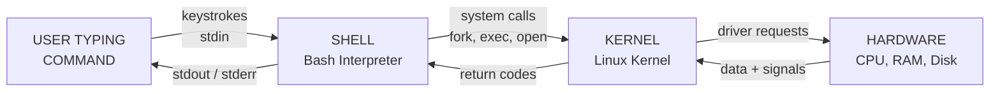
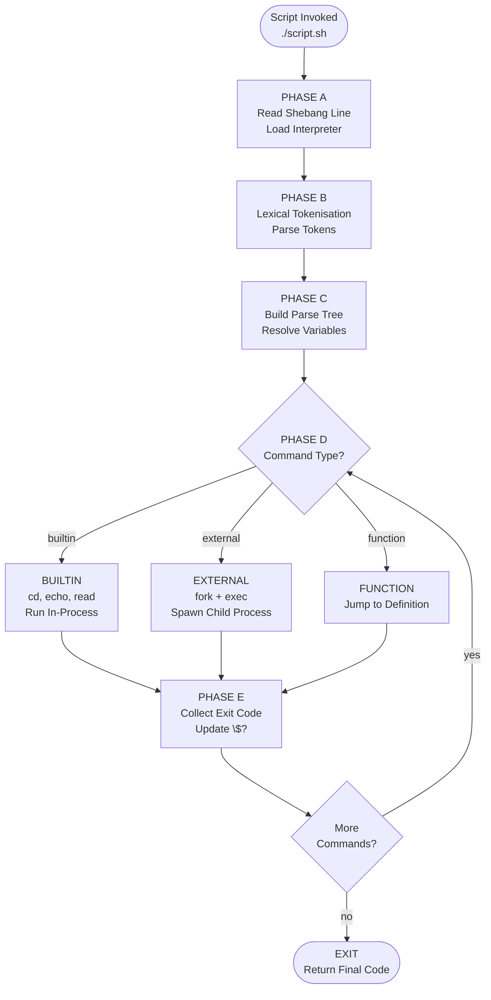
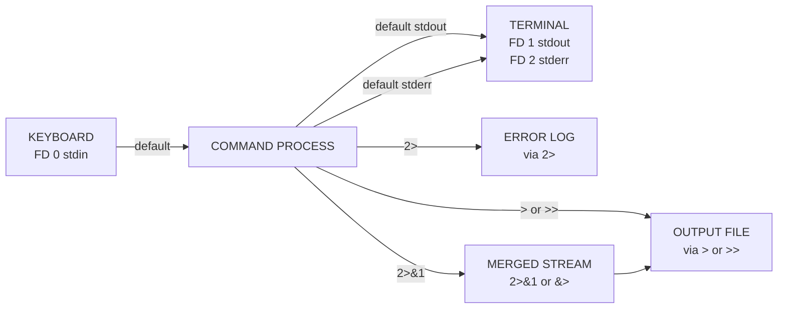
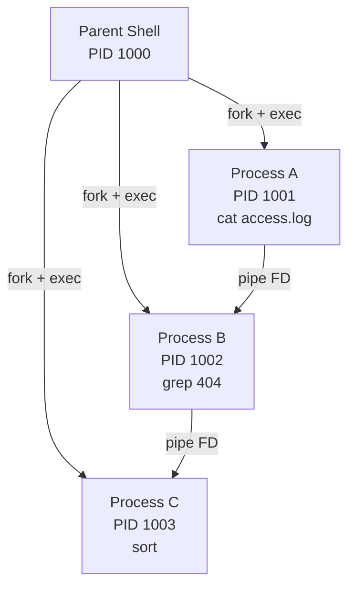

# Scripting: Basic shell scripting pipelines via Bash

<!-- SECTION_1_START -->
# Module 3 — Scripting: Basic Shell Scripting Pipelines via Bash

## 1.1 Formal Definition (KTU 2024 Syllabus Terminology)

A **shell** is a command-line interpreter that exposes the operating system's services to the user. **Bash** (acronym for *Bourne Again SHell*) is the GNU Project's default POSIX-compliant shell, born as a free software replacement for the original Bourne shell (`sh`) written by Stephen Bourne. A **shell script** is an executable plain-text file containing a sequenced list of commands, control structures, and variable assignments that the shell interprets line-by-line at runtime.

A **pipeline** is a chain of one or more commands separated by the pipe operator `$|$`, in which the standard output (`stdout`) of each command is fed directly into the standard input (`stdin`) of the next. This is the foundational abstraction of the UNIX philosophy: *small programs that do one thing well, combined to do complex things*.

> [!IMPORTANT]
> **KTU 2024 — Syllabus Highlight**
> Under the GXEST203 (Foundations of Computing) syllabus, the student must be able to **(i) author a basic bash script** with variables, conditionals, and loops, and **(ii) compose command pipelines** to perform multi-stage text processing. Mastery of the `shebang`, `$?` exit codes, and the three standard streams (`stdin`, `stdout`, `stderr`) is non-negotiable for the End Semester Evaluation (ESE).

## 1.2 Conceptual Analogy — The Restaurant Kitchen

Imagine a busy restaurant kitchen:

* **You (the customer)** place a verbal order.
* **The head waiter (the shell)** takes your order. The waiter cannot cook — that is not their job.
* **The chef (the kernel)** is the only one who actually touches the stove, the oven, and the pantry (hardware).
* **The kitchen pass (the pipeline $\vert$)** is the stainless-steel counter where one cook plates, the next garnishes, and the third inspects. Each cook receives the dish from the previous one and adds their specialty before passing it on.

Just as you do not walk into the kitchen and shout at the stove, you do not directly talk to the kernel. You talk to the shell, which translates. And just as a dish moves from station to station on the kitchen pass, data moves from command to command along a pipeline.

## 1.3 Standard Metrics and Reserved Tokens

| Token | Meaning | Default Stream |
| :--- | :--- | :--- |
| **`$0`** | Name of the currently executing script | — |
| **`$1` ... `$9`** | Positional command-line arguments | — |
| **`$?`** | Exit status of the last command (**0** = success, **1–255** = error) | — |
| **`$#`** | Number of positional arguments supplied | — |
| **`$$`** | Process ID (PID) of the current shell | — |
| **`stdin`** | Standard input | File Descriptor **0** |
| **`stdout`** | Standard output | File Descriptor **1** |
| **`stderr`** | Standard error | File Descriptor **2** |

> [!NOTE]
> **Why does this matter for KTU?**
> The exit code `$?$` is one of the highest-frequency one-mark questions in Part A. A *successful* command in Linux *always* returns **0**. A *failure* returns a non-zero code, and the specific value is the programmer's choice (commonly `1` for generic error, `127` for command-not-found, `130` for SIGINT/Ctrl-C).

## 1.4 GeoGebra / Desmos Visualisation — Pipelines as Function Composition

A pipeline is mathematically a function composition. If $f(x)$, $g(x)$, and $h(x)$ are three commands, then the pipeline `$f \vert g \vert h$` computes $h(g(f(x)))$.

> [!VISUALIZATION CONTROL]
> **Concept:** Pipeline as composite function
> **GeoGebra / Desmos Input Equations:**
> * `f(x) = sin(x)`
> * `g(x) = x^2`
> * `h(x) = 2x + 1`
> * `composition(x) = h(g(f(x)))`
> **Visual Description:** Enter $x = 0.5$ in the input bar. The table view will display $f(0.5) \rightarrow g(f(0.5)) \rightarrow h(g(f(0.5)))$ — analogous to data flowing left-to-right through a bash pipeline.

<!-- SECTION_1_END -->

<!-- SECTION_2_START -->
# 2. Deep Theoretical Analysis & KTU High-Yield Formula Sheet

## 2.1 The Anatomy of a Bash Script

A bash script is a *plain text file* whose execution lifecycle is as follows:

1. **Shebang resolution** — the very first line `#!/bin/bash` instructs the kernel which interpreter to invoke. Without it, the script is executed by the user's default login shell, which may be `sh`, `zsh`, or `fish` — leading to silent syntax failures.
2. **Lexical tokenisation** — the shell scans the script and breaks it into tokens (words, operators, redirections).
3. **Parsing** — tokens are assembled into simple and compound commands.
4. **Execution** — the kernel fork-execs each command; for built-ins (like `cd`, `echo`, `read`), no new process is spawned.
5. **Exit** — the script terminates with the exit code of the last executed command, unless explicitly overridden by `exit N`.

## 2.2 The Three Pillars of a Bash Script

* **Variables** — untyped string containers. Declared without spaces around `=`. Accessed via `$varname` or `${varname}`. Environment export requires `export`.
* **Control Flow** — `if-elif-else-fi`, `for-do-done`, `while-do-done`, `case-in-esac`.
* **Quoting** — single quotes preserve literal text, double quotes allow expansion, backticks/`$()` enable command substitution.

## 2.3 Pipeline Theory — Streams and Descriptors

Linux treats *every* I/O channel as a file. The three default streams are:

$$
\begin{aligned}
\text{stdin}  &\longrightarrow \text{FD } 0 \quad \text{(keyboard by default)} \\
\text{stdout} &\longrightarrow \text{FD } 1 \quad \text{(terminal by default)} \\
\text{stderr} &\longrightarrow \text{FD } 2 \quad \text{(terminal by default)}
\end{aligned}
$$

A pipeline operator `$|$` *implicitly* wires the `stdout` of the left-hand command to the `stdin` of the right-hand command. Redirections override these defaults:

| Operator | Effect on File Descriptors |
| :--- | :--- |
| `$>$ file` | Redirect `stdout` (FD 1) to `file` (overwrite) |
| `$>>$ file` | Redirect `stdout` to `file` (append) |
| `$<$ file` | Feed `file` into `stdin` of command |
| `$2>$ file` | Redirect `stderr` (FD 2) to `file` |
| `$&\gt;$ file` | Redirect both `stdout` and `stderr` to `file` |
| `$2&\gt;&1$` | Merge `stderr` into `stdout` |

## 2.4 Why Pipelines Matter in Industry

* **DevOps & SRE** — log triage: `cat app.log \vert grep ERROR \vert awk '{print $1}' \vert sort \vert uniq -c \vert sort -rn \vert head`.
* **Data Engineering** — ETL on the command line before loading into databases.
* **Cybersecurity** — packet inspection: `tcpdump -r capture.pcap \vert grep "POST"`.
* **Web Development** — quick data scrubs: `curl -s https://api.example.com/users \vert jq '.[] \vert .email'`.

> [!IMPORTANT]
> **Engineering Utility Statement**
> A 2024 Stack Overflow developer survey shows that **~58% of professional backend developers** use shell pipelines weekly. They are the *duct tape* of system-level automation.

## 2.5 KTU Formula Sheet / Cheat Sheet

| Construct | Syntax | Purpose / Engineering Use |
| :--- | :--- | :--- |
| **Shebang** | `#!/bin/bash` | Declares interpreter; mandatory for portable scripts |
| **Variable Assignment** | `name="Bash"` | Store reusable string values |
| **Variable Access** | `${name}` or `$name` | Read stored value (braces prevent ambiguity) |
| **Command Substitution** | `$(cmd)` or `` \`cmd\` `` | Capture command output into a variable |
| **Arithmetic Expansion** | `$((a + b))` | Integer arithmetic (no floats natively) |
| **Conditional** | `if [ "$x" -eq 5 ]; then ... fi` | Branch logic; brackets require spaces |
| **For Loop** | `for i in {1..5}; do ... done` | Iterate over a sequence |
| **While Loop** | `while read line; do ... done < file` | Line-by-line file processing |
| **Function** | `foo() { echo "Hi"; }; foo` | Reusable named block |
| **Pipeline** | `cmd1 \vert cmd2 \vert cmd3` | Chain commands, thread `stdout` to `stdin` |
| **Exit Code Capture** | `cmd; echo $?` | Test success or failure of last command |
| **Test Operator** | `[[ -f file ]]` | File existence / type / permission tests |
| **Heredoc** | `cat <<EOF ... EOF` | Inline multi-line text block |
| **Background Job** | `cmd &` | Run command in background, get PID |
| **Process Substitution** | `diff <(cmd1) <(cmd2)` | Treat command output as a temporary file |

<!-- SECTION_2_END -->

<!-- SECTION_3_START -->
# 3. Step-by-Step Derivations and Code Implementation

## 3.1 Worked Example 1 — The "Hello, B.Tech!" Script

**Problem statement:** Create a script that prints a greeting, demonstrates variable expansion, and exits cleanly.

### Step-by-step Construction

**Step 1 — Create the file with the shebang.**
The very first line must be the shebang. This is a *load-bearing* line: if you omit it, the script will run in the user's current shell, which may not understand bashisms.

**Step 2 — Declare and use a variable.**
Note the **lack of spaces** around `=`. Bash treats `name = "Bash"` as an *attempt to run a command* called `name` with arguments `=` and `"Bash"`, which fails.

**Step 3 — Emit output with `echo`.**
The `-e` flag enables backslash escape interpretation (e.g., `\n` newline).

**Step 4 — Exit cleanly.**
Returning `0` is conventional for *successful* termination.

```bash
#!/bin/bash
# File: hello.sh
# Purpose: KTU Module 3 — Introduction to Bash scripting
# Author: KTU 2024 Scheme B.Tech Student

NAME="B.Tech Scholar"
DEPT="Computer Science"

echo -e "Hello, ${NAME}!\nWelcome to ${DEPT}."
echo "Script executed at: $(date)"
echo "Current user: $USER"
echo "Working directory: $(pwd)"

exit 0
```

### Running and Verifying

```bash
chmod +x hello.sh        # Grant execute permission
./hello.sh               # Run the script
echo "Exit code was: $?" # Should print 0
```

> [!NOTE]
> **Operational Note:** If you skip `chmod +x`, the OS returns *Permission denied*. The kernel enforces an *executable bit* on the file mode; without it, even a perfectly written script will not run via direct invocation.

---

## 3.2 Worked Example 2 — Conditional Logic with User Input

**Problem statement:** Write a script that prompts the user for a number and classifies it as *positive*, *negative*, or *zero*.

```bash
#!/bin/bash
# File: classify.sh
# Purpose: Demonstrate if-elif-else and read built-in

read -p "Enter an integer: " NUM

# Input validation — bash arithmetic evaluates non-numeric strings as 0
if ! [[ "$NUM" =~ ^-?[0-9]+$ ]]; then
    echo "Error: '$NUM' is not a valid integer." >&2
    exit 1
fi

if [ "$NUM" -gt 0 ]; then
    echo "${NUM} is POSITIVE."
elif [ "$NUM" -lt 0 ]; then
    echo "${NUM} is NEGATIVE."
else
    echo "The number is ZERO."
fi

exit 0
```

### Walk-through of Key Lines

* `read -p "..."` — `-p` displays the prompt *without* a trailing newline; input is stored in `$NUM`.
* `[[ "$NUM" =~ ^-?[0-9]+$ ]]` — regex match; `^` and `$` anchor the pattern. The negation `!` flips the test.
* `>&2` — redirect error message to *stderr* so it can be filtered separately from the actual output.
* `[ "$NUM" -gt 0 ]` — integer comparison; for floats, you would need `bc` or `awk`.

---

## 3.3 Worked Example 3 — A For-Loop Driven Backup Script

**Problem statement:** Iterate over all `.txt` files in the current directory and copy each into a `backup/` folder, appending a timestamp.

```bash
#!/bin/bash
# File: backup.sh

BACKUP_DIR="backup_$(date +%Y%m%d_%H%M%S)"
mkdir -p "$BACKUP_DIR"

for FILE in *.txt; do
    # Guard against the case where no .txt files exist
    [ -e "$FILE" ] || continue

    cp "$FILE" "${BACKUP_DIR}/${FILE}.bak"
    echo "Backed up: $FILE"
done

echo "All files archived to: $BACKUP_DIR"
exit 0
```

### Derivation of the Timestamp Token

The expression `$(date +%Y%m%d_%H%M%S)` invokes the `date` utility and formats the output using format specifiers:

$$
\begin{aligned}
\texttt{\%Y} &\longrightarrow \text{4-digit year} \\
\texttt{\%m} &\longrightarrow \text{2-digit month} \\
\texttt{\%d} &\longrightarrow \text{2-digit day} \\
\texttt{\%H} &\longrightarrow \text{2-digit hour (00–23)} \\
\texttt{\%M} &\longrightarrow \text{2-digit minute} \\
\texttt{\%S} &\longrightarrow \text{2-digit second}
\end{aligned}
$$

For example, `2024-11-15 14:32:07` becomes `20241115_143207`.

---

## 3.4 Worked Example 4 — A Three-Stage Pipeline (Log Analysis)

**Problem statement:** Given a server log file `access.log`, find the *top 5 most frequent client IP addresses* that returned an HTTP 404 error.

**The Pipeline (left to right):**

1. `cat access.log` — emit the entire file to `stdout`.
2. `grep " 404 "` — keep only lines containing an HTTP 404 status.
3. `awk '{print $1}'` — extract the first whitespace-delimited field (the client IP).
4. `sort` — sort IPs lexicographically so identical IPs are adjacent.
5. `uniq -c` — collapse adjacent duplicates and prefix the count.
6. `sort -rn` — sort numerically in reverse (largest first).
7. `head -5` — keep the top 5.

**The full command:**

```bash
cat access.log | grep " 404 " | awk '{print $1}' | sort | uniq -c | sort -rn | head -5
```

**Wrapped into a reusable script:**

```bash
#!/bin/bash
# File: top404.sh
# Purpose: Identify the top 5 IP addresses causing 404 errors

LOG_FILE="${1:-access.log}"

if [ ! -f "$LOG_FILE" ]; then
    echo "Usage: $0 <logfile>" >&2
    exit 1
fi

echo "Top 5 client IPs triggering 404 in $LOG_FILE:"
echo "--------------------------------------------"

cat "$LOG_FILE" \
    | grep " 404 " \
    | awk '{print $1}' \
    | sort \
    | uniq -c \
    | sort -rn \
    | head -5

exit 0
```

### Stage-by-Stage Evaluation Against a Sample Log

Given a sample input file `access.log`:

```
192.168.1.10 - - [15/Nov/2024:10:00:01] "GET /index.html HTTP/1.1" 200 1024
10.0.0.5     - - [15/Nov/2024:10:00:05] "GET /missing.html HTTP/1.1" 404 0
192.168.1.10 - - [15/Nov/2024:10:00:10] "GET /about.html HTTP/1.1" 404 0
10.0.0.5     - - [15/Nov/2024:10:00:15] "GET /contact.html HTTP/1.1" 404 0
172.16.0.7   - - [15/Nov/2024:10:00:20] "GET /home HTTP/1.1" 200 512
10.0.0.5     - - [15/Nov/2024:10:00:25] "GET /old HTTP/1.1" 404 0
```

**After Stage 2 (`grep " 404 "`):**

```
10.0.0.5     - - [15/Nov/2024:10:00:05] "GET /missing.html HTTP/1.1" 404 0
192.168.1.10 - - [15/Nov/2024:10:00:10] "GET /about.html HTTP/1.1" 404 0
10.0.0.5     - - [15/Nov/2024:10:00:15] "GET /contact.html HTTP/1.1" 404 0
10.0.0.5     - - [15/Nov/2024:10:00:25] "GET /old HTTP/1.1" 404 0
```

**After Stage 3 (`awk '{print $1}'`):**

```
10.0.0.5
192.168.1.10
10.0.0.5
10.0.0.5
```

**After Stage 4–5 (`sort \vert uniq -c`):**

```
   1 192.168.1.10
   3 10.0.0.5
```

**After Stage 6–7 (`sort -rn \vert head -5`):**

```
   3 10.0.0.5
   1 192.168.1.10
```

**Final Output Printed by the Script:**

```
Top 5 client IPs triggering 404 in access.log:
--------------------------------------------
   3 10.0.0.5
   1 192.168.1.10
```

---

## 3.5 Worked Example 5 — A While-Loop with a Function

```bash
#!/bin/bash
# File: report.sh
# Purpose: Compute disk usage and email-style summary

LOGFILE="/tmp/disk_report.log"
: > "$LOGFILE"  # Truncate file to zero bytes

check_disk() {
    local MOUNT="$1"
    local USAGE
    USAGE=$(df -h "$MOUNT" | awk 'NR==2 {print $5}' | tr -d '%')
    echo "[$MOUNT] usage: ${USAGE}%" >> "$LOGFILE"

    if [ "$USAGE" -ge 80 ]; then
        echo "WARNING: $MOUNT is ${USAGE}% full." >&2
        return 1
    fi
    return 0
}

for MOUNT in / /home /var; do
    if ! check_disk "$MOUNT"; then
        echo "Alert logged for $MOUNT"
    fi
done

echo "--- Report Summary ---"
cat "$LOGFILE"
exit 0
```

### Key Engineering Patterns Demonstrated

* `local` keyword — confines a variable's *scope* to the function. Without it, variables *leak* into the global shell namespace.
* `: > "$LOGFILE"` — the colon `:` is the bash *no-op*; combined with `>` it *truncates* the file in place.
* `tr -d '%'` — strips the percent sign so the value can be used in integer arithmetic.

<!-- SECTION_3_END -->

<!-- SECTION_4_START -->
# 4. Structural Diagrams and Schematics

## 4.1 Diagram 1 — The Shell as Mediator Between User and Kernel



## 4.2 Diagram 2 — Anatomy of a Pipeline (Data Flow Topology)


## 4.3 Diagram 3 — Bash Script Execution Lifecycle



## 4.4 Diagram 4 — File Descriptor and Redirection Map



## 4.5 Diagram 5 — Process Tree of a Pipeline (`A | B | C`)



<!-- SECTION_4_END -->

<!-- SECTION_5_START -->
# 5. KTU 2024 Scheme Examination Question Bank and Topic Recap

## 5.1 Part A Questions (3 Marks Each)

### Question 1 — Shebang Line and Script Execution
**`[KTU University Exam - Dec 2023]`** | **CO2: Apply** | **RBT Level: Remember**

**Q1.** What is the purpose of the *shebang* line in a bash script? What happens if you omit it? Write the shebang line used to invoke the Bash interpreter explicitly.

**Model Answer (3 Marks):**

* **Purpose:** The shebang `#!/bin/bash` is the first line of a script that tells the kernel *which interpreter* should be used to execute the file. **[1 Mark]**
* **Consequence of omission:** If the shebang is missing, the OS runs the script using the *user's current login shell* (`sh`, `zsh`, etc.), which may not support bash-specific syntax like `[[ ]]`, arrays, or `(( ))`. This leads to *silent runtime errors*. **[1 Mark]**
* **Syntax:** `#!/bin/bash` — the `#!` is read as *sha-bang*. The full path `/bin/bash` must be correct. **[1 Mark]**

---

### Question 2 — Concept of a Pipeline
**`[KTU University Exam - July 2024]`** | **CO2: Apply** | **RBT Level: Understand**

**Q2.** With a suitable diagram, explain the concept of a *pipeline* in Bash. How does the pipe operator differ from a redirect operator?

**Model Answer (3 Marks):**

* **Definition:** A pipeline chains two or more commands using the pipe operator `|` so that the **standard output (stdout)** of one command becomes the **standard input (stdin)** of the next. **[1 Mark]**
* **Data-flow description:** Each command runs in its *own sub-process*; the shell creates a *transient in-memory pipe* (a kernel buffer) to ferry bytes between them. **[1 Mark]**
* **Pipe vs. Redirect:** A pipe `cmd1 | cmd2` sends data *between processes*; a redirect `cmd > file` sends data *to a file* (overwriting) and `cmd >> file` appends. The pipe is *bidirectional in concept but unidirectional in data flow*; the redirect is *one-shot and persistent*. **[1 Mark]**

---

## 5.2 Part B Questions (14 Marks Each — Internal Choice)

### Question 3 (Choice A) — Script Authoring with Conditionals and Loops
**`[KTU University Exam - Dec 2024]`** | **CO3: Apply** | **RBT Level: Apply**

**Q3 (a).** Write a bash script named `grade.sh` that accepts a student's mark (0–100) as a command-line argument and prints the grade according to the following table:

| Marks Range | Grade |
| :--- | :--- |
| 90 – 100 | A+ |
| 80 – 89 | A |
| 70 – 79 | B+ |
| 60 – 69 | B |
| 50 – 59 | C |
| Below 50 | F |

The script must validate that **exactly one argument** is provided and that the value is a **valid integer** in the range 0–100. Exit with a non-zero code on invalid input.

**Model Answer (7 Marks):**

```bash
#!/bin/bash
# File: grade.sh
# Purpose: Assign letter grade based on numeric marks

# 1. Argument validation
if [ "$#" -ne 1 ]; then
    echo "Usage: $0 <marks 0-100>" >&2
    exit 1
fi

MARKS="$1"

# 2. Range and type validation
if ! [[ "$MARKS" =~ ^[0-9]+$ ]] || [ "$MARKS" -gt 100 ]; then
    echo "Error: '$MARKS' is not a valid mark in 0-100." >&2
    exit 1
fi

# 3. Grading logic
if   [ "$MARKS" -ge 90 ]; then GRADE="A+"
elif [ "$MARKS" -ge 80 ]; then GRADE="A"
elif [ "$MARKS" -ge 70 ]; then GRADE="B+"
elif [ "$MARKS" -ge 60 ]; then GRADE="B"
elif [ "$MARKS" -ge 50 ]; then GRADE="C"
else                            GRADE="F"
fi

echo "Marks: $MARKS  ->  Grade: $GRADE"
exit 0
```

**Valuation Key — Part (a):**
* `[Shebang and clean structure: 1 Mark]`
* `[Argument count validation block: 1 Mark]`
* `[Regex + range validation: 1 Mark]`
* `[Correct if-elif-else ladder: 3 Marks]`
* `[Final echo and exit 0: 1 Mark]`

---

**Q3 (b).** Modify the script from part (a) to additionally write the result into a CSV file named `results.csv` in the format `timestamp,marks,grade`. Demonstrate the modified script with a sample run, and show the appended content of the CSV file after three executions.

**Model Answer (7 Marks):**

```bash
#!/bin/bash
# File: grade_csv.sh
# Modification: Append result to results.csv

CSV="results.csv"
[ -f "$CSV" ] || echo "timestamp,marks,grade" > "$CSV"

if [ "$#" -ne 1 ]; then
    echo "Usage: $0 <marks 0-100>" >&2
    exit 1
fi

MARKS="$1"
if ! [[ "$MARKS" =~ ^[0-9]+$ ]] || [ "$MARKS" -gt 100 ]; then
    echo "Error: '$MARKS' is not a valid mark." >&2
    exit 1
fi

if   [ "$MARKS" -ge 90 ]; then GRADE="A+"
elif [ "$MARKS" -ge 80 ]; then GRADE="A"
elif [ "$MARKS" -ge 70 ]; then GRADE="B+"
elif [ "$MARKS" -ge 60 ]; then GRADE="B"
elif [ "$MARKS" -ge 50 ]; then GRADE="C"
else                            GRADE="F"
fi

TS=$(date +"%Y-%m-%d %H:%M:%S")
echo "$TS,$MARKS,$GRADE" | tee -a "$CSV"
exit 0
```

**Sample Run Output:**

```bash
$ ./grade_csv.sh 85
2024-11-15 10:30:01,85,A

$ ./grade_csv.sh 42
2024-11-15 10:30:15,42,F

$ ./grade_csv.sh 95
2024-11-15 10:30:28,95,A+
```

**Content of `results.csv` after the three runs:**

```
timestamp,marks,grade
2024-11-15 10:30:01,85,A
2024-11-15 10:30:15,42,F
2024-11-15 10:30:28,95,A+
```

**Valuation Key — Part (b):**
* `[Header line creation logic: 1 Mark]`
* `[Timestamp capture via date command: 1 Mark]`
* `[Correct CSV format with tee -a: 1 Mark]`
* `[Final results.csv content displayed: 2 Marks]`
* `[Clean modification without breaking part (a): 2 Marks]`

---

### Question 4 (Choice B) — Pipeline Composition and Log Triage
**`[KTU University Exam - July 2024]`** | **CO3: Apply** | **RBT Level: Apply**

**Q4 (a).** Explain the *three standard streams* of a Linux process. How are they numerically represented as file descriptors? Write a one-line bash command that *redirects* both `stdout` and `stderr` of a script to a single log file, and a second command that *merges* `stderr` into `stdout` for piping.

**Model Answer (7 Marks):**

* **Stream identification:**

  * **stdin (FD 0)** — default source of input (keyboard). **[1 Mark]**
  * **stdout (FD 1)** — default destination for normal output (terminal). **[1 Mark]**
  * **stderr (FD 2)** — default destination for error/diagnostic messages (terminal). **[1 Mark]**

* **Redirect both stdout and stderr to one file:** The shell supports the `&>` shorthand for this purpose. **[1 Mark]**

  ```bash
  ./script.sh &> combined.log
  ```

* **Merge stderr into stdout for piping:** The classic UNIX idiom is `2>&1` placed *after* the pipe destination. **[1 Mark]**

  ```bash
  ./script.sh 2>&1 | grep "ERROR"
  ```

* **Why order matters:** The `2>&1` must come *after* the redirect or pipe it should bind to, because FD duplication is performed left-to-right. **[1 Mark]**

* **Verification using `$?`:** After `./script.sh`, run `echo $?` to inspect the *exit code*; a return of **0** means success. **[1 Mark]**

---

**Q4 (b).** Given a web server log file `access.log` with lines of the form

```
CLIENT_IP - - [TIMESTAMP] "REQUEST" STATUS_CODE BYTES
```

write a **single bash pipeline** that extracts the **top 3 URLs** that returned an **HTTP 500** error, sorted by frequency in descending order. Wrap this pipeline in a reusable script `top500.sh` that accepts the log file as a command-line argument and handles the missing-file case gracefully.

**Model Answer (7 Marks):**

```bash
#!/bin/bash
# File: top500.sh
# Purpose: Identify the top 3 URLs causing HTTP 500 errors

# 1. Validate argument
if [ "$#" -ne 1 ] || [ ! -f "$1" ]; then
    echo "Usage: $0 <access.log>" >&2
    exit 1
fi

LOG="$1"

# 2. Run the pipeline
echo "Top 3 URLs causing HTTP 500 in $LOG:"
echo "--------------------------------------"

cat "$LOG" \
    | grep " 500 " \
    | awk '{print $7}' \
    | sort \
    | uniq -c \
    | sort -rn \
    | head -3

exit 0
```

**Stage-by-Stage Walk-through:**

| Stage | Command | Purpose |
| :--- | :--- | :--- |
| 1 | `cat "$LOG"` | Stream the file contents |
| 2 | `grep " 500 "` | Keep only HTTP 500 rows (note leading space) |
| 3 | `awk '{print $7}'` | Extract the URL (7th field in CLF) |
| 4 | `sort` | Group identical URLs adjacently |
| 5 | `uniq -c` | Prefix each URL with its occurrence count |
| 6 | `sort -rn` | Sort numerically, descending |
| 7 | `head -3` | Keep the top 3 |

**Valuation Key — Part (b):**
* `[Argument validation block: 1 Mark]`
* `[Correct use of cat, grep, awk: 2 Marks]`
* `[sort + uniq -c + sort -rn sequence: 2 Marks]`
* `[head -3 truncation: 1 Mark]`
* `[Script packaged with shebang and exit: 1 Mark]`

---

> [!WARNING]
> **KTU Examiner's Valuation Pitfall Callout**
> 1. **Spaces inside `[ ]` matter.** The condition `[ "$x" -eq 5 ]` is correct; `[ "$x"-eq 5 ]` is a *syntax error* that the shell will report as *"unexpected token"*. This mistake alone costs **1 full mark** in nearly every KTU paper.
> 2. **Quoting your variables.** Always write `"$VAR"` and never bare `$VAR`. Unquoted expansions break on filenames containing spaces, and KTU evaluators explicitly look for this.
> 3. **Shebang placement.** The shebang MUST be the *very first line*. A blank line or a `#!/bin/bash` placed after comments is invalid; Linux ignores it and falls back to the user's shell.
> 4. **Pipeline vs. loop.** If the question explicitly says *"write a single pipeline"*, do not wrap the commands in a `for` loop. You will lose **2 marks** for not meeting the specification.
> 5. **Exit codes.** Forgetting `exit 0` at the end of a "successful" script costs a mark, because the *implicit* exit code is that of the last command, which may be `0` by accident — not by design.

---

## 5.3 Topic Recap and Important Things to Remember

* **Bash** stands for *Bourne Again SHell* and is the default GNU shell; it is **POSIX-compliant** and located at `/bin/bash`.
* The **shebang** `#!/bin/bash` is mandatory as line 1 for portable scripts; it tells the kernel *which interpreter* to load.
* **Three standard streams** exist for every process: `stdin` (FD 0), `stdout` (FD 1), `stderr` (FD 2). Every I/O operation in UNIX is a *file* operation.
* A **pipeline** uses `|` to thread the `stdout` of one command into the `stdin` of the next; each stage runs in its own *sub-process* with a *transient kernel pipe* connecting them.
* **Redirections** `>`, `>>`, `<`, `2>`, `&>`, and `2>&1` rewire the default streams; `2>&1` *must follow* the redirect or pipe it should bind to.
* **Variables** in bash are untyped strings; assignment uses `=` with **no spaces**, and access is via `$name` or `${name}`. Use `local` inside functions to prevent *scope leakage*.
* **Exit codes** are integers in `0–255`. **0** means success; **non-zero** indicates failure. Capture the last code with `$?` immediately after a command.
* **Conditional tests** use `[ ... ]` (POSIX) or `[[ ... ]]` (bash extension). The latter supports `=~` for *regex* matching and is preferred in modern scripts.
* **Loops** come in two flavours: `for item in list; do ... done` (definite iteration) and `while condition; do ... done` (indefinite iteration, often fed by `read`).
* **Command substitution** is done with `$(cmd)` (modern, nestable) or backticks `` `cmd` `` (legacy, avoid).
* **Common pipeline tools** you must know cold for KTU:

  * `cat` — emit file contents
  * `grep` — filter by pattern
  * `awk` — column-wise field extraction (`{print $N}`)
  * `sed` — stream editing (substitution via `s/old/new/`)
  * `sort` — lexicographic or numeric ordering
  * `uniq -c` — count adjacent duplicates
  * `head` / `tail` — top/bottom N lines
  * `wc -l` — line count
  * `cut -d',' -fN` — column slicing
  * `tr` — translate or delete characters
* **Quoting rules:** single quotes `'...'` are literal; double quotes `"..."` allow expansion; backticks and `$()` enable substitution. Always quote `"$VAR"`.
* **Functions** are declared as `name() { body; }` and invoked by name; arguments are accessed as `$1`, `$2`, ..., and the function's own exit code is the last command's code unless overridden.
* **Industry use cases:** DevOps log triage, automated backups, CI/CD glue code, container orchestration entrypoints, cloud-shell automation on AWS/Azure/GCP.

<!-- SECTION_5_END -->
