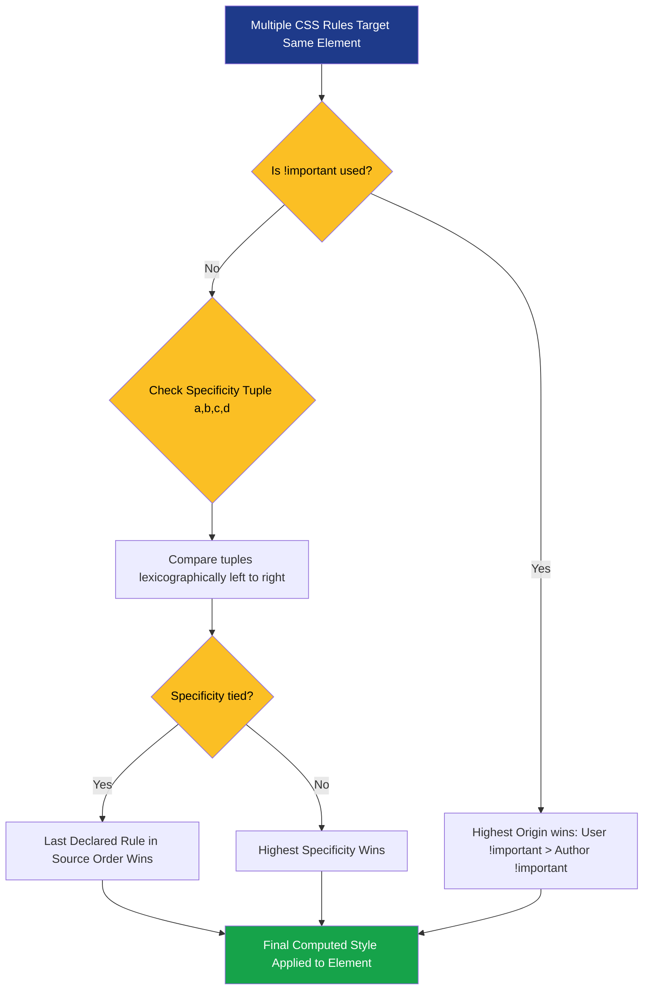
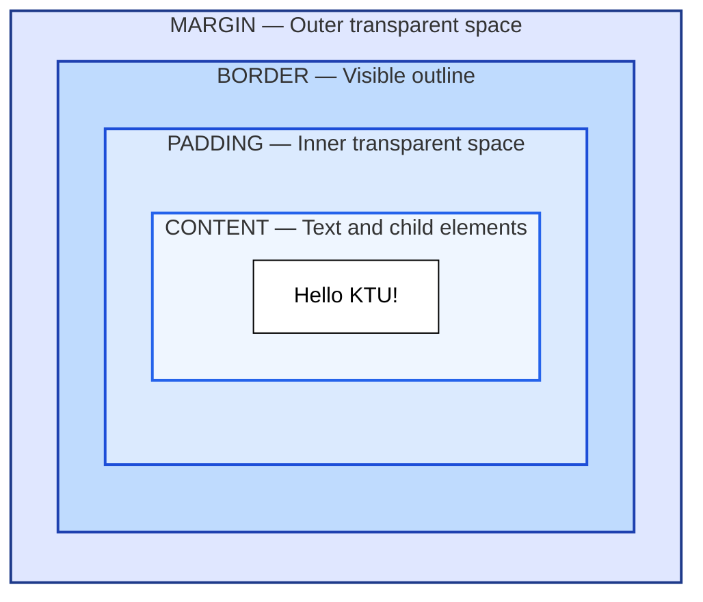
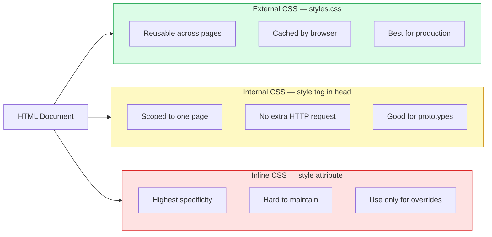
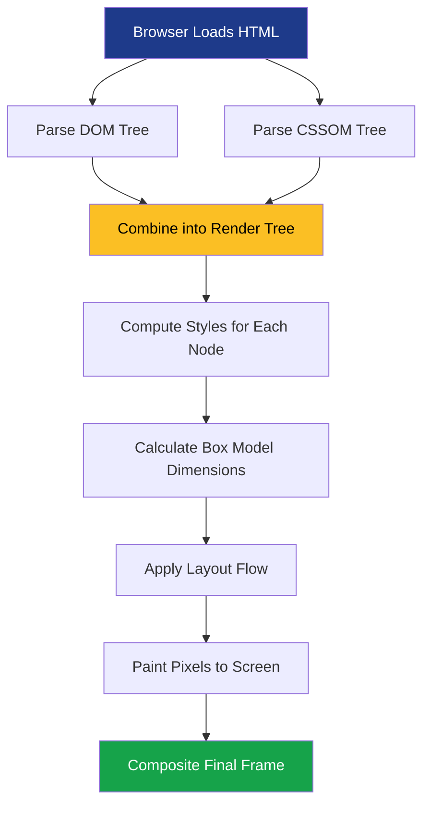

# Understanding Cascading Style Sheets

<!-- SECTION_1_START -->
# Understanding Cascading Style Sheets (CSS)

## 1.1 Formal Academic Definition (KTU 2024 Syllabus Terminology)

> [!NOTE]
> **Cascading Style Sheets (CSS)** is a declarative, rule-based **style sheet language** used to describe the **presentation semantics** — that is, the visual layout, formatting, typography, color, spacing, and animation — of documents written in a structured markup language, most commonly **HTML** and **XML**. CSS is officially maintained by the **World Wide Web Consortium (W3C)** and is governed by a modular specification system (currently CSS Level 4 / CSS 4 / Selectors Level 4).

The term *Cascading* refers to the **priority-based inheritance mechanism** in which style declarations from multiple sources (author, user, and user-agent) are merged and resolved according to a defined algorithm of *origin, specificity, importance, and source order*.

## 1.2 Conceptual Analogy & Intuition

> [!IMPORTANT]
> **The "Three Pillars of a Web Page" Analogy**
>
> Imagine you are building a **human body** for a website:
> * **HTML** is the **skeleton** — the bones, joints, and structural organs (head, torso, arms, paragraphs, headings, images).
> * **CSS** is the **clothing, skin, hair color, and makeup** — it decides whether the skeleton wears a red silk shirt, has blue hair, or stands 200 pixels tall.
> * **JavaScript** is the **muscle and nervous system** — it makes the body walk, blink, react, and think.

Without CSS, every web page would look like a plain 1990s text document: black Times New Roman on a white background, no spacing, no colors, no responsiveness. CSS is the reason websites can look like *Apple.com*, *Netflix.com*, or *KTU's student portal*.

## 1.3 Why CSS Exists — The Separation of Concerns

A core engineering principle in modern web design is the **separation of concerns**:

| Layer | Responsibility | Technology |
| :--- | :--- | :--- |
| **Structure** | *What* content exists? | HTML |
| **Presentation** | *How* does it look? | **CSS** |
| **Behavior** | *What does it do?* | JavaScript |

By keeping these three layers independent, a developer can completely reskin a website by editing **one single CSS file** without touching the HTML, or change the page's logic without disturbing its visual design.

> [!VISUALIZATION CONTROL]
> **Concept:** CSS Box Model — every HTML element is rendered as a rectangular box composed of four nested layers.
> **Visualization:** A simple coordinate-style schematic where the innermost rectangle is the *content*, surrounded by a *padding* band, a *border* line, and an outer *margin* clear-zone.
> **What the student should observe:** A square-in-square-in-square pattern, with each band labeled, demonstrating that the **total rendered width** of a box equals $\text{content} + \text{padding} + \text{border} + \text{margin}$.

<!-- SECTION_1_END -->

<!-- SECTION_2_START -->
# Deep Theoretical Analysis & KTU High-Yield Formula Sheet

## 2.1 Anatomy of a CSS Rule

Every CSS rule follows a strict three-part structure:

```css
selector {
    property: value;   /* This entire line is a "declaration" */
}
```

* **Selector** → identifies *which* HTML element(s) to style.
* **Property** → identifies *what* visual aspect to change (e.g., `color`, `font-size`).
* **Value** → specifies *how* to change it (e.g., `red`, `16px`).

A **declaration block** can contain unlimited declarations, separated by semicolons. A **style sheet** is a collection of such rules.

## 2.2 The Three Methods of Applying CSS

| Method | Syntax Location | Use Case | Specificity Weight |
| :--- | :--- | :--- | :--- |
| **Inline CSS** | Inside the HTML `style` attribute | Quick, one-off styling overrides | **Highest (1,0,0,0)** |
| **Internal CSS** | Inside a `<style>` tag in the `<head>` | Single-page styling, prototypes | Medium (0,0,1,0) |
| **External CSS** | In a separate `.css` file linked via `<link>` | Production websites (best practice) | Medium (0,0,1,0) |

> [!IMPORTANT]
> **Best Practice Rule:** Always prefer **External CSS** for any project larger than a single page. It enables **caching**, **reusability**, and **maintainability**.

## 2.3 The CSS Selector Family (High-Yield for Exams)

| Selector Type | Syntax | Selects... | Example |
| :--- | :--- | :--- | :--- |
| **Element / Type** | `tag` | All instances of a tag | `p { color: blue; }` |
| **Class** | `.classname` | All elements with that class | `.btn { ... }` |
| **ID** | `#idname` | The single element with that id | `#header { ... }` |
| **Descendant** | `A B` | Any `B` inside any `A` | `div p { ... }` |
| **Child** | `A > B` | Direct children only | `ul > li { ... }` |
| **Adjacent Sibling** | `A + B` | The `B` immediately after `A` | `h1 + p { ... }` |
| **General Sibling** | `A ~ B` | All `B` siblings after `A` | `h1 ~ p { ... }` |
| **Attribute** | `[attr=val]` | Elements with a matching attribute | `input[type="text"]` |
| **Pseudo-class** | `:state` | Element in a specific state | `a:hover`, `li:nth-child(2)` |
| **Pseudo-element** | `::part` | A specific part of an element | `p::first-line`, `::before` |

## 2.4 The CSS Box Model — The Core Layout Engine

> [!IMPORTANT]
> Every block-level HTML element is rendered as a rectangular **box** with four concentric layers. Understanding this is **critical** for KTU board exams.

```
┌─────────────────────────────────────┐  ← Margin (transparent outer space)
│  ┌───────────────────────────────┐  │
│  │         Border                │  │
│  │  ┌─────────────────────────┐  │  │
│  │  │       Padding           │  │  │
│  │  │   ┌─────────────────┐   │  │  │
│  │  │   │    Content      │   │  │  │
│  │  │   └─────────────────┘   │  │  │
│  │  └─────────────────────────┘  │  │
│  └───────────────────────────────┘  │
└─────────────────────────────────────┘
```

### KTU High-Yield Formula Sheet (Markdown Table)

| Concept | Formula / Definition | Unit | Default Value |
| :--- | :--- | :--- | :--- |
| **Total Box Width** | $W_{total} = W_{content} + 2 \cdot P_{h} + 2 \cdot B_{w} + 2 \cdot M_{h}$ | pixels (px) | Auto |
| **Total Box Height** | $H_{total} = H_{content} + 2 \cdot P_{v} + 2 \cdot B_{h} + 2 \cdot M_{v}$ | pixels (px) | Auto |
| **Content Area Width** | $W_{content} = W_{parent} - P - B - M$ | pixels (px) | Auto |
| **CSS Specificity Score** | $S = (a, b, c, d)$ tuple | unitless | $(0,0,0,0)$ |
| **Specificity Components** | $S = (\text{inline},\ \text{IDs},\ \text{classes/attrs/pseudo-classes},\ \text{elements/pseudo-elements})$ | unitless | — |
| **Color — Hex** | $\#RRGGBB$ where each pair is $00\text{–}FF$ | hexadecimal | $\#000000$ |
| **Color — RGB Function** | $\text{rgb}(R, G, B),\ R,G,B \in [0, 255]$ | decimal | $\text{rgb}(0,0,0)$ |
| **Color — RGBA** | $\text{rgba}(R, G, B, A),\ A \in [0.0, 1.0]$ | decimal + alpha | $\text{rgba}(0,0,0,1)$ |
| **Color — HSL** | $\text{hsl}(H, S, L),\ H \in [0, 360],\ S,L \in [0\% , 100\%]$ | degrees + percent | $\text{hsl}(0, 0\%, 0\%)$ |
| **Relative Font Size** | $1\,\text{em} = 1 \times \text{parent\_font\_size}$ | multiplier | inherits |
| **Root Relative Font** | $1\,\text{rem} = 1 \times \text{html\_font\_size}$ | multiplier | $16\,\text{px}$ |
| **Viewport Width** | $1\,\text{vw} = 1\% \text{ of viewport width}$ | percent | fluid |
| **Viewport Height** | $1\,\text{vh} = 1\% \text{ of viewport height}$ | percent | fluid |
| **Cascade Order (Low → High)** | User-agent $\rightarrow$ User $\rightarrow$ Author $\rightarrow$ Author `!important` $\rightarrow$ User `!important` | priority | normal |
| **CSS Border Radius** | Border curve for rounded corners | px / % | $0$ |
| **CSS Transition Duration** | $T$ | seconds (s) or ms | $0\text{s}$ |

> [!IMPORTANT]
> **The `!important` rule** in CSS overrides all normal declarations, regardless of specificity. It should be used **sparingly** and only as a last resort, as it breaks the natural cascade and makes debugging extremely difficult.

## 2.5 The Cascade — How Conflicts Are Resolved

When two CSS rules target the same element, the browser resolves the conflict using this strict priority order (highest priority wins):

1. **Origin & Importance** — `!important` from user stylesheet > `!important` from author > normal author > normal user > user-agent defaults.
2. **Specificity** — More specific selectors win (inline > ID > class > element).
3. **Source Order** — If specificity is tied, the rule declared **later** in the source wins.
4. **Inheritance** — If nothing is specified, the child element inherits the parent's value (only for *inheritable* properties like `color`, `font-family`).

## 2.6 Real-World Engineering Utility

CSS is not just "making things pretty." In production engineering, CSS is used to:

* **Responsive Web Design (RWD)** — Using `@media` queries to adapt layouts to phones, tablets, and desktops.
* **Accessibility** — Ensuring sufficient color contrast for visually impaired users (WCAG 2.1 compliance).
* **Animation & Micro-interactions** — Building UI feedback (hover effects, loading spinners) without JavaScript.
* **Theming & Design Systems** — Companies like Google (Material Design), Apple (Human Interface Guidelines), and Microsoft (Fluent) ship millions of websites powered by CSS variables and design tokens.
* **Print Stylesheets** — Defining separate layouts for printed documents via `@media print`.

<!-- SECTION_2_END -->

<!-- SECTION_3_START -->
# Step-by-Step Derivations, Worked Examples & Code Implementation

## 3.1 Worked Example 1 — The CSS Box Model Numerical Calculation

> **Problem:** A `<div>` element has the following CSS:
> `width: 200px;` `padding: 10px;` `border: 5px solid black;` `margin: 20px;`
> Using the **standard (content-box)** model, calculate the **total horizontal space** occupied by the element on the page.

### Step-by-Step Derivation

The total horizontal space occupied by a single box is the sum of all horizontal dimensions from the leftmost outer edge of the margin to the rightmost outer edge of the margin.

$$
W_{total} = W_{content} + 2 \cdot P_{h} + 2 \cdot B_{w} + 2 \cdot M_{h}
$$

**Step 1:** Identify the value of each component from the CSS.
* Content width: $W_{content} = 200\,\text{px}$
* Horizontal padding: $P_{h} = 10\,\text{px}$ (left + right)
* Border width: $B_{w} = 5\,\text{px}$ (left + right)
* Horizontal margin: $M_{h} = 20\,\text{px}$ (left + right)

**Step 2:** Substitute the values into the formula.

$$
\begin{aligned}
W_{total} &= 200 + 2 \cdot (10) + 2 \cdot (5) + 2 \cdot (20) \\
&= 200 + 20 + 10 + 40 \\
&= 270\,\text{px}
\end{aligned}
$$

**Step 3:** State the final answer with a unit.

> **The element occupies a total of $270\,\text{px}$ of horizontal space on the page.**

> [!WARNING]
> **Exam Pitfall:** Students often forget to **double** the padding, border, and margin. Remember: there is a *left* and a *right* (or *top* and *bottom*) side, so the single declared value must be multiplied by **2**.

### Bonus — The `box-sizing` Property

In modern CSS, developers use the **`border-box`** model to make math easier. With `box-sizing: border-box;`, the declared `width` *includes* the padding and border, so:

$$
W_{content} = W_{declared} - 2 \cdot P_{h} - 2 \cdot B_{w}
$$

For the same example with `border-box`: $W_{content} = 200 - 20 - 10 = 170\,\text{px}$ (and the total occupied space remains $270\,\text{px}$).

---

## 3.2 Worked Example 2 — Calculating CSS Specificity

> **Problem:** Given the following CSS rules that all target the same `<p>` element, determine **which rule wins** based on specificity.
>
> ```css
> p { color: black; }                                    /* Rule 1 */
> .note { color: green; }                                 /* Rule 2 */
> div p.note { color: orange; }                          /* Rule 3 */
> #article .note { color: purple; }                      /* Rule 4 */
> <p style="color: red;">Hello</p>                       /* Rule 5 (inline) */
> ```

### Step-by-Step Calculation

CSS specificity is expressed as a four-part tuple $(a, b, c, d)$:

* $a$ = number of **inline styles**
* $b$ = number of **ID selectors**
* $c$ = number of **class**, **attribute**, and **pseudo-class** selectors
* $d$ = number of **element** and **pseudo-element** selectors

| Rule | Selector Breakdown | $a$ | $b$ | $c$ | $d$ | Tuple | Rank |
| :--- | :--- | :--- | :--- | :--- | :--- | :--- | :--- |
| 1 | `p` | 0 | 0 | 0 | 1 | (0,0,0,1) | 5th |
| 2 | `.note` | 0 | 0 | 1 | 0 | (0,0,1,0) | 4th |
| 3 | `div p.note` | 0 | 0 | 1 | 2 | (0,0,1,2) | 3rd |
| 4 | `#article .note` | 0 | 1 | 1 | 0 | (0,1,1,0) | 2nd |
| 5 | inline `style=""` | 1 | 0 | 0 | 0 | (1,0,0,0) | **1st** |

**Comparison algorithm:** Compare tuples from left to right. The first position with a higher number wins.

* Rule 5 has $a=1$, all others have $a=0$ → **Rule 5 wins.**

> **Final color of the paragraph = `red` (from the inline style).**

> [!WARNING]
> **Exam Pitfall:** The tuple is compared **lexicographically**, NOT as a single integer. For example, $(0,1,0,0)$ has a tuple value of "100" if naively summed, but it still beats $(0,0,99,99)$ because we compare digit by digit from left to right. **One ID always beats one hundred classes.**

---

## 3.3 Complete Working Code — A Styled Web Page

Below is a fully operational, self-contained HTML + CSS example that a student can copy into a file named `index.html` and open in any browser.

```html
<!DOCTYPE html>
<html lang="en">
<head>
    <meta charset="UTF-8">
    <title>KTU CSS Demo</title>

    <!-- ============ INTERNAL CSS BLOCK ============ -->
    <style>
        /* 1. CSS Reset (best practice) */
        * {
            margin: 0;
            padding: 0;
            box-sizing: border-box;
        }

        /* 2. Body defaults */
        body {
            font-family: "Segoe UI", Arial, sans-serif;
            background-color: #f4f6f9;        /* Hex color */
            color: #222;                     /* Near-black */
            line-height: 1.6;
        }

        /* 3. ID selector for the page header */
        #main-header {
            background: linear-gradient(90deg, #1e3a8a, #3b82f6);
            color: white;
            padding: 20px 40px;
            text-align: center;
        }

        /* 4. Class selector for navigation links */
        .nav-link {
            color: #fbbf24;
            text-decoration: none;
            margin: 0 12px;
            font-weight: bold;
            transition: color 0.3s ease;     /* Smooth hover transition */
        }

        /* 5. Pseudo-class for hover effect */
        .nav-link:hover {
            color: #ffffff;
            text-decoration: underline;
        }

        /* 6. Descendant selector for paragraphs inside the article */
        #content p {
            margin: 16px 40px;
            font-size: 1rem;                 /* rem = root font size */
        }

        /* 7. Attribute selector for external links only */
        a[target="_blank"]::after {
            content: " ↗";
            font-size: 0.8em;
        }

        /* 8. Responsive media query */
        @media (max-width: 600px) {
            #main-header { padding: 12px 16px; }
            .nav-link    { display: block; margin: 8px 0; }
        }
    </style>
</head>
<body>

    <header id="main-header">
        <h1>KTU B.Tech — Web Design Lab</h1>
        <nav>
            <a class="nav-link" href="#">Home</a>
            <a class="nav-link" href="#" target="_blank">Syllabus</a>
            <a class="nav-link" href="#">Contact</a>
        </nav>
    </header>

    <section id="content">
        <p>This paragraph is styled by the <code>#content p</code> descendant selector.</p>
        <p>CSS stands for <strong>Cascading Style Sheets</strong>.</p>
    </section>

</body>
</html>
```

> [!NOTE]
> **Engineering Insight:** Notice how the `transition: color 0.3s ease;` declaration produces a smooth color animation when the user hovers — this is achieved **without a single line of JavaScript**, demonstrating that CSS alone can power many modern micro-interactions.

---

## 3.4 Unit Conversion Table for CSS Measurements

| Unit | Type | Conversion | Use Case |
| :--- | :--- | :--- | :--- |
| `px` | Absolute | 1 px ≈ 1/96th of an inch | Borders, fixed icons |
| `%` | Relative | % of parent's value | Fluid layouts |
| `em` | Relative | $1\,\text{em} = \text{parent\_font\_size}$ | Compound scaling |
| `rem` | Relative | $1\,\text{rem} = \text{root\_font\_size}$ (default $16\,\text{px}$) | Accessible scaling |
| `vw` | Viewport | $1\,\text{vw} = 1\%$ of window width | Hero banners |
| `vh` | Viewport | $1\,\text{vh} = 1\%$ of window height | Full-screen sections |
| `fr` | Grid | Fraction of remaining grid space | CSS Grid layouts |

<!-- SECTION_3_END -->

<!-- SECTION_4_START -->
# Structural Diagrams & Schematics

## 4.1 The CSS Cascade Resolution Flowchart

This diagram illustrates the **decision tree** the browser follows when multiple CSS rules compete to style the same element.



## 4.2 The CSS Box Model — Block-Level Architecture

A schematic of the four nested layers that constitute every block-level element.



## 4.3 CSS Application Methods — Topological Comparison



## 4.4 Sequential Processing Topology — How the Browser Renders CSS



<!-- SECTION_4_END -->

<!-- SECTION_5_START -->
# KTU 2024 Scheme Examination Question Bank & Topic Recap

## 5.1 Part A — Short Answer Questions (3 Marks Each)

---

### **Question A1** `[KTU University Exam — July 2024, Model]`
**CO1 | Remember**

> **Q: What is meant by "Cascading" in Cascading Style Sheets? List the three methods of inserting CSS into an HTML document.**

**Model Answer (3 Marks):**

> [!NOTE]
> **Definition (2 Marks):** The term *Cascading* refers to the priority-based mechanism by which the browser resolves conflicts when multiple CSS rules attempt to style the same HTML element. The cascade uses **origin, specificity, importance (`!important`), and source order** as its decision criteria.
>
> **Three Methods (1 Mark):**
> 1. **Inline CSS** — using the `style` attribute inside an HTML tag.
> 2. **Internal CSS** — using a `<style>` block within the `<head>` section.
> 3. **External CSS** — linking a separate `.css` file via a `<link>` tag.

---

### **Question A2** `[KTU University Exam — Dec 2023, Model]`
**CO1 | Understand**

> **Q: Differentiate between a CSS Class selector and an ID selector. When should each be used?**

**Model Answer (3 Marks):**

| Feature | Class Selector (`.name`) | ID Selector (`#name`) |
| :--- | :--- | :--- |
| **Symbol** | Period `.` | Hash `#` |
| **Reusability** | Can be applied to **many** elements | Must be **unique** per page |
| **Specificity Weight** | Lower (0,0,1,0) | Higher (0,1,0,0) |
| **Usage** | Grouping elements with shared styles | Targeting a single unique element |
| **Example** | `.card { ... }` for all cards | `#header { ... }` for one header |

> **When to use:** Use **classes** for reusable styles (e.g., buttons, cards, alerts). Use **IDs** for unique page landmarks (e.g., `#header`, `#footer`, `#main-nav`). **(1 Mark for the "when to use" portion)**

---

## 5.2 Part B — Long Answer Questions (14 Marks Each, with Internal Choice)

---

### **Question B1 — Choice A** `[KTU University Exam — July 2024, Model]`
**CO2 | Understand + Apply**

> **Q (a)** [7 Marks] Explain the **CSS Box Model** with a neat diagram. Describe the function of each of its four layers.
>
> **Q (b)** [7 Marks] Consider a `<div>` element with the following CSS:
> `width: 300px; padding: 15px; border: 4px solid; margin: 25px;`
> Using the standard `content-box` model, calculate the **total horizontal space** occupied by this element. Show all calculation steps.

#### **Model Solution for (a):**

> **Diagram (3 Marks):**
> ```
> ┌───────────────────────── Margin ─────────────────────────┐
> │  ┌──────────────────── Border ────────────────────────┐  │
> │  │  ┌────────────── Padding ───────────────────────┐  │  │
> │  │  │  ┌────────── Content ────────────────────┐  │  │  │
> │  │  │  │   (Text / Images / Child Elements)    │  │  │  │
> │  │  │  └────────────────────────────────────────┘  │  │  │
> │  │  └──────────────────────────────────────────────┘  │  │
> │  └────────────────────────────────────────────────────┘  │
> └──────────────────────────────────────────────────────────┘
> ```
>
> **Function of each layer (4 Marks):**
> * **Content:** The innermost area where the actual text, images, or child HTML elements are rendered. Its size is set by `width` and `height` properties. **[1 Mark]**
> * **Padding:** The transparent space between the content and the border. It clears an inner breathing room and inherits the element's background color. **[1 Mark]**
> * **Border:** The visible line that wraps the padding and content. It can be styled in width, style (solid/dashed/dotted), and color. **[1 Mark]**
> * **Margin:** The outermost transparent space that separates this element from its neighbors. Unlike padding, margin is **not** painted with a background color. **[1 Mark]**

#### **Model Solution for (b):**

**Step 1 — State the formula.** **[1 Mark]**

$$
W_{total} = W_{content} + 2 \cdot P_{h} + 2 \cdot B_{w} + 2 \cdot M_{h}
$$

**Step 2 — Substitute the values.** **[2 Marks]**

$$
W_{total} = 300 + 2 \cdot (15) + 2 \cdot (4) + 2 \cdot (25)
$$

**Step 3 — Perform the arithmetic.** **[3 Marks]**

$$
\begin{aligned}
W_{total} &= 300 + 30 + 8 + 50 \\
&= 388\,\text{px}
\end{aligned}
$$

**Step 4 — Final answer with unit.** **[1 Mark]**

> The total horizontal space occupied by the element is **$388\,\text{px}$**.

---

### **Question B1 — Choice B (Internal Choice Alternative)** `[KTU University Exam — Dec 2023, Model]`
**CO2 | Understand + Apply**

> **Q (a)** [7 Marks] Explain the concept of **CSS Specificity**. How is the specificity score calculated? Provide the specificity tuple for the following selectors:
> (i) `body p.intro`
> (ii) `#wrapper .card > p`
> (iii) `header nav ul li a:hover`
>
> **Q (b)** [7 Marks] Write a complete **HTML + Internal CSS** program to design a student registration form with proper styling for headings, input fields, and a submit button. Use **class selectors** for inputs and an **ID selector** for the heading.

#### **Model Solution for (a):**

**Explanation (3 Marks):** CSS Specificity is a four-part tuple $(a, b, c, d)$ that determines *which* CSS rule wins when multiple rules target the same element. The components are:
* $a$ = inline styles,
* $b$ = ID selectors,
* $c$ = class / attribute / pseudo-class selectors,
* $d$ = element / pseudo-element selectors.

Higher numbers in the leftmost position dominate; tuples are compared **lexicographically** (digit-by-digit from left to right). **`!important`** overrides everything else. **[1 Mark]**

**Calculations (4 Marks):**

| Selector | Breakdown | $a$ | $b$ | $c$ | $d$ | Tuple |
| :--- | :--- | :--- | :--- | :--- | :--- | :--- |
| (i) `body p.intro` | 2 elements + 1 class | 0 | 0 | 1 | 2 | (0,0,1,2) |
| (ii) `#wrapper .card > p` | 1 ID + 1 class + 1 element | 0 | 1 | 1 | 1 | (0,1,1,1) |
| (iii) `header nav ul li a:hover` | 5 elements + 1 pseudo-class | 0 | 0 | 1 | 5 | (0,0,1,5) |

#### **Model Solution for (b):**

```html
<!DOCTYPE html>
<html>
<head>
    <title>Student Registration</title>
    <style>
        #formTitle {
            color: #1e3a8a;
            text-align: center;
            font-size: 2rem;
        }
        .inputField {
            width: 100%;
            padding: 10px;
            margin: 6px 0;
            border: 2px solid #94a3b8;
            border-radius: 6px;
        }
        .inputField:focus {
            border-color: #3b82f6;
            outline: none;
        }
        #submitBtn {
            background-color: #16a34a;
            color: white;
            padding: 12px 24px;
            border: none;
            border-radius: 6px;
            cursor: pointer;
        }
    </style>
</head>
<body>
    <h1 id="formTitle">Student Registration Form</h1>
    <form>
        <label>Name:</label>
        <input class="inputField" type="text" name="name">
        <label>Email:</label>
        <input class="inputField" type="email" name="email">
        <label>Age:</label>
        <input class="inputField" type="number" name="age">
        <input id="submitBtn" type="submit" value="Register">
    </form>
</body>
</html>
```

> **Valuation Key:** `[#formTitle ID selector with styling: 2 Marks]` `[.inputField class selector with 3 styles: 3 Marks]` `[#submitBtn ID selector with 3 styles: 2 Marks]`

---

> [!WARNING]
> **KTU Examiner's Valuation Warning — Common Pitfalls**
> 1. **The "Single-Side" Mistake:** When computing the total box width, students frequently write $200 + 10 + 5 + 20 = 235\,\text{px}$ (forgetting to double the padding, border, and margin). **Always double** the horizontal values. **[-2 Marks]**
> 2. **The "Integer Summation" Mistake:** Students sum the specificity tuple as a single integer (e.g., $0+1+1+0 = 2$) and then compare numerically. Specificity must be compared **lexicographically** (digit by digit). **[-1 Mark]**
> 3. **The "Inline vs. Internal" Mistake:** Students often forget that **inline styles** (specificity $a=1$) automatically beat **all** selector-based rules, regardless of how many IDs they contain. **[-1 Mark]**
> 4. **The "Missing Semicolon" Mistake:** Forgetting the trailing `;` after the last declaration in a CSS rule. While modern browsers tolerate this, KTU evaluators **do not**. **[-0.5 Mark]**
> 5. **The "Wrong Selector Symbol" Mistake:** Confusing `.class` with `#id`. A period (`.`) targets a class, a hash (`#`) targets an ID. Mixing these up causes the entire rule to silently fail. **[-1 Mark]**

---

## 5.3 Topic Recap & Important Things to Remember

> [!IMPORTANT]
> **Rapid-Revision Checklist — Mastering CSS for the KTU Board Exam**

* **CSS = Cascading Style Sheets** — a declarative, rule-based style sheet language maintained by the **W3C**.
* **CSS Rule Anatomy:** `selector { property: value; }` — every rule has exactly these three parts.
* **Three Application Methods:** **Inline** (highest specificity), **Internal** (`<style>` in head), **External** (`.css` file linked via `<link>` — best practice).
* **Selector Hierarchy (Specificity):** Inline > ID > Class/Attribute/Pseudo-class > Element/Pseudo-element.
* **Specificity Tuple:** $(a, b, c, d)$ — compared **lexicographically**, NOT as a single integer. **One ID always beats 100 classes.**
* **The Cascade Order:** Origin → `!important` → Specificity → Source Order → Inheritance.
* **CSS Box Model:** Four nested layers — **Content → Padding → Border → Margin**.
* **Total Box Width Formula:** $W_{total} = W_{content} + 2P_h + 2B_w + 2M_h$ (always double the left/right values).
* **Standard Models:** `content-box` (default, declared width = content only) vs. `border-box` (declared width = content + padding + border).
* **CSS Units:** `px` (absolute), `%`, `em` (parent-relative), `rem` (root-relative, **best for accessibility**), `vw`/`vh` (viewport-relative), `fr` (grid fractions).
* **Color Systems:** Hex (`#RRGGBB`), RGB (`rgb(R,G,B)`), RGBA (with alpha channel), HSL (`hsl(H,S,L)`), and named colors (`red`, `blue`).
* **Key Pseudo-classes:** `:hover`, `:focus`, `:active`, `:nth-child(n)`, `:first-child`, `:last-child`.
* **Key Pseudo-elements:** `::before`, `::after`, `::first-line`, `::first-letter`.
* **Combinators:** Descendant (`A B`), Child (`A > B`), Adjacent Sibling (`A + B`), General Sibling (`A ~ B`).
* **Attribute Selectors:** `a[target="_blank"]`, `input[type="text"]`, `[class*="btn"]` (contains), `[^="..."]` (starts-with).
* **Responsive Design:** Use `@media (max-width: Xpx)` queries to adapt layouts for mobile, tablet, and desktop.
* **Transitions & Animations:** `transition: property duration timing-function delay;` for smooth hover effects — no JavaScript needed.
* **The `!important` Rule:** Overrides all normal declarations, regardless of specificity. Use **sparingly** — it breaks the natural cascade.
* **Inheritance:** Properties like `color`, `font-family`, `line-height` are inherited by default; properties like `margin`, `padding`, `border` are **not**.
* **Browser Rendering Pipeline:** DOM + CSSOM → Render Tree → Style Computation → Layout (Box Model) → Paint → Composite.
* **Default User-Agent Font Size:** $16\,\text{px}$, so $1\,\text{rem} = 16\,\text{px}$ by default.
* **KTU Exam Favorites:** The Box Model numerical question, the Specificity tuple question, and the "write a complete styled HTML page" question appear in **almost every semester's ESE paper**.

<!-- SECTION_5_END -->
