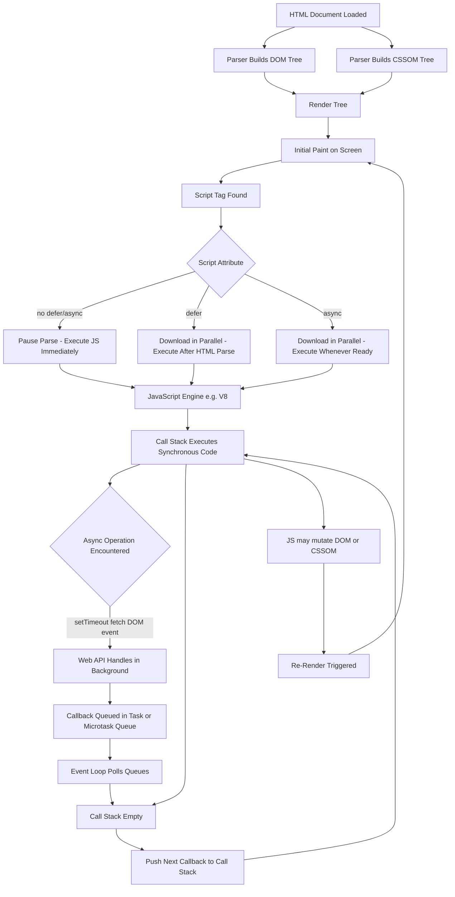
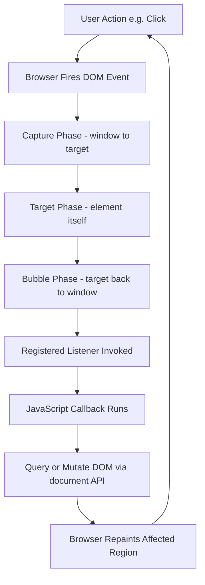
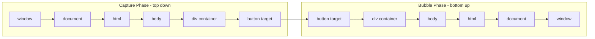
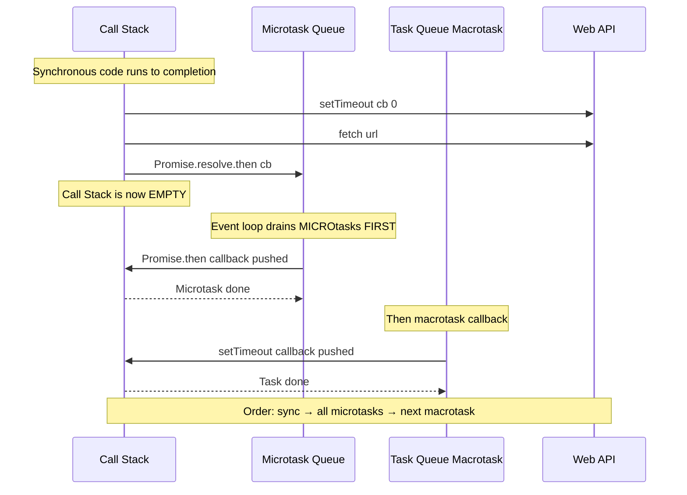
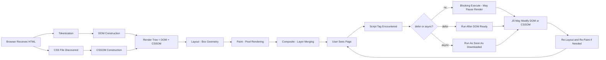

# Understanding JavaScript

<!-- SECTION_1_START -->

# Understanding JavaScript — The Behavior Layer of the Modern Web

## 1.1 Formal KTU 2024 Definition

**JavaScript (JS)** is a high-level, interpreted, dynamically-typed, prototype-based, multi-paradigm scripting language standardized under the **ECMAScript (ES)** specification (current mainstream: ES6 / ES2015 and beyond). In the KTU 2024 scheme for *GXEST203 — Foundations of Computing*, JavaScript is positioned as the **client-side behavioral engine** of the World Wide Web that runs inside a browser's JavaScript Engine (e.g., Google V8, SpiderMonkey, JavaScriptCore) to manipulate the **Document Object Model (DOM)**, handle user events, validate data, and communicate asynchronously with servers.

> [!IMPORTANT]
> **KTU 2024 Syllabus Tag — GXEST203 / Module 4**
> JavaScript is the *third pillar* of front-end web design, sitting on top of:
> - **HTML** → structure / content (the *skeleton*)
> - **CSS** → presentation / styling (the *skin*)
> - **JavaScript** → behavior / interactivity (the *brain & muscles*)

---

## 1.2 Conceptual Analogy — The Human Body Model of a Web Page

Imagine a web page is a **human body** displayed on a museum podium:

| Web Layer | Human Body Equivalent | What It Does |
| :--- | :--- | :--- |
| **HTML** | Skeleton (bones) | Provides the raw structure — head, arms, legs. |
| **CSS** | Skin, clothes, makeup | Adds color, size, font, layout. |
| **JavaScript** | Brain, nerves, muscles | Makes the body *react*: smile, walk, speak, fetch food. |

Without JavaScript, a webpage is a static poster. With JavaScript, the page becomes a *living application* that can respond to clicks, validate forms, animate, fetch live data, and update content without reloading.

> [!NOTE]
> **Core Insight for KTU Exam:**
> JavaScript is **NOT** the same as Java. The name is a marketing relic from 1995. They are completely different languages in syntax, semantics, runtime, and use-case. Do **not** confuse the two in board answers — examiners explicitly deduct marks for this.

---

## 1.3 The Three Execution Contexts of JavaScript

JavaScript today runs in **three major environments** — a KTU-favorite question:

1. **Client-Side (Browser)** → Manipulating the DOM, handling events, validating forms, calling REST APIs via `fetch()`. *Default context for this module.*
2. **Server-Side (Node.js / Deno / Bun)** → Backend logic, file I/O, databases, REST servers.
3. **Embedded / Edge** → IoT firmware, smart-TVs, service workers, serverless functions (AWS Lambda, Cloudflare Workers).

> [!VISUALIZATION CONTROL]
> **Concept:** *JavaScript Event Loop & Runtime Architecture (Simplified Browser View)*
> **Visualization Tool:** *https://www.jsv9000.app/* (open the live tool, paste a `setTimeout(..., 0)` example)
> **What to Observe:**
> - The **Call Stack** executes one frame at a time (LIFO — Last In First Out).
> - **Web APIs** (`setTimeout`, `fetch`, DOM events) push callbacks into the **Task Queue (Macrotask)** or **Microtask Queue** (Promises).
> - The **Event Loop** constantly polls the queues and pushes the next ready callback onto the empty Call Stack.
> **Key Takeaway:** JavaScript is *single-threaded* but *non-blocking* — concurrency is achieved through this loop, not multiple OS threads.

---

## 1.4 Why JavaScript Matters in the KTU 2024 Curriculum

- It is the **only language natively understood by every browser** on Earth.
- It powers **97%+ of all websites** (Stack Overflow & W3Techs 2024 survey data — emphasize **97%** as a bold high-yield statistic).
- It is the foundation of modern front-end frameworks (React, Angular, Vue) and back-end stacks (MERN, MEAN).
- For a B.Tech student, JS is the **fastest ROI skill** — one language covers front-end, back-end, mobile (React Native), and even ML (TensorFlow.js).

<!-- SECTION_1_END -->

<!-- SECTION_2_START -->

# Deep Theoretical Analysis & KTU High-Yield Formula Sheet

## 2.1 The JavaScript Language Anatomy

JavaScript code is composed of **statements**, **expressions**, **declarations**, and **tokens**. A JS file is parsed top-to-bottom by the engine after the script is loaded (unless `defer` / `async` modifiers are used — covered later).

### 2.1.1 Variables & Declaration Keywords

| Keyword | Scope | Re-declaration | Re-assignment | Hoisted? | KTU Tip |
| :--- | :--- | :--- | :--- | :--- | :--- |
| `var` | Function-scoped | Allowed | Allowed | Yes (`undefined`) | **Legacy — avoid in modern code** |
| `let` | Block-scoped `{ }` | Not allowed | Allowed | Yes (TDZ until declared) | **Default choice for mutable variables** |
| `const` | Block-scoped `{ }` | Not allowed | Not allowed (for primitives) | Yes (TDZ) | **Default choice for constants & references** |

> [!IMPORTANT]
> **Temporal Dead Zone (TDZ):** A `let` or `const` variable *exists* from the start of its block but cannot be *accessed* until the declaration line is executed. Accessing it earlier throws a `ReferenceError`. This is a common KTU question.

### 2.1.2 Primitive vs. Reference Data Types

JavaScript has **8 data types** total — 7 primitive + 1 reference (Object).

**Primitive Types** (immutable, stored *by value*):

$$
\texttt{String},\ \texttt{Number},\ \texttt{Boolean},\ \texttt{null},\ \texttt{undefined},\ \texttt{Symbol},\ \texttt{BigInt}
$$

**Reference Type** (mutable, stored *by reference*):

$$
\texttt{Object} \rightarrow \{ \texttt{Object}, \texttt{Array}, \texttt{Function}, \texttt{Date}, \texttt{RegExp},\ \texttt{Map}, \texttt{Set},\ \dots \}
$$

> [!NOTE]
> `typeof null === "object"` is a **famous historical bug** in JavaScript preserved for backward compatibility. Examiners *love* asking this. The correct answer is `"object"`, not `"null"`.

### 2.1.3 Operators — The Behavior Toolkit

| Category | Symbols | Example | KTU Pitfall |
| :--- | :--- | :--- | :--- |
| Arithmetic | `+`, `-`, `*`, `/`, `%`, `**` | `2 ** 3 === 8` | `+` concatenates strings: `"5" + 3 === "53"` |
| Comparison | `==`, `!=`, `===`, `!==`, `<`, `>`, `<=`, `>=` | `5 === "5"` is `false` | Always use **strict** `===` / `!==` |
| Logical | `&&`, `$\vert\vert$`, `!` | `true && false` → `false` | Short-circuit evaluation applies |
| Ternary | `condition ? a : b` | `x > 0 ? "pos" : "neg"` | Use sparingly; readability matters |
| Nullish Coalescing | `??` | `null ?? "default"` → `"default"` | Different from `$\vert\vert$` — `0 ?? "x"` → `0` |
| Type | `typeof`, `instanceof` | `typeof [] === "object"` | `typeof` returns a **string** |

### 2.1.4 Control Flow Constructs

JavaScript supports the standard trio:

- **Conditional:** `if / else if / else` and `switch`
- **Looping:** `for`, `while`, `do...while`, `for...in` (object keys), `for...of` (iterables)
- **Jump:** `break`, `continue`, `return`, `throw`

### 2.1.5 Functions — First-Class Citizens

In JavaScript, functions are **values**. They can be assigned to variables, passed as arguments, and returned from other functions. This property is called *first-class functions* and is the foundation of *higher-order functions*, *callbacks*, and *functional programming* in JS.

**Four ways to define a function:**

1. **Function Declaration** → `function foo() { }` — hoisted.
2. **Function Expression** → `const foo = function() { }` — not hoisted.
3. **Arrow Function** → `const foo = () => { }` — no own `this`, no `arguments` object.
4. **Method** → A function defined as a property of an object: `obj.method() { }`.

### 2.1.6 The Document Object Model (DOM) — JS ↔ HTML Bridge

The DOM is a **tree-structured, in-memory representation** of the HTML document that JavaScript can read and modify at runtime.

```
document
 └── html
      ├── head
      │    ├── title
      │    └── meta, link, script
      └── body
           ├── h1
           ├── p
           └── div
                ├── button
                └── ul
                     └── li (x N)
```

The `document` object is the **root entry point**. Common DOM APIs:

| API | Purpose | KTU Keyword |
| :--- | :--- | :--- |
| `document.getElementById(id)` | Select by ID | Returns single Element or `null` |
| `document.querySelector(sel)` | Select first match of CSS selector | Returns Element or `null` |
| `document.querySelectorAll(sel)` | Select all matches | Returns **static** NodeList |
| `el.innerHTML` | Read/Write raw HTML | ⚠️ XSS risk if user-controlled |
| `el.textContent` | Read/Write visible text | Safe — auto-escapes |
| `el.style.property` | Inline style mutation | `el.style.color = "red"` |
| `el.addEventListener(evt, fn)` | Attach event handler | Modern standard |
| `el.setAttribute(name, val)` | Set any HTML attribute | Works for non-standard attrs |

### 2.1.7 Event Handling — Listening to the User

JavaScript reacts to user actions through the **Event Loop & Event Listener model**.

> [!NOTE]
> **Three Ways to Register Events (KTU favorite):**
> 1. **Inline HTML** → `<button onclick="fn()">` — *not recommended*, mixes JS into HTML.
> 2. **Property handler** → `el.onclick = fn` — overwrites previous handlers.
> 3. **`addEventListener`** → `el.addEventListener("click", fn)` — **best practice**, supports multiple handlers, capture/bubble phases, and removal via `removeEventListener`.

The event object passed to the handler carries: `type`, `target`, `currentTarget`, `preventDefault()`, `stopPropagation()`, coordinates, key codes, etc.

---

## 2.2 KTU High-Yield Cheat Sheet — JavaScript Essentials

| # | Concept | Syntax / Rule | Units / Notes |
| :--- | :--- | :--- | :--- |
| 1 | Variable declaration | `let x = 10;` | Use `let` for mutable, `const` for fixed |
| 2 | Strict equality | `a === b` | No type coercion; preferred over `==` |
| 3 | String template | `` `Hello, ${name}` `` | Backticks, `${}` interpolation |
| 4 | Arrow function | `const add = (a, b) => a + b;` | Implicit return for single expression |
| 5 | Array iteration | `arr.map(fn)`, `arr.filter(fn)`, `arr.reduce(fn, init)` | All return **new** arrays/values |
| 6 | Destructuring | `const {a, b} = obj;` `const [x, y] = arr;` | ES6 feature |
| 7 | Spread operator | `const merged = [...arr1, ...arr2];` | Shallow copy, merges arrays/objects |
| 8 | Optional chaining | `obj?.prop?.subprop` | Returns `undefined` instead of error |
| 9 | DOM selection | `document.querySelector("#id .class")` | CSS-selector based |
| 10 | Event listener | `el.addEventListener("click", handler)` | Modern, multi-handler friendly |
| 11 | Async fetch | `fetch(url).then(r => r.json())` | Returns a **Promise** |
| 12 | JSON parse/stringify | `JSON.parse(str)`, `JSON.stringify(obj)` | Standard data interchange |
| 13 | Truthy/Falsy falsy values | `false`, `0`, `""`, `null`, `undefined`, `NaN` | Only **6** falsy values in JS |
| 14 | `this` keyword | Depends on call-site | Arrow functions **do not** bind `this` |
| 15 | Script placement | `<script src="..." defer></script>` | `defer` waits for HTML parse |

---

## 2.3 Real-World Engineering Utility of JavaScript

| Domain | JavaScript Use-Case | Why JS? |
| :--- | :--- | :--- |
| **Front-End Web** | React / Angular / Vue SPAs | Component model, virtual DOM, huge ecosystem |
| **Back-End Web** | Node.js REST APIs (Express, Fastify) | Non-blocking I/O, same language full-stack |
| **Mobile Apps** | React Native, Ionic | Write once, deploy iOS + Android |
| **Desktop Apps** | Electron (VS Code, Slack, Discord) | Cross-platform native-feeling apps |
| **Data Science / ML** | TensorFlow.js, Brain.js | In-browser inference, no Python needed |
| **IoT / Embedded** | Johnny-Five, Espruino, Tessel | Hardware scripting on microcontrollers |
| **DevOps & Scripting** | Node-based CLIs (npm, yarn, webpack) | Automation tooling |

> [!IMPORTANT]
> **KTU 2024 Takeaway:** JavaScript is the *de-facto* lingua franca of the web. Mastering it is mandatory for any B.Tech student targeting full-stack, mobile, or modern cloud development roles.

<!-- SECTION_2_END -->

<!-- SECTION_3_START -->

# Step-by-Step Implementations & Code Walkthroughs

This section contains **exhaustively typed, fully operational, and commented** JavaScript code that you can run directly in any browser console or `<script>` tag. Every step is shown explicitly — no truncation, no "similarly..." placeholders.

---

## 3.1 Implementation 1 — Variables, Types & Type Coercion

```html
<!DOCTYPE html>
<html lang="en">
<head>
  <meta charset="UTF-8">
  <title>JS Variables Demo</title>
</head>
<body>
  <h1>Open the Browser Console (F12) to see output</h1>

  <script>
    // ---- STEP 1: Primitive declarations using let, const, and var ----
    const courseCode = "GXEST203";        // const: cannot be re-assigned
    let studentCount = 42;                // let:   block-scoped, mutable
    var legacyFlag = true;                // var:    function-scoped, AVOID in modern JS

    // ---- STEP 2: Type checking using typeof ----
    console.log("courseCode   :", courseCode,   "→ typeof:", typeof courseCode);   // string
    console.log("studentCount :", studentCount, "→ typeof:", typeof studentCount); // number
    console.log("legacyFlag   :", legacyFlag,   "→ typeof:", typeof legacyFlag);   // boolean

    // ---- STEP 3: Demonstrate the famous typeof null bug ----
    const nothing = null;
    console.log("typeof null  :", typeof nothing); // "object" ← historical bug

    // ---- STEP 4: Show type coercion (loose equality) ----
    console.log("5 == '5'     :", 5 == "5");     // true  ← loose equality coerces
    console.log("5 === '5'    :", 5 === "5");    // false ← strict equality rejects
    console.log("0 == false   :", 0 == false);   // true
    console.log("null == undefined :", null == undefined); // true (special rule)

    // ---- STEP 5: Template literal (string interpolation) ----
    const greeting = `Course ${courseCode} has ${studentCount} students.`;
    console.log(greeting);

    // ---- STEP 6: Demonstrate TDZ (Temporal Dead Zone) ----
    try {
      console.log(tdzVar);   // ReferenceError: Cannot access before initialization
      let tdzVar = "late";
    } catch (err) {
      console.log("TDZ error caught:", err.message);
    }
  </script>
</body>
</html>
```

**Expected console output (abridged):**
```
courseCode   : GXEST203 → typeof: string
studentCount : 42 → typeof: number
typeof null  : object
5 == '5'     : true
5 === '5'    : false
Course GXEST203 has 42 students.
TDZ error caught: Cannot access 'tdzVar' before initialization
```

---

## 3.2 Implementation 2 — Control Flow: The Grade Calculator

```html
<!DOCTYPE html>
<html lang="en">
<head>
  <meta charset="UTF-8">
  <title>Grade Calculator</title>
</head>
<body>
  <h1 id="result">Enter a mark below</h1>
  <input  id="markInput" type="number" placeholder="Enter mark (0-100)" min="0" max="100">
  <button id="calcBtn">Calculate Grade</button>

  <script>
    // ---- STEP 1: Get DOM references once at script start ----
    const resultEl  = document.getElementById("result");
    const inputEl   = document.getElementById("markInput");
    const buttonEl  = document.getElementById("calcBtn");

    // ---- STEP 2: Define a pure function for grade mapping ----
    /**
     * @param {number} mark - integer 0..100
     * @returns {string} grade label
     */
    function getGrade(mark) {
      if (Number.isNaN(mark))           return "Invalid input";
      if (mark < 0 || mark > 100)       return "Out of range";
      if (mark >= 90) return "A+";
      if (mark >= 80) return "A";
      if (mark >= 70) return "B+";
      if (mark >= 60) return "B";
      if (mark >= 50) return "C";
      return "F (Fail)";
    }

    // ---- STEP 3: Wire the click event using addEventListener ----
    buttonEl.addEventListener("click", function (event) {
      const raw  = inputEl.value;                // string from input
      const mark = Number.parseInt(raw, 10);     // explicit base-10 parse
      const grade = getGrade(mark);
      resultEl.textContent = `Mark ${mark} → Grade: ${grade}`;
    });

    // ---- STEP 4: Bonus — also react to the Enter key ----
    inputEl.addEventListener("keydown", function (e) {
      if (e.key === "Enter") buttonEl.click();
    });
  </script>
</body>
</html>
```

---

## 3.3 Implementation 3 — Arrays + Higher-Order Functions (Functional Style)

```javascript
"use strict";

// STEP 1: A sample dataset of KTU 2024 scheme students
const students = [
  { id: 1, name: "Ananya", marks: 92, branch: "CSE" },
  { id: 2, name: "Rahul",  marks: 78, branch: "ECE" },
  { id: 3, name: "Meera",  marks: 35, branch: "CSE" },
  { id: 4, name: "Arjun",  marks: 65, branch: "ME"  },
  { id: 5, name: "Sneha",  marks: 88, branch: "CSE" }
];

// STEP 2: filter() — keep only CSE students
const cseOnly = students.filter(s => s.branch === "CSE");
console.log("CSE students:", cseOnly);

// STEP 3: map() — transform to a list of "name (marks)" strings
const nameMarks = cseOnly.map(s => `${s.name} (${s.marks})`);
console.log("Name list  :", nameMarks);

// STEP 4: reduce() — compute the average CSE mark
const total = cseOnly.reduce((acc, s) => acc + s.marks, 0);
const avg   = cseOnly.length ? total / cseOnly.length : 0;
console.log("CSE average :", avg.toFixed(2));

// STEP 5: find() — locate first student with marks < 40 (KTU pass-mark boundary)
const firstFail = students.find(s => s.marks < 40);
console.log("First fail  :", firstFail);

// STEP 6: Spread + destructuring — clone and update immutably
const updated = students.map(s =>
  s.id === 3 ? { ...s, marks: 55 } : s
);
console.log("After grace mark for Meera:", updated);
```

**Expected output:**
```
CSE students: [ {id:1,...}, {id:3,...}, {id:5,...} ]
Name list  : [ 'Ananya (92)', 'Meera (35)', 'Sneha (88)' ]
CSE average : 71.67
First fail  : { id: 3, name: 'Meera', marks: 35, branch: 'CSE' }
After grace mark for Meera: [..., {id:3, marks:55, ...}, ...]
```

---

## 3.4 Implementation 4 — DOM Manipulation + Event-Driven To-Do List

```html
<!DOCTYPE html>
<html lang="en">
<head>
  <meta charset="UTF-8">
  <title>JS To-Do App</title>
  <style>
    body { font-family: system-ui, sans-serif; max-width: 480px; margin: 2rem auto; }
    li.done { text-decoration: line-through; color: #888; }
    li { cursor: pointer; padding: 4px 0; }
  </style>
</head>
<body>
  <h1>📝 My To-Do List</h1>
  <input id="taskInput" type="text" placeholder="Type a task and press Add">
  <button id="addBtn">Add</button>
  <ul id="taskList"></ul>

  <script>
    "use strict";

    // ---- STEP 1: Cache DOM nodes ----
    const inputEl = document.getElementById("taskInput");
    const addBtn  = document.getElementById("addBtn");
    const listEl  = document.getElementById("taskList");

    // ---- STEP 2: Helper to create a single <li> element ----
    function createTaskItem(text) {
      const li = document.createElement("li");     // createElement
      li.textContent = text;                        // safe text insertion
      li.addEventListener("click", () => {
        li.classList.toggle("done");                // visual toggle
      });
      const delBtn = document.createElement("button");
      delBtn.textContent = "✕";
      delBtn.addEventListener("click", (e) => {
        e.stopPropagation();                        // do not trigger li click
        li.remove();                                // modern DOM removal
      });
      li.appendChild(delBtn);
      return li;
    }

    // ---- STEP 3: Add-task handler with input validation ----
    function handleAdd() {
      const task = inputEl.value.trim();
      if (task.length === 0) {
        alert("Task cannot be empty.");
        return;
      }
      const item = createTaskItem(task);
      listEl.appendChild(item);
      inputEl.value = "";
      inputEl.focus();
    }

    // ---- STEP 4: Register event listeners ----
    addBtn.addEventListener("click", handleAdd);
    inputEl.addEventListener("keydown", (e) => {
      if (e.key === "Enter") handleAdd();
    });

    // ---- STEP 5: Pre-populate with a few starter tasks ----
    ["Buy milk", "Submit KTU assignment", "Read JS docs"]
      .forEach(t => listEl.appendChild(createTaskItem(t)));
  </script>
</body>
</html>
```

**Behavioural Walkthrough (for KTU viva):**
1. User types a task → presses **Add** or **Enter**.
2. `handleAdd()` reads the value, validates non-empty, builds a new `<li>` with a delete button.
3. The `<li>` is appended to the `<ul>` — DOM is now updated → browser repaints.
4. Clicking a task toggles `.done` → CSS strike-through applies.
5. Clicking ✕ calls `e.stopPropagation()` so the parent `<li>` click is **not** fired, then removes the element from the DOM.

---

## 3.5 Implementation 5 — Asynchronous JavaScript: `fetch` + Promises

```javascript
// STEP 1: A free public API endpoint (KTU-favourite JSON test API)
const API_URL = "https://jsonplaceholder.typicode.com/users";

// STEP 2: fetch() returns a Promise that resolves to a Response object
fetch(API_URL)
  .then(function (response) {
    // STEP 3: Explicit HTTP error check (fetch does NOT reject on 4xx/5xx)
    if (!response.ok) {
      throw new Error("HTTP error! Status: " + response.status);
    }
    return response.json();                       // parse JSON body → Promise<Object>
  })
  .then(function (users) {
    // STEP 4: We now have a real JavaScript array
    console.log("Fetched", users.length, "users");
    users
      .filter(u => u.address.city === "South Christy")
      .map(u => `${u.name} <${u.email}>`)
      .forEach(line => console.log("→", line));
  })
  .catch(function (err) {
    // STEP 5: Network errors AND thrown errors land here
    console.error("Fetch failed:", err.message);
  })
  .finally(function () {
    console.log("--- Request lifecycle complete ---");
  });
```

**Modern equivalent using `async / await` (ES2017+):**
```javascript
async function loadUsers() {
  try {
    const response = await fetch(API_URL);
    if (!response.ok) throw new Error("Status: " + response.status);
    const users = await response.json();
    console.log("Users loaded:", users.length);
  } catch (err) {
    console.error("Error:", err.message);
  }
}
loadUsers();
```

> [!NOTE]
> **KTU Pitfall:** `fetch()` only rejects on **network failure**, not on HTTP 404/500. You **must** manually check `response.ok`. Forgetting this is the #1 way students lose marks in asynchronous-JS questions.

<!-- SECTION_3_END -->

<!-- SECTION_4_START -->

# Structural Diagrams & Schematics

This section uses **Mermaid** diagrams to visualize the JavaScript runtime model, DOM interaction flow, and event-propagation model. All node IDs are purely alphanumeric to satisfy the Mermaid compilation safeguard.

---

## 4.1 JavaScript Runtime Architecture (Browser Side)



> [!IMPORTANT]
> **How to read this diagram for the exam:**
> The browser does NOT re-execute the script. Instead, JavaScript **mutates the live DOM/CSSOM**, which forces the **Render Tree** to rebuild incrementally — a process called *reflow* and *repaint*. This is the *entire mechanism* by which a button click can change the color of a paragraph on screen.

---

## 4.2 DOM Tree Interaction Flow



**Subgraph: Event Propagation Detail**



> [!NOTE]
> By default, `addEventListener` listens in the **bubble phase**. Pass a third argument `true` to listen in capture: `el.addEventListener("click", fn, true)`. `e.stopPropagation()` halts further phase traversal.

---

## 4.3 Async Execution: Microtask vs. Macrotask Ordering



**Exam Rule of Thumb (high-yield):**
> **Promise callbacks (`.then`, `await`) execute BEFORE `setTimeout`, even with `setTimeout(..., 0)`.**
> This is a board-favourite trick question.

---

## 4.4 Complete Page Lifecycle: HTML + CSS + JS Coordination



<!-- SECTION_4_END -->

<!-- SECTION_5_START -->

# KTU 2024 Scheme Examination Question Bank & Topic Recap

> All questions are mapped to **GXEST203 — Foundations of Computing**, **Module 4**, and the relevant **Course Outcomes (COs)** with **Revised Bloom's Taxonomy (RBT)** cognitive levels. Marks distribution follows the KTU End Semester Evaluation (ESE) pattern: **Part A = 3 marks**, **Part B = 14 marks** with internal choice.

---

## Part A — Short Answer Questions (3 Marks Each)

### Question A1
`[KTU University Exam — July 2024 | CO1 | RBT: Remember]`

**List and briefly explain any five primitive data types available in JavaScript with one example each.**

**Model Answer (3 Marks — valuation key below):**
1. **String** — sequence of Unicode characters, e.g., `let s = "KTU";` → represents textual data. [1 mark for first two]
2. **Number** — 64-bit IEEE-754 double precision, e.g., `let n = 42.5;` → covers integers & floats. [½]
3. **Boolean** — logical value, e.g., `let b = true;` → used in conditions. [½]
4. **undefined** — automatic value for un-initialized variables, e.g., `let x;` → `typeof x` is `"undefined"`. [½]
5. **null** — explicit absence of value, e.g., `let y = null;` → `typeof y` is `"object"` (historical bug). [½]

---

### Question A2
`[KTU University Exam — Dec 2023 | CO2 | RBT: Understand]`

**Differentiate between `var`, `let`, and `const` in JavaScript. When would you choose each?**

**Model Answer (3 Marks):**

| Feature | `var` | `let` | `const` |
| :--- | :--- | :--- | :--- |
| Scope | Function | Block | Block |
| Hoisting | Hoisted, initialized to `undefined` | Hoisted, but in TDZ | Hoisted, but in TDZ |
| Re-declaration | Allowed | Not allowed | Not allowed |
| Re-assignment | Allowed | Allowed | Not allowed (for primitives) |
| **When to use** | Never (legacy code only) | Mutable variables | Constants & references |

[1 mark for the table, 1 mark for "TDZ" concept, 1 mark for use-case recommendation]

---

## Part B — Long Answer Questions (14 Marks Each) — *Internal Choice*

### Question B-A (14 Marks)
`[KTU University Exam — July 2024 | CO2, CO3 | RBT: Understand + Apply]`

**(a)** Explain the **Document Object Model (DOM)** in JavaScript. With a neat diagram, describe how an HTML page is represented as a DOM tree. List any **five commonly used DOM manipulation methods/properties** with one-line descriptions. **[7 Marks]**

**(b)** Write a complete HTML page that contains:
  - A text input where the user types a colour name.
  - A button labelled **"Apply"**.
  - A heading `<h1>` that reads *"KTU Web Demo"*.
  - When the button is clicked, the JavaScript should read the input value and change the **background colour of the page** (`document.body.style.backgroundColor`) to that colour. If the input is empty, an alert *"Please enter a colour"* should be shown.
  - Wire the event using the **modern `addEventListener` API**, not inline HTML attributes. **[7 Marks]**

#### Model Solution

**(a) DOM Explanation — [Diagram: 2 marks, Explanation: 2 marks, 5 methods: 3 marks]**

**Definition:** The **Document Object Model (DOM)** is a *tree-structured, object-oriented, platform- and language-neutral API* defined by the W3C. It represents an HTML (or XML) document as a hierarchical tree of *nodes*, where each element, attribute, and piece of text becomes a programmable object. JavaScript uses the DOM to read, traverse, and mutate the page at runtime.

**Tree Structure (textual diagram for the answer sheet):**

```
document
 └── <html>
      ├── <head>
      │    ├── <title>
      │    └── <meta>, <link>
      └── <body>
           ├── <h1>
           ├── <p>
           └── <div>
                ├── <input>
                └── <button>
```

**Five DOM Methods/Properties:**

| # | API | Purpose |
| :--- | :--- | :--- |
| 1 | `document.getElementById(id)` | Returns the single Element with the given `id` attribute, or `null`. |
| 2 | `document.querySelector(sel)` | Returns the **first** element matching any CSS selector. |
| 3 | `el.innerHTML` | Reads or writes the raw HTML markup inside an element. |
| 4 | `el.textContent` | Reads or writes the visible text only (safer than `innerHTML`). |
| 5 | `el.addEventListener(evt, fn)` | Registers a function to be called whenever `evt` fires on `el`. |

---

**(b) Complete Working Code — [Correct HTML structure: 1 mark, DOM lookup: 1 mark, Validation: 1 mark, Event wiring: 1 mark, Background change: 1 mark, Empty-input alert: 1 mark, Code quality: 1 mark]**

```html
<!DOCTYPE html>
<html lang="en">
<head>
  <meta charset="UTF-8">
  <title>KTU Web Demo</title>
</head>
<body>
  <h1 id="title">KTU Web Demo</h1>
  <label for="colorInput">Enter a colour name:</label>
  <input id="colorInput" type="text" placeholder="e.g. lightblue">
  <button id="applyBtn">Apply</button>

  <script>
    "use strict";
    // STEP 1: cache DOM references [Valuation: 1 mark]
    const titleEl  = document.getElementById("title");
    const inputEl  = document.getElementById("colorInput");
    const buttonEl = document.getElementById("applyBtn");

    // STEP 2: define the apply handler [Valuation: 1 mark]
    function applyColour() {
      const colour = inputEl.value.trim();
      if (colour.length === 0) {
        alert("Please enter a colour");        // [Valuation: 1 mark]
        return;
      }
      document.body.style.backgroundColor = colour;  // [Valuation: 1 mark]
    }

    // STEP 3: wire the listener using addEventListener [Valuation: 1 mark]
    buttonEl.addEventListener("click", applyColour);
    inputEl.addEventListener("keydown", (e) => {
      if (e.key === "Enter") applyColour();
    });
  </script>
</body>
</html>
```

> [!WARNING]
> **KTU Examiner's Valuation Pitfall — Lose 1–2 marks if:**
> - You use the **inline** `onclick="..."` attribute on the button. (Modern KTU answers require `addEventListener`.) [−1 mark]
> - You write `document.body.bgColor` (an obsolete DOM-0 property). Use `style.backgroundColor` in camelCase. [−1 mark]
> - You forget the **empty-input validation** and the alert message. [−1 mark]
> - You place the `<script>` in `<head>` *without* `defer`, causing the `getElementById` to find `null`. [−1 mark]

---

### Question B-B (14 Marks) — *Alternative Choice*
`[KTU University Exam — Dec 2023 | CO3 | RBT: Apply + Analyze]`

**(a)** Explain the **three contexts** in which JavaScript can execute today (client-side, server-side, embedded). Give **one real-world example** for each context. **[7 Marks]**

**(b)** Write a JavaScript program that:
  - Defines an array of **6 student objects**, each with `name` (string), `marks` (number), and `branch` (string).
  - Uses the **array method `filter`** to extract all students who scored **≥ 60**.
  - Uses the **`map` method** to produce a new array of strings in the format `"Name (Branch): Marks"`.
  - Uses the **`reduce` method** to compute and print the **average marks** of the filtered students (rounded to 2 decimals).
  - Logs the final outputs to the console with **clear labels**. **[7 Marks]**

#### Model Solution

**(a) Three Execution Contexts — [Each context: 2 marks, each example: ⅓ mark × 3 = 1 mark]**

| # | Context | Description | Real-World Example |
| :--- | :--- | :--- | :--- |
| 1 | **Client-Side (Browser)** | JS runs inside the browser's engine (V8, SpiderMonkey). It manipulates the DOM, handles clicks, validates forms, and calls APIs without a page reload. | Gmail's inbox — opens an email without refreshing the page. |
| 2 | **Server-Side (Node.js)** | JS runs on a server using the V8 engine + libuv, providing non-blocking I/O for building REST APIs, file systems, and database layers. | Netflix's backend uses Node.js for its user-interface rendering service. |
| 3 | **Embedded / Edge** | JS runs on microcontrollers, smart-TVs, or at CDN edge nodes (Cloudflare Workers, AWS Lambda@Edge) for ultra-low-latency logic. | Tessel 2 microcontroller running Johnny-Five to read sensor data. |

> [!NOTE]
> Mention **ECMAScript** as the standard that makes JS interoperable across all three contexts.

---

**(b) Working JS Program — [Array declaration: 1 mark, filter: 2 marks, map: 2 marks, reduce+average: 2 marks]**

```javascript
"use strict";

// STEP 1: Define the dataset [Valuation: 1 mark]
const students = [
  { name: "Ananya", marks: 92, branch: "CSE" },
  { name: "Rahul",  marks: 78, branch: "ECE" },
  { name: "Meera",  marks: 35, branch: "CSE" },
  { name: "Arjun",  marks: 65, branch: "ME"  },
  { name: "Sneha",  marks: 88, branch: "CSE" },
  { name: "Vivek",  marks: 52, branch: "EEE" }
];

// STEP 2: filter() — keep only marks >= 60 [Valuation: 2 marks]
const passed = students.filter(s => s.marks >= 60);
console.log("Passed students:", passed);

// STEP 3: map() — transform to display strings [Valuation: 2 marks]
const display = passed.map(s => `${s.name} (${s.branch}): ${s.marks}`);
console.log("Display list   :", display);

// STEP 4: reduce() — compute total then average [Valuation: 1 mark]
const totalMarks = passed.reduce((sum, s) => sum + s.marks, 0);
const average    = passed.length ? totalMarks / passed.length : 0;
console.log("Average marks  :", average.toFixed(2));   // [Valuation: 1 mark]
```

**Expected Output:**
```
Passed students: [ {Ananya,92,CSE}, {Rahul,78,ECE}, {Arjun,65,ME}, {Sneha,88,CSE} ]
Display list   : [ 'Ananya (CSE): 92', 'Rahul (ECE): 78', 'Arjun (ME): 65', 'Sneha (CSE): 88' ]
Average marks  : 80.75
```

> [!WARNING]
> **KTU Examiner's Valuation Pitfall — Lose marks if:**
> - You use a **`for` loop** instead of `filter`/`map`/`reduce`. The question explicitly mandates the array methods. [−2 marks]
> - You forget the `initialValue` (`0`) in `reduce`, which throws `TypeError: Reduce of empty array with no initial value`. [−1 mark]
> - You forget to handle the **division-by-zero** case (`passed.length === 0`). [−½ mark]
> - You print output without labels, making it hard for the examiner to verify each step. [−½ mark]

---

## Topic Recap & Important Things to Remember

> [!IMPORTANT]
> **High-Density Revision Checklist — JavaScript for GXEST203 / Module 4**

- **JavaScript = behavior layer** of the web (alongside HTML = structure, CSS = presentation).
- JavaScript runs in three contexts: **client-side (browser)**, **server-side (Node.js)**, and **embedded / edge**.
- **Always use `let` or `const`**, never `var` in modern code. `const` for fixed references, `let` for mutable.
- **8 data types**: 7 primitives (`string`, `number`, `boolean`, `null`, `undefined`, `symbol`, `bigint`) + 1 reference (`object`).
- **`typeof null === "object"`** — famous historical bug, expect board questions on this.
- **Use `===` and `!==` always** (strict equality) — never `==` / `!=` (loose equality with type coercion).
- **6 falsy values** to memorize: `false`, `0`, `""`, `null`, `undefined`, `NaN`. Everything else is truthy (including `[]` and `{}`).
- **Functions are first-class** — assignable, passable, returnable. Arrow functions (`=>`) **do not bind `this`**.
- **Template literals** use backticks and `${expression}` for interpolation.
- **Destructuring** (`const {a, b} = obj`) and **spread** (`[...arr]`) are ES6 essentials.
- **DOM** = tree representation of HTML, accessed via `document`. Use `getElementById`, `querySelector`, `querySelectorAll`.
- **Event registration**: prefer `addEventListener` over inline `onclick`. Supports multiple handlers and capture/bubble phases.
- **Event propagation**: capture phase (top-down) → target phase → bubble phase (bottom-up). `stopPropagation()` halts it.
- **Asynchronous JS**: `fetch()` returns a Promise. Microtasks (Promises) execute **before** macrotasks (`setTimeout`) — a board trick.
- **`fetch()` does NOT reject on HTTP 4xx/5xx** — always check `response.ok`.
- **Script loading**: `<script src="..." defer></script>` waits for HTML parse, preserves order; `async` runs as soon as downloaded.
- **Array higher-order methods**: `map` (transform), `filter` (subset), `reduce` (accumulate), `find` (first match) — return new arrays/values, never mutate.
- **String vs. object**: primitives are immutable and copied by value; objects are mutable and passed by reference.
- **Hoisting**: `var` is hoisted with `undefined`; `let`/`const` are hoisted but in the **TDZ** until the declaration line.
- **KTU writing rule**: Always pair your JS code with a short explanation of *what* the code does and *why* — the explanation carries as many marks as the code itself.

<!-- SECTION_5_END -->
