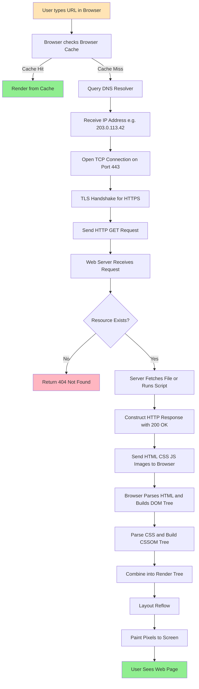
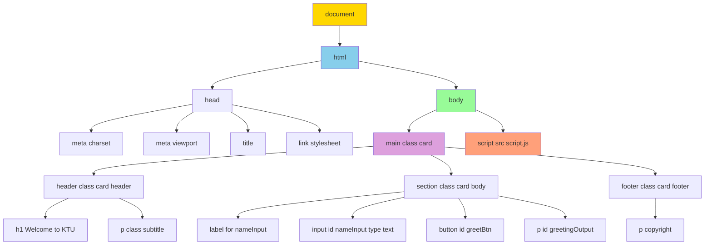
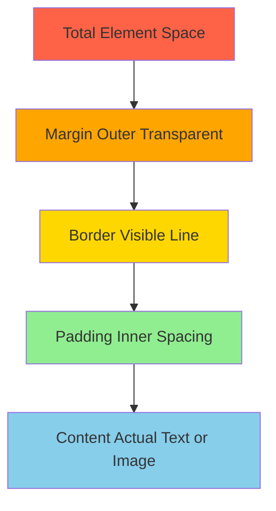
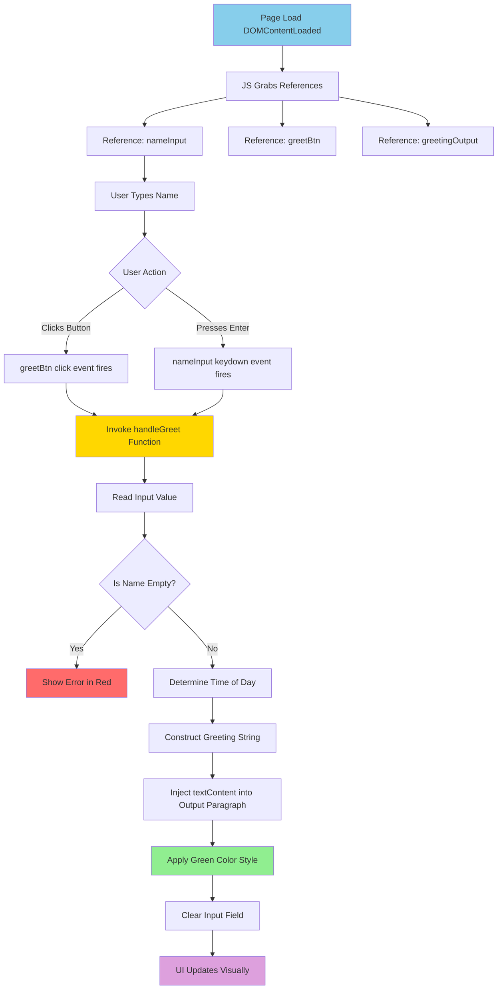
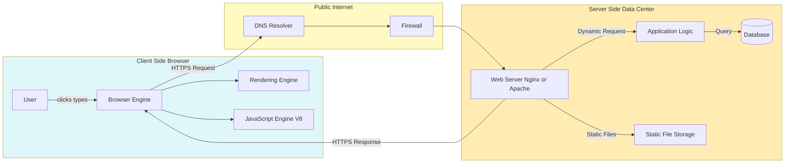
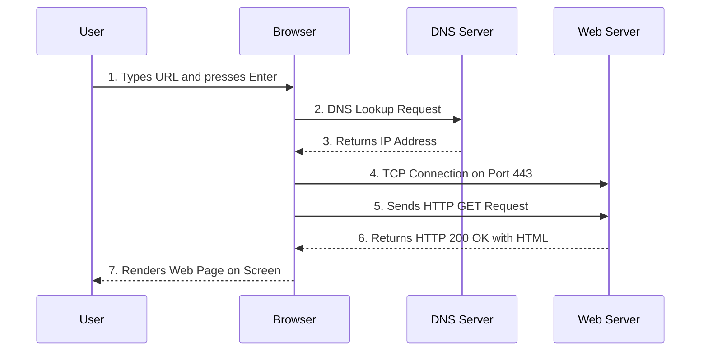
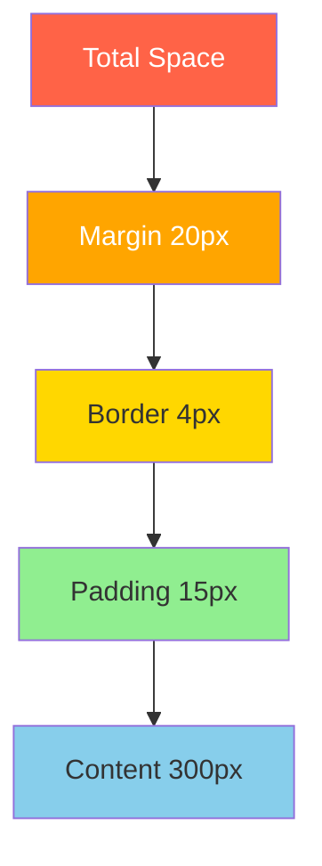

# Web Design (Basics of HTML, CSS, and JavaScript) – Understanding the web content delivery

<!-- SECTION_1_START -->
# Foundations of Web Design: HTML, CSS & JavaScript — Understanding Web Content Delivery

> [!IMPORTANT]
> **KTU 2024 Scheme | GXEST203 | Module 4**
> This module establishes the **core building blocks** of the modern web. Every web page you see — from Google to KTU's student portal — is constructed using exactly three foundational technologies: **HTML** for structure, **CSS** for presentation, and **JavaScript** for behavior.

## 1.1 What is Web Design?

**Web Design** is the process of **planning, conceptualizing, and arranging content** intended for the Internet. It encompasses the creation of digital environments that facilitate user interaction, deliver information, and provide services through web browsers.

In the context of the **KTU 2024 Scheme (GXEST203)**, web design refers specifically to the **front-end (client-side)** layer of web development — the part of a website that the user directly sees and interacts with inside a browser such as Chrome, Firefox, or Edge.

## 1.2 The Three Pillars of Front-End Web Design

> [!NOTE]
> **Core Definition — The Trinity of the Web**
> The World Wide Web Consortium (**W3C**) defines the three mandatory technologies any front-end developer must master:
> 1. **HTML (HyperText Markup Language)** — The *skeleton* / structural layer
> 2. **CSS (Cascading Style Sheets)** — The *skin* / presentation layer
> 3. **JavaScript (ECMAScript)** — The *muscles & nerves* / behavior layer

### (a) HTML — The Structural Backbone
**HTML** is a **markup language** used to define the **meaning and structure** of web content. It uses *tags* (e.g., `<h1>`, `<p>`, ``) to wrap raw text, images, and multimedia, turning a plain document into a semantically meaningful web page.

### (b) CSS — The Visual Stylist
**CSS** is a **style sheet language** used to describe the **presentation** of an HTML document. It controls colors, fonts, spacing, layouts, animations, and even responsive design for mobile devices.

### (c) JavaScript — The Interactive Engine
**JavaScript (JS)** is a **high-level, interpreted, dynamically-typed scripting language** that enables **interactivity**, **dynamic content updates**, **form validation**, and **asynchronous communication** with servers (via `fetch` / `AJAX`).

## 1.3 What is Web Content Delivery?

**Web Content Delivery** is the **end-to-end process** by which digital content (HTML files, CSS stylesheets, JavaScript code, images, videos) is **transmitted, processed, and rendered** from a *web server* (origin) to a *web client* (browser) over a network (typically the Internet).

> [!IMPORTANT]
> **Key Insight for KTU Students:**
> Web content delivery is **NOT** the same as web design. Web design is the *creation* of the content; web content delivery is the *transport* and *rendering* of that content. Together, they form the complete web experience.

## 1.4 Conceptual Analogy: The Restaurant Kitchen

Imagine a web page as a **meal served at a restaurant**:

| Web Concept | Restaurant Analogy |
|-------------|-------------------|
| **Web Browser** (Chrome, Firefox) | The **Diner's Table** — where the final meal is presented and consumed |
| **HTML** | The **Recipe / Plate Structure** — defines *what* ingredients are present (main course, side, drink) |
| **CSS** | The **Garnish & Plating** — defines *how* the meal *looks* (colors, arrangement, presentation) |
| **JavaScript** | The **Waiter** — brings in *new* dishes on demand, takes requests, and adds interactivity |
| **Web Server** (Apache, Nginx) | The **Kitchen** — where the meal is *prepared* and dispatched |
| **HTTP Protocol** | The **Order Ticket System** — the standardized *language* used to communicate orders |
| **DNS (Domain Name System)** | The **Restaurant Directory** — translates a *name* ("Pizza Hut") into a *location* (an IP address) |
| **CDN (Content Delivery Network)** | The **Chain of Local Outlets** — serves cached meals from the *nearest* branch for speed |

Just as a diner never sees the kitchen, **a user never directly touches the web server** — all communication happens *through* the browser, following strict **HTTP** rules.

## 1.5 The HTTP Request-Response Cycle (At a Glance)

> [!NOTE]
> **The 5-Step Web Delivery Loop:**
> 1. **User Action** — User types a URL (`https://www.ktu.edu.in`) in the browser and presses *Enter*.
> 2. **DNS Resolution** — The browser contacts a **Domain Name System (DNS)** server to translate the human-readable domain name into a machine-readable **IP address** (e.g., `203.0.113.42`).
> 3. **HTTP Request** — The browser sends an **HTTP (HyperText Transfer Protocol)** `GET` request to the server at that IP address.
> 4. **Server Processing** — The server locates the requested resource (HTML file, image, etc.) and constructs an **HTTP Response**.
> 5. **Rendering** — The browser receives the response (typically a `200 OK` status with HTML), parses it, fetches linked CSS/JS, builds the **DOM tree**, and paints pixels on the screen.

## 1.6 Quick Visualization: Anatomy of a URL

A **Uniform Resource Locator (URL)** uniquely identifies every resource on the web. Understanding its anatomy is a high-yield KTU topic.

$$
\text{URL} = \underbrace{\text{https}}_{\text{Scheme/Protocol}} :// \underbrace{\text{www.ktu.edu.in}}_{\text{Domain Name}} / \underbrace{\text{syllabus}}_{\text{Path}} \; \underbrace{\text{?id=2024}}_{\text{Query String}}
$$

> [!TIP]
> **KTU Exam Tip:** Always be ready to label parts of a URL: *scheme*, *subdomain*, *domain*, *top-level domain (TLD)*, *path*, and *query parameters*.

<!-- SECTION_1_END -->

<!-- SECTION_2_START -->
# Deep Theoretical Analysis & KTU High-Yield Cheat Sheet

## 2.1 The Web Architecture Stack

The modern web operates on a **multi-tier client-server architecture**. The browser (client) and the web server communicate using a *stateless* request-response protocol called **HTTP / HTTPS**.

> [!IMPORTANT]
> **HTTPS vs HTTP:** *HTTPS* is HTTP layered on top of **TLS/SSL (Transport Layer Security)**, which encrypts all traffic. Modern browsers flag non-HTTPS sites as "Not Secure".

### 2.1.1 Roles in the Architecture

- **Client (Browser):** Initiates requests. Examples: Chrome, Safari, Edge, Firefox.
- **Web Server:** Listens for HTTP requests on **port 80** (or **port 443** for HTTPS). Software: Apache, Nginx, IIS.
- **Application Server:** Executes backend logic (e.g., Python/Django, Node.js, PHP) — *out of scope for GXEST203*.
- **Database Server:** Stores persistent data — *out of scope for GXEST203*.

### 2.1.2 The HTTP Verbs (Methods)

| Method | Purpose | Idempotent? | Body? |
|--------|---------|-------------|-------|
| `GET` | Retrieve a resource | **Yes** | No |
| `POST` | Create a new resource / submit form | No | **Yes** |
| `PUT` | Replace a resource entirely | **Yes** | **Yes** |
| `PATCH` | Partially update a resource | No | **Yes** |
| `DELETE` | Remove a resource | **Yes** | No |

> [!NOTE]
> **Definition — Idempotent:** An operation is *idempotent* if performing it multiple times produces the same result as performing it once. `GET` and `PUT` are idempotent; `POST` is not.

## 2.2 HTML — In-Depth Structural Theory

### 2.2.1 Anatomy of an HTML Document

An HTML file is a **plain text file** with a `.html` (or `.htm`) extension. The browser reads it **top-to-bottom** and builds an in-memory tree called the **DOM (Document Object Model)**.

> [!IMPORTANT]
> **Boilerplate Skeleton (Mandatory for every HTML5 page):**
> Every modern HTML5 document begins with the `<!DOCTYPE html>` declaration, which tells the browser to render the page in **Standards Mode**.

### 2.2.2 HTML Elements, Tags & Attributes

- **Element** = Opening tag + Content + Closing tag (e.g., `<p>Hello</p>`)
- **Void (Self-closing) Elements** = No closing tag (e.g., `<br>`, ``, `<hr>`, `<meta>`)
- **Attributes** = Name-value pairs inside the opening tag that provide *metadata* (e.g., `<a href="https://ktu.edu.in" target="_blank">Visit</a>`)

### 2.2.3 Block vs Inline Elements

- **Block-level elements** start on a new line and take the full available width (e.g., `<div>`, `<h1>`–`<h6>`, `<p>`, `<ul>`, `<section>`).
- **Inline elements** flow within a line of text (e.g., `<span>`, `<a>`, `<strong>`, `<em>`, ``).

### 2.2.4 Semantic HTML5 Elements

HTML5 introduced **semantic tags** that describe the *meaning* of content (not just appearance). These improve **accessibility** and **SEO (Search Engine Optimization)**.

| Semantic Tag | Purpose |
|--------------|---------|
| `<header>` | Introductory or navigation content |
| `<nav>` | Major navigation links |
| `<main>` | Dominant content of the page (only one per page) |
| `<article>` | Self-contained, independent content |
| `<section>` | Thematic grouping of content |
| `<aside>` | Tangentially related content (sidebars) |
| `<footer>` | Closing content (copyright, contact) |

## 2.3 CSS — In-Depth Stylistic Theory

### 2.3.1 The Three Ways to Apply CSS

| Method | Syntax Pattern | Specificity Weight | Best Use Case |
|--------|---------------|--------------------|---------------|
| **Inline** | `<p style="color:red;">` | **1000** (highest) | Quick overrides, dynamic JS |
| **Internal** | `<style> p {color:red;} </style>` inside `<head>` | **010** | Single-page styles |
| **External** | `<link rel="stylesheet" href="style.css">` | **010** | Multi-page projects (best practice) |

### 2.3.2 CSS Selectors — The Targeting Engine

CSS uses *selectors* to target HTML elements. **Specificity** determines which rule wins when multiple rules conflict.

> [!IMPORTANT]
> **Specificity Hierarchy (Low → High):**
> Universal (`*`) = (0,0,0) < Element (`p`) = (0,0,1) < Class (`.btn`) = (0,1,0) < ID (`#header`) = (1,0,0) < Inline `style=""` = (1,0,0,0)

### 2.3.3 The CSS Box Model (Crucial Concept)

> [!NOTE]
> **Definition — Box Model:** Every HTML element is treated as a rectangular **box** with four concentric layers, from innermost to outermost: **Content → Padding → Border → Margin**.

$$
\text{Total Element Width} \;=\; \text{Width} + 2 \cdot \text{Padding} + 2 \cdot \text{Border} + 2 \cdot \text{Margin}
$$

> [!TIP]
> The CSS property `box-sizing: border-box;` makes the *border* and *padding* be included *inside* the declared `width`, which is a modern best practice.

## 2.4 JavaScript — In-Depth Behavioral Theory

### 2.4.1 JavaScript Execution Environment

JavaScript runs **inside the browser's JavaScript engine** (Chrome's **V8**, Firefox's **SpiderMonkey**, Safari's **JavaScriptCore**). It can manipulate HTML, CSS, communicate with servers, store data locally, and even draw graphics (`<canvas>`).

### 2.4.2 The DOM and JS Interaction

The browser builds a **tree of JS objects** representing every element on the page. JavaScript uses APIs like `document.getElementById()` and `document.querySelector()` to find and modify these objects in real-time.

### 2.4.3 Event-Driven Programming

JavaScript does not run linearly from top to bottom. It waits for **events** (clicks, keypresses, page loads, network responses) and runs attached **event handlers** (also called *callback functions*).

> [!IMPORTANT]
> **Common Event Types:**
> `click`, `mouseover`, `mouseout`, `keydown`, `keyup`, `submit`, `load`, `scroll`, `change`, `focus`, `blur`.

## 2.5 Content Delivery — The Complete Flow

### 2.5.1 Critical Path Rendering

When a browser receives an HTML file, it executes a precise pipeline:

1. **Parsing HTML** → Build the **DOM Tree**
2. **Parsing CSS** → Build the **CSSOM (CSS Object Model) Tree**
3. **Combining** DOM + CSSOM → **Render Tree**
4. **Layout / Reflow** → Calculate exact pixel coordinates
5. **Paint** → Fill in pixels on the screen
6. **Composite** → Combine layers (GPU-accelerated)

> [!NOTE]
> **Real-world relevance:** Production engineers optimize each stage. *Minifying* CSS/JS speeds up step 1–2; *lazy-loading* images speeds up step 4–5; using `transform` triggers only step 6 (cheapest).

### 2.5.2 Web Hosting & CDNs

- **Web Hosting:** Renting space on a server connected to the Internet 24/7.
- **CDN (Content Delivery Network):** A globally distributed network of servers that cache static assets (CSS, JS, images) *closer* to the user, reducing latency dramatically.

## 2.6 KTU High-Yield Cheat Sheet (Cheat Table)

> [!IMPORTANT]
> The following table is your **last-minute revision sheet** for Module 4. Memorize the syntax forms and definitions.

| Concept | Symbol / Syntax | Definition / Example |
|---------|----------------|----------------------|
| HTML Tag | `<tagname> ... </tagname>` | Wraps content to give it meaning |
| Void Element | `<br>`, `` | Self-closing, no content |
| Attribute | `name="value"` | Provides metadata to a tag |
| Anchor | `<a href="url">Text</a>` | Creates a hyperlink |
| Image | `` | Embeds an image; `alt` is mandatory |
| Ordered List | `<ol><li>...</li></ol>` | Numbered list |
| Unordered List | `<ul><li>...</li></ul>` | Bulleted list |
| Table | `<table><tr><td>...</td></tr></table>` | Tabular data |
| Form | `<form action="/submit" method="post">` | Collects user input |
| Input | `<input type="text" name="email">` | Single-line text field |
| CSS Selector (Class) | `.myClass { color: red; }` | Selects all elements with `class="myClass"` |
| CSS Selector (ID) | `#myId { color: blue; }` | Selects the single element with `id="myId"` |
| CSS Pseudo-class | `a:hover { color: green; }` | Style on mouse hover |
| JS Variable | `let x = 10;` | Block-scoped, mutable |
| JS Constant | `const PI = 3.14;` | Block-scoped, immutable binding |
| JS Function | `function greet(name) { ... }` | Reusable code block |
| JS Arrow Function | `const greet = (name) => "Hi " + name;` | Concise ES6 syntax |
| DOM Selector | `document.getElementById("id")` | Returns one Element |
| Event Listener | `btn.addEventListener("click", handler)` | Attaches a function to an event |
| HTTP Method | `GET`, `POST`, `PUT`, `DELETE` | Defines the *verb* of the request |
| Status Code 200 | — | **OK** (Success) |
| Status Code 404 | — | **Not Found** (Client error) |
| Status Code 500 | — | **Internal Server Error** |
| Port 80 | — | Default for **HTTP** |
| Port 443 | — | Default for **HTTPS** |

> [!TIP]
> **Engineering Relevance:** This trio (HTML/CSS/JS) powers every website globally. Frameworks like **React, Angular, and Vue.js** are essentially *advanced JavaScript* that *generate* HTML and *apply* CSS dynamically. Mastering these basics is non-negotiable for any software engineer.

<!-- SECTION_2_END -->

<!-- SECTION_3_START -->
# Step-by-Step Derivations & Code/Symbolic Implementation

## 3.1 Exhaustive Walkthrough: A Complete Web Page with HTML + CSS + JavaScript

Below we build a **fully functional interactive web page** step by step. Every line is explained — nothing is skipped.

### 3.1.1 The Final Goal

We will create a single-page **Student Greeting Application** that:
1. Displays a styled welcome card (HTML + CSS).
2. Accepts the student's name in an input field.
3. Greets the student dynamically on button click (JavaScript DOM manipulation).

### 3.1.2 Step 1 — The HTML Skeleton (file: `index.html`)

```html
<!DOCTYPE html>
<html lang="en">
<head>
    <meta charset="UTF-8">
    <meta name="viewport" content="width=device-width, initial-scale=1.0">
    <title>KTU Student Greeting Portal</title>
    <link rel="stylesheet" href="style.css">
</head>
<body>
    <main class="card">
        <header class="card-header">
            <h1>Welcome to KTU</h1>
            <p class="subtitle">GXEST203 — Foundations of Computing</p>
        </header>

        <section class="card-body">
            <label for="nameInput">Enter Your Name:</label>
            <input type="text" id="nameInput" placeholder="e.g. Anjali S.">

            <button id="greetBtn" type="button">Greet Me</button>

            <p id="greetingOutput" class="output-text">
                Your personalized greeting will appear here.
            </p>
        </section>

        <footer class="card-footer">
            <p>&copy; 2024 KTU B.Tech (2024 Scheme)</p>
        </footer>
    </main>

    <script src="script.js"></script>
</body>
</html>
```

**Detailed Code Explanation:**

| Line / Block | Purpose |
|--------------|---------|
| `<!DOCTYPE html>` | Declares the document as **HTML5**; triggers *Standards Mode* rendering |
| `<html lang="en">` | Root element; `lang` attribute helps screen readers & search engines |
| `<meta charset="UTF-8">` | Sets character encoding to **UTF-8** (supports all global languages) |
| `<meta name="viewport" ...>` | **Critical for mobile responsiveness** — controls the page's width on devices |
| `<title>...</title>` | Text shown on the browser tab |
| `<link rel="stylesheet" href="style.css">` | **External CSS** — best practice for multi-file projects |
| `<main class="card">` | Semantic HTML5 element wrapping the *primary* content |
| `<input type="text" id="nameInput">` | A void element creating a single-line text field |
| `<button id="greetBtn" type="button">` | A clickable button (note `type="button"` to prevent form submission) |
| `<p id="greetingOutput">` | An empty paragraph that JavaScript will *inject* text into |
| `<script src="script.js">` | Placed at end of `<body>` so HTML parses **before** JS executes |

### 3.1.3 Step 2 — The CSS Stylesheet (file: `style.css`)

```css
/* === CSS Reset & Base === */
* {
    margin: 0;
    padding: 0;
    box-sizing: border-box;   /* makes the box model predictable */
    font-family: 'Segoe UI', Tahoma, sans-serif;
}

body {
    min-height: 100vh;
    display: flex;
    justify-content: center;
    align-items: center;
    background: linear-gradient(135deg, #667eea, #764ba2);
}

/* === Card Container === */
.card {
    background: #ffffff;
    width: 90%;
    max-width: 480px;
    padding: 2rem;
    border-radius: 12px;
    box-shadow: 0 10px 25px rgba(0, 0, 0, 0.2);
}

.card-header {
    text-align: center;
    border-bottom: 2px solid #f0f0f0;
    padding-bottom: 1rem;
    margin-bottom: 1.5rem;
}

.card-header h1 {
    color: #2c3e50;
    font-size: 1.8rem;
}

.subtitle {
    color: #7f8c8d;
    font-size: 0.9rem;
    margin-top: 0.3rem;
}

/* === Form Elements === */
label {
    display: block;
    margin-bottom: 0.5rem;
    color: #34495e;
    font-weight: 600;
}

input[type="text"] {
    width: 100%;
    padding: 0.6rem;
    border: 2px solid #bdc3c7;
    border-radius: 6px;
    font-size: 1rem;
    margin-bottom: 1rem;
    transition: border-color 0.3s ease;
}

input[type="text"]:focus {
    border-color: #667eea;
    outline: none;
}

#greetBtn {
    width: 100%;
    padding: 0.7rem;
    background-color: #667eea;
    color: white;
    border: none;
    border-radius: 6px;
    font-size: 1rem;
    font-weight: 600;
    cursor: pointer;
    transition: background-color 0.3s ease;
}

#greetBtn:hover {
    background-color: #5568d3;
}

#greetBtn:active {
    background-color: #4451b8;
}

/* === Output Area === */
.output-text {
    margin-top: 1.5rem;
    padding: 1rem;
    background-color: #ecf0f1;
    border-left: 4px solid #667eea;
    border-radius: 4px;
    color: #2c3e50;
    min-height: 1.5rem;
}

.card-footer {
    text-align: center;
    margin-top: 1.5rem;
    font-size: 0.8rem;
    color: #95a5a6;
}
```

**Detailed Code Explanation:**

| CSS Rule | Purpose |
|----------|---------|
| `* { box-sizing: border-box; }` | **Universal selector** — applies to every element; sets predictable sizing |
| `display: flex; justify-content: center;` | **Centers the card** horizontally and vertically on screen |
| `linear-gradient(135deg, ...)` | Creates a **135-degree diagonal gradient background** |
| `max-width: 480px;` | **Responsive design** — caps width on large screens, allows shrinkage on mobile |
| `transition: border-color 0.3s ease;` | **Smooth animation** when the input border color changes |
| `:focus` | **Pseudo-class** — styles the element when it has keyboard focus |
| `:hover` | **Pseudo-class** — styles the button when the mouse is over it |
| `:active` | **Pseudo-class** — styles the button at the moment of click |
| `border-left: 4px solid ...;` | Decorative left border (a common UI accent) on the output paragraph |

### 3.1.4 Step 3 — The JavaScript Behavior (file: `script.js`)

```javascript
// === Step 1: Wait for the DOM to be fully loaded ===
document.addEventListener("DOMContentLoaded", function () {

    // === Step 2: Get references to the HTML elements ===
    const nameInput = document.getElementById("nameInput");
    const greetBtn = document.getElementById("greetBtn");
    const greetingOutput = document.getElementById("greetingOutput");

    // === Step 3: Define the click handler function ===
    function handleGreet() {
        // 3a. Read the value from the input field
        const rawName = nameInput.value;

        // 3b. Trim whitespace and validate
        const cleanName = rawName.trim();

        // 3c. Branch on validity
        if (cleanName.length === 0) {
            greetingOutput.textContent = "Please enter your name to receive a greeting.";
            greetingOutput.style.color = "#e74c3c";  // red
            return; // stop further execution
        }

        // 3d. Build the personalized greeting
        const hours = new Date().getHours();
        let timeOfDay;

        if (hours < 12) {
            timeOfDay = "Good Morning";
        } else if (hours < 17) {
            timeOfDay = "Good Afternoon";
        } else {
            timeOfDay = "Good Evening";
        }

        const message = `${timeOfDay}, ${cleanName}! Welcome to KTU's Foundations of Computing module.`;

        // 3e. Inject the message into the DOM
        greetingOutput.textContent = message;
        greetingOutput.style.color = "#27ae60";  // green

        // 3f. Clear the input field
        nameInput.value = "";
    }

    // === Step 4: Attach the handler to the button's click event ===
    greetBtn.addEventListener("click", handleGreet);

    // === Step 5: Bonus — also trigger on Enter key inside the input ===
    nameInput.addEventListener("keydown", function (event) {
        if (event.key === "Enter") {
            handleGreet();
        }
    });
});
```

**Detailed Code Explanation:**

| Code Section | Purpose |
|--------------|---------|
| `document.addEventListener("DOMContentLoaded", ...)` | **Defensive practice** — ensures the HTML is fully parsed *before* JS tries to find elements. Without this, `getElementById` may return `null` |
| `document.getElementById("nameInput")` | **DOM API** — returns the HTMLInputElement object (or `null` if not found) |
| `nameInput.value` | **Property access** — reads the current text typed by the user |
| `rawName.trim()` | **String method** — removes leading/trailing whitespace (e.g., accidental spaces) |
| `cleanName.length === 0` | **Input validation** — prevents empty/invalid submissions |
| `new Date().getHours()` | **Built-in Date API** — returns the current hour (0–23) |
| **Template literal** `` `${timeOfDay}, ${cleanName}!` `` | **ES6 feature** — cleaner than string concatenation with `+` |
| `greetingOutput.textContent = ...` | **DOM mutation** — safely sets text (avoids XSS unlike `innerHTML`) |
| `greetBtn.addEventListener("click", handleGreet)` | **Event binding** — note we pass the *function reference*, not `handleGreet()` (which would execute it immediately) |
| `event.key === "Enter"` | **Keyboard event handling** — improves UX by allowing Enter-key submission |

## 3.2 Mathematical Verification of the Box Model

To prove the box-model equation, consider a CSS rule:

```css
.demo-box {
    width: 200px;
    padding: 20px;
    border: 5px solid black;
    margin: 10px;
}
```

The total horizontal space occupied becomes:

$$
\begin{aligned}
\text{Total Width} &= \text{Width} + 2(\text{Padding}) + 2(\text{Border}) + 2(\text{Margin}) \\
&= 200 + 2(20) + 2(5) + 2(10) \\
&= 200 + 40 + 10 + 20 \\
&= 270 \;\text{px}
\end{aligned}
$$

> [!NOTE]
> **Conversion logic:** Each horizontal layer (left & right) is counted twice because box-model properties apply to *both* sides. The same principle applies vertically.

## 3.3 The HTTP Request-Response Cycle — Symbolic Walkthrough

When a user navigates to `https://ktu.edu.in/index.html`, the following *symbolic* exchange occurs on the wire:

**Step 1 — DNS Resolution**
$$
\texttt{www.ktu.edu.in} \xrightarrow{\text{DNS Lookup}} \texttt{203.0.113.42}
$$

**Step 2 — TCP Handshake (Three-Way)**
$$
\text{Client} \xrightarrow{\text{SYN}} \text{Server} \xrightarrow{\text{SYN-ACK}} \text{Client} \xrightarrow{\text{ACK}} \text{Server}
$$

**Step 3 — HTTP Request Sent**
```http
GET /index.html HTTP/1.1
Host: www.ktu.edu.in
User-Agent: Mozilla/5.0 (Windows NT 10.0; Win64; x64)
Accept: text/html,application/xhtml+xml
Connection: keep-alive
```

**Step 4 — HTTP Response Received**
```http
HTTP/1.1 200 OK
Content-Type: text/html; charset=UTF-8
Content-Length: 1423
Date: Mon, 21 Oct 2024 10:30:00 GMT
Server: Apache/2.4.57

<!DOCTYPE html>
<html>... (HTML body) ...</html>
```

**Step 5 — Browser Parses & Renders**
The browser invokes the rendering pipeline described in Section 2.5.1 (DOM → CSSOM → Render Tree → Layout → Paint → Composite).

<!-- SECTION_3_END -->

<!-- SECTION_4_START -->
# Structural Diagrams & Schematics

## 4.1 Diagram 1 — End-to-End Web Content Delivery Flow



## 4.2 Diagram 2 — HTML DOM Tree Structure (of the index.html we built)



## 4.3 Diagram 3 — The CSS Box Model (Layered View)



> [!NOTE]
> **Reading the diagram:** The innermost box (blue) is the actual content. Moving outward: green = padding (breathing room), yellow = border (visible edge), orange = margin (space separating from siblings), red = the total space the element influences in the layout.

## 4.4 Diagram 4 — JavaScript Event Flow & DOM Manipulation



## 4.5 Diagram 5 — Client-Server Architecture Topology



<!-- SECTION_4_END -->

<!-- SECTION_5_START -->
# KTU 2024 Scheme Examination Question Bank & Topic Recap

> [!IMPORTANT]
> All questions below are aligned with the **KTU 2024 Scheme (GXEST203)** assessment pattern, **Revised Bloom's Taxonomy (RBT)** cognitive levels, and the **Course Outcomes (CO)** mapping.

---

## 5.1 Part A — Short Answer Questions (3 Marks Each)

### Question 1
**[KTU University Exam — July 2024 | CO1 | Remember]**
*List any six semantic HTML5 elements and state one specific purpose of each.*

**Model Answer (Valuation Key):**

> [!NOTE]
> **Mark Allocation — Definition component: 1 Mark; Listing with purpose: 2 Marks (0.5 per pair)**

| Semantic Tag | Purpose |
|--------------|---------|
| `<header>` | Contains introductory content or navigation links for a section |
| `<nav>` | Defines a major block of navigation links |
| `<main>` | Represents the dominant, unique content of the page (one per page) |
| `<article>` | Wraps a self-contained, independently distributable piece of content |
| `<section>` | Groups thematically related content, usually with a heading |
| `<aside>` | Contains content tangentially related to the main content (e.g., sidebars) |
| `<footer>` | Holds closing content like copyright, contact info, or related links |

**Self-Marking Insight:** Listing *only* the tag names without purpose = **0 marks** for the purpose component. The examiner expects a one-line role per tag.

---

### Question 2
**[KTU University Exam — Dec 2023 | CO2 | Understand]**
*Differentiate between HTML, CSS, and JavaScript with one-line definitions and a one-line example of use for each.*

**Model Answer (Valuation Key):**

> [!NOTE]
> **Mark Allocation — 1 mark per technology (definition + example combined)**

| Technology | Definition | Example Use |
|------------|------------|-------------|
| **HTML** (HyperText Markup Language) | The standard markup language that defines the *structure* and *meaning* of web content using tags. | `<h1>Welcome</h1>` — creates a top-level heading. |
| **CSS** (Cascading Style Sheets) | A style sheet language that controls the *presentation and layout* of HTML elements. | `p { color: blue; }` — makes all paragraphs blue. |
| **JavaScript** (ECMAScript) | A scripting language that adds *interactivity and dynamic behavior* to web pages. | `btn.onclick = () => alert("Hi!")` — shows a popup on click. |

---

## 5.2 Part B — Long Answer Questions (14 Marks Each)

> [!IMPORTANT]
> **KTU 2024 ESE Pattern:** Part B questions carry **14 marks**, typically split as **Part (a) = 7 marks** and **Part (b) = 7 marks**, with an **internal choice** between two full questions.

---

### Question A (14 Marks)

**[KTU University Exam — July 2024 | CO1, CO2 | Understand + Apply]**

#### Part (a) — 7 Marks
*Explain the architecture of the World Wide Web with a neatly labeled diagram of the HTTP request-response cycle. List the key HTTP methods with their primary use.*

#### Part (b) — 7 Marks
*Write the complete HTML5 code to create a "Course Registration Form" containing fields for Student Name (text), Email (email), Branch (dropdown: CSE, ECE, ME, CE), and a Submit button. Also write the external CSS to center the form on the page and apply a light-blue background.*

---

### Model Answer for Question A

#### Part (a) — Solution

**Architecture Explanation (4 Marks):**

> [!NOTE]
> **[Defining client-server model: 1 Mark; Listing components: 1 Mark; Explaining cycle: 1 Mark; Labeled diagram: 1 Mark]**

The World Wide Web operates on a **client-server architecture**:
- **Client:** The web browser (Chrome, Firefox, etc.) that the user directly interacts with.
- **Server:** A remote computer hosting web resources, listening on **port 80 (HTTP)** or **port 443 (HTTPS)**.
- **Protocol:** **HTTP (HyperText Transfer Protocol)** is the *stateless* request-response language used for communication.
- **DNS:** The **Domain Name System** translates human-readable domains (e.g., `ktu.edu.in`) into IP addresses (e.g., `203.0.113.42`).

**HTTP Request-Response Cycle (Labeled Diagram — 2 Marks):**



**Key HTTP Methods (1 Mark — list at least 4):**

| Method | Primary Use |
|--------|-------------|
| `GET` | Retrieve (read) a resource |
| `POST` | Submit data / create a resource |
| `PUT` | Replace a resource entirely |
| `DELETE` | Remove a resource |

---

#### Part (b) — Solution

**HTML Code (4 Marks):**

> [!NOTE]
> **[Form structure: 2 Marks; All 4 fields: 1 Mark; Semantic wrapping: 1 Mark]**

```html
<!DOCTYPE html>
<html lang="en">
<head>
    <meta charset="UTF-8">
    <title>Course Registration</title>
    <link rel="stylesheet" href="style.css">
</head>
<body>
    <form class="reg-form" action="/register" method="post">
        <h2>Course Registration</h2>

        <label for="studentName">Student Name:</label>
        <input type="text" id="studentName" name="studentName" required>

        <label for="email">Email:</label>
        <input type="email" id="email" name="email" required>

        <label for="branch">Branch:</label>
        <select id="branch" name="branch">
            <option value="cse">CSE</option>
            <option value="ece">ECE</option>
            <option value="me">ME</option>
            <option value="ce">CE</option>
        </select>

        <button type="submit">Register</button>
    </form>
</body>
</html>
```

**CSS Code (3 Marks):**

> [!NOTE]
> **[Flexbox centering: 1 Mark; Background color: 1 Mark; Form width/padding: 1 Mark]**

```css
body {
    min-height: 100vh;
    display: flex;
    justify-content: center;
    align-items: center;
    background-color: lightblue;
    font-family: Arial, sans-serif;
}

.reg-form {
    background: #ffffff;
    padding: 2rem;
    width: 100%;
    max-width: 400px;
    border-radius: 10px;
    box-shadow: 0 4px 12px rgba(0, 0, 0, 0.15);
    display: flex;
    flex-direction: column;
    gap: 0.5rem;
}

.reg-form button {
    margin-top: 1rem;
    padding: 0.6rem;
    background-color: #2196f3;
    color: white;
    border: none;
    border-radius: 5px;
    cursor: pointer;
    font-size: 1rem;
}
```

---

### Question B (14 Marks) — Internal Choice Alternative

**[KTU University Exam — Dec 2023 | CO3 | Apply + Analyze]**

#### Part (a) — 7 Marks
*Explain the CSS Box Model with a neatly labeled diagram. Compute the total width of a `<div>` element with the following CSS properties: `width: 300px; padding: 15px; border: 4px solid; margin: 20px;`.*

#### Part (b) — 7 Marks
*Write a JavaScript program that validates a login form. The form has two fields — username and password. On form submission, the script must (i) prevent the default form submission, (ii) check that both fields are non-empty, and (iii) display an alert "Login Successful" or an error message in red below the form accordingly.*

---

### Model Answer for Question B

#### Part (a) — Solution

**CSS Box Model Explanation (3 Marks):**

> [!NOTE]
> **[Naming all 4 layers: 1 Mark; Defining each: 1 Mark; Labeled diagram: 1 Mark]**

The **CSS Box Model** describes how every HTML element is rendered as a rectangular box composed of four concentric layers:

1. **Content:** The actual text, image, or media inside the element.
2. **Padding:** The transparent space *between* the content and the border.
3. **Border:** The visible line that wraps the padding and content.
4. **Margin:** The transparent space *outside* the border, separating the element from its neighbors.

**Labeled Diagram (1 Mark):**



**Numerical Computation (3 Marks):**

> [!NOTE]
> **[Formula: 1 Mark; Substitution: 1 Mark; Final answer: 1 Mark]**

$$
\begin{aligned}
\text{Total Width} &= \text{Width} + 2 \cdot \text{Padding} + 2 \cdot \text{Border} + 2 \cdot \text{Margin} \\
&= 300 + 2(15) + 2(4) + 2(20) \\
&= 300 + 30 + 8 + 40 \\
&= 378 \;\text{px}
\end{aligned}
$$

**Conversion logic:** Each of the horizontal layers (padding, border, margin) appears on *both* the left and right sides, hence multiplied by 2.

---

#### Part (b) — Solution

**HTML Form (1 Mark):**

```html
<form id="loginForm">
    <label for="username">Username:</label>
    <input type="text" id="username" name="username">

    <label for="password">Password:</label>
    <input type="password" id="password" name="password">

    <button type="submit">Login</button>
</form>
<p id="loginMsg"></p>
```

**JavaScript Validation (6 Marks):**

> [!NOTE]
> **[preventDefault: 1 Mark; Reading values: 1 Mark; Validation check: 2 Marks; Alert and red text: 2 Marks]**

```javascript
document.getElementById("loginForm").addEventListener("submit", function (event) {
    // Step 1: Prevent the default form submission
    event.preventDefault();

    // Step 2: Read the values from the input fields
    const username = document.getElementById("username").value.trim();
    const password = document.getElementById("password").value.trim();

    // Step 3: Reference the message display element
    const messageElement = document.getElementById("loginMsg");

    // Step 4: Validate that both fields are non-empty
    if (username === "" || password === "") {
        messageElement.textContent = "Error: Both username and password are required.";
        messageElement.style.color = "red";
        return;
    }

    // Step 5: If valid, show success alert and message
    alert("Login Successful");
    messageElement.textContent = "Welcome, " + username + "!";
    messageElement.style.color = "green";
});
```

**Detailed Code Explanation (Implicit Valuation Points):**

| Code Element | Why It Matters |
|--------------|----------------|
| `event.preventDefault()` | **Mandatory** — without it, the form would refresh the page and JS validation becomes invisible. |
| `.value.trim()` | **Defensive** — removes accidental whitespace; treats "  " as empty. |
| `if (username === "" || password === "")` | The **core validation** logic; missing this = 0 marks for validation. |
| `messageElement.style.color = "red"` | Explicitly fulfills the "error in red" requirement. |
| Returning inside `if` | **Control flow** — prevents the success block from running after an error. |

---

## 5.3 KTU Examiner's Valuation Warning & Common Pitfalls

> [!WARNING]
> **Where KTU Students Most Commonly Lose Marks in Web Design Questions:**
>
> 1. **Forgetting `<!DOCTYPE html>`** — Examiners often allocate a dedicated mark for the DOCTYPE declaration. Omitting it costs an easy mark.
> 2. **Not closing tags** — A frequent, fatal error. Every `<p>` needs a `</p>`, every `<div>` needs a `</div>`. Mismatched tags confuse the parser and the examiner.
> 3. **Writing `document.getElementById` in a `<script>` placed in `<head>`** — The script runs *before* the HTML body loads, so `getElementById` returns `null`. Use `DOMContentLoaded` or place the `<script>` at the end of `<body>`.
> 4. **Using `=` instead of `===` in JavaScript comparisons** — `==` does type coercion (e.g., `0 == ""` is `true`); `===` is the strict equality required for reliable validation.
> 5. **Forgetting `event.preventDefault()` in form validation** — Without it, the form will *submit* and reload, making the JS error message disappear instantly.
> 6. **Box Model calculation errors** — Students often forget to *multiply padding/border/margin by 2* (one for each side). Re-read the formula in Section 2.6 carefully.
> 7. **Inline JS inside HTML attributes** — `<button onclick="...">` is *not* best practice and may lose marks in questions asking for "best practice event handling". Use `addEventListener` instead.
> 8. **Confusing `<section>` with `<div>`** — Use semantic tags (`<section>`, `<article>`, `<header>`, `<footer>`) whenever they semantically fit; reserve `<div>` for purely visual containers.
> 9. **Hardcoding CSS colors in 5 places** — If a question asks to change the theme color, you'll lose marks if you haven't used **CSS custom properties** (`--primary-color`). Use `:root { --primary: #667eea; }` and `var(--primary)` everywhere.
> 10. **No `alt` attribute on `` tags** — Modern web standards *require* `alt` text for accessibility. Examiners check this.

---

## 5.4 Topic Recap & Important Things to Remember

> [!IMPORTANT]
> **Module 4 — Rapid Revision Checklist (Print & Pin on Your Wall!):**

### 🔹 Web Fundamentals
- The web is a **client-server system** where browsers request resources and servers respond.
- **HTTP** is the protocol of the web; **HTTPS** is its encrypted successor (port **443**).
- **DNS** translates domain names to IP addresses.
- A **URL** uniquely identifies a resource and consists of *scheme*, *domain*, *path*, and optional *query string*.
- An **HTTP method** (`GET`, `POST`, `PUT`, `DELETE`) defines the *verb* of a request.

### 🔹 HTML — Structure
- HTML is a **markup language** (not a programming language) that uses *tags* to structure content.
- Every modern HTML5 page starts with `<!DOCTYPE html>`.
- **Semantic elements** (`<header>`, `<nav>`, `<main>`, `<article>`, `<section>`, `<aside>`, `<footer>`) describe the *meaning* of content.
- **Block-level** elements fill the full width; **inline** elements flow within text.
- **Void elements** (`<br>`, ``, `<hr>`, `<meta>`, `<input>`) have no closing tag.
- The `alt` attribute on `` is **mandatory** for accessibility.
- Forms use `<form>`, `<input>`, `<label>`, `<select>`, `<textarea>`, `<button>`.

### 🔹 CSS — Presentation
- CSS controls the *visual* appearance: colors, fonts, layout, animations.
- **Three ways** to apply CSS: **Inline** (highest specificity), **Internal** (`<style>`), **External** (`<link>`, best practice).
- **Specificity order:** `inline > ID > class > element > universal`.
- The **CSS Box Model** has 4 layers: **Content → Padding → Border → Margin** (apply the formula $\text{Width} + 2P + 2B + 2M$).
- Use `box-sizing: border-box;` for predictable sizing.
- **Pseudo-classes** (`:hover`, `:focus`, `:active`, `:nth-child()`) style elements in specific states.
- **Flexbox** (`display: flex`) is the modern way to align and distribute items.

### 🔹 JavaScript — Behavior
- JavaScript is a **high-level, interpreted, dynamically-typed** scripting language that runs inside the browser's **JS engine** (V8 in Chrome).
- The **DOM (Document Object Model)** is a tree of JS objects representing every HTML element.
- Use `document.getElementById()`, `document.querySelector()`, and `document.querySelectorAll()` to find elements.
- Use `element.textContent` (safe) or `element.innerHTML` (parses HTML, beware of XSS) to modify content.
- Use `element.style.property` to change inline CSS via JS.
- **Events** (`click`, `submit`, `keydown`, `mouseover`, `load`) drive interactivity; bind handlers with `addEventListener("event", function)`.
- **Always call `event.preventDefault()`** when handling form submission via JS.
- Wrap initialization code in `DOMContentLoaded` to ensure the HTML is parsed first.
- Use `===` (strict equality), not `==`, for predictable comparisons.
- Use **template literals** (backticks) for clean string interpolation: `` `Hello, ${name}!` ``.

### 🔹 The Three Layers at a Glance

| Layer | Language | Answers the Question... | Example |
|-------|----------|--------------------------|---------|
| Structure | **HTML** | *What* is on the page? | `<h1>Hello</h1>` |
| Presentation | **CSS** | *How* does it look? | `h1 { color: red; }` |
| Behavior | **JavaScript** | *What* happens on interaction? | `h1.onclick = () => alert("Hi")` |

### 🔹 Key Takeaway for GXEST203
Mastering **HTML, CSS, and JavaScript** is the **gateway skill** to every web technology — from static college websites to modern **React/Angular** single-page applications. The HTTP request-response cycle and the rendering pipeline (DOM → CSSOM → Render → Layout → Paint → Composite) are the *fundamental mental models* you will carry into every web project and every interview.

> [!TIP]
> **Final Exam Tip:** When asked to "explain" a concept, always include a **labeled diagram** (Mermaid or hand-drawn) and a **real-world analogy**. Examiners reward clarity of thought as much as technical accuracy.

<!-- SECTION_5_END -->
