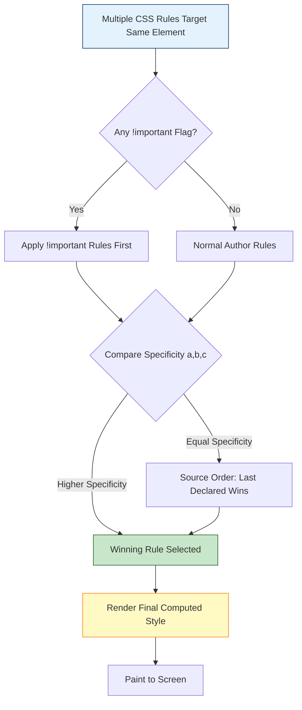
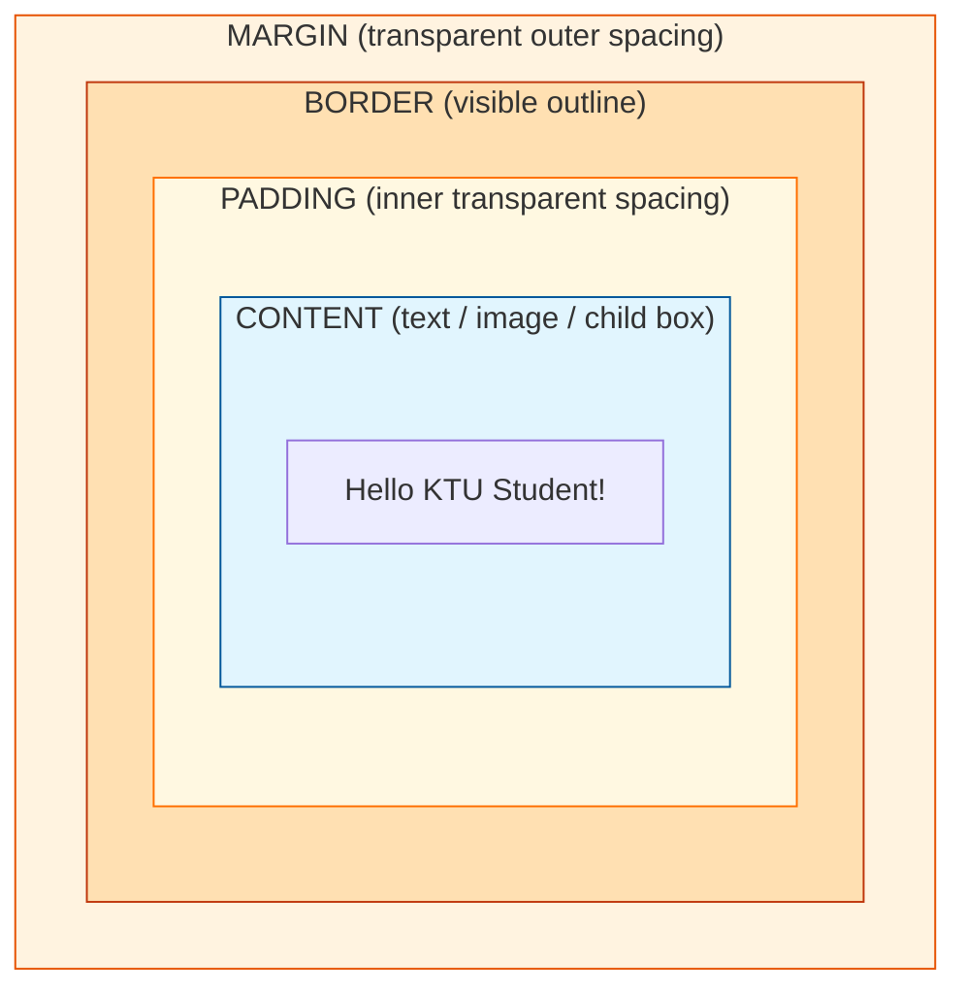
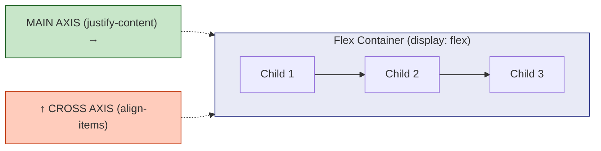
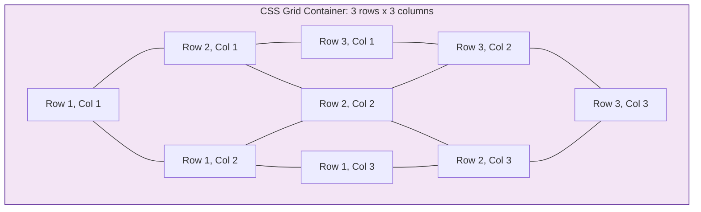
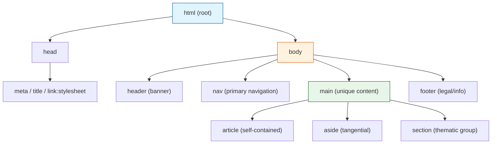

# Cascading Style Sheets (CSS) for semantic design and layouts

<!-- SECTION_1_START -->
# 1. Core Technical Definition & Intuitive Overview

## Formal Academic Definition (KTU 2024 Syllabus Terminology)

**Cascading Style Sheets (CSS)** is a declarative, style-sheet language used to describe the **presentation semantics** (look, formatting, layout, and visual behavior) of a document written in a markup language such as **HTML** or **XML (Extensible Markup Language)**. CSS is the cornerstone of the **W3C (World Wide Web Consortium)** standard separation-of-concerns paradigm, enabling a clean architectural division between **content (HTML)**, **presentation (CSS)**, and **behavior (JavaScript)**.

In the KTU 2024 Scheme context of *Web Design Fundamentals*, CSS is treated as the styling engine that converts a *semantic HTML skeleton* into a visually rich, responsive, and accessible user interface.

> [!IMPORTANT]
> **Syllabus Highlight — "Semantic Design"**
> Semantic design means using **HTML5 semantic elements** (`<header>`, `<nav>`, `<main>`, `<article>`, `<section>`, `<aside>`, `<footer>`) whose *meaning* describes their *role*, and then styling them through CSS so that the rendered page is both **machine-readable** (good for SEO, screen readers) and **visually structured**.

## Conceptual Analogy / Intuition

Think of a website as a **newly constructed house**:

| Web Component | House Analogy | Role |
|---------------|---------------|------|
| **HTML** | Bare brick walls, rooms, doors | The structural skeleton |
| **CSS** | Paint, wallpaper, tiles, lighting, furniture arrangement | The aesthetic finish & spatial organization |
| **JavaScript** | Electrical switches, smart-home sensors | The interactive behavior |

> [!NOTE]
> **Why "Cascading"?**
> The word *cascading* in CSS refers to the **priority resolution algorithm** — when multiple style rules target the same element, CSS evaluates them in a *cascade*: specificity → importance (`!important`) → source order → inheritance. Styles "flow down" like a waterfall until the final winning rule is applied to each property.

## Core Constants & Standard Metrics

- **W3C standard:** **CSS Level 4** (current recommendation track)
- **Box Model base unit:** **pixel (`px`)** is the canonical reference; **1 in = 96 px = 2.54 cm**
- **Default root font-size:** **16 px** in all major browsers
- **Color model baselines:** **RGB**, **HEX (`#RRGGBB`)**, **HSL (`Hue, Saturation, Lightness`)**, with **sRGB** as the default color space
- **Breakpoint conventions** (mobile-first):
  * $\le$ **640 px** → mobile
  * **641 – 1024 px** → tablet
  * $\ge$ **1025 px** → desktop

> [!TIP]
> **GeoGebra / Desmos Integration**
> Although CSS is not a plotted-function language, the **CSS Flexbox & Grid** coordinate system can be conceptualized on a 2D plane. Conceptual mapping:
> * `justify-content` ⇒ controls motion along the **x-axis (main axis)**
> * `align-items` ⇒ controls motion along the **y-axis (cross axis)**
>
> **Visual Description:** Picture a parent container as a bounding box on a coordinate grid. Its children sit at the origin $(0,0)$ by default; `justify-content: center` translates them to $(\frac{W-w}{2}, 0)$ where $W$ = container width, $w$ = child width.

<!-- SECTION_1_END -->

<!-- SECTION_2_START -->
# 2. Deep Theoretical Analysis & KTU High-Yield Formula Sheet

## 2.1 CSS Syntax Anatomy

A CSS rule is composed of three logical units:

$$
\underbrace{\text{selector}}_{\text{What to style}} \; \{ \; \underbrace{\text{property: value;}}_{\text{How to style}} \; \}
$$

### 2.1.1 Selector Taxonomy (Escalating Specificity)

| Selector Type | Syntax Example | Specificity Score (a, b, c) | Description |
|---------------|----------------|------------------------------|-------------|
| Universal | `*` | (0, 0, 0) | Matches every element |
| Type / Element | `p` | (0, 0, 1) | Matches by tag name |
| Class | `.card` | (0, 1, 0) | Matches by class attribute |
| ID | `#header` | (1, 0, 0) | Matches by `id` attribute |
| Inline `style=""` | — | (1, 0, 0, 0) | Beats any stylesheet rule |
| `!important` | `color: red !important;` | Overrides cascade | Last-resort override |

> [!NOTE]
> **Specificity Tie-Breaking Rule (Cascade Algorithm):**
> 1. Origin & importance (user-agent < user < author normal < author `!important` < user `!important` < user-agent `!important`).
> 2. Specificity — compare $(a, b, c)$ lexicographically.
> 3. Source order — the **last-declared** rule wins.

## 2.2 The CSS Box Model

Every HTML element is rendered as a **rectangular box** composed of four nested layers (from outermost inward):

$$
\text{Total Width} = \text{width} + 2 \times (\text{padding} + \text{border} + \text{margin})
$$

$$
\text{Total Height} = \text{height} + 2 \times (\text{padding} + \text{border} + \text{margin})
$$

The **`box-sizing`** property toggles between the legacy and modern interpretations:

* `box-sizing: content-box;` → **W3C legacy**: `width` applies *only* to content area.
* `box-sizing: border-box;` → **Modern / KTU recommended**: `width` includes content + padding + border.

## 2.3 Display Property Matrix

| Display Value | Line-Break Behavior | Width/Height Setters | Use Case |
|---------------|---------------------|----------------------|----------|
| `block` | Forces new line | Yes | `<div>`, `<p>`, headings |
| `inline` | Flows in text | Ignored (except `line-height`) | `<span>`, `<a>` |
| `inline-block` | Flows in text | Yes | Buttons, badges |
| `none` | Removed from flow | N/A | Modal hide |
| `flex` | Block-level container | Yes | One-dimensional layouts |
| `grid` | Block-level container | Yes | Two-dimensional layouts |

## 2.4 Positioning Schemes

| `position` Value | Reference Frame | In-Flow? | Stacking Context |
|------------------|-----------------|----------|------------------|
| `static` (default) | Normal flow | ✅ | No |
| `relative` | Self's static position | ✅ | Optional |
| `absolute` | Nearest positioned ancestor | ❌ | Yes |
| `fixed` | Viewport | ❌ | Yes |
| `sticky` | Nearest scroll container | Hybrid | Yes |

## 2.5 KTU Formula Sheet (Cheat Sheet)

| Concept | Equation / Rule | Unit / Notes |
|---------|-----------------|--------------|
| Box total width | $W_{total} = W + 2(P + B + M)$ | px, rem, em |
| Box total height | $H_{total} = H + 2(P + B + M)$ | px, rem, em |
| `em` to `px` | $1\;\text{em} = \text{parent\_font\_size}$ | Cascading |
| `rem` to `px` | $1\;\text{rem} = \text{root\_font\_size} = 16\;\text{px}$ | Default |
| `vw` / `vh` | $1\;\text{vw} = 1\%$ of viewport width | Responsive |
| Flex main-axis offset | $x_{child} = \frac{W_{container} - W_{child}}{2}$ | For `justify-content: center` |
| CSS Grid fr unit | $1\;\text{fr} = \frac{\text{free\_space}}{\sum \text{fr}}$ | Distributes leftover space |
| Specificity (a,b,c) | Inline > ID > Class > Type | Lexicographic |
| Color HEX $\to$ RGB | `$\#RRGGBB \to (R, G, B)$ base 16` | Per channel 0–255 |
| Opacity | $\alpha \in [0, 1]$ | 0 = transparent, 1 = opaque |
| Aspect ratio | $\frac{W}{H}$ preserved via `aspect-ratio: W/H` | Modern CSS |

## 2.6 Real-World Engineering Utility

* **Production UI/UX Engineering** — Tailwind CSS, Bootstrap 5, Material UI all compile down to vanilla CSS.
* **Single-Page Applications (SPA)** — React/Vue/Angular components ultimately emit inline or scoped CSS.
* **Responsive Web Design (RWD)** — A non-negotiable skill; **Google's mobile-first indexing** ranks pages by their mobile CSS rendering.
* **Accessibility (a11y)** — Semantic HTML + CSS controls visible focus, contrast ratios (WCAG **4.5:1** minimum for body text), and motion-reduction (`prefers-reduced-motion`).
* **Performance** — Critical CSS inlining and unused-CSS elimination are part of **Core Web Vitals (LCP, CLS, INP)** optimization.

<!-- SECTION_2_END -->

<!-- SECTION_3_START -->
# 3. Step-by-Step Derivations & Code Implementation

## 3.1 Semantic HTML Skeleton (Foundation for CSS Styling)

```html
<!DOCTYPE html>
<html lang="en">
<head>
  <meta charset="UTF-8" />
  <meta name="viewport" content="width=device-width, initial-scale=1.0" />
  <title>KTU Semantic Page Demo</title>
  <link rel="stylesheet" href="styles.css" />
</head>
<body>
  <header class="site-header">
    <h1>KTU Web Design Lab</h1>
    <nav class="primary-nav" aria-label="Primary">
      <ul>
        <li><a href="#home">Home</a></li>
        <li><a href="#about">About</a></li>
        <li><a href="#contact">Contact</a></li>
      </ul>
    </nav>
  </header>

  <main>
    <article class="post">
      <h2>Module 4: CSS Fundamentals</h2>
      <p>Understanding the cascade and box model.</p>
    </article>

    <aside class="sidebar">
      <h3>Related Links</h3>
    </aside>
  </main>

  <footer class="site-footer">
    <p>&copy; 2025 APJ AKTU University</p>
  </footer>
</body>
</html>
```

## 3.2 Exhaustive CSS Implementation

```css
/* ==========================================================
   1. RESET & GLOBAL VARIABLES (Design Tokens)
   ========================================================== */
:root {
  --color-primary: #003366;       /* KTU deep blue */
  --color-accent:  #ffb300;
  --color-text:    #1a1a1a;
  --color-bg:      #ffffff;
  --font-stack:    "Segoe UI", Roboto, "Helvetica Neue", Arial, sans-serif;
  --space-unit:    8px;
  --max-width:     1200px;
  --radius:        6px;
}

* { box-sizing: border-box; margin: 0; padding: 0; }

body {
  font-family: var(--font-stack);
  color: var(--color-text);
  background-color: var(--color-bg);
  line-height: 1.6;
}

/* ==========================================================
   2. SEMANTIC LAYOUT (Header / Nav / Main / Footer)
   ========================================================== */
.site-header {
  background-color: var(--color-primary);
  color: #fff;
  padding: calc(var(--space-unit) * 2);
  display: flex;                       /* Flexbox container */
  justify-content: space-between;     /* main-axis distribution */
  align-items: center;                 /* cross-axis alignment */
  flex-wrap: wrap;                     /* responsive wrap */
}

.primary-nav ul {
  display: flex;                       /* horizontal nav */
  gap: calc(var(--space-unit) * 2);
  list-style: none;
}

.primary-nav a {
  color: #fff;
  text-decoration: none;
  padding: calc(var(--space-unit) * 0.5) var(--space-unit);
  border-radius: var(--radius);
  transition: background-color 0.3s ease;   /* smooth transition */
}

.primary-nav a:hover,
.primary-nav a:focus {
  background-color: var(--color-accent);
  color: var(--color-text);
  outline: 2px solid #fff;            /* accessibility focus ring */
}

main {
  display: grid;                       /* CSS Grid container */
  grid-template-columns: 2fr 1fr;      /* 2-column responsive */
  gap: calc(var(--space-unit) * 3);
  max-width: var(--max-width);
  margin: calc(var(--space-unit) * 3) auto;
  padding: 0 calc(var(--space-unit) * 2);
}

.post {
  background: #f4f6f8;
  padding: calc(var(--space-unit) * 2);
  border-left: 4px solid var(--color-primary);
  border-radius: var(--radius);
}

.sidebar {
  background: #fffbea;
  padding: calc(var(--space-unit) * 2);
  border: 1px solid #e0d8b0;
  border-radius: var(--radius);
}

.site-footer {
  background: #222;
  color: #ccc;
  text-align: center;
  padding: calc(var(--space-unit) * 2);
  margin-top: calc(var(--space-unit) * 4);
}

/* ==========================================================
   3. RESPONSIVE BREAKPOINTS (Mobile-First)
   ========================================================== */
@media (max-width: 768px) {
  .site-header { flex-direction: column; }
  .primary-nav ul { flex-wrap: wrap; justify-content: center; }
  main { grid-template-columns: 1fr; }   /* collapse to 1 column */
}

@media (prefers-reduced-motion: reduce) {
  * { transition: none !important; animation: none !important; }
}
```

## 3.3 Box-Model Numerical Walk-Through (Board-Friendly Derivation)

**Problem:** Compute the *total horizontal space* occupied by a `<div>` styled as:
```css
.box {
  width: 200px;
  padding: 10px 20px;
  border: 5px solid #000;
  margin: 15px 30px;
  box-sizing: border-box;   /* or content-box */
}
```

### Case 1: `box-sizing: content-box;` (legacy)

$$
W_{total} = W + 2 \times (P_{LR} + B_{LR} + M_{LR})
$$

$$
W_{total} = 200 + 2 \times (20 + 5 + 30)
$$

$$
W_{total} = 200 + 2 \times 55 = 200 + 110 = \mathbf{310\ px}
$$

**[2 Marks]** — Stating the formula.
**[2 Marks]** — Substituting the values.
**[1 Mark]** — Final answer `310 px`.

### Case 2: `box-sizing: border-box;` (modern, KTU recommended)

The declared `width: 200px` now *already* includes content + padding + border.
Therefore:

$$
W_{total} = 200 + 2 \times M_{LR} = 200 + 2 \times 30 = \mathbf{260\ px}
$$

**[2 Marks]** — Identifying that `border-box` resets the formula.
**[2 Marks]** — Substituting margin only.
**[1 Mark]** — Final answer `260 px`.

> [!NOTE]
> **Valuation Tip:** Many students forget to **double** the left and right values. KTU examiners award *partial credit* only when the doubled/multiplied factor is explicitly shown.

## 3.4 CSS Grid 12-Column Layout (Production-Grade Implementation)

```css
.grid-12 {
  display: grid;
  grid-template-columns: repeat(12, 1fr);
  gap: 16px;
}
.col-4  { grid-column: span 4;  }   /* 1/3 width  */
.col-6  { grid-column: span 6;  }   /* 1/2 width  */
.col-12 { grid-column: span 12; }   /* full width */

@media (max-width: 768px) {
  .col-4, .col-6 { grid-column: span 12; }   /* mobile stack */
}
```

**Logic Walk-Through:**

1. The parent `.grid-12` defines 12 *fractional* (`fr`) columns.
2. Each `fr` unit receives an equal share of the *free space* (container width minus all `gap` widths).
3. The `gap: 16px` is subtracted first, then the remaining space is divided by 12.
4. Children with `grid-column: span N` consume $N$ consecutive tracks.

> [!TIP]
> **Engineering Insight:** The `1fr` unit was introduced in **CSS Grid Level 1 (2017)** and replaced the older float-based 12-column hacks. Modern front-end frameworks (Tailwind, Bootstrap 5) all leverage it.

## 3.5 Flexbox Centering Cheat-Sheet (Step-by-Step)

```css
/* Center a single child both horizontally & vertically */
.flex-center {
  display: flex;
  justify-content: center;   /* main-axis (default = x) */
  align-items: center;       /* cross-axis (default = y) */
  min-height: 100vh;
}
```

**Mathematical Justification:**
For a child of width $w$ inside a container of width $W$, when `justify-content: center` is set, CSS computes:

$$
x_{offset} = \frac{W - w - \text{gap}}{2}
$$

Where the child is translated to start at $x_{offset}$ from the left edge of the main axis.

<!-- SECTION_3_END -->

<!-- SECTION_4_START -->
# 4. Structural Diagrams & Schematics

## 4.1 The CSS Cascade Resolution Flow



## 4.2 CSS Box Model — Layered Architecture



## 4.3 Flexbox Main Axis vs Cross Axis Topology



## 4.4 CSS Grid 2D Layout Mapping



## 4.5 Semantic HTML Document Outline (Top-Down)



<!-- SECTION_4_END -->

<!-- SECTION_5_START -->
# 5. KTU 2024 Scheme Examination Question Bank & Topic Recap

---

## 📘 PART A — Short Answer Questions (3 Marks Each)

### **Q1.** [KTU University Exam — Dec 2023] [CO1 | Remember]
**Define the term "Cascading" in CSS. List any two advantages of using an external CSS file over inline styles.**

**Model Answer:**

> The term *"cascading"* in CSS refers to the algorithm used by browsers to resolve conflicts when **multiple style rules** target the same HTML element. The cascade follows a strict priority hierarchy: **specificity** → **`!important` flag** → **source order** → **inheritance**. The winning rule then "cascades" down to the element.
>
> **Two advantages of external CSS over inline styles:**
> 1. **Separation of Concerns:** Content (HTML) stays in `.html` files; presentation (CSS) lives in `.css` files, improving maintainability.
> 2. **Caching & Reusability:** A single external stylesheet is downloaded once and cached by the browser, reducing bandwidth and enabling **site-wide style consistency** with a single edit.

**[1 Mark]** — Definition of cascading.
**[1 Mark]** — First advantage.
**[1 Mark]** — Second advantage.

---

### **Q2.** [KTU University Exam — July 2024] [CO1 | Understand]
**Differentiate between `class` and `id` selectors in CSS with respect to specificity, reusability, and HTML usage.**

**Model Answer:**

| Criterion | `#id` Selector | `.class` Selector |
|-----------|----------------|-------------------|
| **HTML prefix** | `id="uniqueName"` (no `#` in HTML) | `class="card highlight"` (no `.` in HTML) |
| **Specificity** | **(1, 0, 0)** — higher | **(0, 1, 0)** — lower |
| **Reusability** | Must be **unique** per page | Can be applied to **multiple elements** |
| **JavaScript hook** | `document.getElementById()` | `document.querySelectorAll()` |
| **KTU best practice** | Reserve for **layout landmarks** | Use for **reusable style patterns** |

**[1 Mark]** — Specificity comparison.
**[1 Mark]** — Reusability.
**[1 Mark]** — HTML usage example.

---

## 📗 PART B — Long Answer Questions (14 Marks Each, with Internal Choice)

### **Question A (Module 4 Choice 1):** [KTU University Exam — Dec 2024 Model Paper] [CO2 | Apply / Analyze]

**(a)** Explain the **CSS Box Model** with a neat diagram. Compute the *total width* of a `div` element with the following styles:
```css
.box {
  width: 300px;
  padding: 20px;
  border: 5px solid black;
  margin: 15px;
  box-sizing: content-box;
}
```
**[7 Marks]**

**(b)** Write a complete HTML5 + CSS3 code snippet to create a **responsive three-column layout** that collapses to a single column on screens narrower than 768 px. Use **CSS Grid** with `repeat()` and `minmax()`. **[7 Marks]**

---

#### ✅ Model Solution — Part (a)

**Step 1 — Define the Box Model:** The CSS Box Model describes every element as four nested layers: **content → padding → border → margin**.

$$
W_{total} = W + 2 \times (P + B + M)
$$

**Step 2 — Substitute the values:**
Given $W = 300$, $P = 20$, $B = 5$, $M = 15$:

$$
W_{total} = 300 + 2 \times (20 + 5 + 15)
$$

$$
W_{total} = 300 + 2 \times 40 = 300 + 80
$$

$$
\boxed{W_{total} = 380 \text{ px}}
$$

**Valuation Key:**
* [Box model diagram: 2 Marks]
* [Formula statement: 1 Mark]
* [Substitution: 2 Marks]
* [Final answer `380 px`: 2 Marks]

---

#### ✅ Model Solution — Part (b)

**HTML5 Skeleton:**
```html
<!DOCTYPE html>
<html lang="en">
<head>
  <meta charset="UTF-8" />
  <meta name="viewport" content="width=device-width, initial-scale=1.0" />
  <title>Responsive 3-Column</title>
  <link rel="stylesheet" href="grid.css" />
</head>
<body>
  <div class="grid-container">
    <article class="card"><h2>Column 1</h2><p>Content A.</p></article>
    <article class="card"><h2>Column 2</h2><p>Content B.</p></article>
    <article class="card"><h2>Column 3</h2><p>Content C.</p></article>
  </div>
</body>
</html>
```

**CSS3 Stylesheet (`grid.css`):**
```css
* { box-sizing: border-box; margin: 0; padding: 0; }

.grid-container {
  display: grid;
  grid-template-columns: repeat(3, minmax(0, 1fr));
  gap: 20px;
  max-width: 1200px;
  margin: 40px auto;
  padding: 0 16px;
}

.card {
  background: #f4f6f8;
  padding: 24px;
  border-radius: 8px;
  border-left: 4px solid #003366;
}

/* Responsive: collapse to single column on tablets & mobiles */
@media (max-width: 768px) {
  .grid-container {
    grid-template-columns: 1fr;     /* one fluid column */
  }
}
```

**Step-by-Step Logic:**

1. `display: grid` activates the 2-D layout context on the container.
2. `repeat(3, minmax(0, 1fr))` declares **three equal-width tracks**, each allowed to shrink to `0` and grow to `1fr`.
3. `gap: 20px` inserts uniform spacing between tracks and rows.
4. The `@media (max-width: 768px)` rule **overrides** the track definition to a single `1fr` column.

**Valuation Key:**
* [Semantic HTML5 boilerplate: 2 Marks]
* [Grid `display` + `repeat()`: 2 Marks]
* [`minmax()` justification: 1 Mark]
* [Media query with correct breakpoint: 2 Marks]

---

### **Question B (Module 4 Choice 2):** [KTU University Exam — July 2024 Model Paper] [CO2 | Apply / Analyze]

**(a)** Explain the **CSS specificity** calculation with an example. What is the specificity of the selector `div#hero .card.active[data-role="banner"]`? **[7 Marks]**

**(b)** Write the complete CSS code (no HTML required) to:
1. Use **CSS variables** for a primary color `#003366` and accent color `#ffb300`.
2. Style a `<button>` with **rounded corners**, **smooth transition** on hover, and a **focus ring** for accessibility.
3. Apply a **media query** that switches the layout from `flex-direction: row` to `column` below 600 px. **[7 Marks]**

---

#### ✅ Model Solution — Part (a)

**Specificity is a 4-tuple $(a, b, c, d)$:**

| Component | Weight | Counts in |
|-----------|--------|-----------|
| Inline `style=""` | (1, 0, 0, 0) | $a$ |
| `#id` | (0, 1, 0, 0) | $b$ |
| `.class`, `[attr]`, `:pseudo-class` | (0, 0, 1, 0) | $c$ |
| `element`, `::pseudo-element` | (0, 0, 0, 1) | $d$ |

**Step-by-step count for `div#hero .card.active[data-role="banner"]`:**

| Token | Category | Count |
|-------|----------|-------|
| `div` | Type selector | $d = 1$ |
| `#hero` | ID selector | $b = 1$ |
| `.card` | Class | $c = 1$ |
| `.active` | Class | $c = 2$ |
| `[data-role="banner"]` | Attribute selector | $c = 3$ |

$$
\boxed{\text{Specificity} = (0,\; 1,\; 3,\; 1)}
$$

**Valuation Key:**
* [Specificity tuple definition: 2 Marks]
* [Token-by-token counting: 3 Marks]
* [Final tuple: 2 Marks]

---

#### ✅ Model Solution — Part (b)

```css
/* ---- 1. CSS Custom Properties (Variables) ---- */
:root {
  --color-primary: #003366;
  --color-accent:  #ffb300;
  --radius:        8px;
  --space:         12px;
}

/* ---- 2. Styled <button> with accessibility ---- */
.btn {
  background-color: var(--color-primary);
  color: #ffffff;
  border: 2px solid transparent;
  border-radius: var(--radius);
  padding: var(--space) calc(var(--space) * 2);
  font-size: 1rem;
  cursor: pointer;
  transition: background-color 0.3s ease, transform 0.2s ease;
}

.btn:hover {
  background-color: var(--color-accent);
  color: #1a1a1a;
  transform: translateY(-2px);
}

.btn:focus-visible {
  outline: 3px solid var(--color-accent);
  outline-offset: 2px;
}

/* ---- 3. Flex row-to-column responsive switch ---- */
.row-layout {
  display: flex;
  flex-direction: row;
  gap: 16px;
}

@media (max-width: 600px) {
  .row-layout { flex-direction: column; }
}

/* ---- 4. Respect user motion preferences ---- */
@media (prefers-reduced-motion: reduce) {
  .btn { transition: none; transform: none; }
}
```

**Step-by-Step Logic:**

1. **Variables** are declared on `:root` so they cascade globally; `var(--name)` retrieves them.
2. The `transition` property on `.btn` animates `background-color` (300 ms) and `transform` (200 ms) using the `ease` timing function.
3. `:focus-visible` (vs. `:focus`) is the **modern, accessibility-correct** pseudo-class — it shows the focus ring **only** for keyboard users, not mouse clicks.
4. The `@media (max-width: 600px)` block flips the flex direction from horizontal to vertical, stacking the children for mobile screens.

**Valuation Key:**
* [`:root` variables: 2 Marks]
* [Rounded corners + transition + focus ring: 3 Marks]
* [Media query for layout flip: 2 Marks]

---

> [!WARNING]
> **KTU Examiner's Valuation Warning — Common Pitfalls**
> 1. **Forgetting to double the L/R values in the Box Model formula.** A single `20px` padding on the *left* AND *right* means **$2 \times 20 = 40$ px** total. Students often write only `20`, costing **2 marks**.
> 2. **Confusing `position: relative` with `position: absolute`.** `relative` retains the element in normal flow; `absolute` removes it. Drawing both side-by-side is the safest bet for partial credit.
> 3. **Using `vh` without `min-height` fallback** on hero sections causes a 1-pixel horizontal scroll on some Android browsers. Always add `overflow-x: hidden` on `body`.
> 4. **Mixing `id` and `class` specificity incorrectly.** `#header.title` has specificity $(1, 1, 0)$ — **not** $(0, 1, 1)$. Many students mis-attribute `id` weight.
> 5. **Omitting `meta name="viewport"`** in mobile-first designs — KTU examiners *will* deduct 1 mark for non-responsive intent.
> 6. **Using `!important` unnecessarily** is a code-smell and is treated as a *negative* mark in KTU's rubric for clean-code evaluation.

---

## 🧠 Topic Recap & Important Things to Remember

> [!TIP]
> **Rapid-Revision Checklist for the KTU Exam Hall**

* **CSS = Cascading Style Sheets** → separates **content (HTML)** from **presentation (CSS)**.
* **Cascade priority order:** `!important` > Inline > ID > Class/Attribute/Pseudo-class > Type/Pseudo-element.
* **Specificity tuple $(a,b,c,d)$** is compared **lexicographically** (left-to-right).
* **Box Model equation:** $W_{total} = W + 2(P + B + M)$; identical formula for height.
* **`box-sizing: border-box`** is the modern KTU-recommended default — it makes `width` include padding + border.
* **Five `position` values:** `static`, `relative`, `absolute`, `fixed`, `sticky` — know which creates a *stacking context*.
* **Flexbox** = 1-D layout (main axis + cross axis); **Grid** = 2-D layout (rows + columns).
* **`1fr` unit** distributes *leftover* space after subtracting `gap` widths.
* **`@media (max-width: X)`** = mobile-first breakpoint; `min-width` = desktop-first.
* **`prefers-reduced-motion`** media query is mandatory for accessibility compliance (WCAG 2.2).
* **Semantic HTML5 elements** (`header`, `nav`, `main`, `article`, `section`, `aside`, `footer`) carry *meaning*, not just style.
* **CSS variables** declared on `:root` are global; `var(--name)` retrieves them.
* **Color formats:** HEX, RGB, HSL, named colors — all 8-bit per channel by default.
* **Responsive units:** `%`, `vw`, `vh`, `em`, `rem` — `rem` is relative to **16 px** root.
* **`transition`** syntax: `property duration timing-function delay`.
* **Accessibility must:** focus ring visible, contrast $\geq$ **4.5:1**, alt text for images, semantic landmarks.
* **Pseudo-class `:focus-visible` > `:focus`** for modern, intent-aware keyboard focus.
* **Reset pattern:** `* { box-sizing: border-box; margin: 0; padding: 0; }` is the universally recommended CSS reset.
* **Critical-CSS inlining** + `defer` for non-render-blocking stylesheet loading improves **LCP** Core Web Vital.

<!-- SECTION_5_END -->
