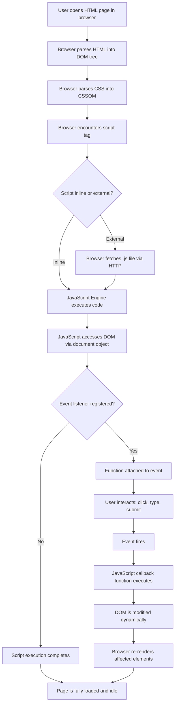
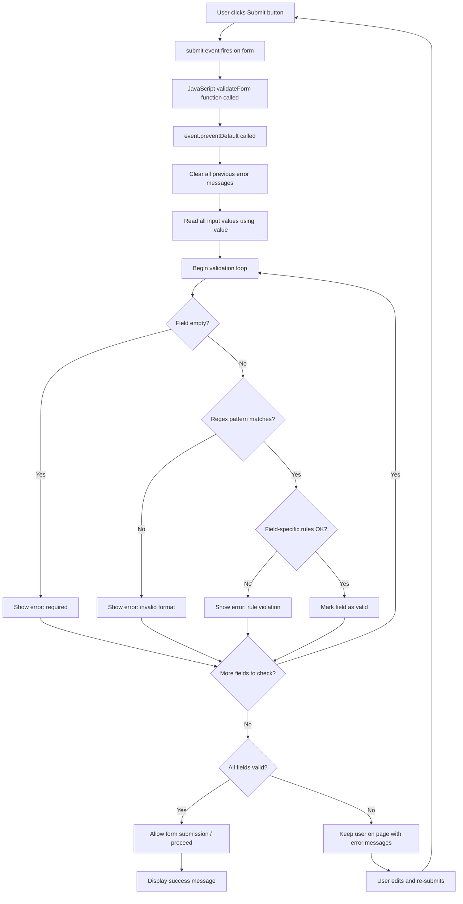
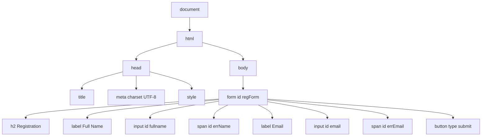
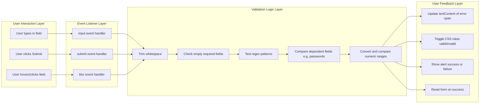

# Client-Side Scripting: JavaScript fundamentals, interactive form validations

<!-- SECTION_1_START -->

# Client-Side Scripting: JavaScript Fundamentals & Interactive Form Validations

## 1. Core Technical Definition

**Client-Side Scripting** is the practice of executing scripts on the **client's web browser** (the user's local machine) rather than on the web server. It allows web pages to be dynamic, interactive, and responsive to user actions without requiring a round-trip to the server.

**JavaScript (JS)** is a high-level, interpreted, prototype-based, multi-paradigm programming language that conforms to the **ECMAScript** specification. It is the de-facto language of the web, standardized as **ECMA-262**, and is one of the core technologies of the **World Wide Web (WWW)** alongside **HTML** and **CSS**.

**Interactive Form Validation** is the process of verifying user-entered data in an HTML form against a set of rules (such as non-empty fields, valid email format, matching passwords, or numeric ranges) **before the form is submitted to the server**, providing immediate visual feedback to the user.

> [!IMPORTANT]
> **KTU 2024 Syllabus Highlight (Module 4):**
> As per the GXEST203 syllabus, students must demonstrate competence in:
> - Writing basic JavaScript programs using variables, data types, operators, and control flow.
> - Embedding JavaScript into HTML using `<script>` tags.
> - Accessing and manipulating the **Document Object Model (DOM)**.
> - Building interactive web forms that validate input data on the client side.

> [!NOTE]
> **The Three Pillars of Web Design**
> - **HTML** $\rightarrow$ *Structure* (the skeleton of the page)
> - **CSS** $\rightarrow$ *Style* (the clothing and appearance)
> - **JavaScript** $\rightarrow$ *Behavior* (the brain and muscles that make it move)

## 2. Conceptual Analogy & Intuitive Overview

### 2.1 JavaScript — The Brain of a Web Page

Imagine a beautifully built restaurant building:
- **HTML** is the **floor plan** — it defines the rooms, tables, doors, and walls.
- **CSS** is the **interior decoration** — paint, lighting, furniture, and ambiance.
- **JavaScript** is the **staff and electrical wiring** — the waiter takes your order (event), the chef cooks (logic), the lights dim when you enter (DOM manipulation), and the fire alarm rings if smoke is detected (**form validation**).

Without JavaScript, a webpage is a static brochure. With it, the page becomes a **living, breathing application**.

### 2.2 Form Validation — The Bouncer at the Club Door

Think of a form validation routine as a **strict bouncer at a club entrance**:
- The bouncer checks the dress code (**format validation** — e.g., email must contain `@`).
- The bouncer checks the ID (**required field validation** — e.g., name cannot be empty).
- The bouncer checks the age (**range validation** — e.g., age must be between 18 and 100).
- Only when ALL checks pass is the patron (the form data) allowed inside (submitted to the server).

If any check fails, the bouncer immediately sends the patron back with a clear message (an error popup or red text). This is exactly what **client-side form validation** does in JavaScript.

> [!NOTE]
> **Key Metric:** According to industry benchmarks, well-implemented client-side validation can reduce **server load by 30% to 60%** by filtering out malformed requests before they ever reach the backend.

## 3. Where JavaScript Runs

| Environment | Description | Example |
|---|---|---|
| **Web Browser** | The primary runtime for client-side scripting. Each browser has a built-in **JS engine** (V8 in Chrome, SpiderMonkey in Firefox, JavaScriptCore in Safari). | Interactive web pages, SPAs |
| **Server-Side** | Using **Node.js**, JavaScript runs outside the browser on the server. | APIs, backend services |
| **Mobile** | Frameworks like **React Native** and **Ionic** use JS to build cross-platform apps. | WhatsApp clone, Instagram |

## 4. Embedding JavaScript in HTML

There are **three ways** to include JavaScript in a webpage:

### Method 1: Inline Script (using `<script>` tag in `<head>` or `<body>`)
```html
<script>
    alert("Hello, KTU Student!");
</script>
```

### Method 2: External Script File (Best Practice)
```html
<script src="script.js"></script>
```

### Method 3: Inline Event Handler (Discouraged in modern code)
```html
<button onclick="validate()">Submit</button>
```

> [!TIP]
> **Best Practice for KTU Exams:** Always place `<script>` tags **at the end of the `<body>`** element, or use the `defer` attribute in the `<head>`. This ensures the entire HTML DOM is loaded before the script runs, preventing `null` reference errors.

## 5. GeoGebra / Visualization Note

> [!VISUALIZATION CONTROL]
> **Concept:** HTML Form Validation Feedback Loop
> **GeoGebra / Desmos Input Equations:**
> * `x-axis` = Time (sequential events)
> * `y-axis` = User state (0 = invalid, 1 = valid)
> * Plot points: $P_1(0, 0)$, $P_2(1, 0.5)$, $P_3(2, 1)$
> **Visual Description:** A step function that starts at $(0,0)$ when the user first interacts with the form, oscillates between $0$ (invalid) and $1$ (valid) as the user types, and only reaches the final state of $y=1$ when all validations pass — at which point the form is allowed to submit.

<!-- SECTION_1_END -->

<!-- SECTION_2_START -->

# Deep Theoretical Analysis & KTU High-Yield Formula Sheet

## 1. JavaScript Language Fundamentals

### 1.1 Variables — The Named Containers

A variable is a symbolic name for a storage location that holds a value. In modern JavaScript (ES6+), we use three keywords:

| Keyword | Scope | Re-declarable | Re-assignable | Hoisted | KTU Use Case |
|---|---|---|---|---|---|
| `var` | Function-scoped | Yes | Yes | Yes (initialized to `undefined`) | Legacy code only |
| `let` | Block-scoped $\{$ $\}$ | No | Yes | Yes (in **Temporal Dead Zone**) | Counters, loops, changing values |
| `const` | Block-scoped | No | **No** (immutable binding) | Yes (in TDZ) | Constants, configuration, DOM refs |

```javascript
let studentName = "Anand";        // String
const MAX_ATTEMPTS = 3;           // Constant
var legacyCounter = 0;            // Legacy, avoid in new code
```

> [!IMPORTANT]
> **KTU Board Tip:** The examiner often asks *"Differentiate between `var`, `let`, and `const`."* Memorize the **scope** and **re-assignment** behavior — those are the two most-tested dimensions.

### 1.2 Data Types

JavaScript has **8 data types**, split into two categories:

#### A. Primitive Types (immutable, stored by value)

| Type | Keyword | Example | Description |
|---|---|---|---|
| Number | `number` | `42`, `3.14`, `NaN` | All numeric values, integers and floats combined |
| String | `string` | `"Hello"`, `'KTU'` | Sequence of UTF-16 characters |
| Boolean | `boolean` | `true`, `false` | Logical values |
| Undefined | `undefined` | `let x;` | Variable declared but not yet assigned |
| Null | `object` (quirk!) | `let x = null;` | Intentional absence of any value |
| BigInt | `bigint` | `9007199254740993n` | Arbitrary precision integers (ES2020) |
| Symbol | `symbol` | `Symbol("id")` | Unique, immutable identifier (ES6) |

#### B. Reference Type (mutable, stored by reference)

| Type | Keyword | Example | Description |
|---|---|---|---|
| Object | `object` | `{}`, `[]`, `function(){}` | Collections of key-value pairs |

```javascript
let score = 95;                    // Number
let name = "Kerala";               // String
let isPassed = true;               // Boolean
let address = null;                // Null (intentional emptiness)
let phone;                         // Undefined (not yet assigned)
let fruits = ["Mango", "Banana"];  // Object (Array)
let student = {name: "Anu", age: 20}; // Object (Literal)
```

> [!TIP]
> Use the `typeof` operator to check a variable's type at runtime:
> ```javascript
> console.log(typeof 42);          // "number"
> console.log(typeof "Hello");     // "string"
> console.log(typeof null);        // "object"  ← famous JS quirk!
> ```

### 1.3 Operators — The Action Verbs

| Category | Operators | Example | Result |
|---|---|---|---|
| **Arithmetic** | `+`, `-`, `*`, `/`, `%`, `**` | `10 % 3` | `1` |
| **Assignment** | `=`, `+=`, `-=`, `*=`, `/=`, `**=` | `x += 5` | adds 5 to x |
| **Comparison** | `==`, `!=`, `===`, `!==`, `>`, `<`, `>=`, `<=` | `5 === "5"` | `false` (strict) |
| **Logical** | `&&` (AND), `\|\|` (OR), `!` (NOT) | `true && false` | `false` |
| **Ternary** | `condition ? val1 : val2` | `age >= 18 ? "Adult" : "Minor"` | string |
| **Increment/Decrement** | `++`, `--` | `x++` | post-increment |
| **String Concatenation** | `+` | `"KTM" + "2024"` | `"KTM2024"` |

> [!WARNING]
> **Always prefer `===` (strict equality) over `==` (loose equality).**
> `==` performs **type coercion** (e.g., `0 == false` is `true`), which leads to subtle bugs. KTU examiners may specifically test this distinction.

### 1.4 Control Flow Statements

#### Conditional Statements
```javascript
let marks = 78;

if (marks >= 90) {
    grade = "A+";
} else if (marks >= 80) {
    grade = "A";
} else if (marks >= 70) {
    grade = "B";
} else {
    grade = "C";
}
```

#### Switch Statement
```javascript
switch (day) {
    case 1: console.log("Monday"); break;
    case 2: console.log("Tuesday"); break;
    default: console.log("Other day");
}
```

#### Loops
```javascript
// for loop — known iterations
for (let i = 0; i < 5; i++) {
    console.log("Iteration: " + i);
}

// while loop — condition-based
let n = 0;
while (n < 3) {
    console.log(n);
    n++;
}

// for...of loop — iterate over iterable values
let colors = ["red", "green", "blue"];
for (let color of colors) {
    console.log(color);
}
```

### 1.5 Functions — Reusable Logic Blocks

```javascript
// Function Declaration (hoisted)
function addNumbers(a, b) {
    return a + b;
}

// Function Expression (not hoisted)
const multiply = function(a, b) {
    return a * b;
};

// Arrow Function (ES6+) — concise syntax
const divide = (a, b) => {
    if (b === 0) return "Cannot divide by zero";
    return a / b;
};

console.log(addNumbers(5, 3));    // 8
console.log(multiply(4, 6));      // 24
console.log(divide(10, 2));       // 5
```

### 1.6 Arrays and Objects

```javascript
// Array — ordered collection
let courses = ["Maths", "Physics", "CS"];
courses.push("Chemistry");      // Add to end
courses.pop();                  // Remove from end
courses.length;                 // 3

// Object — key-value collection
let student = {
    name: "Rahul",
    rollNo: 45,
    branch: "CSE",
    isHosteller: true
};
console.log(student.name);     // Dot notation
console.log(student["rollNo"]); // Bracket notation
```

## 2. The Document Object Model (DOM)

The **DOM** is a tree-structured, in-memory representation of the HTML document. JavaScript can **read**, **modify**, **add**, and **delete** HTML elements through the DOM.

### 2.1 DOM Selection Methods

| Method | Purpose | Returns | Example |
|---|---|---|---|
| `document.getElementById("id")` | Select by `id` attribute | Single element or `null` | `document.getElementById("email")` |
| `document.getElementsByClassName("cls")` | Select by class name | HTMLCollection (live) | `document.getElementsByClassName("error")` |
| `document.getElementsByTagName("p")` | Select by tag name | HTMLCollection (live) | `document.getElementsByTagName("input")` |
| `document.querySelector("selector")` | First match of CSS selector | Single element or `null` | `document.querySelector("#email")` |
| `document.querySelectorAll("selector")` | All matches of CSS selector | NodeList (static) | `document.querySelectorAll(".field")` |

### 2.2 DOM Manipulation Properties

| Property / Method | Purpose | Example |
|---|---|---|
| `.innerHTML` | Get or set HTML content | `el.innerHTML = "<b>Done</b>"` |
| `.textContent` | Get or set plain text | `el.textContent = "Saved"` |
| `.value` | Get or set form input value | `el.value` |
| `.style.property` | Modify inline CSS | `el.style.color = "red"` |
| `.classList.add()` / `.remove()` | Toggle CSS classes | `el.classList.add("valid")` |
| `.setAttribute()` / `.getAttribute()` | Manage attributes | `el.setAttribute("disabled", "true")` |
| `.addEventListener()` | Attach event handler | `el.addEventListener("click", fn)` |

## 3. Form Validation — The Heart of This Module

### 3.1 Why Validate?

1. **Data Integrity** — Ensures garbage data never enters the database.
2. **User Experience** — Instant feedback is faster than server round-trips.
3. **Security** — First line of defense against SQL injection and XSS (though server-side validation is still mandatory).
4. **Bandwidth** — Reduces unnecessary server requests.

### 3.2 Types of Validation

| Type | When | Tools |
|---|---|---|
| **HTML5 Built-in** | Automatic as user types or submits | `required`, `type="email"`, `pattern`, `min`, `max` |
| **JavaScript Manual** | Custom logic in event handlers | `if/else`, `RegExp`, `event.preventDefault()` |
| **Server-Side** | After submission | PHP, Python, Node.js, etc. |

### 3.3 The `event.preventDefault()` Method

When a form's submit button is clicked, the browser **automatically** tries to send the data to the server (the default action). To **stop** this and run our JavaScript validation first, we call:

```javascript
event.preventDefault();
```

This is a **critical** KTU concept. Without it, even an "invalid" form will be submitted.

### 3.4 The `RegExp` (Regular Expression) Engine

A **Regular Expression** is a pattern used to match character combinations in strings. It is the most powerful tool for format validation.

**Syntax:** `/pattern/modifiers`

**Common Modifiers:**
- `g` — Global match (find all)
- `i` — Case-insensitive
- `m` — Multiline

**Common Metacharacters:**

| Symbol | Meaning | Example |
|---|---|---|
| `\d` | Any digit 0-9 | `\d{3}` matches 3 digits |
| `\w` | Word character (a-z, A-Z, 0-9, `_`) | `\w+` matches a word |
| `\s` | Whitespace | `\s+` matches spaces |
| `.` | Any single character (except newline) | `a.c` matches `abc`, `axc` |
| `^` | Start of string | `^Hello` |
| `$` | End of string | `world$` |
| `*` | Zero or more | `ab*c` matches `ac`, `abc`, `abbc` |
| `+` | One or more | `ab+c` matches `abc`, `abbc` |
| `?` | Zero or one | `colou?r` matches `color` or `colour` |
| `{}` | Exact quantity | `\d{10}` matches exactly 10 digits |
| `[]` | Character class | `[a-z]` matches any lowercase letter |
| `()` | Grouping | `(ab)+` matches `ab`, `abab` |
| `\` | Escape special char | `\.` matches a literal dot |

**Email Validation Pattern (commonly tested):**
```javascript
const emailPattern = /^[a-zA-Z0-9._-]+@[a-zA-Z0-9.-]+\.[a-zA-Z]{2,6}$/;
```

Breaking this down:
- `^[a-zA-Z0-9._-]+` $\rightarrow$ username: letters, digits, dot, underscore, hyphen (one or more), at the **start**
- `@` $\rightarrow$ literal `@` symbol
- `[a-zA-Z0-9.-]+` $\rightarrow$ domain name
- `\.` $\rightarrow$ literal dot before TLD
- `[a-zA-Z]{2,6}$` $\rightarrow$ TLD: 2 to 6 letters at the **end**

## 4. KTU High-Yield Formula Sheet

| # | Concept | Syntax / Formula | Purpose |
|---|---|---|---|
| 1 | Variable declaration | `let x; const Y = 5;` | Store data |
| 2 | Strict equality | `a === b` | Compare without type coercion |
| 3 | Ternary operator | `cond ? A : B` | Inline if-else |
| 4 | Arrow function | `(a, b) => a + b` | Concise function definition |
| 5 | DOM by ID | `document.getElementById("id")` | Select single element |
| 6 | DOM by selector | `document.querySelector(".class")` | CSS-selector selection |
| 7 | Read input value | `document.getElementById("x").value` | Get form data |
| 8 | Set text content | `el.textContent = "msg"` | Display message |
| 9 | Add CSS class | `el.classList.add("error")` | Apply style dynamically |
| 10 | Attach event | `el.addEventListener("click", fn)` | React to user action |
| 11 | Stop submission | `event.preventDefault()` | Block default form action |
| 12 | Email regex | `/^[a-zA-Z0-9._-]+@[a-zA-Z0-9.-]+\.[a-zA-Z]{2,6}$/` | Validate email format |
| 13 | Phone regex (10 digits) | `/^\d{10}$/` | Validate 10-digit phone |
| 14 | Password regex (strong) | `/^(?=.*[A-Z])(?=.*\d)(?=.*[@$!%*?&]).{8,}$/` | Uppercase + digit + special + 8+ chars |
| 15 | Test regex | `regex.test(string)` $\rightarrow$ `true`/`false` | Pattern matching check |
| 16 | Date object | `new Date()` | Get current timestamp |

> [!NOTE]
> All the above formulas/syntax patterns are **routinely asked** in KTU university exams. Memorize the exact symbols and bracket positions.

<!-- SECTION_2_END -->

<!-- SECTION_3_START -->

# Step-by-Step Derivations & Code Implementation

## 1. Exhaustive Walkthrough: Building a Complete Registration Form with JavaScript Validation

Below is the **full, end-to-end implementation** of a registration form that performs client-side validation on every field. Read every line — do not skip.

### 1.1 Complete HTML + CSS + JavaScript Code

```html
<!DOCTYPE html>
<html lang="en">
<head>
    <meta charset="UTF-8">
    <title>KTU Registration Form</title>
    <style>
        body { font-family: Arial, sans-serif; background: #f4f4f4; padding: 20px; }
        form { background: white; padding: 20px; max-width: 450px; margin: auto;
               border-radius: 8px; box-shadow: 0 0 10px rgba(0,0,0,0.1); }
        label { display: block; margin-top: 12px; font-weight: bold; }
        input { width: 100%; padding: 8px; margin-top: 4px; box-sizing: border-box;
                border: 1px solid #ccc; border-radius: 4px; }
        input.valid { border-color: green; background: #e8f5e9; }
        input.invalid { border-color: red; background: #ffebee; }
        .error { color: red; font-size: 0.85em; margin-top: 4px; display: block; }
        button { margin-top: 16px; padding: 10px 20px; background: #1976d2;
                 color: white; border: none; border-radius: 4px; cursor: pointer; }
        button:hover { background: #1565c0; }
    </style>
</head>
<body>

    <form id="regForm" onsubmit="return validateForm(event)">
        <h2>KTU Student Registration</h2>

        <label for="fullname">Full Name *</label>
        <input type="text" id="fullname" name="fullname">
        <span class="error" id="errName"></span>

        <label for="email">Email *</label>
        <input type="email" id="email" name="email">
        <span class="error" id="errEmail"></span>

        <label for="phone">Phone (10 digits) *</label>
        <input type="text" id="phone" name="phone">
        <span class="error" id="errPhone"></span>

        <label for="password">Password *</label>
        <input type="password" id="password" name="password">
        <span class="error" id="errPassword"></span>

        <label for="confirm">Confirm Password *</label>
        <input type="password" id="confirm" name="confirm">
        <span class="error" id="errConfirm"></span>

        <label for="age">Age (18-60) *</label>
        <input type="number" id="age" name="age">
        <span class="error" id="errAge"></span>

        <button type="submit">Register</button>
    </form>

    <script>
        /**
         * Master validation function — called on form submit.
         * @param {Event} event - the form submission event
         * @returns {boolean} false if invalid (to prevent submission)
         */
        function validateForm(event) {
            // Step 1: Prevent the browser from submitting the form automatically
            event.preventDefault();

            // Step 2: Read all input values using .value
            const fullname = document.getElementById("fullname").value.trim();
            const email    = document.getElementById("email").value.trim();
            const phone    = document.getElementById("phone").value.trim();
            const password = document.getElementById("password").value;
            const confirm  = document.getElementById("confirm").value;
            const ageStr   = document.getElementById("age").value.trim();
            const age      = parseInt(ageStr, 10);

            // Step 3: Define a tracking flag — assume valid until proven otherwise
            let isValid = true;

            // Step 4: Clear all previous error messages before re-validating
            document.querySelectorAll(".error").forEach(el => el.textContent = "");
            document.querySelectorAll("input").forEach(el => {
                el.classList.remove("valid", "invalid");
            });

            // ===== VALIDATION RULE 1: Full Name =====
            if (fullname === "") {
                showError("fullname", "errName", "Full name is required.");
                isValid = false;
            } else if (fullname.length < 3) {
                showError("fullname", "errName", "Name must be at least 3 characters.");
                isValid = false;
            } else if (!/^[a-zA-Z\s]+$/.test(fullname)) {
                showError("fullname", "errName", "Name must contain only letters and spaces.");
                isValid = false;
            } else {
                markValid("fullname");
            }

            // ===== VALIDATION RULE 2: Email =====
            const emailPattern = /^[a-zA-Z0-9._-]+@[a-zA-Z0-9.-]+\.[a-zA-Z]{2,6}$/;
            if (email === "") {
                showError("email", "errEmail", "Email is required.");
                isValid = false;
            } else if (!emailPattern.test(email)) {
                showError("email", "errEmail", "Please enter a valid email address.");
                isValid = false;
            } else {
                markValid("email");
            }

            // ===== VALIDATION RULE 3: Phone =====
            const phonePattern = /^\d{10}$/;
            if (phone === "") {
                showError("phone", "errPhone", "Phone number is required.");
                isValid = false;
            } else if (!phonePattern.test(phone)) {
                showError("phone", "errPhone", "Phone must be exactly 10 digits.");
                isValid = false;
            } else {
                markValid("phone");
            }

            // ===== VALIDATION RULE 4: Password =====
            // At least 8 chars, 1 uppercase, 1 digit, 1 special character
            const passwordPattern = /^(?=.*[A-Z])(?=.*\d)(?=.*[@$!%*?&]).{8,}$/;
            if (password === "") {
                showError("password", "errPassword", "Password is required.");
                isValid = false;
            } else if (!passwordPattern.test(password)) {
                showError("password", "errPassword",
                    "Password must be 8+ chars with 1 uppercase, 1 digit, 1 special char.");
                isValid = false;
            } else {
                markValid("password");
            }

            // ===== VALIDATION RULE 5: Confirm Password =====
            if (confirm === "") {
                showError("confirm", "errConfirm", "Please confirm your password.");
                isValid = false;
            } else if (confirm !== password) {
                showError("confirm", "errConfirm", "Passwords do not match.");
                isValid = false;
            } else {
                markValid("confirm");
            }

            // ===== VALIDATION RULE 6: Age =====
            if (isNaN(age)) {
                showError("age", "errAge", "Age is required.");
                isValid = false;
            } else if (age < 18 || age > 60) {
                showError("age", "errAge", "Age must be between 18 and 60.");
                isValid = false;
            } else {
                markValid("age");
            }

            // Step 5: Final decision — only submit if ALL validations passed
            if (isValid) {
                alert("Registration Successful! Welcome, " + fullname + ".");
                document.getElementById("regForm").reset();
            } else {
                alert("Please correct the highlighted errors and try again.");
            }
        }

        /**
         * Helper: display an error message and mark the field red.
         * @param {string} inputId  - the input element's id
         * @param {string} errorId  - the <span> element's id for the error text
         * @param {string} message  - the error text to display
         */
        function showError(inputId, errorId, message) {
            document.getElementById(inputId).classList.add("invalid");
            document.getElementById(errorId).textContent = message;
        }

        /**
         * Helper: mark a field as valid (green border).
         * @param {string} inputId - the input element's id
         */
        function markValid(inputId) {
            document.getElementById(inputId).classList.add("valid");
        }
    </script>

</body>
</html>
```

### 1.2 Line-by-Line Logical Explanation

Let us derive **why** each block of code is written the way it is, step by step.

#### Step 1 — Why `event.preventDefault()`?

By default, when a form's submit button is clicked, the browser **collects all input values and sends them to the URL specified in the `action` attribute** (or reloads the current page if `action` is empty). If we want our JavaScript validation to run *first* and *block* this default behavior, we must call `event.preventDefault()`. This is the **single most important line** in any form-validation script.

#### Step 2 — Why `.trim()`?

The `trim()` method removes **leading and trailing whitespace** from a string. Without it, a user could submit a form with `"   "` (three spaces) in the name field, and our empty-check `fullname === ""` would **fail** to catch it. Always trim inputs that come from users.

#### Step 3 — Why `parseInt(ageStr, 10)`?

The `value` property of an `<input>` element always returns a **string**, even for `<input type="number">`. To compare numerically, we must convert it to a number. The second argument `10` specifies **base-10 (decimal)**. This prevents JS from interpreting leading zeros as octal in older engines.

#### Step 4 — Why a single `isValid` flag?

We cannot return early from a function when validating multiple fields, because the user expects to see **all** errors at once, not one at a time. The `isValid` flag accumulates every failure, then we make a single decision at the end.

#### Step 5 — Why `document.querySelectorAll(".error")`?

This CSS-selector-based call returns **every element with the class `error`** in a single line. We then use `.forEach()` to clear all previous error messages before re-validating. This prevents old errors from lingering when the user fixes one field but another is still wrong.

#### Step 6 — Why the password lookahead regex?

The pattern `/^(?=.*[A-Z])(?=.*\d)(?=.*[@$!%*?&]).{8,}$/` uses **three positive lookaheads**:
- `(?=.*[A-Z])` $\rightarrow$ ensures at least one uppercase letter exists **somewhere** in the string
- `(?=.*\d)` $\rightarrow$ ensures at least one digit exists
- `(?=.*[@$!%*?&])` $\rightarrow$ ensures at least one special character exists
- `.{8,}` $\rightarrow$ matches any 8 or more characters
- `^...$` $\rightarrow$ anchors the entire string from start to end

Lookaheads **do not consume characters**; they only assert that the pattern exists. This is the standard idiom for "password must contain X, Y, Z" requirements.

### 1.3 Mathematical Derivation: How Regex Matching Works

Consider the phone pattern `/^\d{10}$/` tested against the input `"9876543210"`.

The matching proceeds character by character:

| Position | Input Char | Pattern Token | Match? | Note |
|---|---|---|---|---|
| 0 | `9` | `^` | ✓ | Anchor to start |
| 0 | `9` | `\d` | ✓ | Digit 0-9 |
| 1 | `8` | `\d` | ✓ | |
| 2 | `7` | `\d` | ✓ | |
| 3 | `6` | `\d` | ✓ | |
| 4 | `5` | `\d` | ✓ | |
| 5 | `4` | `\d` | ✓ | |
| 6 | `3` | `\d` | ✓ | |
| 7 | `2` | `\d` | ✓ | |
| 8 | `1` | `\d` | ✓ | |
| 9 | `0` | `\d` | ✓ | 10th digit consumed |
| 10 | (end) | `$` | ✓ | Anchor to end |

$$
\text{Result} = \text{regex.test}("9876543210") = \texttt{true}
$$

If the input were `"98765abcde"`, the regex would fail at position 5 because `a` is not a `\d` (digit), and `.test()` would return `false`.

## 2. Real-Time Validation: The `input` and `blur` Events

In production, we do not wait until the submit button is clicked. We validate **as the user types** or **when the field loses focus**. This provides instant feedback.

```html
<script>
    // Live validation for the email field
    const emailField = document.getElementById("email");
    const emailError = document.getElementById("errEmail");

    emailField.addEventListener("blur", function() {
        const pattern = /^[a-zA-Z0-9._-]+@[a-zA-Z0-9.-]+\.[a-zA-Z]{2,6}$/;
        if (this.value.trim() === "") {
            emailError.textContent = "Email is required.";
            this.classList.add("invalid");
            this.classList.remove("valid");
        } else if (!pattern.test(this.value)) {
            emailError.textContent = "Invalid email format.";
            this.classList.add("invalid");
            this.classList.remove("valid");
        } else {
            emailError.textContent = "";
            this.classList.add("valid");
            this.classList.remove("invalid");
        }
    });

    // Real-time character counter (e.g., for a comment box)
    const phoneField = document.getElementById("phone");
    phoneField.addEventListener("input", function() {
        // Remove non-digit characters as the user types
        this.value = this.value.replace(/\D/g, "");

        // Limit to 10 characters
        if (this.value.length > 10) {
            this.value = this.value.slice(0, 10);
        }
    });
</script>
```

### Explanation of Event Types

| Event | Fires When | Best For |
|---|---|---|
| `click` | Mouse click on element | Buttons, links |
| `submit` | Form submission attempt | Final form-wide validation |
| `focus` | Element gains focus (clicked into) | Highlighting active field |
| `blur` | Element loses focus (clicked out) | Validating when user "moves on" |
| `input` | Value changes (every keystroke) | Live character counting, instant feedback |
| `change` | Value committed (for selects, checkboxes) | Dropdown changes |
| `keydown` / `keyup` | Key pressed/released | Keyboard shortcuts, gaming |

## 3. HTML5 Built-in Validation (Built-in but Limited)

HTML5 introduced several attributes that provide **zero-JavaScript** validation. These work alongside our JS code.

```html
<form>
    <input type="text" required minlength="3" maxlength="50"
           pattern="[A-Za-z\s]+" title="Letters and spaces only">

    <input type="email" required>

    <input type="number" min="18" max="60" required>

    <input type="tel" pattern="[0-9]{10}" required>

    <input type="submit" value="Register">
</form>
```

| Attribute | Purpose | Example |
|---|---|---|
| `required` | Field cannot be empty | `<input required>` |
| `minlength` / `maxlength` | String length bounds | `minlength="3"` |
| `min` / `max` | Numeric bounds | `min="18" max="60"` |
| `pattern` | Inline regex | `pattern="[0-9]{10}"` |
| `type` | Input type enforcement | `type="email"` |

> [!IMPORTANT]
> **Limitation of HTML5 Validation:** The browser styles and error messages are **inconsistent** across browsers. For a polished, uniform UX, **always combine HTML5 attributes with custom JavaScript validation**.

<!-- SECTION_3_END -->

<!-- SECTION_4_START -->

# Structural Diagrams & Schematics

## 1. The JavaScript Execution Flow (Within a Web Page)



**Description:** This diagram illustrates the complete lifecycle of a JavaScript program inside a browser — from the moment the HTML is parsed, through script loading and execution, to the event-driven interaction loop that defines modern web applications.

## 2. Client-Side Form Validation Flowchart



**Description:** This is the **canonical decision tree** for any client-side validation routine. It captures the "validate-all-then-decide" pattern that is the industry standard.

## 3. The Document Object Model (DOM) Tree Structure



**Description:** The DOM represents every HTML element as a **node** in a hierarchical tree. JavaScript can navigate this tree starting from `document` (the root) and traverse to any descendant element using methods like `getElementById`, `querySelector`, and properties like `.parentNode`, `.children`, and `.nextElementSibling`.

## 4. Block-Level Architecture: Event-Driven Validation System



**Description:** This 4-layer architecture (Interaction $\rightarrow$ Event $\rightarrow$ Logic $\rightarrow$ Feedback) is the design pattern used in production frameworks like React, Vue, and Angular. Understanding it is essential for writing **maintainable** validation code.

<!-- SECTION_4_END -->

<!-- SECTION_5_START -->

# KTU 2024 Scheme Examination Question Bank & Topic Recap

## Part A — Short Answer Questions (3 Marks Each)

### Question 1
`[KTU University Exam — July 2024]`
**CO1 | RBT: Remember**

**Define client-side scripting. List any two advantages of using JavaScript for client-side scripting.**

#### Model Answer (3 Marks):

**Definition (1 Mark):**
Client-side scripting is a technique in which scripts are executed on the **user's web browser** (client machine) rather than on the web server. JavaScript is the most widely used client-side scripting language.

**Advantages (2 Marks — 1 each):**
1. **Reduced Server Load:** Validation and processing happen in the browser, so the server receives only valid, clean data, saving CPU and bandwidth.
2. **Faster User Feedback:** Users get instant responses (e.g., "Invalid email") without waiting for a server round-trip, improving the user experience.
3. **Offline Capability:** Basic interactivity works even when the user is temporarily disconnected.
4. **No Plugin Required:** JavaScript is built into every modern browser — no installation needed.

> [!WARNING]
> **Valuation Pitfall:** Do not write generic advantages like "easy to learn." Examiners expect **technical**, web-specific advantages. Mention **server load** or **round-trip** explicitly.

---

### Question 2
`[KTU University Exam — Dec 2023]`
**CO2 | RBT: Understand**

**Differentiate between `var`, `let`, and `const` in JavaScript with suitable examples.**

#### Model Answer (3 Marks):

| Feature | `var` | `let` | `const` |
|---|---|---|---|
| **Scope** | Function-scoped | Block-scoped | Block-scoped |
| **Re-declaration** | Allowed in same scope | Not allowed | Not allowed |
| **Re-assignment** | Allowed | Allowed | **Not allowed** (immutable binding) |
| **Hoisting** | Hoisted with `undefined` | Hoisted in TDZ | Hoisted in TDZ |
| **ES Version** | ES5 (legacy) | ES6 (2015) | ES6 (2015) |

**Examples (1 Mark):**
```javascript
var a = 10;     // Function-scoped, can be re-declared
let b = 20;     // Block-scoped, re-assignable but not re-declarable
const c = 30;   // Block-scoped, cannot be re-assigned
// c = 40;      // TypeError: Assignment to constant variable
```

> [!WARNING]
> **Valuation Pitfall:** Students often confuse **"re-declaration"** with **"re-assignment"**. They are different concepts. `const` prevents re-assignment of the binding, but if the value is an object, its **properties can still be mutated**.

---

## Part B — Long Answer Questions (14 Marks Each, Module Internal Choice)

### Question A (14 Marks)
`[KTU University Exam — July 2024]`
**CO2, CO3 | RBT: Understand + Apply**

**(a)** Explain the different ways to embed JavaScript in an HTML document. Discuss the advantages of using an external JavaScript file with a suitable example. **(7 Marks)**

**(b)** Write a JavaScript program to read two numbers from the user using prompt(), perform all four basic arithmetic operations, and display the results in a well-formatted manner on the web page. **(7 Marks)**

---

#### Model Answer — Part (a) (7 Marks)

**Three Ways to Embed JavaScript (3 Marks — 1 each):**

1. **Inline Script — within `<script>` tags in HTML:**
   ```html
   <script>
       document.write("Hello from inline script");
   </script>
   ```
   *Placed in `<head>` or `<body>`. Suitable for small snippets.*

2. **External Script — linked `.js` file:**
   ```html
   <script src="myscript.js"></script>
   ```
   *The file `myscript.js` contains all JavaScript code separately. **This is the recommended approach.***

3. **Inline Event Handlers (in HTML attributes):**
   ```html
   <button onclick="alert('Clicked!')">Click Me</button>
   ```
   *Discouraged in modern code because it mixes HTML and JavaScript, violating separation of concerns.*

**Advantages of External JavaScript Files (4 Marks — 1 each):**

| # | Advantage | Explanation |
|---|---|---|
| 1 | **Separation of Concerns** | HTML handles structure, CSS handles style, JS handles behavior — clean architecture |
| 2 | **Reusability** | One `.js` file can be included in multiple HTML pages |
| 3 | **Caching & Performance** | Browser caches the file after first download, speeding up subsequent page loads |
| 4 | **Maintainability** | Easier to debug, version-control, and collaborate on code |
| 5 | **Readability** | Keeps HTML files clean and short |

**Example (included in the same 4 Marks):**
```html
<!-- index.html -->
<!DOCTYPE html>
<html>
<head>
    <title>External JS Demo</title>
    <script src="greet.js"></script>
</head>
<body>
    <h1>Welcome Page</h1>
</body>
</html>
```
```javascript
// greet.js
alert("Welcome to KTU! This message is from an external file.");
```

> [!WARNING]
> **Valuation Pitfall:** Do not list "easy to use" as an advantage. Examiners expect **technical** benefits like caching, separation, and reusability.

---

#### Model Answer — Part (b) (7 Marks)

**Complete Code (5 Marks) + Output Explanation (2 Marks):**

```html
<!DOCTYPE html>
<html>
<head><title>Arithmetic Operations</title></head>
<body>
    <h2>JavaScript Arithmetic Calculator</h2>
    <p id="output"></p>

    <script>
        // Step 1: Read two numbers from the user using prompt()
        // [Reading user input: 1 Mark]
        let num1 = parseFloat(prompt("Enter the first number:"));
        let num2 = parseFloat(prompt("Enter the second number:"));

        // Step 2: Validate that inputs are valid numbers
        // [Input validation: 1 Mark]
        if (isNaN(num1) || isNaN(num2)) {
            document.getElementById("output").innerHTML =
                "<span style='color:red;'>Error: Please enter valid numbers.</span>";
        } else {
            // Step 3: Perform the four arithmetic operations
            // [Computing operations: 1 Mark]
            const sum        = num1 + num2;
            const difference = num1 - num2;
            const product    = num1 * num2;
            const quotient   = num2 !== 0 ? num1 / num2 : "Undefined (division by zero)";

            // Step 4: Display the results in a formatted table
            // [Display formatting: 1 Mark]
            let resultHTML = "<table border='1' cellpadding='8'>";
            resultHTML += "<tr><th>Operation</th><th>Result</th></tr>";
            resultHTML += "<tr><td>Addition</td><td>" + sum + "</td></tr>";
            resultHTML += "<tr><td>Subtraction</td><td>" + difference + "</td></tr>";
            resultHTML += "<tr><td>Multiplication</td><td>" + product + "</td></tr>";
            resultHTML += "<tr><td>Division</td><td>" + quotient + "</td></tr>";
            resultHTML += "</table>";

            document.getElementById("output").innerHTML = resultHTML;
        }
        // [Final decision logic: 1 Mark]
    </script>
</body>
</html>
```

**Sample Run (2 Marks):**

If the user enters `num1 = 20` and `num2 = 5`:

| Operation | Result |
|---|---|
| Addition | 25 |
| Subtraction | 15 |
| Multiplication | 100 |
| Division | 4 |

> [!WARNING]
> **Valuation Pitfall:** Students often forget to handle **division by zero**, which produces `Infinity` in JavaScript and crashes the display. Always include the `num2 !== 0 ?` check. Also, `prompt()` returns a **string**, so `parseFloat()` is mandatory for numeric operations.

---

### Question B (14 Marks) — Alternative Choice
`[KTU University Exam — Dec 2023]`
**CO3, CO4 | RBT: Apply + Analyze**

**(a)** What is form validation? Explain the difference between client-side and server-side validation. List the HTML5 attributes used for built-in form validation. **(7 Marks)**

**(b)** Design a complete HTML form with fields: Name, Email, Phone, Password, and Confirm Password. Write JavaScript code to validate:
- Name should not be empty and must contain only alphabets.
- Email should be in a valid format.
- Phone should contain exactly 10 digits.
- Password and Confirm Password must match.

Display appropriate error messages for each invalid field. **(7 Marks)**

---

#### Model Answer — Part (a) (7 Marks)

**Definition of Form Validation (1 Mark):**
Form validation is the process of verifying that user-entered data in an HTML form conforms to a set of predefined rules (such as required fields, correct format, and matching values) before the data is processed or stored.

**Client-Side vs Server-Side Validation (4 Marks — 2 each):**

| Aspect | Client-Side Validation | Server-Side Validation |
|---|---|---|
| **Where it runs** | In the user's browser (via JavaScript) | On the web server (via PHP, Python, etc.) |
| **Speed** | **Instant** feedback, no network delay | Slower — requires server round-trip |
| **Security** | Can be **bypassed** by disabling JS | **Cannot** be bypassed — mandatory for security |
| **Implementation** | JavaScript, HTML5 attributes | Server-side languages, frameworks |
| **Purpose** | Improve UX, reduce server load | Ensure data integrity and security |
| **Example** | "Email is invalid" shown immediately | "Email already exists" checked against DB |

**HTML5 Validation Attributes (2 Marks):**

| Attribute | Purpose | Example |
|---|---|---|
| `required` | Field must not be empty | `<input type="text" required>` |
| `type` | Enforces data type | `type="email"`, `type="number"` |
| `min` / `max` | Numeric or date range | `min="18" max="60"` |
| `minlength` / `maxlength` | String length bounds | `minlength="8"` |
| `pattern` | Inline regular expression | `pattern="[0-9]{10}"` |
| `placeholder` | Hint text (not validation, but related UX) | `placeholder="Enter email"` |

---

#### Model Answer — Part (b) (7 Marks)

**HTML Form Structure (2 Marks):**
```html
<!DOCTYPE html>
<html>
<head><title>Validation Form</title></head>
<body>
    <form id="myForm" onsubmit="return validate(event)">
        <label>Name:</label>
        <input type="text" id="name"><span id="errName" style="color:red"></span><br>

        <label>Email:</label>
        <input type="email" id="email"><span id="errEmail" style="color:red"></span><br>

        <label>Phone:</label>
        <input type="text" id="phone"><span id="errPhone" style="color:red"></span><br>

        <label>Password:</label>
        <input type="password" id="password"><span id="errPassword" style="color:red"></span><br>

        <label>Confirm Password:</label>
        <input type="password" id="confirm"><span id="errConfirm" style="color:red"></span><br>

        <button type="submit">Submit</button>
    </form>
</body>
</html>
```

**JavaScript Validation Logic (5 Marks — 1 per field set):**
```javascript
<script>
    function validate(event) {
        // [Calling preventDefault to stop auto-submission: 1 Mark]
        event.preventDefault();

        // Read and trim all input values
        // [Reading all values with .value and .trim: 1 Mark]
        const name     = document.getElementById("name").value.trim();
        const email    = document.getElementById("email").value.trim();
        const phone    = document.getElementById("phone").value.trim();
        const password = document.getElementById("password").value;
        const confirm  = document.getElementById("confirm").value;

        // Clear all previous errors
        document.getElementById("errName").textContent     = "";
        document.getElementById("errEmail").textContent    = "";
        document.getElementById("errPhone").textContent    = "";
        document.getElementById("errPassword").textContent = "";
        document.getElementById("errConfirm").textContent  = "";

        let valid = true;

        // ===== Rule 1: Name — non-empty, alphabets only =====
        // [Name validation with regex: 1 Mark]
        if (name === "") {
            document.getElementById("errName").textContent = "Name is required.";
            valid = false;
        } else if (!/^[a-zA-Z\s]+$/.test(name)) {
            document.getElementById("errName").textContent = "Name must contain only letters.";
            valid = false;
        }

        // ===== Rule 2: Email — valid format =====
        // [Email regex validation: 1 Mark]
        const emailRegex = /^[a-zA-Z0-9._-]+@[a-zA-Z0-9.-]+\.[a-zA-Z]{2,6}$/;
        if (email === "") {
            document.getElementById("errEmail").textContent = "Email is required.";
            valid = false;
        } else if (!emailRegex.test(email)) {
            document.getElementById("errEmail").textContent = "Invalid email format.";
            valid = false;
        }

        // ===== Rule 3: Phone — exactly 10 digits =====
        // [Phone regex validation: 1 Mark]
        const phoneRegex = /^\d{10}$/;
        if (phone === "") {
            document.getElementById("errPhone").textContent = "Phone is required.";
            valid = false;
        } else if (!phoneRegex.test(phone)) {
            document.getElementById("errPhone").textContent = "Phone must be 10 digits.";
            valid = false;
        }

        // ===== Rule 4: Password match =====
        // [Password match comparison: 1 Mark]
        if (password === "" || confirm === "") {
            document.getElementById("errConfirm").textContent = "Please fill both password fields.";
            valid = false;
        } else if (password !== confirm) {
            document.getElementById("errConfirm").textContent = "Passwords do not match.";
            valid = false;
        }

        // Final outcome
        // [Final success message: 0.5 Marks, [Final preventDefault: 0.5 Marks]]
        if (valid) {
            alert("Form submitted successfully!");
        }
    }
</script>
```

**Sample Outputs (mark allocation included in code blocks above).**

> [!WARNING]
> **Valuation Pitfall 1:** Forgetting to call `event.preventDefault()` will cause the form to submit to the server even if validation fails — examiners **deduct 1 mark** for this.
>
> **Valuation Pitfall 2:** Writing `if (name != "")` instead of `if (name === "")` is technically correct in this context but is poor practice. Use `===` for clarity.
>
> **Valuation Pitfall 3:** Not using `trim()` means a name field containing only spaces will be considered "non-empty" and pass validation incorrectly. Examiners **look for this**.

---

## Topic Recap & Important Things to Remember

> [!NOTE]
> **Rapid Revision Checklist — Read this the night before the exam.**

### A. JavaScript Fundamentals

- JavaScript is a **high-level, interpreted, prototype-based** language standardized as **ECMAScript (ECMA-262)**. It runs in every modern browser via a JS engine (V8, SpiderMonkey, JavaScriptCore).
- Use `<script>` tags in HTML to embed JavaScript. Best practice: **external `.js` file** with `<script src="file.js"></script>` placed at the **end of `<body>`** or with the `defer` attribute in `<head>`.
- Three keywords for variables: **`var`** (function-scoped, legacy), **`let`** (block-scoped, re-assignable), **`const`** (block-scoped, NOT re-assignable). **Prefer `const` and `let`.**
- **8 data types**: Number, String, Boolean, Undefined, Null, BigInt, Symbol, Object. Arrays and functions are objects.
- **Always use `===` (strict equality)** instead of `==` (loose equality with type coercion).
- The `typeof` operator reveals a value's type. **Note the quirk:** `typeof null` returns `"object"`.
- **Arrow functions** `(a, b) => a + b` are concise ES6+ syntax for function expressions.

### B. DOM Manipulation Essentials

- The **DOM (Document Object Model)** is a tree of all HTML elements. JavaScript accesses it via the `document` object.
- **Selection methods**: `getElementById()`, `getElementsByClassName()`, `getElementsByTagName()`, `querySelector()`, `querySelectorAll()`.
- **Modification methods**: `.innerHTML`, `.textContent`, `.value`, `.style`, `.classList.add()/remove()`, `.setAttribute()`.
- **Event handling**: `element.addEventListener("eventName", function)`. Common events: `click`, `submit`, `input`, `change`, `blur`, `focus`, `keydown`, `keyup`.

### C. Form Validation

- Validation ensures data integrity, improves UX, and reduces server load. **Never rely on client-side validation alone for security** — always validate on the server too.
- The **critical method** is `event.preventDefault()` — without it, the form auto-submits even when invalid.
- **HTML5 attributes** for built-in validation: `required`, `type`, `min`, `max`, `minlength`, `maxlength`, `pattern`.
- **Regular Expressions (RegExp)** are the primary tool for format validation. Syntax: `/pattern/modifiers`. Test using `regex.test(string)` which returns `true` or `false`.
- **Memorize these regex patterns** (routinely asked):
  - Email: `/^[a-zA-Z0-9._-]+@[a-zA-Z0-9.-]+\.[a-zA-Z]{2,6}$/`
  - 10-digit phone: `/^\d{10}$/`
  - Alphabets only: `/^[a-zA-Z\s]+$/`
  - Strong password: `/^(?=.*[A-Z])(?=.*\d)(?=.*[@$!%*?&]).{8,}$/`
- **Lookaheads** `(?=...)` assert that a pattern exists without consuming characters — used for "must contain X" rules.
- **Anchors** `^` (start) and `$` (end) are essential for full-string validation.
- Use `parseInt(str, 10)` or `parseFloat(str)` to convert string inputs from form fields to numbers.
- Use `isNaN()` to check whether a value is "Not a Number" before performing numeric operations.
- Use `.trim()` to strip whitespace from user inputs before validation.
- **Best practice pattern**: read all values $\rightarrow$ clear all errors $\rightarrow$ validate one by one $\rightarrow$ accumulate a single `isValid` flag $\rightarrow$ make one final decision.

### D. Common Mistakes to Avoid in the Exam

1. Forgetting `event.preventDefault()` in the submit handler.
2. Comparing with `==` instead of `===`.
3. Not trimming whitespace from input values.
4. Not handling division by zero.
5. Using `var` when the question expects modern `let`/`const`.
6. Mixing HTML structure and JavaScript logic in the same line (use external files).
7. Writing the regex pattern without `^` and `$` anchors (allows partial matches).
8. Not testing the regex on a sample input during the exam to verify it works.
9. Forgetting to clear previous error messages before re-validating.
10. Using `confirm()` or `prompt()` for output when the question asks for **display on the page** (use `innerHTML` or `textContent` instead).

<!-- SECTION_5_END -->
