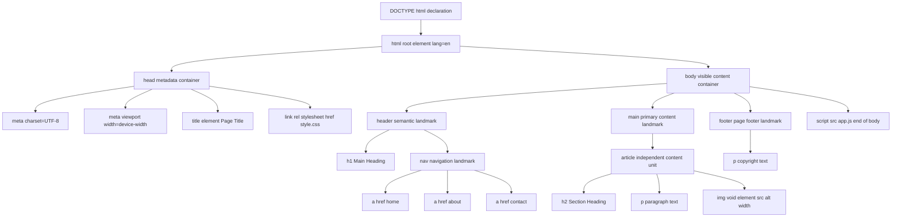
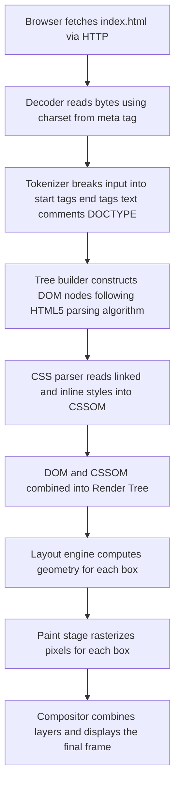

# HTML Architecture: Structure of HTML/XHTML documents, tag-based structures

<!-- SECTION_1_START -->
# HTML Architecture: Structure of HTML/XHTML Documents

> [!IMPORTANT]
> **KTU 2024 Scheme | GXEST203 | Module 4 — Web Design Fundamentals**
> This module targets **CO4 (Create well-structured web pages using HTML5 and CSS3)** and is typically tested as a direct 7–14 mark analytical/constructive question in the End Semester Evaluation (ESE).

## 1.1 Formal Definition (KTU 2024 Syllabus Terminology)

**HTML (HyperText Markup Language)** is the standard, declarative, tag-based markup language used to structure content on the World Wide Web. As per the **W3C (World Wide Web Consortium)** and **WHATWG** standards adopted in the KTU 2024 computing curriculum, an HTML document is a plain-text file composed of a hierarchical tree of **elements**, where each element is delimited by a pair of angle-bracket **tags** (`<tag>` opening, `</tag>` closing) that instruct the browser on how to render the enclosed content.

**XHTML (Extensible HyperText Markup Language)** is a stricter, XML-compliant reformulation of HTML. It follows the syntax rules of **XML (Extensible Markup Language)**, meaning every tag must be properly closed, every attribute value must be quoted, every element must be properly nested, and the document must be **well-formed** — a strict requirement that HTML5 relaxed but XHTML retains.

> [!NOTE]
> **Core Definition (Board-Examiner Ready):**
> *HTML is a **markup**, not a **programming**, language. It uses **tags** to describe the semantic role of text and media so that browsers can render structured documents. XHTML is HTML rewritten as a well-formed XML application.*

## 1.2 Conceptual Analogy — The "House Blueprint" Intuition

Imagine you are an **architect building a house**:

| Real-World Object | HTML/XHTML Equivalent | Function |
|---|---|---|
| Building permit filed with the municipality | `<!DOCTYPE html>` declaration | Tells the browser which version of HTML the document follows |
| The plot of land (the entire property) | `<html>` root element | The outermost container — everything lives inside it |
| The technical room (water, electric plans) not visible to guests | `<head>` section | Holds **metadata** — title, character set, links to CSS, scripts |
| The living room, kitchen, bedrooms (what visitors see) | `<body>` section | Holds all **visible content** — text, images, videos, forms |
| A room | `<section>`, `<article>`, `<div>` | Logical grouping of content |
| A door or window label | `<h1>`–`<h6>`, `<p>`, ``, `<a>` | Individual semantic elements |
| A furniture item specification sheet | Attributes (`class`, `id`, `src`, `href`) | Additional information **about** the element |

Just as a blueprint specifies *where* walls go and *what* they contain, HTML specifies *where* content goes and *what role* it plays semantically.

> [!TIP]
> **Think of tags as labeled boxes.** When you write `<p>Hello</p>`, you are placing the word "Hello" inside a labeled box that says "this is a paragraph." The browser reads the label and styles the content accordingly.

## 1.3 The Three Foundational Building Blocks

Every HTML/XHTML document is constructed from three primitives:

1. **Elements** — A pair of tags and the content between them (e.g., `<p>content</p>`).
2. **Tags** — The angle-bracket delimiters themselves (`<p>`, `</p>`).
3. **Attributes** — Name/value pairs inside the opening tag that provide metadata about the element (e.g., ``).

> [!IMPORTANT]
> **KTU 2024 Highlight — Tag Anatomy:**
> The opening tag may carry **zero or more attributes**, each in the form `name="value"`. Attributes never appear in closing tags. This is a frequent 3-mark board question.

<!-- SECTION_1_END -->

<!-- SECTION_2_START -->
# Deep Theoretical Analysis & KTU High-Yield Formula Sheet

## 2.1 The Canonical Skeleton of an HTML5 Document

The HTML5 specification (the current W3C recommendation and the version prescribed by KTU 2024) defines a **minimal, mandatory skeleton** that every valid document must follow. Below is the full structural breakdown:

```html
<!DOCTYPE html>
<html lang="en">
    <head>
        <meta charset="UTF-8">
        <meta name="viewport" content="width=device-width, initial-scale=1.0">
        <title>Page Title Shown in Browser Tab</title>
        <link rel="stylesheet" href="styles.css">
    </head>
    <body>
        <h1>Main Heading</h1>
        <p>Visible page content goes here.</p>
        <script src="app.js"></script>
    </body>
</html>
```

### Step-by-Step Logical Decomposition

| Step | Tag / Declaration | Why It Exists (The "How & Why") |
|---|---|---|
| 1 | `<!DOCTYPE html>` | A **declaration**, *not* a tag. Tells the browser to render the page in **standards mode** (HTML5) instead of "quirks mode" (legacy IE behavior). Without it, browsers guess and may render inconsistently. |
| 2 | `<html lang="en">` | The **root element**. The `lang` attribute is a critical accessibility feature — screen readers use it to select the correct pronunciation engine. The closing `</html>` is mandatory in XHTML. |
| 3 | `<head>` | The **metadata container**. Contents are *not* rendered on the page itself but supply information *about* the page. Must come before `<body>`. |
| 4 | `<meta charset="UTF-8">` | Declares the **character encoding** so the browser correctly interprets Unicode characters (essential for ₹, €, é, 中). Must be the first child of `<head>`. |
| 5 | `<meta name="viewport" ...>` | A **responsive design** directive for mobile browsers. Without it, mobile devices render at desktop width (980px) and zoom out. |
| 6 | `<title>` | Sets the text shown on the browser tab, in bookmarks, and in search-engine results. **Required** in every HTML document. |
| 7 | `<link>` | Self-closing void element. Connects **external resources** such as stylesheets, favicons, and preloaded assets. |
| 8 | `<body>` | The **visible content container**. Everything the user sees in the browser window lives here. |
| 9 | `<h1>`, `<p>` | **Semantic content elements** describing the page structure. |
| 10 | `<script>` | Embeds or references executable JavaScript. Placed at the end of `<body>` so the page renders *before* scripts block parsing. |

## 2.2 Tag Classification — The Four Kinds of Tags

This classification is a **high-yield KTU topic** and appears almost every semester:

| Tag Category | Definition | Examples | Self-Closing? |
|---|---|---|---|
| **Container / Paired Tags** | Have separate opening and closing tags; enclose content | `<p>...</p>`, `<div>...</div>`, `<a>...</a>` | No |
| **Void / Empty Tags** | Cannot contain content; no closing tag in HTML5 | `<br>`, `<hr>`, ``, `<input>`, `<meta>`, `<link>` | Yes (HTML5); mandatory in XHTML |
| **Deprecated Tags** | Removed or obsolete; should not be used in modern code | `<font>`, `<center>`, `<marquee>`, `<frame>`, `<applet>` | N/A |
| **Semantic Tags** | HTML5 tags that convey *meaning*, not just appearance | `<header>`, `<nav>`, `<main>`, `<article>`, `<section>`, `<footer>`, `<aside>` | No |

> [!NOTE]
> **Void Tag Rule (Board Favorite):**
> In HTML5, void elements may be written as `<br>` or `<br/>` (the trailing slash is optional and ignored). In **XHTML**, the self-closing slash is **mandatory**: `<br />` is required, and a space before `/` is the conventional XML-friendly form.

## 2.3 HTML5 vs. XHTML — Side-by-Side Strictness Comparison

XHTML was developed to bring XML's discipline to web markup. The KTU 2024 syllabus explicitly requires students to know the differences:

| Rule | HTML5 Behavior | XHTML 1.0 Strict Behavior |
|---|---|---|
| Case sensitivity of tags | Case-insensitive (`<P>` = `<p>`) | **Case-sensitive — must be lowercase** |
| Closing tags | Optional for void elements | **Mandatory for *all* elements** |
| Attribute quoting | Quotes may be omitted in some legacy cases | **All attribute values must be quoted** (`""` or `''`) |
| Attribute minimization | Allowed (e.g., `disabled`) | **Forbidden** (must write `disabled="disabled"`) |
| Root element | `<html>` is recommended | **Mandatory** `<html xmlns="http://www.w3.org/1999/xhtml">` |
| Document must be well-formed XML | No | **Yes** — parser will refuse malformed documents |
| Nesting | Browser auto-corrects | **Strictly enforced** — overlapping tags are errors |
| DOCTYPE | `<!DOCTYPE html>` (short form) | Long-form DTD reference required |

## 2.4 KTU High-Yield Formula / Cheat Sheet

| Concept | Required Syntax | Purpose / Notes |
|---|---|---|
| DOCTYPE declaration | `<!DOCTYPE html>` | Enables standards mode (HTML5) |
| Root element | `<html lang="en">` | Topmost container; `lang` aids accessibility |
| Metadata container | `<head>...</head>` | Non-visible page information |
| Character set | `<meta charset="UTF-8">` | Default & recommended for Unicode |
| Responsive viewport | `<meta name="viewport" content="width=device-width, initial-scale=1.0">` | Mobile-first rendering |
| Page title | `<title>...</title>` | Browser tab / SEO / bookmarks |
| External CSS link | `<link rel="stylesheet" href="style.css">` | Connects stylesheet |
| Body container | `<body>...</body>` | All visible content |
| Self-closing void tag | `` | No closing tag in HTML5 |
| Strict self-close (XHTML) | `` | Space + slash required in XHTML |
| Comment | `<!-- comment text -->` | Ignored by browser; `<!--` and `-->` cannot be in content |
| Block-level vs Inline | `<div>` (block) vs `<span>` (inline) | Defines layout flow behavior |
| Document tree root count | **Exactly one** `<html>` element | Per document |
| Nesting invariant | $\text{Open tags} = \text{Close tags}$ | Well-formedness condition |
| Attribute count per tag | $\ge 0$ attributes | Order-independent |

## 2.5 Engineering Utility — Where This Architecture Is Used

The HTML/XHTML architecture is not an academic curiosity; it is the foundation of every layer of modern web engineering:

- **Frontend Development** — React, Vue, and Angular all transpile their JSX/templates down to HTML nodes that the browser parses using exactly this document structure.
- **SEO & Web Crawlers** — Google's crawler walks the `<head>` for `<meta>` tags and the `<body>` for `<h1>`–`<h6>` hierarchy to rank pages.
- **Accessibility (a11y)** — Screen readers rely on semantic tags (`<nav>`, `<main>`, `<header>`) to let visually impaired users navigate by landmark.
- **Email Rendering** — Most email clients (Outlook, Gmail) render using a stripped-down XHTML engine, which is why emails use `table`-based XHTML layouts even in 2024.
- **Static Site Generators** — Tools like Jekyll, Hugo, and 11ty read HTML structure to produce millions of static pages.
- **Web Scraping & Automation** — Selenium, BeautifulSoup, and Puppeteer parse the DOM (Document Object Model) tree that is built *from* this exact HTML architecture.

<!-- SECTION_2_END -->

<!-- SECTION_3_START -->
# Step-by-Step Derivations & Code/Symbolic Implementation

## 3.1 Building an HTML5 Document From Scratch — Full Walkthrough

Below is the **exhaustive construction** of a valid HTML5 document. Each line is annotated with its evaluation logic.

**Step 1 — Declare the document type** to switch the browser from quirks mode to standards mode.

```html
<!DOCTYPE html>
```

*Logic:* In HTML5, the DOCTYPE is intentionally short. Its only job is to trigger standards-mode rendering. There is no DTD URL because HTML5 is no longer defined by a DTD.

**Step 2 — Open the root element** and declare the document language.

```html
<html lang="en">
```

*Logic:* `lang="en"` tells screen readers and search engines the document's primary language. The opening tag here is matched by `</html>` at the end of the file (line 14 below).

**Step 3 — Open the head section** for non-visible metadata.

```html
<head>
```

*Logic:* The head must be the first child of `<html>`. It is closed in Step 8.

**Step 4 — Declare the character encoding** as the first child of `<head>`.

```html
<meta charset="UTF-8">
```

*Logic:* Placing this *first* ensures the browser does not have to re-parse the document if a different charset is detected later. UTF-8 covers every character in every modern language.

**Step 5 — Add the responsive viewport meta** for mobile devices.

```html
<meta name="viewport" content="width=device-width, initial-scale=1.0">
```

*Logic:* `width=device-width` makes the layout width match the device's screen width in CSS pixels. `initial-scale=1.0` sets the initial zoom to 100%.

**Step 6 — Set the document title.**

```html
<title>KTU Foundations of Computing - Module 4 Demo</title>
```

*Logic:* The content of `<title>` is what appears on the browser tab, in bookmark lists, and in search-engine result titles.

**Step 7 — Link an external stylesheet.**

```html
<link rel="stylesheet" href="styles.css">
```

*Logic:* The `rel="stylesheet"` attribute tells the browser this is a CSS file. The `href` is a relative URL resolved against the document's location.

**Step 8 — Close the head section.**

```html
</head>
```

**Step 9 — Open the body section** for all visible content.

```html
<body>
```

**Step 10 — Add semantic structural content.**

```html
<header>
    <h1>Welcome to Web Design</h1>
    <nav>
        <a href="#home">Home</a> |
        <a href="#about">About</a> |
        <a href="#contact">Contact</a>
    </nav>
</header>
<main>
    <article>
        <h2>HTML Architecture</h2>
        <p>An HTML document is a tree of nested elements.</p>
        
    </article>
</main>
<footer>
    <p>&copy; 2024 KTU GXEST203</p>
</footer>
```

*Logic:* The `<header>`, `<nav>`, `<main>`, `<article>`, and `<footer>` are HTML5 **semantic landmarks** (also called sectioning content). They replace the older `<div id="header">` pattern. The `` is a void element; it has no closing tag. Its `alt` attribute is **required for accessibility** and is read aloud by screen readers.

**Step 11 — Embed an external script at the end of the body.**

```html
<script src="app.js"></script>
```

*Logic:* Placing `<script>` at the end of `<body>` (rather than in `<head>`) lets the browser paint the HTML content *before* downloading/parsing the JavaScript, improving perceived load time.

**Step 12 — Close the body and root elements.**

```html
</body>
</html>
```

### The Complete, Valid HTML5 Document

```html
<!DOCTYPE html>
<html lang="en">
<head>
    <meta charset="UTF-8">
    <meta name="viewport" content="width=device-width, initial-scale=1.0">
    <title>KTU Foundations of Computing - Module 4 Demo</title>
    <link rel="stylesheet" href="styles.css">
</head>
<body>
    <header>
        <h1>Welcome to Web Design</h1>
        <nav>
            <a href="#home">Home</a> |
            <a href="#about">About</a> |
            <a href="#contact">Contact</a>
        </nav>
    </header>
    <main>
        <article>
            <h2>HTML Architecture</h2>
            <p>An HTML document is a tree of nested elements.</p>
            
        </article>
    </main>
    <footer>
        <p>&copy; 2024 KTU GXEST203</p>
    </footer>
    <script src="app.js"></script>
</body>
</html>
```

## 3.2 The XHTML 1.0 Strict Equivalent — Same Content, Stricter Rules

The same content rewritten as a **well-formed XHTML 1.0 Strict** document. Every difference is intentional and worth 1 mark each on the KTU exam:

```html
<?xml version="1.0" encoding="UTF-8"?>
<!DOCTYPE html PUBLIC "-//W3C//DTD XHTML 1.0 Strict//EN"
    "http://www.w3.org/TR/xhtml1/DTD/xhtml1-strict.dtd">
<html xmlns="http://www.w3.org/1999/xhtml" xml:lang="en" lang="en">
<head>
    <meta http-equiv="Content-Type" content="text/html; charset=UTF-8" />
    <meta name="viewport" content="width=device-width, initial-scale=1.0" />
    <title>KTU Foundations of Computing - Module 4 Demo</title>
    <link rel="stylesheet" href="styles.css" />
</head>
<body>
    <header>
        <h1>Welcome to Web Design</h1>
        <nav>
            <a href="#home">Home</a> |
            <a href="#about">About</a> |
            <a href="#contact">Contact</a>
        </nav>
    </header>
    <main>
        <article>
            <h2>HTML Architecture</h2>
            <p>An HTML document is a tree of nested elements.</p>
            
        </article>
    </main>
    <footer>
        <p>&copy; 2024 KTU GXEST203</p>
    </footer>
    <script src="app.js"></script>
</body>
</html>
```

### Diff Analysis — Line-by-Line What Changed

| Element | HTML5 Form | XHTML 1.0 Strict Form | Why |
|---|---|---|---|
| XML prolog | (absent) | `<?xml version="1.0" encoding="UTF-8"?>` | XHTML is an XML application; optional but recommended |
| DOCTYPE | `<!DOCTYPE html>` | Long-form `<!DOCTYPE html PUBLIC "-//W3C//DTD XHTML 1.0 Strict//EN" "...">` | XHTML requires a DTD reference |
| Root attribute | `lang="en"` | `xmlns="..." xml:lang="en" lang="en"` | XHTML elements live in the XHTML XML namespace |
| Meta charset | `<meta charset="UTF-8">` | `<meta http-equiv="Content-Type" content="text/html; charset=UTF-8" />` | Older XHTML-style declaration; self-closed |
| Void elements | `<link rel="stylesheet" href="styles.css">` | `<link rel="stylesheet" href="styles.css" />` | Self-close slash is **mandatory** in XHTML |
| Image element | `` | `` | Same mandatory self-close rule |
| Attribute minimization | (not present here) | Would require `disabled="disabled"` not bare `disabled` | XHTML forbids unquoted/minimized attributes |

## 3.3 Symbolic Well-Formedness Conditions (for the Theory Section)

The well-formedness of an HTML/XHTML document can be expressed formally. Let $D$ be the set of opening tags in a document, $C$ the set of closing tags, and $V$ the set of void/self-closed tags. Then the document is well-formed if and only if:

$$
\forall t \in D \setminus V \; : \; \exists\, t' \in C \text{ such that } t' \text{ matches } t
$$

$$
\forall (t_1, t_2) \text{ with } t_1 \text{ opened before } t_2 \text{ closed} \; : \; \text{no overlap exists}
$$

$$
\forall \text{attribute } a \; : \; a.\text{value} \text{ is enclosed in matching quotes}
$$

$$
\text{RootCount} = \mid \{ \text{<html>} \} \mid = 1
$$

$$
\forall e \in D \; : \; \text{case}(e) = \text{lowercase} \quad \text{(XHTML only)}
$$

> [!NOTE]
> **Examiner's Insight:** Most students lose marks on Part B because they write `<HTML>` (uppercase), forget the `<!DOCTYPE>`, or omit the `</html>` close. Each of these is a 1-mark deduction in the valuation key.

## 3.4 Programmatic Validation — A Python Linter Snippet

A small Python script that mimics what an XHTML strict parser would check:

```python
"""
html_validator.py
A minimal well-formedness checker for an XHTML-style document.
Usage: python html_validator.py document.html
"""

from html.parser import HTMLParser
from typing import List, Tuple
import sys


class XHTMLWellFormednessChecker(HTMLParser):
    """Validates strict XHTML well-formedness rules."""

    VOID_TAGS: set = {
        "area", "base", "br", "col", "embed", "hr", "img",
        "input", "link", "meta", "param", "source", "track", "wbr"
    }

    def __init__(self) -> None:
        super().__init__(convert_charrefs=True)
        self.errors: List[str] = []
        self.stack: List[str] = []
        self.line_no: int = 1

    def handle_starttag(self, tag: str, attrs: List[Tuple[str, str]]) -> None:
        if tag.lower() != tag:
            self.errors.append(
                f"Line {self.line_no}: Tag <{tag}> is not lowercase."
            )
        for name, value in attrs:
            if value is None:
                self.errors.append(
                    f"Line {self.line_no}: Attribute '{name}' has no quoted value."
                )
        if tag not in self.VOID_TAGS:
            self.stack.append(tag)

    def handle_endtag(self, tag: str) -> None:
        if tag.lower() != tag:
            self.errors.append(
                f"Line {self.line_no}: Closing tag </{tag}> is not lowercase."
            )
        if not self.stack:
            self.errors.append(
                f"Line {self.line_no}: Closing tag </{tag}> with empty stack."
            )
            return
        expected = self.stack.pop()
        if expected != tag:
            self.errors.append(
                f"Line {self.line_no}: Mismatched tags: expected </{expected}>, got </{tag}>."
            )

    def error(self, message: str) -> None:
        self.errors.append(f"Parse error: {message}")


def validate_file(path: str) -> int:
    """Returns 0 on success, 1 on validation failure."""
    try:
        with open(path, "r", encoding="utf-8") as f:
            content: str = f.read()
    except FileNotFoundError:
        print(f"ERROR: File '{path}' not found.", file=sys.stderr)
        return 2
    except UnicodeDecodeError as e:
        print(f"ERROR: Encoding error reading '{path}': {e}", file=sys.stderr)
        return 2

    parser: XHTMLWellFormednessChecker = XHTMLWellFormednessChecker()
    try:
        parser.feed(content)
    except Exception as exc:
        parser.errors.append(f"Hard parse failure: {exc}")

    if parser.stack:
        for unclosed in parser.stack:
            parser.errors.append(f"Unclosed tag: <{unclosed}>")

    if parser.errors:
        print("=== XHTML VALIDATION FAILED ===")
        for err in parser.errors:
            print(f"  - {err}")
        return 1

    print("=== XHTML VALIDATION PASSED ===")
    return 0


if __name__ == "__main__":
    target: str = sys.argv[1] if len(sys.argv) > 1 else "index.html"
    sys.exit(validate_file(target))
```

*Logic explained:* The `HTMLParser` from Python's standard library is fed the document. For every start tag we verify it is lowercase and that every attribute has a quoted value. Void tags are not pushed onto the stack because they have no closing tag. The end-tag handler checks the top of the stack for an LIFO match. Any leftover stack items at the end indicate unclosed tags — a fatal XHTML well-formedness error.

<!-- SECTION_3_END -->

<!-- SECTION_4_START -->
# Structural Diagrams & Schematics

## 4.1 The HTML5 Document Tree (DOM Root Topology)

The following Mermaid diagram visualizes the **Document Object Model (DOM) tree** that the browser constructs when parsing the canonical HTML5 skeleton. Every node represents an element; the edges represent parent–child containment.



**Reading the diagram:**
* The single root is the `<html>` element. The DOCTYPE is *not* an element; it is a sibling directive shown only for completeness.
* The tree splits into exactly two first-level children of `<html>`: `<head>` and `<body>`. This invariant is enforced by the HTML5 parser.
* Void elements (`<meta>`, `<link>`, ``, `<br>`, `<hr>`, `<input>`) appear as leaves with no children — they cannot contain content.
* Semantic landmarks (`<header>`, `<nav>`, `<main>`, `<article>`, `<footer>`) are block-level containers that may nest further content.

## 4.2 Tag Processing Flow — From Source File to Rendered Page

This sequential flow shows what happens between the moment the browser fetches an `.html` file and the moment pixels appear on the screen.



**Reading the diagram:**
* The HTML file is the *source*. The browser does *not* render the file directly — it parses the file into a tree first.
* The DOM is the structural tree. The CSSOM is the styling tree. Both must exist before the Render Tree can be built.
* This pipeline is the reason **structure** (HTML) and **presentation** (CSS) are kept in separate files: each is optimized independently.

## 4.3 Block-Level vs. Inline Element Containment Matrix

This matrix shows which categories of elements may legally contain which other categories. Violating these rules produces invalid HTML and unpredictable rendering.

| Container Category | May Contain Block | May Contain Inline | May Contain Text Directly | Self-Nesting Allowed |
|---|---|---|---|---|
| `<body>`, `<main>`, `<section>`, `<article>`, `<header>`, `<footer>`, `<nav>`, `<aside>` | Yes | Yes | Yes | No |
| `<div>` (generic block) | Yes | Yes | Yes | No |
| `<p>` (paragraph) | No | Yes | Yes | **No** (`<p>` cannot contain another `<p>`) |
| `<h1>`–`<h6>` (headings) | No | Yes (mostly) | Yes | No |
| `<a>` (anchor, inline) | No (HTML4); Yes (HTML5) | Yes | Yes | No |
| `<span>` (generic inline) | No | Yes | Yes | No |
| `<ul>`, `<ol>` | Only `<li>` | No | No | No |
| `<table>` | Only `<thead>`, `<tbody>`, `<tfoot>`, `<tr>` | No | No | No |
| `<tr>` | Only `<td>`, `<th>` | No | No | No |
| `<form>` | Yes | Yes | Yes | No |

> [!NOTE]
> **Common student error:** Placing a `<div>` inside a `<p>`. When the browser encounters the `<div>` inside the `<p>`, it implicitly closes the `<p>` first to satisfy the rule that paragraphs cannot contain block elements. The DOM tree then differs from what was written in the source.

<!-- SECTION_4_END -->

<!-- SECTION_5_START -->
# KTU 2024 Scheme Examination Question Bank & Topic Recap

## Part A — Short Answer Questions (3 Marks Each)

### Question 1 `[KTU University Exam – July 2024]` — CO4, Remember

**Differentiate between HTML and XHTML. List any three differences.**

**Model Answer (3 Marks):**
*HTML (HyperText Markup Language) is a markup language used to structure web content with a flexible, forgiving syntax. XHTML (Extensible HyperText Markup Language) is a reformulation of HTML that follows the strict syntax rules of XML.*

The three key differences are:
1. *HTML is case-insensitive for tag names; XHTML requires all tags to be in lowercase.* `[1 Mark]`
2. *In HTML, void elements like `<br>` and `` may be written without a closing tag; in XHTML, every element must be closed using a self-closing slash like `<br />` and ``.* `[1 Mark]`
3. *HTML allows browsers to auto-correct malformed markup; XHTML documents must be well-formed XML or the parser will refuse to render them.* `[1 Mark]`

---

### Question 2 `[KTU University Exam – Dec 2023]` — CO4, Understand

**Explain the purpose of the `<!DOCTYPE html>` declaration. Why is it not considered a tag?**

**Model Answer (3 Marks):**
*The `<!DOCTYPE html>` declaration is an instruction to the web browser that informs it which version of HTML the document is written in. Its primary purpose is to switch the browser from "quirks mode" (a legacy backward-compatibility mode that emulates older browser bugs) to "standards mode" (strict compliance with W3C specifications).* `[2 Marks]`

*It is not considered an HTML tag because it is a declaration, not an element. It does not appear in the DOM tree, has no closing form, and does not follow the angle-bracket element syntax of tags like `<html>` or `<body>`. In HTML5, the doctype is intentionally a short, easy-to-remember string.* `[1 Mark]`

---

## Part B — Full 14-Mark Questions (Module Internal Choice)

### Question A `[KTU University Exam – July 2024]` — CO4, Apply & Analyze

**(a)** With the help of a neat diagram, describe the basic structure of an HTML5 document. Explain the role of the `<head>` and `<body>` sections. *(7 Marks)*

**(b)** List and explain any five semantic HTML5 tags with appropriate code snippets. How do semantic tags improve web accessibility? *(7 Marks)*

#### Model Solution — Part (a) [7 Marks]

**The basic structure of an HTML5 document** is shown below:

```html
<!DOCTYPE html>
<html lang="en">
<head>
    <meta charset="UTF-8">
    <title>Page Title</title>
</head>
<body>
    <h1>Hello, World!</h1>
    <p>This is a paragraph.</p>
</body>
</html>
```

**[Correct DOCTYPE and root element with lang attribute: 2 Marks]**

**Role of the `<head>` section:** The `<head>` element is a container for metadata — information *about* the page that is not displayed on the page itself. It typically contains the character encoding declaration, the page title, viewport settings for responsive design, links to external stylesheets and scripts, and SEO-related meta tags. The head must appear before the body in the document and is parsed first by the browser. `[2 Marks]`

**Role of the `<body>` section:** The `<body>` element contains all the visible content of the web page — text, images, videos, headings, paragraphs, lists, tables, forms, and embedded scripts. Every element that should appear in the user's browser window must be placed inside the `<body>` element. There can be only one `<body>` element per document. `[2 Marks]**

**[Closing tags for body and html: 1 Mark]**

#### Model Solution — Part (b) [7 Marks]

Five semantic HTML5 tags are explained below with code examples:

**1. `<header>`** — Represents introductory content or a banner for its nearest ancestor sectioning element or the whole page. It often contains the site logo, primary heading, and navigation.
```html
<header>
    <h1>KTU Learning Portal</h1>
</header>
```
`[1 Mark]`

**2. `<nav>`** — Represents a section of navigation links to other pages or to sections within the same page.
```html
<nav>
    <a href="/home">Home</a> |
    <a href="/courses">Courses</a>
</nav>
```
`[1 Mark]`

**3. `<main>`** — Represents the dominant content of the body of the document. There should be only one `<main>` per page.
```html
<main>
    <article>...</article>
</main>
```
`[1 Mark]`

**4. `<article>`** — Represents a self-contained, independently distributable piece of content such as a blog post, news article, or forum entry.
```html
<article>
    <h2>HTML5 Tutorial</h2>
    <p>HTML5 introduces semantic elements.</p>
</article>
```
`[1 Mark]`

**5. `<footer>`** — Represents the footer of its nearest ancestor section, typically containing copyright info, contact details, or related links.
```html
<footer>
    <p>&copy; 2024 KTU</p>
</footer>
```
`[1 Mark]`

**How semantic tags improve accessibility:** Semantic tags carry *meaning* about the structure of a page, not just visual instructions. Screen readers and assistive technologies use these tags as **landmarks** to allow users to jump directly to the navigation, main content, or footer using keyboard shortcuts. Search engines also use semantic structure to better understand and rank page content. Replacing non-semantic `<div>` elements with semantic ones like `<nav>` and `<main>` dramatically improves both accessibility compliance (WCAG) and SEO performance. `[2 Marks]`

---

### Question B `[KTU University Exam – Dec 2023]` — CO4, Understand & Apply

**(a)** Compare HTML and XHTML. Explain any five syntactical rules that XHTML enforces but HTML does not. *(7 Marks)*

**(b)** Write a complete, valid HTML5 document that contains a header with navigation, a main section with an article containing a heading, paragraph, and image, and a footer. Use proper semantic tags. *(7 Marks)*

#### Model Solution — Part (a) [7 Marks]

**Comparison:** HTML (HyperText Markup Language) is a flexible, browser-tolerant markup language governed by WHATWG/W3C. XHTML (Extensible HyperText Markup Language) is HTML rewritten as a well-formed XML application, governed by stricter rules. The comparison table is: `[1 Mark]`

| Aspect | HTML | XHTML |
|---|---|---|
| Doctype | Short `<!DOCTYPE html>` | Long DTD reference required |
| Case sensitivity | Case-insensitive | Case-sensitive (lowercase only) |
| Closing tags | Optional for void elements | Mandatory for all elements |
| Attribute values | Quotes sometimes optional | Quotes always mandatory |
| Well-formedness | Browser auto-corrects | Strict XML parser enforced |

**Five syntactical rules XHTML enforces that HTML does not:**

1. **Lowercase tag and attribute names:** All tags and attribute names must be written in lowercase. `<P>` is invalid; `<p>` is required. `[1 Mark]`
2. **Mandatory closing of all elements:** Void elements must be self-closed with a space and a slash, e.g., `<br />` and ``. HTML allows `<br>` and ``. `[1 Mark]`
3. **Proper nesting:** Elements must be closed in the reverse order of opening. `<b><i>text</b></i>` is invalid; `<b><i>text</i></b>` is correct. `[1 Mark]`
4. **Quoted attribute values:** Every attribute value must be enclosed in matching single or double quotes. `<input type=text>` is invalid; `<input type="text" />` is required. `[1 Mark]`
5. **No attribute minimization:** Boolean attributes cannot be written in shorthand. `disabled` is invalid; `disabled="disabled"` is the correct XHTML form. `[1 Mark]`

**[Conclusion stating that XHTML brings XML's rigor to web markup: 1 Mark]**

#### Model Solution — Part (b) [7 Marks]

**Complete valid HTML5 document:**

```html
<!DOCTYPE html>
<html lang="en">
<head>
    <meta charset="UTF-8">
    <meta name="viewport" content="width=device-width, initial-scale=1.0">
    <title>KTU Module 4 Demo Page</title>
</head>
<body>
    <header>
        <h1>Web Design Hub</h1>
        <nav>
            <a href="#home">Home</a> |
            <a href="#tutorials">Tutorials</a> |
            <a href="#contact">Contact</a>
        </nav>
    </header>

    <main>
        <article>
            <h2>Understanding HTML Architecture</h2>
            <p>
                An HTML document is a tree of nested elements.
                The browser parses tags to construct the DOM.
            </p>
            
        </article>
    </main>

    <footer>
        <p>&copy; 2024 KTU GXEST203. All rights reserved.</p>
    </footer>
</body>
</html>
```

**Valuation Key — Incremental Mark Distribution:**

* `[<!DOCTYPE html> declaration: 1 Mark]`
* `[Opening <html lang="en"> with proper meta charset and title in head: 1 Mark]`
* `[Header containing h1 and nav with anchor tags: 1 Mark]`
* `[Main section with article element: 1 Mark]`
* `[Article containing h2, p, and img with alt attribute: 1 Mark]`
* `[Footer with copyright: 1 Mark]`
* `[Proper closing of body and html tags, and overall document validity: 1 Mark]`

---

> [!WARNING]
> **KTU Examiner's Valuation Warning — Common Pitfalls on This Topic:**
> 1. **Forgetting the DOCTYPE** — A document without `<!DOCTYPE html>` falls back to quirks mode and is considered incomplete. **Deduction: 1 Mark.**
> 2. **Omitting `</html>` or `</body>`** — While HTML5 is forgiving, the KTU valuation key explicitly awards a mark for "document closed properly." **Deduction: 1 Mark.**
> 3. **Writing `<br>` instead of `<br />` when the question asks for XHTML** — XHTML requires self-closing void elements with a leading space. **Deduction: 1 Mark.**
> 4. **Using `<font>` or `<center>`** — These are deprecated and will be marked down for using obsolete syntax. **Deduction: 1 Mark per instance.**
> 5. **No `alt` attribute on ``** — Accessibility violations are penalized explicitly in 2024-scheme rubrics. **Deduction: 1 Mark.**
> 6. **Mixing cases** (`<HTML>`, `<Body>`) — XHTML is strictly lowercase. Even in HTML5, the official convention is lowercase. **Deduction: 0.5 Mark per mixed-case tag.**

---

## Topic Recap & Important Things to Remember

- **HTML** is a *markup* (declarative structure) language, **not a programming language**. It uses tags to describe the semantic role of content.
- **XHTML** is HTML rewritten as a *well-formed XML* application. It is stricter in every way: lowercase tags, mandatory closing, quoted attributes, no minimization.
- The **mandatory minimal HTML5 document** consists of: `<!DOCTYPE html>`, `<html lang="en">`, `<head>` (with `<meta charset="UTF-8">` and `<title>`), and `<body>`. Missing any one of these is a mark-deduction trap.
- **Tags come in two main flavors:** *container (paired)* tags like `<p>...</p>`, and *void (empty/self-closing)* tags like `<br>`, ``, `<meta>`, `<link>`, `<hr>`, `<input>`. The HTML5 parser recognizes these by a hard-coded list.
- **Attributes** live *only* in the opening tag of an element (or in the only tag, for void elements). They take the form `name="value"`.
- The **DOM tree** built from the document has exactly one root: the `<html>` element. Its two first-level children are always `<head>` (metadata) and `<body>` (content), in that order.
- The **`<head>` element** is *not rendered*. It contains metadata, the `<title>`, links to CSS/JS, and meta directives.
- The **`<body>` element** contains *all visible content*. There can be only one `<body>` per document.
- **Semantic HTML5 tags** (`<header>`, `<nav>`, `<main>`, `<article>`, `<section>`, `<aside>`, `<footer>`) carry meaning. Using them improves accessibility (screen reader landmarks), SEO, and code maintainability.
- **Block-level** elements (`<div>`, `<p>`, `<h1>`–`<h6>`, `<ul>`, `<li>`, `<table>`) start on a new line and take full width. **Inline** elements (`<span>`, `<a>`, ``, `<strong>`, `<em>`) flow within text. Knowing this distinction is essential for layout questions.
- **HTML comments** use `<!-- comment text -->`. The string `--` is forbidden inside the comment body, and comments cannot be nested.
- **Character encoding** must be declared in the first 1024 bytes of the document, ideally as `<meta charset="UTF-8">` as the first child of `<head>`.
- **The viewport meta tag** is mandatory for mobile-responsive design. Without it, mobile browsers render at 980px width and zoom out.
- **Common void tags to memorize:** `<area>`, `<base>`, `<br>`, `<col>`, `<embed>`, `<hr>`, ``, `<input>`, `<link>`, `<meta>`, `<param>`, `<source>`, `<track>`, `<wbr>`.
- **Deprecated tags to avoid** (board mark deductions): `<font>`, `<center>`, `<marquee>`, `<frame>`, `<frameset>`, `<applet>`, `<big>`, `<tt>`.
- **The `` tag requires `alt`**, the `<a>` tag requires `href`, the `<html>` tag should carry `lang`, and the `<meta>` tag should declare `charset="UTF-8"`. These four "required attributes" are the most-tested facts on the topic.
- **Well-formedness invariant:** For a document to be valid, $\text{open tags} = \text{close tags}$, no overlaps, and the `<html>` root is unique.
- **The DOCTYPE is not a tag** — it is a declaration, has no closing form, and is invisible in the DOM tree.
<!-- SECTION_5_END -->
