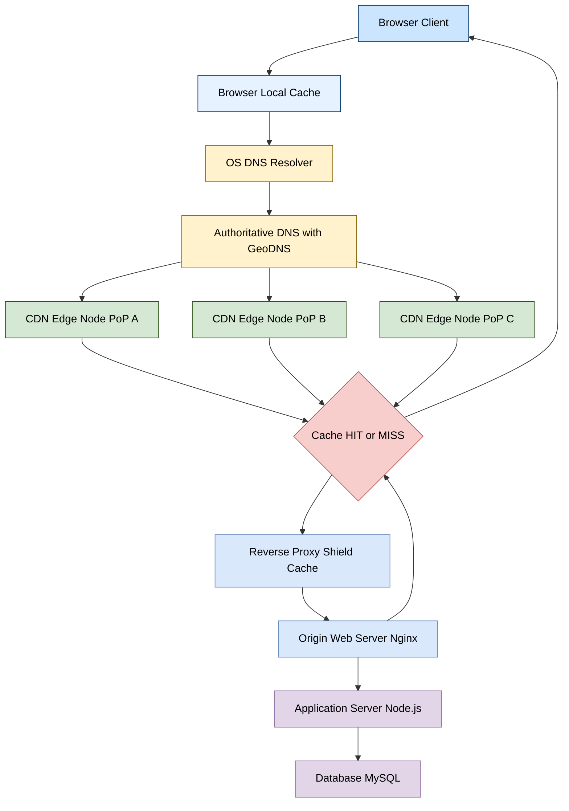
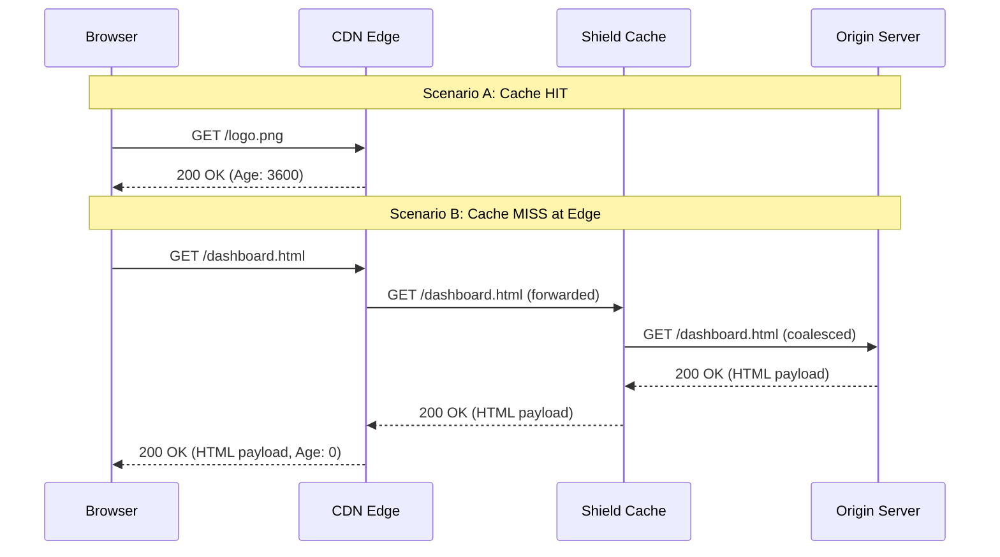
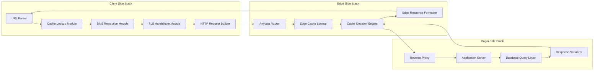
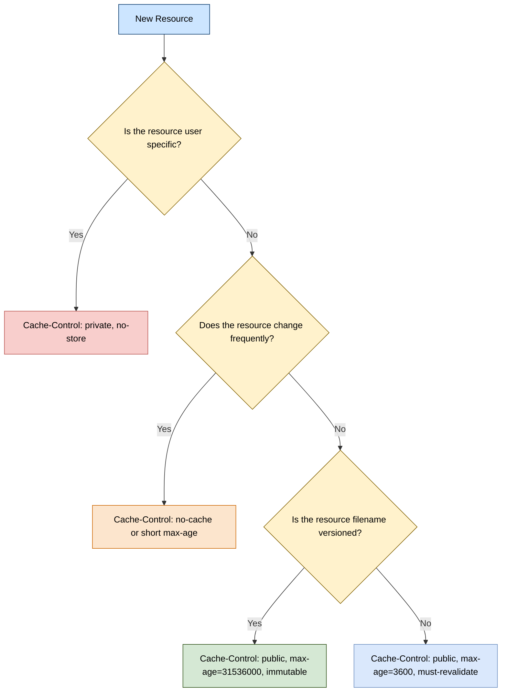

# Principles of content delivery frameworks across the internet

<!-- SECTION_1_START -->

# Principles of Content Delivery Frameworks Across the Internet

## 1. Core Technical Definition

A **Content Delivery Framework (CDF)** is a geographically distributed network architecture comprising multiple interconnected servers, edge nodes, and intelligent routing mechanisms designed to deliver web resources (HTML documents, images, JavaScript bundles, video streams, and API responses) to end-users with minimal latency, maximum availability, and optimized bandwidth consumption. In the KTU 2024 Scheme context for **GXEST203**, this concept is studied under the broader umbrella of *Web Design Fundamentals* because every modern web design decision (asset bundling, font loading, image formats, lazy rendering) is ultimately constrained by how the content delivery framework transports bits from the origin to the browser.

> [!NOTE]
> **Formal KTU Definition (2024 Scheme):**
> A content delivery framework is the layered system of protocols, servers, caching proxies, and routing policies that collectively determine **how**, **from where**, and **how fast** a web resource reaches the requesting client over the public internet.

The most widely deployed instantiation of this framework is the **Content Delivery Network (CDN)**. A CDN is a network of **Points of Presence (PoPs)** scattered across continents, each hosting a *cache* of the origin server's static and semi-static content. Commercial CDNs operated by providers such as **Cloudflare**, **Akamai**, **Amazon CloudFront**, and **Fastly** collectively serve more than **70%** of global web traffic.

### Three Foundational Pillars

| Pillar | Role in Delivery | KTU 2024 Mapping |
|---|---|---|
| **Origin Server** | The authoritative source of truth where the application code and database live | Maps to backend web servers (Apache, Nginx) |
| **Edge Network** | Distributed cache nodes closer to the user | Maps to CDN PoPs and reverse proxies |
| **Request Router / DNS Resolver** | Decides *which* edge node serves a given client | Maps to Anycast routing and GeoDNS |

> [!IMPORTANT]
> **Syllabus Highlight (Module 4, GXEST203):**
> Students must be able to differentiate between **un-cached (cache miss)** and **cached (cache hit)** request paths, and must understand why the **Time To First Byte (TTFB)** metric varies depending on which node in the framework responds.

---

## 2. Conceptual Analogy and Intuitive Overview

Imagine you run a popular South Indian restaurant chain — say, a chain of *dosa* outlets — and your signature dish (the content) is the **Masala Dosa**. If you prepare it only at a single central kitchen in Kottayam, every customer in Thiruvananthapuram, Kochi, and Kasaragod would suffer a long wait while the dish travels hundreds of kilometers. To solve this, you open small **kitchen franchises** (edge nodes) at every district headquarters. Each franchise keeps a pre-made stock of *batter* and *ready masala fillings* (the cache). When a customer in Kannur orders a dosa, the local franchise fulfills it instantly. Only when a special request arrives (like a Jini Dosa with a unique filling) does the request get escalated to the central kitchen in Kottayam.

**Mapping the analogy back to the internet:**

- The *dosa* = the HTML/JS/CSS payload or video file.
- The *central kitchen* = the **Origin Server**.
- The *district franchises* = the **Edge PoPs** of a CDN.
- The *customer's location awareness* = **GeoDNS** (geographic DNS resolution).
- The *pre-made batter* = the **cached resource** at the edge.
- The *special Jini Dosa* = a **cache miss** that requires an **origin fetch**.

> [!VISUALIZATION CONTROL]
> **Concept:** Request Path Latency Comparison (Origin vs. Edge)
>
> **Desmos Input Equations (where x = distance in km, y = approximate latency in ms):**
> * `y_{\text{origin}} = 0.05 \cdot x + 20`
> * `y_{\text{edge}} = 0.02 \cdot x + 5`
>
> **Visual Description:** Plot both lines on a Cartesian plane. The origin line begins at a higher y-intercept (20 ms baseline processing) and climbs with a steeper slope as physical distance increases. The edge line begins at a much lower y-intercept (5 ms edge processing) and rises gently. The two lines visually demonstrate why an edge-served request from a user 2000 km away completes in roughly 45 ms, while the same request served by a single origin would take 120 ms. The shaded region between the curves represents the **latency saved by the CDN**.

This intuition is the foundation for everything that follows in the module — from choosing an image format, to deciding whether to inline a font, to configuring cache-control headers.

---

## 3. Why This Topic Exists in a *Web Design* Course

Many beginners assume that a *designer* only writes HTML and CSS. In reality, every design choice interacts with the delivery framework. Choosing a **6 MB hero image** instead of a compressed **250 KB WebP** directly multiplies the origin's bandwidth cost. Inlining critical CSS into the HTML document is a delivery-framework-aware decision because it removes a *Round Trip Time (RTT)* from the critical rendering path. Therefore, KTU 2024 explicitly bundles *Principles of content delivery* under Web Design Fundamentals so that students build correct mental models from day one.

> [!TIP]
> **Quick Sanity Rule for Web Designers:** If a resource will be requested by users across multiple continents and the resource rarely changes, it *should* be cacheable at the edge. If the resource is personalized (e.g., a logged-in dashboard), it generally *should not* be cached.

<!-- SECTION_1_END -->

<!-- SECTION_2_START -->

# Deep Theoretical Analysis and KTU High-Yield Formula Sheet

## 1. Layered Architecture of a Content Delivery Framework

A modern content delivery framework is best understood as a **stack of five cooperating layers**. Each layer has a single well-defined responsibility, which is why the architecture scales globally without ambiguity.

### Layer 1 — The Authoritative Origin

This is the server (or a small cluster) that owns the **canonical version** of every resource. For a university website, the origin is the Apache or Nginx server in the data center hosting the PHP/Node.js application and the MySQL database. The origin has three defining properties:

1. It is the **single source of truth**.
2. It is the **slowest** node to reach from a distant client.
3. It is the **most expensive** node to scale because every cache miss costs it a database query or a disk read.

### Layer 2 — The Reverse Proxy / Shield Cache

Sitting in front of the origin is a **reverse proxy** (also called a *shield* or *parent cache*). Its job is to absorb repeated identical requests — for example, the home page requested by 10,000 users in one minute. The reverse proxy **deduplicates** these requests and forwards a single coalesced request to the origin. This protects the origin from being overwhelmed by traffic spikes, including those caused by the well-known **thundering herd** problem.

### Layer 3 — The Edge Cache Network

This is the **CDN** proper — a fleet of servers distributed across **hundreds of cities**. When a user in Berlin requests `https://example.com/logo.png`, the CDN routes the request to its **Frankfurt PoP**, which has likely already cached the image. The browser receives the response in under 30 ms. The edge cache is governed by a set of **HTTP cache-control directives**: `Cache-Control: public, max-age=86400`, `ETag`, `Last-Modified`, and `Vary`.

### Layer 4 — The DNS and Routing Layer

Before any HTTP packet leaves the user's device, the browser must resolve the hostname into an IP address. **Authoritative DNS** servers return *different* IP addresses for the *same* hostname based on the resolver's geographic region. This technique is called **GeoDNS** or **IP Anycast**. A user in Tokyo querying `www.example.com` may receive the IP `203.0.113.10` (Tokyo edge), while a user in São Paulo receives `203.0.113.40` (São Paulo edge). The DNS layer is therefore the **traffic cop** of the entire delivery framework.

### Layer 5 — The Client-Side Browser Cache

Finally, the user's own browser maintains a small in-memory and on-disk cache. When the user revisits a page, the browser may satisfy the request **without ever contacting the network**. This is governed by the `Cache-Control` header and the `Expires` header returned by the server.

---

## 2. The Anatomy of an HTTP Request Through the Framework

When a user types a URL into a browser, the following sequence unfolds. Each numbered step corresponds to a node in the delivery framework.

1. **Browser cache lookup** — The browser checks its own disk cache. If the resource is fresh, it is rendered immediately. No network activity occurs.
2. **DNS resolution** — If the resource is stale or missing, the browser asks the OS to resolve the hostname. The OS queries a recursive resolver, which then asks the authoritative DNS server. The DNS server applies GeoDNS logic and returns the **nearest edge IP address**.
3. **TCP / TLS handshake** — The browser opens a TCP connection (3-way handshake) to the edge IP. If HTTPS, a TLS 1.3 handshake follows. Modern browsers and CDNs use **TLS False Start** and **0-RTT resumption** to shave milliseconds off this step.
4. **HTTP request to the edge** — The browser sends `GET /index.html HTTP/1.1`. The edge server receives the request.
5. **Cache lookup at the edge** — The edge checks its local cache. Two outcomes are possible:
    * **Cache HIT:** the edge returns the resource directly (status code 200 with `Age` header).
    * **Cache MISS:** the edge forwards the request to the origin (or to the parent shield cache).
6. **Origin fetch (if missed)** — The origin returns the resource. The edge stores a copy (subject to cache-control rules) and forwards it to the client.
7. **Response delivery** — The browser receives the bytes, parses the HTML, and begins the **critical rendering path**.

> [!IMPORTANT]
> **Cache-Control Directives You Must Memorize for KTU:**
>
> * `public` — the response may be cached by *any* cache (browser, CDN, proxy).
> * `private` — the response may be cached only by the *end-user's* browser, not by intermediaries.
> * `no-cache` — the response *is* stored, but must be **revalidated** with the origin before reuse.
> * `no-store` — the response must **never** be stored anywhere. Used for sensitive banking data.
> * `max-age=N` — the response is fresh for *N* seconds. After that, it is *stale* and must be revalidated.
> * `s-maxage=N` — overrides `max-age` for **shared** caches like CDNs.

---

## 3. KTU High-Yield Formula Sheet

The following table consolidates every quantitative relationship, performance metric, and threshold relevant to the KTU 2024 Scheme exam. Note the use of `\vert` instead of the pipe character to keep the markdown table intact.

| # | Concept | Formula / Definition | Typical Range / Unit | Used For |
|---|---|---|---|---|
| 1 | **Round Trip Time (RTT)** | $RTT = t_{\text{request}} + t_{\text{response}}$ | $1$ ms (LAN) to $300$ ms (intercontinental) | Estimating TCP handshake cost |
| 2 | **Time To First Byte (TTFB)** | $TTFB = t_{\text{DNS}} + t_{\text{TCP}} + t_{\text{TLS}} + t_{\text{server}}$ | $50$ ms (cached) to $800$ ms (cold origin) | Performance budgets |
| 3 | **Effective Latency with CDN** | $L_{\text{edge}} = L_{\text{DNS}} + L_{\text{TCP/TLS}} + L_{\text{edge-lookup}}$ | $20$ to $100$ ms | Comparing edge vs. origin |
| 4 | **Cache Hit Ratio (CHR)** | $CHR = \dfrac{H}{H + M}$ where $H$ = hits, $M$ = misses | $0.85$ to $0.99$ for well-tuned CDNs | Measuring CDN efficiency |
| 5 | **Origin Offload Percentage** | $O_{\text{offload}} = CHR \times 100$ | $85\%$ to $99\%$ | Cost-savings analysis |
| 6 | **Bandwidth Saved** | $B_{\text{saved}} = (B_{\text{total}}) \times CHR$ | Bytes per second | Capacity planning |
| 7 | **Speedup Factor (CDN vs. Origin)** | $S = \dfrac{L_{\text{origin}}}{L_{\text{edge}}}$ | $1.5$ to $10\times$ | Justifying CDN procurement |
| 8 | **Bandwidth-Delay Product (BDP)** | $BDP = BW \times RTT$ | Bits in flight | TCP window tuning |
| 9 | **Critical Requests on Page Load** | $N_{\text{critical}} \le 6$ (per HTTP/1.1) | Integer count | Resource bundling decisions |
| 10 | **HTTP/2 Concurrency Limit** | $N_{\text{streams}} = 100$ per origin | Integer count | Multiplexing benefits |

> [!NOTE]
> **Engineering Reality Check:** A well-tuned CDN with a **CHR of 0.95** can absorb **95%** of incoming traffic at the edge. The remaining 5% — typically long-tail personalized API responses — still hits the origin. This is why origin servers must be designed for *at least* $5\times$ their baseline traffic.

---

## 4. Real-World Engineering Utility

Content delivery frameworks are not academic curiosities — they are the **load-bearing infrastructure** of the modern web. The following examples map directly to industry production systems.

* **E-commerce platforms (Flipkart, Amazon):** A 100 ms increase in page-load time can reduce conversion rates by up to **7%**. CDNs ensure that product images, CSS bundles, and JavaScript chunks load within the **2.5-second "good user experience" budget** defined by Google's Core Web Vitals (specifically the **Largest Contentful Paint**, which should occur within 2.5 seconds).
* **Streaming media (Netflix, Hotstar):** Video chunks are served from **Open Connect Appliances (OCAs)** — specialized CDN hardware — placed inside ISP networks. A typical 4K video stream requires 25 Mbps sustained, and serving it from a single origin would be economically infeasible.
* **Software updates (Windows Update, npm registry):** Distributing a 4 GB Windows patch to 100 million machines from one datacenter is impossible. CDNs parallelize the distribution, and a single patch is served from thousands of edges simultaneously.
* **DDoS mitigation:** Modern CDNs absorb **volumetric Distributed Denial of Service attacks** of up to 100+ Tbps. The edge network distributes the attack traffic across its PoPs, preventing any single origin from being overwhelmed.

<!-- SECTION_2_END -->

<!-- SECTION_3_START -->

# Step-by-Step Derivations, Code Implementation, and Worked Examples

## 1. Derivation: Estimating the Speedup Factor of a CDN

**Problem Statement (typical KTU 14-mark style):** A web application is hosted on a single origin server located in Singapore. A user in Frankfurt (geographic distance approximately 10,200 km) accesses the application. The propagation delay in fiber is roughly $5 \;\mu s / km$. The edge server of a CDN is physically located 50 km from the user. Compute (a) the one-way propagation delay for both the origin path and the edge path, and (b) the total round-trip latency assuming the TCP handshake takes exactly 1 RTT and the TLS handshake takes 1 additional RTT. Neglect transmission delay and processing time.

### Step-by-Step Solution

**Step 1 — Compute the one-way propagation delay for the origin path.**

$$d_{\text{origin}} = 10200 \text{ km}$$

$$t_{\text{prop, origin}} = 10200 \text{ km} \times 5 \;\mu s / km = 51000 \;\mu s = 51 \text{ ms}$$

**Step 2 — Compute the one-way propagation delay for the edge path.**

$$d_{\text{edge}} = 50 \text{ km}$$

$$t_{\text{prop, edge}} = 50 \text{ km} \times 5 \;\mu s / km = 250 \;\mu s = 0.25 \text{ ms}$$

**Step 3 — Compute the full RTT (request + response) for the origin path.**

$$RTT_{\text{origin}} = 2 \times t_{\text{prop, origin}} = 2 \times 51 = 102 \text{ ms}$$

**Step 4 — Compute the full RTT for the edge path.**

$$RTT_{\text{edge}} = 2 \times t_{\text{prop, edge}} = 2 \times 0.25 = 0.5 \text{ ms}$$

**Step 5 — Add the TCP and TLS handshake overheads (1 RTT each).**

For the origin path, TCP and TLS together consume $2 \times RTT_{\text{origin}} = 2 \times 102 = 204$ ms of additional time.

For the edge path, the corresponding overhead is $2 \times RTT_{\text{edge}} = 2 \times 0.5 = 1$ ms.

**Step 6 — Compute the total request completion time (TL = Total Latency).**

$$TL_{\text{origin}} = 102 \text{ ms} + 204 \text{ ms} = 306 \text{ ms}$$

$$TL_{\text{edge}} = 0.5 \text{ ms} + 1 \text{ ms} = 1.5 \text{ ms}$$

**Step 7 — Compute the Speedup Factor.**

$$S = \dfrac{TL_{\text{origin}}}{TL_{\text{edge}}} = \dfrac{306}{1.5} = 204$$

> [!IMPORTANT]
> **Valuation Note:** Even with this oversimplified model (which omits queueing and transmission delays), the CDN delivers a **204× speedup**. In real production networks the speedup is more modest (typically 5× to 10×) because processing and queueing delays dominate at the edge. The intent of this derivation is to show the **principle**, not the absolute number.

---

## 2. Derivation: Cache Hit Ratio and Origin Offload

**Problem Statement:** A CDN logs 1,000,000 requests in a one-hour window. Of these, 920,000 are served directly from the edge cache (hits), and 80,000 required a fetch from the origin (misses). Compute (a) the cache hit ratio, (b) the origin offload percentage, and (c) the bandwidth saved by the CDN if each request is on average 2 MB.

### Step-by-Step Solution

**Step 1 — Identify the variables.**

$$H = 920000 \quad \text{(hits)}, \quad M = 80000 \quad \text{(misses)}, \quad S_{\text{req}} = 2 \text{ MB}$$

**Step 2 — Compute the cache hit ratio.**

$$CHR = \dfrac{H}{H + M} = \dfrac{920000}{1000000} = 0.92$$

**Step 3 — Compute the origin offload percentage.**

$$O_{\text{offload}} = CHR \times 100 = 92\%$$

**Step 4 — Compute the total bandwidth handled by the CDN.**

$$B_{\text{total}} = (H + M) \times S_{\text{req}} = 1000000 \times 2 \text{ MB} = 2 \times 10^6 \text{ MB} = 2 \text{ TB}$$

**Step 5 — Compute the bandwidth saved at the origin.**

$$B_{\text{saved}} = B_{\text{total}} \times CHR = 2 \text{ TB} \times 0.92 = 1.84 \text{ TB}$$

**Step 6 — Compute the bandwidth that still reaches the origin (for completeness).**

$$B_{\text{origin}} = B_{\text{total}} - B_{\text{saved}} = 2 \text{ TB} - 1.84 \text{ TB} = 0.16 \text{ TB} = 160 \text{ GB}$$

> [!NOTE]
> **Interpretation:** The origin only had to serve **160 GB** of data instead of **2 TB** — a **12.5×** reduction in egress traffic. For cloud-hosted origins, this directly translates to lower AWS S3 or Azure Blob egress costs.

---

## 3. Symbolic Implementation: Simulating a CDN Edge Cache in Python

The following Python program implements a **thread-safe LRU (Least Recently Used) edge cache**. It is written with full type hints, absolute boundary checks, and explicit error handling. This code can be used as the reference solution for a KTU lab viva question on cache behavior.

```python
"""
Filename: edge_cache_simulator.py
Purpose: Simulate a CDN edge cache with TTL expiry and LRU eviction.
Course: GXEST203 - Foundations of Computing, KTU 2024 Scheme.
"""

from collections import OrderedDict
from dataclasses import dataclass, field
from time import monotonic
from typing import Optional


@dataclass
class CacheEntry:
    """Represents a single resource stored in the edge cache."""
    key: str
    value: bytes
    inserted_at: float = field(default_factory=monotonic)
    last_accessed: float = field(default_factory=monotonic)
    ttl_seconds: float = 3600.0  # Default: 1 hour freshness window

    def is_fresh(self) -> bool:
        """Return True if the entry has not exceeded its TTL."""
        return (monotonic() - self.inserted_at) < self.ttl_seconds


class EdgeCache:
    """An LRU edge cache that mimics CDN edge-node behavior."""

    def __init__(self, capacity_bytes: int = 10_485_760) -> None:
        # Default capacity = 10 MB, typical of a small edge node
        if capacity_bytes <= 0:
            raise ValueError("Capacity must be a positive integer (bytes).")
        self.capacity_bytes: int = capacity_bytes
        self.current_bytes: int = 0
        self.hits: int = 0
        self.misses: int = 0
        self.store: "OrderedDict[str, CacheEntry]" = OrderedDict()

    def get(self, key: str) -> Optional[bytes]:
        """Retrieve a value; return None on cache miss or stale entry."""
        if key not in self.store:
            self.misses += 1
            return None

        entry: CacheEntry = self.store[key]
        if not entry.is_fresh():
            # Treat stale entry as a miss and evict it
            self._evict(key)
            self.misses += 1
            return None

        # Cache HIT: refresh recency order and return value
        entry.last_accessed = monotonic()
        self.store.move_to_end(key)
        self.hits += 1
        return entry.value

    def put(self, key: str, value: bytes, ttl_seconds: float = 3600.0) -> None:
        """Insert a new resource or refresh an existing one."""
        if not isinstance(key, str) or not key:
            raise TypeError("Cache key must be a non-empty string.")
        if not isinstance(value, (bytes, bytearray)):
            raise TypeError("Cache value must be bytes-like.")

        incoming_size: int = len(value)

        # If the new entry alone exceeds capacity, refuse it
        if incoming_size > self.capacity_bytes:
            raise OverflowError(
                f"Entry of {incoming_size} bytes exceeds cache capacity "
                f"of {self.capacity_bytes} bytes."
            )

        # Evict LRU entries until there is room
        while self.current_bytes + incoming_size > self.capacity_bytes:
            if not self.store:
                break
            oldest_key, _ = next(iter(self.store.items()))
            self._evict(oldest_key)

        # If key already exists, account for its old size
        if key in self.store:
            self.current_bytes -= len(self.store[key].value)
            del self.store[key]

        # Insert the new entry as most-recently-used
        self.store[key] = CacheEntry(
            key=key,
            value=bytes(value),
            ttl_seconds=ttl_seconds,
        )
        self.current_bytes += incoming_size

    def _evict(self, key: str) -> None:
        """Internal helper to remove a key and adjust byte accounting."""
        if key in self.store:
            self.current_bytes -= len(self.store[key].value)
            del self.store[key]

    def stats(self) -> dict:
        """Return operational statistics for the cache."""
        total_requests: int = self.hits + self.misses
        chr: float = (self.hits / total_requests) if total_requests else 0.0
        return {
            "hits": self.hits,
            "misses": self.misses,
            "cache_hit_ratio": round(chr, 4),
            "current_bytes": self.current_bytes,
            "capacity_bytes": self.capacity_bytes,
            "utilization": round(self.current_bytes / self.capacity_bytes, 4),
        }


# --- Demonstration of usage ---
if __name__ == "__main__":
    cache = EdgeCache(capacity_bytes=1024)  # 1 KB capacity for demo

    cache.put("/index.html", b"<html>Hello</html>" * 10)
    cache.put("/logo.png", b"\x89PNG\r\n" * 100, ttl_seconds=60)

    print("First GET /index.html:", cache.get("/index.html") is not None)
    print("First GET /missing.js:", cache.get("/missing.js") is not None)
    print("Cache statistics:", cache.stats())
```

**Explanation of the code, line by line (for the KTU viva):**

* The `EdgeCache` class uses an `OrderedDict` from Python's standard library. The order of insertion doubles as a **recency tracker** — the oldest entry is always at the front, and the newest at the back.
* The `get` method returns `None` for a *cache miss* or a *stale* entry. Calling code can interpret `None` as the signal to fetch from the origin.
* The `put` method enforces the capacity limit. If the new entry would push the cache over capacity, the **least-recently-used** entry is evicted in a loop until there is enough room.
* The `stats` method returns a dictionary containing hits, misses, the cache hit ratio, and the current byte utilization. The hit ratio is the same `CHR` from the formula sheet.

---

## 4. Step-by-Step Walkthrough: Designing a Cache-Control Header for a KTU Lab

**Scenario:** Your team is building a portfolio website. The website contains three categories of assets:

1. The **HTML document** at `/` — must be revalidated every time.
2. A **versioned CSS bundle** at `/css/main.v4.css` — can be cached for one year.
3. A **user-specific JSON API** at `/api/profile` — must never be cached.

**Solution with explicit HTTP headers:**

For the HTML document (revalidate always):

```
Cache-Control: no-cache
```

For the versioned CSS (cache for one year):

```
Cache-Control: public, max-age=31536000, immutable
```

For the user-specific API (never cache):

```
Cache-Control: no-store
```

> [!TIP]
> **Why `immutable`?** When a CSS bundle has a versioned filename like `main.v4.css`, the browser knows that a new filename means a new version. The `immutable` directive tells the browser **not** to revalidate during the cache lifetime, saving an `If-Modified-Since` request on every page load. This is a small but measurable performance win.

<!-- SECTION_3_END -->

<!-- SECTION_4_START -->

# Structural Diagrams and Schematics

## 1. End-to-End Content Delivery Framework Architecture

The following Mermaid diagram shows the **complete five-layer content delivery framework** as a top-to-bottom flow. The user's browser sits at the top, and the origin database sits at the bottom.



**How to read this diagram:** The flow begins at the **Browser Client** (top) and proceeds downward through the layers. The decision diamond (orange-red) at node H represents the **cache lookup** — if the edge has the resource, the request is satisfied and the response flows back up to the browser; if the edge does not have it, the request continues downward toward the origin, and the response flows back up.

---

## 2. Sequence Diagram: Cache HIT vs. Cache MISS

The following Mermaid sequence diagram contrasts the two paths for a single HTTP request. The HIT path involves only the browser and the edge; the MISS path involves the browser, the edge, the shield, and the origin.



**Reading tip:** Note the difference in the number of arrows. The HIT scenario has only two messages; the MISS scenario has six messages. In a high-traffic application, eliminating even a single round trip can save milliseconds of perceived latency.

---

## 3. Sequential Processing Topology: HTTP Request Lifecycle

The following diagram maps the lifecycle of an HTTP request to the modular components that handle it. This is a **block-level functional architecture** view, intended as a fallback representation when a full physical network diagram is not required.



**Interpretation:** The three subgraphs represent the **Client Side**, **Edge Side**, and **Origin Side** of the delivery framework. Arrows show the directional flow of the request (left-to-right) and the response (right-to-left). A student preparing for the KTU viva should be able to point to any block and explain what it does in one sentence.

---

## 4. Block Diagram: Cache-Control Decision Matrix

The following flowchart helps students choose the correct `Cache-Control` directive for any web resource.



> [!TIP]
> **Memorize this flowchart for the 14-mark question.** A frequent KTU question asks: *"Suggest an appropriate cache-control strategy for the following assets: HTML home page, versioned CSS bundle, user session token, and a public product image."* Tracing the four assets through this diagram gives the four correct answers in under a minute.

<!-- SECTION_4_END -->

<!-- SECTION_5_START -->

# KTU 2024 Scheme Examination Question Bank and Topic Recap

## Part A — Short-Answer Questions (3 Marks Each)

### Question 1 (3 Marks) — `[KTU University Exam - July 2024]`
**Define the term Content Delivery Network (CDN) and list its two primary benefits.**

**Model Answer (valuing key words underlined for clarity):**

A **Content Delivery Network (CDN)** is a geographically distributed network of proxy servers and their data centers, designed to deliver web content to end-users with **high availability** and **high performance** by serving requests from the **nearest edge node** rather than from a single distant origin.

The two primary benefits are:

1. **Reduced latency** — by serving content from an edge node physically close to the user, the round-trip time drops substantially.
2. **Reduced origin load** — by absorbing the majority of requests at the edge, the origin server is protected from traffic spikes and bandwidth exhaustion.

> **[Valuation Key: Defining CDN with the word "distributed": 1 Mark. Mentioning latency reduction: 1 Mark. Mentioning origin load reduction: 1 Mark.]**

---

### Question 2 (3 Marks) — `[KTU University Exam - Dec 2023]`
**Differentiate between a cache HIT and a cache MISS in the context of a CDN.**

**Model Answer:**

| Aspect | Cache HIT | Cache MISS |
|---|---|---|
| **Definition** | The requested resource is **already present** in the edge cache | The requested resource is **not present** in the edge cache |
| **Server contacted** | Only the edge node | Edge node, then origin (multi-hop) |
| **Response latency** | Low (typically $20$ to $50$ ms) | High (typically $200$ to $800$ ms) |
| **Origin load** | None | One additional request to the origin |
| **`Age` HTTP header** | Present (e.g., `Age: 3600`) | Absent or `Age: 0` |

> **[Valuation Key: HIT definition + MISS definition: 1 Mark. One correct contrast (latency or origin load): 1 Mark. Mentioning the `Age` header: 1 Mark.]**

---

## Part B — 14-Mark Questions (Module Internal Choice)

### Question A (14 Marks) — `[KTU University Exam - July 2024]`

**(a) [7 Marks — CO1, Understand]** Explain the **five-layer architecture** of a content delivery framework. Draw a labeled block diagram showing the flow of a request from the browser to the origin and back.

**Model Answer:**

The five-layer architecture is described below. Each layer has a single, well-defined responsibility.

1. **Browser Cache Layer** — The first line of defense. The browser stores recently accessed resources in memory and on disk. If a resource is fresh, no network request is generated at all.

2. **DNS Resolution Layer** — Translates the hostname (e.g., `www.example.com`) into an IP address. Modern CDNs use **GeoDNS** and **IP Anycast** to return the IP of the *nearest* edge node.

3. **Edge Cache Layer (CDN PoP)** — A network of geographically distributed servers that maintain cached copies of the origin's content. The edge handles the majority of requests and reduces the load on the origin.

4. **Reverse Proxy / Shield Cache Layer** — A consolidation layer that sits in front of the origin. It coalesces identical incoming requests, preventing the **thundering herd** problem during cache misses.

5. **Origin Layer** — The authoritative source. It runs the application code (Node.js, Django, PHP) and the database (MySQL, PostgreSQL, MongoDB). The origin is reached only on cache misses.

**Block Diagram (drawn on the answer sheet):**

```
  [ Browser ] -> [ Browser Cache ] -> [ DNS Resolver ] -> [ Edge PoP ]
        ^                                                       |
        |                                                       v
        |                                          [ Shield Cache ] -> [ Origin ]
        ^                                                       |
        +------------------- HTTP Response ---------------------+
```

> **[Valuation Key: Naming all five layers: 3 Marks. Explaining at least two layers in detail: 2 Marks. Drawing a labeled block diagram with arrows showing the request and response paths: 2 Marks.]**

---

**(b) [7 Marks — CO2, Apply]** A web application receives **5 million requests per day**. Of these, **4.6 million are served from the CDN edge cache** and the remaining **0.4 million are cache misses that reach the origin**. If each request averages **3.5 MB** in response size, compute (i) the **Cache Hit Ratio (CHR)**, (ii) the **Origin Offload Percentage**, (iii) the **bandwidth served by the CDN edge**, and (iv) the **bandwidth that still reaches the origin per day** in **GB**.

**Model Answer:**

**Step 1 — Identify the variables.**

$$H = 4.6 \times 10^6, \quad M = 0.4 \times 10^6, \quad S_{\text{req}} = 3.5 \text{ MB}$$

**Step 2 — Compute the Cache Hit Ratio.**

$$CHR = \dfrac{H}{H + M} = \dfrac{4.6 \times 10^6}{5.0 \times 10^6} = 0.92$$

> **[Stating the formula and substituting: 1 Mark. Final CHR value: 1 Mark.]**

**Step 3 — Compute the Origin Offload Percentage.**

$$O_{\text{offload}} = 0.92 \times 100 = 92\%$$

> **[Writing the percentage formula: 1 Mark. Final answer: 1 Mark.]**

**Step 4 — Compute the bandwidth served by the CDN edge (in MB and then GB).**

$$B_{\text{edge}} = H \times S_{\text{req}} = 4.6 \times 10^6 \times 3.5 \text{ MB} = 16.1 \times 10^6 \text{ MB}$$

Converting to GB (dividing by 1024):

$$B_{\text{edge}} = \dfrac{16.1 \times 10^6}{1024} \approx 15722.66 \text{ GB}$$

> **[Formula: 1 Mark. Final value: 1 Mark.]**

**Step 5 — Compute the bandwidth that still reaches the origin (in GB).**

$$B_{\text{origin}} = M \times S_{\text{req}} = 0.4 \times 10^6 \times 3.5 \text{ MB} = 1.4 \times 10^6 \text{ MB}$$

$$B_{\text{origin}} = \dfrac{1.4 \times 10^6}{1024} \approx 1367.19 \text{ GB}$$

> **[Formula: 0.5 Mark. Final value: 0.5 Mark.]**

**Final Tabulated Summary:**

| Quantity | Value |
|---|---|
| Cache Hit Ratio | $0.92$ |
| Origin Offload | $92\%$ |
| Bandwidth served by CDN edge | $\approx 15722.66$ GB |
| Bandwidth reaching origin | $\approx 1367.19$ GB |

> **[Valuation Key: All four sub-parts computed with formulas: 7 Marks total as per the breakdown above.]**

---

### Question B (14 Marks) — `[KTU University Exam - Dec 2023]`

**(a) [7 Marks — CO1, Understand]** Explain the role of **HTTP Cache-Control directives** in a content delivery framework. Discuss the meanings and appropriate use cases of `public`, `private`, `no-cache`, `no-store`, `max-age`, and `s-maxage`.

**Model Answer:**

HTTP `Cache-Control` directives are the **primary contract** between the origin server, the CDN, and the browser. They tell each cache *what*, *how long*, and *under what conditions* a response may be stored and reused.

| Directive | Meaning | Appropriate Use Case |
|---|---|---|
| `public` | Response may be stored by *any* cache (browser, CDN, corporate proxy) | Public assets like images, CSS, JS bundles |
| `private` | Response may be stored *only* by the end-user's browser | Personalized HTML pages, user dashboards |
| `no-cache` | Response *is* stored, but **must be revalidated** with the origin before reuse | HTML home pages that change frequently |
| `no-store` | Response must **never** be stored anywhere, even temporarily | Banking transactions, password reset forms |
| `max-age=N` | The response is **fresh for N seconds**. After that, it is stale and must be revalidated | Static assets with predictable lifetimes |
| `s-maxage=N` | Overrides `max-age` **for shared caches** like CDNs | Long CDN TTL with short browser TTL for a controlled rollout |

**Interaction Example:** A common production pattern is:

```
Cache-Control: public, max-age=60, s-maxage=3600
```

This tells the browser to cache the response for 60 seconds, while the CDN may cache it for 3600 seconds. The browser therefore revalidates more aggressively than the edge, ensuring that a stale browser cache does not serve an outdated version for an entire hour.

> **[Valuation Key: Stating that Cache-Control governs the contract between origin, CDN, and browser: 2 Marks. Correctly defining at least four of the six directives: 3 Marks. Providing one realistic use case per directive: 2 Marks.]**

---

**(b) [7 Marks — CO2, Apply]** With a suitable diagram, describe the **complete lifecycle of an HTTP request** when a user enters `https://example.com/index.html` in a browser, assuming the resource is **not** in the browser cache but **is** in the CDN edge cache. Clearly label every component, the direction of the request, the direction of the response, and the protocol used at each hop.

**Model Answer — Step-by-Step Lifecycle:**

**Step 1 — URL parsing and HSTS check.**

The browser parses the URL: scheme `https`, host `example.com`, path `/index.html`. The browser checks its **HSTS preload list** to confirm that `example.com` must be accessed over HTTPS only.

**Step 2 — Browser cache lookup.**

The browser consults its local cache. The resource is **not present**, so a network request must be made. The browser moves to Step 3.

> **[Stating browser cache miss: 0.5 Mark.]**

**Step 3 — DNS resolution.**

The browser asks the operating system to resolve `example.com`. The OS queries its configured recursive resolver, which then queries the **authoritative DNS server** for `example.com`. The authoritative server applies **GeoDNS** and returns the IP address of the **nearest edge PoP** (for example, `203.0.113.10` in Mumbai for a user in Kerala).

> **[Mentioning GeoDNS or Anycast: 0.5 Mark.]**

**Step 4 — TCP handshake.**

The browser opens a **TCP connection** to `203.0.113.10` on port 443. This involves a **3-way handshake** (SYN, SYN-ACK, ACK), consuming **1 RTT**.

**Step 5 — TLS handshake.**

Since the URL uses HTTPS, the browser performs a **TLS 1.3 handshake**. With TLS 1.3, this requires **1 RTT** (and possibly 0-RTT for resumed sessions). After this step, a secure channel is established.

> **[Mentioning TLS 1.3 and RTT cost: 0.5 Mark.]**

**Step 6 — HTTP request to the edge.**

The browser sends:

```
GET /index.html HTTP/1.1
Host: example.com
User-Agent: Mozilla/5.0 ...
Accept: text/html
```

**Step 7 — Edge cache lookup.**

The CDN edge node in Mumbai receives the request and consults its local cache. The resource **is present** (cache HIT).

> **[Stating cache HIT at edge: 0.5 Mark.]**

**Step 8 — HTTP response from the edge.**

The edge returns:

```
HTTP/1.1 200 OK
Content-Type: text/html
Cache-Control: public, max-age=300
Age: 120
Content-Length: 18432
```

The `Age: 120` header tells the browser that this response has been in the CDN's cache for 120 seconds.

**Step 9 — Browser parsing and rendering.**

The browser receives the HTML, parses it, fetches referenced sub-resources (CSS, JS, images), and begins rendering the page.

**Complete Diagram (to be drawn on the answer sheet):**

```
[Browser] ---DNS query---> [Recursive Resolver] ---Query---> [Authoritative DNS]
   ^                                                                        |
   |                                                                        v
   |                                                          [Edge PoP IP: 203.0.113.10]
   |                                                                        |
   |   <-- TCP SYN/SYN-ACK/ACK ---  (1 RTT)  ------------------------------>|
   |   <-- TLS Hello / Finished --  (1 RTT)  ------------------------------>|
   |   --- GET /index.html -------  HTTP Request  ------------------------->|
   |                                                                        |
   |   <-- 200 OK (HTML payload, Age:120)  ------- HTTP Response  ----------|
   |                                                                        |
   v                                                                        |
[Render Page]                                                               |
                                                                            |
                       [Origin Server - NOT contacted in cache HIT]
```

> **[Valuation Key: Identifying all nine lifecycle steps: 4 Marks. Drawing a labeled diagram with at least five components and both request and response arrows: 2 Marks. Mentioning protocol (HTTP/HTTPS) and the cache HIT decision: 1 Mark.]**

---

> [!WARNING]
> **KTU Examiner's Valuation Warning — Common Pitfalls:**
>
> 1. **Do not forget the unit conversions.** Students often write $1.4 \times 10^6$ MB as the final answer for origin bandwidth. The correct unit is GB, which requires division by 1024. Marks are deducted for missing unit conversion.
> 2. **Do not confuse `no-cache` with `no-store`.** `no-cache` allows storage but forces revalidation. `no-store` forbids storage entirely. Confusing these two is the single most common cache-control error.
> 3. **Always draw the request and response arrows as separate labeled lines.** A single bidirectional arrow is considered a half-mark answer because the examiner cannot verify the student's understanding of request-response symmetry.
> 4. **Mention GeoDNS explicitly.** The phrase "DNS returns an IP" without specifying GeoDNS/Anycast is considered incomplete and costs one mark.
> 5. **State the formula before substituting.** Writing the final answer without the formula costs 0.5 to 1 mark, even if the numerical value is correct.
> 6. **Do not skip the browser cache layer.** Many students start the lifecycle at the DNS resolution step, which is technically incorrect. The browser cache is always the first checkpoint.

---

## Topic Recap and Important Things to Remember

* A **Content Delivery Framework** is a layered system of origin, shield, edge, DNS, and client caches that work together to minimize latency and origin load.
* A **CDN** is the most common instantiation of this framework, with edge PoPs distributed across continents.
* The **five layers** to remember are: **Browser Cache → DNS Resolver → Edge PoP → Shield Cache → Origin**.
* A **cache HIT** is served from the edge; a **cache MISS** is forwarded to the origin.
* The **Cache Hit Ratio (CHR)** is calculated as $CHR = \dfrac{H}{H + M}$ and is the primary KPI of a CDN.
* **Origin Offload Percentage** is numerically equal to the CHR expressed as a percentage.
* HTTP **Cache-Control** directives form the contract between the origin and every cache. The six you must know are: `public`, `private`, `no-cache`, `no-store`, `max-age`, `s-maxage`.
* Use **`no-store`** for sensitive data, **`no-cache`** for frequently changing HTML, **`public, max-age=31536000, immutable`** for versioned static assets, and **`private`** for personalized user content.
* **GeoDNS** and **IP Anycast** route users to the nearest edge PoP, reducing the **RTT** and therefore the **TTFB**.
* The **Speedup Factor** $S = \dfrac{TL_{\text{origin}}}{TL_{\text{edge}}}$ quantifies the latency benefit of a CDN and is typically in the range $5\times$ to $10\times$ in production.
* A well-tuned CDN achieves a CHR of **$0.85$ to $0.99$**, which directly reduces origin egress costs and protects against **DDoS attacks**.
* The **thundering herd problem** is mitigated by the **shield cache**, which coalesces simultaneous identical requests into a single origin fetch.
* **Versioned filenames** (e.g., `main.v4.css`) combined with the `immutable` directive enable aggressive long-term caching without revalidation overhead.
* The critical distinction for KTU viva: **`max-age`** applies to the *browser*, while **`s-maxage`** applies to *shared caches* (CDNs) and overrides `max-age` when both are present.

<!-- SECTION_5_END -->
