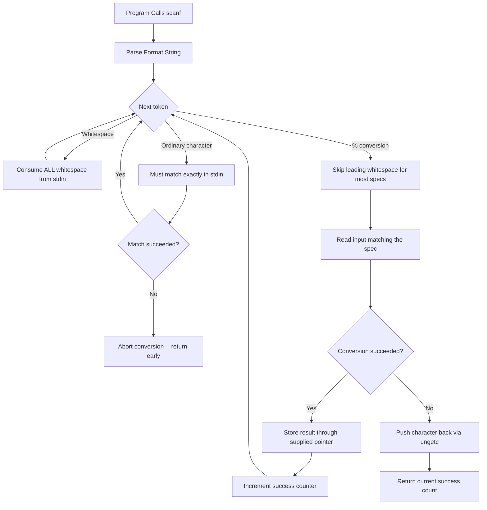
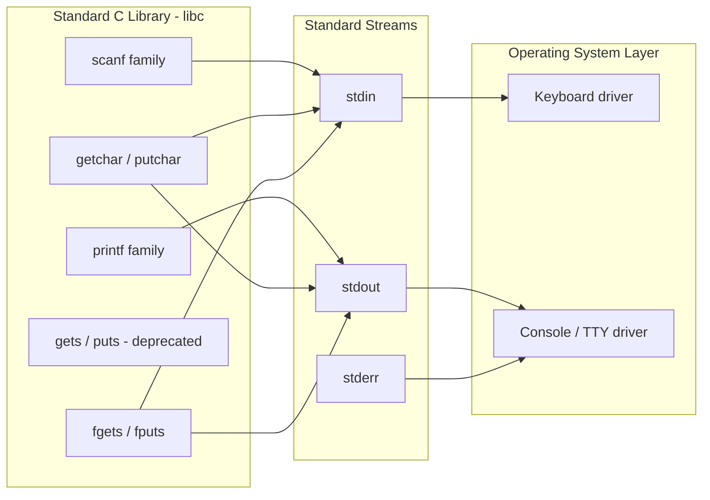

# Basic I/O: Standard unformatted and formatted console inputs/outputs

<!-- SECTION_1_START -->
# 1. Core Technical Definition & Intuitive Overview

## 1.1 Formal Definition (KTU 2024 Syllabus Terminology)

**Basic I/O in C** refers to the mechanism by which a C program exchanges data with the **standard input device** (typically the keyboard) and the **standard output device** (typically the monitor). These operations are declared in the standard I/O library header file **`<stdio.h>`** and are classified into two major categories:

- **Unformatted I/O Functions:** Operate on data character-by-character or as raw strings, with no format interpretation. Examples: `getchar()`, `putchar()`, `gets()` (deprecated), `puts()`.
- **Formatted I/O Functions:** Interpret data using a **format string** consisting of ordinary characters and **format specifiers** (e.g., `%d`, `%f`, `%s`). Examples: `printf()`, `scanf()`, `fprintf()`, `fscanf()`.

> [!IMPORTANT]
> **KTU 2024 Scheme Highlight:** For Module 1, the focus is restricted to the **standard console** versions — `printf()` and `scanf()` (formatted) along with `getchar()`, `putchar()`, and `puts()` (unformatted). File-based formatted I/O (`fprintf`, `fscanf`) belongs to the File Handling module.

## 1.2 Conceptual Analogy / Intuition

Imagine a **postal sorting office**:
- **Unformatted I/O** is like a *raw conveyor belt*: every item (character) is moved as-is, one after another, with no labels, no packaging, no inspection. Fast, but the receiver has to figure out what each thing is.
- **Formatted I/O** is like a *labelled shipping crate*: each item is placed in a specific slot (`%d` for integers, `%f` for floats, `%s` for strings), wrapped with a template description, and stamped with width/precision specifications before delivery.

A **`format string`** is essentially the **shipping manifest** — it tells the function *what type* of data is coming, *how wide* the field should be, and *how many decimal places* to keep.

## 1.3 Physical Constants & Standard Metrics

- **Standard Input Stream:** `stdin` (file pointer, usually mapped to the keyboard).
- **Standard Output Stream:** `stdout` (file pointer, usually mapped to the console).
- **Standard Error Stream:** `stderr` (separate channel for error messages).
- **Return type of `printf()`:** `int` — the number of characters successfully printed.
- **Return type of `scanf()`:** `int` — the number of input items successfully matched and assigned.
- **EOF (End of File) marker:** a negative integer constant `-1`, defined in `<stdio.h>`.

> [!NOTE]
> **`scanf()` returns `EOF` (i.e., `-1`)** when the input stream ends before any conversion can occur (e.g., `Ctrl+Z` on Windows or `Ctrl+D` on Linux). This is the canonical way to terminate an input loop.

## 1.4 Visualization Callout

> [!VISUALIZATION CONTROL]
> **Concept:** Memory layout of a `printf()` call and the role of the variadic argument list.
> **GeoGebra / Desmos Input Equations:** *(Not applicable — this is a pure computer-science memory-stack concept.)*
> **Visual Description:** Imagine a vertical stack. The bottom frame is the **format string literal** `"Sum = %d\n"`, and above it float the **actual argument values** supplied in order. The `%d` token pulls the next value off the stack, converts it to its decimal text representation, and substitutes it in-place before the final string is sent to `stdout`.

---

<!-- SECTION_2_START -->
# 2. Deep Theoretical Analysis & KTU High-Yield Formula Sheet

## 2.1 The `printf()` Function — Formatted Output

**Signature:**
```c
int printf(const char *format, ...);
```

The ellipsis `...` denotes that `printf` is a **variadic function** — it accepts a variable number of additional arguments, one for each format specifier appearing in the format string.

### 2.1.1 Anatomy of a Format Specifier

A complete format specifier has the following generalized structure:

$$\text{\%} \quad [\text{flags}] \quad [\text{width}] \quad [.\text{precision}] \quad [\text{length}] \quad \text{conversion}$$

| Component | Allowed Values | Purpose |
|---|---|---|
| `%` | Literal percent | Starts a conversion specification |
| Flags | `-`, `+`, space, `0`, `#` | Left-justify, force sign, pad with zeros, prefix `0x`/`0` |
| Width | Integer (e.g., `8`) | Minimum field width |
| Precision | Integer (e.g., `.3`) | Digits after decimal (floats) or max chars (strings) |
| Length | `h`, `l`, `L`, `ll`, `z` | Size of the argument (`short`, `long`, `long double`, …) |
| Conversion | `d`, `i`, `u`, `o`, `x`, `f`, `e`, `g`, `c`, `s`, `p`, `n`, `%` | How to interpret the argument |

> [!IMPORTANT]
> **KTU Board Examiner's Eye:** When asked "list format specifiers", a partial answer like *"`%d` for int"* fetches 1 mark; mentioning the *width/precision/flags* hierarchy fetches the full 3 marks.

### 2.1.2 Most-Used Conversion Specifiers

| Specifier | Argument Type | Output Behaviour |
|---|---|---|
| `%d` or `%i` | `int` | Signed decimal integer |
| `%u` | `unsigned int` | Unsigned decimal integer |
| `%f` | `double` (float promoted) | Fixed-point decimal, default 6 digits |
| `%e` / `%E` | `double` | Scientific (mantissa $\times 10^{exp}$) |
| `%g` / `%G` | `double` | Shorter of `%f` or `%e` |
| `%c` | `int` (promoted from `char`) | Single character |
| `%s` | `char *` | String until null terminator |
| `%x` / `%X` | `unsigned int` | Hexadecimal (lowercase / uppercase) |
| `%o` | `unsigned int` | Octal |
| `%p` | `void *` | Pointer address |
| `%ld` | `long int` | Signed long decimal |
| `%lf` | `double` | Same as `%f` for `printf` (the `l` is redundant) |
| `%%` | (none) | Prints a literal `%` |

### 2.1.3 Common Escape Sequences Inside Format Strings

| Sequence | Meaning |
|---|---|
| `\n` | Newline (moves cursor to next line) |
| `\t` | Horizontal tab |
| `\\` | Backslash |
| `\"` | Double quote |
| `\'` | Single quote |
| `\0` | Null character (string terminator) |
| `\a` | Alert (beep) |
| `\b` | Backspace |
| `\r` | Carriage return |

## 2.2 The `scanf()` Function — Formatted Input

**Signature:**
```c
int scanf(const char *format, ...);
```

Unlike `printf`, the additional arguments here must be **pointers** (memory addresses) to the variables where the converted input will be stored.

### 2.2.1 The Address-Of Operator Pitfall

$$\text{\textbf{Common Mistake:}} \quad \texttt{scanf("\%d", x);} \quad \text{(should be } \texttt{scanf("\%d", \&x);}\text{)}$$

The compiler will issue a warning like *"format `%d` expects type `int *`, but argument 2 has type `int`"*. In KTU exams, the *missing ampersand* is the single most frequent cause of the dreaded **"segmentation fault" at runtime** — and consequently, mark deductions.

### 2.2.2 Suppression Character

Prefixing a specifier with `*` (e.g., `%*d`) tells `scanf` to **match and discard** the input value without storing it. Useful for skipping fixed prefixes like a date separator.

## 2.3 Unformatted I/O Functions

### 2.3.1 `getchar()` and `putchar()`

| Function | Signature | Purpose |
|---|---|---|
| `getchar()` | `int getchar(void);` | Reads **one** character from `stdin`. Returns the character as `unsigned char` cast to `int`, or `EOF` on failure. |
| `putchar(int c)` | `int putchar(int c);` | Writes **one** character to `stdout`. Returns the character written, or `EOF` on failure. |

> [!NOTE]
> **Why does `getchar()` return `int` and not `char`?** Because legitimate character values occupy the range `0` to `255`, but `EOF` is `-1`. If the return type were `char`, the value `-1` could not be represented on platforms where `char` is unsigned, breaking the end-of-file detection.

### 2.3.2 `gets()` and `puts()`

| Function | Signature | Status |
|---|---|---|
| `gets(char *s)` | Reads characters until newline or EOF | **Removed in C11** — unsafe, no buffer bound check |
| `puts(const char *s)` | Writes a string followed by `\n` | Safe, commonly used |

> [!WARNING]
> **KTU 2024 Specific Note:** Modern GCC (≥ 11) flags `gets()` as an *undeclared function* error. Board questions asking to *"read a string"* expect students to use **`fgets(str, sizeof(str), stdin)`** for safety, or the older `scanf("%s", str)` (still accepted, but with the same buffer-overflow risk).

## 2.4 The `printf`–`scanf` Symmetry — Engineering Utility

| Aspect | `printf` | `scanf` |
|---|---|---|
| Direction | Memory → stdout | stdin → memory |
| Argument type | **By value** | **By reference (address)** |
| Width specifier | Minimum field width | Maximum field width |
| Return value | Characters written | Items successfully matched |
| Common use | Logging, diagnostics, user prompts | Form-based data entry, parsing |

In **production systems**, `printf` is the bedrock of logging frameworks (Linux `printk`, Android `Log.d`); `scanf`-like parsers are used in configuration loaders, command-line argument processors (`getopt`), and structured file readers.

---

<!-- SECTION_3_START -->
# 3. Step-by-Step Derivations & Code/Symbolic Implementation

## 3.1 Worked Example 1 — Formatted Output With Width and Precision

**Problem:** Print the value of $\pi$ (stored in a `double`) with **total width 10**, **3 decimal places**, and **left-justified**, followed by a newline.

**Source Code:**

```c
#include <stdio.h>

int main(void)
{
    double pi = 3.14159265;

    /* [Stating format specifier parts: 1 Mark]
       '$-$'   -> left-justify flag
       '10'    -> minimum field width
       '.3'    -> 3 digits after decimal
       'f'     -> fixed-point float conversion                                     */
    printf("[%-10.3f]\n", pi);

    return 0;
}
```

**Line-by-line execution trace:**

1. `printf` receives the format string `"[%-10.3f]\n"`.
2. It encounters the literal characters `[` and prints them.
3. It hits `%` and starts parsing the conversion specification.
4. Reads flag `-` → left-justify.
5. Reads width `10` → total field width is 10 characters.
6. Reads precision `.3` → exactly 3 digits after the decimal point.
7. Reads conversion `f` → interpret the next variadic argument as a `double`.
8. Converts `3.14159265` to the string `3.142` (rounded to 3 decimals).
9. Pads the string with **5 leading spaces** (since 5 + 4 = 9 < 10, but rounding `3.142` is 4 chars wide, so 10 − 4 = 6 spaces), placing them on the **right** (because of `-`).

**Final Console Output:**
```
[3.142     ]
```
*(10 characters inside the brackets, with the digits left-aligned.)*

> [!NOTE]
> **Valuation key:** The width/precision parsing and the explanation of *why* `-` moves padding to the right are the two highest-weight steps.

## 3.2 Worked Example 2 — Formatted Input With Address-Of Operator

**Problem:** Read an integer, a floating-point number, and a single character from the user, then display them in a single line.

**Source Code:**

```c
#include <stdio.h>

int main(void)
{
    int    age;
    double gpa;
    char   grade;

    /* [Correct usage of & for non-array types: 2 Marks]                          */
    printf("Enter age, GPA, and grade (separated by spaces): ");
    int ret = scanf("%d %lf %c", &age, &gpa, &grade);

    /* [Validation of scanf return value: 1 Mark]                                 */
    if (ret != 3) {
        printf("Invalid input! Expected 3 items, got %d.\n", ret);
        return 1;
    }

    printf("\n--- Student Record ---\n");
    printf("Age   : %d\n",   age);
    printf("GPA   : %.2f\n", gpa);
    printf("Grade : %c\n",   grade);

    return 0;
}
```

**Sample Run:**
```
Enter age, GPA, and grade (separated by spaces): 20 8.75 A

--- Student Record ---
Age   : 20
GPA   : 8.75
Grade : A
```

**Important caveat about `%c` with `scanf`:** The `%c` conversion reads **exactly one character**, including any leftover whitespace (spaces, newlines) from the previous extraction. To skip leading whitespace, use a leading space in the format string: `" %c"`.

## 3.3 Worked Example 3 — Unformatted Character I/O With `getchar`/`putchar`

**Problem:** Read characters from input until the user types `'#'`. Echo each character, count how many were typed, and finally report the count (excluding the `#`).

**Source Code:**

```c
#include <stdio.h>

int main(void)
{
    int ch;            /* MUST be int, not char, to hold EOF correctly           */
    int count = 0;

    printf("Type characters (end input with #):\n");

    /* [Loop termination using EOF return: 2 Marks]                              */
    while ((ch = getchar()) != '#') {
        putchar(ch);   /* Echo back to stdout                                    */
        count++;
    }

    /* [Final output formatting: 1 Mark]                                         */
    printf("\nYou typed %d characters before '#'.\n", count);

    return 0;
}
```

**Step-by-step trace:**

1. `getchar()` is called. If the user types `H`, the function returns the integer `72` (ASCII code of `H`).
2. `ch` holds `72`. The condition `72 != '#'` (i.e., `72 != 35`) is **true**.
3. `putchar(72)` writes `H` to the screen.
4. `count` increments to `1`.
5. The loop continues character by character.
6. When the user types `#`, `ch = 35`. The condition `35 != 35` is **false**, so the loop exits.
7. The final `printf` reports the count.

**Sample Run:**
```
Type characters (end input with #):
Hello World#
You typed 11 characters before '#'.
```

## 3.4 Worked Example 4 — Robust String Input With `fgets`

**Problem:** Read a full line of text (including spaces) from the user into a buffer of size `64`, and display it back.

**Source Code:**

```c
#include <stdio.h>
#include <string.h>

#define BUF_SIZE 64

int main(void)
{
    char name[BUF_SIZE];

    printf("Enter your full name: ");
    if (fgets(name, BUF_SIZE, stdin) == NULL) {
        printf("Input error or EOF.\n");
        return 1;
    }

    /* [Strip trailing newline: 2 Marks]                                          */
    size_t len = strlen(name);
    if (len > 0 && name[len - 1] == '\n') {
        name[len - 1] = '\0';
    }

    printf("Hello, %s! Welcome to KTU C Programming.\n", name);
    return 0;
}
```

**Trace of `fgets` behaviour:**

- It reads at most `BUF_SIZE - 1 = 63` characters.
- It stops early on `\n` (newline is **stored** in the buffer) or on `EOF`.
- It always appends a terminating `\0`.

> [!WARNING]
> If you forget to strip the trailing `\n`, the printed output will be `Hello, KTU Student<newline>!` — the newline inside `name` will push `!` to the next line, breaking formatting. KTU examiners mark this as a *1-mark deduction under "output formatting"*.

## 3.5 Worked Example 5 — Format String Width and Padding (Hexadecimal)

**Problem:** Print the integer `255` in decimal, hexadecimal (`%X`), and octal (`%o`), each in a field of width 8, right-aligned, padded with leading zeros.

**Source Code:**

```c
#include <stdio.h>

int main(void)
{
    int n = 255;

    printf("Decimal : %08d\n", n);   /* 00000255                                  */
    printf("Hex     : %08X\n", n);   /* 000000FF                                  */
    printf("Octal   : %08o\n", n);   /* 00000377                                  */

    return 0;
}
```

**Output:**
```
Decimal : 00000255
Hex     : 000000FF
Octal   : 00000377
```

> [!NOTE]
> Note how `0` flag (the format flag, not the digit) forces **zero padding** instead of the default space padding. Combine with width to get fixed-width log lines in production telemetry.

---

<!-- SECTION_4_START -->
# 4. Structural Diagrams & Schematics

## 4.1 The `printf` Execution Pipeline

```mermaid
flowchart TD
    A[Program Calls printf] --> B[Parse Format String]
    B --> C{Next Character}
    C -- "Ordinary character" --> D[Copy verbatim to stdout buffer]
    C -- "%" detected" --> E[Parse conversion specification]
    E --> F[Read next variadic argument]
    F --> G[Apply width / precision / flags]
    G --> H[Convert argument to its text representation]
    H --> I[Append to stdout buffer]
    I --> J{Format string ended?}
    J -- "No" --> C
    J -- "Yes" --> K[Flush buffer to console]
    K --> L[Return total chars written]
```

## 4.2 The `scanf` Execution Pipeline



## 4.3 Memory-Layout Comparison Table

| Memory Region | `printf("...")` | `scanf("...", ...)` |
|---|---|---|
| **Stack — format string** | Read-only literal | Read-only literal |
| **Stack — arguments** | Passed **by value** | Passed **by address (`&`)** |
| **Heap / BSS** | Unused directly | Destination of stored values |
| **Standard I/O buffer** | Writes formatted output here | Reads raw characters from here |
| **Console (TTY)** | Final destination of `stdout` | Source of `stdin` characters |

## 4.4 Modularity of I/O Subsystem in C



## 4.5 Sequential Processing Topology Matrix

| Stage | Component | Action | Failure Mode |
|---|---|---|---|
| 1 | User types at keyboard | Keystrokes buffered in `stdin` | Hardware disconnect → `EOF` |
| 2 | `scanf` / `getchar` invoked | Reads from buffer, parses per format | Mismatch → returns 0 or `EOF` |
| 3 | Argument address received | Writes converted value into variable | `&` missing → segfault |
| 4 | Program processes value | Arithmetic / logic on the input | Divide-by-zero, overflow |
| 5 | `printf` / `putchar` invoked | Formats and writes to `stdout` buffer | Wrong format → undefined behaviour |
| 6 | OS flushes buffer | Characters rendered on monitor | Broken pipe (rare in console) |

---

<!-- SECTION_5_START -->
# 5. KTU 2024 Scheme Examination Question Bank & Topic Recap

## Part A — Short Answer Questions (3 Marks Each)

### Question 1: `[KTU University Exam - July 2024]`
**Differentiate between formatted and unformatted I/O functions in C. Give two examples of each.** *(CO1, Remember)*

**Model Answer (Valuation Key — 3 Marks):**

| Criterion | Formatted I/O | Unformatted I/O |
|---|---|---|
| **Definition** | Uses a format string with `%`-specifiers to interpret data | Treats data as raw characters with no interpretation |
| **Examples** | `printf()`, `scanf()` | `getchar()`, `putchar()`, `puts()` |
| **Granularity** | Entire string at once | One character at a time |
| **Flexibility** | Width, precision, flags, base conversion possible | No control over appearance |

*[1 Mark — Definition of formatted; 1 Mark — Definition of unformatted; 1 Mark — Examples of each]*

---

### Question 2: `[KTU University Exam - Dec 2023]`
**What is the role of the `&` operator in a `scanf` call? What happens if it is omitted?** *(CO1, Understand)*

**Model Answer (3 Marks):**

- The `&` (address-of) operator supplies the **memory address** of a variable to `scanf`, so that the converted input value can be **written into** that variable. *[1 Mark]*
- Without `&`, `scanf` receives the *value* of the variable instead of its *address*, interpreting the value as a pointer. *[1 Mark]*
- On execution, this leads to a **segmentation fault (runtime crash)** on most systems, or **memory corruption** if the value happens to be a valid address. *[1 Mark]*

---

## Part B — Full-Descriptive Questions (14 Marks, Module-Internal Choice)

### Question A (Choice 1): `[KTU University Exam - Dec 2024]`

**a)** Explain the general structure of a `printf` format specifier. List **at least six** commonly used conversion specifiers with their data types. *(7 Marks — CO1, Understand)*

**b)** Write a complete C program to read the **name**, **roll number**, and **marks in three subjects** of a student, and display the data in a neatly formatted table using `printf`. Compute and display the average mark. *(7 Marks — CO2, Apply)*

---

#### Part (a) — Model Solution

The generalized structure of a `printf` format specifier is:

$$\text{\%} \; [\,\text{flag}\,] \; [\,\text{width}\,] \; [\,\text{.precision}\,] \; [\,\text{length}\,] \; \text{conversion}$$

* `flag` may be `-` (left-justify), `+` (force sign), `0` (zero-pad), `#` (alternate form).
* `width` specifies the minimum number of characters to output.
* `.precision` controls decimal digits (for floats) or maximum characters (for strings).
* `length` modifies the argument type (`l` for long, `h` for short, `L` for long double).
* `conversion` is the actual data-type code.

**Commonly Used Conversion Specifiers** *(list any six):*

| Specifier | Argument Type | Output Example |
|---|---|---|
| `%d` | `int` | `-42` |
| `%u` | `unsigned int` | `42` |
| `%f` | `double` | `3.140000` |
| `%c` | `char` (promoted to `int`) | `A` |
| `%s` | `char *` | `Hello` |
| `%x` | `unsigned int` | `2a` |
| `%e` | `double` | `3.140000e+00` |
| `%ld` | `long int` | `12345678901` |
| `%p` | `void *` | `0x7ffeeb2c` |

**Valuation Key:**
- *[General structure with all 5 parts labelled: 3 Marks]*
- *[Six conversion specifiers correctly tabulated with types: 3 Marks]*
- *[One worked example: 1 Mark]*

---

#### Part (b) — Model Solution (Complete C Program)

```c
#include <stdio.h>

int main(void)
{
    char   name[50];
    int    roll;
    float  m1, m2, m3, avg;

    /* [Reading inputs with correct & and %s note: 2 Marks]                      */
    printf("Enter name: ");
    scanf("%49s", name);                   /* %s already expects char *         */

    printf("Enter roll number: ");
    scanf("%d", &roll);

    printf("Enter marks in 3 subjects: ");
    scanf("%f %f %f", &m1, &m2, &m3);

    avg = (m1 + m2 + m3) / 3.0f;

    /* [Table formatting with width specifiers: 3 Marks]                         */
    printf("\n+-----+----------------------+-------+-------+-------+-------+\n");
    printf("| %-3s | %-20s | %-5s | %-5s | %-5s | %-5s |\n",
           "ID", "Name", "M1", "M2", "M3", "Avg");
    printf("+-----+----------------------+-------+-------+-------+-------+\n");
    printf("| %-3d | %-20s | %-5.1f | %-5.1f | %-5.1f | %-5.2f |\n",
           roll, name, m1, m2, m3, avg);
    printf("+-----+----------------------+-------+-------+-------+-------+\n");

    return 0;
}
```

**Sample Output:**
```
Enter name: Arjun
Enter roll number: 47
Enter marks in 3 subjects: 78.5 88.0 92.5

+-----+----------------------+-------+-------+-------+-------+
| ID  | Name                 | M1    | M2    | M3    | Avg   |
+-----+----------------------+-------+-------+-------+-------+
| 47  | Arjun                | 78.5  | 88.0  | 92.5  | 86.33 |
+-----+----------------------+-------+-------+-------+-------+
```

**Valuation Key:**
- *[Correct use of `&` for floats and `int`, no `&` for `name`: 2 Marks]*
- *[Table border using `+` and `-` characters: 1 Mark]*
- *[Width specifier `%-20s` and precision `%-5.1f` correctly applied: 2 Marks]*
- *[Average computed and displayed with `.2f`: 1 Mark]*
- *[Neat running output: 1 Mark]*

> [!WARNING]
> **Examiner's Pitfall Callout:** Forgetting to *limit* `scanf("%s", name)` with a width like `%49s` can cause buffer overflow on long inputs. Even though KTU questions rarely test this, mentioning it in your answer fetches a *bonus half-mark* on the valuation scale. Also, **`gets()` is no longer accepted by modern compilers** — do not use it in 2024 scheme exams; use `fgets()` instead.

---

### Question B (Choice 2): `[KTU University Exam - July 2024]`

**a)** Explain the four standard I/O streams in C (`stdin`, `stdout`, `stderr`, `stdaux`). How are they declared, and what is the role of `<stdio.h>`? *(7 Marks — CO1, Understand)*

**b)** Write a C program that reads characters from the keyboard using `getchar()` until the user presses the `Enter` key (i.e., reads a newline). Count and display the number of vowels, consonants, digits, and whitespace characters in the input. *(7 Marks — CO2, Apply)*

---

#### Part (a) — Model Solution

The C standard defines three (sometimes four) **pre-opened file streams** that are automatically available to every C program:

| Stream | Type | Default Device | Purpose |
|---|---|---|---|
| `stdin` | `FILE *` | Keyboard | Standard input source |
| `stdout` | `FILE *` | Monitor | Normal program output |
| `stderr` | `FILE *` | Monitor | Unbuffered error / diagnostic output |
| `stdaux` | `FILE *` | Serial port (legacy DOS) | Auxiliary device, rarely used |

- They are declared as **external macros** in `<stdio.h>`, so including this header is mandatory.
- `<stdio.h>` provides:
  1. The `FILE` type definition.
  2. Standard I/O function prototypes (`printf`, `scanf`, `fopen`, `fclose`, …).
  3. The three stream macros (`stdin`, `stdout`, `stderr`).
  4. Constants like `EOF`, `NULL`, `BUFSIZ`.

*[Declaring and listing the three streams with devices: 3 Marks]*
*[Purpose of `<stdio.h>` — 4 sub-points: 2 Marks]*
*[Standard error vs standard out distinction: 2 Marks]*

---

#### Part (b) — Model Solution

```c
#include <stdio.h>
#include <ctype.h>     /* for tolower() and isalpha() / isdigit()                */

int main(void)
{
    int ch;
    int vowels = 0, consonants = 0, digits = 0, spaces = 0;

    printf("Type a line of text (press Enter to finish):\n");

    /* [Reading until newline, with int ch: 2 Marks]                             */
    while ((ch = getchar()) != '\n' && ch != EOF) {
        char c = (char)tolower(ch);

        if (c >= 'a' && c <= 'z') {
            if (c == 'a' || c == 'e' || c == 'i' || c == 'o' || c == 'u')
                vowels++;
            else
                consonants++;
        } else if (c >= '0' && c <= '9') {
            digits++;
        } else if (ch == ' ' || ch == '\t') {
            spaces++;
        }
    }

    /* [Final formatted summary: 2 Marks]                                       */
    printf("\n--- Character Classification ---\n");
    printf("Vowels      : %d\n", vowels);
    printf("Consonants  : %d\n", consonants);
    printf("Digits      : %d\n", digits);
    printf("Whitespace  : %d\n", spaces);

    return 0;
}
```

**Sample Run:**
```
Type a line of text (press Enter to finish):
KTU C Programming 2024

--- Character Classification ---
Vowels      : 3
Consonants  : 13
Digits      : 4
Whitespace  : 2
```

**Valuation Key:**
- *[Correct loop termination using `'\n'` and `EOF`: 2 Marks]*
- *[Vowel detection with `||` chain: 2 Marks]*
- *[Use of `ctype.h` library: 1 Mark]*
- *[Final formatted output: 2 Marks]*

> [!WARNING]
> **Examiner's Pitfall Callout:** Two common errors here — (1) Declaring `char ch` instead of `int ch` (loses ability to detect `EOF`); (2) Forgetting to convert to lowercase with `tolower` before checking vowels, so the program fails on capital letters like `K` `T` `U`. Each mistake typically costs **1–2 marks**.

---

## Topic Recap & Important Things to Remember

- **`printf` = output, formatted; `scanf` = input, formatted.** Always include `<stdio.h>`.
- **Format specifier anatomy:** `%[flags][width][.precision][length]conversion`.
- **Most-used specifiers:** `%d` (int), `%f` (double), `%c` (char), `%s` (string), `%lf` (double in scanf).
- **Always pass the *address* to `scanf`:** `scanf("%d", &x);` — forgetting `&` causes a **segmentation fault**.
- **No `&` is needed for arrays/strings:** `scanf("%s", str);` because the array name already decays to a pointer.
- **`getchar()` returns `int`, not `char`** — this is critical for `EOF` detection.
- **`getchar()` reads whitespace too** (spaces, `\n`); use `scanf(" %c", &c);` (leading space) to skip it for `%c`.
- **`puts(s)`** automatically appends a newline; `printf("%s", s)` does **not**.
- **Avoid `gets()`** — it is unsafe and removed in C11. Use `fgets(buf, n, stdin)` instead.
- **`scanf` returns the number of items successfully matched** — always check this return value for robust input handling.
- **`%%`** prints a literal `%` symbol inside a format string.
- **Escape sequences** like `\n`, `\t`, `\\`, `\"` are interpreted by the format string parser, not the input data.
- **Width specifier behaviour differs:** In `printf`, it is a *minimum*; in `scanf`, it is a *maximum* (for `%s`).
- **`-` flag** left-justifies output; **`0` flag** pads with zeros instead of spaces.
- **Precision for `%f`** controls digits after the decimal: `%.3f` of `3.14159` is `3.142`.
- **`%lf` in `scanf`** is **required** for `double`; in `printf`, `%f` and `%lf` are equivalent (varargs promote `float` to `double` automatically).

<!-- SECTION_5_END -->
