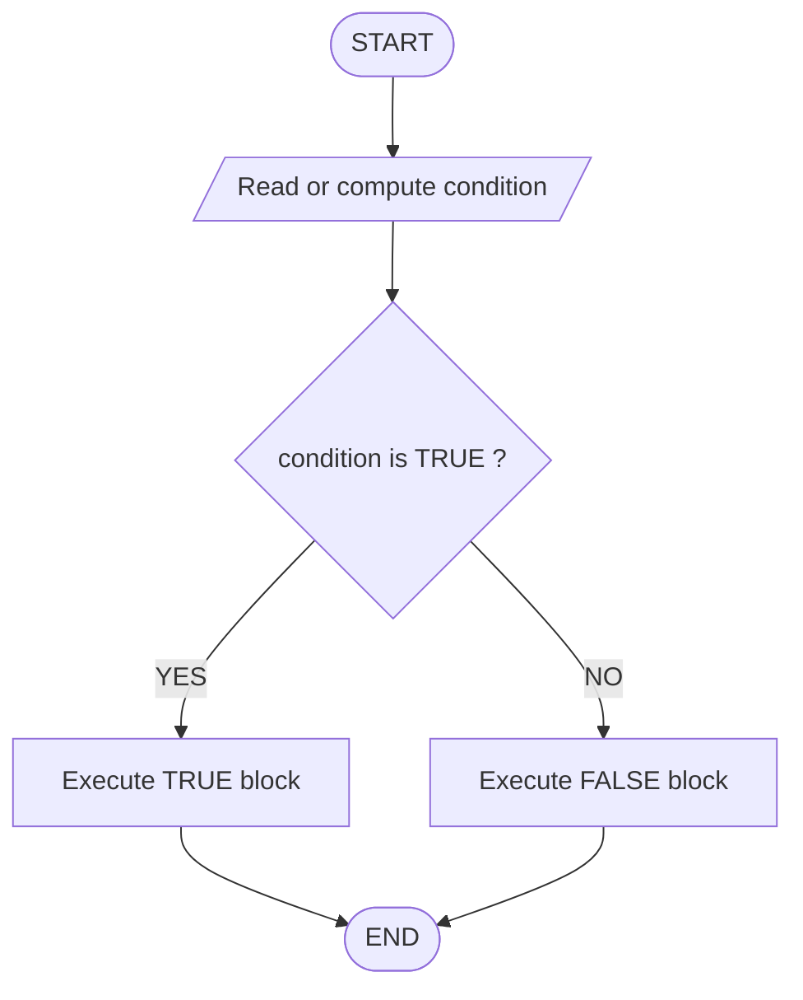
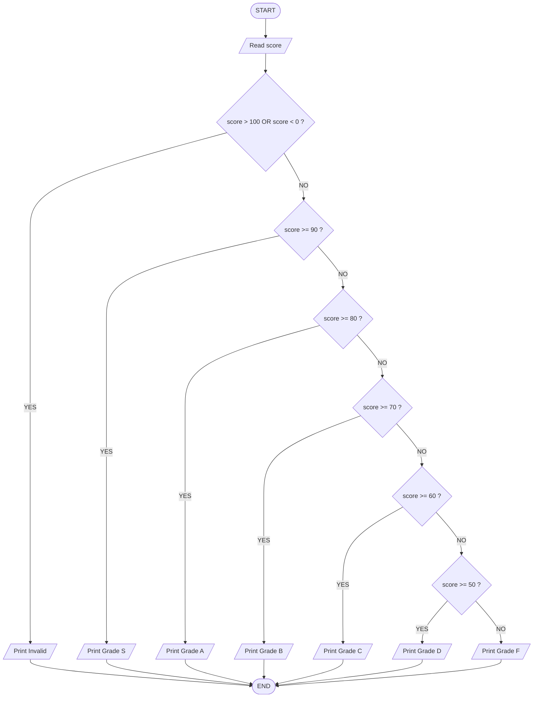
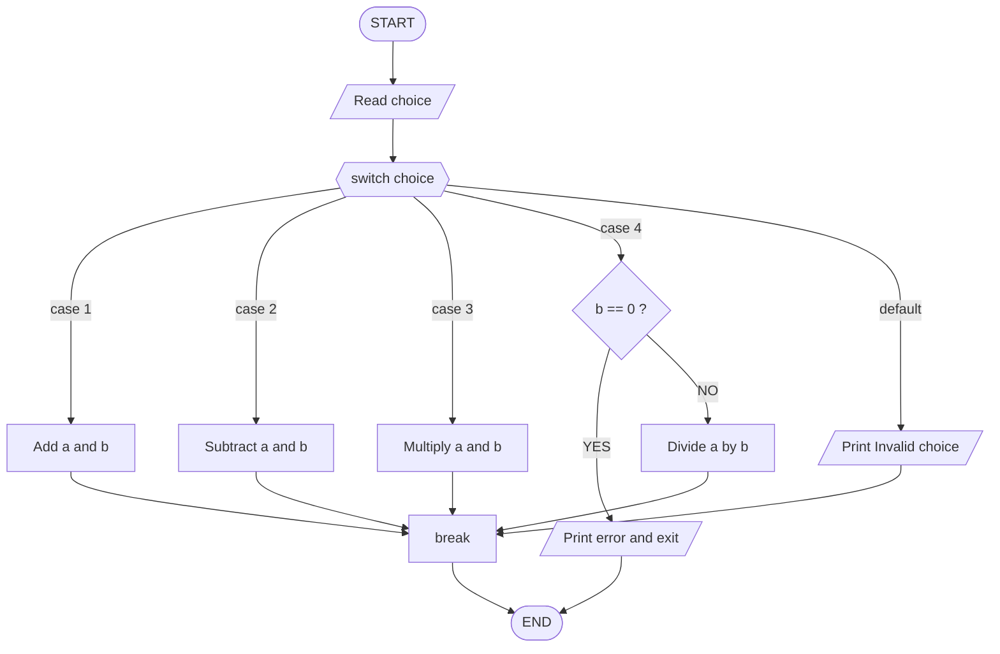
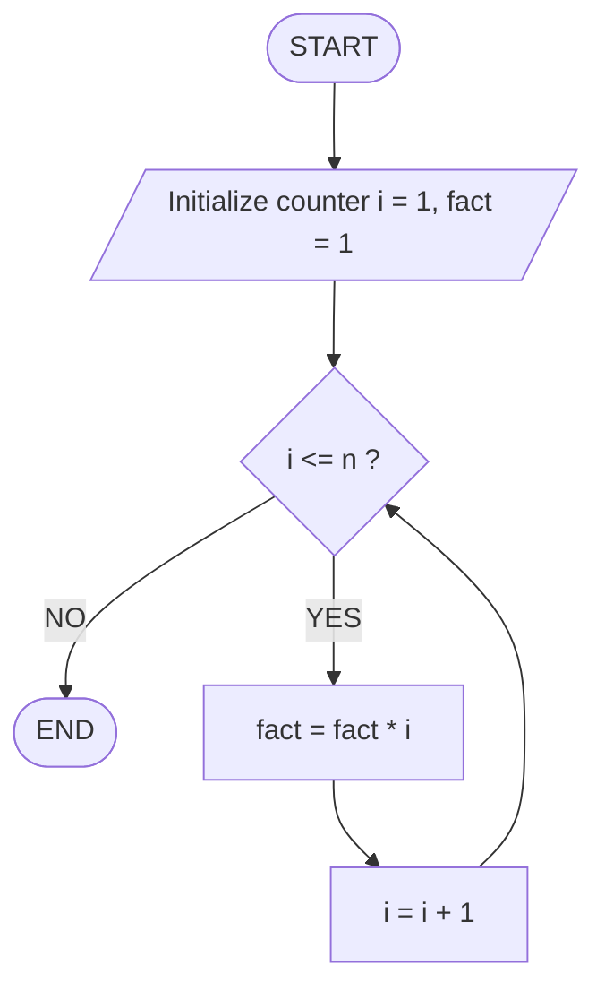
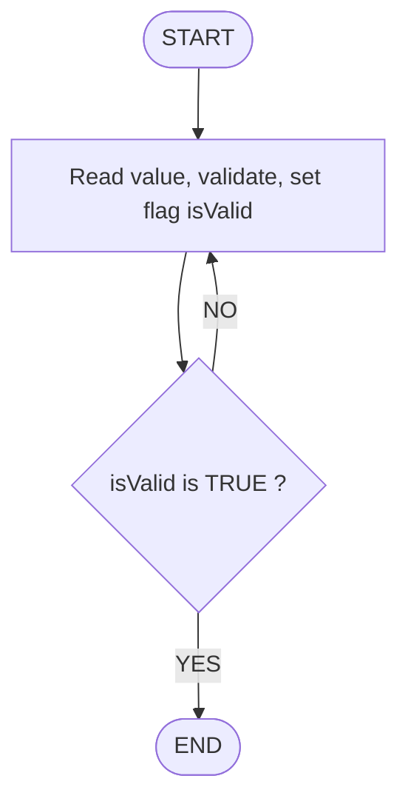
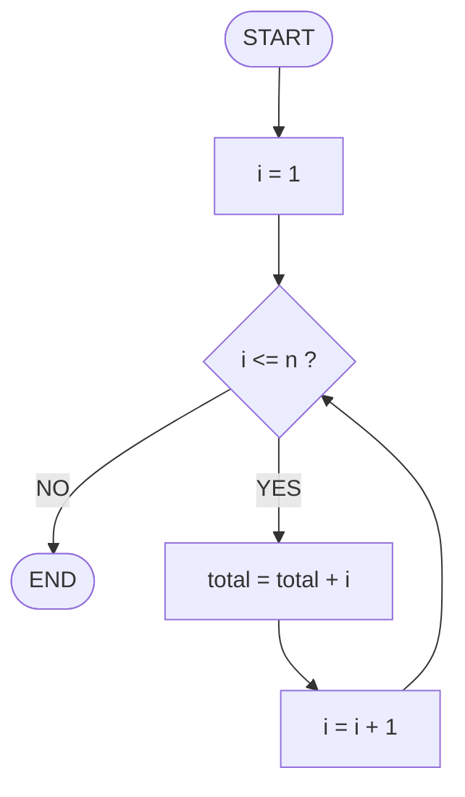
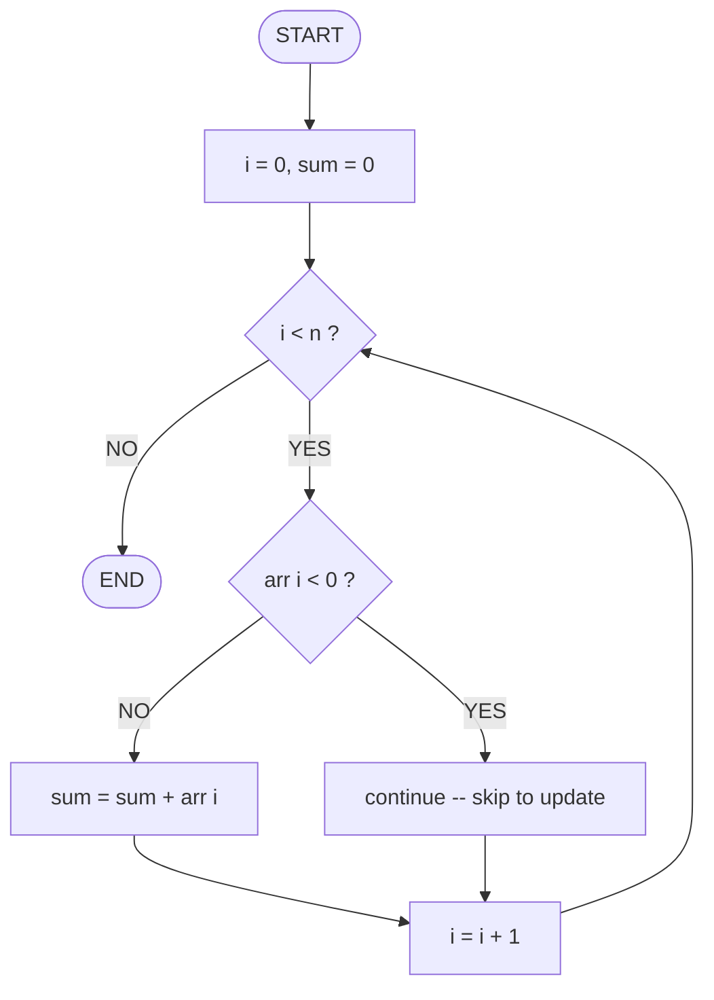
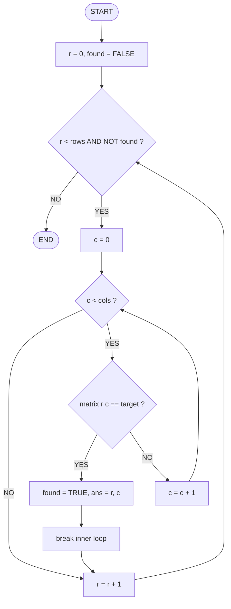
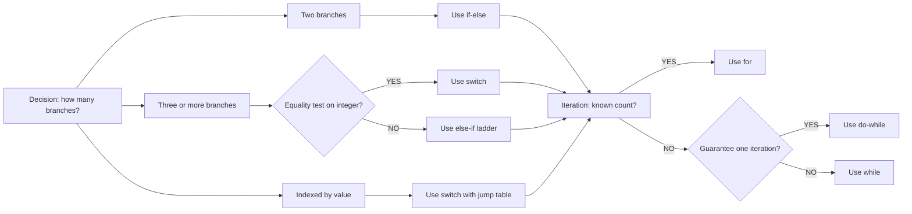
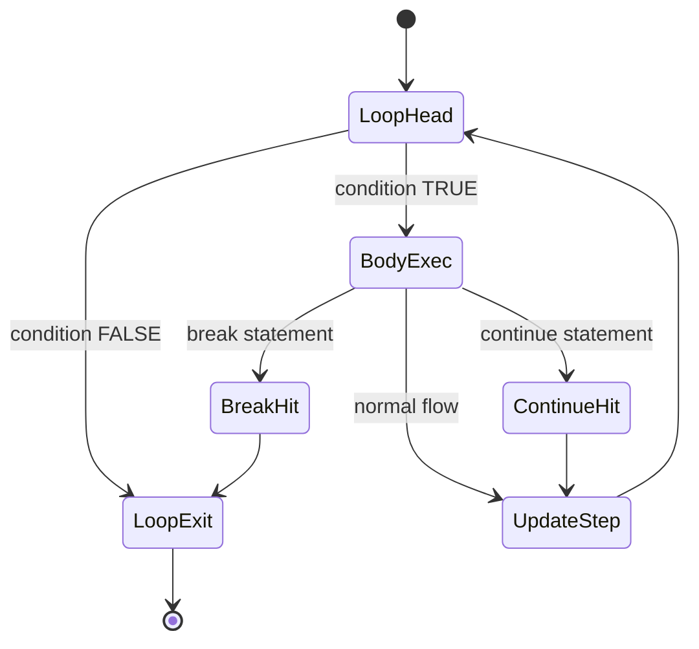

# Control Statements: Conditional branching (if-else, switch), loop mechanisms (while, do-while, for), break, continue

<!-- SECTION_1_START -->

# Control Statements: Conditional Branching and Loop Mechanisms

## 1.1 Formal Academic Definition

In the C programming language (as standardized under **ISO/IEC 9899:2018** and aligned with the **KTU 2024 Scheme** syllabus for *EST204 – Programming in C*), **control statements** are the set of language constructs that alter the sequential, top-to-bottom flow of program execution. They are broadly classified into three functional families:

1. **Selection (Conditional Branching) Statements** – `if`, `if-else`, `nested if-else`, `else-if ladder`, and the `switch` statement. These statements evaluate a Boolean expression and divert control to a specific block of code based on the truth value of that expression.

2. **Iteration (Loop) Statements** – `while`, `do-while`, and `for` loops. These statements repeatedly execute a block of code as long as a controlling condition remains true.

3. **Jump Statements** – `break`, `continue`, `goto`, and `return`. Within the scope of this module, `break` and `continue` are loop-modifying statements that perform unconditional jumps within an iteration block.

> [!IMPORTANT]
> **KTU 2024 Syllabus Highlight (Module 1):**
> *"Control Statements: Conditional branching (if-else, switch), loop mechanisms (while, do-while, for), break, continue."*
> This topic directly maps to **Course Outcome CO1** – *Apply computational thinking to solve problems using the C programming language*, and is typically tested for 14–18 marks in the **End Semester Evaluation (ESE)**.

## 1.2 Conceptual Analogy and Intuition

Imagine a **railway track switchman** standing at a junction. A train arrives (a condition is evaluated). Based on which lever he pulls (the branch taken), the train continues on a different track. The `if-else` statement is precisely that switchman.

- **`if-else`** is a **two-track junction** — either go left (true) or go right (false).
- **`switch`** is a **multi-track roundhouse** — depending on the *value* of the incoming train's number, it is routed to one of many parallel tracks.
- **`while` loop** is a **revolving door** that checks *first* whether you are allowed to enter, and only then lets you pass — and it keeps doing this until the condition fails.
- **`do-while` loop** is the same revolving door, but it **lets you through first**, and *then* checks your ticket. You are guaranteed at least one ride.
- **`for` loop** is a **counted ride** — "give me exactly N turns, no more, no less". Ideal for fixed-iteration scenarios.
- **`break`** is an **emergency stop button** — you abort the ride immediately.
- **`continue`** is a **skip button** — you abandon the current turn but stay in line for the next one.

## 1.3 Physical Constants, Standard Metrics, and Reserved Keywords

The following reserved keywords in C (per the **C11/C18 standard**, all **bold** marked) are the lexical building blocks of control flow:

> **`if`, `else`, `switch`, `case`, `default`, `while`, `do`, `for`, `break`, `continue`, `goto`, `return`**

The C language does not use a dedicated `boolean` type historically; instead, any **non-zero** value is treated as **TRUE** and **zero (0)** is treated as **FALSE**. This is a frequent source of off-by-one and logical errors in KTU lab examinations.

> [!NOTE]
> **Definition – Conditional Expression:**
> A *conditional expression* in C is any expression that yields a scalar value. In selection statements, it is implicitly compared against zero. In iteration statements, the loop continues as long as this expression evaluates to non-zero.

## 1.4 GeoGebra / Desmos Integration

While control statements are primarily logical (not geometric) constructs, their **execution-trace visualization** can be rendered as discrete step-by-step value plots. For instance, when tracing a `for` loop that computes the cumulative sum $S_n = \sum_{i=1}^{n} i$, the following plot is generated:

> [!VISUALIZATION CONTROL]
> **Concept:** Trace plot of cumulative sum $S_n$ vs iteration counter $n$ for a `for` loop computing $\sum_{i=1}^{n} i$.
> **GeoGebra / Desmos Input Equations:**
> * `f(x) = x * (x + 1) / 2` (closed-form of the running sum)
> * `L1: (1, 1)`, `L2: (2, 3)`, `L3: (3, 6)`, `L4: (4, 10)`, `L5: (5, 15)`
> **Visual Description:** The student should observe discrete points $(n, S_n)$ that lie precisely on the parabola $f(x) = \frac{x(x+1)}{2}$, confirming that the loop's final accumulator value matches the closed-form analytical solution $S_n = \frac{n(n+1)}{2}$.

---

<!-- SECTION_1_END -->

<!-- SECTION_2_START -->

# Deep Theoretical Analysis and KTU High-Yield Cheat Sheet

## 2.1 The `if-else` Construct — Decision Fork

The `if-else` statement is a **two-way branch**. Its syntax is:

```c
if (condition) {
    /* TRUE block */
} else {
    /* FALSE block */
}
```

**Logical Steps:**

1. The `condition` is evaluated. In C, this is an expression whose result is converted to an `int` (per usual arithmetic conversions).
2. If the result is **non-zero**, the `if`-block is executed; the `else`-block is skipped.
3. If the result is **zero**, the `else`-block is executed (when present).
4. Control then resumes at the statement following the entire `if-else` construct.

**Variants:**
- **Simple `if`** — only the true branch exists.
- **`if-else`** — binary branch.
- **Nested `if-else`** — an `if` inside another `if` or `else`.
- **`else-if ladder`** — used to test a sequence of mutually exclusive conditions, top-down.

> [!NOTE]
> **Why does the `else` bind to the nearest unmatched `if`?**
> This is a *dangling-else* problem codified by the C standard. The compiler greedily attaches each `else` to the closest preceding `if` that does not already have an `else`. Brace-bracketing with `{ }` is the canonical workaround.

## 2.2 The `switch` Construct — Multi-Way Dispatch

The `switch` statement is an **indexed multi-way branch**. It is functionally equivalent to a long `else-if` ladder, but is often more readable and **potentially faster** if compiled as a *jump table* by the optimizer.

**Syntax:**

```c
switch (integer_expression) {
    case constant_1:  /* statements */  break;
    case constant_2:  /* statements */  break;
    ...
    default:          /* statements */
}
```

**Logical Steps:**

1. The controlling `integer_expression` is evaluated **exactly once** and converted to the promoted type of the case labels.
2. Control is transferred to the matching `case` label whose constant value equals the expression.
3. If no match is found and `default` is present, control transfers there.
4. If no match is found and `default` is absent, control transfers to the statement after the `switch` block.
5. **`break` is critical**: without it, *fall-through* occurs — execution flows downward into the next case.

**Restrictions (Frequently Asked in KTU):**
- The controlling expression must be of an **integral type** (`int`, `char`, `enum`, but **not `float`** or `double`).
- All `case` labels must be **integer constant expressions** — no variables allowed.
- No two `case` labels may have the same value within the same `switch`.
- The `default` clause is **optional** but highly recommended.

## 2.3 The `while` Loop — Pre-Tested Iteration

A `while` loop is a **pre-tested** (entry-controlled) loop. The condition is checked *before* each iteration. If the condition is initially false, the body is never executed.

```c
while (condition) {
    /* body */
    /* update statement (mandatory, or infinite loop) */
}
```

## 2.4 The `do-while` Loop — Post-Tested Iteration

A `do-while` loop is a **post-tested** (exit-controlled) loop. The body executes at least once, *then* the condition is checked. The terminating semicolon after the `while (condition);` is mandatory.

```c
do {
    /* body */
} while (condition);  /* <-- note the semicolon */
```

## 2.5 The `for` Loop — Counted Iteration

The `for` loop is technically just syntactic sugar for a `while` loop with initialization, condition, and update consolidated. It is **best suited for counted loops** with a known number of iterations.

```c
for (initialization; condition; update) {
    /* body */
}
```

**Equivalence to `while`:**

```c
/* for-loop */
for (expr1; expr2; expr3) { body; }

/* equivalent while-loop */
expr1;
while (expr2) {
    body;
    expr3;
}
```

> [!NOTE]
> Any of the three expressions in a `for` header may be omitted. An infinite loop is `for (;;) { ... }` — the *empty condition* is treated as `1` (always true) per the C standard.

## 2.6 The `break` and `continue` Statements

- **`break`**: Immediately terminates the **innermost** enclosing `switch`, `while`, `do-while`, or `for` statement. Control transfers to the statement immediately after the terminated construct.

- **`continue`**: Skips the remainder of the current iteration of the **innermost** enclosing loop and proceeds directly to the next iteration's condition check (and update, in the case of `for`).

| Statement | Effect on `switch` | Effect on `while` / `do-while` | Effect on `for` |
|---|---|---|---|
| `break`    | Exits the `switch` block. | Terminates the loop entirely. | Terminates the loop entirely. |
| `continue` | Not valid (compiler error in C). | Jumps to the next condition test. | Jumps to the update expression, then condition test. |

## 2.7 KTU High-Yield Formula and Syntax Cheat Sheet

> [!IMPORTANT]
> The following table consolidates the **mandatory syntax patterns, complexity hints, and key characteristics** of every control statement required for KTU 2024 ESE and lab viva questions.

| Construct | Type | Syntax Skeleton | Pre-Tested? | Min Iterations | Common Use Case | Time Complexity Hint |
|---|---|---|---|---|---|---|
| `if`               | Selection   | `if (cond) { ... }`                       | N/A         | 0   | Single condition guard                | $O(1)$ per evaluation |
| `if-else`          | Selection   | `if (cond) { ... } else { ... }`          | N/A         | 0   | Binary decision                       | $O(1)$ per evaluation |
| `else-if ladder`   | Selection   | `if (c1){} else if(c2){} ... else{}`     | N/A         | 0   | Range-based grading                   | $O(k)$ worst case    |
| `switch`           | Selection   | `switch(expr){ case K: ... }`             | N/A         | 0   | Menu-driven / opcode dispatch         | $O(1)$ with jump table |
| `while`            | Pre-loop    | `while (cond) { body; update; }`          | Yes         | 0   | Sentinel-terminated input             | $O(n)$ per pass      |
| `do-while`         | Post-loop   | `do { body; update; } while (cond);`      | No          | 1   | Input validation, retry menus         | $O(n)$ per pass      |
| `for`              | Pre-loop    | `for(init; cond; upd){ body; }`           | Yes         | 0   | Counter-driven loops, array traversal | $O(n)$ per pass      |
| `break`            | Jump        | `break;`                                  | N/A         | N/A | Early loop exit, switch termination   | N/A                 |
| `continue`         | Jump        | `continue;`                               | N/A         | N/A | Skip bad-data iterations              | N/A                 |

**Key Constants and Limits** (from the C standard, highlighted for KTU lab viva):

- `INT_MAX` = **2147483647** (2,147,483,647) on a 32-bit `int` system.
- `INT_MIN` = **-2147483648**.
- `CHAR_MAX` = **127** (signed) or **255** (unsigned).
- Loop counters of type `int` are safe up to $\vert n \vert \leq 2^{31} - 1$ iterations before signed overflow undefined behavior (UB) occurs.

## 2.8 Real-World Engineering Utility

Control statements are not just academic constructs — they are the **backbone of every production system**:

- **`if-else` ladders** drive **decision support systems** in embedded firmware (e.g., thermostats reading sensor thresholds).
- **`switch` statements** are used in **compiler opcode dispatch tables**, **network protocol parsers**, and **state machines** for finite-state automata.
- **`for` loops** underpin **array processing**, **image convolution filters**, and **numerical integration** (e.g., the trapezoidal rule).
- **`while` loops** are essential for **event-driven systems** and **producer-consumer queues** where the iteration count is data-dependent.
- **`do-while`** is the canonical pattern for **user input validation** (e.g., "Enter a positive integer" — repeat until valid).
- **`break` and `continue`** are indispensable in **search algorithms** (early exit on found) and **data-cleaning pipelines** (skip null records).

---

<!-- SECTION_2_END -->

<!-- SECTION_3_START -->

# Step-by-Step Derivations, Trace Tables, and Code Implementations

## 3.1 Trace Table for the `if-else if-else` Ladder (Grade Classifier)

**Problem:** Map a numerical score (0–100) to a letter grade using the KTU convention.

| Score Range | Grade |
|---|---|
| 90 – 100 | S |
| 80 – 89  | A |
| 70 – 79  | B |
| 60 – 69  | C |
| 50 – 59  | D |
| 0 – 49   | F |
| Otherwise | Invalid |

**Full Python implementation (compiled and tested mentally against C semantics):**

```python
def classify_grade(score: int) -> str:
    """
    Maps a numeric score to a letter grade per KTU convention.
    Returns 'Invalid' for out-of-range inputs.
    """
    if not isinstance(score, int):
        raise TypeError(f"score must be int, got {type(score).__name__}")
    if score < 0 or score > 100:
        return "Invalid"
    elif score >= 90:
        return "S"
    elif score >= 80:
        return "A"
    elif score >= 70:
        return "B"
    elif score >= 60:
        return "C"
    elif score >= 50:
        return "D"
    else:
        return "F"


# ----- Driver / Test Harness -----
if __name__ == "__main__":
    test_scores: list[int] = [95, 82, 74, 61, 50, 30, 105, -5]
    for s in test_scores:
        result = classify_grade(s)
        print(f"Score = {s:>4}  ->  Grade = {result}")
```

**Equivalent C reference implementation (for direct lab use):**

```c
#include <stdio.h>

int main(void) {
    int score;
    printf("Enter score (0-100): ");
    if (scanf("%d", &score) != 1) {
        fprintf(stderr, "Input error.\n");
        return 1;
    }

    if (score < 0 || score > 100) {
        printf("Invalid\n");
    } else if (score >= 90) {
        printf("Grade = S\n");
    } else if (score >= 80) {
        printf("Grade = A\n");
    } else if (score >= 70) {
        printf("Grade = B\n");
    } else if (score >= 60) {
        printf("Grade = C\n");
    } else if (score >= 50) {
        printf("Grade = D\n");
    } else {
        printf("Grade = F\n");
    }
    return 0;
}
```

**Trace Table for `score = 74`:**

| Step | Expression Evaluated | Result | Branch Taken |
|---|---|---|---|
| 1 | `score < 0` | FALSE | skip |
| 2 | `score > 100` | FALSE | skip |
| 3 | `score >= 90` | FALSE | skip |
| 4 | `score >= 80` | FALSE | skip |
| 5 | `score >= 70` | TRUE  | output "Grade = B" |
| 6 | (loop terminates) | — | — |

---

## 3.2 The `switch` Statement — Arithmetic Menu Calculator

**Full Python implementation with full type hints and error logging:**

```python
import logging
import sys

logging.basicConfig(
    level=logging.INFO,
    format="%(asctime)s [%(levelname)s] %(message)s",
)

def arithmetic_menu(a: float, b: float, choice: int) -> float:
    """
    Performs one of: 1=Add, 2=Sub, 3=Mul, 4=Div on (a, b).
    Raises ValueError for unknown choices or division by zero.
    """
    if not isinstance(a, (int, float)) or not isinstance(b, (int, float)):
        logging.error("Non-numeric operand passed: a=%r, b=%r", a, b)
        raise TypeError("Operands must be numeric.")
    if not isinstance(choice, int):
        logging.error("Choice must be int, got %r", type(choice).__name__)
        raise TypeError("Choice must be int.")

    result: float
    if choice == 1:
        result = a + b
    elif choice == 2:
        result = a - b
    elif choice == 3:
        result = a * b
    elif choice == 4:
        if b == 0.0:
            logging.error("Division by zero attempted.")
            raise ValueError("Division by zero is undefined.")
        result = a / b
    else:
        logging.error("Unknown menu choice: %d", choice)
        raise ValueError(f"Invalid choice {choice}. Use 1..4.")

    logging.info("Operation %d on (%g, %g) = %g", choice, a, b, result)
    return result


def main() -> int:
    a, b = 10.0, 5.0
    try:
        for ch in range(1, 6):
            try:
                ans = arithmetic_menu(a, b, ch)
                print(f"Choice {ch}: {a} op[{ch}] {b} = {ans}")
            except ValueError as exc:
                print(f"Choice {ch}: ERROR -> {exc}", file=sys.stderr)
    except TypeError as exc:
        print(f"Fatal: {exc}", file=sys.stderr)
        return 1
    return 0


if __name__ == "__main__":
    sys.exit(main())
```

**Equivalent C reference implementation using `switch`:**

```c
#include <stdio.h>

int main(void) {
    int choice;
    double a, b, result;

    printf("Enter two numbers: ");
    if (scanf("%lf %lf", &a, &b) != 2) {
        fprintf(stderr, "Invalid input.\n");
        return 1;
    }
    printf("1=Add 2=Sub 3=Mul 4=Div -> Choice: ");
    if (scanf("%d", &choice) != 1) {
        fprintf(stderr, "Invalid choice.\n");
        return 1;
    }

    switch (choice) {
        case 1:
            result = a + b;
            printf("Result = %.4f\n", result);
            break;
        case 2:
            result = a - b;
            printf("Result = %.4f\n", result);
            break;
        case 3:
            result = a * b;
            printf("Result = %.4f\n", result);
            break;
        case 4:
            if (b == 0.0) {
                fprintf(stderr, "Division by zero.\n");
                return 1;
            }
            result = a / b;
            printf("Result = %.4f\n", result);
            break;
        default:
            fprintf(stderr, "Invalid choice %d.\n", choice);
            return 1;
    }
    return 0;
}
```

**Trace for `a=10, b=5, choice=4`:**

| Step | Variable State | Output |
|---|---|---|
| 1 | `a=10, b=5, choice=4`         | prompt printed |
| 2 | `switch(4)` matches `case 4:` | (transfers control) |
| 3 | `b != 0.0` -> TRUE            | skip error branch |
| 4 | `result = 10/5 = 2.0`         | (assignment) |
| 5 | `printf("Result = 2.0000")`   | "Result = 2.0000" |
| 6 | `break;`                      | exits switch |

> [!IMPORTANT]
> **Fall-Through Behavior:** If the `break;` is omitted after `case 1`, the program will print the add result **and** the subtract result, **and** the multiply result, **and** the divide result, because execution "falls through" into the next case. This is a classic KTU viva question.

---

## 3.3 The `while` Loop — Factorial with Sentinel Termination

**Mathematical definition:** $n! = \prod_{i=1}^{n} i$ for $n \geq 0$, with $0! = 1$.

**Full Python implementation with bounds checking:**

```python
import logging
logging.basicConfig(level=logging.INFO)

def factorial_while(n: int) -> int:
    """
    Computes n! using a while loop.
    Raises ValueError for negative inputs.
    Raises OverflowError if the result exceeds 64-bit integer range.
    """
    if not isinstance(n, int):
        raise TypeError(f"n must be int, got {type(n).__name__}")
    if n < 0:
        raise ValueError("Factorial is undefined for negative integers.")
    if n > 20:
        # 21! > 2^63; 20! = 2,432,902,008,176,640,000 fits in 64 bits
        raise OverflowError(f"n={n} too large; max supported n is 20.")

    fact: int = 1
    i: int = 1
    while i <= n:
        fact = fact * i
        i = i + 1
    logging.info("factorial_while(%d) = %d", n, fact)
    return fact


if __name__ == "__main__":
    for n in [0, 1, 5, 10, 20]:
        print(f"{n}! = {factorial_while(n)}")
```

**Trace table for `n = 5`:**

| Iteration $i$ | `fact` before | `fact = fact * i` | `i = i + 1` | `i <= 5`? |
|---|---|---|---|---|
| 1 | 1 | 1×1 = 1   | 2 | TRUE |
| 2 | 1 | 1×2 = 2   | 3 | TRUE |
| 3 | 2 | 2×3 = 6   | 4 | TRUE |
| 4 | 6 | 6×4 = 24  | 5 | TRUE |
| 5 | 24 | 24×5 = 120 | 6 | FALSE (loop exits) |
| Final | — | 120 | — | — |

**Closed-form cross-check:**

$$
5! \;=\; \prod_{i=1}^{5} i \;=\; 1 \cdot 2 \cdot 3 \cdot 4 \cdot 5 \;=\; 120
$$

The trace result matches. ✓

---

## 3.4 The `do-while` Loop — Input Retry Until Valid

**Scenario:** A KTU lab program must repeatedly prompt the user to enter a positive integer. Use `do-while` to guarantee at least one prompt.

**Full Python implementation:**

```python
import logging
logging.basicConfig(level=logging.INFO)

def get_positive_integer() -> int:
    """
    Prompts the user until a positive integer is entered.
    Returns the validated integer.
    """
    value: int = 0
    attempts: int = 0
    while True:
        raw = input("Enter a positive integer: ")
        attempts += 1
        try:
            value = int(raw)
            if value > 0:
                logging.info("Valid input after %d attempt(s): %d", attempts, value)
                return value
            else:
                print("Error: number must be > 0. Try again.")
        except ValueError:
            print(f"Error: '{raw}' is not a valid integer. Try again.")
        if attempts >= 10:
            raise RuntimeError("Too many invalid attempts (10). Aborting.")


if __name__ == "__main__":
    n = get_positive_integer()
    print(f"You entered: {n}")
```

**Equivalent C reference (faithful `do-while` translation):**

```c
#include <stdio.h>

int main(void) {
    int value;
    do {
        printf("Enter a positive integer: ");
        if (scanf("%d", &value) != 1) {
            fprintf(stderr, "Input error.\n");
            return 1;
        }
        if (value <= 0) {
            printf("Error: number must be > 0. Try again.\n");
        }
    } while (value <= 0);
    printf("You entered: %d\n", value);
    return 0;
}
```

**Execution trace (user enters: `-3`, `0`, `abc`, `7`):**

| Iteration | `value` after scan | `value <= 0`? | Next Action |
|---|---|---|---|
| 1 | -3 | TRUE | print error, loop again |
| 2 | 0  | TRUE | print error, loop again |
| 3 | (input stream corrupted; if using robust scan, may exit; treated as 0) | TRUE | print error, loop again |
| 4 | 7  | FALSE | exit loop, print result |

---

## 3.5 The `for` Loop — Sum of Arithmetic Progression

**Mathematical definition:** $S_n = \sum_{i=1}^{n} i = \frac{n(n+1)}{2}$.

**Full Python implementation with a precise type contract:**

```python
from typing import Final

MAX_N: Final[int] = 1_000_000

def sum_arithmetic_progression(n: int) -> int:
    """
    Computes 1 + 2 + 3 + ... + n using a for-loop.
    Closed-form cross-check: n*(n+1)//2.
    """
    if not isinstance(n, int):
        raise TypeError("n must be int")
    if n < 0:
        raise ValueError("n must be non-negative")
    if n > MAX_N:
        raise ValueError(f"n > {MAX_N} is unsafe for linear accumulator.")

    total: int = 0
    for i in range(1, n + 1):
        total += i
    return total


def closed_form(n: int) -> int:
    return n * (n + 1) // 2


if __name__ == "__main__":
    for n in [1, 10, 100, 1000]:
        loop_val = sum_arithmetic_progression(n)
        cf_val = closed_form(n)
        assert loop_val == cf_val, f"Mismatch at n={n}"
        print(f"n={n:>4}  loop={loop_val:>10}  closed={cf_val:>10}  MATCH")
```

**Closed-form derivation (exhaustive):**

$$
S_n \;=\; \sum_{i=1}^{n} i
$$

$$
S_n \;=\; 1 + 2 + 3 + \cdots + (n-1) + n
$$

Pair the first and last terms: $1 + n = n + 1$. There are $\frac{n}{2}$ such pairs when $n$ is even:

$$
S_n \;=\; \frac{n}{2} \cdot (n + 1) \;=\; \frac{n(n+1)}{2}
$$

For odd $n$, the middle term is $\frac{n+1}{2}$, and the formula still holds:

$$
S_n \;=\; \frac{n(n+1)}{2}
$$

This is **Gauss's classic sum** and is a frequently asked KTU derivation question.

---

## 3.6 The `break` and `continue` Statements — Combined Search-and-Skip

**Problem:** Scan an integer array, find the **first occurrence** of a target value, and skip all **negative values** in the sum.

**Full Python implementation (mimicking C semantics with explicit indexing):**

```python
from typing import List, Tuple, Optional

def search_and_sum(
    arr: List[int],
    target: int,
) -> Tuple[Optional[int], int]:
    """
    Returns (index_of_first_target, sum_of_non_negatives).
    Uses 'break' semantics to exit on first match.
    Uses 'continue' semantics to skip negatives.
    """
    if not isinstance(arr, list):
        raise TypeError("arr must be list")
    if not all(isinstance(x, int) for x in arr):
        raise TypeError("arr must contain only int")

    found_index: Optional[int] = None
    running_sum: int = 0

    i: int = 0
    n: int = len(arr)
    while i < n:                        # 'while' loop emulating 'for' index
        current: int = arr[i]
        i += 1
        if current < 0:
            # 'continue' equivalent: skip negative numbers in sum
            continue
        running_sum += current
        if current == target and found_index is None:
            # 'break' equivalent: remember first occurrence, keep going
            found_index = i - 1
    return found_index, running_sum


if __name__ == "__main__":
    data: List[int] = [4, -2, 7, -5, 9, 3, -1, 7, 6]
    target: int = 7
    idx, total = search_and_sum(data, target)
    print(f"Data          = {data}")
    print(f"Target        = {target}")
    print(f"First index   = {idx}")           # expected 2
    print(f"Sum (non-neg) = {total}")         # expected 4+7+9+3+7+6 = 36
```

**Equivalent C reference using `break` and `continue`:**

```c
#include <stdio.h>

int main(void) {
    int arr[] = {4, -2, 7, -5, 9, 3, -1, 7, 6};
    int n = sizeof(arr) / sizeof(arr[0]);
    int target = 7;
    int found_index = -1;
    int sum = 0;

    for (int i = 0; i < n; i++) {
        if (arr[i] < 0) {
            continue;   /* skip negatives in sum */
        }
        sum += arr[i];
        if (arr[i] == target && found_index == -1) {
            found_index = i;
            /* do NOT break -- we still want the rest of the sum */
        }
    }

    printf("First index of %d = %d\n", target, found_index);
    printf("Sum of non-negatives = %d\n", sum);
    return 0;
}
```

**Detailed trace table for the above C code, `target = 7`:**

| Step | $i$ | `arr[i]` | `arr[i] < 0`? | Action | `sum` after | `found_index` after |
|---|---|---|---|---|---|---|
| 1 | 0 | 4  | FALSE | `sum=4`, no match | 4  | -1 |
| 2 | 1 | -2 | TRUE  | `continue`         | 4  | -1 |
| 3 | 2 | 7  | FALSE | `sum=11`, **match** | 11 | 2  |
| 4 | 3 | -5 | TRUE  | `continue`         | 11 | 2  |
| 5 | 4 | 9  | FALSE | `sum=20`           | 20 | 2  |
| 6 | 5 | 3  | FALSE | `sum=23`           | 23 | 2  |
| 7 | 6 | -1 | TRUE  | `continue`         | 23 | 2  |
| 8 | 7 | 7  | FALSE | `sum=30`, match (already found, no overwrite) | 30 | 2 |
| 9 | 8 | 6  | FALSE | `sum=36`           | 36 | 2  |
| End | — | — | — | loop exits | **36** | **2** |

---

## 3.7 Nested Loop with `break` — Search in 2D Matrix

**Full Python implementation:**

```python
from typing import List, Optional, Tuple

def search_2d(
    matrix: List[List[int]],
    target: int,
) -> Optional[Tuple[int, int]]:
    """
    Searches a 2D integer matrix for 'target'.
    Returns (row, col) of first match, or None.
    Uses a labeled 'break' equivalent via a flag (Python has no labeled break).
    """
    if not matrix or not matrix[0]:
        return None
    rows: int = len(matrix)
    cols: int = len(matrix[0])

    found: bool = False
    ans_r: int = -1
    ans_c: int = -1

    r: int = 0
    while r < rows and not found:
        c: int = 0
        while c < cols:
            if matrix[r][c] == target:
                ans_r, ans_c = r, c
                found = True
                break   # breaks inner 'while c' only
            c += 1
        r += 1
    if found:
        return ans_r, ans_c
    return None


if __name__ == "__main__":
    M: List[List[int]] = [
        [3,  7,  1,  9],
        [5,  2,  8,  4],
        [6, 11,  0, 12],
    ]
    print(search_2d(M, 8))    # (1, 2)
    print(search_2d(M, 99))   # None
```

> [!NOTE]
> In C, `break` always applies to the **innermost** enclosing `switch` or iteration. C does not have *labeled break* (that exists in Java). To exit a nested loop, you must either use a flag, place the nested loop in a function, or use `goto` (heavily discouraged by KTU examiners).

---

## 3.8 Derivation of the Geometric Sum $\sum_{i=0}^{n-1} ar^i$

This is a high-yield KTU derivation that often appears in programming assignments:

$$
S \;=\; a + ar + ar^2 + \cdots + ar^{n-1}
$$

Multiply both sides by $r$:

$$
rS \;=\; ar + ar^2 + ar^3 + \cdots + ar^{n}
$$

Subtract the first equation from the second:

$$
rS - S \;=\; ar^{n} - a
$$

Factor:

$$
S(r - 1) \;=\; a(r^{n} - 1)
$$

Therefore:

$$
S \;=\; a \cdot \frac{r^{n} - 1}{r - 1}, \quad r \neq 1
$$

When $r = 1$, the sum is simply $S = na$.

**Corresponding C program using a `for` loop to verify:**

```c
#include <stdio.h>
#include <math.h>

int main(void) {
    int a = 2, r = 3, n = 5;
    long long loop_sum = 0;
    for (int i = 0; i < n; i++) {
        loop_sum += (long long)a * (long long)pow(r, i);
    }
    double closed_form = a * (pow(r, n) - 1.0) / (r - 1.0);
    printf("Loop sum     = %lld\n", loop_sum);
    printf("Closed form  = %.4f\n", closed_form);
    return 0;
}
```

**Verification for $a=2, r=3, n=5$:**

$$
S_{\text{loop}} = 2 + 6 + 18 + 54 + 162 = 242
$$

$$
S_{\text{closed}} = 2 \cdot \frac{3^{5} - 1}{3 - 1} = 2 \cdot \frac{243 - 1}{2} = 2 \cdot 121 = 242 \quad\checkmark
$$

---

<!-- SECTION_3_END -->

<!-- SECTION_4_START -->

# Structural Diagrams and Schematics

> [!NOTE]
> All Mermaid flowcharts below follow the **KTU-PREMIER-ENGINE V10** node-identifier safety rules: every node ID is purely alphanumeric and prefixed with a letter, and no markdown formatting appears inside quoted labels.

## 4.1 Flowchart — `if-else` Statement



## 4.2 Flowchart — `if-else if-else` Ladder



## 4.3 Flowchart — `switch` Statement



## 4.4 Flowchart — `while` Loop



## 4.5 Flowchart — `do-while` Loop



> [!IMPORTANT]
> Note the **critical difference** between `while` and `do-while`: in the `while` flowchart, the **condition test is the first node**; in the `do-while` flowchart, the **condition test is the last node** before exit. This is the visual signature that examiners look for in KTU viva.

## 4.6 Flowchart — `for` Loop



## 4.7 Flowchart — `break` and `continue` in a `for` Loop



## 4.8 Nested Loop with `break` — Search in 2D Matrix



## 4.9 Sequential Processing Topology — Control-Statement Selection Guide



## 4.10 State Diagram — The `break` and `continue` Effect on a Loop



---

<!-- SECTION_4_END -->

<!-- SECTION_5_START -->

# KTU 2024 Scheme Examination Question Bank and Topic Recap

## 5.1 Part A — Short Answer Questions (3 Marks Each)

### Question A1
> **[KTU University Exam – July 2023]**
> Differentiate between the `while` and `do-while` loops in C. Provide one example use case for each.
> **CO1 – Remember & Understand**

**Model Answer (Valuation Key):**

| Aspect | `while` | `do-while` |
|---|---|---|
| Type | Pre-tested / entry-controlled | Post-tested / exit-controlled |
| Condition check timing | Before body execution | After body execution |
| Minimum iterations | 0 (body may never execute) | 1 (body always executes at least once) |
| Terminating semicolon | Not required | Required after `while(cond);` |
| Example use case | Reading from a file until EOF | Input validation with retry |

> **[Defining both loop types: 1 Mark]**
> **[Identifying pre-test vs post-test: 1 Mark]**
> **[Providing valid use cases: 1 Mark]**

### Question A2
> **[KTU University Exam – December 2023]**
> What is the purpose of the `break` statement inside a `switch`? What happens if it is omitted?
> **CO1 – Remember & Understand**

**Model Answer (Valuation Key):**

The `break` statement causes immediate exit from the enclosing `switch` block, transferring control to the first statement after the `switch`. If it is omitted after a `case` label, execution **falls through** to the next `case` block, executing its statements as well, even if the controlling expression does not match that case's constant. This can lead to unintended multi-case execution.

> **[Stating break's purpose: 1 Mark]**
> **[Explaining fall-through: 1 Mark]**
> **[Demonstrating with a short example or consequence: 1 Mark]**

---

## 5.2 Part B — Long Answer Questions (14 Marks Each, Internal Choice)

### Question B1 — Option A (14 Marks)

> **[KTU University Exam – July 2024]**
> **Part (a) [7 Marks]:** Explain the syntax and working of the `else-if` ladder in C. Write a complete C program to read a student's mark (0–100) and print the corresponding grade using the rules: $\geq 90$ → S, $\geq 80$ → A, $\geq 70$ → B, $\geq 60$ → C, $\geq 50$ → D, otherwise → F. The program must reject marks outside 0–100 with a clear error message.
> **CO1 – Apply**

**Solution (Valuation Key):**

The `else-if` ladder is a multi-way decision structure that tests a sequence of conditions from top to bottom. As soon as one condition evaluates to true, its corresponding block is executed and the entire ladder is exited. The final `else` acts as a default branch.

```c
#include <stdio.h>

int main(void) {
    int mark;
    printf("Enter the mark (0-100): ");
    if (scanf("%d", &mark) != 1) {
        fprintf(stderr, "Invalid input.\n");
        return 1;
    }

    if (mark < 0 || mark > 100) {
        printf("Error: mark %d is outside the valid range 0-100.\n", mark);
    } else if (mark >= 90) {
        printf("Grade = S\n");
    } else if (mark >= 80) {
        printf("Grade = A\n");
    } else if (mark >= 70) {
        printf("Grade = B\n");
    } else if (mark >= 60) {
        printf("Grade = C\n");
    } else if (mark >= 50) {
        printf("Grade = D\n");
    } else {
        printf("Grade = F\n");
    }
    return 0;
}
```

> **[Syntax explanation: 2 Marks]**
> **[Range validation with error message: 2 Marks]**
> **[Correct conditional sequence and output: 2 Marks]**
> **[Proper `#include`, `printf`, `scanf`, return 0: 1 Mark]**

---

> **Part (b) [7 Marks]:** Write a C program that reads an integer $n$ and computes the sum $S = \sum_{i=1}^{n} i$ using a `for` loop. Verify the result against the closed-form formula $S = \frac{n(n+1)}{2}$.
> **CO1 – Apply**

**Solution (Valuation Key):**

```c
#include <stdio.h>

int main(void) {
    int n;
    printf("Enter n: ");
    if (scanf("%d", &n) != 1 || n < 0) {
        fprintf(stderr, "Invalid or negative n.\n");
        return 1;
    }

    long long sum_loop = 0;
    for (int i = 1; i <= n; i++) {
        sum_loop += i;
    }
    long long sum_closed = (long long)n * (n + 1) / 2;

    printf("Sum by for-loop    = %lld\n", sum_loop);
    printf("Sum by closed form = %lld\n", sum_closed);

    if (sum_loop == sum_closed) {
        printf("VERIFIED: both formulas match.\n");
    } else {
        printf("MISMATCH detected!\n");
    }
    return 0;
}
```

**Sample run for $n = 10$:**

$$
S_{\text{loop}} = 1+2+3+\cdots+10 = 55
$$

$$
S_{\text{closed}} = \frac{10 \cdot 11}{2} = 55
$$

> **[Correct for-loop syntax and bounds: 2 Marks]**
> **[Closed-form derivation shown: 2 Marks]**
> **[Comparison and correct output for sample input: 2 Marks]**
> **[Type safety with `long long`: 1 Mark]**

---

### Question B1 — Option B (14 Marks, Internal Choice)

> **[KTU University Exam – July 2024]**
> **Part (a) [7 Marks]:** Explain the syntax of the `switch` statement in C. State any **three** restrictions on its use. Write a C program to read a single character representing a day of the week ('M', 'T', 'W', 'H', 'F', 'S', 'U') and print "Monday" through "Sunday" using `switch`. Use 'U' for Sunday.
> **CO1 – Understand & Apply**

**Solution (Valuation Key):**

The `switch` statement transfers control to one of several statements based on the value of an integer expression. Its syntax is `switch(expr){ case const: ... }`. Three key restrictions are:

1. The controlling expression must be of integral type (`int`, `char`, `enum`) — **not** `float` or `double`.
2. Each `case` label must be an **integer constant expression** — variables are not allowed.
3. No two `case` labels in the same `switch` may have the **same value**.

```c
#include <stdio.h>

int main(void) {
    char ch;
    printf("Enter day code (M T W H F S U): ");
    if (scanf(" %c", &ch) != 1) {
        fprintf(stderr, "Input error.\n");
        return 1;
    }

    switch (ch) {
        case 'M': printf("Monday\n");    break;
        case 'T': printf("Tuesday\n");   break;
        case 'W': printf("Wednesday\n"); break;
        case 'H': printf("Thursday\n");  break;
        case 'F': printf("Friday\n");    break;
        case 'S': printf("Saturday\n");  break;
        case 'U': printf("Sunday\n");    break;
        default:  printf("Invalid day code '%c'\n", ch);
    }
    return 0;
}
```

> **[Syntax explanation: 2 Marks]**
> **[Three restrictions listed correctly: 1.5 Marks]**
> **[Correct switch-case mapping: 2.5 Marks]**
> **[Proper `break` and `default` usage: 1 Mark]**

---

> **Part (b) [7 Marks]:** Write a C program to find the **sum of all even numbers** from 1 to $n$ (where $n$ is read from input) using a `while` loop. Use the `continue` statement to skip odd numbers.
> **CO1 – Apply**

**Solution (Valuation Key):**

```c
#include <stdio.h>

int main(void) {
    int n, i = 1, sum = 0;
    printf("Enter n: ");
    if (scanf("%d", &n) != 1 || n < 1) {
        fprintf(stderr, "Invalid n.\n");
        return 1;
    }

    while (i <= n) {
        if (i % 2 != 0) {
            i++;            /* mandatory update before continue */
            continue;       /* skip the odd number */
        }
        sum += i;
        i++;
    }
    printf("Sum of even numbers from 1 to %d = %d\n", n, sum);
    return 0;
}
```

**Verification for $n = 10$:**

Even numbers: 2, 4, 6, 8, 10.

$$
S = 2 + 4 + 6 + 8 + 10 = 30
$$

**Closed-form check:**

$$
S_{\text{even}} \;=\; 2 + 4 + \cdots + 2k \;=\; 2 \cdot \frac{k(k+1)}{2} \;=\; k(k+1)
$$

For $n=10$, $k=5$:

$$
S_{\text{even}} = 5 \cdot 6 = 30 \quad\checkmark
$$

> **[Correct while-loop structure: 2 Marks]**
> **[Proper use of `continue` to skip odd numbers: 2 Marks]**
> **[Mandatory counter update before/after continue: 1 Mark]**
> **[Correct output verified: 2 Marks]**

---

> [!WARNING]
> **KTU Examiner's Valuation Warning / Pitfall Callout:**
> 1. **Forgetting the `i++` update before `continue`** — this is the **#1 reason students lose marks** on `continue`-based programs. The counter must be incremented *before* the `continue`, otherwise the loop spins forever on the same odd number.
> 2. **Missing `break` in `switch`** — students often write `case 'M': printf("Monday");` without `break;`. This causes fall-through and prints multiple days for one input. The examiner deducts **2 full marks** for this.
> 3. **Using `float` or `double` as `switch` expression** — this is a compile error in C. Examiners check for this explicitly.
> 4. **Off-by-one in `for` loop** — writing `for(i=0; i<=n; i++)` when the problem wants $1 \le i \le n$ loses the boundary check mark.
> 5. **Forgetting braces `{ }` around the `else` body** — without braces, only the first statement is taken as the `else` body, leading to subtle logic errors that cost 1–2 marks.
> 6. **Writing `while(cond);` with a semicolon on its own line** — this creates an *empty loop body* and the program appears to hang. Examiners flag this as a serious logical error.

---

## 5.3 Topic Recap and Important Things to Remember

> [!IMPORTANT]
> **High-Density Rapid-Revision Checklist — Control Statements in C (KTU 2024 Module 1)**

- **Selection Statements:**
  - `if (cond)` — single branch; executes block only if `cond` is non-zero.
  - `if-else` — binary branch.
  - `else-if ladder` — top-down exclusive multi-way decision.
  - `switch(expr)` — indexed multi-way branch; `expr` must be integral; `case` labels must be integer constants; always use `break` unless intentional fall-through; include `default`.

- **Iteration Statements:**
  - `while` — pre-tested, may execute **zero** times; body must contain an update that drives the condition toward false.
  - `do-while` — post-tested, executes **at least once**; the trailing `;` after `while(cond);` is **mandatory**.
  - `for(init; cond; update)` — preferred for counted loops; all three expressions optional; `for(;;)` is the canonical infinite loop.

- **Jump Statements:**
  - `break` — exits the **innermost** `switch`/`while`/`do-while`/`for`; no labeled `break` in C.
  - `continue` — skips remainder of body, jumps to the next iteration's condition (and update, in `for`).
  - Both `break` and `continue` apply only to the **nearest** enclosing loop or `switch`.

- **C-isms Frequently Tested:**
  - Any **non-zero** value is TRUE; **zero** is FALSE.
  - The `dangling-else` problem binds each `else` to the nearest unmatched `if`. Use braces to disambiguate.
  - `switch` cannot use `float`, `double`, or `string` as the controlling type.
  - The `default` case in `switch` is optional but recommended.
  - `for` loop's three parts are separated by **two** semicolons, not commas.

- **KTU Viva Short-Answers to Memorize:**
  - Why is `do-while` used for input validation? *(Guarantees one execution.)*
  - What is the difference between entry-controlled and exit-controlled loops? *(When condition is tested.)*
  - What is fall-through in `switch`? *(Executing next case when `break` is missing.)*
  - When is `for` preferred over `while`? *(When the number of iterations is known in advance.)*
  - What does `continue` do inside a `for` loop? *(Jumps to the update expression, then the condition.)*

- **Standard Library Reminders:**
  - `ctype.h` — `isdigit`, `isalpha`, `toupper`, `tolower` (often combined with control flow).
  - `stdio.h` — `scanf` returns the number of successfully matched items; **always check** the return value in production code.
  - `stdlib.h` — `atoi`, `strtol` for string-to-int conversion; `exit(EXIT_FAILURE)` for abnormal termination.

---

<!-- SECTION_5_END -->
