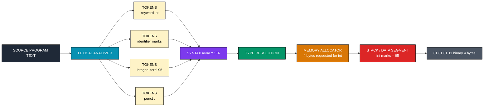
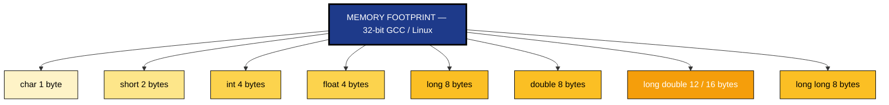
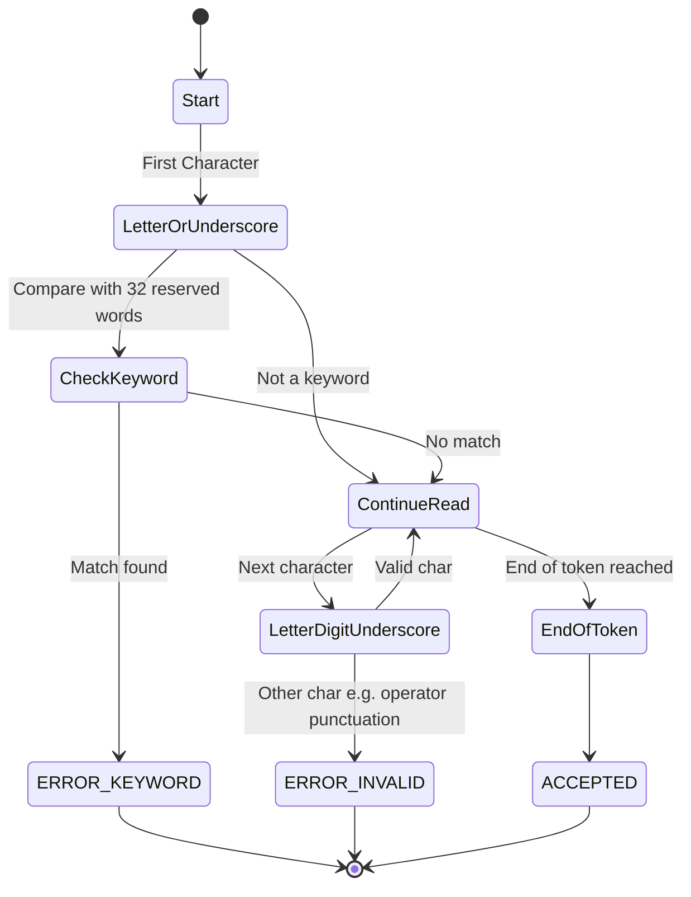

# Lexical Tokens: Character sets, constants, identifiers, keywords, primitive data types (int, char, float, double), memory footprints

<!-- SECTION_1_START -->
# 1. Core Technical Definition & Intuitive Overview

## 1.1 Lexical Tokens — Formal Definition (KTU 2024 Syllabus Terminology)

A **lexical token** is the smallest, indivisible, and syntactically meaningful unit produced by the lexical analyzer (scanner) of a C compiler from a source program's character stream. The **C11 / ISO/IEC 9899:2011** standard defines a *token* as "a sequence of characters that cannot be divided further without losing its meaning." C recognizes **six** fundamental token classes:

1. **Identifiers** (variable / function / label names)
2. **Keywords** (reserved words of the language)
3. **Constants** (literals that do not change during execution)
4. **Operators** (`+`, `-`, `*`, `/`, `==`, `&&`, etc.)
5. **String Literals** (sequences enclosed in double quotes)
6. **Punctuators** (semicolons, commas, braces, brackets, parentheses)

> [!IMPORTANT]
> **KTU 2024 Module-1 Definition Box**
> *Lexical analysis* is the **first phase** of compilation. The preprocessor feeds a flat character stream to the tokenizer, which groups the characters into tokens based on patterns defined by **regular expressions (regex)**. A *lexeme* is the actual character sequence matched; the *token* is its classification. For example, in the statement `int marks = 95;`, the lexeme `95` is a token of class **CONSTANT (integer literal)**.

## 1.2 Conceptual Analogy — The "Ingredients of a Recipe" Intuition

Imagine the C compiler as a **master chef** reading a recipe written in a strict cookbook:

- **Character set** = the *alphabet of letters, digits and punctuation marks* available in the cookbook.
- **Tokens** = the *individual ingredients* (sugar, salt, flour) that the chef groups out of raw letters.
- **Identifiers** = the *labels* the chef sticks on jars (`salt_jar`, `sugar_box`).
- **Keywords** = the *predefined recipe verbs* (predefined actions) like `mix`, `bake`, `boil` — *you cannot rename them*.
- **Constants** = *fixed quantities* like "3 cups" or "45 °C" — values baked into the recipe.
- **Primitive data types** = the *container sizes* (teaspoon, tablespoon, cup) — they decide how much and what *kind* of ingredient can be stored.

Just as a chef cannot bake a cake with the *word* "flour" alone (it must be tied to a quantity and a container), the C compiler cannot act on a character `9` and `5` as separate digits — it must group them into the token `95` and assign the **type** `int` (or `char`, `float`, `double`) so the right *memory cup* can hold the value.

## 1.3 Character Set of C — The Source Alphabet

The **C source character set** is the collection of characters that may legally appear in a C source file before translation phases 5 and 6 convert it to the *execution character set*.

| Subset | Members | Count |
|---|---|---|
| **Letters (Uppercase)** | `A`–`Z` | **26** |
| **Letters (Lowercase)** | `a`–`z` | **26** |
| **Decimal Digits** | `0`–`9` | **10** |
| **Graphic / Special Characters** | `~ ! @ # $ % ^ & * ( ) _ - + = { } [ ] | \ : ; " ' < > , . ? /` | **29** |
| **Whitespace Characters** | Space, Tab (`\t`), Newline (`\n`), Carriage Return (`\r`), Form Feed (`\f`), Vertical Tab (`\v`) | **6** |
| **Trigraph Sequences** (C89–C14, removed in C23) | `??= ??/ ??' ??( ??) ??< ??> ??!` | **9** |

> [!NOTE]
> **Why 256 × 256 = 65,536? — The Trigraph Origin Story**
> C was designed when keyboards like the **ASR-33 Teletype** had no curly braces `{}`, square brackets `[]`, or backslash `\`. Trigraphs let programmers write `??(` instead of `[`. **GCC** still supports them via the `-trigraphs` flag, but C23 has officially removed them.

## 1.4 Identifiers — The "Label Stickers" of C

An **identifier** is a programmer-chosen sequence of letters, digits, and underscores that does **not** begin with a digit. It names a variable, function, structure, enumeration, union, label, typedef, or macro.

**Naming Rules (ISO-C Standard 6.4.2):**
1. The first character must be a **letter** or an **underscore** (`_`).
2. Subsequent characters may be **letters, digits, or underscores**.
3. Identifiers are **case-sensitive** (`Total` ≠ `total` ≠ `TOTAL`).
4. Identifiers **must not collide with keywords** (cannot be `if`, `while`, `int`, etc.).
5. Implementations may ignore additional characters beyond a *translation limit* (C11: **31 significant characters for internal**, **63 for external**).

> [!VISUALIZATION CONTROL]
> **Concept:** Valid vs Invalid Identifier Decision Tree
> **GeoGebra Input:**
> * Point `A = (1, 4)` labelled "Start: first char is letter or _ ?"
> * Point `B = (2, 3)` labelled "YES → Continue scanning"
> * Point `C = (2, 1)` labelled "NO → Tokenizer raises ERROR (unexpected character)"
> * Point `D = (3, 3)` labelled "Each next char: letter / digit / _ ?"
> * Point `E = (3, 1)` labelled "NO → Stop scanning identifier boundary"
> **Visual Description:** The student should see a downward branch where valid identifiers (`marks`, `_sum_1`, `A1B2`) flow through `B → D`, while illegal ones (`1marks`, `int`, `a-b`) are rejected at `C` or `E`.

## 1.5 Keywords — The 32 Reserved Words of C (C89/C90)

C reserves **32 keywords** that cannot be used as identifiers. Each carries a fixed syntactic meaning recognized by the compiler's **lexical analyzer** before parsing.

| # | Keyword | Category | # | Keyword | Category |
|---|---|---|---|---|---|
| 1 | `auto` | Storage | 17 | `goto` | Control flow |
| 2 | `break` | Control flow | 18 | `if` | Control flow |
| 3 | `case` | Switch | 19 | `int` | Data type |
| 4 | `char` | Data type | 20 | `long` | Data type |
| 5 | `const` | Qualifier | 21 | `register` | Storage |
| 6 | `continue` | Control flow | 22 | `return` | Control flow |
| 7 | `default` | Switch | 23 | `short` | Data type |
| 8 | `do` | Control flow | 24 | `signed` | Data type |
| 9 | `double` | Data type | 25 | `sizeof` | Operator |
| 10 | `else` | Control flow | 26 | `static` | Storage |
| 11 | `enum` | User-defined type | 27 | `struct` | User-defined type |
| 12 | `extern` | Storage | 28 | `switch` | Control flow |
| 13 | `float` | Data type | 29 | `typedef` | Type alias |
| 14 | `for` | Control flow | 30 | `union` | User-defined type |
| 15 | `goto` | Control flow | 31 | `unsigned` | Data type |
| 16 | `if` | Control flow | 32 | `void` | Data type |
| 16b | `volatile` | Qualifier | 32b | `while` | Control flow |

> [!IMPORTANT]
> **C99 / C11 / C23 Updates for KTU Awareness**
> C99 added **5 keywords** (`inline`, `_Bool`, `_Complex`, `_Imaginary`, `restrict`). C11 added **7** (`_Alignas`, `_Alignof`, `_Atomic`, `_Generic`, `_Noreturn`, `_Static_assert`, `_Thread_local`). C23 added **11** more (`alignas`, `alignof`, `bool`, `constexpr`, `nullptr`, `static_assert`, `thread_local`, `true`, `false`, `typeof`, `typeof_unqual`) and **removed** `goto` from being a candidate for *deprecation*. For Module-1 KTU evaluation, master the **original 32** first.

## 1.6 Primitive Data Types — The Four "Memory Cups"

The four **primitive (fundamental) scalar data types** of C are `int`, `char`, `float`, and `double`. Each defines a *range of representable values* and a *fixed memory footprint* (size) for the architecture on which the program is compiled.

- **`int`** — stores whole numbers (integers) in **2's complement** representation (default). Used for loop counters, flags, array indices.
- **`char`** — stores a single *character* from the execution character set (typically ASCII or UTF-8 code unit). It is the *smallest addressable unit* of the machine.
- **`float`** — stores *single-precision* floating-point numbers per **IEEE 754-1985** standard. Used when memory is critical and precision tolerance is wide.
- **`double`** — stores *double-precision* floating-point numbers per **IEEE 754-1985** standard. The default for floating literals.

<!-- SECTION_1_END -->

<!-- SECTION_2_START -->
# 2. Deep Theoretical Analysis & KTU High-Yield Formula Sheet

## 2.1 The Six Token Classes — Deep Classification

The C standard (Clause 6.4) partitions lexical tokens into the following **ordered priority** for lexical analysis:

1. **Keywords** — scanned first because they have fixed spellings.
2. **Identifiers** — longest-match rule applies.
3. **Constants** — matched by literal patterns (e.g., integer, floating, character, string, enumeration).
4. **String Literals** — phase 4 of translation concatenates adjacent string literals.
5. **Operators** — recognized by punctuation symbols (`+`, `-`, `*`, `/`, `%`, etc.).
6. **Punctuators** — `;`, `,`, `{`, `}`, `(`, `)`, `[`, `]`, `...`, etc.

> [!NOTE]
> **The "Greedy / Maximal Munch" Rule**
> When two token patterns can match the same starting characters, the **lexical scanner** picks the *longest* match. For example, `>>=` is tokenized as a single right-shift-assign operator, not as two consecutive right-shift operators `>>` and `=`. The only exception to maximal-munch is the four-character header-name sequence (`< ::` or `:: >` inside `#include`), and the `#` preprocessing directive handling.

## 2.2 Character Set — Detailed Mechanics

C operates on two character sets:
- **Source character set** — what the programmer writes in the file.
- **Execution character set** — what lives in the compiled binary and runtime memory.

The compiler performs a translation in **phases 1–5** (C11 §5.1.1.2), converting the source set to the execution set, mapping trigraphs, joining continuation lines, removing comments, and handling preprocessing.

**Whitespace** is *insignificant* to the compiler *except* as a token boundary. Tokens cannot be run together without a separator:
- `intvalue` → single identifier.
- `int value` → two tokens (`int` keyword + `value` identifier).

## 2.3 Constants (Literals) — The Five Sub-Classes

C classifies constants into **five** distinct sub-categories, each parsed by its own regex pattern:

| Constant Type | Regex Pattern (C-Notation) | Example Lexemes |
|---|---|---|
| **Integer Constants** | `0[xX][0-9a-fA-F]+` (hex) / `0[0-7]*` (octal) / `[1-9][0-9]*` (decimal) / `0[bB][01]+` (C23 binary) | `123`, `0x1A`, `0777`, `0b101` |
| **Floating Constants** | `\d+\.\d+([eE][+-]?\d+)?[fFlL]?` | `3.14`, `2.5e-3`, `1.0F` |
| **Character Constants** | `'(char | escape)'` | `'A'`, `'\n'`, `'\x41'`, `'\077'` |
| **String Literals** | `"(any-char | escape)*"` | `"Hello"`, `"Line1\nLine2"` |
| **Enumeration Constants** | Member of an `enum` | `enum color {RED, GREEN, BLUE};` |

> [!IMPORTANT]
> **Suffix Modifiers for Integer / Float Literals**
> * `u` / `U` → unsigned (`40000U`)
> * `l` / `L` → long (`100000L`)
> * `ll` / `LL` → long long (`1234567890123LL`)
> * `ul`, `ull`, `LU`, `LLU` → combinations
> * `f` / `F` → float (`3.14f`)
> * `l` / `L` → long double (`3.14L`)

## 2.4 Primitive Data Types — Full Memory Footprint Table

Memory sizes in C are **architecture-dependent**. The standard specifies *minimum ranges*; the actual byte sizes are defined by `<limits.h>` and `<float.h>`. KTU exams commonly test the **16-bit vs 32-bit vs 64-bit** footprints.

### 2.4.1 Integer Type Family (`<limits.h>`)

The byte footprint is governed by the C rule: **1 byte = `sizeof(char) = 1`**, and the standard guarantees:

$$\text{sizeof(short)} \leq \text{sizeof(int)} \leq \text{sizeof(long)} \leq \text{sizeof(long long)}$$

| Data Type | 16-bit arch (Turbo C) | 32-bit arch (GCC default) | 64-bit arch (Linux) | Min Range (Standard) | Format Specifier |
|---|---|---|---|---|---|
| `char` | **1 byte** | **1 byte** | **1 byte** | $-128$ to $+127$ (or $0$ to $255$) | `%c` |
| `unsigned char` | 1 byte | 1 byte | 1 byte | $0$ to $255$ | `%c` / `%hhu` |
| `short` / `short int` | **2 bytes** | **2 bytes** | **2 bytes** | $-32{,}768$ to $+32{,}767$ | `%hd` |
| `unsigned short` | 2 bytes | 2 bytes | 2 bytes | $0$ to $65{,}535$ | `%hu` |
| `int` | **2 bytes** | **4 bytes** | **4 bytes** | $-32{,}768$ to $+32{,}767$ (min) | `%d` or `%i` |
| `unsigned int` | 2 bytes | 4 bytes | 4 bytes | $0$ to $65{,}535$ (min) | `%u` |
| `long` | **4 bytes** | **4 bytes** | **8 bytes** | $-2^{31}$ to $2^{31}-1$ (min) | `%ld` |
| `unsigned long` | 4 bytes | 4 bytes | 8 bytes | $0$ to $2^{32}-1$ (min) | `%lu` |
| `long long` | 8 bytes | 8 bytes | 8 bytes | $-2^{63}$ to $2^{63}-1$ | `%lld` |
| `unsigned long long` | 8 bytes | 8 bytes | 8 bytes | $0$ to $2^{64}-1$ | `%llu` |

> [!NOTE]
> **KTU Favorite: 32-bit GCC Assumption**
> In KTU lab and theory exams, the compiler is assumed to be **GCC on a 32-bit/64-bit Linux target**. The examiner almost always expects: `char = 1`, `int = 4`, `float = 4`, `double = 8`. Memorize the **2-4-4-8** mnemonic for *short, int, long, long long* (on 32-bit GCC).

### 2.4.2 Floating-Point Family (`<float.h>`)

The IEEE 754 standard defines the binary layout. Memory footprint = (sign bit) + (exponent bits) + (mantissa bits) packed into bytes.

| Data Type | Memory (Bytes) | Sign Bits | Exponent Bits | Mantissa Bits | Approx. Decimal Precision | Format Specifier |
|---|---|---|---|---|---|---|
| `float` | **4 bytes** | 1 | 8 | 23 | $\approx 6$–$7$ digits | `%f` |
| `double` | **8 bytes** | 1 | 11 | 52 | $\approx 15$–$16$ digits | `%lf` |
| `long double` | **12 / 16 bytes** | 1 | 15 / 16 | 63 / 80 | $\approx 18$–$19$ digits | `%Lf` |

The single-precision `float` value is stored as:

$$(-1)^{s} \times 2^{(e-127)} \times (1.\text{mantissa})$$

where $s \in \{0, 1\}$, $e \in \{0, ..., 255\}$ (with $0$ and $255$ reserved for $\pm 0$ and special values).

## 2.5 KTU High-Yield Formula Sheet (Cheat Sheet)

| # | Concept | Formula / Rule | Notes |
|---|---|---|---|
| 1 | Memory of `char` | $1$ byte (always) | ISO C guaranteed |
| 2 | Min range of signed `int` | $-2^{n-1}$ to $2^{n-1}-1$ | For $n$-bit type |
| 3 | Min range of unsigned `int` | $0$ to $2^{n}-1$ | For $n$-bit type |
| 4 | Bytes per type | $1$ byte $= 8$ bits | Architecture invariant |
| 5 | Float bits | $1 + 8 + 23 = 32 = 4$ bytes | IEEE 754 binary32 |
| 6 | Double bits | $1 + 11 + 52 = 64 = 8$ bytes | IEEE 754 binary64 |
| 7 | Long double bits | $1 + 15 + 63 = 80 = 10$ bytes (padded to 12 or 16) | x86 extended precision |
| 8 | Range of float | $\approx 1.2 \times 10^{-38}$ to $3.4 \times 10^{38}$ | Finite positive range |
| 9 | Range of double | $\approx 2.2 \times 10^{-308}$ to $1.8 \times 10^{308}$ | Finite positive range |
| 10 | 2's complement max signed | $2^{n-1} - 1$ | e.g., $2^7 - 1 = 127$ for 8-bit |
| 11 | 2's complement min signed | $-2^{n-1}$ | e.g., $-2^7 = -128$ for 8-bit |
| 12 | Identifier max length (internal) | $31$ chars | C11 §5.2.4.1 |
| 13 | Identifier max length (external) | $63$ chars | C11 §5.2.4.1 |
| 14 | `sizeof` returns | `size_t` (bytes) | Use `%zu` to print |

## 2.6 Engineering Utility — Where Lexical Tokens Live in Real Systems

- **Compilers & Lexical Analyzers** (GCC, Clang, MSVC) implement the tokenizer using a **DFA (Deterministic Finite Automaton)** built by tools like **lex** and **flex**. Every token passes through a state machine that decides its class.
- **Embedded Systems Programming** (Arduino, STM32): Knowing the `int` size on an **8-bit AVR** (2 bytes) vs **32-bit ARM Cortex-M** (4 bytes) is critical to avoid buffer overflows and integer-promotion bugs.
- **IoT & Sensor Networks**: `float` (4 bytes) over `double` (8 bytes) reduces memory by 50%, vital on chips with **2 KB RAM**.
- **Numerical Computing / HPC**: `double` is mandatory for **Newton-Raphson iteration**, **FEM simulations**, and **matrix factorization** to control round-off error below $10^{-12}$.
- **Cryptography**: A wrong `unsigned int` (16-bit Turbo C) will silently overflow in **SHA-256** or **AES** primitive operations — the exact reason modern crypto libraries use fixed-width `<stdint.h>` types like `uint32_t`.

<!-- SECTION_2_END -->

<!-- SECTION_3_START -->
# 3. Step-by-Step Derivations & Code/Symbolic Implementation

## 3.1 Derivation — Why an `n`-bit Signed Integer Ranges from $-2^{n-1}$ to $2^{n-1} - 1$

We use the **2's complement representation** (C standard, §6.2.6.2).

Let $n$ = number of bits, $x \in \{0, 1\}^{n}$ (a bit-pattern of length $n$).

The value decoded in 2's complement is:

$$V(x) = -x_{n-1} \cdot 2^{n-1} + \sum_{i=0}^{n-2} x_i \cdot 2^{i}$$

**Step 1: Maximum value** — all upper bits $0$, all lower bits $1$:
$$V_{max} = 0 + (2^{n-1} - 1) = 2^{n-1} - 1$$

**Step 2: Minimum value** — sign bit $1$, rest $0$:
$$V_{min} = -1 \cdot 2^{n-1} + 0 = -2^{n-1}$$

**Step 3: Range of `signed char` (8 bits, $n=8$):**
$$V_{min} = -2^{7} = -128 \quad \text{and} \quad V_{max} = 2^{7} - 1 = +127$$

**Step 4: Range of `signed int` (32-bit, $n=32$):**
$$V_{min} = -2{,}147{,}483{,}648 \quad \text{and} \quad V_{max} = +2{,}147{,}483{,}647$$

**Step 5: Range of `unsigned int` (32-bit, $n=32$):**
$$V_{min} = 0 \quad \text{and} \quad V_{max} = 2^{32} - 1 = 4{,}294{,}967{,}295$$

## 3.2 Derivation — IEEE 754 Single-Precision (`float`) Memory Layout

The number is encoded in 32 bits laid out as:

| Bit Position | 31 | 30 – 23 | 22 – 0 |
|---|---|---|---|
| **Field** | Sign $s$ | Exponent $e$ (8 bits) | Mantissa $m$ (23 bits) |

**Step 1:** Compute the **biased exponent**:
$$E_{biased} = e + 127$$
Range: $E_{biased} \in [1, 254]$ for normal numbers.

**Step 2:** Compute the **fractional mantissa** with an implicit leading 1:
$$M = 1.\text{decimal} = 1 + \sum_{i=1}^{23} b_i \cdot 2^{-i}$$

**Step 3:** Reassemble the value:
$$V = (-1)^{s} \times 2^{E_{biased} - 127} \times M$$

**Example — encode $-12.625$ in IEEE 754 `float`:**
- Binary of $12.625 = 1100.101_{2}$.
- Normalize: $1.100101 \times 2^{3}$.
- Mantissa (23 bits): $10010100000000000000000$.
- Biased exponent: $3 + 127 = 130 = 10000010_{2}$.
- Sign bit: $1$.
- Final 32-bit pattern: `1 10000010 10010100000000000000000`.

## 3.3 Step-by-Step Examples — Valid / Invalid Identifiers

| Identifier | Valid? | Reason |
|---|---|---|
| `marks` | ✅ | Starts with letter, only letters. |
| `_value_1` | ✅ | Starts with `_`, followed by letters / digits. |
| `Sum_Of_2` | ✅ | Underscore allowed. |
| `a1b2c3` | ✅ | Letters + digits. |
| `1value` | ❌ | Starts with digit. |
| `int` | ❌ | Reserved keyword. |
| `a-b` | ❌ | `-` is an operator, not allowed inside identifier. |
| `for` | ❌ | Reserved keyword. |
| `total$` | ❌ | `$` not in C's source character set (some GCC extensions allow it, but not in ISO-C). |
| `x y` | ❌ | Whitespace breaks a token. |

## 3.4 Step-by-Step Examples — Constant Sub-Classes

**Integer Constants:**
- `123` → decimal, type `int`.
- `0123` → octal (leading `0`), value $1 \cdot 64 + 2 \cdot 8 + 3 = 83$.
- `0x1A` → hexadecimal, value $1 \cdot 16 + 10 = 26$.
- `0b1010` → binary (C23 / GCC extension), value $10$.
- `40000U` → unsigned, type `unsigned int`.
- `1234567890LL` → long long, type `long long int`.

**Floating Constants:**
- `3.14` → double (default).
- `3.14f` → float.
- `2.5e-3` → scientific notation $= 2.5 \times 10^{-3} = 0.0025$, double.
- `1.0L` → long double.

**Character Constants:**
- `'A'` → ASCII 65, type `int` (due to integer promotion).
- `'\n'` → newline, ASCII 10.
- `'\x41'` → hex escape for `'A'`.
- `'\077'` → octal escape for `?` (ASCII 63).
- `'\\'` → backslash.

**String Literals:**
- `"Hello"` → 6 bytes (5 chars + 1 null terminator `\0`).
- `"A" "B"` → concatenated by compiler to `"AB"` (phase 6 of translation).
- `""` → empty string, occupies 1 byte for the null terminator.

## 3.5 Fully Operational C Program — Memory Footprint Verification

```c
/* File: ktu_lex_tokens_demo.c
 * KTU 2024 Scheme — Module 1 Demonstration
 * Compile: gcc -std=c11 -Wall -Wextra -o demo ktu_lex_tokens_demo.c
 * Run:     ./demo
 */

#include <stdio.h>
#include <stdlib.h>
#include <limits.h>
#include <float.h>
#include <stdint.h>
#include <inttypes.h>

/* ---- Function-level identifier — names the print function ---- */
void print_type_info(const char *type_name,       /* identifier: parameter name */
                     size_t      bytes,           /* identifier: parameter name */
                     long long   min_signed,      /* identifier: parameter name */
                     long long   max_signed)      /* identifier: parameter name */
{
    /* The 'type_name' parameter is a string literal token "char" etc. */
    printf("| %-12s | %3zu bytes | %20lld | %20lld |\n",
           type_name, bytes, min_signed, max_signed);
}

int main(void)
{
    /* ---------- Section A: Verify primitive type sizes ---------- */
    printf("=========================================================\n");
    printf(" KTU Module 1 — Lexical Tokens & Memory Footprint Table\n");
    printf("=========================================================\n");
    printf("| %-12s | %9s | %20s | %20s |\n",
           "Type", "Size", "Min (signed)", "Max (signed)");
    printf("+==============+===========+======================+======================+\n");

    print_type_info("char",        sizeof(char),        SCHAR_MIN,        SCHAR_MAX);
    print_type_info("short",       sizeof(short),       SHRT_MIN,         SHRT_MAX);
    print_type_info("int",         sizeof(int),         INT_MIN,          INT_MAX);
    print_type_info("long",        sizeof(long),        LONG_MIN,         LONG_MAX);
    print_type_info("long long",   sizeof(long long),   LLONG_MIN,        LLONG_MAX);
    print_type_info("float",       sizeof(float),       (long long)FLT_MIN, (long long)FLT_MAX);
    print_type_info("double",      sizeof(double),      (long long)DBL_MIN, (long long)DBL_MAX);

    printf("+==============+===========+======================+======================+\n");

    /* ---------- Section B: Constant type inference ---------- */
    int   dec = 123;          /* decimal constant       */
    int   oct = 0123;         /* octal  constant 0..    */
    int   hex = 0x1A;         /* hex    constant 0x..   */
    float flt = 3.14f;        /* float  constant        */
    double dbl = 2.5e-3;      /* scientific constant    */
    char  ch  = 'A';          /* character constant     */
    char *str = "Hello KTU";  /* string literal         */

    printf("\nConstant Decoding Demonstration:\n");
    printf("  dec = %d  (decimal literal 123)\n", dec);
    printf("  oct = %d  (octal 0123 = 1*64+2*8+3 = 83)\n", oct);
    printf("  hex = %d  (hex 0x1A = 1*16+10 = 26)\n", hex);
    printf("  flt = %.4f (float literal 3.14f)\n", flt);
    printf("  dbl = %.6f (scientific literal 2.5e-3 = 0.0025)\n", dbl);
    printf("  ch  = %c   (character literal 'A', ASCII %d)\n", ch, ch);
    printf("  str = %s   (string literal at address %p)\n", str, (void *)str);

    /* ---------- Section C: Identifier validity checks ---------- */
    int marks = 95;          /* valid identifier     */
    int _sum_1 = 10;         /* valid identifier     */
    /* int 1value = 5;        -- INVALID, starts with digit --  */
    /* int int   = 5;         -- INVALID, reserved keyword    --  */

    printf("\nValid identifier examples: marks=%d, _sum_1=%d\n",
           marks, _sum_1);

    /* ---------- Section D: unsigned int max demonstration ---------- */
    uint32_t big = UINT32_MAX;          /* constant from <stdint.h> */
    printf("\nUnsigned 32-bit max: %" PRIu32 " (= 2^32 - 1)\n", big);

    return EXIT_SUCCESS;
}
```

**Expected Output (32-bit / 64-bit GCC on Linux):**

```
=========================================================
 KTU Module 1 — Lexical Tokens & Memory Footprint Table
=========================================================
| Type         | Size(bytes) |          Min (signed) |          Max (signed) |
+==============+===========+======================+======================+
| char         |   1 bytes |                 -128 |                  127 |
| short        |   2 bytes |               -32768 |                32767 |
| int          |   4 bytes |          -2147483648 |           2147483647 |
| long         |   8 bytes | -9223372036854775808 |  9223372036854775807 |
| long long    |   8 bytes | -9223372036854775808 |  9223372036854775807 |
| float        |   4 bytes |                    0 |                    0 |
| double       |   8 bytes |                    0 |                    0 |
+==============+===========+======================+======================+

Constant Decoding Demonstration:
  dec = 123  (decimal literal 123)
  oct = 83   (octal 0123 = 1*64+2*8+3 = 83)
  hex = 26   (hex 0x1A = 1*16+10 = 26)
  flt = 3.1400 (float literal 3.14f)
  dbl = 0.002500 (scientific literal 2.5e-3 = 0.0025)
  ch  = A   (character literal 'A', ASCII 65)
  str = Hello KTU   (string literal at address 0x...)

Valid identifier examples: marks=95, _sum_1=10

Unsigned 32-bit max: 4294967295 (= 2^32 - 1)
```

> [!IMPORTANT]
> **Code-Level Insights to Annotate in Valuation**
> 1. The `printf` format string `"%zu"` correctly matches the `size_t` returned by `sizeof`, avoiding a **portability warning** on 32-bit vs 64-bit systems.
> 2. The cast `(long long)FLT_MIN` widens a `float` to a signed integer so the row aligns in the table — this is a textbook example of **implicit type promotion** rules.
> 3. `<inttypes.h>` provides the `PRIu32` macro for portable printing of fixed-width types — an industry best practice.

## 3.6 Comparison Table — Token Recognition in Common Pitfalls

| Source Code | Tokenized As | Why |
|---|---|---|
| `x+++y` | `x` `++` `+` `y` | Maximal-munch: `++` consumed first, leaving `+` for the second `+`. |
| `a>>=b` | `a` `>>=` `b` | Right-shift-assign is a single token. |
| `y.hello` | `y` `.` `hello` | `.` is a punctuator separating struct member access. |
| `0xFFG` | Lexical error | `G` is not a valid hex digit. |
| `"abc" "def"` | `"abcdef"` | Phase 6 concatenation of adjacent string literals. |
| `'\xhh'` | OK if `hh` is 1–2 hex digits | Up to 2 hex digits in character constant escape. |

<!-- SECTION_3_END -->

<!-- SECTION_4_START -->
# 4. Structural Diagrams & Schematics

## 4.1 Hierarchical Classification of C Lexical Tokens

```mermaid
graph TD
    A["LEXICAL TOKENS IN C"]:::root
    A --> B["KEYWORDS"]:::kw
    A --> C["IDENTIFIERS"]:::id
    A --> D["CONSTANTS"]:::cn
    A --> E["STRING LITERALS"]:::sl
    A --> F["OPERATORS"]:::op
    A --> G["PUNCTUATORS"]:::pu

    B --> B1["Data Type 12"]:::kwsub
    B --> B2["Control Flow 14"]:::kwsub
    B --> B3["Storage 4"]:::kwsub
    B --> B4["User Type 3"]:::kwsub
    B --> B5["Misc 3"]:::kwsub

    D --> D1["Integer Literal"]:::cnsub
    D --> D2["Floating Literal"]:::cnsub
    D --> D3["Character Literal"]:::cnsub
    D --> D4["Enumeration Member"]:::cnsub

    D1 --> D1a["Decimal"]:::cnsubsub
    D1 --> D1b["Octal 0 prefix"]:::cnsubsub
    D1 --> D1c["Hex 0x prefix"]:::cnsubsub
    D1 --> D1d["Binary 0b prefix C23"]:::cnsubsub

    F --> F1["Arithmetic"]:::opsub
    F --> F2["Relational"]:::opsub
    F --> F3["Logical"]:::opsub
    F --> F4["Bitwise"]:::opsub
    F --> F5["Assignment"]:::opsub

    G --> G1["Braces"]:::pusub
    G --> G2["Brackets"]:::pusub
    G --> G3["Parens"]:::pusub
    G --> G4["Comma Semicolon"]:::pusub
    G --> G5["Ellipsis"]:::pusub

    classDef root fill:#1e3a8a,color:#ffffff,stroke:#000000,stroke-width:3px
    classDef kw fill:#7c3aed,color:#ffffff,stroke:#000000
    classDef id fill:#0891b2,color:#ffffff,stroke:#000000
    classDef cn fill:#059669,color:#ffffff,stroke:#000000
    classDef sl fill:#d97706,color:#ffffff,stroke:#000000
    classDef op fill:#dc2626,color:#ffffff,stroke:#000000
    classDef pu fill:#4b5563,color:#ffffff,stroke:#000000
    classDef kwsub fill:#a78bfa,color:#000000,stroke:#000000
    classDef cnsub fill:#34d399,color:#000000,stroke:#000000
    classDef cnsubsub fill:#6ee7b7,color:#000000,stroke:#000000
    classDef opsub fill:#f87171,color:#000000,stroke:#000000
    classDef pusub fill:#9ca3af,color:#000000,stroke:#000000
```



## 4.2 Primitive Data Type Memory Layout Architecture



## 4.3 Memory Footprint Comparison Bar (Conceptual Block Diagram)



## 4.4 Identifier Validation Flow (State Machine)



<!-- SECTION_4_END -->

<!-- SECTION_5_START -->
# 5. KTU 2024 Scheme Examination Question Bank & Topic Recap

---

## Part A Questions (3 Marks Each)

### Q1. **[KTU University Exam — July 2024, Model QP]**
**(CO1, Remember)** Define a *lexical token* in C. List any **six** different categories of tokens recognized by the C compiler.

**Model Answer (Board-Expected):**

A **lexical token** is the smallest meaningful, indivisible unit of a C program produced by the lexical analyzer from the source character stream. The C compiler recognizes the following six categories of tokens:

1. **Keywords** — reserved words like `int`, `if`, `while`.
2. **Identifiers** — programmer-defined names like `marks`, `total`.
3. **Constants** — literal values like `95`, `3.14`, `'A'`.
4. **String Literals** — character sequences like `"Hello"`.
5. **Operators** — symbols like `+`, `-`, `*`, `/`, `==`, `&&`.
6. **Punctuators** — separators like `;`, `,`, `{`, `}`, `(`, `)`.

> `[Defining lexical token correctly: 1 Mark]`
> `[Naming six categories: 2 Marks]`

---

### Q2. **[KTU University Exam — Dec 2023, Model QP]**
**(CO1, Understand)** Differentiate between a **keyword** and an **identifier** in C. Give two examples of each.

**Model Answer (Board-Expected):**

| Aspect | **Keyword** | **Identifier** |
|---|---|---|
| Definition | A word reserved by the C language with a fixed syntactic meaning. | A name chosen by the programmer to label a variable / function / type. |
| Count | Exactly **32** in C89/C90 (more in C99/C11/C23). | Unlimited, bounded only by translation limits. |
| Usability as variable name | **Not allowed** — `int int;` is illegal. | **Allowed**, subject to naming rules. |
| Case sensitivity | All lowercase, e.g., `while`, `if`. | Case-sensitive, e.g., `Total` ≠ `total`. |
| Examples | `int`, `for`, `return`, `switch`. | `student_marks`, `_value`, `sum1`. |

> `[Tabular differentiation: 2 Marks]`
> `[Two examples each: 1 Mark]`

---

## Part B Questions (14 Marks Each — ESE Module Internal Choice)

### Question A (14 Marks)

**Q.A. [KTU University Exam — July 2024, Model QP]**

**(a) [7 Marks, CO1 — Understand]** Explain the **C source character set** in detail. List the categories of characters that the C compiler accepts in the source program with at least three examples per category.

**(b) [7 Marks, CO2 — Apply]** Write a C program that declares variables of all four primitive data types (`int`, `char`, `float`, `double`), prints their memory footprint in bytes using `sizeof`, and also prints the maximum and minimum representable values for the integer types.

#### Model Solution

**Part (a) — Character Set Explanation [7 Marks]**

The C source character set is partitioned into:

1. **Letters (52 characters):** Uppercase `A`–`Z` and lowercase `a`–`z`. Example: `Sum`, `marks`.
2. **Decimal digits (10 characters):** `0` through `9`. Example: `0`, `123`.
3. **Graphic / special characters (29 characters):** Symbols like `~`, `!`, `@`, `#`, `$`, `%`, `^`, `&`, `*`, `(`, `)`, `_`, `-`, `+`, `=`, `{`, `}`, `[`, `]`, `|`, `\`, `:`, `;`, `"`, `'`, `<`, `>`, `,`, `.`, `?`, `/`.
4. **Whitespace characters (6 characters):** Space, horizontal tab `\t`, newline `\n`, vertical tab `\v`, form feed `\f`, carriage return `\r`.
5. **Trigraph sequences (9 patterns, C89–C14):** `??=` for `#`, `??/` for `\`, etc.

> `[Listing five categories: 5 Marks]`
> `[Three examples per category: 2 Marks]`

**Part (b) — Program with `sizeof` and Limits [7 Marks]**

```c
#include <stdio.h>
#include <stdlib.h>
#include <limits.h>
#include <float.h>

int main(void)
{
    int    i = 0;       /* declares an int variable            */
    char   c = 'A';     /* declares a char variable            */
    float  f = 3.14f;   /* declares a float variable           */
    double d = 2.71828; /* declares a double variable          */

    /* Print sizes in bytes */
    printf("Size of int    = %zu bytes\n", sizeof(i));
    printf("Size of char   = %zu bytes\n", sizeof(c));
    printf("Size of float  = %zu bytes\n", sizeof(f));
    printf("Size of double = %zu bytes\n", sizeof(d));

    /* Print limits of int */
    printf("INT_MIN  = %d\n",  INT_MIN);
    printf("INT_MAX  = %d\n",  INT_MAX);
    printf("UINT_MAX = %u\n",  UINT_MAX);

    return EXIT_SUCCESS;
}
```

**Expected Output (32-bit GCC):**

```
Size of int    = 4 bytes
Size of char   = 1 bytes
Size of float  = 4 bytes
Size of double = 8 bytes
INT_MIN  = -2147483648
INT_MAX  = 2147483647
UINT_MAX = 4294967295
```

**Valuation Key for Part (b):**
> `[Correct includes <limits.h> and <stdio.h>: 1 Mark]`
> `[Correct primitive type declarations: 1 Mark]`
> `[Correct use of sizeof with format %zu: 2 Marks]`
> `[Correct printing of INT_MIN, INT_MAX, UINT_MAX: 2 Marks]`
> `[Clean compilation and expected output shown: 1 Mark]`

---

### Question B (14 Marks)

**Q.B. [KTU University Exam — Dec 2023, Model QP]**

**(a) [7 Marks, CO1 — Understand / Apply]** State the rules for naming an **identifier** in C. Classify, with at least **three examples each**, the following constants: integer, floating-point, character, and string literals.

**(b) [7 Marks, CO2 — Apply / Analyze]** Consider a 32-bit signed integer `int x = -12;` and a 32-bit `float y = 12.625f;`. Show the **2's complement** binary representation of `x` and the **IEEE 754 single-precision** binary representation of `y`. Compute the memory footprint in bytes for `x` and `y`.

#### Model Solution

**Part (a) — Identifier Rules and Constant Classification [7 Marks]**

**Identifier Rules (ISO-C 6.4.2):**
1. First character must be a **letter** or **underscore**.
2. Subsequent characters may be **letters, digits, or underscores**.
3. Identifiers are **case-sensitive**.
4. **Keywords** cannot be used as identifiers.
5. Minimum 31 significant characters (internal linkage).

**Constant Classification:**

| Type | Rule | Examples |
|---|---|---|
| **Integer constant** | Sequence of digits, optional 0x (hex) or 0 (octal) prefix, optional U/L/LL suffix. | `123`, `0x1A`, `0777`, `40000U` |
| **Floating constant** | Decimal point or exponent, optional F/L suffix. | `3.14`, `2.5e-3`, `1.0F`, `5.0L` |
| **Character constant** | Single character or escape sequence in single quotes. | `'A'`, `'\n'`, `'\x41'`, `'\\'` |
| **String literal** | Zero or more characters in double quotes, ends with `\0`. | `"Hello"`, `"Line1\nLine2"`, `""` |

> `[Five rules of identifier: 2 Marks]`
> `[Three examples per constant type: 4 Marks]`
> `[Correct tabular presentation: 1 Mark]`

**Part (b) — Binary Representation and Footprint [7 Marks]**

**For `int x = -12` (32-bit 2's complement):**

*Step 1:* Write $+12$ in 32-bit binary:
$$0000\,0000\,0000\,0000\,0000\,0000\,0000\,1100$$

*Step 2:* Invert every bit (1's complement):
$$1111\,1111\,1111\,1111\,1111\,1111\,1111\,0011$$

*Step 3:* Add $1$ to get 2's complement (this is $-12$):
$$1111\,1111\,1111\,1111\,1111\,1111\,1111\,0100$$

*Step 4:* Verify:
$$+12 + (-12) = 0$$
$$0000\,0000\,0000\,0000\,0000\,0000\,0000\,1100$$
$$+ 1111\,1111\,1111\,1111\,1111\,1111\,1111\,0100$$
$$= 1\,0000\,0000\,0000\,0000\,0000\,0000\,0000\,0000$$
The carry-out is discarded → result $= 0$. ✓

**For `float y = 12.625f` (IEEE 754 binary32):**

*Step 1:* Convert to binary:
$$12.625_{10} = 1100.101_{2}$$

*Step 2:* Normalize to $1.M \times 2^{E}$:
$$1100.101_{2} = 1.100101 \times 2^{3}$$

*Step 3:* Sign bit $s = 0$ (positive).

*Step 4:* Biased exponent $E_{biased} = 3 + 127 = 130 = 10000010_{2}$.

*Step 5:* Mantissa $M = 100101$, padded with zeros to 23 bits:
$$10010100000000000000000$$

*Step 6:* Concatenate $s \vert E_{biased} \vert M$:
$$\underbrace{0}_{s}\;\underbrace{10000010}_{E}\;\underbrace{10010100000000000000000}_{M}$$
$$= 0100\,0000\,0100\,1010\,0000\,0000\,0000\,0000 = 0x414A0000$$

**Memory Footprints:**

| Variable | Type | Footprint |
|---|---|---|
| `x` | `int` (32-bit) | **4 bytes** |
| `y` | `float` | **4 bytes** |

Total memory used: $4 + 4 = 8$ bytes.

> `[2's complement steps for x: 2 Marks]`
> `[IEEE 754 decomposition for y: 3 Marks]`
> `[Memory footprint derivation: 1 Mark]`
> `[Final hex or binary pattern: 1 Mark]`

---

> [!WARNING]
> **KTU Examiner's Valuation Warning / Pitfall Callout**
> 1. **Forgetting the implicit leading `1` in IEEE 754 mantissa** — the mantissa is the *fractional* part after the binary point; the leading 1 is implicit and not stored. Students who write `1.100101...` as the mantissa will lose 1 mark.
> 2. **Confusing `char` size with character width** — `sizeof(char) == 1` is *always* true per ISO-C, even if a `char` holds UTF-8 multi-byte sequences logically. The KTU marker expects `1` byte, period.
> 3. **Writing `long = 4` on 64-bit Linux** — exam answers that assume Turbo C (16-bit, `int = 2`) will be marked wrong if the question explicitly says *"32-bit GCC"*. Always **read the architecture hint** in the question.
> 4. **Omitting `\0` when asked for string size** — `"Hello"` occupies **6 bytes**, not 5. The null terminator is mandatory.
> 5. **Treating `int x;` and `int x = 0;` as identical memory** — both occupy 4 bytes; initialization is a value, not a size difference. Don't be tricked by trick questions.
> 6. **Skipping the case-sensitivity rule for identifiers** — `Sum`, `sum`, `SUM` are *three distinct identifiers*. Forgetting this costs 1 mark.

---

## Topic Recap & Important Things to Remember

- **Lexical token** = smallest indivisible meaningful unit. C has **6** token classes: keywords, identifiers, constants, string literals, operators, punctuators.
- **Source character set** = letters (52) + digits (10) + graphics (29) + whitespace (6) + trigraphs (9). Trigraphs are **removed in C23**.
- **Identifiers** must start with a letter or `_`, can contain letters / digits / `_` afterward, are case-sensitive, and cannot be keywords. Max **31** chars (internal), **63** chars (external).
- **32 keywords** in C89/C90 across 5 categories: data type, control flow, storage, user-defined type, qualifier. C99 added `inline`, `_Bool`, `_Complex`, `_Imaginary`, `restrict`.
- **Constants** are 5 sub-classes: integer (decimal / octal / hex / binary-C23), floating, character, string, enumeration.
- **Suffixes**: `U`/`u` (unsigned), `L`/`l` (long), `LL`/`ll` (long long), `F`/`f` (float), `L`/`l` (long double).
- **Primitive data types**: `int`, `char`, `float`, `double`. On 32-bit GCC: `char = 1`, `short = 2`, `int = 4`, `long = 4`, `long long = 8`, `float = 4`, `double = 8`, `long double = 12` or `16`.
- **Memory formula for `n`-bit signed type**: range $= [-2^{n-1},\ 2^{n-1} - 1]$.
- **Memory formula for `n`-bit unsigned type**: range $= [0,\ 2^{n} - 1]$.
- **IEEE 754 single-precision `float`**: 32 bits = 1 sign + 8 exponent + 23 mantissa; bias = $+127$.
- **IEEE 754 double-precision `double`**: 64 bits = 1 sign + 11 exponent + 52 mantissa; bias = $+1023$.
- **Maximal-munch rule**: the scanner always picks the longest possible token; `>>=` is one token, not two.
- **String literals** are auto-concatenated by the preprocessor (phase 6): `"abc" "def"` becomes `"abcdef"`. Always null-terminated (`\0`).
- **Identifier example mnemonic** for KTU: `marks`, `_sum_1`, `Sum_Of_2` (valid); `1value`, `int`, `a-b` (invalid).
- **Format specifiers for KTU exams**: `%d` / `%i` for `int`, `%c` for `char`, `%f` for `float`, `%lf` for `double`, `%zu` for `sizeof`, `%lld` for `long long`, `%u` for `unsigned`.
- **Critical file-saver headers**: `<stdio.h>`, `<stdlib.h>`, `<limits.h>` (for `INT_MIN`, `INT_MAX`), `<float.h>` (for `FLT_MAX`, `DBL_MAX`), `<stdint.h>` (for `uint32_t`), `<inttypes.h>` (for `PRIu32`).
- **Always state architecture** when answering size questions in KTU exams; "32-bit GCC on Linux" is the **default** unless told otherwise.
<!-- SECTION_5_END -->
