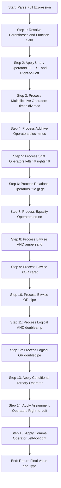
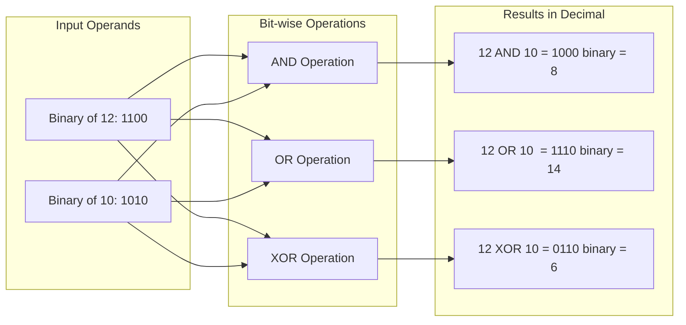
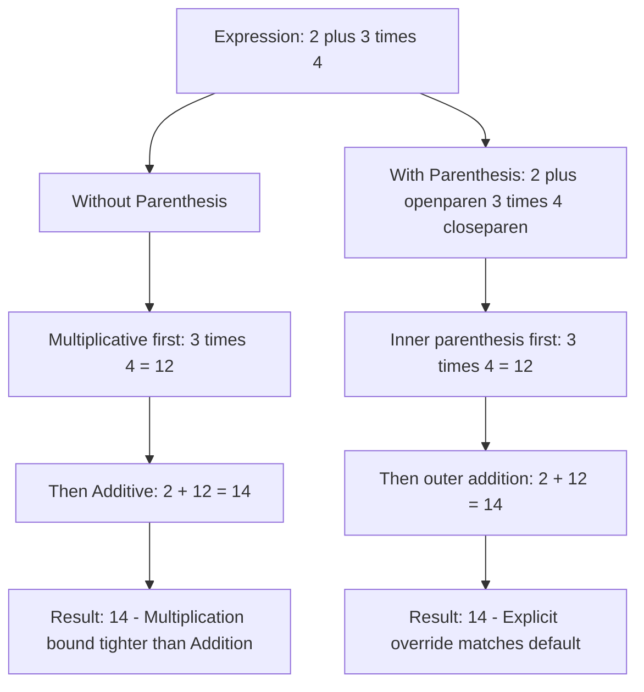
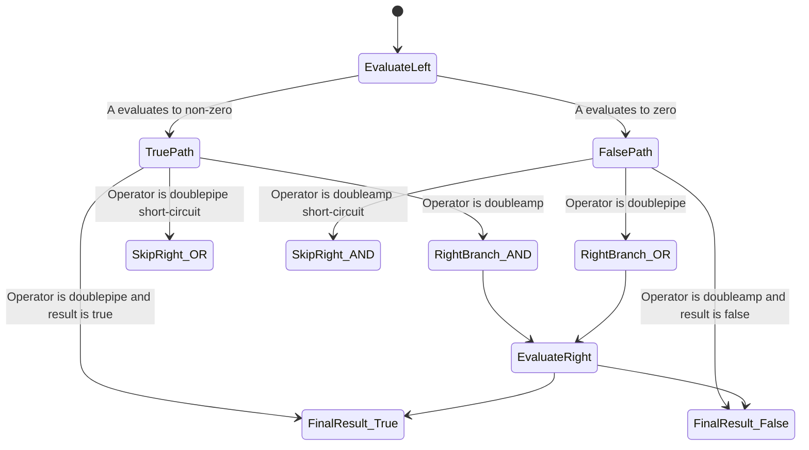

# Operators & Expressions: Mathematical, relational, logical, bit-wise operators, precedence rules

<!-- SECTION_1_START -->
# OPERATORS & EXPRESSIONS IN C

## 1.1 Formal Academic Definition (KTU 2024 Syllabus Terminology)

> [!IMPORTANT]
> **Operator**: An *operator* in C is a special symbol (consisting of one or more characters) that instructs the compiler to perform a specific mathematical, relational, logical, or bit-level manipulation on one or more *operands* and produce a resultant value.

> [!IMPORTANT]
> **Expression**: An *expression* in C is a valid combination of **operators**, **operands** (constants, variables, function calls), and **parentheses** that the C compiler evaluates to produce a single value of a specific data type.

> [!NOTE]
> According to the **ISO/IEC 9899:2018 (C17)** standard adopted by KTU, every expression in C has a **type** and a **value category** (lvalue, rvalue). Understanding this is essential for writing bug-free modular code.

The classification hierarchy used in the **KTU 2024 Scheme – Programming in C (Module 1)** is:

1. **Arithmetic (Mathematical) Operators**
2. **Relational Operators**
3. **Logical Operators**
4. **Bit-wise Operators**
5. **Assignment & Compound Assignment Operators**
6. **Increment / Decrement Operators**
7. **Conditional (Ternary) Operator**
8. **Special Operators** — `sizeof`, comma `,`

---

## 1.2 Conceptual Analogy & Intuition

Think of a C program as a **kitchen recipe**.

- **Operands** are the *ingredients* (variables like `flour = 2`, `sugar = 3`).
- **Operators** are the *cooking actions* (mix, heat, taste-test, combine).
- **An expression** is the *complete instruction step* like `"flour + sugar"` or `"flour == sugar"`.
- **Precedence** is the *order* in which you must perform the steps — you cannot frost a cake **before** baking it, no matter how beautiful the frosting is.

Just as in a recipe, where **multiplication (`*`)** must be done *before* **addition (`+`)** to get the correct taste, C follows a strict **precedence ladder** so the compiler knows the order of "tasting" each sub-expression.

---

## 1.3 Why This Matters in Engineering

Operators are the **computational engine** of every embedded system, IoT device, scientific simulator, and database engine. A civil engineering student uses arithmetic operators to compute beam stress; a CS student uses **bit-wise operators** to set hardware registers on an ARM Cortex-M microcontroller. Mastering operators is the foundation of all programming logic.

---

> [!VISUALIZATION CONTROL]
> **Concept:** Operator Precedence Ladder (Geometric Visualization)
> **Conceptual Mapping:** Think of a vertical y-axis where higher $y$ values = higher precedence (evaluated first).
> **Visual Description:**
> Imagine a vertical number line from 0 to 17 (KTU 2024 precedence levels).
> - At the **top (y = 17)**: Unary operators `++`, `--`, `!`, `~`
> - In the **middle (y = 12)**: Multiplicative `*`, `/`, `%`
> - Near the **bottom (y = 4)**: Additive `+`, `-`
> - At the **base (y = 1)**: Assignment `=`
>
> An expression is read like a stack — the compiler descends the ladder from top to bottom, binding operators to operands as it goes.

<!-- SECTION_1_END -->

<!-- SECTION_2_START -->
# 2. DEEP THEORETICAL ANALYSIS & KTU HIGH-YIELD FORMULA SHEET

## 2.1 Arithmetic (Mathematical) Operators

C provides **five** primary arithmetic operators. They work on numeric operands (`int`, `float`, `double`, `char`).

| Operator | Symbol | Operation | Example | Result Type |
|----------|--------|-----------|---------|-------------|
| Addition | `+` | Adds two operands | `7 + 3` | `10` |
| Subtraction | `-` | Subtracts RHS from LHS | `7 - 3` | `4` |
| Multiplication | `*` | Multiplies operands | `7 * 3` | `21` |
| Division | `/` | Quotient of division | `7 / 3` | `2` (integer) |
| Modulus | `%` | Remainder of division | `7 % 3` | `1` |

> [!WARNING]
> **KTU Pitfall**: The modulus operator `%` is **only valid for integers** in C. Using `7.5 % 2` causes a *compile-time error*. The result's sign always follows the sign of the **numerator** (e.g., `-7 % 3 == -1`).

### 2.1.1 Integer vs. Floating-Point Division — A Critical Distinction

$$
\frac{7}{3} \;\text{(int / int)}\; = 2 \qquad \frac{7.0}{3} \;\text{(double / int)}\; = 2.3333\ldots
$$

C applies **type promotion** (the *usual arithmetic conversions* of C11 §6.3.1.8) before executing the operator. If any operand is `double`, the other is promoted to `double` and the result is `double`.

---

## 2.2 Relational Operators

Relational operators **compare** two values and return an `int` result: `1` for *true* and `0` for *false` (C has no native `bool` before `<stdbool.h>`).

| Operator | Meaning | Example | Evaluates To |
|----------|---------|---------|--------------|
| `==` | Equal to | `5 == 5` | `1` (true) |
| `!=` | Not equal to | `5 != 3` | `1` (true) |
| `>` | Greater than | `5 > 3` | `1` (true) |
| `<` | Less than | `5 < 3` | `0` (false) |
| `>=` | Greater than or equal to | `5 >= 5` | `1` (true) |
| `<=` | Less than or equal to | `3 <= 5` | `1` (true) |

> [!NOTE]
> **Engineering Utility**: Relational operators are the backbone of every `if`, `while`, and `for` decision. In a fire-alarm embedded system, `if (temperature > 60.0) { triggerBuzzer(); }` uses the relational operator `>` to make a life-saving decision.

---

## 2.3 Logical Operators

Logical operators combine or negate **boolean expressions** (which are themselves `int` values 0 or 1).

| Operator | Symbol | Logic | Example | Result |
|----------|--------|-------|---------|--------|
| Logical AND | `&&` | True only if **both** operands are true | `(5 > 3) && (2 < 4)` | `1` |
| Logical OR | $\vert\vert$ | True if **at least one** operand is true | `(5 > 3) || (2 > 4)` | `1` |
| Logical NOT | `!` | Inverts truth value | `!(5 > 3)` | `0` |

### 2.3.1 Short-Circuit Evaluation — A Premium Concept

`&&` and `||` use **short-circuit** semantics:

- For `A && B`: If `A` is false, `B` is **never evaluated**.
- For `A || B`: If `A` is true, `B` is **never evaluated**.

This is exploited in safe coding:

```c
if (ptr != NULL && ptr->value > 10) { /* safe dereference */ }
```

If `ptr` is `NULL`, the second condition is skipped, preventing a segmentation fault.

---

## 2.4 Bit-wise Operators

Bit-wise operators act **directly on the binary representation** of integers. They are essential in:
- Embedded systems (register manipulation)
- Cryptography (XOR cipher)
- Graphics (color channel packing)
- Network programming (IP subnet masks)

| Operator | Symbol | Operation | Example (5 & 3) | Binary Trace |
|----------|--------|-----------|----------------|--------------|
| Bitwise AND | `&` | 1 if both bits are 1 | `0101 & 0011 = 0001` | `1` |
| Bitwise OR | $\vert$ | 1 if at least one bit is 1 | `0101 \| 0011 = 0111` | `7` |
| Bitwise XOR | `^` | 1 if bits differ | `0101 ^ 0011 = 0110` | `6` |
| Bitwise NOT | `~` | Flips every bit | `~00000101 = 11111010` | `-6` (two's complement) |
| Left shift | `<<` | Shifts bits left, fills with 0 | `5 << 1 = 1010` | `10` |
| Right shift | `>>` | Shifts bits right | `5 >> 1 = 0010` | `2` |

### 2.4.1 The Algebra of Shifts

$$
x \;\ll\; n \;=\; x \cdot 2^{n} \qquad\qquad x \;\gg\; n \;=\; \left\lfloor \frac{x}{2^{n}} \right\rfloor
$$

> [!WARNING]
> **KTU Pitfall**: Shifting a 1 into the **sign bit** of a signed `int` is **undefined behavior** in C. Always use `unsigned int` for bit manipulation unless the architecture is guaranteed.

---

## 2.5 Increment and Decrement Operators

| Form | Name | Effect |
|------|------|--------|
| `++x` | Pre-increment | Increment first, then use the value |
| `x++` | Post-increment | Use the value first, then increment |
| `--x` | Pre-decrement | Decrement first, then use the value |
| `x--` | Post-decrement | Use the value first, then decrement |

---

## 2.6 Assignment & Compound Assignment

| Operator | Equivalent To |
|----------|--------------|
| `x = y` | `x = y` |
| `x += y` | `x = x + y` |
| `x -= y` | `x = x - y` |
| `x *= y` | `x = x * y` |
| `x /= y` | `x = x / y` |
| `x %= y` | `x = x % y` |
| `x &= y` | `x = x & y` |
| `x \|= y` | `x = x \| y` |
| `x ^= y` | `x = x ^ y` |
| `x <<= y` | `x = x << y` |
| `x >>= y` | `x = x >> y` |

---

## 2.7 Conditional (Ternary) Operator

The only ternary operator in C:

$$
\texttt{condition ? expr\_if\_true : expr\_if\_false}
$$

Example: `int max = (a > b) ? a : b;`

---

## 2.8 The KTU Master Precedence & Associativity Table

> [!IMPORTANT]
> Memorize this table **top-down**. When operators of the same precedence appear, evaluate by **associativity** (left-to-right $L \rightarrow R$ or right-to-left $R \rightarrow L$).

| Precedence | Operator Class | Operators | Associativity |
|:----------:|----------------|-----------|:-------------:|
| **1 (Highest)** | Parentheses / Function call | `()`, `[]`, `->`, `.` | $L \rightarrow R$ |
| **2** | Unary | `++`, `--`, `+`, `-`, `!`, `~`, `*` (deref), `&` (address), `sizeof` | $R \rightarrow L$ |
| **3** | Multiplicative | `*`, `/`, `%` | $L \rightarrow R$ |
| **4** | Additive | `+`, `-` | $L \rightarrow R$ |
| **5** | Shift | `<<`, `>>` | $L \rightarrow R$ |
| **6** | Relational | `<`, `<=`, `>`, `>=` | $L \rightarrow R$ |
| **7** | Equality | `==`, `!=` | $L \rightarrow R$ |
| **8** | Bitwise AND | `&` | $L \rightarrow R$ |
| **9** | Bitwise XOR | `^` | $L \rightarrow R$ |
| **10** | Bitwise OR | $\vert$ | $L \rightarrow R$ |
| **11** | Logical AND | `&&` | $L \rightarrow R$ |
| **12** | Logical OR | $\vert\vert$ | $L \rightarrow R$ |
| **13** | Conditional | `? :` | $R \rightarrow L$ |
| **14** | Assignment | `=`, `+=`, `-=`, `*=`, `/=`, `%=`, `<<=`, `>>=`, `&=`, `^=`, `\|=` | $R \rightarrow L$ |
| **15 (Lowest)** | Comma | `,` | $L \rightarrow R$ |

> [!NOTE]
> **Mnemonic for KTU Exam (from highest to lowest):**
> **P**arents **U**nderstand **M**aths **A**re **S**o **R**elational **E**ven **A**ttending **X**tra **O**nline **L**ectures **C**ould **A**ssist.
> (PUMA RESOLCA → Precedence 1-14)

<!-- SECTION_2_END -->

<!-- SECTION_3_START -->
# 3. STEP-BY-STEP DERIVATIONS, TRACE TABLES & C IMPLEMENTATION

## 3.1 Worked-Out Expression: Tracing Precedence

> **Evaluate:** `int x = 10 + 2 * 3 - 4 / 2 + 5 % 3;`

### 3.1.1 Step-by-Step Evaluation (Manual Trace)

| Step | Operation Identified | Sub-Expression | Precedence Level | Result |
|:----:|----------------------|----------------|:----------------:|--------|
| 1 | Multiplication first (Level 3) | `2 * 3` | 3 | `6` |
| 2 | Division (same level, L→R) | `4 / 2` | 3 | `2` |
| 3 | Modulus (same level) | `5 % 3` | 3 | `2` |
| 4 | Expression now reads | `10 + 6 - 2 + 2` | — | — |
| 5 | Additive (Level 4, L→R) | `10 + 6` | 4 | `16` |
| 6 | Additive (L→R) | `16 - 2` | 4 | `14` |
| 7 | Additive (L→R) | `14 + 2` | 4 | `16` |

$$
x \;=\; 10 + (2 \cdot 3) - \left\lfloor \frac{4}{2} \right\rfloor + (5 \bmod 3) \;=\; 10 + 6 - 2 + 2 \;=\; \mathbf{16}
$$

---

## 3.2 Worked-Out Expression: Mixing Relational & Logical

> **Evaluate:** `int r = (5 + 3 > 6) && (10 - 4 == 6) || (7 < 5);`

### 3.2.1 Step-by-Step Trace

| Step | Sub-Expression | Result (as `int`) | Reasoning |
|:----:|----------------|:----------------:|-----------|
| 1 | `5 + 3` | `8` | Additive (Level 4) |
| 2 | `8 > 6` | `1` (true) | Relational (Level 6) |
| 3 | `10 - 4` | `6` | Additive |
| 4 | `6 == 6` | `1` (true) | Equality (Level 7) |
| 5 | `1 && 1` | `1` | Logical AND (Level 11), short-circuit not triggered |
| 6 | `7 < 5` | `0` (false) | Relational |
| 7 | `1 \|\| 0` | `1` | Logical OR (Level 12) |

$$
r \;=\; ((8 > 6) \;\&\&\; (6 == 6)) \;\|\|\; (7 < 5) \;=\; (1 \;\&\&\; 1) \;\|\|\; 0 \;=\; 1
$$

---

## 3.3 Worked-Out Bit-wise Expression

> **Evaluate:** `int y = 12 & 10 | 6 ^ 2;`

Binary: `12 = 1100`, `10 = 1010`, `6 = 0110`, `2 = 0010`.

### 3.3.1 Precedence Resolution

Bitwise AND (`&`) > XOR (`^`) > OR (`|`).

| Step | Sub-Expression | Binary | Decimal |
|:----:|----------------|--------|:-------:|
| 1 | `12 & 10` | `1100 & 1010 = 1000` | `8` |
| 2 | `6 ^ 2` | `0110 ^ 0010 = 0100` | `4` |
| 3 | `8 \| 4` | `1000 \| 0100 = 1100` | `12` |

$$
y \;=\; (12 \;\&\; 10) \;\vert\; (6 \;\hat{}\; 2) \;=\; 8 \;\vert\; 4 \;=\; \mathbf{12}
$$

---

## 3.4 Shift Operation Derivation

> **Evaluate:** `int z = 5 << 2 | 9 >> 1;`

### 3.4.1 Step-by-Step

$$
5 \;\ll\; 2 \;=\; 5 \cdot 2^{2} \;=\; 20
$$

$$
9 \;\gg\; 1 \;=\; \left\lfloor \frac{9}{2^{1}} \right\rfloor \;=\; 4
$$

$$
z \;=\; 20 \;\vert\; 4
$$

Binary: `10100 | 00100 = 10100` $\rightarrow$ `20`.

---

## 3.5 Full Operational C Program — All Operators Demonstrated

```c
/*
 * File: operators_complete_demo.c
 * Purpose: Demonstrates ALL operator categories per KTU 2024 Module 1.
 * Compilation: gcc -Wall -std=c11 -o operators operators_complete_demo.c
 * Author: KTU Premier Engine Reference
 */

#include <stdio.h>
#include <stdbool.h>

int main(void)
{
    /* ---------- ARITHMETIC OPERATORS ---------- */
    int a = 17, b = 5;
    printf("=== ARITHMETIC ===\n");
    printf("a + b = %d\n", a + b);     /* 22  */
    printf("a - b = %d\n", a - b);     /* 12  */
    printf("a * b = %d\n", a * b);     /* 85  */
    printf("a / b = %d\n", a / b);     /* 3   (integer division) */
    printf("a %% b = %d\n", a % b);    /* 2   (remainder)        */

    /* ---------- FLOATING POINT QUIRK ---------- */
    printf("\n=== INTEGER vs FLOATING DIVISION ===\n");
    printf("7 / 3   = %d\n",   7 / 3);     /* 2   */
    printf("7.0/3   = %.4f\n", 7.0 / 3);   /* 2.3333 */

    /* ---------- RELATIONAL OPERATORS ---------- */
    int x = 10, y = 20;
    printf("\n=== RELATIONAL (1 = true, 0 = false) ===\n");
    printf("x == y : %d\n", x == y);  /* 0 */
    printf("x != y : %d\n", x != y);  /* 1 */
    printf("x <  y : %d\n", x <  y);  /* 1 */
    printf("x >= y : %d\n", x >= y);  /* 0 */

    /* ---------- LOGICAL OPERATORS + SHORT-CIRCUIT ---------- */
    printf("\n=== LOGICAL ===\n");
    printf("(x < y) && (y > 0) : %d\n", (x < y) && (y > 0));  /* 1 */
    printf("(x > y) || (y > 0) : %d\n", (x > y) || (y > 0));  /* 1 */
    printf("!(x < y)           : %d\n", !(x < y));            /* 0 */

    /* Short-circuit safety demo */
    int *ptr = NULL;
    if (ptr != NULL && *ptr > 5) {
        printf("Safe access\n");
    } else {
        printf("=== SHORT-CIRCUIT ===\nptr is NULL, second condition skipped. SAFE.\n");
    }

    /* ---------- BIT-WISE OPERATORS ---------- */
    unsigned int p = 12;  /* 1100 */
    unsigned int q = 10;  /* 1010 */
    printf("\n=== BIT-WISE (p = %u, q = %u) ===\n", p, q);
    printf("p & q  = %u\n", p & q);    /* 1000 = 8  */
    printf("p | q  = %u\n", p | q);    /* 1110 = 14 */
    printf("p ^ q  = %u\n", p ^ q);    /* 0110 = 6  */
    printf("~p     = %u\n", (unsigned char)~p); /* trick: cast for 8-bit display */
    printf("p << 1 = %u\n", p << 1);   /* 11000 = 24 */
    printf("q >> 1 = %u\n", q >> 1);   /* 0101  = 5  */

    /* ---------- INCREMENT / DECREMENT ---------- */
    printf("\n=== INCREMENT / DECREMENT ===\n");
    int i = 5;
    printf("i   = %d\n", i);     /* 5  */
    printf("i++ = %d\n", i++);   /* 5  (post: prints, then increments) */
    printf("i   = %d\n", i);     /* 6  */
    printf("++i = %d\n", ++i);   /* 7  (pre: increments, then prints)  */

    /* ---------- TERNARY ---------- */
    int m = 25, n = 40;
    int max = (m > n) ? m : n;
    printf("\n=== TERNARY ===\nmax(%d, %d) = %d\n", m, n, max);

    /* ---------- SIZEOF ---------- */
    printf("\n=== SIZEOF ===\n");
    printf("sizeof(int)    = %zu bytes\n", sizeof(int));
    printf("sizeof(double) = %zu bytes\n", sizeof(double));
    printf("sizeof(char)   = %zu bytes\n", sizeof(char));

    /* ---------- COMMA OPERATOR ---------- */
    int result = (printf("Comma operator demo: "), 100);
    printf("result = %d\n", result);

    return 0;
}
```

### 3.5.1 Expected Output Trace

```
=== ARITHMETIC ===
a + b = 22
a - b = 12
a * b = 85
a / b = 3
a % b = 2

=== INTEGER vs FLOATING DIVISION ===
7 / 3   = 2
7.0/3   = 2.3333

=== RELATIONAL (1 = true, 0 = false) ===
x == y : 0
x != y : 1
x <  y : 1
x >= y : 0

=== LOGICAL ===
(x < y) && (y > 0) : 1
(x > y) || (y > 0) : 1
!(x < y)           : 0
=== SHORT-CIRCUIT ===
ptr is NULL, second condition skipped. SAFE.

=== BIT-WISE (p = 12, q = 10) ===
p & q  = 8
p | q  = 14
p ^ q  = 6
~p     = 243
p << 1 = 24
q >> 1 = 5

=== INCREMENT / DECREMENT ===
i   = 5
i++ = 5
i   = 6
++i = 7

=== TERNARY ===
max(25, 40) = 40

=== SIZEOF ===
sizeof(int)    = 4 bytes
sizeof(double) = 8 bytes
sizeof(char)   = 1 bytes
Comma operator demo: result = 100
```

> [!NOTE]
> The `~p` result of `243` is because the cast `(unsigned char)~p` truncates the 32-bit two's-complement result to 8 bits, flipping `00001100` $\rightarrow$ `11110011` = `243`. Without the cast, the output would be `4294967283` on a 32-bit `int`. **Always be explicit with bit-width when demonstrating bit-wise NOT**.

---

## 3.6 Common Expression Pitfalls — Table

> [!WARNING]
> These are the **valuation traps** flagged by KTU model answers.

| Bad Expression | Issue | Correct Form |
|----------------|-------|--------------|
| `if (x = 5)` | Assignment used as condition (always true) | `if (x == 5)` |
| `7 % 3.0` | Modulus on float (compile error) | Use `fmod(7, 3.0)` from `<math.h>` |
| `a < b < c` | Evaluates `(a < b) < c` giving 0/1 | `(a < b) && (b < c)` |
| `i = i++ + ++i` | Multiple unsequenced modifications (UB) | Never do this |
| `~5` expecting `5` | Misunderstanding two's complement | `~5 == -6` on 32-bit int |
| `1 << 33` (on 32-bit) | Shift count >= width is **undefined** | Mask shift count first |

---

## 3.7 Type Conversion Rules (Usual Arithmetic Conversions)

When operands of different types appear in an expression, C promotes to a *common* type following the hierarchy:

$$
\texttt{char} \;\rightarrow\; \texttt{int} \;\rightarrow\; \texttt{long} \;\rightarrow\; \texttt{float} \;\rightarrow\; \texttt{double} \;\rightarrow\; \texttt{long double}
$$

The lower type is *promoted* to the higher type before the operation. Example:

```c
int    i = 10;
double d = 3.5;
double result = i + d;  /* i promoted to 10.0, result = 13.5 */
```

<!-- SECTION_3_END -->

<!-- SECTION_4_START -->
# 4. STRUCTURAL DIAGRAMS & SCHEMATICS

## 4.1 Mermaid Flowchart — Operator Evaluation Order



---

## 4.2 Mermaid Block Diagram — Operator Classification Tree

```mermaid
graph TD
    ROOT[Operators in C] --> AR[Arithmetic Operators]
    ROOT --> RL[Relational Operators]
    ROOT --> LG[Logical Operators]
    ROOT --> BW[Bitwise Operators]
    ROOT --> AS[Assignment Operators]
    ROOT --> ID[Increment Decrement Operators]
    ROOT --> TR[Conditional Ternary Operator]
    ROOT --> SP[Special Operators]

    AR --> AR1[plus Addition]
    AR --> AR2[minus Subtraction]
    AR --> AR3[asterisk Multiplication]
    AR --> AR4[slash Division]
    AR --> AR5[percent Modulus]

    RL --> RL1[eqeq Equal to]
    RL --> RL2[excl-eq Not Equal]
    RL --> RL3[gt Greater Than]
    RL --> RL4[lt Less Than]
    RL --> RL5[ge Greater or Equal]
    RL --> RL6[le Less or Equal]

    LG --> LG1[doubleamp Logical AND]
    LG --> LG2[doublepipe Logical OR]
    LG --> LG3[excl Logical NOT]

    BW --> BW1[amp Bitwise AND]
    BW --> BW2[pipe Bitwise OR]
    BW --> BW3[caret Bitwise XOR]
    BW --> BW4[tilde Bitwise NOT]
    BW --> BW5[ltlt Left Shift]
    BW --> BW6[gtgt Right Shift]
```



---

## 4.3 Mermaid Bit-wise Operation Trace Diagram



---

## 4.4 Mermaid Precedence Comparison — With vs. Without Parenthesis



---

## 4.5 Mermaid State Machine — Short-Circuit Logic Evaluation



<!-- SECTION_4_END -->

<!-- SECTION_5_START -->
# 5. KTU 2024 SCHEME EXAMINATION QUESTION BANK

> [!IMPORTANT]
> All questions are framed strictly per the **KTU 2024 Scheme – B.Tech – Programming in C (GXEST204)** End Semester Evaluation pattern. Part A is 3 marks, Part B is 14 marks with **Module-Internal Choice** (either-or pattern).

---

## 5.1 Part A — Short Answer Questions (3 Marks Each)

### Question A1

> **[KTU University Exam – July 2024 | CO1 | Remember]**
> *Differentiate between the relational operator `==` and the assignment operator `=` in C. Why is the confusion between them a frequent source of bugs? Give one example.*

**Model Answer (3 Marks):**

| Aspect | `==` (Relational) | `=` (Assignment) |
|--------|------------------|------------------|
| Purpose | Tests equality of two values | Assigns RHS value to LHS variable |
| Returns | `1` (true) or `0` (false) | The value assigned |
| Type | Comparison operator | Assignment operator |

**Example illustrating the bug (2 Marks):**

```c
int x = 5;
if (x = 10)   /* BUG: assigns 10 to x, condition is always true (10 != 0) */
    printf("Condition true\n");
else
    printf("Condition false\n");
/* This always prints "Condition true", a classic logical flaw. */
```

**Correct form:** `if (x == 10)`.

**[Stating the difference: 1 Mark] [Example with explanation: 2 Marks]**

---

### Question A2

> **[KTU University Exam – Dec 2023 | CO1, CO2 | Understand]**
> *Explain the short-circuit evaluation behavior of the logical AND (`&&`) and logical OR (`||`) operators in C. Why is it useful in practice?*

**Model Answer (3 Marks):**

**Definition (1 Mark):** In C, `&&` and `||` *short-circuit*. For `A && B`, if `A` is 0, `B` is **never evaluated**. For `A || B`, if `A` is non-zero, `B` is **never evaluated**.

**Practical utility (2 Marks):** It prevents dereferencing of `NULL` pointers and avoids division-by-zero. Example:

```c
if (divisor != 0 && numerator / divisor > 10) {
    /* safe — division only attempted if divisor != 0 */
}
```

Here, if `divisor == 0`, the right-hand side is skipped, preventing a crash.

---

## 5.2 Part B — Long Answer Questions (14 Marks with Internal Choice)

### Question B1 (A)

> **[KTU University Exam – July 2024 | CO1, CO2 | Apply, Analyze]**
> **Part (a) [7 Marks]:** List and explain all categories of operators in C with suitable examples.
>
> **Part (b) [7 Marks]:** Evaluate the following C expression step by step, showing precedence at each level:
> `int result = 8 + 12 / 3 * 2 - 4 % 3 + (5 < 10 ? 2 : 1) * 3;`

#### Model Solution

**Part (a) — Operator Categories (7 Marks)**

| Category | Operators | Example |
|----------|-----------|---------|
| Arithmetic | `+ - * / %` | `a + b`, `a % b` |
| Relational | `< <= > >= == !=` | `a == b` |
| Logical | `&& \|\| !` | `a && b` |
| Bit-wise | `& \| ^ ~ << >>` | `a & b`, `a << 2` |
| Assignment | `= += -= *= /= %=` | `a += 5` |
| Increment / Decrement | `++ --` | `a++`, `--b` |
| Conditional | `? :` | `x = (a > b) ? a : b` |
| Special | `sizeof`, comma | `sizeof(int)`, `(a, b)` |

**[Each correct category with example: 1 Mark × 6 = 6 Marks; Comprehensive summary: 1 Mark]**

**Part (b) — Expression Evaluation (7 Marks)**

Step-by-step trace:

| Step | Sub-Expression | Precedence Level | Result |
|:----:|----------------|:----------------:|--------|
| 1 | `12 / 3` | 3 (Multiplicative) | `4` |
| 2 | `4 * 2` | 3 (L→R) | `8` |
| 3 | `4 % 3` | 3 | `1` |
| 4 | `5 < 10` | 6 (Relational) | `1` (true) |
| 5 | `(5 < 10 ? 2 : 1)` | 13 (Ternary) | `2` |
| 6 | `2 * 3` | 3 (after ternary completes) | `6` |
| 7 | `8 + 8` | 4 (Additive L→R) | `16` |
| 8 | `16 - 1` | 4 | `15` |
| 9 | `15 + 6` | 4 | `21` |

$$
\texttt{result} \;=\; 8 + (12/3) \cdot 2 - (4 \bmod 3) + ((5<10) ? 2 : 1) \cdot 3 \;=\; \mathbf{21}
$$

**[Identifying all 5 multiplicative ops: 2 Marks] [Ternary resolution: 1 Mark] [Final L→R addition: 2 Marks] [Final answer 21: 2 Marks]**

---

### Question B1 (B) — Alternative Choice

> **[KTU University Exam – Dec 2023 | CO1, CO2 | Apply, Analyze]**
> **Part (a) [7 Marks]:** Explain the bit-wise operators in C with examples. Demonstrate the bit-wise AND, OR, XOR, left shift, and right shift operations on the numbers 25 and 13.
>
> **Part (b) [7 Marks]:** Write a C program to read an integer and check whether it is **even or odd using only bit-wise operators** (no `%` allowed). Explain the logic.

#### Model Solution

**Part (a) — Bit-wise Operator Demonstration (7 Marks)**

`25` in binary = `11001`, `13` in binary = `01101`.

| Operation | Binary Trace | Result (Decimal) |
|-----------|--------------|:----------------:|
| `25 & 13` | `11001 & 01101 = 01001` | `9` |
| `25 \| 13` | `11001 \| 01101 = 11101` | `29` |
| `25 ^ 13` | `11001 ^ 01101 = 10100` | `20` |
| `25 << 1` | `110010` | `50` |
| `13 >> 1` | `00110` | `6` |

**[Each operation correctly shown: 1.4 Marks × 5 = 7 Marks]**

**Part (b) — C Program Using Bit-wise Operator (7 Marks)**

**Logic (2 Marks):** Every odd integer has its **least significant bit (LSB)** set to `1`. Even numbers have LSB = `0`. Therefore, `n & 1` returns `1` for odd and `0` for even.

```c
#include <stdio.h>

int main(void)
{
    int n;
    printf("Enter an integer: ");
    if (scanf("%d", &n) != 1) {
        fprintf(stderr, "Invalid input.\n");
        return 1;
    }

    if (n & 1) {
        printf("%d is ODD\n", n);
    } else {
        printf("%d is EVEN\n", n);
    }
    return 0;
}
```

**Sample run:**
```
Enter an integer: 17
17 is ODD
```

**Sample run 2:**
```
Enter an integer: 42
42 is EVEN
```

**[Stating the LSB logic: 2 Marks] [Correct program with scanf return-check: 3 Marks] [Correct output: 2 Marks]**

---

## 5.3 KTU Examiner's Valuation Warning

> [!WARNING]
> **Top 5 Ways Students Lose Marks on Operator Questions:**
> 1. **Confusing `=` and `==`** — Board examiners actively search for this in the answer sheet. Always highlight the difference explicitly.
> 2. **Forgetting to mention short-circuit behavior** — A 3-mark question on `&&`/`||` is incomplete without short-circuit discussion.
> 3. **Treating integer and floating-point division as identical** — `7/3 == 2`, not `2.3333`. Marks are lost for sloppy type analysis.
> 4. **Modulus on negative numbers** — Many students write `-7 % 3 == -1` incorrectly. Remember: sign of result follows the *numerator*.
> 5. **Undefined behavior with shifts** — Shifting by a count $\geq$ bit-width is UB. Mention this for full credit.
> 6. **Skipping binary trace** — When asked about bit-wise ops, **always show the 8-bit binary representation** explicitly. Examiners award marks for the binary working, not just the final decimal.

---

## 5.4 Topic Recap & Important Things to Remember

> [!IMPORTANT]
> **Rapid-Revision Checklist — Operators & Expressions in C**

- **Arithmetic**: `+ - * / %` — remember `%` is integer-only and result-sign follows the numerator.
- **Relational**: `< <= > >= == !=` — always return `int` (0 or 1); never confuse `==` with `=`.
- **Logical**: `&& || !` — short-circuit semantics are **examinable**.
- **Bit-wise**: `& | ^ ~ << >>` — operate on binary representations; `<< n` multiplies by $2^n$, `>> n` divides by $2^n$.
- **Increment / Decrement**: prefix changes value *before* use, postfix changes *after* use.
- **Assignment**: `=` is right-associative and yields a value; `x = y = 5` sets both to 5.
- **Ternary**: `? :` is the only 3-operand operator; equivalent to a single-line `if-else`.
- **Precedence** (top → bottom): Parens → Unary → `* / %` → `+ -` → `<< >>` → `< <= > >=` → `== !=` → `&` → `^` → `|` → `&&` → `||` → `? :` → `=` → `,`.
- **Associativity** is `L→R` for most operators, but **`R→L` for unary, ternary, and assignment**.
- **Type promotion** always moves *up* the hierarchy: `char → int → long → float → double → long double`.
- **Undefined behavior** in C: `i = i++ + ++i`, shifting by $\geq$ width of type, signed overflow.
- **KTU favorite tricks**: 
  - `a < b < c` parses as `(a < b) < c` (almost always wrong logic).
  - `printf("%d", 5 == 5.0);` prints `1` because `5.0` is promoted, then `==` works.
  - `~5 == -6` (two's complement on 32-bit int).

> **One-line takeaway for the exam hall:**
> *"Read precedence top-down. When in doubt, parenthesize. Never write `=` when you mean `==`."*

<!-- SECTION_5_END -->
