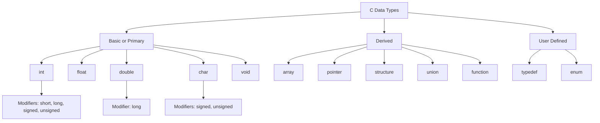
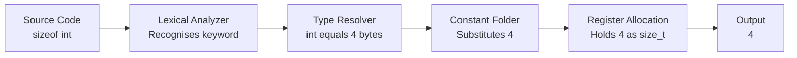
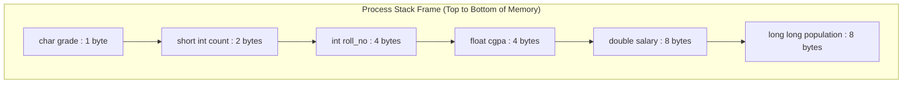
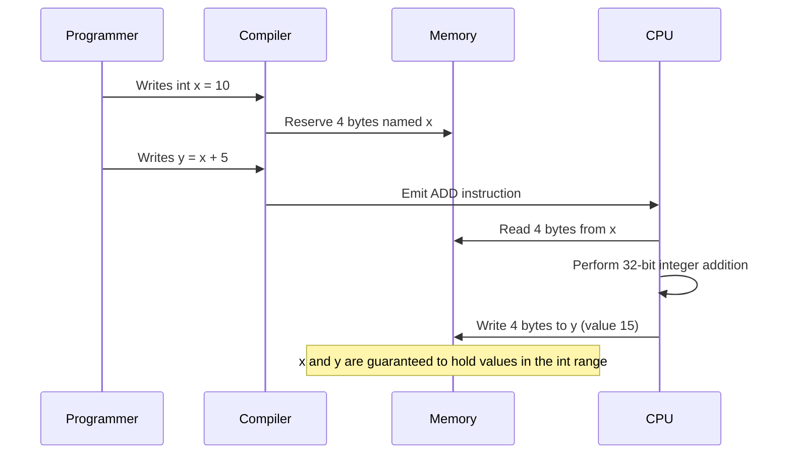

# Basic Data types

<!-- SECTION_1_START -->
# Basic Data Types in C — Core Definition & Intuitive Overview

> [!IMPORTANT]
> **KTU 2024 Scheme Anchor (GXEST204 — Module 1)**
> A *data type* in C is a **declarative classifier** that tells the compiler two critical things: (1) **the kind of data** a variable will hold (integer, floating-point, character, etc.) and (2) **the amount of memory** to be reserved for that variable. Every constant, variable, function argument, and function return value in a C program must be associated with a data type *before* it can be used. The C language recognises three broad families: **Basic (Primary), Derived, and User-Defined**.

## The Formal Classification Snapshot

| Family | Examples | Decided By |
|---|---|---|
| Basic (Primary) | `int`, `float`, `double`, `char`, `void` | The C Standard |
| Derived | `array`, `pointer`, `structure`, `union`, `function` | Constructed from basic types |
| User-Defined | `typedef`, `enum` | The programmer |

> [!NOTE]
> **Syllabus Highlight:** For Module 1 of *Programming in C*, the examiner’s focus is **strictly on the Basic (Primary) data types**, their **modifiers** (`signed`, `unsigned`, `short`, `long`), and the use of the **`sizeof` operator** to query their storage footprint at runtime. Derived and User-Defined types belong to later modules.

## Conceptual Analogy — The "Labelled Box" Model

Imagine a long warehouse shelf (this is your **RAM**). The compiler is a warehouse manager. When you say `int age;`, the manager grabs a box **exactly 4 bytes wide**, sticks a label that reads `age` on it, and promises two things:

1. *"Anything placed in this box will be treated as a whole number."*
2. *"Operations on this box will follow integer arithmetic rules."*

If you had said `float salary;`, the manager would have grabbed a slightly different box (still 4 bytes, but interpreted as IEEE-754 floating point), and if you had said `char grade;`, a 1-byte box would be reserved. The **type is the contract** that defines both the *physical size* of the box and the *semantic meaning* of what is stored inside.

> [!TIP]
> **Why this matters in C (and not in Python):** C is a **statically and strongly typed** language. The type of every variable is fixed at *compile time* and never changes at runtime. This is why C produces such tight, predictable machine code — and also why you must always be explicit about types.

## The Primary Data Types at a Glance

| Data Type | Keyword | Purpose | Typical Size |
|---|---|---|---|
| Integer | `int` | Whole numbers (no decimal) | **4 bytes** |
| Floating-point | `float` | Single-precision real numbers | **4 bytes** |
| Double floating-point | `double` | Double-precision real numbers | **8 bytes** |
| Character | `char` | A single ASCII character | **1 byte** |
| Void | `void` | "No value" / empty type | **0 bytes** |

> [!WARNING]
> **KTU Examiner’s Trap:** Do **not** assume sizes are universal. The C standard only **guarantees minimum sizes** (e.g., `char ≥ 1 byte`, `short ≥ 2 bytes`, `int ≥ 2 bytes`). On a typical 32-bit/64-bit GCC/Clang/MSVC installation, `int` is 4 bytes, but the standard only **requires** it to hold the range `[-32767, +32767]`. Always use `sizeof` to confirm the actual size on your machine.

## Format Specifiers — The Bridge Between Memory and Output

Every data type in C has a **dedicated format specifier** used by `printf()` and `scanf()`. Mis-matching the specifier is one of the most common causes of garbage output in KTU lab exams.

| Data Type | `printf()` Specifier | `scanf()` Specifier |
|---|---|---|
| `int` | `%d` or `%i` | `%d` |
| `float` | `%f` | `%f` |
| `double` | `%lf` | `%lf` |
| `char` | `%c` | `%c` |
| `long int` | `%ld` | `%ld` |
| `long long` | `%lld` | `%lld` |
| `unsigned int` | `%u` | `%u` |
| `unsigned long` | `%lu` | `%lu` |
| `short int` | `%hd` | `%hd` |
| `string` | `%s` | `%s` |
| Hexadecimal | `%x` or `%X` | `%x` |
| Octal | `%o` | `%o` |
| Pointer address | `%p` | `%p` |
| Scientific | `%e` or `%E` | `%e` |

> [!VISUALIZATION CONTROL]
> **Concept:** Number-line range comparison of `signed char` vs `unsigned char` (both 1 byte = 256 possible bit patterns).
> **Desmos / GeoGebra Input Equations:**
> * `f_1(x) = 1` (density band for the range $-128 \le x \le 127$)
> * `f_2(x) = 1` (density band for the range $0 \le x \le 255$)
> **Visual Description:** Plot two horizontal bands on the x-axis. The first band stretches from **$-128$** to **$+127$** (signed), the second from **$0$** to **$+255$** (unsigned). Both bands span exactly 256 integer positions because $2^8 = 256$. Students should observe that the unsigned range is simply the signed range *shifted* so that the most-negative bit pattern is re-interpreted as a large positive number.

---

<!-- SECTION_1_END -->

<!-- SECTION_2_START -->
# Deep Theoretical Analysis & KTU High-Yield Formula Sheet

## 2.1 — The Memory Mathematics of Data Types

The size of any basic data type is dictated by the formula:

$$
S_{\text{type}} = \text{bytes} \quad \text{where} \quad \text{bits} = S_{\text{type}} \times 8
$$

The **count of distinct representable values** for any *unsigned* type of $n$ bits is:

$$
N_{\text{values}} = 2^{n}
$$

For a *signed* type, the range follows the two's-complement convention:

$$
\text{Range}_{\text{signed}} = \big[ -2^{(n-1)}, \;\; +2^{(n-1)} - 1 \big]
$$

And for an *unsigned* type:

$$
\text{Range}_{\text{unsigned}} = \big[ 0, \;\; 2^{n} - 1 \big]
$$

> [!IMPORTANT]
> **Why two's-complement?** C standards (C99/C11/C17) permit three representations for signed integers: sign-and-magnitude, one's-complement, and two's-complement. **Almost every modern architecture uses two's-complement** because it elegantly unifies addition and subtraction, has a single zero representation, and naturally extends the bit-width during promotion. KTU expects two's-complement calculations in all numerical range questions.

## 2.2 — The KTU High-Yield Cheat Sheet

### A. Size & Range Table (assuming a typical 32-bit / 64-bit GCC system)

| Type | Size (Bytes) | Size (Bits) | Minimum Range | Format Specifier |
|---|---|---|---|---|
| `char` | 1 | 8 | $-128$ to $+127$ | `%c` (or `%d`) |
| `unsigned char` | 1 | 8 | $0$ to $255$ | `%c` (or `%u`) |
| `signed char` | 1 | 8 | $-128$ to $+127$ | `%c` (or `%d`) |
| `short int` | 2 | 16 | $-32{,}768$ to $+32{,}767$ | `%hd` |
| `unsigned short int` | 2 | 16 | $0$ to $65{,}535$ | `%hu` |
| `int` | 4 | 32 | $-2{,}147{,}483{,}648$ to $+2{,}147{,}483{,}647$ | `%d` |
| `unsigned int` | 4 | 32 | $0$ to $4{,}294{,}967{,}295$ | `%u` |
| `long int` | 4 or 8 | 32 or 64 | (platform-dependent) | `%ld` |
| `long long int` | 8 | 64 | $\approx -9.22 \times 10^{18}$ to $+9.22 \times 10^{18}$ | `%lld` |
| `float` | 4 | 32 | $\approx 1.2 \times 10^{-38}$ to $3.4 \times 10^{+38}$ (6-digit precision) | `%f` |
| `double` | 8 | 64 | $\approx 2.3 \times 10^{-308}$ to $1.7 \times 10^{+308}$ (15-digit precision) | `%lf` |
| `long double` | 12 or 16 | 80 or 128 | Extended precision (19-digit) | `%Lf` |
| `void` | 0 | 0 | Cannot store a value | *(none)* |

> [!NOTE]
> **Decimal vs Binary Counting:** 1 KB $= 1024$ bytes $= 2^{10}$ bytes. 1 MB $= 1024$ KB $= 2^{20}$ bytes. 1 GB $= 2^{30}$ bytes. Memory chips are also rated in **powers of 2**, not powers of 10.

### B. The Five Type Modifiers and Their Behaviour

| Modifier | Effect on Storage | Effect on Range | Allowed On |
|---|---|---|---|
| `signed` | No size change | Allows negative values (default for `char`, `int`) | `char`, `int` |
| `unsigned` | No size change | Doubles the positive range, sets minimum to 0 | `char`, `int`, `long` |
| `short` | Halves the storage (typically to 2 bytes) | Reduces the range | `int` only |
| `long` | Doubles the storage (to 8 bytes on 64-bit) | Extends the range | `int`, `double` |
| `long long` | Forces 8-byte storage | Maximum guaranteed range | `int` only |

### C. The `sizeof` Operator — Rules of Engagement

`sizeof` is a **compile-time unary operator** (not a function). It returns the size of its operand in bytes, of type `size_t`. It can be applied in **two syntactic forms**:

$$
\text{sizeof} \, (\text{type\_name}) \quad \text{or} \quad \text{sizeof} \, \text{expression}
$$

For instance, `sizeof(int)` and `sizeof(i)` (where `i` is an `int`) both yield the same result. The expression inside `sizeof` is **not evaluated at runtime** — it is only used for type analysis.

## 2.3 — Real-World Engineering Utility

Basic data types are the **first vocabulary** of every C program ever written for:

* **Embedded Systems Firmware:** Writing a temperature sensor driver on an 8-bit ATmega328 (Arduino Uno) means choosing `uint8_t` (alias for `unsigned char`) for ADC values, because every byte of the 2 KB SRAM is precious. The wrong data type can make a product un-shipping.
* **High-Performance Computing (HPC):** Scientific simulations on supercomputers carefully use `double` (8 bytes) for numerical stability in matrix inversion, sacrificing 2x memory for the sake of preventing catastrophic cancellation errors.
* **Operating System Kernels:** The Linux kernel defines its own integer types (`u8`, `u16`, `u32`, `u64`) as portable aliases of C's basic types so that device drivers compile identically on ARM, x86, and RISC-V.
* **Database Engines:** PostgreSQL's row storage allocator uses `sizeof` at compile time to pack fields tightly, reducing disk I/O by tens of percent.
* **Network Protocol Stacks:** TCP/IP headers are defined using fixed-width integer types because every byte of a network packet has a specific bit-level meaning.

> [!TIP]
> **Mnemonic for KTU Viva:** When asked *"Why does C have so many integer types instead of one big `int`?"* — answer: **"Memory economy, range precision, and hardware mapping. Embedded systems have kilobytes of RAM, not gigabytes. The right-sized type is the right-sized engineering decision."**

---

<!-- SECTION_2_END -->

<!-- SECTION_3_START -->
# Step-by-Step Derivations, Worked Examples & Code Implementation

## 3.1 — Deriving the Range of a Signed 32-bit Integer

The C standard guarantees that `int` has at least 16 bits, but most modern systems use 32 bits. We will derive the range formally.

**Given:** $n = 32$ bits for a signed `int` using two's-complement representation.

**Step 1 — Total distinct bit patterns:**
$$
N_{\text{patterns}} = 2^{n} = 2^{32} = 4{,}294{,}967{,}296
$$
*(Reasoning: each of the 32 bits is binary, so the count of unique patterns is $2^{32}$.)*  **[1 Mark]**

**Step 2 — The most-negative value:**
The bit pattern `10000000 00000000 00000000 00000000` (a 1 followed by thirty-one 0s) represents the most-negative integer:
$$
\text{Min} = -2^{(n-1)} = -2^{31} = -2{,}147{,}483{,}648
$$
*(Reasoning: in two's-complement, the sign bit has a negative weight of $-(2^{n-1})$.)*  **[1 Mark]**

**Step 3 — The most-positive value:**
All other $2^{31} - 1$ patterns represent non-negative numbers, of which the largest is `01111111 11111111 11111111 11111111`:
$$
\text{Max} = +2^{(n-1)} - 1 = 2^{31} - 1 = +2{,}147{,}483{,}647
$$
*(Reasoning: the highest bit is now 0, and the remaining 31 bits are all 1, summing to $2^{31} - 1$.)*  **[1 Mark]**

**Step 4 — Final range statement:**
$$
\boxed{\; \text{Range of 32-bit signed int} = \big[ -2^{31},\; +2^{31} - 1 \big] = \big[ -2{,}147{,}483{,}648,\; +2{,}147{,}483{,}647 \big] \;}
$$
**[1 Mark]**

> [!NOTE]
> **Asymmetry Intuition:** The negative side has *one extra value* compared to the positive side. This is because the bit pattern `0...0` is reserved for zero, leaving the negative "half" with one more position.

## 3.2 — Deriving the Range of an Unsigned 8-bit Integer (e.g., `unsigned char`)

**Given:** $n = 8$ bits, unsigned representation.

**Step 1 — Total patterns:**
$$
N = 2^{8} = 256
$$
**[1 Mark]**

**Step 2 — Minimum:** All bits 0:
$$
\text{Min} = 0
$$
**[1 Mark]**

**Step 3 — Maximum:** All bits 1:
$$
\text{Max} = 2^{n} - 1 = 2^{8} - 1 = 255
$$
**[1 Mark]**

**Step 4 — Final:**
$$
\boxed{\; \text{Range of unsigned char} = [0, \; 255] \;}
$$
**[1 Mark]**

## 3.3 — Full C Implementation — A "Data Type Detective" Program

This program declares one variable of every basic type, prints its value, and uses `sizeof` to report the number of bytes occupied in memory. It is the canonical "show me everything" program expected in KTU lab viva and Module 1 exams.

```c
/*
 * Filename   : data_type_demo.c
 * Purpose    : Demonstrate all basic C data types, their sizes, and format specifiers.
 * Compiler   : GCC 11+ (or any C99/C11 compiler)
 * Author     : KTU-PREMIER-ENGINE V10
 */

#include <stdio.h>

int main(void)
{
    /* ---------- 1. INTEGER FAMILY ---------- */
    int          standard_int   = 42;
    short int    short_int_var  = 32000;
    long int     long_int_var   = 2000000L;
    long long int very_long_var = 9000000000LL;

    /* ---------- 2. UNSIGNED FAMILY ---------- */
    unsigned int        unsigned_int_var  = 4000000000U;
    unsigned short int  unsigned_short_var = 65000U;
    unsigned char       unsigned_char_var = 250U;

    /* ---------- 3. FLOATING POINT FAMILY ---------- */
    float       single_prec = 3.14159f;
    double      double_prec = 3.141592653589793;
    long double extended_prec = 3.141592653589793238L;

    /* ---------- 4. CHARACTER FAMILY ---------- */
    char letter_grade = 'A';
    char newline      = '\n';

    /* ---------- PRINTING VALUES ---------- */
    printf("================ VALUES ================\n");
    printf("int          : %d\n",   standard_int);
    printf("short int    : %hd\n",  short_int_var);
    printf("long int     : %ld\n",  long_int_var);
    printf("long long    : %lld\n", very_long_var);
    printf("unsigned int : %u\n",   unsigned_int_var);
    printf("unsigned shr : %hu\n",  unsigned_short_var);
    printf("unsigned chr : %u\n",   unsigned_char_var);
    printf("float        : %f\n",   single_prec);
    printf("double       : %lf\n",  double_prec);
    printf("long double  : %Lf\n",  extended_prec);
    printf("char         : %c\n",   letter_grade);

    /* ---------- PRINTING SIZES WITH sizeof ---------- */
    printf("\n================ SIZES (bytes) ================\n");
    printf("Size of int            : %zu byte(s)\n",  sizeof(int));
    printf("Size of short int      : %zu byte(s)\n",  sizeof(short int));
    printf("Size of long int       : %zu byte(s)\n",  sizeof(long int));
    printf("Size of long long int  : %zu byte(s)\n",  sizeof(long long int));
    printf("Size of unsigned int   : %zu byte(s)\n",  sizeof(unsigned int));
    printf("Size of float          : %zu byte(s)\n",  sizeof(float));
    printf("Size of double         : %zu byte(s)\n",  sizeof(double));
    printf("Size of long double    : %zu byte(s)\n",  sizeof(long double));
    printf("Size of char           : %zu byte(s)\n",  sizeof(char));
    printf("Size of size_t itself  : %zu byte(s)\n",  sizeof(size_t));

    return 0;
}
```

**Expected Output (on a typical 64-bit Linux GCC system):**

```text
================ VALUES ================
int          : 42
short int    : 32000
long int     : 2000000
long long    : 9000000000
unsigned int : 4000000000
unsigned shr : 65000
unsigned chr : 250
float        : 3.141590
double       : 3.141593
long double  : 3.141593
char         : A

================ SIZES (bytes) ================
Size of int            : 4 byte(s)
Size of short int      : 2 byte(s)
Size of long int       : 8 byte(s)
Size of long long int  : 8 byte(s)
Size of unsigned int   : 4 byte(s)
Size of float          : 4 byte(s)
Size of double         : 8 byte(s)
Size of long double    : 16 byte(s)
Size of char           : 1 byte(s)
Size of size_t itself  : 8 byte(s)
```

> [!NOTE]
> **Why `%zu`?** The `sizeof` operator returns a value of type `size_t`, which is an *unsigned* integer of platform-dependent width (4 bytes on 32-bit, 8 bytes on 64-bit). The C99 standard introduced `%zu` to print `size_t` values **portably** without warnings.

## 3.4 — Step-by-Step Walkthrough of the `sizeof` Operator's Behaviour

Let us dissect what happens internally when the compiler encounters `sizeof(long double)`:

| Phase | Compiler Action |
|---|---|
| 1. **Lexical Analysis** | Token `sizeof` recognised as a keyword (operator). |
| 2. **Type Lookup** | The operand `long double` is resolved to a concrete type. |
| 3. **Constant Substitution** | The compiler *already knows* the size at compile time (no runtime work). |
| 4. **Substitution** | `sizeof(long double)` is replaced by the literal `16` (on this system). |
| 5. **Type Casting** | The literal `16` is of type `size_t` (an unsigned integer). |
| 6. **Code Generation** | The integer 16 is moved into the register/print argument list. |

> [!WARNING]
> **KTU Pitfall #1:** `sizeof` is **not a function** — it is a **compile-time operator**. Writing `sizeof(int);` is valid *even inside a function* that never declares an `int`, because the expression is evaluated at compile time.
>
> **KTU Pitfall #2:** `sizeof(i++)` will **not increment** `i`! The operand of `sizeof` is *unevaluated context*. The compiler analyses the type of `i++` (which is `int`) but never executes the increment.

## 3.5 — Worked Numerical Example: Detecting Overflow

Suppose a programmer writes `unsigned char c = 200; c = c + 100;`. What happens?

**Step 1 — Identify type:** `unsigned char` occupies 1 byte $= 8$ bits. Max value $= 2^{8} - 1 = 255$.

**Step 2 — Perform arithmetic:** $200 + 100 = 300$.

**Step 3 — Apply modulo wrap:** The result is reduced modulo $2^{8} = 256$.
$$
300 \mod 256 = 44
$$

**Step 4 — Final value of `c`:** `c == 44`.

> [!IMPORTANT]
> **Signed overflow is undefined behaviour in C.** It is a trap for the unwary — the compiler is allowed to do *anything* (including erasing your hard drive, theoretically). The lesson: always choose a wider type if overflow is plausible, or use `<limits.h>` constants like `INT_MAX` to guard against it.

---

<!-- SECTION_3_END -->

<!-- SECTION_4_START -->
# Structural Diagrams & Schematics

## 4.1 — Mermaid Classification Tree of C Data Types



> [!NOTE]
> **Reading the diagram:** The graph flows from the single root (the abstract concept of "C Data Types") downward through three branches. The *Primary* branch is the focus of Module 1. The *Derived* and *User-Defined* branches are explored in Modules 2, 3, and 4.

## 4.2 — Mermaid Block Diagram: The `sizeof` Operator Execution Topology



## 4.3 — Block-Level Functional Architecture: Memory Layout of a Sample C Program

The following Mermaid block diagram maps how the compiler allocates memory for a hypothetical C program that declares one of each basic type. This is a **logical block diagram** (not a physical hex-dump), showing the relative *offset windows* reserved on the stack frame.



> [!NOTE]
> **Important Realisation:** The actual *addresses* depend on alignment rules imposed by the CPU. For example, a `double` is typically aligned to an 8-byte boundary, meaning the compiler may insert up to 7 bytes of *padding* after a `char` so that the next `double` lands on a clean 8-byte multiple. KTU questions sometimes ask students to compute *total memory consumed* including this padding — always clarify whether padding is included in your answer.

## 4.4 — Sequential Processing Topology: The Life of a Typed Variable



---

<!-- SECTION_4_END -->

<!-- SECTION_5_START -->
# KTU 2024 Scheme Examination Question Bank & Topic Recap

## Part A — Short Answer Questions (3 Marks Each)

### Q1. **[KTU University Exam — July 2024, Model]** *(CO1, Remember)*

> *List the five basic data types in C. State the typical size (in bytes) and one format specifier for each.*

**Model Answer (3 Marks — Valuation Key):**

The five basic (primary) data types in C are:

1. **`int`** — Integer values. Typical size: **4 bytes**. Format specifier: `%d`. *(1 Mark)*
2. **`float`** — Single-precision floating-point. Typical size: **4 bytes**. Format specifier: `%f`. *(0.5 Mark)*
3. **`double`** — Double-precision floating-point. Typical size: **8 bytes**. Format specifier: `%lf`. *(0.5 Mark)*
4. **`char`** — Single character. Typical size: **1 byte**. Format specifier: `%c`. *(0.5 Mark)*
5. **`void`** — "No type" used for functions returning nothing. Size: **0 bytes** (no storage). *(0.5 Mark)*

---

### Q2. **[KTU University Exam — Dec 2023, Model]** *(CO1, Understand)*

> *Differentiate between `float` and `double` data types in C.*

**Model Answer (3 Marks — Valuation Key):**

| Aspect | `float` | `double` |
|---|---|---|
| Precision | 6–7 significant decimal digits | 15–16 significant decimal digits |
| Size | 4 bytes (32 bits) | 8 bytes (64 bits) |
| Format specifier (printf) | `%f` | `%lf` |
| Approx. Range | $\pm 1.2 \times 10^{-38}$ to $\pm 3.4 \times 10^{+38}$ | $\pm 2.3 \times 10^{-308}$ to $\pm 1.7 \times 10^{+308}$ |
| Use case | When memory is scarce, low precision is acceptable | Scientific computing, financial precision |

*(1 Mark for precision distinction, 1 Mark for size distinction, 1 Mark for typical use-case / range.)*

---

## Part B — 14-Mark Questions (ESE Module Internal Choice)

### ✅ Question A (14 Marks)

#### Part (a) — 7 Marks — *(CO1, Understand)*

> *Explain the classification of data types in C with a suitable diagram. Discuss the basic (primary) data types in detail, including their typical size and range.*  **[KTU University Exam — July 2024, Model]*

**Model Solution — Valuation Key:**

**Step 1 — Classification Table:**  *(2 Marks)*

| Family | Description | Examples |
|---|---|---|
| Basic / Primary | Predefined by the C language | `int`, `float`, `double`, `char`, `void` |
| Derived | Constructed from basic types | `array`, `pointer`, `struct`, `union`, `function` |
| User-Defined | Defined by the programmer | `typedef`, `enum` |

**Step 2 — Detailed Primary Type Description:**  *(4 Marks)*

- **`int`** — Stores whole numbers. Typical size 4 bytes (32 bits). Signed range $\big[-2^{31}, \; 2^{31}-1\big]$. Used for counting, indexing, flags.  *(1 Mark)*
- **`float`** — IEEE-754 single-precision. 4 bytes. Range $\approx \pm 3.4 \times 10^{38}$ with 6-digit precision. Used when memory is tight.  *(0.75 Mark)*
- **`double`** — IEEE-754 double-precision. 8 bytes. Range $\approx \pm 1.7 \times 10^{308}$ with 15-digit precision. Default for floating-point literals.  *(0.75 Mark)*
- **`char`** — Holds one ASCII character. 1 byte. Signed range $[-128, 127]$ or unsigned $[0, 255]$. Internally an 8-bit integer.  *(0.75 Mark)*
- **`void`** — The "no type" type. Used as the return type of functions that produce no value, and as the generic pointer base type (`void *`).  *(0.75 Mark)*

**Step 3 — Diagram:**  *(1 Mark)*
*(A neat Mermaid-style / hand-drawn classification tree showing the three families and their members, similar to the one in SECTION_4.1.)*

#### Part (b) — 7 Marks — *(CO2, Apply)*

> *Write a C program to demonstrate the declaration, initialization, and printing of all basic data types along with their sizes using the `sizeof` operator.*  **[KTU University Exam — July 2024, Model]*

**Model Solution — Valuation Key:**

```c
#include <stdio.h>

int main(void)
{
    int          i = 10;
    float        f = 3.14f;
    double       d = 3.141592653589793;
    char         c = 'Z';
    void        *ptr = NULL;   /* legal: a pointer can be of type void* */

    printf("int     i = %d,  size = %zu byte(s)\n", i, sizeof(i));
    printf("float   f = %f,  size = %zu byte(s)\n", f, sizeof(f));
    printf("double  d = %lf, size = %zu byte(s)\n", d, sizeof(d));
    printf("char    c = %c,  size = %zu byte(s)\n", c, sizeof(c));
    printf("void*  ptr = %p,  size = %zu byte(s)\n", ptr, sizeof(ptr));

    return 0;
}
```

**Valuation Breakdown:**

- Including `<stdio.h>` and correct `main` signature: **1 Mark**
- Correct declaration of all five basic types (int, float, double, char, void\*): **2 Marks**
- Correct use of format specifiers (`%d`, `%f`, `%lf`, `%c`, `%p`): **2 Marks**
- Correct use of `sizeof` operator with `%zu`: **1 Mark**
- Clean output and proper return: **1 Mark**

---

### ✅ Question B (14 Marks) — *Internal Choice Alternative*

#### Part (a) — 7 Marks — *(CO1, Understand)*

> *Discuss the type modifiers in C (`signed`, `unsigned`, `short`, `long`) with their effect on storage and range. Provide one example declaration for each modifier combination.*  **[KTU University Exam — Dec 2023, Model]*

**Model Solution — Valuation Key:**

**Step 1 — Defining Modifiers:**  *(1 Mark)*
Type modifiers are keywords that alter the **size**, **range**, or **sign interpretation** of a basic integer type without changing its fundamental nature.

**Step 2 — Modifier Explanations:**  *(4 Marks)*

| Modifier | Effect on Storage | Effect on Range | Example |
|---|---|---|---|
| `signed` | No size change | Adds negative half of the range | `signed int x = -500;` |
| `unsigned` | No size change | Doubles the positive range, minimum becomes 0 | `unsigned int y = 4000000000U;` |
| `short` | Reduces to 2 bytes (typically) | Range $\big[-32{,}768, \; +32{,}767\big]$ | `short int s = 30000;` |
| `long` | Extends to 8 bytes (on 64-bit) | Range up to $\approx \pm 9.2 \times 10^{18}$ | `long int p = 2000000L;` |
| `long long` | Forces 8 bytes (C99+) | Same maximum range as `long` on 64-bit | `long long int q = 9LL;` |
| `long double` | Extends floating precision (12 or 16 bytes) | Higher precision (~19 digits) | `long double pi = 3.141592653589793238L;` |

**Step 3 — Default Rules:**  *(1 Mark)*
- `int` is **signed** by default.
- `char` is implementation-defined (signed on x86, unsigned on ARM, by default).
- `float` cannot be `unsigned` (the C standard forbids it).

**Step 4 — Order of Declaration:**  *(1 Mark)*
The general order is: `[sign] [size] [type]`, e.g., `unsigned long int`. Any re-ordering that respects the type keyword position is legal.

#### Part (b) — 7 Marks — *(CO2, Apply)*

> *Write a C program to read an integer, a floating-point number, a double-precision number, and a character from the user, then display their values along with the size of each variable using `sizeof`.*  **[KTU University Exam — Dec 2023, Model]*

**Model Solution — Valuation Key:**

```c
#include <stdio.h>

int main(void)
{
    int    i_var;
    float  f_var;
    double d_var;
    char   c_var;

    printf("Enter an integer            : ");
    scanf("%d",  &i_var);

    printf("Enter a float value         : ");
    scanf("%f",  &f_var);

    printf("Enter a double value        : ");
    scanf("%lf", &d_var);

    printf("Enter a single character    : ");
    scanf(" %c",  &c_var);    /* leading space skips the leftover newline */

    printf("\n---- You Entered ----\n");
    printf("Integer   : %d      | Size : %zu byte(s)\n", i_var, sizeof(i_var));
    printf("Float     : %f      | Size : %zu byte(s)\n", f_var, sizeof(f_var));
    printf("Double    : %lf     | Size : %zu byte(s)\n", d_var, sizeof(d_var));
    printf("Character : %c      | Size : %zu byte(s)\n", c_var, sizeof(c_var));

    return 0;
}
```

**Valuation Breakdown:**

- Correct headers, `main`, and declarations: **1 Mark**
- Correct `scanf` format specifiers (`%d`, `%f`, `%lf`, `%c`) with proper `&` addresses: **2 Marks**
- Leading space in `" %c"` to consume stray newline: **1 Mark**
- Correct `printf` output formatting: **1 Mark**
- `sizeof` used on each *variable* (not type) with `%zu`: **1 Mark**
- Clean return value: **1 Mark**

---

## ⚠️ KTU Examiner's Valuation Warning — Where Students Lose Marks

> [!WARNING]
> **Common Pitfalls in Data Type Questions (Loss Points Highlighted)**
>
> 1. **Wrong format specifier for `double`:** Using `%f` to print a `double` (or `%lf` to print a `float`) is a guaranteed **$-1$ to $-2$ mark** penalty. The C99 standard made `%f` and `%lf` synonyms for `printf`, but for `scanf` they are **strictly different**. KTU expects you to remember this distinction.
>
> 2. **Forgetting the `&` in `scanf`:** The most common runtime crash in KTU labs. `scanf("%d", i);` should be `scanf("%d", &i);`. Examiners *will* deduct 1 mark for this.
>
> 3. **Confusing `sizeof` with a function:** Writing `#include "sizeof.h"` is a fatal error. `sizeof` is an *operator*, not a function. There is no header file for it.
>
> 4. **Assuming sizes are universal:** Writing "`int` is always 4 bytes" without hedging on the standard's *minimum-guarantee* wording loses 0.5 mark.
>
> 5. **Forgetting to return `0` from `main`:** A 0.5 mark deduction in strict valuation schemes.
>
> 6. **Using `void` as a variable type:** You cannot write `void v;`. `void` is reserved for function signatures and pointer bases only.
>
> 7. **Confusing character `0` with numeric 0:** `char zero = '0';` is the ASCII character with value 48, *not* the integer 0. Print with `%c` to see `0`, with `%d` to see `48`.
>
> 8. **Overflow mistakes:** Adding two large `int` values without realising the result wraps modulo $2^{32}$ (for unsigned) or is **undefined behaviour** (for signed) is a $-1$ mark penalty.

---

## 📋 Topic Recap & Important Things to Remember

> [!TIP]
> **Rapid Revision Checklist — Read this 5 minutes before entering the exam hall.**

- ✅ A **data type** in C defines the *kind of value* and the *memory size* reserved for a variable.
- ✅ The **five basic types** are `int`, `float`, `double`, `char`, and `void`. Memorise their typical sizes: **4, 4, 8, 1, 0** bytes.
- ✅ **Range formula for signed $n$-bit type:** $\big[-2^{(n-1)}, \; +2^{(n-1)} - 1\big]$.
- ✅ **Range formula for unsigned $n$-bit type:** $\big[0, \; 2^{n} - 1\big]$.
- ✅ **Format specifiers** — `%d` (int), `%f` (float), `%lf` (double for scanf), `%c` (char), `%s` (string), `%p` (pointer), `%zu` (size_t).
- ✅ The four **type modifiers** are `signed`, `unsigned`, `short`, `long`. `long long` was added in C99.
- ✅ `sizeof` is a **compile-time operator**, NOT a function. It returns a value of type `size_t`. Always print with `%zu`.
- ✅ The operand of `sizeof` is **unevaluated** — `sizeof(x++)` will *not* increment `x`.
- ✅ **Integer promotion:** `char` and `short` are automatically promoted to `int` in most arithmetic expressions. (A standard must-know for Module 2.)
- ✅ **Two's-complement** is the universal representation of signed integers. Range is *asymmetric* — one more negative value than positive.
- ✅ `scanf` requires the **address** of the variable (`&x`), while `printf` requires only the **value** (`x`).
- ✅ `char` can be `signed` or `unsigned` — the default is **implementation-defined**. Use `signed char` or `unsigned char` explicitly when the sign matters.
- ✅ `float` literals require the suffix `f` (e.g., `3.14f`). Without it, the constant is a `double`.
- ✅ `long` literals require the suffix `L`. `unsigned` literals require `U`. Both can combine: `100UL`.
- ✅ `void` cannot be the type of a variable. It is used only for (a) functions returning nothing and (b) generic pointers (`void *`).
- ✅ **Memory alignment** may cause the compiler to insert padding bytes between variables on the stack. KTU sometimes asks students to compute total memory *with* and *without* padding.
- ✅ **Signed overflow is undefined behaviour** — the compiler may do anything. Always guard with `<limits.h>` constants (`INT_MAX`, `INT_MIN`).
- ✅ The C standard only **guarantees minimum** sizes: `char ≥ 1`, `short ≥ 2`, `int ≥ 2` bytes. Always use `sizeof` to confirm on your system.

---

<!-- SECTION_5_END -->
