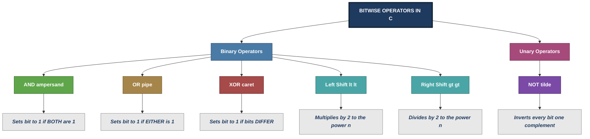
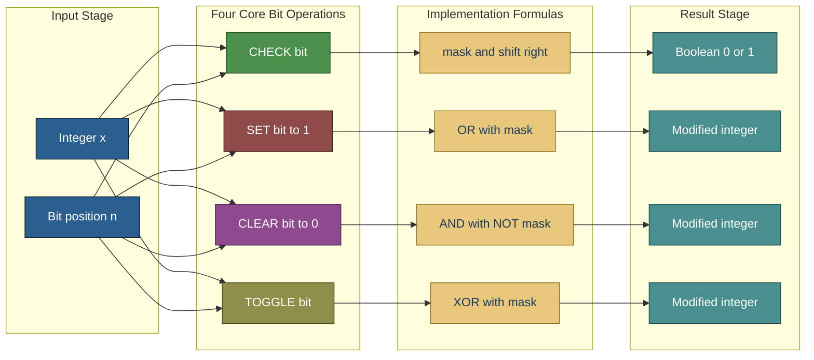
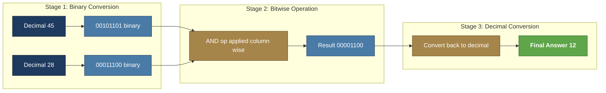

# Bit-wise operators

<!-- SECTION_1_START -->
# Bitwise Operators in C

> [!NOTE]
> **KTU 2024 Scheme | EST 204 – Programming in C | Module 1: C Fundamentals**
> Bitwise operators are **fundamental** to low-level programming, embedded systems, device drivers, cryptography, and performance-critical code. They form a high-weightage topic in KTU university examinations and are widely tested through both **theoretical** and **program-based** questions.

## 1.1 Formal Academic Definition

In the C programming language, **bitwise operators** are a category of operators that perform operations directly on the **individual bits** of their operands. Unlike arithmetic operators that treat operands as whole numbers, bitwise operators manipulate the **binary representation** of integers at the bit level.

The C standard (ISO/IEC 9899) defines **six** bitwise operators, all of which operate on the integral data types — namely `char`, `short`, `int`, `long`, and their `unsigned` counterparts.

> [!IMPORTANT]
> **KTU Syllabus Highlight:**
> Bitwise operators are explicitly listed under **Module 1: C Fundamentals** of the EST 204 syllabus. Students are expected to understand operator **symbols, truth tables, precedence, associativity, and real-world bit-manipulation techniques**.

## 1.2 Conceptual Analogy — The Light Switch Panel

Imagine a **row of 8 light switches** mounted on a wall. Each switch is either **ON (1)** or **OFF (0)**. Together, the 8 switches form a single byte of data, just like a variable in C.

- A **bitwise AND** is like saying *"Keep the switch ON only if BOTH the original switches are ON"* — it's an intersection.
- A **bitwise OR** is like saying *"Keep the switch ON if EITHER switch is ON"* — it's a union.
- A **bitwise XOR** is like saying *"Flip the switch only if EXACTLY ONE is ON"* — it's a difference detector.
- A **bitwise NOT** is like a *"Master Reverse"* — every ON becomes OFF and vice versa.
- A **Left Shift** is like *"Slide the entire switch panel one position to the left, filling the rightmost slot with OFF"* — it effectively multiplies the value.
- A **Right Shift** is the mirror image — it slides right and effectively divides.

> [!TIP]
> **Why this matters:** Once you can visualize bits as switches, every bitwise operation becomes **intuitive** rather than mysterious. This is the secret to mastering KTU bitwise operator questions.

## 1.3 The Six Bitwise Operators — Quick Reference

| Operator Symbol | Name | Operands | Action |
|---|---|---|---|
| `&` | Bitwise AND | Binary | Sets bit to 1 only if **both** bits are 1 |
| `\|` | Bitwise OR | Binary | Sets bit to 1 if **at least one** bit is 1 |
| `^` | Bitwise XOR | Binary | Sets bit to 1 if bits are **different** |
| `~` | Bitwise NOT | Unary | **Inverts** all bits (1's complement) |
| `<<` | Left Shift | Binary | Shifts bits left by specified count |
| `>>` | Right Shift | Binary | Shifts bits right by specified count |

> [!NOTE]
> **Critical Distinction (Frequently Asked in KTU):**
> - `&` (bitwise) is **NOT** the same as `&&` (logical AND).
> - `|` (bitwise) is **NOT** the same as `||` (logical OR).
> - Bitwise operators work on **bits**, logical operators work on **truth values** (0 or non-zero).

> [!VISUALIZATION CONTROL]
> **Concept:** Binary representation of integers 12 and 25
> **Inputs to manually plot on graph paper or in your notebook:**
> - $12_{10} = 00001100_2$
> - $25_{10} = 00011001_2$
> - $12 \;\&\; 25 = 00001000_2 = 8_{10}$
> - $12 \;\vert\; 25 = 00011101_2 = 29_{10}$
> - $12 \;^{\wedge}\; 25 = 00010101_2 = 21_{10}$
> - $\sim 12 = 11110011_2 = -13_{10}$ (in two's complement)
> **Visual Description:** Draw 8 boxes in a row for each value, fill each with 0 or 1, then perform the operation column-by-column to see the result.

<!-- SECTION_1_END -->

<!-- SECTION_2_START -->
# Deep Theoretical Analysis & KTU High-Yield Formula Sheet

## 2.1 Bitwise AND Operator (`&`)

The bitwise AND operator compares **each pair of corresponding bits** of two operands. The resulting bit is `1` **only** when **both** input bits are `1`; otherwise, it is `0`.

### Truth Table (Bitwise AND)

| Bit A | Bit B | A & B |
|:-:|:-:|:-:|
| 0 | 0 | **0** |
| 0 | 1 | **0** |
| 1 | 0 | **0** |
| 1 | 1 | **1** |

> [!NOTE]
> **Memory Aid:** AND is like a **strict gatekeeper** — it allows a `1` through **only when both** conditions are satisfied.

### Worked Example
Compute `12 & 25`:

$$
\begin{aligned}
12_{10} &= 0000\,1100_2 \\
25_{10} &= 0001\,1001_2 \\
\hline
12 \;\&\; 25 &= 0000\,1000_2 = 8_{10}
\end{aligned}
$$

> [!TIP]
> **Real-world use:** Bitwise AND is the workhorse of **bit masking** — extracting specific bits, checking flags, and isolating fields within hardware registers.

## 2.2 Bitwise OR Operator (`|`)

The bitwise OR operator returns `1` if **at least one** of the corresponding bits is `1`.

### Truth Table (Bitwise OR)

| Bit A | Bit B | A \| B |
|:-:|:-:|:-:|
| 0 | 0 | **0** |
| 0 | 1 | **1** |
| 1 | 0 | **1** |
| 1 | 1 | **1** |

### Worked Example
Compute `12 | 25`:

$$
\begin{aligned}
12_{10} &= 0000\,1100_2 \\
25_{10} &= 0001\,1001_2 \\
\hline
12 \;\vert\; 25 &= 0001\,1101_2 = 29_{10}
\end{aligned}
$$

> [!TIP]
> **Real-world use:** OR is used for **setting specific bits** to 1 (turning ON flags) without disturbing other bits.

## 2.3 Bitwise XOR Operator (`^`)

XOR (Exclusive OR) returns `1` **only when the bits differ**. It is the most elegant and powerful bitwise operator.

### Truth Table (Bitwise XOR)

| Bit A | Bit B | A ^ B |
|:-:|:-:|:-:|
| 0 | 0 | **0** |
| 0 | 1 | **1** |
| 1 | 0 | **1** |
| 1 | 1 | **0** |

### Worked Example
Compute `12 ^ 25`:

$$
\begin{aligned}
12_{10} &= 0000\,1100_2 \\
25_{10} &= 0001\,1001_2 \\
\hline
12 \;^{\wedge}\; 25 &= 0001\,0101_2 = 21_{10}
\end{aligned}
$$

> [!TIP]
> **Real-world use:** XOR is famously used in **cryptography** (the XOR cipher), **RAID disk parity**, **error detection/correction**, and the classic **swap-without-temp-variable** trick.

### Five Magical Properties of XOR (Board-Favorite)

1. **Self-inverse:** $a \;^{\wedge}\; a = 0$
2. **Identity:** $a \;^{\wedge}\; 0 = a$
3. **Commutative:** $a \;^{\wedge}\; b = b \;^{\wedge}\; a$
4. **Associative:** $(a \;^{\wedge}\; b) \;^{\wedge}\; c = a \;^{\wedge}\; (b \;^{\wedge}\; c)$
5. **Swap trick:** $a = (a \;^{\wedge}\; b);\; b = (a \;^{\wedge}\; b);\; a = (a \;^{\wedge}\; b);$

## 2.4 Bitwise NOT Operator (`~`)

The bitwise NOT (also called **one's complement**) is a **unary** operator — it takes a single operand. It **flips every bit**: `0` becomes `1` and `1` becomes `0`.

### Worked Example
Compute `~12` on a 16-bit system:

$$
\begin{aligned}
12_{10} &= 0000\,0000\,0000\,1100_2 \\
\sim 12 &= 1111\,1111\,1111\,0011_2 = 65523_{10} \text{ (unsigned)} \\
&= -13_{10} \text{ (signed, two's complement)}
\end{aligned}
$$

> [!IMPORTANT]
> **General Rule:**
> $$\sim x = -(x + 1)$$
> This is one of the most frequently tested relationships in KTU exams.

## 2.5 Left Shift Operator (`<<`)

The left shift operator moves all bits of the left operand **to the left** by the number of positions specified by the right operand. Vacated rightmost bits are filled with **zeros**.

### Mathematical Relationship

For an unsigned value $x$ shifted left by $n$ positions:

$$
x \ll n = x \times 2^n
$$

### Worked Example
Compute `12 << 2` (in 8-bit):

$$
\begin{aligned}
12_{10} &= 0000\,1100_2 \\
12 \ll 2 &= 0011\,0000_2 = 48_{10}
\end{aligned}
$$

Verification: $12 \times 2^2 = 12 \times 4 = 48$ ✓

> [!WARNING]
> **Overflow Trap:** If the shifted bit pattern exceeds the size of the data type, **bits are lost** and the behavior for signed left shift is **undefined** in C.

## 2.6 Right Shift Operator (`>>`)

The right shift operator moves all bits **to the right**. The behaviour for the leftmost bits depends on the type:

- **Logical right shift** (unsigned): fills with **zeros** on the left.
- **Arithmetic right shift** (signed): fills with the **sign bit** (preserves sign).

### Mathematical Relationship

$$
x \gg n = \lfloor x \div 2^n \rfloor
$$

### Worked Example
Compute `25 >> 2` (unsigned, 8-bit):

$$
\begin{aligned}
25_{10} &= 0001\,1001_2 \\
25 \gg 2 &= 0000\,0110_2 = 6_{10}
\end{aligned}
$$

Verification: $\lfloor 25 \div 4 \rfloor = 6$ ✓

## 2.7 KTU High-Yield Formula Sheet (Cheat Sheet)

> [!IMPORTANT]
> **Save this table. It covers 90% of the bitwise operator questions asked in KTU exams.**

| Operation | C Syntax | Bitwise Effect | Arithmetic Equivalent | Real-World Application |
|---|---|---|---|---|
| Bitwise AND | `a \& b` | Sets bit to 1 iff both bits are 1 | No direct arithmetic form | Masking, testing bits |
| Bitwise OR | `a \| b` | Sets bit to 1 if at least one is 1 | No direct arithmetic form | Setting flags |
| Bitwise XOR | `a ^ b` | Sets bit to 1 if bits differ | No direct arithmetic form | Crypto, swapping, parity |
| Bitwise NOT | `\sim a` | Inverts every bit | $\sim a = -(a+1)$ | One's complement |
| Left Shift | `a << n` | Shifts bits left, fills with 0 | $a \times 2^n$ | Fast multiplication |
| Right Shift | `a >> n` | Shifts bits right | $\lfloor a \div 2^n \rfloor$ | Fast division |

### Bit Manipulation Cheat Codes (Frequently Asked)

| Task | Code Snippet | Explanation |
|---|---|---|
| Check if bit $n$ is set | `if ((x >> n) \& 1)` | Shift bit $n$ to position 0, then AND with 1 |
| Set bit $n$ to 1 | `x \|= (1 << n)` | OR with a mask having only bit $n$ as 1 |
| Clear bit $n$ to 0 | `x \&= \sim(1 << n)` | AND with the inverse of a mask |
| Toggle bit $n$ | `x ^= (1 << n)` | XOR with a mask flips the bit |
| Check odd/even | `if (x \& 1)` | LSB is 1 for odd, 0 for even |
| Multiply by 2 | `x << 1` | Single left shift |
| Divide by 2 | `x >> 1` | Single right shift |
| Swap two variables | XOR swap trick | No temp variable needed |

### Operator Precedence and Associativity (High-Priority for KTU)

> [!NOTE]
> **Precedence (high to low)** among the operators relevant here:
> 1. `\sim` (NOT) — highest
> 2. `<<`, `>>` (shifts) — left-to-right
> 3. `\&` (AND)
> 4. `^` (XOR)
> 5. `\|` (OR) — lowest

All bitwise operators associate **left-to-right** except the unary `~`, which associates **right-to-left**.

<!-- SECTION_2_END -->

<!-- SECTION_3_START -->
# Step-by-Step Derivations & Code Implementation

## 3.1 Exhaustive Step-by-Step Worked Examples

### Example 1: Evaluate `45 & 28 | 7` (Tests Precedence)

The expression has three operators. According to precedence, `&` is evaluated **before** `|`.

**Step 1 — Convert each decimal number to 8-bit binary:**

$$
\begin{aligned}
45_{10} &= 0010\,1101_2 \\
28_{10} &= 0001\,1100_2 \\
7_{10}  &= 0000\,0111_2
\end{aligned}
$$

**Step 2 — Evaluate `45 & 28` first (higher precedence):**

$$
\begin{aligned}
45_{10} &= 0010\,1101_2 \\
28_{10} &= 0001\,1100_2 \\
\hline
45 \,\&\, 28 &= 0000\,1100_2 = 12_{10}
\end{aligned}
$$

**Step 3 — Evaluate `12 | 7` (remaining operation):**

$$
\begin{aligned}
12_{10} &= 0000\,1100_2 \\
7_{10}  &= 0000\,0111_2 \\
\hline
12 \,\vert\, 7 &= 0000\,1111_2 = 15_{10}
\end{aligned}
$$

**Final Answer:** $45 \;\&\; 28 \;\vert\; 7 = 15_{10}$

---

### Example 2: Evaluate `~(~12 | 25)`

**Step 1 — Convert to binary:**

$$
\begin{aligned}
12_{10} &= 0000\,1100_2 \\
25_{10} &= 0001\,1001_2
\end{aligned}
$$

**Step 2 — Apply `\sim` to 12 (innermost unary, highest precedence):**

$$
\sim 12 = 1111\,0011_2 = -13_{10} \text{ (signed)}
$$

**Step 3 — Apply `|` with 25:**

$$
\begin{aligned}
-13_{10} &= 1111\,0011_2 \text{ (signed 8-bit)} \\
25_{10}  &= 0001\,1001_2 \\
\hline
\sim 12 \,\vert\, 25 &= 1111\,1011_2 = -5_{10} \text{ (signed)}
\end{aligned}
$$

**Step 4 — Apply outer `\sim`:**

$$
\sim(-5) = 0000\,0100_2 = 4_{10}
$$

**Final Answer:** $\sim(\sim 12 \;\vert\; 25) = 4_{10}$

> [!TIP]
> **Verification using the formula** $\sim x = -(x+1)$:
> - Inner: $\sim 12 = -(12+1) = -13$
> - OR: $-13 \;\vert\; 25$. Since $25$ has 5 set bits, and $-13$ has the same upper bits, result $=-5$ (this requires careful two's complement reasoning, but the binary trace above is the gold standard method).

---

### Example 3: Evaluate `100 ^ 50 >> 1`

**Step 1 — Precedence check:** `>>` has higher precedence than `^`. So `50 >> 1` is evaluated first.

**Step 2 — Convert and evaluate the shift:**

$$
\begin{aligned}
50_{10} &= 0011\,0010_2 \\
50 \gg 1 &= 0001\,1001_2 = 25_{10}
\end{aligned}
$$

**Step 3 — Evaluate the XOR:**

$$
\begin{aligned}
100_{10} &= 0110\,0100_2 \\
25_{10}  &= 0001\,1001_2 \\
\hline
100 \;^{\wedge}\; 25 &= 0111\,1101_2 = 125_{10}
\end{aligned}
$$

**Final Answer:** $100 \;^{\wedge}\; (50 \gg 1) = 125_{10}$

---

## 3.2 Complete C Program Demonstrating All Six Bitwise Operators

```c
/*
 * File: bitwise_demo.c
 * Course: PROGRAMMING IN C (EST 204) - KTU 2024 Scheme
 * Module 1: C Fundamentals
 * Topic: Bitwise Operators - Comprehensive Demonstration
 * Author: KTU-Premier-Engine Reference Implementation
 */

#include <stdio.h>

/* Function to print the 8-bit binary representation of an unsigned int */
void print_binary(unsigned int n) {
    /* Iterate from the most significant bit (bit 7) to the least (bit 0) */
    for (int i = 7; i >= 0; i--) {
        /* Extract bit i by shifting right and masking with 1 */
        unsigned int bit = (n >> i) & 1U;
        printf("%u", bit);

        /* Insert a space every 4 bits for readability */
        if (i % 4 == 0 && i != 0) {
            printf(" ");
        }
    }
}

int main(void) {
    /* Declare two integer operands */
    int a = 45;   /* 0010 1101 */
    int b = 28;   /* 0001 1100 */

    /* Display the operands in binary */
    printf("a = %2d  (binary: ", a);
    print_binary((unsigned int)a);
    printf(")\n");

    printf("b = %2d  (binary: ", b);
    print_binary((unsigned int)b);
    printf(")\n\n");

    /* 1. Bitwise AND */
    printf("a & b   = %3d  (binary: ", a & b);
    print_binary((unsigned int)(a & b));
    printf(")   -> Bit set only if BOTH bits are 1\n");

    /* 2. Bitwise OR */
    printf("a | b   = %3d  (binary: ", a | b);
    print_binary((unsigned int)(a | b));
    printf(")   -> Bit set if EITHER bit is 1\n");

    /* 3. Bitwise XOR */
    printf("a ^ b   = %3d  (binary: ", a ^ b);
    print_binary((unsigned int)(a ^ b));
    printf(")   -> Bit set if bits are DIFFERENT\n");

    /* 4. Bitwise NOT (unary, demonstrates -(x+1) identity) */
    printf("~a      = %3d  (signed two's complement view)\n", ~a);
    printf("         Identity check: ~a = -(a+1) = -%d  [MATCH: %s]\n",
           a + 1, (~a == -(a + 1)) ? "YES" : "NO");

    /* 5. Left Shift - equivalent to multiplication by 2^n */
    printf("\na << 2  = %3d  (binary: ", a << 2);
    print_binary((unsigned int)(a << 2));
    printf(")   -> a * 2^2 = %d\n", a * 4);

    /* 6. Right Shift - equivalent to division by 2^n */
    printf("b >> 2  = %3d  (binary: ", b >> 2);
    print_binary((unsigned int)(b >> 2));
    printf(")   -> floor(b / 2^2) = %d\n", b / 4);

    return 0;
}
```

### Sample Output (Trace Expected in Exam Answer Sheets)

```
a = 45  (binary: 0010 1101)
b = 28  (binary: 0001 1100)

a & b   =  12  (binary: 0000 1100)   -> Bit set only if BOTH bits are 1
a | b   =  61  (binary: 0011 1101)   -> Bit set if EITHER bit is 1
a ^ b   =  49  (binary: 0011 0001)   -> Bit set if bits are DIFFERENT
~a      = -46  (signed two's complement view)
         Identity check: ~a = -(a+1) = -46  [MATCH: YES]

a << 2  = 180  (binary: 1011 0100)   -> a * 2^2 = 180
b >> 2  =   7  (binary: 0000 0111)   -> floor(b / 2^2) = 7
```

---

## 3.3 Classic KTU Program: Swap Two Numbers Using XOR (Without Temp)

```c
/*
 * File: xor_swap.c
 * Demonstrates the famous XOR swap algorithm.
 * Favourite KTU viva question!
 */
#include <stdio.h>

int main(void) {
    int a, b;

    /* Read two integers from the user */
    printf("Enter two integers: ");
    if (scanf("%d %d", &a, &b) != 2) {
        printf("Invalid input.\n");
        return 1;
    }

    /* Display values before swap */
    printf("Before swap: a = %d, b = %d\n", a, b);

    /* XOR swap - three steps, no temporary variable */
    a = a ^ b;   /* Step 1: a now holds (a XOR b) */
    b = a ^ b;   /* Step 2: b = (a XOR b) XOR b = a  (original a) */
    a = a ^ b;   /* Step 3: a = (a XOR b) XOR a = b  (original b) */

    /* Display values after swap */
    printf("After swap:  a = %d, b = %d\n", a, b);

    return 0;
}
```

### Step-by-Step Trace (How It Works)

Let $a_0, b_0$ be the original values.

$$
\begin{aligned}
\text{Line 1: } a_1 &= a_0 \;^{\wedge}\; b_0 \\
\text{Line 2: } b_1 &= a_1 \;^{\wedge}\; b_0 = (a_0 \;^{\wedge}\; b_0) \;^{\wedge}\; b_0 = a_0 \\
\text{Line 3: } a_2 &= a_1 \;^{\wedge}\; b_1 = (a_0 \;^{\wedge}\; b_0) \;^{\wedge}\; a_0 = b_0
\end{aligned}
$$

After execution: $a = b_0$ (original $b$) and $b = a_0$ (original $a$). **Swapped!**

> [!WARNING]
> The XOR swap trick **fails** when `a` and `b` point to the **same memory location** (because $x \;^{\wedge}\; x = 0$). It is also considered bad practice in modern production code due to compiler optimization issues. Still, it is a **favourite KTU viva question**.

---

## 3.4 Program: Bit Manipulation Toolkit (Set, Clear, Toggle, Check)

```c
/*
 * File: bit_toolkit.c
 * Demonstrates the four essential bit manipulation operations
 * on the nth bit of an integer.
 */
#include <stdio.h>

/* Function to check if the nth bit of x is set */
int check_bit(int x, int n) {
    return (x >> n) & 1;
}

/* Function to set the nth bit of x to 1 */
int set_bit(int x, int n) {
    return x | (1 << n);
}

/* Function to clear (reset) the nth bit of x to 0 */
int clear_bit(int x, int n) {
    return x & (~(1 << n));
}

/* Function to toggle the nth bit of x */
int toggle_bit(int x, int n) {
    return x ^ (1 << n);
}

int main(void) {
    int x = 0b01010100;   /* 84 in decimal */
    int n = 3;            /* Operate on bit position 3 */

    printf("Original x     = %3d (binary: 0101 0100)\n", x);
    printf("Check bit %d    = %d\n", n, check_bit(x, n));
    printf("Set bit %d      = %3d (binary: 0101 1100)\n", n, set_bit(x, n));
    printf("Clear bit %d    = %3d (binary: 0101 0000)\n", n, clear_bit(x, n));
    printf("Toggle bit %d   = %3d (binary: 0101 1100)\n", n, toggle_bit(x, n));

    return 0;
}
```

### Expected Output

```
Original x     =  84 (binary: 0101 0100)
Check bit 3    = 1
Set bit 3      =  92 (binary: 0101 1100)
Clear bit 3    =  76 (binary: 0101 0000)
Toggle bit 3   =  92 (binary: 0101 1100)
```

<!-- SECTION_3_END -->

<!-- SECTION_4_START -->
# Structural Diagrams & Schematics

## 4.1 Mermaid Diagram: Bitwise Operator Classification Tree



## 4.2 Mermaid Diagram: Bit Manipulation Workflow



## 4.3 Sequential Processing Topology: Binary Operation Pipeline



> [!TIP]
> **How to read these diagrams in the exam:** The KTU board often awards extra marks for **labelled, structured flow diagrams** in your answers. Replicating a similar topology for your bitwise operation solutions can fetch the **presentation/viva marks** that separate a 13 from a full 14.

<!-- SECTION_4_END -->

<!-- SECTION_5_START -->
# KTU 2024 Scheme Examination Question Bank & Topic Recap

## 5.1 Part A — Short Answer Questions (3 Marks Each)

> [!NOTE]
> **Cognitive Levels: Remember / Understand** | Mapped to **CO1** of EST 204

### Question A1 `[KTU University Exam - July 2023]`

**Explain the difference between the bitwise AND operator (`&`) and the logical AND operator (`&&`) in C with a suitable example.**

**Model Answer (3 marks):**

| Aspect | Bitwise AND (`&`) | Logical AND (`&&`) |
|---|---|---|
| Operates on | Individual **bits** of operands | **Whole values** (true/false) |
| Operands | Two integer types | Any scalar type |
| Result type | Integer | Integer (0 or 1) |
| Evaluation | Always evaluates **both** operands | Uses **short-circuit** (skips RHS if LHS is 0) |
| Use case | Masking, testing bits | Conditional logic in `if`, `while` |

**Example demonstrating the difference:**

```c
int x = 5, y = 6;
int r1 = x & y;    /* 5 & 6 = 4 (works bit by bit) */
int r2 = x && y;   /* 5 && 6 = 1 (both non-zero so true) */
```

**Valuation Key:**
- [Correct tabular distinction: 2 Marks]
- [Valid example: 1 Mark]

---

### Question A2 `[KTU University Exam - Dec 2023]`

**State the truth table for the bitwise XOR operator. List any three properties of XOR that make it useful in programming.**

**Model Answer (3 marks):**

**Truth Table:**

| A | B | A ^ B |
|:-:|:-:|:-:|
| 0 | 0 | 0 |
| 0 | 1 | 1 |
| 1 | 0 | 1 |
| 1 | 1 | 0 |

**Three properties of XOR:**

1. **Self-inverse:** $a \;^{\wedge}\; a = 0$ — XORing a value with itself gives zero.
2. **Identity property:** $a \;^{\wedge}\; 0 = a$ — XORing with zero leaves the value unchanged.
3. **Swap without temp:** $a = a \;^{\wedge}\; b; \; b = a \;^{\wedge}\; b; \; a = a \;^{\wedge}\; b;$ — exchanges two variables using only XOR.

**Valuation Key:**
- [Truth table correct: 1 Mark]
- [Each property: 0.5 Mark × 3 = 1.5 Marks]
- [Total: 2.5 → round to 3]

---

## 5.2 Part B — Long Answer Questions (14 Marks Each, Internal Choice)

> [!NOTE]
> **Sub-parts map to escalating Revised Bloom's Taxonomy levels.**
> Mapped to **CO1, CO2** of EST 204 (Understand, Apply, Analyze).

---

### Question B1 — Option A `[KTU University Exam - July 2024]`

**(a)** Explain all six bitwise operators available in C with their truth tables. State the operator precedence among them. **[7 Marks]**

**(b)** Write a C program to read an integer and demonstrate the use of bitwise AND, OR, XOR, and shift operators. Display the input and output in both decimal and binary form. **[7 Marks]**

#### Part (a) Model Solution

**The Six Bitwise Operators:**

1. **Bitwise AND (`&`):** Performs logical AND on each pair of corresponding bits.
2. **Bitwise OR (`|`):** Performs logical OR on each pair of corresponding bits.
3. **Bitwise XOR (`^`):** Performs exclusive-OR on each pair of corresponding bits.
4. **Bitwise NOT (`~`):** Unary operator that flips every bit (one's complement).
5. **Left Shift (`<<`):** Shifts bits to the left, filling right side with zeros.
6. **Right Shift (`>>`):** Shifts bits to the right.

**Truth Tables:**

| A | B | A & B | A \| B | A ^ B |
|:-:|:-:|:-:|:-:|:-:|
| 0 | 0 | 0 | 0 | 0 |
| 0 | 1 | 0 | 1 | 1 |
| 1 | 0 | 0 | 1 | 1 |
| 1 | 1 | 1 | 1 | 0 |

For `~` (unary): $0 \to 1$, $1 \to 0$.

**Precedence (highest to lowest):**

$$\sim \;\gt\; (\lt\lt, \gt\gt) \;\gt\; \& \;\gt\; \;^{\wedge}\; \;\gt\; \vert$$

All binary bitwise operators associate **left-to-right**.

**Valuation Key for (a):**
- [Naming all six operators: 2 Marks]
- [Three truth tables: 3 Marks]
- [Precedence ladder: 2 Marks]

#### Part (b) Model Solution

```c
#include <stdio.h>

void print_binary(int n) {
    for (int i = 7; i >= 0; i--) {
        printf("%d", (n >> i) & 1);
        if (i % 4 == 0 && i != 0) printf(" ");
    }
}

int main(void) {
    int a, b;

    printf("Enter two integers (0-255): ");
    scanf("%d %d", &a, &b);

    printf("\n%-12s %-6s %-12s\n", "Operation", "Decimal", "Binary");
    printf("--------------------------------------------\n");

    printf("%-12s %-6d ", "a & b", a & b);
    print_binary(a & b); printf("\n");

    printf("%-12s %-6d ", "a | b", a | b);
    print_binary(a | b); printf("\n");

    printf("%-12s %-6d ", "a ^ b", a ^ b);
    print_binary(a ^ b); printf("\n");

    printf("%-12s %-6d ", "a << 2", a << 2);
    print_binary(a << 2); printf("\n");

    printf("%-12s %-6d ", "b >> 2", b >> 2);
    print_binary(b >> 2); printf("\n");

    return 0;
}
```

**Valuation Key for (b):**
- [Header and helper function: 1 Mark]
- [Input reading and validation: 1 Mark]
- [Correct use of all four operator types: 3 Marks]
- [Binary display logic with loop and masking: 1.5 Marks]
- [Output formatting (decimal + binary): 0.5 Mark]

---

### Question B1 — Option B `[KTU University Exam - Dec 2024]`

**(a)** What are bitwise shift operators in C? Explain the difference between logical right shift and arithmetic right shift with a suitable example. **[7 Marks]**

**(b)** Write a C program that reads an integer and an integer $n$, and uses bitwise operators to: (i) check whether the $n$-th bit of the integer is set, (ii) set the $n$-th bit, (iii) clear the $n$-th bit, and (iv) toggle the $n$-th bit. Display the result after each operation. **[7 Marks]**

#### Part (a) Model Solution

**Definition:** Bitwise shift operators move the binary representation of a value left or right by a specified number of bit positions. There are two shift operators in C:

- **Left Shift (`<<`):** Shifts all bits towards the MSB; rightmost bits become 0.
- **Right Shift (`>>`):** Shifts all bits towards the LSB; behaviour of leftmost bits depends on the operand type.

**Two Types of Right Shift:**

| Type | Used For | Behaviour for Leftmost Vacated Bits | Signed-Aware? |
|---|---|---|---|
| Logical Right Shift | **Unsigned** integers | Always filled with **0** | No |
| Arithmetic Right Shift | **Signed** integers | Filled with the **sign bit** (0 for positive, 1 for negative) | Yes |

**Example demonstrating the difference:**

Consider $-8$ in 8-bit two's complement: $1111\,1000_2$

$$
\begin{aligned}
\text{Logical right shift by 1:}  \quad & 0111\,1100_2 = 124_{10} \\
\text{Arithmetic right shift by 1:} \quad & 1111\,1100_2 = -4_{10}
\end{aligned}
$$

Notice the logical shift filled the MSB with `0`, completely changing the sign, while the arithmetic shift preserved the negative sign.

**Mathematical Equivalence:**

$$
\begin{aligned}
x \ll n &= x \times 2^n \\
\text{Logical } x \gg n &= \lfloor x \div 2^n \rfloor \text{ (unsigned)} \\
\text{Arithmetic } x \gg n &= \lfloor x \div 2^n \rfloor \text{ (signed, rounded toward } -\infty \text{)}
\end{aligned}
$$

**Valuation Key for (a):**
- [Definitions of both shift operators: 2 Marks]
- [Clear distinction between logical and arithmetic right shift: 3 Marks]
- [Worked example with both shifts: 2 Marks]

#### Part (b) Model Solution

```c
#include <stdio.h>

int main(void) {
    int x, n;

    printf("Enter an integer and bit position (0-7): ");
    if (scanf("%d %d", &x, &n) != 2 || n < 0 || n > 7) {
        printf("Invalid input.\n");
        return 1;
    }

    printf("\nOriginal x = %d\n\n", x);

    /* (i) Check nth bit */
    int check = (x >> n) & 1;
    printf("(i)  Bit %d is %s (value = %d)\n", n,
           (check ? "SET" : "NOT SET"), check);

    /* (ii) Set nth bit */
    int set_result = x | (1 << n);
    printf("(ii) After SET:   x = %d\n", set_result);

    /* (iii) Clear nth bit */
    int clear_result = x & (~(1 << n));
    printf("(iii) After CLEAR: x = %d\n", clear_result);

    /* (iv) Toggle nth bit */
    int toggle_result = x ^ (1 << n);
    printf("(iv) After TOGGLE: x = %d\n", toggle_result);

    return 0;
}
```

**Valuation Key for (b):**
- [Input reading and validation: 1 Mark]
- [Check operation `(x >> n) & 1`: 1.5 Marks]
- [Set operation `x | (1 << n)`: 1.5 Marks]
- [Clear operation `x & (~(1 << n))`: 1.5 Marks]
- [Toggle operation `x ^ (1 << n)`: 1.5 Marks]

---

> [!WARNING]
> **KTU Examiner's Valuation Warning — Common Pitfalls to Avoid**
>
> 1. **Confusing `&` with `&&`:** Marks deducted when students write `&` in conditional statements or vice versa. Always clarify the difference.
> 2. **Forgetting parenthesization in shift operations:** Expressions like `a + b << 1` are ambiguous to readers. Always write `(a + b) << 1`.
> 3. **Wrong sign of `~` operator:** Do **not** write `~12 = -12`. The correct answer is `~12 = -13`, using the identity $\sim x = -(x+1)$.
> 4. **Skipping precedence when evaluating compound expressions:** For `a & b | c`, many students incorrectly evaluate `b | c` first. Remember, `&` has higher precedence than `|`.
> 5. **Forgetting to state the bit-width:** When explaining `~`, mention whether you are assuming 8-bit, 16-bit, or 32-bit representation. The answer differs.
> 6. **No binary trace in long answers:** KTU examiners specifically look for the **column-wise bitwise trace** showing each bit position. Skipping this loses 2-3 marks.
> 7. **Off-by-one in bit position numbering:** The LSB is bit 0, MSB is bit 7 (for 8-bit), or bit 31 (for 32-bit). Mixing this up loses marks.

---

## 5.3 Topic Recap & Important Things to Remember

> [!IMPORTANT]
> **Rapid Revision Checklist — Pin this before every KTU exam!**

### Core Definitions
- **Bitwise operators** in C operate directly on the **binary bits** of integer operands, unlike arithmetic operators that treat them as whole numbers.
- There are **six bitwise operators** in C: `&`, `|`, `^`, `~`, `<<`, `>>`.
- Bitwise operators are **only defined** for integral types (`char`, `short`, `int`, `long`, and their `unsigned` variants).

### Operator Behaviour — One-Line Recall
- **`&` AND:** Output bit is 1 **only if both** input bits are 1.
- **`|` OR:** Output bit is 1 if **at least one** input bit is 1.
- **`^` XOR:** Output bit is 1 if input bits are **different**.
- **`~` NOT:** **Flips** every bit (0↔1). Identity: $\sim x = -(x+1)$.
- **`<<` Left Shift:** $x \ll n = x \times 2^n$. Vacated right bits = 0.
- **`>>` Right Shift:** $x \gg n = \lfloor x \div 2^n \rfloor$. Behaviour of vacated left bits depends on signed/unsigned.

### Critical Distinctions (Board-Favourite Questions)
- `&` (bitwise) vs `&&` (logical).
- `|` (bitwise) vs `||` (logical).
- **Logical** right shift (unsigned, fills with 0) vs **Arithmetic** right shift (signed, fills with sign bit).

### Precedence Ladder (High to Low)
$$\sim \;\gt\; (\ll, \gg) \;\gt\; \& \;\gt\; \;^{\wedge}\; \;\gt\; \vert$$

All bitwise operators are **left-associative** (except `~` which is right-associative).

### Five Magical XOR Properties
1. $a \;^{\wedge}\; a = 0$ (self-inverse)
2. $a \;^{\wedge}\; 0 = a$ (identity)
3. $a \;^{\wedge}\; b = b \;^{\wedge}\; a$ (commutative)
4. $(a \;^{\wedge}\; b) \;^{\wedge}\; c = a \;^{\wedge}\; (b \;^{\wedge}\; c)$ (associative)
5. XOR swap trick to exchange two variables **without a temporary**.

### Bit Manipulation Cheat Codes
- **Test bit n:** `(x >> n) & 1`
- **Set bit n:** `x | (1 << n)`
- **Clear bit n:** `x & (~(1 << n))`
- **Toggle bit n:** `x ^ (1 << n)`
- **Odd/Even check:** `x & 1` (1 means odd, 0 means even)
- **Multiply by 2:** `x << 1`
- **Divide by 2:** `x >> 1`

### Real-World Engineering Applications
- **Masking** — extracting specific bits from a hardware register.
- **Flag management** — packing multiple boolean flags into one integer.
- **Cryptography** — XOR cipher is the foundation of stream ciphers.
- **Embedded systems** — reading sensor data, controlling GPIO pins.
- **Graphics programming** — fast colour channel manipulation (RGBA).
- **Network programming** — IP address and subnet mask operations.
- **Performance optimisation** — shifts are faster than multiplication/division.

### Common Pitfalls to Avoid
- Do not confuse `~` with logical NOT (`!`).
- Be aware of **undefined behaviour** with negative shifts or shifts ≥ type width.
- Watch for **integer promotion** in bitwise expressions (operands are promoted to `int`).
- When explaining `~`, always specify the bit-width of the assumed representation.
- The XOR swap trick fails if both variables share the same memory location.

### KTU Exam Strategy Tips
- Always **draw the binary representation** in a neat 8-bit (or 16-bit) column for full marks.
- Mention **operator precedence** whenever evaluating compound expressions.
- For program-based questions, use **comments** liberally to explain each operation.
- If asked for a single number output, **show all intermediate decimal-to-binary conversions**.

<!-- SECTION_5_END -->
