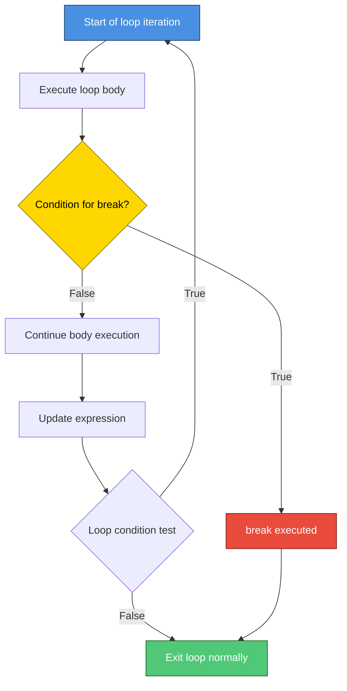
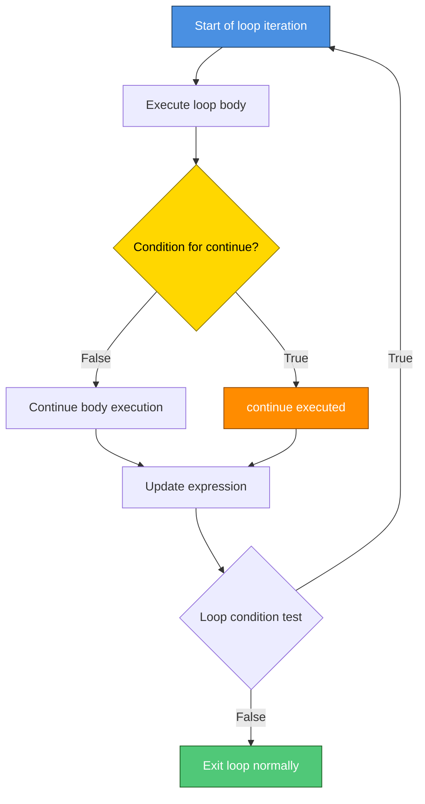
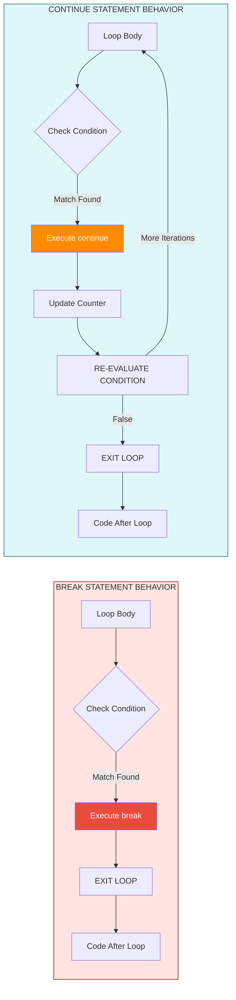
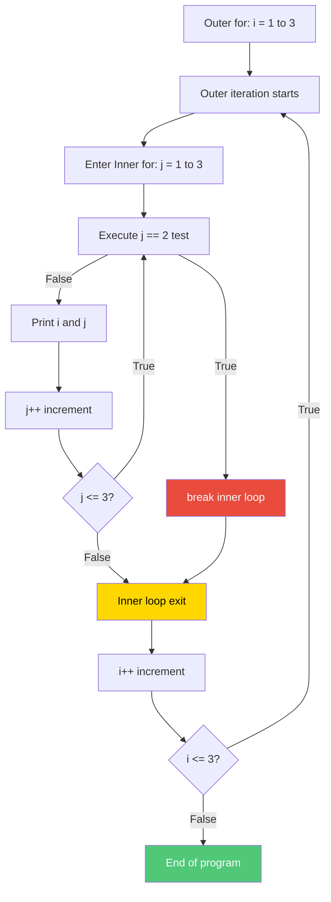
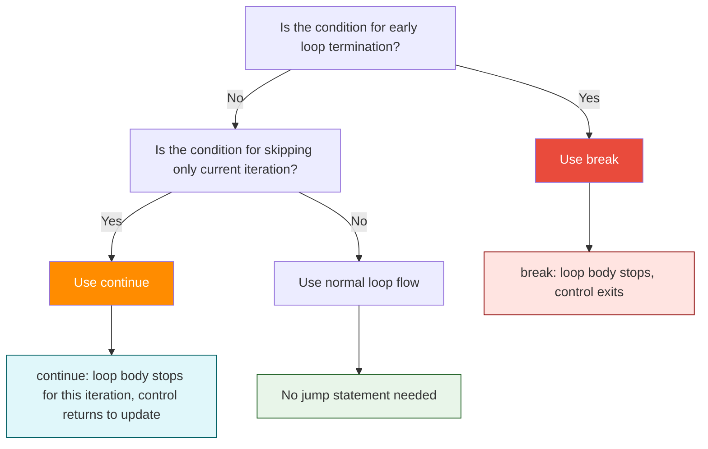

# break & continue

<!-- SECTION_1_START -->
# 1. Core Technical Definition & Intuitive Overview

## 1.1 Formal Definition (KTU 2024 Syllabus Terminology)

In the C programming language, **`break`** and **`continue`** are classified as **jump statements** (also referred to as **loop control transfer statements**). They alter the normal sequential flow of execution within iterative constructs (`for`, `while`, `do-while`) and selection constructs (`switch`).

- **`break` statement**: Terminates the execution of the **innermost enclosing loop** (`for`, `while`, `do-while`) or **`switch`** statement immediately. Control is transferred to the statement immediately following the terminated construct.

- **`continue` statement**: Skips the remaining statements in the **current iteration** of the loop and proceeds directly to the **next iteration's update/condition evaluation step**.

> [!IMPORTANT]
> **KTU Board Definition (verbatim standard)**: The `break` statement causes an **abrupt termination** of the loop, transferring control *out* of the loop body. The `continue` statement causes an **abrupt skip** of the remaining statements in the loop body, transferring control to the *re-initialization* (for `for` loops) or *condition test* (for `while`/`do-while` loops) phase of the loop.

## 1.2 Conceptual Analogy / Intuition

### 🔁 The `break` Statement — "The Emergency Exit"
Imagine you are climbing a **circular staircase** (representing a loop). You have been told to climb 10 floors. However, on the 6th floor, you find the destination. The `break` statement is like suddenly **leaving the staircase altogether** and walking out of the building. You don't complete the remaining 4 floors — execution *exits the loop entirely*.

### ⏭️ The `continue` Statement — "The Skip Stair"
Using the same staircase analogy: on the 6th floor, you realize this floor is **closed for maintenance**. Instead of leaving the building, you **skip the 6th floor's activities** and immediately proceed to the **7th floor** (the next iteration). The loop *continues* but this particular iteration is cut short.

> [!NOTE]
> **Key Distinction for Examiners**:
> - `break` = **Exit the loop** (terminates the loop).
> - `continue` = **Exit the current iteration only** (loop keeps running).

## 1.3 Physical Constants and Standard Metrics

> [!IMPORTANT]
> - **C99/C11 Standard Reference**: Section **6.8.6** of the ISO/IEC 9899:2011 standard defines jump statements.
> - **Reserved Keyword Status**: Both `break` and `continue` are part of the **C reserved keyword set** (cannot be used as variable/function names). The keyword list contains **37 keywords** in C89 and **44 keywords** in C11.

## 1.4 Visual / Flow Representation

> [!VISUALIZATION CONTROL]
> **Concept:** Flow comparison of `break` vs `continue` inside a `for` loop iterating $i = 1$ to $10$
>
> **Flowchart Trajectory (conceptual):**
> - `break` path: $1 \rightarrow 2 \rightarrow 3 \rightarrow \text{EXIT-LOOP}$ (stops at $i=3$, never reaches 10)
> - `continue` path: $1 \rightarrow 2 \rightarrow \text{SKIP-3} \rightarrow 4 \rightarrow 5 \rightarrow \text{SKIP-6} \rightarrow 7 \rightarrow 8 \rightarrow 9 \rightarrow 10 \rightarrow \text{EXIT-LOOP}$ (skips 3 and 6, but completes all iterations)
>
> **Visual Description:** Imagine a horizontal timeline from 1 to 10. The `break` line **cuts off** at the break condition. The `continue` line has **dashed gaps** at skipped values but reaches the end.

<!-- SECTION_1_END -->

<!-- SECTION_2_START -->
# 2. Deep Theoretical Analysis & KTU High-Yield Reference Sheet

## 2.1 The `break` Statement — Operational Breakdown

**Syntax:**

```c
break;
```

**Execution Logic (Step-by-Step):**

1. The `break` keyword is encountered inside the body of a loop or `switch`.
2. The compiler generates code that **immediately transfers program control** to the statement following the terminated construct.
3. Any code written *after* `break;` inside the same loop iteration is **not executed** (it becomes *unreachable code*).
4. Loop counter updates (such as the increment expression in a `for` loop) are **also skipped** upon `break`.

**Scope Rule (CRITICAL):**
The `break` statement affects only the **innermost loop or `switch`** in which it is written. If nested loops exist, `break` exits only the *closest* enclosing loop.

## 2.2 The `continue` Statement — Operational Breakdown

**Syntax:**

```c
continue;
```

**Execution Logic (Step-by-Step):**

1. The `continue` keyword is encountered inside the body of a loop.
2. All remaining statements in the current iteration **below** `continue;` are **skipped**.
3. Control jumps to the **loop update phase**:
   - In a **`for` loop**: jumps to the increment/decrement expression, then the condition test.
   - In a **`while` loop**: jumps directly to the condition test.
   - In a **`do-while` loop**: jumps directly to the condition test (the loop body is guaranteed to run at least once).

## 2.3 Comparison with `goto` (Why Examiners Ask This)

Unlike `goto`, which can jump *anywhere* (forward or backward) in a function, `break` and `continue` are **structured jumps** — they follow disciplined, well-defined control flow paths. This is why structured programming recommends `break`/`continue` over `goto` for loop control.

## 2.4 KTU Formula Sheet / Quick Reference Table

| Construct | `break` Effect | `continue` Effect | Affects Innermost Loop? | Affects `switch`? |
|-----------|---------------|-------------------|--------------------------|---------------------|
| `for` loop | Exits loop entirely | Skips rest of body, runs increment, tests condition | ✅ Yes | ❌ No (only `break`) |
| `while` loop | Exits loop entirely | Skips rest of body, tests condition again | ✅ Yes | ❌ No (only `break`) |
| `do-while` loop | Exits loop entirely | Skips rest of body, tests condition at bottom | ✅ Yes | ❌ No (only `break`) |
| `switch` | Exits the `switch` block | ❌ Illegal — causes compile error | ❌ No | ✅ Yes (only `break`) |
| `if-else` | ❌ Illegal — causes compile error | ❌ Illegal — causes compile error | ❌ N/A | ❌ N/A |

## 2.5 Real-World Engineering Utility

- **Embedded Systems**: `break` is used in `switch` statements to handle discrete hardware event codes (e.g., UART interrupt flags).
- **Search Algorithms**: Linear search uses `break` to terminate the loop the moment the target element is found (optimization for **O(n) → O(k)** in the best case, where $k \le n$).
- **Data Filtering**: `continue` is used to **skip invalid records** (e.g., negative values, NULL pointers, out-of-range sensor data) while preserving the rest of the dataset.
- **Menu-Driven Programs**: `break` terminates an infinite `while(1)` menu loop when the user selects "Exit".
- **Compiler Error Recovery**: `continue` is used in tokenizer/parser loops to skip malformed tokens without crashing the program.

> [!NOTE]
> **Production-grade rule**: In large codebases (Linux Kernel, PostgreSQL), `continue` is preferred over deeply nested `if-else` blocks to maintain the **"guard clause"** pattern for readability.

<!-- SECTION_2_END -->

<!-- SECTION_3_START -->
# 3. Step-by-Step Code Implementation & Trace Walkthroughs

## 3.1 Demonstration 1: `break` in a `for` Loop

**Problem:** Print numbers from 1 to 10, but stop the loop entirely when $i = 6$.

```c
#include <stdio.h>

int main(void) {
    int i;

    printf("Demonstration of break statement:\n");
    for (i = 1; i <= 10; i++) {
        if (i == 6) {
            break;   /* Terminates the loop when i becomes 6 */
        }
        printf("%d ", i);
    }
    printf("\nLoop terminated at i = %d\n", i);

    return 0;
}
```

**Step-by-Step Trace Table:**

| Iteration | $i$ value | Condition $(i == 6)$? | Action | Output |
|-----------|-----------|----------------------|--------|--------|
| 1 | 1 | False | Print $i$ | `1 ` |
| 2 | 2 | False | Print $i$ | `2 ` |
| 3 | 3 | False | Print $i$ | `3 ` |
| 4 | 4 | False | Print $i$ | `4 ` |
| 5 | 5 | False | Print $i$ | `5 ` |
| 6 | 6 | **True** | **`break` executed** | *(no output)* |
| — | — | — | Loop exits | — |

**Final Output:**
```
Demonstration of break statement:
1 2 3 4 5 
Loop terminated at i = 6
```

## 3.2 Demonstration 2: `continue` in a `for` Loop

**Problem:** Print numbers from 1 to 10, but skip the number 5.

```c
#include <stdio.h>

int main(void) {
    int i;

    printf("Demonstration of continue statement:\n");
    for (i = 1; i <= 10; i++) {
        if (i == 5) {
            continue;   /* Skips printf, jumps to i++ */
        }
        printf("%d ", i);
    }
    printf("\nLoop completed normally.\n");

    return 0;
}
```

**Step-by-Step Trace Table:**

| Iteration | $i$ value | Condition $(i == 5)$? | Action | Output |
|-----------|-----------|----------------------|--------|--------|
| 1 | 1 | False | Print $i$ | `1 ` |
| 2 | 2 | False | Print $i$ | `2 ` |
| 3 | 3 | False | Print $i$ | `3 ` |
| 4 | 4 | False | Print $i$ | `4 ` |
| 5 | 5 | **True** | **`continue` executed** | *(no output)* |
| 6 | 6 | False | Print $i$ | `6 ` |
| 7 | 7 | False | Print $i$ | `7 ` |
| 8 | 8 | False | Print $i$ | `8 ` |
| 9 | 9 | False | Print $i$ | `9 ` |
| 10 | 10 | False | Print $i$ | `10 ` |

**Final Output:**
```
Demonstration of continue statement:
1 2 3 4 6 7 8 9 10 
Loop completed normally.
```

## 3.3 Demonstration 3: `continue` in a `while` Loop (Increment Pitfall)

**Problem:** Print even numbers from 2 to 10.

```c
#include <stdio.h>

int main(void) {
    int i = 1;

    printf("Even numbers from 2 to 10:\n");
    while (i <= 10) {
        i++;   /* Increment MUST be before continue */
        if ((i % 2) != 0) {
            continue;   /* Skip odd numbers */
        }
        printf("%d ", i);
    }
    printf("\nDone.\n");

    return 0;
}
```

> [!WARNING]
> **Examiner's Pitfall Alert**: In a `while` loop, `continue` does **not** automatically execute the update expression. If the update (`i++`) is placed *after* `continue`, the loop becomes an **infinite loop**. This is the most common KTU exam trap on Module 1.

## 3.4 Demonstration 4: `break` Inside Nested Loops

**Problem:** Demonstrate that `break` exits only the **innermost** loop.

```c
#include <stdio.h>

int main(void) {
    int i, j;

    printf("Nested loop with break:\n");
    for (i = 1; i <= 3; i++) {
        for (j = 1; j <= 3; j++) {
            if (j == 2) {
                break;   /* Exits INNER loop only */
            }
            printf("i=%d j=%d | ", i, j);
        }
        printf("\n");
    }
    return 0;
}
```

**Output:**
```
Nested loop with break:
i=1 j=1 | 
i=2 j=1 | 
i=3 j=1 | 
```

**Explanation:** The inner `break` fires when $j=2$, but the outer loop continues with $i = 2, 3$ normally.

## 3.5 Mathematical Proof: Loop Iteration Count

> [!NOTE]
> **Theorem (for KTU derivations):** In a `for` loop `for(i=1; i<=N; i++)`, if `continue` is triggered for exactly $k$ values of $i$, the loop body executes $(N - k)$ times.

**Derivation:**

Let $T(N, k)$ denote the number of times the loop body executes (excluding `continue` skips).

The total iterations of the loop structure is $N$ (from $i=1$ to $i=N$).

$$T_{\text{body}} = N - k$$

where $k$ is the count of iterations where the `continue` condition is true.

For `break`, if the break condition first becomes true at iteration $m$ (where $1 \le m \le N$):

$$T_{\text{body}} = m - 1$$

## 3.6 Common Use-Case: Search Algorithm with `break`

```c
#include <stdio.h>

int main(void) {
    int arr[] = {10, 25, 30, 45, 50};
    int size = 5;
    int target = 30;
    int found_index = -1;
    int i;

    for (i = 0; i < size; i++) {
        if (arr[i] == target) {
            found_index = i;
            break;   /* Optimization: stop searching */
        }
    }

    if (found_index != -1) {
        printf("Element %d found at index %d\n", target, found_index);
    } else {
        printf("Element %d not found\n", target);
    }
    return 0;
}
```

**Output:**
```
Element 30 found at index 2
```

<!-- SECTION_3_END -->

<!-- SECTION_4_START -->
# 4. Structural Diagrams & Schematics

## 4.1 Control Flow Diagram — `break` Statement



## 4.2 Control Flow Diagram — `continue` Statement



## 4.3 Comparative Block Diagram — `break` vs `continue`



## 4.4 Scope Diagram — Nested Loops with `break`



## 4.5 Sequential Processing Topology — When to Use Which



<!-- SECTION_4_END -->

<!-- SECTION_5_START -->
# 5. KTU 2024 Scheme Examination Question Bank & Topic Recap

## 5.1 Part A — Short Answer Questions (3 Marks Each)

### Question 1
**`[KTU University Exam – July 2024]`** [CO1 | Remember]

Differentiate between the `break` and `continue` statements in C. Give one example use-case for each.

**Model Answer (Valuation Key):**

| Aspect | `break` | `continue` |
|--------|---------|------------|
| **Purpose** | Terminates the loop entirely | Skips current iteration only |
| **Control Transfer** | Exits the loop to the statement after it | Jumps to the update/condition phase |
| **Loop Continuation** | Loop stops running | Loop continues with next iteration |
| **Use-Case** | Search algorithm — stop when element is found | Data filtering — skip invalid records |

**Example for `break`:** Linear search — `if (arr[i] == target) break;`
**Example for `continue`:** Skip negative numbers — `if (num < 0) continue;`

> **Valuation Key Points**:
> - [Stating correct purpose of each: 1 Mark]
> - [Listing 2 differences in a tabular format: 1 Mark]
> - [One valid use-case each: 1 Mark]

---

### Question 2
**`[KTU University Exam – Dec 2023]`** [CO1 | Understand]

What happens if a `continue` statement is placed inside a `switch` block? Justify your answer.

**Model Answer:**

Placing a `continue` statement inside a `switch` block (without an enclosing loop) results in a **compile-time error** with the message:

```
error: continue statement not within a loop
```

**Justification:** The `continue` statement is a **loop control statement** and is valid only inside iterative constructs (`for`, `while`, `do-while`). The `switch` is a selection statement, not a loop. Therefore, the compiler flags `continue` as syntactically invalid inside `switch` unless the `switch` itself is nested within a loop.

> **Valuation Key Points**:
> - [Identifying the compile error: 1 Mark]
> - [Correctly stating the reason: loop requirement: 1 Mark]
> - [Mentioning exception when switch is inside a loop: 1 Mark]

---

## 5.2 Part B — Long Answer Questions (14 Marks — Module Internal Choice)

### Question A (Choice 1)
**`[KTU University Exam – July 2024]`** [CO2 | Apply + Analyze]

**(a)** Write a C program to read **10 integers** from the user and print only the **positive even numbers**. Use the `continue` statement to skip integers that are either negative or odd. **[7 Marks]**

**(b)** Modify the program in part (a) to **stop accepting input** the moment the user enters a **zero**, using the `break` statement. Print a message `"Zero encountered. Terminating input."` before exiting. **[7 Marks]**

---

#### Model Solution for Part (a):

```c
#include <stdio.h>

int main(void) {
    int i, num;

    printf("Enter 10 integers:\n");
    for (i = 1; i <= 10; i++) {
        printf("Integer %d: ", i);
        scanf("%d", &num);

        if (num < 0) {
            continue;   /* Skip negative numbers */
        }
        if ((num % 2) != 0) {
            continue;   /* Skip odd numbers */
        }
        printf("Positive even number: %d\n", num);
    }
    return 0;
}
```

**Sample Run:**
```
Enter 10 integers:
Integer 1: 4
Positive even number: 4
Integer 2: -7
Integer 3: 9
Integer 4: 12
Positive even number: 12
...
```

> **Valuation Key Points**:
> - [Correct loop structure `for(i=1; i<=10; i++)`: 1 Mark]
> - [Using `continue` for negative check: 2 Marks]
> - [Using `continue` for odd check with modulus operator: 2 Marks]
> - [Proper input/output formatting: 2 Marks]

---

#### Model Solution for Part (b):

```c
#include <stdio.h>

int main(void) {
    int i, num;

    printf("Enter integers (0 to stop):\n");
    for (i = 1; i <= 10; i++) {
        printf("Integer %d: ", i);
        scanf("%d", &num);

        if (num == 0) {
            printf("Zero encountered. Terminating input.\n");
            break;   /* Exit loop immediately */
        }
        if (num < 0) {
            continue;
        }
        if ((num % 2) != 0) {
            continue;
        }
        printf("Positive even number: %d\n", num);
    }
    return 0;
}
```

**Sample Run:**
```
Enter integers (0 to stop):
Integer 1: 6
Positive even number: 6
Integer 2: 0
Zero encountered. Terminating input.
```

> **Valuation Key Points**:
> - [Detecting zero and printing message: 2 Marks]
> - [Correct use of `break`: 2 Marks]
> - [Reusing logic from part (a): 2 Marks]
> - [Final output demonstration: 1 Mark]

---

### Question B (Choice 2 — Alternative)
**`[KTU University Exam – Dec 2023]`** [CO2 | Apply + Analyze]

**(a)** Explain with a neat C program how the `break` statement behaves when used inside **nested loops**. What is its scope of influence? **[7 Marks]**

**(b)** Write a C program using a `while` loop to find the **sum of all odd digits** in a given integer. Use `continue` to skip even digits. Demonstrate with input $N = 472913$. **[7 Marks]**

---

#### Model Solution for Part (a):

**Explanation:** The `break` statement in C has a **scope limited to the innermost loop or `switch`** in which it is enclosed. It does not transfer control out of multiple nested loops — only the immediate enclosing loop is terminated.

```c
#include <stdio.h>

int main(void) {
    int i, j;

    printf("i | j values (break exits only inner loop):\n");
    for (i = 1; i <= 3; i++) {
        printf("Outer i=%d -> ", i);
        for (j = 1; j <= 5; j++) {
            if (j == 4) {
                break;   /* Exits inner loop only */
            }
            printf("%d ", j);
        }
        printf("\n");
    }
    return 0;
}
```

**Output:**
```
i | j values (break exits only inner loop):
Outer i=1 -> 1 2 3 
Outer i=2 -> 1 2 3 
Outer i=3 -> 1 2 3 
```

**Scope Rule:** The `break` affects only the **innermost enclosing `for`, `while`, `do-while`, or `switch`**. The outer loop continues normally because it is *not* within the break's scope.

> **Valuation Key Points**:
> - [Defining the scope rule clearly: 2 Marks]
> - [Writing a working nested loop program: 3 Marks]
> - [Correct trace and output: 2 Marks]

---

#### Model Solution for Part (b):

**Algorithm:**
1. Initialize `sum = 0` and read `N`.
2. Use a `while` loop that runs while `N != 0`.
3. Extract the last digit: `digit = N % 10`.
4. If the digit is even, use `continue` to skip adding.
5. Otherwise, add it to `sum`.
6. Remove the last digit: `N = N / 10`.

```c
#include <stdio.h>

int main(void) {
    int N = 472913;
    int digit, sum = 0;

    printf("Input number: %d\n", N);
    while (N != 0) {
        digit = N % 10;
        if ((digit % 2) == 0) {
            N = N / 10;   /* IMPORTANT: update N before continue */
            continue;     /* Skip even digits */
        }
        sum = sum + digit;
        N = N / 10;
    }
    printf("Sum of odd digits: %d\n", sum);
    return 0;
}
```

**Step-by-Step Trace:**

| Step | $N$ (before) | `digit` (last digit) | Even? | Action | `sum` (after) | $N$ (after) |
|------|--------------|----------------------|-------|--------|---------------|--------------|
| 1 | 472913 | 3 | No | Add 3 | 3 | 47291 |
| 2 | 47291 | 1 | No | Add 1 | 4 | 4729 |
| 3 | 4729 | 9 | No | Add 9 | 13 | 472 |
| 4 | 472 | 2 | **Yes** | `continue` | 13 | 47 |
| 5 | 47 | 7 | No | Add 7 | 20 | 4 |
| 6 | 4 | 4 | **Yes** | `continue` | 20 | 0 |

**Final Output:**
```
Input number: 472913
Sum of odd digits: 20
```

> **Valuation Key Points**:
> - [Correct algorithm for digit extraction: 2 Marks]
> - [Using `continue` for even digits: 2 Marks]
> - [Correct placement of `N = N / 10` before `continue` (avoid infinite loop): 2 Marks]
> - [Final answer $\text{sum} = 20$: 1 Mark]

---

## 5.3 KTU Examiner's Valuation Warning / Pitfall Callout

> [!WARNING]
> **Common Mistakes that Cost Marks in Module 1 Questions:**
> 1. **Infinite Loop Trap**: Placing `continue` in a `while` loop *before* the increment statement creates an **infinite loop**. Always update the loop variable *before* `continue`.
> 2. **Scope Confusion**: Students often write `break` expecting it to exit multiple nested loops. It exits **only the innermost** loop.
> 3. **`continue` in `switch`**: Writing `continue` inside a `switch` block (without a surrounding loop) causes a **compile-time error**. Examiners deduct 1–2 marks for failing to identify this.
> 4. **Missing Semicolon**: `break` and `continue` are statements and **require a terminating semicolon** (`break;` and `continue;`).
> 5. **Unreachable Code**: Writing any statement *after* `break;` inside a loop body is **unreachable code** — the compiler may issue a warning, and examiners deduct marks if logic depends on it.
> 6. **Forgetting the Difference in `for` vs `while`**: In `for(i=1; i<=N; i++)`, the `i++` runs *before* the next condition test even after `continue`. In `while`, you must manually place the increment before `continue`.

---

## 5.4 Topic Recap & Important Things to Remember

- **`break`** terminates the **innermost loop or `switch`** and transfers control to the statement immediately after the construct.
- **`continue`** skips the **remaining statements in the current iteration** and jumps to the update/condition phase of the loop.
- **`break` is valid** in `for`, `while`, `do-while`, and `switch` constructs only.
- **`continue` is valid** in `for`, `while`, and `do-while` constructs only — **never in `switch`** unless it is inside an enclosing loop.
- The **scope** of both statements is the **innermost enclosing loop or `switch`**.
- In a **`while` loop**, always update the loop variable *before* `continue` to avoid infinite loops.
- In a **`for` loop**, the update expression (`i++`) executes automatically even after `continue`.
- **`break` and `continue` are keywords** — they cannot be used as variable or function names.
- **`break` and `continue` are not interchangeable** — using one in place of the other produces logically different (often incorrect) output.
- **Standard reference**: ISO/IEC 9899:2011 (C11), Section **6.8.6 — Jump statements**.
- **Common use-cases**:
  - `break` → linear search termination, menu exit, case-ending in `switch`.
  - `continue` → data filtering, skipping invalid records, guard clauses.
- **Unreachable code warning**: Statements written after `break;` or `continue;` in the same block are unreachable and may trigger compiler warnings.
- **Time complexity insight**: `break` can reduce worst-case search from $O(N)$ to $O(k)$ in best case, where $k$ is the position of the target element.
- **Difference from `goto`**: `break`/`continue` are **structured jumps** with disciplined control flow, unlike `goto` which can jump arbitrarily and is discouraged in production code.

<!-- SECTION_5_END -->
