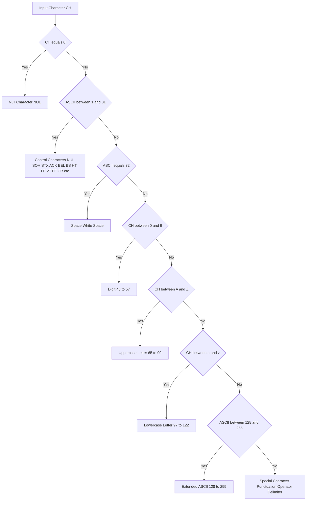
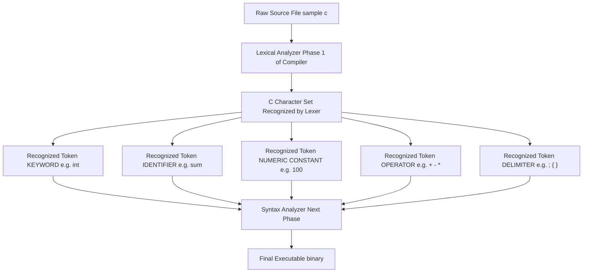
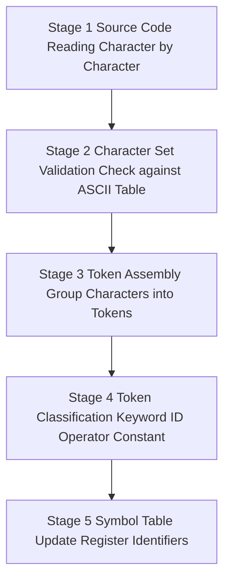

# C Fundamentals -  Character Set

<!-- SECTION_1_START -->

# 1. Core Technical Definition & Intuitive Overview

## 1.1 Formal Academic Definition (KTU 2024 Syllabus Terminology)

In the **C Programming Language**, the **Character Set** is formally defined as the complete, finite, and well-ordered collection of valid symbols, glyphs, and control characters that the **C Compiler (Turbo C / GCC)** is permitted to recognize, parse, and translate during the lexical analysis phase of compilation. Every valid token, identifier, operator, literal, or keyword in a C source file must be constructed exclusively from this predefined alphabet.

> [!IMPORTANT]
> **KTU 2024 Board Definition:** *The C character set is the set of all legitimate characters allowed in the source code of a C program. Any symbol outside this set will result in a compiler lexical error (e.g., `error: stray '\u00a3' in program`).*

## 1.2 Structural Classification of the C Character Set

The C character set is broadly partitioned into **four primary categories** by the **ANSI/ISO C11/C17 standard**:

1. **Letters** — Alphabetic characters used to form identifiers, keywords, and variable names.
2. **Digits** — Decimal numeric characters used to form integer and floating-point literals.
3. **Special Characters** — Operators, punctuators, and delimiters.
4. **White Space Characters** — Invisible formatting characters that separate tokens.

## 1.3 Conceptual Analogy — The "DNA of C"

> [!NOTE]
> **Intuitive Analogy:** Think of the C character set as the **English alphabet + punctuation + spacing rules** of the C language. Just as you cannot write a valid English sentence using Chinese characters or emojis, you cannot write a valid C program using symbols outside the recognized character set. The compiler is like a strict English teacher who only "knows" 256 symbols (ASCII table) and rejects anything unfamiliar. Every keyword like `int`, every constant like `5.6`, and every operator like `+` is built atomically from this single approved alphabet.

## 1.4 The Universal ASCII Foundation

> [!IMPORTANT]
> **Key Standard:** Every character in the C character set has a unique integer mapping called the **ASCII (American Standard Code for Information Interchange)** value. The standard ASCII range spans **0 to 127** (7-bit encoding), and the extended ASCII range spans **128 to 255** (8-bit). KTU questions frequently test the ASCII values of common characters. **`A` = 65, `Z` = 90, `a` = 97, `z` = 122, `0` = 48, `9` = 57, Space = 32, NULL (`\0`) = 0**.

## 1.5 Complete Enumeration of the C Character Set

### A. Letters (52 characters)
* **Uppercase Alphabets:** `A`, `B`, `C`, ..., `Z` (26 characters)
* **Lowercase Alphabets:** `a`, `b`, `c`, ..., `z` (26 characters)

> [!NOTE]
> **KTU Hot-Point:** C is a **case-sensitive** language. The variable `Sum` and `sum` are two completely different identifiers. The ASCII difference between any lowercase and uppercase letter is exactly **32** (e.g., `'a' - 'A' = 32`).

### B. Digits (10 characters)
`0`, `1`, `2`, `3`, `4`, `5`, `6`, `7`, `8`, `9`

### C. Special Characters (30+ characters)
These include mathematical operators, punctuation, and syntactic delimiters:

| Category | Symbols |
|---|---|
| Arithmetic Operators | `+`, `-`, `*`, `/`, `%` |
| Assignment & Compound | `=`, `+=`, `-=`, `*=`, `/=`, `%=` |
| Relational | `<`, `>`, `<=`, `>=`, `==`, `!=` |
| Logical | `&&`, `&Vert;`, `!` |
| Bitwise | `&`, `&Vert;`, `^`, `~`, `<<`, `>>` |
| Increment / Decrement | `++`, `--` |
| Delimiters / Punctuators | `(`, `)`, `{`, `}`, `[`, `]`, `,`, `;` |
| Conditional | `?`, `:` |
| Pointer / Dereference | `*`, `&` |
| Preprocessor | `#` |
| String / Char Delimiters | `'`, `"` |
| Ellipsis | `.`, `...` |
| Misc | `_`, `$` (in some compilers), `@` |

### D. White Space Characters
* **Space** (ASCII **32**)
* **Horizontal Tab** `\t` (ASCII **9**)
* **Vertical Tab** `\v` (ASCII **11**)
* **Newline** `\n` (ASCII **10**)
* **Carriage Return** `\r` (ASCII **13**)
* **Form Feed** `\f` (ASCII **12**)

> [!VISUALIZATION CONTROL]
> **Concept:** Visualizing the ASCII distribution map of the C character set
> **GeoGebra / Desmos Input Equations:**
> * `f(x) = 48` (horizontal line marking the start of digits `0-9`)
> * `f(x) = 57` (horizontal line marking the end of digits `0-9`)
> * `f(x) = 65` (horizontal line marking the start of uppercase `A-Z`)
> * `f(x) = 90` (horizontal line marking the end of uppercase `A-Z`)
> * `f(x) = 97` (horizontal line marking the start of lowercase `a-z`)
> * `f(x) = 122` (horizontal line marking the end of lowercase `a-z`)
> **Visual Description:** Students should observe four distinct horizontal bands on the ASCII decimal axis. Between ASCII 0 and 31, the white-space and control characters reside. From 48-57 lie digits, 65-90 hold uppercase letters, and 97-122 contain lowercase letters. Notice the deliberate gap between 90 and 97, which exists to reserve the 91-96 range for special punctuation like `[`, `\`, `]`, `^`, `_`, and `` ` ``.

<!-- SECTION_1_END -->

<!-- SECTION_2_START -->

# 2. Deep Theoretical Analysis & KTU High-Yield Formula Sheet

## 2.1 The Anatomy of a C Token — Why the Character Set Matters

A C program is a linear sequence of **tokens**. The character set is the atomic building block from which tokens are manufactured. The compiler's **lexical analyzer (lexer)** performs a process called **tokenization**, in which it scans the raw source code character by character and groups valid characters into the following token classes:

* **Keywords** (e.g., `int`, `return`, `if`, `else`) — built from **letters only**.
* **Identifiers** (variable names, function names) — built from **letters, digits, and underscore** with the strict rule that the **first character MUST be a letter or underscore** (never a digit).
* **Constants/Literals** (numeric, character, string, enumeration) — built from **digits, special characters, and escape sequences**.
* **Operators** — built from **special characters only** (e.g., `+`, `-`, `&&`, `<<=`).
* **Punctuators** — built from **special characters only** (e.g., `;`, `{`, `,`).

> [!NOTE]
> **The "Why" Behind the Rules:** The character set is not arbitrary. It was designed by **Dennis Ritchie** at Bell Labs in **1972** to closely mirror the **English language and mathematical notation**, which made C programs highly readable to engineers and scientists. The deliberate inclusion of only a small, well-defined set of symbols is what makes C programs **portable** across different hardware platforms and operating systems.

## 2.2 Escape Sequences — The Hidden Members of the C Character Set

An **escape sequence** is a special two-character combination starting with a **backslash `\`** followed by a character or code. They represent non-printable or hard-to-type characters. The KTU 2024 board exam frequently asks students to list these or describe their function.

## 2.3 KTU Formula Sheet / Cheat Sheet

| Symbol Type | Symbol(s) | ASCII Range (Decimal) | Engineering / Programming Utility |
|---|---|---|---|
| **Null character** | `\0` | **0** | String terminator in C; essential for `char str[]` arrays |
| **Bell / Alert** | `\a` | **7** | Triggers system beep; used in interactive console apps |
| **Backspace** | `\b` | **8** | Moves cursor one position left; used in text editors |
| **Horizontal Tab** | `\t` | **9** | Aligns output in tables; equivalent to pressing `Tab` key |
| **Newline** | `\n` | **10** | Moves cursor to next line; **most commonly used escape sequence** |
| **Vertical Tab** | `\v` | **11** | Moves cursor to next vertical tab stop |
| **Form Feed** | `\f` | **12** | Advances paper to next page in printers (legacy use) |
| **Carriage Return** | `\r` | **13** | Returns cursor to line start; used in Windows `\r\n` line endings |
| **Digits `0-9`** | `0`...`9` | **48-57** | Building numeric literals like `int x = 425;` |
| **Uppercase Letters** | `A`...`Z` | **65-90** | Used in identifiers, macros (`#define MAX 100`) |
| **Lowercase Letters** | `a`...`z` | **97-122** | Most common in C code (lowercase convention) |
| **Space** | `' '` | **32** | Token separator; whitespace |
| **Backslash** | `\\` | **92** | Used to print a literal backslash |
| **Single Quote** | `\'` | **39** | Used in character constants like `char c = '\'';` |
| **Double Quote** | `\"` | **34** | Used inside string literals like `"He said \"Hi\""` |
| **Question Mark** | `\?` | **63** | Trigraph escape (legacy C standard) |
| **Octal Code** | `\ooo` | variable | Represents any character by 1-3 octal digits |
| **Hexadecimal Code** | `\xhh` | variable | Represents any character by hex digits |

## 2.4 The Mathematical Relationship Between Cases

A critical KTU-examined relationship exists between the uppercase and lowercase alphabets:

$$
\text{ASCII(uppercase)} = \text{ASCII(lowercase)} - 32
$$

Equivalently, expressed as C expression:

$$
('\text{A}' + 32) = '\text{a}'
$$

This constant difference of **32** arises because the 6th bit (value 32) is the **case-flip bit** in the 7-bit ASCII system. Setting it toggles between uppercase and lowercase, which is the foundation of the classic C case-conversion algorithm:

```c
if (ch >= 'A' && ch <= 'Z')
    ch = ch + 32;   // Convert to lowercase
```

## 2.5 Real-World Engineering Utility

> [!IMPORTANT]
> **Industrial Application Insight:** The C character set is not just academic — it underpins every device that runs embedded systems. In **automotive ECUs (Engine Control Units)**, each sensor reading is encoded as ASCII characters transmitted over UART. In **network routers**, HTTP headers are constructed from C character strings. In **IoT firmware**, the escape sequence `\n` is used to delimit telemetry packets. Mastery of the character set is the first step toward understanding **text I/O, file handling, and protocol parsing** in C.

<!-- SECTION_2_END -->

<!-- SECTION_3_START -->

# 3. Step-by-Step Derivations & Code Implementation

## 3.1 ASCII Value Computation — Full Derivation

The ASCII system is a **positional numeral system** mapped to a 7-bit binary representation. The decimal value of any character is computed as:

$$
\text{ASCII}(c) = \sum_{i=0}^{6} b_i \cdot 2^i
$$

where $b_i \in \{0, 1\}$ represents the $i$-th bit of the binary representation.

**Example Derivation:** Compute the ASCII value of the character `'B'`.

**Step 1:** Identify the position of `'B'` in the English alphabet. `'B'` is the **2nd** uppercase letter.

**Step 2:** Apply the formula for uppercase letters:

$$
\text{ASCII(Uppercase Letter}) = 65 + (\text{Position} - 1)
$$

**Step 3:** Substitute the position of `'B'`:

$$
\text{ASCII}('\text{B}') = 65 + (2 - 1) = 65 + 1 = 66
$$

**Step 4:** Verify using the binary representation of 66:

$$
66_{10} = 64 + 2 = 2^6 + 2^1
$$

Therefore, the binary representation is `1000010`.

**Step 5:** Apply the summation formula:

$$
\text{ASCII}('\text{B}') = (1 \cdot 2^6) + (0 \cdot 2^5) + (0 \cdot 2^4) + (0 \cdot 2^3) + (0 \cdot 2^2) + (1 \cdot 2^1) + (0 \cdot 2^0) = 64 + 0 + 0 + 0 + 0 + 2 + 0 = 66
$$

The ASCII value of `'B'` is **66**.

**Example Derivation:** Compute the ASCII value of the digit character `'5'`.

**Step 1:** Identify the digit. `'5'` is the **6th** digit (counting from `'0'` as the 1st, since position 0 maps to ASCII 48).

**Step 2:** Apply the formula for digits:

$$
\text{ASCII(Digit)} = 48 + \text{Numeric Value of Digit}
$$

**Step 3:** Substitute the numeric value 5:

$$
\text{ASCII}('\text{5}') = 48 + 5 = 53
$$

**Step 4:** Verify using binary representation of 53:

$$
53_{10} = 32 + 16 + 4 + 1 = 2^5 + 2^4 + 2^2 + 2^0
$$

Therefore, the binary representation is `0110101`.

**Step 5:** Apply the summation formula:

$$
\text{ASCII}('\text{5}') = (0 \cdot 2^6) + (1 \cdot 2^5) + (1 \cdot 2^4) + (0 \cdot 2^3) + (1 \cdot 2^2) + (0 \cdot 2^1) + (1 \cdot 2^0) = 0 + 32 + 16 + 0 + 4 + 0 + 1 = 53
$$

The ASCII value of `'5'` is **53**.

## 3.2 General ASCII Computation Formula

For any character `ch` in the C character set, the ASCII position can be computed as follows:

$$
\text{ASCII}(ch) =
\begin{cases}
48 + n, & \text{if } ch \text{ is the digit } n \in \{0, 1, \dots, 9\} \\[6pt]
65 + p, & \text{if } ch \text{ is the uppercase letter at alphabet position } p \in \{0, 1, \dots, 25\} \\[6pt]
97 + p, & \text{if } ch \text{ is the lowercase letter at alphabet position } p \in \{0, 1, \dots, 25\}
\end{cases}
$$

## 3.3 C Program — Complete Character Set Demonstration

```c
/* ====================================================================
 * Program Name : character_set_demo.c
 * Purpose      : Demonstrate every category of the C character set
 *                including letters, digits, special characters,
 *                white spaces, and escape sequences.
 * KTU Module   : 1 - C Fundamentals
 * ==================================================================== */
#include <stdio.h>

int main(void)
{
    /* ---------- 1. LETTERS ---------- */
    printf("=== C CHARACTER SET DEMONSTRATION ===\n\n");

    printf("[A] Letters:\n");
    printf("    Uppercase: ");
    for (int i = 65; i <= 90; i++) {
        printf("%c ", (char)i);
    }
    printf("\n");

    printf("    Lowercase: ");
    for (int i = 97; i <= 122; i++) {
        printf("%c ", (char)i);
    }
    printf("\n\n");

    /* ---------- 2. DIGITS ---------- */
    printf("[B] Digits:\n");
    printf("    Characters: ");
    for (int i = 48; i <= 57; i++) {
        printf("%c ", (char)i);
    }
    printf("\n");
    printf("    ASCII Range: 48 to 57\n\n");

    /* ---------- 3. SPECIAL CHARACTERS ---------- */
    printf("[C] Special Characters:\n");
    printf("    Arithmetic : + - * / %%\n");
    printf("    Relational : < > <= >= == !=\n");
    printf("    Logical    : && || !\n");
    printf("    Bitwise    : & | ^ ~ << >>\n");
    printf("    Delimiters : ( ) { } [ ] , ;\n");
    printf("    Others     : _ # ? : . \\ \n\n");

    /* ---------- 4. WHITE SPACES & ESCAPE SEQUENCES ---------- */
    printf("[D] White Spaces and Escape Sequences:\n");
    printf("    Newline test -> Line 1\\nLine 2\n");
    printf("    Tab test     -> Col1\tCol2\tCol3\n");
    printf("    Backslash    -> C:\\Program Files\\C\n");
    printf("    Quote test   -> He said \"Hello World\"\n");
    printf("    Bell test    -> Beep!\a (system may beep)\n\n");

    /* ---------- 5. ASCII VALUE OF A CHARACTER ---------- */
    char ch;
    printf("[E] Enter any single character: ");
    scanf("%c", &ch);
    printf("    Character : %c\n", ch);
    printf("    ASCII Code: %d\n", (int)ch);
    printf("    Hex Code  : 0x%X\n", (int)ch);

    /* ---------- 6. CASE CONVERSION DEMO ---------- */
    if (ch >= 'A' && ch <= 'Z') {
        printf("    Lowercase : %c\n", ch + 32);
    } else if (ch >= 'a' && ch <= 'z') {
        printf("    Uppercase : %c\n", ch - 32);
    }

    return 0;
}
```

**Expected Output Snippet:**

```
=== C CHARACTER SET DEMONSTRATION ===

[A] Letters:
    Uppercase: A B C D E F G H I J K L M N O P Q R S T U V W X Y Z
    Lowercase: a b c d e f g h i j k l m n o p q r s t u v w x y z

[B] Digits:
    Characters: 0 1 2 3 4 5 6 7 8 9
    ASCII Range: 48 to 57
...
```

## 3.4 C Program — Classify Any Input Character

```c
/* ====================================================================
 * Program Name : classify_character.c
 * Purpose      : Reads a character from the user and classifies it
 *                into one of the four C character set categories.
 * ==================================================================== */
#include <stdio.h>

int main(void)
{
    char ch;
    int ascii;

    printf("Enter a character: ");
    scanf("%c", &ch);
    ascii = (int)ch;

    printf("\n--- Classification Report ---\n");
    printf("Character entered : %c\n", ch);
    printf("ASCII value       : %d\n", ascii);

    if (ch >= 'A' && ch <= 'Z') {
        printf("Category          : UPPERCASE LETTER\n");
    }
    else if (ch >= 'a' && ch <= 'z') {
        printf("Category          : LOWERCASE LETTER\n");
    }
    else if (ch >= '0' && ch <= '9') {
        printf("Category          : DIGIT\n");
    }
    else if (ch == ' ' || ch == '\t' || ch == '\n') {
        printf("Category          : WHITE SPACE\n");
    }
    else {
        printf("Category          : SPECIAL CHARACTER\n");
    }

    return 0;
}
```

**Sample Run 1:**

```
Enter a character: G

--- Classification Report ---
Character entered : G
ASCII value       : 71
Category          : UPPERCASE LETTER
```

**Sample Run 2:**

```
Enter a character: 7

--- Classification Report ---
Character entered : 7
ASCII value       : 55
Category          : DIGIT
```

## 3.5 C Program — Display All Escape Sequences With Their ASCII Values

```c
/* ====================================================================
 * Program Name : escape_sequences.c
 * Purpose      : Print all C escape sequences and their ASCII codes.
 * ==================================================================== */
#include <stdio.h>

int main(void)
{
    printf("+-------+----------------------+----------+\n");
    printf("|  Seq  |   Description        |  ASCII   |\n");
    printf("+-------+----------------------+----------+\n");
    printf("|  \\a   | Bell (Alert)         |    7     |\n");
    printf("|  \\b   | Backspace            |    8     |\n");
    printf("|  \\t   | Horizontal Tab       |    9     |\n");
    printf("|  \\n   | Newline              |   10     |\n");
    printf("|  \\v   | Vertical Tab         |   11     |\n");
    printf("|  \\f   | Form Feed            |   12     |\n");
    printf("|  \\r   | Carriage Return      |   13     |\n");
    printf("|  \\0   | Null Character       |    0     |\n");
    printf("|  \\\\   | Backslash            |   92     |\n");
    printf("|  \\'   | Single Quote         |   39     |\n");
    printf("|  \\\"   | Double Quote         |   34     |\n");
    printf("+-------+----------------------+----------+\n");
    return 0;
}
```

<!-- SECTION_3_END -->

<!-- SECTION_4_START -->

# 4. Structural Diagrams & Schematics

## 4.1 Classification Flowchart of the C Character Set



## 4.2 ASCII Range Map — Block Architecture

```mermaid
flowchart LR
    subgraph ASCIIRANGE0["ASCII 0 to 31 Control Region"]
        nodeNUL2["NUL 0"]
        nodeBEL["BEL 7"]
        nodeBS["BS 8"]
        nodeHT["HT 9"]
        nodeLF["LF 10"]
        nodeCR["CR 13"]
    end
    subgraph ASCIIRANGE32["ASCII 32 Space Region"]
        nodeSP2["SP 32 Space"]
    end
    subgraph ASCIIRANGE48["ASCII 48 to 57 Digit Region"]
        node0["0 48"]
        node9["9 57"]
    end
    subgraph ASCIIRANGE65["ASCII 65 to 90 Uppercase Region"]
        nodeA["A 65"]
        nodeZ["Z 90"]
    end
    subgraph ASCIIRANGE97["ASCII 97 to 122 Lowercase Region"]
        nodea["a 97"]
        nodez["z 122"]
    end
    ASCIIRANGE0 --> ASCIIRANGE32 --> ASCIIRANGE48 --> ASCIIRANGE65 --> ASCIIRANGE97
```



## 4.3 Functional Architecture — From Source Code to Machine Token



## 4.4 Sequential Processing Topology — Token Recognition Pipeline



<!-- SECTION_4_END -->

<!-- SECTION_5_START -->

# 5. KTU 2024 Scheme Examination Question Bank & Topic Recap

---

## 📝 Part A Questions (3 Marks Each)

### **Question 1** `[KTU University Exam - July 2024]`
**(a) Define the term "Character Set" in C. List any four categories of characters in the C character set.** **(CO1, Remember)** **[3 Marks]**

**Model Answer:**

The **C character set** is the set of all valid characters that can be used to write a C program. The C compiler recognizes only those characters that belong to this set; any character outside the set causes a compilation error.

The four categories of the C character set are:

1. **Letters** — Uppercase (`A` to `Z`) and lowercase (`a` to `z`) alphabets, totaling **52** characters.
2. **Digits** — `0`, `1`, `2`, `3`, `4`, `5`, `6`, `7`, `8`, `9`, totaling **10** characters.
3. **Special Characters** — Symbols such as `+`, `-`, `*`, `/`, `%`, `(`, `)`, `{`, `}`, `;`, `,`, `#`, `_`, etc.
4. **White Spaces** — Space, tab (`\t`), newline (`\n`), carriage return (`\r`), form feed (`\f`).

> [!NOTE]
> **[Valuation Key: Defining the character set: 1 Mark | Listing the four categories with at least one example each: 2 Marks]**

---

### **Question 2** `[KTU University Exam - Dec 2023]`
**(b) What is an escape sequence in C? Write the escape sequence for: (i) Newline, (ii) Horizontal Tab, (iii) Backslash, and (iv) Null character.** **(CO1, Remember)** **[3 Marks]**

**Model Answer:**

An **escape sequence** in C is a special sequence of characters beginning with a backslash (`\`) that is used to represent characters which cannot be typed directly or which have a special meaning (such as non-printable control characters). The backslash signals the compiler to "escape" from the normal interpretation of the following character.

| Description | Escape Sequence | ASCII Value |
|---|---|---|
| (i) Newline | `\n` | 10 |
| (ii) Horizontal Tab | `\t` | 9 |
| (iii) Backslash | `\\` | 92 |
| (iv) Null character | `\0` | 0 |

> [!NOTE]
> **[Valuation Key: Definition of escape sequence: 1 Mark | Correctly writing all four escape sequences: 2 Marks]**

---

## 📝 Part B Questions (14 Marks Each — Internal Choice)

### **Question 3A** `[KTU University Exam - July 2024]`

**(a)** Explain the C character set in detail with a neat classification diagram. Mention the ASCII range for letters and digits. **(CO1, Understand)** **[7 Marks]**

**Model Answer:**

The C character set is the collection of all valid symbols that can appear in a C source program. The compiler's lexical analyzer recognizes only these symbols; any other symbol is rejected as a lexical error.

**Classification of the C Character Set:**

**1. Letters (52 characters):**
* **Uppercase letters** `A` to `Z` — ASCII range **65 to 90**
* **Lowercase letters** `a` to `z` — ASCII range **97 to 122**

**2. Digits (10 characters):**
* `0` to `9` — ASCII range **48 to 57**

**3. Special Characters:**
* Arithmetic operators: `+`, `-`, `*`, `/`, `%`
* Relational operators: `<`, `>`, `<=`, `>=`, `==`, `!=`
* Logical operators: `&&`, `||`, `!`
* Bitwise operators: `&`, `|`, `^`, `~`, `<<`, `>>`
* Assignment operators: `=`, `+=`, `-=`, `*=`, `/=`, `%=`
* Increment/Decrement: `++`, `--`
* Delimiters: `(`, `)`, `{`, `}`, `[`, `]`, `;`, `,`
* Others: `_`, `#`, `.`, `'`, `"`, `\`, `:`, `?`, `@`, `$`

**4. White Space Characters:**
* Space (ASCII 32), Tab `\t` (ASCII 9), Newline `\n` (ASCII 10), Carriage Return `\r` (ASCII 13), Form Feed `\f` (ASCII 12), Vertical Tab `\v` (ASCII 11).

**Classification Diagram:**

```
                C CHARACTER SET
                       |
   -----------------------------------------
   |          |            |              |
Letters     Digits    Special Chars   White Spaces
(A-Z, a-z)  (0-9)    (+, -, ;, etc.)  (Space, \t, \n)
```

> [!NOTE]
> **[Valuation Key: Correctly listing all 4 categories: 3 Marks | ASCII ranges for letters and digits: 2 Marks | Examples for special characters: 1 Mark | Classification diagram: 1 Mark]**

---

**(b)** Write a C program to read a character from the user and display its ASCII code. If the character is an uppercase letter, convert it to lowercase; if it is a lowercase letter, convert it to uppercase; otherwise display "No case conversion possible". **(CO2, Apply)** **[7 Marks]**

**Model Answer:**

```c
#include <stdio.h>

int main(void)
{
    char ch;
    int ascii;

    /* Step 1: Read input character */
    printf("Enter a single character: ");
    scanf("%c", &ch);

    /* Step 2: Compute and display ASCII value */
    ascii = (int)ch;
    printf("The ASCII value of '%c' is: %d\n", ch, ascii);

    /* Step 3: Case conversion logic */
    if (ch >= 'A' && ch <= 'Z') {
        /* Uppercase to Lowercase: add 32 */
        printf("Lowercase conversion: %c\n", ch + 32);
    }
    else if (ch >= 'a' && ch <= 'z') {
        /* Lowercase to Uppercase: subtract 32 */
        printf("Uppercase conversion: %c\n", ch - 32);
    }
    else {
        printf("No case conversion possible.\n");
    }

    return 0;
}
```

**Sample Output:**

```
Enter a single character: K
The ASCII value of 'K' is: 75
Lowercase conversion: k
```

**Logic Explanation:**

* The expression `(int)ch` performs an **implicit type casting** which retrieves the integer ASCII code stored for the character.
* The conditional `ch >= 'A' && ch <= 'Z'` uses the **ASCII range property** to detect uppercase letters.
* Adding **32** flips the 6th bit, converting uppercase to lowercase (e.g., `65 ('A') + 32 = 97 ('a')`).
* Subtracting **32** performs the reverse conversion (`97 ('a') - 32 = 65 ('A')`).

> [!NOTE]
> **[Valuation Key: Correct program structure with `#include` and `main()`: 1 Mark | Reading character with `scanf`: 1 Mark | Displaying ASCII using `%d` format specifier: 1 Mark | Correct uppercase-to-lowercase logic (`+32`): 2 Marks | Correct lowercase-to-uppercase logic (`-32`): 1 Mark | Proper else branch handling: 1 Mark]**

---

### **Question 3B (Alternative Choice)** `[KTU University Exam - Dec 2023]`

**(a)** Differentiate between the following with at least two points each: **(i) Character Constant vs String Constant, (ii) ASCII vs Unicode.** **(CO1, Understand)** **[7 Marks]**

**Model Answer:**

**(i) Character Constant vs String Constant:**

| Feature | Character Constant | String Constant |
|---|---|---|
| **Syntax** | Enclosed in **single quotes**, e.g., `'A'` | Enclosed in **double quotes**, e.g., `"A"` |
| **Memory Size** | Occupies **1 byte** | Occupies **number of characters + 1** (extra byte for the null terminator `\0`) |
| **Storage Class** | Stored as a `char` data type | Stored as an array of `char` (e.g., `char s[] = "A";`) |
| **Null Terminator** | Does **not** require `\0` | **Always** ends with the null character `\0` |
| **Example** | `char grade = 'A';` | `char name[] = "KTU";` (occupies 4 bytes including `\0`) |

**(ii) ASCII vs Unicode:**

| Feature | ASCII | Unicode |
|---|---|---|
| **Bit Width** | Originally **7 bits** (0 to 127); extended version uses 8 bits (0 to 255) | Variable width: typically **16 bits** (UTF-16) or **32 bits** (UTF-32) |
| **Total Characters** | Supports **128** (or 256) characters | Supports **over 143,000** characters |
| **Language Support** | Limited to **English** and basic symbols | Supports **all world languages**, emojis, and ancient scripts |
| **Storage in C** | Directly supported via `char` | Requires special libraries (e.g., `wchar.h` for wide characters) |
| **Example Value** | `'A'` is **65** | `'A'` is **U+0041** (which equals 65 in UTF-16) |

> [!NOTE]
> **[Valuation Key: Two valid differences for (i): 3 Marks | Two valid differences for (ii): 3 Marks | Tabular presentation: 1 Mark]**

---

**(b)** Write a C program that accepts a character and prints whether it is a letter, digit, special character, or whitespace. Use proper ASCII range checks. **(CO2, Apply)** **[7 Marks]**

**Model Answer:**

```c
#include <stdio.h>

int main(void)
{
    char ch;

    /* Step 1: Read character */
    printf("Enter any character: ");
    scanf("%c", &ch);

    printf("You entered: '%c' (ASCII: %d)\n", ch, (int)ch);

    /* Step 2: Classification using ASCII range checks */
    if ((ch >= 'A' && ch <= 'Z') || (ch >= 'a' && ch <= 'z')) {
        printf("Classification: LETTER\n");
    }
    else if (ch >= '0' && ch <= '9') {
        printf("Classification: DIGIT\n");
    }
    else if (ch == ' ' || ch == '\t' || ch == '\n' || ch == '\r') {
        printf("Classification: WHITE SPACE\n");
    }
    else {
        printf("Classification: SPECIAL CHARACTER\n");
    }

    return 0;
}
```

**Sample Runs:**

*Input: `m`* → `Classification: LETTER`
*Input: `9`* → `Classification: DIGIT`
*Input: `#`* → `Classification: SPECIAL CHARACTER`
*Input: ` ` (space)* → `Classification: WHITE SPACE`

> [!NOTE]
> **[Valuation Key: Reading character: 1 Mark | Correct ASCII range check for letter: 2 Marks | Correct ASCII range check for digit: 1 Mark | White space detection with multiple escape sequences: 1 Mark | Else branch for special character: 1 Mark | Output formatting: 1 Mark]**

---

> [!WARNING]
> **🚨 KTU Examiner's Valuation Warning — Common Pitfalls to Avoid:**
>
> 1. **Confusing character `'0'` with integer `0`:** The character `'0'` has ASCII value **48**, not 0. The integer 0 corresponds to the **null character** `'\0'`. Mixing these up will cause wrong output and lose marks.
> 2. **Forgetting the escape backslash:** Writing `'\n'` as `n` or `'\\n'` instead of `'\n'` is a syntax error. Students lose 1-2 marks for this.
> 3. **Using single quotes for strings:** Writing `"Hello"` as `'Hello'` is invalid. Strings require **double quotes**; characters require **single quotes**.
> 4. **Missing the case-flip constant of 32:** Always remember `'a' - 'A' = 32`. Some students erroneously write 26 or 16.
> 5. **Drawing ASCII table without axes labels:** When asked to draw the ASCII range, always label the x-axis as "ASCII Decimal Value" and clearly mark the boundaries (48, 57, 65, 90, 97, 122).

---

## 🎯 Topic Recap & Important Things to Remember

* ✅ The **C character set** is the predefined set of symbols that the C compiler can recognize; it consists of **letters, digits, special characters, and white spaces**.
* ✅ C contains **52 letters** (26 uppercase `A-Z` + 26 lowercase `a-z`), **10 digits** (`0-9`), and **30+ special characters** used as operators and delimiters.
* ✅ C is a **case-sensitive** language; `'A'` and `'a'` are treated as entirely different characters.
* ✅ Every character has a unique **ASCII integer code** in the range **0 to 127** (standard ASCII) or **0 to 255** (extended ASCII).
* ✅ **Key ASCII values to memorize:** `'A'` = 65, `'Z'` = 90, `'a'` = 97, `'z'` = 122, `'0'` = 48, `'9'` = 57, space = 32, `'\0'` = 0, `'\n'` = 10, `'\t'` = 9.
* ✅ The difference between any uppercase and corresponding lowercase letter is the constant **32** (i.e., `'a' - 'A' = 32`); this is the foundation of case conversion in C.
* ✅ **Escape sequences** start with a backslash `\` and represent non-printable or hard-to-type characters; the most important ones are `\n` (newline), `\t` (tab), `\\` (backslash), `\'` (single quote), `\"` (double quote), and `\0` (null).
* ✅ The null character `'\0'` (ASCII 0) is the **string terminator** in C and is automatically appended at the end of every string literal.
* ✅ **White space characters** include space (32), `\t` (9), `\n` (10), `\r` (13), `\f` (12), and `\v` (11); they are used as token separators by the compiler.
* ✅ A character constant in C is always enclosed in **single quotes** (`'A'`), while a string constant is enclosed in **double quotes** (`"A"`).
* ✅ Special characters like `+`, `-`, `*`, `/`, `%`, `<`, `>`, `=`, `!`, `&`, `|`, `^`, `~`, `#`, `_`, `(`, `)`, `{`, `}`, `[`, `]`, `;`, `,`, `.`, `:`, `?`, `'`, `"` form the operators and punctuators of the C language.
* ✅ The character set is the **first phase** of compilation; the **lexical analyzer** uses it to convert raw source text into a stream of valid tokens.

<!-- SECTION_5_END -->
