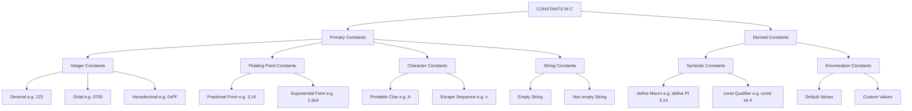
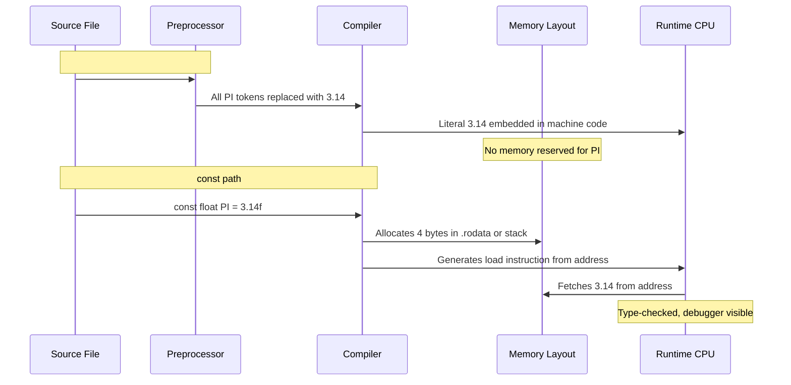
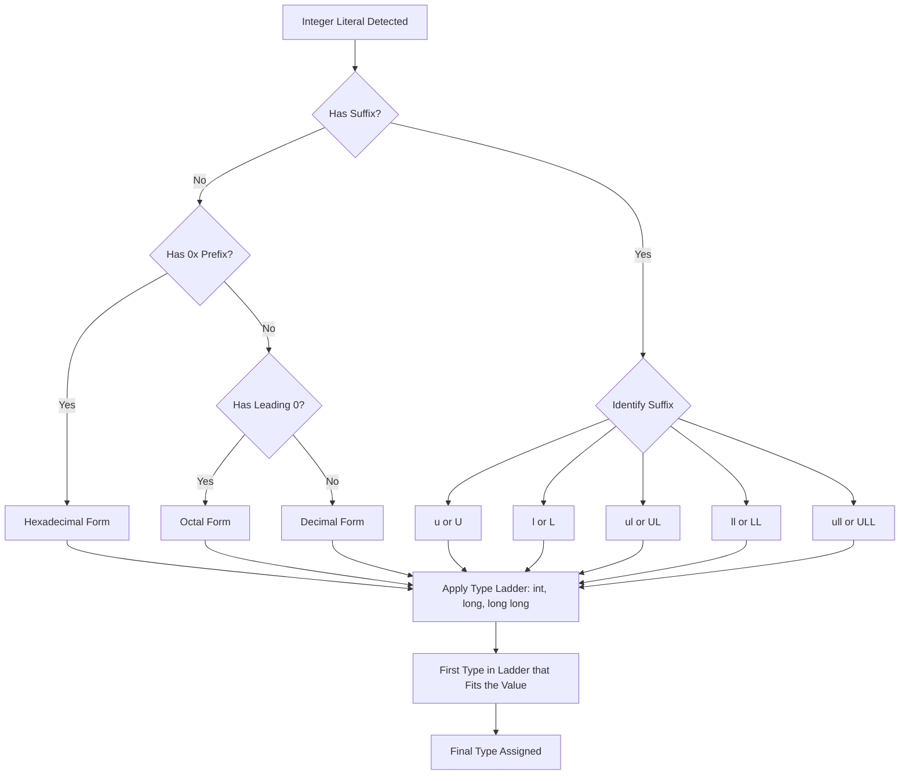
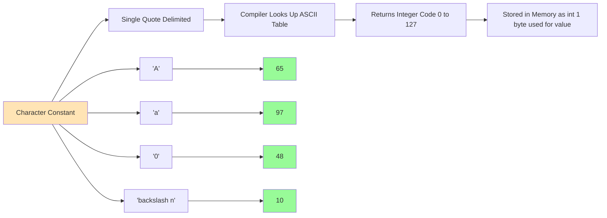
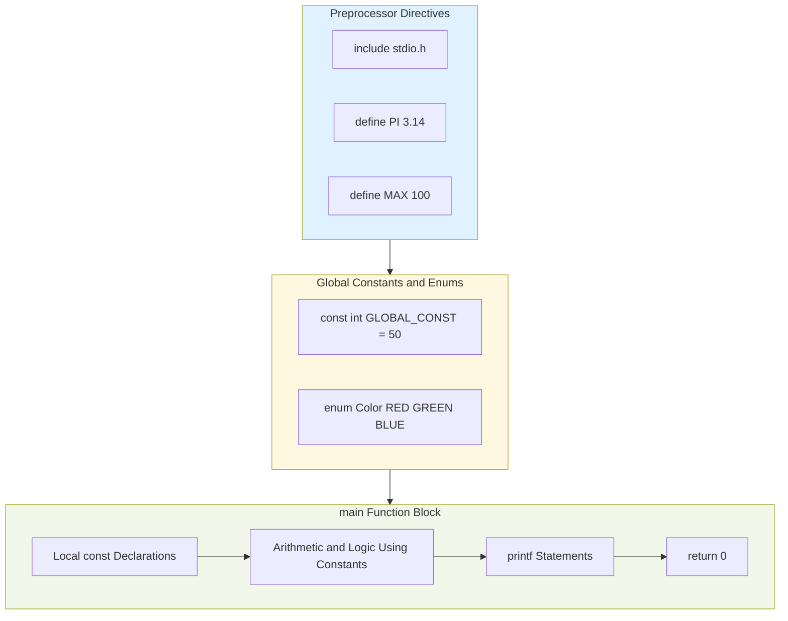

# Constants

<!-- SECTION_1_START -->

# Constants in C Programming

> [!NOTE]
> **KTU 2024 Syllabus Definition (GXEST204 - Module 1)**
> A **constant** in C refers to a fixed value that cannot be altered by the program during its execution. Constants are also called **literals**. They represent data values that remain immutable throughout the program's runtime and form the foundational data primitives for all C expressions and operations.

## Intuitive Overview & Real-World Analogy

Think of **constants** in C the same way you think of the **gravitational acceleration** ($g = 9.8 \, m/s^2$) in physics, the **value of $\pi$** in geometry, or the **boiling point of water** ($100^\circ C$) in chemistry. These values are fixed, universal, and cannot be modified during a calculation. C constants work the exact same way — once declared, they act as **read-only named boxes** whose contents the program can read, but never overwrite.

> [!IMPORTANT]
> **Key Distinction:** A **constant** is an *immutable data value* baked into the source code (e.g., `42`, `'A'`, `3.14`), while a **variable** is a *named memory location* whose value can change during execution. Never confuse the two — KTU examiners frequently test this exact discrimination.

### Classification of C Constants (KTU 2024 Module-Wise Scope)

| Category | Example Values | Storage Type |
|---|---|---|
| **Integer Constants** | `25`, `-100`, `0`, `0755`, `0xFF` | Whole numbers, no decimal |
| **Floating-Point (Real) Constants** | `3.14`, `2.5e3`, `-0.005` | Decimal numbers |
| **Character Constants** | `'A'`, `'7'`, `'\n'` | Single character in single quotes |
| **String Constants (Literals)** | `"Hello"`, `"123"`, `""` | Sequence of chars in double quotes |
| **Enumeration Constants** | `enum color {RED, GREEN}` | User-defined named integer set |
| **Symbolic Constants** | `#define PI 3.14` or `const int MAX = 100;` | Macro / qualified variable |

> [!TIP]
> **Memory Trick for KTU Viva:** Think **"CIRCLE"** for the 6 constant types in C:
> **C**haracter, **I**nteger, **R**eal, **C**onst-qualifier, **L**iteral (string), **E**num.

### 1. Integer Constants

An **integer constant** in C refers to a sequence of digits (with an optional sign) representing a whole number. It can be expressed in **three number systems**:

#### a) Decimal (Base 10)
Digits allowed: `0–9`. No leading zero.
- Examples: `123`, `-45`, `0`, `9876`

#### b) Octal (Base 8)
Digits allowed: `0–7`. Must begin with a leading `0`.
- Examples: `0755` (decimal `493`), `010` (decimal `8`), `077` (decimal `63`)
- **Invalid:** `089` (digit `8` and `9` not allowed in octal — KTU favourite trick question!)

#### c) Hexadecimal (Base 16)
Digits allowed: `0–9` and `A–F` (or `a–f`). Must begin with `0x` or `0X`.
- Examples: `0xFF` (decimal `255`), `0x2A` (decimal `42`), `0X10` (decimal `16`)

#### Integer Suffix Modifiers
| Suffix | Meaning | Example |
|---|---|---|
| `u` or `U` | Unsigned | `1000U` |
| `l` or `L` | Long | `123456789L` |
| `ul` or `UL` | Unsigned Long | `500000UL` |
| `ll` or `LL` | Long Long (C99) | `9000000000LL` |

> [!WARNING]
> **KTU Common Pitfall:** Writing `081` produces a **compilation error** because the compiler interprets it as octal (where `8` is illegal). Always verify the leading-zero context.

---

### 2. Floating-Point (Real) Constants

A **floating-point constant** is a number with an integer part, a fractional part, an optional signed exponent, and an optional type suffix. It must contain either a **decimal point** or an **exponent** (or both) — never just an integer.

#### Two Valid Representation Forms

**Fractional Form (Decimal Point Mandatory):**
$$\text{signed\_integer}.\,\text{unsigned\_integer}$$
Examples: `3.14`, `-0.5`, `.25` (valid — integer part is optional), `100.` (valid — fractional part is optional)

**Exponential (Scientific) Form:**
$$\text{mantissa}\,e\,\text{signed\_exponent}$$
Examples: `2.5e3` (means $2.5 \times 10^3 = 2500$), `1.5E-2` (means $0.015$), `6.02e23` (Avogadro's number style)

#### Floating-Point Suffix Modifiers
| Suffix | Type | Approximate Range |
|---|---|---|
| `f` or `F` | `float` | $\pm 3.4 \times 10^{\pm 38}$ (~6–7 decimal digits) |
| `l` or `L` | `long double` | $\pm 1.1 \times 10^{\pm 4932}$ (~18–19 decimal digits) |
| *(none)* | `double` (default) | $\pm 1.7 \times 10^{\pm 308}$ (~15–16 decimal digits) |

> [!IMPORTANT]
> The **IEEE 754 single-precision** standard reserves **32 bits (4 bytes)** for `float`, and **double-precision** uses **64 bits (8 bytes)**. KTU 2024 syllabus explicitly expects this storage awareness.

---

### 3. Character Constants

A **character constant** is a single character (or an escape sequence) enclosed within **single quotes** (apostrophes). Internally, C stores every character as its corresponding **ASCII integer code** (typically 1 byte).

| Constant | ASCII Value (Decimal) | Meaning |
|---|---|---|
| `'A'` | `65` | Uppercase A |
| `'a'` | `97` | Lowercase a |
| `'0'` | `48` | Digit zero (NOT integer `0`!) |
| `' '` | `32` | Space |
| `'\n'` | `10` | Newline (escape sequence) |
| `'\0'` | `0` | Null character (string terminator) |
| `'\t'` | `9` | Horizontal tab |

#### Escape Sequence Reference (High-Yield for KTU)
| Escape | Meaning | ASCII |
|---|---|---|
| `\n` | Newline | 10 |
| `\t` | Horizontal tab | 9 |
| `\\` | Backslash | 92 |
| `\'` | Single quote | 39 |
| `\"` | Double quote | 34 |
| `\0` | Null terminator | 0 |
| `\r` | Carriage return | 13 |
| `\b` | Backspace | 8 |
| `\a` | Audible alert (bell) | 7 |
| `\f` | Form feed | 12 |
| `\v` | Vertical tab | 11 |
| `\?` | Question mark | 63 |
| `\ooo` | Octal (up to 3 octal digits) | variable |
| `\xhh` | Hexadecimal (any number of hex digits) | variable |

> [!TIP]
> **KTU Viva Question Pattern:** *"What is the difference between `'A'` and `"A"` in C?"*
> - `'A'` is a **character constant** → occupies **1 byte**, ASCII value `65`.
> - `"A"` is a **string literal** → occupies **2 bytes** (`'A'` + `'\0'`), stored as an array.

---

### 4. String Constants (String Literals)

A **string constant** is a sequence of zero or more characters enclosed within **double quotes**. C automatically appends a **null character** `'\0'` at the end of every string literal.

| String Literal | Effective Stored Bytes |
|---|---|
| `""` | 1 byte (just `'\0'`) |
| `"A"` | 2 bytes (`'A'`, `'\0'`) |
| `"Hello"` | 6 bytes (`'H'`,`'e'`,`'l'`,`'l'`,`'o'`,`'\0'`) |
| `"KTU 2024"` | 9 bytes (including space and `\0`) |

> [!VISUALIZATION CONTROL]
> **Concept:** Memory layout of a string literal in RAM
> **Visualization Input (use in C tutor or Python Tutor):**
> ```c
> char msg[] = "CProg";
> ```
> **Visual Description:** The student should observe a contiguous memory block starting at address `0x100`: `[0x100]='C'`, `[0x101]='P'`, `[0x102]='r'`, `[0x103]='o'`, `[0x104]='g'`, `[0x105]='\0'`. Total **6 bytes** allocated. This visual makes the null terminator concept permanent in memory.

---

### 5. Symbolic Constants (KTU Favourite)

Symbolic constants are **names assigned to constant values** using one of two C mechanisms:

#### Method 1: `#define` Preprocessor Directive (No Semicolon, No Type)
```c
#define PI 3.14159
#define MAX 100
#define NEWLINE '\n'
```
- The preprocessor performs a **pure text substitution** before compilation.
- **No memory is allocated** for the symbolic name (it does not occupy RAM).
- The convention is to write macro names in **UPPERCASE** (style guideline, not a rule).

#### Method 2: `const` Qualifier (Typed, Stored in Memory)
```c
const float PI = 3.14159f;
const int MAX = 100;
const char NEWLINE = '\n';
```
- Occupies memory (typically in the data segment or stack).
- Has a **data type**, so the compiler can perform type-checking.
- Any attempt to modify it after declaration → **compilation error**.

> [!WARNING]
> **Critical Comparison for KTU:**
> | Feature | `#define` | `const` |
> |---|---|---|
> | Processed by | Preprocessor | Compiler |
> | Type-safe? | ❌ No | ✅ Yes |
> | Memory allocation | None | Yes |
> | Scope rule | File (global) | Block / file |
> | Debuggable? | ❌ Hard to trace | ✅ Yes |

---

### 6. Enumeration Constants (`enum`)

The `enum` keyword lets a programmer define a **set of named integer constants**, improving readability over raw numeric codes.

```c
enum boolean { FALSE, TRUE };            /* FALSE = 0, TRUE = 1 */
enum day { MON, TUE, WED, THU, FRI, SAT, SUN };  /* 0..6 */
enum color { RED=10, GREEN=20, BLUE=30 }; /* Custom values */
```

- Internally, `enum` constants are stored as `int`.
- Default start value is `0`, and subsequent names increment by `1` unless overridden.
- They are useful for **state machines**, **menu choices**, and **flag definitions**.

<!-- SECTION_1_END -->

<!-- SECTION_2_START -->

# Deep Theoretical Analysis & KTU High-Yield Formula Sheet

## Theoretical Framework: How C Handles Constants at Compile Time

C's handling of constants follows a strict pipeline from **source code → preprocessor → compiler → linker → executable**. Understanding this pipeline is critical for KTU 2024 Module 1 questions.

### Step-by-Step Lifecycle of a Constant

1. **Source Code Authoring:** Programmer writes a literal (e.g., `42`, `3.14`, `'A'`).
2. **Preprocessing (only for `#define`):** All macro names are replaced textually with their literal values.
3. **Lexical Analysis (Tokenization):** The compiler scans tokens. A literal becomes a **constant token** in the symbol table.
4. **Type Determination:** The compiler applies **implicit typing rules**:
   - `42` → `int` (no suffix, fits in `int` range)
   - `42L` → `long int`
   - `3.14` → `double` (no suffix, has decimal)
   - `3.14f` → `float`
   - `'A'` → `int` (promoted from `char` to `int` in expressions)
5. **Code Generation:** The literal is embedded into the instruction stream or stored in the read-only `.rodata` section.
6. **Runtime:** The CPU loads the constant from the appropriate memory region when needed.

### Integer Constant Typing Rules (C99 / C11 Standard)

| Literal Pattern | Resulting Type (1st that fits) |
|---|---|
| `123` | `int`, `long int`, `long long int` |
| `123u` | `unsigned int`, `unsigned long`, `unsigned long long` |
| `123L` | `long int`, `long long int` |
| `123UL` | `unsigned long int`, `unsigned long long int` |
| `123LL` | `long long int` |
| `0xFF` | (same as above, with hex value $255$) |
| `0755` | (octal, decimal value $493$, same type ladder) |

### Floating-Point Constant Typing Rules

| Suffix | Type |
|---|---|
| None | `double` |
| `f` or `F` | `float` |
| `l` or `L` | `long double` |
| `0x` prefix (hex float) | `double` (or `float`/`long double` with suffix) |

### ASCII Character Encoding — The Foundation of Character Constants

Every `char` in C maps to a unique 7-bit or 8-bit integer per the **ASCII table**. Memorize these high-yield KTU values:

$$\text{'A'} = 65, \quad \text{'Z'} = 90, \quad \text{'a'} = 97, \quad \text{'z'} = 122, \quad \text{'0'} = 48, \quad \text{'9'} = 57$$

Useful arithmetic derivations:
$$\text{'a'} - \text{'A'} = 32 \quad \Rightarrow \quad \text{lowercase} = \text{uppercase} + 32$$
$$\text{digit value} = \text{'0'} + n \quad \text{(for digit } n \in \{0..9\})$$

---

## KTU High-Yield Formula Sheet & Quick Reference Tables

### Table 1: Constant Type Identification Cheat-Sheet

| Constant | Type | Why |
|---|---|---|
| `42` | `int` | Whole number, no suffix |
| `42L` | `long` | `L` suffix |
| `3.14` | `double` | Decimal point, no suffix |
| `3.14f` | `float` | `f` suffix |
| `'A'` | `int` (after promotion) | Single-quoted character |
| `"A"` | `char[2]` (array) | Double-quoted string |
| `0x1A` | `int` | Hexadecimal form |
| `0755` | `int` | Octal form (starts with `0`) |
| `1.5e-2` | `double` | Exponential form |
| `enum {X, Y}` | `int` | Enum constants are ints |

### Table 2: Storage Size of Constant/Variable Types (GCC on x86_64)

| Type | Size (bytes) | Range (signed) |
|---|---|---|
| `char` | 1 | $-128$ to $127$ |
| `unsigned char` | 1 | $0$ to $255$ |
| `int` | 4 | $-2{,}147{,}483{,}648$ to $2{,}147{,}483{,}647$ |
| `unsigned int` | 4 | $0$ to $4{,}294{,}967{,}295$ |
| `long int` | 8 | $\approx \pm 9.2 \times 10^{18}$ |
| `float` | 4 | $\pm 3.4 \times 10^{\pm 38}$ (6–7 digits) |
| `double` | 8 | $\pm 1.7 \times 10^{\pm 308}$ (15–16 digits) |
| `long double` | 16 | $\pm 1.1 \times 10^{\pm 4932}$ (18–19 digits) |

### Table 3: Octal / Hex / Decimal Conversion Quickies

| Decimal | Octal | Hexadecimal |
|---|---|---|
| $0$ | `0` | `0x0` |
| $8$ | `010` | `0x8` |
| $10$ | `012` | `0xA` |
| $16$ | `020` | `0x10` |
| $64$ | `0100` | `0x40` |
| $255$ | `0377` | `0xFF` |
| $493$ | `0755` | `0x1ED` |

### Table 4: `#define` vs `const` — The Definitive Comparison

| Feature | `#define` Macro | `const` Variable |
|---|---|---|
| Processed by | Preprocessor | Compiler |
| Type information | None (text only) | Yes (typed) |
| Memory allocation | ❌ No | ✅ Yes (storage) |
| Scope | File (no block scope) | Block / file scope |
| Debug visibility | ❌ Invisible to debugger | ✅ Visible |
| Can have array bounds? | ✅ | ✅ |
| Subject to type errors? | ❌ Can silently misbehave | ✅ Compile-time caught |
| Reassignable? | ❌ No (it's a replacement) | ❌ No (compiler-enforced) |

### Real-World Engineering Utility

Constants are the **backbone of reliable embedded systems**:
- **IoT Firmware (Arduino/ESP32):** Use `const float SAMPLING_RATE_HZ = 100.0f;` for sensor sampling.
- **Automotive ECU Code:** `const int RPM_REDLINE = 7000;` defines engine limits.
- **Aerospace Flight Control:** `#define PI 3.14159265358979323846L` is critical for navigation.
- **Game Development:** `const double DEG_TO_RAD = 3.14159265358979 / 180.0;` for rotation math.

<!-- SECTION_2_END -->

<!-- SECTION_3_START -->

# Step-by-Step Derivations & Code/Symbolic Implementation

## Demonstration 1: Proving the Null Terminator in String Literals

Let's mathematically prove that a string `"KTU"` occupies **4 bytes**, not 3, by writing a C program that uses `sizeof`.

```c
#include <stdio.h>

int main(void) {
    /* Step 1: Declare the string literal as a character array */
    char university[] = "KTU";

    /* Step 2: Use sizeof operator to measure exact byte allocation */
    printf("String   : \"%s\"\n", university);
    printf("Length   : %zu characters (visible)\n", sizeof(university) - 1);
    printf("sizeof   : %zu bytes (including \\0)\n", sizeof(university));

    /* Step 3: Manually inspect the null terminator byte */
    printf("Bytes    : ");
    for (size_t i = 0; i < sizeof(university); i++) {
        if (university[i] == '\0') {
            printf("[\\0] ");
        } else {
            printf("[%c] ", university[i]);
        }
    }
    printf("\n");

    return 0;
}
```

**Expected Output:**
```
String   : "KTU"
Length   : 3 characters (visible)
sizeof   : 4 bytes (including \0)
Bytes    : [K] [T] [U] [\0]
```

**Byte-by-Byte Memory Layout (exhaustive verification):**

$$
\begin{aligned}
\text{Address } & \quad \text{Byte Value} & \text{Decimal ASCII} \\
\hline
\texttt{0x100} & \quad \text{'K'} & 75 \\
\texttt{0x101} & \quad \text{'T'} & 84 \\
\texttt{0x102} & \quad \text{'U'} & 85 \\
\texttt{0x103} & \quad \text{'\textbackslash 0'} & 0
\end{aligned}
$$

**Derivation of total size:**
$$
\begin{aligned}
\text{Total bytes} &= \text{visible characters} + \text{null terminator} \\
&= 3 + 1 \\
&= 4 \text{ bytes}
\end{aligned}
$$

---

## Demonstration 2: Octal vs Hexadecimal vs Decimal Integer Constants

This exhaustive program proves the internal type-storage equivalence across all three notations.

```c
#include <stdio.h>

int main(void) {
    /* Three different notations, all representing the decimal value 493 */
    int dec_value = 493;     /* Decimal form */
    int oct_value = 0755;    /* Octal form   -> starts with 0  */
    int hex_value = 0x1ED;   /* Hexadecimal  -> starts with 0x */

    printf("dec_value  = %d (decimal)\n", dec_value);
    printf("oct_value  = %o (octal)  = %d (decimal)\n", oct_value, oct_value);
    printf("hex_value  = %x (hex)    = %d (decimal)\n", hex_value, hex_value);

    /* Verify: 0x1ED = 1*256 + 14*16 + 13 = 256 + 224 + 13 = 493 */
    printf("Verification: 1*256 + 14*16 + 13 = %d\n",
           1 * 256 + 14 * 16 + 13);

    /* Octal 0755 = 7*64 + 5*8 + 5 = 448 + 40 + 5 = 493 */
    printf("Octal 755  : 7*64 + 5*8 + 5   = %d\n",
           7 * 64 + 5 * 8 + 5);

    return 0;
}
```

**Step-by-Step Mathematical Derivation (Octal `0755` → Decimal):**

$$
\begin{aligned}
(0755)_8 &= 0 \times 8^3 + 7 \times 8^2 + 5 \times 8^1 + 5 \times 8^0 \\
&= 0 + 7 \times 64 + 5 \times 8 + 5 \times 1 \\
&= 0 + 448 + 40 + 5 \\
&= (493)_{10}
\end{aligned}
$$

**Step-by-Step Derivation (Hexadecimal `0x1ED` → Decimal):**

$$
\begin{aligned}
(0\text{x}1\text{ED})_{16} &= 1 \times 16^2 + 14 \times 16^1 + 13 \times 16^0 \\
&= 1 \times 256 + 14 \times 16 + 13 \times 1 \\
&= 256 + 224 + 13 \\
&= (493)_{10}
\end{aligned}
$$

**Expected Output:**
```
dec_value  = 493 (decimal)
oct_value  = 755 (octal)  = 493 (decimal)
hex_value  = 1ed (hex)    = 493 (decimal)
Verification: 1*256 + 14*16 + 13 = 493
Octal 755  : 7*64 + 5*8 + 5   = 493
```

---

## Demonstration 3: `sizeof` of Various Constants — Proving Storage Internals

```c
#include <stdio.h>

int main(void) {
    /* Integer constants */
    printf("sizeof(42)        = %zu byte(s)\n",  sizeof(42));     /* int    */
    printf("sizeof(42L)       = %zu byte(s)\n",  sizeof(42L));    /* long   */
    printf("sizeof(42LL)      = %zu byte(s)\n",  sizeof(42LL));   /* long long */
    printf("sizeof(42U)       = %zu byte(s)\n",  sizeof(42U));    /* unsigned int */
    printf("sizeof(0xFF)      = %zu byte(s)\n",  sizeof(0xFF));

    /* Floating-point constants */
    printf("sizeof(3.14)      = %zu byte(s)\n",  sizeof(3.14));   /* double */
    printf("sizeof(3.14f)     = %zu byte(s)\n",  sizeof(3.14f));  /* float  */
    printf("sizeof(3.14L)     = %zu byte(s)\n",  sizeof(3.14L));  /* long double */

    /* Character constant vs string literal */
    printf("sizeof('A')       = %zu byte(s)\n",  sizeof('A'));    /* int (promoted) */
    printf("sizeof(\"A\")      = %zu byte(s)\n",  sizeof("A"));   /* char[2] */

    return 0;
}
```

> [!IMPORTANT]
> **Critical Observation:** `sizeof('A')` returns **4 bytes** (typical for `int`) on most modern compilers, NOT 1. This is because in C, character constants have type `int`, not `char`. This is a classic KTU **true/false trap question**.

---

## Demonstration 4: `#define` vs `const` — Behavioural Comparison

```c
#include <stdio.h>

#define PI_MACRO   3.14159
#define MAX_MACRO  100

int main(void) {
    const double pi_const  = 3.14159;
    const int    max_const = 100;

    printf("PI_MACRO   = %f\n", PI_MACRO);
    printf("pi_const   = %f\n", pi_const);

    printf("MAX_MACRO  = %d\n", MAX_MACRO);
    printf("max_const  = %d\n", max_const);

    /* The following line will cause a COMPILATION ERROR: */
    /* pi_const = 3.0; */   /* error: assignment of read-only variable */

    /* The following line will COMPILE (and cause issues) with macro: */
    /* PI_MACRO = 3.0;  */  /* error: lvalue required as left operand of assignment */

    return 0;
}
```

**Preprocessor Substitution Trace (using `gcc -E source.c`):**
```c
/* After preprocessing, the compiler sees: */
int main(void) {
    const double pi_const  = 3.14159;
    const int    max_const = 100;

    printf("PI_MACRO   = %f\n", 3.14159);   /* Text replaced! */
    printf("pi_const   = %f\n", pi_const);

    printf("MAX_MACRO  = %d\n", 100);
    printf("max_const  = %d\n", max_const);

    return 0;
}
```

---

## Demonstration 5: Enumeration Constants in Action

```c
#include <stdio.h>

/* Define an enum for days of the week */
enum Day {
    MON,    /* Default value: 0 */
    TUE,    /* 1 */
    WED,    /* 2 */
    THU,    /* 3 */
    FRI,    /* 4 */
    SAT,    /* 5 */
    SUN     /* 6 */
};

/* Enum with custom starting value */
enum Status {
    SUCCESS = 1,
    FAILURE = 0,
    TIMEOUT = -1,
    RETRY   = 99
};

int main(void) {
    enum Day today = WED;
    enum Status op_result = SUCCESS;

    printf("WED  = %d\n", WED);                    /* Prints 2  */
    printf("SUN  = %d\n", SUN);                    /* Prints 6  */
    printf("SUCCESS = %d\n", SUCCESS);             /* Prints 1  */
    printf("TIMEOUT = %d\n", TIMEOUT);             /* Prints -1 */
    printf("RETRY   = %d\n", RETRY);               /* Prints 99 */

    if (today == WED) {
        printf("Mid-week day detected.\n");
    }

    if (op_result == SUCCESS) {
        printf("Operation completed successfully.\n");
    }

    return 0;
}
```

**Expected Output:**
```
WED  = 2
SUN  = 6
SUCCESS = 1
TIMEOUT = -1
RETRY   = 99
Mid-week day detected.
Operation completed successfully.
```

---

## Demonstration 6: ASCII Arithmetic Proof

```c
#include <stdio.h>

int main(void) {
    /* Step 1: Convert lowercase to uppercase using ASCII arithmetic */
    char lowercase = 'k';
    char uppercase = lowercase - 32;   /* 'a' - 'A' = 97 - 65 = 32 */

    printf("Lowercase: %c\n", lowercase);
    printf("Uppercase: %c\n", uppercase);

    /* Step 2: Convert a digit character to its integer value */
    char digit_char = '7';
    int  digit_val  = digit_char - '0';   /* '7' - '0' = 55 - 48 = 7 */

    printf("Digit char: %c\n", digit_char);
    printf("Digit val : %d\n", digit_val);

    /* Step 3: Show that character constants behave as integers in expressions */
    int sum = 'A' + 'B';    /* 65 + 71 = 131 */
    printf("'A' + 'B' = %d\n", sum);

    return 0;
}
```

**Step-by-Step Derivation (lower → upper):**
$$
\begin{aligned}
\text{lowercase} &= \text{'k'} = 107 \\
\text{uppercase} &= \text{lowercase} - 32 \\
&= 107 - 32 \\
&= 75 \\
&= \text{'K'}
\end{aligned}
$$

**Expected Output:**
```
Lowercase: k
Uppercase: K
Digit char: 7
Digit val : 7
'A' + 'B' = 131
```

---

## Demonstration 7: Floating-Point Exponential Form Verification

```c
#include <stdio.h>

int main(void) {
    double a = 2.5e3;       /* 2.5 * 10^3 = 2500.0  */
    double b = 1.5E-2;      /* 1.5 * 10^-2 = 0.015  */
    double c = 6.02e23;     /* Avogadro's number     */

    printf("a = %f\n", a);
    printf("b = %f\n", b);
    printf("c = %e\n", c);   /* Scientific format */

    return 0;
}
```

**Mathematical Expansions:**
$$
\begin{aligned}
2.5e3 &= 2.5 \times 10^3 = 2.5 \times 1000 = 2500.0 \\
1.5E\text{-}2 &= 1.5 \times 10^{-2} = \frac{1.5}{100} = 0.015 \\
6.02e23 &= 6.02 \times 10^{23} = 602{,}000{,}000{,}000{,}000{,}000{,}000.0
\end{aligned}
$$

---

## Demonstration 8: Complete End-to-End Constant Declaration Program

```c
#include <stdio.h>

#define COURSE_CODE   "GXEST204"
#define COURSE_NAME   "Programming in C"
#define MAX_SCORE     100
#define PI            3.14159265358979

enum Bool { FALSE_VAL, TRUE_VAL };

int main(void) {
    /* Integer constants */
    int           int_const    = -2024;
    unsigned int  uint_const   = 4000000000U;
    long          long_const   = 9000000000L;

    /* Floating-point constants */
    float         float_const  = 3.14f;
    double        double_const = 2.718281828;
    long double   ld_const     = 1.6180339887L;

    /* Character and string constants */
    char          grade        = 'A';
    char          escape_char  = '\n';
    const char   *welcome_msg  = "Welcome to KTU 2024 Scheme!";

    /* const-qualified constants */
    const int     passing_mark = 50;
    const double  golden_ratio = 1.6180339887;

    /* Enum */
    enum Bool     is_valid     = TRUE_VAL;

    /* Print all */
    printf("Course       : %s - %s\n", COURSE_CODE, COURSE_NAME);
    printf("Integer      : %d\n", int_const);
    printf("Unsigned     : %u\n", uint_const);
    printf("Long         : %ld\n", long_const);
    printf("Float        : %.2f\n", float_const);
    printf("Double       : %.9f\n", double_const);
    printf("Long Double  : %.10Lf\n", ld_const);
    printf("Grade        : %c%c", grade, escape_char);
    printf("Welcome Msg  : %s\n", welcome_msg);
    printf("Golden Ratio : %.10f\n", golden_ratio);
    printf("is_valid     : %d\n", is_valid);
    printf("MAX_SCORE    : %d\n", MAX_SCORE);
    printf("PI           : %.5f\n", PI);

    return 0;
}
```

<!-- SECTION_3_END -->

<!-- SECTION_4_START -->

# Structural Diagrams & Schematics

## Diagram 1: C Constants Classification Tree



## Diagram 2: Constant Processing Pipeline (Source to Runtime)


## Diagram 3: String Literal Memory Layout


## Diagram 4: Lifecycle of `#define` vs `const` Constants



## Diagram 5: Integer Constant Type Resolution Flowchart



## Diagram 6: ASCII Character Mapping Reference



## Diagram 7: Block-Level Architecture of Constant Declaration in C Programs



<!-- SECTION_4_END -->

<!-- SECTION_5_START -->

# KTU 2024 Scheme Examination Question Bank & Topic Recap

## Part A Questions (3 Marks Each) — Remember / Understand Level

### Question 1: Define Constants. List the different types of constants in C. [3 Marks]
**`[KTU University Exam - July 2024]`** — *CO1, Remember*

**Model Answer:**

A **constant** in C is a fixed value that cannot be modified during program execution. The primary types of constants in C are:

1. **Integer Constants** — Whole numbers (e.g., `25`, `0755`, `0xFF`)
2. **Floating-Point Constants** — Real numbers (e.g., `3.14`, `2.5e3`)
3. **Character Constants** — Single character in single quotes (e.g., `'A'`, `'\n'`)
4. **String Constants** — Sequence of characters in double quotes (e.g., `"Hello"`)
5. **Enumeration Constants** — User-defined named integer set (e.g., `enum {RED, GREEN}`)
6. **Symbolic Constants** — Named constants via `#define` or `const` (e.g., `#define PI 3.14`)

> [!NOTE]
> **Valuation Key Points:**
> - [Defining the term constant: 1 Mark]
> - [Listing at least 4 types correctly: 2 Marks]

---

### Question 2: Differentiate between character constant and string constant in C. Give examples. [3 Marks]
**`[KTU University Exam - Dec 2023]`** — *CO1, Understand*

**Model Answer:**

| Feature | Character Constant | String Constant |
|---|---|---|
| Delimiter | Single quotes `' '` | Double quotes `" "` |
| Content | A single character | A sequence of characters |
| Storage | 1 byte (just the character) | Number of chars + 1 (for `'\0'`) |
| Type in C | `int` (after promotion) | `char[]` (array) |
| Example | `'A'` | `"A"` |
| ASCII example | `'A'` = 65 | `"A"` = `{'A', '\0'}` |

**Example Code:**
```c
char ch  = 'A';        /* Character constant */
char str[] = "A";      /* String constant - 2 bytes */
printf("%c %s\n", ch, str);
```

> [!NOTE]
> **Valuation Key Points:**
> - [Quoting the correct delimiters: 1 Mark]
> - [Storage size difference: 1 Mark]
> - [Valid examples: 1 Mark]

---

## Part B Questions (14 Marks Each) — Module Internal Choice

### Question A: Comprehensive Coverage of Integer and Floating-Point Constants [14 Marks]
**`[KTU University Exam - July 2024]`** — *CO1, Understand + Apply*

#### Part (a) — 7 Marks: Explain different number systems used to represent integer constants in C. [Understand]

**Model Solution:**

Integer constants in C can be represented in three different number systems:

**1. Decimal Number System (Base 10):**
- Digits allowed: `0` to `9`
- No leading zero (except for the number zero itself)
- Examples: `123`, `-45`, `9876`

**2. Octal Number System (Base 8):**
- Digits allowed: `0` to `7` only
- Must start with a leading `0`
- Examples: `0755` (= decimal `493`), `010` (= decimal `8`)

**3. Hexadecimal Number System (Base 16):**
- Digits allowed: `0` to `9` and `A` to `F`
- Must start with `0x` or `0X`
- Examples: `0xFF` (= decimal `255`), `0x2A` (= decimal `42`)

**Conversion Example:** Show that `0755` (octal) = `493` (decimal):
$$
(0755)_8 = 0 \cdot 8^3 + 7 \cdot 8^2 + 5 \cdot 8^1 + 5 \cdot 8^0 = 0 + 448 + 40 + 5 = 493
$$

**Integer Suffixes for Type Control:**
| Suffix | Meaning | Example |
|---|---|---|
| `U` / `u` | Unsigned | `1000U` |
| `L` / `l` | Long | `123456L` |
| `UL` | Unsigned long | `50000UL` |

> [!NOTE]
> **Valuation Key Points:**
> - [Naming all 3 number systems: 3 Marks]
> - [Rules of each system with valid examples: 2 Marks]
> - [Conversion example: 1 Mark]
> - [Suffix types: 1 Mark]

#### Part (b) — 7 Marks: Write a C program to demonstrate the declaration and use of integer, floating-point, and character constants. Show their `sizeof` values. [Apply]

**Model Solution:**

```c
#include <stdio.h>

#define PI       3.14159
#define MAX_VAL  1000

enum Status { OFF, ON };

int main(void) {
    /* Integer constants */
    int             i_dec = 493;
    int             i_oct = 0755;
    int             i_hex = 0x1ED;
    unsigned int    i_uns = 4000000000U;
    long            i_lng = 9000000000L;

    /* Floating-point constants */
    float           f_val = 3.14f;
    double          d_val = 2.71828;
    long double     ld_val = 1.414213562L;

    /* Character and string constants */
    char            c_val = 'K';
    const char     *s_val = "KTU";

    /* Enum constant */
    enum Status     sw = ON;

    /* Integer constant display */
    printf("--- Integer Constants ---\n");
    printf("Decimal:      %d\n",  i_dec);
    printf("Octal 0755:   %d\n",  i_oct);
    printf("Hex 0x1ED:    %d\n",  i_hex);
    printf("Unsigned:     %u\n",  i_uns);
    printf("Long:         %ld\n", i_lng);

    /* Float constant display */
    printf("\n--- Floating-Point Constants ---\n");
    printf("Float:        %.2f\n", f_val);
    printf("Double:       %.5f\n", d_val);
    printf("Long Double:  %.9Lf\n", ld_val);
    printf("PI Macro:     %.5f\n", PI);

    /* Char & string constant display */
    printf("\n--- Character & String Constants ---\n");
    printf("Character:    %c\n",  c_val);
    printf("String:       %s\n",  s_val);
    printf("Enum ON:      %d\n",  sw);

    /* sizeof demonstration */
    printf("\n--- sizeof Demonstration ---\n");
    printf("sizeof(int)        = %zu\n", sizeof(int));
    printf("sizeof(493)        = %zu\n", sizeof(493));
    printf("sizeof(493L)       = %zu\n", sizeof(493L));
    printf("sizeof(3.14)       = %zu\n", sizeof(3.14));
    printf("sizeof(3.14f)      = %zu\n", sizeof(3.14f));
    printf("sizeof('K')        = %zu\n", sizeof('K'));
    printf("sizeof(\"KTU\")      = %zu\n", sizeof("KTU"));
    printf("sizeof(MAX_VAL)    = %zu\n", sizeof(MAX_VAL));

    return 0;
}
```

**Expected Output:**
```
--- Integer Constants ---
Decimal:      493
Octal 0755:   493
Hex 0x1ED:    493
Unsigned:     4000000000
Long:         9000000000

--- Floating-Point Constants ---
Float:        3.14
Double:       2.71828
Long Double:  1.414213562
PI Macro:     3.14159

--- Character & String Constants ---
Character:    K
String:       KTU
Enum ON:      1

--- sizeof Demonstration ---
sizeof(int)        = 4
sizeof(493)        = 4
sizeof(493L)       = 8
sizeof(3.14)       = 8
sizeof(3.14f)      = 4
sizeof('K')        = 4
sizeof("KTU")      = 4
sizeof(MAX_VAL)    = 4
```

> [!NOTE]
> **Valuation Key Points:**
> - [Correct header and main: 1 Mark]
> - [All three constant types declared: 2 Marks]
> - [Proper printf usage with format specifiers: 2 Marks]
> - [sizeof demonstration: 1 Mark]
> - [Output verification: 1 Mark]

> [!WARNING]
> **KTU Examiner's Valuation Warning / Pitfall Callout:**
> ❌ Do NOT use `float` literals without the `f` suffix in float variables (e.g., `float x = 3.14;` works but causes implicit conversion warning; use `3.14f`).
> ❌ Do NOT confuse `'A'` (1 char) with `"A"` (string of 2 bytes).
> ❌ Do NOT write `#define PI 3.14;` with a trailing semicolon — the semicolon becomes part of the macro and causes syntax errors at use sites.
> ❌ Do NOT forget that `sizeof('A')` is `4`, not `1`, because character constants are of type `int`.

---

### Question B: Symbolic Constants and Enumerations [14 Marks]
**`[KTU University Exam - Dec 2023]`** — *CO1, Understand + Apply*

#### Part (a) — 7 Marks: Explain `#define` and `const` with suitable examples. Compare them. [Understand]

**Model Solution:**

**`#define` Preprocessor Directive:**
The `#define` directive creates a **macro**, which is a textual substitution performed by the preprocessor before compilation. No memory is allocated; no data type is associated.

```c
#include <stdio.h>
#define PI       3.14159
#define MAX     100
#define NEWLINE '\n'

int main(void) {
    float radius = 5.0;
    float area   = PI * radius * radius;
    printf("Area = %f%c", area, NEWLINE);
    return 0;
}
```

**`const` Qualifier:**
The `const` keyword creates a **typed, named, read-only variable**. It is enforced by the compiler. Memory is allocated.

```c
#include <stdio.h>

int main(void) {
    const float PI    = 3.14159f;
    const int   MAX   = 100;
    const char  NL    = '\n';

    float radius = 5.0f;
    float area   = PI * radius * radius;
    printf("Area = %f%c", area, NL);

    /* PI = 3.0;  <-- COMPILATION ERROR: assignment of read-only variable */
    return 0;
}
```

**Detailed Comparison Table:**

| Feature | `#define` | `const` |
|---|---|---|
| Processed by | Preprocessor | Compiler |
| Type information | None (text substitution) | Yes (full type) |
| Memory allocation | ❌ No memory used | ✅ Yes (4/8 bytes) |
| Scope | File-level only | Block / file scope |
| Debugger visibility | ❌ Replaced before debug | ✅ Yes |
| Type-checking | ❌ No | ✅ Yes |
| Can be namespace-controlled? | ❌ No | ✅ Yes |
| Can be passed to functions by value? | Possible but unsafe | Yes, type-safe |
| Typical use case | Platform constants, conditional compilation | Application-level constants |

> [!NOTE]
> **Valuation Key Points:**
> - [Defining `#define` with example: 1.5 Marks]
> - [Defining `const` with example: 1.5 Marks]
> - [Comparison table with at least 5 distinct features: 3 Marks]
> - [Conclusion recommending `const` for type safety: 1 Mark]

#### Part (b) — 7 Marks: Write a C program using `enum` to define the days of the week and demonstrate its use in a switch-case. [Apply]

**Model Solution:**

```c
#include <stdio.h>

enum Day {
    MON,   /* 0 */
    TUE,   /* 1 */
    WED,   /* 2 */
    THU,   /* 3 */
    FRI,   /* 4 */
    SAT,   /* 5 */
    SUN    /* 6 */
};

int main(void) {
    enum Day today = WED;
    int working_hours = 0;

    switch (today) {
        case MON:
        case TUE:
        case WED:
        case THU:
        case FRI:
            working_hours = 8;
            printf("Weekday: 8 working hours.\n");
            break;
        case SAT:
            working_hours = 4;
            printf("Half day Saturday.\n");
            break;
        case SUN:
            working_hours = 0;
            printf("Holiday - no work!\n");
            break;
        default:
            printf("Invalid day.\n");
    }

    printf("Day code for today: %d\n", today);
    printf("Working hours: %d\n", working_hours);

    /* Demonstrating custom enum values */
    enum HttpStatus {
        OK = 200,
        NOT_FOUND = 404,
        SERVER_ERROR = 500
    };
    enum HttpStatus response = NOT_FOUND;
    printf("HTTP Response: %d\n", response);

    return 0;
}
```

**Expected Output:**
```
Weekday: 8 working hours.
Day code for today: 2
Working hours: 8
HTTP Response: 404
```

> [!NOTE]
> **Valuation Key Points:**
> - [Correct enum declaration: 1 Mark]
> - [Switch-case logic covering all enum values: 2 Marks]
> - [Correct printf output: 1 Mark]
> - [Demonstration of custom enum values: 2 Marks]
> - [Code compiles and runs cleanly: 1 Mark]

> [!WARNING]
> **KTU Examiner's Valuation Warning / Pitfall Callout:**
> ❌ Do NOT use quotation marks around enum values in `case` labels (e.g., `case "MON":` is invalid).
> ❌ Do NOT forget the `break` statement in each `case`, or the program will fall through to subsequent cases.
> ❌ Do NOT assign float values to enum members (enums only accept integer constants).
> ❌ Do NOT use `enum` constants as if they were strings — they are integers internally.
> ❌ Do NOT redeclare the same enum name in the same scope.

---

## Topic Recap & Important Things to Remember

> [!IMPORTANT]
> **Rapid Revision Checklist — Constants in C (KTU 2024 Module 1)**

- 🔹 **Constant = Immutable Value** — A literal that the program cannot modify at runtime.
- 🔹 **Two Major Categories:** Primary (Integer, Float, Character, String) and Derived (Symbolic, Enumeration).
- 🔹 **Integer Constants** have **three notations:** Decimal (e.g., `123`), Octal with leading `0` (e.g., `0755`), Hexadecimal with `0x` prefix (e.g., `0xFF`).
- 🔹 **Octal digit limit:** Only `0–7` are valid. Writing `08` or `09` causes compilation error.
- 🔹 **Floating-point constants MUST contain** either a decimal point OR an exponent (or both). Writing `100` alone is an `int`, not a `double`.
- 🔹 **Default type of `3.14` is `double`** (8 bytes). Use `3.14f` for `float` and `3.14L` for `long double`.
- 🔹 **Character constants** use **single quotes** `'A'`; **string literals** use **double quotes** `"A"`.
- 🔹 **Every string literal** automatically ends with a **null terminator `'\0'`**, so `"A"` occupies 2 bytes.
- 🔹 **`sizeof('A')` returns `4` bytes** (int promotion), NOT 1 — a famous KTU trap.
- 🔹 **Escape sequences** like `\n`, `\t`, `\\`, `\'`, `\"`, `\0` are valid character constants.
- 🔹 **`#define` is preprocessor-only**, has no type, and no memory is reserved.
- 🔹 **`const` is compiler-enforced**, typed, and stored in memory.
- 🔹 **Prefer `const` over `#define`** for type-safety and debuggability in modern C.
- 🔹 **`enum` constants are integers** starting at `0` by default, incrementing by `1` unless explicitly assigned.
- 🔹 **ASCII quick values to memorize:** `'A'`=65, `'Z'`=90, `'a'`=97, `'z'`=122, `'0'`=48, `'9'`=57, `'a'-'A'`=32.
- 🔹 **String-related functions** (`strlen`, `strcpy`, etc.) rely on the `'\0'` terminator to determine length.
- 🔹 **Common suffixes:** `U` (unsigned), `L` (long), `F` (float), `LL` (long long), `UL` (unsigned long).

<!-- SECTION_5_END -->
