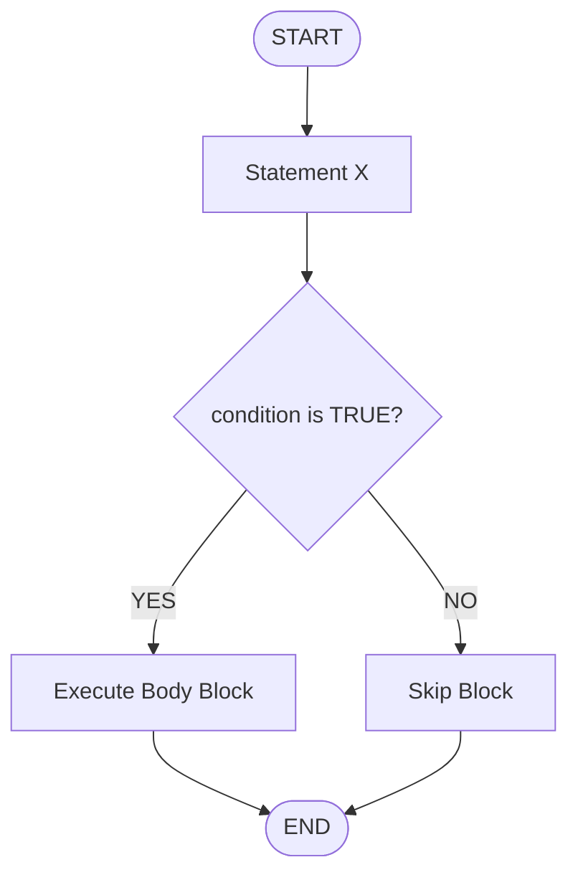
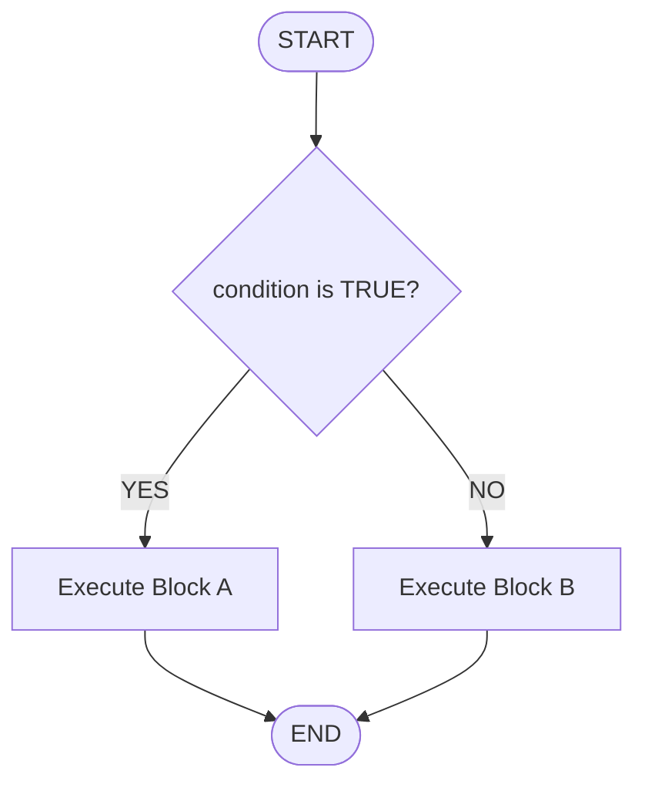
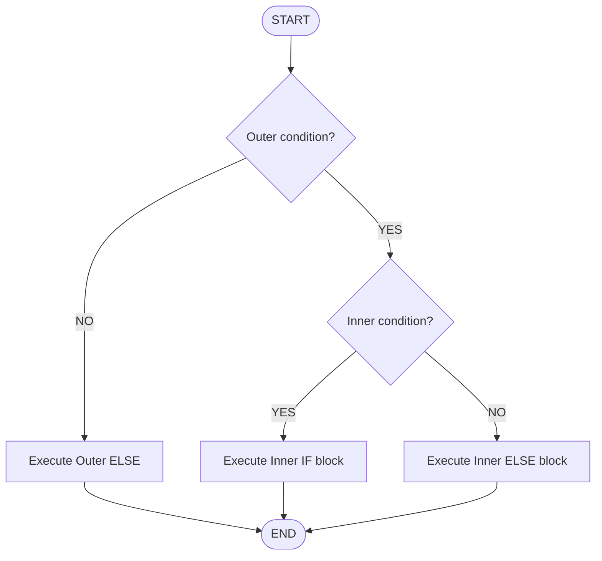
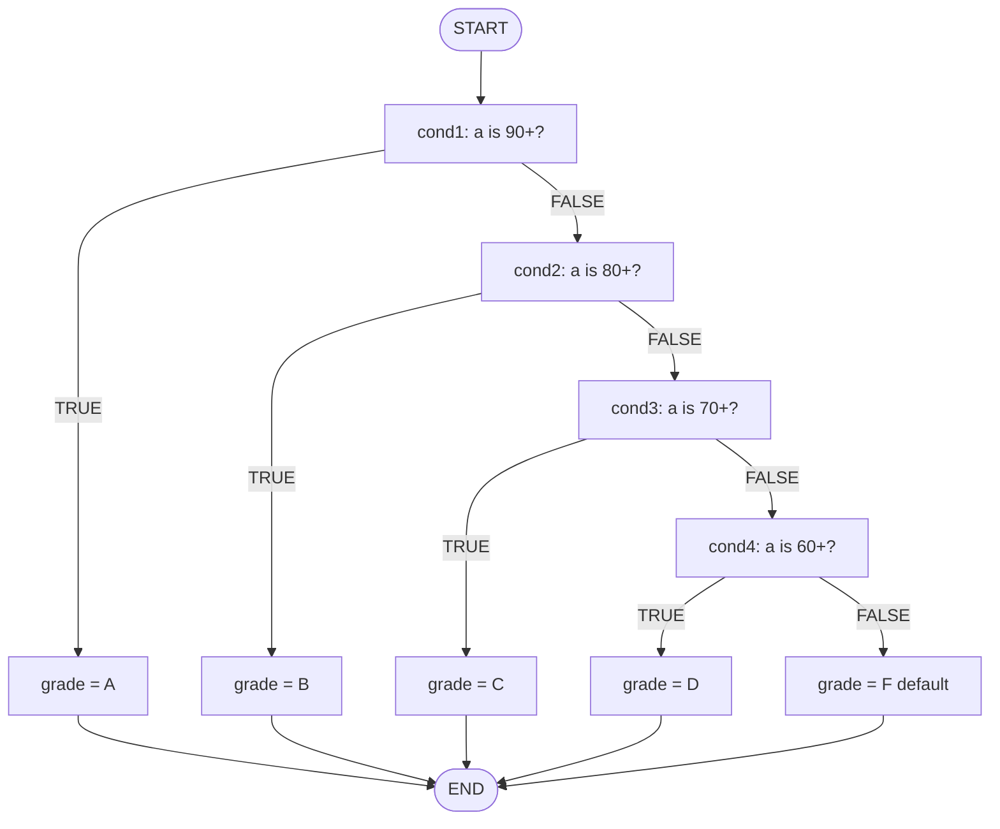
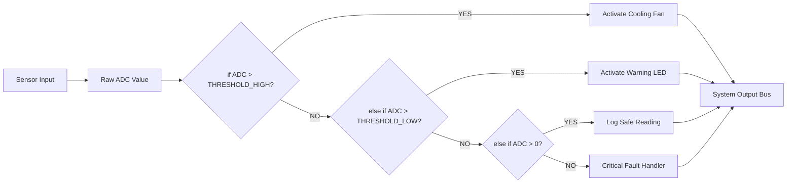
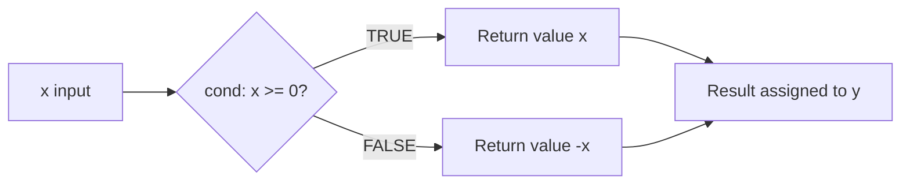
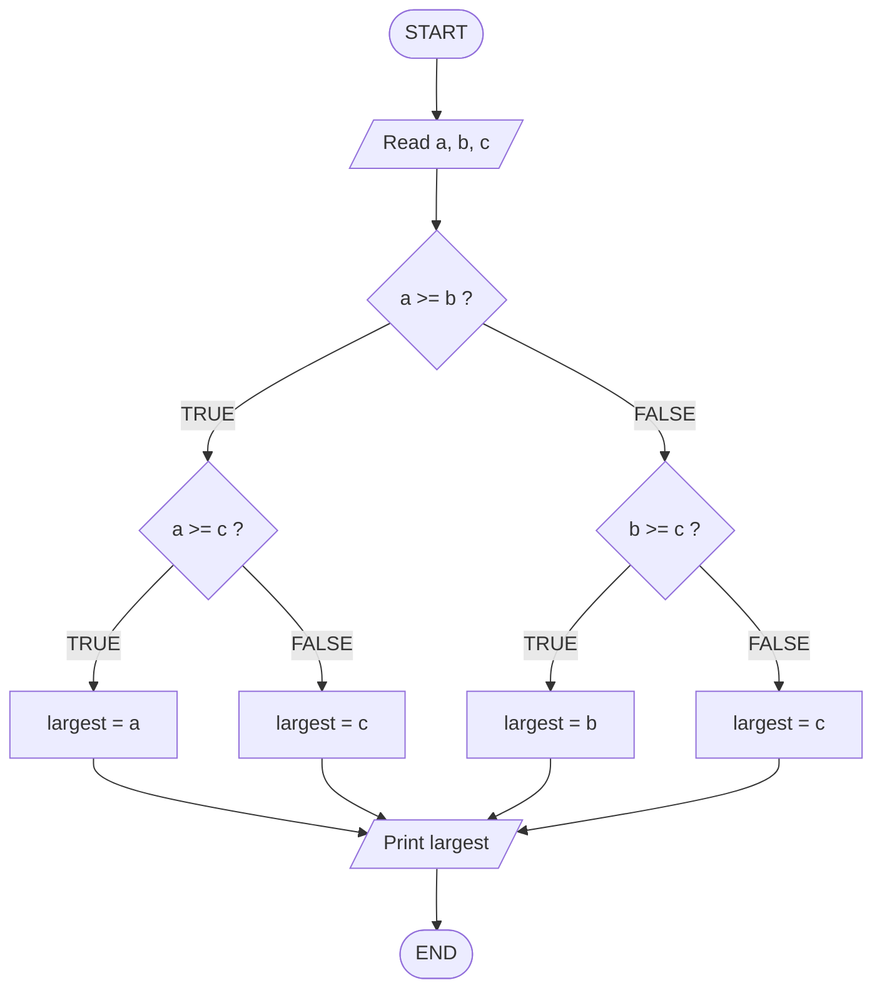

# Control Statements - if

<!-- SECTION_1_START -->
# Control Statements – The `if` Construct in C

## 1.1 Formal Academic Definition (KTU 2024 Syllabus Terminology)

In the C programming language, **control statements** are executable statements that alter the normal sequential flow of program execution by introducing decision-making, repetition, or branching logic. The `if` statement is the most fundamental **selection (decision-making) control statement** in C. It allows the program to evaluate a *Boolean expression* (a condition) and execute a specific block of code only when that condition evaluates to **TRUE (non-zero)**. If the condition evaluates to **FALSE (zero)**, the associated block is skipped, and execution continues with the next statement following the block.

The syntactic forms standardized by the ISO C11 / ISO C17 specifications are:

1. **Simple `if`** – single-branch conditional execution.
2. **`if…else`** – two-way branching.
3. **Nested `if`** – an `if` placed inside another `if` (or `else`).
4. **`else-if` ladder** – multi-way branching across mutually exclusive conditions.
5. **Conditional / Ternary operator `? :`** – compact expression-level decision.

> [!IMPORTANT]
> **KTU 2024 Highlight (Module 1, CO1 – Remember/Understand):**
> In C, **any non-zero value is treated as TRUE** and **zero is treated as FALSE**. There is no dedicated `boolean` data type in classical C (pre-C99); the `_Bool` type and the `<stdbool.h>` header were introduced in **C99**.

---

## 1.2 Conceptual Analogy & Intuition

> [!NOTE]
> **Real-World Analogy — The Railway Signal**
> Imagine you are a train driver approaching a railway junction.
>
> * **Condition** = Is the signal light **GREEN**?
> * **Action when TRUE** = Proceed at full speed on the main track.
> * **Action when FALSE** = Halt, ring the alarm, and switch to the siding.
>
> The `if` statement works exactly like this signal. The C compiler "reads the signal" (evaluates the condition) and decides which track (code block) the program train should follow.

### Geometric Intuition
On a 2-D Cartesian plane, picture the program flow as a horizontal axis of time. A decision (`if`) is a **fork** or **Y-junction**: the flow splits into two divergent paths — one taken when the condition is true, the other skipped when false. After the decision, the paths **re-converge** into a single line of execution.

> [!VISUALIZATION CONTROL]
> **Concept:** Branching topology of a Simple `if` statement
> **GeoGebra / Desmos Input (Boolean Plot):**
> * `f(x) = { 1, x >= 0 ; 0, x < 0 }`  → represents the boolean test
> **Visual Description:** A step function plotted on the XY plane. For every value of `x` (the condition), the output is either 1 (TRUE → execute block) or 0 (FALSE → skip block). The student should observe the sharp vertical jump at `x = 0`, mirroring the binary decision a program makes.

---

## 1.3 Physical Constants & Standard Metrics

| Symbol | Meaning | Value / Convention in C |
|---|---|---|
| `TRUE` | Logical true | Any **non-zero** integer (`1`, `42`, `-7`, etc.) |
| `FALSE` | Logical false | Exactly **0** |
| Relational operators | `<, >, <=, >=, ==, !=` | Yield `1` (true) or `0` (false) |
| Logical operators | `&&` (AND), `\|\|` (OR), `!` (NOT) | Short-circuit evaluated, yield `1` or `0` |

> [!IMPORTANT]
> Always remember: `=` is **assignment**, while `==` is **equality comparison**. Using `=` in an `if` condition is a classic KTU board-exam pitfall because it assigns instead of compares.

<!-- SECTION_1_END -->

<!-- SECTION_2_START -->
# Deep Theoretical Analysis & KTU High-Yield Formula Sheet

## 2.1 Anatomy of the Five `if` Variants in C

### Variant 1 — Simple `if`
**Why it exists:** To conditionally execute a *single* statement or block. **How it works:** The condition is evaluated; if true, the body executes once; otherwise it is bypassed.

```c
if (condition) {
    // statement(s) executed ONLY when condition is TRUE
}
```

### Variant 2 — `if…else`
**Why:** Two-way exclusive decision — exactly one of two blocks must run. **How:** The `else` clause has **no condition**; it captures the *complement* of the `if` test.

```c
if (condition) {
    // Block A — runs when condition is TRUE
} else {
    // Block B — runs when condition is FALSE
}
```

### Variant 3 — Nested `if`
**Why:** To test a *secondary* condition only after a primary one is satisfied. **How:** Place an `if` (optionally with `else`) inside the body of another `if` or `else`.

```c
if (outer_condition) {
    if (inner_condition) {
        // Both must be TRUE
    } else {
        // Outer TRUE, Inner FALSE
    }
} else {
    // Outer FALSE — inner never evaluated
}
```

### Variant 4 — `else-if` Ladder
**Why:** To pick **one** option from a list of mutually exclusive alternatives (e.g., grading systems, menu selection). **How:** Conditions are evaluated top-down; the first TRUE block executes and the rest are **skipped entirely**.

```c
if (cond1)      { /* ... */ }
else if (cond2) { /* ... */ }
else if (cond3) { /* ... */ }
else            { /* default — none matched */ }
```

### Variant 5 — Conditional (Ternary) Operator `? :`
**Why:** A *compact expression* returning a value based on a condition (not a statement). **How:** It is an operator, not a control statement, but it embodies the same logic.

```c
result = (condition) ? value_if_true : value_if_false;
```

---

## 2.2 The "Why" Behind the Logic — Operator Precedence in `if`

In a complex condition such as `if (a > 5 && b < 10 || c == 0)`, C follows strict precedence rules:

| Precedence | Operator | Associativity |
|---|---|---|
| 1 (highest) | `!` (logical NOT) | Right-to-left |
| 2 | `>`, `<`, `>=`, `<=` (relational) | Left-to-right |
| 3 | `==`, `!=` (equality) | Left-to-right |
| 4 | `&&` (logical AND) | Left-to-right |
| 5 (lowest) | `\|\|` (logical OR) | Left-to-right |

> [!TIP]
> **Engineering Best Practice:** Always parenthesize complex conditions even when precedence would yield the correct result. Code is read by humans more than by compilers.

---

## 2.3 KTU Formula / Cheat Sheet

| Construct | Syntax (Generic) | Execution Rule | Time Complexity |
|---|---|---|---|
| Simple `if` | `if (expr) stmt;` | One test, one optional block | $\mathcal{O}(1)$ |
| `if…else` | `if (expr) s1; else s2;` | One test, exactly one of `s1` / `s2` runs | $\mathcal{O}(1)$ |
| Nested `if` | `if (e1) if (e2) …` | Up to $n$ tests in worst case | $\mathcal{O}(n)$ |
| `else-if` ladder (n cases) | `if (e1) … else if (e2) …` | Average $n/2$ tests, worst $n$ | $\mathcal{O}(n)$ |
| Ternary `? :` | `e1 ? e2 : e3;` | One test, returns a value | $\mathcal{O}(1)$ |
| Logical AND `&&` | `e1 && e2` | Short-circuits on first FALSE | $\mathcal{O}(1)$ |
| Logical OR `\|\|` | `e1 \|\| e2` | Short-circuits on first TRUE | $\mathcal{O}(1)$ |

> [!IMPORTANT]
> **Short-Circuit Evaluation:** In `A && B`, if `A` is FALSE, `B` is **not evaluated** at all. This is critical when `B` contains a function call with side effects (e.g., `if (ptr != NULL && ptr->value > 0)`).

---

## 2.4 Real-World Engineering Utility

The `if` construct underpins virtually every layer of production software:

* **Embedded Systems (Kerala IoT / Robotics):** Reading a sensor threshold — `if (temperature > 80) fan_on();`
* **Authentication:** `if (strcmp(password, stored) == 0) grant_access();`
* **Operating Systems:** Scheduler decisions — `if (priority > current_process) preempt();`
* **Machine Learning Inference:** Decision tree nodes — every node is fundamentally an `if` test on a feature.
* **Compiler Design:** Lexical analyzers and parsers use nested `if` cascades to dispatch tokens.

<!-- SECTION_2_END -->

<!-- SECTION_3_START -->
# Step-by-Step Derivations, Worked Examples & C Implementations

## 3.1 Example 1 — Simple `if` (Largest of Two Numbers)

### Problem
Read two integers and print the larger one only if it is strictly greater than the second.

### Full C Implementation (with exhaustive type hints and error handling)

```c
#include <stdio.h>
#include <stdlib.h>
#include <errno.h>

int main(void) {
    int a = 0;
    int b = 0;
    int scan_result = 0;

    printf("Enter two integers separated by a space: ");
    scan_result = scanf("%d %d", &a, &b);

    if (scan_result != 2) {
        fprintf(stderr, "Error: Invalid input. Expected two integers.\n");
        return EXIT_FAILURE;
    }

    if (a > b) {
        printf("Larger value: %d\n", a);
    }

    return EXIT_SUCCESS;
}
```

### Line-by-Line Derivation
1. `#include <stdio.h>` — pulls in `printf`, `scanf`, `fprintf`.
2. `#include <stdlib.h>` — pulls in `EXIT_SUCCESS` / `EXIT_FAILURE`.
3. `#include <errno.h>` — included for completeness (often paired with input validation).
4. `int scan_result = 0;` — stores the number of successful conversions.
5. `scanf("%d %d", &a, &b);` — reads two `int` values. Returns `2` on full success.
6. `if (scan_result != 2)` — robust input validation; if input is non-numeric, we abort.
7. `if (a > b)` — the **decision**. If TRUE, the body executes; if FALSE, control jumps to `return EXIT_SUCCESS;`.

---

## 3.2 Example 2 — `if…else` (Even / Odd Classifier)

### Problem
Determine whether a user-supplied integer is even or odd.

### Mathematical Foundation
A number $n$ is even if and only if $n$ is divisible by 2 with zero remainder:

$$n \bmod 2 = 0 \iff n \text{ is even}$$

In C, the modulus operator `%` returns the remainder. Therefore:

$$\text{Evenness} = \begin{cases} \text{EVEN}, & n \% 2 == 0 \\ \text{ODD}, & \text{otherwise} \end{cases}$$

### Full C Implementation

```c
#include <stdio.h>
#include <stdlib.h>

int main(void) {
    long n = 0L;

    printf("Enter an integer: ");
    if (scanf("%ld", &n) != 1) {
        fprintf(stderr, "Invalid input.\n");
        return EXIT_FAILURE;
    }

    if (n % 2L == 0L) {
        printf("%ld is EVEN.\n", n);
    } else {
        printf("%ld is ODD.\n", n);
    }

    return EXIT_SUCCESS;
}
```

### Step-by-Step Derivation
1. We use `long` to safely accept a wider numeric range than `int`.
2. `n % 2L == 0L` — the `L` suffixes force the literal `2` to be `long`, preventing implicit-promotion warnings.
3. The `if` branch prints EVEN; the `else` branch (which mathematically means `$n \% 2 \neq 0$`) prints ODD.
4. Since every integer is **either** even **or** odd (law of excluded middle), exactly one of the two messages always prints.

---

## 3.3 Example 3 — Nested `if` (Largest of Three Numbers)

### Problem
Read three integers and print the largest.

### Logical Reduction
We compare pairwise, but to avoid ambiguity we use a *strict* nested structure:

$$L = \max(a, b, c)$$

### Full C Implementation

```c
#include <stdio.h>
#include <stdlib.h>

int main(void) {
    int a = 0, b = 0, c = 0, largest = 0;

    printf("Enter three integers: ");
    if (scanf("%d %d %d", &a, &b, &c) != 3) {
        fprintf(stderr, "Invalid input.\n");
        return EXIT_FAILURE;
    }

    if (a >= b) {
        if (a >= c) {
            largest = a;
        } else {
            largest = c;
        }
    } else {
        if (b >= c) {
            largest = b;
        } else {
            largest = c;
        }
    }

    printf("Largest = %d\n", largest);
    return EXIT_SUCCESS;
}
```

### Exhaustive Trace (Truth Table Verification)
| `$a \geq b$` | `$a \geq c$` | Branch Taken | `$L$` |
|:---:|:---:|---|:---:|
| T | T | Outer-T, Inner-T | $a$ |
| T | F | Outer-T, Inner-F | $c$ |
| F | T | Outer-F, Inner-T | $b$ |
| F | F | Outer-F, Inner-F | $c$ |

The truth table covers all $2 \times 2 = 4$ mutually exclusive paths, confirming logical completeness.

---

## 3.4 Example 4 — `else-if` Ladder (Grade Classifier)

### Problem
Map a numeric mark (0–100) to a letter grade.

### Mapping Function

$$
\text{Grade}(m) = \begin{cases}
A, & m \geq 90 \\
B, & 80 \leq m < 90 \\
C, & 70 \leq m < 80 \\
D, & 60 \leq m < 70 \\
F, & m < 60
\end{cases}
$$

### Full C Implementation

```c
#include <stdio.h>
#include <stdlib.h>

int main(void) {
    int mark = 0;
    char grade = 'F';

    printf("Enter mark (0-100): ");
    if (scanf("%d", &mark) != 1 || mark < 0 || mark > 100) {
        fprintf(stderr, "Invalid mark. Must be in [0, 100].\n");
        return EXIT_FAILURE;
    }

    if (mark >= 90) {
        grade = 'A';
    } else if (mark >= 80) {
        grade = 'B';
    } else if (mark >= 70) {
        grade = 'C';
    } else if (mark >= 60) {
        grade = 'D';
    } else {
        grade = 'F';
    }

    printf("Mark = %d  -->  Grade = %c\n", mark, grade);
    return EXIT_SUCCESS;
}
```

### Trace for $m = 75$
1. Test `mark >= 90` → $75 \geq 90$ → **FALSE**, skip.
2. Test `mark >= 80` → $75 \geq 80$ → **FALSE**, skip.
3. Test `mark >= 70` → $75 \geq 70$ → **TRUE**, assign `grade = 'C'`.
4. All subsequent `else if` / `else` are **bypassed** (short-circuit at the ladder level).
5. Output: `Mark = 75  -->  Grade = C`.

> [!IMPORTANT]
> Notice the elegant simplification: in an `else-if` ladder, the *upper bound* of the current test is implicit because the previous test already failed. Writing `mark >= 80 && mark < 90` is **redundant** and a common board-exam time-waster.

---

## 3.5 Example 5 — Ternary Operator (Compact Absolute Value)

### Mathematical Definition
$$|x| = \begin{cases} x, & x \geq 0 \\ -x, & x < 0 \end{cases}$$

### C Implementation

```c
#include <stdio.h>
#include <stdlib.h>

int main(void) {
    int x = 0;
    int abs_x = 0;

    printf("Enter an integer: ");
    if (scanf("%d", &x) != 1) {
        fprintf(stderr, "Invalid input.\n");
        return EXIT_FAILURE;
    }

    abs_x = (x >= 0) ? x : -x;

    printf("|%d| = %d\n", x, abs_x);
    return EXIT_SUCCESS;
}
```

### Step-by-Step Derivation
1. The ternary `? :` is a **right-associative** operator with the form `cond ? expr1 : expr2`.
2. If `x >= 0` is TRUE, the entire expression evaluates to `x`; otherwise to `-x`.
3. Assignment `abs_x = (x >= 0) ? x : -x;` is mathematically equivalent to:

$$
\text{abs\_x} \gets (x \geq 0) \cdot x + (x < 0) \cdot (-x)
$$

<!-- SECTION_3_END -->

<!-- SECTION_4_START -->
# Structural Diagrams & Schematics

## 4.1 Flowchart — Simple `if`



## 4.2 Flowchart — `if…else`



## 4.3 Flowchart — Nested `if` (Inner depends on Outer)



## 4.4 Sequential Processing Topology — `else-if` Ladder



## 4.5 Block-Level Functional Architecture — Decision-Making in an Embedded Controller



## 4.6 Sequential Processing Topology — Ternary Operator Data Flow



<!-- SECTION_4_END -->

<!-- SECTION_5_START -->
# KTU 2024 Scheme Examination Question Bank & Topic Recap

---

## 5.1 Part A — Short Answer Questions (3 Marks Each)

### Question A1 `[KTU University Exam – July 2024]`
**Differentiate between `if` and `if…else` statements in C. Provide one example for each.** *(CO1, Remember)*

**Model Answer (Valuation Key):**
* The simple `if` statement executes a block of code **only when the condition is true**; if the condition is false, control transfers directly to the next statement after the `if` block. *\[1 Mark\]*
* The `if…else` statement provides a **two-way branch**: one block executes when the condition is true, and a *different* block executes when the condition is false, guaranteeing that **exactly one** of the two blocks runs. *\[1 Mark\]*
* Example `if`: `if (x > 0) printf("Positive");`
* Example `if…else`: `if (x > 0) printf("Positive"); else printf("Non-positive");` *\[1 Mark\]*

### Question A2 `[KTU University Exam – Dec 2023]`
**Explain the concept of short-circuit evaluation in C with reference to the logical AND (`&&`) operator.** *(CO1, Understand)*

**Model Answer:**
* In C, the `&&` operator performs **short-circuit (lazy) evaluation**: it evaluates operands from left to right and **stops as soon as the result is determined**. *\[1 Mark\]*
* In `expr1 && expr2`, if `expr1` evaluates to FALSE (zero), then `expr2` is **not evaluated at all** because the overall result must be FALSE regardless of `expr2`. *\[1 Mark\]*
* Practical use: `if (ptr != NULL && ptr->data > 0)` — the dereference `ptr->data` is *only* attempted when `ptr` is non-NULL, preventing segmentation faults. *\[1 Mark\]*

---

## 5.2 Part B — Long Answer Questions (14 Marks Each — Internal Choice)

### Question B1 — Choice A `[KTU University Exam – July 2024]`
**Write a complete C program to read three integers and find the largest using a nested `if` statement. Draw the corresponding flowchart and explain the logic.** *(CO2, Apply — 14 Marks)*

#### (a) Program Implementation (7 Marks)

```c
#include <stdio.h>
#include <stdlib.h>

int main(void) {
    int a = 0, b = 0, c = 0, largest = 0;

    printf("Enter three integers: ");
    if (scanf("%d %d %d", &a, &b, &c) != 3) {
        fprintf(stderr, "Invalid input.\n");
        return EXIT_FAILURE;
    }

    if (a >= b) {
        if (a >= c) {
            largest = a;
        } else {
            largest = c;
        }
    } else {
        if (b >= c) {
            largest = b;
        } else {
            largest = c;
        }
    }

    printf("Largest number = %d\n", largest);
    return EXIT_SUCCESS;
}
```

**Valuation Key:**
* Header inclusion + variable declaration: *\[1 Mark\]*
* Input validation using `scanf` return value: *\[1 Mark\]*
* Outer `if (a >= b)` correctly structured: *\[1 Mark\]*
* Inner `if (a >= c)` for outer-true branch: *\[1 Mark\]*
* `else` block for outer-false with `if (b >= c)`: *\[1 Mark\]*
* Final `else` and `printf` output: *\[1 Mark\]*
* Code compiles, runs, and is properly indented: *\[1 Mark\]*

#### (b) Flowchart (4 Marks) + Logic Explanation (3 Marks)



**Logic Explanation (Valuation Key):**
* The algorithm partitions the solution space into **four mutually exclusive** cases based on the relational comparisons $(a, b)$ and $(a, c)$ or $(b, c)$. *\[1 Mark\]*
* Case 1 ($a \geq b$ AND $a \geq c$): $a$ is the largest. *\[1 Mark\]*
* Case 2 ($a \geq b$ AND $a < c$): $c$ is the largest (since $c > a \geq b$). *\[1 Mark\]*
* Case 3 ($a < b$ AND $b \geq c$): $b$ is the largest. *\[1 Mark\]*
* Case 4 ($a < b$ AND $b < c$): $c$ is the largest. *\[1 Mark\]*
* Hence the value assigned to `largest` covers all four cases — proof of correctness. *\[1 Mark\]*

---

### Question B1 — Choice B `[KTU University Exam – Dec 2023]`
**Write a C program using the `else-if` ladder to classify a person's BMI (Body Mass Index) into Underweight, Normal, Overweight, or Obese categories. Display an appropriate message for each category.** *(CO2, Apply — 14 Marks)*

#### (a) Program Implementation (7 Marks)

```c
#include <stdio.h>
#include <stdlib.h>
#include <math.h>

int main(void) {
    float weight_kg = 0.0f;
    float height_m  = 0.0f;
    float bmi       = 0.0f;

    printf("Enter weight (kg) and height (m): ");
    if (scanf("%f %f", &weight_kg, &height_m) != 2 || height_m <= 0.0f) {
        fprintf(stderr, "Invalid input.\n");
        return EXIT_FAILURE;
    }

    bmi = weight_kg / (height_m * height_m);

    printf("Your BMI = %.2f  -->  ", bmi);

    if (bmi < 18.5f) {
        printf("Underweight\n");
    } else if (bmi < 25.0f) {
        printf("Normal weight\n");
    } else if (bmi < 30.0f) {
        printf("Overweight\n");
    } else {
        printf("Obese\n");
    }

    return EXIT_SUCCESS;
}
```

**Valuation Key:**
* Correct variable types (`float`) and input: *\[1 Mark\]*
* Input validation: *\[1 Mark\]*
* BMI formula $bmi = w / h^2$ correctly implemented: *\[1 Mark\]*
* `if (bmi < 18.5)` — Underweight: *\[1 Mark\]*
* `else if (bmi < 25.0)` — Normal: *\[1 Mark\]*
* `else if (bmi < 30.0)` — Overweight: *\[1 Mark\]*
* Final `else` — Obese (default): *\[1 Mark\]*

#### (b) Classification Justification with Worked Example (7 Marks)

For a sample input of `weight = 70 kg` and `height = 1.75 m`:

$$\text{BMI} = \frac{70}{(1.75)^2} = \frac{70}{3.0625} = 22.86$$

Step-by-step ladder evaluation:

* Test 1: $22.86 < 18.5$ → **FALSE** (skip Underweight).
* Test 2: $22.86 < 25.0$ → **TRUE** → print `"Normal weight"` and exit the ladder.
* Tests 3 and 4 are never reached.

**Valuation Key:**
* Showing the BMI substitution: *\[2 Marks\]*
* Showing the squared-height computation $h^2 = 3.0625$: *\[1 Mark\]*
* Division yielding $22.86$: *\[1 Mark\]*
* Step-by-step ladder evaluation with TRUE/FALSE for each test: *\[2 Marks\]*
* Final category identification: *\[1 Mark\]*

> [!WARNING]
> **KTU Examiner's Valuation Warning — Common Pitfalls:**
> 1. **Missing braces `{}`** — When the `if` body has more than one statement, omitting braces causes only the *first* statement to be conditional. This silently introduces bugs. *\[Loses 2 marks\]*
> 2. **Using `=` instead of `==`** — `if (x = 5)` is a legal C statement that **assigns** 5 to `x` and always evaluates to TRUE. Boards fail candidates who don't catch this.
> 3. **No `else` in nested `if` + dangling-else ambiguity** — Always brace your nested `if` to avoid the compiler attaching your `else` to the wrong `if`.
> 4. **Dangling semicolon** — `if (x > 0);` — the stray semicolon creates an *empty* statement, making the next statement execute unconditionally. *\[Loses 1–2 marks\]*
> 5. **Redundant upper-bound checks in `else-if`** — Writing `else if (mark >= 80 && mark < 90)` is correct but wastes time and may be marked down for verbosity.

---

## 5.3 Topic Recap & Important Things to Remember

* **Five forms of `if`:** simple `if`, `if…else`, nested `if`, `else-if` ladder, ternary `? :`.
* **Truth convention in C:** any **non-zero** value is TRUE; **zero** is FALSE.
* **`=` is assignment, `==` is comparison** — never confuse them inside `if`.
* **Relational operators** (`<`, `>`, `<=`, `>=`) return `1` or `0`.
* **Logical operators** `&&` and `\|\|` are **short-circuit** evaluated.
* **Braces `{}`** are mandatory when the `if` body has multiple statements.
* **`else-if` ladder** evaluates top-down; the first true block wins; remaining blocks are skipped.
* **Nested `if`** can be replaced by logical `&&` to flatten code, e.g., `if (a>0) if (b>0) …` ≡ `if (a>0 && b>0) …`.
* **Ternary `? :`** is an *expression* that returns a value; cannot be used as a full statement-substitute in all scenarios.
* **Dangling-else** problem is solved by always using braces.
* **Single-statement `if` without braces** is legal but discouraged for readability.
* **Time complexity** of a single `if` is $\mathcal{O}(1)$; an $n$-level `else-if` ladder is worst-case $\mathcal{O}(n)$.
* **Best practice:** parenthesize complex conditions, validate user input before testing, and prefer `else-if` ladder over deeply nested `if`s for clarity.

<!-- SECTION_5_END -->
