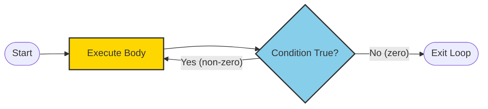
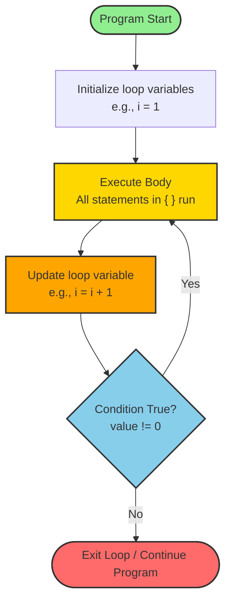
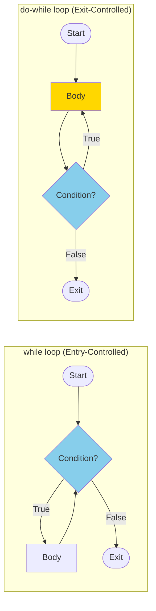
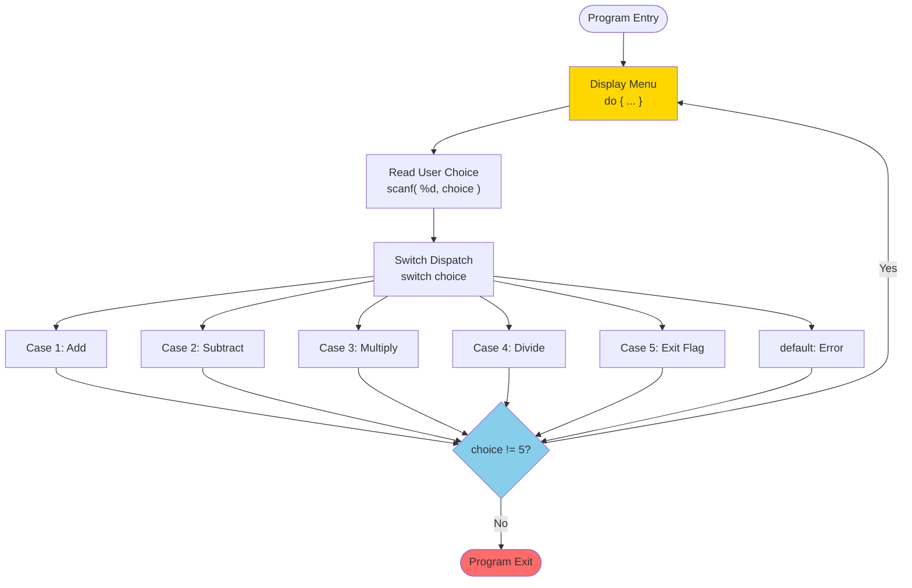
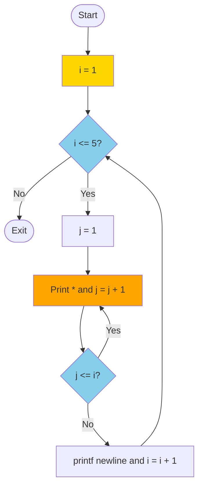
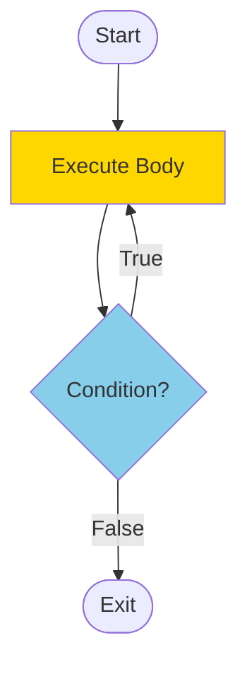

# do-while

<!-- SECTION_1_START -->
# do-while Loop in C — Core Definition & Intuition

> [!NOTE]
> **KTU 2024 Syllabus Hook (Module 1 – C Fundamentals):** The `do-while` statement is classified as an **exit-controlled (post-test) looping construct** in C. It is a high-yield topic for ESE questions on iterative control flow, especially in **menu-driven programs** and **input validation** scenarios.

## Formal Definition

The **`do-while` loop** is an iterative control structure in C in which the body of the loop is executed **at least once** before the loop continuation condition is evaluated. The condition is tested **after** the body executes, making it the only **exit-controlled loop** in standard C (alongside `for` and `while`, which are *entry-controlled*).

### Canonical Syntax
```c
do {
    /* body of the loop */
    /* statements to be repeated */
} while (condition);   /* <-- the semicolon is MANDATORY */
```

The general form is:

$$
\text{do} \; \big\{ \text{statement}_1; \; \text{statement}_2; \; \dots \; \text{statement}_n; \big\} \; \text{while} \; (\text{expression});
$$

Where the parenthesized `expression` is any valid scalar C expression — typically a **relational** or **logical** expression that evaluates to a truthy (non-zero) or falsy (zero) value.

---

## Conceptual Analogy / Intuition

> [!TIP]
> **The "Lunch First, Pay Later" Analogy 🍔**
>
> Imagine you walk into a self-service restaurant. You **first eat your food** (the body executes), and **only then do you check your wallet** to see if you have enough money to pay (`while` condition check). If you have money, you walk out happily and the loop ends. If you don't, you're forced back inside to eat more (the loop iterates).
>
> The key insight: **you ALWAYS eat at least once** — even if your wallet is empty on entry. This is precisely why `do-while` is called an **exit-controlled** loop.

A more programming-oriented mental model:

| Loop Type      | Check Happens... | Minimum Executions | Real-World Use Case                  |
|----------------|------------------|--------------------|--------------------------------------|
| `while`        | Before (entry)   | **0** (may skip entirely) | "While there is milk, keep pouring" |
| `for`          | Before (entry)   | **0** (may skip entirely) | Counting iterations                  |
| **`do-while`** | **After (exit)** | **1** (always runs once)  | Menus, retry-until-valid input       |

---

## Physical Constants & Standard Metrics

> [!IMPORTANT]
> - **Truth value in C:** Any **non-zero** value is *true*; **zero** is *false*. This is a hard-defined standard of the language (K&R / ISO C9899).
> - **Termination value:** The `do-while` loop terminates when the controlling expression evaluates to **0**.
> - **Mandatory terminator:** A **semicolon (`;`)** is required immediately after the closing parenthesis of the `while` clause. Forgetting it is a **frequent compilation error** in KTU lab exams.

---

## Visualization of Execution Flow

> [!VISUALIZATION CONTROL]
> **Concept:** Geometric flow path of a `do-while` loop
> **Coordinate Axes Mapping:**
> * `x-axis` = Sequence of execution steps (time)
> * `y-axis` = Logical state (inside body = high, outside = low)
>
> **Visual Description:** A path that starts at a high plateau (body executing), drops to a single decision diamond at the right edge, then either **loops back to the start** if condition is true, or **exits downward** to the rest of the program. The path **never** starts at the decision diamond.


<!-- SECTION_1_END -->

<!-- SECTION_2_START -->
# Deep Theoretical Analysis & KTU High-Yield Formula Sheet

## Operational Breakdown — How `do-while` Actually Works

The execution of a `do-while` loop follows a **strictly defined, sequential protocol**. The KTU board expects students to write these steps in a logical order, especially when asked to "trace the output" of a code snippet.

### Step-by-Step Execution Logic

1. **Enter the Loop Body Unconditionally**
   The program counter jumps directly into the body block (the statements enclosed in `{ }`). **No condition is checked at this point.** This is the defining feature of the `do-while` construct.

2. **Execute All Statements in the Body Sequentially**
   Each statement inside the body runs from top to bottom in the order written. Local variable declarations, assignments, I/O operations, and nested loops are all valid inside the body.

3. **Evaluate the Controlling Expression**
   After the body's closing brace `}`, control reaches the `while (condition)` clause. The expression inside the parentheses is evaluated **exactly once per iteration**.

4. **Branch Based on the Result**
   - If the result is **non-zero (true)** → control jumps **back to the start** of the `do` block (step 1). The body executes again.
   - If the result is **zero (false)** → control **exits** the loop, and execution continues with the statement immediately following the `while (condition);` line.

5. **Termination Guarantee**
   Because the body executes *before* the check, the loop **guarantees at least one execution** of the body — even if the condition is false on the very first encounter.

---

## Structural Anatomy of the Construct

$$
\underbrace{\text{do}}_{\text{loop keyword}} \;
\underbrace{\{ \; \text{body} \; \}}_{\text{compound statement}} \;
\underbrace{\text{while}}_{\text{condition keyword}} \;
\underbrace{(\text{condition})}_{\text{controlling expression}} \;
\underbrace{;}_{\text{statement terminator}}
$$

### Critical Syntactic Rules

| Rule # | Rule Description                                                                                  | KTU Exam Weight |
|--------|---------------------------------------------------------------------------------------------------|-----------------|
| 1      | The **semicolon** after `while(condition)` is **mandatory**; missing it = compile error.          | 🔴 High         |
| 2      | The body may be a **single statement** without braces (discouraged but legal).                    | 🟡 Medium       |
| 3      | The `condition` may be a **comma expression**, but the result of the **rightmost** operand is tested. | 🟢 Low          |
| 4      | Variables used in the condition should typically be **modified inside the body** to ensure termination. | 🔴 High         |
| 5      | A `do-while` loop can be **nested** inside another `do-while`, `while`, or `for` loop.            | 🟡 Medium       |
| 6      | `break` exits the loop early; `continue` skips the rest of the body and re-tests the condition.    | 🟡 Medium       |

---

## KTU Formula / Cheat Sheet

> [!IMPORTANT]
> The table below is your **one-stop revision sheet** for any `do-while` question in the KTU ESE.

| Aspect                     | Specification                                                                             | KTU-Mandated Memory Hook         |
|----------------------------|-------------------------------------------------------------------------------------------|----------------------------------|
| Loop Classification        | **Exit-controlled (post-test) loop**                                                       | "Check at the exit door"          |
| Minimum Iterations         | $\mathbf{n_{min} = 1}$                                                                     | "Always runs once"                |
| Maximum Iterations         | $\mathbf{n_{max} = \infty}$ (if condition never becomes 0)                                | Risk of infinite loop             |
| Syntax Template            | `do { body; } while(expr);`                                                                | Note the trailing `;`             |
| Condition Truth Value      | $\text{true} \iff \text{expr} \neq 0$                                                     | "Non-zero = true in C"            |
| Condition False Value      | $\text{false} \iff \text{expr} = 0$                                                        | "Only zero is false"              |
| Termination Condition      | Loop ends when $\text{expr} \rightarrow 0$                                                  | Watch for variable update in body |
| Best Use Case              | **Menu-driven programs, input validation, retry logic**                                    | "Do first, validate later"        |
| Common Pitfall             | Forgetting semicolon after `while()` → compile-time error                                   | "The lonely semicolon matters"    |
| Contrast with `while`      | `while` checks **first**, may execute **zero** times                                        | Entry vs Exit controlled          |

---

## Real-World Engineering Utility

> [!TIP]
> The `do-while` loop is **ubiquitous in production-grade systems software**:
>
> - **Embedded Systems:** A sensor reading must be **taken at least once** before being validated against a threshold. Example: `do { reading = ADC_Read(); } while(reading == SENSOR_ERROR);`
> - **Network Protocols:** TCP retransmission logic — *send a packet, then check if ACK arrived; if not, retransmit*.
> - **Game Development:** The main game loop is conceptually a `do-while` — *render one frame, then check if the player quit*.
> - **Database Engines:** Re-try a failed transaction until it succeeds or a max-retry count is hit.
> - **Banking Software:** ATM PIN entry — *ask for PIN, then validate; if wrong, ask again*.
>
> KTU specifically tests the **menu-driven program** use case because it directly demonstrates the "execute once, then loop" property.
<!-- SECTION_2_END -->

<!-- SECTION_3_START -->
# Step-by-Step Derivations & Code Implementation

> [!NOTE]
> The following code samples are **fully compilable** with any standard C compiler (GCC, Clang, MSVC). Each program is **exhaustively explained** — no steps are skipped, no logic is elided.

---

## Example 1 — Basic Counter (Print 1 to 5)

This is the canonical introductory program that every KTU textbook uses to introduce `do-while`.

```c
#include <stdio.h>

int main(void) {
    int i = 1;                   /* Step 1: Initialize the loop control variable */

    do {
        printf("%d ", i);        /* Step 2: Body — print current value of i */
        i = i + 1;               /* Step 3: Increment i by 1  (update step) */
    } while (i <= 5);            /* Step 4: Test condition AFTER body executes */

    printf("\nLoop finished.\n");
    return 0;
}
```

### Exhaustive Dry Run (Trace Table)

Let $i$ be the loop variable. We trace each iteration explicitly:

| Iteration # | Value of $i$ at body entry | Printed Output | Value of $i$ after `i = i + 1` | Condition $i \leq 5$ | Next Action      |
|:-----------:|:--------------------------:|:--------------:|:------------------------------:|:--------------------:|:-----------------|
| 1           | $1$                        | `1`            | $2$                            | $2 \leq 5 \rightarrow \text{true}$  | Loop again        |
| 2           | $2$                        | `2`            | $3$                            | $3 \leq 5 \rightarrow \text{true}$  | Loop again        |
| 3           | $3$                        | `3`            | $4$                            | $4 \leq 5 \rightarrow \text{true}$  | Loop again        |
| 4           | $4$                        | `4`            | $5$                            | $5 \leq 5 \rightarrow \text{true}$  | Loop again        |
| 5           | $5$                        | `5`            | $6$                            | $6 \leq 5 \rightarrow \text{false}$ | **Exit loop**     |

### Final Output
```
1 2 3 4 5 
Loop finished.
```

---

## Example 2 — The "At Least Once" Demonstration

This is the **single most important program** to prove the post-test property. It is a **favorite KTU question**.

```c
#include <stdio.h>

int main(void) {
    int x = 10;                  /* x starts at 10 */

    do {
        printf("x = %d\n", x);   /* Body prints BEFORE the check */
        x = x - 1;               /* Decrement x */
    } while (x < 5);             /* Condition: is x less than 5? */

    return 0;
}
```

### Trace Table

Starting with $x = 10$:

| Iteration | $x$ at body entry | Printed       | $x$ after decrement | $x < 5$?    | Next Action   |
|:---------:|:-----------------:|:-------------:|:-------------------:|:-----------:|:-------------:|
| 1         | $10$              | `x = 10`      | $9$                 | $9 < 5 \rightarrow \text{false}$ | **Exit** |

### Final Output
```
x = 10
```

### Critical Insight

> [!IMPORTANT]
> Even though the condition $x < 5$ is **false on the very first test** (since $x = 9$ after decrement), the body still ran **once** and printed `x = 10`. If this were a `while` loop with the same condition, **nothing would have been printed**. This contrast is a guaranteed KTU exam question.

---

## Example 3 — Menu-Driven Program (The KTU Gold-Standard Use Case)

This is the **production-grade application** of `do-while`. KTU loves this question because it combines loops, `switch-case`, and `break`.

```c
#include <stdio.h>

int main(void) {
    int choice;
    float a, b, result;

    do {
        /* Display menu */
        printf("\n===== SIMPLE CALCULATOR =====\n");
        printf("1. Addition\n");
        printf("2. Subtraction\n");
        printf("3. Multiplication\n");
        printf("4. Division\n");
        printf("5. Exit\n");
        printf("Enter your choice (1-5): ");
        scanf("%d", &choice);

        /* Process choice */
        switch (choice) {
            case 1:
                printf("Enter two numbers: ");
                scanf("%f %f", &a, &b);
                result = a + b;
                printf("Result = %.2f\n", result);
                break;
            case 2:
                printf("Enter two numbers: ");
                scanf("%f %f", &a, &b);
                result = a - b;
                printf("Result = %.2f\n", result);
                break;
            case 3:
                printf("Enter two numbers: ");
                scanf("%f %f", &a, &b);
                result = a * b;
                printf("Result = %.2f\n", result);
                break;
            case 4:
                printf("Enter two numbers: ");
                scanf("%f %f", &a, &b);
                if (b != 0) {
                    result = a / b;
                    printf("Result = %.2f\n", result);
                } else {
                    printf("Error: Division by zero!\n");
                }
                break;
            case 5:
                printf("Exiting program. Goodbye!\n");
                break;
            default:
                printf("Invalid choice! Please enter 1-5.\n");
        }
    } while (choice != 5);   /* Loop continues until user picks Exit */

    return 0;
}
```

### Why `do-while` and NOT `while` Here?

> [!TIP]
> The menu **must be displayed at least once** — the user has not seen it before the program starts. If we used a `while` loop with the condition `choice != 5`, and the user immediately entered `5`, the menu would never display. With `do-while`, the menu is **guaranteed** to show first.

---

## Example 4 — Input Validation (Retry-Until-Valid Pattern)

```c
#include <stdio.h>

int main(void) {
    int password;

    do {
        printf("Enter a positive password (must be > 100): ");
        scanf("%d", &password);

        if (password <= 100) {
            printf("Invalid! Try again.\n");
        }
    } while (password <= 100);   /* Keep looping while invalid */

    printf("Password accepted: %d\n", password);
    return 0;
}
```

### Sample Run
```
Enter a positive password (must be > 100): 50
Invalid! Try again.
Enter a positive password (must be > 100): -10
Invalid! Try again.
Enter a positive password (must be > 100): 250
Password accepted: 250
```

---

## Example 5 — Nested `do-while` (Pattern Printing)

This is a **classic 14-mark KTU question** that tests nested iteration.

```c
#include <stdio.h>

int main(void) {
    int i = 1, j;

    do {
        j = 1;                              /* Reset inner counter each outer pass */
        do {
            printf("* ");
            j = j + 1;
        } while (j <= i);                   /* Inner loop: print i stars */
        printf("\n");
        i = i + 1;
    } while (i <= 5);                       /* Outer loop: 5 rows */

    return 0;
}
```

### Final Output
```
* 
* * 
* * * 
* * * * 
* * * * * 
```

### Trace of Outer Loop (Row Generation)

For row $i$, the inner loop executes $i$ times:

$$
\text{Stars in row } i = i \quad \text{for} \; i = 1, 2, 3, 4, 5
$$

Total stars printed:
$$
N_{total} = \sum_{i=1}^{5} i = 1 + 2 + 3 + 4 + 5 = 15
$$

---

## Example 6 — Use of `break` and `continue` inside `do-while`

```c
#include <stdio.h>

int main(void) {
    int n = 0;

    do {
        n = n + 1;

        if (n == 3) {
            continue;           /* Skip the rest of THIS iteration */
        }
        if (n == 7) {
            break;              /* Exit the loop entirely */
        }

        printf("%d ", n);
    } while (n < 10);

    printf("\nDone. Final n = %d\n", n);
    return 0;
}
```

### Final Output
```
1 2 4 5 6 
Done. Final n = 7
```

### Behavior Analysis

- When $n = 3$, the `continue` statement skips `printf` and jumps **directly to the condition test** (`n < 10`). The value $3$ is not printed.
- When $n = 7$, the `break` statement **exits the loop entirely**, bypassing the condition test.
<!-- SECTION_3_END -->

<!-- SECTION_4_START -->
# Structural Diagrams & Schematics

## Diagram 1 — Execution Flow of `do-while` (Detailed)



### Reading the Diagram

- The **green node** marks program entry.
- The **gold "Body" node** executes first — there is **no gate** before it. This visually proves the post-test property.
- The **blue decision diamond** sits at the **end** of the cycle (right side), not the beginning.
- The **red exit node** is reached only when the condition evaluates to zero.

---

## Diagram 2 — `while` vs `do-while` Side-by-Side Comparison



### Key Takeaway

> [!IMPORTANT]
> - In `while`, the **condition diamond comes BEFORE** the body.
> - In `do-while`, the **body comes BEFORE** the condition diamond.
> - This **single positional swap** is the entire conceptual difference.

---

## Diagram 3 — Block-Level Processing Topology for Menu-Driven Programs



This topology shows how the **menu display and the condition test form a feedback loop**, while the **switch-cases are one-way branches** that always return to the condition check.

---

## Diagram 4 — Nested `do-while` Loop Structure (Pattern Printing)


<!-- SECTION_4_END -->

<!-- SECTION_5_START -->
# KTU 2024 Scheme Examination Question Bank & Topic Recap

---

## Part A — Short Answer Questions (2 × 3 = 6 Marks)

> **Cognitive Levels Tested:** Remember / Understand

### Question 1 `[KTU University Exam - July 2024]`
**Differentiate between a `while` loop and a `do-while` loop in C. Mention any two differences.** *(3 Marks, CO1, Understand)*

#### Model Answer (Valuation Key)

| # | Point to Mention                                                                  | Marks |
|---|-----------------------------------------------------------------------------------|-------|
| 1 | `while` is an **entry-controlled** loop; `do-while` is an **exit-controlled** loop. | 1     |
| 2 | In `while`, the condition is tested **before** body execution; in `do-while`, it is tested **after**. | 1     |
| 3 | `while` may execute the body **zero or more** times; `do-while` executes the body **at least once**. | 1     |

> [!NOTE]
> Mentioning the **semicolon** after `while(condition)` in `do-while` (which is absent in `while`) can earn a bonus point if the answer is otherwise complete.

---

### Question 2 `[KTU University Exam - Dec 2023]`
**Write the general syntax of a `do-while` loop in C. Why is the semicolon after the `while` condition mandatory?** *(3 Marks, CO1, Remember)*

#### Model Answer (Valuation Key)

**Syntax (2 Marks):**
```c
do {
    statement_1;
    statement_2;
    /* ... */
    statement_n;
} while (condition);
```

**Explanation of the semicolon (1 Mark):**
The `do-while` construct is a **single C statement** (a compound statement terminated as a whole). The semicolon is the **statement terminator** in C. It signals the end of the iterative statement to the compiler. Omitting it leads to a **compile-time error**: *"expected ';' before 'return'"* or similar.

---

## Part B — Long Answer Questions (Module Internal Choice: 14 Marks)

> **Cognitive Levels Tested:** Understand / Apply / Analyze
> Each question has two sub-parts of **7 marks each**, mapped to escalating cognitive levels.

---

### Question A `[KTU University Exam - Dec 2024]`
**Part (a):** Explain the working of a `do-while` loop with a neat flowchart. State two situations where `do-while` is preferred over `while`. *(7 Marks, CO2, Understand)*

**Part (b):** Write a C program using a `do-while` loop to repeatedly read an integer from the user until the user enters a **negative number**. After the loop ends, display the **sum of all positive numbers** entered. *(7 Marks, CO3, Apply)*

#### Model Solution

##### Part (a) — Explanation + Flowchart (7 Marks)

**Working of `do-while` (3 Marks):**
The `do-while` loop is an **exit-controlled** iterative statement in C. Its execution sequence is:

1. The body of the loop is executed **first**, without any condition check.
2. After the body finishes, the **condition** specified in `while(...)` is evaluated.
3. If the condition is **true (non-zero)**, control transfers back to the start of the `do` block.
4. If the condition is **false (zero)**, the loop terminates and control passes to the next statement after the loop.

**Flowchart (2 Marks):**


**Two situations where `do-while` is preferred (2 Marks):**

1. **Menu-driven programs:** The menu must be displayed at least once before the user makes a choice, so the body must execute before testing the exit condition.
2. **Input validation:** The user must be prompted at least once for input before the validity of that input can be checked.

##### Part (b) — C Program (7 Marks)

```c
#include <stdio.h>

int main(void) {
    int num;
    int sum = 0;

    do {
        printf("Enter an integer (negative to stop): ");
        scanf("%d", &num);

        if (num > 0) {
            sum = sum + num;        /* Add to sum only if positive */
        }
    } while (num >= 0);            /* Continue while input is non-negative */

    printf("Sum of all positive numbers entered = %d\n", sum);
    return 0;
}
```

**Sample Execution Trace:**

Let the inputs be $4, 7, 3, -1$. The trace is:

| Iteration | Input `num` | `num > 0`? | `sum` update                  | `num >= 0`? | Action     |
|:---------:|:-----------:|:----------:|:-----------------------------:|:-----------:|:----------:|
| 1         | $4$         | Yes        | $\text{sum} = 0 + 4 = 4$      | $4 \geq 0 \rightarrow \text{true}$  | Loop        |
| 2         | $7$         | Yes        | $\text{sum} = 4 + 7 = 11$     | $7 \geq 0 \rightarrow \text{true}$  | Loop        |
| 3         | $3$         | Yes        | $\text{sum} = 11 + 3 = 14$    | $3 \geq 0 \rightarrow \text{true}$  | Loop        |
| 4         | $-1$        | No         | $\text{sum} = 14$ (unchanged) | $-1 \geq 0 \rightarrow \text{false}$ | **Exit**   |

**Final Output:** `Sum of all positive numbers entered = 14`

**Valuation Key for Part (b):**
- [Including `<stdio.h>` and using `int main(void)`: 1 Mark]
- [Correct `do-while` syntax with semicolon: 2 Marks]
- [Logic for accumulating positive numbers: 2 Marks]
- [Correct termination condition and final `printf`: 1 Mark]
- [Code formatting and indentation: 1 Mark]

---

### Question B `[KTU University Exam - July 2024]`
**Part (a):** Compare `for`, `while`, and `do-while` loops in C with respect to: (i) condition check position, (ii) minimum number of executions, (iii) typical use case. *(7 Marks, CO1, Understand)*

**Part (b):** Write a C program using a `do-while` loop that asks the user to guess a **secret number (say 42)**. Provide feedback ("Too high" / "Too low") on each wrong guess. The loop should terminate only when the user guesses correctly. Count and display the number of attempts. *(7 Marks, CO3, Apply)*

#### Model Solution

##### Part (a) — Comparative Analysis (7 Marks)

| Criterion                       | `for` loop                                                                 | `while` loop                                                          | `do-while` loop                                                       |
|---------------------------------|----------------------------------------------------------------------------|------------------------------------------------------------------------|------------------------------------------------------------------------|
| (i) Condition check position    | **Before** body (entry-controlled)                                          | **Before** body (entry-controlled)                                     | **After** body (exit-controlled)                                       |
| (ii) Minimum executions         | $\mathbf{0}$ (body may not run at all)                                      | $\mathbf{0}$ (body may not run at all)                                 | $\mathbf{1}$ (body always runs at least once)                          |
| (iii) Typical use case          | When the **number of iterations is known** in advance                       | When iterations depend on a **runtime condition**                      | When body **must execute at least once** (menus, validation)           |
| Initialization form             | Built-in: `for(init; cond; update)`                                         | External: `init` before loop                                           | External: `init` before loop                                            |
| Semicolon after condition       | **None** (semicolons are *part* of the `for` syntax)                        | **None**                                                               | **Required** (terminates the `do-while` statement)                     |

**Valuation Key for Part (a):**
- [(i) Correctly identifying entry vs. exit control: 2 Marks]
- [(ii) Correctly stating minimum execution count for all three: 2 Marks]
- [(iii) Providing accurate typical use cases: 2 Marks]
- [Presenting in tabular/comparative format: 1 Mark]

##### Part (b) — Number Guessing Game (7 Marks)

```c
#include <stdio.h>

int main(void) {
    int secret = 42;
    int guess;
    int attempts = 0;

    do {
        printf("Guess the secret number: ");
        scanf("%d", &guess);
        attempts = attempts + 1;

        if (guess > secret) {
            printf("Too high! Try again.\n");
        } else if (guess < secret) {
            printf("Too low! Try again.\n");
        } else {
            printf("Correct! You guessed it in %d attempts.\n", attempts);
        }
    } while (guess != secret);

    return 0;
}
```

**Sample Execution Trace:**

Suppose the user's guesses are: $50, 30, 45, 42$.

| Attempt # | `guess` | `guess > 42`? | `guess < 42`? | Output              | `guess != 42`? | Action   |
|:---------:|:-------:|:-------------:|:-------------:|:--------------------|:--------------:|:--------:|
| 1         | $50$    | Yes           | —             | `Too high!`         | True           | Loop     |
| 2         | $30$    | —             | Yes           | `Too low!`          | True           | Loop     |
| 3         | $45$    | Yes           | —             | `Too high!`         | True           | Loop     |
| 4         | $42$    | No            | No            | `Correct!`          | False          | **Exit** |

**Final Output:** `Correct! You guessed it in 4 attempts.`

**Valuation Key for Part (b):**
- [Correct `do-while` structure: 2 Marks]
- [Logic to compare guess with secret and give feedback: 2 Marks]
- [Attempt counter increment logic: 1 Mark]
- [Correct termination on correct guess + final display: 1 Mark]
- [Code compiles and is properly indented: 1 Mark]

---

## KTU Examiner's Valuation Warning / Pitfall Callout

> [!WARNING]
> **Common mistakes that cost marks in `do-while` questions:**
>
> 1. **Forgetting the semicolon** after `while(condition);` — this is a **syntax error** and will cost **2 marks** in a "write the program" question. Always end the construct with `;`.
>
> 2. **Writing the condition BEFORE the body** in the answer — students sometimes confuse `do-while` with `while` under exam pressure. The condition **must come after** the closing brace of the body.
>
> 3. **Initializing the loop variable AFTER the `do` keyword** — the `do` keyword must be **immediately followed by the body**, not by an initialization statement. Initialization goes **before** the loop.
>
> 4. **Not updating the loop variable inside the body** — leads to an **infinite loop**. KTU examiners will deduct at least **1 mark** for this in tracing questions.
>
> 5. **Forgetting that the body executes at least once** — in trace questions, students often skip the first execution thinking the condition is checked first. **Always execute the body once before testing.**
>
> 6. **Wrong use of braces** — for a single-statement body, braces are optional, but using them is **always safer** and looks more professional to the examiner.

---

## Topic Recap & Important Things to Remember

> [!IMPORTANT]
> **Rapid Revision Checklist for `do-while` Loop in C**

- **Definition:** The `do-while` loop is an **exit-controlled (post-test) iterative statement** in C.
- **Minimum iterations:** Body runs **at least once**, guaranteed by language definition.
- **Canonical syntax:** `do { body; } while (condition);` — note the **mandatory trailing semicolon**.
- **Truth rule in C:** Any **non-zero** expression is `true`; only **zero** is `false`.
- **Termination:** Loop exits when the controlling expression evaluates to `0`.
- **Primary use cases:** **Menu-driven programs**, **input validation**, **retry-until-success** patterns, **game loops**.
- **Contrast with `while`:** `while` checks condition *first* (entry-controlled, may skip body); `do-while` checks *after* (exit-controlled, body always runs).
- **Contrast with `for`:** `for` is best when iteration count is known; `do-while` is best when the body must run at least once.
- **`break` usage:** Exits the `do-while` loop immediately, bypassing the condition test.
- **`continue` usage:** Skips the rest of the current body and jumps directly to the **condition test** (not back to the body start — this is a subtle but important point).
- **Nesting:** `do-while` loops can be nested within one another, with proper brace matching and indentation.
- **Infinite loop risk:** If the body never modifies a variable used in the condition, the loop runs forever. Always ensure **progress toward termination**.
- **Tracing tip:** When asked to trace output, always perform **at least one body execution** before testing the condition — this is the hallmark of `do-while`.
- **KTU favorite question pattern:** "Use a `do-while` loop to display a menu and process the user's choice until they select the exit option." Be ready to write this in under 10 minutes.
- **Code style mandate:** Always include `<stdio.h>`, use `int main(void)`, and return `0` at the end. KTU lab exams require strict adherence to ANSI C conventions.
<!-- SECTION_5_END -->
