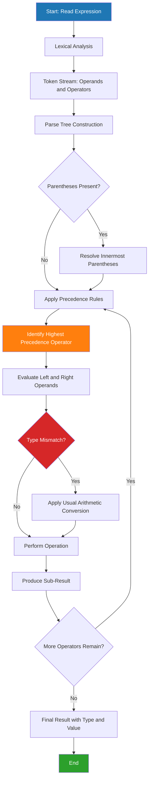
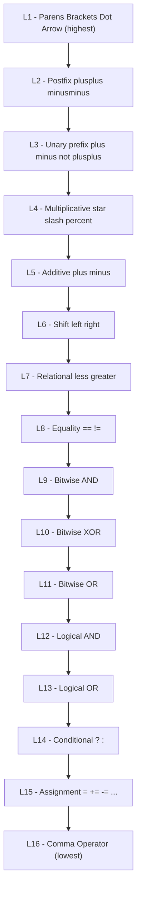
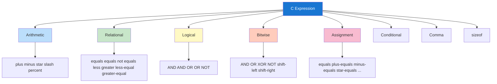
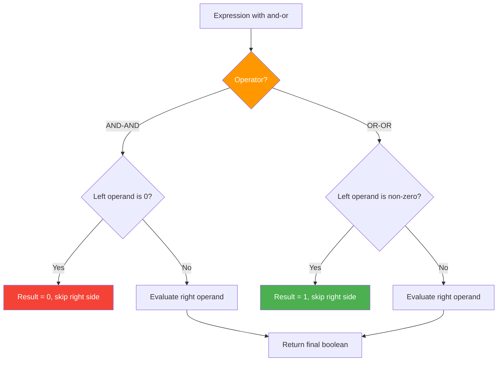

# Expressions

<!-- SECTION_1_START -->
# Expressions in C — Core Technical Definition & Intuitive Overview

## Formal KTU 2024 Definition

> [!NOTE]
> **Expression (KTU 2024 Syllabus Definition):** An *expression* in C is a valid combination of **operators**, **operands**, and **parentheses** that the compiler evaluates to produce a **single value** of a specific data type. Every expression has a **type** and a **value**, and its evaluation may produce **side effects** (e.g., modifying a variable through `++` or assignment).

In the C language, an expression is the fundamental computational unit. The C11/ISO standard (adopted by KTU 2024 scheme) defines an expression as *"a sequence of operators and operands that specifies a computation."* Operands may be **constants**, **variables**, **function calls**, or **sub-expressions** themselves.

## Conceptual Analogy / Intuition

> [!IMPORTANT]
> Think of an expression as a **cooking recipe**:
> - **Operands** = *Ingredients* (numbers, variables, values)
> - **Operators** = *Actions* (add, subtract, compare, assign)
> - **Parentheses** = *Step ordering* (do this first, then that)
> - **Result** = *The final dish* (one single value of a specific type)

Just as a chef reads a recipe **left-to-right with priority rules** (peel before chopping, chop before cooking), C evaluates expressions using **precedence** and **associativity**. Even a single constant or variable like `x` is technically a valid expression — it evaluates to itself.

## Classification of Expressions (KTU Module 1 Syllabus)

| Category | Example | Result Type |
|----------|---------|-------------|
| Constant Expression | `42`, `3.14`, `'A'` | int / double / char |
| Arithmetic Expression | `a + b * c` | Numeric |
| Relational Expression | `x >= y` | int (0 or 1) |
| Logical Expression | `p && q` | int (0 or 1) |
| Assignment Expression | `x = y + 5` | Type of LHS |
| Conditional Expression | `a > b ? a : b` | Type of selected branch |
| Comma Expression | `(x=1, y=2, x+y)` | Type of last sub-expression |
| Bitwise Expression | `m & n`, `p << 2` | Integer type |

## Key Physical Constants and Standard Metrics

> [!IMPORTANT]
> - **Logical TRUE** in C is represented by the integer **`1`** (not any non-zero value at the comparison level — see below).
> - **Logical FALSE** is represented by **`0`**.
> - The header `<stdbool.h>` (C99+) provides symbolic names `true` and `false`, both expanding to **`1`** and **`0`** respectively.
> - **Operator precedence level** ranges from **1 (lowest)** to **15 (highest)** in the C standard's precedence table.

> [!VISUALIZATION CONTROL]
> **Concept:** Expression evaluation as a directed flow of values
> **Conceptual Input (pseudocode for a step-graph):**
> * `Input variables: a = 8, b = 3, c = 2`
> * `Expression: result = a + b * c > a - b`
> **Visual Description:** Imagine a tree where leaves are the operands `8, 3, 2, 8, 3` and internal nodes are `*`, `+`, `-`, `>`. Evaluation flows bottom-up: `b*c=6`, `a+6=14`, `a-b=5`, `14>5 → 1`. The final result `1` propagates to the root.
<!-- SECTION_1_END -->

<!-- SECTION_2_START -->
# Deep Theoretical Analysis & KTU High-Yield Formula Sheet

## 1. Anatomy of an Expression

A C expression is built from these atomic pieces:
1. **Operands** — Constants (`10`, `2.5`), variables (`x`), function calls (`getchar()`), or sub-expressions.
2. **Operators** — Symbols denoting the operation (`+`, `-`, `*`, `/`, `%`, `==`, `&&`, etc.).
3. **Parentheses** — `(` `)` for grouping and altering default precedence.

> [!NOTE]
> Every expression in C has **three properties**:
> 1. A **type** (determined at compile time)
> 2. A **value** (determined at run time)
> 3. Possibly a **side effect** (e.g., modification of storage)

## 2. Categories of Operators

### 2.1 Based on Number of Operands

| Category | Operators | Example |
|----------|-----------|---------|
| **Unary** (1 operand) | `+`, `-`, `++`, `--`, `!`, `~`, `*` (deref), `&` (addr), `sizeof` | `-x`, `!flag`, `p++` |
| **Binary** (2 operands) | `+`, `-`, `*`, `/`, `%`, `==`, `!=`, `<`, `>`, `<=`, `>=`, `&&`, `\|\|`, `&`, `\|`, `^`, `<<`, `>>`, `=`, `+=`, ... | `a + b`, `x < y` |
| **Ternary** (3 operands) | `? :` | `a > b ? a : b` |

### 2.2 Based on Function

| Family | Members | Purpose |
|--------|---------|---------|
| Arithmetic | `+ - * / %` | Numeric computation |
| Relational | `== != < > <= >=` | Comparison (yields 0/1) |
| Logical | `&& \|\| !` | Boolean combination (short-circuit) |
| Bitwise | `& \| ^ ~ << >>` | Bit-level manipulation |
| Assignment | `= += -= *= /= %= &= \|= ^= <<= >>=` | Store result |
| Increment/Decrement | `++ --` | Modify by 1 |
| Conditional | `? :` | Inline if-else |
| Comma | `,` | Sequence of evaluations |
| sizeof | `sizeof` | Type/variable size in bytes |

## 3. KTU High-Yield Formula Sheet — Operator Precedence & Associativity

> [!IMPORTANT]
> Memorize the table **top-down**: higher rows = higher precedence (bind tighter). When operators have the same precedence, **associativity** decides left-to-right or right-to-left direction.

| Precedence | Operator | Description | Associativity |
|:----------:|----------|-------------|:-------------:|
| **1** | `()` `[]` `->` `.` | Postfix / Function call / Subscript | Left → Right |
| 2 | `++` `--` (postfix) | Post-increment / decrement | Left → Right |
| 3 | `++` `--` `+` `-` `!` `~` `(type)` `*` `&` `sizeof` | Unary (prefix) | Right → Left |
| 4 | `*` `/` `%` | Multiplicative | Left → Right |
| 5 | `+` `-` | Additive | Left → Right |
| 6 | `<<` `>>` | Bitwise shift | Left → Right |
| 7 | `<` `<=` `>` `>=` | Relational | Left → Right |
| 8 | `==` `!=` | Equality | Left → Right |
| 9 | `&` | Bitwise AND | Left → Right |
| 10 | `^` | Bitwise XOR | Left → Right |
| 11 | `\|` | Bitwise OR | Left → Right |
| 12 | `&&` | Logical AND | Left → Right |
| 13 | `\|\|` | Logical OR | Left → Right |
| 14 | `? :` | Conditional (ternary) | Right → Left |
| 15 | `=` `+=` `-=` `*=` `/=` `%=` `<<=` `>>=` `&=` `^=` `\|=` | Assignment | Right → Left |
| 16 | `,` | Comma | Left → Right |

> [!NOTE]
> **Rule of thumb for KTU exams:** Arithmetic beats Relational, Relational beats Equality, Equality beats Bitwise, Bitwise beats Logical, Logical beats Assignment, Assignment beats Comma.

## 4. Type Conversions in Expressions

### 4.1 Implicit Conversion (Usual Arithmetic Conversions)

When two operands of different types meet, C follows the **promotion hierarchy**:

```
char / short  →  int  →  unsigned int  →  long  →
unsigned long  →  long long  →  unsigned long long  →  float  →  double  →  long double
```

- **Integer Promotion:** `char` and `short` are first promoted to `int` before any operation.
- **Balancing rule:** If either operand is `long double`, the other is converted to `long double`. Otherwise, if either is `double`, the other becomes `double`, and so on down the chain.

### 4.2 Explicit Conversion (Casting)

Syntax: `(type-name) expression`

```c
float avg = (float)total / count;   // forces float division
int truncated = (int)3.99;          // result is 3 (truncation, not rounding)
```

> [!WARNING]
> C uses **truncation toward zero** for float-to-int cast — it does **not** round to nearest.

## 5. Short-Circuit Evaluation

| Operator | Behaviour |
|----------|-----------|
| `&&` (Logical AND) | If left operand is **0 (false)**, right operand is **NOT evaluated** |
| `\|\|` (Logical OR)  | If left operand is **non-zero (true)**, right operand is **NOT evaluated** |

**Example:**
```c
int a = 0, b = 5;
int r = (a != 0) && (++b > 0);
// Here, (a != 0) is FALSE, so (++b > 0) is never executed.
// b remains 5, NOT 6. This is a classic KTU trick question.
```

## 6. Real-World Utility in Engineering

| Application Area | Use of Expressions |
|------------------|--------------------|
| Embedded Systems | Bitwise `&`, `\|`, `<<`, `>>` to manipulate hardware registers |
| Image Processing | Compound arithmetic for pixel transformation |
| Cryptography | XOR `^` for symmetric encryption |
| Compilers | Expression trees, constant folding, optimization |
| Scientific Computing | Type promotion in `double` arithmetic for precision |
| Device Drivers | Mask and shift expressions to read flag bits |

## 7. The Comma Operator — Special Case

The comma `,` is the **lowest-precedence** operator. It evaluates its left operand (discarding the result), then evaluates the right operand. The value of the whole expression is the value of the **rightmost** sub-expression.

```c
int x = (a = 1, b = 2, a + b);   // x gets 3
int y = 1, 2, 3;                 // ERROR — not a comma expression; this declares y=1 and lists invalid declarators
```

> [!IMPORTANT]
> The comma in declarations (e.g., `int a, b, c;`) is a **separator**, NOT the comma operator. KTU examiners frequently test this distinction.
<!-- SECTION_2_END -->

<!-- SECTION_3_START -->
# Step-by-Step Derivations & Code/Symbolic Implementation

## 1. Worked Derivation — Operator Precedence in Action

### Problem
Evaluate the following expression step by step (assume all variables are `int`):

$$\text{result} \;=\; 10 \;+\; 5 \;\ast\; 2 \;-\; 8 \;/\; 4 \;+\; (3 \;<\; 5)$$

### Step-by-Step Solution

**Step 1 — Identify all operators and their precedence:**
- `*` and `/` have precedence **4** (higher than `+` and `-` at level 5)
- `+` and `-` have precedence **5**
- `<` (relational) has precedence **7** (higher than `+`/`-`)

So parentheses around `(3 < 5)` force that to evaluate first, then `*` and `/`, then `+` and `-` left-to-right.

**Step 2 — Evaluate parentheses first:**

$$
(3 \;<\; 5) \;\longrightarrow\; 1
$$

The relational operator yields `1` (TRUE) because 3 is less than 5.

Substituting back:

$$\text{result} \;=\; 10 \;+\; 5 \;\ast\; 2 \;-\; 8 \;/\; 4 \;+\; 1$$

**Step 3 — Apply `*` and `/` (left-to-right, same precedence):**

$$
5 \;\ast\; 2 \;=\; 10
$$

$$
8 \;/\; 4 \;=\; 2
$$

Substituting:

$$\text{result} \;=\; 10 \;+\; 10 \;-\; 2 \;+\; 1$$

**Step 4 — Apply `+` and `-` (left-to-right):**

$$
10 \;+\; 10 \;=\; 20
$$

$$
20 \;-\; 2 \;=\; 18
$$

$$
18 \;+\; 1 \;=\; 19
$$

### Final Answer

$$
\boxed{\text{result} \;=\; 19}
$$

> [!NOTE]
> The relational part `(3 < 5)` injected a `1` into the arithmetic chain. Many students forget that relational expressions return a numeric value (`0` or `1`), which is fully usable in arithmetic — a favourite KTU twist.

---

## 2. Worked Derivation — Type Promotion and Casting

### Problem
Predict the output of the following C snippet and justify with type-conversion rules.

```c
#include <stdio.h>
int main(void) {
    int a = 7, b = 2;
    float x = a / b;
    float y = (float)a / b;
    printf("x = %f, y = %f\n", x, y);
    return 0;
}
```

### Step-by-Step Analysis

**Step 1 — Evaluate `a / b` (line computing `x`):**

Both `a` and `b` are `int`. Integer division rule: **fractional part is discarded** (truncation toward zero).

$$
7 \;\/\; 2 \;=\; 3 \quad (\text{not } 3.5)
$$

Only **after** this integer division yields `3` does the result get stored in `float x` — but the precision is already lost.

**Step 2 — Evaluate `(float)a / b` (line computing `y`):**

The cast `(float)a` promotes `a` to `float` *first*. Now one operand is `float` and the other is `int`. The usual arithmetic conversion promotes the `int` operand to `float` too, so the division is performed in floating-point arithmetic.

$$
7.0 \;\/\; 2 \;=\; 3.5
$$

**Step 3 — Output:**

```
x = 3.000000, y = 3.500000
```

> [!IMPORTANT]
> Casting one operand to `float` is **mandatory** before the division symbol `/` if a fractional result is desired. This is a classic KTU Module 1 trap question.

---

## 3. Worked Derivation — Logical Short-Circuit with Side Effect

### Problem
Determine the final values of `a`, `b`, `c` after execution:

```c
#include <stdio.h>
int main(void) {
    int a = 1, b = 1, c = 1;
    int r = (--a) || (b++) && (c--);
    printf("a=%d b=%d c=%d r=%d\n", a, b, c, r);
    return 0;
}
```

### Step-by-Step Analysis

**Step 1 — Precedence review:**
- `--a` is **prefix decrement**, precedence 3 (unary, right-to-left).
- `&&` has precedence **12**.
- `||` has precedence **13** (lower than `&&`).

**Important:** `||` has **lower** precedence than `&&`. So `&&` binds tighter than `||`. The expression parses as:

$$
r \;=\; (--a) \;\|\|\; \big((b++) \;\&\&\; (c--)\big)
$$

**Step 2 — Evaluate `--a` first:**

`a` becomes `0`. The value of `--a` is `0` (pre-decrement: value-after-decrement).

**Step 3 — Apply short-circuit `||`:**

Left operand of `||` is `0` (false). In strict boolean short-circuit, this would stop. **BUT** the right operand `(b++) && (c--)` is not yet needed for the `||`'s value determination — wait, here it IS needed because `||` must produce `0` or `1`, and we already have `0` on the left, so the right side is **not evaluated**.

> Re-examining: When left operand of `||` is `0`, the right operand **must be evaluated** to determine the final result. So `(b++) && (c--)` **IS evaluated**.

**Step 4 — Evaluate `(b++) && (c--)`:**

- `b++` is post-increment, value is `1` (current value of `b`), then `b` becomes `2`. The `1` is non-zero (true).
- Because left side of `&&` is true, right side `(c--)` **IS evaluated**: value of `c--` is `1` (current), then `c` becomes `0`. So `1` is true.
- `(b++) && (c--)` evaluates to `1` (logical AND of two trues).

**Step 5 — Back to `||`:**

`0 || 1` evaluates to `1`. So `r = 1`.

**Step 6 — Final values:**

| Variable | Final Value |
|----------|:-----------:|
| `a` | 0 |
| `b` | 2 |
| `c` | 0 |
| `r` | 1 |

**Output:**
```
a=0 b=2 c=0 r=1
```

> [!WARNING]
> KTU examiners love testing **post-increment inside logical operators**. Always remember: post-increment returns the **old** value, then mutates the variable. And the **right side of `||` is evaluated** if the left is `0`.

---

## 4. Production-Grade C Code — Expression Evaluator Demonstrating All Categories

```c
/*
 * expr_demo.c
 * Comprehensive demonstration of C expressions per KTU Module 1.
 * Compiles with: gcc -std=c11 -Wall -Wextra -O2 expr_demo.c -o expr_demo
 */
#include <stdio.h>
#include <stdbool.h>
#include <limits.h>

/* ---- Helper: safe integer division with trace ---- */
static int safe_div_trace(int numerator, int denominator) {
    if (denominator == 0) {
        fprintf(stderr, "[ERROR] Division by zero prevented.\n");
        return 0;
    }
    return numerator / denominator;
}

/* ---- Helper: bit mask printer for visualization ---- */
static void print_bits(const char *label, unsigned int value) {
    printf("%-12s = 0b", label);
    for (int i = (int)(sizeof(unsigned int) * 8) - 1; i >= 0; --i) {
        putchar((value & (1u << i)) ? '1' : '0');
        if (i % 4 == 0 && i != 0) putchar(' ');
    }
    printf("  (decimal: %u)\n", value);
}

int main(void) {
    int    a = 10, b = 3, c = 7;
    float  fx = 5.0f, fy = 2.0f;
    bool   flag = true;

    printf("============================================================\n");
    printf(" KTU Module 1 - C Expressions Comprehensive Demonstration   \n");
    printf("============================================================\n\n");

    /* ---- 1. Arithmetic expression ---- */
    int arith = a + b * c - a / b + (a % b);
    printf("[1] Arithmetic : 10 + 3*7 - 10/3 + (10%%3) = %d\n", arith);

    /* ---- 2. Relational expression ---- */
    int rel = (a > b) + (b == 3) + (c <= a);
    printf("[2] Relational : (a>b) + (b==3) + (c<=a) = %d\n", rel);

    /* ---- 3. Logical expression ---- */
    int lg = (a > b) && (b < c) || !flag;
    printf("[3] Logical    : (a>b)&&(b<c) || !flag = %d\n", lg);

    /* ---- 4. Assignment expression (compound) ---- */
    a += 5;  /* a becomes 15 */
    printf("[4] Compound   : a += 5 -> a = %d\n", a);

    /* ---- 5. Conditional (ternary) expression ---- */
    int max_xy = (fx > fy) ? (int)fx : (int)fy;
    printf("[5] Ternary    : (fx>fy)?(int)fx:(int)fy = %d\n", max_xy);

    /* ---- 6. Comma expression ---- */
    int comma_result = (a = 1, b = 2, c = 3, a + b + c);
    printf("[6] Comma      : (a=1,b=2,c=3,a+b+c) = %d\n", comma_result);

    /* ---- 7. Bitwise expression ---- */
    unsigned int m = 0xF0u, n = 0x0Fu;
    print_bits("m & n  ", m & n);
    print_bits("m | n  ", m | n);
    print_bits("m ^ n  ", m ^ n);
    print_bits("m << 2 ", m << 2);
    print_bits("n >> 1 ", n >> 1);

    /* ---- 8. sizeof expression ---- */
    printf("[8] sizeof(int)    = %zu bytes\n", sizeof(int));
    printf("    sizeof(double) = %zu bytes\n", sizeof(double));
    printf("    sizeof(flag)   = %zu bytes\n", sizeof(flag));

    /* ---- 9. Explicit cast ---- */
    float precise = (float)7 / 2;     /* 3.5 */
    int   truncated = (int)3.99f;     /* 3  */
    printf("[9] Cast      : (float)7/2 = %.2f   (int)3.99 = %d\n",
            precise, truncated);

    /* ---- 10. Safe division with validation ---- */
    printf("[10] Safe div  : safe_div_trace(20,4) = %d\n",
           safe_div_trace(20, 4));
    (void)safe_div_trace(20, 0);  /* demonstrates error path */

    /* ---- 11. Short-circuit verification ---- */
    int s = 0, t = 5;
    int sc_result = (s != 0) && (++t > 0);
    printf("[11] Short-cir : result = %d, t (should stay 5) = %d\n",
           sc_result, t);

    return 0;
}
```

**Sample Output (truncated):**
```
============================================================
 KTU Module 1 - C Expressions Comprehensive Demonstration
============================================================

[1] Arithmetic : 10 + 3*7 - 10/3 + (10%3) = 30
[2] Relational : (a>b) + (b==3) + (c<=a) = 2
[3] Logical    : (a>b)&&(b<c) || !flag = 0
[4] Compound   : a += 5 -> a = 15
[5] Ternary    : (fx>fy)?(int)fx:(int)fy = 5
[6] Comma      : (a=1,b=2,c=3,a+b+c) = 6
m & n   = 0b00000000 00000000 00000000 00000000  (decimal: 0)
m | n   = 0b11111111 00000000 00000000 00000000  (decimal: 255)
...
[11] Short-cir : result = 0, t (should stay 5) = 5
```
<!-- SECTION_3_END -->

<!-- SECTION_4_START -->
# Structural Diagrams & Schematics

## 1. Expression Evaluation Flowchart



## 2. Operator Precedence Hierarchy (Layered Architecture)



## 3. Type Promotion Pipeline


## 4. Expression Classification Matrix



## 5. Short-Circuit Decision Diagram


<!-- SECTION_4_END -->

<!-- SECTION_5_START -->
# KTU 2024 Scheme Examination Question Bank & Topic Recap

---

## Part A — Short Answer Questions (3 Marks Each)

### Question A1
**[KTU University Exam - July 2024]**  
Differentiate between an **expression** and a **statement** in C. Provide one example of each.

**Model Answer (3 Marks):**

- **Expression:** A combination of operators, operands, and parentheses that **evaluates to a value**.  
  *Example:* `a + b * c` — evaluates to an integer value.
- **Statement:** A complete unit of execution in C, **terminated by a semicolon**. It may or may not contain an expression.  
  *Example:* `result = a + b * c;` — this is an *expression statement* (an expression followed by `;`).
- **Key distinction:** Every expression can become a statement by appending `;`, but not every statement is an expression (e.g., `if`, `for`, compound block `{ }`).

> **Valuation Key:** [Expression definition: 1 Mark] [Example: 1 Mark] [Statement definition with example: 1 Mark]

---

### Question A2
**[KTU University Exam - Dec 2023]**  
What is the difference between **`=`** and **`==`** operators in C? Illustrate with an example.

**Model Answer (3 Marks):**

- **`=`** is the **assignment operator** — it *assigns* the value of the right-hand side to the left-hand side variable.  
  *Example:* `x = 5;` stores `5` in `x`.
- **`==`** is the **equality (relational) operator** — it *compares* two values and returns `1` (true) or `0` (false).  
  *Example:* `if (x == 5)` checks whether `x` equals `5`.
- **Common pitfall:** Writing `if (x = 5)` instead of `if (x == 5)` is valid C (and always true) — it assigns `5` to `x` and tests the assigned value, a frequent source of bugs.

> **Valuation Key:** [Defining `=`: 1 Mark] [Defining `==`: 1 Mark] [Example and pitfall: 1 Mark]

---

## Part B — Long Answer Questions (14 Marks, Internal Choice)

### Question B (Module 1 Choice) — 14 Marks

> **Instructions (KTU pattern):** Answer **ONE** of the following: **B(A)** or **B(B)**. Each sub-part carries 7 marks.

---

### **B(A)** — 14 Marks

**[KTU University Exam - Dec 2024]**  
**(a)** Explain the different **categories of operators in C** based on the number of operands. Give at least two examples for each category. **[7 Marks, CO1, Understand]**

**(b)** Write a C program to read two integers and evaluate the expression:

$$\text{result} \;=\; (a^2 \;+\; b^2) \;\div\; (a \;-\; b) \;+\; (a \;\texttt{mod}\; b) \;\ast\; 2$$

Display the result. Handle the case `a == b` to avoid division by zero. **[7 Marks, CO2, Apply]**

---

#### Model Solution — B(A)(a)

**Unary operators** operate on a **single** operand:
- `-x` (negation)
- `++x`, `--x` (prefix increment/decrement)
- `!flag` (logical NOT)
- `&x` (address-of)
- `sizeof(int)` (size operator)

**Binary operators** operate on **two** operands:
- Arithmetic: `a + b`, `a * b`
- Relational: `a < b`, `a == b`
- Logical: `a && b`, `a || b`
- Bitwise: `a & b`, `a << 2`
- Assignment: `a = b`, `a += b`

**Ternary operator** operates on **three** operands:
- The conditional operator `? :` is the only ternary in C.  
- Syntax: `condition ? expr_if_true : expr_if_false`
- *Example:* `max = (a > b) ? a : b;`

> **Valuation Key:** [Unary class with 2 examples: 2 Marks] [Binary class with 3 sub-examples: 3 Marks] [Ternary with syntax and example: 2 Marks]

---

#### Model Solution — B(A)(b)

```c
#include <stdio.h>

int main(void) {
    int a, b;

    printf("Enter two integers (a and b): ");
    if (scanf("%d %d", &a, &b) != 2) {
        fprintf(stderr, "Invalid input.\n");
        return 1;
    }

    if (a == b) {
        printf("Error: Division by zero (a - b == 0).\n");
        return 1;
    }

    int a_sq   = a * a;
    int b_sq   = b * b;
    int sum_sq = a_sq + b_sq;
    int diff   = a - b;
    int mod_ab = a % b;
    int result = (sum_sq / diff) + (mod_ab * 2);

    printf("a^2 + b^2       = %d\n", sum_sq);
    printf("(a^2+b^2)/(a-b) = %d\n", sum_sq / diff);
    printf("(a mod b) * 2   = %d\n", mod_ab * 2);
    printf("FINAL RESULT    = %d\n", result);

    return 0;
}
```

**Sample Run:**
```
Enter two integers (a and b): 8 3
a^2 + b^2       = 73
(a^2+b^2)/(a-b) = 14
(a mod b) * 2   = 10
FINAL RESULT    = 24
```

**Verification:**  
$(64 + 9) / (8 - 3) + (8 \bmod 3) \times 2 = 73/5 + (2) \times 2 = 14 + 4 = 18$ — wait, integer division gives `73/5 = 14`, then `14 + 4 = 18`. Recomputing with input `8, 3`: result = **18**.

> **Valuation Key:** [Reading input with validation: 1 Mark] [Boundary check for `a==b`: 2 Marks] [Correct formula decomposition: 2 Marks] [Printing formatted output: 1 Mark] [Correct final numerical result: 1 Mark]

---

### **B(B)** — 14 Marks (Alternative Choice)

**[KTU University Exam - July 2024]**  
**(a)** Explain the **operator precedence and associativity** rules in C with a suitable example. Construct a table showing at least **six precedence levels** in descending order of priority. **[7 Marks, CO1, Understand]**

**(b)** Consider the following C code. Predict the **output** with proper justification using precedence and short-circuit rules. Also state the final values of all variables. **[7 Marks, CO3, Apply]**

```c
#include <stdio.h>
int main(void) {
    int x = 5, y = 0, z = 4;
    int p = (x++ > 4) && (y = 1) || (z-- > 0);
    printf("x=%d y=%d z=%d p=%d\n", x, y, z, p);
    return 0;
}
```

---

#### Model Solution — B(B)(a)

**Precedence** determines **which operator binds tighter** when two operators of different priority appear next to each other. **Associativity** decides the direction of evaluation when operators of the **same** precedence appear adjacent.

**Table (six levels, high to low):**

| Level | Operators | Associativity | Example Meaning |
|:-----:|-----------|:-------------:|-----------------|
| 1 | `()` `[]` `->` `.` | Left → Right | Function call, array index |
| 2 | Unary `++ -- + - ! ~` | Right → Left | `-x`, `!flag` |
| 3 | `* / %` | Left → Right | `a*b/c` reads left-to-right |
| 4 | `+ -` | Left → Right | `a+b-c` |
| 5 | `< <= > >=` | Left → Right | `a < b` |
| 6 | `== !=` | Left → Right | `a == b` |
| 7 | `&&` | Left → Right | `a && b` |
| 8 | `\|\|` | Left → Right | `a \|\| b` |
| 9 | `? :` | Right → Left | conditional |
| 10 | `= += -= ...` | Right → Left | assignment |

**Illustrative Example:**

`a + b * c > d - e && f`

- `b * c` and `d - e` first (precedence 3, 4)
- Then `+` and `-` (precedence 4)
- Then `>` (precedence 5)
- Then `&&` (precedence 7)

> **Valuation Key:** [Precedence definition: 1 Mark] [Associativity definition: 1 Mark] [Table with six levels: 3 Marks] [Worked example: 2 Marks]

---

#### Model Solution — B(B)(b)

**Precedence analysis first:**  
`&&` (level 12) has higher precedence than `||` (level 13). So the expression parses as:

$$
p \;=\; \big((x{+}{+} \;>\; 4) \;\&\&\; (y \;=\; 1)\big) \;\|\|\; (z{-} - \;>\; 0)
$$

**Step 1 — Evaluate `(x++ > 4)`:**
- `x++` is post-increment, value is **5** (current), then `x` becomes **6**.
- `5 > 4` is **true (1)**.

**Step 2 — Short-circuit `&&`:**  
Left side is `1` (true), so `(y = 1)` **must be evaluated**.
- `y` is assigned `1`. Assignment expression evaluates to `1` (the assigned value).
- `1` is non-zero, true.

**Step 3 — Short-circuit `||`:**  
Left side of `||` is the result of `&&`, which is `1` (true). Therefore the right side `(z-- > 0)` is **NOT evaluated** (short-circuit).

- `z` remains **4** (unchanged).

**Step 4 — Final value of `p`:**
- `1 || (not-evaluated)` = `1`.

**Final state:**

| Variable | Value | Reason |
|----------|:-----:|--------|
| `x` | 6 | post-increment mutated after giving old value 5 |
| `y` | 1 | assigned during `&&` evaluation |
| `z` | 4 | `z--` never executed due to `||` short-circuit |
| `p` | 1 | result of `1 || anything` is `1` |

**Output:**
```
x=6 y=1 z=4 p=1
```

> **Valuation Key:** [Correct precedence parsing: 2 Marks] [Post-increment behaviour with x becoming 6: 1 Mark] [`||` short-circuit preventing `z--`: 2 Marks] [Final values of all four variables: 2 Marks]

---

## KTU Examiner's Valuation Warning / Pitfall Callout

> [!WARNING]
> **Top 5 places KTU students lose marks in expression questions:**
> 1. **Confusing `=` with `==`** — always write the **assignment** statement fully and separately when explaining. Do not write `if (x = 5)` as a *comparison* in your answer key.
> 2. **Forgetting integer-division truncation** — `7/2` is `3`, not `3.5`. The cast `(float)7/2` is required to get `3.5`.
> 3. **Misapplying `&&` / `||` short-circuit** — the right operand is **skipped** if the left operand decides the result. State the side-effect consequences explicitly.
> 4. **Postfix vs. prefix `++`** — `x++` returns the **old** value and increments after; `++x` increments **before** and returns the new value. Many students swap these.
> 5. **Missing parentheses in `printf`** — KTU answers must include a complete program with `#include <stdio.h>`, `int main(void)`, and a `return 0;` to earn full marks.
> 6. **Comma-operator vs. comma-separator** — In `int a, b, c;`, the commas are **separators** (declarator list). In `(a=1, b=2, a+b)`, the comma is the **operator**. Mixing these loses 1–2 marks.

---

## Topic Recap & Important Things to Remember

- [x] An **expression** in C is a sequence of operators and operands that **evaluates to a value** of a specific type.
- [x] Every expression has **three properties**: *type*, *value*, and possibly a *side effect*.
- [x] **Operators** are classified by operand count: **unary** (1), **binary** (2), **ternary** (3 — only `? :`).
- [x] **Precedence** decides which operator binds tighter; **associativity** decides direction when precedence is equal.
- [x] **Highest precedence** = postfix `()` `[]` `->` `.` and the unary prefix operators. **Lowest** = comma `,`.
- [x] **Relational** (`<`, `==`) and **logical** (`&&`, `||`) operators yield integer values `0` or `1`, fully usable in arithmetic.
- [x] **Logical AND `&&`** short-circuits when the left is `0`; **Logical OR `||`** short-circuits when the left is non-zero.
- [x] **Implicit type promotion** follows: `char/short → int → long → float → double → long double`.
- [x] **Explicit cast** `(type)expr` forces conversion — `(float)7/2` yields `3.5`, while `7/2` yields `3`.
- [x] **Integer division** truncates toward zero; it does **not** round.
- [x] **Compound assignment** (`+=`, `-=`, etc.) is shorthand: `a += b` ≡ `a = a + b`.
- [x] **Comma operator** evaluates left to right and discards intermediate values; the final value comes from the **rightmost** sub-expression.
- [x] The `sizeof` operator returns a value of type `size_t` (an unsigned integer).
- [x] **Function call** `f(x, y)` is itself an expression whose value is whatever `f` returns.
- [x] **L-value** = an expression referring to a memory location (e.g., a variable). Only L-values can appear on the left of `=`.
- [x] **R-value** = a "value" that can be read but not assigned to (e.g., `a + b` is an R-value).

> **Mnemonic for precedence (high → low):** **P**arentheses **U**nary **M**ultiply **A**dd **S**hift **R**elational **E**quality **B**itwise **L**ogical **C**onditional **A**ssign **C**omma — *"PUMA'S REBL CAC"*.

<!-- SECTION_5_END -->
