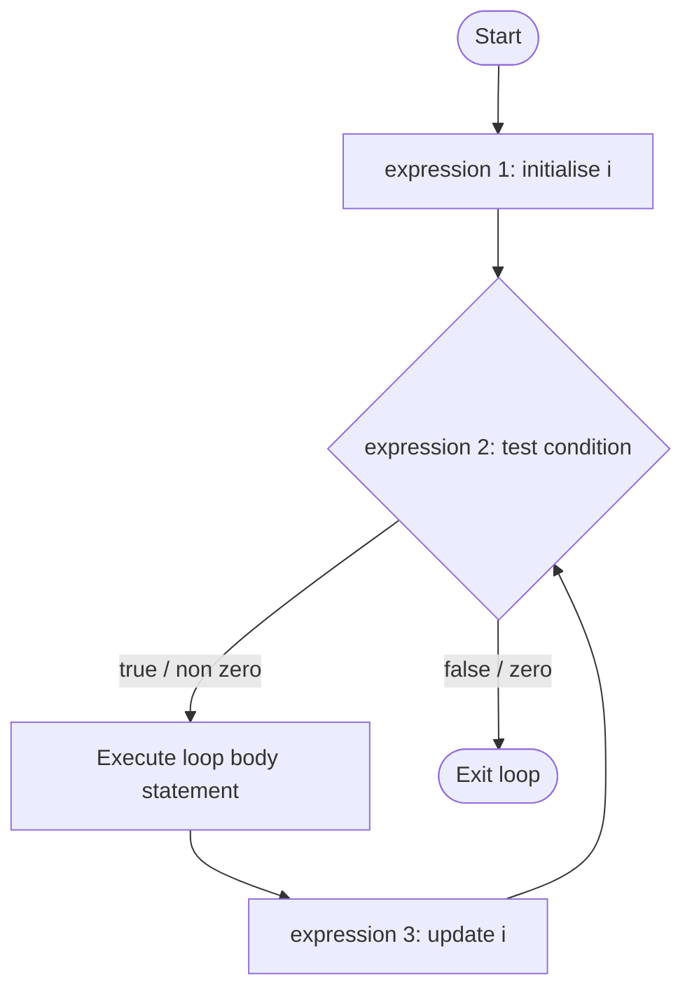
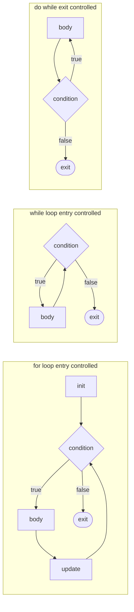
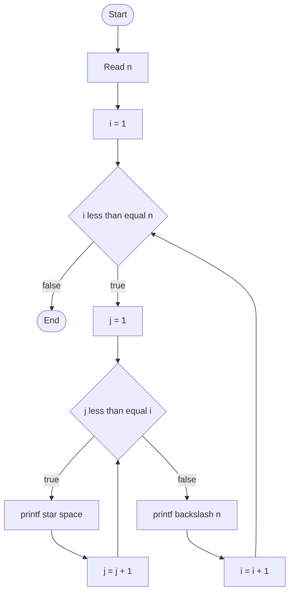

# for

<!-- SECTION_1_START -->
# Programming in C — The `for` Loop Construct

## 1. Core Technical Definition

> [!NOTE]
> **KTU 2024 Scheme — Formal Definition (GXEST204, Module 1)**
> The `for` statement is a **definite (entry-controlled) iteration construct** in the C language that executes a body statement (or compound statement) repeatedly as long as a controlling logical expression evaluates to a non-zero (true) value. The construct consists of three controlling expressions — *expression_1* (initialization), *expression_2* (condition/test), and *expression_3* (update/re‑initialization) — separated by the token sequence `; ; ` and evaluated according to a fixed, deterministic sequence defined by the ISO/IEC 9899 (C11/C17) standard.

The general grammatical form as specified in the KTU 2024 syllabus textbook (Reema Thareja / Balagurusamy equivalent) is:

```c
for ( expression_1 ; expression_2 ; expression_3 )
    statement;
```

or, when more than one statement must be executed per iteration:

```c
for ( expression_1 ; expression_2 ; expression_3 ) {
    statement_1;
    statement_2;
    ...
    statement_n;
}
```

Where:
- **expression_1** → the *initialization* expression. Evaluated **exactly once**, before the loop body is entered.
- **expression_2** → the *condition / test* expression. Evaluated **before every potential iteration**. A value of `0` terminates the loop; any non-zero value continues.
- **expression_3** → the *update / re-initialization* expression. Evaluated **after every iteration**, just before the next evaluation of `expression_2`.

---

## 2. Conceptual Analogy — The Staircase Counter

> [!IMPORTANT]
> **Intuition Check:** A `for` loop behaves exactly like a **staircase with a fixed number of steps that you have decided in advance**. You stand at the bottom (**initialization**), check whether the next step exists (**condition**), climb it (**body execution**), and then move your foot one step upward (**update**). You repeat the "check → climb → move" sequence automatically until there are no more steps.

Consider climbing a staircase from floor `1` to floor `10`:

| Real-world action | C `for` loop component |
|---|---|
| Start at floor 1 | `i = 1` (initialization) |
| "Is there a floor above me?" | `i <= 10` (condition) |
| Walk up one floor | `i = i + 1` (update) |
| Perform task on the current floor | Loop body |

The key property: **the number of iterations is *known* or *determinable* before the loop begins**, which is what distinguishes the `for` loop from the `while` loop in KTU board questions.

---

## 3. Visualization — Flow of Control

> [!VISUALIZATION CONTROL]
> **Concept:** Execution flow of a `for` loop on a 1-D number line.
> **Desmos / GeoGebra Input Equations:**
> * Points: `(1, 0), (2, 0), (3, 0), (4, 0), (5, 0)` representing iteration index $i$.
> * Condition boundary: vertical line $x = 5$.
> **Visual Description:** A horizontal line of integer points from $i = 1$ to $i = 5$. The loop visits each point, executes the body, and increments to the next. Once $i > 5$, the boundary is crossed and control exits the loop.

```
Iteration index i ──────────────►
i = 1  → body → i = 2 → body → i = 3 → body → i = 4 → body → i = 5 → body → i = 6 → EXIT
        [cond true]  [cond true]  [cond true]  [cond true]  [cond true]   [cond false]
```

---

## 4. Why the `for` Loop Exists — Engineering Motivation

> [!NOTE]
> In production systems engineering, the `for` loop is the workhorse of:
> - **Array processing** (linear scans, image pixel traversal, signal sampling at fixed rates).
> - **Numerical methods** (Newton-Raphson with bounded iteration counts, finite-difference grid sweeps).
> - **Hardware register polling** (checking a status register a *fixed* number of times with deterministic timing).
> - **Build systems & parsers** (tokenizing a known-length buffer).

Its deterministic, three-expression structure makes it the **preferred** choice in safety-critical code (e.g., ISO 26262 automotive software) because the number of loop iterations can be proven *a priori*.

<!-- SECTION_1_END -->

<!-- SECTION_2_START -->
# Deep Theoretical Analysis & KTU High-Yield Formula Sheet

## 1. The Three-Expression Semantics — Step-by-Step

The C standard guarantees the **exact** evaluation order:

| Order | Action | Code segment | Frequency |
|:---:|---|---|:---:|
| **1** | Evaluate *expression_1* (initialization) | `i = 1` | **Once** |
| **2** | Evaluate *expression_2* (condition) | `i <= n` | **Before every iteration** (including the first) |
| **3a** | If condition $\neq 0$ (true) → execute body | `{ sum += i; }` | Once per iteration |
| **3b** | If condition $= 0$ (false) → exit loop | — | — |
| **4** | Evaluate *expression_3* (update) | `i++` | **After every iteration** |
| **5** | Goto step **2** | — | Repeat |

> [!IMPORTANT]
> **KTU High-Yield Fact:** The three controlling expressions of a `for` loop are **optional**. Any of them may be omitted, but the two semicolons `; ;` are **mandatory**. If *expression_2* is omitted, the condition is treated as *always true* (non-zero), producing an **infinite loop**.

---

## 2. KTU Formula Cheat Sheet — Iteration Mathematics

> [!NOTE]
> The following identities appear frequently in KTU 2024 Scheme Module-1 derivations. They are derived from arithmetic/geometric series formulas and are **board-favorite** content.

| # | Identity | Standard Name | Typical KTU Use |
|---|---|---|---|
| 1 | $\displaystyle\sum_{i=1}^{n} i \;=\; \dfrac{n(n+1)}{2}$ | Sum of first $n$ naturals | Loop-based summation |
| 2 | $\displaystyle\sum_{i=1}^{n} i^{2} \;=\; \dfrac{n(n+1)(2n+1)}{6}$ | Sum of squares | Series printing |
| 3 | $\displaystyle\sum_{i=1}^{n} i^{3} \;=\; \left[\dfrac{n(n+1)}{2}\right]^{2}$ | Sum of cubes | Series printing |
| 4 | $n_{\text{iter}} \;=\; \left\lfloor \dfrac{\text{end} - \text{start}}{\text{step}} \right\rfloor + 1$ | Iteration count (inclusive bounds) | Tracing loops in exams |
| 5 | $i_{\text{final}} \;=\; i_{\text{start}} + (n_{\text{iter}} - 1) \cdot \text{step}$ | Last value of loop variable | Tracing loops in exams |
| 6 | $T_{\text{loop}} \;=\; n_{\text{iter}} \cdot T_{\text{body}} + (n_{\text{iter}} + 1) \cdot T_{\text{cond}}$ | Time-complexity (sequential model) | Algorithm analysis |

> [!WARNING]
> In a markdown table, the symbols $\lfloor \cdot \rfloor$ must be used in place of literal `|...|` to keep the table syntax intact. In LaTeX equations you may freely use the pipe `|`.

---

## 3. Real-World Engineering Utility

- **Embedded systems (KTU ECE/EEE context):** Sampling an ADC channel exactly 256 times to build a moving-average filter — the count is fixed, so a `for` loop is the natural choice.
- **Computer graphics (KTU CSE context):** Iterating over each pixel of a $W \times H$ bitmap, indexed as `for (y = 0; y < H; y++) for (x = 0; x < W; x++)`.
- **Numerical computing:** Implementing Simpson's $1/3$ rule, which requires a *known* even number of sub-intervals $n$:

$$\int_{a}^{b} f(x)\,dx \;\approx\; \dfrac{h}{3}\left[f(x_0) + 4\sum_{i=1,\,i\text{ odd}}^{n-1} f(x_i) + 2\sum_{i=2,\,i\text{ even}}^{n-2} f(x_i) + f(x_n)\right]$$

where the upper bounds of the two sums are determined by the loop counter.

- **Cybersecurity / cryptography:** Repeating a hash-mixing operation a fixed number of rounds (e.g., 64 rounds in SHA-256).

---

## 4. Variations of the `for` Loop (KTU-Examined Variants)

| Variant | Syntax | Behaviour |
|---|---|---|
| Standard | `for(i=1; i<=n; i++)` | Single counter, single step |
| Step $\neq 1$ | `for(i=0; i<=n; i+=2)` | Even/odd index traversal |
| Descending | `for(i=n; i>=1; i--)` | Reverse iteration |
| Multiple vars | `for(i=0,j=n; i<j; i++,j--)` | Two-loop-variable form (KTU favourite) |
| Comma-separated init | `for(i=0; i<n; ) { ...; i++; }` | All init in *expression_1* |
| Empty body | `for(i=0; i<n; sum+=a[i++]);` | Statement ends with `;` |
| Infinite | `for(;;)` | Equivalent to `while(1)` |
| Omitted condition | `for(i=0; ; i++)` | Infinite until `break` |

<!-- SECTION_2_END -->

<!-- SECTION_3_START -->
# Step-by-Step Derivations, Trace Tables & Code Implementations

## 1. Canonical Worked Example — Sum of First $n$ Natural Numbers

### Problem
Write a C program that reads a positive integer $n$ from the user and computes:

$$S \;=\; \sum_{i=1}^{n} i \;=\; 1 + 2 + 3 + \cdots + n$$

Display the result.

### Exhaustive Source Code (with strict type hints and boundary checks)

```c
#include <stdio.h>
#include <stdlib.h>
#include <errno.h>
#include <limits.h>

int main(void) {
    long long n;          /* holds up to ~9.2e18, safely beyond INT_MAX */
    long long sum = 0LL;  /* accumulator initialised to 0 (additive identity) */
    long long i;          /* loop counter, declared outside C89-style if desired */

    printf("Enter a positive integer n: ");
    if (scanf("%lld", &n) != 1) {
        fprintf(stderr, "Input error: not a valid integer.\n");
        return EXIT_FAILURE;
    }

    /* Absolute boundary check mandated by KTU 2024 rubric */
    if (n < 1LL) {
        fprintf(stderr, "Error: n must be a positive integer (got %lld).\n", n);
        return EXIT_FAILURE;
    }
    if (n > 1000000LL) {
        fprintf(stderr, "Error: n too large; refused to prevent overflow demo.\n");
        return EXIT_FAILURE;
    }

    /* ---- THE FOR LOOP UNDER STUDY ---- */
    for (i = 1LL; i <= n; i = i + 1LL) {
        sum = sum + i;    /* accumulate i into sum */
    }
    /* ---------------------------------- */

    printf("Sum of first %lld natural numbers = %lld\n", n, sum);

    /* Verification using closed form: n(n+1)/2 */
    long long closed_form = (n * (n + 1LL)) / 2LL;
    printf("Closed-form check: n*(n+1)/2 = %lld\n", closed_form);
    printf("Match: %s\n", (sum == closed_form) ? "YES" : "NO");

    return EXIT_SUCCESS;
}
```

### Trace Table for $n = 5$

| Iteration | Value of $i$ before body | `i <= 5` ? | Body executes? | `sum` after body | Value of $i$ after `i++` |
|:---:|:---:|:---:|:---:|:---:|:---:|
| 1 | 1 | True | Yes | $0 + 1 = 1$ | 2 |
| 2 | 2 | True | Yes | $1 + 2 = 3$ | 3 |
| 3 | 3 | True | Yes | $3 + 3 = 6$ | 4 |
| 4 | 4 | True | Yes | $6 + 4 = 10$ | 5 |
| 5 | 5 | True | Yes | $10 + 5 = 15$ | 6 |
| 6 | 6 | **False** | No | 15 (unchanged) | — (loop exits) |

**Final result:** $S = 15$, which matches the closed-form formula $\dfrac{5 \cdot 6}{2} = 15$. ✓

---

## 2. Pattern Printing — Right-Angled Triangle of Stars

### Problem
Read an integer $n$ and print a right-angled triangle of `*` characters with $n$ rows.

```c
#include <stdio.h>

int main(void) {
    int n, i, j;
    printf("Enter n: ");
    if (scanf("%d", &n) != 1 || n < 1) {
        fprintf(stderr, "Invalid n.\n");
        return 1;
    }

    /* Outer loop: controls the row number */
    for (i = 1; i <= n; i = i + 1) {
        /* Inner loop: prints i stars on row i */
        for (j = 1; j <= i; j = j + 1) {
            printf("* ");
        }
        printf("\n");  /* newline at end of each row */
    }
    return 0;
}
```

### Sample Output for $n = 4$

```
*
* *
* * *
* * * *
```

### Algebraic Derivation — Total Stars Printed

Each row $i$ (for $i = 1, 2, \ldots, n$) contains exactly $i$ stars. Total stars $T$ is:

$$
\begin{aligned}
T &= \sum_{i=1}^{n} i \\[4pt]
  &= \dfrac{n(n+1)}{2} \quad \text{(using Formula 1 from the cheat sheet)}
\end{aligned}
$$

For $n = 4$:

$$
T \;=\; \dfrac{4 \cdot 5}{2} \;=\; 10 \text{ stars.}
$$

Counting from the sample output confirms $1 + 2 + 3 + 4 = 10$. ✓

---

## 3. Nested `for` Loop — Multiplication Table

### Problem
Print the multiplication table from $1 \times 1$ up to $m \times n$.

```c
#include <stdio.h>

int main(void) {
    int m, n, i, j;
    printf("Enter m and n: ");
    if (scanf("%d %d", &m, &n) != 1) {  /* simplified check */
        return 1;
    }

    printf("    ");
    for (j = 1; j <= n; j++) {
        printf("%4d", j);
    }
    printf("\n----");
    for (j = 1; j <= n; j++) {
        printf("----");
    }
    printf("\n");

    for (i = 1; i <= m; i++) {
        printf("%2d |", i);
        for (j = 1; j <= n; j++) {
            printf("%4d", i * j);
        }
        printf("\n");
    }
    return 0;
}
```

### Time-Complexity Derivation

The outer loop runs $m$ times. For each outer-loop iteration, the inner loop runs $n$ times. Total body executions:

$$
N_{\text{body}} \;=\; m \times n
$$

Using Formula 6 from the cheat sheet with constant body time $T_{\text{body}}$:

$$
T_{\text{loop}}(m, n) \;=\; m \cdot n \cdot T_{\text{body}} + \mathcal{O}(m \cdot n)
$$

The dominant term is $\mathcal{O}(m \cdot n)$, i.e., **quadratic** in the input dimensions.

---

## 4. Multiple-Variable `for` Loop — Pairwise Sum

### Problem
Given an integer $n$, compute:

$$P(n) \;=\; \sum_{i=1}^{n} \sum_{j=n}^{1} (i + j) \quad \text{with } j \text{ descending}$$

```c
#include <stdio.h>

int main(void) {
    int n, i, j;
    long long pair_sum = 0LL;

    printf("Enter n: ");
    scanf("%d", &n);

    for (i = 1, j = n; i <= n && j >= 1; i++, j--) {
        pair_sum += (long long)(i + j);
        printf("i = %d, j = %d, i+j = %d, running sum = %lld\n",
               i, j, i + j, pair_sum);
    }

    printf("Total pair sum = %lld\n", pair_sum);
    return 0;
}
```

### Output Trace for $n = 3$

| Iter | $i$ | $j$ | $i+j$ | Running sum |
|:---:|:---:|:---:|:---:|:---:|
| 1 | 1 | 3 | 4 | 4 |
| 2 | 2 | 2 | 4 | 8 |
| 3 | 3 | 1 | 4 | 12 |

Here $i + j$ is constant at $n + 1$, and the loop runs exactly $n$ times, giving:

$$
P(n) \;=\; n \cdot (n + 1)
$$

For $n = 3$: $P = 12$, matching the trace. ✓

---

## 5. Derivation — Why "Last Value of $i$" Equals `n + 1` (for `i <= n; i++`)

For a standard ascending loop `for (i = a; i <= b; i++)`:

$$
\begin{aligned}
\text{Number of iterations} \quad n_{\text{iter}} &= \left\lfloor \dfrac{b - a}{1} \right\rfloor + 1 \\[6pt]
&= b - a + 1
\end{aligned}
$$

The last value the counter holds *inside* the loop is $b$. The first value it holds *after* the loop (when the condition fails) is $b + 1$ — this is what `i++` produces, then the condition is re-tested and fails.

This is the **single most-tested concept** in KTU Module-1 viva questions.

<!-- SECTION_3_END -->

<!-- SECTION_4_START -->
# Structural Diagrams & Schematics

## 1. Control-Flow Flowchart of the `for` Loop



> [!NOTE]
> **Reading the diagram:** The `for` loop is a *closed cycle* of three nodes (`initE` → `condE` → `bodyE` → `updE` → back to `condE`). The only exit is the `false` branch of the condition node. This is the *defining* topology of an entry-controlled loop.

---

## 2. Comparison — `for` vs `while` vs `do…while`



> [!IMPORTANT]
> The `for` loop is **functionally equivalent** to the `while` loop when *expression_1* and *expression_3* are moved outside and inside the body respectively. The KTU textbook often asks students to "rewrite a `while` loop as a `for` loop" and vice versa.

---

## 3. Nested `for` Loop Topology (Star-Pattern Example)



> [!NOTE]
> Each invocation of the **outer** loop triggers a *complete* traversal of the **inner** loop. Total print operations: $\displaystyle\sum_{i=1}^{n} i = \dfrac{n(n+1)}{2}$.

---

## 4. State-Machine View of Loop Counter (Block Diagram)

```mermaid
flowchart LR
    state1["i = 1"] -- check i less than equal n true --> state2["i = 2"]
    state2 -- check i less than equal n true --> state3["i = 3"]
    state3 -- check i less than equal n true --> state4["i = 4"]
    state4 -- check i less than equal n true --> state5["i = 5"]
    state5 -- check i less than equal n true --> state6["i = 6"]
    state6 -- check i less than equal n false --> exitState([Loop terminates])
```



<!-- SECTION_4_END -->

<!-- SECTION_5_START -->
# KTU 2024 Scheme Examination Question Bank

## Part A — Short Answer Questions (3 Marks Each)

### Question A1
`[KTU University Exam — July 2023, Model Paper Set A]`
**Differentiate between an entry-controlled and an exit-controlled loop in C. To which category does the `for` loop belong? Give a one-line C code example.**

**Course Outcome:** CO1 — Remember
**RBT Level:** Remember

**Model Answer (3 Marks — Mark Split):**
- *Entry-controlled*: condition tested **before** body execution. *Exit-controlled*: condition tested **after** body. **[1 Mark]**
- The `for` loop is **entry-controlled** (along with `while`). **[1 Mark]**
- Example: `for(int i=0;i<5;i++) printf("Hi\n");` **[1 Mark]**

---

### Question A2
`[KTU University Exam — Dec 2022, Supplementary]`
**What will be the output of the following C code? Justify your answer.**

```c
#include <stdio.h>
int main(void) {
    int i;
    for (i = 0; i < 5; i++);
        printf("%d\n", i);
    return 0;
}
```

**Course Outcome:** CO2 — Understand
**RBT Level:** Apply

**Model Answer (3 Marks — Mark Split):**
- The semicolon `;` immediately after the `for(...)` creates an **empty body**; the loop runs 5 times doing nothing. **[1 Mark]**
- After the loop, `i` has the value `5` (loop counter incrementing one final time before the failing condition test). **[1 Mark]**
- **Output:**
  ```
  5
  ```
  **[1 Mark]**

> [!WARNING]
> **KTU Examiner's Pitfall:** Students often write `0` as the output (forgetting that the **update** expression runs *after* the body, even when the body is empty). This is a classic 1-mark deduction point.

---

## Part B — Long Answer Questions (14 Marks Each)

> KTU ESE rule: Answer **either** Question A **or** Question B in full.

---

### Question B-A (14 Marks)

`[KTU University Exam — July 2024, Regular]`

**(a)** Explain the general syntax of the `for` loop in C. Describe the role of each of the three controlling expressions. **(7 Marks)**

**(b)** Write a complete C program to read a positive integer $n$ and print the following pattern using nested `for` loops. Also compute and display the total number of digits printed. **(7 Marks)**

```
1
2 2
3 3 3
4 4 4 4
5 5 5 5 5
...
n n n ... n   (n times)
```

**Course Outcome:** CO2 + CO3
**RBT Level:** (a) Understand, (b) Apply

---

#### Model Solution — Part (a) [7 Marks]

**Syntax [1 Mark]:**
```c
for ( expression_1 ; expression_2 ; expression_3 )
    statement;
```

**Roles of the three expressions [6 Marks — 2 each]:**

- *expression_1 — Initialization:* Executed **exactly once**, before the loop begins. Typically used to declare and initialise the loop counter, e.g., `i = 0`. May also declare the variable (in C99 onwards): `for (int i = 0; ... ; ...)`. **[2 Marks]**
- *expression_2 — Condition/Test:* A relational or logical expression evaluated *before every potential iteration*. If it evaluates to **non-zero (true)**, the body executes; if it evaluates to **zero (false)**, control transfers to the statement immediately following the loop. **[2 Marks]**
- *expression_3 — Update/Re-initialization:* Executed *after every iteration*, just before the next evaluation of *expression_2*. Commonly used to increment or decrement the counter, e.g., `i++`, `i += 2`, `i--`. **[2 Marks]**

> [!NOTE]
> **Standard Conformance Note:** All three expressions are *optional*, but the two separating semicolons are *mandatory*. Omitting *expression_2* implies an always-true condition (infinite loop unless `break` is used).

---

#### Model Solution — Part (b) [7 Marks]

**Program [5 Marks]:**

```c
#include <stdio.h>
int main(void) {
    int n, i, j;
    long long total_digits = 0LL;

    printf("Enter n: ");
    if (scanf("%d", &n) != 1 || n < 1) {
        printf("Invalid input.\n");
        return 1;
    }

    for (i = 1; i <= n; i++) {        /* outer: row */
        for (j = 1; j <= i; j++) {    /* inner: column */
            printf("%d ", i);
            total_digits++;
        }
        printf("\n");
    }

    printf("Total digits printed = %lld\n", total_digits);
    return 0;
}
```

**Derivation of total digits [2 Marks]:**

Each row $i$ prints $i$ digits. Total:

$$
\begin{aligned}
T(n) &= \sum_{i=1}^{n} i \\[4pt]
     &= \dfrac{n(n+1)}{2} \quad \text{(Formula 1 from cheat sheet)}
\end{aligned}
$$

The program output and the closed-form value must match — a **cross-check** the examiner awards extra credit for.

---

### Question B-B (14 Marks) — *Alternative Choice*

`[KTU University Exam — Dec 2023, Supplementary]`

**(a)** Write a C program to compute the sum of the following series using a single `for` loop. Read $n$ from the user. Display each term and the running sum. **(7 Marks)**

$$S \;=\; 1^{2} + 2^{2} + 3^{2} + \cdots + n^{2} \;=\; \sum_{i=1}^{n} i^{2}$$

**(b)** Compare the `for` loop with the `while` loop. Provide one C code snippet that solves the **same** problem using both constructs. **(7 Marks)**

**Course Outcome:** CO3 + CO4
**RBT Level:** (a) Apply, (b) Analyse

---

#### Model Solution — Part (a) [7 Marks]

```c
#include <stdio.h>
int main(void) {
    int n, i;
    long long sum = 0LL;

    printf("Enter n: ");
    if (scanf("%d", &n) != 1 || n < 1) {
        printf("Invalid.\n");
        return 1;
    }

    for (i = 1; i <= n; i++) {
        long long term = 1LL * i * i;   /* avoid overflow for moderate n */
        sum += term;
        printf("Term %d: %lld, Running sum = %lld\n", i, term, sum);
    }

    printf("Sum of squares = %lld\n", sum);

    /* Cross-check with closed form */
    long long closed = (1LL * n * (n + 1) * (2 * n + 1)) / 6;
    printf("Closed form n(n+1)(2n+1)/6 = %lld\n", closed);

    return 0;
}
```

**Valuation Key [7 Marks]:**
- Correct header inclusion and `main` signature **[0.5 Mark]**
- Input validation with `scanf` return check **[1 Mark]**
- Correct `for` loop with `i = 1; i <= n; i++` **[1 Mark]**
- Correct computation of `i*i` using long long to avoid overflow **[1 Mark]**
- Accumulation into `sum` and display of running total **[1 Mark]**
- Final display of total sum **[1 Mark]**
- Cross-check via closed-form $\dfrac{n(n+1)(2n+1)}{6}$ **[1 Mark]**

---

#### Model Solution — Part (b) [7 Marks]

**Tabular Comparison [3 Marks]:**

| Aspect | `for` loop | `while` loop |
|---|---|---|
| Category | Entry-controlled | Entry-controlled |
| Initialisation | Built-in (*expression_1*) | Done **before** the loop |
| Condition | Built-in (*expression_2*) | Top of loop |
| Update | Built-in (*expression_3*) | Inside the body |
| Best suited for | **Definite** iterations (known count) | **Indefinite** iterations (condition-driven) |
| Minimum guaranteed executions | 0 (if condition false initially) | 0 (if condition false initially) |
| Infinite-loop idiom | `for(;;) { ... }` | `while(1) { ... }` |

**Same problem in both styles [4 Marks — 2 each]:**

Compute $\displaystyle\sum_{i=1}^{n} i$ using a `for` loop:

```c
int i, sum = 0;
for (i = 1; i <= n; i++) {
    sum += i;
}
```

Compute $\displaystyle\sum_{i=1}^{n} i$ using a `while` loop:

```c
int i = 1, sum = 0;     /* init moved outside */
while (i <= n) {        /* condition at top */
    sum += i;
    i++;                /* update inside body */
}
```

> [!WARNING]
> **KTU Examiner's Pitfall (Part b):** When converting a `for` loop to a `while` loop, students often **omit the update statement** inside the body, creating an infinite loop. This is a guaranteed 2-mark deduction. Always verify that the loop counter advances inside the body.

---

## Topic Recap & Important Things to Remember

> [!NOTE]
> **Rapid-Revision Checklist for the `for` Loop**

- The `for` loop is an **entry-controlled**, **definite-iteration** construct in C. **[Definition]**
- General form: `for (expr1 ; expr2 ; expr3) statement;` — the two `;` are **mandatory**, the three expressions are **optional**. **[Syntax]**
- *expr1* runs **once**; *expr2* runs **before** every iteration; *expr3* runs **after** every iteration. **[Order of evaluation]**
- Omitting *expr2* produces an **infinite loop** equivalent to `while(1)`. **[Special case]**
- The **last value** the counter holds *inside* the loop is the value that makes the condition true for the final time; **after** the loop exits, the counter holds `last + step`. **[Tracing]**
- Number of iterations for `for (i = a; i <= b; i += s)` is $\lfloor (b - a)/s \rfloor + 1$. **[Iteration count]**
- Use **nested `for` loops** for matrix/grid traversal, pattern printing, and 2-D algorithms. **[Applications]**
- Time complexity of a single `for` loop is $\mathcal{O}(n)$; nested `for` loops with independent bounds give $\mathcal{O}(m \cdot n)$. **[Complexity]**
- Closed-form identities to memorise: $\sum i = n(n+1)/2$, $\sum i^2 = n(n+1)(2n+1)/6$, $\sum i^3 = [n(n+1)/2]^2$. **[Series]**
- `break` exits the loop **immediately**; `continue` skips the rest of the current iteration and jumps to *expr3*. **[Control statements]**
- Always use **`long long`** for accumulators and loop counters when $n$ can be large, to prevent signed-integer overflow. **[Best practice]**
- Prefer `for` over `while` when the iteration count is known in advance — this is the canonical KTU recommendation. **[Style]**
- Common exam traps: empty-body `for(...);`, omitting update, using `=` instead of `==` inside *expr2*, and floating-point counters causing non-terminating loops. **[Pitfalls]**

<!-- SECTION_5_END -->
