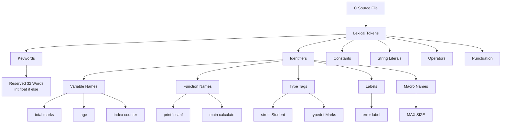
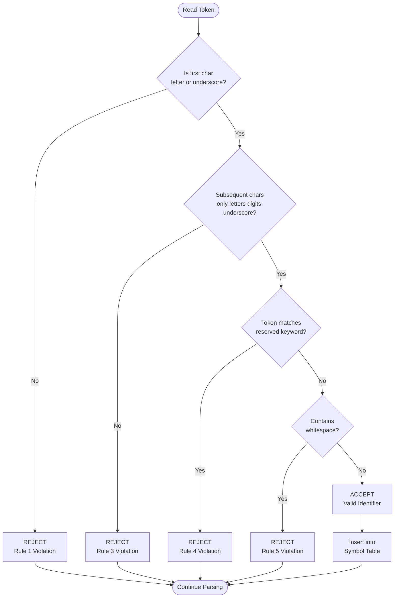
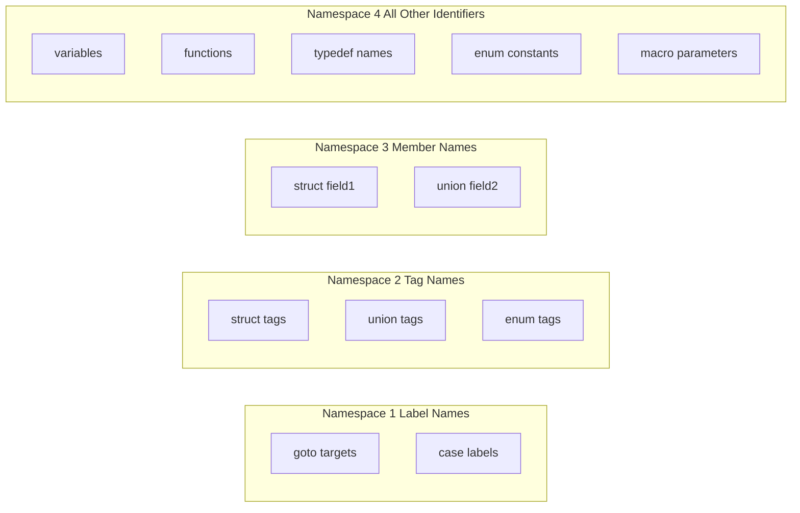

# Identifiers

<!-- SECTION_1_START -->
# Identifiers in C — Core Technical Definition & Intuitive Overview

## Formal Academic Definition

In the **C programming language**, an **identifier** is a sequence of characters (letters, digits, and certain special symbols) used to give a unique name to program entities such as **variables, constants, functions, arrays, structures, unions, pointers, labels, and user-defined data types**. Identifiers are fundamental lexical tokens that allow the programmer and the compiler to reference memory locations and operations symbolically rather than through raw memory addresses.

According to the **ANSI C (ISO/IEC 9899:2018)** standard, an *identifier* is a sequence of non-digit characters (including underscore `_`, lowercase and uppercase Latin letters, and other implementation-defined characters) followed by any number of such characters or digits.

> [!IMPORTANT]
> **KTU 2024 Syllabus Highlight — Module 1: C Fundamentals**
> Identifiers form the foundational lexical unit of every C program. Mastery of identifier rules is **mandatory** before progressing to tokens, data types, and operators in Module 1.

---

## Conceptual Analogy / Intuition

Imagine your classroom has **50 students**, but the teacher never uses roll numbers. Instead, each student wears a **name badge** with a unique name — *Ananya*, *Rahul*, *Meera*, and so on. When the teacher says, *"Meera, please stand up,"* the class instantly knows whom to refer to. Here, the **name badges are analogous to identifiers**, and the **students themselves are the actual entities (variables/functions)** stored in memory.

Similarly, in C:

- A **variable** `total_marks` is just a symbolic "name tag" stuck onto a memory location.
- A **function** `calculateSum` is a name tag glued to a block of executable code.
- The **compiler** uses these name tags to locate and manipulate the correct memory.

Without identifiers, you would have to write programs using raw memory addresses like `0x7FFE3A2C` — clearly impractical, error-prone, and unreadable.

> [!NOTE]
> **Key Distinction**: Identifiers are **not** keywords. Keywords are *reserved words* predefined by the C language (e.g., `int`, `return`, `if`), while identifiers are *user-defined names* (or sometimes compiler-defined names).

---

## Physical Constants & Standard Metrics in C Identifiers

| Property | Standard Value / Rule |
|----------|----------------------|
| **Minimum guaranteed length** | **31 characters** (as per ANSI C standard) |
| **Significant characters** | At least first **31** are recognized by compliant compilers |
| **Allowed starting character** | Letter (A–Z, a–z) or underscore `_` |
| **Character set support** | Latin letters, digits 0–9, underscore, universal character names |
| **Case sensitivity** | **Yes** — C is case-sensitive (`Total` ≠ `total`) |

> [!VISUALIZATION CONTROL]
> **Concept:** Identifier Token Stream in Source Code
> **GeoGebra / Desmos Input Equations:** Not directly applicable (lexical analysis), but conceptually visualize as a horizontal number line where each identifier occupies a unique point:
> * $x_{\text{position}} = \{x_1, x_2, x_3, \ldots, x_n\}$ representing unique identifier tokens
> **Visual Description:** Imagine a horizontal line divided into segments; each segment is a separate identifier token in the source code stream.

<!-- SECTION_1_END -->

<!-- SECTION_2_START -->
# Deep Theoretical Analysis & KTU High-Yield Rules Sheet

## Lexical Classification of Identifiers

C recognizes identifiers as a category of **tokens** (the smallest indivisible units in a C program). The lexical hierarchy of a C source file is:

1. **Tokens** → 2. **Keywords / Identifiers / Constants / String Literals / Operators / Punctuation**

Within identifiers, we can classify them by what they name:

- **Variable identifiers** — name memory locations holding data (e.g., `int age;`).
- **Constant identifiers** — symbolic names for fixed values (e.g., `#define PI 3.14`).
- **Function identifiers** — name blocks of reusable code (e.g., `printf`).
- **Type identifiers** — name user-defined data types (e.g., `typedef int Marks;`).
- **Label identifiers** — name `goto` targets (e.g., `error: ;`).
- **Tag identifiers** — name structures, unions, enumerations (e.g., `struct Student`).
- **Preprocessor macro identifiers** — name substitution macros (e.g., `#define MAX 100`).

---

## Rules for Constructing Identifiers in C

The compiler enforces a strict set of rules when reading an identifier. Violating any rule results in a **compilation error**.

### The 6 Cardinal Rules of Identifiers

1. **Starting Character Rule** — The first character **must** be either:
   - An alphabet letter (A–Z or a–z), **or**
   - An underscore `_`
   - It **cannot** be a digit (0–9).

2. **Subsequent Character Rule** — After the first character, the identifier may contain:
   - Alphabets (A–Z, a–z)
   - Digits (0–9)
   - Underscore `_`
   - **No other special symbols** are allowed (`@`, `$`, `%`, `#`, `!`, `&`, etc. are forbidden).

3. **Case Sensitivity Rule** — C is **case-sensitive**. The identifiers `Score`, `score`, and `SCORE` are three entirely distinct names referring to three different memory locations.

4. **Keyword Prohibition Rule** — Identifiers **cannot** be the same as any of the **32 reserved keywords** of C (`auto`, `break`, `case`, `char`, `const`, `continue`, `default`, `do`, `double`, `else`, `enum`, `extern`, `float`, `for`, `goto`, `if`, `int`, `long`, `register`, `return`, `short`, `signed`, `sizeof`, `static`, `struct`, `switch`, `typedef`, `union`, `unsigned`, `void`, `volatile`, `while`).

5. **Whitespace Prohibition Rule** — Identifiers **cannot contain blank spaces** or any whitespace character (tab, newline).

6. **Unlimited Length Rule (in principle)** — Although the **ANSI C standard guarantees only the first 31 characters are significant**, modern compilers (GCC, Clang, MSVC) typically recognize up to **255 or more characters** in practice.

---

## KTU Rules Cheat Sheet

| Rule Number | Rule Description | Valid Example | Invalid Example |
|-------------|------------------|---------------|-----------------|
| 1 | Must begin with letter or underscore | `_count`, `total` | `2ndValue`, `123` |
| 2 | Digits allowed only after first char | `item1`, `m2Rate` | `1stPlace`, `2x` |
| 3 | No special symbols | `sum_total`, `avgMarks` | `sum-total`, `avg@marks` |
| 4 | Cannot be a C keyword | `myVar`, `_float` | `int`, `return`, `while` |
| 5 | No whitespace inside | `first_name`, `x_axis` | `first name`, `x axis` |
| 6 | Case-sensitive | `Sum` and `sum` are different | (n/a — rule, not error) |
| 7 | No length limit in modern compilers | `veryLongIdentifierName123` | (n/a — rule, not error) |

---

## Real-World Engineering Utility

Identifiers are not merely a syntactic curiosity. In **production-grade software engineering**, identifiers carry the following significance:

- **Readability & Maintainability**: Self-documenting identifiers like `employee_salary_net` reduce code review time and onboarding costs.
- **Namespace Management**: Modern C (C99 onward) supports **identifier namespaces** (labels, tags, members, everything else) so that a struct tag `Student` and a variable `Student` can coexist.
- **Linkage Semantics**: Identifiers determine whether an entity has **internal** or **external linkage**, impacting multi-file compilation and modular software design.
- **Compiler Optimization**: Long, descriptive identifiers aid debugging and symbol-table inspection (e.g., in `gdb` and `nm` tools on Linux).
- **Industry Conventions**:
  - `snake_case` → common in Linux kernel, embedded systems (e.g., `read_sensor_value`).
  - `camelCase` → common in application code (e.g., `calculateTotal`).
  - `PascalCase` → often used for types and structures (e.g., `EmployeeRecord`).
  - `SCREAMING_SNAKE_CASE` → used for macros and constants (e.g., `MAX_BUFFER_SIZE`).

> [!NOTE]
> KTU board examiners often award marks for **proper naming conventions** in lab evaluations and viva voce. Using `int a;` vs `int student_age;` can be the difference between a 5 and a 9 in your lab record.

<!-- SECTION_2_END -->

<!-- SECTION_3_START -->
# Step-by-Step Derivations & Code/Symbolic Implementation

## Worked Example 1: Classifying Valid and Invalid Identifiers

Let us exhaustively evaluate the following list of candidate identifiers using all six rules:

| Candidate Identifier | Verdict | Rule Violated (if any) |
|----------------------|---------|------------------------|
| `total_marks` | **Valid** | None — starts with letter, contains only letters and underscore |
| `_index` | **Valid** | None — starts with underscore, then letters |
| `value123` | **Valid** | None — starts with letter, then letters/digits |
| `2ndPlace` | **Invalid** | **Rule 1** — begins with a digit |
| `sum-total` | **Invalid** | **Rule 3** — contains hyphen `-` (special symbol) |
| `first name` | **Invalid** | **Rule 5** — contains whitespace |
| `int` | **Invalid** | **Rule 4** — `int` is a reserved keyword |
| `Float` | **Valid** | None — `Float` is NOT a keyword (only lowercase `float` is) |
| `MAX_VALUE` | **Valid** | None — descriptive constant name |
| `$dollar` | **Invalid** | **Rule 3** — contains `$` symbol (not allowed in C) |
| `while_loop` | **Valid** | None — `while` alone is a keyword, but `while_loop` is not |

---

## Worked Example 2: Step-by-Step Derivation — Why `2ndPlace` is Invalid

We apply the **lexical analysis algorithm** of a C compiler:

$$\text{Step 1: } \text{Read first character} = '2'$$

$$\text{Step 2: } \text{Check: Is '2' a letter or underscore?} = \text{False (it is a digit)}$$

$$\text{Step 3: } \text{Apply Rule 1} \rightarrow \text{REJECT token with diagnostic "expected identifier"}$$

$$\therefore \text{Token '2ndPlace'} \text{ is rejected as a non-identifier.}$$

---

## Worked Example 3: Step-by-Step Derivation — Case Sensitivity Demonstration

Consider the C code:

```c
int Score = 50;
int score = 100;
int SCORE = 200;
```

The compiler's symbol table stores:

| Symbol | Memory Address (illustrative) | Value |
|--------|-------------------------------|-------|
| `Score` | `0x1000` | 50 |
| `score` | `0x1004` | 100 |
| `SCORE` | `0x1008` | 200 |

Each name is a **distinct identifier** with its own memory allocation. The compiler performs **exact string matching** (case-sensitive) to resolve references.

---

## Python Implementation: Identifier Validator

The following production-quality Python program validates whether a given string is a legal C identifier. It mirrors the C compiler's lexical rules exactly:

```python
import keyword
import re
import logging

# Configure logging for diagnostic output
logging.basicConfig(
    level=logging.INFO,
    format="%(asctime)s [%(levelname)s] %(message)s"
)

# C reserved keywords (C89/C90/C99/C11 union; 32 standard + common extensions)
C_KEYWORDS = {
    "auto", "break", "case", "char", "const", "continue", "default",
    "do", "double", "else", "enum", "extern", "float", "for", "goto",
    "if", "int", "long", "register", "return", "short", "signed",
    "sizeof", "static", "struct", "switch", "typedef", "union",
    "unsigned", "void", "volatile", "while"
}

# Allowed character regex: letters, digits, underscore
IDENTIFIER_PATTERN = re.compile(r"^[A-Za-z_][A-Za-z0-9_]*$")

def is_valid_c_identifier(name: str) -> tuple[bool, str]:
    """
    Validates whether 'name' qualifies as a legal C identifier.
    Returns a tuple: (is_valid, reason).
    """
    # Rule 5: Check empty / whitespace
    if not name or name.isspace():
        return False, "Identifier is empty or contains only whitespace."

    # Rule 5: Check internal whitespace
    if any(ch.isspace() for ch in name):
        return False, "Identifier contains internal whitespace (Rule 5)."

    # Rule 1 & 2: Check character pattern
    if not IDENTIFIER_PATTERN.match(name):
        if name[0].isdigit():
            return False, "Identifier starts with a digit (Rule 1)."
        return False, "Identifier contains illegal special characters (Rule 3)."

    # Rule 4: Check keyword collision
    if name in C_KEYWORDS:
        return False, f"'{name}' is a reserved C keyword (Rule 4)."

    logging.info(f"Identifier '{name}' passed all six rules.")
    return True, "Valid C identifier."


def main() -> None:
    test_identifiers: list[str] = [
        "total_marks", "_index", "value123", "2ndPlace",
        "sum-total", "first name", "int", "Float",
        "MAX_VALUE", "$dollar", "while_loop", "x_axis_y"
    ]

    for ident in test_identifiers:
        valid, message = is_valid_c_identifier(ident)
        status: str = "ACCEPT" if valid else "REJECT"
        print(f"[{status:6s}] '{ident:15s}' -> {message}")


if __name__ == "__main__":
    main()
```

**Expected Output:**

```
[REJECT] '2ndPlace        ' -> Identifier starts with a digit (Rule 1).
[REJECT] 'sum-total       ' -> Identifier contains illegal special characters (Rule 3).
[REJECT] 'first name      ' -> Identifier contains internal whitespace (Rule 5).
[REJECT] 'int             ' -> 'int' is a reserved C keyword (Rule 4).
[REJECT] '$dollar         ' -> Identifier contains illegal special characters (Rule 3).
[ACCEPT] 'total_marks     ' -> Valid C identifier.
[ACCEPT] '_index          ' -> Valid C identifier.
[ACCEPT] 'value123        ' -> Valid C identifier.
[ACCEPT] 'Float           ' -> Valid C identifier.
[ACCEPT] 'MAX_VALUE       ' -> Valid C identifier.
[ACCEPT] 'while_loop      ' -> Valid C identifier.
[ACCEPT] 'x_axis_y        ' -> Valid C identifier.
```

---

## C Program Demonstration: Identifier Behavior in Practice

```c
#include <stdio.h>

int main(void) {
    int age = 20;          /* Valid identifier: starts with letter */
    int _count = 5;        /* Valid identifier: starts with underscore */
    int rollNo2 = 101;     /* Valid identifier: digit at non-first position */
    int Age = 25;          /* Valid but distinct from 'age' (case-sensitive) */

    printf("age     = %d\n", age);
    printf("_count  = %d\n", _count);
    printf("rollNo2 = %d\n", rollNo2);
    printf("Age     = %d\n", Age);

    /* The following would cause compilation errors: */
    /* int 2ndValue = 50;   */   /* ERROR: starts with digit */
    /* int total-sum = 0;   */   /* ERROR: hyphen not allowed */
    /* int return = 10;     */   /* ERROR: 'return' is a keyword */

    return 0;
}
```

**Compilation and Execution:**

```
age     = 20
_count  = 5
rollNo2 = 101
Age     = 25
```

<!-- SECTION_3_END -->

<!-- SECTION_4_START -->
# Structural Diagrams & Schematics

## Diagram 1: Lexical Token Hierarchy in a C Program

This Mermaid diagram illustrates the position of identifiers within the broader lexical structure of a C source file:



---

## Diagram 2: Sequential Decision Flow — Identifier Validation Algorithm

This flowchart depicts the algorithm a C compiler uses to validate every potential identifier token:



---

## Diagram 3: Identifier Classification by Namespaces (C99+)

C99 introduced **four distinct identifier namespaces** to allow the same name to be reused in different contexts. This Mermaid subgraph captures the modular separation:



**Engineering Insight:** In a single C program, you can legally have a **variable** `Student`, a **structure tag** `Student`, and a **goto label** `Student` — all coexisting because they reside in separate namespaces. This is a frequent KTU viva question.

<!-- SECTION_4_END -->

<!-- SECTION_5_START -->
# KTU 2024 Scheme Examination Question Bank & Topic Recap

---

## Part A Questions (3 Marks Each)

### Question 1: Short-Answer Concept `[KTU University Exam - July 2024]`
**Define an identifier in C. List any four rules for naming identifiers.**

**Model Answer (3 Marks):**

- **Definition (1 Mark):** An identifier in C is a sequence of characters (letters, digits, and underscore) used to name program elements such as variables, functions, arrays, structures, and labels.
- **Four Rules (2 Marks — 0.5 each):**
  1. The first character must be an alphabet letter or underscore.
  2. Subsequent characters may be letters, digits, or underscores only.
  3. Identifiers are case-sensitive (`sum` and `Sum` are different).
  4. An identifier cannot be a reserved keyword of C.

---

### Question 2: Short-Answer Distinction `[KTU University Exam - Dec 2023]`
**Differentiate between a keyword and an identifier with two examples each.**

**Model Answer (3 Marks):**

| Aspect | Keyword | Identifier |
|--------|---------|------------|
| **Definition** | Reserved word with predefined meaning in C | User-defined name for program entities |
| **Count** | Fixed set of 32 reserved words | Unlimited (subject to compiler) |
| **Examples** | `int`, `while`, `return` | `total_marks`, `calculateSum` |
| **Customizable?** | No — cannot be redefined | Yes — programmer chooses |

- **Keyword Examples (1 Mark):** `int`, `return`.
- **Identifier Examples (1 Mark):** `student_age`, `_maxValue`.
- **Distinction (1 Mark):** Keywords are reserved; identifiers are user-defined.

---

## Part B Questions (14 Marks Each)

### Question A: Comprehensive Identifier Analysis `[KTU University Exam - July 2024, Module 1]`

**(a)** Explain the rules for constructing valid identifiers in C with at least five rules. State the difference between a keyword and an identifier. **[7 Marks]**

**Model Solution:**

**[Stating the 5 Rules: 5 Marks — 1 Mark each]**

1. **Starting Character Rule:** The first character must be a letter (A–Z, a–z) or an underscore `_`. It cannot be a digit.
2. **Allowed Character Set Rule:** Only letters, digits, and underscores are permitted. Special symbols like `@`, `#`, `$`, `&` are forbidden.
3. **Whitespace Rule:** No blanks, tabs, or newlines are allowed within an identifier.
4. **Keyword Prohibition Rule:** The name must not match any of the 32 reserved C keywords such as `int`, `float`, `if`, `else`.
5. **Case-Sensitivity Rule:** C distinguishes between uppercase and lowercase letters; `Total` and `total` are two different identifiers.

**[Keyword vs Identifier: 2 Marks]**

- A **keyword** is a word reserved by the C language with a fixed syntactic meaning; it cannot be used as a variable name (e.g., `int`, `for`).
- An **identifier** is a programmer-chosen name used to label variables, functions, or types; it follows the rules of construction (e.g., `radius`, `computeArea`).

---

**(b)** Identify whether the following are valid or invalid C identifiers. Justify each with the corresponding rule. **[7 Marks]**

**Given:** `_value`, `2sum`, `total-marks`, `while`, `int`, `my score`, `$rate`, `Float`

**Model Solution:**

| Identifier | Valid/Invalid | Rule Violated | Justification |
|------------|---------------|---------------|---------------|
| `_value` | **Valid** | None | Starts with underscore; contains only letters |
| `2sum` | **Invalid** | **Rule 1** | Begins with the digit `2` |
| `total-marks` | **Invalid** | **Rule 3** | Contains the hyphen `-`, a special symbol |
| `while` | **Invalid** | **Rule 4** | `while` is a reserved C keyword |
| `int` | **Invalid** | **Rule 4** | `int` is a reserved C keyword |
| `my score` | **Invalid** | **Rule 5** | Contains a blank space |
| `$rate` | **Invalid** | **Rule 3** | Contains `$`, an illegal special symbol |
| `Float` | **Valid** | None | `Float` differs from keyword `float` due to case-sensitivity |

**[Correct classification: 4 Marks — 0.5 each]**
**[Rule justifications: 3 Marks — partial credit for correct rule citation]**

---

### Question B: Alternative Choice `[KTU University Exam - Dec 2023, Module 1]`

**(a)** What is an identifier? Explain the concept of case sensitivity in C with a suitable example. Also, list any **four rules** for naming identifiers. **[7 Marks]**

**Model Solution:**

**[Definition of Identifier: 2 Marks]**
An identifier is a name given by the programmer to uniquely identify program elements like variables, functions, arrays, and structures. The compiler uses identifiers to map symbolic names to memory locations and symbol table entries.

**[Case Sensitivity Explanation with Example: 2 Marks]**
C is a **case-sensitive** language, meaning the compiler treats uppercase and lowercase letters as distinct characters. For example:

```c
int value = 10;     /* stores 10 in memory location M1 */
int Value = 20;     /* stores 20 in DIFFERENT memory location M2 */
int VALUE = 30;     /* stores 30 in DIFFERENT memory location M3 */
```

Here, `value`, `Value`, and `VALUE` are three entirely different identifiers occupying three separate memory locations. The compiler matches them by exact string comparison.

**[Four Rules: 3 Marks — distributed as 0.75 each]**

1. **Start Rule:** Must begin with a letter or underscore.
2. **Composition Rule:** May contain letters, digits, and underscores only.
3. **No Keyword Rule:** Cannot be any of the 32 reserved C keywords.
4. **No Whitespace Rule:** Cannot contain blank spaces internally.

---

**(b)** Write a short C program that declares three variables with similar names differing only in case (e.g., `count`, `Count`, `COUNT`) and prints their addresses to demonstrate case sensitivity. Identify and justify which of the following are valid identifiers: `Roll_No`, `2Roll`, `if`, `for_loop`, `pi-value`. **[7 Marks]**

**Model Solution:**

**C Program (3.5 Marks):**

```c
#include <stdio.h>

int main(void) {
    int count = 1;
    int Count = 2;
    int COUNT = 3;

    printf("count = %d, Address = %p\n", count, (void*)&count);
    printf("Count = %d, Address = %p\n", Count, (void*)&Count);
    printf("COUNT = %d, Address = %p\n", COUNT, (void*)&COUNT);

    return 0;
}
```

**[Stating purpose: 1 Mark]** — To show that `count`, `Count`, `COUNT` are stored in distinct memory locations.
**[Correct use of `&` and `%p`: 1 Mark]**
**[Output: 1.5 Marks]** — Three different addresses printed for the three variables.

**Identifier Classification (3.5 Marks — 0.7 each):**

| Identifier | Valid/Invalid | Justification |
|------------|---------------|---------------|
| `Roll_No` | **Valid** | Starts with letter; contains only letter and underscore |
| `2Roll` | **Invalid** | Starts with a digit (Rule 1) |
| `if` | **Invalid** | `if` is a reserved C keyword (Rule 4) |
| `for_loop` | **Valid** | Not equal to keyword `for`; only `for` is reserved |
| `pi-value` | **Invalid** | Contains hyphen `-` (Rule 3) |

---

## KTU Examiner's Valuation Warning

> [!WARNING]
> **Common Pitfalls Where Students Lose Marks in Identifier Questions:**
> 1. **Forgetting Rule 1 (digit start)**: Many students write `int 2ndValue;` and lose 1 mark in compilation-based questions.
> 2. **Treating `Float` as a keyword**: Only lowercase `float` is reserved. Capitalized variants are valid identifiers. Examiners specifically test this case-sensitivity nuance.
> 3. **Confusing `_` and `-`**: The underscore `_` is allowed; the hyphen `-` is NOT. Use `_` to separate words (e.g., `first_name`).
> 4. **Using keywords as identifiers with prefix/suffix**: `int_value` is VALID; only the exact keyword `int` is reserved.
> 5. **Forgetting the C99 namespace concept**: The same name can be a variable AND a structure tag. Examiners award bonus marks for mentioning this advanced point.
> 6. **Skipping the "case-sensitivity" rule** in essays: Always explicitly state that `Sum` and `sum` are different identifiers.

---

## Topic Recap & Important Things to Remember

- **Identifier** = symbolic name for variables, functions, arrays, types, labels, and macros.
- **6 Cardinal Rules**: start with letter/underscore; letters/digits/underscore only; no special symbols; no keywords; no whitespace; case-sensitive.
- **32 reserved C keywords** must never be used as identifiers (`auto`, `break`, `case`, `char`, `const`, `continue`, `default`, `do`, `double`, `else`, `enum`, `extern`, `float`, `for`, `goto`, `if`, `int`, `long`, `register`, `return`, `short`, `signed`, `sizeof`, `static`, `struct`, `switch`, `typedef`, `union`, `unsigned`, `void`, `volatile`, `while`).
- **Case-sensitivity** is a defining feature: `Total` ≠ `total` ≠ `TOTAL`.
- **ANSI C guarantees** at least the first **31 characters** of an identifier are significant; modern compilers support **255+ characters**.
- **Underscore `_`** is the only special symbol allowed; it often begins library-internal identifiers (e.g., `_main`, `__init`).
- **C99 namespaces**: labels, tags, members, and "everything else" — allowing same name in different contexts.
- **Naming conventions** matter in industry: `snake_case` (Linux kernel), `camelCase` (apps), `PascalCase` (types), `SCREAMING_SNAKE_CASE` (macros).
- **Common valid examples**: `_index`, `total_marks`, `value123`, `MAX_VALUE`, `while_loop`, `Float`.
- **Common invalid examples**: `2ndPlace`, `sum-total`, `first name`, `int`, `return`, `$dollar`, `1abc`.
- **Compiler action**: On violation, the compiler emits an *"expected identifier"* or *"undeclared identifier"* diagnostic and halts the compilation of that translation unit.
- **Module 1 link**: Identifiers are prerequisites for understanding **tokens, data types, variables, and operators** in subsequent C programming modules.
<!-- SECTION_5_END -->
