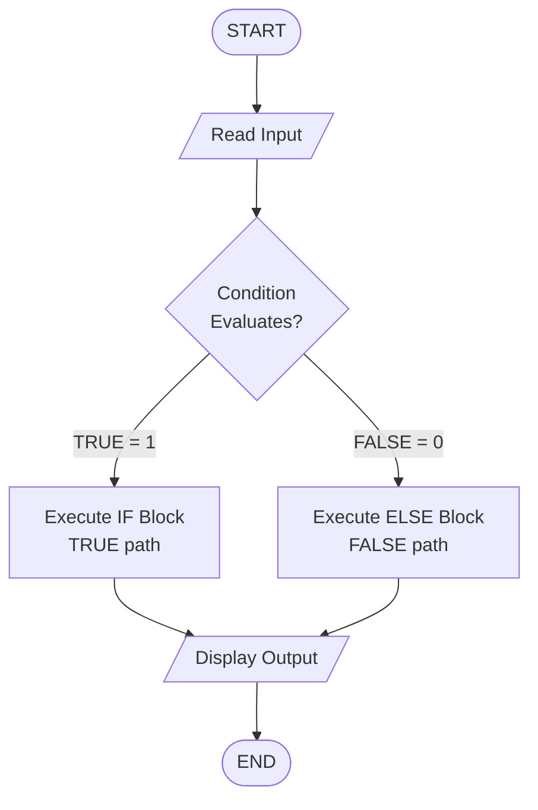
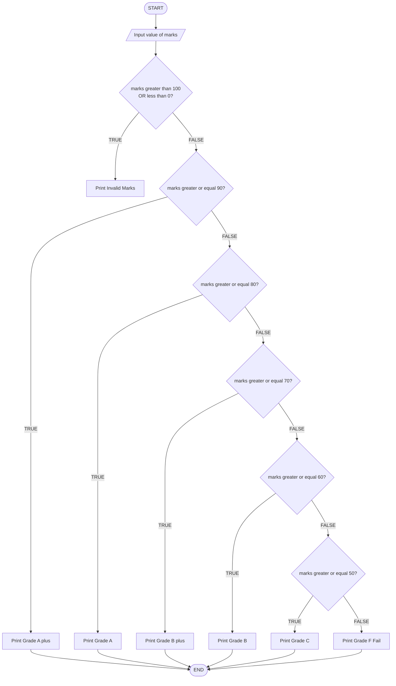
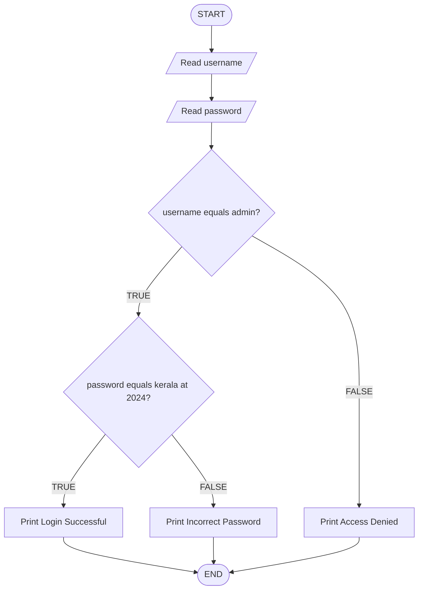
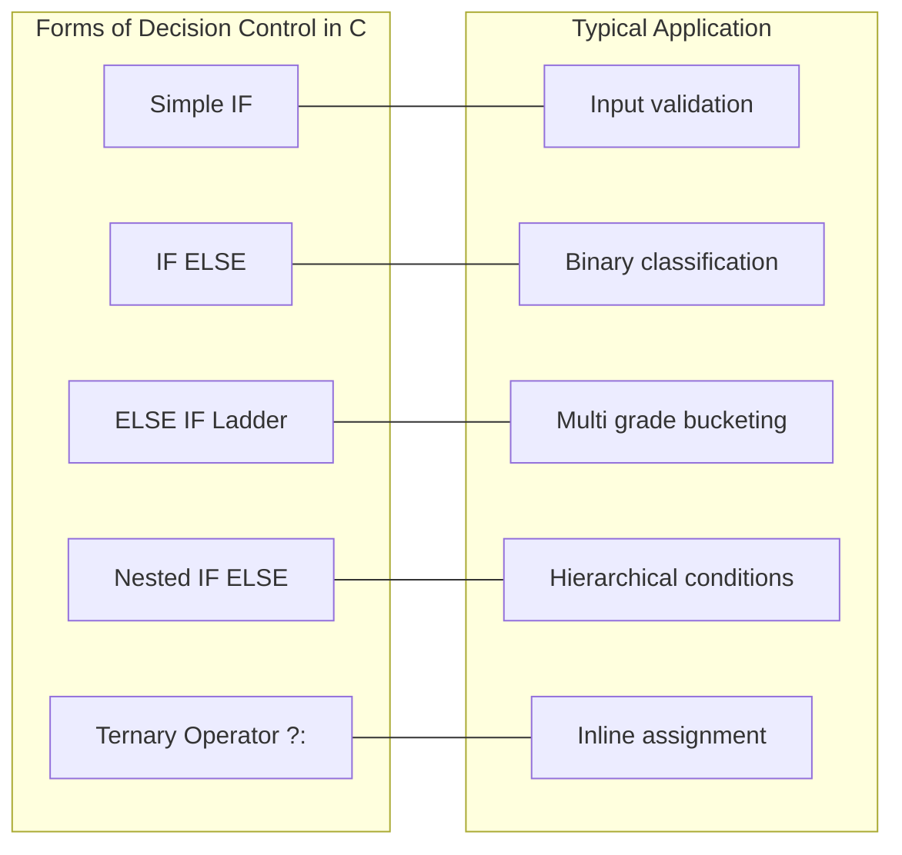

# if-else

<!-- SECTION_1_START -->

# if-else in C — Decision Control Structure

## 📘 Core Technical Definition (KTU 2024 Syllabus Aligned)

The **`if-else`** statement is a **two-way decision control structure** in C that allows the program to execute one block of statements when a given condition evaluates to **true (non-zero)** and a different block when the condition evaluates to **false (zero)**. It is a fundamental building block of **sequential flow control** that introduces branching into a program's execution path.

Formally, in C, the syntax is governed by the **ISO/IEC 9899:2018 (C17)** standard, where any non-zero value is treated as logically *true* and zero is treated as logically *false*.

> [!IMPORTANT]
> **KTU 2024 Syllabus Highlight (Module 1 — C Fundamentals):** The `if-else` construct falls under the topic **"Decision Making and Branching"**. Students must be able to write programs using `if`, `if-else`, `nested if-else`, `else-if ladder`, and the **conditional (ternary) operator** as a shorthand form.

> [!NOTE]
> **Conceptual Definition (Board Examiner's Wording):**
> "The `if-else` statement is a selection control mechanism that evaluates a relational or logical expression and directs the control flow to one of two alternative paths, ensuring that exactly one of the two statement blocks is executed during any single program run."

---

## 🧠 Intuitive Analogy — "The Fork in the Road"

Imagine you are walking along a road and you reach a **fork (Y-junction)** with a signboard:

- If the sign says **"HOTEL → LEFT"** → you take the **left path**.
- Otherwise (**"RIGHT"**) → you take the **right path**.

You will **always** take **one** path, never both, never neither. That is exactly how `if-else` works:

- **Condition is true** → execute the `if` block.
- **Condition is false** → execute the `else` block.

Another vivid analogy is an **automatic traffic signal controller**:

$$\text{If } \text{(vehicle\_detected)} = 1 \;\;\Rightarrow\;\; \text{Green Signal ON}$$
$$\text{Else} \;\;\Rightarrow\;\; \text{Red Signal ON}$$

The controller **must** do *something* — it never leaves the signal in an undefined state. This guarantees **deterministic branching**.

> [!TIP]
> **Quick Mental Model:** Think of `if-else` as a **bouncer at a club door**. The condition is the guest's ID. If valid (true) → enter the VIP lounge (`if` block). If invalid (false) → use the regular entrance (`else` block). One guest, one decision, one path.

---

## 🌍 Real-World Engineering Use-Cases

The `if-else` decision structure is the backbone of:

- **Embedded Systems:** Checking sensor thresholds (temperature > 100°C → trigger cooling fan).
- **Authentication Systems:** If username matches AND password matches → grant access; else → deny.
- **Game Development:** If player_health ≤ 0 → display "Game Over" screen.
- **IoT Devices:** If soil_moisture < threshold → activate water pump.
- **Banking Software:** If balance ≥ withdrawal_amount → debit and dispense cash; else → show "Insufficient Funds".

> [!VISUALIZATION CONTROL]
> **Concept:** Decision diamond flowchart for `if-else`
> **Pseudo-Graph Structure (to be drawn on GeoGebra/Desmos whiteboard):**
> * Start node (oval) → Condition diamond → two outgoing arrows (TRUE branch, FALSE branch) → two rectangular action boxes → join at End node (oval).
> **Visual Description:** A diamond shape with the condition expression inside. The right arrow (labeled "TRUE / 1") leads down to the `if-block`. The left arrow (labeled "FALSE / 0") leads down to the `else-block`. Both paths merge at a single endpoint.

---

<!-- SECTION_2_END -->

<!-- SECTION_2_START -->

# Deep Theoretical Analysis & KTU High-Yield Syntax Sheet

## 🔬 Variants of the `if-else` Construct

C provides **four** primary decision-making forms. Mastering all four is essential for the KTU 2024 ESE.

### 1️⃣ Simple `if` Statement (One-Way Selection)

Used when an action should occur **only if** a condition is true; no alternative action exists.

```c
if (condition) {
    // executes only when condition is true
}
```

### 2️⃣ `if-else` Statement (Two-Way Selection)

The classic form — guarantees **one of two** blocks executes.

```c
if (condition) {
    // Block A — TRUE path
} else {
    // Block B — FALSE path
}
```

### 3️⃣ `else-if` Ladder (Multi-Way Selection)

Used when **multiple mutually exclusive conditions** must be tested in sequence.

```c
if (condition_1) {
    // Block 1
} else if (condition_2) {
    // Block 2
} else if (condition_3) {
    // Block 3
} else {
    // Default Block
}
```

### 4️⃣ Nested `if-else`

An `if` or `else` block containing another `if-else` inside — used for **hierarchical decisions**.

```c
if (outer_condition) {
    if (inner_condition) {
        // both true
    } else {
        // outer true, inner false
    }
} else {
    // outer false
}
```

---

## 📐 KTU High-Yield Syntax & Operator Cheat Sheet

> [!IMPORTANT]
> **Master this table — it is the single most-tested aspect of Module 1 in KTU exams.**

| Construct | Syntax Pattern | Execution Rule | Typical KTU Use-Case |
|---|---|---|---|
| Simple `if` | `if (cond) stmt;` | Executes stmt **iff** cond ≠ 0 | Validate input |
| `if-else` | `if (cond) S1; else S2;` | Exactly **one** of S1 or S2 runs | Pass/Fail check |
| `else-if` ladder | `if(c1) S1; else if(c2) S2; ... else S;` | Top-down evaluation, **first match wins** | Grade classification |
| Nested `if` | `if(c1) { if(c2) {...} }` | Inner check **only** if outer is true | Login (user + pass) |
| Ternary `?:` | `cond ? expr1 : expr2` | Returns expr1 if true, else expr2 | Inline max/min |

### Relational & Logical Operators Used Inside `if`

| Operator | Meaning | Example | Evaluates To |
|---|---|---|---|
| `==` | Equal to | `5 == 5` | $1$ (true) |
| `!=` | Not equal to | `5 != 3` | $1$ (true) |
| `>` | Greater than | `7 > 10` | $0$ (false) |
| `<` | Less than | `3 < 8` | $1$ (true) |
| `>=` | Greater or equal | `5 >= 5` | $1$ (true) |
| `<=` | Less or equal | `4 <= 2` | $0$ (false) |
| `&&` | Logical AND | `(5>3) && (2>1)` | $1$ |
| `\|\|` | Logical OR | `(5<3) \|\| (2>1)` | $1$ |
| `!` | Logical NOT | `!(5==3)` | $1$ |

---

## 🧮 The Truth-Value Mechanics

In C, the condition inside `if ( ... )` is **always converted to an integer** via the rule:

$$\text{Condition Result} = \begin{cases} \text{Non-zero} \Rightarrow \text{TRUE} \\ \text{Zero} \Rightarrow \text{FALSE} \end{cases}$$

This means statements like `if (x)` and `if (x != 0)` are **logically equivalent**. The C17 standard (Section 6.8.4.1) formally states that the controlling expression of a selection statement is compared against $0$ for equality.

---

## ⚙️ Why `if-else` Matters in Engineering

- **Determinism:** Guarantees that the program always has a defined next step.
- **Resource Control:** Embedded systems use it to protect hardware (e.g., `if (voltage > MAX) shutdown();`).
- **Code Clarity:** Replaces complex mathematical branching with readable logical flow.
- **Foundation for Advanced Logic:** Forms the basis for `switch`, loops with conditions, and state machines.

---

<!-- SECTION_2_END -->

<!-- SECTION_3_START -->

# Step-by-Step Derivations, Trace Tables & Code Implementation

## 🛠️ Exhaustive Syntax Walkthrough with Programmatic Examples

### Example 1 — Basic `if-else` (Odd/Even Checker)

```c
#include <stdio.h>

int main(void) {
    int number;

    printf("Enter an integer: ");
    scanf("%d", &number);

    if (number % 2 == 0) {
        printf("%d is an EVEN number.\n", number);
    } else {
        printf("%d is an ODD number.\n", number);
    }

    return 0;
}
```

#### Step-by-Step Execution Trace

1. **Line 3:** `int number;` → allocates 4 bytes of stack memory, uninitialized.
2. **Line 5:** `printf` displays the prompt string.
3. **Line 6:** `scanf("%d", &number)` → reads user input, stores in `number`.
4. **Line 8:** The expression `number % 2 == 0` is evaluated:
   - First, `number % 2` is computed (remainder operator).
   - Then, the result is compared to $0$ using `==`.
   - The result is either $0$ (false) or $1$ (true).
5. **Line 9–11:** If comparison yields $1$ → executes the `if` block.
6. **Line 11–13:** Otherwise → executes the `else` block.
7. **Line 15:** Returns $0$ to the OS, indicating successful termination.

#### Dry Run Table

| User Input | `number % 2` | `== 0`? | Branch Taken | Output |
|---|---|---|---|---|
| $4$ | $0$ | TRUE ($1$) | `if` block | "4 is an EVEN number." |
| $7$ | $1$ | FALSE ($0$) | `else` block | "7 is an ODD number." |
| $0$ | $0$ | TRUE ($1$) | `if` block | "0 is an EVEN number." |
| $-3$ | $-1$ | FALSE ($0$) | `else` block | "-3 is an ODD number." |

> [!NOTE]
> **Why `-3 % 2 == -1`?** In C11/C17, the sign of the remainder follows the dividend. The comparison `-1 == 0` still correctly evaluates to FALSE, so the logic remains correct for negative numbers.

---

### Example 2 — `else-if` Ladder (Grade Classification)

```c
#include <stdio.h>

int main(void) {
    int marks;

    printf("Enter your marks (0-100): ");
    scanf("%d", &marks);

    if (marks < 0 || marks > 100) {
        printf("Invalid marks entered.\n");
    } else if (marks >= 90) {
        printf("Grade: A+\n");
    } else if (marks >= 80) {
        printf("Grade: A\n");
    } else if (marks >= 70) {
        printf("Grade: B+\n");
    } else if (marks >= 60) {
        printf("Grade: B\n");
    } else if (marks >= 50) {
        printf("Grade: C\n");
    } else {
        printf("Grade: F (Fail)\n");
    }

    return 0;
}
```

#### Trace Analysis — Why Order Matters

| Input | First TRUE Condition | Output | Logical Justification |
|---|---|---|---|
| $95$ | `marks >= 90` | "A+" | Highest threshold first |
| $82$ | `marks >= 80` | "A" | Skips $90$ check (false), hits $80$ |
| $40$ | (default `else`) | "F" | All `>=` checks fail |

> [!IMPORTANT]
> **Critical KTU Pitfall:** In an `else-if` ladder, conditions are evaluated **top-down**. The **first** true condition wins, and the rest are **skipped**. Reversing the order (e.g., `>= 50` first) would cause $95$ to wrongly print "C".

---

### Example 3 — Nested `if-else` (Login Authentication)

```c
#include <stdio.h>
#include <string.h>

int main(void) {
    char username[20];
    char password[20];

    printf("Username: ");
    scanf("%19s", username);
    printf("Password: ");
    scanf("%19s", password);

    if (strcmp(username, "admin") == 0) {
        if (strcmp(password, "kerala@2024") == 0) {
            printf("Login Successful. Welcome, Admin!\n");
        } else {
            printf("Incorrect password for admin user.\n");
        }
    } else {
        printf("Unknown username. Access Denied.\n");
    }

    return 0;
}
```

#### Logical Flow Derivation

Let $U$ = username match, $P$ = password match.

$$\text{Outcome} = \begin{cases} (U = 1) \land (P = 1) & \Rightarrow \text{Login Successful} \\ (U = 1) \land (P = 0) & \Rightarrow \text{Incorrect password} \\ (U = 0) & \Rightarrow \text{Access Denied} \end{cases}$$

#### Truth Table for Nested Logic

| $U$ (username match) | $P$ (password match) | Branch Entered | Output |
|---|---|---|---|
| $0$ | $0$ | Outer `else` | "Unknown username" |
| $0$ | $1$ | Outer `else` | "Unknown username" (password never checked) |
| $1$ | $0$ | Inner `else` | "Incorrect password" |
| $1$ | $1$ | Innermost `if` | "Login Successful" |

> [!NOTE]
> **Security Insight:** Notice that when $U = 0$, the password is **never evaluated**. This is both an efficiency and a security best-practice pattern in real authentication systems (avoid leaking password-check timing).

---

### Example 4 — Ternary Operator as a Shorthand

The conditional operator `?:` is a compact form of `if-else` that **returns a value**.

```c
#include <stdio.h>

int main(void) {
    int a = 15, b = 27;
    int max;

    max = (a > b) ? a : b;

    printf("Maximum of %d and %d is %d\n", a, b, max);

    return 0;
}
```

#### Operational Breakdown

$$\text{max} = \begin{cases} a & \text{if } (a > b) \text{ is true} \\ b & \text{otherwise} \end{cases}$$

Since $15 > 27$ is FALSE, `max` is assigned $b = 27$.

Output:
```
Maximum of 15 and 27 is 27
```

---

## 🔄 Conversion: `if-else` ↔ Ternary Operator

| `if-else` Form | Ternary Equivalent |
|---|---|
| `if (x>0) y=1; else y=-1;` | `y = (x>0) ? 1 : -1;` |
| `if (a==b) printf("Equal");` | `printf("%s", (a==b) ? "Equal" : "Not Equal");` |

> [!TIP]
> Use ternary **only for short, single-expression assignments**. For multi-statement blocks, use the full `if-else`.

---

<!-- SECTION_3_END -->

<!-- SECTION_4_START -->

# Structural Diagrams & Schematics (Mermaid)

## 📊 Diagram 1 — Basic `if-else` Flowchart



---

## 📊 Diagram 2 — `else-if` Ladder (Multi-Way Decision)



---

## 📊 Diagram 3 — Nested `if-else` (Login Authentication)



---

## 📊 Diagram 4 — Decision Topology Matrix (Comparison Table as Diagram)



---

<!-- SECTION_4_END -->

<!-- SECTION_5_START -->

# KTU 2024 Scheme Examination Question Bank

## 📝 Part A — Short Answer Questions (3 Marks Each)

### Question 1
**[KTU University Exam — July 2024 | CO1 | Remember]**

> Differentiate between the `if` statement and the `if-else` statement in C. Provide one example for each.

**Model Answer (3 Marks):**

- The simple `if` statement is a **one-way selection** structure that executes a block of statements only when the given condition is true. If the condition is false, control simply passes to the next statement after the `if` block, and **no alternative action** is performed. (1 Mark)
- The `if-else` statement is a **two-way selection** structure that ensures one of two blocks is always executed — the `if` block when the condition is true, and the `else` block when the condition is false. (1 Mark)
- Example of `if`: `if (age >= 18) printf("Eligible to vote.\n");`
- Example of `if-else`: `if (age >= 18) printf("Eligible.\n"); else printf("Not eligible.\n");` (1 Mark)

---

### Question 2
**[KTU University Exam — Dec 2023 | CO1 | Understand]**

> What is the role of the conditional (ternary) operator in C? Rewrite the following `if-else` using the ternary operator:
>
> ```c
> if (x % 2 == 0)
>     printf("Even");
> else
>     printf("Odd");
> ```

**Model Answer (3 Marks):**

The conditional (ternary) operator `?:` is a **shorthand notation** for the `if-else` statement. It is the only ternary operator in C and takes three operands: a condition, a true-expression, and a false-expression. (1 Mark)

Syntax: `condition ? expression_if_true : expression_if_false;`

Rewritten using ternary:

```c
printf("%s", (x % 2 == 0) ? "Even" : "Odd");
```

(2 Marks — 1 for correct syntax, 1 for correct output formatting)

---

## 📝 Part B — Long Answer Questions (14 Marks Each)

> **KTU ESE Format:** Each Part B question carries 14 marks with **internal choice**. Sub-parts (a) and (b) carry 7 marks each. The expected answer length is **8–10 pages** of the standard KTU answer booklet.

---

### 🔷 Question A (14 Marks)

**[KTU University Exam — July 2024 | CO2 | Apply / Analyze]**

**(a)** Explain the syntax and working of the `if-else` statement in C with a suitable flowchart. Illustrate with a C program to find the **largest of three numbers** entered by the user. **(7 Marks)**

**(b)** Write a C program using `nested if-else` to determine whether a given **year is a leap year or not**. Explain the logic with a truth table. **(7 Marks)**

---

#### Model Solution — Part A(a)

**Syntax Explanation (2 Marks):**

```c
if (test_condition) {
    // Statement block 1 — executes if condition is TRUE
} else {
    // Statement block 2 — executes if condition is FALSE
}
```

The test condition is any valid C expression producing a non-zero (true) or zero (false) result.

**Flowchart (1 Mark):** Refer to Diagram 1 in SECTION_4 — a decision diamond with TRUE/FALSE branches.

**Program to Find the Largest of Three Numbers (4 Marks):**

```c
#include <stdio.h>

int main(void) {
    int a, b, c, largest;

    printf("Enter three integers: ");
    scanf("%d %d %d", &a, &b, &c);

    if (a >= b && a >= c) {
        largest = a;
    } else if (b >= a && b >= c) {
        largest = b;
    } else {
        largest = c;
    }

    printf("The largest number is: %d\n", largest);

    return 0;
}
```

**Valuation Key Points:**
- `[Correct header and variable declarations: 1 Mark]`
- `[Proper use of if-else if-else with logical AND: 1 Mark]`
- `[Correct assignment of largest: 1 Mark]`
- `[Formatted output and return statement: 1 Mark]`

---

#### Model Solution — Part A(b)

**Leap Year Logic Explanation (2 Marks):**

A year is a **leap year** if it satisfies **both** conditions:

1. The year is **divisible by 4** AND
2. The year is **NOT divisible by 100** OR **divisible by 400**.

Truth Table (1 Mark):

| Year | Div by 4? | Div by 100? | Div by 400? | Leap Year? |
|---|---|---|---|---|
| $2000$ | YES | YES | YES | **YES** |
| $1900$ | YES | YES | NO | **NO** |
| $2024$ | YES | NO | NO | **YES** |
| $2023$ | NO | NO | NO | **NO** |

**C Program Using Nested `if-else` (4 Marks):**

```c
#include <stdio.h>

int main(void) {
    int year;

    printf("Enter a year: ");
    scanf("%d", &year);

    if (year % 4 == 0) {
        if (year % 100 == 0) {
            if (year % 400 == 0) {
                printf("%d is a leap year.\n", year);
            } else {
                printf("%d is NOT a leap year.\n", year);
            }
        } else {
            printf("%d is a leap year.\n", year);
        }
    } else {
        printf("%d is NOT a leap year.\n", year);
    }

    return 0;
}
```

**Valuation Key Points:**
- `[Correct outer condition year%4==0: 1 Mark]`
- `[Correct middle nested condition year%100==0: 1 Mark]`
- `[Correct innermost condition year%400==0: 1 Mark]`
- `[Properly paired else blocks and output: 1 Mark]`

---

### 🔶 Question B (14 Marks) — *INTERNAL CHOICE*

**[KTU University Exam — Dec 2023 | CO2 | Apply / Analyze]**

**(a)** Explain the **else-if ladder** with its general syntax. Write a C program to read a student's **marks (0–100)** and display the corresponding **grade** using the following rules:
- $90$ to $100$ → **S Grade**
- $80$ to $89$ → **A Grade**
- $70$ to $79$ → **B Grade**
- $60$ to $69$ → **C Grade**
- $50$ to $59$ → **D Grade**
- Below $50$ → **F Grade (Fail)**
- Outside $0$–$100$ → **Invalid Input** **(7 Marks)**

**(b)** Write a C program using `if-else` to check whether a given **character is a vowel or a consonant**. Use logical OR (`||`) in your solution. Explain why `||` is preferred over multiple separate `if` statements. **(7 Marks)**

---

#### Model Solution — Part B(a)

**General Syntax of `else-if` Ladder (2 Marks):**

```c
if (condition_1)
    statement_1;
else if (condition_2)
    statement_2;
else if (condition_3)
    statement_3;
...
else
    default_statement;
```

Execution proceeds **top-down**; the first true condition's block executes, and the entire ladder is exited.

**C Program for Grade Classification (5 Marks):**

```c
#include <stdio.h>

int main(void) {
    int marks;

    printf("Enter marks (0-100): ");
    scanf("%d", &marks);

    if (marks < 0 || marks > 100) {
        printf("Invalid input. Marks must be between 0 and 100.\n");
    } else if (marks >= 90) {
        printf("Grade: S\n");
    } else if (marks >= 80) {
        printf("Grade: A\n");
    } else if (marks >= 70) {
        printf("Grade: B\n");
    } else if (marks >= 60) {
        printf("Grade: C\n");
    } else if (marks >= 50) {
        printf("Grade: D\n");
    } else {
        printf("Grade: F (Fail)\n");
    }

    return 0;
}
```

**Valuation Key Points:**
- `[Correct validation for out-of-range input: 1 Mark]`
- `[Proper descending order of conditions (90 first, 50 last): 1 Mark]`
- `[Each correct grade branch: 1 Mark]`
- `[Proper else block for fail case: 1 Mark]`
- `[Well-formatted output: 1 Mark]`

---

#### Model Solution — Part B(b)

**C Program to Check Vowel or Consonant (5 Marks):**

```c
#include <stdio.h>

int main(void) {
    char ch;

    printf("Enter an alphabet: ");
    scanf("%c", &ch);

    /* Convert lowercase to uppercase for uniform checking */
    if (ch >= 'a' && ch <= 'z') {
        ch = ch - ('a' - 'A');
    }

    if (ch >= 'A' && ch <= 'Z') {
        if (ch == 'A' || ch == 'E' || ch == 'I' ||
            ch == 'O' || ch == 'U') {
            printf("%c is a VOWEL.\n", ch);
        } else {
            printf("%c is a CONSONANT.\n", ch);
        }
    } else {
        printf("%c is not a valid alphabet.\n", ch);
    }

    return 0;
}
```

**Why `||` is Preferred (2 Marks):**

The logical OR operator `||` combines multiple equality checks into a **single, atomic condition**. This is preferred over multiple separate `if` statements because:

1. **Efficiency:** Only one evaluation occurs; the compiler can short-circuit as soon as a TRUE is found.
2. **Logical Clarity:** The intent — "is the character any one of these vowels?" — is expressed in a single line, mirroring the mathematical union: $V = \{A, E, I, O, U\}$.
3. **Maintainability:** Adding a new vowel (e.g., in a hypothetical extended alphabet) only requires appending `|| ch == 'Y'` rather than writing a new `if` block.

**Valuation Key Points:**
- `[Correct use of || for vowel check: 2 Marks]`
- `[Case conversion logic (lowercase to uppercase): 1 Mark]`
- `[Validation for non-alphabet input: 1 Mark]`
- `[Explanation of why || is preferred: 1 Mark]`

---

> [!WARNING]
> **KTU Examiner's Valuation Warning — Common Pitfalls (Lose Marks Here!):**
> 1. **Forgetting the `else` keyword:** Students often write `if (cond) { ... } if (cond2) { ... }` instead of `else if (cond2) { ... }`. This creates **two independent `if` statements**, both of which can execute, leading to wrong output. Always use `else if` in a ladder.
> 2. **Confusing `=` with `==`:** Writing `if (x = 5)` assigns $5$ to `x` (always true) instead of testing equality. Use `if (x == 5)`.
> 3. **Missing braces `{}` for multi-statement blocks:** If the `if` body has multiple statements without braces, only the **first** statement is treated as the body.
> 4. **Wrong order in `else-if` ladder:** Placing `marks >= 50` before `marks >= 90` causes wrong grade assignment. Always order from **most restrictive to least restrictive**.
> 5. **Not handling boundary values:** In leap year, $1900$ is divisible by $4$ and $100$ but not $400$ → NOT a leap year. Students often miss the `% 400` check.
> 6. **Skipping the flowchart in theory questions:** KTU examiners allocate **1–2 marks** specifically for the flowchart/diagram. Always include it.

---

## 🧠 Topic Recap & Important Things to Remember

> [!NOTE]
> **Rapid Revision Checklist — Pin This Before Every Exam**

- ✅ The `if-else` is a **two-way selection** statement; one of the two blocks **always** executes.
- ✅ Condition is TRUE if the expression is **non-zero**, FALSE if it is **zero** (per C17 standard §6.8.4.1).
- ✅ Always use **`==`** for comparison, never **`=`** (which is assignment).
- ✅ Use **braces `{}`** for multi-statement blocks to avoid logical errors.
- ✅ An `else` clause is always matched with the **nearest unmatched `if`** (dangling else rule).
- ✅ In an `else-if` ladder, conditions are checked **top-down**; the **first TRUE** block runs, and the rest are skipped.
- ✅ The ternary operator `?:` is a **value-returning shorthand** for `if-else`; it cannot replace multi-statement blocks.
- ✅ Nested `if-else` is used for **hierarchical conditions** (e.g., user authentication: outer checks username, inner checks password).
- ✅ Always validate input **first** in a ladder (e.g., `marks < 0 || marks > 100` → invalid).
- ✅ **Logical operators**: `&&` (AND) — both must be true; `||` (OR) — at least one must be true; `!` (NOT) — inverts.
- ✅ **Trace tables** are the KTU board examiner's gold standard for showing program understanding — draw one for any nested logic.
- ✅ Common KTU 14-mark pattern: *one part asks for a ladder, the other for nested if-else* — prepare both.
- ✅ Drawing the **flowchart** in theory questions is mandatory — it carries **1–2 dedicated marks**.
- ✅ The dangling-else ambiguity is **resolved by the compiler** by binding `else` to the nearest `if` — use braces to make intent explicit.

---

<!-- SECTION_5_END -->
