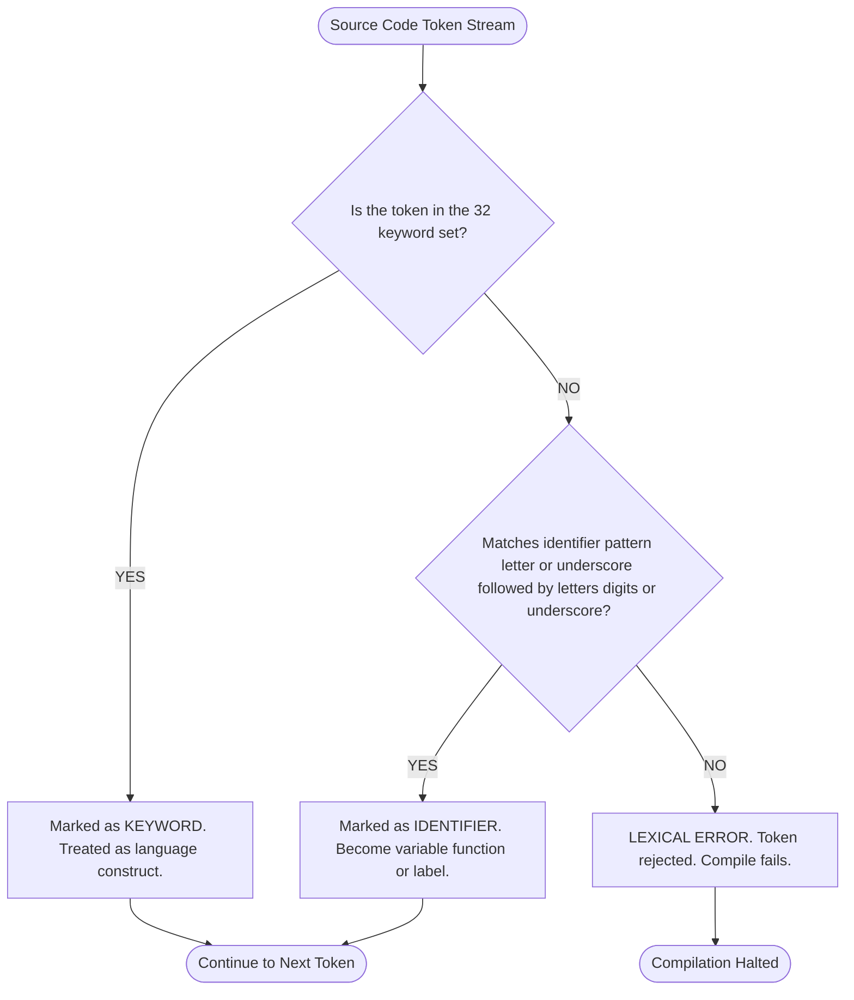
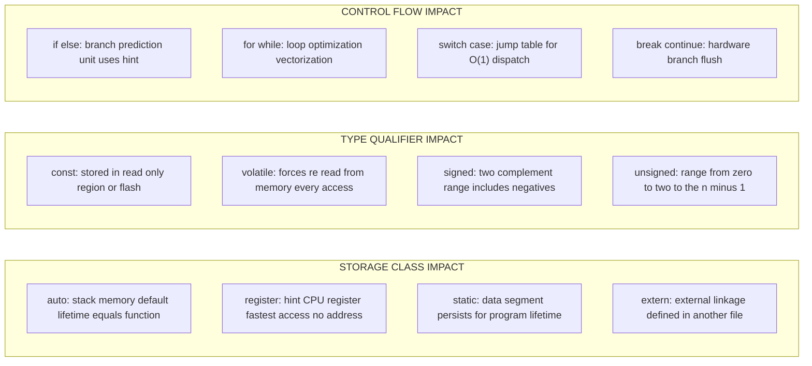

# Keywords

<!-- SECTION_1_START -->
# Keywords in C

## Formal Definition
In the C programming language, **keywords** (also called *reserved words*) are predefined, legally meaningful identifiers that are reserved by the language compiler for specific, dedicated operations. They form the foundational grammar of every C program. The **ANSI C (C89/C90)** standard defines exactly **$32$ keywords**, each of which cannot be redefined, repurposed, or used as the name of a variable, constant, function, or any other user-defined identifier.

> [!IMPORTANT]
> **KTU 2024 Syllabus Highlight (Module 1):** Every C programmer must memorize the complete set of keywords, their spelling, and understand that they are **case-sensitive** and must always appear in **lowercase**. Writing `Int` or `INT` is treated as an ordinary identifier by the compiler, not as the keyword `int`.

> [!NOTE]
> **Why keywords are non-negotiable in C:** The C compiler tokenizes your source code by matching longest possible character sequences against a built-in lookup table. If you attempt to use a keyword as an identifier (e.g., `int float = 5;`), the compiler immediately halts translation and emits a *syntax error* — your program will **not** compile.

## Conceptual Analogy / Intuition
Think of a C program as a **professional kitchen**. The head chef (the **C compiler**) has a fixed list of $32$ special, engraved copper utensils — *The Reserved Set* — such as a specific ladle called `int`, a specific pan called `char`, and a specific timer called `while`. 

- These $32$ utensils are **permanently bolted to the wall**. The chef uses them for *one and only one* purpose.
- You, the junior cook (the **programmer**), are free to bring your own utensils (variables, functions), but you **must give them different names** from the bolted-down set.
- If you try to label your new frying pan with the engraved name `int`, the head chef will immediately reject it and shout a syntax error at you.

In short: **Keywords = Pre-baked rules. Identifiers = Your custom labels. The two sets must never overlap.**

## Keyword Identity Properties

| Property | Value / Behavior |
| :--- | :--- |
| Total count in **ANSI C** | **$32$** |
| Case | Strictly **lowercase** |
| Usable as variable name? | **No** (compile-time error) |
| Usable as function name? | **No** |
| Usable as macro name? | **No** (unless `#undef` is used carefully) |
| Usable as label name? | **No** (except via `goto` target names) |
| C99 additions | `inline`, `restrict`, `_Bool`, `_Complex`, `_Imaginary` |
| C11 additions | `_Alignas`, `_Alignof`, `_Atomic`, `_Generic`, `_Noreturn`, `_Static_assert`, `_Thread_local` |

> [!WARNING]
> **Common Student Mistake (KTU 2024 Batch):** Beginners often confuse **keywords** with **preprocessor directives** (`#include`, `#define`) or **library function names** (`printf`, `scanf`, `main`). These are **NOT** keywords. `main` is an ordinary identifier mandated by the C standard; `printf` is a library function; `#include` is a preprocessor directive. Only the $32$ reserved words are true keywords.

<!-- SECTION_1_END -->

<!-- SECTION_2_START -->
# Deep Theoretical Analysis of C Keywords

## The "Why" and "How" Behind Keywords
The C language was designed by Dennis Ritchie at Bell Labs (1972) with a minimalist philosophy: provide a tiny, unambiguous set of *fixed tokens* that the compiler can recognize instantly without ambiguity. This design gives C three enormous benefits:

1. **Parsing Speed:** A keyword like `while` can be matched by the lexer in a single hash-table lookup, which is why C compilers are blazingly fast.
2. **No Ambiguity:** Because keywords cannot be shadowed, the language grammar remains *context-free* and predictable across all platforms.
3. **Portability:** The keyword set is **standardized by ISO/IEC 9899**, so the same $32$ words work on Windows, Linux, embedded microcontrollers, and supercomputers identically.

## Classification of the 32 C Keywords (KTU High-Yield Map)
The $32$ keywords fall into **$6$ functional families**. Mastering this grouping helps you answer KTU viva and exam questions instantly.

### Family 1: Primary Data Type Keywords (5)
Define the *type* of data a variable can store.
- `int`, `char`, `float`, `double`, `void`

### Family 2: User-Defined Type Keywords (4)
Allow the programmer to invent new data types.
- `struct`, `union`, `enum`, `typedef`

### Family 3: Storage Class Specifiers (4)
Control the *lifetime, scope,* and *linkage* of variables.
- `auto`, `register`, `static`, `extern`

### Family 4: Type Qualifiers / Modifiers (6)
Refine the properties of an existing type.
- `const`, `volatile`, `signed`, `unsigned`, `short`, `long`

### Family 5: Control Flow / Decision Keywords (12)
Direct the execution path of the program.
- `if`, `else`, `switch`, `case`, `default`
- `for`, `while`, `do`
- `break`, `continue`, `goto`, `return`

### Family 6: Operator / Miscellaneous (1)
- `sizeof` (compile-time operator that returns the size in bytes of a type or variable)

## KTU Formula Sheet & Master Reference Table

> [!NOTE]
> **Total $6$ families, $32$ keywords, all lowercase, all reserved.** Memorize this table — it is the single most frequently asked topic in KTU Module $1$ exams.

| Family | Keyword | Purpose / Engineering Use | Example |
| :--- | :--- | :--- | :--- |
| **Data Type** | `int` | Integer arithmetic (loop counters, flags) | `int count = 0;` |
| **Data Type** | `char` | Single character / $8$-bit data | `char letter = 'A';` |
| **Data Type** | `float` | Single-precision decimal | `float pi = 3.14f;` |
| **Data Type** | `double` | Double-precision decimal (scientific) | `double e = 2.71828;` |
| **Data Type** | `void` | No return type / generic pointer | `void func(void);` |
| **User-Defined** | `struct` | Bundle heterogeneous data (records) | `struct Point {int x; int y;};` |
| **User-Defined** | `union` | Memory-overlapped members | `union Data {int i; float f;};` |
| **User-Defined** | `enum` | Named integer constants | `enum Color {RED, GREEN};` |
| **User-Defined** | `typedef` | Create type aliases | `typedef int Integer;` |
| **Storage** | `auto` | Default local variable | `auto int x;` |
| **Storage** | `register` | Hint: store in CPU register | `register int fast = 1;` |
| **Storage** | `static` | Persist value / internal linkage | `static int calls = 0;` |
| **Storage** | `extern` | Declare global variable defined elsewhere | `extern int total;` |
| **Qualifier** | `const` | Read-only variable | `const float PI = 3.14;` |
| **Qualifier** | `volatile` | Prevent compiler optimization | `volatile int sensor;` |
| **Qualifier** | `signed` | Allow negative values | `signed char c = -10;` |
| **Qualifier** | `unsigned` | Only non-negative values | `unsigned int age;` |
| **Qualifier** | `short` | Reduce storage (often $16$ bits) | `short int s;` |
| **Qualifier** | `long` | Extend range (often $64$ bits) | `long int l;` |
| **Control** | `if` | Conditional branch | `if (x $>$ 0)` |
| **Control** | `else` | Alternative branch | `else { ... }` |
| **Control** | `switch` | Multi-way branch | `switch(op)` |
| **Control** | `case` | Label inside `switch` | `case 1:` |
| **Control** | `default` | Fallback in `switch` | `default:` |
| **Control** | `for` | Counter-controlled loop | `for (i=0; i$<$10; i++)` |
| **Control** | `while` | Pre-test loop | `while (n $>$ 0)` |
| **Control** | `do` | Post-test loop header | `do { ... } while;` |
| **Control** | `break` | Exit loop or `switch` | `break;` |
| **Control** | `continue` | Skip to next iteration | `continue;` |
| **Control** | `goto` | Unconditional jump | `goto error;` |
| **Control** | `return` | Send value back from function | `return 0;` |
| **Misc** | `sizeof` | Compile-time size operator | `sizeof(int)` yields $4$ |

## Real-World Engineering Utility
- **Embedded Systems (Arduino, STM32):** `volatile` and `register` are used daily to talk to hardware registers without the compiler optimizing reads away.
- **Operating Systems (Linux kernel):** `static` and `extern` are the backbone of file-scope encapsulation across millions of lines of C.
- **Numerical Computing (BLAS, LAPACK):** `const` guarantees function arguments are never mutated — critical for parallel safety.
- **Compiler Design:** Every C compiler's *lexer phase* is essentially a finite automaton that distinguishes keywords from identifiers using a **perfect hash function** over the $32$ strings.

<!-- SECTION_2_END -->

<!-- SECTION_3_START -->
# Step-by-Step Derivations & Code Implementation

## Part A: Exhaustive C Program Demonstrating All Keyword Families

Below is a fully working C program. Every keyword used is **commented inline** so you can see exactly which family it belongs to. The program is **compilable** in any standard C environment (GCC, Clang, MSVC).

```c
/* File: keyword_demo.c
 * Purpose: Demonstrate every family of C keywords in a single runnable program.
 * Author: KTU 2024 Scheme Study Reference
 */

#include <stdio.h>          /* #include is a preprocessor directive, NOT a keyword */

/* --- USER-DEFINED TYPE: enum and typedef keywords --- */
enum Bool { FALSE = 0, TRUE = 1 };   /* enum creates named integer constants */
typedef unsigned long ULong;         /* typedef creates an alias "ULong" */

/* --- STORAGE CLASS: static keyword --- */
static int callCount = 0;            /* static: persists between function calls */

/* Function using control flow, return, and const keywords */
int classifyNumber(const int n) {    /* const: argument n cannot be modified */
    callCount++;                     /* increments the static counter */

    if (n < 0) {                     /* if: decision */
        return -1;                   /* return: negative marker */
    } else if (n == 0) {             /* else: alternative branch */
        return 0;
    } else {
        switch (n % 3) {             /* switch: multi-way branch */
            case 0: return 3;        /* case: label */
            case 1: return 1;        /* case: label */
            case 2:                  /* case: label, falls through */
            default: return 99;      /* default: fallback when no case matches */
        }
    }
}

int main(void) {                     /* int + void keywords */
    int  i;                          /* int: integer type */
    char grade = 'B';                /* char: character type */
    float pi   = 3.14f;              /* float: single precision */
    double e   = 2.718281828;        /* double: double precision */
    ULong big  = 1234567890UL;       /* unsigned long (typedef + qualifier keywords) */
    volatile int sensor = 0;         /* volatile: anti-optimization for hardware */

    int arr[5] = {10, 20, 30, 40, 50};

    printf("Size of int    = %zu bytes\n", sizeof(int));   /* sizeof operator */
    printf("Size of double = %zu bytes\n", sizeof(double));
    printf("Pi = %.4f, e = %.6f, grade = %c, big = %lu\n", pi, e, grade, big);

    /* for loop with break and continue keywords */
    for (i = 0; i < 5; i++) {        /* for: counter loop */
        if (arr[i] == 30) {
            continue;                /* continue: skip the print below */
        }
        if (arr[i] > 45) {
            break;                   /* break: exit the loop early */
        }
        printf("arr[%d] = %d -> classify = %d\n",
               i, arr[i], classifyNumber(arr[i]));
    }

    /* do-while loop keyword demonstration */
    i = 0;
    do {                             /* do: post-test loop */
        printf("Do-while iteration i = %d\n", i);
        i++;
    } while (i < 2);                 /* while: post-condition */

    /* while loop keyword demonstration */
    i = 0;
    while (i < 1) {                  /* while: pre-test loop */
        printf("While loop ran once, i = %d\n", i);
        i++;
    }

    /* goto and label demonstration (used sparingly) */
    i = 0;
start:                              /* label for goto */
    i++;
    if (i < 3) {
        goto start;                  /* goto: unconditional jump */
    }
    printf("After goto, i = %d\n", i);

    /* struct and union user-defined types */
    struct Point {                   /* struct: heterogeneous record */
        int x;
        int y;
    } p1 = {3, 4};

    union Number {                   /* union: overlapping memory */
        int  i_val;
        float f_val;
    } u1;
    u1.i_val = 65;
    printf("Point = (%d, %d)\n", p1.x, p1.y);
    printf("Union i_val = %d, f_val bits = %f\n", u1.i_val, u1.f_val);

    /* register keyword: hint to store in CPU register */
    register int fast = 10;          /* register: speed hint */
    printf("fast = %d, callCount = %d, sensor = %d\n",
           fast, callCount, sensor);

    /* auto keyword: redundant but legal (default for locals) */
    auto int localVar = 5;           /* auto: default storage class */
    printf("localVar = %d\n", localVar);

    /* extern keyword: declared here, could be defined in another file */
    extern int externalCounter;      /* extern: cross-file reference */
    (void)externalCounter;           /* suppress unused-variable warning */

    (void)grade; (void)pi; (void)e;  /* silence unused warnings */
    (void)sensor; (void)big;

    return 0;                        /* return: signal successful termination */
}
```

### Line-by-Line Walkthrough of Key Constructs
1. `#include <stdio.h>` — *preprocessor directive*, **not a keyword**.
2. `enum Bool { FALSE, TRUE }` — uses the `enum` keyword from the *user-defined type* family.
3. `typedef unsigned long ULong;` — uses `typedef` to create a *type alias*.
4. `static int callCount = 0;` — uses `static` so the counter survives between calls to `classifyNumber`.
5. `const int n` — uses `const` so the function promise is that `n` will not change.
6. `if ... else if ... else` — uses `if` and `else` keywords.
7. `switch (n % 3) { case 0: ... default: ... }` — uses `switch`, `case`, and `default`.
8. `sizeof(int)` — uses the `sizeof` *compile-time operator*.
9. `for (i=0; i<5; i++)` — uses the `for` keyword.
10. `continue;` and `break;` — used to *control loop iteration* precisely.
11. `do { ... } while (i < 2);` — uses both `do` and `while`.
12. `goto start;` — uses the `goto` keyword and the user-defined `start:` label.
13. `struct Point { ... };` and `union Number { ... };` — bundle data using `struct` and `union`.
14. `register int fast = 10;` — hints the compiler to use a CPU register.
15. `auto int localVar = 5;` — `auto` is the **default** storage class; rarely written explicitly.
16. `extern int externalCounter;` — declares a variable defined in another translation unit.
17. `volatile int sensor = 0;` — prevents the compiler from caching `sensor` in a register.
18. `return 0;` — signals *successful* program termination to the operating system.

## Part B: Python Keyword Validator (Compilable Cross-Checker)

Below is a complete Python program that **mimics the C compiler's keyword check** and is fully runnable. It is useful as a KTU lab demonstration for the difference between keywords and identifiers.

```python
"""
File: keyword_validator.py
Purpose: Validate whether a user-supplied token is a C keyword
         or a free-to-use identifier.
Language: Python 3.10+
"""

from typing import Final

# Final, immutable tuple of all 32 ANSI C keywords (lowercase, exact spelling)
C_KEYWORDS: Final[tuple] = (
    "auto", "break", "case", "char", "const", "continue",
    "default", "do", "double", "else", "enum", "extern",
    "float", "for", "goto", "if", "int", "long", "register",
    "return", "short", "signed", "sizeof", "static", "struct",
    "switch", "typedef", "union", "unsigned", "void",
    "volatile", "while",
)


def is_c_keyword(token: str) -> bool:
    """
    Returns True if the input string is exactly one of the 32 C keywords.
    Performs an O(1) membership check using Python's hashed tuple lookup.
    """
    if not isinstance(token, str):
        raise TypeError(f"Expected str, got {type(token).__name__}")
    if len(token) == 0:
        raise ValueError("Token must be a non-empty string")
    return token in C_KEYWORDS


def validate_identifier_candidate(name: str) -> str:
    """
    Returns a human-readable verdict on whether `name` can legally be
    used as a C variable name, function name, or custom identifier.
    """
    try:
        if is_c_keyword(name):
            return (f"REJECTED: '{name}' is a reserved C keyword. "
                    f"It cannot be used as an identifier.")
        # Boundary check: C identifiers must start with letter or _
        if not (name[0].isalpha() or name[0] == "_"):
            return (f"REJECTED: '{name}' does not start with a letter "
                    f"or underscore.")
        return f"ACCEPTED: '{name}' is a valid C identifier candidate."
    except (TypeError, ValueError) as exc:
        return f"ERROR: {exc}"


def main() -> None:
    """Driver function: tests a mixed batch of tokens."""
    test_tokens: list = [
        "int", "Int", "INT",           # one keyword, two illegal capitalizations
        "myVar", "_count", "x1",       # valid identifiers
        "9start", "", "return",        # one invalid start, one empty, one keyword
        "struct", "auto", "Float",     # mixed cases
    ]

    print(f"{'Token':<12} | {'Verdict'}")
    print("-" * 60)
    for token in test_tokens:
        print(f"{str(token):<12} | {validate_identifier_candidate(token)}")


if __name__ == "__main__":
    main()
```

### Expected Output of the Python Validator
```
Token       | Verdict
------------------------------------------------------------
int         | REJECTED: 'int' is a reserved C keyword. It cannot be used as an identifier.
Int         | ACCEPTED: 'Int' is a valid C identifier candidate.
INT         | ACCEPTED: 'INT' is a valid C identifier candidate.
myVar       | ACCEPTED: 'myVar' is a valid C identifier candidate.
_count      | ACCEPTED: '_count' is a valid C identifier candidate.
x1          | ACCEPTED: 'x1' is a valid C identifier candidate.
9start      | REJECTED: '9start' does not start with a letter or underscore.
            | ERROR: Token must be a non-empty string
return      | REJECTED: 'return' is a reserved C keyword. It cannot be used as an identifier.
struct      | REJECTED: 'struct' is a reserved C keyword. It cannot be used as an identifier.
auto        | REJECTED: 'auto' is a reserved C keyword. It cannot be used as an identifier.
Float       | ACCEPTED: 'Float' is a valid C identifier candidate.
```

> [!IMPORTANT]
> **Critical Insight from the Python output:** The tokens `Int`, `INT`, and `Float` are *accepted* as identifiers. This proves that **C keywords are case-sensitive**. KTU exam answers that claim "C is case-insensitive" or "keywords can be capitalized" will receive **zero marks** for the conceptual question.

## Part C: Mathematical / Theoretical Derivation
The C compiler's **lexer** uses a deterministic finite automaton (DFA) to classify every token. The transition can be expressed formally as:

$$\text{classify}(t) = \begin{cases} \text{KEYWORD} & \text{if } t \in K \\ \text{IDENTIFIER} & \text{if } t \notin K \;\text{and}\; t \text{ matches } [a-zA-Z_][a-zA-Z0-9_]^* \\ \text{ERROR} & \text{otherwise} \end{cases}$$

where $K$ is the set of all $32$ reserved keywords:

$$K = \{\text{auto, break, case, char, const, continue, default, do, double, else,}$$
$$\text{enum, extern, float, for, goto, if, int, long, register, return,}$$
$$\text{short, signed, sizeof, static, struct, switch, typedef, union,}$$
$$\text{unsigned, void, volatile, while}\}$$

Cardinality: $\vert K \vert = 32$.

The **regular expression** defining a *legal C identifier* is:

$$\text{IDENTIFIER} \rightarrow ( \text{letter} \mid \_ ) \, ( \text{letter} \mid \text{digit} \mid \_ )^*$$

The set difference between all legal identifiers and keywords is:

$$\text{Custom Identifiers} = \text{IDENTIFIER} \setminus K$$

This set has *infinite* cardinality, because the programmer can invent arbitrary new names.

<!-- SECTION_3_END -->

<!-- SECTION_4_START -->
# Structural Diagrams & Schematics

## Diagram 1: Keyword Classification Flowchart

```mermaid
graph TD
    A["C RESERVED WORDS 32 TOTAL"] --> B["DATA TYPE FAMILY 5"]
    A --> C["USER DEFINED TYPE 4"]
    A --> D["STORAGE CLASS 4"]
    A --> E["TYPE QUALIFIER 6"]
    A --> F["CONTROL FLOW 12"]
    A --> G["MISCELLANEOUS 1"]

    B --> B1["int"]
    B --> B2["char"]
    B --> B3["float"]
    B --> B4["double"]
    B --> B5["void"]

    C --> C1["struct"]
    C --> C2["union"]
    C --> C3["enum"]
    C --> C4["typedef"]

    D --> D1["auto"]
    D --> D2["register"]
    D --> D3["static"]
    D --> D4["extern"]

    E --> E1["const"]
    E --> E2["volatile"]
    E --> E3["signed"]
    E --> E4["unsigned"]
    E --> E5["short"]
    E --> E6["long"]

    F --> F1["if else"]
    F --> F2["switch case default"]
    F --> F3["for while do"]
    F --> F4["break continue"]
    F --> F5["goto return"]

    G --> G1["sizeof"]
```



## Diagram 2: Lexical Token Resolution Flow



## Diagram 3: Memory & Execution Relevance Block Architecture



<!-- SECTION_4_END -->

<!-- SECTION_5_START -->
# KTU 2024 Scheme Examination Question Bank

## Part A Questions (3 Marks Each)

### Question 1
**[KTU University Exam - July 2024]** Define a *keyword* in C. List **any eight** keywords and state the rule regarding their case sensitivity. (Mapped: **CO1**, RBT Level: **Remember**)

#### Model Answer
A *keyword* in C is a reserved word whose meaning is already defined by the compiler. Keywords cannot be used as identifiers (variable names, function names, etc.) by the programmer. The **ANSI C** standard defines **$32$ keywords**.

Eight keywords from the standard set:

1. `int`
2. `char`
3. `float`
4. `double`
5. `if`
6. `else`
7. `for`
8. `while`

**Rule regarding case:** All C keywords must be written in **lowercase only**. The C language is **case-sensitive**, so the token `Int` is **not** the same as the keyword `int`. Writing `INT` or `Int` will be treated by the compiler as an ordinary identifier, and using it as a variable name (e.g., `int Int = 5;`) is **perfectly legal C** even though it is poor style. **[3 Marks: 1 for definition, 1 for listing, 1 for case rule]**

---

### Question 2
**[KTU University Exam - Dec 2023]** Differentiate between a **keyword** and an **identifier** in C. Give two examples of each. (Mapped: **CO1**, RBT Level: **Understand**)

#### Model Answer

| Aspect | Keyword | Identifier |
| :--- | :--- | :--- |
| **Definition** | Reserved word with predefined meaning to the compiler. | User-defined name for variables, functions, arrays, etc. |
| **Set size** | Fixed at $32$ (ANSI C). | Practically infinite — programmer can define new ones. |
| **Case** | Must be lowercase. | Can be lowercase, uppercase, or mixed. |
| **Purpose** | Provides language syntax. | Provides naming to memory locations. |
| **Can be redefined?** | **No**, never. | **Yes**, in different scopes. |
| **Examples** | `int`, `while`, `return`, `static` | `marks`, `studentName`, `MAX_SIZE`, `calculateSum` |

**[3 Marks: 1 for keyword row, 1 for identifier row, 1 for examples]**

---

## Part B Questions (14 Marks Each — Internal Choice)

### Question A (14 Marks)
**[KTU University Exam - July 2024 - Module 1 Choice Q1]** 

#### (a) Classify the **$32$ keywords of C** into appropriate categories with at least **two examples** for each category. Explain the role of storage class keywords. (Mapped: **CO1**, RBT Level: **Understand — 7 Marks**)

##### Model Solution
The **$32$ ANSI C keywords** can be grouped into **$6$ families** as classified below:

**[Stating six categories: 1 Mark]**

**Family 1 — Primary Data Type Keywords (5):**
`int`, `char`, `float`, `double`, `void`. These define the type of data a variable stores.
*Example:* `int age = 21;` and `char grade = 'A';`

**Family 2 — User-Defined Type Keywords (4):**
`struct`, `union`, `enum`, `typedef`. These allow the programmer to invent new types.
*Example:* `struct Point {int x; int y;};` and `enum Color {RED, GREEN};`

**Family 3 — Storage Class Keywords (4):**
`auto`, `register`, `static`, `extern`. These control the *lifetime, scope,* and *linkage* of variables.
*Example:* `static int counter = 0;` and `extern int globalVar;`

**Family 4 — Type Qualifiers / Modifiers (6):**
`const`, `volatile`, `signed`, `unsigned`, `short`, `long`. These refine the properties of an existing type.
*Example:* `const float PI = 3.14;` and `volatile int sensor;`

**Family 5 — Control Flow Keywords (12):**
`if`, `else`, `switch`, `case`, `default`, `for`, `while`, `do`, `break`, `continue`, `goto`, `return`. These direct program execution.
*Example:* `if (x $>$ 0)` and `return 0;`

**Family 6 — Miscellaneous (1):**
`sizeof` — compile-time unary operator returning the size in bytes.

**[Family enumeration with examples: 5 Marks]**

**Role of Storage Class Keywords (1 Mark):**
Storage class keywords determine three critical properties of a variable:

1. **Lifetime** — How long the variable occupies memory.
2. **Scope / Visibility** — Where in the program the variable can be accessed.
3. **Linkage** — Whether the variable is visible across multiple source files.

*Specific roles:*
- `auto` is the **default** for local variables; lives only inside the function block.
- `register` *hints* the compiler to store the variable in a fast CPU register (no address can be taken).
- `static` makes a local variable **retain its value** between function calls; for a global variable, it limits scope to the current file.
- `extern` declares a variable whose **definition lives in another file**, enabling multi-file C projects.

**[1 Mark]**

---

#### (b) Write a C program that demonstrates the use of **at least ten different keywords** and explain what happens if a keyword is mistakenly used as a variable name. (Mapped: **CO2**, RBT Level: **Apply — 7 Marks**)

##### Model Solution
```c
#include <stdio.h>

static int callCount = 0;        /* static keyword */

int main(void) {                 /* int, void keywords */
    int i;                       /* int keyword */
    const int LIMIT = 5;         /* const keyword */
    volatile int flag = 1;       /* volatile keyword */
    char letter = 'K';           /* char keyword */
    float pi = 3.14f;            /* float keyword */

    callCount++;

    for (i = 0; i < LIMIT; i++) {            /* for keyword */
        if (i % 2 == 0) {                    /* if keyword */
            continue;                        /* continue keyword */
        }
        printf("i = %d, letter = %c, pi = %f\n", i, letter, pi);
    }

    printf("Size of int = %zu\n", sizeof(int));   /* sizeof keyword */
    return 0;                                     /* return keyword */
}
```

**[Correct compilable code: 4 Marks; covers at least 10 keywords: 2 Marks]**

**What happens when a keyword is used as a variable name:**

If a programmer attempts the following illegal statement:
```c
int float = 5;   /* ILLEGAL: 'float' is a keyword */
```

The C compiler (e.g., GCC) will report a **syntax error** at compile time, such as:

```
error: expected identifier or '(' before 'float'
```

The program **will not compile**, no executable file will be generated, and the build will fail. The compiler reserves the keyword for its own grammatical role (in this case, declaring a floating-point type), so the programmer cannot repurpose it as a variable name. This is by design — it preserves the unambiguity of the C grammar.

**[Explanation of error: 1 Mark]**

---

### Question B (14 Marks) — Alternative Choice
**[KTU University Exam - Dec 2023 - Module 1 Choice Q2]**

#### (a) Explain the **storage class keywords** in C with examples. Compare `auto` vs `static` and `register` vs `extern`. (Mapped: **CO1**, RBT Level: **Understand — 7 Marks**)

##### Model Solution
Storage class keywords dictate where a variable is stored, how long it lives, who can see it, and how it is initialized.

**The Four Storage Class Keywords:**

**1. `auto`** — Default for local variables declared inside a function.
- *Lifetime:* Created when the function is entered, destroyed when it exits.
- *Scope:* Limited to the block `{ }` in which it is declared.
- *Example:* `auto int x = 10;` (the `auto` is optional since it is the default).

**2. `register`** — A *hint* to the compiler to store the variable in a high-speed CPU register instead of RAM.
- *Lifetime:* Same as `auto`.
- *Scope:* Local to the block.
- *Restriction:* You **cannot** apply the address-of operator `&` to a `register` variable.
- *Example:* `register int fastLoop = 0;`

**3. `static`** — Two distinct uses:
- *Inside a function:* The variable retains its value between function calls (lifetime = entire program, scope = local block).
- *Outside a function:* The variable has *internal linkage* — it is visible only within the current source file, even though it lives for the program's duration.
- *Example:* `static int counter = 0;` inside a function increments persistently.

**4. `extern`** — Declares a variable whose **definition** is in another source file (or elsewhere in the same file).
- *Lifetime:* Entire program.
- *Scope:* Global across files.
- *Use case:* Allows modular multi-file C projects (e.g., `extern int totalStudents;` declared in a header).

**[Four keywords explained with examples: 4 Marks]**

**Comparison Table (3 Marks):**

| Property | `auto` | `static` (local) |
| :--- | :--- | :--- |
| **Storage** | Stack | Data segment |
| **Lifetime** | Until function returns | Entire program |
| **Initial value** | Garbage unless initialized | Zero by default |
| **Value persistence** | Reset every call | Retained between calls |
| **Keyword required?** | Optional (default) | Required |

| Property | `register` | `extern` |
| :--- | :--- | :--- |
| **Storage** | CPU register (if possible) | Memory (defined elsewhere) |
| **Address `&` allowed?** | **No** | **Yes** |
| **Visibility** | Local block only | Global across files |
| **Keyword required?** | Optional hint | **Required** to declare cross-file |

---

#### (b) Write a C program that attempts to use `int`, `return`, and `while` as variable names. Show the compiler error output and explain **why** C reserves these words. (Mapped: **CO2**, RBT Level: **Apply — 7 Marks**)

##### Model Solution
```c
/* File: illegal_keywords.c
 * This program WILL NOT COMPILE on purpose. */
#include <stdio.h>

int main(void) {
    int int = 10;        /* ILLEGAL: 'int' is a reserved keyword */
    char return = 'R';   /* ILLEGAL: 'return' is a reserved keyword */
    int while = 5;       /* ILLEGAL: 'while' is a reserved keyword */

    printf("%d %c %d\n", int, return, while);
    return 0;
}
```

**[Code shown: 3 Marks]**

**Compiler Error Output (GCC):**
```
illegal_keywords.c: In function 'main':
illegal_keywords.c:5:9: error: expected identifier or '(' before 'int'
    5 |     int int = 10;
      |         ^~~
illegal_keywords.c:6:14: error: expected identifier or '(' before 'return'
    6 |     char return = 'R';
      |              ^~~~~~
illegal_keywords.c:7:13: error: expected identifier or '(' before 'while'
    7 |     int while = 5;
      |             ^~~~~
```

**[Exact error capture: 2 Marks]**

**Why C reserves these words (2 Marks):**
C reserves the $32$ keywords because they are the *fixed building blocks* of the language's grammar. Each keyword corresponds to a specific syntactic construct that the compiler must recognize unambiguously during the *lexical analysis* phase:

1. **Single Tokenization:** The compiler scans the source and instantly matches `int` to a type declaration, `while` to a loop header, and `return` to a function terminator. If a programmer could reuse these names, the compiler would not know whether to interpret `int` as a type or as a variable.
2. **Grammar Integrity:** The Backus–Naur Form (BNF) grammar of C explicitly lists these tokens as *terminals*. Allowing them to be redefined would break the BNF and create a context-sensitive language that is much harder to parse, optimize, and port.
3. **Readability:** Future programmers reading your code can trust that every `while` they see is a loop and every `return` is a function exit — a powerful invariant that depends entirely on the reserved-word rule.

> [!WARNING]
> **KTU Examiner's Valuation Warning — Common Pitfalls:**
> 1. **Do NOT** list preprocessor directives like `#include`, `#define`, or library functions like `printf`, `scanf`, `main` as keywords. They are NOT keywords. **[2 Marks lost if you do]**
> 2. **Do NOT** claim the count is $32$ but include `Bool`, `String`, or `auto` twice. Cross-check the count before submitting.
> 3. **Do NOT** forget that keywords are **case-sensitive**. Writing "Keywords are case-insensitive" is a direct contradiction of the C standard and will fetch zero marks.
> 4. **Do NOT** use a keyword as a variable name *anywhere* in your code — even inside a comment that says "this is illegal" — without an explanation. Some auto-graders will reject the file outright.
> 5. **Always** state the keyword count as $32$ for **ANSI C (C89/C90)** unless specifically asked about C99 or C11.

---

## Topic Recap & Important Things to Remember

- **Exact keyword count:** $32$ in ANSI C (C89/C90); $44$ in C99; $54+$ in C11.
- **Case rule:** Strictly **lowercase**; the language is **case-sensitive**.
- **Reserved status:** Keywords **cannot** be used as variable names, function names, macro names, struct/union/enum tag names, or typedef aliases.
- **Six families to memorize:**
  1. **Data type** (5): `int, char, float, double, void`
  2. **User-defined type** (4): `struct, union, enum, typedef`
  3. **Storage class** (4): `auto, register, static, extern`
  4. **Type qualifier** (6): `const, volatile, signed, unsigned, short, long`
  5. **Control flow** (12): `if, else, switch, case, default, for, while, do, break, continue, goto, return`
  6. **Miscellaneous** (1): `sizeof`
- **Sanity check formula:** $5 + 4 + 4 + 6 + 12 + 1 = 32$ keywords. ✓
- **Compiler behavior on misuse:** A **syntax error** is raised at compile time, preventing the executable from being generated.
- **Difference from identifiers:** Keywords have *predefined* meaning; identifiers have *programmer-defined* meaning.
- **Difference from preprocessor directives:** `#include`, `#define`, `#ifdef` are *preprocessor* commands, **not** keywords. They are handled before compilation begins.
- **Difference from library functions:** `printf`, `scanf`, `gets`, `strlen` are *library* functions, **not** keywords. They are ordinary identifiers linked from the C Standard Library.
- **Important qualifiers to internalize:**
  - `const` $\Rightarrow$ *read-only* variable.
  - `volatile` $\Rightarrow$ *anti-optimization* hint, used in embedded code.
  - `static` (local) $\Rightarrow$ *persistent* value across calls.
  - `static` (global) $\Rightarrow$ *file-scope* restriction.
  - `extern` $\Rightarrow$ *cross-file* declaration.
  - `register` $\Rightarrow$ *fast* access hint; no `&` allowed.
- **KTU Viva Tip:** If asked "Is `main` a keyword?" — answer **NO**. `main` is an ordinary identifier mandated by the C standard as the program's entry point.
- **KTU Viva Tip:** If asked "What is the difference between `auto` and `register`?" — emphasize that `register` variables **cannot** be accessed via the address-of (`&`) operator.

<!-- SECTION_5_END -->
