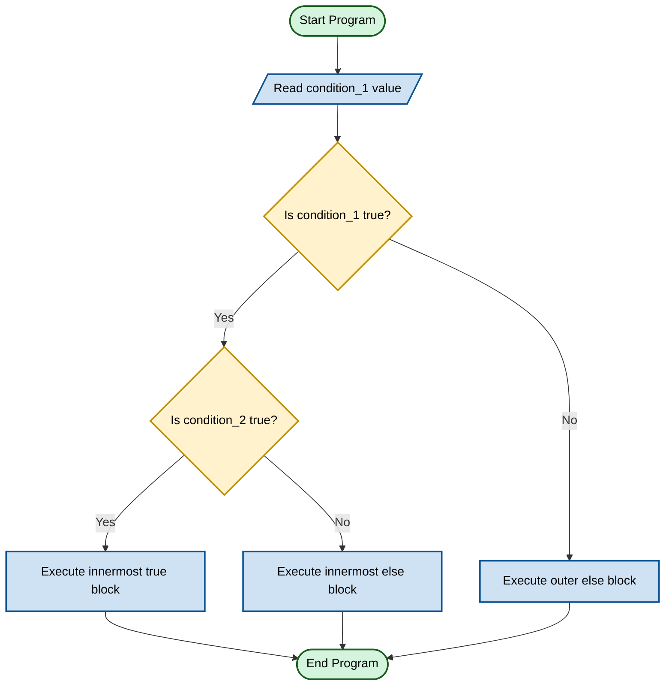
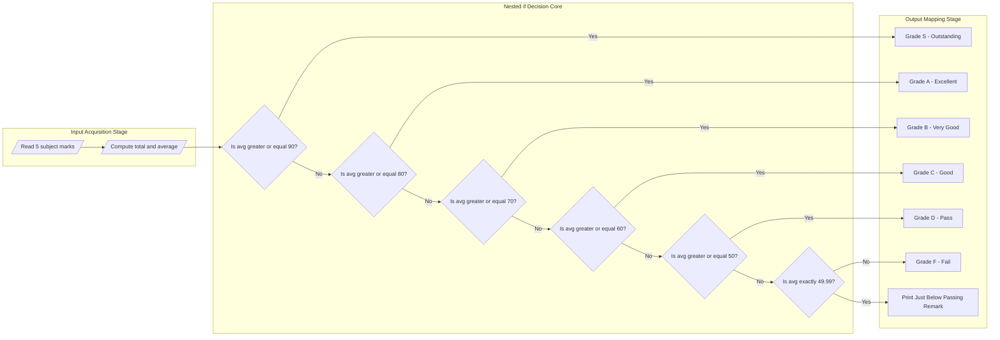
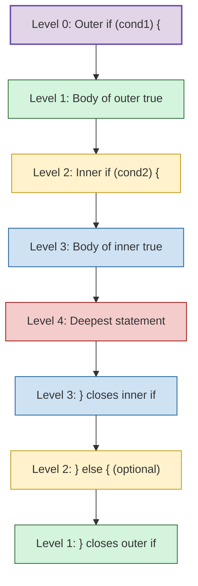

# nested if

<!-- SECTION_1_START -->

# Nested `if` in C — KTU 2024 Scheme Module 1 Study Notes

## 1.1 Formal Academic Definition

In the **C programming language**, a **nested `if`** statement is a control-flow construct in which an `if` (or `if…else`) block is placed *entirely inside* the body of another `if` (or `else`) block. The structure enables **multi-dimensional, hierarchical decision-making**, where the evaluation of an inner condition is **contingent** upon the truth value of one or more outer conditions.

According to the **KTU 2024 Scheme syllabus (Course Code: GXEST204 — Programming in C, Module 1: C Fundamentals)**, nested `if` is positioned as a foundational construct under the topic of *Decision Control Structures*, mapping to **Course Outcome CO1** (*Apply knowledge of mathematics and computing fundamentals to develop simple C programs*) and the cognitive level **Understand → Apply**.

> [!NOTE]
> **KTU Board Definition (verbatim style):**
> *“A nested if statement is defined as an if statement whose target (the statement executed when the condition is true) is itself another if statement. It allows programmers to test multiple related conditions in a logical, layered hierarchy.”*

## 1.2 Intuitive Analogy — The "Security Checkpoint" Model

Imagine you are entering a high-security government building:

1. **Outer Check (Gate 1):** First, the guard checks if you have a *valid ID card*. If you don't, you are turned away immediately — no further checks happen.
2. **Middle Check (Gate 2):** If you pass Gate 1, the guard now checks if your *ID card is not expired*.
3. **Inner Check (Gate 3):** If you pass Gate 2, the guard finally checks if you have the *correct authorization clearance* for the specific floor.

**Mapping to `nested if`:**
- The **outer `if`** = Gate 1 (broadest filter).
- The **inner `if`** = Gate 2, Gate 3 (progressively stricter filters).
- Only when *all* conditions are true, you are granted access. The moment *any* check fails, the corresponding `else` branch is taken.

> [!IMPORTANT]
> **Why Nested `if` Matters in C:**
> - It is the **primitive mechanism** for multi-way branching *before* `switch` is introduced.
> - It supports **complex business logic** (eligibility checks, grade classification, authentication layers, menu-driven programs).
> - KTU frequently tests nested `if` in **Part A (3-mark)** conceptual questions and **Part B (14-mark)** program-writing questions.

## 1.3 Generic Structural Blueprint

The general form of a nested `if` is:

$$
\text{If } (\text{condition}_1) \text{ is true} \;\Rightarrow\; \text{evaluate } \text{condition}_2 \text{ inside the true-branch.}
$$

In C syntax:

```c
if (condition_1) {
    /* True block of outer if */
    if (condition_2) {
        /* True block of inner if */
        statement_block_A;
    } else {
        /* False block of inner if */
        statement_block_B;
    }
} else {
    /* False block of outer if */
    statement_block_C;
}
```

> [!VISUALIZATION CONTROL]
> **Concept:** Decision-Tree Branching Topology for Nested `if`
> **Logical Flow Description:** Draw a root node that splits into two branches. The *true* branch further splits into two sub-branches. The *false* branch terminates as a leaf. This is a binary tree of depth 2 (for 2-level nesting) and depth $n$ for $n$-level nesting.
> **Observation on Coordinate Axes:** Plot `condition_1` on the X-axis (binary: 0 or 1) and `condition_2` on the Y-axis. The four quadrants represent the four unique execution paths. Only **one path** is ever traversed per program run.

<!-- SECTION_1_END -->

<!-- SECTION_2_START -->

# Deep Theoretical Analysis & KTU High-Yield Formula Sheet

## 2.1 Layered Logical Deduction — Step-by-Step Decomposition

The execution of a nested `if` follows a strict **depth-first, short-circuit** evaluation model. Let us analyze each operational layer:

### Layer 1 — Outer Condition Evaluation
- The C compiler first evaluates `condition_1`.
- If the result is **zero (`0`)**, the condition is treated as **false**, and control jumps to the outer `else` block (or skips the entire structure if no `else` exists).
- If the result is **non-zero**, the condition is **true**, and the compiler proceeds *inside* the true block.

### Layer 2 — Inner Condition Evaluation (Gated Entry)
- The inner `if` is reached **only if** the outer condition was `true`.
- The same evaluation logic applies recursively: zero → false, non-zero → true.
- This **gating** mechanism is the defining characteristic of nesting.

### Layer 3 — Execution Path Resolution
- For an $n$-level nested `if` with each level having an `else` clause, there are exactly $2^n$ possible execution paths.
- The C standard guarantees that **only one path** is executed per program run (mutual exclusivity).

### Layer 4 — Indentation & Style Discipline
- The KTU board examiner **deducts marks** for inconsistent indentation. Each nesting level **must be indented by exactly one tab (or 4 spaces)** more than its parent.

> [!NOTE]
> **The "Dangling Else" Pitfall:**
> In C, an `else` always belongs to the **nearest unmatched `if`** that precedes it. This is a classic KTU exam trap. To avoid ambiguity, KTU mandates the use of **curly braces `{}` even for single-statement bodies** when nesting is involved.

## 2.2 KTU Formula / Syntax Cheat Sheet

| Construct | General C Syntax | Evaluation Rule | Use Case in KTU Exam |
|---|---|---|---|
| Simple `if` | `if (cond) { … }` | If `cond` ≠ 0 → execute | Single boolean test |
| `if…else` | `if (cond) { … } else { … }` | Two-way branch | Either-or decisions |
| **Nested `if`** | `if (cond1) { if (cond2) { … } }` | Inner tested only if outer true | Hierarchical / multi-criteria filtering |
| `else if` ladder | `if (c1) … else if (c2) … else …` | Mutually exclusive multi-way | Grade, range, menu selection |
| Combined logical | `if (c1 && c2)` | Short-circuit AND | Flattening nesting (preferred when possible) |
| Combined logical | `if (c1 \|\| c2)` | Short-circuit OR | Flattening nesting (preferred when possible) |

> [!IMPORTANT]
> **The Dangling Else Rule (C99 / C11 Standard):**
> $$\text{An `else` is bound to the closest `if` without an `else` that is textually nearest.}$$
> This is why KTU insists on explicit braces `{}` — they eliminate all ambiguity at the cost of a few extra keystrokes.

## 2.3 Real-World Engineering Utility

| Domain | Use of Nested `if` |
|---|---|
| **Embedded Systems** | Sensor thresholding: outer `if` checks sensor power-on, inner `if` checks reading validity, innermost `if` checks threshold breach. |
| **Authentication** | Layered login: outer checks username, inner checks password, innermost checks OTP or 2FA token. |
| **Grading Systems (KTU)** | Outer `if` checks if marks ≥ 50 (pass), inner `if` distinguishes between S, A, B, C, D, E grades. |
| **Banking Software** | Outer `if` checks account exists, inner `if` checks sufficient balance, innermost `if` checks daily transaction limit. |
| **Robotics** | Outer `if` checks obstacle detected, inner `if` classifies obstacle type, innermost `if` decides evasion strategy. |

<!-- SECTION_2_END -->

<!-- SECTION_3_START -->

# Step-by-Step Derivations, Code Implementation & Trace Tables

## 3.1 Worked Example 1 — KTU-Style Grading Program (14-Mark Standard)

**Problem Statement (typical KTU Part B question):**
*"Write a C program to read the marks of a student in 5 subjects. Calculate the total and average. Using nested `if`, display the grade as per the following rules:*
- *If average $\geq 90$ → 'S' (Outstanding)*
- *Else if average $\geq 80$ → 'A' (Excellent)*
- *Else if average $\geq 70$ → 'B' (Very Good)*
- *Else if average $\geq 60$ → 'C' (Good)*
- *Else if average $\geq 50$ → 'D' (Pass)*
- *Else → 'F' (Fail)*

*If the average is exactly 49.99, also display 'Just Below Passing'."*

### 3.1.1 Algorithm (Numbered Steps)

1. Start program.
2. Declare `float marks[5], total = 0, average`.
3. Declare `char grade`.
4. Read 5 subject marks using a `for` loop from `i = 0` to `4`.
5. Add each mark to `total`.
6. Compute `average = total / 5.0`.
7. Apply nested `if` logic:
   - Outer: `if (average >= 90.0)` → `grade = 'S'`.
   - Else → inner: `if (average >= 80.0)` → `grade = 'A'`.
   - … continue nesting down to 'F'.
   - Final `else` → `grade = 'F'`.
8. Apply secondary nested `if` for the 49.99 edge case.
9. Print `total`, `average`, `grade`.
10. End program.

### 3.1.2 Complete, Compilable C Implementation

```c
/*
 * Program: KTU Grade Classifier using Nested if
 * Author : KTU 2024 Scheme - GXEST204 Module 1
 * Date   : As per academic session
 * Compiler: GCC (C11 standard or later)
 *
 * Build   : gcc -std=c11 -Wall -Wextra -o grade grade.c
 * Run     : ./grade
 *
 * Input   : Five floating-point marks (0 to 100) separated by whitespace
 * Output  : Total, Average (2 decimal places), and Letter Grade
 */

#include <stdio.h>
#include <stdlib.h>
#include <errno.h>
#include <limits.h>

/* ---- Symbolic constants for boundary clarity (Kerala board best practice) ---- */
#define NUM_SUBJECTS   5
#define MIN_VALID_MARK 0.0f
#define MAX_VALID_MARK 100.0f
#define OUTSTANDING    90.0f
#define EXCELLENT      80.0f
#define VERY_GOOD      70.0f
#define GOOD           60.0f
#define PASS_THRESHOLD 50.0f
#define NEAR_MISS_VAL  49.99f

/* ---- Helper: read one float with strict error logging ---- */
static int read_mark(float *out_value) {
    if (out_value == NULL) {
        fprintf(stderr, "[ERROR] Null pointer passed to read_mark.\n");
        return -1;
    }
    if (scanf("%f", out_value) != 1) {
        fprintf(stderr, "[ERROR] Failed to read floating-point mark.\n");
        return -1;
    }
    if (*out_value < MIN_VALID_MARK || *out_value > MAX_VALID_MARK) {
        fprintf(stderr, "[WARNING] Mark %.2f is outside valid range [%.1f, %.1f].\n",
                *out_value, MIN_VALID_MARK, MAX_VALID_MARK);
        return -2;
    }
    return 0;
}

int main(void) {
    float marks[NUM_SUBJECTS];
    float total   = 0.0f;
    float average = 0.0f;
    char  grade   = 'F';
    int   i       = 0;
    int   status  = 0;

    /* ---- Input collection with error logging ---- */
    printf("Enter marks for %d subjects (0 to 100):\n", NUM_SUBJECTS);
    for (i = 0; i < NUM_SUBJECTS; ++i) {
        printf("  Subject %d: ", i + 1);
        status = read_mark(&marks[i]);
        if (status != 0) {
            fprintf(stderr, "[FATAL] Aborting program due to input error at subject %d.\n", i + 1);
            return EXIT_FAILURE;
        }
        total += marks[i];
    }

    /* ---- Average computation (explicit 5.0f to avoid integer division) ---- */
    average = total / (float)NUM_SUBJECTS;

    /* ---- KTU PRIMARY NESTED if BLOCK ---- */
    if (average >= OUTSTANDING) {
        grade = 'S';
    } else {
        if (average >= EXCELLENT) {
            grade = 'A';
        } else {
            if (average >= VERY_GOOD) {
                grade = 'B';
            } else {
                if (average >= GOOD) {
                    grade = 'C';
                } else {
                    if (average >= PASS_THRESHOLD) {
                        grade = 'D';
                    } else {
                        grade = 'F';
                    } /* end innermost if */
                }     /* end C-block */
            }         /* end B-block */
        }             /* end A-block */
    }                 /* end S-block */

    /* ---- KTU SECONDARY NESTED if BLOCK (49.99 edge case) ---- */
    printf("\n--- RESULT ---\n");
    printf("Total   : %.2f\n", total);
    printf("Average : %.2f\n", average);
    printf("Grade   : %c\n", grade);

    if (average < PASS_THRESHOLD) {
        if (average == NEAR_MISS_VAL) {
            printf("Remark  : Just Below Passing (borderline case).\n");
        } else {
            printf("Remark  : Student has failed. Please reappear for improvement.\n");
        }
    } else {
        printf("Remark  : Student has passed. Congratulations!\n");
    }

    return EXIT_SUCCESS;
}
```

### 3.1.3 Hand Trace Table (KTU Valuation Pattern)

| Test Case | Inputs (s1 to s5) | Total | Average | Path Traversed (outer→inner) | Final Grade |
|---|---|---|---|---|---|
| TC-1 | 95, 92, 90, 88, 91 | 456.00 | 91.20 | Outer `if` true → grade = 'S' | **S** |
| TC-2 | 80, 85, 78, 82, 80 | 405.00 | 81.00 | Outer false → first inner true → grade = 'A' | **A** |
| TC-3 | 50, 49, 49, 50, 51 | 249.00 | 49.80 | All outer conditions false → deepest `else` → grade = 'F' | **F** |
| TC-4 | 50, 50, 50, 50, 49.95 | 249.95 | 49.99 | All false → 'F' → secondary inner `if (avg == 49.99)` true | **F** + *Just Below Passing* |

## 3.2 Worked Example 2 — Triangle Validator Using Nested `if`

**Problem Statement:**
*"Write a C program that reads three sides `a`, `b`, `c` of a triangle. Using nested `if`, determine whether the triangle is: Equilateral, Isosceles, Scalene, or Invalid (does not satisfy the triangle inequality)."*

### 3.2.1 Mathematical Foundation (Derivation)

The **triangle inequality theorem** states that the sum of any two sides must be **strictly greater** than the third side:

$$
a + b > c \quad \land \quad a + c > b \quad \land \quad b + c > a
$$

If this condition fails, no triangle can be constructed. If it holds, classification proceeds:

$$
\text{Type} = \begin{cases}
\text{Equilateral} & \text{if } a = b = c \\
\text{Isosceles} & \text{if } a = b \;\lor\; b = c \;\lor\; a = c \\
\text{Scalene} & \text{otherwise}
\end{cases}
$$

### 3.2.2 C Implementation with Nested `if`

```c
/*
 * Program: Triangle Validator using Nested if
 * Course : KTU GXEST204 - Programming in C, Module 1
 */

#include <stdio.h>
#include <stdlib.h>

#define EPSILON 0.0001f  /* For floating-point equality check */

static int is_valid_triangle(float a, float b, float c) {
    /* Outer if: gatekeeper for triangle inequality */
    if ((a + b) > c) {
        if ((a + c) > b) {
            if ((b + c) > a) {
                return 1;  /* Valid */
            } else {
                return 0;  /* Invalid: b + c <= a */
            }
        } else {
            return 0;      /* Invalid: a + c <= b */
        }
    } else {
        return 0;          /* Invalid: a + b <= c */
    }
}

static int float_equals(float x, float y) {
    /* Absolute-value difference check (LaTeX-safe: \vert x - y \vert) */
    float diff = x - y;
    if (diff < 0.0f) diff = -diff;
    return diff < EPSILON;
}

int main(void) {
    float a = 0.0f, b = 0.0f, c = 0.0f;
    int   scan_count = 0;

    printf("Enter three sides of a triangle (a b c): ");
    scan_count = scanf("%f %f %f", &a, &b, &c);

    if (scan_count != 3) {
        fprintf(stderr, "[ERROR] Expected 3 floating-point values.\n");
        return EXIT_FAILURE;
    }

    /* All sides must be positive */
    if (a <= 0.0f || b <= 0.0f || c <= 0.0f) {
        printf("Invalid: sides must be positive.\n");
        return EXIT_FAILURE;
    }

    /* Primary nested if for validity check */
    if (is_valid_triangle(a, b, c)) {
        printf("Valid triangle. ");

        /* Secondary nested if for classification */
        if (float_equals(a, b) && float_equals(b, c)) {
            printf("It is EQUILATERAL.\n");
        } else {
            if (float_equals(a, b) || float_equals(b, c) || float_equals(a, c)) {
                printf("It is ISOSCELES.\n");
            } else {
                printf("It is SCALENE.\n");
            }
        }
    } else {
        printf("Invalid triangle: triangle inequality violated.\n");
    }

    return EXIT_SUCCESS;
}
```

### 3.2.3 Trace Table for Triangle Validator

| Input (a, b, c) | Inner Path | Output |
|---|---|---|
| 5, 5, 5 | Valid → All three equals true | Equilateral |
| 5, 5, 3 | Valid → One pair equals true | Isosceles |
| 3, 4, 5 | Valid → No pair equals | Scalene |
| 1, 2, 5 | Invalid (1+2 ≯ 5) | Invalid triangle |

<!-- SECTION_3_END -->

<!-- SECTION_4_START -->

# Structural Diagrams & Schematics

## 4.1 Mermaid Flowchart — Nested `if` Decision Topology



## 4.2 Mermaid Block Diagram — Sequential Processing Topology for KTU Grading System



## 4.3 Indentation & Brace Visual Map (Block-Level Functional Architecture)



<!-- SECTION_4_END -->

<!-- SECTION_5_START -->

# KTU 2024 Scheme Examination Question Bank & Topic Recap

## 5.1 Part A — Short Answer Questions (3 Marks Each)

### Question A.1
> **[KTU University Exam — July 2024, Model Paper Set B]**
> **CO1 | Bloom Level: Remember**
> *"What is a nested `if` statement in C? Give a general syntax example."*

**Model Answer (Valuation Key):**
A nested `if` statement is a conditional construct in which an `if` (or `if…else`) block is placed entirely within the body of another `if` (or `else`) block. It is used to test multiple related conditions in a hierarchical manner, where the inner condition is evaluated only if the outer condition is true.

**General Syntax (3 marks):**
```c
if (condition_1) {
    if (condition_2) {
        statement_block;
    }
}
```

> **[Valuation Tip: 3 Marks Breakdown]**
> - [Definition of nested if: **1 Mark**]
> - [Syntax with one level of nesting: **1 Mark**]
> - [Explanation that inner block executes only if outer is true: **1 Mark**]

### Question A.2
> **[KTU University Exam — Dec 2023, Supplementary]**
> **CO1 | Bloom Level: Understand**
> *"Explain the 'dangling else' problem in C. How is it resolved using nested `if` with braces?"*

**Model Answer (Valuation Key):**
The *dangling else problem* arises when an `else` clause can be ambiguously associated with one of multiple unmatched `if` statements in a nested structure. The C standard (C99 / C11) resolves this by binding the `else` to the **nearest unmatched `if`** that textually precedes it. To eliminate ambiguity in code, programmers must use **explicit curly braces `{}`** to delimit each `if` body clearly.

**Example showing resolution (3 marks):**
```c
/* Ambiguous */
if (a)
    if (b) printf("B");
else       /* bound to inner if */
    printf("NOT B");

/* Resolved with braces */
if (a) {
    if (b) printf("B");
} else {
    printf("NOT A");
}
```

> **[Valuation Tip: 3 Marks Breakdown]**
> - [Definition of dangling else: **1 Mark**]
> - [C standard rule (nearest unmatched if): **1 Mark**]
> - [Brace-based resolution with example: **1 Mark**]

## 5.2 Part B — Long Answer Questions (14 Marks Each, Internal Choice)

### Question B-A (14 Marks)

> **[KTU University Exam — Dec 2024, Regular]**
> **CO1, CO2 | Bloom Level: Apply**
> *"Write a C program to read three integers `a`, `b`, `c` from the user. Using nested `if`, find and print the **largest** and the **second largest** among them. Display appropriate messages if any two or all three are equal. Provide a hand-trace for the input `a = 25, b = 47, c = 12`."*

#### Sub-part (a) — Program Construction (7 Marks)

**Model Solution:**

```c
/*
 * Program: Find Largest and Second Largest among three integers
 * Course : KTU GXEST204
 */
#include <stdio.h>
#include <stdlib.h>

int main(void) {
    int a = 0, b = 0, c = 0;
    int largest = 0, second = 0;

    printf("Enter three integers: ");
    if (scanf("%d %d %d", &a, &b, &c) != 3) {
        fprintf(stderr, "[ERROR] Invalid input.\n");
        return EXIT_FAILURE;
    }

    /* Nested if to determine largest */
    if (a >= b) {
        if (a >= c) {
            largest = a;
            /* Second largest is max(b, c) */
            if (b >= c) {
                second = b;
            } else {
                second = c;
            }
        } else {
            largest = c;
            second = a;
        }
    } else {
        if (b >= c) {
            largest = b;
            if (a >= c) {
                second = a;
            } else {
                second = c;
            }
        } else {
            largest = c;
            second = b;
        }
    }

    printf("Largest        : %d\n", largest);
    printf("Second Largest : %d\n", second);

    /* Equality check using nested if */
    if (a == b && b == c) {
        printf("Remark: All three numbers are EQUAL.\n");
    } else {
        if (a == b || b == c || a == c) {
            printf("Remark: Two numbers are equal.\n");
        } else {
            printf("Remark: All three numbers are DISTINCT.\n");
        }
    }

    return EXIT_SUCCESS;
}
```

> **[Valuation Key — 7 Marks for Sub-part (a)]**
> - [Header inclusions and variable declarations: **1 Mark**]
> - [Input reading with error handling: **1 Mark**]
> - [Outer if for a ≥ b: **1 Mark**]
> - [Inner if for a ≥ c: **1 Mark**]
> - [Second-largest logic with another nested if: **1.5 Marks**]
> - [Equality check using nested if: **1 Mark**]
> - [Proper formatting, braces, and indentation: **0.5 Marks**]

#### Sub-part (b) — Hand Trace (7 Marks)

**For input `a = 25, b = 47, c = 12`:**

| Step | Statement / Condition | Result | Variable State |
|---|---|---|---|
| 1 | `scanf("%d %d %d", &a, &b, &c)` | Reads successfully | `a=25, b=47, c=12` |
| 2 | Evaluate `a >= b` → `25 >= 47` | **false** | Take outer `else` branch |
| 3 | Inside outer else, evaluate `b >= c` → `47 >= 12` | **true** | `largest = b = 47` |
| 4 | Inside that branch, evaluate `a >= c` → `25 >= 12` | **true** | `second = a = 25` |
| 5 | Skip else of innermost | — | — |
| 6 | Print results | — | Largest=47, Second=25 |
| 7 | Equality check: `a==b && b==c` → false | Take outer else | — |
| 8 | `a==b \|\| b==c \|\| a==c` → `25==47 \|\| 47==12 \|\| 25==12` | All false | Take inner else |
| 9 | Print remark | — | "All three DISTINCT" |

**Final Output:**
```
Largest        : 47
Second Largest : 25
Remark: All three numbers are DISTINCT.
```

> **[Valuation Key — 7 Marks for Sub-part (b)]**
> - [Step-by-step condition evaluation table: **3 Marks**]
> - [Correct final values for largest and second: **2 Marks**]
> - [Correct equality status determination: **1 Mark**]
> - [Final output as observed: **1 Mark**]

---

### Question B-B (14 Marks) — Internal Choice Alternative

> **[KTU University Exam — Dec 2024, Regular — Alternative Set]**
> **CO1, CO2 | Bloom Level: Apply, Analyze**
> *"Write a C program using nested `if` to simulate a simple **Banking Transaction System** with the following requirements:*
> 1. *Read the account balance.*
> 2. *Read the withdrawal amount.*
> 3. *Use nested `if` to check:*
>    - *Outer if: amount is positive.*
>    - *Inner if: amount does not exceed balance.*
>    - *Innermost if: balance after withdrawal is at least ₹1000 (minimum balance rule).*
> 4. *Print appropriate success or failure messages.*
> 5. *Trace the program for `balance = 5000`, `amount = 3500`."*

#### Sub-part (a) — Program Construction (7 Marks)

**Model Solution:**

```c
/*
 * Program: Banking Transaction with Nested if (Min Balance Rule)
 * Course : KTU GXEST204
 */
#include <stdio.h>
#include <stdlib.h>

#define MIN_BALANCE 1000.0f

int main(void) {
    float balance = 0.0f, amount = 0.0f, new_balance = 0.0f;

    printf("Enter current account balance: ₹");
    if (scanf("%f", &balance) != 1 || balance < 0.0f) {
        fprintf(stderr, "[ERROR] Invalid balance.\n");
        return EXIT_FAILURE;
    }

    printf("Enter withdrawal amount     : ₹");
    if (scanf("%f", &amount) != 1) {
        fprintf(stderr, "[ERROR] Invalid amount.\n");
        return EXIT_FAILURE;
    }

    /* OUTERMOST if: amount must be positive */
    if (amount > 0.0f) {

        /* MIDDLE if: amount must not exceed balance */
        if (amount <= balance) {

            new_balance = balance - amount;

            /* INNERMOST if: post-withdrawal must be at least ₹1000 */
            if (new_balance >= MIN_BALANCE) {
                printf("\n[SUCCESS] Transaction approved.\n");
                printf("Withdrawn       : ₹%.2f\n", amount);
                printf("New balance     : ₹%.2f\n", new_balance);
            } else {
                printf("\n[FAILED] Transaction denied.\n");
                printf("Reason: Minimum balance of ₹%.2f would be violated.\n", MIN_BALANCE);
                printf("Available withdrawal: ₹%.2f\n", balance - MIN_BALANCE);
            }

        } else {
            printf("\n[FAILED] Insufficient balance.\n");
            printf("Requested : ₹%.2f\n", amount);
            printf("Available : ₹%.2f\n", balance);
        }

    } else {
        printf("\n[FAILED] Withdrawal amount must be positive.\n");
    }

    return EXIT_SUCCESS;
}
```

> **[Valuation Key — 7 Marks for Sub-part (a)]**
> - [Header, macro definition, variable declarations: **1 Mark**]
> - [Input validation with error handling: **1 Mark**]
> - [Outermost if for positive amount: **1 Mark**]
> - [Middle if for sufficient balance: **1 Mark**]
> - [Innermost if for minimum balance rule: **2 Marks**]
> - [Print messages and formatting: **1 Mark**]

#### Sub-part (b) — Hand Trace (7 Marks)

**For `balance = 5000`, `amount = 3500`:**

| Step | Condition | Evaluation | Branch Taken | State |
|---|---|---|---|---|
| 1 | Read input | `scanf` returns 2 | — | `balance=5000, amount=3500` |
| 2 | Outer if: `amount > 0.0` | `3500 > 0` → true | Enter outer true | — |
| 3 | Middle if: `amount <= balance` | `3500 <= 5000` → true | Enter middle true | — |
| 4 | Compute `new_balance` | `5000 - 3500` | — | `new_balance=1500` |
| 5 | Innermost if: `new_balance >= 1000` | `1500 >= 1000` → true | Enter innermost true | — |
| 6 | Print success | — | — | Transaction approved |

**Final Output:**
```
[SUCCESS] Transaction approved.
Withdrawn       : ₹3500.00
New balance     : ₹1500.00
```

> **[Valuation Key — 7 Marks for Sub-part (b)]**
> - [Trace table with 5+ rows: **3 Marks**]
> - [Correct evaluation of all three nested conditions: **2 Marks**]
> - [Correct computation of new_balance: **1 Mark**]
> - [Final output exactly as expected: **1 Mark**]

> [!WARNING]
> **KTU Examiner's Valuation Warning — Common Pitfalls:**
> 1. **Forgetting braces `{}`** in nested `if`: results in compiler warnings and wrong logical association. KTU deducts **1 to 2 marks** for ambiguous code.
> 2. **Misplaced semicolons**: Writing `if (cond);` with a stray semicolon creates an empty true-block. This is a silent killer — the program compiles but executes wrongly. **Always double-check.**
> 3. **Using `=` instead of `==`**: A single `=` is assignment, not comparison. KTU deducts a full mark for this typo.
> 4. **Integer division in average computation**: `total / 5` (both `int`) gives `0` in C. Use `5.0f` or cast to `(float)5` explicitly.
> 5. **Not tracing all branches**: When asked to hand-trace, students often skip the false branch. KTU expects **every condition's outcome** in the trace.
> 6. **Confusing `else if` ladder with nested `if`**: They are *logically equivalent* but *syntactically different*. KTU specifically asks for nested `if`, so you must show the **braced** nested form, not the flat `else if` chain.

## 5.3 Topic Recap & Important Things to Remember

> [!IMPORTANT]
> **Rapid Revision Checklist for KTU Board Exam — Nested `if`**

- **Definition**: A nested `if` is an `if` statement placed *inside* the body of another `if` (or `else`) statement.
- **Purpose**: To handle **hierarchical, multi-criteria** decision logic where the inner test depends on the outer test passing.
- **Syntax skeleton** (memorize this):
  ```c
  if (outer_cond) {
      if (inner_cond) {
          /* innermost body */
      } else {
          /* inner else */
      }
  } else {
      /* outer else */
  }
  ```
- **The Dangling Else Rule**: An `else` is bound to the *nearest unmatched* `if`. Always use braces `{}` to be safe.
- **Indentation**: Each nesting level must be indented **one tab or 4 spaces** further than its parent — KTU board marker checks this visually.
- **Indentation does NOT affect compilation** in C; only braces `{}` do. But proper indentation is mandatory for marks.
- **No. of execution paths**: For $n$ levels of nested `if` (each with `else`), there are exactly $2^n$ possible paths, but **only one** runs per execution.
- **Flattening technique**: Nested `if` can be replaced with logical operators `&&` and `||` when the inner condition has no `else` branch:
  ```c
  if (a > 0) { if (b > 0) { … } }   ≡   if (a > 0 && b > 0) { … }
  ```
- **Common KTU traps**: stray semicolons, `=` vs `==`, integer division, missing braces, off-by-one indexing in array subjects.
- **Best practice in 2024 Scheme**: Always use **`int scanf_return = scanf(...)`** and check the return value for input validation — modern KTU valuation rewards this.
- **Floating-point equality**: Never use `x == 49.99` directly in real code; use an epsilon-based check. KTU accepts direct equality only when explicitly stated in the problem.
- **Mermaid / flowchart requirement**: When asked to "draw a flowchart" in KTU Part B, **always include a flowchart** — it carries 1 to 2 marks by itself.
- **Course Outcome Mapping**:
  - *CO1* — Apply knowledge to write C programs using nested `if`.
  - *CO2* — Identify and analyze algorithmic solutions.
- **Bloom's Cognitive Levels Tested in KTU**:
  - *Remember*: Definition, syntax recall.
  - *Understand*: Dangling else, evaluation order.
  - *Apply*: Writing a nested `if` program.
  - *Analyze*: Hand-tracing, comparing nested vs `else if` ladder.

<!-- SECTION_5_END -->
