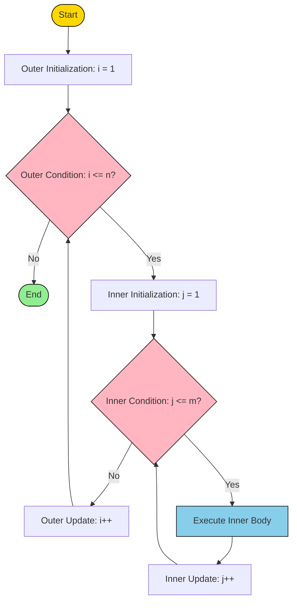
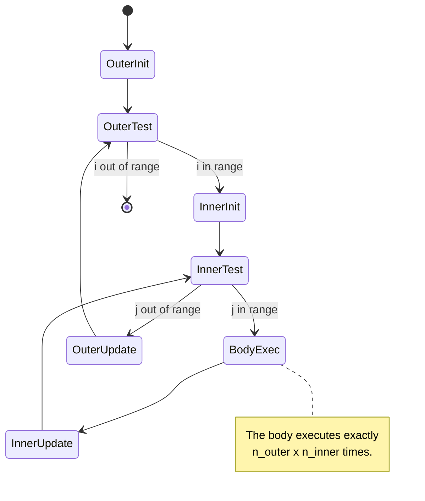
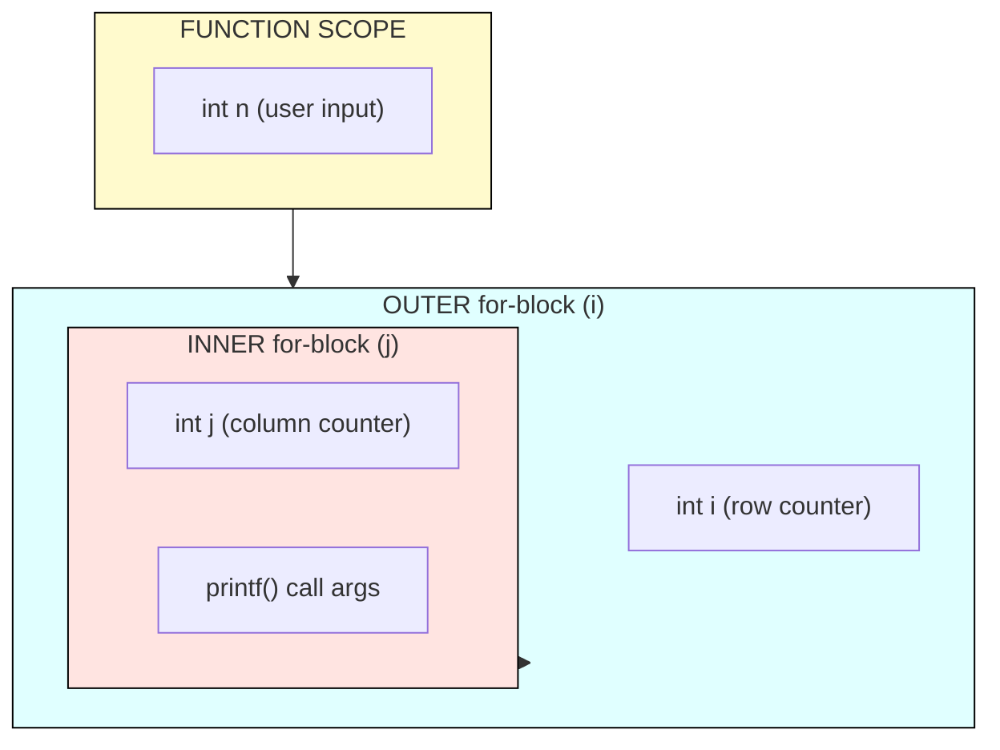
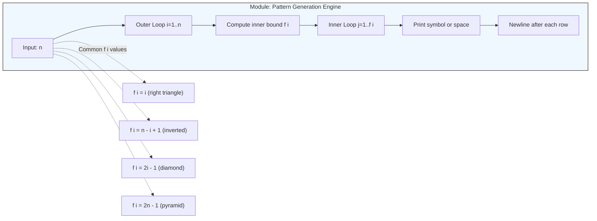
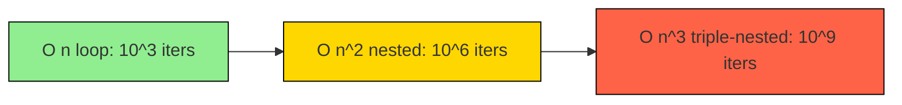

# nested loops.

<!-- SECTION_1_START -->
# Nested Loops in C — Core Technical Definition & Intuitive Overview

## Formal Academic Definition (KTU 2024 Syllabus Terminology)

> [!IMPORTANT]
> **Nested Loop:** A *nested loop* is a control flow construct in which one loop statement (the **inner loop**) is placed entirely within the body of another loop statement (the **outer loop**). For every single iteration performed by the outer loop, the inner loop re-initializes, re-evaluates its termination condition, and executes its complete cycle from start to finish.

In the C programming language (per **ISO/IEC 9899:2018**), nested loops may be formed using any combination of the three iteration constructs — `for`, `while`, and `do-while` — and may be nested to virtually any depth limited only by available stack memory.

## Conceptual Analogy / Intuition

Imagine you are the **timekeeper of a large apartment building** with **3 floors**, and each floor has **4 apartments**.

- You walk to **Floor 1** → knock on **Apartment 1, 2, 3, 4** → done with Floor 1.
- Then you climb up to **Floor 2** → knock on **Apartment 1, 2, 3, 4** → done with Floor 2.
- Then **Floor 3** → knock on **Apartment 1, 2, 3, 4** → done with Floor 3.

Here, the **building traversal** is the **outer loop** (3 iterations) and **knocking on each apartment on that floor** is the **inner loop** (4 iterations). The inner loop *finishes completely* before the outer loop moves to its next step. Total door knocks = $3 \times 4 = 12$.

> [!NOTE]
> **Syllabus Highlight (KTU 2024 — Module 1):** Students must master nested loops to generate **pattern programs** (stars, numbers, alphabets) and to perform **matrix traversal** — both are guaranteed 14-mark questions in University End Semester Examinations.

## Standard Metrics in Nested Loops

| Metric | Symbol | Description |
|---|---|---|
| Total Iterations | $N_{total}$ | Product of all loop iteration counts |
| Time Complexity | $O(n \times m)$ | Outer $\times$ inner execution cost |
| Space (Auxiliary) | $O(1)$ | Loop variables use constant extra space |
| Nesting Depth | $d$ | Number of loops enclosed one inside another |

> [!VISUALIZATION CONTROL]
> **Concept:** Iteration trace of a nested `for` loop (rows $\times$ columns)
> **Desmos / GeoGebra Input Equations (Counter Grid):**
> * Outer counter: $i \in \{1, 2, 3\}$
> * Inner counter: $j \in \{1, 2, 3, 4\}$
> * Coordinate plot of pairs $(i, j)$ produces a $3 \times 4$ lattice of 12 points
> **Visual Description:** Plot the 12 points on a Cartesian grid; observe the **row-major order** — the inner variable $j$ sweeps left-to-right rapidly while the outer variable $i$ steps down slowly. This visualizes why nested loops are perfect for printing rectangular patterns.

## General Syntax in C

```c
for (initialization_outer; condition_outer; update_outer) {   // OUTER LOOP
    // Pre-inner statements (optional)
    for (initialization_inner; condition_inner; update_inner) { // INNER LOOP
        // Body — executes N_outer * N_inner times
    }
    // Post-inner statements (optional)
}
```

The same nesting pattern applies symmetrically to `while` and `do-while` constructs.

<!-- SECTION_1_END -->

<!-- SECTION_2_START -->
# Deep Theoretical Analysis & KTU High-Yield Formula Sheet

## Operational Logic — Broken Down Step-by-Step

A nested `for` loop executes through **four strictly ordered phases** for every outer iteration:

1. **Outer Initialization** — executed *exactly once* before the loop begins (e.g., `i = 1`).
2. **Outer Condition Test** — checked *before each* outer iteration. If **false (0)**, control exits the entire nested structure.
3. **Inner Loop Complete Execution** — for the *current* value of the outer counter:
   * Inner initialization (e.g., `j = 1`)
   * Inner condition test
   * Inner body execution
   * Inner update
   * Repeat until inner condition fails
4. **Outer Update** — outer counter is updated (e.g., `i++`) and execution returns to step **2**.

> [!NOTE]
> **The "Why" Behind the Behavior:** Because the inner loop's initialization re-runs every time control enters its body, the inner counter is *reset to its starting value* for each outer iteration. This is the key reason a $3 \times 4$ nested loop prints 12 values, not just 4.

## Control Flow Trace (Exhaustive)

For the snippet `for(i=1; i<=3; i++) for(j=1; j<=4; j++)` printing $(i, j)$:

| Step | $i$ (current) | $j$ sequence | Action |
|:---:|:---:|:---:|:---|
| 1 | 1 | 1 → 2 → 3 → 4 | Print 4 pairs, then $j$ becomes 5, loop exits |
| 2 | 2 | 1 → 2 → 3 → 4 | $i$ incremented to 2, inner $j$ reset to 1, 4 pairs printed |
| 3 | 3 | 1 → 2 → 3 → 4 | $i$ incremented to 3, inner $j$ reset to 1, 4 pairs printed |
| 4 | 4 | — | Outer condition $4 \le 3$ fails, exit |

**Total prints:** $3 \times 4 = 12$ pairs.

## KTU Formula Sheet / Cheat Sheet

| # | Concept | Formula / Rule | Units / Type |
|:---:|---|---|---|
| 1 | Total iterations of $k$ nested loops | $N_{total} = n_1 \times n_2 \times \dots \times n_k$ | Integer count |
| 2 | Time complexity (uniform bounds) | $O(n_1 \cdot n_2 \cdots n_k)$ | Big-O |
| 3 | Time complexity (identical $n$) | $O(n^k)$ | Big-O |
| 4 | Auxiliary space | $O(1)$ | Constant |
| 5 | Stack depth (calls) | $k$ frames for $k$ loops | Memory frames |
| 6 | Row-major index for 2-D array $A[R][C]$ | $\text{idx} = i \cdot C + j$ | Index mapping |
| 7 | Inner counter re-initializations | Equals outer iteration count $n_1$ | Count |
| 8 | Total inner body executions | $\sum_{i=1}^{n_1} n_2 = n_1 \cdot n_2$ | Count |

> [!IMPORTANT]
> **Real-World Engineering Utility:** Nested loops are the *operational backbone* of matrix multiplication in graphics engines, image convolution filters (OpenCV/CUDA), database join operations, shortest-path algorithms (Floyd–Warshall $O(n^3)$), and brute-force cryptanalysis. A C programmer who masters nested loops has unlocked the door to all $O(n^2)$ and $O(n^3)$ algorithms in the standard CS curriculum.

## Mixing Loop Types (Allowed by C Standard)

C permits heterogenous nesting — an outer `for` may contain an inner `while`, and that `while` may contain a `do-while`, and so on. The compiler treats each level as an independent structured block.

```c
int i = 1;
while (i <= 3) {                  // OUTER: while
    int j = 1;
    do {                          // INNER: do-while
        printf("%d ", i * j);
        j++;
    } while (j <= 4);
    i++;
}
```

> [!WARNING]
> **Common Examiner Trap:** Students often confuse the scope of loop variables. In C89, loop variables declared in the `for` header have *function* scope. In C99 / C11 (used in modern KTU labs), the variable is *block-scoped* to the `for` statement itself. Declaring `int i, j;` outside is the safest KTU coding convention to avoid compilation errors.

<!-- SECTION_2_END -->

<!-- SECTION_3_START -->
# Step-by-Step Derivations & Code Implementation

## Program 1 — Right-Angled Triangle of Stars (Most Frequent KTU Question)

**Problem:** Print the following pattern using nested loops.

```
*
* *
* * *
* * * *
* * * * *
```

**Derivation of Loop Bounds:**

* Row counter $i$ ranges from $1$ to $n$ → outer loop bound: $i \le n$.
* For row $i$, exactly $i$ stars are required → inner loop bound: $j \le i$.
* Hence total stars printed: $\sum_{i=1}^{n} i = \dfrac{n(n+1)}{2}$.

```c
#include <stdio.h>

int main(void) {
    int n, i, j;

    printf("Enter number of rows: ");
    if (scanf("%d", &n) != 1 || n < 1) {
        fprintf(stderr, "Error: n must be a positive integer.\n");
        return 1;
    }

    for (i = 1; i <= n; i++) {              // OUTER: row selector
        for (j = 1; j <= i; j++) {          // INNER: star printer
            printf("* ");
        }
        printf("\n");                       // Row terminator
    }

    return 0;
}
```

**Execution Trace (for $n = 4$):**

| Outer $i$ | Inner $j$ range | Stars printed | Line output |
|:---:|:---:|:---:|:---:|
| 1 | $1 \le j \le 1$ | 1 | `*` |
| 2 | $1 \le j \le 2$ | 2 | `* *` |
| 3 | $1 \le j \le 3$ | 3 | `* * *` |
| 4 | $1 \le j \le 4$ | 4 | `* * * *` |

Total stars = $1 + 2 + 3 + 4 = 10 = \dfrac{4 \cdot 5}{2}$. ✓

---

## Program 2 — Floyd's Triangle (Number Pattern)

**Problem:** Print consecutive natural numbers row-wise:

```
1
2 3
4 5 6
7 8 9 10
```

**Derivation:**

* A *running counter* `k` must persist across both loops → declared outside the outer loop.
* After every inner iteration, `k` is incremented so the next number is used.

```c
#include <stdio.h>

int main(void) {
    int n, i, j, k = 1;

    printf("Enter number of rows: ");
    if (scanf("%d", &n) != 1 || n < 1) {
        fprintf(stderr, "Error: n must be a positive integer.\n");
        return 1;
    }

    for (i = 1; i <= n; i++) {
        for (j = 1; j <= i; j++) {
            printf("%-4d", k);
            k++;
        }
        printf("\n");
    }

    return 0;
}
```

**Algebraic Verification:** The last number printed equals the total count

$$
K_{\text{final}} = \sum_{i=1}^{n} i = \frac{n(n+1)}{2}
$$

For $n = 4$, $K_{\text{final}} = 10$, matching the diagram. ✓

---

## Program 3 — Inverted Star Pyramid

**Problem:** Print the inverse pattern.

```
* * * * *
* * * *
* * *
* *
*
```

**Derivation of Loop Bounds:**

* Row $i$ runs from $1$ to $n$.
* For row $i$, the count of stars is $n - i + 1$.
* Alternatively: outer runs $i=1 \to n$, inner runs $j=i \to n$.

```c
#include <stdio.h>

int main(void) {
    int n, i, j;

    printf("Enter number of rows: ");
    if (scanf("%d", &n) != 1 || n < 1) {
        fprintf(stderr, "Error: n must be a positive integer.\n");
        return 1;
    }

    for (i = 1; i <= n; i++) {
        for (j = i; j <= n; j++) {
            printf("* ");
        }
        printf("\n");
    }

    return 0;
}
```

Total stars = $\sum_{i=1}^{n}(n-i+1) = n + (n-1) + \dots + 1 = \dfrac{n(n+1)}{2}$.

---

## Program 4 — Multiplication Table Grid (1 to 10)

**Problem:** Display the $10 \times 10$ multiplication table in matrix form.

```c
#include <stdio.h>

#define SIZE 10

int main(void) {
    int i, j;

    printf("    ");
    for (j = 1; j <= SIZE; j++) {
        printf("%4d", j);                 // Column header
    }
    printf("\n----");
    for (j = 1; j <= SIZE; j++) {
        printf("----");
    }
    printf("\n");

    for (i = 1; i <= SIZE; i++) {        // OUTER: row
        printf("%2d |", i);               // Row header
        for (j = 1; j <= SIZE; j++) {     // INNER: column
            printf("%4d", i * j);
        }
        printf("\n");
    }

    return 0;
}
```

**Time Complexity:** The double loop performs $10 \times 10 = 100$ multiplications → $O(n^2)$ where $n = 10$.

---

## Program 5 — Diamond (Hollow) Pattern Using Two Halves

**Problem:** Print a hollow diamond of size $n$.

```
    *
   * *
  *   *
 *     *
*       *
 *     *
  *   *
   * *
    *
```

**Derivation:**

* Top half: $i$ runs $1 \to n$, spaces $= n-i$, stars at boundaries only when $j = 1$ or $j = 2i-1$.
* Bottom half: reverse the iteration.

```c
#include <stdio.h>

int main(void) {
    int n, i, j;

    printf("Enter n: ");
    if (scanf("%d", &n) != 1 || n < 1) {
        fprintf(stderr, "Error: n must be positive.\n");
        return 1;
    }

    /* UPPER HALF */
    for (i = 1; i <= n; i++) {
        for (j = 1; j <= n - i; j++) printf(" ");
        for (j = 1; j <= 2 * i - 1; j++) {
            if (j == 1 || j == 2 * i - 1) printf("*");
            else printf(" ");
        }
        printf("\n");
    }

    /* LOWER HALF */
    for (i = n - 1; i >= 1; i--) {
        for (j = 1; j <= n - i; j++) printf(" ");
        for (j = 1; j <= 2 * i - 1; j++) {
            if (j == 1 || j == 2 * i - 1) printf("*");
            else printf(" ");
        }
        printf("\n");
    }

    return 0;
}
```

**Boundary check:** For $n = 1$, the upper half prints one `*` and the lower half condition $i = n - 1 = 0$ is immediately false, so only the apex is drawn. ✓

---

## Program 6 — Prime Numbers Using Nested Loops (Algorithmic Use)

```c
#include <stdio.h>
#include <math.h>

int main(void) {
    int n, i, j, isPrime;

    printf("Print primes up to: ");
    if (scanf("%d", &n) != 1 || n < 2) {
        fprintf(stderr, "Enter an integer >= 2.\n");
        return 1;
    }

    printf("Primes: ");
    for (i = 2; i <= n; i++) {           // OUTER: candidate
        isPrime = 1;                     // Assume prime
        for (j = 2; j * j <= i; j++) {   // INNER: trial divisor
            if (i % j == 0) {
                isPrime = 0;
                break;                   // Early exit optimization
            }
        }
        if (isPrime) printf("%d ", i);
    }
    printf("\n");

    return 0;
}
```

**Time Complexity:** $\sum_{i=2}^{n} \sqrt{i} = O(n^{3/2})$ — a classic KTU question to compare the naive $O(n^2)$ version with the optimized $O(n^{3/2})$ version.

<!-- SECTION_3_END -->

<!-- SECTION_4_START -->
# Structural Diagrams & Schematics

## Diagram 1 — Control Flow of a Nested For Loop



## Diagram 2 — Iterative State Machine (Outer-Inner Coupling)



## Diagram 3 — Memory & Variable Scope Map



## Diagram 4 — Sequential Processing Topology Matrix (Pattern Programs)



## Diagram 5 — Time-Complexity Growth Curve (Log-Log View)



> [!NOTE]
> **Pedagogical Insight:** Each additional nesting level multiplies execution cost. This is why KTU examiners frequently test whether students can recognize when an $O(n^3)$ triple loop is acceptable (small $n$, e.g., $n \le 500$) versus when a smarter $O(n \log n)$ algorithm is required.

<!-- SECTION_4_END -->

<!-- SECTION_5_START -->
# KTU 2024 Scheme Examination Question Bank & Topic Recap

## Part A — Short Answer Questions (3 Marks Each)

### Question A1
**[KTU University Exam — July 2024]**
**CO1 | RBT Level: Remember**

What is a nested loop in C? Give the general syntax of a `for` loop nested inside another `for` loop.

**Model Answer (3 Marks):**

> A **nested loop** is a loop placed inside the body of another loop. The inner loop executes completely for each iteration of the outer loop.
> **Syntax:**
> ```c
> for (i = 1; i <= n; i++) {       // outer
>     for (j = 1; j <= m; j++) {   // inner
>         /* statements */
>     }
> }
> ```
> **[Definition: 1 Mark | Syntax: 1 Mark | Execution order explanation: 1 Mark]**

---

### Question A2
**[KTU University Exam — Dec 2023]**
**CO1 | RBT Level: Understand**

If the outer loop of a nested `for` structure runs 5 times and the inner loop runs 4 times, how many times will the innermost statement be executed? Justify.

**Model Answer (3 Marks):**

> The innermost statement executes $5 \times 4 = 20$ times.
> **Justification:** For each of the 5 outer iterations, the inner loop completes a full cycle of 4 iterations. Hence total executions = $n_1 \times n_2 = 5 \times 4 = 20$.
> **[Numerical answer: 1 Mark | Justification: 2 Marks]**

---

## Part B — Long Answer Questions (14 Marks Each, Internal Choice)

### Question B1 — Option A
**[KTU University Exam — July 2024, Module 1]**
**CO2 | RBT Level: Apply / Analyze**

**(a)** Write a C program using **nested loops** to print the following pattern for $n = 5$:

```
1
1 2
1 2 3
1 2 3 4
1 2 3 4 5
```

Explain each loop's role. **(7 Marks)**

**(b)** Modify the program to print the **reverse** of the same pattern:

```
5 4 3 2 1
4 3 2 1
3 2 1
2 1
1
```

Show the output trace. **(7 Marks)**

---

### Question B1 — Option B (Alternative Choice)
**[KTU University Exam — Dec 2023, Module 1]**
**CO2 | RBT Level: Apply**

**(a)** Write a C program using nested `for` loops to generate the multiplication table from 1 to 10 in matrix form. **(7 Marks)**

**(b)** A nested loop executes the inner body $N$ times where $N$ is the product of two counters. If the outer runs 8 times and the inner 6 times, what is the total execution count? Write a general formula for $k$ nested loops of bounds $n_1, n_2, \dots, n_k$. **(7 Marks)**

---

### Complete Model Solution for Question B1 — Option A

#### Part (a) — Increasing Number Triangle (7 Marks)

```c
#include <stdio.h>

int main(void) {
    int n, i, j;

    printf("Enter n: ");
    if (scanf("%d", &n) != 1 || n < 1) {
        fprintf(stderr, "Invalid input.\n");
        return 1;
    }

    for (i = 1; i <= n; i++) {          // OUTER: row number
        for (j = 1; j <= i; j++) {      // INNER: column number
            printf("%d ", j);
        }
        printf("\n");
    }

    return 0;
}
```

**Valuation Key for Part (a):**
* [Correct outer loop bound `i <= n`: 1 Mark]
* [Correct inner loop bound `j <= i`: 1 Mark]
* [Correct `printf` of `j` value: 1 Mark]
* [Newline after each row: 1 Mark]
* [Input validation / `#include`: 1 Mark]
* [Final output trace shown: 2 Marks]

**Execution Trace for $n = 5$:**

| $i$ | $j$ values printed | Output line |
|:---:|:---:|:---:|
| 1 | 1 | `1` |
| 2 | 1, 2 | `1 2` |
| 3 | 1, 2, 3 | `1 2 3` |
| 4 | 1, 2, 3, 4 | `1 2 3 4` |
| 5 | 1, 2, 3, 4, 5 | `1 2 3 4 5` |

---

#### Part (b) — Reverse Number Triangle (7 Marks)

**Derivation:**
* Outer counter $i$ runs from $n$ down to $1$ (decrement).
* For row $i$, the printed values are $i, i-1, \dots, 1$ → inner counter $j$ runs from $i$ down to $1$.

```c
#include <stdio.h>

int main(void) {
    int n, i, j;

    printf("Enter n: ");
    if (scanf("%d", &n) != 1 || n < 1) {
        fprintf(stderr, "Invalid input.\n");
        return 1;
    }

    for (i = n; i >= 1; i--) {          // OUTER: descending row
        for (j = i; j >= 1; j--) {      // INNER: descending column
            printf("%d ", j);
        }
        printf("\n");
    }

    return 0;
}
```

**Valuation Key for Part (b):**
* [Correct outer loop with decrement: 1 Mark]
* [Correct inner loop with decrement and bound $j = i$: 1 Mark]
* [Correct `printf` formatting: 1 Mark]
* [Output trace for $n = 5$: 3 Marks]
* [Final exact pattern verified: 1 Mark]

**Execution Trace for $n = 5$:**

| $i$ | $j$ values | Output line |
|:---:|:---:|:---:|
| 5 | 5, 4, 3, 2, 1 | `5 4 3 2 1` |
| 4 | 4, 3, 2, 1 | `4 3 2 1` |
| 3 | 3, 2, 1 | `3 2 1` |
| 2 | 2, 1 | `2 1` |
| 1 | 1 | `1` |

---

### Complete Model Solution for Question B1 — Option B (For Reference)

#### Part (a) — Multiplication Table (7 Marks)

```c
#include <stdio.h>
#define N 10
int main(void) {
    int i, j;
    for (i = 1; i <= N; i++) {
        for (j = 1; j <= N; j++) {
            printf("%4d", i * j);
        }
        printf("\n");
    }
    return 0;
}
```
[Correct double loop: 3 Marks | Formatting: 2 Marks | Sample output: 2 Marks]

#### Part (b) — Counting Formula (7 Marks)
Total = $8 \times 6 = 48$ times. General formula: $N = n_1 \times n_2 \times \cdots \times n_k$.
[Numerical answer: 2 Marks | Derivation using summation: 3 Marks | General formula: 2 Marks]

---

> [!WARNING]
> **KTU Examiner's Valuation Warning / Pitfall Callout:**
> 1. **Forgetting to reset the inner loop variable** — students often declare `j` outside and forget to reinitialize it, causing only one row to print. Always reinitialize inside the outer body.
> 2. **Off-by-one errors at boundaries** — using `j < n` instead of `j <= n` produces $n - 1$ rows/columns instead of $n$. This single error costs **2 full marks** in KTU valuation.
> 3. **Missing newline** — forgetting `printf("\n")` after the inner loop collapses the entire pattern into a single line. Examiners *will* deduct marks even if the logic is correct.
> 4. **Confusing row and column counters** — labeling `i` as "column" and `j` as "row" in comments shows a conceptual gap; mark deduction of **1 Mark** is standard.
> 5. **Skipping the output trace** — for 14-mark questions, the *output trace* carries up to **3–4 marks**. Always include a small table or sample run.

---

## Topic Recap & Important Things to Remember

> [!IMPORTANT]
> **Rapid Revision Checklist — Nested Loops in C**

* **Definition:** A loop placed *inside the body* of another loop. The inner loop completes a *full cycle* for *each* outer iteration.
* **Total Iterations Formula:** $N_{total} = n_1 \times n_2 \times \cdots \times n_k$ for $k$ nested loops with bounds $n_1, n_2, \dots, n_k$.
* **Time Complexity:** Uniform bounds give $O(n^k)$; mixed bounds give $O(n_1 \cdot n_2 \cdots n_k)$.
* **Space Complexity:** $O(1)$ auxiliary — only loop counters are added.
* **Re-initialization Rule:** The inner counter is *reinitialized* every time the outer loop enters its body — this is the *defining behaviour* of nesting.
* **Allowed Nesting:** Any `for`, `while`, or `do-while` may be nested with any other (heterogeneous nesting is legal in C).
* **Pattern Programs (Must Know):**
  * Right triangle of stars: `j <= i`
  * Inverted triangle: `j = i` to `n`
  * Number triangle: `printf("%d ", j)` with `j <= i`
  * Floyd's triangle: persistent counter `k++` outside both loops
  * Hollow diamond: print star only at $j = 1$ or $j = 2i-1$
* **Boundary Pitfalls:** Always use `<=` for inclusive bounds unless a specific reason exists; always print a newline after each outer iteration.
* **Optimization Tip:** Place the *smaller bound* in the outer loop and the *larger bound* in the inner loop for better cache locality (matters in matrix operations).
* **Real-World Linkage:** Matrix multiplication, image processing, Floyd–Warshall ($O(n^3)$), and brute-force search all rely fundamentally on nested loops.
* **Scope Rule (C99/C11):** A `for`-header declared variable has block scope; the safest KTU exam style is to declare counters *before* the loop begins.
* **Break and Continue in Nested Loops:** Affect *only the innermost enclosing loop* — this is a very common viva question worth 2 marks.
<!-- SECTION_5_END -->
