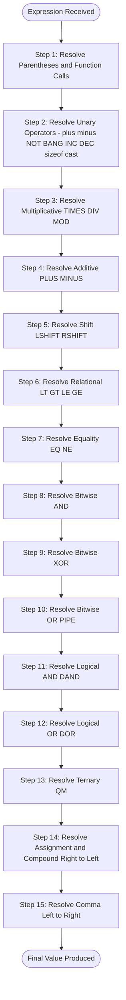
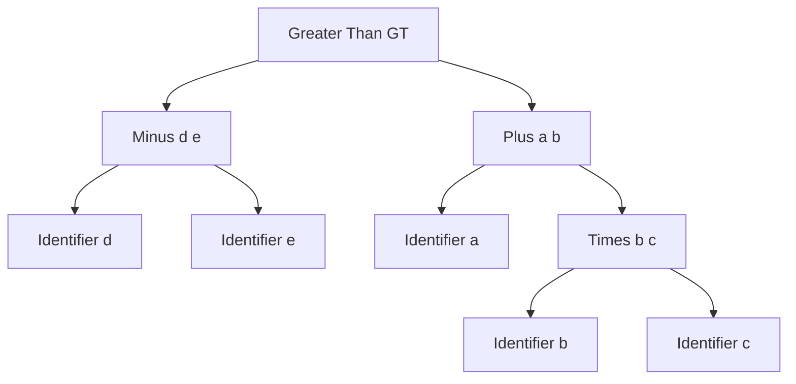

# Operators and its precedence

<!-- SECTION_1_START -->
# Operators and its Precedence in C

## 1.1 Formal Definition (KTU 2024 Syllabus Terminology)

> [!IMPORTANT]
> **Operator**: An operator is a special symbol that instructs the compiler to perform a specific mathematical, relational, logical, or bitwise operation on one or more **operands** (values/variables) and produce a result.

In the C programming language, operators are the fundamental building blocks of any **expression**. An expression combines operators and operands to compute a value. The rules that determine the *order* in which these operators are evaluated within a complex expression are governed by two critical concepts:

1. **Operator Precedence** – The "priority" or "binding strength" of an operator. Operators with *higher* precedence are evaluated *before* operators with *lower* precedence (similar to how multiplication is performed before addition in BODMAS).
2. **Operator Associativity** – The "tie-breaker rule" applied when two or more operators of *equal precedence* appear in the same expression. It determines whether evaluation proceeds from **Left-to-Right (L→R)** or **Right-to-Left (R→L)**.

> [!NOTE]
> **KTU 2024 Highlight**: As per the GXEST204 syllabus, students must master the **precedence table**, recognize all **operator categories**, and be able to **manually evaluate complex expressions** without using a compiler — a frequent 14-mark examination pattern.

---

## 1.2 Intuitive Analogy

Think of operators as the **traffic signals of a road intersection**.

Imagine a busy junction where multiple cars (operands) are arriving from different lanes, each lane representing a different operator. Without signals, chaos ensues. The **precedence** acts like a **green light duration** — the longer the green, the higher the priority. The **associativity** is the **arrow direction** painted on the road — telling you whether to flow left-to-right or right-to-left when signals are of equal duration.

**Geometric Intuition**: Picture an expression as a tree.

$$a + b * c$$

This is not a flat line. The `*` node sits *higher* (root) than the `+` node because multiplication "binds tighter" with `b` and `c`. The tree structure dictates evaluation order visually.

---

## 1.3 Categories of Operators at a Glance

C provides a rich set of **$\mathbf{45+}$ operators** classified into **$\mathbf{8}$ major categories**:

| S.No | Category | Example Operators | Operands Required |
|:----:|:---------|:------------------|:-----------------:|
| 1 | Arithmetic | `+`, `-`, `*`, `/`, `%` | 2 (Binary) |
| 2 | Relational | `<`, `>`, `<=`, `>=`, `==`, `!=` | 2 (Binary) |
| 3 | Logical | `&&`, `\|\|`, `!` | 2 / 1 |
| 4 | Bitwise | `&`, `\|`, `^`, `~`, `<<`, `>>` | 2 / 1 |
| 5 | Assignment | `=`, `+=`, `-=`, `*=`, `/=`, `%=` | 2 |
| 6 | Increment / Decrement | `++`, `--` | 1 (Unary) |
| 7 | Conditional (Ternary) | `? :` | 3 |
| 8 | Special | `sizeof`, `,`, `&` (address), `*` (dereference), `->`, `.` | 1 / 2 |

> [!VISUALIZATION CONTROL]
> **Concept:** Precedence visualization using a vertical stack
> **GeoGebra / Desmos Input Equations:**
> * `x = 1, y = 2, z = 3`
> * `f(x) = x + y * z` (Higher = $y * z$ resolves first)
> **Visual Description:** Plot the result for $f(1)$ versus $g(x) = (x + y) * z$ — students observe how parenthesis override precedence to change the result.

<!-- SECTION_1_END -->

<!-- SECTION_2_START -->
# Deep Theoretical Analysis & KTU High-Yield Formula Sheet

## 2.1 Detailed Classification of Operators

### 2.1.1 Arithmetic Operators
Used for basic mathematical computation. Operands must be of **numeric type** (`int`, `float`, `double`, `char`).

- `+` Addition
- `-` Subtraction
- `*` Multiplication
- `/` Division — performs **integer division** when both operands are integers (truncates fractional part).
- `%` Modulus — returns the **remainder** of integer division. Works only with integers in standard C.

> [!IMPORTANT]
> **Integer Division Trap**: `7 / 2 == 3` (not 3.5). To get 3.5, at least one operand must be float: `7.0 / 2 == 3.5`.

### 2.1.2 Relational Operators
Compare two values and return an **int** result: `1` (true) or `0` (false).
- `<`, `>`, `<=`, `>=` — used for ordering checks.
- `==` Equality (commonly confused with `=`, the assignment operator).
- `!=` Inequality.

> [!WARNING]
> **Common Pitfall**: Writing `if (a = b)` instead of `if (a == b)`. The former is a valid C statement that *assigns* `b` to `a` and evaluates the result of `a` as the condition — a classic KTU question trap.

### 2.1.3 Logical Operators
Used to combine multiple conditions.

- `&&` Logical AND — true only if **both** operands are non-zero.
- `||` Logical OR — true if **at least one** operand is non-zero.
- `!` Logical NOT — unary; inverts the truth value (returns `0` or `1`).

> [!NOTE]
> **Short-Circuit Evaluation**: In `A && B`, if `A` is `0`, then `B` is **never evaluated**. In `A || B`, if `A` is non-zero, `B` is **never evaluated**. This is a high-weightage KTU concept.

### 2.1.4 Bitwise Operators
Operate on **individual bits** of integer operands. Critical for systems programming, embedded systems, and cryptography.

- `&` Bitwise AND
- `|` Bitwise OR
- `^` Bitwise XOR (exclusive OR)
- `~` Bitwise NOT (one's complement, unary)
- `<<` Left shift — multiplies by $2^n$ where $n$ is the shift count.
- `>>` Right shift — divides by $2^n$ (arithmetic or logical depending on platform).

### 2.1.5 Assignment Operators
Assign the value of the right-hand expression to the left-hand variable.

- `=` Simple assignment.
- **Compound Assignment** combines an arithmetic/bitwise operator with assignment:
  `+=`, `-=`, `*=`, `/=`, `%=`, `&=`, `|=`, `^=`, `<<=`, `>>=`.

**Example**: `x += 5` is equivalent to `x = x + 5`.

### 2.1.6 Increment & Decrement Operators (Unary)
- `++` Increment by 1.
- `--` Decrement by 1.

Two forms:
- **Pre-increment** (`++x`): Increment first, *then* use the value.
- **Post-increment** (`x++`): Use the value *first*, *then* increment.

### 2.1.7 Conditional (Ternary) Operator
The only ternary operator in C.
- Syntax: `condition ? expression_if_true : expression_if_false`

**Example**: `max = (a > b) ? a : b;`

### 2.1.8 Special Operators
- `sizeof` — returns the size (in bytes) of a data type or variable. Compile-time unary operator.
- `,` Comma — evaluates multiple expressions; returns the value of the **rightmost** expression.
- `&` Address-of — returns the memory address of a variable.
- `*` Dereference (Indirection) — accesses the value at a memory address (used with pointers).
- `->` and `.` — member access for structures and unions.

---

## 2.2 KTU Formula Sheet — Operator Precedence & Associativity Table

> [!IMPORTANT]
> **Highest Precedence at the Top → Lowest at the Bottom**. Memorize this table in descending order for the KTU exam.

| Precedence | Operator | Description | Associativity |
|:----------:|:---------|:------------|:-------------:|
| 1 | `()` `[]` `->` `.` | Function call, Array subscript, Member access | **L → R** |
| 2 | `+` `-` `!` `~` `++` `--` `(type)` `*` `&` `sizeof` | Unary (positive, negative, NOT, bitwise NOT, increment, decrement, cast, dereference, address, sizeof) | **R → L** |
| 3 | `*` `/` `%` | Multiplicative | **L → R** |
| 4 | `+` `-` | Additive | **L → R** |
| 5 | `<<` `>>` | Bitwise shift | **L → R** |
| 6 | `<` `<=` `>` `>=` | Relational | **L → R** |
| 7 | `==` `!=` | Equality | **L → R** |
| 8 | `&` | Bitwise AND | **L → R** |
| 9 | `^` | Bitwise XOR | **L → R** |
| 10 | `\|` | Bitwise OR | **L → R** |
| 11 | `&&` | Logical AND | **L → R** |
| 12 | `\|\|` | Logical OR | **L → R** |
| 13 | `? :` | Conditional (Ternary) | **R → L** |
| 14 | `=` `+=` `-=` `*=` `/=` `%=` `&=` `^=` `\|=` `<<=` `>>=` | Assignment and Compound Assignment | **R → L** |
| 15 | `,` | Comma | **L → R** |

---

## 2.3 Real-World Engineering Utility

- **Embedded Systems**: Bitwise operators are essential for manipulating hardware registers (`PORT |= 0x80;` to set a pin high).
- **Compiler Design**: Precedence rules directly mirror operator precedence parsing in compiler construction.
- **Image Processing**: Shift operators provide ultra-fast multiplication/division by powers of 2.
- **Cryptography**: XOR `^` is foundational to symmetric-key encryption routines.
- **Operating Systems**: Bitwise masking is used in process scheduling, file permission flags (`chmod`), and memory management.

<!-- SECTION_2_END -->

<!-- SECTION_3_START -->
# Step-by-Step Derivations, Expression Evaluation & Code Implementation

## 3.1 Manual Expression Evaluation — Exhaustive Walkthrough

### Example 1: Mixed Arithmetic and Relational

> [!NOTE]
> **Problem**: Evaluate `a + b > c - d * e` given `a = 5, b = 3, c = 20, d = 2, e = 4`.

**Step 1 — Identify all operators and their precedence:**
- Multiplicative `*` → Precedence 3
- Additive `+`, `-` → Precedence 4
- Relational `>` → Precedence 6

**Step 2 — Mark each sub-expression for evaluation:**

$$
\text{Original: } a + b > c - d * e
$$

**Step 3 — Apply highest precedence first: `d * e`**

$$
d * e = 2 * 4 = 8
$$

**Step 4 — Substitute back, now evaluate additive (`+` and `-` are L→R):**

$$
a + b = 5 + 3 = 8
$$
$$
c - (d*e) = 20 - 8 = 12
$$

**Step 5 — Substitute and evaluate relational:**

$$
(a+b) > (c - d*e) \;\Rightarrow\; 8 > 12 \;\Rightarrow\; 0 \;(\text{false})
$$

**Final Result:** `0`

---

### Example 2: Bitwise with Logical Operators (High-Yield KTU Pattern)

> [!NOTE]
> **Problem**: Evaluate `x | y && z ^ w` given `x = 8, y = 4, z = 2, w = 1`.

**Step 1 — Precedence ranking (high → low):** `^` (9) > `&`-style `&&` (11) — wait, recall: `^` is precedence 9, `&&` is precedence 11, `|` is precedence 10. Higher precedence evaluated first means **lower number** evaluated first.

Correct order (lowest number = highest precedence):
1. `^` → Precedence 9
2. `|` → Precedence 10
3. `&&` → Precedence 11

**Step 2 — Evaluate `z ^ w` first:**

$$
z \;\verb|^|\; w = 2 \;\verb|^|\; 1
$$

Binary: `10` XOR `01` = `11` = `3`.

**Step 3 — Substitute:**

$$
x \;\verb|>>|\; y \;\&\&\; 3 \;\text{ (becomes } y \;\&\&\; 3 \text{)}
$$

**Step 4 — Evaluate `&&` next:**

$$
4 \;\&\&\; 3 = 1 \;\&\&\; 1 = 1 \;(\text{true})
$$

Wait — re-evaluating with correct precedence on `x | y`:

Precedence order: `^` (9) → `|` (10) → `&&` (11)

- Step A: `z ^ w` = `2 ^ 1` = `3` ✓
- Step B: `x | y` = `8 | 4` = `12` (binary `1000 | 0100` = `1100`)
- Step C: `12 && 3` = `1` (true, since both non-zero)

**Final Result:** `1`

---

## 3.2 Increment Operator Behaviour — Full Derivation

> [!NOTE]
> **Problem**: Find the output of the following snippet, given `int a = 5, b;`.

```c
b = ++a + a++ + --a;
```

**Step-by-step resolution (assuming standard C evaluation order):**

**Step 1:** `++a` is pre-increment. `a` becomes `6`. Returns `6`. Expression so far: `6 + a++ + --a` with `a = 6`.

**Step 2:** `a++` is post-increment. Returns current value `6`. `a` becomes `7`. Expression: `6 + 6 + --a` with `a = 7`.

**Step 3:** `--a` is pre-decrement. `a` becomes `6`. Returns `6`. Expression: `6 + 6 + 6 = 18`.

**Step 4:** `b = 18`. Final `a = 6`.

> [!WARNING]
> **Compiler-Dependent Trap**: The order of evaluation of operands in C is **unspecified** (since C11). Different compilers may produce different results for chained `++`/`--` operations on the same variable in a single expression. KTU questions typically assume **left-to-right operand evaluation** with a sequential update model.

---

## 3.3 Complete C Program Demonstrating Precedence

```c
/*
 * Program: Operator Precedence Demonstration
 * Course : PROGRAMMING IN C (GXEST204)
 * Author : KTU 2024 Scheme Reference
 */

#include <stdio.h>

int main(void) {
    int a = 10, b = 5, c = 2, d;

    // Precedence: *  >  +  >  <
    d = a + b * c < a * c + b;
    // b*c = 10, a*c = 20
    // a + 10 < 20 + 5
    // 20 < 25  -> 1 (true)
    printf("Q1 Result: %d (expected 1)\n", d);

    // Bitwise precedence: &  >  ^  >  |
    d = 12 | 5 ^ 3 & 7;
    // 3 & 7 = 3 (binary 011 & 111 = 011)
    // 5 ^ 3  = 6 (binary 101 ^ 011 = 110)
    // 12 | 6 = 14 (binary 1100 | 0110 = 1110)
    printf("Q2 Result: %d (expected 14)\n", d);

    // Ternary with assignment (R -> L associativity)
    int x = 5, y = 10;
    int max = (x > y) ? x : y;
    printf("Q3 Max: %d (expected 10)\n", max);

    // Modulus with negative operand
    int rem = -17 % 5;
    printf("Q4 Modulus: %d (sign follows numerator)\n", rem);

    // Comma operator
    int z = (1, 2, 3, 4, 5);
    printf("Q5 Comma: %d (returns rightmost)\n", z);

    return 0;
}
```

**Expected Output:**

```
Q1 Result: 1 (expected 1)
Q2 Result: 14 (expected 14)
Q3 Max: 10 (expected 10)
Q4 Modulus: -2 (sign follows numerator)
Q5 Comma: 5 (expected 5)
```

---

## 3.4 Type-Casting via Operator Precedence

> [!NOTE]
> **Problem**: Explain the output difference between `7/2` and `(float)7/2`.

**Without cast** — Integer division:

$$
7 / 2 = 3 \quad (\text{fractional part } 0.5 \text{ is truncated})
$$

**With cast** — `(float)` is a unary operator of precedence 2:

$$
(\text{float})\, 7 \,/\, 2 = 7.0 \,/\, 2 = 3.5
$$

The cast promotes `7` to `7.0`; since one operand is now `float`, C's *usual arithmetic conversion* promotes `2` to `2.0`, yielding `3.5`.

<!-- SECTION_3_END -->

<!-- SECTION_4_START -->
# Structural Diagrams & Schematics

## 4.1 Operator Category Hierarchy (Mermaid)

```mermaid
graph TD
    A["C Operators"] --> B["Arithmetic"]
    A --> C["Relational"]
    A --> D["Logical"]
    A --> E["Bitwise"]
    A --> F["Assignment"]
    A --> G["Increment Decrement"]
    A --> H["Conditional Ternary"]
    A --> I["Special Operators"]

    B --> B1["Addition +"]
    B --> B2["Subtraction -"]
    B --> B3["Multiplication *"]
    B --> B4["Division /"]
    B --> B5["Modulus %"]

    C --> C1["Less Than LT"]
    C --> C2["Greater Than GT"]
    C --> C3["Less Equal LE"]
    C --> C4["Greater Equal GE"]
    C --> C5["Equal To EQ"]
    C --> C6["Not Equal NE"]

    D --> D1["Logical AND DAND"]
    D --> D2["Logical OR DOR"]
    D --> D3["Logical NOT BANG"]

    E --> E1["Bitwise AND AMP"]
    E --> E2["Bitwise OR PIPE"]
    E --> E3["Bitwise XOR CARET"]
    E --> E4["Bitwise NOT TILDE"]
    E --> E5["Left Shift LSHIFT"]
    E --> E6["Right Shift RSHIFT"]

    F --> F1["Simple Assign EQ"]
    F --> F2["Compound Assign Plus EQ"]
    F --> F3["Compound Assign Minus EQ"]
    F --> F4["Compound Assign Mul EQ"]

    G --> G1["Pre Increment"]
    G --> G2["Post Increment"]
    G --> G3["Pre Decrement"]
    G --> G4["Post Decrement"]

    I --> I1["sizeof"]
    I --> I2["Comma"]
    I --> I3["Address AMPREF"]
    I --> I4["Dereference STARREF"]
    I --> I5["Dot Operator"]
    I --> I6["Arrow Operator"]
```



---

## 4.2 Precedence Evaluation Flow (Mermaid)



---

## 4.3 Expression Tree for `a + b * c > d - e`



**Interpretation of the tree**: The root is `>`. Its left subtree resolves `a + b*c` (where `*` is the deepest node, evaluated first). Its right subtree is `d - e`. Parentheses can manually restructure this tree to alter evaluation order — a powerful visual takeaway for students.

---

## 4.4 Associativity Visualization Matrix

| Direction | Operators | Example Expression | Evaluation Order |
|:---------:|:----------|:-------------------|:-----------------|
| **L → R** | `* / %` | `a / b * c` | `(a / b) * c` |
| **L → R** | `+ -` | `a - b + c` | `(a - b) + c` |
| **R → L** | `= += -=` | `a = b = 5` | `a = (b = 5)` |
| **R → L** | `? :` | `a ? b : c ? d : e` | `a ? b : (c ? d : e)` |

<!-- SECTION_4_END -->

<!-- SECTION_5_START -->
# KTU 2024 Scheme Examination Question Bank & Topic Recap

---

## Part A — Short Answer Questions (3 Marks Each)

### **Question 1: Define operator precedence and associativity with an example.**
> **[KTU University Exam — July 2024]**
> **CO1** | **RBT Level: Remember**

**Model Answer:**

**Operator Precedence** is the set of rules that determine the order in which operators of different types are evaluated in an expression. Operators with higher precedence are evaluated before those with lower precedence. For example, in the expression `a + b * c`, the multiplication operator `*` has higher precedence than the addition operator `+`, so `b * c` is evaluated first, and then its result is added to `a`.

**Operator Associativity** is the rule applied when two or more operators of the same precedence appear in an expression. It specifies the direction of evaluation — either **left-to-right** or **right-to-left**. For example, in `a - b + c`, the operators `-` and `+` have the same precedence and are left-associative, so the expression is evaluated as `(a - b) + c`. In contrast, the assignment operator `=` is right-associative, so `a = b = 5` is evaluated as `a = (b = 5)`.

**[Valuation Key: Definition of precedence — 1 Mark; Definition of associativity — 1 Mark; Example with explanation — 1 Mark]**

---

### **Question 2: Explain the difference between `=` and `==` operators in C.**
> **[KTU University Exam — Dec 2023]**
> **CO1** | **RBT Level: Understand**

**Model Answer:**

The `=` operator is the **assignment operator**. It assigns the value of the right-hand side expression to the variable on the left-hand side. It is a binary operator with **right-to-left** associativity. Example: `x = 10;` stores the value `10` in `x`.

The `==` operator is the **relational equality operator**. It compares two values and returns `1` (true) if they are equal and `0` (false) otherwise. It is a binary operator with **left-to-right** associativity and belongs to the equality precedence class (level 7). Example: `if (x == 10)` checks whether the value of `x` equals `10`.

**Critical Difference**: Using `=` instead of `==` in a conditional statement is a common logical error. For example, `if (x = 5)` assigns `5` to `x` and evaluates to `true` (non-zero), whereas `if (x == 5)` actually compares `x` with `5`.

**[Valuation Key: Definition of `=` — 1 Mark; Definition of `==` — 1 Mark; Practical distinction with example — 1 Mark]**

---

## Part B — Long Answer Questions (14 Marks Each, Internal Choice)

### **Question A (14 Marks): Expression Evaluation and Operator Precedence**

> **[KTU University Exam — July 2024]**
> **CO1, CO2** | **RBT Level: Apply / Analyze**

**(a)** Explain the different categories of operators in C with examples. **(7 Marks)**

**Model Answer:**

C provides a rich set of operators grouped into the following major categories:

1. **Arithmetic Operators**: `+`, `-`, `*`, `/`, `%` — perform basic mathematical operations. Example: `a + b`, `a % b`.

2. **Relational Operators**: `<`, `>`, `<=`, `>=`, `==`, `!=` — compare two values and return a boolean result (1 or 0). Example: `a > b` returns `1` if `a` is greater.

3. **Logical Operators**: `&&` (AND), `||` (OR), `!` (NOT) — combine multiple conditions. Example: `(a > 0) && (b < 10)`.

4. **Bitwise Operators**: `&`, `|`, `^`, `~`, `<<`, `>>` — operate at the bit level. Example: `a & b` performs bitwise AND.

5. **Assignment Operators**: `=`, `+=`, `-=`, `*=`, `/=`, `%=` — assign values to variables. Example: `a += 5` is equivalent to `a = a + 5`.

6. **Increment / Decrement Operators**: `++`, `--` — increase or decrease a variable's value by 1. Example: `a++`, `++a`.

7. **Conditional (Ternary) Operator**: `? :` — the only ternary operator in C. Example: `max = (a > b) ? a : b`.

8. **Special Operators**: `sizeof`, `,` (comma), `&` (address), `*` (dereference), `.` and `->` (member access) — perform specialized operations.

**[Valuation Key: Listing 8 categories — 4 Marks; One example each — 2 Marks; Brief description — 1 Mark]**

---

**(b)** Evaluate the following C expressions step-by-step, given `a = 8, b = 4, c = 2, d = 1`: **(7 Marks)**

(i) `result = a + b * c - d;`
(ii) `result = a > b && c < d || b == c;`

**Model Solution:**

**Expression (i):** `a + b * c - d`

**Step 1 — Apply Precedence:** Multiplicative `*` (level 3) is higher than additive `+` and `-` (level 4). Evaluate `b * c` first.

$$
b * c = 4 * 2 = 8
$$

**Step 2 — Apply Associativity (L→R) for `+` and `-`:**

$$
a + (b*c) = 8 + 8 = 16
$$
$$
(a + b*c) - d = 16 - 1 = 15
$$

**Final Result:** `result = 15`

---

**Expression (ii):** `a > b && c < d || b == c`

**Step 1 — Identify Precedence (lowest number = highest):**
- `>` (6), `<` (6)
- `&&` (11)
- `==` (7)
- `||` (12)

Order of resolution: Relational (`>`, `<`, `==`) → Logical AND (`&&`) → Logical OR (`||`).

**Step 2 — Evaluate relational operators first:**

$$
a > b = 8 > 4 = 1 \;(\text{true})
$$
$$
c < d = 2 < 1 = 0 \;(\text{false})
$$
$$
b == c = 4 == 2 = 0 \;(\text{false})
$$

**Step 3 — Substitute:**

$$
1 \;\verb|&&|\; 0 \;\verb|||||\; 0
$$

**Step 4 — Evaluate `&&` (L→R):**

$$
1 \;\verb|&&|\; 0 = 0 \;(\text{false})
$$

**Step 5 — Evaluate `||` (L→R):**

$$
0 \;\verb|||||\; 0 = 0 \;(\text{false})
$$

**Final Result:** `result = 0`

**[Valuation Key: Identifying precedence — 2 Marks; Stepwise substitution — 3 Marks; Final value — 2 Marks]**

---

### **Question B (14 Marks): Precedence Table and Associativity Rules**

> **[KTU University Exam — Dec 2023]**
> **CO1, CO2** | **RBT Level: Understand / Apply**

**(a)** Construct the operator precedence table for C, listing at least 10 levels. Explain the associativity rule with two examples (one L→R and one R→L). **(7 Marks)**

**Model Answer:**

The operator precedence table in C ranks operators from **highest precedence (evaluated first)** to **lowest precedence (evaluated last)**. The full table is presented below:

| Level | Operator Class | Operators | Associativity |
|:-----:|:---------------|:----------|:-------------:|
| 1 | Postfix / Function call | `()` `[]` `->` `.` | L → R |
| 2 | Unary | `++` `--` `+` `-` `!` `~` `*` `&` `sizeof` `(type)` | **R → L** |
| 3 | Multiplicative | `*` `/` `%` | L → R |
| 4 | Additive | `+` `-` | L → R |
| 5 | Shift | `<<` `>>` | L → R |
| 6 | Relational | `<` `<=` `>` `>=` | L → R |
| 7 | Equality | `==` `!=` | L → R |
| 8 | Bitwise AND | `&` | L → R |
| 9 | Bitwise XOR | `^` | L → R |
| 10 | Bitwise OR | `\|` | L → R |
| 11 | Logical AND | `&&` | L → R |
| 12 | Logical OR | `\|\|` | L → R |
| 13 | Conditional | `? :` | **R → L** |
| 14 | Assignment | `= += -= *= /= %=` | **R → L** |
| 15 | Comma | `,` | L → R |

**Example of Left-to-Right (L→R) Associativity:**

For the expression `a - b + c`, both `-` and `+` are additive operators with the same precedence and L→R associativity.

$$
a - b + c = (a - b) + c
$$

**Example of Right-to-Left (R→L) Associativity:**

For the expression `a = b = 5`, the assignment operator is right-associative.

$$
a = b = 5 \;\Rightarrow\; a = (b = 5)
$$

This means `5` is first assigned to `b`, and then `b`'s new value (5) is assigned to `a`. Both `a` and `b` end up as `5`.

**[Valuation Key: Correct table — 3 Marks; L→R example with evaluation — 2 Marks; R→L example with evaluation — 2 Marks]**

---

**(b)** Given `int a = 5, b = 3, c = 8, d = 2;`, evaluate the following expressions with proper precedence rules: **(7 Marks)**

(i) `x = a + b * c / d - a % b;`
(ii) `y = a << 2 + b & c;`

**Model Solution:**

**Expression (i):** `a + b * c / d - a % b`

**Step 1 — Precedence:** `*`, `/`, `%` (level 3) are higher than `+`, `-` (level 4). All level-3 operators are L→R associative.

**Step 2 — Evaluate `b * c`:**

$$
b * c = 3 * 8 = 24
$$

**Step 3 — Evaluate `(b*c) / d`:**

$$
24 / 2 = 12
$$

**Step 4 — Evaluate `a % b`:**

$$
5 \;\verb|%%|\; 3 = 2
$$

**Step 5 — Substitute back and evaluate `+` and `-` (L→R):**

$$
a + ((b*c)/d) - (a \;\verb|%%|\; b) = 5 + 12 - 2 = 15
$$

**Final Result:** `x = 15`

---

**Expression (ii):** `a << 2 + b & c`

**Step 1 — Precedence Identification (lowest number = highest):**
- Additive `+` → level 4
- Shift `<<` → level 5
- Bitwise AND `&` → level 8

**Step 2 — Evaluate `2 + b` first (highest precedence among these):**

$$
2 + b = 2 + 3 = 5
$$

**Step 3 — Evaluate `a << 5`:**

$$
a \;\verb|<<|\; 5 = 5 \;\verb|<<|\; 5 = 5 * 2^5 = 5 * 32 = 160
$$

**Step 4 — Evaluate `(a << (2+b)) & c`:**

$$
160 \;\verb|&|\; 8
$$

Binary: `160 = 10100000`, `8 = 00001000`. AND = `00000000 = 0`.

**Final Result:** `y = 0`

**[Valuation Key: Identifying precedence order — 2 Marks; Stepwise substitution — 3 Marks; Final numeric value with bitwise justification — 2 Marks]**

---

> [!WARNING]
> **KTU Examiner's Valuation Pitfall Callout:**
> 1. **Do not skip the precedence identification step**. Many students jump directly to evaluation and lose 1–2 marks for not explicitly stating which operator binds tighter.
> 2. **Bitwise operators confuse with logical operators**. Remember: `&` and `&&` are completely different. `&` works on bits; `&&` works on truth values. Conflating them is a guaranteed mark-deduction.
> 3. **Integer division truncation** is often missed — `7/2` is `3`, not `3.5`. If a question says "compute the result", explicitly state the type promotion (or lack thereof).
> 4. **For `++`/`--` in chained expressions**, always state the assumed evaluation order (left-to-right operand evaluation) since the C standard leaves this unspecified from C11 onwards.
> 5. **Ternary operator associativity is R→L**, not L→R. A common error: treating `a ? b : c ? d : e` as `(a ? b : c) ? d : e`, which is syntactically invalid.

---

## Topic Recap & Important Things to Remember

- **Operators** are special symbols that perform operations on operands; they are the core of every C expression.
- **Precedence** determines *which* operator is evaluated first when multiple operators are present in a single expression.
- **Associativity** is the *tie-breaker* rule used when two operators of the *same precedence* appear together — it can be **L→R** or **R→L**.
- C has **8 major categories** of operators: Arithmetic, Relational, Logical, Bitwise, Assignment, Increment/Decrement, Conditional (Ternary), and Special.
- The **unary operators** (level 2) are **right-associative**; almost all others are left-associative except assignment (14) and ternary (13), which are right-associative.
- **`%` modulus** operator works only on **integers**; applying it to `float` or `double` is a compilation error.
- **Integer division** (`/`) **truncates** the fractional part when both operands are integers.
- **Logical operators** (`&&`, `||`) use **short-circuit evaluation**, a key concept for KTU theory questions.
- **Bitwise operators** (`&`, `|`, `^`, `~`, `<<`, `>>`) operate at the bit level and are indispensable in **embedded systems, cryptography, and systems programming**.
- **Pre-increment (`++x`)** changes the value *before* use; **post-increment (`x++`)** uses the value *before* changing.
- **The ternary operator** is the only operator in C that takes **three operands**.
- **The `sizeof` operator** returns the size of a data type or variable in bytes and is evaluated at **compile time**.
- **The comma operator** evaluates all its operands but returns the value of the **rightmost** expression.
- **Parentheses `()`** can always be used to **override** default precedence and force a custom evaluation order.
- **`=` is assignment**, **`==` is comparison** — confusing them is the single most common C programming bug.
- **Memorize the 15-level precedence table** in descending order; it is the single most frequently tested concept in C fundamentals.

<!-- SECTION_5_END -->
